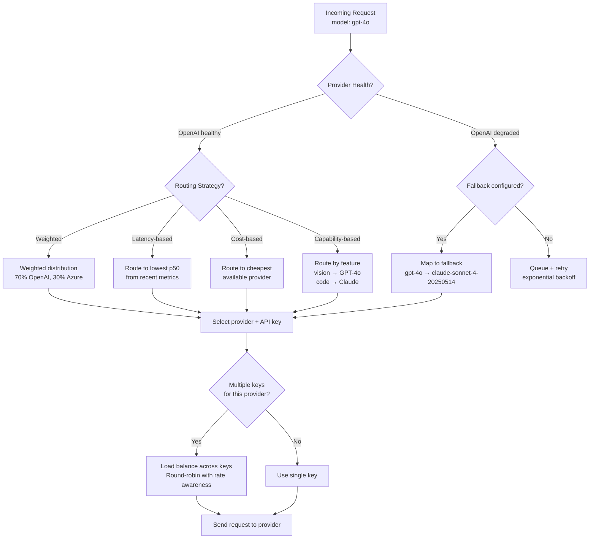

# GenAI Gateway Architecture

## 1. Overview

A GenAI gateway is a reverse proxy purpose-built for LLM API traffic. It sits between your applications and LLM providers (OpenAI, Anthropic, Google, Azure, self-hosted models), providing a unified API interface, multi-provider routing with automatic failover, request/response logging and observability, cost tracking and budgeting, caching (exact and semantic), rate limiting, guardrails enforcement, and authentication --- all in a single infrastructure layer that decouples your application code from the specifics of any individual LLM provider.

For Principal AI Architects, the GenAI gateway is an architectural necessity once an organization moves beyond a single application calling a single LLM provider. Without a gateway, every application independently handles API keys, retry logic, failover, cost tracking, and observability. Provider switches require code changes in every application. Rate limiting is per-application rather than organization-wide. Cost attribution is impossible. Observability is fragmented. The gateway centralizes these concerns, applying the same pattern that API gateways (Kong, Envoy, AWS API Gateway) brought to microservices --- but specialized for the unique characteristics of LLM traffic (streaming responses, token-based billing, prompt-level caching, content-aware routing).

**Key numbers that shape gateway architecture:**

- API key sprawl: A mid-size organization using GenAI across 10 applications may have 50+ API keys across 3--5 providers. Each key is a security surface and a billing silo.
- Provider outage frequency: Major LLM providers experience degradation 2--4 times per month (elevated latency, error rates, or partial outages). Without automatic failover, each incident impacts all downstream applications.
- Semantic cache hit rate: 20--50% for enterprise workloads with repetitive queries (customer support, documentation Q&A). Each cache hit saves the full cost of an LLM API call.
- Cost observability gap: Without centralized tracking, organizations routinely discover they are spending 2--5x more than expected on LLM APIs.
- Gateway overhead: A well-implemented gateway adds <10ms to request latency (excluding caching and guardrail checks). This is negligible compared to LLM inference latency (200ms--30s).
- Token-based cost model: LLM costs are proportional to input + output tokens, not request count. Cost optimization requires token-level metering that traditional API gateways do not provide.

---

## 2. Requirements

### Functional Requirements

| Requirement | Description |
|---|---|
| Unified API | Single API interface that normalizes requests/responses across all LLM providers (OpenAI, Anthropic, Google, Azure, local models). |
| Multi-provider routing | Route requests to different providers based on model capability, cost, latency, or availability. |
| Automatic failover | Detect provider degradation and failover to a backup provider within seconds. |
| Authentication | API key management with virtual keys (internal keys that map to provider keys). Per-team, per-app key scoping. |
| Rate limiting | Token-based and request-based rate limits. Per-user, per-team, per-application limits. |
| Cost tracking | Real-time token usage and cost attribution by team, application, model, and user. Budget alerts and hard caps. |
| Caching | Exact-match caching (identical prompts) and semantic caching (similar prompts). Configurable TTL. |
| Request/response logging | Full prompt and response logging with configurable retention. PII masking in logs. |
| Guardrails integration | Pre-request and post-response guardrail checks (content safety, PII detection, prompt injection). |
| Load balancing | Distribute requests across multiple API keys or endpoints for the same model. |
| Retry with backoff | Automatic retry for transient errors (429, 500, 503) with exponential backoff. |
| Streaming support | Transparent proxy for SSE streaming responses. |

### Non-Functional Requirements

| Requirement | Target | Rationale |
|---|---|---|
| Added latency (non-cached) | <10ms | Gateway must be invisible to the user experience. |
| Added latency (cache hit) | <50ms | Cache responses are faster than LLM inference. |
| Availability | 99.99% | The gateway is in the critical path of all LLM-powered features. |
| Throughput | 10K--100K requests/min | Enterprise-scale LLM traffic. |
| Streaming fidelity | Zero token loss | SSE streams must be proxied without dropping tokens. |
| Cost accuracy | <1% error | Billing and budget enforcement depend on accurate token counting. |

---

## 3. Architecture

### 3.1 GenAI Gateway Architecture

```mermaid
flowchart TB
    subgraph "Applications"
        APP1[Application 1<br/>Customer Support Bot]
        APP2[Application 2<br/>Code Assistant]
        APP3[Application 3<br/>Internal Search]
        APP4[Application N<br/>...]
    end

    subgraph "GenAI Gateway"
        INGRESS[Ingress<br/>Unified OpenAI-compatible API]
        AUTH_GW[Authentication<br/>Virtual key → provider key mapping]
        RL_GW[Rate Limiter<br/>Token + request budgets<br/>Per-user, per-team, per-app]
        CACHE_GW[Cache Layer<br/>Exact + semantic caching]

        subgraph "Pre-Processing"
            GUARD_IN[Input Guardrails<br/>Injection, toxicity, PII]
            TRANSFORM[Request Transformer<br/>Normalize to provider format]
            LOG_IN[Request Logger<br/>Prompt logging + PII masking]
        end

        subgraph "Routing Engine"
            ROUTER[Model Router<br/>Weighted, latency, cost,<br/>capability-based routing]
            FALLBACK[Fallback Controller<br/>Provider health monitoring<br/>Automatic failover]
            LB[Load Balancer<br/>Round-robin across API keys<br/>Least-connections]
        end

        subgraph "Post-Processing"
            GUARD_OUT[Output Guardrails<br/>Content filter, PII redaction]
            LOG_OUT[Response Logger<br/>Completion logging + metrics]
            METER[Token Metering<br/>Count input + output tokens<br/>Cost attribution]
        end
    end

    subgraph "LLM Providers"
        OPENAI[OpenAI<br/>GPT-4o, GPT-4o-mini, o-series]
        ANTHROPIC[Anthropic<br/>Claude Sonnet, Claude Haiku]
        GOOGLE[Google<br/>Gemini Pro, Gemini Flash]
        AZURE[Azure OpenAI<br/>GPT-4o (Azure-hosted)]
        LOCAL[Self-Hosted<br/>vLLM / TGI / Ollama<br/>Llama, Mistral]
    end

    subgraph "Observability"
        METRICS_DB[(Metrics Store<br/>Prometheus / ClickHouse)]
        DASH[Dashboard<br/>Cost, latency, usage, errors]
        ALERTS[Alerting<br/>Budget exceeded, provider down,<br/>error rate spike]
        LOG_STORE[(Log Store<br/>Elasticsearch / S3<br/>Full prompt/response audit)]
    end

    APP1 & APP2 & APP3 & APP4 --> INGRESS
    INGRESS --> AUTH_GW --> RL_GW --> CACHE_GW
    CACHE_GW -->|hit| LOG_OUT
    CACHE_GW -->|miss| GUARD_IN --> TRANSFORM --> LOG_IN
    LOG_IN --> ROUTER
    ROUTER --> FALLBACK --> LB

    LB --> OPENAI & ANTHROPIC & GOOGLE & AZURE & LOCAL

    OPENAI & ANTHROPIC & GOOGLE & AZURE & LOCAL --> GUARD_OUT
    GUARD_OUT --> LOG_OUT --> METER

    METER --> METRICS_DB
    LOG_IN & LOG_OUT --> LOG_STORE
    METRICS_DB --> DASH & ALERTS
```

### 3.2 Request Routing Decision Flow



---

## 4. Core Components

### 4.1 Unified API Interface

The gateway exposes a single API endpoint that accepts requests in a standardized format (typically OpenAI-compatible) and translates them to the target provider's format. This decouples applications from provider-specific API details.

**API normalization:**

Applications send requests to the gateway using the OpenAI Chat Completions format:

```json
POST /v1/chat/completions
{
  "model": "gpt-4o",
  "messages": [{"role": "user", "content": "Hello"}],
  "temperature": 0.7,
  "max_tokens": 1000,
  "stream": true
}
```

The gateway transforms this to the target provider's format:

| Provider | Transformation |
|---|---|
| OpenAI | Pass-through (native format) |
| Anthropic | Convert `messages` to Anthropic format, map `max_tokens` to `max_tokens`, extract system message |
| Google (Gemini) | Convert to `generateContent` format, map roles (`user`/`model`), convert parameters |
| Azure OpenAI | Rewrite URL to Azure endpoint format, add API version, use Azure API key |
| Self-hosted (vLLM) | Pass-through (vLLM is OpenAI-compatible), route to internal endpoint |

**Model aliasing:** The gateway supports model aliases that abstract provider-specific model names:

```yaml
model_aliases:
  "fast":        "gpt-4o-mini"        # Resolves to cheapest fast model
  "capable":     "claude-sonnet-4-20250514"   # Resolves to best reasoning model
  "code":        "claude-sonnet-4-20250514"   # Resolves to best code model
  "embedding":   "text-embedding-3-small"
```

Applications use aliases (`model: "fast"`) and the gateway resolves them to concrete models. This enables provider and model changes without application code changes.

### 4.2 Multi-Provider Routing

Routing is the gateway's core differentiator over a simple reverse proxy. The routing engine decides which provider and model to send each request to, based on configurable strategies.

**Routing strategies:**

**1. Weighted routing:** Distribute traffic across providers by weight. Example: 70% OpenAI, 30% Azure OpenAI. Useful for: gradual migration between providers, A/B testing model quality, distributing rate limit consumption.

**2. Latency-based routing:** Route to the provider with the lowest recent latency. The gateway maintains a sliding window of p50/p95 latency per provider/model combination. Useful for: latency-sensitive applications, avoiding temporarily degraded providers.

**3. Cost-based routing:** Route to the cheapest provider for the requested model class. The gateway maintains a pricing table and routes based on estimated cost (input tokens * input price + estimated output tokens * output price). Useful for: cost-constrained batch workloads, internal tools.

**4. Capability-based routing:** Route based on request features. Example: requests with images → GPT-4o (vision support), requests with `tools` → Claude Sonnet (strong tool use), requests with `response_format: json` → model with best structured output support. Useful for: multi-modal applications, feature-dependent routing.

**5. Priority-based routing with fallback:** Define a priority chain: try Provider A first; if it fails or is degraded, fall back to Provider B, then Provider C. Each level can have different models (GPT-4o → Claude Sonnet → Llama 3.1 70B self-hosted).

**Provider health monitoring:**

The gateway continuously monitors each provider's health:
- **Active probes:** Send lightweight health-check requests every 30s.
- **Passive monitoring:** Track error rates, latency, and timeout rates on production traffic.
- **Health classification:** Healthy (error rate <1%, latency within 2x baseline), degraded (error rate 1--10% or latency 2--5x), unhealthy (error rate >10% or latency >5x or timeout rate >5%).
- **Failover trigger:** When a provider transitions from healthy to degraded/unhealthy, the routing engine shifts traffic to fallback providers. When the provider recovers, traffic is gradually restored (not instantaneously, to avoid thundering herd).

### 4.3 Caching Layer

Caching is the highest-ROI feature of a GenAI gateway. A cache hit avoids the full LLM inference cost and latency --- returning a response in <50ms instead of 200ms--30s.

**Exact-match caching:** Hash the full request (model + messages + temperature + other parameters). If the hash matches a cached entry, return the cached response. Hit rate: 10--30% for enterprise workloads with repetitive queries.

**Semantic caching:** Embed the user's message and check for semantically similar previous queries (cosine similarity > threshold, typically 0.95). If a match is found, return the cached response. Hit rate: 20--50% for customer support and documentation Q&A workloads.

**Cache architecture:**

| Component | Implementation | Purpose |
|---|---|---|
| Exact cache | Redis (hash key → response) | Fast lookup for identical requests |
| Semantic cache | Vector store (Qdrant/Faiss) + Redis | Similarity-based lookup for paraphrased queries |
| Cache invalidation | TTL-based (1h--24h configurable) | Prevent stale responses |
| Cache scope | Per-model, per-temperature | Avoid returning low-temperature responses for high-temperature requests |

**Cache exclusions:** Do not cache: streaming responses (complexity of replaying streams), tool call responses (tool outputs may change), requests with `temperature > 0` and non-deterministic requirements, and requests that contain user-specific context (PII, personal data).

### 4.4 Authentication and Virtual Keys

The gateway manages a mapping between internal "virtual keys" (issued to teams and applications) and actual provider API keys. This provides:

- **Key isolation:** If a team's virtual key is compromised, revoke it without affecting other teams or rotating provider keys.
- **Per-key policies:** Rate limits, model access, cost budgets, and guardrail configuration are per virtual key.
- **Provider key rotation:** Rotate provider API keys in the gateway without notifying application teams.
- **Audit trail:** Every request is attributed to a virtual key, enabling per-team cost allocation and usage analytics.

**Virtual key model:**

```
VirtualKey {
    key_id: "vk_team-search_prod_abc123"
    team: "search-team"
    application: "enterprise-search"
    environment: "production"
    allowed_models: ["gpt-4o", "gpt-4o-mini", "claude-sonnet"]
    rate_limit: { requests_per_min: 1000, tokens_per_min: 500000 }
    budget: { monthly_limit_usd: 5000, alert_at: 4000 }
    provider_key_mapping: {
        "openai": "sk-prod-xxxxxxxx",
        "anthropic": "sk-ant-xxxxxxxx"
    }
}
```

### 4.5 Cost Tracking and Budgeting

LLM costs are proportional to token usage, which varies per request. Traditional API gateway billing (per-request) is meaningless for LLM traffic. The gateway must implement token-level metering.

**Token counting:**

The gateway counts tokens at two points:
1. **Pre-request (input tokens):** Tokenize the request using the target model's tokenizer (tiktoken for OpenAI, Anthropic's tokenizer for Claude). This enables pre-request budget checks.
2. **Post-response (output tokens):** Extract output token count from the provider's response headers or usage field.

**Cost attribution:**

```
Cost per request = (input_tokens × input_price_per_token) + (output_tokens × output_price_per_token)
```

Costs are attributed to: virtual key (team + application), model, provider, and timestamp. The gateway provides real-time dashboards showing cost breakdown by any of these dimensions.

**Budget enforcement:**

| Budget Type | Enforcement | Action on Exceed |
|---|---|---|
| Monthly budget per team | Pre-request check | Block request, return 429 with budget-exceeded message |
| Daily budget per application | Pre-request check | Block or route to cheaper model |
| Per-request cost limit | Pre-request estimate | Block requests estimated to exceed limit |
| Alert threshold | Post-request aggregation | Send alert (email, Slack, PagerDuty) |

### 4.6 Observability and Logging

The gateway provides comprehensive observability for all LLM traffic, filling the gap that standard APM tools cannot address (they do not understand tokens, prompts, or LLM-specific metrics).

**Metrics collected:**

| Metric | Granularity | Purpose |
|---|---|---|
| Request count | Per model, per provider, per virtual key | Traffic volume and distribution |
| Token usage (input/output) | Per request | Cost tracking and optimization |
| Latency (TTFT, total) | Per model, per provider | Performance monitoring, routing decisions |
| Error rate | Per provider, per model | Health monitoring, failover triggers |
| Cache hit rate | Per model, per cache type | Cache effectiveness |
| Guardrail block rate | Per guardrail type | Safety monitoring |
| Cost (USD) | Per team, per app, per model | Financial attribution |

**Prompt/response logging:**

Full prompt and response logging enables: debugging (why did the model produce that response?), evaluation (quality assessment on production traffic), compliance (audit trail for regulated industries), and fine-tuning data collection (human-annotated production data).

**PII masking in logs:** Prompts may contain user PII. The gateway applies PII detection (Presidio, regex) before writing to the log store. PII entities are masked: "My email is [EMAIL_REDACTED]". The raw prompt is discarded; only the masked version is persisted.

---

## 5. Data Flow

### Request Lifecycle (Step by Step)

1. **Application sends request.** The application sends an OpenAI-compatible request to the gateway endpoint with a virtual key in the `Authorization` header.

2. **Authentication.** The gateway validates the virtual key. Extracts team, application, and policy configuration (allowed models, rate limits, budget).

3. **Rate limiting.** Check token and request rate limits for this virtual key. If exceeded, return 429 with retry-after header.

4. **Cache check.** Compute the request hash (exact cache) and embed the user message (semantic cache). If either cache hits, return the cached response immediately (skip steps 5--11).

5. **Input guardrails (optional).** If configured for this virtual key, run input moderation checks (toxicity, injection, PII). If blocked, return a policy violation response.

6. **Request transformation.** Normalize the request from OpenAI format to the target provider's format. Resolve model aliases to concrete model names. Inject provider API key.

7. **Request logging.** Log the request (with PII masking) to the log store. Record request metadata (virtual key, model, estimated tokens, timestamp).

8. **Routing decision.** The routing engine selects a provider based on the configured strategy (weighted, latency-based, cost-based) and current provider health. If the selected provider is unhealthy, fall back to the next provider in the chain.

9. **Load balancing.** If multiple API keys exist for the selected provider, distribute using round-robin with rate-limit awareness.

10. **Provider request.** Send the transformed request to the selected provider. For streaming requests, establish an SSE connection and proxy tokens as they arrive.

11. **Output guardrails (optional).** If configured, run output moderation checks on the response. For streaming, check accumulated sentence buffers.

12. **Response logging.** Log the response (with PII masking). Record response metadata (output tokens, latency, provider, model).

13. **Token metering.** Count input and output tokens. Compute cost. Update the virtual key's usage counters and budget tracking.

14. **Cache update.** If the request is cacheable (deterministic, no tools, no user-specific context), store the response in the cache with the configured TTL.

15. **Response delivery.** Return the response to the application in the normalized format.

---

## 6. Key Design Decisions / Tradeoffs

### Gateway Implementation Selection

| Gateway | Type | Unified API | Routing | Caching | Guardrails | Cost Tracking | Self-Hosted | Best For |
|---|---|---|---|---|---|---|---|---|
| **LiteLLM** | Open-source proxy | 100+ models | Weighted, latency, cost | Redis | Via callbacks | Token counting | Yes | Teams wanting full control, broad model support |
| **Portkey** | SaaS + self-hosted | 200+ models | Weighted, fallback, conditional | Exact + semantic | Built-in | Detailed dashboard | Optional | Enterprise teams, strong observability |
| **Kong AI Gateway** | Plugin for Kong | Via plugins | Kong routing | Kong cache | Plugin ecosystem | Via plugins | Yes | Orgs already using Kong |
| **Cloudflare AI Gateway** | SaaS (edge) | Major providers | Cloudflare routing | Edge cache | Basic | Token counting | No (SaaS) | Edge-first, Cloudflare ecosystem |
| **AWS Bedrock** | Managed service | AWS models + partners | Bedrock routing | Limited | Via Guardrails for Bedrock | CloudWatch | N/A (managed) | AWS-native organizations |
| **Custom** | Self-built | Full control | Full control | Full control | Full control | Full control | Yes | Specific requirements, large engineering teams |

### Routing Strategy Selection

| Strategy | Optimization Target | Complexity | Data Required | Best For |
|---|---|---|---|---|
| Weighted | Traffic distribution | Low | Static weights | Gradual migration, A/B testing |
| Latency-based | Response time | Medium | Real-time latency metrics | User-facing applications |
| Cost-based | Dollar spend | Medium | Pricing table + token estimates | Batch processing, internal tools |
| Capability-based | Feature matching | Medium | Model capability matrix | Multi-modal, diverse workloads |
| Priority with fallback | Reliability | Low | Provider health status | Production systems requiring high availability |

### Caching Strategy

| Cache Type | Hit Rate | Latency | Storage | Accuracy | Best For |
|---|---|---|---|---|---|
| None | 0% | 0ms overhead | None | N/A | Non-repetitive workloads |
| Exact match | 10--30% | <5ms | Redis (low) | 100% (identical request) | Deterministic queries, APIs |
| Semantic (cosine > 0.95) | 20--50% | 20--50ms | Vector DB + Redis | 95--99% | Customer support, Q&A |
| Semantic (cosine > 0.90) | 30--60% | 20--50ms | Vector DB + Redis | 85--95% (more false hits) | Cost-optimized, low-stakes |

### Deployment Model

| Model | Latency | Control | Ops Overhead | Security | Best For |
|---|---|---|---|---|---|
| SaaS (Portkey, Cloudflare) | 5--20ms (extra hop) | Limited | None | Data passes through vendor | Quick start, small teams |
| Self-hosted (LiteLLM, custom) | <5ms (same network) | Full | Medium--High | Full data control | Enterprise, regulated industries |
| Sidecar (per-application) | <1ms | Full | High (N instances) | Full isolation | Service mesh architectures |
| Managed cloud (Bedrock) | <10ms | Limited | None | AWS-managed | AWS-native architectures |

---

## 7. Failure Modes

### 7.1 Gateway Becomes Single Point of Failure

**Symptom:** Gateway outage takes down all LLM-powered features across the organization.

**Root cause:** The gateway is deployed as a single instance without redundancy.

**Mitigation:** Deploy the gateway with redundancy: multiple instances behind a load balancer, health checks with automatic instance replacement, and a "bypass mode" where applications can directly call providers if the gateway is unreachable (with degraded functionality). The gateway itself should be stateless (all state in Redis/database) to enable horizontal scaling.

### 7.2 Provider Failover Cascade

**Symptom:** Primary provider goes down. All traffic shifts to the secondary provider, which is overwhelmed by the sudden load spike and also degrades.

**Root cause:** The secondary provider is not provisioned for full traffic load. Or the secondary provider rate-limits the sudden traffic increase.

**Mitigation:** Pre-warm the secondary provider's rate limits (maintain a small percentage of traffic to the secondary at all times, e.g., 10%). Implement gradual failover (shift 20% of traffic, wait, shift more) rather than instant 100% failover. Configure request queuing with backpressure during failover transitions.

### 7.3 Cache Poisoning

**Symptom:** Incorrect or stale responses served to users from the cache.

**Root cause:** A request that should not have been cached (user-specific context, non-deterministic) was cached. Or the cache TTL is too long and the underlying data has changed.

**Mitigation:** Strict cache eligibility criteria: only cache deterministic requests (temperature=0), exclude requests with user-specific context, and exclude tool call requests. Short TTLs (1--4 hours). Cache invalidation hooks when underlying knowledge bases change.

### 7.4 Token Count Mismatch

**Symptom:** Cost tracking shows different numbers than provider invoices. Budget enforcement is inaccurate.

**Root cause:** The gateway's tokenizer does not exactly match the provider's tokenizer. Different tokenizers produce different token counts for the same text (5--15% variance in edge cases).

**Mitigation:** Use the exact tokenizer for each provider (tiktoken for OpenAI, Anthropic's tokenizer for Claude). Reconcile gateway-counted tokens with provider-reported tokens (from response `usage` field). Alert on >2% discrepancy.

### 7.5 Streaming Response Corruption

**Symptom:** Clients receive garbled or incomplete streaming responses. Tokens are missing or duplicated.

**Root cause:** The gateway's SSE proxy mishandles chunked encoding, buffer flushes, or connection keep-alive. Or the gateway modifies the stream (guardrails, logging) in a way that corrupts the SSE framing.

**Mitigation:** Implement SSE proxying as a byte-level pass-through for the streaming body. Guardrails and logging should tap the stream (read and copy) rather than intercept and re-emit. Comprehensive integration tests for streaming responses of varying lengths, including edge cases (empty chunks, multi-byte characters split across chunks).

---

## 8. Real-World Examples

### LiteLLM

LiteLLM is the most widely adopted open-source GenAI gateway, providing a unified interface for 100+ LLM models across all major providers. Key architecture: a Python proxy server that normalizes requests to/from the OpenAI format, supports weighted routing and fallback across providers, integrates with Redis for caching and rate limiting, provides a virtual key system for team-level cost tracking, and supports callbacks for logging to any observability platform. LiteLLM is deployed as a Docker container or Kubernetes service. It serves as the gateway layer for many enterprise LLM deployments, including companies using it to manage multi-provider routing and cost control. Limitations: Python-based (not ideal for ultra-high-throughput), limited built-in guardrails (relies on callbacks).

### Portkey

Portkey is a commercial GenAI gateway offering both SaaS and self-hosted deployment. Key features: a sophisticated routing engine with weighted, fallback, conditional, and load-balanced routing, built-in guardrails (content safety, PII detection), semantic caching with configurable similarity thresholds, detailed cost and performance dashboards, virtual keys with per-key policies, and prompt management (version and deploy prompts independently of application code). Portkey's architectural differentiator is the "AI gateway as an observability platform" --- it provides deep visibility into every LLM request, enabling teams to optimize cost, latency, and quality from a single dashboard. Used by enterprise teams including Fortune 500 companies for production LLM traffic management.

### Cloudflare AI Gateway

Cloudflare AI Gateway runs at the edge (Cloudflare's global network of 300+ data centers), providing: edge-level caching for LLM responses (reducing latency for geographically distributed users), real-time logging and analytics, rate limiting per user/application, and support for major LLM providers (OpenAI, Anthropic, Google, Azure). The edge deployment model means the gateway adds minimal latency (requests are intercepted at the nearest edge node) and provides DDoS protection by default. Limitations: SaaS-only (no self-hosted option), limited routing logic compared to LiteLLM/Portkey, basic caching (no semantic cache).

### Kong AI Gateway

Kong, the established API gateway, added AI-specific plugins: AI Proxy (multi-provider routing), AI Rate Limiting (token-based), AI Request Transformer (prompt engineering), AI Response Transformer (output processing), and AI Prompt Guard (injection detection). The advantage is integration with Kong's existing ecosystem (authentication, logging, monitoring, service mesh). Organizations already using Kong can add LLM gateway capabilities without deploying a separate infrastructure layer. The AI plugins handle provider-specific transformations, token counting, and streaming support within Kong's plugin architecture.

### AWS Bedrock (Managed Gateway)

AWS Bedrock is a managed service that functions as a GenAI gateway within the AWS ecosystem. It provides: access to models from multiple providers (Anthropic, Meta, Mistral, Cohere, Stability, Amazon Titan) through a unified API, built-in guardrails (Guardrails for Bedrock with configurable content filters), model evaluation and comparison tools, provisioned throughput for consistent latency, and native integration with AWS services (IAM, CloudWatch, CloudTrail, S3). Bedrock abstracts the gateway pattern into a managed service --- no infrastructure to deploy or manage. Limitations: AWS-only providers (no OpenAI), limited routing flexibility, vendor lock-in.

---

## 9. Related Topics

- [Model Routing](../11-performance/04-model-routing.md) --- Deep dive into routing strategies: weighted, latency-based, cost-based, and capability-based routing logic.
- [Cost Optimization](../11-performance/03-cost-optimization.md) --- Token budgeting, model tiering, prompt compression, and caching strategies for controlling LLM costs.
- [Latency Optimization](../11-performance/01-latency-optimization.md) --- End-to-end latency analysis, TTFT optimization, and caching's role in reducing perceived latency.
- [Guardrails](../10-safety/01-guardrails.md) --- Input and output moderation frameworks integrated at the gateway layer.
- [Model Serving](../02-llm-architecture/01-model-serving.md) --- Self-hosted inference endpoints that the gateway routes to alongside cloud providers.
- [LLM Observability](../09-evaluation/04-llm-observability.md) --- Tracing, logging, and monitoring for LLM requests that the gateway feeds into.
- [API Gateway](../../traditional-system-design/06-architecture/01-api-gateway.md) --- Traditional API gateway patterns (Kong, Envoy, AWS API Gateway) that GenAI gateways extend with LLM-specific features.

---

## 10. Source Traceability

| Concept | Primary Source |
|---|---|
| LiteLLM | LiteLLM, "LiteLLM: Call all LLM APIs using the OpenAI format" (GitHub, 2023--present) |
| Portkey AI Gateway | Portkey, "AI Gateway" documentation (2024--present) |
| Cloudflare AI Gateway | Cloudflare, "AI Gateway" documentation (2024--present) |
| Kong AI Gateway | Kong, "Kong AI Gateway" documentation (2024--present) |
| AWS Bedrock | AWS, "Amazon Bedrock" documentation (2023--present) |
| Semantic caching | GPTCache (Zilliz), "GPTCache: LLM Response Cache" (GitHub, 2023); Portkey semantic cache documentation |
| OpenAI API format | OpenAI, "Chat Completions API Reference" (2023--present) |
| Anthropic API format | Anthropic, "Messages API Reference" (2024--present) |
| API gateway patterns | Richardson, "Microservices Patterns" (Manning, 2018); Kong, "API Gateway vs. Service Mesh" (2023) |
| Token counting | OpenAI, "Tiktoken" tokenizer library (GitHub, 2023); Anthropic tokenizer documentation |
| Rate limiting patterns | Cloudflare, "How Rate Limiting Works" (2023); Token bucket algorithm |
| Circuit breaker pattern | Nygard, "Release It!" (2007); Netflix Hystrix documentation |
