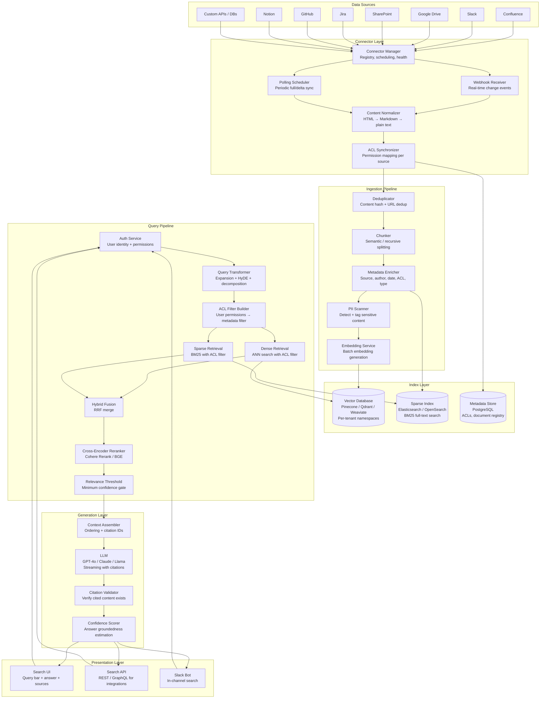
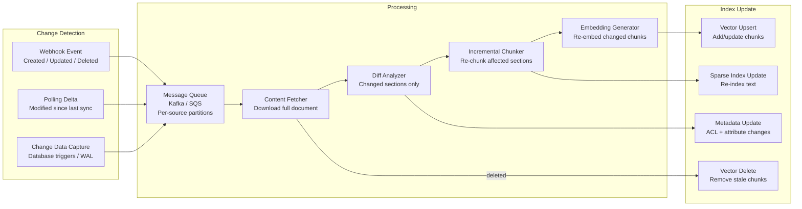

# Enterprise Search with GenAI

## 1. Overview

Enterprise search with GenAI is the system that makes an organization's collective knowledge queryable through natural language. It connects to dozens of data sources (Confluence, Slack, Google Drive, SharePoint, Jira, GitHub, email, databases), ingests and indexes content continuously, enforces per-user access control on every query, retrieves relevant documents using hybrid search, and generates a synthesized answer with source citations --- all within a latency budget that makes it feel like asking a knowledgeable colleague.

For Principal AI Architects, enterprise search is the hardest RAG variant to build at production quality because it introduces three challenges that academic RAG pipelines do not face: **multi-tenancy** (data isolation between organizations, departments, and users), **access control** (a user must only see documents they are authorized to access, enforced at retrieval time, not just at generation time), and **connector sprawl** (each data source has a different API, authentication scheme, rate limit, and content format). The LLM generation layer is the easy part; the hard part is the data infrastructure that feeds it.

**Key numbers that shape enterprise search architecture:**

- Typical enterprise corpus: 1M--100M documents across 10--30 data sources.
- Incremental indexing latency: New documents should be searchable within 5--60 minutes of creation/modification. Real-time sync (<5 min) via webhooks; batch sync via polling for sources without webhook support.
- Query latency (end-to-end): <3s for answer generation including retrieval. Users expect near-instant results for factual lookups.
- Access control evaluation: <50ms per query. ACL filtering must not dominate retrieval latency.
- Index size: ~1KB per document chunk (768-dim float32 embedding + metadata). A 10M-chunk index requires ~10GB of vector storage.
- Answer accuracy (with citations): 75--85% faithfulness on enterprise corpora with Advanced RAG (hybrid retrieval + reranking + citation injection). Below 75%, users lose trust; above 85%, users begin to rely on answers without verifying sources.
- Connector maintenance cost: Each data source connector requires ongoing maintenance as APIs change. Plan for 2--4 engineering days per connector per quarter.
- Multi-tenant isolation overhead: Namespace-per-tenant in vector databases adds ~5% storage overhead. Per-query metadata filtering adds <10ms.

---

## 2. Requirements

### Functional Requirements

| Requirement | Description |
|---|---|
| Natural language Q&A | Users ask questions in plain English and receive synthesized answers with source citations. |
| Multi-source search | Search across all connected data sources simultaneously. Results are unified and ranked. |
| Access control | Users only see documents they have permission to access. ACLs from source systems are enforced at query time. |
| Source connectors | Connect to Confluence, Slack, Google Drive, SharePoint, Jira, GitHub, Notion, email, databases, and custom APIs. |
| Incremental indexing | New and modified documents are indexed within minutes of creation. Deleted documents are removed from the index. |
| Citation and attribution | Every generated answer includes clickable citations to the source documents and passages. |
| Confidence scoring | The system indicates confidence in its answer. Low-confidence answers are flagged or hedged. |
| Filters and facets | Users can filter results by source, date, author, team, document type. |
| Feedback loop | Users can rate answer quality (thumbs up/down), which feeds into relevance tuning. |

### Non-Functional Requirements

| Requirement | Target | Rationale |
|---|---|---|
| Query latency (p50) | <2s | Comparable to Google search expectations. |
| Query latency (p99) | <5s | Tail latency acceptable for complex synthesis queries. |
| Indexing freshness | <15 min for webhook sources, <60 min for polled sources | Users expect recently created documents to be searchable. |
| Availability | 99.9% | Search is a productivity tool; downtime blocks work. |
| Data isolation | Zero cross-tenant data leakage | Compliance requirement for multi-tenant SaaS. |
| Scale | 100M+ documents, 10K+ concurrent queries | Enterprise-grade capacity. |

---

## 3. Architecture

### 3.1 End-to-End Enterprise Search Architecture



### 3.2 Incremental Indexing Pipeline



---

## 4. Core Components

### 4.1 Data Connectors

Each data source connector must handle: authentication (OAuth2, API keys, service accounts), content extraction (HTML, PDF, rich text → plain text), metadata extraction (author, date, permissions, tags), change detection (webhooks, delta polling, last-modified timestamps), rate limiting (respect API rate limits, implement backoff), and error handling (transient failures, revoked credentials, schema changes).

**Connector matrix:**

| Source | Auth Method | Content Format | Change Detection | ACL Model | Complexity |
|---|---|---|---|---|---|
| Confluence | OAuth2 / API token | HTML with macros | Webhooks + REST delta | Space + page permissions | Medium |
| Slack | Bot token (OAuth2) | Rich text (mrkdwn) | Events API (real-time) | Channel membership | Medium |
| Google Drive | OAuth2 (service account) | Docs, Sheets, PDF, etc. | Push notifications / Changes API | File-level ACL, shared drives | High |
| SharePoint | Azure AD (MSAL) | ASPX pages, Office docs | Graph API webhooks | SharePoint permissions (complex hierarchy) | High |
| Jira | OAuth2 / API token | Rich text (ADF format) | Webhooks | Project + issue-level permissions | Medium |
| GitHub | GitHub App / OAuth | Markdown, code, issues, PRs | Webhooks (granular events) | Repo + org permissions | Medium |
| Notion | OAuth (integration) | Notion blocks (JSON) | Polling (no webhooks as of 2025) | Page-level sharing | Low |
| Email (Gmail/O365) | OAuth2 | MIME / HTML | Graph API / Gmail push | Mailbox ownership + delegation | High |

**Connector architecture pattern:**

Each connector is a standalone service (or a plugin in a connector framework) that implements a common interface:

```
interface Connector {
    authenticate(): Credentials
    listDocuments(since: timestamp): Document[]
    getDocument(id: string): DocumentContent
    getPermissions(id: string): ACL
    subscribeToChanges(callback: ChangeEvent => void): Subscription
}
```

Connector health is monitored centrally. If a connector fails (revoked credentials, API deprecation), the system alerts the admin and continues serving results from other sources.

### 4.2 Access Control in RAG

Access control is the single most critical correctness requirement in enterprise search. A user must never see content they are not authorized to access --- not in search results, not in AI-generated answers, not in citations. A single ACL violation can be a fireable offense in regulated industries.

**ACL enforcement architecture:**

1. **Permission sync (offline):** When documents are indexed, their ACLs are fetched from the source system and stored as metadata on each chunk. ACLs are represented as a set of authorized identities (users, groups, roles).

2. **Identity mapping:** Enterprise identities span multiple systems. User `jsmith@company.com` in Google Workspace may be `john.smith` in Confluence and a member of `eng-team` in Slack. An identity mapping layer resolves these to a canonical user identity and group memberships.

3. **Query-time ACL filtering:** On every query, the system:
   - Authenticates the user and resolves their canonical identity + all group memberships.
   - Constructs a metadata filter: `authorized_users CONTAINS user_id OR authorized_groups INTERSECTS user_groups`.
   - Applies this filter to both dense and sparse retrieval. The vector database and sparse index enforce the filter during search, not after.

4. **Defense in depth:** Even after retrieval, a post-retrieval ACL check re-verifies permissions on each retrieved chunk. This catches stale ACL metadata (permission revoked after indexing).

**ACL metadata schema (per chunk):**

```json
{
  "doc_id": "confluence-12345",
  "chunk_id": "confluence-12345-chunk-3",
  "source": "confluence",
  "authorized_users": ["user:jsmith", "user:mjones"],
  "authorized_groups": ["group:engineering", "group:all-staff"],
  "visibility": "restricted",
  "last_acl_sync": "2026-03-20T10:00:00Z"
}
```

**ACL staleness problem:** When a document's permissions change in the source system, the index metadata becomes stale. A user who was just removed from a Confluence space might still see results from that space until the ACL is re-synced. Mitigation: periodic ACL refresh (every 15--60 minutes) independent of content changes. For high-sensitivity content, real-time ACL sync via webhooks.

### 4.3 Multi-Tenant Architecture

Enterprise search platforms serve multiple organizations (tenants). Data isolation between tenants is a non-negotiable requirement.

**Isolation strategies:**

| Strategy | Isolation Level | Operational Overhead | Performance Impact | Best For |
|---|---|---|---|---|
| **Namespace per tenant** | Strong (logical) | Low (shared infrastructure) | <5% (metadata filter on every query) | SaaS platforms, most enterprises |
| **Index per tenant** | Strongest | High (N indexes to manage) | None (queries hit only their index) | Regulated industries, very large tenants |
| **Collection per tenant** | Strong (logical) | Medium | Minimal | Qdrant, Weaviate native collections |
| **Metadata filter** | Moderate | Lowest | <10ms per query | Small-scale, prototype |

**Namespace isolation (recommended default):** Vector databases like Pinecone and Qdrant support namespaces. Each tenant's chunks are stored in a separate namespace. Queries are scoped to the tenant's namespace automatically. The infrastructure is shared (single cluster), but data paths are completely isolated.

**Tenant-aware query pipeline:** Every query carries a `tenant_id` extracted from the authenticated user's session. This `tenant_id` is injected into every retrieval call, every ACL lookup, and every LLM context assembly. There is no code path where a query can accidentally cross tenant boundaries.

### 4.4 Answer Generation with Citations

The generation layer must produce answers that are: (a) grounded in the retrieved documents (not hallucinated), (b) attributed to specific sources with clickable citations, and (c) honest about uncertainty when evidence is insufficient.

**Citation injection pattern:**

1. **Assign reference IDs.** After retrieval and reranking, assign each chunk a reference ID (`[1]`, `[2]`, ..., `[N]`).

2. **Prompt template:**

```
Answer the user's question based ONLY on the following sources.
Cite your sources using [N] notation after each claim.
If the sources do not contain enough information, say so.

Sources:
[1] {chunk_1_title} — {chunk_1_text}
[2] {chunk_2_title} — {chunk_2_text}
...

Question: {user_query}
```

3. **Post-processing.** Parse the generated answer for citation markers (`[1]`, `[2]`). Validate that each citation ID exists in the source set. Validate that the cited content actually supports the claim (optional: NLI-based groundedness check). Render citations as clickable links to the source document.

**Confidence scoring:**

The system estimates answer confidence based on:
- **Retrieval score distribution:** If the top-ranked chunks all have high relevance scores (>0.8 reranker score), confidence is higher. If scores are clustered near 0.5, retrieval was uncertain.
- **Source agreement:** If multiple sources support the same answer, confidence is higher. Conflicting sources lower confidence.
- **LLM self-assessment:** Ask the model to rate its own confidence (0--1). While imperfect, this correlates with accuracy when combined with retrieval signals.

Low-confidence answers are prefixed with a hedge: "Based on available information, ..." or "I found limited relevant content. Here is what I found: ..."

### 4.5 Incremental Indexing

Enterprise search must keep its index fresh as documents are created, modified, and deleted across all connected sources. Full re-indexing is prohibitively expensive (hours for millions of documents) and must only be done as a recovery mechanism, not a routine operation.

**Change detection methods:**

| Method | Latency | Reliability | Source Support |
|---|---|---|---|
| **Webhooks** | Seconds | High (event-driven) | Confluence, Slack, Jira, GitHub, SharePoint |
| **Delta polling** | Minutes | Medium (polling interval) | All sources with "modified since" API |
| **Change Data Capture** | Seconds | High | Databases with CDC support |
| **Full resync** | Hours | Highest (catches everything) | Fallback for all sources |

**Processing pipeline:**

1. **Change event arrives** (webhook or poll result). Contains `document_id`, `change_type` (created/updated/deleted), `timestamp`.
2. **Fetch full content.** Download the current version of the document from the source.
3. **Diff against previous version.** Compare with the stored previous version. Identify changed sections.
4. **Re-chunk changed sections.** Only re-chunk the sections that changed, preserving chunk IDs for unchanged sections.
5. **Re-embed changed chunks.** Generate new embeddings only for changed chunks. Unchanged chunks retain their existing embeddings.
6. **Upsert to indexes.** Update both vector and sparse indexes. Update metadata if ACLs or attributes changed.
7. **Handle deletes.** Remove all chunks belonging to deleted documents from all indexes.

**Efficiency:** For a typical update (small edit to a 10-page document), incremental indexing processes ~5--20 chunks in <30 seconds, compared to 500+ chunks for full re-ingestion.

---

## 5. Data Flow

### Query Lifecycle (Step by Step)

1. **User submits query.** "What is our policy on remote work for international employees?" submitted via search UI, Slack bot, or API.

2. **Authentication.** The auth service validates the user's session token. Resolves: `user_id`, `tenant_id`, group memberships (`[engineering, us-office, all-employees]`), and source-system permission mappings.

3. **Query transformation.** The query transformer:
   - Expands: "remote work policy international employees" (keyword expansion for sparse search).
   - Generates HyDE hypothesis: "The company's remote work policy for international employees covers visa requirements, tax implications, time zone expectations..." (hypothetical answer for dense search).
   - Decomposes (if complex): "What is the remote work policy?" + "Does it differ for international employees?"

4. **ACL filter construction.** The ACL filter builder creates a metadata filter based on the user's permissions: `(tenant_id = "acme-corp") AND (authorized_users CONTAINS "user:jsmith" OR authorized_groups INTERSECTS ["engineering", "all-employees"])`.

5. **Parallel retrieval.** Dense retrieval (ANN search on vector index with ACL filter, top-20) and sparse retrieval (BM25 on text index with ACL filter, top-20) run concurrently.

6. **Hybrid fusion.** Results from dense and sparse retrieval are merged using Reciprocal Rank Fusion (RRF). Duplicates are deduplicated by chunk ID.

7. **Reranking.** The fused top-30 candidates are reranked by a cross-encoder (Cohere Rerank or BGE-Reranker). Top-10 after reranking are retained.

8. **Relevance threshold.** Chunks with reranker score below 0.3 are filtered out. If fewer than 2 chunks pass, the system indicates low confidence.

9. **Context assembly.** Retained chunks are assigned citation IDs. Ordered by relevance (most relevant at beginning and end --- addressing lost-in-the-middle). Formatted with source metadata (title, author, date, link).

10. **LLM generation.** The assembled context + user query is sent to the LLM. The model generates an answer with inline citations. Streaming delivery to the UI.

11. **Citation validation.** Each citation marker is validated against the source set. Invalid citations are removed.

12. **Confidence scoring.** Based on retrieval scores, source agreement, and model self-assessment. Displayed alongside the answer.

13. **Response delivery.** The answer, citations (with links to source documents), confidence score, and source facets are returned to the user.

---

## 6. Key Design Decisions / Tradeoffs

### Retrieval Strategy

| Strategy | Recall | Precision | Latency | Complexity | Best For |
|---|---|---|---|---|---|
| Dense only | 75--82% | 60--70% | 100--200ms | Low | Semantic queries, well-curated corpora |
| Sparse only (BM25) | 65--75% | 70--80% | 50--100ms | Low | Keyword-heavy queries, exact match |
| Hybrid (dense + sparse + RRF) | 85--92% | 70--80% | 150--300ms | Medium | Production default --- best overall |
| Hybrid + reranking | 85--92% | 80--90% | 200--400ms | Medium | Production with quality requirements |
| Hybrid + rerank + query transform | 88--95% | 82--92% | 400--800ms | High | Complex enterprise queries |

### ACL Enforcement Strategy

| Strategy | Security | Latency | Freshness | Complexity |
|---|---|---|---|---|
| Query-time metadata filter | Strong | <10ms per query | Depends on sync interval | Medium |
| Post-retrieval ACL check | Strong (defense in depth) | +20--50ms per query | Real-time (checks source) | High |
| Pre-filtered per-user index | Strongest | 0ms (pre-computed) | Stale (rebuild required) | Very high (N indexes for N users) |
| Combined: filter + post-check | Strongest practical | +10--50ms | Filter: sync interval; check: real-time | Medium-High |

### Data Source Sync Strategy

| Strategy | Freshness | Cost | Reliability | Complexity |
|---|---|---|---|---|
| Webhooks only | Seconds | Lowest (event-driven) | Medium (events can be lost) | Medium |
| Polling only | Minutes | Higher (API calls even when nothing changed) | High (catches everything) | Low |
| Webhooks + periodic full resync | Seconds (normal), hours (recovery) | Low + periodic spike | Highest | Medium-High |
| CDC (database sources) | Seconds | Low | High | High (requires DB access) |

### Index Architecture

| Architecture | Isolation | Scale | Ops Overhead | Cost |
|---|---|---|---|---|
| Single index, metadata filtering | Logical | Unlimited | Low | Lowest |
| Namespace per tenant | Strong logical | 100K+ tenants | Medium | Low-Medium |
| Index per tenant | Physical | Limited by infra | High | High |
| Hybrid: namespace for small tenants, dedicated for large | Adaptive | Unlimited | Medium-High | Medium |

---

## 7. Failure Modes

### 7.1 ACL Data Staleness

**Symptom:** A user who was removed from a Confluence space 2 hours ago still sees results from that space in search.

**Root cause:** ACL metadata in the index is only updated during content sync. If the document content did not change, the ACL update is not triggered.

**Mitigation:** Run a dedicated ACL sync job independent of content sync. Frequency: every 15--60 minutes for all sources. For high-sensitivity content (HR policies, financial data), sync ACLs via real-time webhooks from the source's permission change events.

### 7.2 Connector Credential Expiration

**Symptom:** A data source stops indexing. New and updated documents from that source are not searchable. Existing indexed content remains but becomes increasingly stale.

**Root cause:** OAuth2 refresh tokens expired, API keys were rotated, or service accounts were disabled. Enterprise IT often rotates credentials without notifying the search platform.

**Mitigation:** Monitor connector health with heartbeat checks. Alert on consecutive sync failures. Implement credential refresh automation where possible. Provide admin UI for re-authentication. Maintain a "data freshness" dashboard showing last successful sync time per source.

### 7.3 Cross-Tenant Data Leakage

**Symptom:** A user at Organization A sees a search result from Organization B's documents.

**Root cause:** A bug in the query pipeline that fails to inject the `tenant_id` filter. Or a metadata indexing error that assigns the wrong tenant ID to a chunk.

**Mitigation:** Defense in depth: (1) `tenant_id` filter injected at the framework level, not the application level --- impossible to forget. (2) Post-retrieval validation confirms `tenant_id` on every returned chunk. (3) Integration tests that verify tenant isolation across all query paths. (4) Canary queries from test tenants that detect any cross-tenant leakage.

### 7.4 Answer Hallucination Despite RAG

**Symptom:** The generated answer contains claims not supported by any retrieved document. The citations may point to real documents but the specific claim is fabricated.

**Root cause:** The LLM over-relies on parametric knowledge when retrieved context is insufficient. Or irrelevant chunks are included in the context, confusing the model.

**Mitigation:** Stronger system prompt: "Answer ONLY from the provided sources. If the sources do not contain the information, say 'I could not find relevant information.'" Groundedness validation: post-generation NLI check against retrieved chunks. Remove low-relevance chunks (reranker score < threshold) to reduce noise.

### 7.5 Indexing Pipeline Backlog

**Symptom:** Search results are hours or days behind. Recently created documents are not findable.

**Root cause:** A burst of changes (bulk document migration, mass Slack channel archival) overwhelms the ingestion pipeline. Or the embedding service is down/slow, creating a processing backlog.

**Mitigation:** Auto-scaling the ingestion pipeline workers based on queue depth. Priority queues: recently accessed documents and documents from active users are indexed first. Backlog monitoring with alerting when queue depth exceeds thresholds. Graceful degradation: serve stale results with a "Results may not include very recent content" notice.

---

## 8. Real-World Examples

### Glean

Glean is the reference architecture for enterprise AI search, serving hundreds of enterprise customers. Key architectural elements: connectors for 40+ enterprise data sources with deep permission syncing, identity-aware retrieval where results are filtered by the querying user's actual permissions across all connected systems, a custom embedding model fine-tuned on enterprise content, and a proprietary reranking model. Glean reports sub-second retrieval and <3 second answer generation for most queries. Their architecture indexes billions of documents across customer deployments. The ACL model resolves cross-system identities (a user's Google Workspace, Slack, and Confluence identities are unified). Glean also provides "AI Assistant" functionality beyond search, using the same retrieval infrastructure for generative tasks.

### Notion AI Q&A

Notion AI provides workspace-scoped search and Q&A. The architecture leverages Notion's native block-level data model: every Notion block (paragraph, heading, table row, code block) is a potential chunk. Embeddings are generated per block. Retrieval is scoped to the user's workspace with Notion's native permission model (page-level sharing). The Q&A feature retrieves relevant blocks, assembles them with source attribution, and generates an answer. Notion's advantage is tight coupling between the data source and the search index --- there is no connector layer because Notion IS the data source.

### Elasticsearch / OpenSearch + LLM

Many enterprises build GenAI search by adding an LLM generation layer on top of existing Elasticsearch/OpenSearch infrastructure. The architecture: Elasticsearch provides BM25 full-text search (already deployed and indexed), a vector plugin (dense_vector field type) adds semantic search capability, results from both are fused and reranked, and an LLM generates the answer with citations. This approach leverages existing search infrastructure investment and avoids re-ingesting content into a new vector database. Limitations: Elasticsearch's vector search is less optimized than purpose-built vector databases (Pinecone, Qdrant) for ANN queries at scale.

### Perplexity Enterprise (Perplexity for Business)

Perplexity's enterprise offering applies its web-search RAG architecture to internal knowledge bases. Key elements: connectors for common enterprise sources, hybrid retrieval combining internal documents with web search (when authorized), inline citations in every answer, and the Perplexity model's strong citation-generation capabilities. Perplexity's approach differs from Glean in its emphasis on combining internal and external knowledge in a single answer.

### Amazon Kendra + Amazon Q

Amazon Kendra is AWS's managed enterprise search service with pre-built connectors for 40+ data sources. Amazon Q Business builds on Kendra's retrieval infrastructure and adds generative AI answers with citations. Key architecture: managed connectors with IAM-based access control, automatic document ranking (Kendra uses a trained ML ranker, not just BM25), integration with AWS security (IAM, SSO, identity federation for ACLs), and a managed LLM layer for answer generation. Amazon Q Business abstracts the RAG pipeline into a managed service, reducing engineering effort at the cost of customization flexibility.

---

## 9. Related Topics

- [RAG Pipeline](../04-rag/rag-pipeline.md) --- Core retrieval-augmented generation architecture that enterprise search builds upon. Query transformation, hybrid retrieval, reranking, and context assembly patterns.
- [Vector Databases](../05-vector-search/vector-databases.md) --- Infrastructure for storing and querying document embeddings at scale. Namespace isolation, metadata filtering, and ANN algorithms.
- [PII Protection](../10-safety/pii-protection.md) --- PII detection in enterprise documents during ingestion. Redaction strategies for sensitive content in search results.
- [Hybrid Search](../05-vector-search/hybrid-search.md) --- Dense + sparse retrieval fusion (RRF, linear combination) that drives enterprise search quality.
- [Document Ingestion](../04-rag/document-ingestion.md) --- Parsing, chunking, and metadata enrichment pipeline for converting enterprise documents into indexed chunks.
- [Chunking Strategies](../04-rag/chunking.md) --- Chunk size and strategy selection for enterprise documents of varying formats and lengths.
- [Embedding Models](../05-vector-search/embedding-models.md) --- Model selection for enterprise search: multilingual support, domain adaptation, and cost/quality tradeoffs.
- [Guardrails](../10-safety/guardrails.md) --- Safety layer for enterprise search: preventing the AI from generating answers that violate corporate policy.
- [Eval Frameworks](../09-evaluation/eval-frameworks.md) --- RAGAS metrics (faithfulness, relevance, citation accuracy) for measuring enterprise search quality.

---

## 10. Source Traceability

| Concept | Primary Source |
|---|---|
| RAG architecture | Lewis et al., "Retrieval-Augmented Generation for Knowledge-Intensive NLP Tasks" (NeurIPS, 2020) |
| Hybrid retrieval (RRF) | Cormack et al., "Reciprocal Rank Fusion Outperforms Condorcet and Individual Rank Learning Methods" (SIGIR, 2009) |
| Lost-in-the-middle | Liu et al., "Lost in the Middle: How Language Models Use Long Contexts" (TACL, 2024) |
| Cross-encoder reranking | Nogueira & Cho, "Passage Re-ranking with BERT" (2019); Cohere Rerank documentation (2024) |
| HyDE | Gao et al., "Precise Zero-Shot Dense Retrieval without Relevance Labels" (2022) |
| RAGAS evaluation | Es et al., "RAGAS: Automated Evaluation of Retrieval Augmented Generation" (2023) |
| Glean architecture | Glean engineering blog, "How Glean Works" (2023--2024); Glean documentation |
| Amazon Kendra / Q | AWS documentation, "Amazon Kendra" and "Amazon Q Business" (2023--2025) |
| Elasticsearch vector search | Elastic documentation, "Dense vector field type" and "kNN search" (2023--2025) |
| Enterprise ACL in RAG | Pinecone documentation, "Namespaces" (2024); Qdrant documentation, "Payload filtering" (2024) |
| Notion AI | Notion engineering blog, "How we built Notion AI" (2023) |
| Self-RAG | Asai et al., "Self-RAG: Learning to Retrieve, Generate, and Critique" (ICLR, 2024) |
| Identity-aware search | Glean, "Security and Permissions" documentation (2024) |
