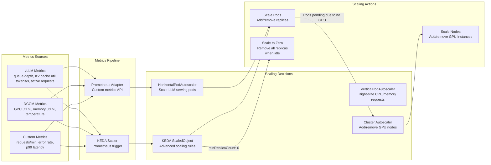

# Kubernetes for GenAI Workloads

## 1. Overview

Kubernetes has become the default orchestration layer for GenAI inference and training workloads. It manages GPU scheduling, model lifecycle, autoscaling, and multi-tenancy for LLM serving, embedding services, reranker models, and training jobs. However, GenAI workloads have fundamentally different resource profiles from traditional web services: they require GPUs (a scarce, expensive, non-fungible resource), consume 10--80 GB of GPU memory per model, take minutes to start (model loading), and exhibit extreme variability in resource consumption (a single long-context request can consume 10x the GPU memory of a short one). These characteristics break many of Kubernetes' default assumptions and require specialized scheduling, scaling, and resource management patterns.

For Principal AI Architects, Kubernetes for GenAI is where infrastructure meets economics. A single H100 node costs $30--40/hour. A 4-node GPU cluster for serving a 70B model costs $120--160/hour --- $87K--115K/month. Misconfigured scheduling (GPU fragmentation), naive autoscaling (scaling on CPU utilization instead of inference queue depth), or suboptimal model placement (not using MIG slicing for small models) can waste 30--60% of this budget. Conversely, aggressive optimization (spot instances, GPU time-sharing, right-sized node pools) can reduce costs by 40--70%.

**Key numbers that shape K8s GenAI architecture:**

- GPU scheduling granularity: Kubernetes schedules GPUs as integers (`nvidia.com/gpu: 1`). You cannot request 0.5 GPUs natively. MIG (Multi-Instance GPU) enables fractional GPU allocation.
- Model loading time: 30s--5min to load a 70B model into GPU memory (from network-attached storage). This dominates pod startup time and constrains scale-up responsiveness.
- GPU node cost: $3--4/hr (A10G), $15--20/hr (A100 80GB), $30--40/hr (H100 SXM). Spot: 60--70% discount when available.
- Spot preemption rate: 5--15% per hour for GPU spot instances (varies by region and instance type). Higher than CPU spot rates.
- Autoscaling lag: Scale-from-zero takes 5--10 minutes (node provisioning + model loading). Scale-from-warm (adding pods to existing nodes) takes 1--3 minutes.
- Memory per request: 0.3--10 GB of KV cache per concurrent request (depending on model size and context length). This is the dominant variable resource.
- NVIDIA GPU operator installation: Automates GPU driver, container toolkit, device plugin, and monitoring installation. Takes 5--10 minutes per node.

---

## 2. Requirements

### Functional Requirements

| Requirement | Description |
|---|---|
| GPU scheduling | Schedule pods on GPU nodes with specific GPU types (A100, H100). Support multi-GPU pods (tensor parallelism). |
| Model serving | Deploy LLM serving frameworks (vLLM, TGI, TensorRT-LLM) as Kubernetes services with health checks and rolling updates. |
| Autoscaling | Scale inference replicas based on GenAI-specific metrics (queue depth, GPU utilization, KV cache utilization). |
| Model storage | Efficiently deliver model weights (10--200 GB) to serving pods. Minimize cold-start time. |
| Multi-tenancy | Isolate workloads between teams/models. Enforce GPU quotas per namespace. |
| Training jobs | Run distributed training jobs across multiple GPU nodes with high-bandwidth interconnect. |
| Cost optimization | Leverage spot instances, GPU time-sharing, and MIG slicing to minimize GPU costs. |

### Non-Functional Requirements

| Requirement | Target | Rationale |
|---|---|---|
| Scale-up time (warm) | <2 min | Adding a replica to an existing GPU node with cached model. |
| Scale-up time (cold) | <10 min | Provisioning a new GPU node + model loading. |
| GPU utilization | >70% | GPU is the dominant cost; underutilization is waste. |
| Availability | 99.9% | Inference services are in the critical path. |
| Spot instance handling | Graceful drain within 120s | SIGTERM handling + in-flight request completion. |
| Model update (rolling) | Zero-downtime | Deploy new model version without dropping requests. |

---

## 3. Architecture

### 3.1 Kubernetes GenAI Cluster Architecture

```mermaid
flowchart TB
    subgraph "Control Plane"
        API[K8s API Server]
        SCHED[GPU-Aware Scheduler<br/>NVIDIA GPU Device Plugin<br/>Topology-aware placement]
        CA[Cluster Autoscaler<br/>GPU node pool scaling]
        KEDA_CTRL[KEDA Controller<br/>Custom metric autoscaling]
    end

    subgraph "GPU Node Pool — Inference (H100)"
        subgraph "Node 1 (8x H100)"
            POD_LLM1[LLM Serving Pod<br/>vLLM + Llama 70B<br/>TP=4, GPU: 4]
            POD_LLM2[LLM Serving Pod<br/>vLLM + Llama 70B<br/>TP=4, GPU: 4]
        end
        subgraph "Node 2 (8x H100)"
            POD_LLM3[LLM Serving Pod<br/>vLLM + Llama 70B<br/>TP=4, GPU: 4]
            POD_EMBED[Embedding Pod<br/>BGE-large on MIG<br/>GPU: 1 MIG slice]
            POD_RERANK[Reranker Pod<br/>BGE-Reranker on MIG<br/>GPU: 1 MIG slice]
        end
    end

    subgraph "GPU Node Pool — Inference (A10G, Spot)"
        subgraph "Spot Node 1 (1x A10G)"
            POD_SMALL1[Small Model Pod<br/>Llama 8B quantized<br/>GPU: 1]
        end
        subgraph "Spot Node 2 (1x A10G)"
            POD_SMALL2[Small Model Pod<br/>Llama 8B quantized<br/>GPU: 1]
        end
    end

    subgraph "CPU Node Pool"
        POD_GW[GenAI Gateway Pod<br/>LiteLLM / custom router]
        POD_GUARD[Guardrails Pod<br/>Toxicity + PII classifiers]
        POD_INGEST[Ingestion Pipeline<br/>Document processing]
        POD_API[API Server Pods<br/>Application backends]
    end

    subgraph "Storage Layer"
        S3[S3 / GCS<br/>Model weights (source of truth)]
        PV[PersistentVolume (NVMe)<br/>Local model cache]
        SHARED_MEM[Shared Memory (emptyDir)<br/>/dev/shm for inference]
        MODEL_REG[Model Registry<br/>MLflow / Weights & Biases<br/>Version tracking]
    end

    subgraph "Observability"
        PROM[Prometheus<br/>GPU metrics + vLLM metrics]
        DCGM[DCGM Exporter<br/>GPU utilization, memory, temp]
        GRAF[Grafana<br/>GPU dashboards]
        ALERT[Alertmanager<br/>GPU OOM, node failure, scaling]
    end

    API --> SCHED
    SCHED --> POD_LLM1 & POD_LLM2 & POD_LLM3 & POD_SMALL1 & POD_SMALL2
    CA --> API
    KEDA_CTRL --> API

    POD_GW --> POD_LLM1 & POD_LLM2 & POD_LLM3 & POD_SMALL1 & POD_SMALL2
    POD_API --> POD_GW

    S3 -.-> PV
    PV -.-> POD_LLM1 & POD_LLM2 & POD_LLM3
    MODEL_REG -.-> S3

    DCGM --> PROM --> GRAF
    PROM --> ALERT
    PROM --> KEDA_CTRL
```

### 3.2 Autoscaling Architecture



---

## 4. Core Components

### 4.1 GPU Scheduling and Device Plugin

Kubernetes does not natively understand GPUs. The NVIDIA GPU Device Plugin bridges this gap by discovering GPUs on each node and advertising them as schedulable resources (`nvidia.com/gpu`).

**NVIDIA GPU Operator:** The GPU Operator automates the installation of all NVIDIA software components on Kubernetes nodes:

| Component | Function |
|---|---|
| GPU Driver | NVIDIA kernel driver for GPU access |
| Container Toolkit | nvidia-container-runtime for GPU passthrough to containers |
| Device Plugin | Advertises `nvidia.com/gpu` resources to the kubelet |
| DCGM Exporter | Exports GPU metrics to Prometheus |
| GPU Feature Discovery | Labels nodes with GPU model, memory, driver version |
| MIG Manager | Configures Multi-Instance GPU partitions |

**Scheduling mechanics:**

```yaml
resources:
  limits:
    nvidia.com/gpu: 4    # Request 4 GPUs
  requests:
    nvidia.com/gpu: 4    # Must match limits (GPUs are not overcommitable)
    memory: "64Gi"       # Host memory for model loading + overhead
    cpu: "16"            # CPU cores for tokenization, scheduling
```

Key constraints:
- GPUs are scheduled as whole integers. `nvidia.com/gpu: 0.5` is not valid. For fractional GPU, use MIG.
- GPU requests MUST equal limits. Unlike CPU and memory, GPU resources cannot be overcommitted.
- All GPUs on a pod are from the same node. Cross-node GPU allocation requires custom scheduling.
- The scheduler does not consider GPU topology (NVLink connectivity). For multi-GPU pods requiring NVLink, use node affinity to select the right node type and topology-aware scheduling via the GPU operator.

**Topology-aware scheduling for tensor parallelism:**

Tensor parallel inference requires GPUs connected via NVLink. On an 8-GPU node (e.g., DGX H100), GPUs are organized in NVLink domains. A TP=4 deployment should use 4 GPUs within the same NVLink domain, not 4 GPUs across domains.

```yaml
# Node affinity for H100 SXM (NVLink) nodes
affinity:
  nodeAffinity:
    requiredDuringSchedulingIgnoredDuringExecution:
      nodeSelectorTerms:
      - matchExpressions:
        - key: nvidia.com/gpu.product
          operator: In
          values: ["NVIDIA-H100-SXM"]
        - key: nvidia.com/gpu.memory
          operator: Gt
          values: ["79000"]  # H100 80GB
```

### 4.2 Multi-Instance GPU (MIG)

MIG partitions a single physical GPU into multiple isolated GPU instances, each with dedicated compute, memory, and memory bandwidth. This is essential for running small models (embedding models, rerankers, guardrail classifiers) that do not need a full GPU.

**MIG profiles on H100:**

| Profile | Compute (SMs) | Memory | Use Case |
|---|---|---|---|
| 1g.10gb | 1/7 of GPU | 10 GB | Embedding model, small classifier |
| 2g.20gb | 2/7 of GPU | 20 GB | Reranker, 7B model (quantized) |
| 3g.40gb | 3/7 of GPU | 40 GB | 13B model, medium inference |
| 4g.40gb | 4/7 of GPU | 40 GB | 13B--34B model |
| 7g.80gb | Full GPU | 80 GB | 70B model (quantized) |

**MIG configuration on Kubernetes:**

```yaml
# Request a specific MIG profile
resources:
  limits:
    nvidia.com/mig-2g.20gb: 1    # Request one 2g.20gb MIG slice
```

**Example: Packing auxiliary models on a single H100:**

One H100 (80 GB) partitioned as:
- 1 x 3g.40gb → BGE-large-en-v1.5 embedding model (1.3 GB weights, 40 GB for batched inference)
- 1 x 2g.20gb → BGE-Reranker-v2-m3 (2.2 GB weights)
- 1 x 1g.10gb → Detoxify toxicity classifier (300 MB weights)
- 1 x 1g.10gb → PII detection model (400 MB weights)

This puts four models on a single GPU, compared to naively using four separate GPUs. Cost reduction: 75%.

### 4.3 Autoscaling for GenAI Workloads

Traditional HPA (CPU utilization-based) is useless for LLM serving. GPU inference pods have near-zero CPU utilization during decode (the GPU does the work), and high GPU utilization does not necessarily mean the system is overloaded (high GPU utilization with low queue depth is ideal).

**GenAI-specific scaling metrics:**

| Metric | Source | Scale-Up Trigger | Scale-Down Trigger | Why This Metric |
|---|---|---|---|---|
| `vllm_num_requests_waiting` | vLLM Prometheus endpoint | Queue depth > 50 | Queue depth < 5 for 5 min | Directly measures user-visible backlog |
| `vllm_gpu_cache_usage_perc` | vLLM Prometheus endpoint | KV cache > 85% | KV cache < 40% for 5 min | Predicts OOM before it happens |
| `DCGM_FI_DEV_GPU_UTIL` | DCGM Exporter | GPU util > 90% sustained | GPU util < 30% for 10 min | Overall GPU load |
| `requests_per_second` | Custom metrics | RPS > threshold | RPS < threshold/4 for 10 min | Demand-based scaling |
| `p99_latency_ms` | Custom metrics | p99 > 5000ms | p99 < 1000ms for 5 min | SLO-based scaling |

**KEDA ScaledObject for LLM serving:**

```yaml
apiVersion: keda.sh/v1alpha1
kind: ScaledObject
metadata:
  name: llm-serving-scaler
spec:
  scaleTargetRef:
    name: llm-serving-deployment
  minReplicaCount: 2         # Never go below 2 for availability
  maxReplicaCount: 8         # Max 8 replicas (32 GPUs at TP=4)
  pollingInterval: 15        # Check metrics every 15s
  cooldownPeriod: 300        # Wait 5 min before scaling down
  triggers:
  - type: prometheus
    metadata:
      serverAddress: http://prometheus:9090
      metricName: vllm_num_requests_waiting
      query: |
        avg(vllm_num_requests_waiting{model="llama-70b"})
      threshold: "50"        # Scale up when avg queue > 50
  - type: prometheus
    metadata:
      serverAddress: http://prometheus:9090
      metricName: vllm_gpu_cache_usage
      query: |
        avg(vllm_gpu_cache_usage_perc{model="llama-70b"})
      threshold: "85"        # Scale up when avg KV cache > 85%
```

**Scale-to-zero for development/staging:**

KEDA supports `minReplicaCount: 0`, enabling scale-to-zero for non-production environments. When no requests arrive for the cooldown period, all pods (and eventually nodes, via Cluster Autoscaler) are removed. The first request triggers scale-from-zero, which takes 5--10 minutes (node provisioning + model loading). Acceptable for dev/staging; not for production.

### 4.4 Model Weight Storage and Distribution

Model weights (10--200 GB) must be delivered to GPU nodes efficiently. Cold-start time is dominated by model loading, not container startup.

**Storage strategies:**

| Strategy | Cold Start | Cost | Complexity | Best For |
|---|---|---|---|---|
| **S3/GCS download at pod start** | 3--10 min (network-bound) | Lowest (pay per access) | Low | Infrequent deployments, small models |
| **PersistentVolume (EBS/PD)** | 30s--2 min (local read) | Medium (PV always provisioned) | Medium | Frequent restarts, same model |
| **NVMe local SSD + init container** | 30s--2 min (local cache + download fallback) | Higher (local storage) | Medium | Performance-critical, hot restarts |
| **S3 sidecar (s3fs / goofys)** | 1--3 min (FUSE mount) | Low | Medium | Large models, don't want to pre-download |
| **Shared NFS (EFS / Filestore)** | 2--5 min (network filesystem) | Medium | Low | Multi-pod sharing of same model |
| **Container image with weights** | 1--5 min (image pull) | High (storage + transfer) | Low | Small models (<10 GB), immutable deployments |

**Recommended pattern: PersistentVolume with S3 fallback:**

1. Attach a PersistentVolume (GP3 SSD) to the GPU node.
2. An init container checks if the model is cached on the PV.
3. If cached (hash matches), skip download. Pod starts in 30s--1 min (read from local SSD).
4. If not cached, download from S3/GCS. Store on PV for next time.
5. Model registry (MLflow / W&B) tracks versions and triggers cache invalidation when a new version is deployed.

**Shared memory for inference:** vLLM and TensorRT-LLM use shared memory (`/dev/shm`) for inter-process communication during tensor parallelism. The default shared memory size in Kubernetes is 64 MB --- far too small for LLM inference. Override with:

```yaml
volumes:
- name: shm
  emptyDir:
    medium: Memory
    sizeLimit: "16Gi"    # 16 GB shared memory for TP communication
```

### 4.5 GPU Node Pools

A well-designed cluster uses multiple node pools, each optimized for a specific workload type.

**Node pool design:**

| Node Pool | Instance Type | GPU | Purpose | Scaling | Cost Model |
|---|---|---|---|---|---|
| `inference-large` | p5.48xlarge / a3-highgpu-8g | 8x H100 | 70B+ model serving (TP=4 or TP=8) | Cluster Autoscaler, min 1 | On-demand |
| `inference-medium` | p4d.24xlarge / a2-highgpu-4g | 4x A100 | 13B--70B model serving | Cluster Autoscaler, min 1 | On-demand |
| `inference-spot` | g5.xlarge / g2-standard-4 | 1x A10G | Small models, non-critical inference | KEDA + Cluster Autoscaler | Spot (60--70% savings) |
| `embedding-mig` | p5.48xlarge (MIG) | MIG slices | Embedding models, rerankers, classifiers | HPA on request rate | On-demand (shared) |
| `training` | p5.48xlarge | 8x H100 | Training/fine-tuning jobs | Manual or job-based | Spot when possible |
| `cpu-general` | m6i.4xlarge / e2-standard-16 | None | API servers, gateways, pipelines | HPA on CPU/memory | On-demand |

**Node labels and taints:**

```yaml
# GPU nodes are tainted to prevent non-GPU pods from scheduling
taints:
- key: nvidia.com/gpu
  value: "present"
  effect: NoSchedule

# GPU pods must tolerate the taint
tolerations:
- key: nvidia.com/gpu
  operator: Exists
  effect: NoSchedule
```

This ensures: CPU workloads never land on expensive GPU nodes, GPU workloads always land on GPU nodes, and different GPU types (H100 vs A10G) are selectable via node affinity.

### 4.6 Networking for Distributed Training

Distributed training (multi-node) requires high-bandwidth, low-latency networking between GPU nodes. Standard Kubernetes networking (10--25 Gbps Ethernet) is a bottleneck for gradient synchronization, which transfers gigabytes of data between nodes on every training step.

**Network technologies:**

| Technology | Bandwidth | Latency | Use Case | K8s Support |
|---|---|---|---|---|
| Standard Ethernet | 10--25 Gbps | 50--100 us | CPU workloads, small-model inference | Native |
| EFA (AWS) | 100--400 Gbps | <10 us | Multi-node training on AWS | EFA Device Plugin |
| InfiniBand (on-prem) | 200--400 Gbps | <2 us | HPC-grade training | RDMA Device Plugin |
| GPUDirect RDMA | 200--400 Gbps | <5 us | GPU-to-GPU across nodes | NCCL + RDMA |
| NVLink (intra-node) | 900 Gbps (H100) | <1 us | Tensor parallelism within a node | Automatic |

**Multi-node training on Kubernetes:**

For distributed training jobs, use the `kubeflow/training-operator` which provides custom resources (PyTorchJob, MPIJob) that handle multi-node pod coordination, NCCL environment setup, and failure recovery.

```yaml
apiVersion: kubeflow.org/v1
kind: PyTorchJob
metadata:
  name: llama-finetune
spec:
  pytorchReplicaSpecs:
    Master:
      replicas: 1
      template:
        spec:
          containers:
          - name: trainer
            image: training:latest
            resources:
              limits:
                nvidia.com/gpu: 8
                vpc.amazonaws.com/efa: 4    # 4 EFA interfaces
    Worker:
      replicas: 3
      template:
        spec:
          containers:
          - name: trainer
            image: training:latest
            resources:
              limits:
                nvidia.com/gpu: 8
                vpc.amazonaws.com/efa: 4
```

### 4.7 Cost Optimization Strategies

**Spot / Preemptible GPU Instances:**

Spot GPUs offer 60--70% cost savings but can be reclaimed with 2-minute notice. Strategy:
- Use spot for: non-critical inference (dev/staging), batch embedding jobs, training jobs with checkpointing.
- Do NOT use spot for: production latency-sensitive inference (unless with warm fallback to on-demand).
- Implement graceful shutdown: handle SIGTERM within 120s. Complete in-flight requests. Drain connections. Save training checkpoints.

**GPU Time-Sharing:**

NVIDIA time-sharing allows multiple pods to share a single GPU via context switching. Each pod sees the full GPU but time-slices access. Useful for: lightweight models that do not need a full GPU continuously (classifiers, small embedding models). Downside: no memory isolation (a misbehaving pod can OOM the GPU for all pods).

```yaml
# Time-sharing configuration in GPU device plugin
apiVersion: v1
kind: ConfigMap
metadata:
  name: nvidia-device-plugin
data:
  config.yaml: |
    version: v1
    sharing:
      timeSlicing:
        resources:
        - name: nvidia.com/gpu
          replicas: 4    # Each GPU is shared 4 ways
```

**Right-sizing GPU allocation:**

| Model Size | GPU Recommendation | Memory Used | Cost/Hr |
|---|---|---|---|
| <3B (quantized) | A10G or MIG 1g.10gb | 2--6 GB | $1--3 |
| 7B--13B | A10G or MIG 3g.40gb | 6--14 GB | $3--8 |
| 13B--34B | A100 40GB or MIG 4g.40gb | 14--34 GB | $8--15 |
| 70B (FP8/INT4) | 2x A100 80GB or 4x H100 | 35--80 GB | $30--80 |
| 70B (FP16) | 4x A100 80GB or 4x H100 | 140 GB | $60--120 |
| 405B | 8x H100 (TP=8) | 400+ GB | $240--320 |

---

## 5. Data Flow

### Model Deployment Lifecycle

1. **Model registration.** A new model version is registered in the model registry (MLflow / W&B) with metadata: model name, version, format (safetensors, GGUF), size, required GPUs, serving configuration.

2. **Model upload.** Model weights are uploaded to object storage (S3/GCS). The registry records the storage path and checksum.

3. **Deployment spec creation.** An engineer creates or updates a Kubernetes Deployment manifest specifying: the serving framework (vLLM, TGI), model path, GPU requirements, tensor parallelism degree, and serving parameters (max_model_len, gpu_memory_utilization).

4. **Rolling update.** `kubectl apply` triggers a rolling update. New pods are created with the new spec. An init container downloads the model weights to the PersistentVolume (or uses cached weights).

5. **Health check.** The readiness probe (`/health` endpoint) waits for model loading to complete. During loading, the pod is not added to the Service endpoint. Old pods continue serving traffic.

6. **Traffic shift.** Once the new pod passes readiness checks, Kubernetes adds it to the Service endpoint. Traffic begins flowing to the new pod. Old pods are gracefully terminated (SIGTERM → drain in-flight requests → shutdown).

7. **Autoscaler adjustment.** The HPA/KEDA evaluates metrics for the new deployment and adjusts replica count if needed.

### Inference Request Flow Through the Cluster

1. **Request arrives** at the Kubernetes Service (LoadBalancer or Ingress).
2. **kube-proxy / IPVS** routes to a serving pod.
3. **vLLM/TGI** receives the request, adds it to the continuous batching scheduler.
4. **GPU inference** processes the request through prefill → decode → streaming output.
5. **Response streams** back through the pod → Service → Ingress → client.
6. **Metrics exported** by vLLM to Prometheus (queue depth, latency, tokens/s, KV cache utilization).
7. **DCGM metrics** collected from the GPU (utilization, memory, temperature, power).

---

## 6. Key Design Decisions / Tradeoffs

### Model Serving Framework on K8s

| Framework | K8s Integration | GPU Efficiency | Ops Complexity | Model Support | Best For |
|---|---|---|---|---|---|
| **vLLM** | Helm chart, OpenAI-compatible API | Best (PagedAttention) | Medium | Broadest | Default production serving |
| **TGI** | Helm chart, HF Hub integration | Good | Low (Docker-first) | Broad (HF Hub) | Quick deployment from HF |
| **KServe** | Native K8s inference platform | Good (pluggable runtime) | High (CRDs, Istio) | Any (runtime plugins) | Multi-framework serving |
| **Seldon Core** | Kubernetes-native MLOps platform | Good | High | Any | ML pipeline orchestration |
| **Triton** | Helm chart, ensemble pipelines | Highest with TRT-LLM | High | Multi-framework | Multi-model ensemble serving |
| **Ollama** | Docker container | Low | Lowest | GGUF models | Development, edge |

### GPU Fractioning Strategy

| Strategy | Isolation | Flexibility | Overhead | Complexity | Best For |
|---|---|---|---|---|---|
| Whole GPU per pod | Complete | None (all or nothing) | None | Lowest | Large models (70B+) |
| MIG slicing | Strong (hardware isolation) | 7 profiles | ~5% memory overhead | Medium | Small models, multi-model packing |
| Time-sharing | Weak (no memory isolation) | Configurable replicas | Context switch overhead | Low | Lightweight, non-critical models |
| MPS (Multi-Process Service) | Weak | Configurable | Low | Medium | CUDA streams sharing |

### Spot vs On-Demand for GPU Nodes

| Factor | On-Demand | Spot/Preemptible | Mixed (On-Demand + Spot) |
|---|---|---|---|
| Cost | $30--40/hr (H100) | $10--15/hr (H100) | Weighted average |
| Availability | Guaranteed | 85--95% (varies) | High (on-demand base) |
| Preemption | Never | 2-min notice, 5--15%/hr | Spot pods only |
| Use for inference | Yes (production) | Risk (dropped requests) | On-demand: baseline, spot: burst |
| Use for training | Yes (expensive) | Yes (with checkpointing) | On-demand: master, spot: workers |
| Use for batch embedding | Overkill | Ideal | Not needed |

### Autoscaling Strategy

| Strategy | Responsiveness | Cost Efficiency | Complexity | Best For |
|---|---|---|---|---|
| HPA on CPU | Poor (CPU is not the bottleneck) | Low | Low | Do not use for GPU inference |
| HPA on custom metrics (queue depth) | Good | Good | Medium | Production inference serving |
| KEDA on queue depth + KV cache | Best | Best | Medium-High | Production with fine-grained control |
| Manual scaling | Instant (no delay) | Poor (over-provisioned) | Lowest | Stable, predictable workloads |
| Scale-to-zero (KEDA) | Poor (5--10 min cold start) | Best (no idle cost) | Medium | Dev/staging environments |

---

## 7. Failure Modes

### 7.1 GPU Node Failure

**Symptom:** Serving pods on the failed node become unresponsive. Traffic to those pods times out. If the Service has only 1 replica, the entire model becomes unavailable.

**Root cause:** GPU hardware failure (ECC errors, GPU hang), node kernel panic, or cloud provider hardware issue.

**Mitigation:** Run minimum 2 replicas for production models. Configure PodDisruptionBudget to maintain at least 1 available pod during disruptions. Cluster Autoscaler provisions replacement nodes. Health checks (liveness probe) detect unresponsive pods and restart them. Monitor DCGM metrics for early GPU health warning signs (ECC error count, temperature, power throttling).

### 7.2 Model Loading Timeout

**Symptom:** New pods never become ready. The readiness probe times out. Rolling updates stall. Old pods are not terminated because new pods have not passed health checks.

**Root cause:** Model weights download is slow (network throttling, S3 rate limiting). Or the model is too large for the available GPU memory. Or the PersistentVolume is not attached.

**Mitigation:** Set readiness probe `initialDelaySeconds` generously (120--300s for large models). Use PersistentVolume caching to avoid repeated downloads. Verify memory math before deployment: `model_size + kv_cache_budget + overhead < GPU_memory * utilization`. Monitor init container logs for download progress.

### 7.3 GPU Memory Exhaustion (OOM)

**Symptom:** CUDA OOM errors. Serving pods crash and restart. Requests fail mid-generation.

**Root cause:** Too many concurrent requests with long contexts exhaust KV cache memory. Or GPU memory utilization is set too high (>0.95), leaving no headroom.

**Mitigation:** Set `gpu-memory-utilization` to 0.85--0.90. Configure `max-num-seqs` (maximum concurrent requests) based on expected context lengths. Monitor KV cache utilization and scale up before reaching 85%. Implement request admission control: reject new requests when KV cache is near capacity rather than crashing.

### 7.4 Spot Instance Preemption During Inference

**Symptom:** Spot GPU node is reclaimed. All pods on the node are terminated with 120s notice. In-flight requests are dropped.

**Root cause:** Cloud provider reclaims spot capacity due to demand from on-demand customers.

**Mitigation:** Handle SIGTERM gracefully: complete in-flight requests (or abort and let clients retry), drain new traffic from the pod. For latency-sensitive inference, maintain on-demand nodes as a warm fallback. Use PodAntiAffinity to spread replicas across nodes (avoid all replicas on spot nodes). The Cluster Autoscaler provisions replacement spot nodes (or falls back to on-demand if spot is unavailable).

### 7.5 Autoscaler Thrashing

**Symptom:** Replica count oscillates rapidly (2 → 4 → 2 → 4) every few minutes. Pods are constantly being created and terminated.

**Root cause:** The scaling metric (e.g., queue depth) is volatile. The cooldown period is too short. Or the scale-up and scale-down thresholds are too close together.

**Mitigation:** Increase the cooldown period (5--10 min for scale-down). Use a hysteresis band: scale up at queue depth > 50, scale down at queue depth < 10 (not < 50). Average the metric over a longer window (5 min average, not instant). Use KEDA's `stabilizationWindowSeconds` to prevent rapid oscillation.

---

## 8. Real-World Examples

### Anyscale (Ray Serve + vLLM on K8s)

Anyscale deploys vLLM with Ray Serve on Kubernetes for large-scale LLM inference. Their production deployment serves Llama 3 70B across hundreds of H100 GPUs. Key architectural choices: Ray Serve handles request routing and actor management while vLLM handles the actual inference, prefix-aware routing across replicas improves cache hit rates by 40%, and the Cluster Autoscaler provisions GPU nodes based on Ray's resource demand. Ray provides a resource abstraction layer between Kubernetes and the inference framework, handling placement decisions that Kubernetes' scheduler does not natively support (e.g., co-locate actors that need to communicate).

### CoreWeave (GPU-Native Kubernetes)

CoreWeave is a cloud provider built specifically for GPU workloads on Kubernetes. Their platform provides: instant access to H100, A100, and A10G GPU nodes with Kubernetes-native scheduling, pre-installed NVIDIA GPU Operator with MIG support, InfiniBand networking between GPU nodes for distributed training, and a model serving stack (Kubernetes + vLLM/TensorRT-LLM + custom routing). CoreWeave demonstrates the pattern of GPU-specialized Kubernetes: the cluster is designed from the ground up for GPU workloads rather than adding GPU support to a general-purpose cluster.

### Modal (Serverless GPU on K8s)

Modal provides a serverless GPU computing platform built on Kubernetes. Users define Python functions that require GPUs, and Modal handles: container building, GPU scheduling, model weight caching (models are cached on local NVMe across the fleet), scale-to-zero (no cost when idle), and cold-start optimization (sub-10s GPU container startup using snapshot-and-restore). Modal demonstrates that Kubernetes can deliver serverless-like GPU experiences with careful engineering of the model loading and scheduling layers.

### Bloomberg (Enterprise LLM Serving on K8s)

Bloomberg deploys LLMs on their internal Kubernetes clusters for financial AI applications. Key architectural elements: strict multi-tenancy with namespace-based GPU quotas per team, model serving on dedicated GPU node pools with network isolation, custom autoscaling based on financial market hours (scale up before market open, scale down after close), and integration with their existing ML platform for model lifecycle management. Bloomberg demonstrates the enterprise K8s pattern where GenAI workloads must coexist with existing infrastructure policies and governance frameworks.

### Hugging Face (TGI on K8s for Inference Endpoints)

Hugging Face's Inference Endpoints product deploys TGI on Kubernetes clusters across AWS, Azure, and GCP. Users select a model from the Hub and a GPU type; Hugging Face provisions a Kubernetes pod with TGI configured for that model. The architecture automates: GPU type selection based on model size, TGI configuration (quantization, tensor parallelism), scaling rules (including scale-to-zero for dedicated endpoints), and model weight caching on PersistentVolumes across the fleet. This is the reference implementation for "model serving as a managed service" on Kubernetes.

---

## 9. Related Topics

- [Model Serving](../02-llm-architecture/model-serving.md) --- Inference frameworks (vLLM, TGI, TensorRT-LLM) that run inside the Kubernetes pods. Continuous batching, PagedAttention, and serving optimization.
- [GPU Compute](../02-llm-architecture/gpu-compute.md) --- GPU hardware specifications (H100, A100, A10G) that determine node pool selection and cost.
- [Model Parallelism](../02-llm-architecture/model-parallelism.md) --- Tensor parallelism and pipeline parallelism strategies that govern multi-GPU pod configurations.
- [Quantization](../02-llm-architecture/quantization.md) --- FP8, INT4, GPTQ, AWQ quantization that determines model memory footprint and GPU requirements.
- [Deployment Patterns](../12-patterns/deployment-patterns.md) --- Blue-green, canary, and rolling deployment patterns applied to GPU workloads.
- [Autoscaling](../../traditional-system-design/02-scalability/autoscaling.md) --- General autoscaling patterns (HPA, KEDA, Cluster Autoscaler) applied to GenAI-specific metrics.
- [GenAI Gateway](./genai-gateway.md) --- Gateway pods that route traffic to model serving pods within the cluster.
- [Training Infrastructure](../03-model-strategies/training-infrastructure.md) --- Distributed training on Kubernetes with multi-node GPU communication.

---

## 10. Source Traceability

| Concept | Primary Source |
|---|---|
| NVIDIA GPU Operator | NVIDIA, "GPU Operator Documentation" (2023--present) |
| NVIDIA Device Plugin | NVIDIA, "k8s-device-plugin" (GitHub, 2019--present) |
| Multi-Instance GPU (MIG) | NVIDIA, "Multi-Instance GPU User Guide" (2020--present) |
| DCGM Exporter | NVIDIA, "DCGM Exporter for Kubernetes" (GitHub, 2020--present) |
| KEDA | KEDA, "Kubernetes Event-driven Autoscaling" documentation (2019--present) |
| KServe | KServe, "KServe: Serverless Inference on Kubernetes" documentation (2021--present) |
| Kubeflow Training Operator | Kubeflow, "Training Operator" documentation (2020--present) |
| vLLM on Kubernetes | vLLM, "Deploying with Kubernetes" documentation (2024) |
| Ray Serve + K8s | Anyscale, "Ray on Kubernetes" documentation (2023--present) |
| CoreWeave GPU K8s | CoreWeave, "Kubernetes GPU Cloud" documentation (2023--present) |
| Modal serverless GPU | Modal, "Running LLMs" documentation (2024--present) |
| Cluster Autoscaler | Kubernetes SIG Autoscaling, "Cluster Autoscaler" (GitHub, 2016--present) |
| GPU time-sharing | NVIDIA, "GPU Sharing on Kubernetes" (2023) |
| EFA on EKS | AWS, "EFA with EKS" documentation (2023--present) |
| Spot instance handling | AWS, "Spot Instance Interruption" documentation; GCP "Preemptible VMs" documentation |
| PagedAttention / vLLM | Kwon et al., "Efficient Memory Management for Large Language Model Serving with PagedAttention" (UC Berkeley, 2023) |
| TGI Helm chart | Hugging Face, "TGI Helm Chart" (GitHub, 2024) |
| Hugging Face Inference Endpoints | Hugging Face, "Inference Endpoints" documentation (2023--present) |
