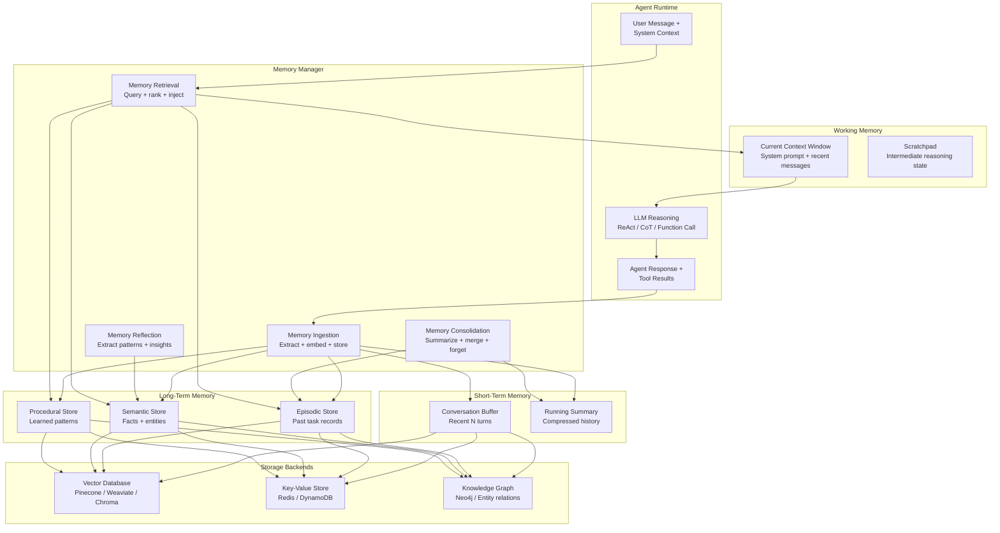
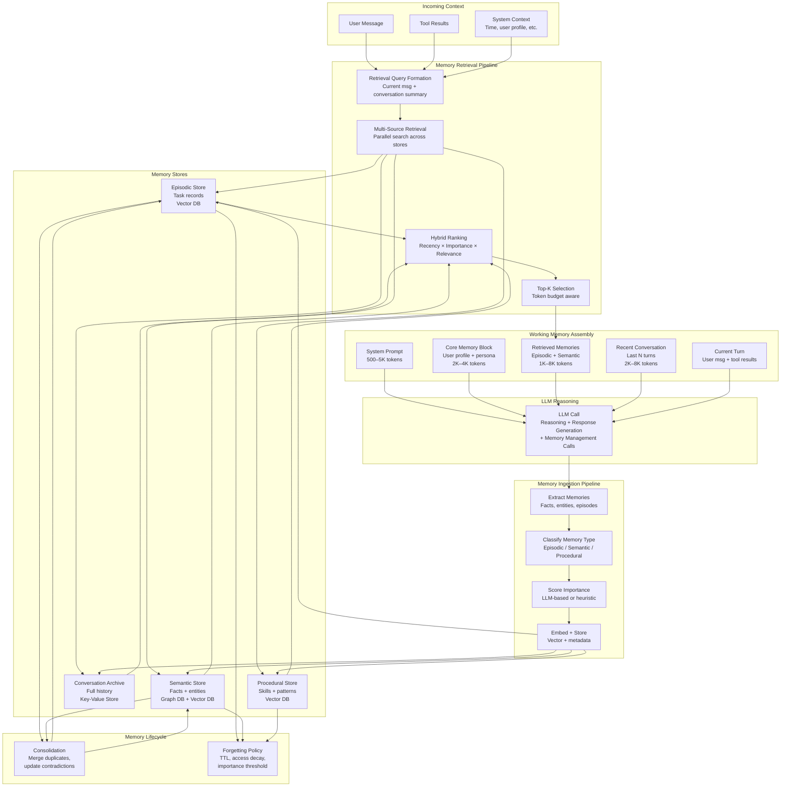
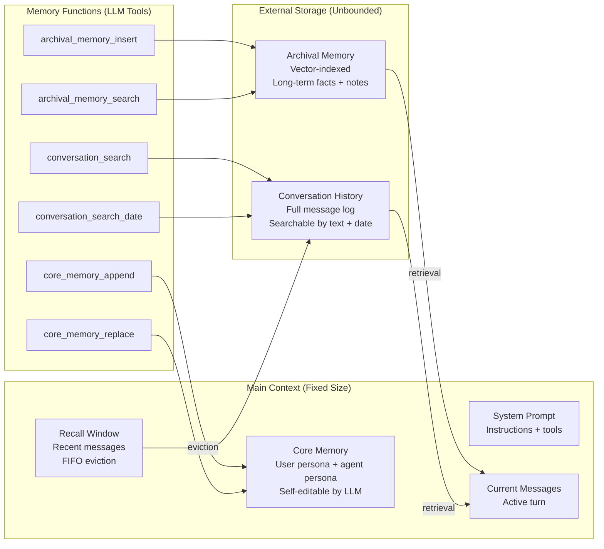

# Agent Memory Systems

## 1. Overview

Agent memory systems provide LLM-based agents with the ability to retain, retrieve, and reason over information across time horizons that extend far beyond a single context window. While a stateless LLM call processes only the tokens within its current prompt, memory-equipped agents accumulate knowledge from past interactions, learn from successes and failures, and build persistent models of users, tasks, and domains.

For Principal AI Architects, memory is the differentiator between a demo agent and a production agent. A demo agent handles single-turn tasks with context stuffed into the prompt. A production agent must remember a user's preferences across sessions, recall the outcome of a similar task performed last week, avoid repeating mistakes, and manage a growing knowledge base without exceeding context window limits or degrading retrieval quality.

**Key numbers that shape memory system design:**
- Context window sizes (2025): 128K–2M tokens for frontier models (GPT-4o, Claude, Gemini), but effective utilization degrades beyond 32K tokens due to lost-in-the-middle effects
- Conversation history token growth: ~500–2,000 tokens per turn (user + assistant), meaning a 128K window exhausts in 64–256 turns without memory management
- Vector retrieval latency for memory lookup: 10–50ms over 1M entries (ANN search with HNSW or IVF)
- Embedding cost for memory ingestion: ~$0.0001 per 1K tokens (text-embedding-3-small class models)
- Summarization cost for memory compression: $0.01–0.05 per summarized conversation segment (GPT-4o-mini)
- Memory retrieval accuracy (recall@5): 70–85% for well-tuned vector stores, 85–95% with hybrid retrieval + reranking
- MemGPT virtual context overhead: 1–3 additional LLM calls per interaction for memory management operations

Human cognition provides the architectural blueprint. Cognitive science distinguishes working memory (active manipulation of current information), short-term memory (recent information held temporarily), long-term memory (durable storage), episodic memory (past experiences), semantic memory (facts and knowledge), and procedural memory (learned skills). Modern agent memory systems implement computational analogues of each, with different storage backends, retrieval mechanisms, and lifecycle policies.

---

## 2. Where It Fits in GenAI Systems

Memory systems sit between the agent's reasoning loop and the persistence layer. They intercept agent inputs and outputs, decide what to store, manage retrieval for context augmentation, and handle memory lifecycle (creation, update, consolidation, forgetting).



Memory systems interact with these adjacent components:
- **Agent architecture** (consumer): The agent's reasoning loop reads from and writes to memory. Memory quality directly bounds agent capability on multi-turn and multi-session tasks. See [Agent Architecture](./agent-architecture.md).
- **Context management** (shared concern): Memory retrieval competes for context window tokens with system prompts, tool results, and user messages. See [Context Management](../prompt-engineering/context-management.md).
- **Vector databases** (infrastructure): Long-term memory typically relies on vector stores for embedding-based retrieval. See [Vector Databases](../vector-search/vector-databases.md).
- **RAG pipeline** (pattern overlap): Memory retrieval is structurally identical to RAG — embed a query, retrieve relevant entries, inject into context. The difference is scope: RAG retrieves from a static knowledge base; memory retrieves from the agent's own experience. See [RAG Pipeline](../rag/rag-pipeline.md).
- **Multi-agent systems** (coordination): In multi-agent architectures, memory can be shared (blackboard pattern) or private (per-agent). See [Multi-Agent Systems](./multi-agent.md).

---

## 3. Core Concepts

### 3.1 Working Memory: The Context Window

Working memory is the agent's active processing space — the contents of the current LLM context window. It includes the system prompt, recent conversation turns, retrieved memories, tool call results, and any scratchpad content used for intermediate reasoning.

**Capacity constraints:**
- Total context window: 128K–2M tokens (model-dependent).
- Effective utilization: 32K–64K tokens before significant quality degradation. Liu et al. (2024) demonstrated that models lose 10–25% recall for information placed in the middle of long contexts.
- System prompt: 500–5,000 tokens (role definition, instructions, output format, tool descriptions).
- Retrieved memories: 1,000–8,000 tokens (5–20 memory entries at 200–400 tokens each).
- Remaining budget for conversation: whatever is left after system prompt + memories + tool results.

**Working memory management strategies:**
- **Full context:** Include all conversation history. Works for short conversations (<20 turns). No information loss but context fills rapidly.
- **Sliding window:** Keep only the most recent N turns. Simple to implement but loses early context that may contain critical instructions or preferences.
- **Summarization + recent:** Maintain a running summary of older conversation plus full recent turns. Balances context coverage with recency.
- **RAG-based retrieval:** Store all turns in a vector store and retrieve only turns relevant to the current query. Maximizes information density in the context window.

The choice among these strategies depends on conversation length, the importance of early context, and latency budget for memory retrieval.

### 3.2 Short-Term Memory: Conversation Buffer and Summarization

Short-term memory retains information from the current conversation session, beyond what fits in the working memory window. It bridges the gap between the fixed-size context window and the full conversation history.

**Conversation buffer strategies:**

**Full buffer:** Store all conversation turns as a list. Inject the entire list into the context window on each LLM call. The simplest approach — no information loss, but context growth is unbounded.

```
Working memory = System Prompt + All Turns + Current Query
Token growth: O(n) per turn, where n = average tokens per turn
```

**Sliding window buffer:** Retain only the most recent K turns. Older turns are discarded (or moved to long-term memory). The window size K is tuned based on context window budget.

```
Working memory = System Prompt + Last K Turns + Current Query
Typical K: 10–20 turns for chat, 5–10 for agents with heavy tool use
```

**Summarization buffer:** Periodically summarize older conversation segments and retain the summary while discarding the original turns. This compresses conversation history at the cost of detail loss.

**Implementation — progressive summarization:**
1. Maintain a buffer of full turns (last K turns).
2. When the buffer reaches K turns, summarize the oldest K/2 turns into a paragraph using an LLM call.
3. Prepend the summary to the buffer, replacing the summarized turns.
4. The context window always contains: [running summary] + [recent K/2 turns] + [current query].

**Token economics of summarization:**
- A 20-turn conversation segment (~4,000 tokens) summarizes to ~400–800 tokens (5–10x compression).
- Summarization cost: one LLM call (~$0.01–0.05 with GPT-4o-mini).
- Break-even: summarization pays for itself when the context window savings enable the agent to continue operating rather than failing from context overflow.

**Token-count triggered vs. turn-count triggered:** Summarization can trigger when total token count exceeds a threshold (more precise) or when turn count exceeds a limit (simpler). Token-count triggering is preferred because turn length varies dramatically — a tool result turn may be 50 tokens or 5,000.

### 3.3 Long-Term Memory: Persistent Knowledge Across Sessions

Long-term memory persists information across conversation sessions, enabling agents to remember user preferences, past task outcomes, domain knowledge, and learned behaviors over days, weeks, and months.

**Storage architectures:**

**Vector store backed:** Memory entries are embedded and stored in a vector database. Retrieval uses semantic similarity between the current query and stored memory embeddings.

```
Memory Entry Schema:
{
  "id": "mem_abc123",
  "content": "User prefers concise responses with code examples",
  "embedding": [0.023, -0.041, ...],  // 1536-dim
  "metadata": {
    "user_id": "user_42",
    "created_at": "2025-03-15T10:30:00Z",
    "source": "explicit_preference",
    "importance": 0.9,
    "access_count": 12,
    "last_accessed": "2025-03-19T14:22:00Z"
  }
}
```

**Key-value store backed:** Memory entries are stored with explicit keys (user_id + memory_type + topic). Retrieval is exact-match by key. Fast and predictable but requires knowing the key at query time.

**Knowledge graph backed:** Entities and relationships are extracted from conversations and stored in a graph database. Retrieval traverses relationships from entities mentioned in the current query. Best for relational knowledge ("User works at Company X, which uses Technology Y").

**Hybrid:** Most production systems combine vector store (for semantic retrieval) with key-value store (for user profile and preferences) and optionally a knowledge graph (for entity relationships).

### 3.4 Episodic Memory: Past Experiences and Task Records

Episodic memory stores records of past agent experiences — completed tasks, problem-solving trajectories, successes, and failures. It enables the agent to learn from experience without fine-tuning.

**What to store:**
- Task description and final outcome (success/failure).
- Key decisions made during execution and their consequences.
- Tool calls that succeeded and failed.
- User feedback (explicit ratings, implicit signals like follow-up corrections).
- Environmental context (time, user, relevant state).

**Episodic retrieval for in-context learning:**

When the agent encounters a new task, episodic memory retrieval finds similar past tasks and injects their records into the context. This provides few-shot examples grounded in the agent's own experience, which can be more relevant than generic examples.

```
Current task: "Deploy the ML model to staging"
Retrieved episodic memory:
  - Episode 2025-03-10: "Deployed NLP model to staging. Used Docker build
    → ECR push → ECS update. Hit issue with CUDA version mismatch —
    resolved by pinning nvidia/cuda:12.1 base image. Total time: 45 min."
```

The agent now has a concrete playbook from its own experience, including a known pitfall and resolution.

**Episode compression:** Raw task trajectories can be thousands of tokens. Production systems compress episodes into structured summaries (task, approach, outcome, lessons learned) at storage time, retaining the full trajectory only for recent episodes.

### 3.5 Semantic Memory: Facts, Knowledge, and Entity Relationships

Semantic memory stores factual knowledge and entity relationships extracted from conversations and tasks. Unlike episodic memory (which stores experiences), semantic memory stores distilled knowledge — facts that are true independent of when they were learned.

**Entity extraction and relationship mapping:**

After each conversation, a post-processing step extracts entities and relationships:

```
Conversation: "We're migrating from PostgreSQL 14 to PostgreSQL 16
on AWS RDS. The main database is orders_db with ~500M rows."

Extracted entities:
  - orders_db (type: database, engine: PostgreSQL, rows: ~500M)
  - AWS RDS (type: service, provider: AWS)

Extracted relationships:
  - orders_db HOSTED_ON AWS RDS
  - orders_db MIGRATING_FROM PostgreSQL 14
  - orders_db MIGRATING_TO PostgreSQL 16
```

This structured knowledge is stored in a graph database and retrieved when the agent encounters references to these entities in future conversations.

**Semantic memory vs. RAG:** The distinction is important. RAG retrieves from a static, externally curated knowledge base. Semantic memory retrieves from the agent's own learned knowledge, accumulated through interactions. In practice, both use the same retrieval mechanisms (embedding + ANN search) but serve different purposes: RAG provides world knowledge, semantic memory provides user/task-specific knowledge.

### 3.6 Procedural Memory: Learned Skills and Tool Usage Patterns

Procedural memory captures how to do things — effective tool usage sequences, successful prompt patterns, and problem-solving strategies that the agent has discovered through experience.

**What to store:**
- Tool call sequences that successfully completed task types (e.g., "To analyze a CSV: 1. read_file → 2. python_exec to load pandas → 3. python_exec to compute stats → 4. python_exec to plot").
- Prompt templates that produced high-quality outputs for specific task categories.
- Error recovery patterns (e.g., "When API returns 429, wait 60s and retry with exponential backoff").
- User-specific workflow preferences (e.g., "This user prefers TypeScript over JavaScript for all code generation").

**Retrieval and application:** When the agent encounters a task, procedural memory retrieval looks for matching skill records and injects the procedure as a suggested approach. The agent can follow, adapt, or override the procedure based on current context.

**Skill refinement:** Procedural memory entries have a success rate metric. When a procedure fails, the record is updated with the failure case and (optionally) the corrected procedure. Over time, procedures converge toward reliable patterns. This is a form of in-context reinforcement learning without fine-tuning.

### 3.7 MemGPT / Letta: Virtual Context Management

MemGPT (Packer et al., 2023), now developed as Letta, introduced the concept of **virtual context management** — giving the LLM explicit tools to manage its own memory, analogous to an operating system managing virtual memory with paging.

**Core architecture:**

The LLM operates within a fixed-size "main context" (analogous to RAM) and has access to "archival storage" (analogous to disk) through memory management function calls:

- `core_memory_append(section, content)`: Add content to core memory (persistent facts about the user, persona, etc.).
- `core_memory_replace(section, old, new)`: Update content in core memory.
- `archival_memory_insert(content)`: Write content to archival storage (unlimited, vector-indexed).
- `archival_memory_search(query, count)`: Retrieve from archival storage.
- `conversation_search(query, count)`: Search past conversation history.
- `conversation_search_date(start, end, count)`: Search conversation by date range.

**Main context structure:**

```
[System Prompt]          — Fixed instructions (1,000–2,000 tokens)
[Core Memory Block]      — User profile, agent persona, key facts (2,000–4,000 tokens)
                           Editable by the agent via core_memory_* functions
[Recall Memory Window]   — Recent conversation turns (2,000–4,000 tokens)
                           Auto-managed, FIFO eviction to conversation storage
[Current Messages]       — Current turn input + tool results (remaining budget)
```

**Self-editing memory:** The critical innovation is that the LLM decides what to remember and what to forget. When the agent learns that a user changed jobs, it calls `core_memory_replace` to update the user's employer in core memory. When an important but non-critical fact comes up, it calls `archival_memory_insert` to save it for later retrieval. The agent is literally editing its own persistent context.

**Tradeoffs:**
- **Pro:** Unbounded effective memory. The agent can manage conversations spanning thousands of turns by actively paging information in and out.
- **Pro:** Agent-initiated memory operations are more targeted than rule-based summarization because the agent understands relevance.
- **Con:** 1–3 additional LLM calls per interaction for memory management operations. At $0.01–0.10 per memory operation, this adds 50–200% overhead.
- **Con:** Memory quality depends on the LLM's judgment about what to store. Smaller models make poor memory management decisions.
- **Con:** Debugging is difficult because the agent's memory state evolves in ways not directly visible to the developer.

### 3.8 Memory Retrieval Strategies

The effectiveness of memory systems depends heavily on retrieval quality. Three primary retrieval strategies:

#### Recency-Weighted Retrieval

Prioritizes recently stored or recently accessed memories. Implements a temporal decay function that reduces relevance scores for older memories.

```
score(memory) = similarity(query, memory.embedding) × decay(now - memory.last_accessed)

Common decay functions:
  - Exponential: decay(t) = e^(-λt), where λ controls decay rate
  - Power law: decay(t) = 1 / (1 + t)^α
  - Step function: decay(t) = 1.0 if t < threshold, else 0.5
```

Best for: conversational agents where recent context is almost always more relevant than historical context.

#### Importance-Scored Retrieval

Assigns an importance score to each memory at ingestion time, independent of recency. Important memories (user preferences, critical decisions, safety constraints) are always retrievable regardless of age.

**Importance scoring methods:**
- **LLM-based:** Ask the LLM "On a scale of 1–10, how important is this memory for future interactions?" at ingestion time. Costs one LLM call per memory entry.
- **Heuristic:** Score based on message type (explicit user instructions score high), presence of keywords ("always," "never," "important"), and whether the user corrected the agent (corrections are high-importance).
- **Access frequency:** Memories retrieved often in the past are scored higher (implicit importance signal).

#### Hybrid Retrieval (Generative Agents Pattern)

Park et al. (2023) introduced a hybrid scoring function that combines recency, importance, and relevance:

```
score(memory) = α × recency(memory) + β × importance(memory) + γ × relevance(query, memory)

Default weights (from Park et al.):
  α = 1.0, β = 1.0, γ = 1.0 (equal weighting)

Production tuning typically adjusts:
  - Higher α for conversational agents (recency matters most)
  - Higher β for task agents (importance of instructions and constraints)
  - Higher γ for knowledge workers (relevance to current question)
```

This hybrid approach is the current best practice for general-purpose agent memory retrieval.

---

## 4. Architecture

### 4.1 Comprehensive Agent Memory Architecture



### 4.2 MemGPT / Letta Virtual Context Architecture



---

## 5. Design Patterns

### 5.1 Tiered Memory with Promotion/Demotion

Implement a hierarchy where memories flow between tiers based on access patterns:

1. **Hot tier (working memory):** Currently in context window. Highest cost per token, instant access.
2. **Warm tier (short-term buffer):** Recent conversation in a fast key-value store. Millisecond retrieval, moderate cost.
3. **Cold tier (long-term store):** Archived in vector database. 10–50ms retrieval, low cost.
4. **Archive tier:** Compressed, rarely accessed. Only retrieved by explicit search.

**Promotion:** A cold memory retrieved by the agent is promoted to warm tier (increased access count, refreshed timestamp). Frequently retrieved cold memories eventually influence the running summary (effective promotion to working memory).

**Demotion:** Working memory overflows into warm tier (evicted from context window but retained in buffer). Warm memories that are not accessed within K turns are demoted to cold tier.

### 5.2 Reflection-Based Memory Consolidation

Inspired by Park et al. (2023), periodically run a **reflection** step where the agent reviews recent memories and extracts higher-order patterns:

1. Retrieve the last N episodic memories.
2. Prompt the LLM: "Given these recent experiences, what are the 3 most important insights or patterns?"
3. Store the reflections as high-importance semantic memories.
4. Reflections serve as abstracted knowledge that compresses many episodic memories into reusable insights.

**Example reflection chain:**
- Episode 1: "User asked for Python code, then asked me to convert to TypeScript."
- Episode 2: "User asked for JavaScript, then asked for TypeScript version."
- Episode 3: "User corrected my JavaScript and said they prefer TypeScript."
- **Reflection:** "User strongly prefers TypeScript over JavaScript and Python. Always default to TypeScript for code generation."

This reflection is now a single semantic memory entry that replaces the need to retrieve and reason over three separate episodic entries.

### 5.3 Entity-Centric Memory Organization

Organize memories around entities (people, projects, systems, concepts) rather than chronologically. Each entity has a profile page that accumulates facts over time.

**Entity profile schema:**
```json
{
  "entity_id": "project_atlas",
  "entity_type": "project",
  "name": "Project Atlas",
  "facts": [
    {"fact": "Migration from MongoDB to PostgreSQL", "confidence": 0.95, "source": "conversation_2025-03-10"},
    {"fact": "Target completion: Q2 2025", "confidence": 0.8, "source": "conversation_2025-03-12"},
    {"fact": "Lead engineer: Sarah Chen", "confidence": 0.9, "source": "conversation_2025-03-15"}
  ],
  "relationships": [
    {"type": "OWNED_BY", "target": "team_platform"},
    {"type": "USES", "target": "technology_postgresql_16"},
    {"type": "DEPENDS_ON", "target": "service_auth_api"}
  ]
}
```

**Retrieval advantage:** When the user mentions "Project Atlas," the agent retrieves the full entity profile, getting comprehensive context without relying on semantic similarity across fragmented memory entries.

### 5.4 Memory-Augmented Tool Selection

Use procedural memory to improve tool selection. When the agent encounters a task, retrieve procedural memories of similar past tasks and their successful tool sequences. Present these as suggested approaches, reducing the agent's planning overhead and error rate.

This pattern is especially valuable for agents with large tool sets (10+ tools), where the LLM's zero-shot tool selection degrades significantly with tool count.

### 5.5 Contradiction Detection and Resolution

When a new memory contradicts an existing memory, the system must resolve the conflict:

- **Last-write-wins:** The new memory replaces the old. Simple but can lose valid historical information.
- **Timestamp-aware:** Keep both with timestamps; retrieval returns the most recent. Useful when facts change over time (e.g., "User works at Company X" → "User now works at Company Y").
- **LLM-mediated:** Present both memories to the LLM and ask it to resolve the contradiction. Most accurate but expensive (one LLM call per conflict).
- **Confidence-weighted:** Keep the memory with higher confidence score. Requires reliable confidence scoring at ingestion.

---

## 6. Implementation Approaches

### 6.1 LangChain / LangGraph Memory Implementation

```python
from langchain_core.messages import HumanMessage, AIMessage
from langchain_openai import ChatOpenAI, OpenAIEmbeddings
from langchain_community.vectorstores import Chroma
from langgraph.graph import StateGraph, MessagesState
from langgraph.checkpoint.memory import MemorySaver

# Short-term: conversation buffer with summarization
class MemoryState(MessagesState):
    summary: str  # running summary of older conversation
    memories: list[str]  # retrieved long-term memories

def summarize_if_needed(state: MemoryState) -> dict:
    """Summarize conversation when it exceeds token threshold."""
    messages = state["messages"]
    if len(messages) > 20:  # trigger summarization
        old_messages = messages[:-10]  # keep last 10 intact
        summary_prompt = f"""Summarize this conversation concisely,
        preserving key decisions, preferences, and facts:
        {format_messages(old_messages)}
        Previous summary: {state.get('summary', 'None')}"""
        new_summary = llm.invoke(summary_prompt).content
        return {
            "summary": new_summary,
            "messages": messages[-10:]  # trim to recent 10
        }
    return {}

# Long-term: vector-backed episodic and semantic memory
memory_store = Chroma(
    collection_name="agent_memory",
    embedding_function=OpenAIEmbeddings(model="text-embedding-3-small"),
    persist_directory="./memory_db"
)

def retrieve_memories(state: MemoryState) -> dict:
    """Retrieve relevant long-term memories for current context."""
    current_query = state["messages"][-1].content
    results = memory_store.similarity_search_with_relevance_scores(
        query=current_query,
        k=5,
        score_threshold=0.7  # minimum relevance
    )
    memories = [doc.page_content for doc, score in results]
    return {"memories": memories}

def store_memory(content: str, memory_type: str, importance: float):
    """Store a new memory entry with metadata."""
    memory_store.add_texts(
        texts=[content],
        metadatas=[{
            "type": memory_type,
            "importance": importance,
            "created_at": datetime.now().isoformat(),
            "access_count": 0
        }]
    )
```

### 6.2 MemGPT / Letta-Style Implementation

```python
# Core memory block — editable by the agent via tool calls
CORE_MEMORY = {
    "human": "Name: Sarah. Role: Senior ML Engineer. Preferences: concise responses, TypeScript, prefers CLI tools.",
    "persona": "You are a helpful AI assistant specializing in ML infrastructure and deployment.",
    "project": "Currently working on Project Atlas — migrating from MongoDB to PostgreSQL 16 on AWS RDS."
}

# Memory management tools exposed to the LLM
tools = [
    {
        "name": "core_memory_append",
        "description": "Append new information to a core memory section",
        "parameters": {
            "section": {"type": "string", "enum": ["human", "persona", "project"]},
            "content": {"type": "string"}
        }
    },
    {
        "name": "core_memory_replace",
        "description": "Replace old content with new content in core memory",
        "parameters": {
            "section": {"type": "string"},
            "old_content": {"type": "string"},
            "new_content": {"type": "string"}
        }
    },
    {
        "name": "archival_memory_insert",
        "description": "Save information to long-term archival storage",
        "parameters": {
            "content": {"type": "string"}
        }
    },
    {
        "name": "archival_memory_search",
        "description": "Search archival memory for relevant information",
        "parameters": {
            "query": {"type": "string"},
            "count": {"type": "integer", "default": 5}
        }
    }
]

# Context window assembly
def assemble_context(user_message: str) -> list:
    return [
        {"role": "system", "content": SYSTEM_PROMPT},
        {"role": "system", "content": f"[Core Memory — Human]\n{CORE_MEMORY['human']}"},
        {"role": "system", "content": f"[Core Memory — Persona]\n{CORE_MEMORY['persona']}"},
        {"role": "system", "content": f"[Core Memory — Project]\n{CORE_MEMORY['project']}"},
        *get_recent_messages(limit=10),  # recall window
        {"role": "user", "content": user_message}
    ]
```

### 6.3 Hybrid Retrieval with Importance Scoring

```python
import numpy as np
from datetime import datetime, timedelta

def hybrid_memory_score(
    query_embedding: np.ndarray,
    memory: dict,
    now: datetime,
    alpha: float = 1.0,  # recency weight
    beta: float = 1.0,   # importance weight
    gamma: float = 1.0   # relevance weight
) -> float:
    """
    Score a memory using the hybrid retrieval function
    from Park et al. (2023) Generative Agents.
    """
    # Recency: exponential decay based on hours since last access
    hours_since_access = (now - memory["last_accessed"]).total_seconds() / 3600
    recency = np.exp(-0.01 * hours_since_access)  # λ = 0.01

    # Importance: stored at ingestion time (0-1 scale)
    importance = memory["importance"]

    # Relevance: cosine similarity between query and memory embeddings
    relevance = np.dot(query_embedding, memory["embedding"]) / (
        np.linalg.norm(query_embedding) * np.linalg.norm(memory["embedding"])
    )

    return alpha * recency + beta * importance + gamma * relevance

def retrieve_memories(query: str, k: int = 5) -> list[dict]:
    """Retrieve top-k memories using hybrid scoring."""
    query_embedding = embed(query)
    now = datetime.now()
    all_memories = memory_store.get_all()  # In practice, pre-filter by user_id

    scored = [
        (memory, hybrid_memory_score(query_embedding, memory, now))
        for memory in all_memories
    ]
    scored.sort(key=lambda x: x[1], reverse=True)

    # Update access timestamps for retrieved memories
    for memory, score in scored[:k]:
        memory["last_accessed"] = now
        memory["access_count"] += 1
        memory_store.update(memory)

    return [memory for memory, score in scored[:k]]
```

---

## 7. Tradeoffs

### 7.1 Memory Strategy Selection

| Factor | Full Buffer | Sliding Window | Summarization | RAG-Based |
|---|---|---|---|---|
| **Information loss** | None | High (old turns lost) | Medium (lossy compression) | Low (stored, retrieved on demand) |
| **Token cost per turn** | Grows linearly | Fixed (K turns) | Fixed (summary + K turns) | Fixed (retrieved subset) |
| **Latency overhead** | None | None | Summarization LLM call | Embedding + retrieval |
| **Implementation complexity** | Trivial | Low | Medium | High |
| **Max conversation length** | ~100–250 turns (128K context) | Unlimited | Unlimited | Unlimited |
| **Best for** | Short conversations | Chat with recency focus | Long conversations with context | Knowledge-heavy multi-session |

### 7.2 Memory Store Backend Selection

| Factor | Vector Store | Key-Value Store | Knowledge Graph | Hybrid |
|---|---|---|---|---|
| **Retrieval type** | Semantic similarity | Exact key lookup | Relationship traversal | All three |
| **Query latency** | 10–50ms | 1–5ms | 5–50ms | 20–100ms |
| **Best for** | Episodic + semantic memory | User profiles, preferences | Entity relationships | Production systems |
| **Write cost** | Embedding + indexing ($0.0001/entry) | Negligible | Entity extraction + ingestion ($0.01/entry) | Sum of components |
| **Consistency** | Eventually consistent | Strong | Strong | Mixed |
| **Scalability** | Millions of entries | Billions of entries | Millions of nodes/edges | Bottlenecked by slowest |
| **Cold start** | Needs training data or bootstrap | Empty until populated | Needs entity extraction setup | Needs all three |

### 7.3 Memory Lifecycle Policies

| Policy | Retention | Cost | Recall | Privacy | Best For |
|---|---|---|---|---|---|
| **Keep everything** | Infinite | Grows unbounded | Highest (if retrieved well) | High risk (hard to delete) | Non-sensitive, low-volume |
| **TTL-based expiry** | Configurable (7–90 days) | Bounded | Good (misses expired) | Medium (auto-deletion) | Compliance-sensitive |
| **Access-decay** | Variable (popular persists) | Self-managing | Good (popular items retained) | Medium | General purpose |
| **Importance threshold** | Important items only | Low | Medium (misses low-importance) | Good (less data stored) | High-volume agents |
| **User-controlled** | User decides | Variable | User-dependent | Best (user autonomy) | Consumer-facing products |

---

## 8. Failure Modes

### 8.1 Memory Poisoning

**Symptom:** The agent acts on incorrect information stored in long-term memory, producing confidently wrong responses.

**Root cause:** False information entered memory through user error, adversarial input, or LLM hallucination during memory extraction. Once stored, the poisoned memory is retrieved and trusted.

**Mitigation:**
- Confidence scoring at ingestion — low-confidence extractions require human verification.
- Source attribution — every memory entry links to the conversation turn that generated it.
- Memory review interface — users can inspect, edit, and delete stored memories.
- Periodic validation — re-evaluate stored facts against current context.

### 8.2 Stale Memory Overriding Current Context

**Symptom:** The agent applies outdated preferences or facts from long-term memory, ignoring explicit current-turn instructions.

**Root cause:** Retrieved memories are injected early in the context window (system-level), and the LLM treats them as authoritative over later user messages.

**Mitigation:**
- Timestamp all memories and clearly mark age in the context injection ("Stored 3 months ago: ...").
- Instruct the LLM in the system prompt that current-turn user instructions override stored memories.
- Implement contradiction detection between retrieved memories and current-turn context.

### 8.3 Memory Retrieval Failure (False Negatives)

**Symptom:** The agent fails to recall relevant past information, acting as if it has never encountered the topic before.

**Root cause:** Embedding-based retrieval misses memories that are semantically relevant but phrased differently (vocabulary mismatch), or the retrieval threshold is too aggressive.

**Mitigation:**
- Hybrid retrieval (dense + sparse) to capture both semantic and lexical matches.
- Query expansion: generate multiple retrieval queries from the current context.
- Lower the relevance threshold and rely on the LLM to filter irrelevant results from the context.
- Keyword-based backup search alongside vector search.

### 8.4 Context Window Pollution from Over-Retrieval

**Symptom:** Too many memory entries are injected into the context, pushing out the actual conversation and degrading response quality.

**Root cause:** Aggressive memory retrieval settings (high K, low threshold) combined with insufficient token budgeting.

**Mitigation:**
- Hard token budget for memory injection (e.g., max 4,000 tokens = ~10 concise entries).
- Relevance score cutoff — only inject memories above a threshold.
- Dynamic budgeting: reduce memory budget when the conversation is long or tool results are large.

### 8.5 Memory Accumulation Bloat

**Symptom:** The memory store grows unboundedly, retrieval latency increases, and retrieval quality degrades as the store accumulates noise.

**Root cause:** Every conversation turn generates memory entries without consolidation or pruning.

**Mitigation:**
- Deduplication at ingestion — check for near-duplicate entries before storing.
- Periodic consolidation — merge similar memories, update contradicting memories, delete obsolete entries.
- Access-based decay — memories never accessed after 30 days are archived or deleted.
- Importance-based retention — only memories above an importance threshold are stored long-term.

### 8.6 Privacy Violation Through Memory Leakage

**Symptom:** Agent reveals information from User A's conversations when interacting with User B.

**Root cause:** Shared memory store without proper tenant isolation; retrieval returns memories across user boundaries.

**Mitigation:**
- Strict user_id partitioning in all memory stores — queries are always scoped by user_id.
- Separate vector database collections per tenant for high-security applications.
- Access control lists on memory entries.
- Memory encryption at rest with per-user keys.

---

## 9. Optimization Techniques

### 9.1 Lazy Memory Retrieval

Do not retrieve memories on every turn. Use a lightweight classifier or heuristic to determine if the current turn requires memory augmentation:
- Simple acknowledgments ("thanks," "ok") → no retrieval needed.
- Follow-up questions about the current topic → recent conversation is sufficient.
- New topic or explicit reference to past events → trigger memory retrieval.

Reduces retrieval calls by 40–60% in typical conversations, directly cutting latency and embedding cost.

### 9.2 Pre-Computed Memory Summaries

For users with extensive memory stores, pre-compute a "memory profile" — a structured summary of the most important facts, preferences, and recent activities. Include this profile in every interaction instead of dynamic retrieval. Update the profile asynchronously after each conversation.

**Token budget:** 500–1,000 tokens for the profile, replacing 2,000–4,000 tokens of dynamically retrieved memories. Faster (no retrieval latency) and more consistent.

### 9.3 Embedding Caching for Memory Queries

Cache the embedding of common query patterns. When a user asks a question similar to a previously embedded query (cosine similarity > 0.95), reuse the cached embedding instead of making a new embedding API call. Reduces embedding API costs by 20–40% for users with repetitive interaction patterns.

### 9.4 Hierarchical Memory Indexing

For agents with 100K+ memory entries, use a two-stage retrieval architecture:
1. **Coarse retrieval:** Search over cluster centroids or topic indices to identify the relevant memory partition (ms latency, high recall).
2. **Fine retrieval:** Search within the identified partition for exact matches (ms latency, high precision).

This is analogous to IVF (Inverted File Index) in vector databases and reduces search complexity from O(N) to O(√N).

### 9.5 Asynchronous Memory Ingestion

Decouple memory extraction from the agent's response generation. The agent responds immediately; memory extraction, embedding, and storage happen asynchronously in a background queue. This removes memory ingestion latency from the user-facing response path.

**Tradeoff:** Memories from the current turn are not available until the next turn. For most applications, this one-turn delay is acceptable. For applications requiring immediate memory availability (e.g., within the same conversation turn), synchronous ingestion is necessary.

### 9.6 Differential Memory Updates

Instead of re-embedding the entire memory on update, store the delta. When a memory entry is modified, compute and store only the changed fields. Re-embed only when the content change is substantial (edit distance > threshold). Reduces embedding API calls by 50–70% for frequently updated memories.

---

## 10. Real-World Examples

### 10.1 ChatGPT Memory (OpenAI)

OpenAI's ChatGPT memory (launched 2024) implements a simplified version of the memory architecture described here. The system automatically extracts facts from conversations and stores them as persistent memories. Users can view, edit, and delete memories. The memory is injected into the system prompt as a "memory block" of key facts. Key design choices: user-controlled memory management, explicit memory extraction (not just embedding all conversation), and a flat memory store (no episodic/semantic/procedural distinction visible to users). Limitations: no memory retrieval beyond the injected block, no dynamic retrieval based on query context, and a fixed-size memory block that truncates when full.

### 10.2 Letta (formerly MemGPT)

Letta implements the full virtual context management architecture described in Section 3.7. Used by enterprises for long-running conversational agents that maintain context across thousands of interactions. The agent actively manages its own memory through function calls, deciding what to store in core memory vs. archival memory. Production deployments report that Letta-based agents maintain coherent context across 10,000+ message conversations, with 1–3 memory management calls per interaction. The Letta platform provides a server-based architecture for persistent agent state, multi-user isolation, and memory store management.

### 10.3 Mem0 (formerly EmbedChain Memory)

Mem0 provides memory infrastructure as a service for AI agents. Used by companies including Zapier, Langflow, and CrewAI for adding persistent memory to their agent platforms. Architecture: extracts memories from conversations using LLM, stores as vector embeddings with metadata, retrieves using hybrid search. Key differentiator: automatic memory consolidation — when a new memory contradicts an existing one, Mem0 uses an LLM to resolve the conflict and update the stored memory. Supports graph-based memory for entity relationships alongside vector storage.

### 10.4 Google Gemini Memory

Google's Gemini implements "Gems" — persistent persona configurations that function as procedural memory. Gemini also stores conversation preferences and facts in a "Saved Info" feature similar to ChatGPT Memory. The 1M+ token context window of Gemini models shifts some memory management burden from external stores to in-context processing, representing a different architectural bet: rather than sophisticated memory retrieval, use massive context windows and rely on in-context attention.

### 10.5 Cursor AI (Codebase Context as Memory)

Cursor's AI code editor implements a specialized form of semantic memory: codebase indexing. The entire codebase is embedded and indexed, serving as the agent's "knowledge" of the project. When the user requests a change, Cursor retrieves relevant code files, function signatures, and type definitions — functionally identical to memory retrieval but scoped to code rather than conversation history. Cursor also maintains short-term memory of recent edits and chat context within a session, enabling multi-step coding tasks.

---

## 11. Related Topics

- [Agent Architecture](./agent-architecture.md) — Single-agent design patterns that consume memory systems for context augmentation.
- [Context Management](../prompt-engineering/context-management.md) — Strategies for managing the context window, the working memory substrate.
- [Vector Databases](../vector-search/vector-databases.md) — Storage and retrieval infrastructure for embedding-based long-term memory.
- [RAG Pipeline](../rag/rag-pipeline.md) — Structural overlap between RAG (external knowledge retrieval) and memory retrieval (agent experience retrieval).
- [Multi-Agent Systems](./multi-agent.md) — Shared vs. private memory in multi-agent architectures; blackboard pattern.
- [Embeddings](../foundations/embeddings.md) — Embedding models used for memory encoding and retrieval.

---

## 12. Source Traceability

| Concept | Primary Source |
|---|---|
| MemGPT / virtual context management | Packer et al., "MemGPT: Towards LLMs as Operating Systems" (2023) |
| Generative agents memory architecture | Park et al., "Generative Agents: Interactive Simulacra of Human Behavior" (Stanford, 2023) |
| Lost-in-the-middle | Liu et al., "Lost in the Middle: How Language Models Use Long Contexts" (2024) |
| Conversation summarization memory | LangChain documentation, "ConversationSummaryMemory" (2023–2024) |
| Cognitive memory taxonomy | Tulving, "Elements of Episodic Memory" (1983); Squire, "Memory and Brain" (1987) |
| Self-RAG (adaptive retrieval) | Asai et al., "Self-RAG: Learning to Retrieve, Generate, and Critique through Self-Reflection" (2023) |
| Entity memory extraction | LangChain documentation, "ConversationEntityMemory" (2023–2024) |
| Mem0 memory infrastructure | Mem0 documentation and architecture guides (2024–2025) |
| Letta platform architecture | Letta documentation, "Letta Agents" (2024–2025) |
| Hybrid retrieval scoring | Park et al. (2023), adapted by various agent frameworks |
| ChatGPT Memory | OpenAI, "Memory and new controls for ChatGPT" (2024) |
