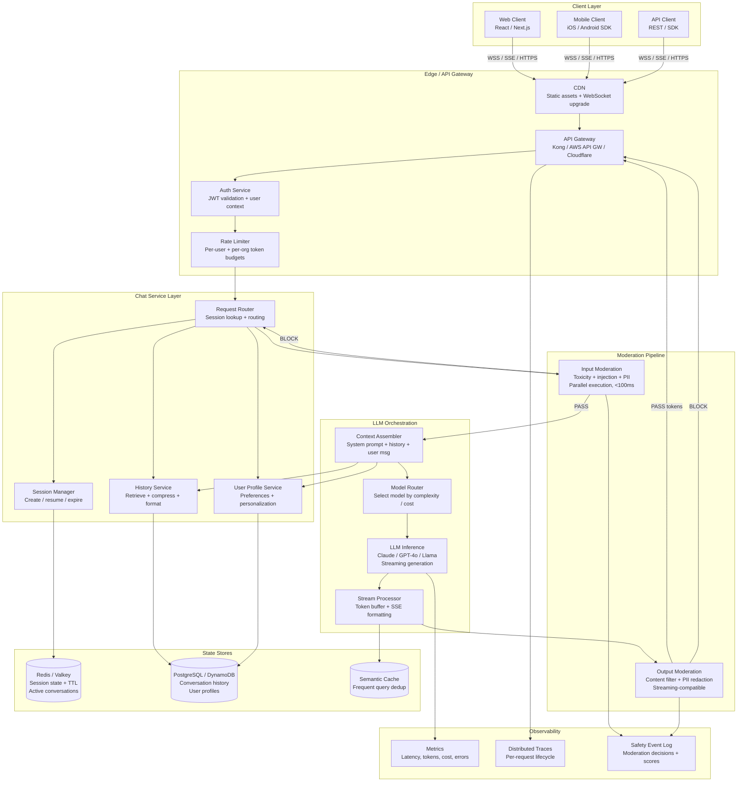
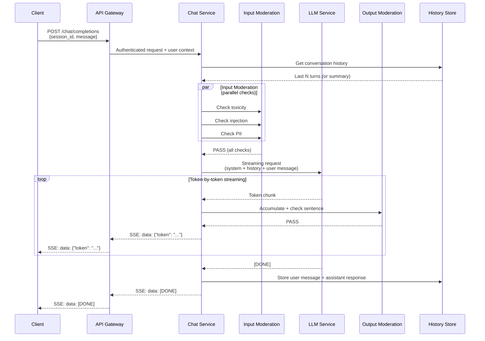

# Chatbot Architecture

## 1. Overview

A production chatbot is not an LLM behind an HTTP endpoint. It is a stateful, multi-layered system that manages user sessions across devices, retrieves and compresses conversation history, enforces content safety on both inputs and outputs, streams tokens to clients in real time, and does all of this within a latency budget that makes the interaction feel conversational. The LLM is the core reasoning engine, but the architectural complexity lives in everything surrounding it.

For Principal AI Architects, chatbot design is the canonical GenAI system design problem because it forces decisions across every major axis: state management (stateless API vs. stateful sessions), latency (streaming vs. batch), safety (moderation pipeline depth vs. response time), context (how much history to carry, in what form), and personalization (user profiles, preferences, tone adaptation). Every other GenAI application --- copilots, search, agents --- builds on the patterns established here.

**Key numbers that shape chatbot architecture:**

- Time-to-First-Token (TTFT): 200--500ms is acceptable; >1s feels broken. Users begin reading at TTFT, so perceived latency is dominated by this metric, not total generation time.
- Streaming inter-token latency (ITL): 15--40ms per token (30--60 tokens/s) produces a natural reading pace. Below 15ms, text appears too fast to read; above 60ms, the stream feels sluggish.
- Conversation history: The average multi-turn session is 8--15 turns. At ~500 tokens/turn, a full session consumes 4K--7.5K tokens of history context --- manageable in 128K-context models, expensive in cost if naively stuffed.
- Session duration: Median chat session lasts 5--15 minutes. Power users maintain sessions over hours or days, requiring durable state.
- Moderation latency budget: Input moderation must complete in <100ms to avoid perceptible delay. Output moderation runs concurrently with streaming, adding 0ms to perceived latency if implemented correctly.
- Concurrent sessions per instance: A well-architected stateless backend handles 1K--10K concurrent WebSocket/SSE connections per node; session state is externalized to Redis or DynamoDB.
- Cost per conversation: $0.01--0.10 for GPT-4o-mini class models (10--20 turns), $0.10--2.00 for GPT-4o / Claude Sonnet class models. History management directly controls cost by determining how many tokens are sent per turn.

---

## 2. Requirements

### Functional Requirements

| Requirement | Description |
|---|---|
| Multi-turn conversation | Maintain coherent context across turns within a session. Support topic switching and context reset. |
| Streaming responses | Deliver tokens incrementally as they are generated. Support SSE and WebSocket transports. |
| Conversation history | Persist, retrieve, and manage conversation history. Support multiple history strategies (windowed, summarized, full). |
| Session management | Create, resume, and expire sessions. Support multi-device session sync. |
| User authentication | Authenticate users, load personalization profiles, enforce per-user rate limits. |
| Content moderation | Filter unsafe inputs before they reach the LLM. Filter unsafe outputs before they reach the user. |
| Personalization | Adapt tone, style, and knowledge scope based on user profile and preferences. |
| Graceful degradation | Provide meaningful responses when the LLM is slow, unavailable, or rate-limited. |

### Non-Functional Requirements

| Requirement | Target | Rationale |
|---|---|---|
| TTFT (p50) | <500ms | Users expect immediate acknowledgment of their message. |
| TTFT (p99) | <2s | Tail latency beyond 2s triggers abandonment. |
| End-to-end latency (short response) | <3s | For 100-token responses, total time including moderation. |
| Availability | 99.9% | Chat is a primary user interaction channel. |
| Concurrent sessions | 100K+ | Enterprise deployments serve thousands of simultaneous users. |
| Message throughput | 10K--100K messages/min | Peak traffic during business hours or events. |
| History retention | 30--90 days | Compliance and user experience requirements. |
| Moderation recall | >95% for critical categories | False negatives on violence, CSAM, self-harm are unacceptable. |
| Moderation false positive rate | <2% | Excessive blocking degrades user experience. |

---

## 3. Architecture

### 3.1 End-to-End Chatbot Architecture



### 3.2 Streaming Response Architecture



---

## 4. Core Components

### 4.1 Session Management

Session management governs the lifecycle of a conversation --- creation, resumption, multi-device sync, and expiration. A session is the unit of conversational continuity; losing session state is equivalent to the chatbot forgetting who the user is and what they were talking about.

**Session state model:**

```
Session {
    session_id: UUID
    user_id: string
    created_at: timestamp
    last_active_at: timestamp
    ttl: duration (default 24h, configurable)
    metadata: {
        device_id: string
        client_type: "web" | "mobile" | "api"
        model_preference: string
        system_prompt_version: string
    }
    turn_count: int
    token_usage: { input: int, output: int }
}
```

**Storage strategy:**

| Store | Data | TTL | Purpose |
|---|---|---|---|
| Redis / Valkey | Active session state | 1--24 hours | Fast lookup for in-progress conversations. Session ID is the key. |
| PostgreSQL / DynamoDB | Full conversation history | 30--90 days | Durable storage for history retrieval, analytics, and compliance. |
| Client-side (cookie/localStorage) | Session ID only | Session duration | Enables session resumption without server-side session lookup on every request. |

**Multi-device sync:** When a user starts a conversation on mobile and continues on desktop, the session must be seamlessly resumed. Implementation: the session is keyed by `user_id`, not `device_id`. On connection, the client sends `user_id + session_id` (if known) or `user_id` alone. The server looks up the most recent active session for that user. Conflict resolution: last-write-wins for metadata; conversation history is append-only and always consistent.

**Session expiration and cleanup:** Sessions expire after a configurable inactivity TTL (typically 1--24 hours). Redis TTL handles automatic expiration of active session state. Before expiration, the session's conversation history is persisted to durable storage. A background job garbage-collects orphaned sessions.

### 4.2 Conversation History Management

History management is the single largest lever for controlling context quality, cost, and latency. The choice of history strategy determines how many tokens the LLM sees per turn, which directly impacts response quality (more context = more coherent), cost (more tokens = higher cost), and latency (more input tokens = slower prefill).

**Strategy 1: Full History (Naive)**

Send the complete conversation history on every turn. At turn N, the LLM receives all N-1 previous turns plus the system prompt plus the new user message.

- Pros: Maximum context. The model has perfect recall of everything discussed.
- Cons: Token count grows linearly with turns. A 20-turn conversation at 500 tokens/turn = 10K history tokens per request. At $10/M input tokens (GPT-4o), a 20-turn conversation costs ~$0.10 in history alone. Context window overflow becomes a risk for long conversations.
- When to use: Short conversations (<10 turns), latency-insensitive applications, when perfect recall is required.

**Strategy 2: Sliding Window**

Keep only the last K turns (typically K=5--10). Older turns are dropped from the context.

- Pros: Bounded token usage regardless of conversation length. Predictable cost and latency.
- Cons: The model forgets earlier context. If the user references something from turn 2 at turn 15, the model has no memory of it.
- Implementation: Maintain a ring buffer of the last K turns in session state. On each new turn, push the new turn and pop the oldest if the buffer exceeds K.
- When to use: Casual conversations, customer support (most context is in the last few turns), cost-sensitive deployments.

**Strategy 3: Summarization**

Periodically summarize older history into a condensed paragraph, keeping recent turns in full. The LLM receives: system prompt + history summary + last K turns + new message.

- Pros: Preserves essential context from the full conversation without linear token growth. A 50-turn conversation can be represented in ~500 tokens of summary + ~2500 tokens of recent turns.
- Cons: Summarization introduces information loss and potential distortion. The summary is generated by an LLM call, adding latency (500--1500ms) and cost. The summary itself can hallucinate or omit important details.
- Implementation: Trigger summarization every K turns (e.g., every 5 turns). Use a smaller, faster model (GPT-4o-mini, Claude Haiku) for summarization. Cache the summary in session state; update incrementally by summarizing the previous summary + new turns.
- When to use: Long conversations (>10 turns), when cost control is important but context continuity is needed.

**Strategy 4: Hybrid (Production Standard)**

Combine sliding window with summarization and selective retrieval:

1. **Always include:** System prompt + user profile context.
2. **Summary block:** A running summary of the conversation so far (updated every 5--10 turns).
3. **Recent window:** The last 3--5 turns in full.
4. **Selective retrieval:** If the user's message references something specific from earlier ("What was that link you mentioned?"), embed the query and retrieve the most relevant earlier turns from the history store.

This hybrid approach provides: bounded token usage (~3K--5K tokens of history regardless of conversation length), essential context preservation (via summary), perfect recent context (via window), and on-demand deep recall (via retrieval).

**Token budget allocation (128K context model):**

| Component | Token Budget | Notes |
|---|---|---|
| System prompt | 500--2000 | Persona, instructions, guardrails, tool definitions |
| User profile / personalization | 200--500 | Preferences, prior interactions summary |
| History summary | 500--1000 | Running summary of earlier conversation |
| Recent turns (window) | 2000--4000 | Last 3--5 full turns |
| Retrieved context (RAG) | 2000--8000 | If the chatbot has a knowledge base |
| Current user message | 50--500 | The new input |
| Generation headroom | 1000--4000 | Space for the response |
| **Total** | **~6K--20K** | Well within 128K, but cost-optimized |

### 4.3 Streaming Responses

Streaming is not optional for production chatbots. Users expect to see tokens appear progressively, simulating a "typing" experience. Without streaming, the user stares at a blank response area for 2--10 seconds, which feels broken.

**Transport protocols:**

| Protocol | Mechanism | Pros | Cons | When to Use |
|---|---|---|---|---|
| **Server-Sent Events (SSE)** | HTTP/1.1 or HTTP/2 long-lived connection. Server pushes `data:` frames. | Simple, works through proxies/CDNs, automatic reconnection, native browser support via `EventSource`. | Unidirectional (server → client only). Client must open a new HTTP request for each message. | Default choice for web chatbots. Used by OpenAI, Anthropic, and most LLM APIs. |
| **WebSocket** | Full-duplex TCP connection. Bidirectional message framing. | Bidirectional, lower overhead per message, supports binary data. | More complex to operate (connection lifecycle, load balancer affinity, proxy compatibility). | When the client needs to send multiple messages on the same connection (e.g., interrupt/cancel mid-stream, real-time typing indicators). |
| **Chunked Transfer Encoding** | HTTP/1.1 chunked response body. Server writes chunks as they become available. | Simplest implementation (just flush output buffer). | No structured framing. Client must parse the stream manually. No built-in reconnection. | Low-level or embedded clients where SSE is not available. |

**SSE implementation pattern:**

The server sends the following event stream format (OpenAI-compatible):

```
data: {"id":"chatcmpl-abc","choices":[{"delta":{"content":"Hello"}}]}

data: {"id":"chatcmpl-abc","choices":[{"delta":{"content":" world"}}]}

data: [DONE]
```

Each `data:` line contains a JSON object with the incremental token. The client accumulates tokens and renders them progressively.

**Streaming with output moderation:**

The challenge: output moderation needs to evaluate the response for safety, but the response is generated token by token. You cannot wait for the full response (that defeats streaming) and you cannot moderate individual tokens (too granular for semantic analysis).

Solution: **sentence-level buffering.** Accumulate tokens until a sentence boundary is detected (period, question mark, newline). Moderate the accumulated sentence. If it passes, flush it to the client. If it fails, terminate the stream and send a fallback message. This adds ~0--100ms of buffering delay (the time to accumulate one sentence) but enables meaningful output moderation without breaking the streaming experience.

### 4.4 Moderation Pipeline

The moderation pipeline is a bidirectional filter --- inspecting user inputs before they reach the LLM and inspecting LLM outputs before they reach the user. In a chatbot, moderation is on the critical path of every request and must operate within tight latency constraints.

**Input moderation (pre-LLM):**

Run the following checks in parallel to minimize latency:

1. **Prompt injection detection** (5--15ms): Regex scanner + fine-tuned DeBERTa classifier. Catches attempts to override system instructions.
2. **Toxicity detection** (20--80ms): OpenAI Moderation API or self-hosted Detoxify. Catches hate speech, threats, self-harm content.
3. **PII detection** (10--30ms): Presidio or AWS Comprehend. Detects and optionally redacts email, phone, SSN, credit card numbers.
4. **Topic classification** (5--15ms): Embedding similarity or fine-tuned classifier. Ensures the input is within the chatbot's intended scope.

Parallel execution: all four checks run concurrently. Total latency = max(individual latencies) = ~80ms, not sum = ~140ms. If any critical check fails, the request is blocked immediately.

**Output moderation (post-LLM):**

1. **Content filtering** (10--50ms per sentence): Toxicity and policy compliance check on accumulated sentence buffers.
2. **PII redaction** (5--15ms): Detect and mask PII that the LLM may have generated (user PII echoed back, training data leakage).
3. **System prompt leakage detection** (1--5ms): Fuzzy match between output tokens and system prompt text. Block if similarity exceeds threshold.

**Moderation decisions:**

| Check Result | Action | User Experience |
|---|---|---|
| Input: injection detected | Block + log | "I can't process that request. Please rephrase." |
| Input: toxic content | Block + log | "Please keep the conversation respectful." |
| Input: PII detected | Redact + continue | PII masked before reaching LLM; response proceeds normally. |
| Input: off-topic | Redirect | "I'm designed to help with [topic]. How can I assist you?" |
| Output: toxic content | Terminate stream + fallback | "I apologize, but I'm unable to complete that response." |
| Output: PII leakage | Redact in-stream | PII tokens replaced with [REDACTED] before reaching client. |
| Output: prompt leakage | Terminate stream + fallback | Generic fallback response. |

### 4.5 Multi-Turn Context Management

Multi-turn context is what makes a chatbot conversational rather than a glorified search box. The system must carry context across turns (co-reference resolution, topic continuity) while handling topic switches and context resets gracefully.

**Context carry-over:** The LLM naturally handles co-reference ("What about the blue one?" after discussing products) as long as the prior turns are in its context window. The history management strategy (Section 4.2) determines how far back context extends.

**Topic switching:** Users naturally switch topics mid-conversation. The chatbot must detect topic switches and decide whether to carry forward the old context or start fresh. Implementation: track topic via a lightweight classifier on each turn. When a topic switch is detected, optionally summarize the old topic and begin a new context block.

**Context reset:** Some applications provide an explicit "New conversation" button that clears session state and starts a fresh context. This is important for privacy (user does not want previous conversation to influence new responses) and for clarity (the model does not confuse old and new topics).

**System prompt versioning:** The system prompt defines the chatbot's persona, capabilities, and constraints. When the system prompt changes (new feature, policy update), existing sessions should transition gracefully. Implementation: store `system_prompt_version` in session state. On each turn, check if the current system prompt version matches the session's version. If not, inject a transitional instruction ("Note: my capabilities have been updated. Previous context remains available.") and update the session's version.

---

## 5. Data Flow

### Step-by-Step Request Lifecycle

1. **Client sends message.** The user types a message and sends it via SSE POST or WebSocket frame. The request includes `session_id`, `message`, and optional metadata (device, locale).

2. **API Gateway authenticates and rate-limits.** JWT validation extracts `user_id`. Per-user and per-organization rate limits are checked against Redis counters. If rate-limited, return 429 with retry-after header.

3. **Session lookup/creation.** The chat service looks up the session in Redis by `session_id`. If found, load session state (turn count, metadata). If not found, create a new session, persist to Redis, and initialize.

4. **Conversation history retrieval.** The history service fetches the conversation history from durable storage (PostgreSQL/DynamoDB). Apply the configured history strategy: window, summary, or hybrid. Return the formatted history block.

5. **Input moderation (parallel).** The user's message is sent to all input moderation checks concurrently. Results are aggregated. If any critical check fails (injection, toxicity above threshold), return a block response and log the event. If PII is detected, redact before continuing.

6. **Context assembly.** The context assembler constructs the full prompt: system prompt + user profile context + history summary + recent turns + current user message. Token budget is enforced --- if the assembled context exceeds the budget, the history is truncated or further summarized.

7. **Model routing.** The model router selects the appropriate model based on configuration: message complexity (simple → fast/cheap model, complex → capable model), user tier (free → GPT-4o-mini, premium → GPT-4o), current load (fallback to alternative provider if primary is overloaded).

8. **LLM inference (streaming).** The request is sent to the LLM inference endpoint. Tokens begin streaming back.

9. **Output moderation (streaming).** Tokens are buffered at sentence boundaries. Each accumulated sentence is checked by output moderation. Passing sentences are flushed to the client via SSE. Failing sentences trigger stream termination.

10. **Response delivery.** Tokens are delivered to the client via SSE or WebSocket. The client renders them progressively.

11. **History persistence.** After the response is complete, both the user message and the assistant response are persisted to the history store. Token counts are updated in the session state.

12. **Session update.** The session's `last_active_at`, `turn_count`, and `token_usage` are updated in Redis. The TTL is refreshed.

---

## 6. Key Design Decisions / Tradeoffs

### History Strategy Selection

| Strategy | Token Cost/Turn | Context Quality | Latency | Implementation Complexity | Best For |
|---|---|---|---|---|---|
| Full history | O(N) growing | Perfect recall | Increasing with turns | Low | Short conversations, < 10 turns |
| Sliding window (K=5) | O(1) fixed ~2.5K | Good for recent context, no long-term memory | Constant | Low | Customer support, casual chat |
| Summarized | O(1) fixed ~1.5K | Good overall, lossy | +500ms for summary generation | Medium | Long conversations, cost-sensitive |
| Hybrid (summary + window + retrieval) | O(1) fixed ~4K | Best overall: recent + summary + on-demand recall | +50ms for retrieval (amortized) | High | Production chatbots with long sessions |

### Streaming Transport Selection

| Transport | Complexity | Browser Support | Proxy/CDN Compatibility | Bidirectional | Reconnection | Best For |
|---|---|---|---|---|---|---|
| SSE | Low | Native (`EventSource`) | Excellent | No | Automatic | Default for web chatbots |
| WebSocket | Medium | Native | Poor (requires sticky sessions) | Yes | Manual | Real-time bidirectional (interrupts, typing indicators) |
| Chunked HTTP | Lowest | Manual parsing | Good | No | None | Embedded/IoT clients |

### Session State Store Selection

| Store | Latency | Durability | TTL Support | Multi-Device | Cost | Best For |
|---|---|---|---|---|---|---|
| Redis / Valkey | <1ms | Volatile (configurable persistence) | Native | Via user_id key | Medium | Active session state |
| DynamoDB | 5--10ms | Durable | TTL attribute | Via GSI on user_id | Low at scale | Session + history combined |
| PostgreSQL | 5--20ms | Durable | Via cron job | Via user_id index | Low | History storage, complex queries |

### Moderation Depth vs. Latency

| Configuration | Input Latency | Output Latency | Safety Coverage | Cost/Request | Best For |
|---|---|---|---|---|---|
| Regex only | <1ms | <1ms | 30--40% (known patterns only) | ~$0 | Internal tools, low-risk |
| Classifier-based (parallel) | 20--80ms | 10--50ms/sentence | 85--92% | ~$0.001 | Production default |
| Classifier + LLM-as-judge | 100--300ms | 50--200ms/sentence | 92--97% | ~$0.01 | High-risk public-facing |
| Full pipeline (classifier + LLM + Llama Guard) | 150--500ms | 100--300ms/sentence | 95--99% | ~$0.02 | Regulated industries, child safety |

---

## 7. Failure Modes

### 7.1 Session State Loss

**Symptom:** User sends a follow-up message and the chatbot has no memory of the conversation. "As I mentioned earlier..." is met with a confused response.

**Root cause:** Redis eviction under memory pressure, session TTL expiration during an active conversation, or failover to a new Redis node without replication.

**Mitigation:** Use Redis with AOF persistence or Redis Cluster with replication. Implement a fallback: on session miss, attempt to reconstruct state from the durable history store (PostgreSQL/DynamoDB). Set TTL generously (24h) and refresh on every interaction. Monitor Redis memory utilization and eviction counts.

### 7.2 Streaming Connection Drop

**Symptom:** The response cuts off mid-sentence. The client shows a partial response.

**Root cause:** Network interruption, proxy timeout (many proxies timeout idle HTTP connections after 60--120s), client backgrounding (mobile), or server-side error during generation.

**Mitigation:** Implement client-side reconnection with resume. Store the response-in-progress in session state (keyed by request ID). On reconnect, the client sends the last received token offset, and the server resumes streaming from that point. For SSE, the `Last-Event-ID` header provides this natively. Set proxy timeouts appropriately (>300s for long-generation responses).

### 7.3 Context Window Overflow

**Symptom:** The LLM returns an error (context length exceeded) or silently truncates the input, causing incoherent responses.

**Root cause:** Full history strategy without token budget enforcement. A 50-turn conversation can easily exceed 25K tokens of history, and combined with a large system prompt and RAG context, overflow a 32K context window.

**Mitigation:** Enforce a hard token budget for each context component. Implement automatic fallback: if the assembled context exceeds the budget, switch from full history to sliding window, then to summarized. Monitor context size per request and alert when it approaches the limit.

### 7.4 Moderation False Positive Cascade

**Symptom:** Legitimate messages are blocked at increasing rates. Users report that the chatbot is "refusing to answer anything."

**Root cause:** An overly sensitive moderation classifier, a lowered threshold in response to a safety incident, or a new classifier version with higher false positive rates.

**Mitigation:** Monitor moderation block rates in real time. Set alerts when block rate exceeds 2x the baseline. A/B test moderation changes in shadow mode before enforcement. Provide a user appeal mechanism ("This was blocked incorrectly") that feeds into classifier retraining.

### 7.5 LLM Provider Outage

**Symptom:** All responses fail with 5xx errors. Or TTFT spikes to >10s.

**Root cause:** The LLM API provider (OpenAI, Anthropic, etc.) experiences an outage or degradation.

**Mitigation:** Multi-provider routing with automatic failover. Configure a primary and secondary model provider. The model router detects degradation (error rate >5% or TTFT >3s) and shifts traffic to the secondary. For cost reasons, the secondary can be a smaller/cheaper model with a user-facing notice ("Responses may be less detailed than usual while we recover from a service issue").

### 7.6 Token Cost Explosion

**Symptom:** Monthly LLM API costs spike 3--10x without a corresponding increase in traffic.

**Root cause:** A history management bug sends full conversation history instead of windowed/summarized. Or a configuration change increases the system prompt size. Or a regression disables semantic caching.

**Mitigation:** Track tokens-per-request as a first-class metric. Alert on sudden increases. Implement per-user and per-session token budgets with hard caps. Log the full context size breakdown (system prompt, history, RAG, user message) for every request.

---

## 8. Real-World Examples

### ChatGPT (OpenAI)

ChatGPT is the reference implementation for conversational AI at scale, serving 200M+ weekly active users as of late 2024. The architecture includes: session management via a persistent conversation model (conversations are first-class entities with titles, branching, and sharing), full history within the context window (with truncation for very long conversations), SSE streaming with markdown rendering, a multi-layered moderation pipeline (OpenAI Moderation API + system-level content policy + model-level alignment), and model routing across GPT-4o, GPT-4o-mini, and o-series reasoning models based on user subscription tier and query complexity. ChatGPT's "memory" feature (2024) adds cross-session personalization --- the system extracts and persists user facts across conversations, injected as additional context on subsequent sessions.

### Claude (Anthropic)

Anthropic's Claude chat interface implements project-based conversations where users can upload documents as persistent context (up to 500 pages), long-context handling with 200K token windows (enabling full conversation history for most sessions without truncation), SSE streaming with LaTeX and code rendering, Constitutional AI-based moderation (safety trained into the model) complemented by runtime guardrails, and artifacts (interactive code, documents, and visualizations generated inline). Claude's architectural distinction is the reliance on long context windows to reduce the need for complex history management --- with 200K tokens, most conversations fit in full.

### Intercom Fin (Intercom)

Intercom's Fin is an enterprise customer support chatbot built on RAG + conversation history. The architecture includes: integration with the customer's help center (knowledge base), conversation history scoped to the support ticket, handoff to human agents when confidence is low, multi-turn context within the support interaction, and customizable persona and tone per organization. Fin demonstrates the pattern of chatbot-as-integration: the chatbot is embedded within an existing product (Intercom's support platform) rather than being a standalone application.

### Character.ai

Character.ai serves billions of messages per day across millions of custom chatbot personas. Their architecture optimizes for: extremely high throughput (custom inference infrastructure, likely with distilled models), persona consistency across long conversations (persona definition as a persistent system prompt), multi-turn memory within a session, and lightweight moderation (broader content policy than enterprise chatbots). Character.ai's scale drove innovations in inference efficiency --- they reportedly serve more messages per day than many traditional social platforms.

### Microsoft Copilot (Bing Chat)

Microsoft Copilot integrates chatbot functionality with web search, demonstrating the RAG-augmented chatbot pattern. Key architectural elements: real-time web search triggered by the chatbot for factual queries, citation injection in streaming responses, multi-turn context with conversation reset after a configurable turn limit, and integration with Microsoft's broader Copilot ecosystem (Microsoft 365, Windows). The conversation turn limit (originally 5, later expanded) is an architectural constraint that simplifies history management and controls cost.

---

## 9. Related Topics

- [Context Management](../prompt-engineering/context-management.md) --- Token budgeting strategies, context window optimization, and prompt assembly patterns used in conversation history management.
- [Guardrails](../safety/guardrails.md) --- Deep dive into moderation frameworks (Guardrails AI, NeMo Guardrails, Llama Guard) that implement the chatbot's safety pipeline.
- [Latency Optimization](../performance/latency-optimization.md) --- End-to-end latency analysis, TTFT optimization, and streaming delivery patterns.
- [Model Routing](../patterns/model-routing.md) --- Cost/latency-based model selection logic used by the chatbot's model router.
- [Model Serving](../llm-architecture/model-serving.md) --- LLM inference infrastructure (vLLM, TGI, TensorRT-LLM) that backs the chatbot's generation layer.
- [RAG Pipeline](../rag/rag-pipeline.md) --- Knowledge-grounded chatbots use RAG to retrieve context from external knowledge bases.
- [PII Protection](../safety/pii-protection.md) --- PII detection and redaction in both input and output moderation stages.
- [Prompt Injection](../prompt-engineering/prompt-injection.md) --- Injection detection as a critical input moderation component.

---

## 10. Source Traceability

| Concept | Primary Source |
|---|---|
| SSE (Server-Sent Events) | W3C, "Server-Sent Events" specification (2015); MDN Web Docs |
| OpenAI Chat Completions API | OpenAI, "Chat Completions API Reference" (2023--present) |
| Conversation history strategies | LangChain documentation, "Memory" module (2023--2024); LlamaIndex "Chat Engine" patterns |
| Sliding window memory | LangChain, `ConversationBufferWindowMemory` (2023) |
| Summary memory | LangChain, `ConversationSummaryMemory` and `ConversationSummaryBufferMemory` (2023) |
| Lost-in-the-middle | Liu et al., "Lost in the Middle: How Language Models Use Long Contexts" (2024) |
| Prompt injection detection | Perez & Ribeiro, "Ignore This Title and HackAPrompt" (2023); OWASP LLM Top 10 (2024) |
| OpenAI Moderation API | OpenAI, "Moderation API Reference" (2023--present) |
| Llama Guard | Inan et al., "Llama Guard: LLM-based Input-Output Safeguard for Human-AI Conversations" (Meta, 2023) |
| ChatGPT architecture | OpenAI, "Introducing ChatGPT" (2022); OpenAI engineering blog posts (2023--2025) |
| Claude chat architecture | Anthropic, "Claude" product documentation (2024--2025) |
| Character.ai scale | Character.ai engineering blog; press reports on inference volume (2024) |
| Semantic caching | GPTCache documentation (Zilliz, 2023); Langchain semantic cache patterns |
| WebSocket protocol | RFC 6455, "The WebSocket Protocol" (2011) |
