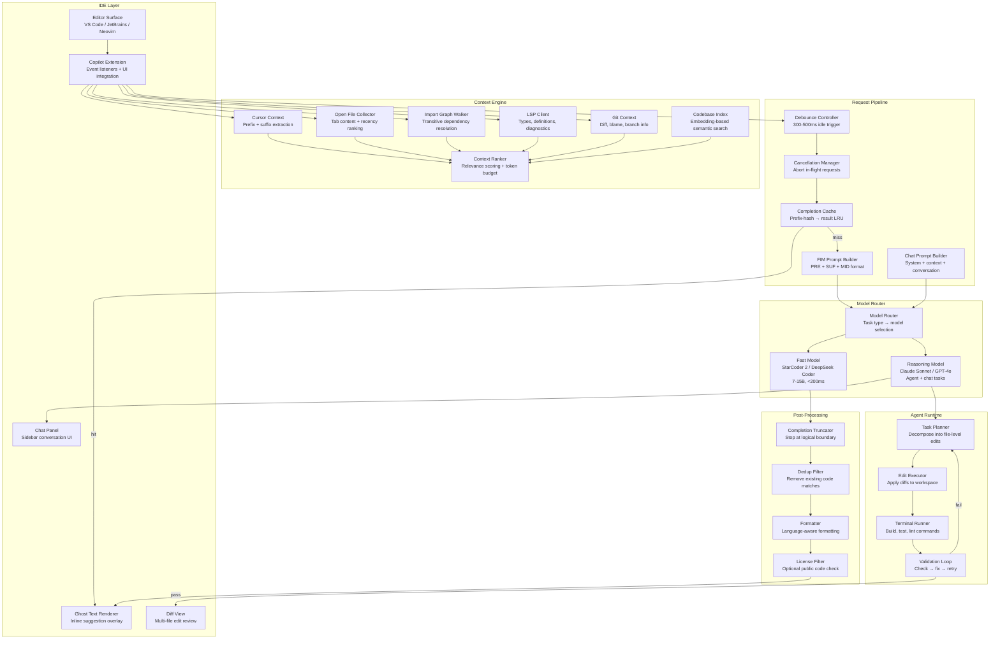
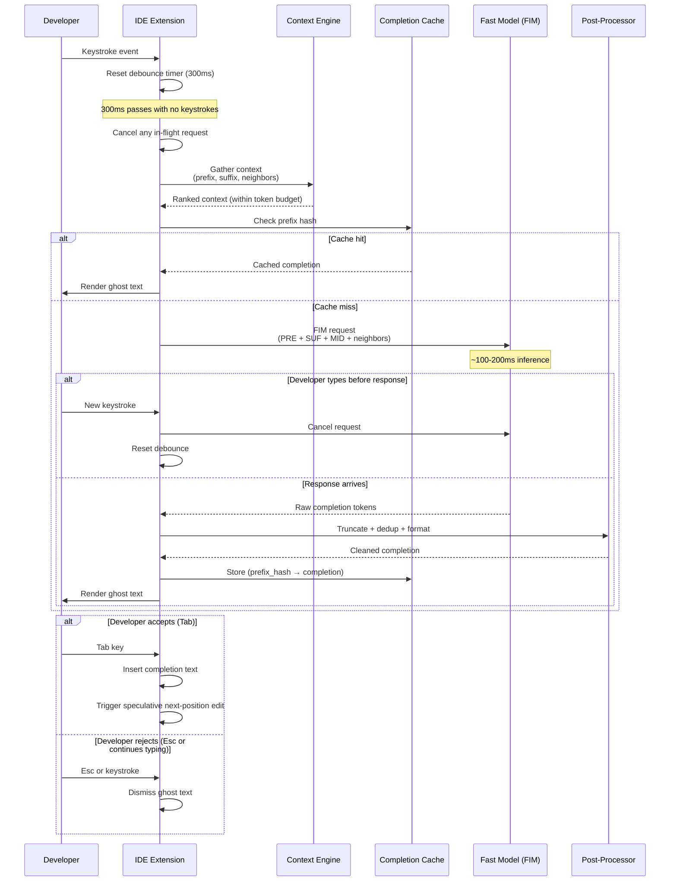

# Copilot Architecture (AI-Assisted Development)

## 1. Overview

An AI copilot is a real-time coding assistant embedded in the developer's IDE that provides inline code completions, chat-based code generation, multi-file editing, and increasingly autonomous agentic task execution. Unlike a standalone chatbot, a copilot operates under extreme latency constraints (inline completions must appear in <300ms), requires deep integration with the IDE's editing model (LSP, extension APIs, ghost text rendering), and must gather rich codebase context (open files, imports, git state, type definitions) to produce suggestions that are not just syntactically valid but semantically correct within the developer's project.

For Principal AI Architects, copilot design is a study in latency-constrained inference, intelligent context assembly under tight token budgets, and multi-modal interaction (inline completions, chat, multi-file diffs, agent loops). The architecture must serve two fundamentally different interaction modes --- sub-second inline completions using small, fast models with Fill-in-the-Middle (FIM) and multi-minute agentic editing sessions using large reasoning models --- through a unified context engine and model routing layer.

**Key numbers that shape copilot architecture:**

- Inline completion latency budget: <300ms end-to-end (keystroke → ghost text rendered). This is the hard constraint --- anything slower and the developer has already typed past the suggestion.
- Debounce interval: 300--500ms after the last keystroke before triggering a completion request. Prevents wasteful requests during rapid typing.
- FIM model inference: 50--200ms for 7B--15B parameter models (StarCoder 2, DeepSeek Coder) generating 1--3 lines.
- Chat mode TTFT: 500ms--2s acceptable. Users tolerate chat latency because they explicitly asked a question and are waiting for a response.
- Agent mode duration: 30s--15min per task. Users expect background execution with status updates.
- Code suggestion acceptance rate: 25--35% for inline completions (GitHub Copilot data), improving to 60--80% for agentic multi-step tasks with human review.
- Context token budget: 2K--8K for inline completions (fast model), 32K--200K for chat/agent mode (reasoning model).
- Average codebase size: 100K--10M lines of code for enterprise projects. Context engine must select the right 0.01--1% of the codebase to include.
- Completion cancellation rate: 40--60% of completion requests are cancelled before the response arrives (user continued typing). The system must handle cancellation gracefully without wasting resources.

---

## 2. Requirements

### Functional Requirements

| Requirement | Description |
|---|---|
| Inline code completion | Ghost text suggestions that appear as the developer types. Single-line and multi-line. FIM-based. |
| Chat mode | Conversational code Q&A in a sidebar panel. Supports code explanations, refactoring, test generation. |
| Multi-file editing | Generate edits across multiple files from a single instruction. Present as reviewable diffs. |
| Agent mode | Autonomous task execution: read code, plan changes, edit files, run commands, iterate on errors. |
| Context gathering | Automatically gather relevant context: open files, imports, LSP data, git state, codebase index. |
| IDE integration | Deep integration with VS Code, JetBrains, Neovim via extension APIs and LSP. |
| Code actions | Inline actions: explain code, fix error, generate docstring, write tests for selection. |
| Model selection | Route requests to appropriate models based on task type and latency requirements. |

### Non-Functional Requirements

| Requirement | Target | Rationale |
|---|---|---|
| Inline completion latency (p50) | <200ms | Must feel instantaneous; anything slower disrupts typing flow. |
| Inline completion latency (p99) | <500ms | Tail latency must not cause noticeable stutter. |
| Chat TTFT (p50) | <1s | Comparable to web chatbot expectations. |
| Completion cancellation handling | <10ms | Must release server resources immediately on cancel. |
| Availability | 99.9% | Developers rely on completions; outages break flow. |
| Context freshness | <1s | File saves must be reflected in subsequent completions within 1 second. |
| Privacy | Zero retention | Enterprise customers require that code never persists on provider servers. |

---

## 3. Architecture

### 3.1 End-to-End Copilot Architecture



### 3.2 Inline Completion Data Flow



---

## 4. Core Components

### 4.1 IDE Integration Layer

The IDE integration layer bridges the gap between the IDE's editing model and the copilot's inference pipeline. It captures editing events, manages UI elements (ghost text, chat panel, diff views), and coordinates with IDE APIs.

**Extension API integration points:**

| IDE | Extension API | Ghost Text Mechanism | LSP Integration | Chat UI |
|---|---|---|---|---|
| VS Code | Extension API v1 | `InlineCompletionItemProvider` | Built-in LSP client | WebView panel |
| JetBrains | IntelliJ Platform Plugin SDK | `InlineCompletionProvider` | Built-in PSI + external LSP | Tool window |
| Neovim | Lua plugin API | Virtual text / extmarks | nvim-lspconfig | Floating window |

**Ghost text rendering:** When a completion is available, the extension inserts it as semi-transparent "ghost text" at the cursor position using the IDE's inline completion API. The text is not part of the document --- it is an overlay that the developer can accept (Tab), dismiss (Esc), or cycle through alternatives (Alt+]). The rendering must be flicker-free and must not interfere with the developer's typing.

**Event handling:**

| Event | Action | Latency Constraint |
|---|---|---|
| Keystroke | Reset debounce timer. Cancel in-flight request. | <5ms |
| Cursor move | New context. Trigger completion if idle. | <5ms |
| File save | Update context engine. Refresh LSP diagnostics. | <100ms |
| File open/close | Update open files list. Re-rank context. | <100ms |
| Git checkout | Invalidate codebase index. Refresh git context. | <1s |

### 4.2 Context Engine

The context engine is the copilot's most architecturally consequential component. The quality of generated code is bounded by the quality of context provided to the model. A copilot that generates a function without knowing the types it should accept, the patterns used in the codebase, or the test expectations will produce code that compiles but does not fit.

**Context sources (ranked by impact on completion quality):**

**1. Prefix and suffix (FIM context):** The code immediately before and after the cursor. This is the primary signal for inline completion. The prefix provides intent ("what is the developer writing?") and the suffix provides constraint ("what must the generated code be consistent with?"). Typical budget: 1K--4K tokens prefix, 256--1K tokens suffix.

**2. Open files (neighbor context):** Files the developer has recently viewed or edited. The rationale is simple: developers open files that are relevant to their current task. Rank by recency and relationship to the current file (same directory > same package > other). Typical budget: 1K--3K tokens across 2--4 files (truncated to signatures and relevant sections).

**3. Import graph:** Follow import statements from the current file to resolve types and function signatures. For a Python file importing `from auth.service import AuthService`, fetch the `AuthService` class definition. Depth-limited to 2--3 hops. Provides type information that prevents hallucinated interfaces.

**4. LSP data:** The Language Server Protocol provides machine-accurate information that no embedding model can match:
- **Type definitions:** Exact parameter types, return types, interface shapes.
- **Go-to-definition:** The actual implementation of referenced symbols.
- **Diagnostics:** Current type errors and warnings (useful for "fix this error" actions).
- **Symbol outline:** Class/function structure of files without implementation bodies.

**5. Git context:** `git diff` shows what the developer has changed in this session (likely related to the current edit). `git diff HEAD~5` shows recent changes that may indicate the broader task. Branch name often contains task context ("feature/add-pagination").

**6. Codebase index (semantic search):** For chat and agent modes, embed the user's request and retrieve semantically similar code chunks from a pre-built codebase index. This enables retrieval of relevant code from anywhere in the project, not just open files and imports. The index is built on project open and updated incrementally on file changes.

**Context assembly under token budget:**

```
Token budget allocation (inline completion, 6K total):
  Prefix (current file before cursor):     2000 tokens
  Suffix (current file after cursor):       500 tokens
  Neighbor files (open tabs, imports):     2000 tokens
  LSP type definitions:                     1000 tokens
  Git diff (recent changes):                500 tokens
  ---
  Total:                                    6000 tokens

Token budget allocation (chat/agent mode, 100K total):
  System prompt + instructions:             2000 tokens
  Codebase index retrieval (top chunks):   20000 tokens
  Full file content (relevant files):      50000 tokens
  Conversation history:                    10000 tokens
  User message:                             2000 tokens
  Generation headroom:                     16000 tokens
  ---
  Total:                                  100000 tokens
```

### 4.3 Fill-in-the-Middle (FIM) Completion

FIM is the training and inference technique that enables inline code completion where the model generates code that is consistent with both the code before AND after the cursor.

**Training objective:** Given a code document, randomly select a split point. The document becomes three segments: prefix (before the split), middle (the content to generate), suffix (after the split). The model is trained to predict the middle given the prefix and suffix using special tokens.

**FIM prompt format (varies by model):**

```
StarCoder 2:    <fim_prefix>{prefix}<fim_suffix>{suffix}<fim_middle>
DeepSeek Coder: <|fim_begin|>{prefix}<|fim_hole|>{suffix}<|fim_end|>
Code Llama:     <PRE> {prefix} <SUF> {suffix} <MID>
```

**Why FIM is architecturally critical:** Without FIM, the model can only generate left-to-right from the prefix. It has no knowledge of what comes after the cursor. This means:
- If the next line declares a type annotation, the model may generate code with the wrong type.
- If the function signature below expects a specific return value, the model may return something incompatible.
- If the developer is filling in the body of an existing function (cursor is between the signature and the closing brace), the model treats it as a continuation rather than a fill-in.

With FIM, the model "sees" both sides and generates code that is consistent with the surrounding context.

**Inference configuration for inline completion:**

```
temperature: 0.0      # Deterministic — same context should yield same suggestion
max_tokens: 128-256   # 1-5 lines for inline completion
stop_sequences: ["\n\n", "\nclass ", "\ndef ", "\nfunction ", "```"]
                      # Stop at logical boundaries — don't generate past the current block
```

### 4.4 Debouncing and Cancellation

In a typical typing session, the developer generates 3--5 keystrokes per second. Without debouncing, the copilot would fire 3--5 completion requests per second --- most of which are wasted because the context changes with each keystroke.

**Debounce strategy:** After each keystroke, start (or reset) a timer. Only trigger a completion request after the timer expires (300--500ms of no keystrokes). This means the system only requests completions during natural typing pauses.

**Cancellation strategy:** When a new keystroke arrives before the previous completion response, the in-flight request is cancelled. On the client side, the HTTP request is aborted. On the server side, the inference should be cancelled if the framework supports it (vLLM supports request cancellation; some API providers do not). Cancelled requests should not bill for tokens.

**Request lifecycle optimization:**

| Stage | Optimization |
|---|---|
| Debounce (client) | 300ms timer. Prevents unnecessary requests. |
| Cache check (client) | LRU cache keyed on prefix hash (last 500 chars). Hit rate: 10--30%. |
| Context assembly (client) | Pre-computed context updated on file change, not on keystroke. |
| Network (client → server) | Keep-alive connections. Connection pooling. Edge servers for low latency. |
| Inference (server) | Priority queue: newer requests preempt older. Cancelled request slots freed immediately. |
| Post-processing (server/client) | <5ms. Truncation and formatting are deterministic string operations. |

### 4.5 Chat Mode vs Inline Mode

The copilot serves two fundamentally different interaction patterns through the same context engine but different model routing and prompt strategies.

| Dimension | Inline Completion | Chat Mode |
|---|---|---|
| Trigger | Automatic (typing pause) | Explicit (user asks a question) |
| Model | Small, fast (7--15B FIM) | Large, capable (Claude Sonnet / GPT-4o) |
| Latency budget | <300ms | 1--3s TTFT, streaming |
| Context strategy | Prefix + suffix + neighbors | Full codebase search + conversation history |
| Token budget | 2K--8K input, 128--256 output | 32K--200K input, 2K--8K output |
| Output format | Raw code (inserted at cursor) | Markdown with code blocks, explanations |
| Interaction | Accept/reject ghost text | Conversational, multi-turn |
| Use cases | Line/block completion, fill-in | Explanation, refactoring, test generation, debugging |

### 4.6 Multi-File Editing

Multi-file editing is the bridge between chat and agent mode. The user provides a natural language instruction ("Add pagination to the users API"), and the copilot generates coordinated edits across multiple files (route handler, service layer, tests, types).

**Architecture:**

1. **Intent parsing:** Extract the task scope and constraints from the user's instruction.
2. **Context retrieval:** Search the codebase index and import graph to identify all affected files.
3. **Plan generation:** The reasoning model produces a plan: which files to modify and a description of changes for each.
4. **Parallel edit generation:** Generate edits for each file, using the plan + shared type definitions as context.
5. **Diff presentation:** Display edits as file-by-file diffs in the IDE's diff view.
6. **Review and apply:** The developer reviews each diff, accepts/rejects per file, and applies.

**Key challenge:** Consistency across files. If the model changes a function signature in file A, all call sites in files B, C, D must be updated consistently. This requires the plan step to identify interface contracts and the generation step to receive those contracts as context.

### 4.7 Agent Mode

Agent mode is the most autonomous interaction pattern. The copilot receives a task, decomposes it, reads and writes files, runs terminal commands, interprets results, and iterates until the task is complete.

**Agent loop:**

```
while task not complete and iteration < max_iterations:
    1. Reason about current state (what has been done, what remains)
    2. Decide next action (read file, edit file, run command, search codebase)
    3. Execute action via tool call
    4. Observe result (file content, command output, error message)
    5. Evaluate: is the task complete? Did the action succeed?
    6. If error: diagnose and plan correction
```

**Tool set for agent mode:**

| Tool | Purpose | Latency |
|---|---|---|
| `read_file(path)` | Read file content for context | <10ms |
| `write_file(path, content)` | Write or edit a file | <10ms |
| `search_codebase(query)` | Semantic search over codebase index | 50--200ms |
| `grep(pattern, path)` | Exact text search | <100ms |
| `run_command(cmd)` | Execute shell command (build, test, lint) | 1s--120s |
| `lsp_diagnostics(path)` | Get type errors and warnings | 100--500ms |
| `ask_user(question)` | Clarification from the developer | Human latency |

**Validation loop in agent mode:**

After generating edits, the agent runs the validation pipeline: lint → type check → test → security scan. If any stage fails, the error output is fed back to the model for correction. This loop is capped at 3--5 iterations to prevent cost runaway and divergent fixes.

---

## 5. Data Flow

### Inline Completion Request Lifecycle

1. **Developer types.** Keystroke event fires in the IDE. The debounce timer resets (300ms).

2. **Debounce expires.** 300ms of no keystrokes. The extension cancels any in-flight request and initiates a new completion request.

3. **Context assembly (client-side, <20ms).** The extension extracts: prefix (code before cursor, up to 2K tokens), suffix (code after cursor, up to 500 tokens), neighbor file content (open tabs ranked by recency, truncated to signatures), and LSP type data for referenced symbols.

4. **Cache check (client-side, <1ms).** Hash the last 500 characters of the prefix. Check the local LRU cache. If hit, render the cached completion immediately and skip inference.

5. **FIM prompt assembly.** Format the context into the model's FIM prompt format (`<fim_prefix>...<fim_suffix>...<fim_middle>`).

6. **Model inference (<200ms).** The request is sent to the inference endpoint. The fast model generates tokens until a stop sequence or max_tokens.

7. **Post-processing (<5ms).** Truncate the completion at a logical code boundary (end of statement, end of block). Remove any completion that duplicates existing code in the suffix. Apply language-specific formatting.

8. **Ghost text rendering (<5ms).** The completion is rendered as ghost text in the editor. The developer sees the suggestion overlaid at the cursor position.

9. **Accept or reject.** Tab inserts the completion. Any other keystroke dismisses it and restarts the cycle.

### Agent Mode Request Lifecycle

1. **User submits task.** "Add input validation to the user registration endpoint."

2. **Context retrieval (500ms--2s).** The context engine searches the codebase index for relevant files. The import graph is traversed from likely entry points. LSP provides type definitions for relevant symbols.

3. **Planning (2--10s).** The reasoning model produces a plan: which files to read, which to modify, and a description of changes for each. The developer reviews the plan.

4. **Execution loop (30s--15min).** For each planned change, the agent reads the target file, generates edits, and applies them to the workspace. After all edits, the agent runs the validation pipeline.

5. **Validation and iteration.** If tests fail, the agent reads the error output, diagnoses the issue, and generates corrective edits. This repeats up to 3--5 times.

6. **Review.** The final edits are presented as a diff view. The developer reviews and accepts/rejects per file.

---

## 6. Key Design Decisions / Tradeoffs

### Model Selection by Task Type

| Task | Model Class | Size | Latency | Cost/Request | Quality |
|---|---|---|---|---|---|
| Inline completion | FIM-trained code model | 7--15B | 50--200ms | $0.001--0.01 | Good for 1--5 line completions |
| Chat (explanation, refactoring) | Frontier reasoning | 70B+ / API | 1--3s TTFT | $0.01--0.10 | High for nuanced code understanding |
| Multi-file editing | Frontier reasoning | 70B+ / API | 5--30s total | $0.05--0.50 | High for coordinated changes |
| Agent mode | Frontier reasoning | 70B+ / API | 30s--15min | $0.10--5.00 | Highest for autonomous tasks |

### Context Strategy by Interaction Mode

| Context Source | Inline (6K budget) | Chat (100K budget) | Agent (200K budget) |
|---|---|---|---|
| Prefix/suffix | 2500 tokens (primary signal) | 500 tokens (supplementary) | N/A (reads full files) |
| Open files | 2000 tokens (truncated) | 5000 tokens (relevant portions) | Full content as needed |
| Import graph | 1000 tokens (type signatures only) | 5000 tokens (with implementations) | Full traversal |
| LSP data | 500 tokens (current file diagnostics) | 2000 tokens (project-wide) | On-demand per file |
| Codebase index | None (too slow for inline) | 20000 tokens (semantic search) | 50000 tokens (deep search) |
| Git context | None | 2000 tokens (recent diff) | Full diff + branch context |
| Conversation history | None | 10000 tokens | Full session |

### Context Retrieval Architecture

| Approach | Token Efficiency | Accuracy | Setup Time | Latency | Best For |
|---|---|---|---|---|---|
| Greedy expansion (open tabs + imports) | Medium | Medium | None | <20ms | Inline completion |
| Codebase indexing (embeddings) | High | High | Minutes (initial) | 50--200ms | Chat mode, large repos |
| Repo map (tree-sitter signatures) | High | High | Seconds | 1 LLM call | Agent mode planning |
| LSP-based (type definitions) | Highest | Highest | Language server startup | 10--100ms | Type-sensitive completions |
| Manual @-mention | Perfect | Perfect | Human effort | None | Explicit context selection |

### Privacy Model

| Model | Description | Latency Impact | Cost Impact | Enterprise Requirement |
|---|---|---|---|---|
| Cloud inference, no retention | Code sent to API, not stored. | Baseline | Baseline | Minimum for most enterprises. |
| Cloud inference, encrypted transit | TLS + additional encryption. | +5ms | +5% | Financial services, healthcare. |
| VPN / private link | Traffic over private network. | +10--50ms | +20--50% | Government, classified work. |
| Self-hosted model | Model runs on customer infrastructure. | Varies | 2--10x (GPU infra) | Air-gapped environments. |

---

## 7. Failure Modes

### 7.1 Completion Latency Exceeds Typing Speed

**Symptom:** Ghost text appears after the developer has already typed 2--3 more characters. The suggestion is stale and either irrelevant or causes the cursor to jump.

**Root cause:** Model inference exceeds the debounce + latency budget (>500ms total). This happens under server load, with cold caches, or when using a model that is too large for inline completion.

**Mitigation:** Enforce hard latency timeout (400ms). If the model has not responded, abandon the request --- no suggestion is better than a late suggestion. Use speculative decoding or smaller models for inline completion. Deploy inference endpoints at the edge (low network latency). Implement completion prefetching: predict the developer's next cursor position and pre-generate completions.

### 7.2 Phantom API Hallucinations

**Symptom:** The copilot generates code that calls functions, methods, or APIs that do not exist in the codebase or in any installed library.

**Root cause:** The model hallucinates plausible-sounding function names from its training data. The context did not include the actual available APIs, or the model ignored the provided context.

**Mitigation:** LSP-based context injection: provide actual available symbols (function signatures, class definitions) from the language server. Post-processing filter: check generated function calls against the LSP symbol table and flag non-existent references. Type checking in the validation loop catches undefined references.

### 7.3 Codebase Index Staleness

**Symptom:** Chat and agent modes retrieve outdated code as context, leading to suggestions that reference deleted functions, old file paths, or outdated patterns.

**Root cause:** The codebase index is not updated when files change. The developer creates, modifies, or deletes files, but the index still reflects the state at last build time.

**Mitigation:** Incremental index updates triggered by file system events (FSEvents on macOS, inotify on Linux). Re-embed only changed files. Update the index within 1 second of file save. For deleted files, remove their entries from the index immediately.

### 7.4 Context Window Poisoning

**Symptom:** The quality of completions degrades when the developer opens many unrelated files. Suggestions start pulling patterns from irrelevant files.

**Root cause:** The context engine's neighbor file ranking is based on recency alone, not relevance. Opening a configuration file, a README, and an unrelated module floods the context with irrelevant content.

**Mitigation:** Rank neighbor files by relevance, not just recency. Use heuristics: same directory > same package > recently edited > recently opened. Filter out non-code files (configs, docs, images) from context. Implement a maximum context contribution per file (500--1000 tokens) to prevent any single irrelevant file from dominating.

### 7.5 Agent Mode Infinite Loop

**Symptom:** The agent keeps editing and re-editing the same file, alternating between two states. Token costs accumulate without progress.

**Root cause:** The agent's fix for one error introduces another, and the fix for that reintroduces the first. The model does not accumulate enough state to recognize the cycle.

**Mitigation:** Hard iteration limit (3--5 fix attempts). Track the full history of attempted fixes and feed them to the model on each retry ("You have already tried X and Y, which failed because Z"). On iteration limit, present the best attempt to the developer with a summary of remaining issues.

---

## 8. Real-World Examples

### GitHub Copilot (GitHub / Microsoft)

GitHub Copilot is the most widely deployed AI coding assistant with 15M+ users (early 2025). The product has evolved through three generations: (1) Inline completion powered by Codex (2022), (2) Copilot Chat with GPT-4 and multi-model support (2023--2024), and (3) Copilot Workspace and Agent mode with plan-then-execute for GitHub Issues (2025). Key architectural elements: the VS Code extension captures prefix/suffix/neighbors context, routes inline completions to a fast model and chat to frontier models, and implements client-side debouncing, cancellation, and caching. GitHub reports that Copilot generates ~46% of code for developers who use it, with a ~30% acceptance rate for inline suggestions.

### Cursor (Anysphere)

Cursor is a VS Code fork with AI capabilities integrated at the editor level. Its architectural differentiator is the codebase index --- a locally computed embedding index of the entire project that enables semantic retrieval for any task. Cursor's "Composer" mode generates multi-file edits from natural language, and its agent mode autonomously runs terminal commands and iterates on errors. Cursor also pioneered multi-cursor speculative editing: when the developer accepts a completion, Cursor predicts related changes at other locations and lets the developer tab through them. Custom speculative decoding enables multi-line completions with low latency.

### Windsurf (Codeium)

Windsurf (formerly Codeium) is an AI-native IDE focused on agent-assisted development. It implements "Cascade," an agentic system that maintains awareness of the developer's actions across the IDE (file opens, edits, terminal commands, git operations) and proactively suggests next steps. The architecture emphasizes context persistence --- Cascade maintains a running model of the developer's current task based on observed actions, reducing the need for explicit instructions.

### Claude Code (Anthropic)

Claude Code is a CLI-based agentic coding tool that runs in the developer's terminal. Rather than pre-indexing the codebase, Claude Code uses the model's reasoning to progressively discover relevant code through search and file read operations. Its tool set is minimal (file read/write, shell execution, grep, glob) with the model deciding which tools to invoke. The permission model requires explicit user approval for write operations, implementing human-in-the-loop safety. Extended thinking enables multi-step planning before tool execution.

### Amazon Q Developer (AWS)

Amazon Q Developer integrates code generation with AWS-specific knowledge, generating IaC (CloudFormation, CDK, Terraform) alongside application code. Its agentic capabilities include autonomous code transformation (Java 8 to 17, .NET Framework to .NET Core) that processes entire codebases. Enterprise-focused: code scanning, secrets detection, and license attribution for generated code.

---

## 9. Related Topics

- [Code Agents](../agents/code-agents.md) --- Deep dive into agentic code generation: planning, validation loops, and the full generate-validate-fix cycle that powers copilot agent mode.
- [Context Management](../prompt-engineering/context-management.md) --- Token budgeting, context window optimization, and prompt assembly patterns used by the copilot's context engine.
- [Latency Optimization](../performance/latency-optimization.md) --- TTFT optimization, speculative decoding, and caching strategies critical for inline completion latency.
- [Model Serving](../llm-architecture/model-serving.md) --- Inference infrastructure (vLLM, TGI, TensorRT-LLM) that serves the copilot's fast and reasoning models.
- [Model Routing](../patterns/model-routing.md) --- Cost/latency/capability-based routing logic used to select between fast models (inline) and reasoning models (chat/agent).
- [Tool Use](../agents/tool-use.md) --- Tool design for agent mode: file I/O, shell execution, LSP queries, codebase search.
- [Memory Systems](../agents/memory-systems.md) --- Codebase indexing as semantic memory; conversation history for multi-turn chat sessions.

---

## 10. Source Traceability

| Concept | Primary Source |
|---|---|
| GitHub Copilot architecture | Chen et al., "Evaluating Large Language Models Trained on Code" (Codex paper, OpenAI, 2021); GitHub Copilot documentation (2024--2025) |
| Fill-in-the-Middle (FIM) | Bavarian et al., "Efficient Training of Language Models to Fill in the Middle" (OpenAI, 2022) |
| StarCoder 2 | Lozhkov et al., "StarCoder 2 and The Stack v2" (BigCode, 2024) |
| DeepSeek Coder | Guo et al., "DeepSeek-Coder: When the Large Language Model Meets Programming" (DeepSeek, 2024) |
| Cursor architecture | Anysphere engineering blog posts; Cursor documentation (2024--2025) |
| Speculative decoding | Leviathan et al., "Fast Inference from Transformers via Speculative Decoding" (Google, 2023) |
| LSP (Language Server Protocol) | Microsoft, "Language Server Protocol Specification" (2016--present) |
| Tree-sitter | Brunsfeld et al., tree-sitter documentation (GitHub, 2018--present) |
| Claude Code | Anthropic, "Claude Code" documentation (2025) |
| Amazon Q Developer | AWS documentation, "Amazon Q Developer" (2024--2025) |
| Codeium / Windsurf | Codeium engineering blog; Windsurf documentation (2024--2025) |
| Code suggestion acceptance rates | GitHub, "Research: Quantifying GitHub Copilot's impact" (2022); Ziegler et al., "Productivity Assessment of Neural Code Completion" (2024) |
| Security of LLM-generated code | Pearce et al., "Asleep at the Keyboard? Assessing the Security of GitHub Copilot's Code Contributions" (2022) |
