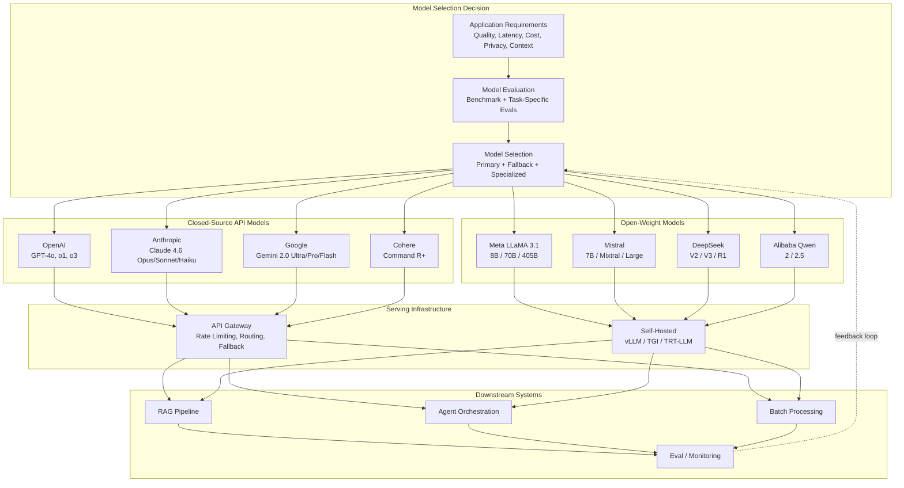
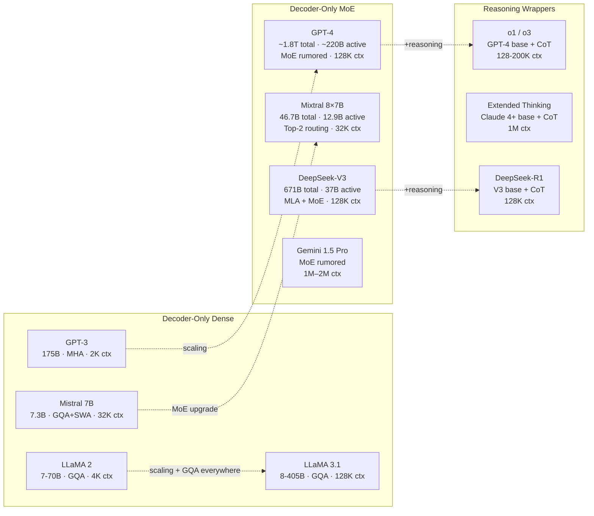
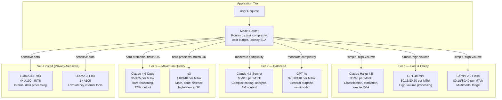

# Large Language Model Landscape

## 1. Overview

The LLM landscape as of early 2026 represents a rapidly stratified market where a handful of frontier model families compete across quality, cost, latency, context length, multimodality, and licensing dimensions. For Principal AI Architects, model selection is the highest-leverage decision in any GenAI system — it determines cost structure, deployment topology, data governance posture, and vendor lock-in profile.

This document catalogs every major model family, their architectural underpinnings, practical deployment characteristics, and pricing. It is not a benchmark leaderboard — it is a system design reference for choosing the right model for a given production workload, planning for model deprecation, and designing multi-model architectures that hedge against vendor risk.

**Key market dynamics (as of March 2026):**
- Frontier quality has converged: Claude 4.6 Opus, GPT-4o, Gemini 2.0 Ultra, and LLaMA 3.1 405B are within 5–10% of each other on most benchmarks
- Cost per token has dropped ~10× over 2 years, driven by MoE architectures, quantization, and serving optimizations
- Context windows have expanded from 4K (2022) to 1M+ (2025–2026), enabling fundamentally new application patterns
- Open-weight models (LLaMA, Mistral, Qwen, DeepSeek) now rival closed models on many tasks, shifting the build-vs-buy calculus
- Reasoning models (o1/o3, extended thinking) represent a new axis where inference-time compute trades latency for quality

---

## 2. Where It Fits in GenAI Systems



**Architectural position:** Model selection sits at the intersection of application requirements (upstream) and serving infrastructure (downstream). Most production systems use 2–4 models: a high-quality model for complex tasks, a fast/cheap model for simple tasks, and potentially specialized models for code, embedding, or structured extraction.

---

## 3. Core Concepts

### 3.1 The GPT Family (OpenAI)

#### GPT-3 (June 2020)
- **Parameters:** 175B dense decoder-only
- **Architecture:** 96 layers, 96 attention heads (MHA), d_model = 12288, d_ff = 49152, learned absolute positional embeddings, Pre-LN, GELU activation
- **Context:** 2,048 tokens (later 4,096)
- **Training:** 300B tokens from Common Crawl, WebText2, Books, Wikipedia
- **Significance:** Demonstrated in-context learning — few-shot prompting without gradient updates. Proved scaling laws hold empirically.
- **Status:** Deprecated (January 2024)

#### GPT-3.5 Turbo (March 2023)
- **Parameters:** Undisclosed (estimated ~20B, optimized from GPT-3 via distillation and RLHF)
- **Context:** 4K (default), 16K variant
- **Key innovation:** RLHF alignment for chat. Powered the original ChatGPT launch.
- **Pricing (at deprecation):** $0.50 / $1.50 per MTok (input/output)
- **Status:** Deprecated (2025). Migration path: GPT-4o mini.

#### GPT-4 (March 2023)
- **Parameters:** Undisclosed. Widely reported as MoE with ~1.8T total parameters, ~220B active per forward pass (8 experts, top-2 routing). Not confirmed by OpenAI.
- **Context:** 8K (launch), 32K, 128K (November 2023 — "GPT-4 Turbo")
- **Capabilities:** Multimodal (text + vision). State-of-the-art at launch across MMLU (86.4%), HumanEval (67%), and most reasoning benchmarks.
- **Pricing:** $10 / $30 per MTok (GPT-4 Turbo 128K, at launch)
- **Status:** Active but superseded by GPT-4o

#### GPT-4o (May 2024)
- **Architecture:** Natively multimodal — unified model for text, vision, and audio (not separate encoders)
- **Context:** 128K tokens
- **Latency:** ~2× faster than GPT-4 Turbo
- **Pricing:** $2.50 / $10.00 per MTok
- **Key advantage:** Same quality as GPT-4 Turbo at lower cost and latency. Audio input/output capabilities.
- **Status:** Primary production model for most OpenAI customers

#### GPT-4o mini (July 2024)
- **Architecture:** Distilled/smaller variant of GPT-4o
- **Context:** 128K tokens
- **Pricing:** $0.15 / $0.60 per MTok — the cheapest frontier-adjacent model from a closed provider
- **Quality:** Surpasses GPT-3.5 Turbo on all benchmarks. Competitive with Claude 3 Haiku on most tasks.
- **Use case:** High-volume, cost-sensitive workloads (classification, extraction, simple chat)

#### o1 and o3 Reasoning Models (September 2024 – January 2025)
- **Architecture:** Built on GPT-4-class base models with inference-time chain-of-thought (extended "thinking" before responding)
- **Context:** 128K (o1) / 200K (o3)
- **Key innovation:** Trades latency for quality — the model "thinks" for seconds to minutes before answering, dramatically improving performance on math, code, and complex reasoning
- **Pricing:** o1: $15 / $60 per MTok; o3: $10 / $40 per MTok (thinking tokens billed as output)
- **Latency:** 10–120 seconds typical response time (vs. 1–5s for GPT-4o)
- **Benchmarks:** o3 achieves 96.7% on MATH, 71.7% on ARC-AGI
- **System design consideration:** Reasoning models require fundamentally different timeout and UX patterns. Not suitable for real-time chat. Best for batch processing, complex analysis, and code generation where quality dominates latency.

#### OpenAI Deployment Options
- **OpenAI API:** Direct access. Rate-limited by tier (Tier 5: 10K RPM, 10M TPM)
- **Azure OpenAI Service:** Enterprise SLAs, VNet integration, data residency guarantees, provisioned throughput units (PTUs) for predictable latency
- **Batch API:** 50% discount for non-real-time workloads (24-hour turnaround)

### 3.2 The Claude Family (Anthropic)

#### Claude 3 (March 2024)
- **Variants:** Haiku (fast/cheap), Sonnet (balanced), Opus (highest quality)
- **Context:** 200K tokens for all variants
- **Architecture:** Undisclosed decoder-only Transformer. Trained with Constitutional AI (RLHF with AI-written feedback based on a set of principles, rather than purely human preference data).
- **Key innovation:** 200K context with strong "needle-in-a-haystack" recall. Constitutional AI alignment.
- **Status:** Superseded by Claude 3.5 and Claude 4 families

#### Claude 3.5 Sonnet (June 2024, updated October 2024)
- **Quality:** Major leap — competitive with GPT-4o and surpassing it on coding benchmarks (SWE-bench: 49% vs. GPT-4o's 33.2%)
- **Context:** 200K tokens
- **Pricing:** $3 / $15 per MTok
- **Tool use:** Strong function calling, computer use capabilities
- **Status:** Widely adopted as default model for coding and complex reasoning tasks

#### Claude 4 Family (2025)
- **Opus 4:** Highest quality, extended thinking (chain-of-thought reasoning visible to user)
- **Sonnet 4:** Balanced quality/speed with extended thinking
- **Context:** 200K tokens, 1M via beta header for Sonnet
- **Extended thinking:** Similar concept to o1/o3 — model generates internal reasoning before final answer. Configurable thinking budget.

#### Claude 4.5 (2025)
- **Opus 4.5:** 200K context
- **Sonnet 4.5:** 1M context with beta header
- **Key advancement:** Improved instruction following, stronger at complex multi-step tasks

#### Claude 4.6 (2026, Current)
- **Opus 4.6:** 1M context, 128K max output tokens
- **Sonnet 4.6:** 1M context, 64K max output tokens
- **Haiku 4.5:** 200K context, 64K max output tokens (latest Haiku variant)
- **Pricing:**
  - Opus 4.6: $5 / $25 per MTok (input/output)
  - Sonnet 4.6: $3 / $15 per MTok
  - Haiku 4.5: $1 / $5 per MTok
- **Key differentiators:**
  - 1M context window with strong recall across the full window
  - 128K output tokens enables long-form generation (entire codebases, full documents)
  - Extended thinking with configurable budget
  - Strong instruction following and safety properties
  - Best-in-class code generation (SWE-bench, HumanEval)

#### Anthropic Deployment Options
- **Anthropic API:** Direct access. Supports streaming, batching, tool use, prompt caching (90% cost reduction on cached prefixes)
- **AWS Bedrock:** Enterprise deployment with AWS IAM, VPC endpoints, CloudTrail logging
- **Google Vertex AI:** Cross-cloud deployment option
- **Prompt caching:** Cache system prompts or long context prefixes for 90% input cost reduction on repeated use (critical for multi-turn and RAG)

### 3.3 The Gemini Family (Google DeepMind)

#### Gemini 1.0 (December 2023)
- **Variants:** Ultra (largest), Pro (balanced), Nano (on-device, 1.8B/3.25B)
- **Architecture:** Natively multimodal — trained on interleaved text, image, audio, video, and code from the ground up (not a text model with bolted-on vision encoder)
- **Context:** 32K tokens
- **Training infrastructure:** TPUv4 pods
- **Status:** Superseded by Gemini 1.5 and 2.0

#### Gemini 1.5 Pro (February 2024)
- **Context:** 1M tokens (standard), 2M tokens (extended)
- **Architecture:** Widely reported as MoE-based, though specifics are not published
- **Key innovation:** 1M-token context with 99.7% recall on needle-in-a-haystack at all depths — a breakthrough result
- **Capabilities:** Processes ~1 hour of video, ~11 hours of audio, or ~700K words in a single prompt
- **Pricing:** $1.25 / $5.00 per MTok (≤128K), $2.50 / $10.00 per MTok (>128K)
- **Latency:** Higher at long context; 1M context requests take 30–60 seconds for first token

#### Gemini 2.0 Flash (December 2024 – Early 2025)
- **Optimized for speed:** Lower latency than 1.5 Pro with competitive quality
- **Multimodal output:** Can generate text, images, and audio
- **Context:** 1M tokens
- **Pricing:** $0.10 / $0.40 per MTok (competitive with GPT-4o mini)
- **Use case:** High-volume multimodal workloads where cost and latency dominate

#### Google Infrastructure Advantage
- **TPUv5e / TPUv5p (Viperfish):** Custom silicon with high-bandwidth inter-chip interconnect (ICI) — purpose-built for the all-to-all communication patterns of MoE and attention
- **Vertex AI:** Enterprise deployment with Google Cloud integration, grounding with Google Search, custom model tuning
- **AI Studio:** Developer-friendly API for prototyping
- **On-device (Nano/Gemma):** Optimized for Android, Chrome, and edge devices

### 3.4 The LLaMA Family (Meta)

#### LLaMA 1 (February 2023)
- **Sizes:** 7B, 13B, 33B, 65B
- **Training data:** 1T–1.4T tokens from publicly available sources (Common Crawl, C4, GitHub, Wikipedia, Books, ArXiv, StackExchange)
- **Key result:** LLaMA-13B outperformed GPT-3 175B on most benchmarks — proving that smaller models trained on more data can match larger models (Chinchilla insight)
- **Architecture:** RoPE, Pre-LN, SwiGLU, MHA
- **License:** Research-only (leaked, leading to massive community adoption regardless)

#### LLaMA 2 (July 2023)
- **Sizes:** 7B, 13B, 70B
- **Context:** 4,096 tokens
- **Training:** 2T tokens (2× LLaMA 1)
- **Architecture:** RoPE, RMSNorm, SwiGLU, GQA on 70B only (8 KV heads), MHA on 7B/13B
- **Chat variants:** RLHF-aligned with over 1M human annotations
- **License:** Open-weight with commercial license (allowing use for products with <700M MAU)
- **Impact:** The model that truly launched the open-source LLM ecosystem. Foundation for Vicuna, Alpaca, CodeLlama, Orca, WizardLM, and hundreds of community fine-tunes.

#### LLaMA 3 (April 2024)
- **Sizes:** 8B, 70B (405B in training at announcement)
- **Context:** 8,192 tokens
- **Training:** 15T+ tokens (7× LLaMA 2). 4× more code in training mix.
- **Architecture changes vs. LLaMA 2:**
  - GQA on ALL sizes (8 KV heads), not just 70B
  - Vocabulary expanded from 32K to 128K tokens (~15% more efficient tokenization, especially for non-English and code)
  - Tokenizer switched to tiktoken (from SentencePiece)
- **Quality:** LLaMA 3 8B matches LLaMA 2 70B on several benchmarks. LLaMA 3 70B competitive with GPT-4 (March 2023 version) on many tasks.

#### LLaMA 3.1 (July 2024)
- **Sizes:** 8B, 70B, 405B
- **Context:** 128K tokens (extended from 8K via continued pre-training with progressive context extension)
- **Training (405B):** 16,384 H100 GPUs, 15.6T tokens, ~30.84M GPU-hours, 4D parallelism (TP=8, PP=16, CP=4, DP=128)
- **Architecture (405B):** 126 layers, d_model = 16384, 128 query heads, 8 KV heads (GQA), d_ff = 53248
- **Quality:** 405B competitive with GPT-4o and Claude 3.5 Sonnet on most benchmarks
- **License:** Llama 3.1 Community License (commercial use allowed, some restrictions for very large deployments)
- **System design significance:** The first truly frontier-class open-weight model. Enables enterprises to run GPT-4-class inference entirely on their own infrastructure.

#### LLaMA Ecosystem Impact
- **Fine-tuned variants:** CodeLlama, Llama Guard (safety), CyberSecEval, Purple Llama
- **Community models:** Hundreds of LoRA adapters, merged models, and instruction-tuned variants on HuggingFace
- **Quantized deployments:** GGUF format for llama.cpp, enabling 70B inference on consumer hardware (Mac M2 Ultra with 192GB RAM, or 2× RTX 4090 with INT4)

### 3.5 The Mistral Family

#### Mistral 7B (September 2023)
- **Parameters:** 7.3B
- **Architecture:** 32 layers, d_model = 4096, 32 query heads, 8 KV heads (GQA), SwiGLU, RoPE, RMSNorm
- **Innovation: Sliding Window Attention (SWA)**
  - Attention window of 4,096 tokens per layer
  - With 32 layers, theoretical receptive field = 32 × 4096 = 131,072 tokens
  - Rolling buffer KV cache: fixed memory regardless of sequence length
  - Combines SWA with full attention in alternating layers for effective 32K context
- **Quality:** Outperformed LLaMA 2 13B on ALL benchmarks despite being ~2× smaller
- **License:** Apache 2.0 — the most permissive license among frontier-competitive models

#### Mixtral 8×7B (December 2023)
- **Architecture:** Sparse MoE with 8 SwiGLU FFN experts, top-2 routing per token
- **Parameters:** 46.7B total, ~12.9B active per token
- **Context:** 32K tokens
- **Attention:** GQA (32 query heads, 8 KV heads) — attention layers are dense, only FFN is sparse
- **Quality:** Matches LLaMA 2 70B on most benchmarks, matches/exceeds GPT-3.5 Turbo
- **Serving requirements:** ~94 GB in FP16 (all experts loaded), but compute per token equivalent to a ~13B dense model
- **License:** Apache 2.0
- **System design significance:** Demonstrated the power of MoE for cost-efficient serving — get 70B-class quality at 13B-class serving cost

#### Mixtral 8×22B (April 2024)
- **Parameters:** 176B total, ~44B active per token
- **Context:** 64K tokens
- **Quality:** Competitive with GPT-4 (early versions) and Claude 3 Sonnet
- **Serving:** Requires 4× A100 80GB minimum in FP16

#### Mistral Large / Medium / Small (Commercial API)
- **Mistral Large (2):** Flagship commercial model, 128K context, strong multilingual
- **Mistral Small:** Cost-optimized, competitive with GPT-4o mini
- **Codestral:** Specialized for code generation, fill-in-the-middle support
- **Pricing (API):** Mistral Small: $0.10 / $0.30 per MTok; Mistral Large: $2 / $6 per MTok

### 3.6 Other Notable Model Families

#### DeepSeek (DeepSeek AI, China)
- **DeepSeek-V2 (May 2024):** 236B total params, 21B active (MoE). Innovative Multi-head Latent Attention (MLA) — compresses KV cache via low-rank projection, reducing KV cache by 5–13× vs. standard MHA. 128K context. Pricing: $0.14 / $0.28 per MTok (extraordinarily cheap).
- **DeepSeek-V3 (December 2024):** 671B total, 37B active. Further MLA improvements. FP8 training. Trained on 14.8T tokens for only $5.6M in compute cost (H800 GPUs). Matches GPT-4o on most benchmarks.
- **DeepSeek-R1 (January 2025):** Reasoning model (o1 competitor). Open-weight. Achieves 79.8% on AIME 2024, 97.3% on MATH-500.
- **System design significance:** DeepSeek proved that frontier-quality models can be trained at a fraction of the cost assumed by Western labs. MLA is a genuinely novel architectural contribution that may influence future model designs.

#### Qwen (Alibaba Cloud)
- **Qwen 2 / 2.5 (2024):** 0.5B to 72B dense models. 128K context. Strong multilingual (especially Chinese). GQA, RoPE, SwiGLU.
- **Qwen 2.5-Coder:** Best-in-class open-source code model at several size points
- **License:** Apache 2.0 (most sizes)
- **Deployment:** Available on Alibaba Cloud ModelStudio, HuggingFace, Ollama

#### Gemma (Google)
- **Gemma 1 (February 2024):** 2B, 7B. Based on Gemini research. 8K context.
- **Gemma 2 (June 2024):** 2B, 9B, 27B. Interleaved sliding window + global attention. Knowledge distillation from larger models. 8K context.
- **License:** Gemma terms (open but with some restrictions on derivative model names)
- **Use case:** Best-in-class quality per parameter for small models. Ideal for edge and mobile deployment.

#### Phi (Microsoft Research)
- **Phi-1.5 (1.3B), Phi-2 (2.7B), Phi-3 (3.8B, 7B, 14B):** "Small language models" trained on high-quality synthetic and curated data
- **Key insight:** Data quality matters more than data quantity at small scale. Phi-3-mini (3.8B) rivals Mixtral 8×7B on some benchmarks.
- **License:** MIT (Phi-3)
- **Use case:** On-device, embedded, and resource-constrained deployments

#### Command R+ (Cohere)
- **Optimized for RAG:** Built-in grounded generation with citation support
- **128K context** with strong long-context performance
- **Multilingual:** 10 languages
- **Unique feature:** Returns inline citations with source attribution — reduces hallucination in enterprise RAG
- **Pricing:** $2.50 / $10.00 per MTok

### 3.7 Closed vs. Open-Weight Tradeoffs

| Dimension | Closed (GPT-4o, Claude, Gemini) | Open-Weight (LLaMA, Mistral, DeepSeek) |
|-----------|--------------------------------|----------------------------------------|
| **Quality ceiling** | Highest (frontier labs have more compute + data) | Within 5–10% on most tasks (LLaMA 3.1 405B, DeepSeek-V3) |
| **Cost at scale** | Per-token API pricing; high at volume | Amortized GPU cost; lower at >1M tokens/day |
| **Data privacy** | Data sent to third-party API | Full control; no data leaves your infrastructure |
| **Fine-tuning** | Limited (OpenAI fine-tuning API, Anthropic custom models) | Full control — LoRA, QLoRA, full fine-tuning |
| **Latency control** | Limited; shared infrastructure | Full control over batching, quantization, hardware |
| **Operational burden** | Zero (managed service) | Significant (GPU procurement, monitoring, on-call) |
| **Vendor lock-in** | High (prompt engineering is model-specific) | Low (can switch between open models) |
| **Regulatory compliance** | Depends on provider certifications | Full audit trail, on-premise deployment possible |
| **Speed of access to new capabilities** | Immediate (API update) | Weeks–months lag for open-source equivalents |
| **Multi-model routing** | Easy (API-based switching) | Requires serving infrastructure per model |

**Architect's rule of thumb:** Start with closed APIs for rapid prototyping and quality ceiling validation. Move to open-weight for production workloads where data privacy, cost at scale, or fine-tuning needs justify the operational investment. Most mature organizations run both.

### 3.8 Model Selection Dimensions

| Dimension | Low End | High End | Key Tradeoff |
|-----------|---------|----------|-------------|
| **Quality** | GPT-4o mini, Haiku 4.5 | Claude 4.6 Opus, GPT-4o, o3 | Higher quality = higher cost + latency |
| **Latency (time to first token)** | <100ms (Gemini Flash, Haiku) | 10–120s (o1, o3, extended thinking) | Faster = lower quality or smaller model |
| **Cost (per MTok output)** | $0.30 (Mistral Small) | $60 (o1) | Cheaper = lower quality or open-weight self-hosted |
| **Context window** | 4K–8K (older models) | 1M–2M (Claude 4.6, Gemini 1.5) | Longer = higher cost, higher latency |
| **Output length** | 4K–8K tokens | 128K (Claude 4.6 Opus) | Longer output = specialized model needed |
| **Multimodal** | Text only (LLaMA) | Text + vision + audio + video (Gemini, GPT-4o) | Multimodal = closed models dominate |
| **Reasoning depth** | Surface-level (mini/small models) | Deep (o3, extended thinking) | Deep reasoning = 10–100× latency |
| **Privacy** | Cloud API (data leaves org) | Self-hosted (full control) | Privacy = operational burden |
| **Fine-tuning** | API fine-tuning (limited) | Full parameter fine-tuning (open-weight) | Customization = compute + expertise |

---

## 4. Architecture

### 4.1 Model Family Architecture Comparison



### 4.2 Multi-Model Production Architecture



---

## 5. Design Patterns

### Pattern 1: Tiered Model Routing

Route requests to different models based on complexity, cost budget, and latency requirements. Use a lightweight classifier (or the cheapest model itself) to estimate task difficulty, then dispatch to the appropriate tier.

- **Tier 1 (Haiku/mini/Flash):** Classification, extraction, simple Q&A — $0.10–1 per MTok
- **Tier 2 (Sonnet/GPT-4o):** Complex generation, multi-step reasoning, coding — $2.50–15 per MTok
- **Tier 3 (Opus/o3):** Hard reasoning, math, ambiguous tasks — $5–60 per MTok
- **Savings:** Typical production workloads are 70% Tier 1, 25% Tier 2, 5% Tier 3 — reducing average cost by 60–80% vs. using Tier 3 for everything

### Pattern 2: Fallback Chains

Configure ordered fallback sequences for resilience against API outages, rate limits, and quality degradation.

```
Primary: Claude 4.6 Sonnet → Fallback 1: GPT-4o → Fallback 2: LLaMA 3.1 70B (self-hosted)
```

- Implement exponential backoff with model switching after 2–3 retries
- Normalize prompt format across models (use an abstraction layer like LiteLLM)
- Monitor per-model success rates and dynamically adjust routing weights

### Pattern 3: Specialize by Task

Use different models for different pipeline stages rather than one model for everything.

| Pipeline Stage | Recommended Model | Rationale |
|---------------|-------------------|-----------|
| Document embedding | Voyage-3 / text-embedding-3-large | Purpose-built, cheap |
| Query understanding | Haiku 4.5 / GPT-4o mini | Fast, cheap, classification task |
| Retrieval reranking | Cohere Rerank 3 | Specialized cross-encoder |
| Answer generation | Claude 4.6 Sonnet | Quality + long context |
| Answer verification | Claude 4.6 Opus / o3 | Maximum reasoning quality |
| Citation extraction | Haiku 4.5 | Structured extraction task |

### Pattern 4: Open-Weight Shadow Deployment

Run an open-weight model (LLaMA 3.1 70B) in parallel with your primary closed-model API. Compare outputs offline to build confidence before migrating production traffic.

- Start with 1% shadow traffic, increase as quality metrics converge
- Use LLM-as-judge (evaluate open model output using the closed model) to automate comparison
- Build a migration safety net: if open model quality drops below threshold, automatically revert to closed API

### Pattern 5: Prompt Caching for Cost Reduction

Both Anthropic and Google offer prompt caching that dramatically reduces costs for repeated prefixes.

- **Anthropic prompt caching:** Cache system prompts, few-shot examples, or document context. 90% cost reduction on cached tokens. Cache lives for 5 minutes (extended with each use).
- **Google context caching:** Similar mechanism for Gemini models.
- **Design implication:** Structure prompts with stable prefixes (system prompt + instructions + few-shot examples) and variable suffixes (user query). The longer and more stable your prefix, the greater the savings.
- **At scale:** A RAG system with a 50K-token system prompt + document context serving 10K requests/day saves ~$1,350/day with Sonnet prompt caching vs. uncached pricing.

---

## 6. Implementation Approaches

### 6.1 Closed-Model API Integration

```python
# Multi-provider abstraction with LiteLLM
import litellm

# Same interface, any provider
response = litellm.completion(
    model="claude-4.6-sonnet-20260301",  # or "gpt-4o", "gemini/gemini-2.0-flash"
    messages=[
        {"role": "system", "content": system_prompt},
        {"role": "user", "content": user_message}
    ],
    max_tokens=4096,
    temperature=0.0,
    timeout=30,
    num_retries=3,
    fallbacks=["gpt-4o", "gemini/gemini-1.5-pro"]  # automatic fallback
)
```

**Key implementation details:**
- Always set explicit `timeout` values — reasoning models (o1/o3) need 120s+, standard models need 30–60s
- Use streaming for all user-facing responses (time-to-first-token is the UX-critical metric)
- Implement token counting client-side (tiktoken for OpenAI, anthropic-tokenizer for Claude) to predict costs and enforce limits before sending requests
- Log all requests/responses with request IDs for debugging and cost attribution

### 6.2 Open-Weight Self-Hosted Deployment

| Model | Hardware (FP16) | Hardware (INT8) | Hardware (INT4) | Throughput (INT8) |
|-------|----------------|-----------------|-----------------|-------------------|
| LLaMA 3.1 8B | 1× A100 40GB | 1× A100 40GB | 1× RTX 4090 24GB | ~2,500 tokens/s |
| LLaMA 3.1 70B | 4× A100 80GB | 2× A100 80GB | 2× RTX 4090 48GB | ~500 tokens/s |
| LLaMA 3.1 405B | 16× A100 80GB | 8× A100 80GB | 4× A100 80GB (INT4) | ~100 tokens/s |
| Mixtral 8×7B | 2× A100 80GB | 1× A100 80GB | 1× RTX 4090 24GB | ~1,800 tokens/s |
| Mistral 7B | 1× A100 40GB | 1× A100 40GB | 1× RTX 4090 24GB | ~3,000 tokens/s |

```bash
# vLLM deployment example for LLaMA 3.1 70B on 4× A100
python -m vllm.entrypoints.openai.api_server \
    --model meta-llama/Meta-Llama-3.1-70B-Instruct \
    --tensor-parallel-size 4 \
    --max-model-len 131072 \
    --gpu-memory-utilization 0.95 \
    --enable-prefix-caching \
    --quantization awq \
    --port 8000
```

### 6.3 Cost Modeling Framework

For any production deployment, build a cost model:

```
Monthly cost (API) = Σ_tier (requests_per_month × avg_input_tokens × input_price
                          + requests_per_month × avg_output_tokens × output_price)

Monthly cost (self-hosted) = GPU_instances × hourly_rate × hours_per_month
                           + engineering_time × hourly_eng_rate
```

**Example comparison at 100M tokens/month output:**

| Approach | Model | Monthly Cost |
|----------|-------|-------------|
| API | Claude 4.6 Sonnet | ~$1.5M (input) + ~$1.5M (output) = ~$3M |
| API with prompt caching | Claude 4.6 Sonnet (70% cached) | ~$0.5M + ~$1.5M = ~$2M |
| API (cheap tier) | Claude Haiku 4.5 | ~$0.1M + ~$0.5M = ~$0.6M |
| Self-hosted | LLaMA 3.1 70B on 8× H100 | ~$25K/month (cloud GPU) |

The breakeven point for self-hosting is typically 5–50M tokens/month, depending on model size and engineering costs.

---

## 7. Tradeoffs

### Model Selection Decision Matrix

| Use Case | Recommended Primary | Recommended Fallback | Rationale |
|----------|-------------------|---------------------|-----------|
| **Customer-facing chatbot** | Claude 4.6 Sonnet | GPT-4o | Quality + safety + streaming |
| **Internal document Q&A** | LLaMA 3.1 70B (self-hosted) | Claude Haiku 4.5 | Data privacy + cost |
| **Code generation** | Claude 4.6 Opus | Claude 4.6 Sonnet | Best code quality (SWE-bench) |
| **High-volume classification** | GPT-4o mini | Claude Haiku 4.5 | Lowest cost per classification |
| **Long document analysis** | Claude 4.6 Sonnet (1M ctx) | Gemini 1.5 Pro (1M ctx) | Only two families with 1M context |
| **Math/science reasoning** | o3 | Claude 4.6 Opus (extended thinking) | Reasoning models dominate |
| **Multimodal (video/audio)** | Gemini 2.0 Pro | GPT-4o | Native multimodal architecture |
| **Enterprise RAG** | Command R+ | Claude 4.6 Sonnet | Built-in citations + grounding |
| **Edge/on-device** | Gemma 2 2B / Phi-3 mini | LLaMA 3.1 8B (quantized) | Small footprint, runs on mobile |
| **Multilingual (CJK)** | Qwen 2.5 72B | Claude 4.6 Sonnet | Best Chinese + Japanese + Korean |

### Pricing Comparison (as of March 2026)

| Model | Input ($/MTok) | Output ($/MTok) | Context Window | Notes |
|-------|---------------|-----------------|---------------|-------|
| **GPT-4o** | $2.50 | $10.00 | 128K | General-purpose frontier |
| **GPT-4o mini** | $0.15 | $0.60 | 128K | Best closed-model value |
| **o1** | $15.00 | $60.00 | 128K | Reasoning; high latency |
| **o3** | $10.00 | $40.00 | 200K | Reasoning; improved cost vs o1 |
| **Claude 4.6 Opus** | $5.00 | $25.00 | 1M | Best code; 128K output |
| **Claude 4.6 Sonnet** | $3.00 | $15.00 | 1M | Best balance for most tasks |
| **Claude Haiku 4.5** | $1.00 | $5.00 | 200K | Fast + cheap; 64K output |
| **Gemini 1.5 Pro** | $1.25–$2.50 | $5.00–$10.00 | 1M–2M | Price scales with context used |
| **Gemini 2.0 Flash** | $0.10 | $0.40 | 1M | Cheapest frontier-adjacent |
| **Mistral Large 2** | $2.00 | $6.00 | 128K | Strong multilingual |
| **Mistral Small** | $0.10 | $0.30 | 128K | Cheapest commercial API |
| **DeepSeek-V3** | $0.27 | $1.10 | 128K | Astonishing value |
| **DeepSeek-R1** | $0.55 | $2.19 | 128K | Open reasoning model |
| **LLaMA 3.1 405B (self-hosted)** | ~$0.50* | ~$2.00* | 128K | *Estimated amortized GPU cost |
| **LLaMA 3.1 70B (self-hosted)** | ~$0.10* | ~$0.40* | 128K | *Estimated amortized GPU cost |

\* Self-hosted costs are approximate and assume 50% GPU utilization on cloud instances. Actual costs depend on hardware, batch size, quantization, and utilization.

### Closed vs. Open-Weight Decision Framework

| Factor | Choose Closed API When... | Choose Open-Weight When... |
|--------|--------------------------|---------------------------|
| **Data sensitivity** | Data is non-sensitive, or provider has BAA/compliance certs | PII, HIPAA, financial data, or regulatory requirements mandate on-prem |
| **Volume** | <5M tokens/month (API cheaper than GPU ops) | >50M tokens/month (self-hosted amortization wins) |
| **Quality requirements** | Need absolute frontier quality (o3-level reasoning) | 90th-percentile quality is sufficient (LLaMA 3.1 70B) |
| **Customization** | Prompt engineering is sufficient | Need fine-tuning on domain-specific data |
| **Team** | No ML infra team | Have ML platform engineers |
| **Time to market** | Need to ship in days | Can invest weeks in infrastructure |
| **Vendor risk tolerance** | Acceptable (multi-provider fallback mitigates) | Unacceptable (regulatory or strategic reasons) |

---

## 8. Failure Modes

### 8.1 API-Level Failures

| Failure Mode | Symptom | Impact | Mitigation |
|-------------|---------|--------|------------|
| **Rate limiting** | HTTP 429 errors, increasing latency | Throughput collapse during traffic spikes | Implement client-side token bucket, request queuing, multi-provider fallback |
| **API outage** | HTTP 500/503, connection timeouts | Complete service disruption | Multi-provider architecture with automatic failover (Claude → GPT-4o → self-hosted) |
| **Model deprecation** | Endpoint returns 404 or deprecation warning | Breaking changes in production | Pin to dated model versions (e.g., `gpt-4o-2024-11-20`), monitor deprecation announcements, maintain migration playbooks |
| **Pricing changes** | Unexpected cost increase | Budget overrun | Implement per-model cost tracking and alerting, maintain fallback to cheaper models |
| **Context window mismatch** | Truncated input, degraded output quality | Silent quality degradation | Client-side token counting before API call, automatic chunking or summarization |

### 8.2 Quality Failures

| Failure Mode | Symptom | Root Cause | Mitigation |
|-------------|---------|------------|------------|
| **Model regression after update** | Quality drop on specific tasks after provider updates | Provider fine-tunes or updates model weights | Pin to specific model versions, run automated eval suite on model changes |
| **Hallucination on domain-specific queries** | Confident but incorrect factual claims | Training data lacks domain coverage | RAG with verified sources, fine-tuning on domain data, citation requirement in system prompt |
| **Lost in the middle** | Model ignores critical context in middle of long document | Attention distribution bias toward beginning/end | Place critical information at start or end, use retrieval to surface relevant chunks |
| **Prompt injection** | Model follows injected instructions in user input | Lack of input/instruction separation | Structured input handling, system prompt hardening, output validation, guardrails |
| **Language quality degradation** | Poor performance on non-English queries | Tokenization inefficiency, training data imbalance | Use models with strong multilingual training (Qwen, Command R+), or fine-tune |

### 8.3 Operational Failures (Self-Hosted)

| Failure Mode | Symptom | Root Cause | Mitigation |
|-------------|---------|------------|------------|
| **GPU OOM** | CUDA out-of-memory errors | KV cache growth with concurrent long-context requests | PagedAttention, max concurrent request limits, KV cache quantization |
| **Inference throughput degradation** | Increasing latency under load | Batch scheduling inefficiency, CPU bottleneck in tokenization | Continuous batching (vLLM), async tokenization, profile CPU vs GPU time |
| **Quantization quality cliff** | Sudden quality drop on specific tasks | Aggressive quantization on sensitive layers | Benchmark with your specific eval suite at each quantization level, use mixed-precision quantization |
| **Model loading failures** | Timeout or OOM during model load | Insufficient CPU RAM for checkpoint loading | Pre-shard checkpoints, use mmap loading, ensure 2× model size available in CPU RAM |

---

## 9. Optimization Techniques

### 9.1 Cost Optimization

| Technique | Savings | Complexity | Applicable To |
|-----------|---------|------------|---------------|
| **Tiered model routing** | 60–80% | Medium | All API-based deployments |
| **Prompt caching** (Anthropic, Google) | Up to 90% on cached tokens | Low | Repeated system prompts, RAG context |
| **Batch API** (OpenAI) | 50% | Low | Non-real-time workloads |
| **Output token optimization** (shorter prompts → shorter outputs) | 20–40% | Low | All deployments |
| **Self-hosting migration** | 80–95% at high volume | High | >50M tokens/month |
| **Quantization** (self-hosted) | 2–4× GPU reduction | Medium | Self-hosted deployments |

### 9.2 Latency Optimization

| Technique | Impact | When to Use |
|-----------|--------|-------------|
| **Streaming** | Time-to-first-token <1s even for long responses | All user-facing applications |
| **Prompt caching** (eliminates prefill for cached prefix) | 50–80% TTFT reduction | Multi-turn chat, RAG with stable context |
| **Model downgrade** (Opus → Sonnet → Haiku) | 2–5× latency reduction per tier | When quality headroom exists |
| **Speculative decoding** (self-hosted) | 2–3× decode throughput | Self-hosted, low-batch scenarios |
| **Regional deployment** | Eliminate cross-region network latency | Global applications |

### 9.3 Quality Optimization

| Technique | Impact | Cost Impact |
|-----------|--------|-------------|
| **Few-shot examples in prompt** | 5–20% quality improvement on domain tasks | Increases input tokens (use prompt caching to offset) |
| **Chain-of-thought / extended thinking** | 10–40% on reasoning tasks | 2–10× token cost (thinking tokens) |
| **RAG with reranking** | Reduces hallucination by 30–60% | Adds embedding + reranking cost |
| **Fine-tuning** (LoRA on open-weight) | 10–30% on domain tasks | One-time training cost + self-hosting |
| **Model ensemble** (generate with multiple models, pick best) | 5–15% quality improvement | N× cost for N models |
| **Structured output / JSON mode** | Eliminates format errors | Slight quality improvement (constrained decoding) |

### 9.4 Model Migration Strategy

When planning model transitions (version upgrades, provider switches, or open-weight migration):

1. **Establish baseline:** Run full eval suite on current model with production-representative test set (minimum 500 examples)
2. **Shadow evaluation:** Run new model in parallel on 1–5% of production traffic, compare outputs
3. **Regression detection:** Flag any test case where new model scores >10% lower than current model
4. **Prompt adaptation:** Most model switches require prompt adjustments (different system prompt formats, different optimal temperatures)
5. **Gradual rollout:** 1% → 10% → 50% → 100% over 2–4 weeks with monitoring at each stage
6. **Rollback plan:** Maintain ability to revert to previous model for 30 days after full migration

---

## 10. Real-World Examples

### Stripe — Multi-Model Payment Fraud Detection

Stripe uses a tiered model architecture for AI-powered fraud detection and developer assistance. GPT-4-class models handle complex fraud pattern analysis on flagged transactions, while smaller models (GPT-3.5 Turbo class) process high-volume initial screening. Their developer documentation assistant uses Claude for code generation and explanation. Key architectural decision: separate models for different risk tiers, with the most expensive models only invoked when initial screening flags anomalies.

**System design lesson:** In high-volume, low-latency applications (payment processing), model routing based on risk/complexity score is essential. The cheapest model handles 95% of traffic.

### Notion — Claude-Powered AI Features

Notion's AI features (writing assistance, summarization, Q&A over workspace) are powered by Claude (starting with Claude 2, now on Claude 3.5+). They chose Claude for strong instruction following, reliable structured output, and Anthropic's safety properties. The 200K+ context window enables Q&A over entire Notion workspaces. Notion uses prompt caching extensively for the shared system prompt and workspace context across user queries in the same session.

**System design lesson:** For B2B SaaS AI features, prompt caching is essential — the system prompt and workspace context are stable across many user queries. Anthropic's prompt caching reportedly reduced their per-query cost by ~75%.

### Replit — Code Generation with Multiple Model Providers

Replit's AI code assistant uses a multi-model approach: their own fine-tuned code models (based on CodeLlama and custom architectures) for autocomplete and inline suggestions (low latency, high volume), with Claude and GPT-4 for complex code generation tasks (refactoring, explanation, debugging). They self-host their autocomplete models for latency control (<100ms) and use APIs for slower, higher-quality tasks.

**System design lesson:** Code completion (high volume, low latency) and code generation (lower volume, high quality) have fundamentally different model requirements. Self-hosting the high-volume model and using APIs for the quality-critical model is a common production pattern.

### Perplexity — Real-Time Search with LLM Synthesis

Perplexity's search engine combines retrieval with LLM synthesis. They use multiple model backends — both proprietary models and API calls to frontier models (Claude, GPT-4) — with a routing layer that selects models based on query complexity. Simple factual queries route to cheaper/faster models; complex analytical queries route to frontier models. All responses include inline citations grounded in retrieved sources.

**System design lesson:** LLM-powered search requires sub-second latency for the retrieval path and 2–5 second latency for the generation path. Model routing by query complexity is not optional at scale — it is the difference between viable and unviable unit economics.

### Samsung — On-Device AI with Small Models

Samsung Galaxy AI features use Gemma and Phi-class small models (2B–7B) running on-device with Qualcomm NPU acceleration. Features like live translation, text summarization, and photo editing run entirely on the device with no cloud dependency. For complex tasks exceeding on-device model capabilities, requests are routed to cloud-based Gemini or GPT-4.

**System design lesson:** The hybrid on-device + cloud architecture is the dominant pattern for mobile AI. Small open-weight models (Gemma 2B, Phi-3 mini 3.8B) quantized to INT4 can run at 10–20 tokens/sec on modern mobile NPUs, handling 80% of user requests without any API call.

---

## 11. Related Topics

- **[Transformer Architecture](transformers.md):** The foundational architecture underlying every model discussed here — understanding attention variants, positional encoding, and MoE is prerequisite knowledge
- **[Model Selection Framework](../model-strategies/model-selection.md):** Detailed decision framework for choosing models based on task requirements, cost constraints, and organizational context
- **[Model Serving & Inference](../performance/model-serving.md):** How to deploy and serve the models described here — vLLM, TGI, TensorRT-LLM configurations for each model family
- **[Fine-Tuning Strategies](../model-strategies/fine-tuning.md):** When and how to fine-tune open-weight models from this landscape (LoRA, QLoRA, full fine-tuning)
- **[Quantization](../model-strategies/quantization.md):** Quantization techniques and their impact on the models listed here — which models quantize well and which are sensitive
- **[Cost Optimization](../performance/cost-optimization.md):** Deep dive into the cost modeling framework introduced in Section 6.3

---

## 12. Source Traceability

| Concept / Model | Primary Source | Year |
|----------------|---------------|------|
| GPT-3 | Brown et al., "Language Models are Few-Shot Learners" (OpenAI) | 2020 |
| GPT-4 | OpenAI, "GPT-4 Technical Report" | 2023 |
| GPT-4o | OpenAI Spring Update announcement | 2024 |
| o1 | OpenAI, "Learning to Reason with LLMs" | 2024 |
| Claude 3 | Anthropic, "The Claude 3 Model Family" | 2024 |
| Claude 3.5 Sonnet | Anthropic model release announcements | 2024 |
| Claude 4.6 | Anthropic model cards and API documentation | 2026 |
| Constitutional AI | Bai et al., "Constitutional AI: Harmlessness from AI Feedback" (Anthropic) | 2022 |
| Gemini 1.0 | Gemini Team, Google DeepMind, "Gemini: A Family of Highly Capable Multimodal Models" | 2023 |
| Gemini 1.5 Pro | Reid et al., "Gemini 1.5: Unlocking Multimodal Understanding Across Millions of Tokens of Context" | 2024 |
| LLaMA 1 | Touvron et al., "LLaMA: Open and Efficient Foundation Language Models" (Meta) | 2023 |
| LLaMA 2 | Touvron et al., "LLaMA 2: Open Foundation and Fine-Tuned Chat Models" (Meta) | 2023 |
| LLaMA 3 | Meta AI, "Introducing Meta Llama 3" | 2024 |
| LLaMA 3.1 | Meta AI, "The LLaMA 3 Herd of Models" | 2024 |
| Mistral 7B | Jiang et al., "Mistral 7B" (Mistral AI) | 2023 |
| Mixtral 8×7B | Jiang et al., "Mixtral of Experts" (Mistral AI) | 2024 |
| DeepSeek-V2 | DeepSeek AI, "DeepSeek-V2: A Strong, Economical, and Efficient Mixture-of-Experts Language Model" | 2024 |
| DeepSeek-V3 | DeepSeek AI, "DeepSeek-V3 Technical Report" | 2024 |
| DeepSeek-R1 | DeepSeek AI, "DeepSeek-R1: Incentivizing Reasoning Capability in LLMs via Reinforcement Learning" | 2025 |
| Qwen 2 | Alibaba Cloud, "Qwen2 Technical Report" | 2024 |
| Gemma | Google DeepMind, "Gemma: Open Models Based on Gemini Research and Technology" | 2024 |
| Phi-3 | Microsoft Research, "Phi-3 Technical Report" | 2024 |
| Command R+ | Cohere, "Command R+ Technical Report" | 2024 |
| Chinchilla scaling laws | Hoffmann et al., "Training Compute-Optimal Large Language Models" (DeepMind) | 2022 |
| Prompt caching | Anthropic API documentation; Google Vertex AI documentation | 2024 |
