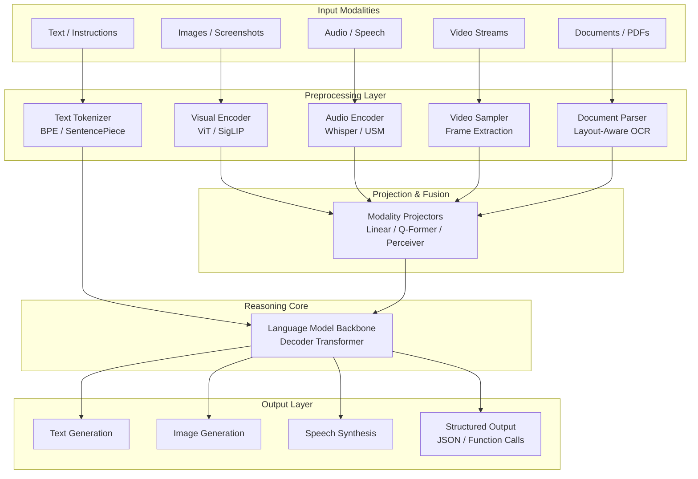
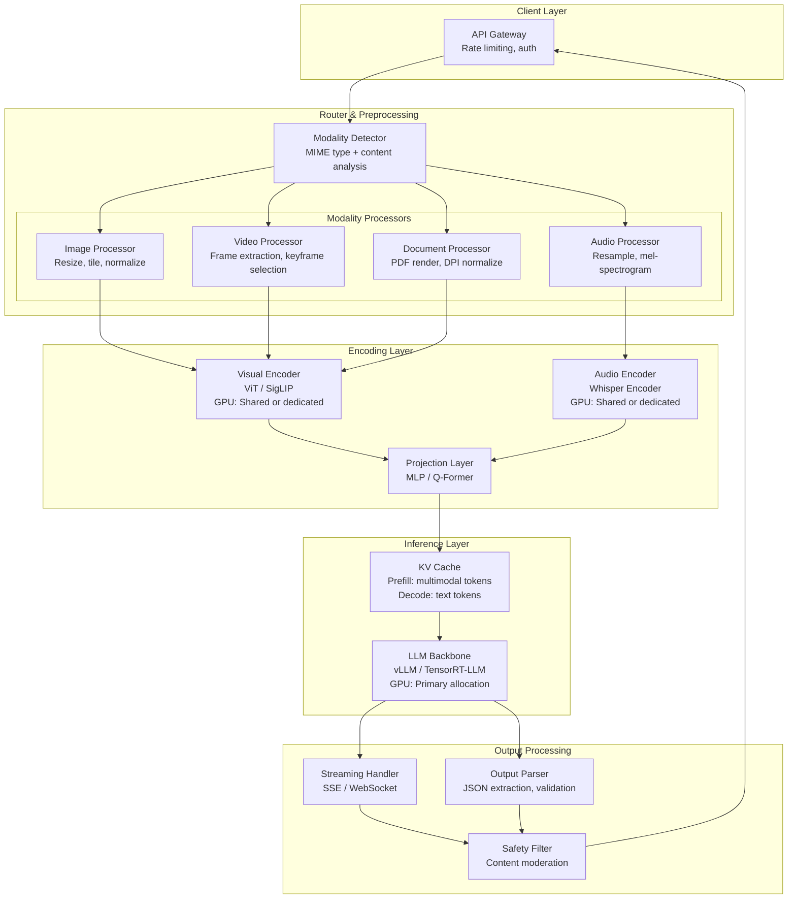
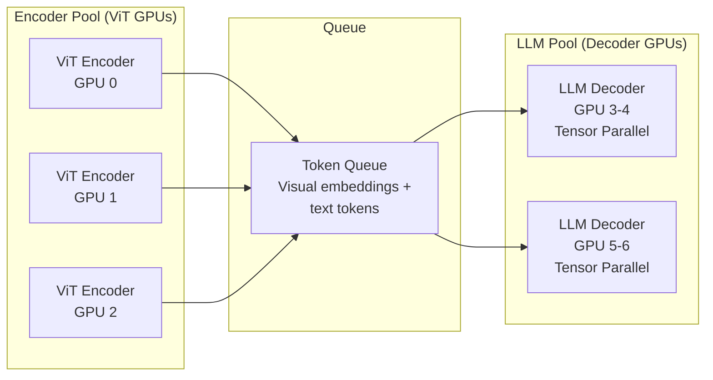

# Multimodal Models

## 1. Overview

Multimodal models process and generate across multiple data modalities -- text, images, audio, video, and structured documents -- within a single architecture. They represent a fundamental shift from single-modality systems (text-only LLMs, image-only classifiers) toward unified perception: one model that can reason jointly over a photograph, a spoken instruction, a PDF table, and a text prompt.

The architectural landscape divides into two camps: **native multimodal** models that train all modalities end-to-end from the start (Gemini, GPT-4o), and **bolt-on multimodal** systems that bridge separately trained encoders into a language model backbone (LLaVA, InternVL). This distinction has profound consequences for latency, alignment quality between modalities, and the kinds of cross-modal reasoning the model can perform.

For system designers, multimodal models introduce non-trivial complexity across every layer: input preprocessing pipelines must handle wildly different data types, inference costs scale with modality-specific token counts (a single image can consume 1,000+ tokens), caching strategies must account for mixed-modality KV caches, and evaluation frameworks must assess quality across modalities simultaneously. Understanding the architecture and operational tradeoffs of these models is essential for building production systems that handle real-world inputs -- which are rarely text-only.

## 2. Where It Fits in GenAI Systems

Multimodal models serve as the perception and reasoning layer that bridges the gap between raw real-world signals and structured, actionable outputs. They sit at the core of systems that must understand anything beyond plain text.



**Key integration points with GenAI systems:**

- **RAG pipelines**: Multimodal embeddings (CLIP, SigLIP) enable retrieval over images, diagrams, and charts alongside text. See [multimodal-rag.md](../rag/multimodal-rag.md).
- **Agent architectures**: Agents use vision models for screen understanding (web browsing, GUI automation), audio models for voice-based tool invocation, and document models for structured data extraction.
- **Voice AI**: The STT-to-LLM-to-TTS pipeline is increasingly replaced by natively multimodal models like GPT-4o that process audio end-to-end. See [voice-ai.md](../case-studies/voice-ai.md).
- **Document ingestion**: Vision-language models replace traditional OCR+heuristics for layout-aware document understanding. See [document-ingestion.md](../rag/document-ingestion.md).
- **Guardrails & safety**: Multimodal content requires visual safety classifiers alongside text-based guardrails. See [guardrails.md](../safety/guardrails.md).

## 3. Core Concepts

### 3.1 Vision-Language Models (VLMs)

VLMs combine a visual encoder with a language model to process images alongside text. The architecture has three components:

**Visual Encoder.** Almost universally a Vision Transformer (ViT). The image is divided into fixed-size patches (typically 14x14 or 16x16 pixels), each patch is linearly embedded, and the sequence of patch embeddings is processed through transformer layers. Leading visual encoders:

| Encoder | Training Objective | Resolution | Used By |
|---|---|---|---|
| CLIP ViT-L/14 | Contrastive (image-text pairs) | 224x224 to 336x336 | LLaVA 1.5, many open-source VLMs |
| SigLIP SO400M | Sigmoid contrastive loss (no softmax) | 384x384 | PaliGemma, InternVL2 |
| EVA-CLIP | Masked image modeling + contrastive | Up to 448x448 | InternVL |
| DINOv2 | Self-supervised (no text supervision) | Variable | Used in some research VLMs |
| Native (Gemini) | End-to-end multimodal pre-training | Variable | Gemini 1.5/2.0 |
| Native (GPT-4o) | End-to-end multimodal pre-training | Variable | GPT-4o, GPT-4V |

**Projection Layer (Modality Bridge).** The visual encoder produces embeddings in its own representation space. The projection layer maps these into the language model's token embedding space. This is the critical architectural bottleneck:

- **Linear projection**: A single linear layer or two-layer MLP. Simple, fast, minimal parameters. Used by LLaVA 1.5.
- **Q-Former (Queried Transformer)**: Learnable query tokens cross-attend to visual features, compressing variable-length visual tokens into a fixed number of "summary" tokens. Used by BLIP-2, InstructBLIP. Compresses 256+ visual tokens down to 32-64.
- **Perceiver Resampler**: Similar to Q-Former but with a latent bottleneck. Used by Flamingo, IDEFICS.
- **C-Abstractor**: Convolutional abstractor that preserves spatial structure while reducing token count. Used by Honeybee.

**Key tradeoff**: More aggressive compression (Q-Former, Perceiver) reduces inference cost by producing fewer visual tokens for the LLM but loses spatial detail critical for OCR, chart reading, and fine-grained visual grounding. Linear projection preserves all spatial information but can produce 500-2000+ visual tokens per image, directly impacting LLM inference cost.

**LLM Decoder.** The language model backbone processes the interleaved sequence of visual tokens and text tokens through its standard autoregressive transformer layers. The LLM is typically a pre-trained model (LLaMA, Mistral, Vicuna, Qwen) that is fine-tuned jointly with the projection layer.

**Key VLM Implementations:**

| Model | Visual Encoder | Projection | LLM Backbone | Open Source |
|---|---|---|---|---|
| GPT-4V / GPT-4o | Proprietary | Proprietary | Proprietary | No |
| Claude 3/3.5/4 (vision) | Proprietary | Proprietary | Proprietary | No |
| Gemini 1.5/2.0 | Native multimodal | N/A (end-to-end) | Native multimodal | No |
| LLaVA 1.5 | CLIP ViT-L/14 (336px) | 2-layer MLP | Vicuna-13B / LLaMA | Yes |
| LLaVA-NeXT | SigLIP / CLIP | Dynamic resolution + MLP | Various (7B-110B) | Yes |
| InternVL2 | InternViT-6B | MLP | InternLM2 / LLaMA3 | Yes |
| Qwen-VL / Qwen2-VL | ViT with dynamic resolution | Cross-attention resampler | Qwen | Yes |
| PaliGemma | SigLIP SO400M | Linear | Gemma 2B | Yes |
| Pixtral | Custom 400M ViT | Learned queries | Mistral 12B | Yes |

### 3.2 Native Multimodal vs Bolt-On Multimodal

This is the most consequential architectural distinction in multimodal AI.

**Native multimodal** models (Gemini, GPT-4o) train on interleaved multimodal data from the start or very early in pre-training. All modalities share the same transformer backbone and learn joint representations. The model never "translates" between modality spaces -- it natively reasons in a unified representation.

**Bolt-on multimodal** models (LLaVA, InternVL, most open-source VLMs) take a pre-trained LLM and a pre-trained visual encoder, bridge them with a projection layer, and fine-tune. The two "halves" were originally trained independently with different objectives.

| Dimension | Native Multimodal | Bolt-On Multimodal |
|---|---|---|
| Cross-modal reasoning | Deep -- can reason about subtle relationships between modalities | Shallow -- limited by projection quality |
| Training cost | Enormous (multimodal pre-training from scratch) | Moderate (only projection + fine-tuning) |
| Modality alignment | Emergent from joint training | Learned via projection, can be lossy |
| Spatial understanding | Typically better | Depends on encoder resolution and projection |
| Example | Gemini 2.0, GPT-4o | LLaVA, BLIP-2, InternVL |
| Compositionality | Better at "the red ball is left of the blue cube" | Often struggles with spatial relations |
| Research accessibility | Requires massive compute, few orgs can build | Accessible to academic labs |

**System design implication**: Native multimodal models consistently outperform bolt-on approaches on tasks requiring deep cross-modal reasoning (visual question answering with complex spatial relations, chart interpretation with multi-step reasoning, document understanding with layout sensitivity). For simpler tasks (image captioning, basic visual QA), the gap narrows and bolt-on models offer superior cost-performance ratios.

### 3.3 Multimodal Embedding Spaces

Multimodal embedding models map different modalities into a shared vector space where semantic similarity is measured by cosine distance across modalities. They are the foundation of multimodal search and retrieval.

**CLIP (Contrastive Language-Image Pre-training) -- OpenAI, 2021.** Trained on 400M image-text pairs with a contrastive loss: matching image-text pairs are pulled together in embedding space; non-matching pairs are pushed apart. Produces 512 or 768-dimensional embeddings for both images and text.

**SigLIP (Sigmoid Loss for Language-Image Pre-training) -- Google, 2023.** Replaces CLIP's softmax-based contrastive loss with a sigmoid (binary) loss. Key advantage: eliminates the need for a global softmax normalization across the batch, enabling larger effective batch sizes and better scaling. Used in PaliGemma and as the visual encoder in many recent VLMs.

**Key architectural detail**: CLIP-style models use a dual-encoder architecture -- separate encoders for image and text, with only the final embeddings interacting. This is fast at retrieval time (encode once, compare many) but limits the depth of cross-modal interaction compared to fusion models.

**Other notable multimodal embedding models:**

- **OpenCLIP**: Open-source CLIP reproduction, trained on LAION-5B (5 billion image-text pairs). Multiple model sizes.
- **ALIGN (Google)**: Similar to CLIP but trained on a noisier, larger (1.8B pairs) dataset without careful curation.
- **ImageBind (Meta)**: Maps six modalities (images, text, audio, depth, thermal, IMU) into a single embedding space. Anchored on images -- all other modalities are aligned to the image space.
- **ONE-PEACE**: Unified model aligning vision, language, and audio modalities.
- **Nomic Embed Vision**: Open-source multimodal embeddings optimized for retrieval, competitive with CLIP at fraction of size.

**System design applications:**
- Multimodal RAG retrieval: Embed both document images and text queries in CLIP space. See [multimodal-rag.md](../rag/multimodal-rag.md).
- Content moderation: Embed images and compare against text descriptions of prohibited content.
- Visual search: "Find products that look like this photo."
- Zero-shot classification: Embed candidate labels as text, embed the image, find the closest label.

### 3.4 Audio Models

**Automatic Speech Recognition (ASR):**

Whisper (OpenAI, 2022) is the dominant open-source ASR model. Architecture: encoder-decoder transformer trained on 680,000 hours of multilingual, weakly-supervised audio data.

- Encoder: Audio is converted to 80-channel log-mel spectrogram, divided into 30-second windows, processed by a transformer encoder.
- Decoder: Autoregressive transformer that outputs text tokens with special tokens for language detection, timestamps, and task specification (transcribe vs translate).
- Model sizes: Tiny (39M), Base (74M), Small (244M), Medium (769M), Large-v3 (1.5B).
- Large-v3 achieves near-human WER on English (< 5% on LibriSpeech).

**Key Whisper system design details:**
- 30-second chunking is architectural -- longer audio must be segmented.
- Streaming Whisper requires overlapping windows with cross-window alignment (not native).
- For production streaming ASR, Deepgram Nova-2 or Google Cloud Speech-to-Text v2 offer true streaming with lower latency.
- Whisper.cpp and faster-whisper (CTranslate2) provide 4-8x speedup over native Whisper.

**Google USM (Universal Speech Model)**: 2B parameters, 300+ languages, designed for low-resource language ASR. Not publicly available but powers Google services.

**Speech Synthesis (TTS):**

| System | Architecture | Latency | Quality | Open Source |
|---|---|---|---|---|
| ElevenLabs | Proprietary (rumored: audio LM + diffusion) | ~300ms TTFB | Best-in-class naturalness | No (API) |
| OpenAI TTS | Proprietary | ~200-400ms TTFB | High quality, 6 voices | No (API) |
| Bark (Suno) | GPT-style autoregressive audio tokens | ~2-5s for short clips | Good, multilingual | Yes |
| XTTS (Coqui) | GPT-2 style + HiFi-GAN vocoder | ~500ms | Good, voice cloning with 6s reference | Yes |
| Fish Speech | VQGAN + LLM | ~300ms | Near-ElevenLabs quality (claimed) | Yes |
| Parler-TTS | Prompted TTS (describe the voice) | ~1-2s | Moderate | Yes |
| Tortoise TTS | Autoregressive + diffusion + vocoder | 5-30s | High quality, very slow | Yes |

**Audio Language Models (native audio reasoning):**

GPT-4o processes audio natively -- speech goes directly into the model as audio tokens rather than through a separate ASR step. This enables:
- Real-time conversational latency (~200ms response time)
- Emotion and tone understanding
- Non-speech audio reasoning (music, environmental sounds)
- Speech-to-speech without intermediate text

Gemini 2.0 similarly supports native audio input with multimodal reasoning. This represents a shift from the "cascade" approach (ASR -> LLM -> TTS) to the "native" approach (audio-in, audio-out).

### 3.5 Video Understanding Models

Video understanding adds temporal complexity on top of visual understanding. The core challenge is computational: a 1-minute video at 30fps contains 1,800 frames, and processing each through a ViT is prohibitive.

**Approaches to video input:**

1. **Uniform frame sampling**: Sample N frames uniformly from the video (e.g., 1 frame per second). Simple but misses fast-moving events. Used by most current VLMs when processing video.
2. **Keyframe extraction**: Use scene detection to identify semantically distinct frames. More efficient but requires a preprocessing step.
3. **Video-native encoders**: Models like ViViT, TimeSformer, and Video-LLaVA use 3D patch embeddings (spatial + temporal) to encode video chunks as a single operation.
4. **Long-context multimodal**: Gemini 1.5 Pro can process up to 1 hour of video by treating frames as a very long sequence of visual tokens within its 1M-token context window.

**Production-relevant video models:**

| Model | Max Video Length | Approach | Key Capability |
|---|---|---|---|
| Gemini 1.5/2.0 Pro | ~1 hour | Native long-context multimodal | Temporal reasoning, event localization |
| GPT-4o | Short clips (varies) | Frame extraction + VLM | Scene description, QA over frames |
| Video-LLaVA | ~1 min | Video encoder + LLaMA | Open-source video QA |
| LLaVA-Video (LLaVA-OneVision) | Minutes | Dynamic frame selection + VLM | Strong open-source video understanding |
| Twelve Labs | Hours | Specialized video embeddings + search | Video search and understanding API |
| Google Video Intelligence API | Hours | Multiple specialized models | Label detection, shot detection, OCR |

**System design consideration**: Video inference is extraordinarily expensive. A 1-minute video at 1fps with 576 visual tokens per frame produces ~34,000 tokens just for the visual input. At typical VLM pricing ($10-15/M input tokens), a single 10-minute video analysis costs $3-5. For high-volume applications, pre-filtering with lightweight classifiers or frame sampling is essential.

### 3.6 Document Understanding

Vision-language models have largely replaced traditional OCR + rule-based extraction pipelines for complex document understanding. The key insight: layout, typography, tables, and figures carry semantic meaning that text-only extraction destroys.

**Traditional pipeline (pre-VLM):**
1. OCR (Tesseract, ABBYY, Amazon Textract) extracts raw text
2. Layout analysis (Detectron2, LayoutParser) identifies regions
3. Table extraction via heuristics or specialized models
4. Entity extraction on the flattened text

**Modern VLM-based pipeline:**
1. Render the document page as an image (or use the native PDF/scan)
2. Feed the page image + a text prompt to a VLM
3. The VLM directly outputs structured data (JSON, markdown tables, extracted fields)

**Document-specialized models:**

| Model | Approach | Key Strength |
|---|---|---|
| GPT-4o (vision) | General-purpose VLM | Best overall document reasoning |
| Claude 3.5 Sonnet (vision) | General-purpose VLM | Strong table and chart extraction |
| Google Document AI | Layout-aware encoder-decoder | Enterprise document processing |
| LayoutLMv3 (Microsoft) | Multimodal pre-training with layout | Token-level document understanding |
| Donut (Naver) | OCR-free document encoder-decoder | End-to-end without explicit OCR step |
| Nougat (Meta) | OCR-free scientific document parser | LaTeX output from academic PDFs |
| DocTR | Layout-aware text recognition | Open-source OCR with layout |

**Key system design decisions for document pipelines:**
- **VLM-only vs hybrid**: VLMs struggle with tiny text, dense tables with 100+ rows, and pixel-perfect coordinate extraction. Hybrid approaches use OCR for text extraction and VLMs for semantic understanding.
- **Resolution matters**: Most VLMs internally resize images. If the document has small text (e.g., footnotes, fine print in contracts), the resizing can make it illegible. Tiling -- splitting a page into overlapping quadrants and processing each separately -- mitigates this. LLaVA-NeXT and Qwen2-VL support dynamic resolution tiling natively.
- **Cost at scale**: Processing 1,000 pages through GPT-4o vision costs approximately $10-30 depending on image size (each page image generates 700-2000 tokens). Traditional OCR (Textract) costs ~$1.50 per 1,000 pages.

### 3.7 Input Preprocessing Pipelines

Each modality requires specific preprocessing before reaching the model. Production systems must handle these pipelines at scale with consistent latency.

**Image preprocessing:**
1. Decode (JPEG/PNG/WebP/HEIC) -- use libvips or Pillow
2. EXIF rotation correction
3. Resize to model-expected resolution (e.g., 336x336 for CLIP, 384x384 for SigLIP)
4. For high-resolution models (LLaVA-NeXT, Qwen2-VL): dynamic resolution -- pad and tile to the nearest supported aspect ratio grid
5. Normalize pixel values to model-expected range (typically [0,1] or ImageNet mean/std)
6. Convert to tensor format (FP16/BF16)

**Audio preprocessing:**
1. Decode audio (ffmpeg handles all formats)
2. Resample to model-expected sample rate (16kHz for Whisper)
3. Convert to mono channel
4. Compute log-mel spectrogram (80 mel bins for Whisper)
5. Pad or segment to fixed window (30 seconds for Whisper)
6. Apply per-channel normalization

**Video preprocessing:**
1. Decode video container (ffmpeg)
2. Extract frames at target FPS (typically 1-2 fps for VLM input)
3. Apply scene detection for keyframe selection (optional, reduces cost)
4. Process each frame through image preprocessing pipeline
5. Concatenate frame embeddings with temporal position encoding

**Document preprocessing:**
1. PDF rendering to images (pdf2image, PyMuPDF at 150-300 DPI)
2. For scanned documents: deskew, denoise, binarize
3. Page segmentation (if document has multi-column layout)
4. Optional: pre-OCR for text overlay to assist VLM

### 3.8 Token Economics of Multimodal Inference

Multimodal inputs dramatically change the token economics of LLM inference. Understanding the token costs per modality is critical for capacity planning and cost estimation.

**Visual tokens per image (approximate):**

| Model / Config | Visual Tokens per Image | Equivalent Text Tokens (cost) |
|---|---|---|
| GPT-4o (low detail) | 85 | 85 |
| GPT-4o (high detail) | 170 per 512x512 tile (up to 1,105) | Up to 1,105 |
| Claude 3.5 Sonnet | ~1,600 for a typical image | 1,600 |
| Gemini 1.5 Pro | 258 per image | 258 |
| LLaVA 1.5 (CLIP 336px) | 576 | 576 |
| Qwen2-VL (dynamic) | 256 - 16,384 depending on resolution | Variable |

**Audio tokens:**
- Whisper processes 30-second chunks. At the API level, OpenAI charges $0.006/minute for Whisper.
- GPT-4o audio: approximately 100 tokens per second of audio input.
- A 10-minute call processed through GPT-4o costs ~60,000 audio tokens.

**Cost comparison for a typical multi-page document (10 pages):**

| Approach | Cost per 10 Pages | Latency | Quality |
|---|---|---|---|
| GPT-4o vision (high detail) | ~$0.15 - $0.30 | 10-30s | Excellent |
| Claude 3.5 Sonnet vision | ~$0.05 - $0.15 | 10-20s | Excellent |
| Gemini 1.5 Pro | ~$0.02 - $0.05 | 5-15s | Very good |
| Amazon Textract | ~$0.015 | 2-5s | Good (text only, no reasoning) |
| Open-source VLM (local) | GPU cost only | 20-60s | Good |

## 4. Architecture

### 4.1 Reference Architecture: Multimodal Inference Pipeline



### 4.2 Disaggregated Multimodal Serving Architecture

For high-throughput systems, the visual encoder and LLM decoder can be served on separate GPU pools to optimize utilization:



**Why disaggregate?** The visual encoder (ViT) is a one-time cost per image -- it runs once during the prefill phase. The LLM decoder runs autoregressively for every generated token. In a system processing many images with short text outputs, the encoder pool is the bottleneck. In a system generating long text responses from images, the decoder pool is the bottleneck. Disaggregation lets you scale each independently.

## 5. Design Patterns

### Pattern 1: Multimodal Router

Route requests to the cheapest capable model based on detected modalities and task complexity.

```
Input analysis:
  - Text-only → text LLM (cheapest)
  - Text + simple image (captioning) → lightweight VLM (PaliGemma, LLaVA)
  - Text + complex document → high-end VLM (GPT-4o, Claude 3.5 Sonnet)
  - Audio → Whisper → text LLM (cascade) or GPT-4o audio (native)
  - Video → keyframe extraction → VLM or Gemini 1.5 Pro (long-context)
```

### Pattern 2: Cascade vs Native Multimodal

**Cascade**: Separate model for each modality stage. Audio -> Whisper (ASR) -> text LLM -> TTS.
- Pro: Each component is independently optimizable, debuggable, and replaceable.
- Pro: Can use best-of-breed for each stage.
- Con: Accumulated latency across stages. Information loss at each boundary.

**Native**: Single model handles all modalities. Audio -> GPT-4o -> Audio.
- Pro: Lower latency (single model call). Richer cross-modal understanding.
- Con: Vendor lock-in to few providers. Less debuggable. Cannot swap individual components.

### Pattern 3: Progressive Resolution

Start with low-resolution analysis for triage, escalate to high-resolution only when needed:

1. **Tier 1**: Thumbnail (low-detail mode) -- classify, detect basic content. Cost: ~85 tokens.
2. **Tier 2**: Full image (standard detail) -- answer the question if possible. Cost: ~500 tokens.
3. **Tier 3**: Tiled high-resolution -- only for OCR, fine-grained analysis. Cost: ~1,000-2,000 tokens.

### Pattern 4: Visual Retrieval-Augmented Generation

Embed document pages as images using CLIP/SigLIP. At query time, embed the text query, retrieve the most relevant page images, and feed those images + query to a VLM for answer synthesis. This bypasses text extraction entirely for retrieval.

### Pattern 5: Multimodal Caching

Cache at multiple levels:
- **Embedding cache**: Cache visual encoder outputs (ViT embeddings) for frequently accessed images. Avoids re-encoding.
- **KV cache prefix**: If the same image is queried with different questions, the KV cache from the image prefill can be reused (prefix caching in vLLM).
- **Semantic cache**: Cache (image_hash + query) -> response pairs for exact repeat queries.

## 6. Implementation Approaches

### 6.1 Self-Hosted Open-Source VLM Stack

```
Hardware: 1x NVIDIA A100 80GB (or 2x A100 40GB for 13B+ models)

Components:
  - Model: LLaVA-NeXT or InternVL2 (7B-34B depending on GPU)
  - Serving: vLLM (native VLM support since v0.4.0)
    or SGLang (optimized multimodal support, RadixAttention for prefix caching)
  - Preprocessing: Pillow / torchvision for image transforms
  - API: FastAPI wrapper with OpenAI-compatible /v1/chat/completions endpoint

Throughput (LLaVA-NeXT 7B on A100 80GB):
  - ~15-25 requests/sec for single-image VQA
  - Prefill dominated by visual tokens (~576 per image)
  - Decode phase same as text-only LLM
```

### 6.2 Managed API Approach

```
Provider selection matrix:

| Use Case | Recommended | Why |
|---|---|---|
| General vision QA | GPT-4o or Claude 3.5 Sonnet | Best reasoning quality |
| Document extraction | Claude 3.5 Sonnet or GPT-4o | Strong structured output |
| Long video analysis | Gemini 1.5 Pro | 1M context, native video |
| Bulk image captioning | GPT-4o-mini or Gemini Flash | Cheapest per-image cost |
| Voice AI (real-time) | GPT-4o Realtime API | Native audio, lowest latency |
| Transcription | Whisper API or Deepgram | $0.006/min, reliable |
```

### 6.3 Hybrid Architecture for Document Processing

```python
# Pseudocode for production document understanding pipeline

def process_document(pdf_path: str, query: str) -> str:
    pages = render_pdf_to_images(pdf_path, dpi=200)

    # Stage 1: Lightweight classification per page
    page_relevance = []
    for page_img in pages:
        # Use cheap model for triage
        score = classify_page_relevance(page_img, query, model="gemini-flash")
        page_relevance.append(score)

    # Stage 2: Full analysis on relevant pages only
    relevant_pages = [p for p, s in zip(pages, page_relevance) if s > 0.5]

    # Stage 3: High-quality extraction on relevant subset
    result = extract_with_vlm(
        images=relevant_pages,
        query=query,
        model="claude-3.5-sonnet",  # Best extraction quality
        detail="high"
    )
    return result
```

## 7. Tradeoffs

### Model Architecture Tradeoffs

| Decision | Option A | Option B | When to Choose A | When to Choose B |
|---|---|---|---|---|
| Native vs bolt-on multimodal | Native (Gemini, GPT-4o) | Bolt-on (LLaVA, InternVL) | Need deep cross-modal reasoning, budget allows API costs | Need self-hosting, customization, or cost control |
| Cascade vs native audio | ASR -> LLM -> TTS | Native audio model (GPT-4o) | Need best-of-breed components, debuggability, offline processing | Need real-time conversation (<500ms), emotion understanding |
| Visual token compression | Q-Former (32-64 tokens) | Full patch (576+ tokens) | Cost-sensitive, high volume, simple visual tasks | Need OCR, spatial reasoning, fine-grained detail |
| Dynamic vs fixed resolution | Dynamic tiling (Qwen2-VL) | Fixed crop (CLIP 336px) | Documents, charts, small text | Natural photos, simple scenes |
| Multimodal embedding model | CLIP/SigLIP | Proprietary (OpenAI, Cohere) | Self-hosted retrieval, need offline | Managed service, best MTEB scores |

### Cost vs Quality Tradeoffs

| Scenario | Budget Option | Premium Option | Quality Gap |
|---|---|---|---|
| Image captioning | Gemini 1.5 Flash ($0.075/1M tokens) | GPT-4o ($2.50/1M tokens) | Small for simple images |
| Document extraction | Open-source VLM (GPU cost) | Claude 3.5 Sonnet ($3/1M tokens) | Large for complex tables |
| Video understanding | Frame sample + VLM | Gemini 1.5 Pro (native video) | Large for temporal reasoning |
| Speech transcription | Whisper large-v3 (self-hosted) | Deepgram Nova-2 ($0.0043/min) | Minimal for English |
| Voice synthesis | XTTS v2 (self-hosted) | ElevenLabs ($0.30/1K chars) | Moderate (naturalness) |

### Latency Tradeoffs

| Component | Optimization | Latency Impact | Quality Impact |
|---|---|---|---|
| Visual encoder | INT8 quantization | 2x faster | <1% quality loss |
| Visual tokens | Aggressive compression (Q-Former) | 30-50% fewer prefill tokens | 3-5% quality loss on detail tasks |
| Image resolution | Low-detail mode | 5-10x fewer visual tokens | Significant loss on OCR/small text |
| Video frames | 0.5 fps vs 2 fps sampling | 4x fewer visual tokens | Miss fast events |
| Audio | Whisper small vs large-v3 | 4x faster | +2-3% WER |

## 8. Failure Modes

### 8.1 Visual Hallucination

VLMs confidently describe objects, text, or relationships that do not exist in the image. This is more severe than text hallucination because users expect visual models to be "objective" about what they see.

- **Mitigation**: Cross-validate critical extractions with OCR. Use structured output with confidence scores. Implement "describe what you see before answering" prompt patterns.

### 8.2 OCR Degradation at Low Resolution

When images are resized to fit the visual encoder's expected resolution, small text becomes illegible. The model either hallucinates text or silently omits it.

- **Mitigation**: Use dynamic resolution models (Qwen2-VL, LLaVA-NeXT). Tile high-resolution images. Pre-extract text with dedicated OCR and provide as context.

### 8.3 Audio Hallucination (Whisper)

Whisper famously hallucinates text during silence or low-energy audio segments. It may generate repetitive phrases, URLs, or complete fabricated sentences when the input is quiet.

- **Mitigation**: Voice activity detection (VAD) preprocessing to strip silence before Whisper. Use `--condition_on_previous_text=False` to prevent hallucination propagation. Post-process to detect repeated n-grams.

### 8.4 Modality Mismatch

User sends an image but the system routes to a text-only model, or the image is corrupted/blank but the model proceeds to "analyze" it.

- **Mitigation**: Validate inputs before inference. Check image is decodable and non-blank (entropy check). Verify audio has speech content (VAD). Route to correct model variant.

### 8.5 Token Budget Exhaustion

Multimodal inputs consume tokens rapidly. A request with 5 high-resolution images + a long text prompt can exceed context limits before any output is generated.

- **Mitigation**: Calculate total input token count before sending to model. Implement hard limits per modality. Provide clear error messages when budget is exhausted. Use progressive resolution pattern to control visual token count.

### 8.6 Inconsistent Outputs Across Modalities

The same document processed as text (via OCR) vs as an image (via VLM) produces different extractions. This is particularly problematic in pipelines that mix modality processing.

- **Mitigation**: Standardize on one processing path per document type. If mixing, implement reconciliation logic for conflicting extractions.

### 8.7 Video Temporal Blindness

Frame-sampling approaches miss events that occur between sampled frames. A 1fps sample of a video misses any event shorter than 1 second.

- **Mitigation**: Use motion detection to adaptively increase sampling rate during high-activity segments. For safety-critical applications (surveillance, medical monitoring), use dedicated video models, not frame-sampled VLMs.

## 9. Optimization Techniques

### 9.1 Visual Encoder Optimization

- **Encoder quantization**: Quantize the ViT to INT8 (TensorRT, ONNX Runtime) for 2x throughput with minimal quality loss. The ViT is more tolerant of quantization than the LLM decoder.
- **Encoder caching**: Store ViT outputs for frequently accessed images (product catalogs, reference documents). A 576-token float16 embedding per image is ~2.3KB -- 1M images fit in 2.3GB of cache.
- **Encoder batching**: Unlike autoregressive LLM decoding, ViT encoding is embarrassingly parallel. Batch encode multiple images in a single forward pass.

### 9.2 Token Reduction

- **Adaptive visual token pruning**: Recent work (FastV, LLaVA-PruMerge) prunes uninformative visual tokens after the first few LLM layers, reducing computation for the remaining layers by 50-70% with <2% quality loss.
- **Q-Former style compression**: Compress 576 visual tokens to 32-64 query tokens when spatial detail is not needed.
- **Resolution-aware routing**: Automatically select low-detail for photos, high-detail for documents.

### 9.3 Serving Optimizations

- **Prefix caching (vLLM, SGLang)**: When the same image is queried multiple times with different questions, reuse the KV cache from the visual token prefill. SGLang's RadixAttention is particularly effective here.
- **Disaggregated prefill/decode**: Run the expensive multimodal prefill on dedicated GPUs and stream KV states to decode GPUs. Matches the natural asymmetry of multimodal workloads.
- **Speculative decoding**: Use a small draft model for text generation and a large model for verification. Works well for multimodal because the expensive visual encoding happens once regardless of draft model size.

### 9.4 Audio Pipeline Optimization

- **Whisper model size selection**: Use Whisper-small for real-time applications (4x faster than large-v3, +2-3% WER). Use large-v3 for batch processing where quality matters.
- **Distil-Whisper**: Distilled versions are 5.8x faster while retaining ~99% of large-v3 quality on English.
- **Batched audio inference**: Process multiple audio segments in a single batch on the GPU.
- **VAD preprocessing**: Strip silence before Whisper to reduce both compute cost and hallucination risk. Silero VAD is fast and accurate.

### 9.5 Cost Optimization

- **Model cascading**: Use Gemini Flash or GPT-4o-mini for initial analysis; escalate to premium models only for complex queries. Reduces average cost by 60-80%.
- **Selective multimodal**: Not every request needs visual processing. If the image is a generic stock photo or logo, skip visual encoding and handle text-only.
- **Batch inference APIs**: OpenAI's Batch API provides 50% discount for non-real-time multimodal inference. Anthropic's Message Batches API provides similar savings.

## 10. Real-World Examples

### Google (Gemini)

Gemini is Google's native multimodal model family, trained end-to-end on interleaved text, image, audio, and video data. Gemini 1.5 Pro's 1M-token context window enables processing of hour-long videos and hundreds of document pages in a single call. Google deploys Gemini across Search (AI Overviews with image understanding), Google Lens (visual search), Google Workspace (document summarization in Docs/Slides), and Android (on-device Gemini Nano for image understanding). The native multimodal architecture means Gemini can answer questions that require reasoning across a video's audio track and visual content simultaneously -- something cascade systems cannot do.

### OpenAI (GPT-4V / GPT-4o / Whisper)

OpenAI operates the most widely used multimodal model ecosystem. GPT-4V introduced vision capabilities to the GPT-4 family. GPT-4o ("omni") unified text, vision, and audio into a single model with sub-second response times, enabling real-time voice conversations with visual understanding. The GPT-4o Realtime API processes audio natively with ~200ms latency, powering voice assistants that can simultaneously see (via camera/screenshot) and hear. Whisper remains the dominant open-source ASR model, deployed by thousands of applications. OpenAI's DALL-E 3 and GPT-4o's image generation extend multimodal capabilities to output.

### Anthropic (Claude Vision)

Claude 3, 3.5, and 4 support vision natively, with particular strength in document understanding and structured extraction. Claude is widely used in enterprise document processing pipelines -- extracting structured data from invoices, contracts, medical records, and financial statements. Claude's vision capabilities are integrated into its tool use and agentic workflows, enabling computer-use capabilities where the model sees screenshots and takes actions. The combination of strong vision + structured output (JSON mode) makes Claude a preferred choice for document intelligence systems.

### Meta (LLaMA + Vision Ecosystem)

Meta's open-source contributions anchor the bolt-on multimodal ecosystem. While LLaMA itself is text-only, Meta released Segment Anything Model (SAM/SAM2) for image/video segmentation, ImageBind for six-modality embeddings, and contributed to LLaVA research. Meta's Seamless suite provides multilingual speech-to-speech translation. The LLaMA model family serves as the backbone for most open-source VLMs (LLaVA, InternVL, MiniCPM-V).

### Twelve Labs

Twelve Labs provides a specialized video understanding API. Their models create multimodal embeddings of video content (visual, audio, text-on-screen) and enable natural language search over video libraries. Used by media companies for content indexing, compliance teams for video review, and e-learning platforms for lecture search. Their Marengo model can locate specific moments in hours-long videos from text queries.

### ElevenLabs

ElevenLabs leads the TTS market with the most natural-sounding speech synthesis. Their architecture (details proprietary, believed to combine autoregressive audio token generation with diffusion-based refinement) enables voice cloning from ~30 seconds of reference audio, multilingual generation, and real-time streaming synthesis. Deployed in audiobook production (partnership with major publishers), accessibility tools, video game dialogue, and customer service voice bots. Their API processes millions of characters daily.

## 11. Related Topics

- [transformers.md](transformers.md) -- Foundational transformer architecture: attention, positional encoding, MHA/GQA that underpin all multimodal models.
- [llm-landscape.md](llm-landscape.md) -- The LLM models that serve as backbones for VLMs and audio language models.
- [multimodal-rag.md](../rag/multimodal-rag.md) -- Retrieval-augmented generation over images, tables, and documents using multimodal embeddings.
- [voice-ai.md](../case-studies/voice-ai.md) -- End-to-end voice AI pipeline: STT -> LLM -> TTS, real-time conversational architecture.
- [document-ingestion.md](../rag/document-ingestion.md) -- Document parsing, OCR, table extraction pipelines that multimodal models are replacing.
- [embeddings.md](embeddings.md) -- Text embedding models and techniques; CLIP/SigLIP extend these to multimodal spaces.
- [model-serving.md](../llm-architecture/model-serving.md) -- vLLM, TensorRT-LLM, SGLang serving infrastructure that supports multimodal models.
- [kv-cache.md](../llm-architecture/kv-cache.md) -- KV cache management: multimodal prefill produces large caches from visual tokens.
- [cost-optimization.md](../performance/cost-optimization.md) -- Token economics and cost management strategies for multimodal workloads.
- [guardrails.md](../safety/guardrails.md) -- Safety filtering for multimodal content (visual content moderation).

## 12. Source Traceability

| Concept | Primary Sources |
|---|---|
| CLIP architecture | Radford et al., "Learning Transferable Visual Models From Natural Language Supervision" (OpenAI, 2021) |
| SigLIP | Zhai et al., "Sigmoid Loss for Language Image Pre-Training" (Google, 2023) |
| LLaVA | Liu et al., "Visual Instruction Tuning" (Microsoft Research + UW, 2023) |
| LLaVA-NeXT | Liu et al., "LLaVA-NeXT: Improved Reasoning, OCR, and World Knowledge" (2024) |
| BLIP-2 / Q-Former | Li et al., "BLIP-2: Bootstrapping Language-Image Pre-training with Frozen Image Encoders and Large Language Models" (Salesforce, 2023) |
| Flamingo / Perceiver | Alayrac et al., "Flamingo: a Visual Language Model for Few-Shot Learning" (DeepMind, 2022) |
| InternVL | Chen et al., "InternVL: Scaling up Vision Foundation Models and Aligning for Generic Visual-Linguistic Tasks" (2024) |
| Whisper | Radford et al., "Robust Speech Recognition via Large-Scale Weak Supervision" (OpenAI, 2022) |
| Gemini | Gemini Team, Google, "Gemini: A Family of Highly Capable Multimodal Models" (2023) |
| GPT-4V / GPT-4o | OpenAI technical reports and system cards (2023, 2024) |
| ImageBind | Girdhar et al., "ImageBind: One Embedding Space To Bind Them All" (Meta, 2023) |
| Video understanding survey | Tang et al., "Video Understanding with Large Language Models: A Survey" (2024) |
| FastV token pruning | Chen et al., "An Image is Worth 1/2 Tokens After Layer 2" (2024) |
| Whisper hallucination | Koenecke et al., analysis of Whisper failure modes in medical transcription (2024) |
| LayoutLMv3 | Huang et al., "LayoutLMv3: Pre-training for Document AI with Unified Text and Image Masking" (Microsoft, 2022) |
| Donut | Kim et al., "OCR-free Document Understanding Transformer" (Naver, 2022) |
