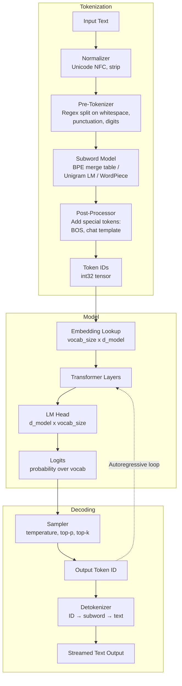
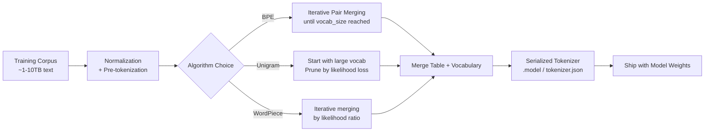

# Tokenization

## 1. Overview

Tokenization is the process of converting raw text into a sequence of discrete integer token IDs that a language model can process. It is the first and last transformation in every LLM pipeline --- text enters as tokens and exits as tokens. Every dollar spent on LLM inference is priced per token. Every context window limit is measured in tokens. Every latency budget is dominated by the number of tokens generated. A principal architect who does not understand tokenization cannot accurately estimate cost, capacity, or quality for any GenAI system.

Tokenization is not merely a preprocessing step; it is a fundamental design decision baked into the model at training time. The tokenizer's vocabulary, algorithm, and special token conventions are immutable properties of a trained model. Swapping tokenizers post-training is not possible without retraining from scratch. This is why tokenizer design choices made during pre-training ripple through every downstream system decision.

## 2. Where It Fits in GenAI Systems

Tokenization sits at the boundary between human-readable text and model-internal representations. It is invoked twice per inference call: once to encode the input prompt into token IDs (tokenization), and once to decode the output token IDs back into text (detokenization). In a RAG pipeline, tokenization also governs chunk sizing, context budget allocation, and cost estimation.


Tokenization directly affects:
- **Cost**: LLM APIs charge per token. A tokenizer that represents the same text in fewer tokens reduces cost proportionally.
- **Context utilization**: A 128K context window measured in tokens holds more information with an efficient tokenizer than an inefficient one.
- **Latency**: Autoregressive generation produces one token per forward pass. Fewer output tokens means lower latency.
- **Multilingual quality**: Poor tokenization of non-English scripts inflates token counts by 2--10x, degrading both cost and quality.
- **Embedding quality**: Token boundaries determine what semantic units the model learns to represent.

## 3. Core Concepts

### 3.1 The Tokenization Pipeline

Every tokenizer follows a four-stage pipeline:

1. **Normalization**: Unicode normalization (NFC/NFKC), lowercasing (optional), whitespace standardization. SentencePiece normalizes at the byte level. GPT tokenizers apply minimal normalization to preserve casing and formatting.

2. **Pre-tokenization**: Splitting input into coarse chunks before the subword algorithm runs. GPT-2/3/4 use regex-based pre-tokenization that splits on whitespace boundaries, punctuation, and digit groups (e.g., `'s`, ` the`, `123` become separate pre-tokens). This prevents merges across word boundaries --- without it, BPE would merge the space in `" the"` with `"theory"` to create nonsensical tokens.

3. **Subword tokenization**: The core algorithm (BPE, WordPiece, or Unigram) segments each pre-token into subword units from a fixed vocabulary.

4. **Post-processing**: Adding special tokens (BOS, EOS, PAD), applying chat templates, and converting subword strings to integer IDs via the vocabulary lookup table.

### 3.2 Byte-Pair Encoding (BPE)

BPE is the dominant tokenization algorithm in modern LLMs. It was adapted from a data compression algorithm (Gage, 1994) to NLP by Sennrich et al. (2016).

**Training algorithm (vocabulary construction)**:

1. Start with a base vocabulary of individual characters (or bytes).
2. Count the frequency of every adjacent pair of tokens in the training corpus.
3. Merge the most frequent pair into a single new token; add it to the vocabulary.
4. Repeat steps 2--3 until the target vocabulary size is reached.

**Inference algorithm (encoding)**:

1. Split input text into characters (or bytes).
2. Apply the learned merge rules in priority order (most frequent merges first).
3. Continue until no more merges are applicable.

**Example**: Given the word `"lowest"` and learned merges `(l, o) -> lo`, `(lo, w) -> low`, `(e, s) -> es`, `(es, t) -> est`:
- `l o w e s t` -> `lo w e s t` -> `low e s t` -> `low es t` -> `low est`
- Final tokens: `["low", "est"]`

**Key property**: BPE is deterministic and greedy. The same input always produces the same token sequence. The merge priority list is the tokenizer's core artifact.

**Models using BPE**: GPT-2, GPT-3, GPT-4, GPT-4o, LLaMA 1/2/3, Mistral, Claude (all versions), Falcon, Code Llama.

### 3.3 Byte-Level BPE (BBPE)

Standard character-level BPE fails on unknown characters (emojis, rare Unicode, code). Byte-level BPE (introduced by GPT-2) solves this by operating on raw UTF-8 bytes instead of Unicode characters:

- Base vocabulary: 256 byte values (0x00--0xFF) instead of ~tens of thousands of Unicode characters.
- Every possible input can be encoded --- no `[UNK]` token ever needed.
- GPT-2 maps each byte to a printable Unicode character to avoid control character issues in the vocabulary file.
- Multilingual text and code are handled without explicit language-specific preprocessing.

**Byte-fallback BPE** (used by LLaMA, Mistral): A hybrid approach where the tokenizer uses character-level BPE for common sequences but falls back to byte-level encoding for rare or unknown characters. SentencePiece implements this with the `byte_fallback=True` flag. This preserves the efficiency of character-level merges for common text while guaranteeing coverage for any UTF-8 input.

### 3.4 SentencePiece

SentencePiece (Kudo and Richardson, 2018) is a language-agnostic tokenization library that treats the input as a raw byte stream, making no assumptions about whitespace or word boundaries. Key differences from HuggingFace tokenizers:

- **Whitespace as a character**: SentencePiece uses the `\u2581` (lower one eighth block) character to represent spaces, treating them as part of the token rather than as delimiters. This means `" the"` is tokenized as `"_the"` (one token), not as two tokens.
- **No pre-tokenization required**: Because it operates on raw input, it works identically for languages without whitespace (Chinese, Japanese, Thai).
- **Two algorithms**: Supports both BPE and Unigram (see 3.6). LLaMA uses SentencePiece with BPE. T5 uses SentencePiece with Unigram.
- **Self-contained model file**: A single `.model` file contains the full vocabulary and merge rules, simplifying deployment.

**Models using SentencePiece**: LLaMA 1/2, T5, mT5, ALBERT, XLNet, PaLM, Gemma.

Note: LLaMA 3 switched from SentencePiece to tiktoken (OpenAI's BPE implementation) with a 128K vocabulary, representing a significant shift.

### 3.5 WordPiece

WordPiece (Schuster and Nakajima, 2012) is used by BERT and related models. It is similar to BPE but differs in the merge selection criterion:

- **BPE**: Merges the pair with the highest absolute frequency.
- **WordPiece**: Merges the pair that maximizes the likelihood of the training corpus (effectively: frequency of the pair divided by the product of the individual frequencies).

In practice, WordPiece favors merging rare subwords that frequently co-occur, while BPE favors merging the globally most common pairs. WordPiece uses the `##` prefix to denote continuation subwords (e.g., `"playing"` -> `["play", "##ing"]`).

**Models using WordPiece**: BERT, DistilBERT, ELECTRA, MobileBERT. WordPiece is largely confined to the BERT family and has not been adopted by modern decoder-only LLMs.

### 3.6 Unigram Language Model

The Unigram tokenizer (Kudo, 2018) takes the opposite approach from BPE:

- **BPE**: Starts small (characters/bytes) and iteratively merges up.
- **Unigram**: Starts large (a massive initial vocabulary) and iteratively prunes down.

Unigram computes the probability of each tokenization of the input using a unigram language model and selects the tokenization with the highest probability (via the Viterbi algorithm). Multiple valid tokenizations exist for any input; Unigram picks the most probable one.

A unique feature: **subword regularization**. During training, Unigram can probabilistically sample from multiple tokenizations of the same input, acting as a form of data augmentation that improves model robustness. BPE is deterministic and cannot do this natively (though BPE-dropout achieves a similar effect).

**Models using Unigram**: T5, mT5, ALBERT, XLNet (via SentencePiece).

### 3.7 Vocabulary Size: A Critical Design Decision

| Model | Vocab Size | Algorithm | Notes |
|-------|-----------|-----------|-------|
| GPT-2 | 50,257 | BBPE | Original byte-level BPE |
| GPT-3 | 50,257 | BBPE | Same tokenizer as GPT-2 |
| GPT-4 / GPT-4o | ~100,256 | BBPE (cl100k / o200k) | 2x GPT-2; better multilingual, code |
| LLaMA 1 | 32,000 | SentencePiece BPE | Small vocab, poor multilingual |
| LLaMA 2 | 32,000 | SentencePiece BPE | Same tokenizer as LLaMA 1 |
| LLaMA 3 | 128,256 | tiktoken BBPE | 4x LLaMA 2; major efficiency gain |
| Mistral 7B | 32,000 | SentencePiece BPE + byte fallback | Byte fallback for coverage |
| Mistral Large / Mixtral | 32,768 | SentencePiece BPE + byte fallback | Slightly expanded |
| Claude 3 / 3.5 / 4 | ~100,000 | BPE (proprietary) | Estimated from behavior |
| Gemini | 256,000 | SentencePiece | Largest known vocab; extreme multilingual |
| BERT | 30,522 | WordPiece | English-centric |
| T5 | 32,100 | SentencePiece Unigram | |
| Qwen 2 | 151,936 | BBPE (tiktoken) | Optimized for Chinese + English |
| DeepSeek-V2/V3 | 100,015 | BBPE | |

**Vocabulary size tradeoffs**:

- **Larger vocabulary** (100K--256K):
  - Fewer tokens per text passage -> lower cost, better context utilization.
  - Larger embedding table (vocab_size x d_model). At d_model=4096 and float16, each 32K vocab increase adds ~256 MB to the embedding matrix.
  - More efficient for multilingual text and code.
  - Sparser training signal per token --- rare tokens may be undertrained.

- **Smaller vocabulary** (32K):
  - More tokens per passage -> higher cost, worse context utilization.
  - Smaller embedding table, faster softmax computation.
  - Each token gets more training signal.
  - Struggles with multilingual text (Chinese characters may require 2--3 tokens each).

**Quantitative impact**: LLaMA 3's move from 32K to 128K vocabulary reduced average token count by ~15% on English text and ~30--40% on multilingual text compared to LLaMA 2, directly translating to cost savings and better context utilization.

### 3.8 Special Tokens

Special tokens serve as control signals to the model. They are added during post-processing and have dedicated IDs that are never produced by the subword algorithm.

| Token | Purpose | Example Models |
|-------|---------|---------------|
| `<BOS>` / `<s>` | Beginning of sequence | LLaMA, Mistral |
| `<EOS>` / `</s>` | End of sequence; signals generation should stop | All models |
| `<PAD>` | Padding for batch alignment | BERT, T5 |
| `<UNK>` | Unknown token (rare in BBPE tokenizers) | BERT, older models |
| `<\|endoftext\|>` | End of document (used as both BOS and EOS) | GPT-2/3/4 |
| `<\|im_start\|>` / `<\|im_end\|>` | Chat message boundaries | GPT-4, ChatGPT |
| `[INST]` / `[/INST]` | Instruction delimiters | LLaMA 2 Chat, Mistral Instruct |
| `<\|begin_of_text\|>` | Sequence start | LLaMA 3 |
| `<\|start_header_id\|>` | Role header (system/user/assistant) | LLaMA 3 |
| `<\|eot_id\|>` | End of turn | LLaMA 3 |

**Chat templates**: Modern instruction-tuned models use structured chat templates that combine special tokens with role markers. Mismatched chat templates are a common source of degraded performance when serving fine-tuned models. The HuggingFace `tokenizer.apply_chat_template()` method standardizes this.

### 3.9 Multilingual Tokenization Efficiency

Tokenization efficiency varies dramatically across languages. The same semantic content requires vastly different token counts depending on the script and the tokenizer's training data distribution.

**Fertility rate** (tokens per word) by language for GPT-4 (cl100k_base):

| Language | Fertility Rate | Relative Cost vs English |
|----------|---------------|------------------------|
| English | ~1.3 | 1.0x |
| Spanish | ~1.4 | 1.1x |
| German | ~1.6 | 1.2x |
| Chinese | ~1.5--2.0 per character | 2.0--3.0x |
| Japanese | ~1.5--2.5 per character | 2.5--4.0x |
| Hindi | ~3.0--5.0 | 3.0--5.0x |
| Thai | ~4.0--6.0 | 4.0--6.0x |
| Burmese | ~6.0--10.0 | 6.0--10.0x |

**Root cause**: BPE merges are frequency-driven. English-heavy training corpora produce English-optimized merge rules. A Chinese character that appears 1,000 times in the corpus gets merged into a single token, but a Burmese syllable that appears 10 times remains split into 3--6 byte-level tokens.

**Mitigations**:
- **Larger vocabularies**: GPT-4's 100K vocab is significantly better for multilingual than GPT-2's 50K. Gemini's 256K vocab achieves the best known multilingual efficiency.
- **Balanced training data**: Explicitly oversampling non-English text during tokenizer training.
- **Language-specific tokenizers**: Some deployments use separate tokenizers for different language groups, though this complicates the serving infrastructure.

### 3.10 Tokenization of Code

Code has unique tokenization challenges:
- **Indentation**: Python's significant whitespace can consume many tokens. GPT-4's tokenizer encodes 4 spaces as a single token; GPT-2's tokenizer required 4 tokens.
- **Identifiers**: `camelCaseVariable` may be split as `["camel", "Case", "Variable"]` or `["cam", "el", "Case", "Var", "iable"]` depending on the tokenizer's merge rules.
- **Syntax tokens**: Brackets, operators, and keywords are common enough to be single tokens in most modern vocabularies.
- **Hexadecimal/Base64**: Dense character sequences without whitespace are highly inefficient to tokenize.

LLaMA 3 and GPT-4 both significantly improved code tokenization by including large code corpora during tokenizer training, resulting in common code patterns (function signatures, import statements, standard library calls) being encoded as fewer tokens.

## 4. Architecture

### Tokenizer in the Inference Pipeline



### Tokenizer Training Pipeline



## 5. Design Patterns

### Pattern 1: Token Budget Allocation

In systems with fixed context windows, architects must allocate the token budget across competing needs:

```
Total context = System prompt + Retrieved context + Conversation history + User query + Output reservation
```

**Rule of thumb**: Reserve 20--30% of the context window for output generation. If using a 128K context model, allocate at most ~90K tokens for input and reserve ~38K for output.

**Implementation**: Use the tokenizer to count tokens for each component before assembling the prompt. Truncate or summarize the lowest-priority component (usually conversation history) when the budget is exceeded.

### Pattern 2: Tokenizer-Aware Chunking

When chunking documents for RAG, split on token boundaries rather than character boundaries:

1. Tokenize the full document.
2. Split the token sequence into chunks of N tokens with M tokens of overlap.
3. Detokenize each chunk back to text for storage.

This prevents chunks from being truncated mid-token, which wastes context budget. It also ensures chunk sizes exactly match the retrieval model's input limit.

### Pattern 3: Multi-Tokenizer Architecture

Systems that use multiple models (e.g., a small model for classification + a large model for generation) must handle multiple tokenizers:

- **Embedding model tokenizer** (e.g., text-embedding-3-small uses cl100k_base) for chunking and embedding.
- **Generation model tokenizer** (e.g., Claude uses its own BPE) for prompt assembly and cost estimation.
- **Reranker tokenizer** (e.g., Cohere rerank uses its own tokenizer) for input length validation.

**Anti-pattern**: Assuming all models use the same tokenizer. Token counts from one tokenizer are not transferable to another.

### Pattern 4: Streaming Detokenization

Autoregressive models produce one token at a time. Naive detokenization of each token individually produces garbled output because subword tokens like `"est"` are not complete words. Production systems implement buffered detokenization:

1. Accumulate tokens in a buffer.
2. Detokenize the buffer.
3. Emit only the text that is "safe" --- characters that cannot change with future tokens.
4. For byte-level BPE, a UTF-8 byte sequence may span multiple tokens; emit only complete codepoints.

### Pattern 5: Prompt Caching via Token Prefix Matching

Anthropic's prompt caching and OpenAI's prefix caching work at the token level. A cache hit requires an exact token-for-token prefix match. This means:

- Deterministic tokenization is essential (BPE guarantees this).
- System prompts should be placed first and kept identical across requests.
- Dynamic content should be appended, never prepended or inserted in the middle.

## 6. Implementation Approaches

### Tokenizer Libraries

| Library | Used By | Language | Notes |
|---------|---------|----------|-------|
| tiktoken | OpenAI (GPT-2/3/4), LLaMA 3 | Rust + Python bindings | Fastest BPE implementation. Regex-based pre-tokenization. |
| SentencePiece | LLaMA 1/2, T5, Gemma, PaLM | C++ + Python bindings | Language-agnostic. BPE + Unigram. Self-contained .model file. |
| HuggingFace tokenizers | Most open-source models | Rust + Python bindings | Unified API for BPE, WordPiece, Unigram. Supports all HF models. |
| Mistral tokenizer | Mistral models | Python | SentencePiece-based with byte fallback. Includes control token handling. |

### Token Counting for Cost Estimation

```python
# Pseudocode for cost estimation
import tiktoken

enc = tiktoken.encoding_for_model("gpt-4")
input_tokens = len(enc.encode(prompt))
estimated_output_tokens = 500  # based on task type

cost = (input_tokens * price_per_input_token) + (estimated_output_tokens * price_per_output_token)
# GPT-4o: $2.50/1M input, $10.00/1M output (as of early 2025)
# Claude 3.5 Sonnet: $3.00/1M input, $15.00/1M output
```

### Training a Custom Tokenizer

When fine-tuning for a specialized domain (medical, legal, code), the base tokenizer may be inefficient. Training a custom tokenizer:

```python
# Pseudocode using HuggingFace tokenizers
from tokenizers import Tokenizer, models, trainers, pre_tokenizers

tokenizer = Tokenizer(models.BPE())
tokenizer.pre_tokenizer = pre_tokenizers.ByteLevel(add_prefix_space=False)
trainer = trainers.BpeTrainer(
    vocab_size=32000,
    special_tokens=["<s>", "</s>", "<pad>", "<unk>"],
    min_frequency=2
)
tokenizer.train(files=["domain_corpus.txt"], trainer=trainer)
```

**Critical caveat**: A custom tokenizer requires retraining the model's embedding layer (at minimum) and ideally continued pre-training. You cannot simply swap tokenizers on a pre-trained model.

### Vocabulary Extension (Token Healing)

An alternative to full tokenizer retraining: add domain-specific tokens to an existing vocabulary and train only the new embedding vectors while freezing the rest:

1. Add N new tokens to the vocabulary.
2. Initialize their embeddings as the average of their constituent subword embeddings.
3. Fine-tune the model with the extended vocabulary on domain data.

This is used in practice for adding special control tokens or high-frequency domain terms without full retraining.

## 7. Tradeoffs

### Algorithm Selection

| Criterion | BPE | WordPiece | Unigram |
|-----------|-----|-----------|---------|
| Determinism | Always deterministic | Deterministic | Probabilistic (can sample) |
| Training speed | Fast (greedy merges) | Moderate | Slow (iterative pruning) |
| Subword regularization | Not native (BPE-dropout exists) | No | Native support |
| Adoption in modern LLMs | Dominant | BERT family only | T5/mT5 only |
| Code handling | Excellent with BBPE | Poor | Moderate |
| Implementation complexity | Low | Low | Moderate |
| Unknown character handling | Full coverage (BBPE) | UNK token | Full coverage with byte fallback |

### Vocabulary Size Selection

| Vocab Size | Tokens per English Word | Multilingual Efficiency | Embedding Table Size (d=4096, fp16) | Softmax Cost | Best For |
|-----------|------------------------|------------------------|--------------------------------------|-------------|----------|
| 32K | ~1.4 | Poor | 256 MB | Low | Monolingual, resource-constrained |
| 50K | ~1.3 | Moderate | 400 MB | Low | English-focused (GPT-2/3) |
| 100K | ~1.2 | Good | 800 MB | Moderate | Multilingual + code (GPT-4, Claude) |
| 128K | ~1.15 | Very good | 1 GB | Moderate | Multilingual + code (LLaMA 3) |
| 256K | ~1.1 | Excellent | 2 GB | High | Extreme multilingual (Gemini) |

### Pre-tokenization Strategy

| Approach | Pros | Cons | Used By |
|----------|------|------|---------|
| Regex-based (GPT-style) | Prevents cross-word merges, predictable splits | Language-specific regex, maintenance burden | GPT-2/3/4, LLaMA 3 |
| None (SentencePiece raw) | Language-agnostic, handles CJK naturally | May create unexpected cross-word tokens | LLaMA 1/2, T5, Gemma |
| Whitespace-only | Simple, predictable | Poor for languages without whitespace | Older models |

## 8. Failure Modes

### Tokenizer Mismatch

**Symptom**: Model outputs gibberish or refuses to follow instructions.
**Cause**: Using the wrong tokenizer for a given model, or applying incorrect chat template formatting. Common when loading a fine-tuned model with a mismatched tokenizer config.
**Detection**: Token count discrepancies between expected and actual. Special tokens appearing in generated text.
**Mitigation**: Always load the tokenizer from the same checkpoint as the model weights. Validate with a known input/output pair.

### Token Boundary Artifacts in Structured Output

**Symptom**: JSON output has malformed keys, broken Unicode characters, or split numbers.
**Cause**: The model's tokenization splits structured content unpredictably. `"price": 12.99` might tokenize as `["price", "\":", " ", "12", ".", "99"]`, and the model may fail to produce the correct continuation.
**Detection**: Parse failures in structured output validation.
**Mitigation**: Constrained decoding (grammar-based sampling), JSON mode, or function calling APIs that enforce valid structure.

### Multilingual Token Inflation

**Symptom**: Non-English users hit context limits or incur 3--10x higher costs than English users for equivalent tasks.
**Cause**: Tokenizer trained predominantly on English text, causing non-Latin scripts to be encoded at byte level.
**Detection**: Monitor tokens-per-character ratio by language. Alert if fertility rate exceeds 3x.
**Mitigation**: Use models with large vocabularies (GPT-4, LLaMA 3, Gemini). For extreme cases, consider language-specific models.

### Prompt Injection via Token Manipulation

**Symptom**: Adversarial inputs bypass safety filters by exploiting tokenization.
**Cause**: Token-level safety filters can be bypassed by inserting zero-width characters, homoglyphs, or encoding tricks that change tokenization without changing visual appearance.
**Detection**: Normalize Unicode before tokenization. Apply safety filters at both character and token levels.
**Mitigation**: NFC normalization, homoglyph detection, byte-level filtering before tokenization.

### Context Window Exceeded

**Symptom**: API returns error or silently truncates input.
**Cause**: Estimating token counts by character count (`len(text) / 4` is a common approximation) instead of actual tokenization.
**Detection**: Always count tokens with the actual tokenizer before sending API requests.
**Mitigation**: Implement token-aware truncation with priority-based section removal.

### Streaming Detokenization Glitches

**Symptom**: Garbled characters or placeholder symbols appearing mid-stream in user-facing output.
**Cause**: Emitting incomplete UTF-8 byte sequences when a multi-byte character spans multiple tokens.
**Detection**: Invalid UTF-8 sequences in streamed output.
**Mitigation**: Buffer tokens and only emit complete UTF-8 codepoints. Most production serving frameworks (vLLM, TGI) handle this correctly.

## 9. Optimization Techniques

### Token Efficiency Optimization

1. **Prompt compression**: Use tools like LLMLingua or LongLLMLingua to compress prompts by removing low-information tokens while preserving semantic content. Achieves 2--5x compression with minimal quality loss.

2. **System prompt optimization**: Minimize system prompt token count. A 2,000-token system prompt repeated across 1M daily requests costs ~$5--15/day at GPT-4o pricing. Rewriting to 500 tokens saves 75%.

3. **Output length control**: Set `max_tokens` to a reasonable ceiling. Instruct the model to be concise. Each unnecessary output token costs money and adds latency.

### Batch Token Packing

When batching requests for offline processing, pack requests to minimize padding waste:

- Sort requests by input length.
- Group similarly-sized inputs into the same batch.
- Use dynamic padding (pad to the longest sequence in the batch, not the model's max length).

This is critical for BERT-style encoder models where padding is explicit. For autoregressive models with continuous batching (vLLM, TGI), padding is handled by the scheduler.

### Vocabulary Pruning for Deployment

For domain-specific deployments where only a subset of the vocabulary is needed:

1. Analyze token usage across the target corpus.
2. Identify unused or extremely rare tokens.
3. Prune the vocabulary and retrain the embedding/LM head layers.

This reduces the embedding table size and speeds up the softmax computation. Practical for edge deployment where every MB matters.

### Token-Aware Caching

Cache at the token level rather than the text level:

- **Prefix caching**: Store KV cache state for common prompt prefixes (e.g., system prompts). All requests sharing the prefix skip redundant prefill computation. Anthropic's prompt caching and vLLM's automatic prefix caching implement this.
- **Semantic caching**: Cache responses for semantically similar queries. The cache key is computed at the embedding level, but cost savings are measured in tokens avoided.

### Tokenizer Speed Optimization

For high-throughput applications:

- **tiktoken** (Rust-based) is 3--6x faster than Python SentencePiece for BPE tokenization.
- **HuggingFace tokenizers** (Rust-based) parallelize tokenization across CPU cores.
- Pre-tokenize offline for batch workloads --- tokenize once, store token IDs, reuse across experiments.
- For edge deployment, use compiled tokenizer models (ONNX export of the tokenizer itself).

## 10. Real-World Examples

### OpenAI --- Tokenizer Evolution Across GPT Generations

OpenAI's tokenizer progression illustrates the impact of vocabulary design on system economics. GPT-2 and GPT-3 shared the same 50,257-token vocabulary (r50k_base). GPT-3.5 and GPT-4 moved to cl100k_base (100,256 tokens), adding dedicated tokens for code patterns and multilingual scripts. GPT-4o uses o200k_base (~200K tokens). Each generation reduced average tokens per passage by ~10--15%, directly lowering API costs and improving context utilization. OpenAI publishes tiktoken as an open-source library, enabling exact token counting before API calls.

### Meta --- LLaMA 3's Vocabulary Expansion

Meta's LLaMA 3 increased vocabulary from 32K (LLaMA 1/2) to 128,256 tokens using tiktoken-based BBPE, replacing SentencePiece. This was the single largest tokenizer change between LLaMA generations and had sweeping effects: ~15% fewer tokens for English, ~30--40% fewer tokens for multilingual text, and significantly better code tokenization. The tradeoff was a 4x larger embedding table, but at 8B+ parameters, the embedding matrix is a small fraction of total model size. This change also made LLaMA 3 compatible with OpenAI's tokenizer tooling ecosystem.

### Google DeepMind --- Gemini's 256K Vocabulary

Gemini uses a 256,000-token SentencePiece vocabulary, the largest known production vocabulary. This extreme size was specifically designed for Google's multilingual mandate --- Gemini serves users in 40+ languages, and undertokenization of non-Latin scripts would create unacceptable cost and quality disparities. The 256K vocabulary achieves near-parity fertility rates across major world languages. The tradeoff is a 2 GB embedding matrix (at d_model=8192, fp16), which is manageable for Gemini's scale but would be prohibitive for smaller models targeting edge deployment.

### Mistral --- Byte-Fallback BPE for Robustness

Mistral's tokenizer uses SentencePiece BPE with byte fallback, keeping a compact 32K vocabulary while guaranteeing zero `[UNK]` tokens. The byte fallback mechanism uses a set of 256 reserved byte tokens that represent individual UTF-8 bytes; any character not in the learned vocabulary is decomposed into its byte representation. This is particularly effective for code (which contains arbitrary byte sequences) and for mixed-script text (e.g., a French document with embedded Arabic quotes). The compact vocabulary keeps the model efficient for edge deployment while the byte fallback ensures universal input coverage.

### Anthropic --- Prompt Caching and Token Economics

Anthropic's prompt caching feature (available for Claude 3.5 Sonnet and Claude 3 Opus onward) relies on exact token-prefix matching. When a request shares a token prefix with a previous request, the cached KV states are reused, reducing prefill latency and cost. Cache write costs 25% more than base input token pricing, but cache reads cost 90% less. For systems with stable system prompts (e.g., a RAG application with a fixed 4,000-token system prompt), this means the system prompt is only paid for once. This feature is fundamentally enabled by BPE's deterministic tokenization: the same text always produces the same tokens, making prefix matching reliable.

## 11. Related Topics

**GenAI foundations**:
- [Transformers](./transformers.md) --- tokenization feeds directly into the embedding layer of transformer models
- [LLM Landscape](./llm-landscape.md) --- each model family uses a specific tokenizer; vocabulary size is a key differentiator
- [Embeddings](./embeddings.md) --- token IDs are the input to the embedding lookup table

**Context and cost**:
- [Context Management](../prompt-engineering/context-management.md) --- token budgeting, truncation, and prompt assembly depend on tokenizer behavior
- [Cost Optimization](../performance/cost-optimization.md) --- token pricing is the primary cost driver; tokenizer efficiency directly affects spend
- [KV Cache](../llm-architecture/kv-cache.md) --- cache size scales with sequence length measured in tokens

**Retrieval and chunking**:
- [Chunking](../rag/chunking.md) --- token-aware chunking requires the tokenizer to determine split points
- [RAG Pipeline](../rag/rag-pipeline.md) --- the tokenizer governs context budget allocation for retrieved passages

**Safety and quality**:
- [Prompt Injection](../prompt-engineering/prompt-injection.md) --- tokenization-level attacks exploit subword boundaries
- [Guardrails](../safety/guardrails.md) --- safety filters operate at both token and text levels

**Traditional system design**:
- [Search and Indexing](../../patterns/search-and-indexing.md) --- tokenization in NLP search vs tokenization in LLMs share conceptual roots but differ in implementation

## 12. Source Traceability

| Concept | Primary Source |
|---------|---------------|
| BPE algorithm | Sennrich, Haddow, Birch. "Neural Machine Translation of Rare Words with Subword Units." ACL 2016. |
| SentencePiece | Kudo, Richardson. "SentencePiece: A simple and language independent subword tokenizer and detokenizer for Neural Text Processing." EMNLP 2018. |
| Unigram LM | Kudo. "Subword Regularization: Improving Neural Network Translation Models with Multiple Subword Candidates." ACL 2018. |
| WordPiece | Schuster, Nakajima. "Japanese and Korean Voice Search." ICASSP 2012. |
| Byte-level BPE | Radford et al. "Language Models are Unsupervised Multitask Learners." OpenAI 2019 (GPT-2 paper). |
| GPT-4 tokenizer (cl100k) | OpenAI tiktoken library. https://github.com/openai/tiktoken |
| LLaMA 3 tokenizer | Meta. "The Llama 3 Herd of Models." arXiv:2407.21783, 2024. |
| Gemini tokenizer | Google DeepMind. "Gemini: A Family of Highly Capable Multimodal Models." arXiv:2312.11805, 2023. |
| Multilingual tokenization analysis | Petrov et al. "Language Model Tokenizers Introduce Unfairness Between Languages." NeurIPS 2023. |
| BPE-dropout | Provilkov, Emelianenko, Voita. "BPE-Dropout: Simple and Effective Subword Regularization." ACL 2020. |
| LLMLingua prompt compression | Jiang et al. "LLMLingua: Compressing Prompts for Accelerated Inference of Large Language Models." EMNLP 2023. |
| Mistral tokenizer | Mistral AI. "Mistral 7B." arXiv:2310.06825, 2023. |
