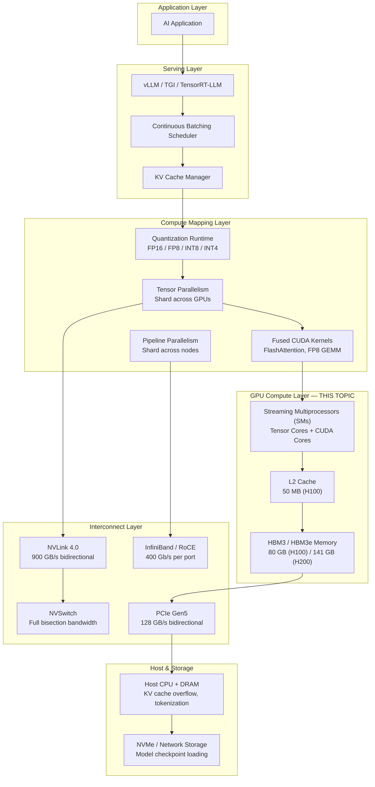
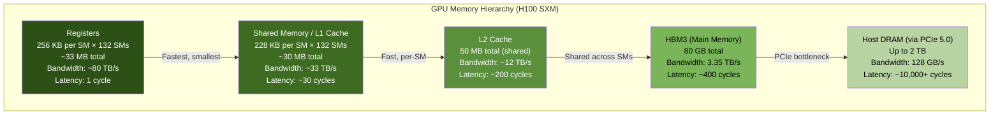
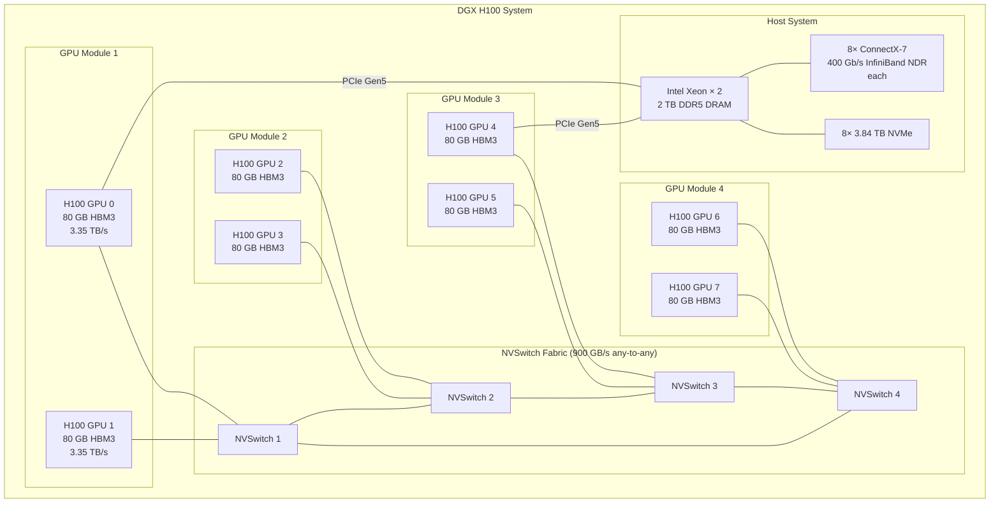
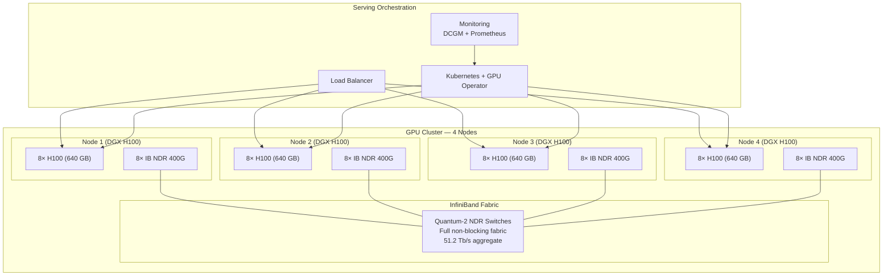

# GPU Compute for LLM Inference

## 1. Overview

GPU compute is the physical substrate upon which all LLM inference runs. For Principal AI Architects, GPU selection and provisioning is the single largest cost driver in GenAI systems — typically 70--90% of total inference infrastructure cost. Choosing the wrong GPU, the wrong number of GPUs, or the wrong deployment topology can result in 3--10x cost overruns or inability to meet latency SLOs.

This topic covers the hardware, memory systems, multi-GPU topologies, and cost models that determine how large language models map onto physical GPUs. The goal is to equip architects with the formulas, specifications, and decision frameworks needed to answer questions like: "How many H100s do I need to serve LLaMA 3.1 70B at 2,000 requests per minute with p99 TTFT under 500ms?" or "Should I use 4x H100 or 8x A100 for this workload?"

**Key numbers that drive GPU decisions:**
- LLaMA 3.1 70B at FP16 requires ~140 GB — this exceeds any single GPU's memory, requiring multi-GPU deployment
- H100 SXM provides 3.35 TB/s memory bandwidth vs A100's 2.0 TB/s — this 67% increase directly translates to decode throughput
- H100 FP8 tensor cores deliver 1,979 TFLOPS vs 624 TFLOPS at FP16 — FP8 quantization nearly triples compute throughput
- NVLink bandwidth (H100): 900 GB/s bidirectional — tensor parallelism requires this; PCIe at 128 GB/s is insufficient
- A single H100 costs ~$2--3/hr on cloud vs ~$30K capital expenditure — breakeven is typically 12--18 months at >60% utilization

---

## 2. Where It Fits in GenAI Systems

GPU compute is the foundation layer. Every component above it — serving frameworks, batching schedulers, KV cache managers, quantization runtimes — exists to maximize the utilization and efficiency of the GPU resources below.



**Upstream consumers:** Serving frameworks issue GPU operations (GEMM, attention, sampling) through CUDA kernels. The serving layer's scheduling decisions are constrained by GPU memory capacity (determines max batch size) and compute throughput (determines tokens/s).

**Downstream dependencies:** Multi-GPU communication fabric (NVLink, NVSwitch, InfiniBand) determines the maximum model size that can be served efficiently and the scaling behavior of tensor/pipeline parallelism.

---

## 3. Core Concepts

### 3.1 GPU Hardware Specifications

#### NVIDIA Data Center GPU Comparison

| Specification | A100 SXM (40GB) | A100 SXM (80GB) | H100 SXM | H200 SXM | B200 SXM |
|--------------|-----------------|-----------------|-----------|-----------|-----------|
| **Architecture** | Ampere (GA100) | Ampere (GA100) | Hopper (GH100) | Hopper (GH100) | Blackwell (GB200) |
| **Process node** | 7nm (TSMC N7) | 7nm (TSMC N7) | 4nm (TSMC 4N) | 4nm (TSMC 4N) | 4nm (TSMC 4NP) |
| **SMs** | 108 | 108 | 132 | 132 | 192 |
| **CUDA Cores** | 6,912 | 6,912 | 16,896 | 16,896 | 18,432 |
| **Tensor Cores** | 432 (3rd gen) | 432 (3rd gen) | 528 (4th gen) | 528 (4th gen) | 640 (5th gen) |
| **FP32 TFLOPS** | 19.5 | 19.5 | 67 | 67 | 90 |
| **FP16 Tensor TFLOPS** | 312 | 312 | 989 | 989 | 2,250 |
| **BF16 Tensor TFLOPS** | 312 | 312 | 989 | 989 | 2,250 |
| **FP8 Tensor TFLOPS** | N/A | N/A | 1,979 | 1,979 | 4,500 |
| **INT8 Tensor TFLOPS** | 624 | 624 | 1,979 | 1,979 | 4,500 |
| **HBM Type** | HBM2e | HBM2e | HBM3 | HBM3e | HBM3e |
| **HBM Capacity** | 40 GB | 80 GB | 80 GB | 141 GB | 192 GB |
| **HBM Bandwidth** | 1.6 TB/s | 2.0 TB/s | 3.35 TB/s | 4.8 TB/s | 8.0 TB/s |
| **L2 Cache** | 40 MB | 40 MB | 50 MB | 50 MB | 64 MB |
| **NVLink** | 3.0 (600 GB/s) | 3.0 (600 GB/s) | 4.0 (900 GB/s) | 4.0 (900 GB/s) | 5.0 (1,800 GB/s) |
| **TDP** | 400W | 400W | 700W | 700W | 1,000W |
| **FP8 Support** | No | No | Yes (Transformer Engine) | Yes (Transformer Engine) | Yes (2nd gen TE) |
| **Released** | 2020 | 2020 | 2023 | 2024 | 2025 |

**Key observations:**
- H100 vs A100: 3.2x FP16 TFLOPS, 1.67x memory bandwidth, same HBM capacity — the bandwidth improvement matters most for decode-bound LLM inference
- H200 vs H100: Same compute, but 1.76x HBM capacity and 1.43x bandwidth — H200 is purpose-built for LLM serving (more KV cache capacity, faster decode)
- B200: 2.3x FP16 TFLOPS over H100, 2.4x HBM capacity, 2.4x bandwidth — generational leap for both training and inference
- FP8: Available only on Hopper+ (H100/H200/B200). Doubles effective TFLOPS over FP16 — this is why FP8 quantization is the default recommendation for H100 deployments

### 3.2 GPU Memory Hierarchy

Understanding the GPU memory hierarchy is essential for reasoning about performance bottlenecks.



**Why this matters for LLM inference:**

- **FlashAttention** works by keeping attention computation within SRAM, avoiding materializing the O(n^2) attention matrix in HBM. This is why FlashAttention achieves 2--4x speedup — it operates at ~33 TB/s SRAM bandwidth instead of 3.35 TB/s HBM bandwidth.
- **Decode phase bottleneck**: During decoding, each token reads the entire model weights from HBM (140 GB for 70B FP16). At 3.35 TB/s, this takes ~42ms. No amount of compute optimization can make decode faster than this fundamental memory read time (for batch size 1).
- **KV cache**: Stored in HBM. The KV cache read pattern during attention is sequential per-layer, making it bandwidth-bound. KV cache quantization (FP16 → FP8) directly halves the bandwidth requirement.

### 3.3 Memory Planning Formulas

Accurate GPU memory planning is critical. Underestimating leads to OOM; overestimating wastes expensive GPU capacity.

#### Model Weight Memory

```
weight_memory = num_params × bytes_per_param

Examples:
  7B  FP16: 7 × 10^9 × 2 bytes   = 14 GB
  7B  INT4: 7 × 10^9 × 0.5 bytes  = 3.5 GB
  70B FP16: 70 × 10^9 × 2 bytes   = 140 GB
  70B FP8:  70 × 10^9 × 1 byte    = 70 GB
  70B INT4: 70 × 10^9 × 0.5 bytes = 35 GB
  405B FP16: 405 × 10^9 × 2 bytes = 810 GB
  405B FP8:  405 × 10^9 × 1 byte  = 405 GB
```

#### KV Cache Memory

```
kv_cache_per_token = 2 × num_layers × num_kv_heads × head_dim × bytes_per_element

Examples (FP16, 2 bytes per element):
  LLaMA 3 8B (GQA, 8 KV heads):
    = 2 × 32 layers × 8 heads × 128 dim × 2 bytes = 131 KB/token
    At 4K context: 131 KB × 4096 = 524 MB per request

  LLaMA 3 70B (GQA, 8 KV heads):
    = 2 × 80 layers × 8 heads × 128 dim × 2 bytes = 327 KB/token
    At 4K context: 327 KB × 4096 = 1.3 GB per request
    At 32K context: 327 KB × 32768 = 10.5 GB per request

  LLaMA 3.1 405B (GQA, 8 KV heads):
    = 2 × 126 layers × 8 heads × 128 dim × 2 bytes = 516 KB/token
    At 4K context: 516 KB × 4096 = 2.06 GB per request
```

#### Total Memory per Request

```
total_kv_per_request = kv_cache_per_token × (input_tokens + output_tokens)
```

#### Activation Memory (Temporary)

```
activation_memory ≈ batch_size × seq_len × hidden_dim × 2 bytes × ~10
(rough estimate; varies by model and framework)

For LLaMA 70B at batch_size=1, seq_len=4096:
  ≈ 1 × 4096 × 8192 × 2 × 10 ≈ 640 MB (during prefill)
```

#### Total GPU Memory Budget

```
total_memory = weight_memory + kv_cache_memory + activation_memory + framework_overhead

Where:
  kv_cache_memory = kv_cache_per_token × max_total_tokens_in_flight
  framework_overhead ≈ 1-3 GB (CUDA context, buffers, page tables)

Example — LLaMA 3.1 70B FP16, 4x H100 (80 GB each), TP=4:
  Weight per GPU: 140 GB / 4 = 35 GB
  Framework overhead: ~2 GB
  Available for KV cache: (80 × 0.90) - 35 - 2 = 35 GB per GPU → 140 GB total
  KV per request at 4K ctx: 1.3 GB
  Max concurrent requests: 140 / 1.3 ≈ 107 requests

Example — LLaMA 3.1 70B FP8, 4x H100 (80 GB each), TP=4:
  Weight per GPU: 70 GB / 4 = 17.5 GB
  Framework overhead: ~2 GB
  Available for KV cache: (80 × 0.90) - 17.5 - 2 = 52.5 GB per GPU → 210 GB total
  KV per request at 4K ctx (FP8 KV): 0.65 GB
  Max concurrent requests: 210 / 0.65 ≈ 323 requests
```

### 3.4 Compute-Bound vs Memory-Bound Analysis

The **arithmetic intensity** (or operational intensity) determines whether a workload is compute-bound or memory-bandwidth-bound.

```
Arithmetic Intensity = FLOPS performed / Bytes read from memory (FLOPS/byte)

Machine Balance Point = Peak TFLOPS / Peak Memory Bandwidth
  H100 SXM (FP16): 989 TFLOPS / 3.35 TB/s = 295 FLOPS/byte
  H100 SXM (FP8):  1979 TFLOPS / 3.35 TB/s = 590 FLOPS/byte
  A100 SXM (FP16): 312 TFLOPS / 2.0 TB/s = 156 FLOPS/byte
  H200 SXM (FP16): 989 TFLOPS / 4.8 TB/s = 206 FLOPS/byte

Rule:
  If workload intensity > machine balance → COMPUTE-BOUND (GPU cores are the bottleneck)
  If workload intensity < machine balance → MEMORY-BOUND (HBM bandwidth is the bottleneck)
```

#### LLM Inference Phase Analysis

**Prefill (prompt processing):**
```
FLOPS per token ≈ 2 × num_params (for one forward pass, per token)
  70B model: 2 × 70 × 10^9 = 140 GFLOPS per token

Bytes read per token ≈ model_weights = 140 GB (FP16, 70B)
  But with batch of N input tokens processed together, weights read once:
  Intensity = (N × 140 GFLOPS) / 140 GB = N FLOPS/byte

For N=1024 input tokens: intensity = 1024 FLOPS/byte >> 295 → COMPUTE-BOUND
For N=32 input tokens: intensity = 32 FLOPS/byte << 295 → MEMORY-BOUND
```

**Decode (token generation):**
```
Batch size B decode steps in parallel:
FLOPS = B × 2 × num_params = B × 140 GFLOPS
Bytes = model_weights + KV_cache ≈ 140 GB + B × kv_per_request

For B=1: intensity ≈ 140 GFLOPS / 140 GB = 1 FLOPS/byte << 295 → MEMORY-BOUND
For B=32: intensity ≈ 32 × 140 GFLOPS / (140 GB + 32 × 1.3 GB) ≈ 25 FLOPS/byte → still MEMORY-BOUND
For B=256: intensity ≈ 256 × 140 GFLOPS / (140 + 333 GB) ≈ 76 FLOPS/byte → still MEMORY-BOUND (but closer)
```

**Key insight:** Decode is almost always memory-bandwidth-bound for practical batch sizes. This means:
1. Faster HBM bandwidth (H200 > H100 > A100) directly improves decode throughput
2. Reducing model weight memory (via quantization) directly improves decode throughput (fewer bytes to read)
3. Adding more TFLOPS alone does not help decode performance

### 3.5 Multi-GPU Topologies

#### NVLink

High-speed point-to-point interconnect between GPUs within a node.

| Generation | Bandwidth (bidirectional) | Available On |
|-----------|--------------------------|-------------|
| NVLink 3.0 | 600 GB/s (12 links × 50 GB/s) | A100 |
| NVLink 4.0 | 900 GB/s (18 links × 50 GB/s) | H100, H200 |
| NVLink 5.0 | 1,800 GB/s (18 links × 100 GB/s) | B200 |

**Why NVLink matters for LLM serving:**
- Tensor parallelism requires 2 AllReduce operations per Transformer layer
- For 70B model with 80 layers: 160 AllReduce operations per forward pass
- Each AllReduce transfers ~(hidden_dim × batch_size × 2 bytes) = ~16 KB per token per operation
- At decode batch_size=256: ~4 MB per AllReduce → 640 MB total per forward pass
- At NVLink 4.0 (900 GB/s): ~0.7ms communication overhead — acceptable
- At PCIe Gen5 (128 GB/s): ~5ms communication overhead — dominates inference time

#### NVSwitch

NVSwitch provides full-bisection-bandwidth connectivity between all GPUs in a node. Without NVSwitch, NVLink connects GPUs in a ring or mesh topology, and cross-pair communication must hop through intermediate GPUs.

- **DGX H100**: 4 NVSwitch chips, connecting 8 H100 GPUs with full 900 GB/s between any pair
- **DGX B200**: 4 NVSwitch chips with NVLink 5.0, 1.8 TB/s per GPU
- **Without NVSwitch** (e.g., 2-GPU NVLink bridges): Only directly connected GPU pairs get full bandwidth; cross-pair communication is halved

#### InfiniBand and RoCE (Inter-Node)

For pipeline parallelism and expert parallelism across nodes:

| Technology | Bandwidth (per port) | Latency | Use Case |
|-----------|---------------------|---------|----------|
| InfiniBand NDR | 400 Gb/s (50 GB/s) | ~1 us | NVIDIA-recommended for multi-node |
| InfiniBand NDR200 | 200 Gb/s (25 GB/s) | ~1 us | Common in cloud GPU instances |
| RoCE v2 | 100--400 Gb/s | ~2--5 us | Ethernet-based alternative, used by some clouds |
| PCIe Gen5 | 128 GB/s | ~1 us (local) | Host-GPU, not for GPU-GPU |

**Pipeline parallelism communication:** transfers activations between stages. For 70B model, each micro-batch transfers ~(batch_size × hidden_dim × 2 bytes) per pipeline stage boundary. At batch=64: ~1 MB per transfer → negligible on InfiniBand NDR.

**Expert parallelism communication:** All-to-all pattern for MoE routing. Much more bandwidth-intensive — each token's hidden state must be routed to the correct expert GPU. This is the primary bottleneck for MoE inference across nodes.

#### PCIe

PCIe is used for host-GPU communication (model loading, KV cache swapping to CPU) and for connecting GPUs that lack NVLink.

| Generation | Bandwidth (×16 bidirectional) |
|-----------|------------------------------|
| PCIe Gen4 | 64 GB/s |
| PCIe Gen5 | 128 GB/s |
| PCIe Gen6 | 256 GB/s (emerging) |

**Critical point:** PCIe-connected GPUs should **never** be used for tensor parallelism with large LLMs. The 128 GB/s bandwidth is 7x lower than NVLink 4.0, making TP communication a severe bottleneck. Use PCIe GPUs only for data parallelism (independent replicas) or single-GPU models.

### 3.6 GPU Memory Hierarchy Performance Impact

| Operation | Memory Level | Effective Bandwidth | Implication for LLM |
|-----------|-------------|--------------------|--------------------|
| Register arithmetic | Registers | ~80 TB/s | Tensor core operations (GEMM inner loop) |
| FlashAttention tiling | Shared memory / SRAM | ~33 TB/s | 10x faster than HBM for attention |
| KV cache read (cached) | L2 cache | ~12 TB/s | Short sequences may fit in L2 |
| Weight/KV cache read | HBM | 3.35 TB/s (H100) | Decode bottleneck |
| KV cache swap to CPU | PCIe | 128 GB/s (Gen5) | 26x slower than HBM — avoid if possible |
| Model loading from disk | NVMe | 7 GB/s (Gen4 x4) | 70B FP16 load time: ~20 seconds |

---

## 4. Architecture

### 4.1 Single-Node Multi-GPU Topology (DGX H100)



**Total system:**
- 8 × 80 GB = 640 GB HBM3 aggregate
- 8 × 3.35 TB/s = 26.8 TB/s aggregate HBM bandwidth
- 8 × 989 = 7,912 TFLOPS FP16 aggregate
- NVLink: 900 GB/s between any GPU pair (via NVSwitch)
- InfiniBand: 3,200 Gb/s (8 ports × 400 Gb/s) for inter-node

**Model mapping:**
- 70B FP16 (140 GB): TP=2 (2 GPUs), 4 replicas per node for throughput
- 70B FP8 (70 GB): TP=1 (single GPU), 8 replicas per node
- 405B FP16 (810 GB): TP=8 (entire node), 1 replica
- 405B FP8 (405 GB): TP=8 (entire node, room for large KV cache)

### 4.2 Multi-Node Cluster for Large-Scale Serving



**Deployment examples on this 4-node cluster (32 × H100):**
- LLaMA 3.1 70B FP16, TP=4: 8 replicas (4 GPUs each), ~8,000 requests/min capacity
- LLaMA 3.1 70B FP8, TP=2: 16 replicas, ~16,000 requests/min
- LLaMA 3.1 405B FP8, TP=8 PP=2: 2 replicas (16 GPUs each), ~1,000 requests/min
- Mixed: 2 replicas of 70B (8 GPUs) + 2 replicas of 8B (2 GPUs) + embedding model (2 GPUs)

---

## 5. Design Patterns

### Pattern 1: Right-Size GPU for Workload Phase

**When to use:** Different workloads have different bottlenecks. Match GPU characteristics to the dominant phase.

| Workload Characteristic | Optimal GPU | Why |
|------------------------|------------|-----|
| Long input, short output (summarization) | H100 SXM (high TFLOPS) | Prefill-dominant = compute-bound |
| Short input, long output (code generation) | H200 SXM (high bandwidth + capacity) | Decode-dominant = memory-bound |
| High concurrency, medium context | H200 SXM (141 GB HBM) | KV cache capacity is the bottleneck |
| Cost-sensitive, moderate quality | A100 80GB + INT4 quantization | A100 still cost-effective for quantized models |
| Maximum throughput, any cost | B200 SXM (192 GB, 8 TB/s) | Best everything, but most expensive |

### Pattern 2: Model-to-GPU Sizing Guide

**When to use:** Quick reference for mapping model sizes to GPU configurations.

| Model Size | Precision | Min GPUs (A100 80GB) | Min GPUs (H100 80GB) | Min GPUs (H200 141GB) | Recommended Config |
|-----------|-----------|---------------------|---------------------|----------------------|-------------------|
| 7--8B | FP16 | 1 | 1 | 1 | 1× H100, TP=1 |
| 7--8B | INT4 | 1 (any GPU ≥8GB) | 1 | 1 | 1× A100 40GB |
| 13B | FP16 | 1 | 1 | 1 | 1× H100, TP=1 |
| 34B | FP16 | 1 | 1 | 1 | 1× H100 or 2× A100 |
| 70B | FP16 | 2 (TP=2) | 2 (TP=2) | 1 (TP=1) | 4× H100, TP=4 |
| 70B | FP8 | N/A | 1 (TP=1) | 1 (TP=1) | 2× H100, TP=2 |
| 70B | INT4 | 1 | 1 | 1 | 1× H100 (room for KV) |
| 405B | FP16 | 12+ (TP=8 PP=2) | 12+ (TP=8 PP=2) | 8 (TP=8) | 8× H200, TP=8 |
| 405B | FP8 | N/A | 8 (TP=8) | 4 (TP=4) | 8× H100, TP=8 |

### Pattern 3: Heterogeneous GPU Deployment

**When to use:** Optimizing cost by mixing GPU generations for different model tiers or inference phases.

**Architecture:**
- **Tier 1 (frontier models):** H100/H200 for 70B+ models requiring FP8 and high throughput
- **Tier 2 (mid-range):** A100 80GB for 7B--34B models where A100 provides sufficient performance at lower cost
- **Tier 3 (embeddings/classifiers):** A10G or L4 for small models (BERT, embedding models) that don't need HBM3 bandwidth
- **Tier 4 (local/dev):** Consumer GPUs (RTX 4090 24GB) for development and testing

**Cost benefit:** A100 spot instances are 50--70% cheaper than H100. For a 7B model, A100 achieves 70--80% of H100 throughput at a fraction of the cost.

### Pattern 4: Memory Oversubscription with KV Cache Offloading

**When to use:** Serving long-context requests where KV cache exceeds GPU memory.

**Architecture:**
1. Allocate primary KV cache in GPU HBM
2. When HBM usage exceeds threshold (~85%), swap least-recently-used KV cache blocks to host CPU DRAM via PCIe
3. When a swapped-out request's turn comes in continuous batching, prefetch its KV cache back to GPU
4. vLLM implements this natively via its preemption mechanism (swap policy)

**Tradeoff:** PCIe Gen5 bandwidth (128 GB/s) is 26x slower than HBM (3.35 TB/s). Swapping a 10 GB KV cache takes ~78ms — adding significant latency to that request. Use only as a last resort.

### Pattern 5: Multi-Tenant GPU Sharing with MIG/MPS

**When to use:** Serving multiple small models on a single GPU, or isolating workloads for different tenants.

**NVIDIA MIG (Multi-Instance GPU):**
- Partitions a single H100 into up to 7 isolated GPU instances
- Each instance has dedicated HBM, L2 cache, and SMs
- H100 80GB → 7× MIG instances of ~10 GB each (or 3 × ~26 GB, etc.)
- Useful for serving multiple 7B INT4 models (~4 GB each) on a single GPU

**MPS (Multi-Process Service):**
- Allows multiple CUDA processes to share a GPU without full MIG isolation
- Better utilization for small models that underutilize GPU SMs
- No memory isolation — one process's OOM affects others

---

## 6. Implementation Approaches

### 6.1 GPU Memory Planning Calculator

```python
def calculate_gpu_requirements(
    num_params_billions: float,
    precision: str,  # "fp16", "fp8", "int8", "int4"
    num_layers: int,
    num_kv_heads: int,
    head_dim: int,
    max_context_len: int,
    target_concurrent_requests: int,
    gpu_memory_gb: float = 80.0,
    gpu_utilization: float = 0.90,
    framework_overhead_gb: float = 2.0,
) -> dict:
    """Calculate GPU requirements for LLM serving."""

    bytes_per_param = {
        "fp16": 2, "bf16": 2, "fp8": 1, "int8": 1, "int4": 0.5
    }[precision]

    bytes_per_kv = {
        "fp16": 2, "bf16": 2, "fp8": 1, "int8": 1, "int4": 0.5
    }.get(precision, 2)  # KV cache precision may differ

    # Model weight memory
    weight_memory_gb = (num_params_billions * 1e9 * bytes_per_param) / 1e9

    # KV cache per token (bytes)
    kv_per_token_bytes = 2 * num_layers * num_kv_heads * head_dim * bytes_per_kv

    # KV cache per request
    kv_per_request_gb = (kv_per_token_bytes * max_context_len) / 1e9

    # Total KV cache needed
    total_kv_gb = kv_per_request_gb * target_concurrent_requests

    # Total memory needed (before TP sharding)
    total_memory_gb = weight_memory_gb + total_kv_gb + framework_overhead_gb

    # Number of GPUs needed
    usable_per_gpu = gpu_memory_gb * gpu_utilization
    num_gpus = max(1, -(-int(total_memory_gb / usable_per_gpu)))  # Ceiling division

    # Determine TP size (must be power of 2, and weight must fit)
    tp_for_weights = max(1, -(-int(weight_memory_gb / usable_per_gpu)))
    tp_size = 1
    while tp_size < tp_for_weights:
        tp_size *= 2

    num_gpus = max(num_gpus, tp_size)

    return {
        "weight_memory_gb": round(weight_memory_gb, 1),
        "kv_per_request_gb": round(kv_per_request_gb, 3),
        "total_kv_gb": round(total_kv_gb, 1),
        "total_memory_gb": round(total_memory_gb, 1),
        "min_tp_size": tp_size,
        "num_gpus_needed": num_gpus,
        "kv_headroom_gb": round(
            num_gpus * usable_per_gpu - weight_memory_gb - framework_overhead_gb, 1
        ),
        "max_concurrent_at_config": int(
            (num_gpus * usable_per_gpu - weight_memory_gb - framework_overhead_gb)
            / kv_per_request_gb
        ),
    }

# Example: LLaMA 3.1 70B FP8 on H100
result = calculate_gpu_requirements(
    num_params_billions=70,
    precision="fp8",
    num_layers=80,
    num_kv_heads=8,
    head_dim=128,
    max_context_len=4096,
    target_concurrent_requests=200,
    gpu_memory_gb=80.0,
)
# Result: tp_size=2, num_gpus=2, max_concurrent ~= 323 requests
```

### 6.2 DCGM GPU Monitoring Setup

```bash
# Deploy NVIDIA DCGM Exporter for Prometheus monitoring
# Critical metrics for LLM serving:

# GPU utilization (SM occupancy) — target >70% during peak
# DCGM_FI_DEV_GPU_UTIL

# GPU memory used/total — alert at >90%
# DCGM_FI_DEV_FB_USED, DCGM_FI_DEV_FB_FREE

# GPU temperature — throttling starts at ~83°C
# DCGM_FI_DEV_GPU_TEMP

# Power consumption — important for TCO
# DCGM_FI_DEV_POWER_USAGE

# NVLink bandwidth utilization — critical for TP
# DCGM_FI_DEV_NVLINK_BANDWIDTH_TOTAL

# Memory bandwidth utilization — decode bottleneck indicator
# DCGM_FI_DEV_MEM_COPY_UTIL

# PCIe throughput — KV cache swapping indicator
# DCGM_FI_DEV_PCIE_TX_THROUGHPUT, DCGM_FI_DEV_PCIE_RX_THROUGHPUT

# Tensor core utilization — prefill efficiency indicator
# DCGM_FI_PROF_PIPE_TENSOR_ACTIVE
```

### 6.3 nvidia-smi Quick Reference for Debugging

```bash
# Check GPU memory allocation per process
nvidia-smi --query-compute-apps=pid,process_name,used_gpu_memory \
  --format=csv

# Check NVLink status and bandwidth
nvidia-smi nvlink --status

# Check GPU topology (NVLink vs PCIe connections)
nvidia-smi topo --matrix

# Monitor GPU metrics in real-time (1-second interval)
nvidia-smi dmon -s pucvmet -d 1

# Check ECC errors (can cause silent data corruption)
nvidia-smi --query-gpu=ecc.errors.corrected.aggregate.total,ecc.errors.uncorrected.aggregate.total \
  --format=csv

# Check GPU clock speeds (throttling detection)
nvidia-smi --query-gpu=clocks.current.graphics,clocks.max.graphics,clocks.current.memory,clocks.max.memory \
  --format=csv
```

### 6.4 Benchmarking GPU Performance for LLM Workloads

```python
# Benchmark decode throughput (memory-bandwidth bound)
# This estimates the theoretical maximum decode tokens/s

def estimate_decode_throughput(
    model_params_gb: float,       # Model weight memory in GB
    kv_cache_per_step_gb: float,  # KV cache read per decode step (all reqs)
    hbm_bandwidth_tb_s: float,    # GPU HBM bandwidth in TB/s
    num_gpus: int = 1,
    bandwidth_efficiency: float = 0.85,  # Typical achievable fraction
) -> float:
    """Estimate theoretical max decode tokens/s (batch=1 per token)."""
    total_bytes_per_step = (model_params_gb + kv_cache_per_step_gb) * 1e9
    effective_bandwidth = hbm_bandwidth_tb_s * 1e12 * bandwidth_efficiency * num_gpus
    steps_per_second = effective_bandwidth / total_bytes_per_step
    return steps_per_second

# LLaMA 3.1 70B FP16, 4x H100, batch=1
tps = estimate_decode_throughput(
    model_params_gb=35,   # 140 GB / 4 GPUs (TP=4)
    kv_cache_per_step_gb=0.3,
    hbm_bandwidth_tb_s=3.35,
    num_gpus=4,
    bandwidth_efficiency=0.80
)
# ~323 decode steps/s per request at batch=1
# With batch=32, throughput ≈ 32 × 50 = ~1,600 tokens/s total
```

---

## 7. Tradeoffs

### GPU Selection Decision Matrix

| Decision Factor | A100 80GB | H100 80GB | H200 141GB | B200 192GB |
|----------------|----------|-----------|------------|------------|
| **FP16 TFLOPS** | 312 | 989 (3.2x) | 989 | 2,250 (7.2x) |
| **FP8 TFLOPS** | N/A | 1,979 | 1,979 | 4,500 |
| **HBM capacity** | 80 GB | 80 GB | 141 GB (1.76x) | 192 GB (2.4x) |
| **HBM bandwidth** | 2.0 TB/s | 3.35 TB/s (1.67x) | 4.8 TB/s (2.4x) | 8.0 TB/s (4x) |
| **NVLink BW** | 600 GB/s | 900 GB/s | 900 GB/s | 1,800 GB/s |
| **Cloud cost ($/hr)** | ~$1.50--2.00 | ~$2.50--3.50 | ~$3.50--4.50 | ~$5.00--7.00 (est.) |
| **Perf/$ (decode)** | Baseline | 1.5--2x | 2--2.5x | 2--3x (est.) |
| **Best for** | Small models, cost-opt | General purpose | Large KV cache, decode | Next-gen, highest perf |
| **Availability** | Excellent | Good | Growing | Limited (2025) |

### On-Premise vs Cloud vs Hybrid

| Factor | On-Premise | Cloud (On-Demand) | Cloud (Reserved/Spot) | Hybrid |
|--------|-----------|-------------------|-----------------------|--------|
| **Upfront cost** | Very high ($200K--$1M+ per DGX) | None | Low--Medium | Medium |
| **Ongoing cost** | Power, cooling, staff | Highest per hour | 30--70% less than on-demand | Mixed |
| **Breakeven** | 12--18 months at >60% utilization | Never (always costs more long-term) | 6--12 months | Depends on mix |
| **Scalability** | Months (procurement) | Minutes | Minutes (if available) | Minutes (cloud burst) |
| **GPU availability** | Guaranteed (owned) | Subject to capacity | Subject to spot market | Guaranteed (base) + burst |
| **Data sovereignty** | Full control | Provider jurisdiction | Provider jurisdiction | Control (on-prem) + burst |
| **Operational burden** | High (hardware, cooling, networking) | Low | Low | Medium |
| **When to choose** | Predictable high-volume workload, data sovereignty requirements | Variable/unpredictable workload, fast experimentation | Cost optimization for steady-state | Baseline on-prem + cloud burst |

### TCO Analysis: 70B Model Serving

| Component | On-Premise (DGX H100) | AWS (p5.48xlarge) | CoreWeave (H100 × 8) | Lambda Labs (1× H100) |
|-----------|----------------------|-------------------|-----------------------|----------------------|
| **GPU config** | 8× H100 SXM 80GB | 8× H100 SXM 80GB | 8× H100 SXM 80GB | 1× H100 SXM 80GB |
| **Cost/hour** | ~$8 amortized (3yr) | ~$98.32 | ~$17.68 | ~$2.49 |
| **Cost/month (24/7)** | ~$5,760 | ~$70,790 | ~$12,730 | ~$1,793 |
| **3-year TCO** | ~$350K (incl. power/cooling/staff) | ~$2,548K | ~$458K | ~$65K (1 GPU only) |
| **Throughput (70B FP8)** | ~16K tok/s | ~16K tok/s | ~16K tok/s | ~2K tok/s |
| **Cost/M tokens** | ~$0.10 | ~$1.70 | ~$0.31 | ~$0.35 |
| **Notes** | Requires data center, staff | Most expensive, most flexible | Best cloud value | Per-GPU, no multi-node |

**Key TCO insight:** On-premise becomes cost-effective only at sustained >60% GPU utilization. Below that, reserved cloud instances (1- or 3-year commitments) offer better value with less operational burden.

---

## 8. Failure Modes

| Failure Mode | Symptom | Root Cause | Mitigation |
|-------------|---------|------------|------------|
| **GPU OOM** | CUDA out-of-memory error, serving pod crash | Model weights + KV cache + activations exceed GPU HBM | Run memory calculator before deployment; set gpu_memory_utilization < 0.95; enable KV cache swap |
| **NVLink failure** | Sudden throughput drop, AllReduce timeout | Physical NVLink link degradation or driver issue | Monitor `nvidia-smi nvlink --status`; implement health checks that detect TP communication degradation; have spare nodes |
| **GPU thermal throttling** | Gradual throughput degradation, clocks drop below base | Inadequate cooling, high ambient temperature, blocked airflow | Monitor GPU temp via DCGM; alert at 80 deg C; maintain data center cooling at 18--22 deg C; check airflow |
| **ECC memory errors** | Silent data corruption (uncorrected) or performance degradation (corrected) | HBM cell degradation over time | Monitor ECC counters; retire GPUs with uncorrectable errors; schedule maintenance on high correctable-error GPUs |
| **PCIe bandwidth saturation** | Model loading takes 10+ minutes, KV swap latency spikes | Multiple GPUs sharing PCIe root complex, or Gen4 instead of Gen5 | Verify PCIe topology (nvidia-smi topo); use NVMe for model storage; minimize host-GPU transfers |
| **GPU clock locking failure** | Variable inference latency, inconsistent benchmarks | GPU Boost clocks fluctuating based on power/thermal headroom | Lock clocks: `nvidia-smi -lgc <base>,<max>`; ensure consistent power delivery |
| **Driver/CUDA version mismatch** | Cryptic CUDA errors, kernel launch failures, NaN outputs | Framework compiled against different CUDA version than installed driver | Pin driver/CUDA/framework versions in container images; test version matrix before deployment |
| **Multi-tenancy interference** | One model's latency spikes when another model runs on same GPU | Shared L2 cache thrashing, memory bandwidth contention | Use MIG for hard isolation; avoid sharing GPUs between latency-sensitive and throughput workloads |
| **InfiniBand fabric degradation** | Pipeline parallelism latency increases, cross-node expert routing slows | Link errors, switch port flaps, congestion | Monitor IB counters (ibstat), implement fabric health monitoring, maintain redundant paths |
| **Supply chain GPU shortages** | Cannot scale capacity, long procurement lead times | Industry-wide GPU demand exceeding supply | Maintain relationships with multiple cloud providers; reserve capacity; design for GPU efficiency (quantization reduces GPU count) |

---

## 9. Optimization Techniques

### 9.1 Maximizing GPU Utilization

| Technique | Impact | Implementation |
|-----------|--------|----------------|
| **Continuous batching** | 3--10x throughput (fills GPU during decode) | Use vLLM/TGI/TRT-LLM (all support it) |
| **Quantization (FP8)** | 2x model fits per GPU, 1.5--2x throughput | TensorRT-LLM FP8 engine build |
| **Quantization (INT4)** | 4x model fits per GPU, but weight-only | GPTQ/AWQ via vLLM or TRT-LLM |
| **Right-sized TP** | 10--30% throughput gain from less TP communication | Use minimum TP that fits model + target KV cache |
| **Chunked prefill** | Better GPU utilization by interleaving prefill/decode | vLLM --enable-chunked-prefill |
| **Batch size tuning** | Find sweet spot between latency and throughput | Profile with increasing max_num_seqs |
| **CUDA graph caching** | 5--15% latency reduction from reduced kernel launch overhead | Enabled by default in TRT-LLM; vLLM --enforce-eager=False |

### 9.2 Memory Optimization

| Technique | Memory Savings | Trade-off |
|-----------|---------------|-----------|
| **FP8 weights + FP8 KV cache** | 4x total (vs FP16 weights + FP16 KV) | <1% quality loss (H100/H200 required) |
| **INT4 weights + FP16 KV cache** | 2.5x typical | 1--3% quality loss |
| **PagedAttention** | 1.5--2x KV cache utilization | None (pure improvement) |
| **KV cache offload to CPU** | Extends effective KV capacity 10x+ | ~80ms latency penalty per swap |
| **Prefix caching** | Proportional to shared prefix | Memory overhead for cache management |
| **Token pruning/eviction** | 2--4x KV cache reduction | Quality degradation on long-range tasks |

### 9.3 Power and Cooling Optimization

| Technique | Power Savings | Performance Impact |
|-----------|-------------|-------------------|
| **Power capping** | 10--20% power reduction | 5--10% throughput reduction (non-linear) |
| **Clock management** | Variable (match clocks to workload) | Minimal if done correctly |
| **Batch scheduling** | 15--25% power during off-peak | Increased latency for deferred requests |
| **GPU idle power states** | 70--80% power reduction when idle | ~100ms wake-up latency |

### 9.4 Cost Optimization Strategies

| Strategy | Typical Savings | Complexity |
|----------|----------------|------------|
| **Reserved instances (1--3 year)** | 30--60% vs on-demand | Low (capacity commitment) |
| **Spot/preemptible instances** | 60--80% vs on-demand | Medium (need fallback strategy) |
| **Right-sizing GPU type** | 20--50% (don't use H100 for 7B model) | Low |
| **Multi-tenant GPU sharing (MIG)** | 2--7x density for small models | Medium |
| **Off-peak scheduling** | 20--40% (batch non-urgent work to off-peak) | Medium |
| **Model distillation** | 50--80% (smaller model = fewer GPUs) | High (requires training) |
| **Quantization** | 50--75% (fewer GPUs needed) | Low--Medium |

---

## 10. Real-World Examples

### Meta — LLaMA 3.1 Training and Inference Infrastructure

Meta trained LLaMA 3.1 405B on a cluster of 16,384 H100 GPUs organized in 2,048 nodes of 8 GPUs each, connected via a 3-tier InfiniBand fabric (400 Gb/s per GPU). The training used 4D parallelism: TP=8 (within-node NVLink), PP=16, CP=4 (context parallelism for 128K context), DP=128. For inference, Meta deploys the 405B model with FP8 quantization on 8× H100 per replica, achieving ~400 output tokens/s per replica. Their internal serving infrastructure handles billions of inference requests per day across Meta's product suite (Instagram, WhatsApp, Facebook). Key insight: Meta found that investing in NVLink-connected (not PCIe) GPUs was critical — their early experiments with PCIe A100 clusters showed 3x lower training throughput due to TP communication bottlenecks.

### OpenAI — Scaling GPU Infrastructure for ChatGPT

OpenAI operates one of the largest GPU clusters in the world for serving ChatGPT and the GPT-4 API. While specific numbers are not public, industry estimates place their GPU fleet at 25,000--50,000 H100-equivalent GPUs (in partnership with Microsoft Azure). ChatGPT's traffic pattern is highly variable — 10x daily peak-to-trough — requiring sophisticated auto-scaling. OpenAI uses a combination of on-demand capacity and reserved instances, with Azure providing custom hardware configurations optimized for their workloads. Their infrastructure team pioneered many techniques that became standard: large-batch prefill optimization, KV cache management at extreme scale, and multi-region deployment for latency optimization.

### Anyscale / Together AI — Cloud GPU Arbitrage

Companies like Anyscale and Together AI operate across multiple cloud GPU providers (AWS, GCP, CoreWeave, Lambda Labs, Fluidstack) to optimize cost and availability. They maintain a "GPU broker" layer that routes workloads to the cheapest available GPUs in real-time. Together AI reports achieving 40--60% cost reduction vs single-provider deployment by exploiting price differentials across providers and using spot instances for non-latency-critical batch inference. Their system automatically migrates model replicas between providers based on pricing signals, with a target migration time of <5 minutes (including model weight loading from shared NVMe cache).

### CoreWeave — Purpose-Built GPU Cloud

CoreWeave operates data centers specifically designed for GPU workloads, with 100% InfiniBand networking between all GPU nodes. Unlike hyperscaler clouds that offer GPUs as an add-on to general-purpose infrastructure, CoreWeave's infrastructure is optimized for the thermal envelope (>30 kW per rack), power density, and network topology requirements of GPU clusters. They offer H100 SXM at $2.21/GPU/hr (as of early 2025), approximately 60--70% cheaper than equivalent AWS p5 instances. Their customers include AI labs and startups (Cohere, Harvey, Character.ai) that need large GPU clusters without the 12--18 month lead time of building on-premise.

### Google Cloud — TPU vs GPU Strategy

Google operates both TPU (Tensor Processing Unit) and GPU infrastructure for AI workloads. TPU v5e and v5p offer competitive price-performance vs H100 for training and serving, with the key advantage of tightly integrated pod-level interconnect (ICI at 4,800 Gbps per chip). Google Cloud also offers A3 instances (8× H100 with NVSwitch) and A3 Mega (8× H100 with enhanced networking). Their recommendation engine is instructive: TPUs for training and serving of Google's own models (Gemini, PaLM), GPUs (H100/A100) for customers who need CUDA ecosystem compatibility. Google reports that TPU v5e provides 2x better price-performance than A100 for LLM inference, but the lack of CUDA support limits adoption to customers willing to use JAX/XLA.

---

## 11. Related Topics

- **[Model Serving Infrastructure](model-serving.md):** Serving frameworks (vLLM, TGI, TensorRT-LLM) that run on the GPU compute layer described here and whose performance is determined by GPU specifications
- **[Model Parallelism](model-parallelism.md):** Tensor, pipeline, and expert parallelism strategies that map model computations across the multi-GPU topologies described in Section 3.5
- **[Quantization](quantization.md):** INT4/INT8/FP8 quantization techniques that reduce model memory footprint and change the compute profile described in Sections 3.3--3.4
- **[KV Cache Management](kv-cache.md):** KV cache sizing and optimization, which directly consumes the GPU HBM capacity analyzed in Section 3.3
- **[Training Infrastructure](../model-strategies/training-infrastructure.md):** GPU cluster design for training workloads, which have different requirements (higher compute utilization, gradient communication) than inference
- **[Kubernetes for GenAI](../orchestration/kubernetes-genai.md):** Orchestrating GPU resources via Kubernetes GPU Operator, device plugins, and scheduling

---

## 12. Source Traceability

| Concept | Primary Source | Year |
|---------|---------------|------|
| A100 GPU specifications | NVIDIA, "NVIDIA A100 Tensor Core GPU Architecture" (Whitepaper) | 2020 |
| H100 GPU specifications | NVIDIA, "NVIDIA H100 Tensor Core GPU Architecture" (Whitepaper) | 2022 |
| H200 GPU specifications | NVIDIA, "NVIDIA H200 Tensor Core GPU" (Datasheet) | 2024 |
| B200 GPU specifications | NVIDIA, "NVIDIA Blackwell Architecture Technical Brief" | 2024 |
| NVLink and NVSwitch | NVIDIA, "NVIDIA NVLink and NVSwitch" (Technical Overview) | 2022 |
| FlashAttention (IO-awareness) | Dao et al., "FlashAttention: Fast and Memory-Efficient Exact Attention with IO-Awareness" | 2022 |
| Roofline model (compute vs memory bound) | Williams et al., "Roofline: An Insightful Visual Performance Model for Multicore Architectures" | 2009 |
| LLaMA 3.1 training infrastructure | Meta AI, "The LLaMA 3 Herd of Models" (Section: Infrastructure, Scaling, Efficiency) | 2024 |
| vLLM memory management | Kwon et al., "Efficient Memory Management for Large Language Model Serving with PagedAttention" | 2023 |
| TensorRT-LLM FP8 | NVIDIA, "TensorRT-LLM Performance on H100 GPUs" (Benchmark Reports) | 2024 |
| GPU TCO analysis | Epoch AI, "Trends in the Dollar Training Cost of Machine Learning Systems" | 2024 |
| CoreWeave GPU cloud | CoreWeave, "Cloud Infrastructure for AI" (Technical Documentation) | 2024 |
| Google TPU v5 | Jouppi et al., "TPU v4: An Optically Reconfigurable Supercomputer for Machine Learning with Hardware Support for Embeddings" (Google) | 2023 |
| Splitwise disaggregated inference | Patel et al., "Splitwise: Efficient Generative LLM Inference Using Phase Splitting" (Microsoft) | 2024 |
| DCGM monitoring | NVIDIA, "Data Center GPU Manager User Guide" | 2023 |
| InfiniBand for AI | NVIDIA (Mellanox), "InfiniBand for AI: Network Architecture for Scalable AI Training and Inference" | 2024 |
| MIG (Multi-Instance GPU) | NVIDIA, "Multi-Instance GPU User Guide" | 2020 |
