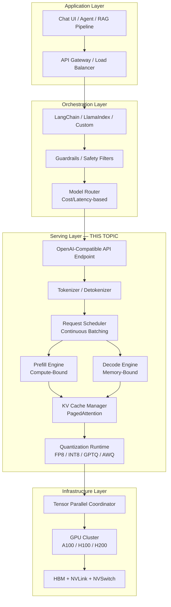
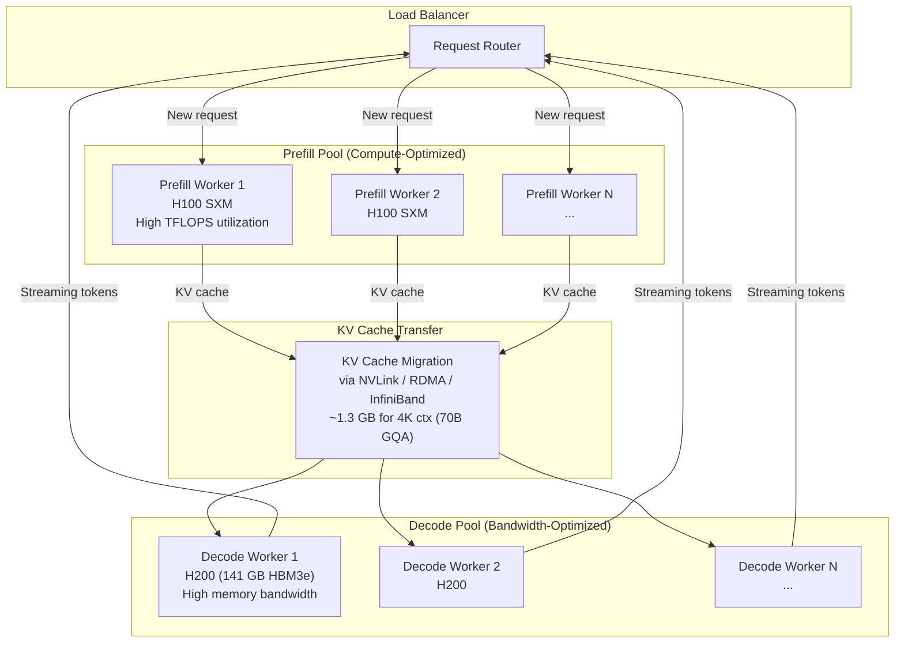
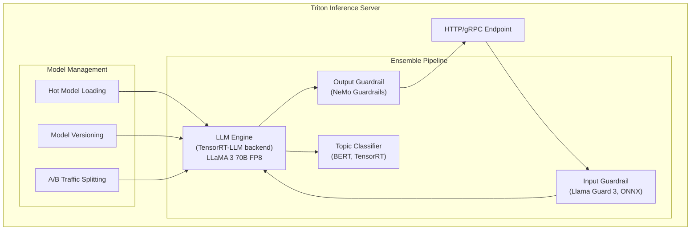

# Model Serving Infrastructure

## 1. Overview

Model serving infrastructure is the runtime layer that transforms a trained LLM checkpoint into a production service capable of handling thousands of concurrent requests with predictable latency, high throughput, and efficient GPU utilization. This is not a simple "load model and call forward()." Production LLM serving involves a deeply specialized software stack — continuous batching schedulers, paged KV cache managers, fused CUDA kernels, tensor-parallel coordinators, and streaming detokenizers — all orchestrated to maximize tokens-per-second-per-dollar.

For Principal AI Architects, model serving is where cost meets capability. A poorly served 70B model on 4x H100s can cost $50/M tokens; the same model with optimized serving (vLLM + FP8 quantization + prefix caching) can achieve $2/M tokens. The serving framework choice determines your inference cost structure more than the model itself.

**Key numbers that drive serving decisions:**
- A single H100 can serve a 70B model (FP8) at ~2,000 output tokens/s with continuous batching
- Prefill phase is compute-bound: ~10ms for 2K tokens on H100 (70B FP16, TP=4)
- Decode phase is memory-bandwidth-bound: ~15ms per token per request (70B FP16, TP=4)
- KV cache memory dominates at high concurrency: 70B GQA model uses ~1.2 GB per request at 4K context (FP16)
- Continuous batching improves throughput by 3--10x over static batching for real-world workloads
- PagedAttention eliminates 60--80% of KV cache memory waste from fragmentation

---

## 2. Where It Fits in GenAI Systems

Model serving sits at the critical junction between the application/orchestration layer above and the GPU compute layer below. It is the single most performance-sensitive component in any GenAI deployment.



**Upstream dependencies:** Orchestration frameworks (LangChain, LlamaIndex) send requests via OpenAI-compatible APIs. Model routers select the appropriate model/endpoint based on cost, latency, and capability constraints.

**Downstream dependencies:** GPU compute layer provides the raw FLOPS and memory bandwidth. The serving layer's job is to maximize utilization of these resources across many concurrent requests.

**Key interface contract:** The serving layer exposes a streaming API (typically SSE) that returns tokens incrementally as they are generated. Latency is measured as Time-to-First-Token (TTFT, dominated by prefill) and Inter-Token Latency (ITL, dominated by decode).

---

## 3. Core Concepts

### 3.1 The LLM Inference Pipeline

LLM inference is fundamentally different from traditional ML inference. It is an iterative, autoregressive process where each output token depends on all previous tokens. A single request passes through two distinct computational phases.

**Step-by-step pipeline:**

1. **Input Reception**: Raw text arrives via HTTP/gRPC endpoint
2. **Tokenization**: Text is converted to token IDs using the model's tokenizer (BPE, SentencePiece, or Tiktoken). This is CPU-bound and takes <1ms for typical inputs.
3. **Prefill Phase (Prompt Processing)**: All input tokens are processed in parallel through the full Transformer stack. This computes the KV cache entries for every input token. This phase is **compute-bound** — it saturates GPU tensor cores with large matrix multiplications.
4. **KV Cache Storage**: The Key and Value projections from each attention layer are stored in GPU memory for reuse during decoding.
5. **Decode Phase (Token Generation)**: Tokens are generated one at a time, autoregressively. Each decode step processes only the newly generated token, attending to the full KV cache. This phase is **memory-bandwidth-bound** — each step reads the entire KV cache and model weights from HBM but performs relatively little computation.
6. **Detokenization**: Token IDs are converted back to text. For streaming, partial detokenization handles multi-token characters (e.g., UTF-8 sequences split across tokens).
7. **Output Streaming**: Tokens are streamed to the client via Server-Sent Events (SSE) as they are generated.

### 3.2 Prefill vs Decode: The Two-Phase Problem

This is the most important concept in LLM serving. The two phases have fundamentally different computational characteristics:

**Prefill (compute-bound):**
- Processes N input tokens simultaneously
- Arithmetic intensity: ~O(N * d_model) FLOPS per memory access
- On H100 (FP16): 989 TFLOPS available vs 3.35 TB/s bandwidth → operational intensity threshold = 295 FLOPS/byte
- Prefill exceeds this threshold for typical sequence lengths, meaning GPU compute is the bottleneck
- Increasing batch size during prefill provides diminishing returns (already compute-saturated)

**Decode (memory-bandwidth-bound):**
- Processes 1 token per request per step
- Each step reads entire model weights (~140 GB for 70B FP16) + entire KV cache
- Arithmetic intensity: ~1 FLOP per byte read (vector-matrix multiply with batch=1)
- GPU compute utilization during decode: typically 1--5% of peak FLOPS
- **Key insight:** Batching multiple decode requests together improves compute utilization because the weight read cost is amortized across batch elements

**Implications for serving:**
- Prefill and decode compete for GPU resources but have opposite characteristics
- Mixing them naively wastes resources: prefill blocks decode (stalling generation) or decode wastes compute capacity
- This motivates **disaggregated prefill/decode** architectures (Section 5) and careful scheduling

### 3.3 Continuous Batching vs Static Batching

**Static batching (naive approach):**
- Collects a fixed batch of requests, processes them together
- All requests in the batch must complete before any can return results
- GPU sits idle while waiting for the batch to fill
- Throughput drops severely when requests have variable output lengths — the entire batch waits for the longest request

**Continuous batching (iteration-level scheduling):**
- The scheduler operates at the granularity of individual decode iterations
- New requests can be added to the running batch between decode steps
- Completed requests are immediately removed and their KV cache memory is freed
- The batch size dynamically fluctuates based on available GPU memory (primarily KV cache capacity)

**Why continuous batching matters:**
- 3--10x throughput improvement over static batching for real-world workloads
- Eliminates the "convoy effect" where short requests are stuck behind long ones
- Enables better GPU utilization by keeping the batch size close to optimal
- All modern serving frameworks (vLLM, TGI, TensorRT-LLM, SGLang) implement continuous batching

### 3.4 PagedAttention and Memory Management

KV cache memory management is the single largest challenge in LLM serving. For a 70B model with GQA (8 KV heads, d_head=128) at FP16:
- Per-token KV cache: 2 (K+V) x 80 layers x 8 heads x 128 dim x 2 bytes = 327 KB/token
- At 4K context: ~1.3 GB per request
- At 32K context: ~10.5 GB per request

**The fragmentation problem:** Naive memory allocation pre-allocates a contiguous buffer for max_seq_len per request. If a request only generates 200 tokens but max_seq_len is 4096, ~95% of allocated memory is wasted. With fixed-size allocation, a 80 GB GPU might only support ~15 concurrent requests instead of the theoretical ~60.

**PagedAttention (vLLM's innovation):**
- Inspired by OS virtual memory with paging
- KV cache is divided into fixed-size "blocks" (e.g., 16 tokens per block)
- Blocks are allocated on demand as tokens are generated
- A page table maps logical token positions to physical memory blocks
- Blocks can be non-contiguous in physical memory
- When a request completes, its blocks are immediately freed for reuse

**Benefits:**
- Near-zero memory waste (fragmentation reduced from ~50% to ~4%)
- 2--4x more concurrent requests per GPU
- Enables advanced features: copy-on-write for beam search (share prefix blocks), prefix caching (share system prompt KV blocks across requests)

### 3.5 Prefix Caching

When many requests share a common prefix (system prompt, few-shot examples, RAG context template), the KV cache for that prefix is identical across all requests. Prefix caching stores and reuses these shared KV cache blocks.

**Automatic prefix caching (vLLM):**
- Hashes token sequences to identify shared prefixes
- Maintains a global prefix pool in GPU memory
- New requests that match an existing prefix skip the prefill phase for those tokens
- TTFT reduction: proportional to prefix length (e.g., 2K shared prefix with 500 unique tokens → ~80% TTFT reduction)

**RadixAttention (SGLang):**
- Uses a radix tree data structure to manage prefix cache
- Enables efficient longest-prefix-match lookups
- Particularly effective for multi-turn conversations (each turn extends the previous prefix)
- Handles branching conversation trees efficiently

### 3.6 Speculative Decoding

Speculative decoding accelerates autoregressive generation by using a small "draft" model to propose multiple tokens in parallel, then verifying them with the large "target" model in a single forward pass.

**How it works:**
1. Draft model (e.g., 1B params) generates K candidate tokens autoregressively (fast, ~K * 2ms)
2. Target model (e.g., 70B params) verifies all K tokens in a single forward pass (same cost as 1 prefill step)
3. Accept the longest prefix of draft tokens that match the target model's distribution
4. Average acceptance rate: 70--85% for well-matched draft/target pairs

**Speedup:** 2--3x for well-matched draft/target pairs. The speedup is limited by the draft model's acceptance rate and the ratio of draft/target model costs.

**Available in:** vLLM, TensorRT-LLM, SGLang. Medusa (multi-head draft) and EAGLE (feature-level draft) are specialized variants.

---

### 3.7 Serving Frameworks: Deep Comparison

#### vLLM

**Origin:** UC Berkeley (Kwon et al., 2023). The most widely deployed open-source LLM serving framework.

**Key innovations:**
- **PagedAttention**: The defining feature — OS-style virtual memory for KV cache. Eliminates fragmentation and enables memory sharing.
- **Continuous batching**: Iteration-level scheduling with preemption support (requests can be swapped to CPU memory under memory pressure).
- **Tensor parallelism**: Megatron-LM-style TP using NCCL. Supports TP across GPUs within a node.
- **Pipeline parallelism**: Cross-node distribution for very large models.
- **Prefix caching**: Automatic prefix deduplication with hash-based lookup.
- **Speculative decoding**: Draft model, Medusa, and EAGLE support.
- **Quantization**: GPTQ, AWQ, SqueezeLLM, FP8, and GGUF loading.
- **Structured output**: Guided generation via outlines/lm-format-enforcer integration.
- **OpenAI-compatible API**: Drop-in replacement for OpenAI API endpoints.

**Performance characteristics:**
- Throughput: Highest flexibility, competitive with TensorRT-LLM after recent optimizations
- Latency: Slightly higher overhead than TensorRT-LLM due to Python scheduler
- Memory efficiency: Best-in-class due to PagedAttention
- Model support: Broadest model coverage (LLaMA, Mistral, Mixtral, Qwen, Gemma, Phi, Falcon, StarCoder, etc.)

**When to choose:** Default choice for production. Best when you need broad model support, memory efficiency, and community ecosystem.

#### TensorRT-LLM (NVIDIA)

**Origin:** NVIDIA. Proprietary optimized runtime for NVIDIA GPUs.

**Key innovations:**
- **Fused CUDA kernels**: Custom kernels for every Transformer operation, eliminating kernel launch overhead and unnecessary memory round-trips.
- **FP8 quantization**: Leverages H100/H200 Transformer Engine for native FP8 execution. ~2x throughput over FP16 with <0.5% quality loss.
- **INT8 SmoothQuant**: Per-channel weight quantization with per-token activation quantization.
- **Inflight batching**: NVIDIA's term for continuous batching with the ability to insert new requests between iterations.
- **Paged KV cache**: Similar to vLLM's PagedAttention.
- **Multi-GPU support**: Native tensor parallelism and pipeline parallelism via NVLink/NVSwitch.
- **Graph compilation**: Ahead-of-time compilation of the Transformer graph with operator fusion.

**Performance characteristics:**
- Throughput: Highest on NVIDIA hardware (especially with FP8 on H100/H200)
- Latency: Lowest per-token latency due to fused kernels
- Memory: Efficient, but PagedAttention implementation slightly less flexible than vLLM
- Model support: Narrower than vLLM (requires model-specific plugin or conversion)

**When to choose:** Maximum throughput on NVIDIA GPUs, especially when using H100/H200 with FP8. Willing to invest in model conversion and reduced flexibility.

#### Text Generation Inference (TGI) — Hugging Face

**Origin:** Hugging Face. Production-grade Rust-based inference server.

**Key features:**
- **Rust core**: High-performance HTTP server with Rust backend, Python model sharding.
- **FlashAttention integration**: Uses FlashAttention-2/3 for attention computation.
- **Continuous batching**: Token-level scheduling with dynamic batch sizing.
- **Tensor parallelism**: Multi-GPU sharding via PyTorch distributed.
- **Quantization**: GPTQ, AWQ, EETQ (INT8), bitsandbytes, and FP8.
- **Hugging Face ecosystem**: Native Hub integration, zero-config model loading.
- **Grammar-constrained generation**: JSON schema, regex-guided output.

**Performance characteristics:**
- Throughput: Good, but typically 20--40% below vLLM/TensorRT-LLM at high concurrency
- Latency: Competitive TTFT due to FlashAttention
- Ease of use: Highest — single Docker command to serve any HF model
- Ecosystem: Best integration with HF ecosystem (model cards, tokenizers, configs)

**When to choose:** Rapid deployment of HuggingFace models, ease of operation, Docker-first deployment.

#### Triton Inference Server (NVIDIA)

**Origin:** NVIDIA. General-purpose model serving platform.

**Key features:**
- **Multi-framework**: Serves TensorRT, ONNX, PyTorch, TensorFlow, vLLM, and Python models.
- **Ensemble pipelines**: Chain multiple models (e.g., tokenizer → LLM → post-processor) in a single request.
- **Dynamic batching**: Across model types (not LLM-specific continuous batching unless using TensorRT-LLM backend).
- **Model management**: Hot-loading, A/B testing, model versioning.
- **Metrics**: Prometheus-compatible metrics out of the box.
- **TensorRT-LLM backend**: Uses TensorRT-LLM as the LLM execution engine within Triton.

**Performance characteristics:**
- When using TensorRT-LLM backend: Same performance as TensorRT-LLM standalone
- Overhead: Minimal (~1--3%) from Triton orchestration layer
- Scalability: Kubernetes-native with robust health checking and auto-scaling hooks

**When to choose:** Multi-model deployments, ensemble pipelines (e.g., guardrails model + LLM + classifier), enterprise environments requiring model management.

#### SGLang

**Origin:** LMSYS (UC Berkeley). Research-driven serving framework focused on structured generation and prefix caching.

**Key innovations:**
- **RadixAttention**: Radix tree-based prefix cache for efficient longest-prefix-match. Particularly effective for multi-turn and branching conversations.
- **Compressed finite-state machines**: For constrained decoding (JSON, regex, grammar). Faster than outlines-based approaches by compiling constraints into jump-forward tokens.
- **Speculative execution for programs**: Can speculatively execute multiple branches of an LLM program in parallel.
- **Co-designed frontend/backend**: The SGLang programming language co-designs prompting programs with the serving backend for optimal scheduling.

**Performance characteristics:**
- Throughput: Competitive with vLLM, sometimes faster for structured output workloads
- Prefix caching: Best-in-class for workloads with high prefix overlap
- Structured generation: 3--5x faster JSON generation than vLLM + outlines
- Model support: Growing but narrower than vLLM

**When to choose:** Structured output at scale (JSON mode, function calling), multi-turn chatbots with high cache hit rates, complex LLM programs with branching.

#### Ollama / llama.cpp

**Origin:** llama.cpp by Georgi Gerganov; Ollama wraps it in a user-friendly interface.

**Key features:**
- **CPU + GPU inference**: Runs on consumer hardware (MacBook, desktop GPUs, CPU-only servers).
- **GGUF quantization**: Custom quantization format with numerous precision levels (Q2_K, Q3_K, Q4_K_M, Q5_K_M, Q6_K, Q8_0). Q4_K_M is the sweet spot for quality/size.
- **Metal acceleration**: Native Apple Silicon GPU support via Metal API.
- **CUDA acceleration**: Offload layers to NVIDIA GPUs with per-layer granularity.
- **Minimal dependencies**: C/C++ with no Python runtime or CUDA toolkit required (for CPU/Metal).
- **Ollama API**: Simple REST API with model management, chat endpoints, and embedding support.

**Performance characteristics:**
- Throughput: Much lower than GPU-optimized servers (10--50 tokens/s for 7B on M2 Max)
- Latency: Acceptable for single-user scenarios
- Memory: Extremely efficient — 7B model in Q4_K_M fits in ~4 GB RAM
- Simplicity: Zero-config, runs anywhere

**When to choose:** Local development, edge deployment, privacy-sensitive applications, prototyping, single-user applications.

---

### 3.8 Feature Comparison Matrix

| Feature | vLLM | TensorRT-LLM | TGI | Triton | SGLang | Ollama/llama.cpp |
|---------|------|---------------|-----|--------|--------|-----------------|
| **Continuous batching** | Yes | Yes (inflight) | Yes | Via TRT-LLM backend | Yes | No |
| **PagedAttention** | Yes (original) | Yes | Partial | Via TRT-LLM | Yes | No |
| **Prefix caching** | Automatic | Manual | No | Via TRT-LLM | RadixAttention | No |
| **Speculative decoding** | Yes | Yes | No | Via TRT-LLM | Yes | Yes (draft model) |
| **FP8 quantization** | Yes | Best-in-class | Yes (EETQ) | Via TRT-LLM | Yes | No |
| **INT4 (GPTQ/AWQ)** | Yes | Yes | Yes | Via TRT-LLM | Yes | GGUF only |
| **Tensor parallelism** | Yes | Yes | Yes | Yes | Yes | No |
| **Pipeline parallelism** | Yes | Yes | No | Yes | Experimental | No |
| **Structured output** | Via outlines | Limited | Grammar | No | Compressed FSM | Grammar |
| **OpenAI-compatible API** | Yes | Yes | Yes | Plugin | Yes | Yes |
| **Multi-model** | No | No | No | Yes | No | Yes (switching) |
| **CPU inference** | No | No | No | Yes | No | Yes |
| **Apple Silicon** | No | No | No | No | No | Yes (Metal) |
| **Model support breadth** | Broadest | Narrow (conversion req.) | Broad (HF Hub) | Broadest (multi-framework) | Growing | Broad (GGUF) |
| **Ease of deployment** | Medium | Hard | Easy | Medium | Medium | Easiest |
| **Production maturity** | High | High | High | High | Medium | Medium |

---

## 4. Architecture

### 4.1 LLM Inference Pipeline

```mermaid
graph LR
    subgraph "Input Processing"
        INPUT["Raw Text Input"]
        TOKENIZER["Tokenizer<br/>(BPE / SentencePiece / Tiktoken)<br/>CPU-bound, <1ms"]
        IDS["Token IDs<br/>[101, 2054, 2003, ...]"]
    end

    subgraph "Scheduler"
        QUEUE["Request Queue"]
        SCHED["Continuous Batching<br/>Scheduler<br/>Iteration-level decisions"]
    end

    subgraph "Prefill Phase — Compute Bound"
        EMB_P["Embedding Lookup"]
        ATTN_P["Self-Attention (Full)<br/>All input tokens in parallel<br/>FlashAttention kernel"]
        FFN_P["Feed-Forward Network<br/>SwiGLU / MoE"]
        KV_WRITE["KV Cache Write<br/>Store K, V for all input tokens"]
    end

    subgraph "KV Cache — GPU HBM"
        KV_STORE["Paged KV Cache<br/>Block Table + Physical Blocks<br/>~327 KB/token (70B GQA FP16)"]
    end

    subgraph "Decode Phase — Memory-Bandwidth Bound"
        EMB_D["Embedding Lookup<br/>(1 token)"]
        ATTN_D["Self-Attention<br/>New token attends to full KV cache<br/>1 query vs N keys"]
        FFN_D["Feed-Forward Network"]
        LOGITS["Logits → Sampling<br/>(Top-p, Top-k, Temperature)"]
        NEW_TOK["New Token ID"]
    end

    subgraph "Output Processing"
        DETOK["Detokenizer<br/>Handles partial UTF-8"]
        SSE["SSE Stream<br/>Token-by-token output"]
        OUTPUT["Generated Text"]
    end

    INPUT --> TOKENIZER --> IDS --> QUEUE --> SCHED
    SCHED -->|"New request"| EMB_P --> ATTN_P --> FFN_P --> KV_WRITE --> KV_STORE
    KV_WRITE -->|"First token logits"| LOGITS
    SCHED -->|"In-progress request"| EMB_D --> ATTN_D --> FFN_D --> LOGITS
    KV_STORE -->|"Read K, V"| ATTN_D
    LOGITS --> NEW_TOK -->|"Append to KV cache"| KV_STORE
    NEW_TOK --> DETOK --> SSE --> OUTPUT
    NEW_TOK -->|"Feed back for next iteration"| SCHED
```



### 4.2 Disaggregated Prefill/Decode Architecture



### 4.3 Multi-Model Serving with Triton



---

## 5. Design Patterns

### Pattern 1: Single-Model, Multi-GPU Tensor Parallel Serving

**When to use:** Serving a single large model (13B--405B) that exceeds single-GPU memory. The most common production pattern.

**Architecture:** Model is sharded across N GPUs within a node using tensor parallelism. vLLM or TensorRT-LLM manages the TP communication via NVLink. A single process handles scheduling.

- **TP=2** for 13B--34B models on 2x A100/H100
- **TP=4** for 70B models on 4x A100/H100
- **TP=8** for 70B at high throughput or 405B on 8x H100

**Key consideration:** TP communication happens at every Transformer layer (2 AllReduce operations per layer). This must go over NVLink (900 GB/s on H100 SXM) — PCIe (128 GB/s) is too slow and will bottleneck decode latency.

### Pattern 2: Replicated Serving Behind a Router

**When to use:** Scaling throughput beyond what a single TP group can handle. Multiple replicas of the same model behind a load balancer.

**Architecture:** Each replica is a TP group (e.g., 4x H100). A request router distributes incoming requests. Routing strategies:
- **Round-robin**: Simplest, ignores queue depth
- **Least-loaded**: Routes to replica with shortest request queue
- **Prefix-aware**: Routes requests with similar prefixes to the same replica for cache hits (critical for SGLang-style deployments)

**Key consideration:** N replicas = N x GPU cost. The router must be aware of each replica's queue depth and KV cache utilization to avoid overloading.

### Pattern 3: Multi-Model Serving (Triton Ensemble)

**When to use:** Production pipelines that require multiple models: input guardrail, main LLM, output guardrail, classifier, embedding model.

**Architecture:** Triton Inference Server orchestrates an ensemble pipeline. Each model can use a different backend (TensorRT-LLM for the LLM, ONNX for the classifier, Python for custom logic). Triton manages GPU memory allocation across models.

**Key consideration:** Memory contention between models. The LLM dominates GPU memory; guardrail models should be small (< 1B) or run on separate GPUs.

### Pattern 4: Disaggregated Prefill/Decode

**When to use:** High-throughput services with variable input lengths and strict TTFT SLOs. Pioneered by Splitwise (Microsoft) and DistServe.

**Architecture:** Separate GPU pools for prefill and decode phases. After prefill completes, the KV cache is transferred to a decode worker. Prefill workers are provisioned for compute (can use lower-memory GPUs); decode workers are provisioned for memory bandwidth and capacity.

**Benefits:**
- Prefill never blocks decode (eliminates TTFT spikes)
- Each pool is independently auto-scaled
- Different GPU types can be used for each pool (e.g., H100 for prefill, H200 for decode)

**Tradeoff:** KV cache transfer latency (~2--5ms over NVLink, ~10--20ms over InfiniBand) adds to TTFT. Only worthwhile at scale (>100 concurrent requests).

### Pattern 5: Spot/Preemptible GPU Serving with Graceful Degradation

**When to use:** Cost-sensitive deployments where 100% availability is not required for all traffic.

**Architecture:**
- **On-demand tier**: Small number of on-demand GPU instances handle baseline traffic and priority requests
- **Spot tier**: Larger pool of spot/preemptible instances handles overflow traffic at 60--70% cost reduction
- **Fallback**: When spot instances are reclaimed, requests are gracefully redirected to a smaller/faster model (e.g., 8B instead of 70B) or queued

**Key consideration:** KV cache is lost when a spot instance is reclaimed. Implement request-level checkpointing (save generated tokens, re-prefill on new instance) for long-generation requests.

---

## 6. Implementation Approaches

### 6.1 vLLM Production Deployment

```python
# vLLM server launch — production configuration
# vllm serve meta-llama/Meta-Llama-3.1-70B-Instruct \
#   --tensor-parallel-size 4 \
#   --dtype float16 \
#   --max-model-len 8192 \
#   --gpu-memory-utilization 0.90 \
#   --enable-prefix-caching \
#   --enable-chunked-prefill \
#   --max-num-seqs 256 \
#   --max-num-batched-tokens 32768 \
#   --port 8000

# Python API for custom serving logic
from vllm import LLM, SamplingParams

llm = LLM(
    model="meta-llama/Meta-Llama-3.1-70B-Instruct",
    tensor_parallel_size=4,
    dtype="float16",
    max_model_len=8192,
    gpu_memory_utilization=0.90,
    enable_prefix_caching=True,
    enable_chunked_prefill=True,
)

# Batch processing — vLLM handles continuous batching internally
sampling_params = SamplingParams(
    temperature=0.7,
    top_p=0.9,
    max_tokens=2048,
)
outputs = llm.generate(prompts, sampling_params)
```

### 6.2 TensorRT-LLM Compilation and Serving

```bash
# Step 1: Convert HuggingFace checkpoint to TensorRT-LLM format
python convert_checkpoint.py \
    --model_dir /models/llama-3.1-70b-instruct \
    --output_dir /engines/llama-70b-ckpt \
    --dtype float16 \
    --tp_size 4

# Step 2: Build TensorRT engine with optimizations
trtllm-build \
    --checkpoint_dir /engines/llama-70b-ckpt \
    --output_dir /engines/llama-70b-engine \
    --gemm_plugin float16 \
    --gpt_attention_plugin float16 \
    --max_batch_size 64 \
    --max_input_len 4096 \
    --max_seq_len 8192 \
    --paged_kv_cache enable \
    --use_fp8_context_fmha enable  # H100 FP8 attention

# Step 3: Serve via Triton
# Copy engine to Triton model repository and launch
tritonserver --model-repository=/models/triton_repo
```

### 6.3 Kubernetes Deployment with Auto-Scaling

```yaml
# Kubernetes deployment for vLLM with GPU auto-scaling
apiVersion: apps/v1
kind: Deployment
metadata:
  name: llm-serving-llama70b
spec:
  replicas: 2  # Minimum replicas
  selector:
    matchLabels:
      app: llm-serving
  template:
    metadata:
      labels:
        app: llm-serving
    spec:
      containers:
      - name: vllm
        image: vllm/vllm-openai:latest
        args:
        - --model=meta-llama/Meta-Llama-3.1-70B-Instruct
        - --tensor-parallel-size=4
        - --gpu-memory-utilization=0.90
        - --enable-prefix-caching
        - --max-model-len=8192
        ports:
        - containerPort: 8000
        resources:
          limits:
            nvidia.com/gpu: 4
          requests:
            nvidia.com/gpu: 4
            memory: "64Gi"
            cpu: "16"
        readinessProbe:
          httpGet:
            path: /health
            port: 8000
          initialDelaySeconds: 120  # Model loading time
          periodSeconds: 10
        livenessProbe:
          httpGet:
            path: /health
            port: 8000
          initialDelaySeconds: 180
          periodSeconds: 30
---
apiVersion: autoscaling/v2
kind: HorizontalPodAutoscaler
metadata:
  name: llm-serving-hpa
spec:
  scaleTargetRef:
    apiVersion: apps/v1
    kind: Deployment
    name: llm-serving-llama70b
  minReplicas: 2
  maxReplicas: 8
  metrics:
  - type: Pods
    pods:
      metric:
        name: vllm_num_requests_waiting  # Custom metric from vLLM
      target:
        type: AverageValue
        averageValue: "50"  # Scale up when queue depth > 50
```

### 6.4 Key Serving Metrics to Monitor

| Metric | Definition | Target (production) | Alert Threshold |
|--------|-----------|-------------------|-----------------|
| **TTFT** (Time to First Token) | Time from request receipt to first token streamed | < 500ms (short input) | > 2s |
| **ITL** (Inter-Token Latency) | Time between consecutive output tokens | < 30ms | > 100ms |
| **E2E Latency** | Total time from request to completion | Varies by output length | > 30s |
| **Throughput** | Output tokens per second across all requests | Model/GPU dependent | < 50% of baseline |
| **GPU Utilization** | SM occupancy percentage | > 80% during decode | < 40% sustained |
| **KV Cache Utilization** | Fraction of allocated KV cache blocks in use | 60--85% | > 95% (OOM risk) |
| **Queue Depth** | Number of waiting requests | < 50 | > 200 |
| **Request Success Rate** | Fraction of requests completed without error | > 99.9% | < 99% |
| **Token Throughput per Dollar** | Output tokens/s normalized by GPU cost | Maximize | — |

---

## 7. Tradeoffs

### Serving Framework Selection

| Decision Factor | vLLM | TensorRT-LLM | TGI | SGLang | Ollama |
|----------------|------|---------------|-----|--------|--------|
| **Max throughput** | High | Highest | Medium | High | Low |
| **Min latency** | Medium | Lowest | Medium | Medium | High |
| **Memory efficiency** | Best | Good | Good | Best | Good (quantized) |
| **Ease of deployment** | Medium | Hard | Easy | Medium | Easiest |
| **Model support** | Broadest | Narrow | Broad | Growing | Broad (GGUF) |
| **Structured output** | Good | Limited | Good | Best | Basic |
| **Prefix caching** | Good | Manual | None | Best | None |
| **Hardware lock-in** | NVIDIA GPUs | NVIDIA only | NVIDIA GPUs | NVIDIA GPUs | Any (CPU/GPU) |
| **Community/support** | Largest | NVIDIA support | HuggingFace | Growing | Large |
| **Best for** | General production | Max perf on NVIDIA | Quick HF deploy | Structured output | Local/edge |

### Batching Strategy Selection

| Decision Factor | Static Batching | Continuous Batching | Disaggregated Prefill/Decode |
|----------------|----------------|--------------------|-----------------------------|
| **Throughput** | Low (1x) | High (3--10x) | Highest (10--20x) |
| **TTFT predictability** | Poor (convoy effect) | Good | Best (prefill never blocked) |
| **Implementation complexity** | Simple | Medium | High |
| **GPU utilization** | Low (40--60%) | High (70--85%) | Highest (85--95%) |
| **When to choose** | Never in production | Default | >100 concurrent, strict SLOs |

### Quantization for Serving

| Decision Factor | FP16 | FP8 (H100) | INT8 (W8A8) | INT4 (GPTQ/AWQ) | GGUF Q4_K_M |
|----------------|------|------------|-------------|-----------------|-------------|
| **Quality loss** | None (baseline) | <0.5% | <1% | 1--3% | 2--5% |
| **Memory reduction** | 1x | 2x | 2x | 4x | 4x |
| **Throughput gain** | 1x | 1.5--2x | 1.3--1.8x | 1.5--2.5x (weight only) | N/A (different runtime) |
| **GPU requirement** | Any | H100/H200/B200 | Any (best on A100+) | Any | Any (CPU/GPU) |
| **Framework support** | All | TRT-LLM, vLLM | TRT-LLM, vLLM | All | llama.cpp only |
| **When to choose** | Baseline, quality-critical | Default on H100+ | Good general choice | Cost-constrained | Edge/local |

---

## 8. Failure Modes

| Failure Mode | Symptom | Root Cause | Mitigation |
|-------------|---------|------------|------------|
| **KV cache OOM** | CUDA OOM during generation, requests fail mid-response | Too many concurrent requests or long contexts exhaust GPU memory | Set `gpu-memory-utilization` conservatively (0.85--0.90), configure max_num_seqs, implement request preemption (vLLM swaps to CPU) |
| **Prefill starvation** | TTFT spikes to 10--30s during high load | Large prefill requests monopolize GPU, blocking decode iterations | Enable chunked prefill (vLLM), limit max_input_len, or disaggregate prefill/decode |
| **Decode throughput collapse** | Output token rate drops 80%+ suddenly | KV cache nearly full → scheduler pauses new requests → batch size drops → GPU underutilized | Monitor KV cache utilization, scale out before 85% cache usage, implement backpressure to upstream |
| **Model loading failure** | Pod fails readiness probe, never becomes healthy | GPU memory insufficient for model weights + KV cache overhead | Verify memory math before deployment: weight_memory + kv_cache_overhead + activation_memory < GPU_memory × utilization |
| **Tokenizer mismatch** | Garbled output, wrong special tokens, broken chat templates | Tokenizer version doesn't match model checkpoint | Always load tokenizer from the same checkpoint, pin model versions, verify chat template |
| **TP communication failure** | Hang during inference, timeout errors | NVLink/NCCL failure between GPUs in a TP group | Monitor NCCL health, set NCCL_TIMEOUT, ensure all GPUs in same NVLink domain, avoid mixing PCIe and NVLink |
| **Hot token generation** | Repetitive or degenerate output for certain prompts | Temperature too low, repetition penalty not set, or model stuck in attention sink | Set min temperature, enable repetition penalty, use presence penalty, implement output quality monitoring |
| **Speculative decoding slowdown** | Speculative decoding slower than standard decode | Draft model acceptance rate too low (<50%) for the workload | Monitor acceptance rate, disable speculative decoding for specific prompt patterns, use better-matched draft model |
| **Prefix cache thrashing** | Cache hit rate drops below 10%, TTFT increases | Diverse prompts with no shared prefixes, or cache too small | Increase prefix cache memory budget, use prefix-aware routing, evaluate if prefix caching is appropriate for workload |
| **Zombie requests** | GPU memory consumed but no tokens being generated | Request stuck in decoding loop (e.g., infinite EOS avoidance) | Set max_tokens hard limit, implement request timeout, monitor per-request token generation rate |

---

## 9. Optimization Techniques

### 9.1 Latency Optimizations (TTFT and ITL)

| Technique | Impact on TTFT | Impact on ITL | Implementation |
|-----------|---------------|---------------|----------------|
| **Chunked prefill** | Reduces worst-case TTFT by 3--5x | Slight ITL improvement (less decode blocking) | vLLM `--enable-chunked-prefill`, TRT-LLM inflight batching |
| **Prefix caching** | 50--90% TTFT reduction (proportional to shared prefix) | No impact | vLLM `--enable-prefix-caching`, SGLang RadixAttention |
| **FP8 quantization** | ~40% TTFT reduction | ~30% ITL reduction | TRT-LLM FP8 engine, vLLM FP8 |
| **FlashAttention-3** | 10--20% TTFT reduction (vs FA-2) | Minimal | H100-specific, auto-enabled in modern frameworks |
| **Speculative decoding** | No impact (or slight increase) | 2--3x ITL reduction (effective) | vLLM, SGLang, TRT-LLM |
| **Smaller model** | Proportional to param reduction | Proportional to param reduction | Model distillation, use 8B instead of 70B for simple tasks |

### 9.2 Throughput Optimizations (Tokens/s/Dollar)

| Technique | Throughput Improvement | Cost | Complexity |
|-----------|----------------------|------|------------|
| **Continuous batching** | 3--10x over static | None (use modern framework) | Low |
| **PagedAttention** | 2--4x more concurrent requests | None (use vLLM) | Low |
| **INT4 quantization (AWQ)** | 2--3x (smaller model = larger batch) | 1--3% quality loss | Medium |
| **FP8 on H100** | 1.5--2x | <0.5% quality loss | Medium (TRT-LLM engine build) |
| **Disaggregated prefill/decode** | 1.5--2x at high concurrency | Infra complexity | High |
| **Prefix-aware routing** | 1.3--2x (reduces redundant prefill) | Router complexity | Medium |
| **KV cache quantization (FP8)** | 1.3--1.5x (2x more KV cache capacity) | <0.5% quality loss | Low (framework flag) |

### 9.3 Cost Optimizations

| Technique | Cost Reduction | Trade-off |
|-----------|---------------|-----------|
| **Spot/preemptible GPUs** | 60--70% compute cost | Availability risk, need fallback |
| **Right-sizing GPU type** | 20--50% (A100 vs H100 for smaller models) | Lower peak throughput |
| **Model distillation** | 50--80% (serve 8B instead of 70B) | Quality reduction |
| **Request routing (big/small model)** | 30--50% (route easy queries to small model) | Router accuracy, latency overhead |
| **Prompt caching (API providers)** | 50--90% on cached prefixes | Provider-specific, cold start |
| **Off-peak scheduling** | 20--30% (batch non-urgent requests) | Latency increase for batched requests |

---

## 10. Real-World Examples

### Anyscale — vLLM at Scale

Anyscale (the company behind Ray) builds commercial LLM serving on top of vLLM with Ray Serve for orchestration. Their production deployment serves LLaMA 3 70B across hundreds of H100 GPUs with continuous batching, PagedAttention, and prefix caching. Key production learnings: (1) KV cache utilization above 90% causes latency spikes — they keep it at 80%; (2) prefix-aware routing across replicas improved throughput by 40% for their multi-turn chat workloads; (3) chunked prefill was essential to maintain p99 TTFT under 1 second with mixed workloads of short and long prompts.

### NVIDIA — TensorRT-LLM for Enterprise AI

NVIDIA's NIM (NVIDIA Inference Microservices) product packages TensorRT-LLM in pre-optimized containers with FP8 quantization for H100. Their MLPerf inference benchmarks show TensorRT-LLM achieving 2--3x higher throughput than vLLM on identical hardware for LLaMA 2 70B, primarily from fused CUDA kernels and FP8. Enterprise customers (SAP, ServiceNow, Snowflake) deploy NIM containers for customer-facing AI features where consistent latency SLOs are critical.

### Hugging Face — TGI for Inference Endpoints

Hugging Face's Inference Endpoints product uses TGI as the serving backend. It handles thousands of model deployments from the Hugging Face Hub. TGI's strength is zero-config deployment: a user selects a model on the Hub and TGI automatically configures quantization, tensor parallelism, and batch sizing based on the selected GPU. Hugging Face reports serving over 1 million inference requests per day across their endpoints, with TGI's Rust-based HTTP layer handling connection management and backpressure.

### Fireworks AI — Disaggregated Serving

Fireworks AI operates one of the largest independent LLM API services. They pioneered production-grade disaggregated prefill/decode with separate GPU pools. Their "FireAttention" system routes prefill to compute-dense instances and decode to memory-bandwidth-optimized instances. This architecture enables them to offer LLaMA 3 70B at $0.90/M tokens — among the lowest in the market — by maximizing GPU utilization in each phase. They report p50 TTFT of 200ms and p99 of 800ms at high load, significantly better than co-located architectures.

### Together AI — Mixture of Serving Strategies

Together AI serves both open-source and custom models using a hybrid approach: vLLM for most models, TensorRT-LLM for highest-throughput models, and custom kernels for proprietary models. Their "Turbo" API tier uses speculative decoding with custom draft models to achieve 200+ tokens/s output rate for Llama 3.1 8B. They implement prefix-aware routing across their GPU fleet, maintaining a distributed prefix cache that achieves 60%+ cache hit rates for their coding assistant customers.

### Ollama — Developer-First Local Inference

Ollama has become the de facto standard for local LLM inference, with millions of downloads. Their model library uses GGUF format with pre-quantized models that run on consumer hardware. Developers use Ollama for local prototyping before deploying to GPU-accelerated servers. The Ollama API is OpenAI-compatible, making the transition from local development to production seamless. Companies like Continue.dev and Cursor integrate Ollama as the default local backend for AI coding assistants.

---

## 11. Related Topics

- **[GPU Compute](gpu-compute.md):** GPU specifications (TFLOPS, memory bandwidth, HBM capacity) that determine serving performance ceilings for each framework
- **[Quantization](quantization.md):** INT4/INT8/FP8 quantization techniques that all serving frameworks rely on for memory and throughput optimization
- **[KV Cache Management](kv-cache.md):** Deep dive into PagedAttention, KV cache quantization, eviction policies, and prefix caching mechanics
- **[Latency Optimization](latency-optimization.md):** End-to-end latency analysis from network ingress through model inference to response streaming
- **[Kubernetes for GenAI](kubernetes-genai.md):** GPU scheduling, node affinity, auto-scaling, and deployment patterns for LLM serving workloads
- **[Model Parallelism](model-parallelism.md):** Tensor, pipeline, and expert parallelism strategies used by serving frameworks for multi-GPU inference
- **[Transformer Architecture](../foundations/transformers.md):** The model architecture that serving frameworks optimize — attention variants, FFN structure, and normalization choices

---

## 12. Source Traceability

| Concept | Primary Source | Year |
|---------|---------------|------|
| PagedAttention / vLLM | Kwon et al., "Efficient Memory Management for Large Language Model Serving with PagedAttention" (UC Berkeley) | 2023 |
| Continuous batching | Yu et al., "Orca: A Distributed Serving System for Transformer-Based Generative Models" (Seoul National Univ.) | 2022 |
| TensorRT-LLM | NVIDIA, "TensorRT-LLM: A TensorRT Toolbox for Large Language Models" | 2023 |
| Text Generation Inference | Hugging Face, "TGI: A Rust, Python and gRPC server for text generation inference" | 2023 |
| SGLang / RadixAttention | Zheng et al., "SGLang: Efficient Execution of Structured Language Model Programs" (LMSYS, UC Berkeley) | 2024 |
| llama.cpp | Georgi Gerganov, "llama.cpp" (open-source, GitHub) | 2023 |
| GGUF format | Georgi Gerganov et al., "GGUF: GGML Universal File Format" | 2023 |
| Speculative decoding | Leviathan et al., "Fast Inference from Transformers via Speculative Decoding" (Google) | 2023 |
| Medusa | Cai et al., "Medusa: Simple LLM Inference Acceleration Framework with Multiple Decoding Heads" | 2024 |
| EAGLE | Li et al., "EAGLE: Speculative Sampling Requires Rethinking Feature Uncertainty" | 2024 |
| Splitwise (disaggregated serving) | Patel et al., "Splitwise: Efficient Generative LLM Inference Using Phase Splitting" (Microsoft / UW) | 2024 |
| DistServe | Zhong et al., "DistServe: Disaggregating Prefill and Decoding for Goodput-optimized Large Language Model Serving" (Peking Univ.) | 2024 |
| FlashAttention | Dao et al., "FlashAttention: Fast and Memory-Efficient Exact Attention with IO-Awareness" | 2022 |
| FlashAttention-2 | Dao, "FlashAttention-2: Faster Attention with Better Parallelism and Work Partitioning" | 2023 |
| Triton Inference Server | NVIDIA, "Triton Inference Server" (open-source) | 2019 |
| Chunked prefill | Agrawal et al., "Sarathi: Efficient LLM Inference by Piggybacking Decodes with Chunked Prefills" (Microsoft / Georgia Tech) | 2024 |
| SmoothQuant | Xiao et al., "SmoothQuant: Accurate and Efficient Post-Training Quantization for Large Language Models" (MIT / NVIDIA) | 2023 |
| GPTQ | Frantar et al., "GPTQ: Accurate Post-Training Quantization for Generative Pre-Trained Transformers" | 2023 |
| AWQ | Lin et al., "AWQ: Activation-aware Weight Quantization for LLM Compression and Acceleration" (MIT) | 2024 |
