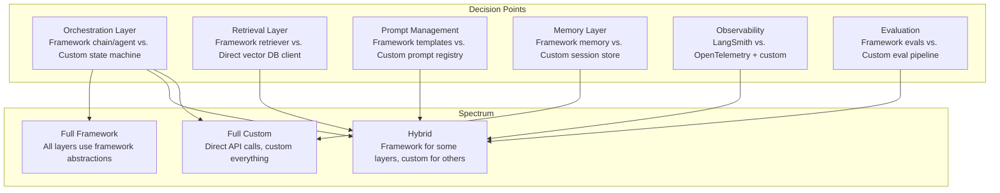
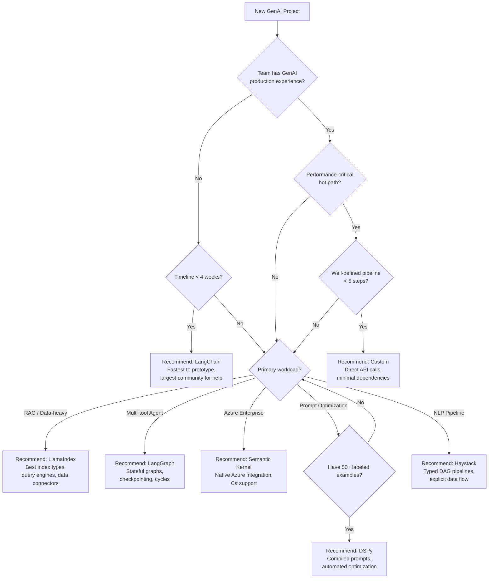
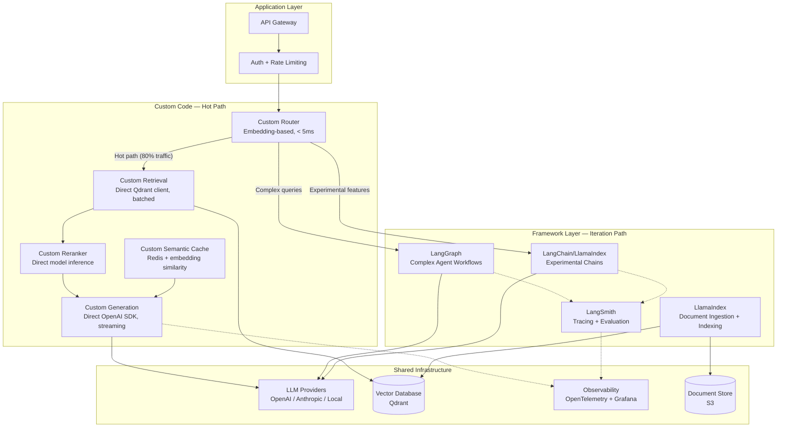
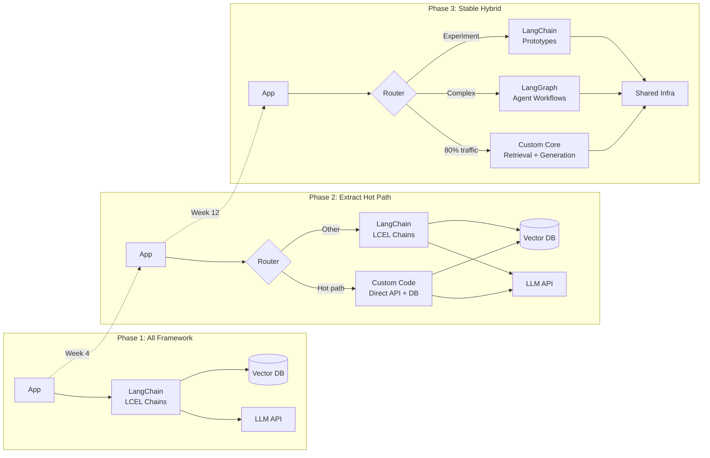

# Build vs Buy --- Framework Selection

## 1. Overview

The build-vs-buy decision in GenAI orchestration is the most consequential architectural choice after model selection. It determines your team's velocity, your system's operational characteristics, and your long-term maintenance burden. Unlike traditional software where "buy" means a commercial product with an SLA, in GenAI orchestration "buy" typically means adopting an open-source framework (LangChain, LlamaIndex, Haystack, DSPy, Semantic Kernel) --- and the tradeoffs are fundamentally different from vendor procurement.

For Principal AI Architects, this decision is rarely binary. The productive framing is not "framework or custom" but rather: which parts of my system benefit from framework abstractions, which parts need custom control, and how do I architect the boundary between them?

**Key numbers that drive the decision:**

- Time to prototype with framework: 2--4 hours for a basic RAG chatbot (LangChain/LlamaIndex)
- Time to prototype custom: 1--2 days for equivalent functionality (direct API calls + vector DB client)
- Time to production-harden a framework prototype: 4--8 weeks (error handling, observability, performance tuning, security)
- Time to production-harden custom code: 6--12 weeks (same concerns, plus building primitives the framework provides)
- Framework abstraction overhead: 5--50ms per chain step; 10--30% higher memory usage from dependency graph
- Dependency footprint: LangChain installs 50+ transitive dependencies; LlamaIndex ~40+; custom approach: 5--10 targeted dependencies
- Version churn risk: LangChain had 3 major breaking changes in 2023--2024 (pre-0.1 -> 0.1 -> 0.2 restructuring); LlamaIndex had 2 (pre-0.10 -> 0.10+ restructuring)
- Migration cost: extracting a mid-complexity LangChain application to custom code: 2--4 engineering weeks; migrating between frameworks: 3--6 weeks

The decision matrix is not static. The correct answer at prototype stage (use a framework) is often different from the correct answer at scale (selectively extract to custom). The most successful production GenAI systems adopt a hybrid approach: framework for rapid iteration and non-critical paths, custom code for performance-critical hot paths and unique differentiating logic.

---

## 2. Where It Fits in GenAI Systems

The build-vs-buy decision affects every layer of the GenAI stack. It is not a single choice but a series of choices at each architectural boundary.



The build-vs-buy decision interacts with these adjacent systems:

- **Orchestration frameworks** (the "buy" options): LangChain, LlamaIndex, Haystack, Semantic Kernel, DSPy each represent a different point on the abstraction spectrum. See [Orchestration Frameworks](./orchestration-frameworks.md).
- **Prompt chaining** (composition patterns): Whether you implement chains via LCEL, Haystack pipelines, or custom async functions depends on this decision. See [Prompt Chaining](./prompt-chaining.md).
- **RAG pipeline** (retrieval integration): Framework retriever abstractions vs. direct vector DB client calls. The retrieval hot path is often the first component extracted from a framework. See [RAG Pipeline](../rag/rag-pipeline.md).
- **Agent architecture** (agent runtime): LangGraph vs. custom agent loops. Agent state management is where framework value is highest (checkpointing, human-in-the-loop, cycle support). See [Agent Architecture](../agents/agent-architecture.md).
- **Model serving** (inference layer): Frameworks wrap LLM API calls. At high throughput, the wrapper overhead matters. See [Model Serving](../llm-architecture/model-serving.md).
- **Evaluation** (quality assurance): Framework-integrated evaluation (LangSmith, deepset Cloud) vs. custom eval pipelines (RAGAS + custom metrics). See [Eval Frameworks](../evaluation/eval-frameworks.md).

---

## 3. Core Concepts

### 3.1 When to Use LangChain

LangChain is the right choice when your system needs broad integration coverage and your team prioritizes development velocity over runtime performance.

**Strong fit scenarios:**

1. **Rapid prototyping and PoC development**: LangChain's 700+ integrations mean you can wire together an LLM provider, vector database, tool, and memory system in hours. For proof-of-concept work where the goal is validating an architectural hypothesis, this speed is unmatched.

2. **Multi-tool agents**: If your agent needs to call web search, code execution, database queries, API endpoints, and retrieval in a single workflow, LangChain's tool ecosystem provides pre-built integrations for all of them. Building equivalent integrations from scratch takes weeks.

3. **Complex stateful workflows (LangGraph)**: LangGraph is the most mature framework for cyclic, stateful agent graphs. If your system requires checkpointing (pause/resume), human-in-the-loop approval gates, multi-agent collaboration, or time-travel debugging, LangGraph provides these out of the box. Building equivalent infrastructure custom would take months.

4. **Teams new to GenAI**: LangChain's extensive documentation, tutorials, and community resources lower the learning curve. The framework provides guardrails (retry logic, structured output, tracing) that prevent common mistakes.

5. **RAG applications with standard patterns**: If your RAG pipeline follows the retrieve-rerank-generate pattern without exotic customizations, LangChain's LCEL composition makes it straightforward.

**Weak fit scenarios:**

- Latency-critical applications where 5--20ms per chain step matters (high-frequency trading, real-time gaming).
- Small, focused applications where the full dependency graph is overhead (a single LLM call with parsing).
- Teams that need deep control over every API call (custom retry strategies, custom caching, custom streaming).
- Applications where dependency stability is paramount (regulated environments with strict change management).

**LangChain-specific risks:**

- **Version churn**: LangChain's API has undergone significant restructuring. Code written against `langchain` 0.0.x required substantial rewriting for 0.1.x, and again for the `langchain-core` / `langchain-community` / `langchain-openai` split. Pin versions aggressively and allocate time for upgrades.
- **Import complexity**: The package split (core, community, partner packages) means imports are non-obvious. `from langchain_openai import ChatOpenAI` vs `from langchain_community.chat_models import ChatOpenAI` --- getting the import wrong produces subtle bugs.
- **Abstraction depth**: A simple `chain.invoke()` call can traverse 10+ layers of Runnable dispatch. When debugging, you're reading LangChain internals, not your application logic.

### 3.2 When to Use LlamaIndex

LlamaIndex is the right choice when data ingestion, indexing, and sophisticated retrieval are the primary complexity in your system.

**Strong fit scenarios:**

1. **Data-heavy RAG applications**: If your system ingests documents from 5+ sources (PDFs, databases, SaaS tools), needs multiple index types (vector + keyword + knowledge graph), and requires complex query routing, LlamaIndex's data-first abstractions are purpose-built for this.

2. **Complex retrieval strategies**: SubQuestionQueryEngine (decompose complex queries into sub-queries routed to different indexes), RouterQueryEngine (classify and route to specialized query engines), and PropertyGraphIndex (hybrid graph + vector queries) are capabilities that would take weeks to build custom.

3. **Enterprise search**: Multi-source enterprise search where each data source has its own connector, indexing strategy, and permission model. LlamaHub provides 300+ connectors; building even 10 custom connectors is a significant investment.

4. **Document understanding**: LlamaParse handles complex PDF layouts (tables, multi-column, scanned documents) at a quality level competitive with AWS Textract. If your application processes diverse document types, this alone may justify adopting LlamaIndex.

5. **Structured data + unstructured data**: If your RAG system needs to query both a vector database (unstructured documents) and a SQL database (structured data) and synthesize answers from both, LlamaIndex's multi-source query engines handle this natively.

**Weak fit scenarios:**

- Agent-heavy applications where the primary complexity is tool orchestration, not retrieval. LangGraph is more mature for this.
- Simple, single-source RAG where a direct vector DB client + LLM call suffices.
- Applications where you need fine-grained control over the retrieval hot path (custom scoring, custom reranking logic).

**LlamaIndex-specific risks:**

- **Opinionated abstractions**: LlamaIndex's `Node`, `Index`, `QueryEngine`, and `ResponseSynthesizer` abstractions are powerful when your use case fits but limiting when it doesn't. Customizing beyond the provided abstractions requires diving into internal APIs.
- **Agent maturity**: `llama-agents` is less mature than LangGraph. For complex multi-agent workflows, you may hit limitations.
- **Abstraction overhead for simple cases**: A VectorStoreIndex query involves multiple abstraction layers (retriever -> postprocessor -> response synthesizer). For a simple "embed, retrieve, generate" pipeline, this adds complexity without value.

### 3.3 When to Use DSPy

DSPy is the right choice when you have evaluation data and want to systematically optimize your prompts rather than hand-tuning them.

**Strong fit scenarios:**

1. **Prompt optimization with training data**: If you have 50--1000 labeled input/output examples, DSPy's optimizers (BootstrapFewShot, MIPRO) will almost certainly outperform hand-written prompts by 10--40%. The ROI is highest for classification, extraction, and Q&A tasks with clear metrics.

2. **Research and experimentation**: DSPy's modular, programmatic approach makes it natural to experiment with different model combinations, chain architectures, and optimization strategies. Each experiment is a code change, not a prompt rewrite.

3. **Cross-model portability**: DSPy programs optimized on GPT-4o can be re-optimized for Claude or Llama with a single optimizer call. The program structure stays the same; only the compiled prompts change. This is valuable for teams evaluating multiple models or planning migrations.

4. **Automated prompt tuning at scale**: If you have hundreds of distinct prompt templates across your system, manually optimizing each one is infeasible. DSPy's compilation approach scales to any number of prompts.

5. **Teams with ML backgrounds**: DSPy's train/optimize/evaluate paradigm is familiar to ML engineers. If your team is more comfortable with optimization loops than with prompt crafting, DSPy aligns with their mental model.

**Weak fit scenarios:**

- Zero-data prototyping where you have no labeled examples yet. DSPy needs training data to optimize.
- Applications where prompt interpretability is critical (regulated environments where you must explain why the prompt says what it says).
- Teams without ML experience who may struggle with the optimization paradigm.
- Production systems that need rich orchestration features (streaming, checkpointing, human-in-the-loop) --- DSPy focuses on prompt optimization, not orchestration.

**DSPy-specific risks:**

- **Opaque prompts**: Compiled prompts are machine-generated. They work but are hard to explain, debug, or manually modify. If the optimized prompt produces an unexpected output, diagnosing why is harder than with a hand-written prompt.
- **Training data dependency**: The quality of optimization is bounded by the quality and representativeness of your training data. Biased or insufficient training data produces suboptimal prompts.
- **Integration gap**: DSPy excels at prompt optimization but has limited orchestration features. Production systems typically use DSPy for optimization, then export prompts to LangChain/LlamaIndex for serving.

### 3.4 When to Go Custom

Custom implementation is the right choice when you need maximum control, minimal dependencies, and your use case is well-defined.

**Strong fit scenarios:**

1. **Performance-critical applications**: When every millisecond matters, framework overhead (5--50ms per step, additional memory allocation, reflection-based dispatch) is unacceptable. Direct API calls with minimal wrapper code minimize latency.

2. **Simple, well-defined pipelines**: If your system makes 1--3 LLM calls with straightforward logic (classify, generate, validate), a framework adds complexity without proportional benefit. 50 lines of custom async Python replaces 200 lines of framework configuration.

3. **Unique requirements that fight framework abstractions**: Custom reranking algorithms, proprietary retrieval strategies, unusual state management patterns, or domain-specific post-processing that doesn't fit framework component interfaces.

4. **Minimal dependency footprint**: Regulated environments, air-gapped deployments, or embedded systems where installing 50+ transitive dependencies is not acceptable.

5. **Long-lived production systems**: If the system will run for 3+ years, framework version churn creates ongoing maintenance burden. Custom code with stable dependencies (openai SDK, httpx, pydantic) changes only when you choose to change it.

6. **Competitive differentiation in the orchestration layer**: If your orchestration logic IS your product's differentiator (e.g., a novel agent architecture or a proprietary chaining strategy), building it custom protects your IP and avoids exposing your architecture through framework abstractions.

**Custom implementation costs:**

- **Initial development**: 2--5x longer than framework-based development for equivalent functionality.
- **Ongoing maintenance**: You own every line. Bug fixes, security patches, and LLM API changes are your responsibility.
- **Missing primitives**: Streaming, batching, retry logic, output parsing, tracing --- all these need to be built or imported individually.
- **Recruitment**: Engineers experienced with LangChain/LlamaIndex are easier to find than engineers who can design custom orchestration from scratch.

### 3.5 Framework Anti-Patterns

These patterns emerge when frameworks are misused. Recognizing them early prevents costly refactoring.

**Anti-Pattern 1: Abstraction Addiction**

Symptom: Every LLM call is wrapped in 4+ framework layers. A simple `openai.chat.completions.create()` becomes a `PromptTemplate | ChatOpenAI | StrOutputParser | RunnablePassthrough.assign(metadata=extract_metadata) | ValidationChain`.

Impact: Stack traces are 100+ frames deep. Debugging requires understanding LCEL's internal dispatch, callback system, and runnable protocol. A 200ms LLM call takes 250ms due to framework overhead. New team members spend weeks understanding the framework before contributing.

Fix: Use the framework where it adds value (composition, streaming, retries). Call the LLM API directly for simple, standalone calls. The threshold: if a chain has fewer than 3 steps and no branching, it's probably simpler as direct API calls.

**Anti-Pattern 2: Debugging Black Holes**

Symptom: When the system produces wrong output, the team cannot determine which chain step caused the error without extensive logging. Framework abstractions hide intermediate values.

Impact: Mean time to debug increases from minutes to hours. Production incidents last longer. Team confidence in the system decreases.

Fix: Enable tracing (LangSmith, Arize Phoenix, or custom OpenTelemetry spans) for every chain step. Log intermediate inputs/outputs at chain boundaries. Build a debug mode that prints all intermediate state.

**Anti-Pattern 3: Dependency Bloat**

Symptom: `pip install langchain` pulls in 50+ packages. Your Docker image grows from 200MB to 1.2GB. Build times increase. Security scanning flags vulnerabilities in transitive dependencies you don't use.

Impact: Slower CI/CD. Larger attack surface. Dependency conflicts with other packages in your stack.

Fix: Install only the specific sub-packages you need (`langchain-core`, `langchain-openai`, not `langchain[all]`). Audit transitive dependencies. Consider vendoring the specific framework code you use rather than importing the entire framework.

**Anti-Pattern 4: Version Churn Treadmill**

Symptom: Every framework upgrade requires code changes. You're perpetually migrating from one framework version to the next. The team spends 20% of engineering time on framework upgrades rather than product features.

Impact: Reduced feature velocity. Regression risk from migration. Team frustration.

Fix: Pin framework versions strictly. Upgrade only when a new version provides features you need (not on every release). Maintain an abstraction layer between your application code and framework-specific code so upgrades are isolated to the adapter layer.

**Anti-Pattern 5: Framework Cargo Culting**

Symptom: Using framework features because they exist, not because they solve a problem. Adding memory to a stateless pipeline. Using an agent when a simple chain suffices. Implementing a planner when the routing logic is a 3-line if/else.

Impact: Unnecessary complexity. Higher latency. More failure modes. Harder to understand and maintain.

Fix: Start with the simplest implementation that works. Add framework features only when you can articulate the specific problem they solve. "LangGraph supports it" is not a reason; "We need checkpointing for pause/resume in a human-in-the-loop workflow" is.

### 3.6 Migration Strategies

**Framework to Custom:**

1. **Identify the hot path**: Profile your system. Find the chain or pipeline that handles 80% of traffic. This is your extraction target.
2. **Define the interface**: Document the inputs, outputs, and side effects of the hot path. This becomes the contract for the custom implementation.
3. **Implement behind a feature flag**: Build the custom implementation alongside the framework version. Route a percentage of traffic to custom, compare quality and performance.
4. **Gradual migration**: Increase custom traffic from 1% -> 10% -> 50% -> 100% as confidence grows. Keep the framework version as a fallback.
5. **Retain the framework**: Don't rip out the framework entirely. Keep it for low-traffic features, experimentation, and prototyping.

**Custom to Framework:**

1. **Identify the pain points**: What are you spending the most time maintaining? Streaming logic? Retry handling? Tracing? These are candidates for framework adoption.
2. **Adopt incrementally**: Don't rewrite the entire system. Introduce the framework for one component (e.g., replace custom retry logic with LCEL's `.with_retry()`; replace custom tracing with LangSmith).
3. **Maintain the interface**: Keep your application's public API unchanged. Framework adoption is an internal implementation detail.

**Framework to Framework:**

1. **Map abstractions**: Document how each framework's abstractions map to each other (LangChain Runnable = Haystack Component; LlamaIndex QueryEngine = LangChain Retriever + Generator chain).
2. **Migrate one pipeline at a time**: Don't attempt a big-bang migration. Migrate the simplest pipeline first, validate, then proceed to more complex ones.
3. **Expect a 3--6 week timeline**: For a mid-complexity system (5--10 chains/pipelines), expect a full quarter of part-time effort.

### 3.7 Hybrid Approach: The Production-Grade Pattern

The most successful production GenAI systems use a hybrid approach:

```
                 Framework Layer               Custom Layer
                 ──────────────               ─────────────
Prototyping:     [████████████████████]       [                  ]
Early Production: [████████████████]          [████              ]
Scale:           [████████]                   [████████████      ]
Mature:          [████]                       [████████████████  ]
```

**Phase 1: All Framework (Week 1--4)**

Use LangChain/LlamaIndex for everything. Validate the architecture. Ship a working prototype. Don't optimize.

**Phase 2: Identify Extraction Targets (Week 4--8)**

Profile the system. Identify:
- Steps with unacceptable latency (framework overhead is significant).
- Steps with unique logic that fights framework abstractions.
- Steps that are stable and unlikely to change (good candidates for custom code).

**Phase 3: Selective Extraction (Week 8--16)**

Extract the identified components to custom code. Retain the framework for:
- Experimental features still being iterated.
- Low-traffic paths where framework overhead doesn't matter.
- Tracing and evaluation (LangSmith or equivalent).
- New prototypes and PoCs.

**Phase 4: Stabilize the Hybrid (Week 16+)**

The steady state is a hybrid: custom code for the performance-critical core, framework for the iteration-heavy periphery. The boundary is defined by a clean adapter interface.

---

## 4. Architecture

### 4.1 Decision Framework Architecture



### 4.2 Hybrid Architecture (Production Pattern)



### 4.3 Migration Path Architecture



---

## 5. Design Patterns

### Pattern 1: Framework-First, Extract Later
- **When**: Greenfield project, unclear requirements, need to validate architecture fast.
- **How**: Build everything in LangChain/LlamaIndex. Ship to production. Instrument with tracing. After 4--8 weeks of production data, identify performance bottlenecks and extract them to custom code.
- **Benefit**: Fastest time to production. Extraction decisions are data-driven, not speculative.
- **Risk**: Team may become attached to framework abstractions and resist extraction ("it works, why change it?"). Set extraction criteria upfront (e.g., "any chain step with P99 > 500ms gets extracted").

### Pattern 2: Custom Core, Framework Periphery
- **When**: Team has GenAI production experience. Performance requirements are known upfront.
- **How**: Build the core pipeline (retrieval, generation, streaming) with custom code from the start. Use LangChain/LlamaIndex for: document ingestion, experimental features, evaluation, and tracing.
- **Benefit**: No extraction needed later. Core performance is optimal from day one.
- **Risk**: Slower initial development (2--3 weeks for core pipeline vs. 2--3 days with framework).

### Pattern 3: DSPy for Optimization, Framework for Serving
- **When**: You have evaluation data and want optimized prompts, but need rich serving infrastructure.
- **How**: Use DSPy to discover optimal prompt configurations offline. Export compiled prompts. Embed them in LangChain/LlamaIndex chains or custom code for production serving.
- **Benefit**: Combines DSPy's prompt optimization with production-grade serving features (streaming, tracing, fallbacks).
- **Re-optimization cadence**: Monthly or when evaluation metrics drift below threshold.

### Pattern 4: Adapter Layer Pattern
- **When**: You want framework benefits but need protection against version churn and potential migration.
- **How**: Define your own interfaces (e.g., `Retriever`, `Generator`, `Chain`) that your application code uses. Implement these interfaces using framework primitives. When the framework changes or you want to switch, only the adapter layer changes.
- **Benefit**: Framework benefits without tight coupling. Migration is a swappable adapter, not a rewrite.
- **Cost**: Additional abstraction layer. Must be disciplined about not leaking framework types past the adapter boundary.

### Pattern 5: Multi-Framework Specialization
- **When**: Different parts of your system have fundamentally different requirements.
- **How**: Use LlamaIndex for document ingestion and indexing (its strongest capability). Use LangGraph for agent orchestration (its strongest capability). Use custom code for the retrieval-generation hot path. Shared infrastructure (vector DB, LLM providers, observability) is accessed by all three.
- **Benefit**: Best-of-breed for each concern.
- **Risk**: Three frameworks to understand, maintain, and upgrade. Requires a team with broad expertise.

---

## 6. Implementation Approaches

### 6.1 Evaluation Criteria Checklist

Use this checklist when evaluating frameworks for a specific project:

**Technical Fit:**

| Criterion | Weight | LangChain | LlamaIndex | DSPy | Semantic Kernel | Haystack | Custom |
|-----------|--------|-----------|------------|------|-----------------|----------|--------|
| RAG pipeline support | High | 4/5 | 5/5 | 3/5 | 3/5 | 4/5 | 5/5 |
| Agent/agentic workflows | High | 5/5 (LangGraph) | 3/5 | 3/5 | 4/5 | 2/5 | 5/5 |
| Streaming support | High | 5/5 | 4/5 | 2/5 | 4/5 | 4/5 | 5/5 |
| Structured output | Medium | 4/5 | 4/5 | 4/5 | 3/5 | 3/5 | 5/5 |
| Multi-tenancy | Medium | 3/5 | 3/5 | 2/5 | 4/5 | 3/5 | 5/5 |
| Async/concurrent | High | 4/5 | 4/5 | 3/5 | 4/5 | 4/5 | 5/5 |
| Latency overhead | High | 2/5 | 3/5 | 4/5 | 3/5 | 4/5 | 5/5 |
| Memory footprint | Medium | 2/5 | 3/5 | 4/5 | 3/5 | 4/5 | 5/5 |

**Organizational Fit:**

| Criterion | Weight | LangChain | LlamaIndex | DSPy | Semantic Kernel | Haystack | Custom |
|-----------|--------|-----------|------------|------|-----------------|----------|--------|
| Learning curve | High | 3/5 | 3/5 | 2/5 | 3/5 | 4/5 | 2/5 |
| Hiring/team ramp-up | Medium | 5/5 | 4/5 | 2/5 | 3/5 | 3/5 | 3/5 |
| Community/docs | Medium | 5/5 | 4/5 | 3/5 | 4/5 | 3/5 | N/A |
| Enterprise support | High (enterprise) | 4/5 | 4/5 | 1/5 | 5/5 | 4/5 | N/A |
| Version stability | High | 3/5 | 4/5 | 2/5 | 4/5 | 4/5 | 5/5 |
| Cloud ecosystem fit | Varies | Agnostic | Agnostic | Agnostic | Azure | Agnostic | Agnostic |

### 6.2 Cost Comparison Model

Framework costs are not just license fees (most are free/open-source). The real costs are:

**Development costs:**

| Phase | Framework | Custom | Delta |
|-------|-----------|--------|-------|
| Initial prototype | 1--2 engineer-weeks | 3--5 engineer-weeks | Framework saves 2--3 weeks |
| Production hardening | 4--8 engineer-weeks | 6--12 engineer-weeks | Framework saves 2--4 weeks |
| First year maintenance | 4--8 engineer-weeks (version upgrades, bug workarounds) | 2--4 engineer-weeks (bug fixes, API changes) | Custom saves 2--4 weeks |
| Total year 1 | 9--18 engineer-weeks | 11--21 engineer-weeks | Roughly equivalent |
| Total year 2 | 4--8 engineer-weeks | 2--4 engineer-weeks | Custom cheaper ongoing |

**Runtime costs:**

| Component | Framework | Custom | Impact |
|-----------|-----------|--------|--------|
| Latency overhead | 5--50ms per chain step | 0--5ms per step | Matters at P99; negligible at P50 |
| Memory overhead | +100--300MB per process (dependency graph) | +10--50MB per process | Matters in containerized environments |
| Cold start | +2--5 seconds (import time) | +0.5--1 second | Matters for serverless/Lambda |
| Dependency conflicts | Common (50+ transitive deps) | Rare (5--10 targeted deps) | Matters in large monorepos |

### 6.3 Decision Template for Teams

Use this template to document your build-vs-buy decision:

```markdown
## Framework Decision: [Project Name]

### Context
- Project description: [...]
- Primary workload: [RAG / Agent / Pipeline / ...]
- Performance requirements: [Latency P50/P99, throughput]
- Team size and experience: [...]
- Timeline: [Prototype: X weeks, Production: Y weeks]

### Decision
- Framework(s) chosen: [...]
- Custom components: [...]
- Rationale: [...]

### Evaluation
- Frameworks evaluated: [...]
- Scoring: [Use checklist from 6.1]
- Risks identified: [...]
- Migration plan: [...]

### Review Date
- Re-evaluate decision at: [Date, typically 3 months post-launch]
```

### 6.4 Building the Adapter Layer

The adapter layer is the single most important architectural pattern for managing framework risk:

```python
# Define your interfaces (framework-agnostic)
from abc import ABC, abstractmethod
from dataclasses import dataclass

@dataclass
class RetrievalResult:
    text: str
    score: float
    metadata: dict

class Retriever(ABC):
    @abstractmethod
    async def retrieve(self, query: str, top_k: int = 5) -> list[RetrievalResult]:
        ...

class Generator(ABC):
    @abstractmethod
    async def generate(self, prompt: str, context: list[str]) -> str:
        ...

# Framework implementation (swappable)
class LangChainRetriever(Retriever):
    def __init__(self, vectorstore):
        self._retriever = vectorstore.as_retriever(search_kwargs={"k": 5})

    async def retrieve(self, query: str, top_k: int = 5) -> list[RetrievalResult]:
        docs = await self._retriever.ainvoke(query)
        return [RetrievalResult(text=d.page_content, score=d.metadata.get("score", 0),
                                metadata=d.metadata) for d in docs]

# Custom implementation (swappable)
class DirectQdrantRetriever(Retriever):
    def __init__(self, client, collection):
        self._client = client
        self._collection = collection

    async def retrieve(self, query: str, top_k: int = 5) -> list[RetrievalResult]:
        embedding = await embed(query)
        results = await self._client.search(
            collection_name=self._collection, query_vector=embedding, limit=top_k
        )
        return [RetrievalResult(text=r.payload["text"], score=r.score,
                                metadata=r.payload) for r in results]

# Application code uses the interface, not the implementation
class RAGPipeline:
    def __init__(self, retriever: Retriever, generator: Generator):
        self._retriever = retriever
        self._generator = generator

    async def answer(self, query: str) -> str:
        results = await self._retriever.retrieve(query)
        context = [r.text for r in results]
        return await self._generator.generate(query, context)
```

Swapping from LangChain to custom is a one-line change at the dependency injection site:

```python
# Before (LangChain)
pipeline = RAGPipeline(
    retriever=LangChainRetriever(vectorstore),
    generator=LangChainGenerator(model),
)

# After (Custom)
pipeline = RAGPipeline(
    retriever=DirectQdrantRetriever(qdrant_client, "docs"),
    generator=DirectOpenAIGenerator(openai_client),
)
```

---

## 7. Tradeoffs

### Strategic Tradeoffs

| Decision | Option A | Option B | Key Tradeoff |
|----------|----------|----------|--------------|
| Framework for everything | Uniform codebase, single learning curve | Framework overhead everywhere, locked to one vendor | Consistency vs. performance |
| Custom for everything | Maximum control, zero dependency risk | Slow initial development, rebuild every primitive | Control vs. velocity |
| Hybrid approach | Best-of-breed per component, optimized hot path | Multiple paradigms, higher team knowledge requirements | Optimization vs. complexity |
| Single framework | Simpler onboarding, consistent patterns | May not be best-of-breed for all workloads | Simplicity vs. capability |
| Multi-framework | Best tool for each job | Higher dependency surface, more to learn | Capability vs. maintainability |

### Temporal Tradeoffs

| Time Horizon | Framework Advantage | Custom Advantage | Net Recommendation |
|-------------|-------------------|------------------|-------------------|
| 0--3 months | Development speed, pre-built components, community resources | N/A | Framework (unless team is highly experienced) |
| 3--12 months | Ecosystem keeps evolving, new integrations appear | Performance tuning, stability, reduced maintenance | Hybrid (extract hot path) |
| 1--3 years | Community support, potential new features | No version churn, full control, lower TCO | Custom core, framework periphery |
| 3+ years | Framework may be abandoned or fundamentally restructured | Self-contained, stable, predictable | Mostly custom with adapter layer |

### Risk Tradeoffs

| Risk | Framework Exposure | Custom Exposure | Mitigation |
|------|-------------------|-----------------|------------|
| **Framework abandonment** | High --- dependent on maintainer/company | None | Adapter layer; vendor-agnostic interfaces; evaluate framework health metrics (commit frequency, funding, corporate backing) |
| **Breaking changes** | High --- 1--3 breaking changes per year for active frameworks | Low --- you control all changes | Pin versions; adapter layer; budget for quarterly framework upgrades |
| **Security vulnerability** | Medium --- transitive dependencies expand attack surface | Low --- fewer dependencies | Audit transitive deps; use `pip-audit`; minimal installs |
| **Talent availability** | Low risk --- many engineers know LangChain | Higher risk --- custom code requires onboarding | Document architectural decisions; maintain runbooks; pair program during onboarding |
| **Performance ceiling** | High --- framework overhead is a hard floor | None --- you can optimize everything | Profile first; extract only the bottleneck steps |

---

## 8. Failure Modes

### 8.1 Decision Failures

| Failure Mode | Symptom | Root Cause | Mitigation |
|-------------|---------|------------|------------|
| **Premature framework adoption** | Team spends weeks learning framework for a 50-line pipeline | Assumed complexity that didn't materialize; "everyone uses LangChain" | Evaluate whether a simple Python script with the OpenAI SDK suffices; adopt framework only when concrete need for composition, streaming, or tracing |
| **Premature framework rejection** | Team spends 8 weeks building custom streaming, retry, tracing, and composition infrastructure | "Not invented here" syndrome; underestimated infrastructure requirements | Audit the full list of framework features you'll need; estimate custom development cost honestly |
| **Framework lock-in discovered too late** | Migration required but framework types leak through 200+ files | No adapter layer; framework types used in application interfaces | Introduce adapter layer from the start; treat framework as an implementation detail behind stable interfaces |
| **Analysis paralysis** | Team spends 4 weeks evaluating frameworks instead of building | Too many options; no clear evaluation criteria | Set a 1-week evaluation timebox; use the decision template from Section 6.3; make a reversible decision and move forward |

### 8.2 Migration Failures

| Failure Mode | Symptom | Root Cause | Mitigation |
|-------------|---------|------------|------------|
| **Big-bang migration** | 6-week migration project with no working system in between | Attempted to rewrite everything at once | Migrate one pipeline at a time; maintain dual-running systems; feature-flag the migration |
| **Incomplete extraction** | Custom code exists but the framework is still imported and executing | Extraction left residual framework code in the hot path | Trace execution paths; verify framework code is not called in production hot paths; remove unused framework imports |
| **Quality regression during migration** | Output quality drops after switching from framework to custom | Custom implementation subtly differs from framework behavior (prompt formatting, retry timing, output parsing) | Run both implementations side-by-side on production traffic; compare outputs; don't cut over until quality parity is confirmed |
| **Knowledge loss** | Original framework-based implementation worked but nobody remembers why; custom rewrite introduces bugs the framework had already solved | Undocumented framework behaviors that the team relied on unknowingly | Document all framework behaviors you depend on before starting extraction; write tests that verify those behaviors |

### 8.3 Operational Failures

| Failure Mode | Symptom | Root Cause | Mitigation |
|-------------|---------|------------|------------|
| **Dependency conflict** | Application crashes after unrelated package upgrade | Framework's transitive dependency conflicts with another package | Use virtual environments; pin all dependencies including transitive; test dependency resolution in CI |
| **Framework bug in production** | Intermittent errors traced to a framework bug | Using a framework version with a known bug; no monitoring of framework issue tracker | Subscribe to framework release notes; maintain a list of known issues; have a rollback plan |
| **Commercial platform dependency** | LangSmith outage causes loss of all tracing | All observability depends on a single commercial platform | Send traces to both commercial and self-hosted backends; ensure core functionality works without tracing |
| **Upgrade deadline** | Framework drops support for your LLM provider version | Framework updates its provider integration; your pinned version falls behind | Plan for at least quarterly framework version evaluations; maintain provider access through adapter layer that can bypass framework |

---

## 9. Optimization Techniques

### 9.1 Framework Overhead Reduction

- **Selective imports**: Import only the sub-packages you use. `from langchain_openai import ChatOpenAI` not `from langchain import *`. Reduces import time from 3--5 seconds to <1 second.
- **Lazy initialization**: Initialize framework objects (chains, retrievers, agents) at startup, not per-request. Object creation has measurable overhead (10--50ms).
- **Bypass framework for simple calls**: If a chain step is a single LLM call with no composition, streaming, or retry needs, call the LLM SDK directly. Save 5--20ms framework overhead.
- **Profile framework paths**: Use `cProfile` or `py-spy` to identify framework code consuming CPU time in your hot path. Common culprits: LCEL's `_call_with_config()` dispatch, callback manager initialization, pydantic validation.

### 9.2 Migration Cost Reduction

- **Adapter layer from day one**: Even if you start with a framework, define your own interfaces. The upfront cost (1--2 days) saves weeks during extraction.
- **Test at the interface level**: Write tests against your adapter interfaces, not framework internals. These tests remain valid across framework changes and custom extraction.
- **Extract incrementally**: Don't plan a "migration project." Extract one component at a time, as needed, driven by performance data. Most systems only need to extract 2--3 components.
- **Maintain framework for experimentation**: Even after extracting production paths, keep the framework installed for prototyping new features. The experimentation velocity is worth the dependency.

### 9.3 Evaluation of Framework Fitness

- **Benchmark on YOUR workload**: Generic benchmarks (e.g., "LangChain vs LlamaIndex latency") are misleading. Benchmark on your actual chain with your data, your models, and your traffic patterns.
- **Test at production scale**: Frameworks that work at 10 QPS may struggle at 1000 QPS. Load-test before committing. Pay attention to memory usage under sustained load.
- **Evaluate debugging experience**: Build a deliberately buggy chain (wrong output schema, failed retrieval, timeout). Measure how long it takes to diagnose and fix using each framework's debugging tools.
- **Evaluate team velocity**: Have two team members build the same feature --- one with the framework, one custom. Measure not just time-to-complete but also quality of error handling, test coverage, and documentation.

### 9.4 Long-Term Maintainability

- **Framework upgrade budget**: Allocate 1 engineer-week per quarter for framework upgrades and testing. This prevents version drift from becoming a crisis.
- **Deprecation monitoring**: Track which framework APIs you use that are marked as deprecated. Plan migration before they are removed.
- **Contribution**: If you find and fix a framework bug, contribute the fix upstream. This reduces your maintenance burden and builds goodwill with the community.
- **Escape hatch documentation**: Document how each framework component would be replaced with custom code. This "migration playbook" makes extraction fast when the time comes.

---

## 10. Real-World Examples

### Stripe (AI-powered support and documentation)
- **Decision**: Custom orchestration with minimal framework dependencies. Stripe prioritizes control, debuggability, and latency in their financial services context.
- **Architecture**: Custom Python pipeline calling OpenAI APIs directly. Retrieval via a custom embedding service over their documentation corpus. Structured output validation using Pydantic. Observability via OpenTelemetry.
- **Rationale**: Financial services regulatory requirements demand full auditability of every processing step. Framework abstractions make audit trails harder to construct. Stripe's engineering team has the depth to build and maintain custom infrastructure.

### Notion AI
- **Decision**: Hybrid --- LlamaIndex for indexing and retrieval primitives, custom code for the application layer and agent logic.
- **Architecture**: LlamaIndex VectorStoreIndex for per-workspace indexing. Custom query routing and response synthesis. Custom conversation management.
- **Rationale**: LlamaIndex's index abstractions match Notion's data model (blocks, pages, databases). The agent and application layer needed custom logic for Notion's unique UX requirements (inline suggestions, Q&A, writing assistance).

### Shopify (Sidekick / Magic)
- **Decision**: Started with LangChain for prototyping, progressively extracted to custom code for production.
- **Architecture**: Custom orchestration calling Anthropic and OpenAI APIs. RAG over Shopify documentation and merchant data. LangSmith retained for evaluation and debugging during development.
- **Rationale**: Shopify's AI assistant handles millions of merchant queries. At that scale, framework overhead per request is measurable. The extraction was driven by latency requirements (sub-second P99 for merchant-facing features).
- **Migration approach**: Gradual extraction over 3 months. Hot path (classification -> retrieval -> generation) extracted first. Experimental features (new agent capabilities) still prototyped in LangChain.

### Microsoft (Copilot ecosystem)
- **Decision**: Semantic Kernel as the primary orchestration framework across the Copilot ecosystem (Microsoft 365 Copilot, GitHub Copilot, Bing Chat).
- **Architecture**: Semantic Kernel with Azure OpenAI. Plugin architecture maps to Microsoft Graph API (email, calendar, files), GitHub API, and Bing Search. Azure AI Search for RAG. Azure Cosmos DB for memory.
- **Rationale**: Deep Azure integration eliminates infrastructure setup. C# support is critical for the .NET-based Microsoft 365 backend. First-party Microsoft support ensures long-term investment.

### Weights & Biases (Weave)
- **Decision**: Custom evaluation and orchestration framework (Weave) built from the ground up.
- **Architecture**: Weave provides tracing, evaluation, and composition primitives specifically designed for ML/AI workflows. Not a general-purpose orchestration framework --- purpose-built for their evaluation-first approach.
- **Rationale**: Existing frameworks didn't prioritize the evaluation and experiment-tracking workflow that W&B's customers need. Building custom allowed them to make evaluation a first-class concern rather than an afterthought.

---

## 11. Related Topics

- **[Orchestration Frameworks](./orchestration-frameworks.md)**: Deep technical coverage of each framework (LangChain, LlamaIndex, Haystack, Semantic Kernel, DSPy) that this document compares.
- **[Prompt Chaining](./prompt-chaining.md)**: The composition patterns that frameworks implement and that custom code must replicate.
- **[RAG Pipeline](../rag/rag-pipeline.md)**: RAG-specific build-vs-buy considerations, especially for retrieval and indexing components.
- **[Agent Architecture](../agents/agent-architecture.md)**: Agent-specific framework considerations, especially LangGraph vs. custom agent loops.
- **[Model Serving](../llm-architecture/model-serving.md)**: The inference layer that all frameworks and custom implementations ultimately call.
- **[Eval Frameworks](../evaluation/eval-frameworks.md)**: Evaluation tooling decisions (LangSmith vs. open-source vs. custom) that parallel the orchestration build-vs-buy decision.
- **[GenAI Design Patterns](../patterns/genai-design-patterns.md)**: Broader architectural patterns that inform framework selection.

---

## 12. Source Traceability

| Concept | Primary Source |
|---------|---------------|
| LangChain ecosystem | LangChain documentation, langchain-ai GitHub organization (2022--present) |
| LangGraph | LangChain Inc., langchain-ai/langgraph GitHub (2024--present) |
| LangSmith | LangChain Inc., smith.langchain.com (2023--present) |
| LlamaIndex ecosystem | LlamaIndex documentation, run-llama/llama_index GitHub (2022--present) |
| LlamaParse | LlamaIndex Inc., cloud.llamaindex.ai (2024--present) |
| Semantic Kernel | Microsoft, microsoft/semantic-kernel GitHub (2023--present) |
| Haystack 2.0 | deepset, deepset-ai/haystack GitHub (2019--present, 2.0 rewrite 2024) |
| DSPy | Khattab et al., "DSPy: Compiling Declarative Language Model Calls into Self-Improving Pipelines," ICLR 2024 |
| MIPRO optimizer | Opsahl-Ong et al., "Optimizing Instructions and Demonstrations for Multi-Stage Language Model Programs," 2024 |
| Framework comparison methodology | Author analysis based on framework documentation, GitHub metrics, PyPI download data, and production deployment reports (2024--2026) |
| Adapter pattern | Gamma et al., "Design Patterns: Elements of Reusable Object-Oriented Software," 1994 (applied to GenAI context) |
| Migration strategies | Industry patterns documented across Shopify Engineering Blog, Stripe Engineering Blog, Notion Engineering Blog (2024--2025) |
