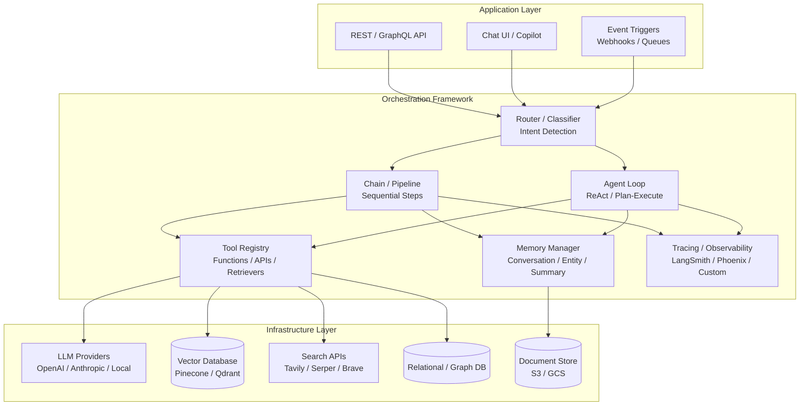
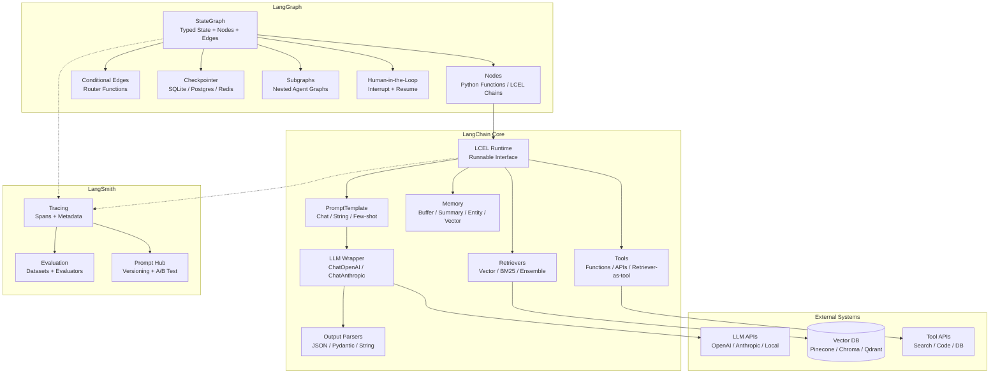
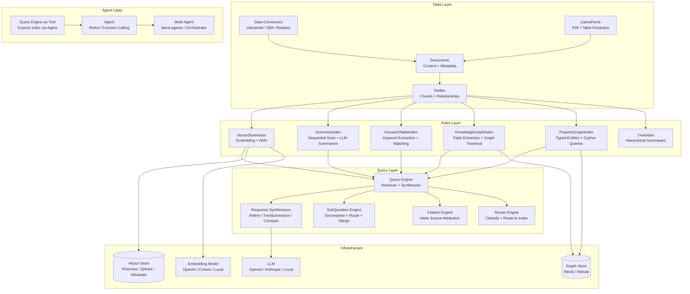
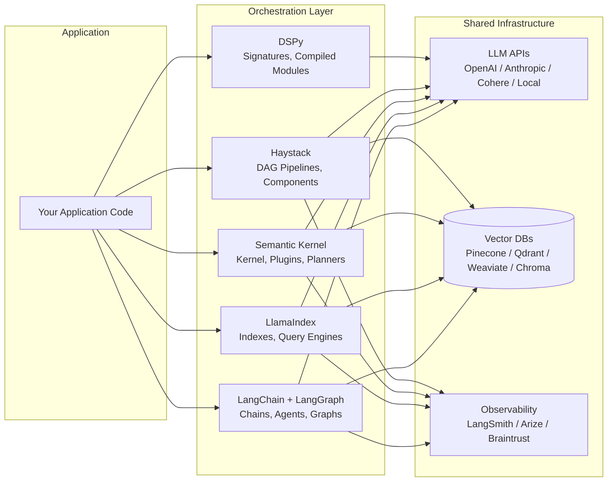

# Orchestration Frameworks

## 1. Overview

Orchestration frameworks are the middleware layer that connects application logic to LLM inference, retrieval systems, tool execution, and memory management. They provide abstractions for building chains, agents, and pipelines --- transforming raw LLM API calls into structured, composable workflows. For Principal AI Architects, the choice of orchestration framework is one of the highest-leverage decisions in a GenAI system: it determines your team's velocity in the first three months and your maintenance burden for the next three years.

The landscape has consolidated around five major frameworks, each with a distinct architectural philosophy:

- **LangChain** (Harrison Chase, 2022): The maximalist ecosystem. LCEL (LangChain Expression Language) provides composable chains; LangGraph adds stateful, cyclic agent graphs; LangSmith provides observability. Broadest integration surface (700+ integrations), fastest community growth, but also the most abstraction overhead.
- **LlamaIndex** (Jerry Liu, 2022): The data-first framework. Purpose-built for connecting LLMs to data through sophisticated indexing, retrieval, and synthesis abstractions. Strongest primitives for RAG and structured data queries.
- **Semantic Kernel** (Microsoft, 2023): The enterprise .NET/Python SDK. Kernel-centric architecture with plugins, planners, and deep Azure OpenAI integration. Designed for enterprises already in the Microsoft ecosystem.
- **Haystack** (deepset, 2019): The pipeline-as-DAG framework. Strongly typed, component-based architecture with explicit data flow. Originally an NLP framework, evolved into a full GenAI orchestration platform.
- **DSPy** (Stanford NLP, 2023): The programming-over-prompting framework. Replaces hand-written prompts with declarative signatures and uses compilers/optimizers to automatically generate optimal prompts from training examples. A fundamentally different paradigm.

**Key numbers that shape framework selection:**

- LangChain PyPI downloads: ~30M/month (as of early 2026); LlamaIndex: ~12M/month; Haystack: ~2M/month; DSPy: ~1.5M/month; Semantic Kernel (Python): ~800K/month
- Abstraction overhead: framework-wrapped LLM calls add 5--50ms latency over raw API calls (varies by framework and chain complexity)
- Time to first prototype: 2--4 hours with LangChain/LlamaIndex, 1--2 days with DSPy (learning curve), 1--2 days with Semantic Kernel (enterprise setup)
- Migration cost: extracting a LangChain-based prototype to custom code typically takes 2--4 weeks for a mid-complexity RAG agent
- Integration count: LangChain ~700+, LlamaIndex ~300+, Haystack ~100+, Semantic Kernel ~50+, DSPy ~30+

The framework you choose is not permanent. The dominant pattern in production AI engineering is: prototype with a high-level framework, validate the architecture, then selectively extract performance-critical paths to custom code while keeping the framework for rapid iteration on non-critical paths. This document provides the architectural depth needed to make that decision and execute the migration when the time comes.

---

## 2. Where It Fits in GenAI Systems

Orchestration frameworks sit between the application layer (APIs, UIs, event triggers) and the infrastructure layer (LLM providers, vector databases, tool APIs, memory stores). They are the control plane for GenAI workflows.



Orchestration frameworks interact with these adjacent systems:

- **Agent architecture** (pattern layer): Frameworks provide the runtime for agent patterns --- ReAct loops, plan-and-execute, multi-agent collaboration. The framework is the substrate; the agent pattern is the design. See [Agent Architecture](../agents/agent-architecture.md).
- **RAG pipeline** (retrieval integration): Frameworks integrate with vector databases and retrieval chains. LlamaIndex provides the deepest RAG abstractions; LangChain provides the broadest integration surface. See [RAG Pipeline](../rag/rag-pipeline.md).
- **Prompt chaining** (composition): Frameworks provide the runtime for sequential, parallel, conditional, and iterative prompt chains. See [Prompt Chaining](./prompt-chaining.md).
- **Model serving** (downstream): Framework calls ultimately hit LLM inference endpoints. Framework choice affects batching, streaming, and caching strategies. See [Model Serving](../llm-architecture/model-serving.md).
- **Evaluation** (feedback loop): Frameworks generate traces that evaluation systems consume. LangSmith, Arize Phoenix, and Braintrust integrate natively with LangChain/LlamaIndex. See [Eval Frameworks](../evaluation/eval-frameworks.md).
- **Build vs buy decisions** (strategic): Framework selection is one component of the broader build-vs-buy calculus. See [Build vs Buy](./build-vs-buy.md).

---

## 3. Core Concepts

### 3.1 LangChain

LangChain is the most widely adopted GenAI orchestration framework. Its architecture has undergone three major evolutions: the original chain-based API (2022), LCEL (2023), and LangGraph (2024).

**LangChain Expression Language (LCEL)**

LCEL is a declarative composition language for building chains using the pipe (`|`) operator. Every component implements the `Runnable` interface, which provides `invoke()`, `batch()`, `stream()`, and `ainvoke()` methods.

```python
from langchain_core.prompts import ChatPromptTemplate
from langchain_openai import ChatOpenAI
from langchain_core.output_parsers import StrOutputParser

# LCEL chain: prompt | model | parser
chain = (
    ChatPromptTemplate.from_template("Summarize: {text}")
    | ChatOpenAI(model="gpt-4o")
    | StrOutputParser()
)

result = chain.invoke({"text": "..."})
```

Key LCEL capabilities:
- **Automatic streaming**: Any LCEL chain supports `.stream()` end-to-end. Intermediate steps that can stream (LLMs) do so; others pass through.
- **Automatic batching**: `.batch([input1, input2, ...])` processes inputs in parallel with configurable concurrency.
- **Fallback chains**: `chain.with_fallbacks([fallback_chain])` provides automatic failover.
- **Retry logic**: `chain.with_retry(stop_after_attempt=3)` adds configurable retries.
- **RunnablePassthrough and RunnableParallel**: Composition primitives for branching and merging data flows.

**LangGraph**

LangGraph extends LangChain for stateful, multi-step agent workflows. It models workflows as directed graphs where nodes are functions and edges are conditional transitions.

Core concepts:
- **StateGraph**: A graph where each node receives and modifies a shared state dictionary. State is typed (via TypedDict or Pydantic) and each node declares which keys it reads/writes.
- **Nodes**: Python functions or LCEL chains. Each node takes state as input and returns state updates.
- **Edges**: Conditional routing functions that determine the next node based on current state. Enables cycles (agent loops), branching, and convergence.
- **Checkpointing**: Built-in state persistence (SQLite, PostgreSQL, or custom backends). Enables pause/resume, human-in-the-loop approval gates, and time-travel debugging.
- **Subgraphs**: Nested graphs for modular composition. A multi-agent system can be composed of subgraphs, each representing one agent.

```python
from langgraph.graph import StateGraph, END
from typing import TypedDict, Annotated

class AgentState(TypedDict):
    messages: Annotated[list, add_messages]
    next_action: str

graph = StateGraph(AgentState)
graph.add_node("reason", reasoning_node)
graph.add_node("tool_call", tool_execution_node)
graph.add_node("respond", response_node)

graph.add_conditional_edges("reason", route_decision, {
    "use_tool": "tool_call",
    "respond": "respond",
})
graph.add_edge("tool_call", "reason")  # cycle back
graph.add_edge("respond", END)

app = graph.compile(checkpointer=SqliteSaver.from_conn_string(":memory:"))
```

**LangSmith**

LangSmith is LangChain's hosted observability and evaluation platform:
- **Tracing**: Every LLM call, retrieval, tool execution, and chain step is logged with inputs, outputs, latency, token counts, and cost.
- **Evaluation**: Define datasets of input/output pairs. Run chains against datasets and score with LLM-as-judge, heuristic, or human evaluators.
- **Prompt management**: Version and A/B test prompts in production.
- **Hub**: Share and discover chains, prompts, and agents.

**LangChain strengths and weaknesses:**

Strengths:
- Largest community and ecosystem (700+ integrations).
- LCEL provides clean composition for linear and parallel chains.
- LangGraph is the most mature framework for complex, stateful agent workflows with cycles.
- LangSmith provides best-in-class observability for LangChain-based systems.

Weaknesses:
- Abstraction overhead: multiple layers of abstraction between your code and the LLM API call. Debugging requires understanding LCEL's internal dispatch.
- API instability: breaking changes between versions (especially pre-0.2 to 0.2+ migration) caused widespread friction.
- "Magic" behavior: callbacks, automatic parsing, and implicit retries can make behavior hard to predict.
- Performance: LCEL's Runnable dispatch adds measurable overhead (5--20ms per chain step) in latency-sensitive applications.

### 3.2 LlamaIndex

LlamaIndex is purpose-built for data-connected LLM applications. Its core abstraction is the index --- a data structure that organizes documents for efficient LLM consumption.

**Data Connectors (LlamaHub)**

LlamaHub provides 300+ data connectors (called `Readers`) for ingesting data from diverse sources:
- Documents: PDF, DOCX, PPTX, HTML, Markdown, EPUB
- Databases: PostgreSQL, MySQL, MongoDB, Snowflake
- SaaS: Notion, Confluence, Slack, Google Drive, Jira, GitHub
- APIs: REST endpoints, GraphQL, RSS feeds

Connectors produce `Document` objects with content, metadata, and relationships.

**Index Types**

LlamaIndex's distinguishing feature is its taxonomy of index types, each optimized for different query patterns:

- **VectorStoreIndex**: Embeds documents, stores in vector database, retrieves via ANN search. The default for semantic similarity queries. Equivalent to standard RAG retrieval.
- **SummaryIndex** (formerly ListIndex): Stores all documents and iterates through them at query time, using the LLM to synthesize a summary. No embedding needed. Best for global summarization queries over small-to-medium corpora.
- **KeywordTableIndex**: Extracts keywords from documents using the LLM. At query time, extracts keywords from the query and retrieves matching documents. Useful for exact-match keyword queries without embedding costs.
- **KnowledgeGraphIndex**: Extracts (subject, predicate, object) triples from documents to build a knowledge graph. Queries traverse the graph to find relevant context. Best for entity-relationship queries.
- **TreeIndex**: Builds a hierarchical tree of summaries. Leaf nodes are document chunks; parent nodes are LLM-generated summaries of their children. Query traverses from root to leaves. Useful for hierarchical document structures.
- **PropertyGraphIndex**: Full property graph with typed entities and relationships. Supports Cypher-like queries and hybrid retrieval combining graph traversal with vector similarity.

**Query Engines and Response Synthesizers**

Query engines compose a retriever with a response synthesizer:

- **RetrieverQueryEngine**: The standard pipeline --- retrieve, then synthesize. Configurable retriever (vector, keyword, hybrid, knowledge graph) and synthesizer.
- **SubQuestionQueryEngine**: Decomposes a complex question into sub-questions, routes each to the appropriate index, and synthesizes across sub-answers. Critical for multi-source RAG.
- **CitationQueryEngine**: Retrieves context and generates a response with inline citations mapping to source documents.
- **RouterQueryEngine**: Classifies the query and routes to different query engines based on the classification. Enables a single entry point for heterogeneous data sources.

Response synthesizers control how retrieved context is combined with the LLM:
- **Refine**: Iteratively refines the answer by processing one chunk at a time. Accurate but slow (one LLM call per chunk).
- **TreeSummarize**: Recursively summarizes chunks in a tree structure. More efficient than refine for large context sets.
- **CompactAndRefine**: Stuffs as many chunks as possible into one prompt, then refines with remaining chunks. Balances quality and speed.
- **SimpleSummarize**: Stuffs all chunks into one prompt. Fastest but limited by context window.

**LlamaParse**

LlamaParse is LlamaIndex's commercial document parsing service:
- Handles complex PDFs with tables, charts, multi-column layouts, and scanned documents.
- Outputs structured markdown preserving document hierarchy.
- Table extraction with row/column alignment.
- Competitive with AWS Textract and Azure Document Intelligence at lower cost for GenAI-specific parsing.

**LlamaIndex strengths and weaknesses:**

Strengths:
- Deepest RAG-specific abstractions (index types, response synthesizers, query engines).
- Best-in-class for data-heavy applications with multiple data sources.
- PropertyGraphIndex enables sophisticated knowledge graph + vector hybrid queries.
- LlamaParse solves the document parsing bottleneck.
- Cleaner abstraction boundaries than LangChain for retrieval-focused applications.

Weaknesses:
- Weaker agent support than LangChain/LangGraph (llama-agents is less mature).
- Opinionated abstractions can fight you when your use case doesn't fit the provided patterns.
- Smaller community than LangChain (though growing rapidly).
- Some abstractions (TreeIndex, KeywordTableIndex) are rarely used in production.

### 3.3 Semantic Kernel (Microsoft)

Semantic Kernel is Microsoft's SDK for integrating LLMs into applications. It targets enterprise teams building on Azure OpenAI and the broader Microsoft stack.

**Kernel**

The kernel is the central object that manages services (LLMs, embeddings, memory), plugins, and execution. Think of it as a dependency injection container for AI services.

```python
import semantic_kernel as sk
from semantic_kernel.connectors.ai.open_ai import AzureChatCompletion

kernel = sk.Kernel()
kernel.add_service(AzureChatCompletion(
    deployment_name="gpt-4o",
    endpoint="https://myinstance.openai.azure.com/",
    api_key="..."
))
```

**Plugins**

Plugins are collections of functions (semantic functions backed by prompts, or native functions backed by code) that the kernel can invoke:
- **Semantic functions**: Prompt templates with input/output variables. Defined in YAML configuration files with model parameters.
- **Native functions**: Python/C# methods decorated with `@kernel_function`. These expose code functionality (API calls, database queries, calculations) to the kernel and to the LLM via function calling.
- **Plugin marketplace**: Pre-built plugins for common tasks (web search, email, calendar, file operations).

**Planners**

Planners are meta-agents that take a natural language goal and produce an execution plan using available plugins:
- **FunctionCallingStepwisePlanner**: Uses the LLM's function calling capability to iteratively select and execute plugins. The most reliable planner --- it leverages the model's native tool-use training.
- **HandlebarsPlanner**: Generates a Handlebars template that orchestrates plugin calls. More deterministic but less flexible.
- Planners are being superseded by the agent framework in newer Semantic Kernel versions, which provides more explicit control over the planning loop.

**Agents**

Semantic Kernel's agent framework supports:
- **ChatCompletionAgent**: Single-agent backed by a chat model with access to plugins.
- **OpenAIAssistantAgent**: Wraps the OpenAI Assistants API, leveraging its built-in tools (code interpreter, file search).
- **AgentGroupChat**: Multi-agent conversations with turn-taking strategies (sequential, selection-based).

**Azure Integration**

Semantic Kernel's deepest differentiator is native Azure integration:
- Azure OpenAI Service: First-class support with retry policies, content filtering integration, and managed identity authentication.
- Azure AI Search: Direct integration for RAG with vector + keyword + semantic hybrid search.
- Azure Cosmos DB: Memory storage for conversation history and entity memory.
- Azure Prompt Flow: Visual orchestration that can invoke Semantic Kernel chains.

**Semantic Kernel strengths and weaknesses:**

Strengths:
- First-class C#/.NET support (unique among major frameworks). Critical for enterprise teams on the Microsoft stack.
- Deep Azure integration reduces infrastructure setup for Azure-native organizations.
- Clean plugin architecture maps naturally to enterprise API ecosystems.
- Strong enterprise governance features (content filtering, managed identity).
- Active Microsoft investment and long-term support commitment.

Weaknesses:
- Python SDK lags the C# SDK in features and stability.
- Smaller open-source community than LangChain or LlamaIndex.
- Tightly coupled to Microsoft ecosystem --- less natural for AWS/GCP deployments.
- Planner abstraction can be unpredictable for complex multi-step tasks.
- Fewer third-party integrations than LangChain.

### 3.4 Haystack (deepset)

Haystack models GenAI workflows as directed acyclic graphs (DAGs) of typed components. Originally built for NLP search (2019), it evolved into a full orchestration framework with Haystack 2.0 (2024).

**Pipeline Architecture**

Haystack's core abstraction is the `Pipeline` --- a DAG where nodes are `Component` instances and edges carry typed data:

```python
from haystack import Pipeline
from haystack.components.generators import OpenAIGenerator
from haystack.components.builders import PromptBuilder

pipe = Pipeline()
pipe.add_component("prompt", PromptBuilder(template="Summarize: {{text}}"))
pipe.add_component("llm", OpenAIGenerator(model="gpt-4o"))
pipe.connect("prompt", "llm")
result = pipe.run({"prompt": {"text": "..."}})
```

**Components**

Every Haystack component implements a typed interface with `@component` decorator:
- Explicit input/output types enable compile-time validation of pipeline connections.
- Components are stateless (configuration is set at init; runtime state flows through inputs/outputs).
- Custom components are trivial to write --- implement `run()` with typed inputs and outputs.

Key built-in components:
- **Retrievers**: ElasticsearchBM25Retriever, QdrantEmbeddingRetriever, PineconeEmbeddingRetriever, InMemoryBM25Retriever.
- **Generators**: OpenAIGenerator, AnthropicGenerator, HuggingFaceLocalGenerator, OllamaGenerator.
- **Converters**: HTMLToDocument, PDFToDocument, MarkdownToDocument, TextFileToDocument.
- **Rankers**: TransformersSimilarityRanker, CohereRanker, LostInTheMiddleRanker.
- **Builders**: PromptBuilder, AnswerBuilder, ChatPromptBuilder.

**Document Stores**

Haystack document stores provide a unified interface for document persistence and retrieval:
- ElasticsearchDocumentStore, QdrantDocumentStore, PineconeDocumentStore, WeaviateDocumentStore, ChromaDocumentStore, PgvectorDocumentStore.
- Each store supports both dense (embedding) and sparse (BM25/keyword) retrieval through their respective retriever components.

**deepset Cloud**

deepset Cloud is the commercial platform built on Haystack:
- Visual pipeline builder for non-engineers.
- Managed deployment and scaling.
- Built-in evaluation and A/B testing.
- Enterprise features: SSO, audit logs, data residency.

**Haystack strengths and weaknesses:**

Strengths:
- Type-safe pipelines catch connection errors before runtime.
- DAG architecture makes data flow explicit and debuggable.
- Clean component abstraction makes custom components easy to write and test.
- Pipeline serialization (YAML) enables version-controlled, reproducible workflows.
- Mature NLP heritage provides robust document processing components.

Weaknesses:
- DAG-only architecture does not natively support cycles (agent loops require workarounds or the experimental `Agent` component).
- Smaller community and fewer integrations than LangChain/LlamaIndex.
- Less momentum in the agent/agentic workflow space.
- deepset Cloud is less established than LangSmith for observability.
- Documentation, while thorough, is less discoverable than LangChain's due to smaller community content.

### 3.5 DSPy (Stanford NLP)

DSPy represents a paradigm shift: instead of manually writing prompts, you define the task declaratively and let the framework compile (optimize) the prompts automatically from training examples.

**Signatures**

Signatures declare the input/output specification of a task:

```python
import dspy

class SummarizeDoc(dspy.Signature):
    """Summarize the document in 3 bullet points."""
    document: str = dspy.InputField()
    summary: str = dspy.OutputField(desc="3 bullet points")
```

Signatures replace hand-crafted prompt templates. The framework generates the actual prompt at compile time, including few-shot examples and formatting instructions.

**Modules**

Modules are the building blocks of DSPy programs. Each module wraps a signature and adds a specific inference strategy:

- **dspy.Predict**: Basic single-call prediction. Equivalent to a zero-shot or few-shot prompt.
- **dspy.ChainOfThought**: Adds a `rationale` field that the LLM fills before producing the output. Equivalent to chain-of-thought prompting, but the CoT instruction is generated automatically.
- **dspy.ProgramOfThought**: Generates code to solve the problem, then executes it. For math/logic tasks.
- **dspy.ReAct**: Implements the ReAct (Reasoning + Acting) pattern with tool use. Tools are defined as DSPy functions.
- **dspy.MultiChainComparison**: Generates multiple completions and selects the best one (analogous to self-consistency).

Modules compose:

```python
class RAGPipeline(dspy.Module):
    def __init__(self):
        self.retrieve = dspy.Retrieve(k=5)
        self.generate = dspy.ChainOfThought(AnswerQuestion)

    def forward(self, question):
        context = self.retrieve(question).passages
        answer = self.generate(context=context, question=question)
        return answer
```

**Optimizers (Compilers)**

This is DSPy's killer feature. Optimizers take a DSPy program, a training dataset, and a metric function, and automatically find the optimal prompts (including few-shot examples) for the program:

- **BootstrapFewShot**: Generates predictions on training examples, selects the correct ones as few-shot demonstrations. Simple, effective, no model training needed.
- **BootstrapFewShotWithRandomSearch**: Runs BootstrapFewShot multiple times with different random seeds and selects the best configuration. More robust than single-pass.
- **MIPRO (Multi-prompt Instruction Proposal Optimizer)**: Jointly optimizes instructions and few-shot examples using Bayesian optimization. State-of-the-art on DSPy benchmarks.
- **BootstrapFinetune**: Uses the optimized few-shot examples to fine-tune a smaller model, converting prompt engineering into model training.

```python
from dspy.teleprompt import BootstrapFewShot

def accuracy_metric(example, prediction, trace=None):
    return example.answer == prediction.answer

optimizer = BootstrapFewShot(metric=accuracy_metric, max_bootstrapped_demos=4)
optimized_pipeline = optimizer.compile(RAGPipeline(), trainset=train_data)
```

**Metrics**

DSPy metrics are Python functions that score predictions against ground truth. They can be:
- Exact match, F1, BLEU, ROUGE (for structured tasks).
- LLM-as-judge (using another DSPy module to evaluate output quality).
- Custom business metrics (e.g., "Does the summary contain all key facts?").

**DSPy strengths and weaknesses:**

Strengths:
- Eliminates manual prompt engineering for tasks with training data.
- Optimizers consistently outperform hand-written prompts by 10--40% on benchmarks (Khattab et al., 2023).
- Modular composition mirrors conventional programming --- easier for SWEs who find prompt templates foreign.
- Portability: optimized programs can be transferred across models (e.g., optimize on GPT-4o, deploy on Llama 3.1).
- BootstrapFinetune provides a natural on-ramp from prompt optimization to fine-tuning.

Weaknesses:
- Steep learning curve: the "programming, not prompting" paradigm requires mental model shift.
- Requires training data (even 50--100 labeled examples) to drive optimization. Not suitable for zero-data prototyping.
- Fewer integrations and pre-built components than LangChain/LlamaIndex.
- Debugging optimized prompts is harder than debugging hand-written ones --- the prompts are machine-generated.
- Smaller community, though growing rapidly in research and ML-heavy teams.
- Production deployment story is less mature (no equivalent to LangSmith/LangGraph).

### 3.6 Framework Comparison Matrix

| Dimension | LangChain | LlamaIndex | Semantic Kernel | Haystack | DSPy |
|-----------|-----------|------------|-----------------|----------|------|
| **Primary paradigm** | Composable chains + agent graphs | Data indexes + query engines | Kernel + plugins + planners | DAG pipelines + typed components | Declarative signatures + compiled prompts |
| **Best for** | Multi-tool agents, broad integrations | RAG, data-heavy apps, multi-source retrieval | Azure/Microsoft enterprise apps | Type-safe NLP/GenAI pipelines | Automated prompt optimization, research |
| **Agent support** | LangGraph (excellent) | llama-agents (maturing) | Agent framework (good) | Experimental Agent component | ReAct module (good for single-agent) |
| **RAG depth** | Good (via integrations) | Excellent (native index types) | Good (Azure AI Search) | Good (document stores + retrievers) | Good (Retrieve module) |
| **Learning curve** | Medium (LCEL), High (LangGraph) | Medium | Medium--High (enterprise setup) | Low--Medium | High (paradigm shift) |
| **Production readiness** | High (LangGraph, LangSmith) | High | High (Azure backing) | High (deepset Cloud) | Medium (growing) |
| **Observability** | LangSmith (excellent) | LlamaTrace, Arize integration | Azure Monitor, custom | deepset Cloud, Arize | Limited (basic logging) |
| **Enterprise support** | LangChain Inc. (commercial) | LlamaIndex Inc. (commercial) | Microsoft (first-party) | deepset (commercial) | Stanford (open-source only) |
| **Language support** | Python, JS/TS | Python, TS | C#, Python, Java | Python | Python |
| **Community size** | Largest (90K+ GitHub stars) | Large (38K+ stars) | Large (22K+ stars, Microsoft backing) | Medium (18K+ stars) | Growing (20K+ stars) |
| **Integration count** | 700+ | 300+ | 50+ | 100+ | 30+ |
| **Abstraction overhead** | High | Medium--High | Medium | Low--Medium | Low (at runtime) |
| **Version stability** | Improved post-0.2 (was volatile) | Stable | Stable | Stable (post-2.0 rewrite) | Evolving rapidly |

---

## 4. Architecture

### 4.1 LangChain / LangGraph Architecture



### 4.2 LlamaIndex Architecture



### 4.3 DSPy Architecture

```mermaid
flowchart TB
    subgraph "Program Definition"
        SIG[Signatures<br/>Input/Output Fields + Docstring]
        MOD[Modules<br/>Predict / ChainOfThought / ReAct]
        PROG[Program<br/>Module Composition in forward()]
    end

    subgraph "Optimization"
        DATA[Training Data<br/>50-1000 Labeled Examples]
        METRIC[Metric Function<br/>Accuracy / F1 / LLM-Judge]
        OPT_BOOT[BootstrapFewShot<br/>Select Correct Demos]
        OPT_MIPRO[MIPRO<br/>Bayesian Instruction + Demo Optimization]
        OPT_FT[BootstrapFinetune<br/>Compile to Fine-tuned Model]
        COMPILED[Compiled Program<br/>Optimized Prompts + Demos]
    end

    subgraph "Runtime"
        LM[Language Model<br/>OpenAI / Anthropic / Local]
        RM[Retrieval Model<br/>ColBERT / Embeddings]
        CACHE_D[Cache<br/>Avoid Redundant LM Calls]
        ASSERT[Assertions<br/>Runtime Constraints]
    end

    SIG --> MOD --> PROG
    PROG --> OPT_BOOT
    PROG --> OPT_MIPRO
    PROG --> OPT_FT
    DATA --> OPT_BOOT
    DATA --> OPT_MIPRO
    DATA --> OPT_FT
    METRIC --> OPT_BOOT
    METRIC --> OPT_MIPRO
    METRIC --> OPT_FT
    OPT_BOOT --> COMPILED
    OPT_MIPRO --> COMPILED
    OPT_FT --> COMPILED

    COMPILED --> LM
    COMPILED --> RM
    COMPILED --> CACHE_D
    COMPILED --> ASSERT
```

### 4.4 Unified View: How Frameworks Layer



---

## 5. Design Patterns

### Pattern 1: Framework as Prototype, Custom for Production
- **When**: Starting a new GenAI product. Need to validate architecture quickly but expect to scale.
- **How**: Build the initial system with LangChain/LlamaIndex for speed. Validate retrieval strategies, prompt patterns, and agent architectures. Once the design stabilizes, extract the performance-critical hot path to custom code. Keep the framework for lower-traffic features and experimentation.
- **Example**: Prototype a RAG chatbot with LlamaIndex in 2 weeks. After architecture validation, rewrite the core retrieval + generation pipeline as custom Python calling the LLM API directly, retaining LlamaIndex for document ingestion.

### Pattern 2: Multi-Framework Composition
- **When**: Different parts of your system have different requirements. RAG-heavy features suit LlamaIndex; agent-heavy features suit LangGraph.
- **How**: Use LlamaIndex for indexing, retrieval, and query engines. Use LangGraph for the agentic orchestration layer that calls LlamaIndex query engines as tools. Shared infrastructure (vector DB, LLM providers) is accessed by both frameworks.
- **Caveat**: Increases dependency surface. Ensure team members are proficient in both frameworks.

### Pattern 3: DSPy for Optimization, Framework for Orchestration
- **When**: You have evaluation data and want to systematically optimize prompts, but need a rich orchestration layer for production.
- **How**: Use DSPy to discover optimal prompt configurations (instructions, few-shot examples). Export the optimized prompts and embed them in LangChain/LlamaIndex chains for production deployment. Re-run DSPy optimization periodically as evaluation data grows.
- **Benefit**: Combines DSPy's prompt optimization with LangChain's production infrastructure (streaming, tracing, fallbacks).

### Pattern 4: Haystack for Typed, Auditable Pipelines
- **When**: Regulatory or compliance requirements demand explicit, auditable data flows. Pipeline behavior must be reproducible and version-controlled.
- **How**: Define pipelines in Haystack with typed components. Serialize pipeline definitions to YAML and store in version control. Each pipeline version is deployed as an immutable artifact. Type checking catches integration errors at deploy time, not runtime.
- **Example**: Healthcare or financial applications where regulators require documentation of every processing step.

### Pattern 5: Semantic Kernel for Azure-Native Enterprise
- **When**: Your organization is invested in the Microsoft ecosystem (Azure OpenAI, Azure AI Search, Cosmos DB, Entra ID).
- **How**: Use Semantic Kernel as the orchestration layer with native Azure service bindings. Plugins map to internal APIs. Managed identity handles auth. Azure Monitor provides observability.
- **Benefit**: Minimal infrastructure setup. Enterprise governance (content filtering, audit logging) is built in.

---

## 6. Implementation Approaches

### 6.1 LangChain + LangGraph Implementation (Agent with Tools)

```python
# LangGraph agent with RAG tool, web search, and human-in-the-loop
from langgraph.graph import StateGraph, END
from langgraph.prebuilt import ToolNode
from langchain_openai import ChatOpenAI
from langchain_core.tools import tool
from langchain_community.retrievers import PineconeRetriever

@tool
def search_knowledge_base(query: str) -> str:
    """Search internal docs for relevant information."""
    retriever = PineconeRetriever(index_name="prod-docs", top_k=5)
    docs = retriever.invoke(query)
    return "\n\n".join([d.page_content for d in docs])

@tool
def web_search(query: str) -> str:
    """Search the web for current information."""
    # Tavily, Serper, or Brave Search integration
    ...

model = ChatOpenAI(model="gpt-4o").bind_tools([search_knowledge_base, web_search])
tool_node = ToolNode([search_knowledge_base, web_search])

graph = StateGraph(AgentState)
graph.add_node("agent", call_model)
graph.add_node("tools", tool_node)
graph.add_conditional_edges("agent", should_continue, {
    "tools": "tools",
    "end": END
})
graph.add_edge("tools", "agent")
app = graph.compile(checkpointer=PostgresSaver(conn))
```

### 6.2 LlamaIndex Implementation (Multi-Source RAG)

```python
# Multi-source RAG with router query engine
from llama_index.core import VectorStoreIndex, SummaryIndex
from llama_index.core.query_engine import RouterQueryEngine
from llama_index.core.selectors import PydanticSingleSelector
from llama_index.core.tools import QueryEngineTool

# Build indexes over different data sources
vector_index = VectorStoreIndex.from_documents(technical_docs)
summary_index = SummaryIndex.from_documents(policy_docs)

# Create query engine tools
vector_tool = QueryEngineTool.from_defaults(
    query_engine=vector_index.as_query_engine(similarity_top_k=5),
    description="Technical documentation: API specs, architecture decisions, runbooks"
)
summary_tool = QueryEngineTool.from_defaults(
    query_engine=summary_index.as_query_engine(response_mode="tree_summarize"),
    description="Company policies: HR, security, compliance, travel"
)

# Router selects the best query engine per query
router_engine = RouterQueryEngine(
    selector=PydanticSingleSelector.from_defaults(),
    query_engine_tools=[vector_tool, summary_tool]
)

response = router_engine.query("What is our data retention policy?")
```

### 6.3 DSPy Implementation (Optimized RAG)

```python
# DSPy RAG with automatic prompt optimization
import dspy
from dspy.teleprompt import MIPRO

lm = dspy.LM("openai/gpt-4o")
dspy.configure(lm=lm)

class AnswerWithContext(dspy.Signature):
    """Answer the question using the provided context. Cite sources."""
    context: str = dspy.InputField(desc="Retrieved documents")
    question: str = dspy.InputField()
    answer: str = dspy.OutputField(desc="Detailed answer with citations")

class OptimizedRAG(dspy.Module):
    def __init__(self):
        self.retrieve = dspy.Retrieve(k=5)
        self.answer = dspy.ChainOfThought(AnswerWithContext)

    def forward(self, question):
        context = self.retrieve(question).passages
        return self.answer(context=context, question=question)

# Optimize prompts from training data
def citation_accuracy(example, pred, trace=None):
    # Custom metric checking answer quality and citation presence
    ...

optimizer = MIPRO(metric=citation_accuracy, num_candidates=10)
optimized_rag = optimizer.compile(OptimizedRAG(), trainset=train_data)
optimized_rag.save("optimized_rag_v1.json")
```

### 6.4 Production Deployment Patterns

| Concern | Approach |
|---------|----------|
| **Versioning** | Pin framework versions in requirements.txt / pyproject.toml. Lock to specific minor versions (langchain==0.2.x). Test upgrades in staging before production. |
| **Streaming** | All frameworks support streaming. LCEL chains stream natively. LlamaIndex query engines support `.stream()`. Haystack generators support streaming callbacks. |
| **Async** | LangChain: `ainvoke()`, `abatch()`. LlamaIndex: async query engines. Haystack: async pipeline execution. Critical for concurrent request handling. |
| **Caching** | LangChain: LLM caching via SQLite/Redis. LlamaIndex: response caching. DSPy: built-in LM call caching. All reduce cost and latency for repeated queries. |
| **Error handling** | LangChain: `.with_retry()`, `.with_fallbacks()`. Haystack: component-level error handling. Custom: wrap all LLM calls in try/except with structured error propagation. |
| **Multi-tenancy** | Pass tenant_id through chain/pipeline state. Apply tenant-scoped metadata filters in retrieval. Namespace isolation in vector stores. |

---

## 7. Tradeoffs

### Framework Selection Tradeoffs

| Decision | Option A | Option B | Key Tradeoff |
|----------|----------|----------|--------------|
| LangChain vs. custom | LangChain (LCEL + LangGraph) | Custom Python + raw API calls | Development speed + ecosystem vs. performance + debuggability |
| LlamaIndex vs. LangChain for RAG | LlamaIndex (native index types, query engines) | LangChain (LCEL chains + retriever integrations) | RAG depth + data abstractions vs. broader ecosystem + agent support |
| DSPy vs. manual prompting | DSPy (compiled prompts from data) | Hand-crafted prompts | Systematic optimization vs. interpretability + zero-data prototyping |
| Semantic Kernel vs. LangChain | Semantic Kernel (Azure-native, C# support) | LangChain (Python-first, largest community) | Microsoft ecosystem fit vs. community + integrations |
| Haystack vs. LangChain | Haystack (typed DAGs, explicit data flow) | LangChain (flexible chains, implicit data flow) | Type safety + auditability vs. flexibility + community |

### Abstraction Level Tradeoffs

| Decision | Low Abstraction | High Abstraction | Key Tradeoff |
|----------|----------------|-------------------|--------------|
| Chain composition | Raw function calls with explicit state passing | LCEL / Haystack pipeline composition | Control + visibility vs. composition speed + built-in streaming/batching |
| Agent loops | Custom while-loop with tool dispatch | LangGraph / Semantic Kernel agents | Determinism + performance vs. checkpointing + built-in patterns |
| Retrieval | Direct vector DB client calls | LlamaIndex query engines | Speed + customization vs. index-type variety + response synthesis |
| Prompt management | String templates in code | Framework prompt templates with variables | Simplicity vs. versioning + parameterization + LangSmith integration |
| Memory | Custom session store | Framework memory (LangChain buffer/summary/entity) | Flexibility + efficiency vs. convenience + conversation patterns |

### Operational Tradeoffs

| Decision | Option A | Option B | Key Tradeoff |
|----------|----------|----------|--------------|
| Single framework | One framework for entire stack | Multiple frameworks per concern | Simplicity + consistent patterns vs. best-of-breed per component |
| Commercial observability | LangSmith / deepset Cloud | Open-source (Arize Phoenix, OpenTelemetry) | Features + support vs. cost + vendor independence |
| Framework lock-in | Accept framework dependency | Maintain abstraction layer over framework | Development speed vs. migration flexibility |

---

## 8. Failure Modes

### 8.1 Framework-Level Failures

| Failure Mode | Symptom | Root Cause | Mitigation |
|-------------|---------|------------|------------|
| **Version breakage** | Production code fails after pip upgrade | Framework API changed between minor versions | Pin versions strictly; test upgrades in staging; maintain a changelog watch |
| **Abstraction leak** | Unexpected behavior in chain execution | Framework's internal dispatch logic differs from expectation (e.g., LCEL parallel execution order) | Understand framework internals; add explicit assertions between chain steps |
| **Serialization failure** | Chain/pipeline cannot be saved or loaded | Custom components or lambda functions are not serializable | Use named functions; implement custom serialization; avoid inline lambdas in chains |
| **Memory leak** | OOM in long-running agent sessions | Conversation memory grows unbounded; LangChain BufferMemory stores all messages | Use SummaryMemory or windowed memory; enforce max conversation length |
| **Callback storm** | Exponential trace generation slows system | Nested chains with callbacks at every level produce O(n^2) trace events | Scope callbacks to top-level chain; use sampling for high-throughput systems |

### 8.2 Architectural Anti-Patterns

| Anti-Pattern | Symptom | Consequence | Fix |
|-------------|---------|-------------|-----|
| **Abstraction addiction** | Every LLM call wrapped in 4+ framework layers | Impossible to debug; 50ms+ overhead per call; stack traces 100+ frames deep | Use the framework where it adds value; call the LLM API directly for simple tasks |
| **Framework monolith** | Entire system tightly coupled to one framework's abstractions | Cannot upgrade framework without system-wide regression; cannot use better tools for specific tasks | Introduce thin adapter layers at framework boundaries; isolate framework usage to specific modules |
| **Config-driven everything** | Pipeline defined entirely in YAML/JSON with no code | Loss of IDE support, type checking, and debugging; YAML becomes harder to read than Python | Use code-defined pipelines; serialize to YAML only for deployment artifacts |
| **Over-engineered memory** | Entity memory + summary memory + vector memory all active | High latency per turn; conflicting memory signals confuse the LLM | Start with simple buffer memory; add complexity only when demonstrated need |

### 8.3 Integration Failures

| Failure Mode | Symptom | Root Cause | Mitigation |
|-------------|---------|------------|------------|
| **Provider API change** | Framework's LLM wrapper returns unexpected results | LLM provider changed response format; framework's wrapper not yet updated | Monitor provider changelogs; maintain a fallback provider; contribute framework updates |
| **Vector DB timeout** | Retrieval chain hangs or fails | Vector DB under load; framework's default timeout too generous | Set explicit timeouts on all external calls; implement circuit breaker pattern |
| **Tool schema mismatch** | Agent calls tool with wrong parameters | Tool definition schema doesn't match the function signature; LLM hallucinates parameters | Validate tool schemas at startup; use Pydantic models for tool inputs; add parameter validation in tool functions |
| **Streaming broken** | UI shows no output until full response completes | One component in the chain doesn't support streaming, blocking the entire pipeline | Audit every chain step for streaming support; use streaming-compatible output parsers |

---

## 9. Optimization Techniques

### 9.1 Latency Optimization

- **Minimize chain depth**: Each chain step adds 5--20ms of framework overhead. A 10-step chain adds 50--200ms before any LLM call. Flatten where possible.
- **Parallel execution**: Use `RunnableParallel` (LangChain) or parallel pipeline branches (Haystack) to run independent steps concurrently. Example: retrieve from multiple sources in parallel.
- **Connection pooling**: Reuse HTTP connections to LLM APIs and vector databases. Framework clients typically handle this, but verify connection pool sizes under load.
- **Warm model instances**: For local LLM serving (Ollama, vLLM), ensure models are pre-loaded. First-call latency can be 10--30 seconds for cold model loading.
- **Remove unnecessary memory operations**: Each memory read/write adds database round-trips. For single-turn applications, disable memory entirely.

### 9.2 Cost Optimization

- **Caching**: Enable LLM response caching for deterministic queries. LangChain supports SQLite and Redis caches. Semantic caching (by embedding similarity) catches paraphrased repeats.
- **Model tiering in chains**: Use cheap models (GPT-4o-mini, Haiku) for classification, routing, and extraction steps. Reserve expensive models (GPT-4o, Opus) for the final generation step.
- **Lazy retrieval**: Don't retrieve for every query. Add a classification step that skips retrieval for simple, conversational, or general-knowledge queries. Saves embedding + retrieval + reranking costs.
- **Context compression**: Apply LLMLingua or extractive summarization before passing retrieved context to the LLM. Reduces input tokens by 2--5x.
- **DSPy optimization**: Use DSPy to find prompts that achieve target quality with fewer tokens. Optimized prompts often use fewer, more targeted few-shot examples.

### 9.3 Quality Optimization

- **Evaluation-driven iteration**: Integrate eval frameworks (RAGAS, DeepEval) into CI/CD. Run chains against evaluation datasets on every commit. Reject changes that regress quality metrics.
- **Prompt versioning**: Use LangSmith Prompt Hub or custom prompt management to A/B test prompt variants in production.
- **Dynamic few-shot selection**: Instead of static few-shot examples, use embedding similarity to select the most relevant examples for each query at runtime. LangChain `SemanticSimilarityExampleSelector` and DSPy `BootstrapFewShot` both support this.
- **Structured output enforcement**: Use JSON mode, function calling, or constrained decoding to ensure outputs conform to expected schemas. Prevents parsing failures downstream.

### 9.4 Debugging and Observability

- **Trace everything**: Enable tracing in development and production. LangSmith, Arize Phoenix, and OpenTelemetry integrations capture every step's inputs, outputs, latency, and token counts.
- **Step-level assertions**: Add assertions between chain steps (e.g., "retrieved documents must be non-empty", "classification must be one of [type_a, type_b]"). Fail fast rather than propagating garbage.
- **Replay failing traces**: LangSmith and Braintrust allow replaying specific traces with modified inputs or prompts. Invaluable for debugging production failures without reproducing the full user context.
- **Minimal reproduction**: When debugging framework issues, strip the chain to the minimum reproduction case. Test with raw API calls first, then add framework layers one at a time to isolate the issue.

---

## 10. Real-World Examples

### Notion AI
- **Framework**: Custom orchestration built on top of LlamaIndex primitives for indexing and retrieval, with custom agent logic for the conversational layer.
- **Architecture**: Block-level indexing aligned with Notion's native data model. Workspace-scoped VectorStoreIndex per customer. RouterQueryEngine routes between Q&A, summarization, and writing-assistance query engines.
- **Scale**: Billions of blocks indexed across millions of workspaces. Sub-second retrieval with permission-aware metadata filtering.

### Replit (Ghostwriter / Agent)
- **Framework**: Custom orchestration with LangChain components for tool integration. Agent loops are implemented as custom state machines for deterministic behavior in code generation tasks.
- **Architecture**: Multi-tool agent with code execution, file system access, web search, and RAG over documentation. LangSmith used for tracing and evaluation during development.
- **Key decision**: Custom agent loop rather than LangGraph for code generation --- the deterministic state transitions needed for sandboxed code execution required more control than graph-based orchestration provided.

### Elastic (Elasticsearch AI Assistant)
- **Framework**: LangChain + LangGraph for the AI Assistant feature. LangGraph manages multi-step workflows where the assistant plans and executes Elasticsearch queries.
- **Architecture**: LangGraph StateGraph with nodes for query planning, ES query execution, result analysis, and response generation. Checkpointing enables multi-turn conversations with persistent state.
- **Key insight**: LangGraph's conditional edges enabled dynamic routing between simple queries (single ES call) and complex analytical queries (multi-step plan-execute-reflect).

### Bloomberg (BloombergGPT Ecosystem)
- **Framework**: Semantic Kernel integrated with Azure OpenAI for internal financial analysis tools. Plugin architecture maps to Bloomberg's extensive API ecosystem (Terminal functions, data feeds, analytics).
- **Architecture**: Kernel with domain-specific plugins for financial data retrieval, calculation, and compliance checking. Managed identity via Azure Entra ID for enterprise authentication.
- **Key decision**: Semantic Kernel chosen for C# support (Bloomberg's internal stack) and Azure-native enterprise governance.

### Databricks (AI Playground and RAG Applications)
- **Framework**: LangChain and LlamaIndex supported in the Databricks AI ecosystem, with MLflow providing the evaluation and tracking layer. DSPy integrated for prompt optimization in research workflows.
- **Architecture**: Customers build RAG applications using LangChain chains that query Databricks Vector Search (built on Mosaic). MLflow traces LangChain execution for evaluation.
- **Key pattern**: Multi-framework approach --- LangChain for orchestration, Databricks-native tools for infrastructure, MLflow for experiment tracking.

---

## 11. Related Topics

- **[Agent Architecture](../agents/agent-architecture.md)**: How agent patterns (ReAct, plan-and-execute, multi-agent) are implemented within these frameworks.
- **[RAG Pipeline](../rag/rag-pipeline.md)**: The retrieval-augmented generation patterns that frameworks orchestrate.
- **[Prompt Chaining](./prompt-chaining.md)**: Sequential, parallel, and conditional composition patterns that frameworks enable.
- **[Build vs Buy](./build-vs-buy.md)**: Decision framework for choosing between frameworks and custom implementations.
- **[Prompt Patterns](../prompt-engineering/prompt-patterns.md)**: The prompt engineering patterns that underlie chain and agent implementations.
- **[Model Serving](../llm-architecture/model-serving.md)**: The inference infrastructure that frameworks call into.
- **[Eval Frameworks](../evaluation/eval-frameworks.md)**: How to evaluate the quality of framework-orchestrated pipelines.
- **[Context Management](../prompt-engineering/context-management.md)**: How conversation history and retrieved context are managed within framework memory systems.

---

## 12. Source Traceability

| Concept | Primary Source |
|---------|---------------|
| LangChain / LCEL | LangChain documentation, langchain-ai/langchain GitHub repository (2022--present) |
| LangGraph | LangChain Inc., "LangGraph: Multi-Actor Applications with LLMs," langchain-ai/langgraph GitHub (2024) |
| LangSmith | LangChain Inc., smith.langchain.com (2023--present) |
| LlamaIndex | Liu, J., "LlamaIndex: A Data Framework for LLM Applications," run-llama/llama_index GitHub (2022--present) |
| LlamaParse | LlamaIndex Inc., cloud.llamaindex.ai (2024) |
| Semantic Kernel | Microsoft, "Semantic Kernel: Integrate cutting-edge LLM technology," microsoft/semantic-kernel GitHub (2023--present) |
| Haystack | deepset, "Haystack: LLM Orchestration Framework," deepset-ai/haystack GitHub (2019--present) |
| DSPy | Khattab et al., "DSPy: Compiling Declarative Language Model Calls into Self-Improving Pipelines," ICLR 2024 |
| MIPRO optimizer | Opsahl-Ong et al., "Optimizing Instructions and Demonstrations for Multi-Stage Language Model Programs," 2024 |
| BootstrapFinetune | Khattab et al., DSPy documentation, stanfordnlp/dspy GitHub (2023--present) |
| ReAct pattern | Yao et al., "ReAct: Synergizing Reasoning and Acting in Language Models," ICLR 2023 |
| Framework comparison benchmarks | Various community benchmarks, Artificial Analysis leaderboard, individual framework benchmarks |
