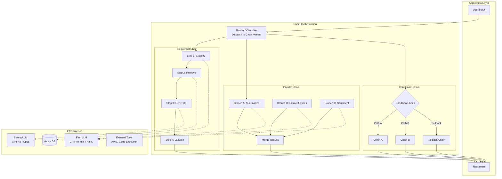
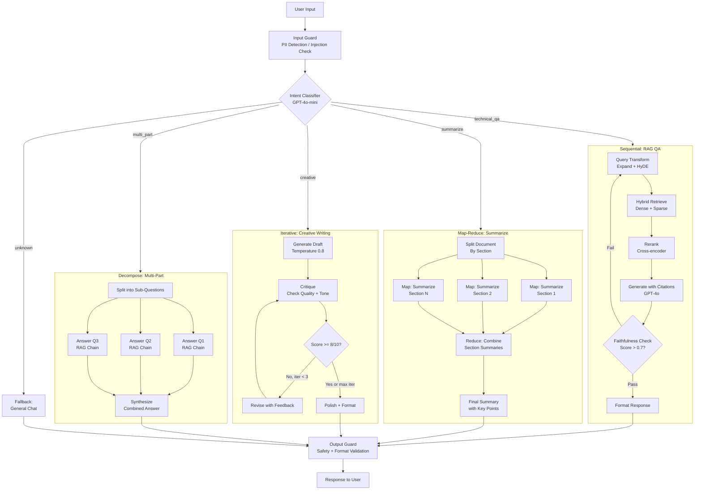
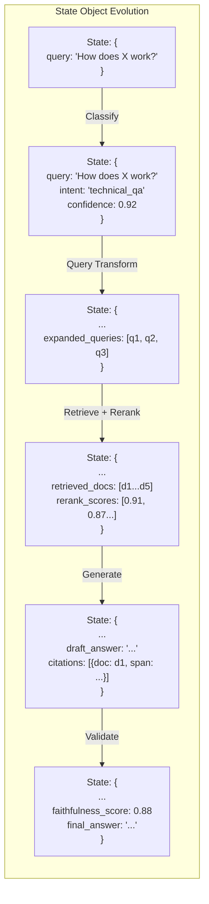
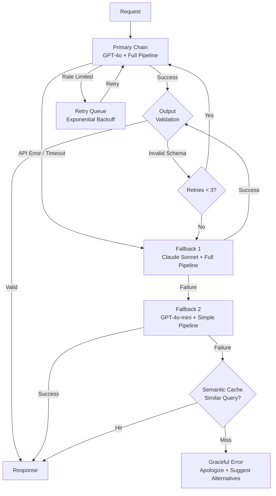

# Prompt Chaining and Composition

## 1. Overview

Prompt chaining is the architectural pattern of decomposing a complex LLM task into a sequence of simpler, focused prompts where the output of one step feeds the input of the next. Rather than asking a single monolithic prompt to handle classification, reasoning, retrieval, formatting, and validation simultaneously, chaining distributes these responsibilities across specialized steps --- each with its own prompt, model, temperature, and output schema.

For Principal AI Architects, prompt chaining is the fundamental composition primitive in GenAI systems. Every orchestration framework --- LangChain's LCEL, LlamaIndex's query engines, Haystack's pipelines, DSPy's module composition --- is ultimately a runtime for executing prompt chains. Understanding the patterns, tradeoffs, and failure modes of chaining at the architectural level is prerequisite to designing any non-trivial LLM application.

**Key numbers that shape chaining design decisions:**

- Per-step overhead: 200--800ms for an LLM call (TTFT + decode for a short response, GPT-4o class), plus 5--20ms framework overhead per step
- Sequential 5-step chain latency: 1--4 seconds end-to-end (dominated by LLM calls)
- Parallel 5-branch chain latency: 200--800ms (wall-clock time of the slowest branch)
- Error compounding: if each step has 95% reliability, a 5-step sequential chain has 0.95^5 = 77% end-to-end reliability without error handling
- Cost multiplication: a 5-step chain using GPT-4o at ~$5/1M input tokens costs 5x a single-call approach (though individual steps typically use fewer tokens)
- Chain-of-thought in a single prompt vs. explicit chain: CoT adds 2--5x output tokens to one call; explicit chaining uses multiple shorter calls with more controllable intermediate outputs
- Maximum practical chain depth: 8--12 steps before latency and reliability become unacceptable without aggressive parallelization and caching

The decision of when to chain versus when to use a single prompt is not always obvious. The rule of thumb: chain when the task requires heterogeneous capabilities (e.g., retrieval + reasoning + formatting), when intermediate outputs need validation or routing, or when different steps benefit from different models or temperatures. Use a single prompt when the task is homogeneous and the model handles it reliably in one pass.

---

## 2. Where It Fits in GenAI Systems

Prompt chaining operates at the orchestration layer, coordinating between the application logic, LLM inference, retrieval systems, and external tools. Chains are the core composition mechanism within orchestration frameworks.



Prompt chaining interacts with these adjacent systems:

- **Orchestration frameworks** (runtime): LangChain LCEL, LlamaIndex query engines, Haystack pipelines, and DSPy modules all provide chain execution runtimes. See [Orchestration Frameworks](./orchestration-frameworks.md).
- **Prompt patterns** (individual steps): Each chain step uses prompt patterns (zero-shot, few-shot, CoT, structured output) internally. See [Prompt Patterns](../prompt-engineering/prompt-patterns.md).
- **Agent architecture** (dynamic chaining): Agents are chains where the sequence of steps is determined dynamically by the LLM, not statically by the developer. See [Agent Architecture](../agents/agent-architecture.md).
- **Model routing** (step-level model selection): Different chain steps may use different models based on cost/quality tradeoffs. See [Model Selection](../model-strategies/model-selection.md).
- **RAG pipeline** (retrieval steps): RAG is a specific chain pattern: query transform -> retrieve -> rerank -> generate. See [RAG Pipeline](../rag/rag-pipeline.md).
- **Structured output** (inter-step contracts): JSON schemas and Pydantic models enforce the data contract between chain steps. See [Structured Output](../prompt-engineering/structured-output.md).

---

## 3. Core Concepts

### 3.1 Sequential Chains

The simplest and most common pattern: output of step N becomes input of step N+1. Each step performs one focused task.

**Architecture:**

```
Input -> [Step 1: Classify] -> classification
       -> [Step 2: Retrieve context based on classification] -> documents
       -> [Step 3: Generate answer using documents] -> draft_answer
       -> [Step 4: Validate and format] -> final_answer -> Output
```

**Design principles for sequential chains:**

- **Single Responsibility**: Each step should do one thing well. A step that classifies AND retrieves AND generates is a monolithic prompt, not a chain step.
- **Typed intermediate outputs**: Define explicit schemas (JSON, Pydantic) for the output of each step. This makes inter-step contracts testable and prevents error propagation.
- **Progressive enrichment**: Each step adds information to a growing context object. Step 1 produces a classification, Step 2 adds retrieved documents, Step 3 adds a draft answer.
- **Minimal context passing**: Each step should receive only the information it needs, not the entire accumulated context. Reduces token costs and prevents irrelevant context from confusing the model.

**When to use:**
- Tasks with natural sequential dependencies (classify before retrieve, retrieve before generate).
- When intermediate outputs need validation or transformation before the next step.
- When different steps benefit from different models (cheap model for classification, expensive model for generation).

**Anti-pattern: over-sequentialization.** If steps have no data dependencies, run them in parallel. A 5-step chain where steps 2, 3, and 4 are independent should run those three in parallel, reducing wall-clock time from 5 * T_step to 2 * T_step + T_parallel.

### 3.2 Parallel Chains

Run multiple prompts simultaneously and merge their results. Each branch processes the same input (or different aspects of the input) independently.

**Architecture:**

```
Input -> [Branch A: Summarize] ----\
      -> [Branch B: Extract entities] -> [Merge: Combine all outputs] -> Output
      -> [Branch C: Classify sentiment] /
```

**Key design considerations:**

- **Fan-out strategy**: All branches receive the same input (homogeneous fan-out) or different inputs derived from a split step (heterogeneous fan-out).
- **Merge strategy**: The merge step must handle the outputs of all branches. Options:
  - **Template merge**: Insert each branch output into a template: "Summary: {summary}\nEntities: {entities}\nSentiment: {sentiment}".
  - **LLM merge**: Use an LLM to synthesize branch outputs into a coherent response. More flexible, adds one LLM call.
  - **Structured merge**: Each branch outputs a typed object; merge concatenates fields into a combined object.
- **Timeout handling**: With parallel branches, the wall-clock time equals the slowest branch. Set per-branch timeouts and handle partial results (e.g., if sentiment analysis times out, return the summary and entities without sentiment).
- **Error isolation**: One branch failure should not kill the entire chain. Wrap each branch in try/except; mark failed branches in the merged output.

**Framework implementations:**
- **LangChain**: `RunnableParallel(summary=summary_chain, entities=entity_chain, sentiment=sentiment_chain)`
- **Haystack**: Parallel branches in pipeline DAG (multiple components reading from the same input).
- **DSPy**: `dspy.Parallel` or explicit asyncio concurrency.
- **Custom**: `asyncio.gather(*[branch_a(input), branch_b(input), branch_c(input)])`.

**When to use:**
- Multiple independent analyses of the same input (summary + entities + sentiment + topics).
- Ensemble approaches where multiple models or prompts generate candidates, and a merge step selects the best.
- Map phase of map-reduce patterns.

### 3.3 Conditional Chains (Router Chains)

Route input to different chain paths based on a classification or content analysis. The router step determines which downstream chain handles the request.

**Architecture:**

```
Input -> [Router: Classify intent] -> intent_type
    intent_type == "technical" -> [Technical QA Chain]
    intent_type == "billing"   -> [Billing Support Chain]
    intent_type == "general"   -> [General Chat Chain]
    intent_type == unknown      -> [Fallback Chain]
```

**Router implementation patterns:**

1. **LLM-based router**: The LLM classifies the input and outputs a route label. Most flexible; handles nuanced classification. Adds one LLM call (100--300ms with a fast model).

```python
# LangChain LCEL router
route_chain = (
    ChatPromptTemplate.from_template(
        "Classify this query into one of: technical, billing, general.\n"
        "Query: {query}\nClassification:"
    )
    | ChatOpenAI(model="gpt-4o-mini", temperature=0)
    | StrOutputParser()
)

def route(classification):
    routes = {
        "technical": technical_chain,
        "billing": billing_chain,
        "general": general_chain,
    }
    return routes.get(classification.strip().lower(), fallback_chain)
```

2. **Embedding-based router**: Embed the input and compare against route-representative embeddings. Faster than LLM classification (~10ms) but less nuanced. Use when you have clear, separable categories.

3. **Rule-based router**: Keyword matching or regex patterns. Fastest (sub-millisecond) but brittle. Use as a pre-filter before LLM classification.

4. **Hybrid router**: Rule-based fast path for obvious cases (keyword match), LLM classification for ambiguous cases. Balances speed and accuracy.

**Design considerations:**

- **Default route**: Always define a fallback route for unclassified inputs. Silent misrouting is worse than an explicit "I'm not sure how to help with that."
- **Multi-label routing**: Some inputs require multiple chains (e.g., a billing question about a technical product). Support multi-label classification and run multiple chains in parallel.
- **Confidence thresholds**: If the router's classification confidence is below a threshold, route to a general-purpose chain or ask for clarification rather than routing to a potentially wrong specialization.
- **Route monitoring**: Track the distribution of routes in production. A shift in route distribution (e.g., sudden spike in "billing" queries) may indicate a product issue or a routing failure.

### 3.4 Iterative / Loop Chains

Run a prompt repeatedly, refining the output with each iteration until a quality threshold is met or a maximum iteration count is reached.

**Architecture:**

```
Input -> [Generate draft] -> draft
      -> [Evaluate quality] -> score
      -> score < threshold? -> [Refine: improve based on feedback] -> revised_draft -> [Evaluate] -> ...
      -> score >= threshold? -> Output
```

**Iteration patterns:**

1. **Self-critique loop**: The LLM generates a draft, then critiques its own output, then revises based on the critique. Two prompts per iteration (critique + revise).

2. **Evaluator-generator loop**: A separate evaluator (different model, heuristic, or rule-based check) scores the output. If below threshold, the generator receives the evaluation feedback and produces a revised output.

3. **Iterative retrieval**: Generate a draft, identify knowledge gaps in the draft, retrieve additional context, regenerate with enriched context. Used in agentic RAG (Self-RAG, CRAG patterns).

4. **Progressive refinement**: Start with a rough outline, refine section by section in subsequent iterations. Each iteration focuses on a specific aspect (accuracy, completeness, formatting, tone).

**Convergence and termination:**

- **Maximum iterations**: Always set a hard cap (typically 2--5 iterations). Unbounded loops risk infinite cost and latency.
- **Convergence detection**: If the output doesn't change meaningfully between iterations (measured by edit distance or semantic similarity), stop early.
- **Quality monotonicity**: Not guaranteed. Iteration N+1 may be worse than iteration N (especially with weaker models). Keep the best-scoring output across iterations, not just the last.
- **Diminishing returns**: Most quality improvement happens in the first 1--2 iterations. 3+ iterations rarely improve quality enough to justify the cost.

**Cost analysis:**

An iterative chain with K iterations costs K times a single-call chain. For K=3 with GPT-4o:
- Input tokens: 3 * ~2000 tokens = 6000 tokens (~$0.015)
- Output tokens: 3 * ~500 tokens = 1500 tokens (~$0.015)
- Total per query: ~$0.03 vs ~$0.01 for single call
- At 100K queries/day: $3,000/day vs $1,000/day

Only use iterative chains when the quality improvement justifies 2--5x cost.

### 3.5 Map-Reduce Chains

Split a large input into parts, process each part independently (map), then combine the results (reduce). Essential for inputs that exceed a single context window or benefit from parallel processing.

**Architecture:**

```
Large Input -> [Split into N chunks]
    Chunk 1 -> [Map: Summarize chunk] -> Summary 1 \
    Chunk 2 -> [Map: Summarize chunk] -> Summary 2  -> [Reduce: Combine summaries] -> Final Summary
    Chunk N -> [Map: Summarize chunk] -> Summary N /
```

**Map phase design:**

- **Splitting strategy**: Split by natural boundaries (paragraphs, sections, pages) rather than arbitrary token counts. Overlap by 1--2 sentences at boundaries to avoid losing context at split points.
- **Uniform prompts**: All map workers use the same prompt. This enables trivial parallelization and consistent output format.
- **Independent processing**: Each map worker processes its chunk without knowledge of other chunks. If cross-chunk context is needed, this is not a pure map-reduce problem --- consider hierarchical summarization instead.

**Reduce phase design:**

- **Single-step reduce**: All map outputs are concatenated and processed in one LLM call. Works when combined map outputs fit in one context window.
- **Hierarchical reduce**: If map outputs are too large for one reduce call, apply reduce recursively (reduce pairs of summaries, then reduce those results, etc.). Forms a tree structure.
- **Refine reduce**: Process map outputs sequentially, refining a running summary with each new output. Better preserves detail than single-step reduce but is sequential (not parallelizable).

**When to use:**
- Document summarization (summarize each section, combine section summaries).
- Multi-document analysis (analyze each document independently, synthesize findings).
- Large-scale extraction (extract entities from each chunk, deduplicate and merge).
- Code analysis (analyze each file, produce per-file reports, synthesize architecture summary).

**Framework implementations:**
- **LangChain**: `MapReduceDocumentsChain`, or custom LCEL with `RunnableParallel` for map + sequential reduce.
- **LlamaIndex**: `TreeSummarize` response synthesizer (hierarchical reduce). `Refine` synthesizer (sequential reduce).
- **DSPy**: Custom module with `dspy.Predict` in a loop for map, `dspy.ChainOfThought` for reduce.

### 3.6 Fallback Chains

Define primary and fallback paths for graceful degradation when the primary chain fails.

**Architecture:**

```
Input -> [Primary Chain: GPT-4o full pipeline]
    Success -> Output
    Failure (timeout/error/low confidence) -> [Fallback Chain A: GPT-4o-mini simplified pipeline]
        Success -> Output (possibly lower quality)
        Failure -> [Fallback Chain B: Cached response or rule-based]
            Success -> Output (baseline quality)
            Failure -> [Error response: "Unable to process request"]
```

**Failure triggers:**

- **API errors**: Timeout, rate limit (429), server error (500). Most common trigger.
- **Low confidence**: Output doesn't pass validation (invalid JSON, missing required fields, confidence score below threshold).
- **Content filter**: Output blocked by safety filters. May need to rephrase the prompt or use a different model.
- **Cost budget exceeded**: Per-query or per-minute cost threshold hit. Fallback to a cheaper model.

**Fallback strategies:**

1. **Model fallback**: Primary: GPT-4o. Fallback 1: Claude Sonnet. Fallback 2: GPT-4o-mini. Each model has different failure characteristics, so cross-provider fallback is more robust than same-provider.
2. **Complexity fallback**: Primary: 5-step chain with retrieval + reranking + CoT. Fallback: 2-step chain with direct retrieval + generation. Simpler chains are more reliable.
3. **Cache fallback**: If the chain fails, check if a semantically similar query has a cached response. Return cached response with a freshness disclaimer.
4. **Rule-based fallback**: For critical paths, maintain a rule-based system that handles the top 20% of query patterns without any LLM call.

**LangChain implementation:**

```python
primary = ChatOpenAI(model="gpt-4o", timeout=10)
fallback_1 = ChatOpenAI(model="claude-3-5-sonnet-20241022", timeout=10)
fallback_2 = ChatOpenAI(model="gpt-4o-mini", timeout=5)

model = primary.with_fallbacks([fallback_1, fallback_2])
chain = prompt | model | parser
```

### 3.7 Chain Composition Patterns

Chains compose into larger chains. The composition primitives are: nesting, branching, merging, and routing.

**Nesting:**

A chain step can itself be a chain. This creates a hierarchical structure:

```
Outer Chain:
  Step 1: Classify
  Step 2: Inner Chain (RAG Pipeline):
    Step 2a: Query Transform
    Step 2b: Retrieve
    Step 2c: Rerank
    Step 2d: Generate
  Step 3: Format Output
```

Nesting enables reuse (the RAG pipeline is a reusable inner chain) and modularity (changing the RAG pipeline doesn't affect the outer chain).

**Branching and merging:**

Fork the data flow into parallel branches, process independently, and merge:

```python
# LangChain LCEL branching
from langchain_core.runnables import RunnableParallel

analysis = RunnableParallel(
    summary=summary_chain,
    entities=entity_chain,
    sentiment=sentiment_chain,
)
full_chain = analysis | merge_chain
```

**Dynamic composition:**

Build chain structures at runtime based on input characteristics:

```python
def build_chain(query_metadata):
    steps = [classify_step]
    if query_metadata.get("needs_retrieval"):
        steps.append(retrieval_step)
    if query_metadata.get("needs_code"):
        steps.append(code_execution_step)
    steps.append(generation_step)
    if query_metadata.get("high_stakes"):
        steps.append(validation_step)
    return compose_sequential(steps)
```

### 3.8 State Management Across Chain Steps

State management is the most underestimated challenge in prompt chaining. As chains grow beyond 3--4 steps, managing the data flowing between steps becomes the primary source of bugs.

**State management patterns:**

1. **Explicit state object**: A typed dictionary or Pydantic model that accumulates results from each step. Each step receives the full state and returns an updated version.

```python
class ChainState(BaseModel):
    query: str
    classification: Optional[str] = None
    retrieved_docs: Optional[list[str]] = None
    draft_answer: Optional[str] = None
    validation_result: Optional[bool] = None
    final_answer: Optional[str] = None
```

2. **Context accumulation**: Each step receives only its direct inputs and returns its output. A coordinator assembles inputs for each step from previous outputs. Cleaner separation of concerns but requires explicit wiring.

3. **LangGraph state**: LangGraph's `StateGraph` uses annotated TypedDict with reducer functions. Each node returns a partial state update; reducers (e.g., `add_messages` for appending to lists) merge updates into the global state.

4. **Conversation-style state**: Represent chain state as a conversation thread. Each step's output becomes a message in the thread. The next step sees the full conversation. Simple but token-inefficient for long chains.

**State persistence:**

For chains that span multiple requests (multi-turn conversations, long-running workflows):
- **In-memory**: Fastest, lost on restart. Fine for single-request chains.
- **Redis**: Sub-millisecond reads, suitable for session state in chat applications.
- **PostgreSQL**: Durable, supports queries on state history. LangGraph's PostgresSaver.
- **Object storage (S3/GCS)**: For large state objects (e.g., full document content). Store a reference in the active state; fetch on demand.

**State isolation for multi-tenancy:**

- Namespace all state keys by session/tenant ID.
- Never share state between concurrent chain executions.
- Implement TTL-based state expiration to prevent memory leaks from abandoned sessions.

### 3.9 Error Handling in Chains

Error handling in chains requires strategy at three levels: step-level, chain-level, and system-level.

**Step-level error handling:**

- **Retry with backoff**: Transient LLM API errors (429, 503) are common. Retry 2--3 times with exponential backoff. All major frameworks support this natively.
- **Output validation**: Parse and validate each step's output against its expected schema. Reject malformed outputs immediately rather than propagating garbage downstream.
- **Timeout**: Set per-step timeouts. A single hanging LLM call should not block the entire chain indefinitely. Typical: 10--30 seconds per LLM call.

**Chain-level error handling:**

- **Fallback chains**: Activate a simpler chain when the primary chain fails (see Section 3.6).
- **Partial results**: If a non-critical step fails (e.g., sentiment analysis in a multi-analysis chain), return partial results with a note about the missing component.
- **Compensation**: If step 3 of 5 fails, and steps 1--2 had side effects (e.g., wrote to a database), implement compensation logic to roll back.

**System-level error handling:**

- **Circuit breaker**: If an LLM provider fails repeatedly, stop sending requests for a cooldown period. Prevents cascading failures and wasted retries.
- **Dead letter queue**: Failed chain executions are saved to a queue for later inspection and retry. Critical for async/batch pipelines.
- **Graceful degradation**: Serve a cached or template response when the chain cannot complete. Better than an error page.

---

## 4. Architecture

### 4.1 Comprehensive Chain Composition Architecture



### 4.2 State Flow in a Production Chain



### 4.3 Error Handling and Fallback Architecture



---

## 5. Design Patterns

### Pattern 1: Classify-Then-Generate
- **When**: Different query types require fundamentally different processing.
- **How**: Step 1 classifies the input using a fast, cheap model (GPT-4o-mini). Step 2 routes to a specialized generation chain based on classification.
- **Benefit**: Each specialized chain can be independently optimized for its query type. Classification step costs ~$0.001 per query.
- **Example**: Customer support bot classifies into {billing, technical, account, general}, routes to specialized chains with different system prompts, tools, and RAG sources.

### Pattern 2: Generate-Then-Validate
- **When**: Output correctness is critical (medical, legal, financial).
- **How**: Step 1 generates a response. Step 2 validates the response against criteria (factual accuracy, compliance, format). Step 3 either returns the validated response or sends feedback to Step 1 for revision.
- **Benefit**: Separates generation (creative, high temperature) from validation (analytical, low temperature). Can use different models for each.
- **Example**: Legal document drafting: generate clause -> validate against regulations -> revise if non-compliant.

### Pattern 3: Extract-Then-Synthesize
- **When**: The output requires information from multiple sources or sections.
- **How**: Map phase extracts relevant information from each source. Reduce phase synthesizes extracted information into a coherent output.
- **Benefit**: Each extraction step is focused and parallelizable. Synthesis step sees only extracted information (not full sources), keeping context lean.
- **Example**: Competitive analysis: extract key facts from each competitor's page -> synthesize into comparison table.

### Pattern 4: Transform-Then-Route
- **When**: Input needs normalization or enrichment before processing.
- **How**: Step 1 transforms the input (expand abbreviations, resolve coreferences, translate, add metadata). Step 2 routes the transformed input to the appropriate chain.
- **Benefit**: Downstream chains receive clean, normalized input. Transformation step handles messy real-world input.
- **Example**: Multilingual chatbot: detect language -> translate to English -> route to English-language chain -> translate response back.

### Pattern 5: Ensemble-Then-Select
- **When**: No single prompt reliably produces the best output.
- **How**: Run N different prompts (or models) in parallel on the same input. A selection step picks the best output (LLM-as-judge, voting, or heuristic scoring).
- **Benefit**: Reduces variance. The ensemble's best output is consistently better than any single prompt's average.
- **Cost**: N times the generation cost. Typically N=3--5.
- **Example**: Code generation: generate 3 solutions with different models -> test all against unit tests -> return the one that passes most tests.

### Pattern 6: Skeleton-Then-Fill
- **When**: Generating long, structured content (articles, reports, documentation).
- **How**: Step 1 generates a structural outline (headings, section descriptions). Step 2 fills each section independently (parallelizable). Step 3 reviews and polishes for coherence.
- **Benefit**: The outline ensures structural completeness. Section-level generation stays within manageable context sizes. Parallel fill reduces latency.
- **Example**: Analyst report: generate report outline -> fill each section with data-backed analysis -> editorial pass for coherence.

---

## 6. Implementation Approaches

### 6.1 LangChain LCEL Implementation

```python
from langchain_core.runnables import RunnableParallel, RunnablePassthrough, RunnableLambda
from langchain_core.prompts import ChatPromptTemplate
from langchain_openai import ChatOpenAI
from langchain_core.output_parsers import JsonOutputParser

# Sequential chain: classify -> retrieve -> generate
classify_prompt = ChatPromptTemplate.from_template(
    "Classify this query: {query}\nCategories: technical, billing, general\n"
    "Output JSON: {{\"category\": \"...\", \"confidence\": 0.0}}"
)
classify_chain = classify_prompt | ChatOpenAI(model="gpt-4o-mini") | JsonOutputParser()

# Parallel analysis chain
analysis_chain = RunnableParallel(
    summary=summary_chain,
    entities=entity_chain,
    sentiment=sentiment_chain,
)

# Conditional routing
def route_by_category(state):
    category = state["classification"]["category"]
    return {"technical": technical_chain, "billing": billing_chain}.get(
        category, general_chain
    )

full_chain = (
    RunnablePassthrough.assign(classification=classify_chain)
    | RunnableLambda(route_by_category)
)
```

### 6.2 Haystack Pipeline Implementation

```python
from haystack import Pipeline
from haystack.components.generators import OpenAIGenerator
from haystack.components.builders import PromptBuilder
from haystack.components.routers import ConditionalRouter

# Type-safe DAG pipeline
pipe = Pipeline()
pipe.add_component("classifier", PromptBuilder(template="Classify: {{query}}"))
pipe.add_component("classifier_llm", OpenAIGenerator(model="gpt-4o-mini"))
pipe.add_component("router", ConditionalRouter(
    routes=[
        {"condition": "{{classification == 'technical'}}", "output": "technical"},
        {"condition": "{{classification == 'billing'}}", "output": "billing"},
    ]
))
pipe.add_component("tech_prompt", PromptBuilder(template="Technical answer for: {{query}}"))
pipe.add_component("tech_llm", OpenAIGenerator(model="gpt-4o"))

pipe.connect("classifier", "classifier_llm")
pipe.connect("classifier_llm", "router")
pipe.connect("router.technical", "tech_prompt")
pipe.connect("tech_prompt", "tech_llm")
```

### 6.3 Custom Implementation (Minimal Dependencies)

```python
import asyncio
from openai import AsyncOpenAI
from pydantic import BaseModel

client = AsyncOpenAI()

class ChainState(BaseModel):
    query: str
    classification: str | None = None
    context: list[str] | None = None
    answer: str | None = None

async def classify(state: ChainState) -> ChainState:
    response = await client.chat.completions.create(
        model="gpt-4o-mini",
        messages=[{"role": "user", "content": f"Classify: {state.query}"}],
        response_format={"type": "json_object"},
        timeout=10,
    )
    state.classification = json.loads(response.choices[0].message.content)["category"]
    return state

async def retrieve(state: ChainState) -> ChainState:
    # Direct vector DB call - no framework overhead
    results = await vector_db.search(state.query, top_k=5)
    state.context = [r.text for r in results]
    return state

async def generate(state: ChainState) -> ChainState:
    response = await client.chat.completions.create(
        model="gpt-4o",
        messages=[
            {"role": "system", "content": "Answer using the provided context."},
            {"role": "user", "content": f"Context: {state.context}\nQuestion: {state.query}"},
        ],
        timeout=30,
    )
    state.answer = response.choices[0].message.content
    return state

# Sequential execution with explicit state passing
async def run_chain(query: str) -> ChainState:
    state = ChainState(query=query)
    state = await classify(state)
    state = await retrieve(state)
    state = await generate(state)
    return state
```

### 6.4 Testing Chain Steps

Each chain step should be independently testable:

```python
# Unit test for a chain step
async def test_classify_technical_query():
    state = ChainState(query="How do I configure the API rate limiter?")
    result = await classify(state)
    assert result.classification == "technical"

# Integration test for chain composition
async def test_full_chain_produces_cited_answer():
    result = await run_chain("What is our SLA for API uptime?")
    assert result.answer is not None
    assert "[Source" in result.answer  # citation present
    assert result.classification == "technical"

# Evaluation test with metrics
async def test_chain_quality_on_eval_set():
    results = await asyncio.gather(*[run_chain(q) for q in eval_queries])
    faithfulness = compute_faithfulness(results, ground_truth)
    assert faithfulness > 0.85, f"Faithfulness {faithfulness} below threshold"
```

---

## 7. Tradeoffs

### Chain Architecture Tradeoffs

| Decision | Option A | Option B | Key Tradeoff |
|----------|----------|----------|--------------|
| Single prompt vs. chain | One complex prompt | Multi-step chain | Simplicity + latency vs. controllability + debuggability |
| Sequential vs. parallel | Steps run in series | Independent steps run concurrently | Simplicity vs. latency reduction (but only for independent steps) |
| Static vs. dynamic chains | Chain structure fixed at build time | Chain structure assembled at runtime based on input | Predictability + testability vs. flexibility for diverse inputs |
| LLM router vs. rule-based | LLM classifies and routes | Keywords/regex route | Accuracy + flexibility vs. speed + determinism + cost |
| Retry vs. fallback | Retry same model/chain | Switch to different model/chain | Recovery from transient errors vs. recovery from systematic failures |
| Explicit state vs. conversation | Typed state object between steps | Chain state as conversation messages | Type safety + efficiency vs. simplicity + LLM-native format |

### Cost-Quality-Latency Triangle

| Decision | Low Cost | High Quality | Low Latency | Achievable? |
|----------|----------|-------------|-------------|-------------|
| Single cheap model, one step | Yes | No | Yes | Yes --- baseline for simple tasks |
| Expensive model, one step | No | Yes | Yes | Yes --- best for homogeneous tasks |
| Multi-step with cheap models | Medium | Medium | No | Yes --- good for decomposable tasks |
| Parallel branches, merge with expensive model | No | Yes | Medium | Yes --- ensemble approach |
| Iterative refinement | No | Yes | No | Yes --- best quality, worst cost and latency |
| Router + tiered models | Yes (avg) | Yes (avg) | Yes (avg) | Yes --- production sweet spot |

### Chain Depth Tradeoffs

| Chain Depth | Latency | Reliability (per step 95%) | Cost Multiplier | Debuggability | When to Use |
|-------------|---------|---------------------------|-----------------|---------------|-------------|
| 1 step | 200--800ms | 95% | 1x | Trivial | Simple tasks the model handles well |
| 2--3 steps | 0.5--2s | 86--90% | 2--3x | Easy | Most production chains |
| 4--6 steps | 1--4s | 77--86% | 4--6x | Moderate | Complex multi-stage workflows |
| 7--10 steps | 2--8s | 70--77% | 7--10x | Hard | Agent-like workflows (prefer LangGraph) |
| 10+ steps | 3--15s+ | <70% | 10x+ | Very hard | Rare; usually indicates over-decomposition |

---

## 8. Failure Modes

### 8.1 Data Flow Failures

| Failure Mode | Symptom | Root Cause | Mitigation |
|-------------|---------|------------|------------|
| **Schema mismatch** | Step N+1 receives unexpected format from Step N | Output schema not enforced; LLM produced unexpected JSON structure | Use structured output (JSON mode, function calling) with Pydantic validation at every step boundary |
| **Context overflow** | Step fails with "context too long" | Accumulated state exceeds model's context window | Track token count in state; summarize or truncate intermediate results; select only needed fields per step |
| **Null propagation** | Downstream steps fail silently on empty input | Earlier step returned empty result (no documents retrieved, no entities found) | Validate non-null at each step boundary; route to fallback chain when critical data is missing |
| **State corruption** | Wrong data passed between steps | Concurrent chain executions share state object; race condition on mutable state | Use immutable state objects; deep-copy state before modification; namespace state by execution ID |
| **Encoding issues** | Unicode errors or garbled text between steps | Different steps handle encoding differently; JSON serialization strips special characters | Normalize encoding at chain entry; validate text integrity at step boundaries |

### 8.2 Composition Failures

| Failure Mode | Symptom | Root Cause | Mitigation |
|-------------|---------|------------|------------|
| **Infinite loop** | Chain never terminates; costs spike | Iterative chain's exit condition never met; evaluation feedback keeps requesting revision | Hard cap on iterations (max_retries=3); timeout on total chain execution; circuit breaker on cost |
| **Routing black hole** | Queries consistently misrouted | Router model's training data doesn't cover query distribution; ambiguous categories | Monitor route distribution; add "uncertain" route; A/B test router prompts; use embedding-based routing as fallback |
| **Merge conflict** | Parallel branch outputs contradict each other | Branches process the same input but reach different conclusions | Add conflict resolution in merge step; prefer one branch as authoritative; flag conflicts for human review |
| **Cascade failure** | One step's failure causes all subsequent steps to fail | No error isolation between chain steps | Wrap each step in error handler; support partial results; maintain fallback output for each step |
| **Feedback loop divergence** | Iterative chain produces increasingly worse outputs | Revision prompt worsens output instead of improving it; LLM "over-corrects" on critique | Track quality score per iteration; return best-scoring iteration (not last); limit revision scope per iteration |

### 8.3 Performance Failures

| Failure Mode | Symptom | Root Cause | Mitigation |
|-------------|---------|------------|------------|
| **Cold start cascade** | First request takes 10--30 seconds | Every step in the chain triggers cold starts (model loading, connection pooling) | Pre-warm chain on deployment; maintain persistent connections; use keep-alive on LLM endpoints |
| **Sequential bottleneck** | Chain latency is sum of all steps despite independent steps | Steps that could run in parallel are sequenced unnecessarily | Identify independent steps; restructure as parallel branches; audit data dependencies |
| **Token waste** | Costs 3--5x expected despite same LLM model | Each chain step sends redundant context (full conversation history, unnecessary metadata) | Minimize per-step context; pass only required fields; separate large state into references |
| **Rate limit exhaustion** | Chain fails mid-execution due to rate limits | Multi-step chain with parallel branches makes many concurrent API calls | Implement per-chain rate limiting; stagger parallel branch execution; use tiered models to spread across providers |

---

## 9. Optimization Techniques

### 9.1 Latency Optimization

- **Parallelize independent steps**: The single highest-impact optimization. If steps 2, 3, and 4 are independent, run them concurrently. Wall-clock time drops from T2 + T3 + T4 to max(T2, T3, T4).
- **Stream intermediate results**: Start the next step as soon as the first tokens arrive, not when the full response completes. For example, start retrieval based on the first few tokens of a query expansion before the full expansion completes.
- **Cache intermediate results**: If the classification step produces the same result for similar queries, cache it. Semantic caching on the classification step can skip the LLM call for 30--50% of queries.
- **Speculative execution**: Start likely-needed steps before confirming they're needed. If 80% of queries require retrieval, start retrieval speculatively while the classifier runs; discard retrieval results if not needed.
- **Batch step execution**: If processing multiple queries, batch each chain step across queries. One LLM call with 10 queries in batch is faster than 10 sequential calls.
- **Use smaller models for non-critical steps**: Classification, routing, and validation steps often perform equally well with GPT-4o-mini or Claude Haiku. Save the expensive model for generation.

### 9.2 Reliability Optimization

- **Retry with model switching**: On LLM API failure, retry with a different provider. OpenAI rate limit -> try Anthropic -> try local model. Cross-provider retry is more robust than same-provider retry.
- **Idempotent steps**: Design each step to be safely retriable. If a step writes to a database, use upsert instead of insert.
- **Structured output enforcement**: Use JSON mode or function calling for every inter-step output. This eliminates 80% of parsing failures.
- **Graceful partial results**: Design the chain to produce useful output even if some steps fail. If entity extraction fails but summarization succeeds, return the summary without entities.
- **Canary deployments**: When changing a chain step, deploy the new version to a small percentage of traffic first. Compare quality metrics against the baseline before full rollout.

### 9.3 Cost Optimization

- **Model tiering by step**: Map each step to the cheapest model that achieves target quality. Typical production chain: GPT-4o-mini for classification/routing ($0.15/M tokens) -> retrieval (no LLM cost) -> GPT-4o for generation ($2.50/M tokens) -> GPT-4o-mini for validation ($0.15/M tokens).
- **Context pruning**: Each step should receive only the fields it needs. Don't pass the full state (with all retrieved documents) to the classification step.
- **Short-circuit evaluation**: If the classifier determines a query doesn't need retrieval, skip the retrieval and reranking steps entirely. Saves 2 LLM calls and the retrieval infrastructure cost.
- **Caching at every level**: Cache classification results, retrieval results, and generation results independently. Different cache TTLs per step.
- **Batch processing for non-real-time**: For background tasks (document processing, report generation), batch queries to reduce per-query overhead and leverage batch API pricing (50% cheaper for OpenAI batch API).

### 9.4 Maintainability Optimization

- **Step-level logging and metrics**: Log inputs, outputs, latency, and token counts for every step. This is the only way to diagnose quality regressions in production.
- **A/B testing per step**: Test prompt or model changes at the step level, not chain level. If you change both the classification prompt and the generation prompt simultaneously, you cannot attribute quality changes.
- **Contract testing**: Define typed schemas for every inter-step data contract. Test that each step produces valid output for representative inputs. Run contract tests in CI.
- **Version all prompts**: Store prompts in version control (not hardcoded in application code). Link each deployment to specific prompt versions for reproducibility.

---

## 10. Real-World Examples

### Perplexity AI
- **Chain pattern**: Classify-then-decompose-then-retrieve-then-generate. Input is classified by complexity. Simple factual queries use a single retrieval + generation chain. Complex analytical queries are decomposed into sub-questions, each retrieving from different sources (web, academic, news), with a synthesis step producing the final answer with inline citations.
- **Key innovation**: Parallel multi-source retrieval with source-aware merge. Each retrieval branch specializes in a source type (web pages, academic papers, news articles), and the merge step weaves citations from all sources.

### ChatGPT (OpenAI)
- **Chain pattern**: Router chain with tool dispatch. The model's internal routing determines whether to use code interpreter, web browsing, DALL-E, or direct generation. Each tool invocation is a chain step with its own error handling and output formatting.
- **Key insight**: The chain is dynamic and LLM-driven (agentic), not statically defined. The number of steps varies per query. Tool results feed back into the model for further reasoning.

### Anthropic Claude (with tool use)
- **Chain pattern**: Plan-then-execute sequential chain. For complex queries, the model generates an explicit plan (internal chain of thought), then executes each plan step as a tool call or generation. The plan can be revised mid-execution based on intermediate results.
- **Key innovation**: Extended thinking with tool use creates a natural sequential chain within a single API call, where reasoning steps and tool invocations interleave.

### Glean (Enterprise Search)
- **Chain pattern**: Transform-then-route-then-retrieve-then-generate. User query is transformed (coreference resolution with conversation history, acronym expansion from enterprise glossary). Transformed query is routed to the appropriate data source (Confluence, Slack, email, code). Source-specific retrieval chains run in parallel. Results are merged and fed to the generation chain with per-user permission filtering.
- **Key design**: The routing step uses both rule-based (data source mentioned explicitly) and LLM-based (intent-driven source selection) routing in a hybrid pattern.

### GitHub Copilot
- **Chain pattern**: Context-assembly-then-generate-then-validate. Step 1 assembles context from multiple sources in parallel (current file, open tabs, recently edited files, repository structure, language server diagnostics). Step 2 generates code completions using the assembled context. Step 3 validates completions (syntax check, type check where available, deduplication).
- **Key design**: The context assembly step runs entirely in parallel, with aggressive timeout handling --- if a context source is slow, proceed without it rather than blocking the completion.

---

## 11. Related Topics

- **[Orchestration Frameworks](./orchestration-frameworks.md)**: The frameworks (LangChain, LlamaIndex, Haystack, DSPy) that provide runtime implementations for prompt chains.
- **[Prompt Patterns](../prompt-engineering/prompt-patterns.md)**: Individual prompt techniques (CoT, few-shot, ReAct) used within each chain step.
- **[Agent Architecture](../agents/agent-architecture.md)**: Agents as dynamically composed chains where the LLM determines the chain structure at runtime.
- **[Model Selection](../model-strategies/model-selection.md)**: How to choose different models for different chain steps based on cost/quality/latency requirements.
- **[RAG Pipeline](../rag/rag-pipeline.md)**: RAG as a specific instantiation of the sequential chain pattern (query transform -> retrieve -> rerank -> generate).
- **[Structured Output](../prompt-engineering/structured-output.md)**: JSON schemas and constrained decoding for reliable inter-step data contracts.
- **[Context Management](../prompt-engineering/context-management.md)**: Managing conversation history and context across chain steps and multi-turn interactions.
- **[Build vs Buy](./build-vs-buy.md)**: When to use framework-provided chain composition vs. custom implementation.

---

## 12. Source Traceability

| Concept | Primary Source |
|---------|---------------|
| Prompt chaining (original concept) | Wu et al., "AI Chains: Transparent and Controllable Human-AI Interaction by Chaining Large Language Model Prompts," CHI 2022 |
| Chain-of-thought prompting | Wei et al., "Chain-of-Thought Prompting Elicits Reasoning in Large Language Models," NeurIPS 2022 |
| ReAct (Reasoning + Acting) | Yao et al., "ReAct: Synergizing Reasoning and Acting in Language Models," ICLR 2023 |
| Self-consistency | Wang et al., "Self-Consistency Improves Chain of Thought Reasoning in Language Models," ICLR 2023 |
| Map-reduce for LLMs | LangChain documentation, "Map-Reduce Document Chain" pattern (2023) |
| LCEL composition | LangChain documentation, "LangChain Expression Language" (2023--present) |
| LangGraph state machines | LangChain Inc., "LangGraph: Multi-Actor Applications with LLMs" (2024) |
| Router chains | LangChain documentation, "Router Chains" pattern; Semantic Kernel planner architecture (2023) |
| Self-RAG (iterative retrieval) | Asai et al., "Self-RAG: Learning to Retrieve, Generate, and Critique through Self-Reflection," ICLR 2024 |
| CRAG (corrective retrieval loop) | Yan et al., "Corrective Retrieval Augmented Generation," 2024 |
| Skeleton-of-thought | Ning et al., "Skeleton-of-Thought: Large Language Models Can Do Parallel Decoding," 2023 |
| DSPy module composition | Khattab et al., "DSPy: Compiling Declarative Language Model Calls into Self-Improving Pipelines," ICLR 2024 |
