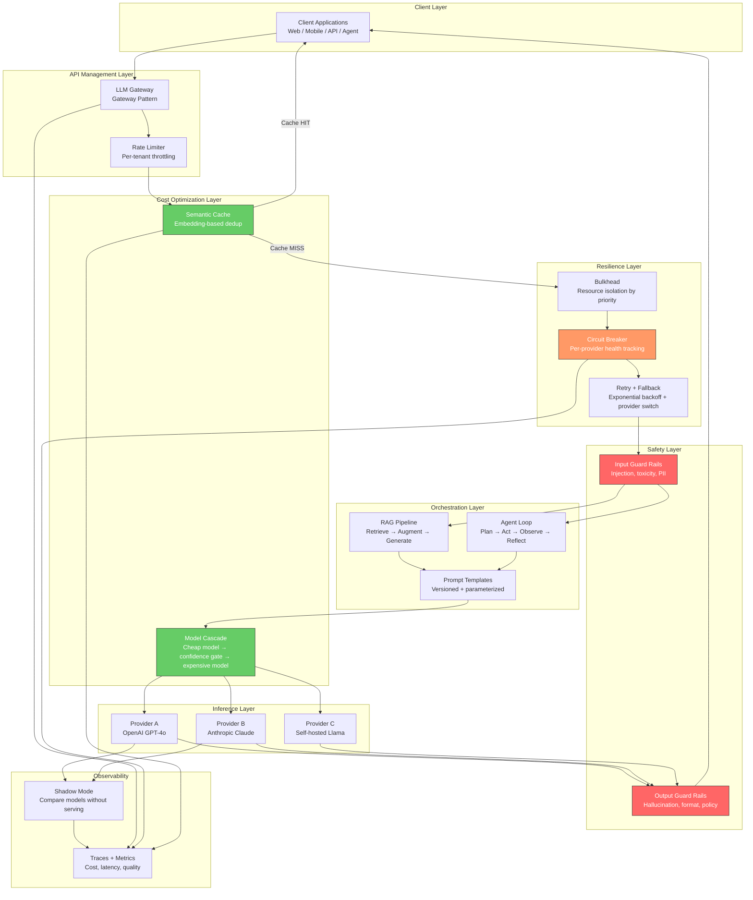
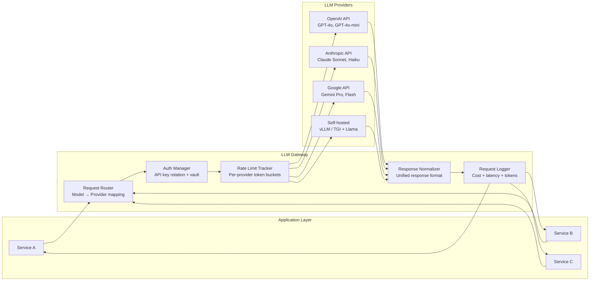
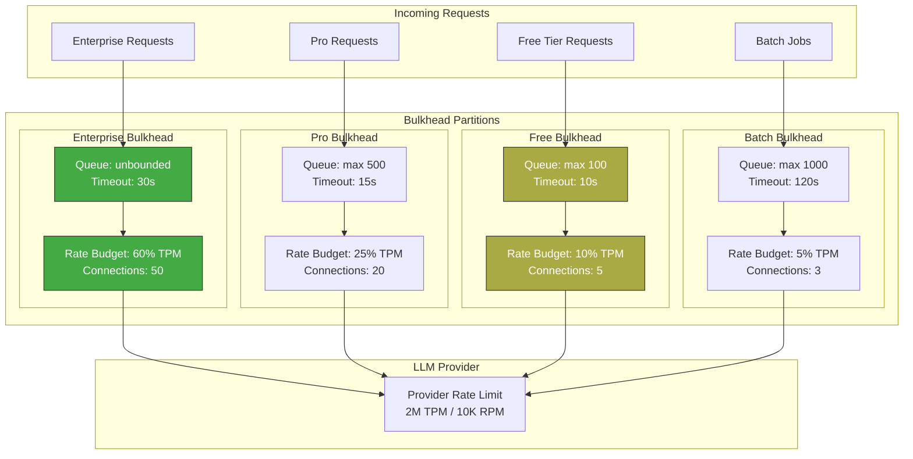
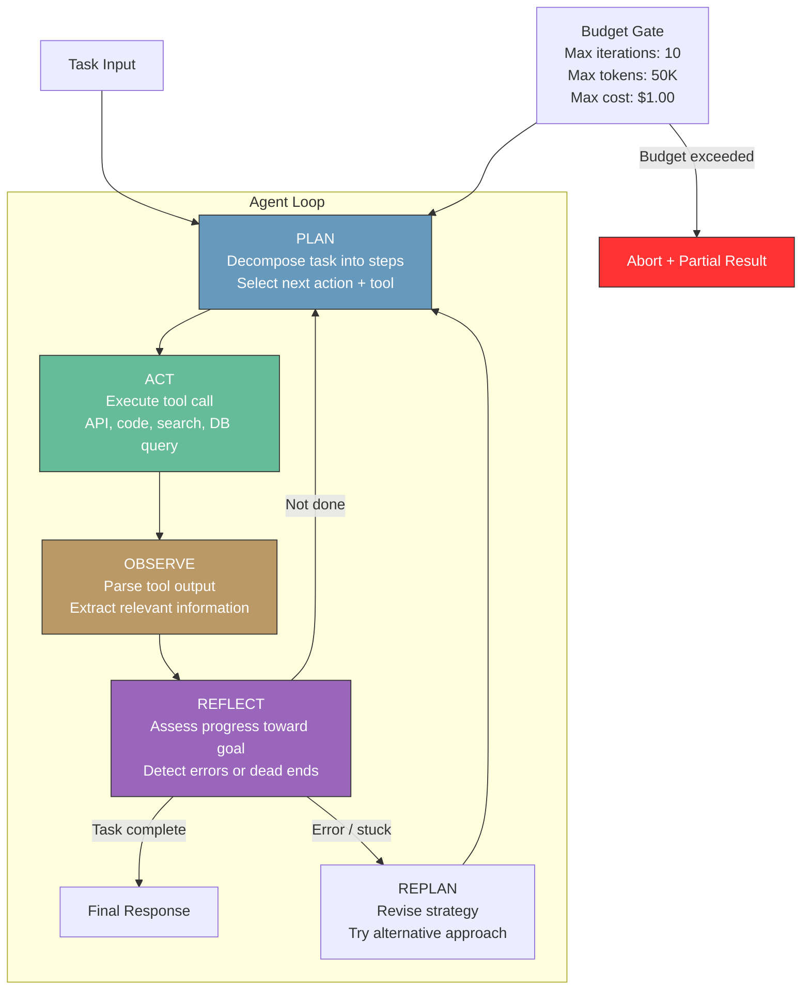
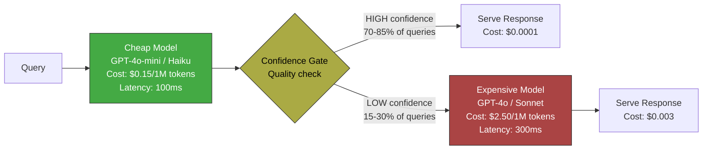
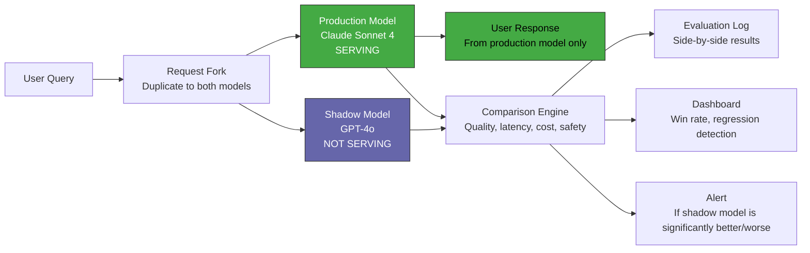
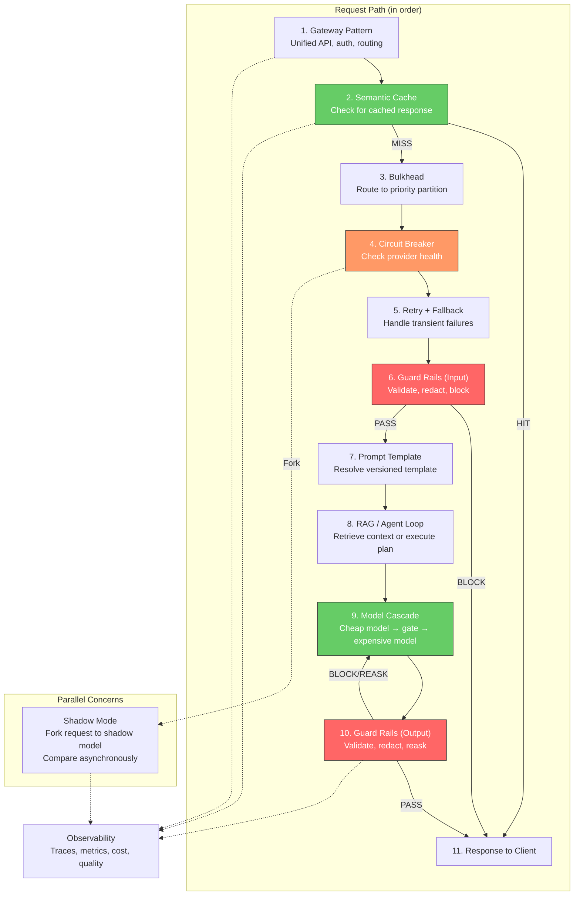

# GenAI Design Patterns

## 1. Overview

GenAI design patterns are reusable architectural solutions to recurring problems in LLM-powered systems. They exist because building production GenAI applications exposes a set of failure modes, cost pressures, and reliability constraints that are fundamentally different from traditional software. A single LLM call is non-deterministic, expensive (100--1000x the cost of a traditional API call), latency-heavy (200ms--10s), and dependent on third-party providers whose availability, pricing, and behavior can change without notice. Design patterns encode hard-won operational knowledge about how to make these systems reliable, cost-efficient, and maintainable.

These patterns are not theoretical. They emerged from production incidents: the Gateway Pattern from teams managing three LLM providers whose APIs all diverged in incompatible ways. The Circuit Breaker for LLMs from the OpenAI outage of November 2023 that cascaded into application-level downtime for thousands of companies. The Semantic Cache Pattern from organizations whose LLM bills hit six figures monthly because 40% of their queries were semantically identical. The Model Cascade Pattern from the realization that routing 100% of traffic to GPT-4 costs 30x more than routing only the hard queries there.

**Why GenAI needs its own pattern catalog, distinct from traditional distributed systems patterns:**

- **Non-determinism**: The same input produces different outputs on every call. Traditional retry-and-compare strategies fail because you cannot diff two LLM responses for equality. Patterns must account for semantic equivalence, not byte-level identity.
- **Cost asymmetry**: A GPT-4o call costs $2.50--$10/1M input tokens; GPT-4o-mini costs $0.15/1M. A 10x traffic spike does not just stress infrastructure --- it can generate a five-figure bill in hours. Patterns must include cost-aware routing.
- **Provider dependency**: Unlike databases or caches that you operate, LLM providers are opaque third parties. You cannot scale their capacity, debug their internals, or predict their outages. Patterns must assume provider unreliability as a baseline.
- **Quality degradation is silent**: A traditional API either returns the right data or throws an error. An LLM can return confidently wrong answers with no error signal. Patterns must include quality validation, not just error handling.
- **Latency profile is bimodal**: LLM calls have high variance --- p50 might be 300ms while p99 is 8 seconds. Patterns must handle both the happy path and the tail latency path.

**The eleven patterns in this catalog, organized by concern:**

| Concern | Patterns |
|---|---|
| API management | Gateway Pattern |
| Resilience | Circuit Breaker for LLMs, Retry with Exponential Backoff + Fallback, Bulkhead Pattern |
| Cost optimization | Semantic Cache Pattern, Model Cascade Pattern |
| Core workflows | RAG Pattern, Agent Loop Pattern |
| Safety | Guard Rails Pattern |
| Observability & testing | Shadow Mode Pattern |
| Prompt management | Prompt Template Pattern |

---

## 2. Where It Fits in GenAI Systems

Design patterns are not a layer in the stack --- they are cross-cutting architectural decisions that shape how every layer is built. The Gateway Pattern defines the API layer. The Circuit Breaker and Bulkhead patterns define the resilience layer. The RAG and Agent Loop patterns define the orchestration layer. The Semantic Cache sits between the application and inference layers. The Guard Rails Pattern wraps the inference layer.



These patterns interact with the following adjacent systems:

- **[Guardrails](../safety/guardrails.md)** (peer): The Guard Rails Pattern defined here is an architectural abstraction; the guardrails topic covers implementation frameworks (Guardrails AI, NeMo Guardrails, Llama Guard) in depth.
- **[RAG Pipeline](../rag/rag-pipeline.md)** (peer): The RAG Pattern here defines the canonical three-phase flow; the RAG pipeline topic covers chunking, retrieval, reranking, and evaluation.
- **[Agent Architecture](../agents/agent-architecture.md)** (peer): The Agent Loop Pattern here defines the Plan-Act-Observe-Reflect cycle; the agent architecture topic covers ReAct, Plan-and-Execute, LATS, and Reflexion variants.
- **[Circuit Breaker](../../resilience/circuit-breaker.md)** (foundation): The traditional circuit breaker pattern. The GenAI variant adds LLM-specific health signals (quality degradation, not just errors).
- **[Rate Limiting](../../resilience/rate-limiting.md)** (foundation): Provider rate limits are the primary constraint that the Gateway and Bulkhead patterns manage.
- **[Model Selection](../model-strategies/model-selection.md)** (upstream): Model routing decisions feed into the Gateway, Cascade, and Shadow Mode patterns.
- **[LLM Observability](../evaluation/llm-observability.md)** (cross-cutting): Every pattern produces telemetry that the observability layer must capture.

---

## 3. Patterns

### 3.1 Gateway Pattern

**Problem**: Your application calls multiple LLM providers (OpenAI, Anthropic, Google, self-hosted). Each has a different API format, authentication mechanism, rate limit structure, error response format, and streaming protocol. Business logic becomes tightly coupled to provider-specific SDKs. Switching providers or adding a new one requires code changes across the entire application.

**Solution**: Introduce a unified API gateway that abstracts all LLM providers behind a single interface. The gateway handles provider-specific translation, authentication, rate limit management, request routing, and response normalization. Application code calls the gateway with a provider-agnostic request; the gateway translates it to the target provider's format.



**Key capabilities of a production LLM gateway:**

| Capability | Description | Why it matters |
|---|---|---|
| API normalization | Translate between provider-specific request/response formats | Application code is provider-agnostic |
| Credential management | Rotate API keys, integrate with secrets vaults (AWS Secrets Manager, HashiCorp Vault) | No hardcoded keys, automatic rotation |
| Rate limit tracking | Track per-provider rate limits (TPM, RPM), queue or reject when approaching limits | Prevent 429 errors from reaching application |
| Cost tracking | Log token counts and compute costs per request, per model, per tenant | Budget enforcement and chargeback |
| Request routing | Route requests to specific providers based on model name, priority, or load | Enable multi-provider strategies |
| Fallback routing | Automatically route to a backup provider when the primary fails | Resilience without application changes |
| Streaming translation | Normalize SSE streaming formats across providers | Consistent streaming API for clients |
| Retry logic | Provider-aware retry with exponential backoff | Transparent retries without application logic |

**Production implementations:**

- **LiteLLM**: Open-source Python proxy that unifies 100+ LLM providers behind an OpenAI-compatible API. Handles authentication, rate limiting, fallbacks, and cost tracking. Deploy as a sidecar or standalone service. The most widely adopted open-source LLM gateway.
- **Portkey**: Commercial gateway with advanced routing (load balancing, A/B testing, canary), built-in caching, and guardrails integration. Provides a hosted control plane with per-request analytics.
- **Azure API Management + AI Gateway**: Microsoft's enterprise-grade solution that adds LLM-specific policies (token rate limiting, semantic caching, content safety) to Azure API Management.
- **Kong AI Gateway**: Kong's plugin extension that adds LLM provider abstraction, prompt templating, and rate limiting to the Kong API gateway.
- **Custom gateway**: For organizations with specific requirements, a thin Go or Python service backed by provider SDKs. Typical build time: 2--4 engineering weeks for core functionality.

**When to use**: Always, once you use more than one LLM provider, or when you need cost tracking, rate limit management, or the ability to switch providers without code changes. The Gateway Pattern is the foundation on which the Circuit Breaker, Retry, Bulkhead, and Cascade patterns are built.

**Tradeoffs**:

| Advantage | Disadvantage |
|---|---|
| Provider-agnostic application code | Single point of failure (must be highly available) |
| Centralized cost and usage tracking | Added latency: 1--5ms for routing + normalization |
| Simplified credential management | Must keep up with provider API changes |
| Enables all other resilience patterns | Complexity of managing another infrastructure component |

---

### 3.2 Circuit Breaker for LLMs

**Problem**: An LLM provider experiences an outage, elevated error rates, or severe latency degradation. Your application continues sending requests, accumulating timeouts, exhausting connection pools, and burning money on requests that will never complete. The provider's degraded state cascades into your application's degraded state.

**Solution**: Wrap each LLM provider call in a circuit breaker that tracks health metrics (error rate, latency percentiles, timeout rate). When the provider's health drops below a threshold, the circuit opens: all subsequent requests fail immediately (or route to a fallback provider) without contacting the degraded provider. After a cooldown period, the circuit transitions to half-open, sending probe requests to test recovery.

**The GenAI-specific extension to the traditional circuit breaker** (see [Circuit Breaker](../../resilience/circuit-breaker.md) for the general pattern): LLM circuit breakers must monitor quality signals in addition to availability signals. A provider can return HTTP 200 with garbage output --- this is not a traditional error, but it is a failure. Quality-aware circuit breakers track:

- **Error rate**: HTTP 5xx, timeouts, rate limit (429) responses. Standard circuit breaker signal.
- **Latency degradation**: If p95 latency doubles compared to the trailing 5-minute baseline, the provider is stressed. This is a leading indicator --- latency degrades before errors spike.
- **Quality score degradation**: If an inline quality evaluator (LLM-as-judge, BLEU score, or format validation pass rate) drops below a threshold, the provider may be returning degraded outputs. This catches "successful failures" that return HTTP 200 with low-quality content.
- **Token throughput degradation**: If tokens-per-second drops significantly, the provider may be throttling or under load.

**Circuit breaker state machine for LLMs:**

```mermaid
stateDiagram-v2
    [*] --> Closed: Initialize

    Closed --> Open: Error rate > 50% OR<br/>p95 latency > 3x baseline OR<br/>quality score < threshold
    Closed --> Closed: Healthy requests

    Open --> HalfOpen: Cooldown timer expires<br/>(30s default, exponential increase)
    Open --> Open: All requests → fallback provider<br/>or cached response

    HalfOpen --> Closed: Probe requests succeed<br/>AND quality score acceptable
    HalfOpen --> Open: Probe requests fail<br/>OR quality below threshold<br/>(double cooldown timer)

    note right of Open
        During OPEN state:
        - Route to fallback provider
        - Serve from semantic cache
        - Return graceful degradation
        No requests reach the degraded provider
    end note

    note right of HalfOpen
        Send 1-3 probe requests.
        Validate both availability
        AND output quality.
    end note
```



**Implementation considerations:**

- **Per-provider circuit breakers**: Maintain separate circuit breakers for each LLM provider. OpenAI going down should not open the Anthropic circuit.
- **Per-model circuit breakers**: Within a provider, different models can have different health profiles. GPT-4o might be degraded while GPT-4o-mini is healthy.
- **Shared state in distributed systems**: Circuit breaker state must be shared across application instances. Use Redis, Consul, or a shared config store. A circuit open on one instance but closed on others defeats the purpose.
- **Fallback chain**: When the circuit opens, route to a fallback provider. Define an ordered fallback chain: primary (OpenAI GPT-4o) -> secondary (Anthropic Claude Sonnet) -> tertiary (self-hosted Llama 3.1 70B) -> graceful degradation (cached response or error message).

**When to use**: Always, for any production system calling external LLM providers. The circuit breaker is non-negotiable reliability infrastructure.

**Tradeoffs**:

| Advantage | Disadvantage |
|---|---|
| Prevents cascading failures from provider outages | Adds complexity: state management, threshold tuning |
| Preserves connection pool and thread resources | False positives: transient errors can open the circuit prematurely |
| Enables automatic fallback to alternative providers | Quality-based signals require an inline evaluator (adds latency and cost) |
| Provides clear observability of provider health | Shared state across instances requires distributed coordination |

---

### 3.3 Retry with Exponential Backoff + Fallback

**Problem**: An LLM request fails due to a transient error (network timeout, provider rate limit 429, temporary server error 503). A naive retry (immediately, same provider) either fails again or exacerbates the provider's load. A naive fallback (immediately switch providers) wastes the opportunity to succeed with the original provider on the second attempt, potentially at lower quality or higher cost.

**Solution**: Combine retry-with-exponential-backoff (same provider) with provider fallback. First, retry the same provider with exponentially increasing delays and jitter. If retries exhaust, switch to a fallback provider. This maximizes the chance of succeeding with the preferred provider while ensuring eventual success via fallback.

**The retry decision tree:**

```
Request fails
  ├─ Is it retryable? (429, 503, 504, timeout, connection reset)
  │   ├─ YES: Retry same provider
  │   │   ├─ Attempt 1: wait base_delay * random(0.5, 1.5)        [~500ms]
  │   │   ├─ Attempt 2: wait base_delay * 2 * random(0.5, 1.5)    [~1000ms]
  │   │   ├─ Attempt 3: wait base_delay * 4 * random(0.5, 1.5)    [~2000ms]
  │   │   └─ All retries exhausted → Fallback to next provider
  │   └─ NO: (400 bad request, 401 auth error, 404)
  │       └─ Do NOT retry. Return error immediately.
  └─ Is the circuit breaker open?
      └─ YES: Skip retries entirely. Go straight to fallback.
```

**Critical: jitter prevents thundering herd.** Without jitter, if 1,000 concurrent requests all get rate-limited at time T, they all retry at T + base_delay, creating a synchronized burst that guarantees another rate limit. Full jitter (AWS-recommended):

```
delay = random(0, min(max_delay, base_delay * 2^attempt))
```

**429-specific handling**: LLM providers return `Retry-After` headers with 429 responses. Respect this header --- it tells you exactly when the provider's rate limit window resets. If the header says "Retry-After: 30", waiting 30 seconds is more efficient than exponential backoff.

**Fallback provider selection**: The fallback provider should be chosen to minimize quality degradation while ensuring availability. A typical fallback chain:

| Priority | Provider | Model | Rationale |
|---|---|---|---|
| 1 (primary) | OpenAI | GPT-4o | Best quality for the task |
| 2 (fallback) | Anthropic | Claude Sonnet | Comparable quality, different provider |
| 3 (fallback) | Google | Gemini Pro | Different infrastructure entirely |
| 4 (fallback) | Self-hosted | Llama 3.1 70B | No external dependency, lower quality |
| 5 (degraded) | Cache | Semantic cache hit | Stale but available |
| 6 (last resort) | Static | Canned response | "We're experiencing issues, please try again" |

**When to use**: Always, in conjunction with the Circuit Breaker pattern. Retry handles transient failures; the Circuit Breaker handles sustained failures. Together they provide comprehensive resilience.

**Tradeoffs**:

| Advantage | Disadvantage |
|---|---|
| Handles transient errors transparently | Retries add latency (up to 3.5s for 3 attempts) |
| Respects provider rate limits via backoff | Retries consume tokens/cost if the request partially completed |
| Jitter prevents thundering herd | Fallback providers may produce different quality outputs |
| Provider fallback ensures eventual success | Application must handle semantic differences between providers |

---

### 3.4 Bulkhead Pattern

**Problem**: Your application serves multiple customer tiers (free, pro, enterprise) or multiple use cases (chatbot, batch processing, internal tools) through the same LLM gateway. A traffic spike from free-tier users exhausts the provider's rate limit, causing enterprise requests to fail. Or a batch processing job consumes all available concurrency, starving the real-time chatbot.

**Solution**: Partition LLM resources (rate limit budget, connection pools, thread pools, queue capacity) into isolated compartments ("bulkheads"), one per priority tier or use case. A resource exhaustion in one bulkhead cannot affect another. The name comes from ship construction: watertight bulkheads prevent a hull breach in one compartment from flooding the entire ship.

**Bulkhead dimensions for LLM systems:**

| Resource | How to partition | Example |
|---|---|---|
| Rate limit budget (TPM/RPM) | Allocate a percentage of the provider's rate limit to each tier | Enterprise: 60% of 2M TPM, Pro: 30%, Free: 10% |
| Connection pool | Separate HTTP connection pools per tier | Enterprise pool: 50 connections, Free pool: 10 |
| Request queue | Separate queues with independent depth limits | Enterprise queue: unbounded, Free queue: max 100 |
| Timeout budget | Different timeout durations per tier | Enterprise: 30s, Free: 10s |
| Fallback policy | Different fallback chains per tier | Enterprise: retry 5x then fallback, Free: retry 1x then cache |
| Model access | Restrict model availability per tier | Enterprise: GPT-4o, Pro: GPT-4o-mini, Free: Llama 3.1 |



**Dynamic bulkhead rebalancing**: Static partitions waste capacity. If enterprise traffic is low, free-tier requests should be able to use the spare capacity. Implement a priority-based scheduler: enterprise requests always get capacity first; free-tier requests use whatever is left. When enterprise traffic spikes, free-tier requests are shed first. This is analogous to quality-of-service (QoS) scheduling in network switches.

**When to use**: When your application serves multiple customer tiers, multiple use cases with different SLAs, or when you must protect real-time traffic from batch processing interference.

**Tradeoffs**:

| Advantage | Disadvantage |
|---|---|
| Prevents noisy-neighbor problems | Static partitions waste unused capacity |
| Guarantees SLAs for high-priority traffic | Dynamic rebalancing adds complexity |
| Enables differentiated service quality per tier | Requires per-tier rate limit tracking and enforcement |
| Protects real-time paths from batch interference | Must decide partition ratios (political as much as technical) |

---

### 3.5 Semantic Cache Pattern

**Problem**: 30--60% of queries to a production LLM application are semantically identical to recent queries, even though they differ textually. "What is your return policy?" and "How do I return an item?" have the same intent and should produce the same answer. Traditional exact-match caches miss these duplicates entirely, resulting in redundant LLM calls that cost money and add latency.

**Solution**: Cache LLM responses keyed by the semantic embedding of the query, not the raw text. When a new query arrives, compute its embedding, search the cache for entries with cosine similarity above a threshold, and return the cached response if a match is found. This eliminates redundant LLM calls for semantically equivalent queries.

For deep coverage of implementation, see [Semantic Caching](semantic-caching.md).

**The semantic cache flow:**

```
Query arrives: "How do I return a product?"
  1. Compute embedding: embed("How do I return a product?") → vector [0.12, -0.34, ...]
  2. Search cache: find nearest neighbor in vector index
  3. Nearest match: "What is your return policy?" (similarity: 0.94)
  4. Threshold check: 0.94 > 0.90 (configured threshold) → CACHE HIT
  5. Return cached response (0ms LLM cost, ~15ms total)

Query arrives: "Can I use multiple discount codes?"
  1. Compute embedding → vector [0.56, 0.11, ...]
  2. Search cache: nearest match similarity: 0.62
  3. Threshold check: 0.62 < 0.90 → CACHE MISS
  4. Forward to LLM, cache the response for future matches
```

**Critical threshold tuning**: The similarity threshold determines the tradeoff between cache hit rate and response accuracy.

| Threshold | Hit Rate (typical) | Risk | Best For |
|---|---|---|---|
| 0.98--1.0 | 5--10% | Near-zero risk of wrong answer | High-stakes (medical, legal, financial) |
| 0.92--0.97 | 15--30% | Minimal risk; occasional edge cases | Customer support, documentation Q&A |
| 0.85--0.91 | 30--50% | Moderate risk; some wrong matches | Internal tools, exploratory queries |
| < 0.85 | 50%+ | High risk; frequent wrong cache hits | Never recommended for production |

**Implementation components:**

- **Embedding model**: text-embedding-3-small (OpenAI) or a self-hosted model (e5-base-v2). Latency: 5--15ms. The embedding must be fast because it runs on every request, hit or miss.
- **Vector index**: Redis with RediSearch, Pinecone, Qdrant, or an in-memory HNSW index (hnswlib). Supports approximate nearest neighbor search in sub-millisecond time.
- **TTL policy**: Cached responses expire based on content freshness requirements. FAQ answers: TTL 24h. Real-time data queries: TTL 5min. Conversation-specific responses: no cache (TTL 0).
- **Cache invalidation**: When source data changes (product catalog update, policy change), invalidate related cache entries. Option 1: flush the entire cache (simple, aggressive). Option 2: embed the new source data, find and invalidate cache entries with high similarity to the changed content (precise but complex).

**When to use**: Customer-facing applications with repetitive query patterns (support chatbots, FAQ bots, documentation assistants). Not effective for open-ended creative tasks, conversation-dependent queries, or personalized responses where context makes every query unique.

**Tradeoffs**:

| Advantage | Disadvantage |
|---|---|
| 30--60% reduction in LLM calls → direct cost savings | Embedding computation on every request (5--15ms) |
| Sub-20ms response for cache hits vs. 200ms--5s for LLM | Stale responses if TTL is too long |
| Reduces provider dependency (cached responses survive outages) | Wrong cache hits if threshold is too low (semantic collisions) |
| Improves p50 latency significantly | Context-dependent queries (multi-turn) are hard to cache |

---

### 3.6 RAG Pattern

**Problem**: LLMs have a knowledge cutoff date, cannot access proprietary data, and hallucinate when asked about information not in their training data. Fine-tuning on proprietary data is expensive, slow, and creates a static snapshot that must be retrained on every data update.

**Solution**: Retrieve relevant documents from an external knowledge base at query time, augment the LLM's prompt with the retrieved context, and generate a response grounded in the retrieved information. This is the Retrieval-Augmented Generation (RAG) pattern --- the single most widely deployed GenAI design pattern.

For deep coverage of each phase, see [RAG Pipeline](../rag/rag-pipeline.md), [Chunking](../rag/chunking.md), [Retrieval & Reranking](../rag/retrieval-reranking.md), and [Document Ingestion](../rag/document-ingestion.md).

**The canonical three-phase flow:**

```mermaid
flowchart LR
    subgraph "1. RETRIEVE"
        Q[User Query] --> EMBED[Embed Query<br/>5-15ms]
        EMBED --> VS[Vector Search<br/>Top-K candidates<br/>5-20ms]
        VS --> RERANK[Rerank<br/>Cross-encoder scoring<br/>20-50ms]
        RERANK --> TOP[Top-N Documents<br/>N=3-5 typically]
    end

    subgraph "2. AUGMENT"
        TOP --> ASSEMBLE[Prompt Assembly<br/>System prompt + context + query]
        ASSEMBLE --> TRUNCATE[Context Window Management<br/>Fit within token limit]
    end

    subgraph "3. GENERATE"
        TRUNCATE --> LLM[LLM Inference<br/>Generate grounded response<br/>200ms-5s]
        LLM --> CITE[Citation Extraction<br/>Map claims to sources]
        CITE --> RESPONSE[Response + Citations]
    end

    style EMBED fill:#69b,stroke:#333,color:#fff
    style VS fill:#69b,stroke:#333,color:#fff
    style RERANK fill:#69b,stroke:#333,color:#fff
    style LLM fill:#96b,stroke:#333,color:#fff
```



**Why RAG over fine-tuning:**

| Dimension | RAG | Fine-tuning |
|---|---|---|
| Data freshness | Real-time (update index, not model) | Stale (requires retraining) |
| Cost to update | Minutes (re-index changed docs) | Hours to days ($100--$10K per run) |
| Attribution | Citations trace to source documents | No attribution possible |
| Hallucination control | Constrain generation to retrieved context | Model may still hallucinate |
| Data security | Documents stay in your infrastructure | Training data leaks into model weights |
| Multi-tenancy | Per-tenant indexes, same model | Separate fine-tuned model per tenant |

**When to use**: Any application where the LLM must answer questions about data that is proprietary, frequently updated, or not in the model's training data. This includes enterprise knowledge bases, customer support, documentation search, legal research, and compliance queries.

**Tradeoffs**:

| Advantage | Disadvantage |
|---|---|
| Up-to-date knowledge without retraining | Retrieval quality is the ceiling for response quality |
| Auditable via source citations | Latency: retrieval adds 30--100ms to each request |
| Data stays in your infrastructure | Chunk boundaries can split relevant context |
| Works with any LLM (model-agnostic) | Requires building and maintaining an ingestion + indexing pipeline |

---

### 3.7 Agent Loop Pattern

**Problem**: Many real-world tasks cannot be completed in a single LLM call. They require multi-step reasoning, tool use, intermediate observations, and adaptive planning. A single-turn prompt-response pattern cannot handle "Find all orders over $1000 from last month, check which ones have open support tickets, and draft a summary email for each."

**Solution**: Implement a control loop where the LLM iteratively plans actions, executes them via tools, observes results, and reflects on progress. The loop continues until the task is complete or a termination condition is met (max iterations, budget exceeded, task explicitly finished).

For deep coverage, see [Agent Architecture](../agents/agent-architecture.md), [Tool Use](../agents/tool-use.md), and [Multi-Agent Systems](../agents/multi-agent.md).

**The Plan-Act-Observe-Reflect cycle:**



**Critical safety controls for agent loops:**

| Control | Purpose | Typical Value |
|---|---|---|
| Max iterations | Prevent infinite loops | 10--25 iterations |
| Max tokens | Cap cost | 50K--200K tokens per task |
| Max cost ($) | Hard budget limit | $0.50--$5.00 per task |
| Max wall-clock time | Prevent runaway execution | 60--300 seconds |
| Tool allowlist | Restrict available actions | Only approved tools |
| Human-in-the-loop gate | Require approval for destructive actions | Before DB writes, emails, payments |

**When to use**: Tasks that require multi-step reasoning, tool use, and adaptive planning. Software engineering tasks, data analysis, research synthesis, workflow automation. Not suitable for simple Q&A (use RAG) or single-step generation (use direct prompting).

**Tradeoffs**:

| Advantage | Disadvantage |
|---|---|
| Solves complex, multi-step tasks | High token cost (3--50x single-call) |
| Adapts to intermediate results | Unpredictable execution time |
| Can use arbitrary tools and APIs | Risk of infinite loops or runaway cost |
| Recovers from errors via reflection | Hard to test deterministically |

---

### 3.8 Guard Rails Pattern

**Problem**: LLMs can generate toxic content, leak PII, hallucinate, follow prompt injection attacks, or produce outputs that violate business policies. The model's alignment training is probabilistic and insufficient for production safety requirements. You need deterministic enforcement boundaries.

**Solution**: Sandwich the LLM call between input validation and output validation layers. Input guard rails filter, redact, or block dangerous inputs before they reach the model. Output guard rails catch policy violations, hallucinations, PII, and format errors in the response before it reaches the user.

For deep coverage of guardrail frameworks and implementation, see [Guardrails](../safety/guardrails.md), [Prompt Injection](../prompt-engineering/prompt-injection.md), and [PII Protection](../safety/pii-protection.md).

**The guard rails sandwich:**

```
User Input
  │
  ├─ Input Guard Rails (30-80ms)
  │   ├─ Prompt injection detection (regex + classifier + LLM-judge)
  │   ├─ Toxicity scoring (Perspective API / Detoxify)
  │   ├─ PII detection + redaction (Presidio / Comprehend)
  │   ├─ Topic classification (on-topic / off-topic)
  │   └─ BLOCK if any critical guard fails
  │
  ├─ LLM Inference (200ms-5s)
  │
  ├─ Output Guard Rails (10-200ms)
  │   ├─ Content safety filter (Llama Guard / OpenAI Moderation)
  │   ├─ Factuality checker (NLI groundedness vs source docs)
  │   ├─ PII redactor (detect PII generated by the model)
  │   ├─ Format validator (JSON schema, structured output)
  │   ├─ Tool call validator (allowlist + parameter bounds)
  │   └─ BLOCK / REASK / REDACT on failure
  │
  └─ Validated Response to User
```

**Enforcement modes and when to use each:**

| Mode | Behavior | Latency Impact | Use Case |
|---|---|---|---|
| Block | Reject request, return policy message | None (fast fail) | Injection, CSAM, critical safety |
| Redact | Remove/mask violating content | Minimal | PII, competitor mentions |
| Reask | Retry LLM with error feedback | 2--3x latency | Format errors, mild hallucination |
| Warn | Log and flag for human review | None | Ambiguous cases, low confidence |
| Log | Record only, no enforcement | None | Shadow mode, canary testing |

**When to use**: Always, for any user-facing LLM application. The guard rails pattern is non-negotiable for production deployments. The only question is which guardrails to deploy and at what strictness level.

**Tradeoffs**:

| Advantage | Disadvantage |
|---|---|
| Deterministic safety enforcement (unlike probabilistic alignment) | Adds 40--280ms latency per request |
| Auditable, testable, explainable decisions | False positives degrade user experience |
| Model-agnostic (works with any LLM) | Each guardrail adds cost (API calls, GPU inference) |
| Policy updates without model retraining | Chained guardrails compound false positive rates |

---

### 3.9 Model Cascade Pattern

**Problem**: Routing 100% of requests to a frontier model (GPT-4o, Claude Sonnet) is expensive and unnecessary. Many queries are simple enough to be handled by a smaller, cheaper model (GPT-4o-mini, Haiku, Llama 3.1 8B). But you cannot know in advance which queries are "easy" and which are "hard."

**Solution**: Route every request first to a cheap, fast model. Evaluate the response quality using a confidence gate (classifier, heuristic, or self-assessment). If the quality meets the threshold, serve it. If not, escalate to an expensive, high-quality model. This captures the cost savings of the cheap model for easy queries while preserving quality for hard queries.

For related coverage, see [Model Selection](../model-strategies/model-selection.md).



**Confidence gate implementations:**

| Gate Type | Latency | How It Works | Accuracy |
|---|---|---|---|
| Self-assessment | 0ms (part of generation) | Ask the cheap model to rate its own confidence (1--10). Escalate if < 7. | 60--75% (models are poorly calibrated) |
| Format validation | 1--5ms | If the response fails JSON schema or regex validation, escalate. | 90%+ for structured output tasks |
| Length / entropy heuristic | <1ms | Very short responses or high token entropy suggest uncertainty. | 50--65% (coarse signal) |
| Trained classifier | 5--15ms | A small model trained to predict when the cheap model will be wrong, given the query features. | 80--90% |
| LLM-as-judge | 100--300ms | Ask a judge model to evaluate quality. Defeats the latency savings. | 85--95% (but expensive) |

**Cost impact analysis:**

Assume 1M requests/month, average 1K tokens/request:

| Strategy | Cost/month | Quality |
|---|---|---|
| 100% GPT-4o | $7,500 | Highest |
| 100% GPT-4o-mini | $450 | Acceptable for 70% of queries |
| Cascade (75% mini, 25% GPT-4o) | $450 + $1,875 = $2,325 | Near-highest (quality loss on <5% of queries) |
| **Savings vs. 100% GPT-4o** | **$5,175 (69% reduction)** | |

**When to use**: Any application with heterogeneous query difficulty, where a significant portion of queries are answerable by a cheaper model. Particularly effective for customer support (most questions are FAQ-level), code completion (most completions are short), and classification tasks.

**Tradeoffs**:

| Advantage | Disadvantage |
|---|---|
| 50--70% cost reduction vs. all-frontier-model | Added complexity: two models + a gate |
| Lower p50 latency (cheap model is faster) | Higher p95 latency (escalated queries hit both models) |
| Automatic quality-cost optimization | Gate accuracy is imperfect: some easy queries get escalated (waste), some hard queries don't (quality loss) |
| Scales cost sublinearly with traffic growth | Must maintain and evaluate two models |

---

### 3.10 Shadow Mode Pattern

**Problem**: You want to evaluate a new model (or a new prompt, a new provider, a new retrieval strategy) against your production system, but deploying it to users carries risk. If the new model hallucinates more, produces toxic content, or simply has different characteristics, users suffer. A/B testing exposes real users to the untested variant.

**Solution**: Run the new model in parallel with the production model on live traffic. Serve only the production model's response to the user. Log both responses for offline comparison. This gives you a realistic evaluation on production traffic without any user impact.

For deployment orchestration, see [Deployment Patterns for GenAI](deployment-patterns.md).



**What to compare in shadow mode:**

| Dimension | Metric | How to Compute |
|---|---|---|
| Quality | LLM-as-judge win rate | Ask a judge model which response is better (blind, randomized order) |
| Factuality | Groundedness score | NLI entailment vs. source documents |
| Latency | TTFT, total generation time | Instrumented timing per request |
| Cost | Token count, $/request | Token counter per model |
| Safety | Guardrail violation rate | Run output guard rails on both responses |
| Format compliance | Schema validation pass rate | JSON schema / regex validation |

**Operational considerations:**

- **Cost**: Shadow mode doubles your LLM cost (every request calls two models). Budget for a time-limited shadow period (1--2 weeks) rather than running indefinitely.
- **Latency**: The shadow call should be asynchronous and non-blocking. It must not add latency to the production path. Use fire-and-forget with async logging.
- **Sampling**: To reduce cost, shadow only a percentage of traffic (10--25%). Ensure the sample is representative (not just simple queries).
- **Statistical significance**: For a meaningful comparison, you need 500--2,000 shadow comparisons, depending on the effect size you want to detect.

**When to use**: Before any model migration, prompt change, or retrieval strategy change in production. Shadow mode is the pre-deployment validation step that gives you confidence to proceed to canary or full deployment.

**Tradeoffs**:

| Advantage | Disadvantage |
|---|---|
| Zero user risk during evaluation | Doubles LLM cost during shadow period |
| Realistic evaluation on production traffic | Comparison metrics may not capture all quality dimensions |
| Catches regressions before they reach users | Shadow model latency is unoptimized (no cache warmth) |
| Builds confidence for deployment decision | Time-limited: delays the rollout by 1--2 weeks |

---

### 3.11 Prompt Template Pattern

**Problem**: Prompts in production LLM systems are complex artifacts --- system instructions, few-shot examples, variable slots, format instructions, and safety preambles. Without management, prompts are hardcoded in application code, making them untestable, unversioned, and unauditable. A developer changes a prompt, quality degrades, and nobody knows which change caused it.

**Solution**: Treat prompts as versioned, parameterized templates managed separately from application code. Each template has a name, version, parameter schema, and the prompt text with variable placeholders. Templates are stored in a registry (database, config file, or prompt management platform) and resolved at runtime.

For prompt design patterns, see [Prompt Patterns](../prompt-engineering/prompt-patterns.md) and [Context Management](../prompt-engineering/context-management.md).

**A production prompt template system:**

```
Template Registry
  └─ customer-support-v3.2
       ├─ template_id: "customer-support"
       ├─ version: "3.2"
       ├─ parameters: {customer_name: str, product: str, context_docs: str, query: str}
       ├─ model_config: {model: "claude-sonnet-4", temperature: 0.3, max_tokens: 1024}
       ├─ system_prompt: "You are a support agent for {{product}}. ..."
       ├─ user_template: "Customer: {{customer_name}}\nContext:\n{{context_docs}}\n\nQuestion: {{query}}"
       ├─ eval_dataset_id: "cs-eval-v2" (linked evaluation dataset)
       └─ promotion_history: [v3.0 → staging 2025-01-15, v3.1 → prod 2025-02-01, v3.2 → staging 2025-03-10]
```

**Prompt lifecycle management:**

| Stage | What Happens | Gate |
|---|---|---|
| Draft | Author writes or modifies a prompt template | None |
| Test | Run against evaluation dataset (200+ test cases) | All metrics above minimum thresholds |
| Staging | Deploy to staging with shadow mode against production | Win rate >= production on shadow traffic |
| Canary | Route 5% of production traffic to new template | No quality regression in canary metrics |
| Production | Full rollout | Monitoring dashboards green |
| Rollback | Instant revert to previous version | Automated on quality degradation alert |

**When to use**: Any production system with more than one prompt, or any prompt that will be modified over time. Prompt templates separate prompt engineering from application development, enable A/B testing of prompts, and provide an audit trail for quality changes.

**Tradeoffs**:

| Advantage | Disadvantage |
|---|---|
| Version-controlled prompts with full audit trail | Adds infrastructure (template registry, resolution service) |
| A/B testing and canary deployment for prompts | Template resolution adds 1--5ms latency |
| Decouples prompt changes from code deployments | Parameterized templates can obscure the final prompt |
| Enables non-engineers to modify prompts safely | Requires evaluation datasets and CI/CD integration |

---

## 4. Architecture

### 4.1 Pattern Interaction Map

The eleven patterns do not operate in isolation. They compose into a layered architecture where each pattern's output feeds another pattern's input.



### 4.2 Pattern Dependency Matrix

| Pattern | Depends On | Enables |
|---|---|---|
| Gateway | (none, foundation) | All other patterns |
| Circuit Breaker | Gateway | Retry + Fallback |
| Retry + Fallback | Circuit Breaker | Resilient provider calls |
| Bulkhead | Gateway | Priority-based access |
| Semantic Cache | Gateway, Embedding model | Cost savings, latency reduction |
| RAG | Prompt Template, Vector DB | Grounded generation |
| Agent Loop | Prompt Template, Tool registry | Multi-step task execution |
| Guard Rails | (independent, wraps any call) | Safe inference |
| Model Cascade | Gateway, Quality gate | Cost-optimized routing |
| Shadow Mode | Gateway, Evaluation pipeline | Safe model comparison |
| Prompt Template | (independent) | RAG, Agent Loop, Cascade |

---

## 5. Implementation Approaches

### 5.1 LLM Gateway with Circuit Breaker, Retry, and Bulkhead (Python)

```python
import asyncio
import time
import random
import hashlib
from dataclasses import dataclass, field
from enum import Enum
from typing import Optional

class CircuitState(Enum):
    CLOSED = "closed"
    OPEN = "open"
    HALF_OPEN = "half_open"

@dataclass
class CircuitBreaker:
    """Per-provider circuit breaker with quality-aware health tracking."""
    provider: str
    failure_threshold: float = 0.5      # 50% error rate to open
    latency_threshold_ms: float = 5000  # p95 latency threshold
    window_size: int = 20               # Rolling window of recent calls
    cooldown_seconds: float = 30.0
    max_cooldown_seconds: float = 300.0

    state: CircuitState = field(default=CircuitState.CLOSED)
    results: list = field(default_factory=list)
    opened_at: float = 0.0
    consecutive_cooldowns: int = 0

    def record(self, success: bool, latency_ms: float):
        self.results.append({"success": success, "latency_ms": latency_ms, "ts": time.time()})
        if len(self.results) > self.window_size:
            self.results = self.results[-self.window_size:]

        if self.state == CircuitState.CLOSED:
            error_rate = sum(1 for r in self.results if not r["success"]) / len(self.results)
            p95_latency = sorted(r["latency_ms"] for r in self.results)[int(len(self.results) * 0.95)]
            if error_rate > self.failure_threshold or p95_latency > self.latency_threshold_ms:
                self._open()

    def _open(self):
        self.state = CircuitState.OPEN
        self.opened_at = time.time()
        self.consecutive_cooldowns += 1

    def should_allow(self) -> bool:
        if self.state == CircuitState.CLOSED:
            return True
        if self.state == CircuitState.OPEN:
            cooldown = min(
                self.cooldown_seconds * (2 ** (self.consecutive_cooldowns - 1)),
                self.max_cooldown_seconds,
            )
            if time.time() - self.opened_at >= cooldown:
                self.state = CircuitState.HALF_OPEN
                return True  # Allow probe request
            return False
        if self.state == CircuitState.HALF_OPEN:
            return True  # Allow probe
        return False

    def record_probe(self, success: bool):
        if success:
            self.state = CircuitState.CLOSED
            self.consecutive_cooldowns = 0
            self.results.clear()
        else:
            self._open()


@dataclass
class BulkheadPartition:
    """Resource partition for a customer tier."""
    name: str
    max_concurrency: int
    max_queue_depth: int
    timeout_seconds: float
    current_concurrency: int = 0
    queue_depth: int = 0

    def acquire(self) -> bool:
        if self.current_concurrency < self.max_concurrency:
            self.current_concurrency += 1
            return True
        if self.queue_depth < self.max_queue_depth:
            self.queue_depth += 1
            return True  # Will wait
        return False  # Shed load

    def release(self):
        if self.queue_depth > 0:
            self.queue_depth -= 1
        else:
            self.current_concurrency = max(0, self.current_concurrency - 1)


class LLMGateway:
    """Production LLM gateway composing Gateway, Circuit Breaker, Retry, and Bulkhead."""

    def __init__(self):
        self.circuit_breakers: dict[str, CircuitBreaker] = {}
        self.bulkheads: dict[str, BulkheadPartition] = {}
        self.providers: dict[str, callable] = {}  # provider_name -> call function
        self.fallback_chain: list[str] = []

    def register_provider(self, name: str, call_fn: callable):
        self.providers[name] = call_fn
        self.circuit_breakers[name] = CircuitBreaker(provider=name)

    def register_bulkhead(self, tier: str, max_concurrency: int, max_queue: int, timeout: float):
        self.bulkheads[tier] = BulkheadPartition(
            name=tier, max_concurrency=max_concurrency,
            max_queue_depth=max_queue, timeout_seconds=timeout,
        )

    async def call(
        self,
        prompt: str,
        provider: str,
        tier: str = "default",
        max_retries: int = 3,
        base_delay: float = 0.5,
    ) -> dict:
        # Bulkhead check
        bulkhead = self.bulkheads.get(tier)
        if bulkhead and not bulkhead.acquire():
            raise Exception(f"Bulkhead {tier} at capacity. Request shed.")

        try:
            # Try primary provider with retries
            result = await self._call_with_retries(prompt, provider, max_retries, base_delay)
            return result
        except Exception:
            # Fallback chain
            for fallback_provider in self.fallback_chain:
                if fallback_provider == provider:
                    continue
                cb = self.circuit_breakers.get(fallback_provider)
                if cb and not cb.should_allow():
                    continue
                try:
                    return await self._call_provider(prompt, fallback_provider)
                except Exception:
                    continue
            raise Exception("All providers exhausted.")
        finally:
            if bulkhead:
                bulkhead.release()

    async def _call_with_retries(
        self, prompt: str, provider: str, max_retries: int, base_delay: float
    ) -> dict:
        cb = self.circuit_breakers[provider]
        if not cb.should_allow():
            raise Exception(f"Circuit open for {provider}")

        last_error = None
        for attempt in range(max_retries + 1):
            try:
                result = await self._call_provider(prompt, provider)
                cb.record(success=True, latency_ms=result["latency_ms"])
                return result
            except Exception as e:
                last_error = e
                cb.record(success=False, latency_ms=0)
                if attempt < max_retries:
                    # Full jitter exponential backoff
                    delay = random.uniform(0, min(30, base_delay * (2 ** attempt)))
                    await asyncio.sleep(delay)
        raise last_error

    async def _call_provider(self, prompt: str, provider: str) -> dict:
        call_fn = self.providers[provider]
        start = time.time()
        response = await call_fn(prompt)
        latency_ms = (time.time() - start) * 1000
        return {"response": response, "provider": provider, "latency_ms": latency_ms}
```

### 5.2 Semantic Cache Integration

```python
import numpy as np

class SemanticCache:
    """Embedding-based semantic cache for LLM responses."""

    def __init__(self, embedding_fn: callable, similarity_threshold: float = 0.92, ttl_seconds: int = 3600):
        self.embedding_fn = embedding_fn
        self.threshold = similarity_threshold
        self.ttl = ttl_seconds
        self.entries: list[dict] = []  # Production: use a vector DB (Redis, Qdrant)

    async def get(self, query: str) -> Optional[dict]:
        query_embedding = await self.embedding_fn(query)
        best_match = None
        best_similarity = 0.0

        for entry in self.entries:
            if time.time() - entry["timestamp"] > self.ttl:
                continue
            similarity = self._cosine_similarity(query_embedding, entry["embedding"])
            if similarity > best_similarity:
                best_similarity = similarity
                best_match = entry

        if best_match and best_similarity >= self.threshold:
            return {"response": best_match["response"], "similarity": best_similarity, "cached": True}
        return None

    async def put(self, query: str, response: str):
        embedding = await self.embedding_fn(query)
        self.entries.append({
            "query": query,
            "embedding": embedding,
            "response": response,
            "timestamp": time.time(),
        })

    @staticmethod
    def _cosine_similarity(a: np.ndarray, b: np.ndarray) -> float:
        return float(np.dot(a, b) / (np.linalg.norm(a) * np.linalg.norm(b)))
```

### 5.3 Model Cascade with Confidence Gate

```python
class ModelCascade:
    """Route queries through cheap model first, escalate to expensive model on low confidence."""

    def __init__(self, cheap_model: callable, expensive_model: callable, confidence_gate: callable):
        self.cheap_model = cheap_model
        self.expensive_model = expensive_model
        self.confidence_gate = confidence_gate

    async def generate(self, prompt: str) -> dict:
        # Stage 1: Cheap model
        cheap_response = await self.cheap_model(prompt)
        confidence = await self.confidence_gate(prompt, cheap_response)

        if confidence >= 0.7:
            return {
                "response": cheap_response,
                "model": "cheap",
                "confidence": confidence,
                "escalated": False,
            }

        # Stage 2: Expensive model (escalation)
        expensive_response = await self.expensive_model(prompt)
        return {
            "response": expensive_response,
            "model": "expensive",
            "confidence": confidence,
            "escalated": True,
        }


class FormatConfidenceGate:
    """Confidence gate based on structured output validation."""

    def __init__(self, schema: dict):
        self.schema = schema

    async def __call__(self, prompt: str, response: str) -> float:
        import json
        import jsonschema
        try:
            parsed = json.loads(response)
            jsonschema.validate(parsed, self.schema)
            # Valid JSON matching schema → high confidence
            return 0.95
        except (json.JSONDecodeError, jsonschema.ValidationError):
            # Invalid format → low confidence, escalate
            return 0.2
```

---

## 6. Tradeoffs

### 6.1 Pattern Selection Decision Table

| Scenario | Recommended Patterns | Why |
|---|---|---|
| Single provider, simple chatbot | Gateway + Guard Rails + Prompt Template | Minimum viable production stack |
| Multi-provider, enterprise SLA | Gateway + Circuit Breaker + Retry + Bulkhead + Guard Rails | Full resilience stack for availability guarantees |
| High-volume, repetitive queries | + Semantic Cache | Cost reduction is the primary concern |
| Heterogeneous query difficulty | + Model Cascade | Cost optimization with quality preservation |
| Complex multi-step tasks | + Agent Loop | RAG alone is insufficient |
| Knowledge-grounded Q&A | + RAG | Factuality via retrieval |
| Pre-deployment model evaluation | + Shadow Mode | Risk-free comparison on production traffic |
| Regulated industry (healthcare, finance) | All patterns + strict Guard Rails | Defense in depth required by compliance |

### 6.2 Cost-Latency-Quality Tradeoff Matrix

| Pattern | Cost Impact | Latency Impact | Quality Impact |
|---|---|---|---|
| Gateway | +$50--200/month (infrastructure) | +1--5ms | Neutral |
| Circuit Breaker | Saves cost (avoids calls to degraded providers) | -200ms--5s (avoids timeouts) | Positive (avoids degraded responses) |
| Retry + Fallback | +10--30% cost (retry overhead) | +500ms--3.5s (worst case) | Positive (eventual success) |
| Bulkhead | Neutral | Neutral (for prioritized tier) | Positive (for prioritized tier) |
| Semantic Cache | -30--60% cost (eliminated LLM calls) | -100ms--5s (cache hits) | Neutral to slightly negative (stale responses) |
| RAG | +$0.001--0.01/query (retrieval infra) | +30--100ms | Strongly positive (grounded responses) |
| Agent Loop | +3--50x per task (multi-step) | +5--60s per task | Strongly positive (complex task completion) |
| Guard Rails | +$0.001--0.02/request (guardrail inference) | +40--280ms | Positive (safety) / Negative (false positives block good content) |
| Model Cascade | -50--70% cost vs. all-frontier | +100--300ms for escalated queries | Slightly negative (~5% of queries get worse answers) |
| Shadow Mode | +100% cost (during shadow period) | 0ms (async, non-blocking) | Positive (informed deployment decisions) |
| Prompt Template | Minimal | +1--5ms (template resolution) | Positive (versioned, tested prompts) |

---

## 7. Failure Modes

### 7.1 Gateway Single Point of Failure

**Symptom**: Gateway crashes or becomes overloaded; all LLM traffic stops. Application-wide outage even though all LLM providers are healthy.

**Root cause**: The gateway was deployed as a single instance without redundancy, or all instances share a resource (database, config store) that becomes unavailable.

**Mitigation**: Deploy the gateway as a highly available service with at least 3 replicas behind a load balancer. Use in-memory configuration caching with a TTL so the gateway survives config store outages. Implement a "bypass mode" where applications can call providers directly (with degraded functionality) if the gateway is unreachable.

### 7.2 Semantic Cache Poisoning

**Symptom**: Users receive incorrect or offensive cached responses that do not match their query's actual intent.

**Root cause**: A response was cached for a query that is semantically close to (but meaningfully different from) new incoming queries. Or an adversary deliberately crafted a query to poison the cache with a harmful response that will be served to semantically similar future queries.

**Mitigation**: Use a high similarity threshold (0.92+). Implement cache entry validation --- run output guard rails on cached responses before serving. Add a feedback loop where users can flag incorrect responses, triggering cache eviction. Never cache responses for queries that triggered guardrail warnings.

### 7.3 Model Cascade Quality Cliff

**Symptom**: Users report lower quality responses for queries that "should" produce good answers. The cheap model handles them but produces mediocre output, and the confidence gate does not escalate.

**Root cause**: The confidence gate has low accuracy --- it fails to identify queries where the cheap model performs poorly. The gate was calibrated on a different distribution than production traffic.

**Mitigation**: Continuously evaluate gate accuracy on production traffic using shadow-mode expensive model calls. Track the "gate miss rate" --- the percentage of queries where the cheap model's response is worse than the expensive model's response AND the gate did not escalate. Retrain or recalibrate the gate periodically.

### 7.4 Agent Loop Runaway

**Symptom**: An agent task consumes thousands of tokens, runs for minutes, and produces no useful result. Cost spikes without corresponding value.

**Root cause**: The agent enters a reasoning loop (repeated tool calls that return the same result, or oscillation between two strategies). Or the task is genuinely unsolvable, but the agent keeps trying.

**Mitigation**: Hard budget limits on every dimension (iterations, tokens, cost, wall-clock time). Implement loop detection: if the agent's last 3 actions are identical, force a replan or abort. Require human-in-the-loop approval for tasks that exceed 80% of budget.

### 7.5 Circuit Breaker Flapping

**Symptom**: The circuit breaker rapidly alternates between open and closed states, causing inconsistent behavior. Some requests succeed, others fail immediately, with no clear pattern.

**Root cause**: The provider is partially degraded --- enough requests succeed to close the circuit, but enough fail to immediately reopen it. The failure threshold is too close to the actual error rate.

**Mitigation**: Implement hysteresis --- require a higher success rate to close the circuit (e.g., 80% success over 20 probes) than the failure rate required to open it (e.g., 50% errors over 20 requests). Add a minimum time in closed state before the circuit can reopen. Use exponential backoff on cooldown periods (30s, 60s, 120s, 240s).

### 7.6 Bulkhead Starvation

**Symptom**: Low-priority traffic (free tier, batch jobs) is completely starved during periods of high-priority traffic. Free-tier users experience 100% failures for extended periods.

**Root cause**: Static bulkhead partitions with no minimum guarantees for lower tiers. When high-priority traffic exceeds its allocation, the dynamic rebalancer takes capacity from lower tiers first.

**Mitigation**: Define minimum guaranteed capacity per tier (e.g., free tier always gets at least 5% of capacity even during spikes). Implement fair queuing with priority aging --- requests that have been queued for too long get their priority boosted. Set maximum queue wait times per tier with appropriate error messages.

---

## 8. Optimization Techniques

### 8.1 Pattern Composition Optimization

- **Semantic cache before circuit breaker**: If the query hits the cache, you never reach the circuit breaker. This means cache hits are immune to provider outages --- a significant resilience improvement at zero additional cost.
- **Guard rails in parallel with LLM call** (speculative execution): Start the LLM call immediately while input guard rails evaluate in parallel. If guard rails block, cancel the LLM call. This hides 30--80ms of guard rail latency behind the LLM's time-to-first-token. Risk: wasted LLM compute on 5--10% of requests that get blocked.
- **Model cascade with semantic cache**: Cache both cheap and expensive model responses separately. On cache hit for the cheap model, skip the cascade entirely. On cache miss for cheap but hit for expensive, serve the expensive model's cached response directly.

### 8.2 Cost Optimization Stack

Layer these patterns for maximum cost savings:

```
1. Semantic Cache → 30-60% of queries served from cache ($0/query)
2. Model Cascade → 70-85% of remaining queries served by cheap model
3. Prompt Template optimization → Shorter prompts = fewer input tokens
4. Bulkhead → Batch jobs use off-peak capacity (spot pricing equivalent)

Cumulative effect on a 1M query/month workload:
  Before: 1M × $0.003/query = $3,000/month
  After semantic cache: 600K queries to LLM = $1,800
  After cascade (75% cheap): 150K × $0.003 + 450K × $0.0003 = $585
  Total: ~$585/month (80% reduction)
```

### 8.3 Latency Optimization

- **Pre-warm circuit breaker state**: On service startup, probe all providers once to establish baseline health. Do not wait for the first user request to discover a provider is down.
- **Async shadow mode**: Shadow model calls must be fire-and-forget. Use an async task queue (Celery, SQS) to process shadow comparisons. Never block the production path.
- **Cache embedding precomputation**: For known high-frequency queries, precompute embeddings and warm the semantic cache before traffic arrives.
- **Connection pooling per provider**: Reuse HTTP connections to LLM providers. Opening a new TLS connection to api.openai.com adds 50--100ms. A warm connection pool reduces this to <5ms.

### 8.4 Quality Optimization

- **Cascade gate retraining on production data**: The confidence gate's accuracy degrades as query distribution shifts. Retrain monthly on production data labeled by expensive-model comparison.
- **Cache quality monitoring**: Sample 1--5% of cache hits and re-evaluate the cached response using a quality judge. If quality degrades (e.g., the underlying data changed), invalidate stale entries.
- **Guard rail threshold tuning with precision-recall analysis**: Quarterly review of guard rail thresholds using labeled production data. Plot precision-recall curves per guard rail and adjust thresholds to the organization's acceptable false positive/negative rates.

---

## 9. Real-World Examples

### Anthropic (Claude API)

Anthropic's API infrastructure implements several of these patterns. Their **rate limiting** system uses per-organization token buckets with burst capacity. The **usage tiers** system (Free, Build, Scale, Enterprise) is a Bulkhead pattern --- each tier has isolated rate limit allocations. Anthropic's **Constitutional AI** training is an internalized version of the Guard Rails pattern, with RLHF and RLAIF providing the output validation during training that guard rails provide at runtime. Their **prompt caching** feature reduces cost for repeated system prompts by caching prompt prefix computations on the server side --- a provider-implemented variant of the Semantic Cache pattern.

### OpenAI (ChatGPT, API Platform)

OpenAI implements the Gateway pattern through their unified API that serves GPT-4o, GPT-4o-mini, o1, and embedding models through a single endpoint. Their **batch API** is a Bulkhead pattern --- batch requests run in a separate resource pool at 50% cost, isolated from real-time traffic. The **Moderation API** is a dedicated guard rails service. ChatGPT's internal architecture uses Model Cascade-like routing --- simpler queries are handled by smaller models while complex reasoning queries route to larger models. Their **Assistants API** implements the Agent Loop pattern with built-in tool use, code interpretation, and file search capabilities.

### Databricks (Mosaic AI Gateway)

Databricks' Mosaic AI Gateway is a production implementation of the Gateway pattern for enterprise LLM deployments. It provides unified access to OpenAI, Anthropic, Google, Cohere, and self-hosted models deployed on Databricks. Key features: per-endpoint rate limiting (Bulkhead), automatic failover between providers (Circuit Breaker + Fallback), pay-per-token cost tracking, and AI guardrails integration. Their **Model Serving** platform supports A/B testing and canary deployments of LLM endpoints, implementing the Shadow Mode pattern for model evaluation before full rollout.

### Stripe (LLM-Powered Fraud Detection)

Stripe's fraud detection system uses a Model Cascade pattern to balance cost and accuracy at massive scale. Simple transactions are evaluated by fast, lightweight models. Transactions that are ambiguous or high-value are escalated to more expensive, accurate models. Their implementation processes millions of transactions per day, and the cascade reduces compute costs by over 60% compared to running the most accurate model on every transaction. Stripe also uses the Bulkhead pattern to isolate fraud scoring capacity for different merchant tiers, ensuring enterprise merchants always get low-latency scores.

### LinkedIn (Generative AI Platform)

LinkedIn's internal GenAI platform implements most patterns in this catalog. Their **LLM Gateway** (internal service) routes across Azure OpenAI, self-hosted models, and Llama deployments with automatic failover. The **semantic cache** reduces redundant calls for the LinkedIn feed's AI-generated post summaries, where many users see the same posts. Their **guardrails service** runs Llama Guard as an input/output classifier for all LLM-powered features (AI-generated profile summaries, messaging suggestions, job description generation). They use the Shadow Mode pattern extensively, running new model versions in shadow for 2--4 weeks before any user-facing deployment.

### Airbnb (AI Search and Support)

Airbnb's AI-powered search and customer support system implements the RAG pattern for grounding responses in listing data and help center articles. Their support chatbot uses a Model Cascade --- simple FAQ queries are handled by a smaller model with retrieval, while complex booking disputes are escalated to a more capable model with access to booking system tools (Agent Loop pattern). They implemented the Prompt Template pattern with versioned prompts managed in a central configuration service, enabling their content team to update support responses without engineering deployments. Their semantic cache reduces costs on the support bot, where 40--50% of queries are variants of the same common questions.

---

## 10. Related Topics

- **[Model Routing](model-routing.md)**: Dynamic model selection based on query characteristics. Extends the Gateway and Cascade patterns with ML-based routing decisions.
- **[Guardrails](../safety/guardrails.md)**: Deep coverage of guardrail frameworks (Guardrails AI, NeMo Guardrails, Llama Guard), implementation code, and framework comparison.
- **[Semantic Caching](semantic-caching.md)**: Detailed treatment of embedding-based cache architecture, similarity thresholds, invalidation strategies, and vector store backends.
- **[RAG Pipeline](../rag/rag-pipeline.md)**: Full coverage of retrieval, chunking, reranking, and evaluation for the RAG pattern.
- **[Agent Architecture](../agents/agent-architecture.md)**: ReAct, Plan-and-Execute, LATS, Reflexion, and other agent loop variants with implementation depth.
- **[Deployment Patterns for GenAI](deployment-patterns.md)**: Blue-green, canary, A/B testing, and progressive rollout patterns for deploying model and prompt changes.
- **[Circuit Breaker](../../resilience/circuit-breaker.md)**: The foundational circuit breaker pattern from distributed systems, extended here for LLM-specific health signals.
- **[Rate Limiting](../../resilience/rate-limiting.md)**: Token bucket, sliding window, and other rate limiting algorithms that underpin the Gateway and Bulkhead patterns.
- **[Eval Frameworks](../evaluation/eval-frameworks.md)**: Evaluation frameworks that power the confidence gates, shadow mode comparisons, and guard rail accuracy measurement.
- **[LLM Observability](../evaluation/llm-observability.md)**: Tracing and metrics infrastructure that every pattern in this catalog depends on for operational visibility.

---

## 11. Source Traceability

| Concept | Primary Source |
|---|---|
| LLM Gateway pattern | LiteLLM, "LiteLLM: Call 100+ LLM APIs using the same format," GitHub (2023--present) |
| Circuit breaker for distributed systems | Nygard, "Release It! Design and Deploy Production-Ready Software," Pragmatic Bookshelf (2007, 2nd ed. 2018) |
| Circuit breaker for LLMs | Portkey AI, "AI Gateway: Reliability for LLM APIs," documentation (2024) |
| Exponential backoff with jitter | Brooker, "Exponential Backoff And Jitter," AWS Architecture Blog (2015) |
| Bulkhead pattern | Nygard, "Release It!" (2018); Microsoft, "Bulkhead Pattern," Azure Architecture Center (2023) |
| Semantic caching | GPTCache, "GPTCache: An Open-Source Semantic Cache for LLM Applications," GitHub (2023) |
| RAG pattern | Lewis et al., "Retrieval-Augmented Generation for Knowledge-Intensive NLP Tasks," NeurIPS (2020) |
| Agent loop (ReAct) | Yao et al., "ReAct: Synergizing Reasoning and Acting in Language Models," ICLR (2023) |
| Guardrails pattern | Guardrails AI, "Guardrails: Adding reliable AI to production," GitHub (2023--present) |
| Model cascade / routing | Ding et al., "Hybrid LLM: Cost-Efficient and Quality-Aware Query Routing," (2024) |
| Shadow deployment | Sato, "Canary Release," martinfowler.com (2014); adapted for LLM systems by multiple practitioners |
| Prompt management | Pezzo, "Pezzo: Open-Source AI Development Toolkit," GitHub (2023); PromptLayer documentation (2023--present) |
| Model cascade at Stripe | Stripe Engineering, "Machine Learning for Fraud Detection," Stripe Blog (2023) |
| LinkedIn GenAI platform | LinkedIn Engineering, "Building LinkedIn's Generative AI Infrastructure," LinkedIn Blog (2024) |
| Azure AI Gateway | Microsoft, "Azure API Management AI Gateway," Azure documentation (2024) |
