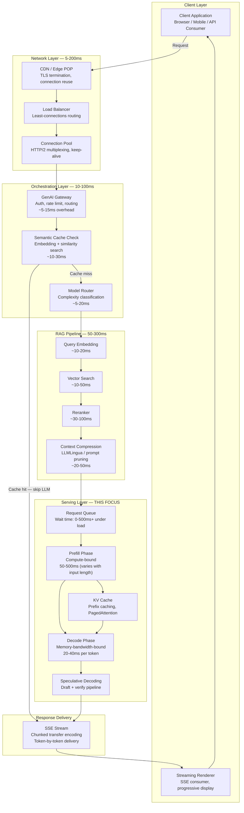
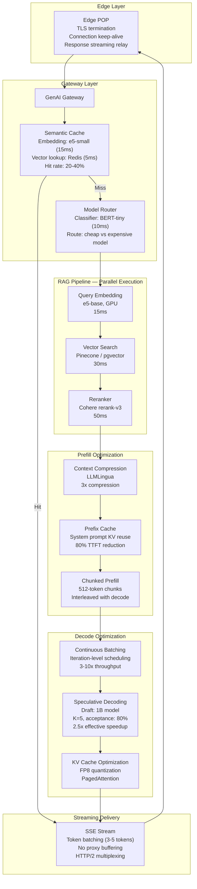
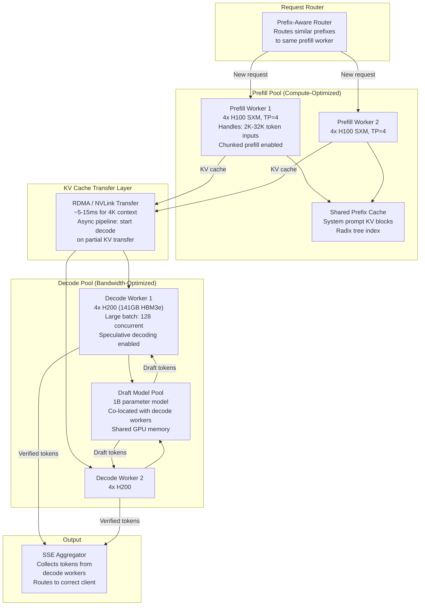

# Latency Optimization for LLM Applications

## 1. Overview

Latency optimization in LLM applications is the systematic practice of minimizing time-to-response across every stage of the inference pipeline -- from network ingress and prompt processing through token generation to final response delivery. Unlike traditional web services where p99 latency might be 200ms, LLM applications face a fundamentally different challenge: autoregressive generation means response time scales linearly with output length, and the user perceives quality through the speed at which tokens appear on screen, not just total completion time. For Principal AI Architects, latency optimization is not a single knob -- it is a multi-stage pipeline problem where each stage has distinct bottlenecks (compute-bound prefill, memory-bandwidth-bound decode, network-bound streaming) requiring different optimization strategies.

The three metrics that define LLM latency are deeply interconnected yet independently tunable:

- **TTFT (Time to First Token):** The interval from request receipt to the first output token streamed to the client. Dominated by prefill computation and queue wait time. Directly impacts perceived responsiveness -- users abandon interactions when TTFT exceeds 2-3 seconds.
- **TPS / ITL (Tokens Per Second / Inter-Token Latency):** The rate at which output tokens appear after the first token. ITL is the inverse of TPS. Determines whether streaming text feels fluent (>30 TPS) or stuttering (<10 TPS). Dominated by decode phase memory bandwidth.
- **E2E Latency (End-to-End):** Total time from request submission to final token delivery. E2E = TTFT + (output_tokens - 1) x ITL. This is what matters for non-streaming use cases (batch processing, tool calls, structured output).

**Key numbers that frame latency optimization decisions:**

- TTFT for 2K input tokens on H100 (70B FP16, TP=4): ~80-150ms (model only), 200-500ms (with queue, network)
- ITL for 70B FP16 on H100 (TP=4): ~20-40ms per token per request (varies with batch size)
- Speculative decoding: 2-3x effective TPS improvement with well-matched draft model (70-85% acceptance rate)
- Prefix caching: 50-90% TTFT reduction proportional to shared prefix length
- Chunked prefill: 3-5x reduction in worst-case decode stalls
- Streaming (SSE) adds ~1-3ms per token of network overhead but reduces perceived latency by 5-20x
- Edge deployment reduces network RTT from 50-200ms (cross-region) to 5-20ms (same-region)
- RAG pipeline latency budget: embedding ~20ms + vector search ~30ms + reranking ~50ms + LLM prefill ~150ms + decode ~2-10s

---

## 2. Where It Fits in GenAI Systems

Latency optimization touches every layer of a GenAI stack. It is not confined to the model serving layer -- network, orchestration, retrieval, and response delivery all contribute measurably to E2E latency. The architect must understand where time is spent across the full request lifecycle.



**Upstream dependencies:** The orchestration layer (model router, semantic cache, RAG pipeline) adds 50-300ms before the LLM is ever invoked. Optimizing these stages is often higher-leverage than optimizing the model itself for short-generation tasks.

**Downstream dependencies:** Response delivery via SSE determines how quickly the client renders tokens. Network quality, connection reuse, and client-side rendering performance all affect perceived latency.

**Key insight:** For a typical RAG chatbot generating 200 tokens, E2E latency breaks down approximately as: network 20ms + gateway 10ms + RAG 150ms + queue wait 50ms + prefill 150ms + decode 4000ms + streaming overhead 50ms = ~4.4 seconds. Decode dominates. But for a short-answer tool call generating 20 tokens, the breakdown shifts: network 20ms + gateway 10ms + prefill 150ms + decode 400ms = ~580ms, and prefill becomes the dominant factor.

---

## 3. Core Concepts

### 3.1 Latency Metrics Deep Dive

**TTFT (Time to First Token)** measures the user's wait before any visible progress. It compounds:

1. **Network latency**: Client-to-server RTT. Typically 5-20ms same-region, 50-200ms cross-region, 200-500ms intercontinental.
2. **Queue wait time**: Time the request spends waiting for GPU resources. Under load, this can be the dominant factor -- 0ms at low utilization, seconds at saturation.
3. **Prefill computation**: Processing the entire input sequence through the Transformer stack. Scales linearly with input length: ~10ms per 1K input tokens on H100 (70B FP16, TP=4).
4. **First token sampling**: A single decode step after prefill to produce the first output token. Negligible (~1ms).

**TTFT optimization priority order:** Queue wait (scheduling) > prefill (chunked prefill, prefix caching) > network (edge deployment) > first-token decode (negligible).

**ITL (Inter-Token Latency)** is the steady-state generation speed. It depends on:

1. **Model size and quantization**: Smaller models and aggressive quantization reduce per-token cost.
2. **Batch size**: Higher batch sizes amortize weight reads, improving per-token throughput but increasing individual request ITL. This is the fundamental throughput-latency tradeoff.
3. **KV cache size**: As context grows, attention computation per token increases. ITL grows logarithmically with context length (due to FlashAttention's tiling).
4. **Memory bandwidth**: Decode is memory-bandwidth-bound. H100 HBM3: 3.35 TB/s, A100 HBM2e: 2.0 TB/s. ITL scales inversely with bandwidth.

**E2E Latency** = TTFT + (N_output - 1) x ITL. For a 200-token response with TTFT=300ms and ITL=30ms: E2E = 300 + 199 x 30 = 6.27s. Reducing ITL by 5ms saves 995ms -- nearly a second.

### 3.2 Streaming Responses

Streaming is the single most impactful UX optimization for LLM applications. Without streaming, the user sees nothing until the entire response is generated (5-30 seconds). With streaming, the first tokens appear in 200-500ms, and text flows continuously.

**Server-Sent Events (SSE):**
- Unidirectional server-to-client channel over HTTP
- Content-Type: `text/event-stream`
- Each token (or token batch) is sent as a `data:` event
- Client receives tokens incrementally and renders them progressively
- Connection persists for the duration of generation
- Reconnection handled via `Last-Event-ID` header

**Chunked Transfer Encoding:**
- HTTP/1.1 `Transfer-Encoding: chunked` allows response body to be sent incrementally
- Lower-level than SSE; SSE builds on top of chunked transfer
- Used by OpenAI and Anthropic APIs for streaming responses

**Why streaming matters beyond UX:**
- **Parallel processing**: Client can begin processing early tokens (rendering markdown, executing code blocks) while later tokens are still generating
- **Early termination**: User can stop generation if the response is going in the wrong direction, saving compute and cost
- **Perceived latency**: Users rate a 10-second streamed response as faster than a 5-second non-streamed response in A/B tests
- **Connection management**: Long-lived SSE connections require careful proxy/load balancer configuration (disable response buffering, increase timeouts)

**Implementation considerations:**
- Reverse proxies (NGINX, HAProxy) must disable response buffering for SSE endpoints
- CDNs may buffer responses -- use `Cache-Control: no-cache` and `X-Accel-Buffering: no`
- HTTP/2 multiplexing allows multiple concurrent SSE streams over a single TCP connection
- Token batching: Sending every single token as a separate SSE event adds overhead; batching 3-5 tokens per event reduces network overhead while maintaining fluent streaming

### 3.3 Speculative Decoding

Speculative decoding is the most impactful single technique for reducing ITL, achieving 2-3x speedup for autoregressive generation without any quality degradation.

**Core principle:** Use a small, fast "draft" model to generate K candidate tokens cheaply, then verify all K tokens in a single forward pass of the large "target" model. Accepted tokens are guaranteed to be sampled from the target model's distribution (no quality loss).

**Step-by-step:**

1. **Draft phase**: Small model (e.g., LLaMA 3.1 1B or a dedicated draft head) generates K tokens autoregressively. Each token costs ~2ms on H100, so K=5 costs ~10ms.
2. **Verification phase**: Target model (e.g., LLaMA 3.1 70B) processes all K draft tokens in a single forward pass. This costs roughly the same as one prefill step for K tokens (~15-25ms for K=5 on H100 TP=4).
3. **Acceptance**: Compare draft model probabilities with target model probabilities at each position using a modified rejection sampling scheme. Accept the longest prefix where draft tokens match the target distribution. On average, 3-4 out of 5 tokens are accepted.
4. **Correction**: If a token is rejected at position i, sample a new token from an adjusted distribution at position i. All tokens after position i are discarded.
5. **Net result**: Generate ~4 tokens in ~25ms instead of ~4 x 25ms = 100ms. Effective speedup: ~3-4x for this step.

**Speculative decoding variants:**

| Variant | Draft Mechanism | Acceptance Rate | Speedup | Framework Support |
|---------|----------------|-----------------|---------|-------------------|
| **Standard (separate draft model)** | Small model (1B-7B) | 70-85% | 2-3x | vLLM, TensorRT-LLM, SGLang |
| **Medusa** | Multiple parallel draft heads attached to target model | 60-80% | 1.5-2.5x | vLLM, SGLang |
| **EAGLE** | Feature-level autoregression on target model hidden states | 75-90% | 2-4x | vLLM, SGLang |
| **Self-speculative** | Target model with early exit (fewer layers for draft) | 65-80% | 1.5-2x | Research |
| **Lookahead** | N-gram lookup from generation history | 50-70% | 1.3-2x | SGLang |

**When speculative decoding hurts:**
- Short outputs (<10 tokens): Overhead of draft + verify exceeds savings
- Highly creative/unpredictable generation (low temperature on diverse topics): Draft model acceptance rate drops below 50%
- Memory-constrained environments: Draft model consumes additional GPU memory
- Batch-heavy workloads: Speculative decoding adds complexity to continuous batching (rejected tokens waste batch slots)

### 3.4 Disaggregated Serving

Disaggregated serving separates the prefill and decode phases onto different GPU pools, allowing each phase to be independently optimized and scaled. This is the frontier architecture for high-throughput, low-latency serving at scale.

**Why disaggregate:**

In co-located serving, prefill and decode share the same GPUs. A long-context prefill (e.g., 32K tokens) can take 500ms-2s, during which all decode iterations for in-flight requests are stalled. This causes ITL spikes (decode jitter) and TTFT unpredictability. Disaggregation eliminates this interference.

**Architecture:**

- **Prefill pool**: Optimized for compute throughput. These GPUs run the compute-bound prefill phase at high utilization. Can use GPUs with high TFLOPS but moderate HBM (e.g., H100 SXM with 80GB).
- **Decode pool**: Optimized for memory bandwidth and capacity. These GPUs run the memory-bandwidth-bound decode phase with large batch sizes. Benefit from high HBM capacity (e.g., H200 with 141GB HBM3e) to support more concurrent decoding requests.
- **KV cache transfer**: After prefill completes, the computed KV cache is transferred from the prefill worker to a decode worker. Transfer latency: ~1-3ms over NVLink (within node), ~5-15ms over RDMA/InfiniBand (across nodes).

**Scaling implications:**
- Prefill and decode pools scale independently based on their respective bottlenecks
- Prefill pool scales with input throughput (requests/sec x avg input tokens)
- Decode pool scales with concurrent generation count (active responses x avg output length)
- Traffic patterns that are prefill-heavy (long inputs, short outputs) vs decode-heavy (short inputs, long outputs) require different pool ratios

**Production implementations:**
- **Splitwise (Microsoft)**: The original research paper demonstrating disaggregated serving benefits. Showed 1.4x throughput improvement on LLaMA 2 70B.
- **DistServe (Peking University)**: Formalized the goodput-optimized placement problem. Demonstrated 2x throughput improvement with strict SLO targets.
- **Fireworks AI FireAttention**: Production disaggregated serving powering their API. Achieves p50 TTFT of 200ms at high load.
- **Mooncake (Moonshot AI)**: KV cache-centric disaggregated architecture with a distributed KV cache pool shared across prefill and decode workers.

### 3.5 Prefill Optimization

Prefill is the compute-bound phase that dominates TTFT. Optimizing it directly reduces time-to-first-token.

**Chunked prefill:**
Instead of processing the entire input sequence in one monolithic computation, chunked prefill breaks the input into smaller chunks (e.g., 512-2048 tokens) and interleaves prefill chunks with decode iterations. This prevents long prefills from blocking decode.

- TTFT for the chunked request increases slightly (chunk scheduling overhead)
- But ITL for all other in-flight requests remains stable (no decode stalls)
- Net effect: p99 ITL improves 3-5x under mixed workloads
- vLLM: `--enable-chunked-prefill --max-num-batched-tokens 2048`

**Prefix caching:**
When multiple requests share a common prefix (system prompt, few-shot examples, RAG context template), the KV cache for that prefix is computed once and reused.

- vLLM automatic prefix caching: Hash-based prefix deduplication. Zero configuration.
- SGLang RadixAttention: Radix tree for efficient longest-prefix-match. Best for multi-turn conversations.
- Anthropic prompt caching API: Server-side caching with 90% input token cost reduction.
- OpenAI automatic caching: 50% discount on cached input tokens.
- TTFT reduction: proportional to prefix length. 2K shared prefix with 500 unique tokens = ~80% TTFT reduction.

**Prompt compression:**
Reduce the number of input tokens without losing critical information.

- **LLMLingua / LongLLMLingua**: Use a small model to identify and remove low-information tokens. Achieves 2-10x compression with <5% quality loss on many tasks.
- **Selective context**: Drop retrieved passages below a relevance threshold.
- **Structured formatting**: JSON/YAML format for structured data uses fewer tokens than natural language descriptions.

### 3.6 Decode Optimization

Decode phase generates tokens one at a time and is memory-bandwidth-bound. Each decode step reads the entire model weights (~140 GB for 70B FP16) and the KV cache from HBM.

**Continuous batching:**
The most fundamental decode optimization. By batching multiple requests together, the weight read cost is amortized: reading 140GB of weights once to produce tokens for 32 requests is 32x more efficient than reading them 32 times for 1 request each. All modern serving frameworks implement this.

**KV cache compression:**
- **FP8 KV cache**: Store KV cache in FP8 instead of FP16. Halves KV cache memory, allowing 2x more concurrent requests with <0.5% quality loss. Supported in vLLM and TensorRT-LLM.
- **Grouped-Query Attention (GQA)**: Architectural optimization (not a serving-time optimization) that reduces KV heads from N to N/G, reducing KV cache size by G x. LLaMA 3 uses GQA with 8 KV heads vs 64 query heads (8x reduction).
- **KV cache eviction**: For very long sequences, evict attention entries that receive low attention scores (e.g., H2O: Heavy-Hitter Oracle). Maintains quality for long contexts with bounded memory.

**Quantized inference:**
Quantization reduces model weight size, directly improving decode throughput by reducing memory reads.
- FP8 on H100: 1.5-2x decode throughput via Transformer Engine
- INT4 (GPTQ/AWQ): 2-3x throughput improvement, ~1-3% quality degradation
- KV cache quantization (FP8): Independent of weight quantization, addresses the KV cache memory bottleneck

### 3.7 Network Latency

Network latency is often overlooked but can dominate TTFT for edge-deployed applications and adds constant overhead to every token in streaming mode.

**Edge deployment:**
Deploy model serving infrastructure in regions close to users. For a global application:
- US-East user to US-East GPU: ~10ms RTT
- US-East user to EU-West GPU: ~80ms RTT
- US-East user to Asia GPU: ~200ms RTT

For streaming responses, network RTT adds overhead to every SSE event. With 200 output tokens and 200ms cross-region RTT, network adds ~200ms to E2E (single RTT since SSE is unidirectional after connection establishment), but connection establishment adds 1-3 RTT for TLS handshake.

**Connection pooling and reuse:**
- HTTP/2 multiplexing: Multiple concurrent requests over a single TCP connection. Eliminates per-request TLS handshake (~30-100ms).
- Keep-alive: Reuse TCP connections for subsequent requests from the same client.
- Connection pre-warming: Establish connections to model serving backends during application startup, not on first request.

**Regional model hosting:**
- Deploy model replicas in multiple regions
- Route requests to nearest replica using GeoDNS or anycast
- Tradeoff: Each regional deployment requires dedicated GPU infrastructure (cost multiplier)
- Hybrid approach: Serve from nearest region for latency-sensitive interactive requests, route to a central region for batch/background tasks

### 3.8 Parallel Generation

**Parallel tool calls:**
When an LLM response requires multiple independent tool calls (e.g., search + database lookup + API call), execute them in parallel rather than sequentially. This is an orchestration-level optimization.

- Sequential: tool_1 (200ms) + tool_2 (300ms) + tool_3 (150ms) = 650ms
- Parallel: max(200ms, 300ms, 150ms) = 300ms
- Modern agent frameworks (LangGraph, CrewAI, Anthropic tool_use) support parallel tool execution natively

**Speculative execution:**
When the next step in a pipeline is predictable, start it before the previous step completes.

- Pre-fetch RAG context while the user is still typing (predict likely queries)
- Pre-warm model serving connections before the first request
- Pre-compute embeddings for system prompts at deployment time
- In multi-step agent flows: speculatively start the likely next step while the current step is verifying results

**Parallel generation across models:**
For model routing with confidence checking, run the cheap model and expensive model in parallel, then use the cheap model's result if it passes the confidence check. Wastes expensive model compute on easy queries, but eliminates the latency of sequential cascade.

### 3.9 Latency Budgets for RAG Pipelines

A latency budget allocates the total E2E latency target across pipeline stages, ensuring each stage has a clear SLO and no single stage monopolizes the budget.

**Example: 3-second E2E target for RAG chatbot (200 output tokens):**

| Stage | Budget | Optimization Lever |
|-------|--------|--------------------|
| Network (client to gateway) | 20ms | Edge deployment, connection reuse |
| Gateway (auth, rate limit, routing) | 15ms | In-memory auth, pre-computed routing |
| Semantic cache check | 25ms | In-memory cache, fast embedding model |
| Query embedding | 15ms | Small embedding model (e5-small), GPU inference |
| Vector search | 30ms | HNSW with ef_search tuning, in-memory index |
| Reranking | 50ms | Cross-encoder with early termination, limit to top-20 |
| Context assembly + compression | 20ms | Pre-computed templates, LLMLingua on GPU |
| LLM queue wait | 25ms | Autoscaling, capacity planning |
| LLM prefill | 100ms | Prefix caching, chunked prefill |
| LLM decode (200 tokens x 30ms ITL) | 2500ms (streamed) | Speculative decoding, FP8, model selection |
| Streaming overhead | 10ms | SSE tuning, disable buffering |
| **Total** | **~2810ms** | |

The decode phase consumes ~89% of the budget. The primary optimization levers are: (1) speculative decoding to reduce effective ITL, (2) model routing to use a smaller model for simple queries, and (3) output length control to limit generation.

---

## 4. Architecture

### 4.1 End-to-End Latency Optimization Architecture



### 4.2 Disaggregated Prefill/Decode with Speculative Decoding



### 4.3 Latency Budget Waterfall

```mermaid
gantt
    title RAG Chatbot Latency Budget (3s target, 200 output tokens)
    dateFormat X
    axisFormat %Lms

    section Network
    TLS + RTT              :0, 20

    section Gateway
    Auth + Route           :20, 35

    section Cache
    Semantic Cache Check   :35, 60

    section RAG
    Query Embedding        :60, 75
    Vector Search          :75, 105
    Reranking             :105, 155
    Context Compression    :155, 175

    section LLM Prefill
    Queue Wait             :175, 200
    Prefill (with prefix cache) :200, 300

    section LLM Decode
    Token 1-50 (streamed)  :300, 800
    Token 51-100           :800, 1300
    Token 101-150          :1300, 1800
    Token 151-200          :1800, 2300

    section Delivery
    SSE Finalization        :2300, 2310
```



---

## 5. Design Patterns

### Pattern 1: Tiered Latency Architecture

**When to use:** Applications serving diverse query types where some queries require fast, simple responses and others require deep reasoning.

**Architecture:** Implement a model router that classifies incoming queries by complexity and routes them to appropriate model tiers:
- **Tier 1 (Ultra-low latency, <500ms E2E)**: Small model (8B), short context, no RAG. For greetings, simple Q&A, classification tasks.
- **Tier 2 (Standard latency, <3s E2E)**: Mid-tier model (70B), RAG pipeline, streaming. For general knowledge queries, summarization.
- **Tier 3 (Extended latency, <15s E2E)**: Frontier model (400B+), multi-step reasoning, agent loops. For complex analysis, code generation, multi-hop reasoning.

Each tier has independent latency budgets and SLOs. The router adds ~10-20ms but saves seconds by avoiding over-provisioning expensive models for simple queries.

### Pattern 2: Streaming-First with Progressive Enhancement

**When to use:** Any user-facing LLM application where perceived responsiveness matters.

**Architecture:**
1. Begin streaming tokens immediately via SSE as they are generated
2. Client renders markdown progressively (headings, paragraphs, code blocks appear as they are completed)
3. For structured responses (JSON, function calls): stream partial results and assemble client-side, or use server-side buffering with a progress indicator
4. Implement client-side speculative rendering: display a typing indicator with estimated completion time based on average TPS

**Key implementation detail:** The streaming contract must handle partial UTF-8 sequences (a single Unicode character may span multiple tokens), partial markdown (an incomplete code fence), and partial JSON (streaming partial objects). Modern detokenizers and client libraries handle these edge cases.

### Pattern 3: Aggressive Prefix Caching with Prefix-Aware Routing

**When to use:** Applications with repetitive system prompts, few-shot examples, or RAG templates that are shared across many requests.

**Architecture:**
1. Standardize system prompts into a small set of templates (5-20 variations)
2. Pre-warm prefix caches by sending dummy requests with each template at deployment time
3. Implement prefix-aware load balancing: hash the prefix and route to the replica where that prefix is cached
4. Monitor prefix cache hit rate. Target: >60% for conversational workloads, >80% for templated RAG

**Impact:** With a 3K-token shared prefix and 500-token unique input, prefix caching reduces TTFT from ~250ms to ~50ms and saves 3000 input tokens of compute cost per request.

### Pattern 4: Parallel Pipeline with Timeout Fallback

**When to use:** RAG pipelines where retrieval and model inference can be partially parallelized.

**Architecture:**
1. Start query embedding and vector search immediately (parallel with any pre-processing)
2. Start LLM prefill with a "provisional" context while reranking runs in parallel
3. If reranking completes before prefill finishes, update context (requires canceling and restarting prefill)
4. Alternative: set a strict timeout on reranking (50ms), use raw vector search results if reranker exceeds timeout
5. For multi-step agent flows: speculatively execute the most likely next tool call while the model is still generating

### Pattern 5: Latency-Aware Autoscaling

**When to use:** Production deployments with variable traffic patterns.

**Architecture:**
- Scale on **p99 TTFT** and **queue depth**, not GPU utilization alone
- GPU utilization can be 90%+ while latency is acceptable (if batch sizes are optimal)
- Queue depth > threshold (e.g., 50 requests) triggers scale-up
- p99 TTFT exceeding SLO (e.g., >1s) triggers emergency scale-up
- Scale-down based on sustained low queue depth (not instantaneous, to avoid thrashing)
- Model loading takes 60-120 seconds -- over-provision by 20% to handle burst traffic during scale-up lag

---

## 6. Implementation Approaches

### 6.1 Streaming SSE Server (Python/FastAPI)

```python
# FastAPI SSE endpoint for streaming LLM responses
from fastapi import FastAPI
from fastapi.responses import StreamingResponse
from openai import AsyncOpenAI
import json
import time

app = FastAPI()
client = AsyncOpenAI()

@app.post("/v1/chat/stream")
async def stream_chat(request: ChatRequest):
    start_time = time.monotonic()

    async def generate():
        ttft_recorded = False
        token_count = 0

        stream = await client.chat.completions.create(
            model=request.model,
            messages=request.messages,
            stream=True,
            max_tokens=request.max_tokens,
            temperature=request.temperature,
        )

        async for chunk in stream:
            if chunk.choices[0].delta.content:
                token = chunk.choices[0].delta.content
                token_count += 1

                if not ttft_recorded:
                    ttft = time.monotonic() - start_time
                    ttft_recorded = True
                    # Emit TTFT as first SSE event for monitoring
                    yield f"data: {json.dumps({'ttft_ms': ttft * 1000})}\n\n"

                yield f"data: {json.dumps({'token': token})}\n\n"

        e2e = time.monotonic() - start_time
        yield f"data: {json.dumps({'done': True, 'e2e_ms': e2e * 1000, 'tokens': token_count})}\n\n"

    return StreamingResponse(
        generate(),
        media_type="text/event-stream",
        headers={
            "Cache-Control": "no-cache",
            "Connection": "keep-alive",
            "X-Accel-Buffering": "no",  # Disable NGINX buffering
        },
    )
```

### 6.2 Speculative Decoding with vLLM

```bash
# Launch vLLM with speculative decoding enabled
# Draft model: Meta-Llama-3.1-8B (small, fast)
# Target model: Meta-Llama-3.1-70B-Instruct (large, accurate)
vllm serve meta-llama/Meta-Llama-3.1-70B-Instruct \
    --tensor-parallel-size 4 \
    --speculative-model meta-llama/Meta-Llama-3.1-8B \
    --num-speculative-tokens 5 \
    --speculative-draft-tensor-parallel-size 1 \
    --enable-prefix-caching \
    --enable-chunked-prefill \
    --gpu-memory-utilization 0.90 \
    --max-model-len 8192 \
    --port 8000
```

### 6.3 Latency Monitoring Dashboard (Prometheus + Grafana)

```yaml
# Prometheus alerting rules for LLM latency SLOs
groups:
  - name: llm_latency_slos
    rules:
      - alert: HighTTFT
        expr: histogram_quantile(0.99, rate(vllm_request_ttft_seconds_bucket[5m])) > 2.0
        for: 5m
        labels:
          severity: warning
        annotations:
          summary: "p99 TTFT exceeds 2 seconds"
          description: >
            p99 TTFT is {{ $value | humanizeDuration }}.
            Check queue depth and consider scaling up prefill workers.

      - alert: HighITL
        expr: histogram_quantile(0.99, rate(vllm_request_itl_seconds_bucket[5m])) > 0.1
        for: 5m
        labels:
          severity: warning
        annotations:
          summary: "p99 inter-token latency exceeds 100ms"

      - alert: QueueDepthHigh
        expr: vllm_num_requests_waiting > 100
        for: 2m
        labels:
          severity: critical
        annotations:
          summary: "Request queue depth exceeds 100"
          description: "Immediate scale-up required to meet latency SLOs"

      - alert: KVCacheNearFull
        expr: vllm_gpu_cache_usage_perc > 0.90
        for: 1m
        labels:
          severity: critical
        annotations:
          summary: "KV cache utilization above 90%"
          description: "Risk of request preemption and TTFT spikes"
```

### 6.4 NGINX Configuration for SSE Streaming

```nginx
# NGINX reverse proxy configuration optimized for LLM streaming
upstream llm_backend {
    server llm-serving-1:8000;
    server llm-serving-2:8000;
    keepalive 64;  # Connection pool to backends
}

server {
    listen 443 ssl http2;

    location /v1/chat/completions {
        proxy_pass http://llm_backend;

        # Critical for SSE streaming
        proxy_buffering off;           # Disable response buffering
        proxy_cache off;               # Disable caching
        proxy_set_header Connection '';  # Enable keep-alive to upstream
        proxy_http_version 1.1;        # Required for chunked transfer

        # Timeout for long-running generation
        proxy_read_timeout 300s;       # 5 min for long responses
        proxy_send_timeout 300s;

        # Headers for SSE
        add_header Cache-Control 'no-cache';
        add_header X-Accel-Buffering 'no';

        # Connection reuse
        proxy_set_header Connection "";
    }
}
```

---

## 7. Tradeoffs

### Latency vs Throughput

| Decision Factor | Optimize for Latency | Optimize for Throughput | Balanced |
|----------------|---------------------|------------------------|----------|
| **Batch size** | Small (1-8) | Large (32-256) | Medium (16-64) |
| **TTFT** | Lowest (50-200ms) | Higher (200-2000ms) | Moderate (100-500ms) |
| **ITL** | Lowest (15-25ms) | Higher (30-80ms) | Moderate (25-40ms) |
| **GPU utilization** | Low (30-50%) | High (80-95%) | Medium (60-80%) |
| **Cost per token** | Highest | Lowest | Moderate |
| **Best for** | Real-time chat, tool calls | Batch processing, offline | General production |

### Speculative Decoding Decision

| Decision Factor | Standard Decode | Speculative Decoding | Medusa/EAGLE |
|----------------|----------------|---------------------|--------------|
| **ITL improvement** | Baseline | 2-3x | 1.5-2.5x |
| **Additional GPU memory** | None | +1-7GB (draft model) | +200-500MB (heads) |
| **Implementation complexity** | None | Medium | Medium |
| **Quality impact** | None | None (mathematically exact) | None (Medusa) / Minimal (EAGLE) |
| **Batch interaction** | None | Complex (rejected tokens waste slots) | Simpler (heads are lightweight) |
| **Best for** | Simple deployments | Single-request low-latency | High-batch production |

### Prefill Optimization Strategy

| Decision Factor | No Optimization | Prefix Caching | Chunked Prefill | Disaggregated Serving |
|----------------|----------------|----------------|-----------------|----------------------|
| **TTFT reduction** | Baseline | 50-90% (shared prefix) | Minimal (may increase slightly) | Best p99 predictability |
| **ITL impact** | Baseline | None | 3-5x fewer decode stalls | No decode interference |
| **Memory overhead** | None | Prefix cache pool (5-15% GPU) | None | KV transfer buffer |
| **Implementation complexity** | None | Low (framework flag) | Low (framework flag) | High (separate pools) |
| **When to choose** | Never in production | Always enable | Always enable | >100 concurrent, strict SLOs |

### Edge vs Central Deployment

| Decision Factor | Central (single region) | Multi-Region | Edge (many POPs) |
|----------------|------------------------|--------------|------------------|
| **Network RTT** | 50-200ms (cross-region) | 10-50ms | 5-20ms |
| **GPU cost** | 1x (shared fleet) | 2-5x (replicated) | 5-20x (many small deployments) |
| **Model freshness** | Instant updates | Minutes (replication lag) | Hours (edge sync) |
| **Operational complexity** | Low | Medium | High |
| **Best for** | API products, batch | Global consumer apps | Latency-critical edge AI |

---

## 8. Failure Modes

| Failure Mode | Symptom | Root Cause | Mitigation |
|-------------|---------|------------|------------|
| **TTFT spike under load** | TTFT jumps from 200ms to 5-10s | Queue saturation: more requests arriving than prefill capacity. Long-context requests monopolize prefill. | Enable chunked prefill, implement admission control (reject/queue when depth > threshold), autoscale on queue depth not GPU utilization |
| **Decode jitter (ITL spikes)** | Tokens arrive in bursts: 30ms, 30ms, 500ms, 30ms | Co-located prefill stealing GPU cycles from decode. Memory pressure causing KV cache swaps to CPU. | Disaggregate prefill/decode, enable chunked prefill, reduce max concurrent requests, monitor KV cache utilization |
| **Streaming connection drop** | Client receives partial response, connection reset | SSE connection timeout (proxy or LB terminates idle connections). Long generation exceeds proxy timeout. | Increase proxy_read_timeout (5+ minutes), implement SSE heartbeat events (empty data every 15s), client-side reconnection with Last-Event-ID |
| **Speculative decoding regression** | Latency worse than standard decode | Draft model acceptance rate <50% for the workload. Draft model too large (draft overhead exceeds savings). | Monitor acceptance rate per request, dynamically disable speculative decoding when acceptance rate drops, use workload-specific draft models |
| **Prefix cache thrashing** | Cache hit rate <10%, TTFT increases | Diverse prompts with no shared prefixes. Cache eviction rate too high (cache too small). | Increase cache memory budget, standardize system prompts, use prefix-aware routing, evaluate if prefix caching suits the workload |
| **Network buffering breaks streaming** | Tokens arrive in large batches instead of individually | Reverse proxy (NGINX, CloudFront, ALB) buffering response. TCP Nagle algorithm batching small packets. | Disable proxy buffering (`proxy_buffering off`), set `TCP_NODELAY`, use `X-Accel-Buffering: no`, disable CDN response buffering |
| **Cross-region latency penalty** | Consistent 200ms+ TTFT even at low load | Model serving in US-East, user in Asia. Every SSE event pays cross-region RTT for TCP ACK. | Deploy regional replicas, use anycast routing, or accept the tradeoff for cost savings |
| **Queue starvation for short requests** | Simple queries (expecting 50ms TTFT) wait 2s+ behind long-context requests | FIFO queue: short requests queued behind 32K-token prefill requests | Implement priority queues (short-input requests get higher priority), separate queues by estimated prefill cost |

---

## 9. Optimization Techniques

### 9.1 TTFT Optimization Priority

| Technique | TTFT Reduction | Effort | Prerequisites |
|-----------|---------------|--------|---------------|
| **Prefix caching** | 50-90% | Low (framework flag) | Shared prefixes across requests |
| **Chunked prefill** | Reduces p99 by 3-5x | Low (framework flag) | vLLM or TRT-LLM |
| **FP8 quantization** | ~40% (faster compute) | Medium (engine rebuild) | H100/H200 GPU |
| **Prompt compression (LLMLingua)** | 30-70% (fewer input tokens) | Medium (pipeline change) | Quality tolerance for lossy compression |
| **Regional deployment** | 30-150ms (network RTT) | High (infra duplication) | Budget for multi-region GPU |
| **Disaggregated prefill** | Best p99 predictability | High (architecture change) | >100 concurrent requests |
| **Smaller model for simple queries** | 60-80% (proportional to param ratio) | Medium (router needed) | Model router with complexity classifier |

### 9.2 ITL / TPS Optimization Priority

| Technique | ITL Improvement | Throughput Impact | Quality Impact |
|-----------|----------------|-------------------|----------------|
| **Speculative decoding** | 2-3x | Neutral to slight decrease | None (mathematically exact) |
| **FP8 inference** | 1.5-2x | 1.5-2x increase | <0.5% degradation |
| **INT4 quantization (AWQ)** | 2-3x | 2-3x increase | 1-3% degradation |
| **Continuous batching** | Slight increase per-request | 3-10x increase | None |
| **KV cache FP8** | Indirect (supports larger batches) | 1.3-1.5x increase | <0.5% degradation |
| **Larger batch size** | Increases (tradeoff) | Increases | None |

### 9.3 System-Level Optimizations

| Technique | Impact | Scope |
|-----------|--------|-------|
| **HTTP/2 multiplexing** | Eliminates per-request TLS handshake (~30-100ms) | Network |
| **Connection pooling to backend** | Eliminates TCP setup for subsequent requests | Network |
| **Disable NGINX response buffering** | Eliminates proxy-induced token batching | Streaming |
| **TCP_NODELAY** | Eliminates Nagle's algorithm delay (~40ms) | Streaming |
| **Pre-warm prefix caches** | First request to each prefix gets cached TTFT | Prefill |
| **Async RAG pipeline** | Overlap embedding + vector search + reranking | Orchestration |
| **Token batching in SSE (3-5 tokens)** | Reduces per-event overhead while maintaining fluency | Streaming |
| **Client-side progressive rendering** | Display partial markdown/code as it streams | UX |

---

## 10. Real-World Examples

### Anthropic -- Prompt Caching for TTFT and Cost

Anthropic's prompt caching feature caches the KV cache for repeated prefixes server-side across requests. When a cached prefix is detected, prefill is skipped for those tokens, reducing TTFT proportionally. Pricing: cached input tokens cost 90% less than uncached tokens. For a customer with a 4K-token system prompt sending 1M requests/day, this reduces input token costs by ~$9,000/day and TTFT by ~80%. Anthropic's implementation uses content hashing to detect cacheable prefixes automatically when the `cache_control` parameter is set.

### OpenAI -- Predicted Outputs and Automatic Caching

OpenAI implements automatic prompt caching (50% discount on cached input tokens) and "predicted outputs" for code editing use cases. Predicted outputs allow the client to send the expected output along with the request; the model verifies and modifies the prediction rather than generating from scratch. For code refactoring tasks where 90% of the output is unchanged, this reduces generation tokens by ~90% and E2E latency proportionally. Their streaming implementation uses `text/event-stream` with JSON-encoded delta objects, allowing client-side progressive rendering.

### Fireworks AI -- Disaggregated Serving at Scale

Fireworks AI operates one of the lowest-latency commercial LLM APIs. Their FireAttention architecture disaggregates prefill and decode across separate GPU pools, with KV cache migration over RDMA. They report p50 TTFT of 200ms and p99 of 800ms for LLaMA 3 70B at high load -- 2-3x better than co-located architectures. Their decode pool uses speculative decoding with custom draft models matched to each target model, achieving 180+ effective tokens/second for LLaMA 3.1 8B.

### Groq -- LPU Architecture for Ultra-Low Latency

Groq's Language Processing Unit (LPU) is custom silicon designed specifically for LLM inference. By eliminating the memory bandwidth bottleneck of GPU-based serving (their architecture uses SRAM instead of HBM for weight storage), Groq achieves 500+ tokens/second output rate for LLaMA 3 70B -- 5-10x faster than GPU-based serving. TTFT is consistently under 300ms. The tradeoff is limited model support and higher per-token cost at low utilization. Groq demonstrates that the ITL bottleneck is fundamentally a hardware architecture problem.

### Vercel AI SDK -- Streaming-First Developer Experience

Vercel's AI SDK provides streaming-first abstractions for Next.js applications. Their `useChat` React hook handles SSE connection management, progressive rendering, and automatic reconnection. The SDK implements client-side token buffering for smooth rendering and exposes `onToken` callbacks for real-time latency monitoring. By making streaming the default (not an opt-in), Vercel ensures that applications built on their platform deliver sub-second perceived latency even when E2E generation takes 5-10 seconds.

### Cloudflare Workers AI -- Edge-Deployed LLM Inference

Cloudflare deploys LLM inference at over 100 edge locations globally. Their Workers AI platform runs quantized models (LLaMA, Mistral) on NVIDIA GPUs co-located with Cloudflare's edge POPs. For a user in Tokyo accessing a model deployed to the Tokyo POP, network RTT is <5ms versus >150ms to a US-based API. Their streaming implementation uses Cloudflare's edge network to relay SSE events with minimal buffering. The tradeoff is limited model selection (smaller quantized models only) and lower throughput per location.

---

## 11. Related Topics

- **[Model Serving Infrastructure](../llm-architecture/model-serving.md):** Serving frameworks (vLLM, TensorRT-LLM, TGI, SGLang) that implement the latency optimization techniques discussed here
- **[KV Cache Management](../llm-architecture/kv-cache.md):** PagedAttention, prefix caching, KV cache quantization -- the memory management layer that directly determines TTFT and maximum concurrency
- **[Semantic Caching](semantic-caching.md):** Cache-based latency optimization that eliminates LLM inference entirely for previously seen queries
- **[Model Routing and Cascading](model-routing.md):** Routing simple queries to fast models as a latency optimization strategy
- **[Cost Optimization](cost-optimization.md):** Cost-latency tradeoffs including batch inference, model selection, and quantization decisions
- **[Context Window Management](../prompt-engineering/context-management.md):** Prompt compression, context assembly, and streaming strategies that directly affect prefill latency
- **[Quantization](../llm-architecture/quantization.md):** FP8, INT4, and other quantization methods that reduce memory reads and accelerate both prefill and decode
- **[GPU Compute](../llm-architecture/gpu-compute.md):** Hardware specifications (TFLOPS, memory bandwidth, HBM capacity) that set the physical limits of latency optimization
- **[Load Balancing](../../scalability/load-balancing.md):** Request distribution strategies including prefix-aware routing and least-connections balancing

---

## 12. Source Traceability

| Concept | Primary Source | Year |
|---------|---------------|------|
| Speculative decoding | Leviathan et al., "Fast Inference from Transformers via Speculative Decoding" (Google) | 2023 |
| Medusa (multi-head speculative) | Cai et al., "Medusa: Simple LLM Inference Acceleration Framework with Multiple Decoding Heads" | 2024 |
| EAGLE (feature-level speculation) | Li et al., "EAGLE: Speculative Sampling Requires Rethinking Feature Uncertainty" | 2024 |
| Splitwise (disaggregated serving) | Patel et al., "Splitwise: Efficient Generative LLM Inference Using Phase Splitting" (Microsoft / UW) | 2024 |
| DistServe | Zhong et al., "DistServe: Disaggregating Prefill and Decoding for Goodput-optimized Large Language Model Serving" (Peking Univ.) | 2024 |
| Mooncake | KVCache.AI / Moonshot AI, "Mooncake: A KVCache-centric Disaggregated Architecture for LLM Serving" | 2024 |
| Chunked prefill (Sarathi) | Agrawal et al., "Sarathi: Efficient LLM Inference by Piggybacking Decodes with Chunked Prefills" (Microsoft / Georgia Tech) | 2024 |
| LLMLingua (prompt compression) | Jiang et al., "LLMLingua: Compressing Prompts for Accelerated Inference of Large Language Models" (Microsoft) | 2023 |
| LongLLMLingua | Jiang et al., "LongLLMLingua: Accelerating and Enhancing LLMs in Long Context Scenarios via Prompt Compression" (Microsoft) | 2024 |
| Prefix caching / RadixAttention | Zheng et al., "SGLang: Efficient Execution of Structured Language Model Programs" (LMSYS, UC Berkeley) | 2024 |
| PagedAttention / vLLM | Kwon et al., "Efficient Memory Management for Large Language Model Serving with PagedAttention" (UC Berkeley) | 2023 |
| FlashAttention | Dao et al., "FlashAttention: Fast and Memory-Efficient Exact Attention with IO-Awareness" (Stanford) | 2022 |
| FlashAttention-3 | Shah et al., "FlashAttention-3: Fast and Accurate Attention with Asynchrony and Low-precision" | 2024 |
| H2O (KV cache eviction) | Zhang et al., "H2O: Heavy-Hitter Oracle for Efficient Generative Inference of Large Language Models" | 2023 |
| Groq LPU architecture | Groq Inc., "Groq Language Processing Unit" (product documentation) | 2024 |
| Server-Sent Events specification | WHATWG, "Server-Sent Events" (HTML Living Standard) | 2015 |
| Anthropic prompt caching | Anthropic, "Prompt Caching" (API documentation) | 2024 |
| OpenAI predicted outputs | OpenAI, "Predicted Outputs" (API documentation) | 2024 |
