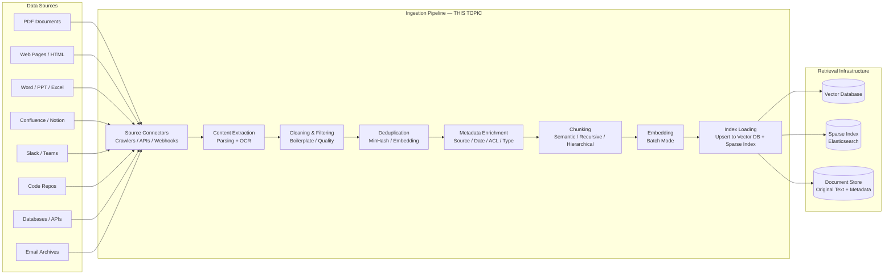
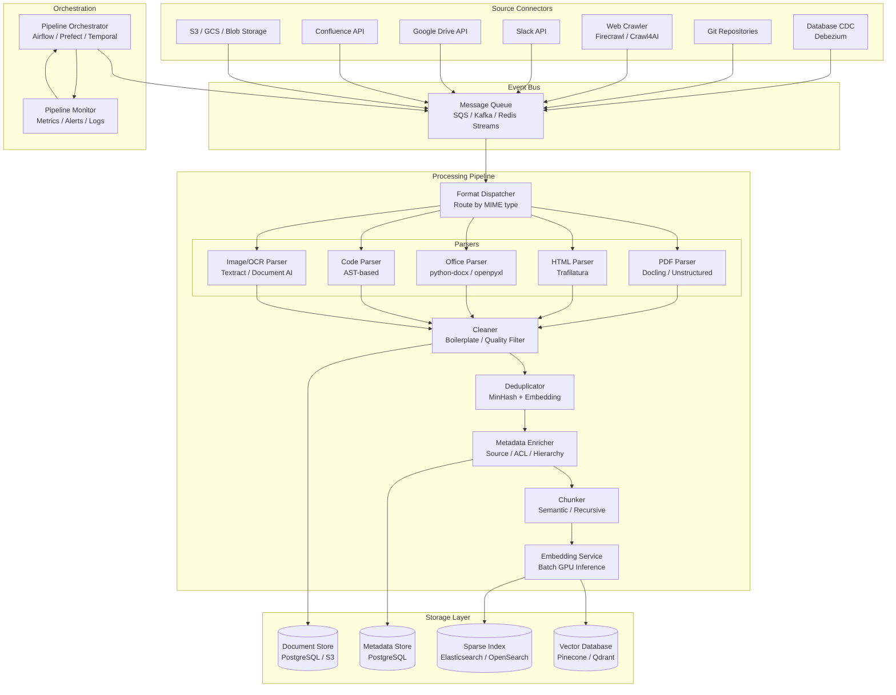
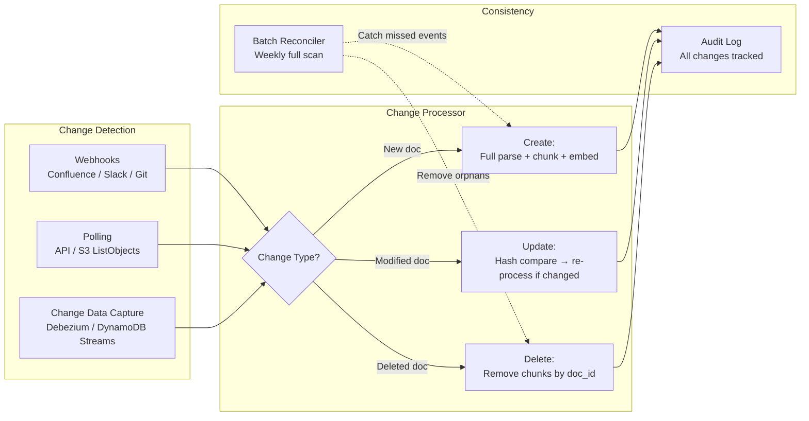

# Document Ingestion Pipelines

## 1. Overview

Document ingestion is the offline pipeline that transforms raw, heterogeneous source documents --- PDFs, HTML pages, Word documents, Slack messages, Confluence pages, emails, code repositories, database records --- into clean, chunked, embedded, and indexed content ready for retrieval. It is the data engineering backbone of every RAG system, and its quality sets the upper bound on retrieval accuracy. No amount of query transformation, reranking, or prompt engineering can compensate for poorly ingested content.

For Principal AI Architects, document ingestion is a deceptively complex data pipeline problem. A single enterprise corpus may contain scanned PDFs with complex table layouts, HTML pages with boilerplate navigation, LaTeX documents with mathematical notation, code repositories with interleaved documentation, and structured database exports. Each format requires a different parser, each parser has different failure modes, and the quality of parsing directly determines whether the downstream RAG system can find and use the information.

**Key numbers that shape ingestion pipeline design:**
- A typical enterprise corpus: 100K--10M documents, 1--100 TB raw data
- PDF parsing accuracy (text extraction): 95--99% for digital PDFs, 70--90% for scanned PDFs
- Table extraction accuracy: 60--85% depending on complexity and tool
- OCR accuracy (modern): 95--99% character-level for clean documents, 80--90% for degraded scans
- Embedding throughput: 500--5,000 pages/minute on a single GPU (depends on chunk size and model)
- Full ingestion pipeline (parse + chunk + embed + index) for 1M documents: 2--12 hours on a single node, 15--60 minutes distributed
- Re-ingestion trigger frequency: weekly for most corpora, daily for rapidly changing sources, real-time for critical data

The ingestion pipeline is the least glamorous and most impactful component of a RAG system. Teams that invest in robust parsing, quality filtering, and metadata enrichment consistently outperform teams that focus on retrieval algorithms alone.

---

## 2. Where It Fits in GenAI Systems

Document ingestion is the first stage of the RAG data plane. It sits between raw data sources and the retrieval infrastructure (vector databases, sparse indexes).

Ingestion interacts with these adjacent systems:
- **Chunking layer** (downstream): Ingestion produces clean text; chunking splits it into retrieval units. In practice, chunking is often a stage within the ingestion pipeline. See [Chunking Strategies](./chunking.md).
- **RAG pipeline** (downstream consumer): The quality of retrieval depends entirely on what was ingested. See [RAG Pipeline](./rag-pipeline.md).
- **Vector database** (downstream): Receives embedded chunks and metadata. See [Vector Databases](../vector-search/vector-databases.md).
- **Access control system** (upstream): ACLs from source systems must be preserved through ingestion and enforced at query time.

---

## 3. Core Concepts

### 3.1 PDF Parsing

PDFs are the most common and most challenging document format in enterprise RAG. A PDF is a visual layout format, not a semantic document format --- it specifies where to draw glyphs on a page, not what the text means or how it's structured.

**Challenges unique to PDFs:**
- **No semantic structure**: A PDF header is just "large bold text at position (x, y)," not an `<h1>` tag. Recovering document structure requires heuristics or models.
- **Multi-column layouts**: Text extraction must follow the correct reading order, not the raw byte order (which may interleave columns).
- **Tables**: PDF tables are just text positioned in a grid pattern. Cells may span rows/columns. Recovering the tabular structure is a separate problem.
- **Embedded images**: Charts, diagrams, and scanned pages within digital PDFs require OCR or vision models.
- **Mathematical notation**: Formulas rendered as positioned glyphs are nearly impossible to extract as LaTeX or MathML from PDF alone.
- **Scanned PDFs (image-only)**: The entire page is a raster image. No text extraction is possible without OCR.

**PDF Parsing Tools --- Production Comparison:**

| Tool | Approach | Layout Understanding | Table Extraction | OCR Support | Speed | Cost |
|------|----------|---------------------|-----------------|-------------|-------|------|
| **PyPDF2 / PyMuPDF** | Rule-based text extraction | None (raw text order) | None | None | Very fast | Free |
| **pdfplumber** | Rule-based with layout analysis | Basic (reading order) | Basic (line-based) | None | Fast | Free |
| **Unstructured** | Hybrid: rules + ML models | Good (hi_res mode uses layout models) | Good (table transformer) | Tesseract / PaddleOCR | Medium | Free (OSS) / Paid (API) |
| **Docling (IBM)** | Deep learning pipeline | Excellent (DocLayNet-trained models) | Excellent (TableFormer) | Built-in | Slow | Free (OSS) |
| **LlamaParse** | LLM-based (vision + language) | Excellent | Excellent | Built-in | Slow | Paid API |
| **Reducer.dev** | Layout model + structured output | Good | Good | Built-in | Medium | Paid API |
| **Adobe Extract API** | Adobe's internal PDF engine | Excellent | Excellent | Built-in | Medium | Paid API |
| **AWS Textract** | Cloud ML service | Good | Good (AnalyzeDocument) | Built-in | Medium | Paid ($1.50/1K pages) |
| **Google Document AI** | Cloud ML service | Excellent | Excellent | Built-in | Medium | Paid ($1.50/1K pages) |
| **Azure Document Intelligence** | Cloud ML service | Excellent | Excellent | Built-in | Medium | Paid ($1.50/1K pages) |

**Selection heuristic:**
- Digital PDFs with simple layouts (reports, articles): PyMuPDF or pdfplumber. Fast, free, sufficient.
- Digital PDFs with complex layouts (multi-column, tables): Unstructured (`hi_res` strategy) or Docling. Worth the speed tradeoff.
- Scanned PDFs: AWS Textract, Google Document AI, or Azure Document Intelligence. Cloud OCR is significantly more accurate than local Tesseract for degraded scans.
- Mixed PDFs (digital + scanned pages): Docling or LlamaParse. They handle both transparently.
- PDFs with complex tables that must be accurately extracted: Docling (TableFormer) or LlamaParse (vision-model-based).

### 3.2 HTML Parsing

HTML is the second most common source format, arising from web scraping, internal wikis, help centers, and documentation sites.

**Challenges:**
- **Boilerplate**: Navigation bars, headers, footers, sidebars, ads, cookie banners. Often 50--80% of the HTML is not the main content.
- **Dynamic content**: JavaScript-rendered content not present in the raw HTML. Requires headless browser execution.
- **Inconsistent structure**: Every website uses different HTML patterns. No universal selector for "main content."
- **Paywalls and anti-scraping**: Rate limiting, CAPTCHAs, login walls.

**HTML Parsing Tools:**

| Tool | Approach | Boilerplate Removal | JS Rendering | Best For |
|------|----------|-------------------|--------------|----------|
| **BeautifulSoup** | DOM parsing library | Manual (write selectors) | No | Structured sites with known layouts |
| **Trafilatura** | ML-based main content extraction | Automatic (excellent) | No | News articles, blogs, documentation |
| **Firecrawl** | Full crawl service (render + extract + clean) | Automatic | Yes (headless Chrome) | Crawling entire sites, SaaS-friendly |
| **Jina Reader** | API-based URL → Markdown conversion | Automatic | Yes | Quick URL-to-text conversion |
| **Crawl4AI** | Open-source crawler with LLM-friendly output | Automatic | Yes (Playwright) | Self-hosted crawling at scale |
| **Apify** | Cloud scraping platform | Configurable | Yes | Complex scraping with rotation/proxies |

**Best practice**: For documentation sites (docs.*, help.*, readthedocs), prefer crawling the Markdown source directly from the Git repository rather than parsing the rendered HTML. The source Markdown preserves semantic structure (headers, lists, code blocks) that HTML parsing discards.

### 3.3 OCR (Optical Character Recognition)

OCR converts images of text (scanned documents, photographs of whiteboards, screenshots) into machine-readable text.

**Modern OCR pipeline:**
1. **Preprocessing**: Deskewing, denoising, binarization, resolution enhancement.
2. **Layout analysis**: Detect text regions, table regions, image regions, reading order.
3. **Text recognition**: Character or word-level recognition within detected text regions.
4. **Post-processing**: Spell correction, language model-based correction, confidence filtering.

**OCR accuracy by document quality:**

| Document Quality | Tesseract v5 | AWS Textract | Google Document AI |
|-----------------|-------------|-------------|-------------------|
| Clean print, 300 DPI | 97--99% | 99%+ | 99%+ |
| Clean print, 150 DPI | 93--96% | 97--99% | 97--99% |
| Degraded/old documents | 75--85% | 90--95% | 90--95% |
| Handwriting (print) | 40--60% | 80--90% | 85--92% |
| Handwriting (cursive) | 20--40% | 60--75% | 65--80% |

**Vision-model-based OCR (2024--2025):**
- GPT-4o, Claude, and Gemini can extract text from images with high accuracy, including layout understanding.
- Cost: $0.01--0.05 per page (depending on resolution and model).
- Advantage: Handles complex layouts, mixed content (text + diagrams + tables) in a single pass. The model "reads" the page as a human would.
- Disadvantage: Significantly slower and more expensive than dedicated OCR. Not viable for batch processing millions of pages.
- Use case: High-value documents where accuracy matters more than cost (contracts, medical records, legal discovery).

### 3.4 Table Extraction

Tables are the most information-dense and most difficult-to-extract structures in documents. A table in a PDF is just positioned text --- the grid lines may not even exist as drawn elements.

**Extraction approaches:**

**Rule-based (Camelot, Tabula):**
- Detect grid lines (lattice mode) or text alignment patterns (stream mode).
- Work well for simple, well-formatted tables with visible borders.
- Fail on complex tables: merged cells, nested headers, borderless tables, multi-page tables.
- Free, fast, deterministic.

**ML-based (Table Transformer, Docling TableFormer):**
- Table Transformer (Microsoft DETR-based): Detects table regions, then detects rows, columns, and cells within the table.
- Docling TableFormer (IBM): Specialized transformer for table structure recognition. Handles complex tables including merged cells and multi-level headers.
- Higher accuracy on complex tables, but slower and requires GPU.

**Vision-model-based (GPT-4o, Claude, Gemini):**
- Send the page image to a vision model with the instruction "Extract this table as Markdown/CSV/JSON."
- Handles arbitrary table complexity including charts, graphs, and tables embedded in infographics.
- Best accuracy for complex tables but highest cost and latency.
- LlamaParse uses this approach under the hood.

**Table representation for RAG:**
- **Markdown table**: Preserves structure, readable by LLMs, embeds reasonably well. Best default choice.
- **CSV/JSON**: Machine-readable, useful if downstream processing needs to query specific cells.
- **Natural language linearization**: Convert each row to a sentence ("In Q3 2025, revenue was $1.2B, up 15% YoY"). Embeds best for semantic retrieval, but loses structure.
- **Hybrid**: Store as Markdown for the LLM context, but also store a JSON representation for structured queries (text-to-SQL).

### 3.5 Metadata Enrichment

Metadata transforms a flat collection of text chunks into a structured, queryable, and governable knowledge base. Every chunk should carry metadata that enables filtering, attribution, and access control.

**Essential metadata fields:**

| Field | Source | Purpose | Example |
|-------|--------|---------|---------|
| `source_url` / `file_path` | Source system | Attribution, citation, link-back | `s3://docs/whitepaper.pdf` |
| `source_type` | Parser | Route to appropriate processing | `pdf`, `html`, `confluence`, `slack` |
| `title` | Parsed from document | Display in search results | "Q3 2025 Earnings Report" |
| `section_hierarchy` | Parser (header extraction) | Section-level filtering | `["Chapter 3", "3.2 Revenue"]` |
| `author` | Source system / parsed | Attribution | `"Jane Smith"` |
| `created_date` | Source system | Recency filtering/boosting | `2025-11-15` |
| `modified_date` | Source system | Staleness detection | `2025-12-01` |
| `acl_groups` | IAM / source system | Access control enforcement | `["engineering", "exec-team"]` |
| `language` | Detected (langdetect) | Language-specific retrieval | `"en"` |
| `doc_id` | Generated (UUID or hash) | Parent-child linking | `"doc_abc123"` |
| `chunk_index` | Chunking pipeline | Ordering within document | `7` |
| `content_type` | Classifier | Content-type-specific routing | `"table"`, `"code"`, `"narrative"` |

**Section hierarchy extraction** is particularly valuable for enterprise documents. If the user asks about "the revenue section of the Q3 report," metadata filtering on `section_hierarchy` is more precise than embedding similarity.

**ACL propagation** is non-negotiable in enterprise deployments. If a Confluence page is restricted to the engineering team, the chunks derived from that page must inherit that restriction. Failure to propagate ACLs is a data leak vulnerability.

### 3.6 Content Deduplication

Enterprise corpora are rife with duplicates: the same document in multiple Confluence spaces, email attachments duplicated across threads, templated documents with minor variations.

**Exact deduplication:**
- Hash the document content (SHA-256). Drop exact matches.
- Fast, simple, catches exact copies.
- Misses near-duplicates (same content with different formatting, headers, or minor edits).

**Near-duplicate detection (MinHash / LSH):**
- Compute a MinHash signature for each document (a compact representation of the document's shingle set).
- Use Locality-Sensitive Hashing (LSH) to efficiently find documents with high Jaccard similarity.
- Threshold: documents with Jaccard similarity > 0.8 are considered near-duplicates.
- Scalable to millions of documents. O(1) lookup per document with LSH index.
- Libraries: `datasketch` (Python), Apache Spark MinHashLSH.

**Embedding-based deduplication:**
- Compute embeddings for all documents/chunks. Find pairs with cosine similarity > 0.95.
- More expensive than MinHash (requires embedding all documents), but catches semantic duplicates (paraphrases).
- Use after chunking to catch overlapping chunk content.

**Deduplication strategy in production:**
1. Before parsing: Exact hash deduplication of raw files (fast, catches re-uploads).
2. After parsing, before chunking: MinHash/LSH near-duplicate detection on extracted text.
3. After chunking: Embedding-similarity deduplication of chunks from different source documents.

### 3.7 Quality Filtering

Not all parsed content is useful for retrieval. Quality filtering removes content that would degrade retrieval quality.

**Boilerplate removal:**
- Headers, footers, page numbers, copyright notices, navigation elements.
- For PDFs: Position-based filtering (text in the top/bottom 5% of the page).
- For HTML: Trafilatura or similar main-content extraction.

**Content quality signals:**
- **Text length**: Chunks with fewer than 50 characters after cleaning are likely noise (headers, page numbers).
- **Language quality**: Gibberish detection (high perplexity under a language model). OCR errors produce high-perplexity text.
- **Information density**: Chunks that are mostly whitespace, repeated characters, or boilerplate templates.
- **Staleness**: Documents older than a configurable threshold may contain outdated information. Options: exclude, demote (lower retrieval score), or tag with a staleness warning.

**Quality scoring pipeline:**
1. Parse the document.
2. Score each section/chunk on the quality signals above.
3. Filter out chunks below the quality threshold.
4. Log filtered content for human review (to catch false positives).

### 3.8 Batch vs. Streaming Ingestion

**Batch ingestion:**
- Process a large corpus in a single run. Typical for initial setup or periodic re-ingestion.
- Implementation: Airflow DAG, Prefect flow, or a simple script with multiprocessing.
- Advantages: Simple to implement, easy to retry, deterministic output.
- Disadvantages: Data freshness lag (hours to days). Any document change requires waiting for the next batch run.

**Streaming ingestion:**
- Process documents as they arrive. Triggered by webhooks (Confluence edit, Slack message, Git push) or change data capture (CDC).
- Implementation: Kafka/SQS consumer that triggers parse-chunk-embed-index for each document.
- Advantages: Near-real-time freshness (seconds to minutes). Users see updated information almost immediately.
- Disadvantages: More complex infrastructure. Must handle out-of-order events, partial updates, and deduplication of rapid edits.

**Hybrid (recommended for production):**
- Streaming ingestion for incremental updates (new/modified/deleted documents).
- Periodic batch re-ingestion (weekly or monthly) as a consistency check, catching any events missed by streaming.
- The batch run compares the current index against the source of truth and reconciles differences.

**Incremental update patterns:**
- **Upsert**: When a document changes, re-parse, re-chunk, re-embed all chunks from that document, and upsert them (overwriting previous versions by `doc_id + chunk_index`).
- **Soft delete**: When a document is deleted, mark its chunks as deleted (don't hard-delete immediately). Purge after a retention period.
- **Version tracking**: Store a hash of each document's content. On the next ingestion run, skip documents whose hash hasn't changed.

---

## 4. Architecture

### 4.1 Production Ingestion Pipeline Architecture

### 4.2 Incremental Update Architecture

---

## 5. Design Patterns

### Pattern 1: Single-Format Pipeline (Simplest)
- **When**: Corpus is homogeneous (e.g., all PDFs, or all Confluence pages).
- **How**: One parser, one chunker configuration, one embedding model. Batch ingestion via a script or simple DAG.
- **Advantage**: Minimal complexity. Easy to debug and maintain.
- **Limitation**: Breaks when a new format is introduced.

### Pattern 2: Format-Routed Pipeline (Production Standard)
- **When**: Enterprise corpus with mixed formats.
- **How**: A dispatcher routes documents to format-specific parsers based on MIME type. Parsers output a common intermediate representation (plain text + metadata). Downstream stages (cleaning, chunking, embedding) are format-agnostic.
- **Key design decision**: The intermediate representation. Options:
  - Plain text + metadata dict (simplest).
  - Unstructured's `Element` objects (typed: Title, NarrativeText, Table, Image).
  - Docling's `DoclingDocument` (rich document model with hierarchy).

### Pattern 3: Vision-First Ingestion
- **When**: Documents have complex visual layouts (scientific papers, financial reports, engineering drawings).
- **How**: Send each page to a vision model (GPT-4o, Claude) with the instruction "Extract all text, tables, and key information from this page in Markdown format." Use the Markdown output as the parsed content.
- **Advantage**: Handles arbitrary layouts without format-specific parsers. Tables, figures, and mixed content are extracted in a single pass.
- **Cost**: $0.01--0.05 per page. At 1M pages, $10K--50K. Cost-prohibitive for large corpora but excellent for high-value documents.
- **Implementation**: LlamaParse uses this approach. Custom implementations use Claude or GPT-4o directly.

### Pattern 4: Two-Pass Ingestion
- **When**: Fast initial ingestion is needed, but high quality is also required.
- **How**:
  - Pass 1 (fast): Simple parser (PyMuPDF for PDFs, BeautifulSoup for HTML). Quick and dirty, but gets content indexed within hours.
  - Pass 2 (quality): Advanced parser (Docling, Unstructured hi_res) for a thorough re-parse. Replaces Pass 1 chunks in the index.
- **Benefit**: Users get access to content quickly. Quality improves over hours/days as Pass 2 completes.

### Pattern 5: Connector-Based Architecture
- **When**: Many source systems with different APIs and authentication.
- **How**: Implement a standardized connector interface: `list_documents()`, `get_document(id)`, `watch_changes()`. Each source system gets a connector. The rest of the pipeline is source-agnostic.
- **Implementations**: Airbyte (generic connectors), Unstructured connectors, custom connector framework.
- **Enterprise examples**: Glean, Moveworks, and Guru all use connector-based architectures to ingest from 30+ enterprise SaaS products.

### Pattern 6: Multi-Representation Indexing
- **When**: Different retrieval strategies need different representations of the same content.
- **How**: For each document, generate multiple representations:
  - Dense embedding of the full text (for semantic search).
  - BM25 tokens (for keyword search).
  - Summary embedding (for broad topic matching).
  - Table-specific JSON (for structured queries).
  - Proposition-level embeddings (for precise factoid retrieval).
- Store all representations with the same `doc_id` for cross-referencing.

---

## 6. Implementation Approaches

### 6.1 Unstructured Library Pipeline

Unstructured is the most widely adopted open-source document parsing library for RAG. It provides a unified interface for 20+ file formats.

**Key configuration:**
- `strategy="auto"`: Uses fast rule-based parsing for simple documents, ML models for complex ones.
- `strategy="hi_res"`: Always uses ML models (layout detection, table extraction). Slower but more accurate.
- `strategy="fast"`: Rule-based only. Fastest, lowest accuracy.
- `hi_res_model_name="yolox"` or `"detectron2"`: Choice of layout detection model.

**Elements returned:**
- `Title`, `NarrativeText`, `ListItem`, `Table`, `Image`, `Header`, `Footer`, `PageBreak`.
- Each element has metadata: `filename`, `page_number`, `coordinates`, `category`.
- Elements can be grouped by section using `title_hierarchy`.

### 6.2 Docling (IBM) Pipeline

Docling is IBM's document understanding library, optimized for high-accuracy parsing of complex documents.

**Strengths over Unstructured:**
- Better table extraction (TableFormer model).
- Richer document model (hierarchical document tree, not flat elements).
- Built-in support for scientific papers (bibliography extraction, equation detection).
- Better multi-column layout handling.

**Tradeoffs:**
- Slower than Unstructured (more ML models in the pipeline).
- Smaller community, fewer integrations.
- Requires GPU for reasonable speed.

### 6.3 Pipeline Orchestration

**Airflow:**
- Industry standard for batch data pipelines. DAG-based scheduling.
- Best for: Periodic batch re-ingestion (daily/weekly full re-index).
- Weakness: Not designed for real-time event processing.

**Prefect:**
- Modern Python-native orchestration. Easier to develop and debug than Airflow.
- Better support for dynamic workflows (e.g., number of tasks depends on document count).
- Best for: Teams that want Airflow-like scheduling without the operational overhead.

**Temporal:**
- Durable workflow execution engine. Workflows survive crashes and restarts.
- Best for: Long-running ingestion pipelines where durability and exactly-once processing matter.

**Custom (recommended for streaming):**
- SQS/Kafka consumer → parser → chunker → embedder → indexer.
- Each stage is a microservice or a function. Scale independently.
- Best for: Streaming ingestion with high throughput requirements.

### 6.4 Embedding Service Design

The embedding stage is the computational bottleneck of ingestion.

**Batch embedding optimization:**
- Batch chunks into groups of 32--256 (depending on model and GPU memory).
- Use padding to the maximum length within each batch (not the model's maximum length).
- Sort chunks by length before batching to minimize padding waste.
- For API-based embedding (OpenAI, Cohere): respect rate limits, implement exponential backoff, use parallel requests (typically 5--10 concurrent).

**GPU utilization:**
- A single A100 (80GB) can run BGE-large-en-v1.5 with batch size 256, embedding ~3,000 chunks/second.
- For 10M chunks at 3,000 chunks/sec: ~55 minutes on a single GPU.
- Multi-GPU: Use PyTorch DataParallel or a separate embedding service per GPU behind a load balancer.

---

## 7. Tradeoffs

### Parser Selection Tradeoffs

| Decision | Option A | Option B | Key Tradeoff |
|----------|----------|----------|--------------|
| PDF parser | PyMuPDF (fast, free) | Docling (slow, accurate) | 10x speed vs. 15--20% better table/layout extraction |
| HTML parser | BeautifulSoup + selectors | Trafilatura (auto-extraction) | Control + maintenance burden vs. convenience + good defaults |
| OCR | Tesseract (free, local) | Cloud OCR (Textract, Document AI) | Cost ($0 vs. $1.50/1K pages) vs. 5--15% accuracy gain on degraded docs |
| Table extraction | Rule-based (Camelot) | Vision-model-based (GPT-4o) | Free + fast vs. $0.01--0.05/page + highest accuracy |
| Parsing strategy | Format-specific parsers | Vision-model-for-everything | Cost at scale vs. development simplicity |

### Pipeline Architecture Tradeoffs

| Decision | Option A | Option B | Key Tradeoff |
|----------|----------|----------|--------------|
| Ingestion mode | Batch (daily) | Streaming (real-time) | Simplicity vs. freshness (hours vs. seconds) |
| Orchestration | Airflow | Custom event-driven | Scheduling + monitoring vs. lower latency + flexibility |
| Deduplication | MinHash (fast, approximate) | Embedding similarity (slow, semantic) | Speed vs. catching paraphrased duplicates |
| Metadata | Minimal (source, date) | Rich (ACL, section, author, type) | Ingestion speed vs. query-time filtering capability |
| Quality filtering | Aggressive | Lenient | Cleaner index vs. risk of dropping useful content |
| Storage | Vector DB only | Vector DB + document store + metadata store | Simplicity vs. full traceability and hybrid queries |

### Cost Tradeoffs at Scale (1M documents)

| Approach | Parsing Cost | Embedding Cost | Total Pipeline Cost | Quality |
|----------|-------------|---------------|--------------------|---------|
| PyMuPDF + OpenAI embeddings | ~$0 | ~$50 (API) | ~$50 | Low-Medium |
| Unstructured hi_res + self-hosted BGE | ~$20 (GPU time) | ~$5 (GPU time) | ~$25 | Medium-High |
| Docling + self-hosted BGE | ~$40 (GPU time) | ~$5 (GPU time) | ~$45 | High |
| LlamaParse + OpenAI embeddings | ~$500--2,500 (API) | ~$50 (API) | ~$550--2,550 | Highest |
| Cloud OCR (Textract) + OpenAI | ~$1,500 | ~$50 (API) | ~$1,550 | High (scanned) |

---

## 8. Failure Modes

### 8.1 Parsing Failures

| Failure Mode | Symptom | Root Cause | Mitigation |
|-------------|---------|------------|------------|
| **Silent text loss** | Chunks are missing content that exists in the source | Parser skips image-based pages, complex tables, or embedded objects | Validate extraction completeness: compare page count, word count, section count against source |
| **Garbled text** | Chunks contain mojibake or nonsense characters | Encoding issues (non-UTF-8 PDFs), OCR errors on degraded documents | Encoding detection + conversion; OCR confidence threshold filtering |
| **Wrong reading order** | Text from multi-column PDFs is interleaved incorrectly | PDF parser doesn't perform layout analysis | Use layout-aware parser (Docling, Unstructured hi_res) |
| **Table destruction** | Table content extracted as jumbled text | Parser doesn't detect table structure | Dedicated table extraction (Docling TableFormer, vision-model-based) |
| **Metadata loss** | Chunks lack source attribution, dates, or ACLs | Parser doesn't extract metadata; connector doesn't pass it through | Validate metadata completeness in pipeline; alert on missing required fields |

### 8.2 Pipeline Failures

| Failure Mode | Symptom | Root Cause | Mitigation |
|-------------|---------|------------|------------|
| **Stale index** | Users find outdated information | Streaming ingestion missed an update event; webhook failed | Periodic batch reconciliation; dead-letter queue for failed events |
| **Duplicate chunks** | Same content appears multiple times in retrieval results | Same document ingested from multiple sources; no dedup | Cross-source deduplication (MinHash + content hash) |
| **Index/embedding mismatch** | Retrieval quality drops after model update | Embedding model changed but index wasn't re-embedded | Version tracking: store model ID with each vector; re-embed on model change |
| **ACL desync** | User sees content they shouldn't access | Source system permissions changed but not propagated | Periodic ACL reconciliation; event-driven ACL updates |
| **Pipeline backpressure** | Ingestion latency increases, queue grows | Embedding service can't keep up with parsing throughput | Autoscale embedding service; decouple parsing from embedding with a buffer queue |
| **Poison document** | Pipeline crashes or hangs | Malformed PDF, extremely large document, or infinite loop in parser | Timeout per document (e.g., 60s); isolate parsing in a subprocess; dead-letter queue for failed documents |

---

## 9. Optimization Techniques

### 9.1 Parsing Throughput

- **Parallel parsing**: Parse documents in parallel (multiprocessing pool or distributed across workers). Parsing is CPU-bound for rule-based parsers, GPU-bound for ML-based parsers.
- **Format-specific fast paths**: Use PyMuPDF for simple digital PDFs, only invoke Docling/Unstructured for complex documents. A lightweight classifier (page count, file size, presence of images) routes documents to the appropriate parser.
- **Lazy OCR**: Only run OCR on pages that don't yield sufficient text from direct extraction. If PyMuPDF extracts >100 words from a page, skip OCR. If it extracts <10 words, the page is likely scanned.
- **Page-level parallelism**: For large PDFs (100+ pages), split into page ranges and parse in parallel. Merge results by page number.

### 9.2 Embedding Throughput

- **Length-aware batching**: Sort chunks by token length, then batch. This minimizes padding and maximizes GPU utilization.
- **Model quantization**: Run embedding models in FP16 or INT8 for 1.5--2x throughput with negligible quality loss.
- **Multi-GPU inference**: Distribute batches across GPUs with a round-robin load balancer.
- **API parallelism**: For OpenAI/Cohere APIs, run 5--10 concurrent requests per API key. Total throughput scales linearly with parallelism up to rate limits.
- **Caching**: Cache embeddings by content hash. If a chunk's text hasn't changed, reuse the existing embedding. Saves 30--50% of embedding computation on incremental re-ingestion.

### 9.3 Storage Optimization

- **Tiered storage**: Store full-precision (float32) embeddings in the vector database's hot tier. Store original documents and metadata in cold storage (S3, PostgreSQL).
- **Quantized storage**: Use scalar quantization (INT8) in the vector database if retrieval quality is acceptable. Reduces storage by 4x.
- **TTL-based cleanup**: Set a time-to-live on chunks from ephemeral sources (Slack messages, email). Auto-delete after 90 days to control index growth.
- **Compaction**: Periodically compact the vector index (remove tombstoned deletions, rebuild HNSW graph) to maintain search performance.

### 9.4 Quality Optimization

- **Parser ensemble**: Run multiple parsers on the same document, compare outputs, and select the highest-quality extraction. Expensive, but valuable for critical documents.
- **Extraction validation**: After parsing, run a lightweight LLM check: "Does this extracted text contain all the key information visible in the source page?" Use for a sample of documents as a quality gate.
- **Human-in-the-loop**: Flag low-confidence extractions (OCR confidence < 0.8, parser warnings) for human review. Build a review queue in the ingestion dashboard.
- **Feedback loop from retrieval**: Track which chunks are retrieved but marked as "not helpful" by users. Investigate whether the issue is parsing quality, chunking, or embedding.

---

## 10. Real-World Examples

### Glean
- **Ingestion scale**: 50+ source connectors (Confluence, Slack, Google Drive, Jira, Salesforce, GitHub, email). Indexes millions of documents per enterprise customer.
- **Architecture**: Connector-based with change detection. Each connector implements the same interface. Incremental updates via webhooks and polling. Identity-aware metadata (per-document ACLs propagated from source systems).
- **Key innovation**: Deep integration with enterprise identity providers. ACLs are not just propagated but are dynamically evaluated at query time against the current user's group memberships.

### Unstructured.io
- **Product**: Open-source library + managed API for document parsing. Used by thousands of RAG deployments.
- **Architecture**: Format-routed pipeline with pluggable parsers. hi_res strategy uses YOLOX for layout detection, Table Transformer for tables, and Tesseract/PaddleOCR for OCR.
- **Scale**: Managed API processes millions of pages/day. Free tier for development, paid tier for production.
- **Key innovation**: Unified element-based output across all document formats. The `Element` abstraction (Title, NarrativeText, Table, etc.) normalizes heterogeneous documents into a consistent representation.

### IBM Docling
- **Product**: Open-source document understanding library focused on high-accuracy parsing.
- **Architecture**: Deep learning pipeline: DocLayNet model for layout analysis, TableFormer for table structure, custom OCR integration. Outputs a rich `DoclingDocument` model with hierarchical structure.
- **Key innovation**: TableFormer handles complex tables (merged cells, nested headers, multi-page tables) significantly better than rule-based approaches. Academic paper parsing includes bibliography and equation detection.

### Notion AI
- **Ingestion approach**: Notion doesn't parse external documents --- it ingests its own block-based content model directly. Each Notion block (paragraph, heading, table, code, database row) is a natural chunking unit.
- **Key advantage**: The ingestion pipeline doesn't need to recover document structure because the source data is already structured. This eliminates the entire parsing challenge.
- **Scale**: Billions of blocks across millions of workspaces. Real-time indexing as users edit content.

### Anthropic (Internal RAG Systems)
- **Approach**: Uses a combination of Docling and vision-model-based parsing for internal documentation. Complex documents (research papers, technical specs) are parsed with Claude's vision capabilities for maximum fidelity.
- **Key pattern**: Two-pass ingestion --- fast first pass with rule-based parsing for immediate availability, followed by high-quality vision-model pass for critical documents.

---

## 11. Related Topics

- **[RAG Pipeline Architecture](./rag-pipeline.md)**: The downstream consumer of ingested content. Ingestion quality directly bounds retrieval quality.
- **[Chunking Strategies](./chunking.md)**: The next stage after parsing. How documents are split into retrieval units.
- **[Embeddings](../foundations/embeddings.md)**: The embedding models used in the final ingestion stage.
- **[Vector Databases](../vector-search/vector-databases.md)**: The storage layer where embedded chunks are indexed.
- **[Multimodal RAG](./multimodal-rag.md)**: Extends ingestion to handle images, audio, and video alongside text.
- **[Enterprise Search](./enterprise-search.md)**: Full-stack enterprise search systems that depend on robust ingestion.

---

## 12. Source Traceability

| Concept | Primary Source |
|---------|---------------|
| Unstructured library | Unstructured.io open-source documentation and GitHub repository |
| Docling | IBM Research, "Docling Technical Report," arXiv 2024; Docling GitHub repository |
| LlamaParse | LlamaIndex documentation, "LlamaParse: Parsing Complex Documents for LLM Applications," 2024 |
| TableFormer | Nassar et al., "TableFormer: Table Structure Understanding with Transformers," CVPR 2022 |
| Table Transformer | Microsoft, "Table Transformer (DETR)," GitHub repository, 2022 |
| MinHash / LSH | Broder, "On the Resemblance and Containment of Documents," 1997; Indyk & Motwani, "Approximate Nearest Neighbors: Towards Removing the Curse of Dimensionality," 1998 |
| Trafilatura | Barbaresi, "Trafilatura: A Web Scraping Library and Command-Line Tool for Text Discovery and Extraction," ACL 2021 |
| Firecrawl | Firecrawl.dev documentation and API reference |
| DocLayNet | Pfitzmann et al., "DocLayNet: A Large Human-Annotated Dataset for Document-Layout Segmentation," KDD 2022 |
| AWS Textract | AWS documentation, "Amazon Textract Developer Guide" |
| Google Document AI | Google Cloud documentation, "Document AI Overview" |
| Azure Document Intelligence | Microsoft Azure documentation, "Azure AI Document Intelligence" |
| Tesseract OCR | Smith, "An Overview of the Tesseract OCR Engine," ICDAR 2007; Tesseract GitHub repository |
| Airflow | Apache Airflow documentation |
| Prefect | Prefect documentation |
