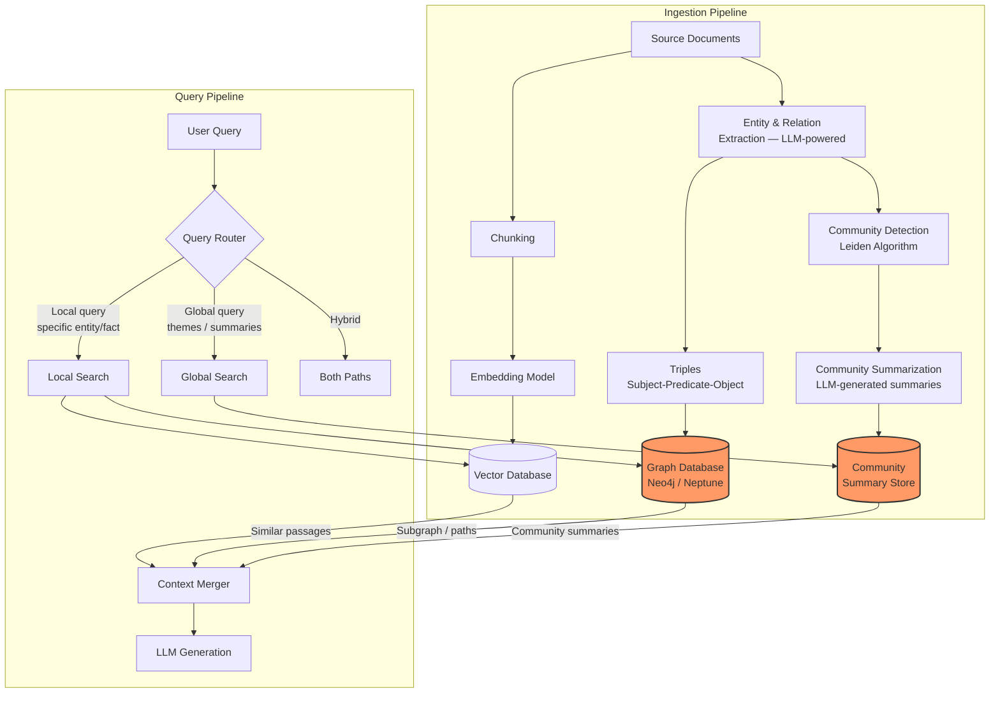
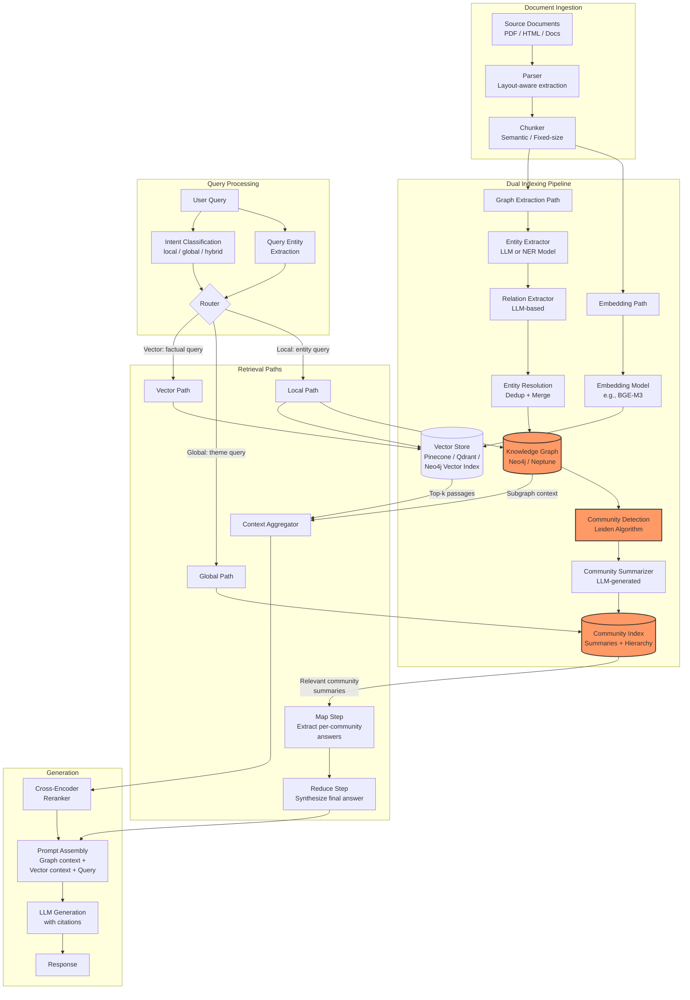

# GraphRAG --- Knowledge Graphs + RAG

## 1. Overview

GraphRAG augments Retrieval-Augmented Generation with knowledge graphs to enable relationship-aware, multi-hop reasoning over structured and unstructured data. Standard vector-based RAG retrieves passages that are individually similar to a query, but it fails when answering a question requires connecting information across multiple documents, traversing relationships, or reasoning about entities and their connections. GraphRAG addresses this by constructing a knowledge graph from the corpus and using graph traversal, community detection, and structured queries alongside (or instead of) vector similarity search.

The core insight: vector similarity captures "what is this passage about?" but not "how does entity A relate to entity B through entity C?" A query like "Which suppliers of Company X also supply Company Y, and what products do they share?" requires joining entity relationships --- a task where graph traversal succeeds and embedding similarity fails.

Microsoft Research introduced the term "GraphRAG" in their 2024 paper and open-source implementation, but the concept of combining knowledge graphs with LLM-based generation predates that work. The Microsoft approach specifically focuses on entity extraction, community detection via the Leiden algorithm, and community summarization to handle "global" queries that require reasoning over the entire corpus. This contrasts with "local" queries that can be answered from a small set of relevant passages.

For principal architects, GraphRAG introduces significant complexity: knowledge graph construction requires entity and relation extraction pipelines (often LLM-powered, therefore expensive), graph databases add operational overhead, graph quality directly depends on extraction quality, and the graph must be kept current as the underlying corpus changes. The decision to adopt GraphRAG should be driven by a clear requirement for multi-hop reasoning or relationship-aware retrieval that vector RAG demonstrably fails to serve.

## 2. Where It Fits in GenAI Systems

GraphRAG operates as a parallel or augmented retrieval path alongside traditional vector-based RAG. It adds a structured knowledge layer between the raw corpus and the LLM.



**Integration points:**

- **RAG pipeline** ([rag-pipeline.md](./rag-pipeline.md)): GraphRAG extends the standard RAG pipeline with an additional graph-based retrieval path. The overall orchestration (prompt construction, generation, citation) remains the same.
- **Retrieval and reranking** ([retrieval-reranking.md](./retrieval-reranking.md)): Graph-retrieved context and vector-retrieved context are merged and optionally reranked before entering the LLM prompt. Cross-encoder rerankers can score graph-derived text passages alongside vector-retrieved passages.
- **Enterprise search** ([enterprise-search.md](./enterprise-search.md)): Enterprise knowledge bases with structured relationships (org charts, product hierarchies, supply chains) benefit heavily from GraphRAG.
- **Agent architectures** ([agent-architecture.md](../agents/agent-architecture.md)): Agents can use graph queries as a tool --- "find all entities related to X within 2 hops" --- enabling structured reasoning that vector search alone cannot provide.

## 3. Core Concepts

### 3.1 Why Vector RAG Fails for Certain Query Types

Vector RAG retrieves passages by embedding similarity. It works when the answer to a query is contained within a single passage (or a small set of independently similar passages). It fails in several systematic ways:

**Multi-hop reasoning**: "Who founded the company that acquired the startup where Alice worked before joining Google?" requires traversing: Alice → previous company → acquiring company → founder. No single passage contains this chain. Vector retrieval may find passages about Alice, passages about the acquisition, and passages about the founder --- but it has no mechanism to connect them in the correct order.

**Global summarization**: "What are the main themes in this corpus of 10,000 research papers?" requires reasoning over the entire corpus. Vector retrieval returns the top-k most similar passages to the query, but top-k similarity to a vague query produces a random sample, not a representative summary.

**Entity-relationship queries**: "Which products are supplied by companies headquartered in Germany that also have offices in Japan?" requires structured filtering on entity attributes and relationship traversal. This is a graph query or SQL query, not a similarity search.

**Aggregation queries**: "How many customers reported issues with Feature X in Q4?" requires counting, not similarity matching. Vector RAG has no mechanism for aggregation.

GraphRAG addresses the first three failure modes. Aggregation queries are better served by SQL or structured data pipelines.

### 3.2 Microsoft GraphRAG Architecture

Microsoft's GraphRAG (open-sourced in 2024) introduced a specific architecture for knowledge-graph-augmented RAG with two distinct search modes.

**Indexing pipeline:**

1. **Text chunking**: Split documents into overlapping chunks (default: 1200 tokens with 100-token overlap).
2. **Entity and relationship extraction**: For each chunk, use an LLM (GPT-4 class) to extract entities (people, organizations, locations, concepts) and relationships between them. Each extraction call produces a list of `(entity_1, relationship_type, entity_2, description)` tuples.
3. **Entity resolution**: Merge duplicate entities across chunks (e.g., "Microsoft Corp" and "MSFT" → single entity). This uses LLM-based deduplication or embedding similarity with a threshold.
4. **Graph construction**: Build a graph where nodes are entities and edges are relationships. Each node and edge carries a text description extracted by the LLM.
5. **Community detection**: Apply the Leiden algorithm to partition the graph into hierarchical communities --- clusters of densely connected entities. The Leiden algorithm is preferred over Louvain because it guarantees well-connected communities (no disconnected subclusters).
6. **Community summarization**: For each community at each hierarchy level, generate an LLM summary that describes the community's key entities, relationships, and themes. These summaries are stored and indexed.

**Local search (entity-focused queries):**

1. Extract entities from the query.
2. Find those entities in the knowledge graph.
3. Retrieve the entity descriptions, their immediate relationships, and connected entities (1--2 hops).
4. Also retrieve relevant text chunks from the vector store.
5. Combine graph context and vector context into the LLM prompt.

Local search is effective for queries about specific entities: "What is Microsoft's relationship with OpenAI?" The graph provides structured relationship context that vector search might scatter across many passages.

**Global search (theme/summary queries):**

1. Retrieve community summaries at the appropriate hierarchy level.
2. Use a map-reduce approach: for each community summary, ask the LLM to extract relevant information (map step), then combine all partial answers into a final synthesis (reduce step).
3. Return the synthesized answer.

Global search is effective for queries that require reasoning over the entire corpus: "What are the main research themes?" or "Summarize the key findings across all documents." This is where GraphRAG most dramatically outperforms standard RAG.

**Cost of Microsoft GraphRAG indexing:**

| Corpus Size | Approx. LLM Calls (Indexing) | GPT-4o Cost (est.) | Indexing Time |
|-------------|-------------------------------|---------------------|---------------|
| 1,000 pages | ~5,000--10,000 calls | $15--$40 | 1--3 hours |
| 10,000 pages | ~50,000--100,000 calls | $150--$400 | 10--30 hours |
| 100,000 pages | ~500,000--1,000,000 calls | $1,500--$4,000 | 3--10 days |

The indexing cost is dominated by LLM-powered entity extraction. This is orders of magnitude more expensive than vector-only RAG indexing (embedding API calls are 10--100x cheaper per token than generation calls).

### 3.3 LazyGraphRAG

LazyGraphRAG (introduced by Microsoft Research in late 2024) is a cost-efficient variant that defers expensive LLM-based extraction until query time, dramatically reducing upfront indexing cost.

**Key differences from full GraphRAG:**

| Aspect | Full GraphRAG | LazyGraphRAG |
|--------|--------------|--------------|
| Entity extraction | Full corpus at indexing | Deferred to query time, or uses NLP-based extraction (NER) |
| Community detection | Full graph, Leiden algorithm | Lightweight or on-demand |
| Community summaries | Pre-computed for all communities | Generated on-demand for relevant communities |
| Indexing cost | $1,500+ for 100K pages | $10--$50 for 100K pages (NER + embeddings only) |
| Query latency | Fast (pre-computed summaries) | Slower (on-demand extraction + summarization) |
| Best for | Corpora queried frequently | Large corpora with infrequent or exploratory queries |

**LazyGraphRAG indexing pipeline:**

1. Chunk and embed documents (same as standard RAG).
2. Run lightweight NER (spaCy, GLiNER, or a small fine-tuned model) to extract entities without LLM calls.
3. Build a co-occurrence graph: entities that appear in the same chunk are connected.
4. At query time, retrieve relevant chunks via vector search, extract the subgraph around the query's entities, and use the LLM to reason over the subgraph.

LazyGraphRAG achieves 80--90% of full GraphRAG's quality on global queries at 1--5% of the indexing cost. It is the recommended starting point for teams evaluating GraphRAG, as it avoids the upfront investment before proving the value of graph-augmented retrieval.

### 3.4 Knowledge Graph Construction

Building a high-quality knowledge graph is the critical (and most error-prone) step in GraphRAG.

**Entity and relation extraction approaches:**

| Approach | How It Works | Quality | Cost | Speed |
|----------|-------------|---------|------|-------|
| **LLM-based extraction** (GPT-4, Claude) | Prompt the LLM with a chunk + schema and ask for (entity, relation, entity) triples | High (best for complex relations) | Very high ($10--40/10K pages) | Slow (API latency) |
| **Fine-tuned model** (REBEL, UniRel) | Trained end-to-end for relation extraction | Medium-high (domain-dependent) | Low (self-hosted GPU) | Fast |
| **NER + co-occurrence** | Extract entities with spaCy/GLiNER, link by co-occurrence | Low (no explicit relations) | Very low | Very fast |
| **Rule-based + NER** | NER + handwritten patterns for domain-specific relations | Medium (domain-specific) | Low (engineering time) | Fast |
| **Hybrid: NER + LLM refinement** | NER for entities, LLM to classify relationship types | Medium-high | Medium | Medium |

**Entity resolution (deduplication):**

The same real-world entity appears in different forms across documents: "JPMorgan Chase," "JP Morgan," "JPMC," "JPM." Entity resolution merges these into a single graph node. Approaches:

- **String similarity**: Jaccard, Jaro-Winkler, or edit distance on entity names. Fast but misses abbreviations and aliases.
- **Embedding similarity**: Embed entity names + surrounding context, merge if cosine similarity exceeds a threshold (typically 0.85--0.92).
- **LLM-based**: Ask the LLM "Are 'JPMorgan Chase' and 'JPMC' the same entity?" High quality but expensive at scale.
- **Coreference resolution**: Resolve pronouns and references within documents before extraction. Improves entity yield by 15--30%.

**Triple stores and representation:**

Knowledge graphs are stored as triples: `(subject, predicate, object)`. Example: `(Microsoft, acquired, Activision Blizzard)`. Each triple can carry metadata: confidence score, source document, extraction timestamp, extraction model.

Storage options:
- **Property graph databases** (Neo4j, Amazon Neptune, TigerGraph): Nodes and edges have properties (key-value pairs). More flexible than pure triple stores. Cypher (Neo4j) or Gremlin (Neptune) query languages.
- **RDF triple stores** (Apache Jena, Blazegraph, Amazon Neptune in RDF mode): W3C standard. SPARQL query language. Better for ontology-heavy domains (biomedical, legal).
- **Lightweight alternatives**: NetworkX (in-memory Python graph library, fine for <1M nodes), SQLite with adjacency tables, or even JSON-based graph files for small projects.

### 3.5 Graph + Vector Hybrid Retrieval

The most effective GraphRAG systems use both graph traversal and vector similarity, combining them for different aspects of the query.

**Architecture pattern:**

```
1. Parse query → extract mentioned entities + classify query type
2. If entities found:
   a. Look up entities in the knowledge graph
   b. Retrieve N-hop neighborhood (typically 1-2 hops)
   c. Convert subgraph to text: "Entity A is related to Entity B via [relationship]. Entity B is described as [description]."
3. Always:
   a. Embed query → ANN search → top-k vector results
4. Merge:
   a. Graph-derived text passages + vector-retrieved passages
   b. Deduplicate
   c. Optionally rerank with cross-encoder
5. Assemble prompt and generate
```

**When graph retrieval adds value over vector-only:**

| Query Type | Vector-Only Quality | Graph-Augmented Quality | Improvement |
|-----------|--------------------|-----------------------|-------------|
| Entity-specific factual | Good | Good | Minimal |
| Multi-hop relationship | Poor | Good | Significant |
| Global summarization | Poor | Good (via community summaries) | Dramatic |
| Comparative ("A vs B") | Medium | Good (structured comparison) | Moderate |
| Timeline/causal chain | Poor | Good (temporal edges) | Significant |
| Simple keyword lookup | Good | Good | None |

### 3.6 Community Detection and Summarization

Community detection partitions the knowledge graph into groups of densely connected entities. These communities represent "topics" or "themes" in the corpus.

**Leiden algorithm:**

The Leiden algorithm optimizes modularity (a measure of how well a graph partition separates into clusters) while guaranteeing that all communities are internally connected. It operates in three phases:

1. **Local moving**: Move nodes between communities to improve modularity.
2. **Refinement**: Split communities that are not well-connected internally.
3. **Aggregation**: Create a new graph where nodes are communities, and repeat.

The result is a hierarchical community structure: large communities at the top level, progressively smaller sub-communities at lower levels.

**Community summarization:**

For each community, collect all entity descriptions and relationship descriptions within it, then ask the LLM to generate a summary. The prompt typically includes:

- Entity names and their descriptions
- Relationship triples and their descriptions
- Source text chunks associated with community members

The resulting summary captures "what this cluster of entities is about" at a level of abstraction that depends on the community's position in the hierarchy. Top-level communities produce broad thematic summaries; leaf-level communities produce specific, detailed summaries.

**Hierarchy levels and their uses:**

| Level | Granularity | Typical Community Size | Use Case |
|-------|------------|----------------------|----------|
| Level 0 (leaf) | Very specific | 3--10 entities | Detailed, focused queries |
| Level 1 | Specific | 10--30 entities | Entity-neighborhood queries |
| Level 2 | Moderate | 30--100 entities | Topic-level summaries |
| Level 3+ (root) | Broad | 100--1000+ entities | Corpus-wide themes |

### 3.7 Query Routing: Graph vs Vector vs Hybrid

Not every query benefits from graph retrieval. Routing queries to the right backend is critical for both quality and cost efficiency.

**Routing decision framework:**

```mermaid
flowchart TD
    Q[User Query] --> CLASSIFY{Query Classifier}

    CLASSIFY -->|Contains entity names<br/>+ relationship words<br/>"How does X relate to Y?"| GRAPH[Graph Search<br/>Subgraph traversal<br/>+ vector retrieval]

    CLASSIFY -->|Global/summary query<br/>"What are the main themes?"<br/>"Summarize all findings"| GLOBAL[Global Search<br/>Community summaries<br/>Map-reduce]

    CLASSIFY -->|Specific factual query<br/>"What is X?"<br/>"How to do Y?"| VECTOR[Vector Search<br/>Standard RAG]

    CLASSIFY -->|Multi-hop reasoning<br/>"A connects to B through C"<br/>"Chain of events"| GRAPH

    CLASSIFY -->|Keyword/exact match<br/>Error codes, IDs| BM25[BM25 Search<br/>Sparse retrieval]

    GRAPH --> MERGE[Merge & Rerank]
    GLOBAL --> GEN[LLM Generation]
    VECTOR --> MERGE
    BM25 --> MERGE
    MERGE --> GEN
```

**Router implementation options:**

| Router | Implementation | Pros | Cons |
|--------|---------------|------|------|
| **Keyword heuristic** | Check for entity names, relationship words ("related to", "connected", "between") | Fast, no model needed | Misses implicit relationship queries |
| **Intent classifier** | Fine-tuned BERT classifier: graph_query / vector_query / global_query / sql_query | Fast, accurate with good training data | Requires labeled examples |
| **LLM-based** | Prompt: "Classify this query as: entity_relationship, global_summary, factual_lookup, or keyword_search" | Flexible, no training data | 200--500ms latency, token cost |
| **Embedding similarity** | Embed query, compare to prototype queries for each category | Fast, works with few examples | Requires representative prototypes |

### 3.8 Graph Databases for GraphRAG

| Database | Type | Query Language | Hosting | Scale | GraphRAG Fit |
|----------|------|---------------|---------|-------|-------------|
| **Neo4j** | Property graph | Cypher | Self-hosted, AuraDB (cloud) | Billions of nodes | Best ecosystem, GraphRAG integrations, vector index built-in (5.11+) |
| **Amazon Neptune** | Property graph + RDF | Gremlin + SPARQL + openCypher | AWS managed | Billions of edges | AWS-native, serverless option, good for enterprise |
| **TigerGraph** | Property graph | GSQL | Self-hosted, cloud | Trillions of edges | Best for massive graphs, deep-link analytics |
| **FalkorDB** | Property graph | Cypher-compatible | Self-hosted, cloud | Millions of nodes | Redis-based, very fast for small-medium graphs |
| **Memgraph** | Property graph | Cypher | Self-hosted, cloud | Billions of nodes | In-memory, low latency |
| **Kuzu** | Property graph | Cypher | Embedded (in-process) | Millions of nodes | DuckDB-like for graphs, great for prototyping |
| **NetworkX** | In-memory Python | Python API | In-process | <1M nodes | Prototyping only, not production |

**Neo4j for GraphRAG in practice:**

Neo4j has become the default graph database for GraphRAG implementations due to:
- Native vector index support (HNSW), enabling graph + vector queries in a single database.
- LangChain and LlamaIndex have first-class Neo4j GraphRAG integrations.
- Cypher query language is accessible and well-documented.
- `Neo4jGraph` in LangChain generates Cypher queries from natural language via LLM.

Example Cypher query for multi-hop retrieval:
```cypher
MATCH (e:Entity {name: $entity_name})-[r*1..3]-(connected)
WHERE connected.description IS NOT NULL
RETURN e, r, connected
LIMIT 50
```

## 4. Architecture

End-to-end GraphRAG system architecture with all components:



**Latency profile for GraphRAG query (local search):**

| Stage | Latency | Notes |
|-------|---------|-------|
| Query entity extraction | 10--50ms | NER model or regex |
| Graph traversal (2-hop) | 5--30ms | Cypher query on Neo4j |
| Vector retrieval | 10--50ms | ANN search |
| Context aggregation | 5--10ms | Merge graph + vector context |
| Cross-encoder reranking | 100--250ms | Rerank merged candidates |
| LLM generation | 500--2000ms | Depends on context size |
| **Total (local search)** | **~700--2400ms** | |

**Latency profile for GraphRAG query (global search):**

| Stage | Latency | Notes |
|-------|---------|-------|
| Community summary retrieval | 10--50ms | Index lookup |
| Map step (parallel LLM calls) | 1--5 seconds | One call per relevant community |
| Reduce step (single LLM call) | 500--2000ms | Synthesize map outputs |
| **Total (global search)** | **~2--8 seconds** | Much slower due to map-reduce |

## 5. Design Patterns

### Pattern 1: Graph-Augmented Vector RAG (Recommended Starting Point)

Keep the existing vector RAG pipeline unchanged. Add a lightweight graph layer that enriches retrieved context with entity relationships.

```
1. Standard vector retrieval → top-k passages
2. Extract entities from the top-k passages (NER)
3. Look up those entities in the knowledge graph
4. Retrieve 1-hop relationships for each entity
5. Prepend graph context ("Entity A is [relationship] Entity B") to the vector-retrieved passages
6. Generate with the enriched context
```

This pattern adds graph value without replacing the existing pipeline. The graph is consulted after vector retrieval, not as an alternative to it. Implementation effort is low: add NER + a graph lookup after retrieval.

### Pattern 2: Dual-Path with Router

Maintain two fully independent retrieval paths (vector and graph) with a query router that selects the appropriate path.

- **Vector path**: Standard chunk embedding + ANN search + reranking. Handles factual, single-hop queries.
- **Graph path**: Entity extraction from query → subgraph traversal → convert subgraph to text → rerank. Handles relationship and multi-hop queries.
- **Router**: Intent classifier that routes queries to the appropriate path. For ambiguous queries, run both paths and merge results.

This pattern is more complex but allows each path to be independently optimized.

### Pattern 3: Progressive Graph Enrichment

Start with a co-occurrence graph (cheap to build) and progressively enrich it with LLM-extracted relationships as the system processes queries.

1. **Day 0**: Build a co-occurrence graph from NER output. No LLM calls. Entities connected if they appear in the same chunk.
2. **Ongoing**: When a query triggers graph retrieval and the user engages with the result (clicks, follow-up questions), extract relationships from the involved chunks using an LLM. Add these high-quality edges to the graph.
3. **Periodic**: Run batch LLM extraction on the most-accessed portions of the corpus (hot paths).

This pattern amortizes the cost of graph construction over time and focuses extraction effort where it matters most.

### Pattern 4: Text-to-Cypher for Structured Queries

Use the LLM to translate natural language queries into Cypher (or SPARQL/Gremlin) queries against the knowledge graph, then execute the graph query and return structured results.

```
User: "Which companies has Microsoft acquired that also have partnerships with Google?"
LLM-generated Cypher:
MATCH (ms:Entity {name: "Microsoft"})-[:ACQUIRED]->(target)<-[:PARTNERS_WITH]-(goog:Entity {name: "Google"})
RETURN target.name, target.description
```

LangChain's `GraphCypherQAChain` and LlamaIndex's `KnowledgeGraphQueryEngine` implement this pattern. The risk: LLM-generated Cypher can be syntactically invalid or semantically wrong. Mitigations include providing the graph schema in the prompt, using few-shot examples, and validating the generated query before execution.

### Pattern 5: Hierarchical Graph Search

For large knowledge graphs, use the community hierarchy to narrow the search space before traversing individual entity relationships.

1. Embed the query and find the most relevant community summaries at the top level.
2. Drill into the children communities of the relevant top-level communities.
3. Within the narrowed community, traverse entity relationships for the specific query.

This is analogous to navigating a table of contents before reading specific paragraphs --- the hierarchy avoids scanning the entire graph.

## 6. Implementation Approaches

### 6.1 Microsoft GraphRAG (Open Source)

```bash
# Install
pip install graphrag

# Initialize project
graphrag init --root ./my-graphrag-project

# Configure settings.yaml:
# - llm model (gpt-4o recommended for extraction quality)
# - embedding model
# - chunk size and overlap
# - entity extraction prompts

# Index (expensive: runs LLM extraction over entire corpus)
graphrag index --root ./my-graphrag-project

# Query - local search
graphrag query --root ./my-graphrag-project --method local \
    --query "What is the relationship between Microsoft and OpenAI?"

# Query - global search
graphrag query --root ./my-graphrag-project --method global \
    --query "What are the main themes in this document collection?"
```

**Configuration tuning:**

- `entity_extraction.max_gleanings`: Number of LLM passes per chunk for entity extraction. Default 1. Setting to 2 catches more entities at 2x cost.
- `community_report.max_length`: Maximum tokens per community summary. Higher values capture more detail but increase global search context size.
- `local_search.text_unit_prop`: Proportion of context window allocated to text chunks (vs. graph context) in local search. Default 0.5.

### 6.2 LangChain + Neo4j GraphRAG

```python
from langchain_community.graphs import Neo4jGraph
from langchain.chains import GraphCypherQAChain
from langchain_openai import ChatOpenAI

# Connect to Neo4j
graph = Neo4jGraph(
    url="bolt://localhost:7687",
    username="neo4j",
    password="password"
)

# Create text-to-Cypher chain
chain = GraphCypherQAChain.from_llm(
    llm=ChatOpenAI(model="gpt-4o", temperature=0),
    graph=graph,
    verbose=True,
    validate_cypher=True,  # Validate generated Cypher before execution
    top_k=10,
)

result = chain.invoke(
    {"query": "Which entities are connected to Microsoft within 2 hops?"}
)
```

### 6.3 LlamaIndex Knowledge Graph RAG

```python
from llama_index.core import KnowledgeGraphIndex, SimpleDirectoryReader
from llama_index.graph_stores.neo4j import Neo4jGraphStore
from llama_index.llms.openai import OpenAI

# Load documents
documents = SimpleDirectoryReader("./data").load_data()

# Configure graph store
graph_store = Neo4jGraphStore(
    username="neo4j",
    password="password",
    url="bolt://localhost:7687",
)

# Build knowledge graph index (LLM-powered extraction)
kg_index = KnowledgeGraphIndex.from_documents(
    documents,
    graph_store=graph_store,
    llm=OpenAI(model="gpt-4o", temperature=0),
    max_triplets_per_chunk=10,
    include_embeddings=True,
)

# Query with graph + vector hybrid
query_engine = kg_index.as_query_engine(
    include_text=True,       # Include source text chunks
    response_mode="tree_summarize",
    embedding_mode="hybrid",  # Use both graph and embeddings
    similarity_top_k=5,
)

response = query_engine.query(
    "How does Entity A relate to Entity B through intermediate entities?"
)
```

### 6.4 Lightweight GraphRAG with NetworkX (Prototyping)

For quick prototyping without a graph database:

```python
import networkx as nx
import spacy

nlp = spacy.load("en_core_web_trf")

# Build co-occurrence graph from NER
G = nx.Graph()
for chunk in chunks:
    doc = nlp(chunk.text)
    entities = [ent.text for ent in doc.ents]
    for i, e1 in enumerate(entities):
        G.add_node(e1, type="entity")
        for e2 in entities[i+1:]:
            if G.has_edge(e1, e2):
                G[e1][e2]["weight"] += 1
            else:
                G.add_edge(e1, e2, weight=1)
            G[e1][e2].setdefault("chunks", []).append(chunk.id)

# Community detection
from networkx.algorithms.community import louvain_communities
communities = louvain_communities(G, resolution=1.0)

# Query: find neighborhood of an entity
def get_entity_context(entity_name, hops=2):
    if entity_name not in G:
        return []
    neighborhood = nx.ego_graph(G, entity_name, radius=hops)
    return list(neighborhood.edges(data=True))
```

## 7. Tradeoffs

### GraphRAG vs Standard Vector RAG

| Criteria | Standard Vector RAG | GraphRAG (Full) | LazyGraphRAG | Graph-Augmented Vector RAG |
|----------|--------------------|-----------------|--------------|-----------------------------|
| **Multi-hop accuracy** | Low | High | Medium-High | Medium |
| **Global summarization** | Very low | High | Medium | Low |
| **Single-hop factual** | High | High | High | High |
| **Indexing cost** | Low ($1--5/100K pages) | Very high ($1,500--4,000) | Low ($10--50) | Medium ($50--200) |
| **Query latency** | 500--2000ms | 700--8000ms | 1000--5000ms | 600--2500ms |
| **Implementation complexity** | Low | Very high | Medium | Low-Medium |
| **Maintenance burden** | Low (re-embed on update) | High (re-extract, re-detect, re-summarize) | Medium | Low-Medium |
| **Corpus update speed** | Fast (embed new docs) | Slow (full re-indexing) | Medium | Medium |
| **When to choose** | Default choice | Multi-hop is a core requirement | Exploring GraphRAG value | Add graph value incrementally |

### Graph Database Selection

| Criteria | Neo4j | Amazon Neptune | TigerGraph | FalkorDB | Kuzu (Embedded) |
|----------|-------|---------------|------------|----------|-----------------|
| **Setup complexity** | Medium | Low (managed) | High | Low | Very low |
| **Query language** | Cypher | Gremlin/SPARQL/openCypher | GSQL | Cypher | Cypher |
| **Vector index support** | Yes (native) | Yes (Neptune Analytics) | No | Yes | No |
| **LangChain integration** | Excellent | Good | Limited | Growing | Limited |
| **Scale (max edges)** | ~10B | ~100B | ~1T | ~100M | ~100M |
| **Cost** | AuraDB: $$; self-hosted: $ | AWS pricing: $$ | $$$$ | $ | Free (embedded) |
| **Best for** | Most GraphRAG projects | AWS-native architectures | Massive enterprise graphs | Small/medium, low-latency | Prototyping, embedded |

### Entity Extraction Strategy

| Criteria | LLM-Based (GPT-4o) | Fine-Tuned Model (REBEL) | NER + Co-occurrence | Hybrid (NER + LLM) |
|----------|--------------------|--------------------------|--------------------|---------------------|
| **Relation quality** | Highest | High (within training domain) | None (co-occurrence only) | High |
| **Entity quality** | High | High | Medium | High |
| **Cost per 10K pages** | $10--40 | $0.10--0.50 (GPU) | $0.01--0.05 | $2--10 |
| **Speed** | Slow (API-bound) | Fast (local GPU) | Very fast | Medium |
| **Domain adaptability** | High (via prompting) | Requires fine-tuning data | Domain-agnostic | High |
| **Recommended for** | Highest quality requirement | High volume, stable domain | Prototyping, LazyGraphRAG | Production balance |

## 8. Failure Modes

### 8.1 Extraction Quality Degradation

**Problem**: The LLM-based entity and relation extractor produces incorrect triples. For example, extracting `(Company A, acquired, Company B)` when the text actually says "Company A considered acquiring Company B but decided against it." These erroneous relationships propagate through the graph, corrupting community detection and retrieval.

**Symptoms**: Graph-based answers contain factually incorrect relationship claims. Community summaries include spurious connections.

**Mitigation**: Use extraction confidence scores (ask the LLM to rate confidence). Validate extracted triples against the source text with a separate verification prompt. Implement human-in-the-loop review for high-impact domains. Use chain-of-thought prompting for extraction (increases accuracy by 10--15% at 2x token cost).

### 8.2 Graph Staleness

**Problem**: The knowledge graph was built from the corpus at time T. New documents added at T+1 introduce new entities and relationships that are not in the graph. The graph and vector store diverge, causing inconsistent retrieval.

**Symptoms**: Graph-based retrieval misses recent information. Local search returns stale entity descriptions. Community summaries do not reflect the latest content.

**Mitigation**: Implement incremental graph updates: when new documents are added, extract entities and relations from the new chunks only and merge into the existing graph. Re-run community detection periodically (not on every update). Track a `last_updated` timestamp per entity and edge.

### 8.3 Community Summary Hallucination

**Problem**: The LLM generates community summaries that include facts not present in the community's entities and relationships. This is particularly common for small communities where the LLM fills gaps with its parametric knowledge.

**Symptoms**: Global search returns answers that are plausible but not grounded in the corpus.

**Mitigation**: Include "only use the provided entity and relationship descriptions" instructions in the summarization prompt. Post-process summaries with a grounding check: verify that each claim in the summary maps to at least one entity or relationship in the community.

### 8.4 Entity Resolution Failure

**Problem**: The entity resolution step fails to merge entities that refer to the same real-world entity (e.g., "AWS" and "Amazon Web Services" remain as separate nodes), or incorrectly merges distinct entities (e.g., "Apple Inc." and "Apple Records" merged into one node).

**Symptoms**: Over-splitting creates a fragmented graph where multi-hop traversal breaks at the split point. Over-merging creates incorrect relationships between unrelated entities.

**Mitigation**: Use embedding-based resolution with a conservative threshold (0.90+) for merging, supplemented by LLM verification for borderline cases. Maintain a manual alias table for the most important entities in the domain. Log merge decisions for auditability.

### 8.5 Graph Query Explosion

**Problem**: A 3-hop traversal from a highly connected entity (e.g., "United States" in a geopolitical corpus) returns thousands of entities, overwhelming the context window and increasing latency.

**Symptoms**: High latency on graph queries involving hub entities. Context window overflow. Degraded answer quality from too much context.

**Mitigation**: Cap traversal results with a `LIMIT` clause. Use edge weight (relationship frequency/importance) to prune low-relevance paths. Implement degree-based hub detection and skip or summarize hub entities rather than traversing all their edges.

### 8.6 Cost Overrun on Indexing

**Problem**: LLM-based entity extraction on a large corpus generates an unexpectedly large API bill. A 500K-page enterprise corpus can cost $5,000--$20,000 in GPT-4o calls for extraction.

**Symptoms**: Budget exceeded before indexing completes. Indexing paused or abandoned.

**Mitigation**: Start with LazyGraphRAG or NER-based extraction to validate the approach. Run a cost estimation on a small sample (1% of corpus) before full indexing. Use cheaper models (GPT-4o-mini, Claude 3.5 Haiku) for extraction --- quality drops 10--15% but cost drops 90%. Implement incremental indexing to spread cost over time.

## 9. Optimization Techniques

### 9.1 Hybrid Graph + Vector Retrieval with Shared Neo4j

Store both the knowledge graph and vector embeddings in Neo4j (which supports native vector indexes since version 5.11). This eliminates the need for a separate vector database, reduces operational complexity, and enables single-query hybrid retrieval:

```cypher
// Single Cypher query: vector search + graph traversal
CALL db.index.vector.queryNodes('chunk_embeddings', 10, $query_embedding)
YIELD node AS chunk, score AS similarity
MATCH (chunk)-[:MENTIONS]->(entity)-[r*1..2]-(connected)
RETURN chunk.text, entity.name, type(r[0]), connected.name, similarity
ORDER BY similarity DESC
LIMIT 20
```

### 9.2 Incremental Graph Updates

Avoid full re-indexing when the corpus changes. Instead:

1. New documents: extract entities/relations, merge into the existing graph (entity resolution against existing nodes).
2. Updated documents: diff old vs new entities/relations, update edges and descriptions.
3. Deleted documents: remove associated edges and orphaned nodes.
4. Re-run community detection only on affected subgraphs (the communities containing modified entities), not the entire graph.

This reduces the cost of keeping the graph current from O(corpus) to O(delta).

### 9.3 Distilled Entity Extraction

Train a smaller, domain-specific extraction model by distilling from GPT-4o-quality extractions:

1. Run GPT-4o extraction on 5--10% of the corpus (the "seed" set).
2. Fine-tune a smaller model (Llama 3.1 8B, Mistral 7B, or a BERT-based NER + relation classifier) on the seed extractions.
3. Run the distilled model on the remaining 90--95% of the corpus.

This achieves 85--90% of GPT-4o extraction quality at 5--10% of the cost. The distilled model also runs 10--50x faster (local GPU vs API calls).

### 9.4 Caching Community Summaries

Community summaries are expensive to generate but change infrequently (only when the underlying graph changes). Cache them aggressively:

- Store summaries in a key-value store (Redis, DynamoDB) keyed by community ID.
- Invalidate a community's summary only when its membership changes (entity added/removed) or when entity descriptions are updated.
- For global search, serve cached summaries directly, avoiding LLM calls for the map step when summaries are current.

### 9.5 Graph Pruning for Context Window Efficiency

Before assembling the prompt, prune the retrieved subgraph to fit the LLM's context budget:

1. Score each entity and relationship by relevance to the query (using embedding similarity or the reranker).
2. Discard low-relevance entities and their edges.
3. For remaining entities, truncate descriptions to a maximum length.
4. Serialize the pruned subgraph as structured text (not raw Cypher output).

This ensures graph context is information-dense and does not waste context window space on tangential entities.

### 9.6 Embedding Entity Descriptions for Semantic Graph Search

Embed each entity's description and index these embeddings. When processing a query, retrieve the most semantically relevant entities via ANN search (instead of exact name matching). This handles queries that reference entities implicitly: "the social media company founded by Zuckerberg" can match the entity "Meta Platforms / Facebook" even without exact name mention.

## 10. Real-World Examples

### Microsoft (GraphRAG Originator)

Microsoft Research developed and open-sourced GraphRAG in 2024, demonstrating it on the Podcast Transcripts dataset and various enterprise document collections. Their benchmarks showed that on global sensemaking queries ("What are the main themes in this corpus?"), GraphRAG outperformed standard vector RAG by 50--70% on answer comprehensiveness and diversity. Microsoft integrated GraphRAG principles into Azure AI Search and Microsoft 365 Copilot, where relationship-aware retrieval helps with queries across enterprise documents. Microsoft also developed LazyGraphRAG as a cost-reduction follow-up, reporting comparable quality to full GraphRAG at 0.1% of the indexing cost for local queries.

### Neo4j (Graph Database + GenAI Platform)

Neo4j has positioned itself as the primary graph database for GraphRAG workloads. Their GenAI ecosystem includes: native vector index (HNSW-based) for hybrid graph + vector queries, LangChain and LlamaIndex integrations, and a GraphRAG pipeline toolkit. Companies using Neo4j for GraphRAG include NASA (knowledge management across mission data), eBay (product knowledge graph for search augmentation), and Novartis (biomedical knowledge graph connecting drugs, diseases, genes, and clinical trials). Neo4j reports that their customers see 2--4x improvement in multi-hop question accuracy when adding graph-based retrieval to their RAG pipelines.

### Amazon (Neptune + Bedrock)

Amazon Neptune, combined with Amazon Bedrock for LLM access, provides a managed GraphRAG stack on AWS. AWS published reference architectures for GraphRAG using Neptune for graph storage, Bedrock for entity extraction, and OpenSearch for vector search. Financial services customers (undisclosed, but referenced in AWS case studies) use this architecture for regulatory compliance queries that require tracing relationships across entities, transactions, and regulatory filings. Amazon Neptune Serverless reduces operational overhead for variable-load GraphRAG workloads.

### Diffbot (Automated Knowledge Graph Construction)

Diffbot maintains one of the world's largest automatically constructed knowledge graphs (the Diffbot Knowledge Graph) with over 20 billion entities extracted from the public web. They offer a GraphRAG-as-a-service product where customers query Diffbot's pre-built knowledge graph alongside their private corpus. This eliminates the entity extraction cost for public knowledge (companies, people, products, events) and focuses LLM extraction on the customer's proprietary data only. Diffbot's approach demonstrates the "hybrid graph" pattern: public knowledge graph for broad coverage, private knowledge graph for domain-specific relationships.

### NebulaGraph + LlamaIndex (Open-Source GraphRAG)

NebulaGraph (open-source distributed graph database) partnered with LlamaIndex to build an open-source GraphRAG reference implementation. Their architecture uses NebulaGraph for graph storage, LlamaIndex for orchestration, and supports both text-to-nGQL (NebulaGraph's query language) and subgraph retrieval patterns. This is notable as a fully open-source, self-hosted alternative to the Microsoft/Neo4j/AWS commercial stacks.

## 11. Related Topics

- [RAG Pipeline](./rag-pipeline.md) --- The broader RAG architecture within which GraphRAG operates.
- [Retrieval and Reranking](./retrieval-reranking.md) --- Dense/sparse retrieval and cross-encoder reranking that complement graph-based retrieval.
- [Enterprise Search](./enterprise-search.md) --- Enterprise knowledge management use cases where GraphRAG adds the most value.
- [Agent Architecture](../agents/agent-architecture.md) --- Agents that use graph queries as tools for structured reasoning.
- [Embedding Models](../foundations/embeddings.md) --- Embeddings used for entity description indexing and vector-based graph search.
- [Multimodal RAG](./multimodal-rag.md) --- Extending GraphRAG to non-text modalities (visual entities, audio entities).
- [Evaluation Frameworks](../evaluation/eval-frameworks.md) --- Measuring GraphRAG quality, including multi-hop accuracy and answer comprehensiveness.

## 12. Source Traceability

| Concept | Primary Sources |
|---------|----------------|
| Microsoft GraphRAG | Edge et al., "From Local to Global: A Graph RAG Approach to Query-Focused Summarization," arXiv:2404.16130, 2024 |
| GraphRAG open-source | Microsoft, https://github.com/microsoft/graphrag, 2024 |
| LazyGraphRAG | Microsoft Research blog, "LazyGraphRAG: Setting a new standard for quality and cost," 2024 |
| Leiden algorithm | Traag et al., "From Louvain to Leiden: guaranteeing well-connected communities," Scientific Reports, 2019 |
| Knowledge graph construction for NLP | Ji et al., "A Survey on Knowledge Graphs: Representation, Acquisition, and Applications," IEEE TNNLS, 2022 |
| REBEL (relation extraction) | Huguet Cabot & Navigli, "REBEL: Relation Extraction By End-to-end Language generation," EMNLP 2021 |
| Neo4j Vector Index | Neo4j documentation, "Vector search indexes," https://neo4j.com/docs/cypher-manual/current/indexes/semantic-indexes/vector-indexes/ |
| Amazon Neptune GraphRAG | AWS Architecture Blog, "Build a GraphRAG application using Amazon Neptune and LLMs," 2024 |
| Diffbot Knowledge Graph | Diffbot documentation, https://docs.diffbot.com/docs/en/kg-index |
| LangChain GraphCypherQAChain | LangChain documentation, https://python.langchain.com/docs/integrations/graphs/neo4j_cypher |
| LlamaIndex KnowledgeGraphIndex | LlamaIndex documentation, https://docs.llamaindex.ai/en/stable/examples/index_structs/knowledge_graph/ |
| Community detection survey | Fortunato & Hric, "Community detection in networks: A user guide," Physics Reports, 2016 |
| Entity resolution | Christophides et al., "An Overview of End-to-End Entity Resolution for Big Data," ACM Computing Surveys, 2021 |
