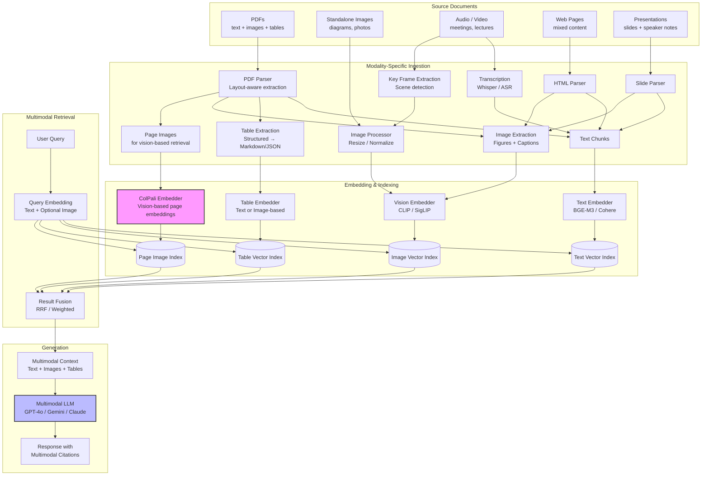
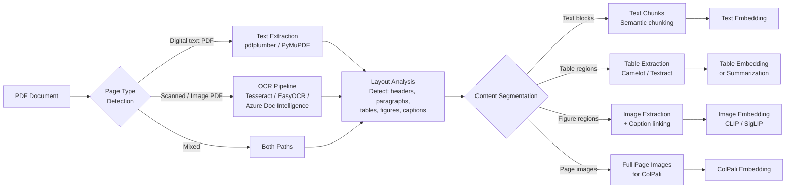

# Multimodal RAG

## 1. Overview

Multimodal RAG extends Retrieval-Augmented Generation beyond text to handle images, tables, PDFs, audio, and video as first-class retrievable objects. Standard text-only RAG pipelines break when the corpus contains diagrams that explain architecture decisions, tables with critical metrics, scanned PDFs with no machine-readable text, or meeting recordings where key decisions were spoken but never written down. Multimodal RAG bridges this gap by embedding, indexing, and retrieving content across modalities, then presenting the retrieved multimodal context to a vision-language model or multimodal LLM for generation.

The architectural challenge is fundamental: different modalities have different representations (pixel matrices, waveforms, token sequences, structured cells), different embedding spaces, different chunking strategies, and different cost profiles. A single image processed by a vision model consumes 1,000--10,000 tokens worth of compute. A 60-minute meeting recording produces 10,000+ words of transcript. A complex PDF table may require OCR, layout analysis, and structural parsing before it can be meaningfully retrieved.

Two competing architectural philosophies have emerged. The **separate-pipeline** approach maintains modality-specific embedding models and retrieval indices (CLIP for images, text embedder for text, table parser for tables), then fuses results at query time. The **unified-embedding** approach uses a single multimodal embedding model that maps all modalities into a shared vector space, enabling cross-modal retrieval (a text query retrieves a relevant image directly). Each approach has distinct tradeoffs in quality, complexity, and cost.

A breakthrough direction is **vision-based document retrieval** (ColPali and its successors), which bypasses OCR and text extraction entirely by embedding document page images directly using a vision-language model. This eliminates the brittle parsing pipeline and handles any visual layout --- but at the cost of larger embeddings and higher compute requirements.

For principal architects, multimodal RAG decisions compound across the system: embedding model choice determines which modalities can be retrieved, index design determines storage cost and query latency, and the generation model must be multimodal-capable to consume non-text context. These decisions must be made holistically.

## 2. Where It Fits in GenAI Systems

Multimodal RAG sits between document ingestion (which produces multimodal content) and the generation layer (which must consume it). It introduces modality-specific processing at every stage.



**Integration points:**

- **Multimodal models** ([multimodal-models.md](../foundations/multimodal-models.md)): The generation model must be vision-language capable (GPT-4o, Gemini 2.0, Claude 3.5 Sonnet, Llama 3.2 Vision) to consume image and table context.
- **Document ingestion** ([document-ingestion.md](./document-ingestion.md)): The parsing pipeline that extracts text, images, and tables from source documents feeds directly into multimodal RAG's embedding stage.
- **RAG pipeline** ([rag-pipeline.md](./rag-pipeline.md)): Multimodal RAG extends the standard RAG pipeline with modality-specific embedding, indexing, and context assembly.
- **Embedding models** ([embeddings.md](../foundations/embeddings.md)): Text embedding models handle the textual modality; vision embedding models (CLIP, SigLIP) handle images.
- **Vector databases** ([vector-databases.md](../vector-search/vector-databases.md)): Must support multiple indices (one per modality) or multi-vector storage.

## 3. Core Concepts

### 3.1 Image RAG

Image RAG enables retrieval of images (photographs, diagrams, charts, screenshots) by semantic similarity to a text query.

**Vision embedding models:**

| Model | Architecture | Embedding Dim | Image Resolution | Text-Image Alignment | Notes |
|-------|-------------|---------------|-----------------|---------------------|-------|
| **CLIP** (OpenAI) | ViT-L/14 | 768 | 224x224 or 336x336 | Contrastive (text-image pairs) | The original; still widely used |
| **SigLIP** (Google) | ViT-SO400M | 1152 | 384x384 | Sigmoid contrastive loss | Better than CLIP on fine-grained tasks |
| **OpenCLIP** (LAION) | Various ViTs | 768--1024 | Up to 384x384 | Contrastive, open-source | Multiple checkpoints, community-maintained |
| **Nomic Embed Vision** | ViT + projection | 768 | 384x384 | Aligned with Nomic text embeddings | Same space as text embeddings |
| **Jina CLIP v2** | ViT-L + text encoder | 1024 | 512x512 | Multi-task contrastive | Multilingual, long-text support |
| **Cohere embed-v4** | Proprietary | 1024 | Variable | Native multimodal | API-based, handles text + images |

**How image embedding works:**

1. The image is resized to the model's expected resolution (e.g., 224x224 for CLIP ViT-L/14).
2. The ViT (Vision Transformer) divides the image into patches (typically 14x14 or 16x16 pixels each), embeds each patch as a token, and processes the sequence through transformer layers.
3. The CLS token output (or mean-pooled patch embeddings) is projected to the shared embedding space.
4. The resulting vector is stored in a vector index alongside text embeddings from the same model family.

**Text-to-image retrieval:**

The query text is embedded using the model's text encoder. The text embedding exists in the same vector space as the image embeddings (trained via contrastive learning on image-text pairs). ANN search retrieves the most similar images. This enables queries like "architecture diagram showing microservices communication" to retrieve relevant diagrams from the corpus.

**Image-to-image retrieval:**

An input image is embedded with the vision encoder, and ANN search retrieves similar images. Useful for "find similar diagrams" or "find all screenshots of this UI component" use cases.

**Limitations of image embedding for RAG:**

- **Text in images**: CLIP-family models are weak at reading text within images (OCR capability is limited). A diagram with critical text labels may not be retrieved by a query referencing those labels.
- **Fine-grained detail**: Small details in large images (a single data point in a chart, a specific column in a table) are lost in the single-vector representation.
- **Resolution bottleneck**: Resizing a high-resolution image to 224x224 or 384x384 pixels loses significant detail.

### 3.2 Table RAG

Tables are among the hardest content types for RAG because they carry structured, position-dependent information that does not survive naive text extraction.

**Approach 1: Structured extraction to text/markdown**

1. Parse the table from the source document (HTML table tags, PDF table detection, spreadsheet cells).
2. Convert to a structured text format: Markdown table, CSV, or JSON.
3. Embed the serialized table text using a standard text embedding model.
4. Retrieve as text.

**Tools for table extraction:**
- **Unstructured.io**: Open-source document parser with table detection using YOLOX object detection + OCR.
- **Camelot / Tabula**: PDF-specific table extractors using lattice and stream detection.
- **Azure Document Intelligence**: Cloud API with pre-trained table extraction models.
- **Amazon Textract**: AWS service with table and form extraction from scanned documents.
- **Docling** (IBM): Open-source document converter with strong table parsing and export to Markdown/JSON.

**Approach 2: Image-based table understanding**

1. Render the table as an image (screenshot the table region).
2. At query time, send the table image to a vision-language model (GPT-4o, Gemini) alongside the query.
3. The VLM reads the table visually and extracts the relevant information.

This approach bypasses parsing entirely. It handles complex table layouts (merged cells, nested headers, multi-page tables) that structured extraction struggles with. The cost: each table image consumes 500--2,000 tokens in the VLM context, and the VLM call is expensive.

**Approach 3: Table summarization**

1. Extract the table as structured data.
2. Use an LLM to generate a natural language summary of the table's contents and key findings.
3. Embed the summary for retrieval.
4. At retrieval time, return both the summary and the original table to the LLM.

This improves retrieval recall (summaries are easier to match semantically than raw table data) while preserving the original table for accurate generation.

**Comparison:**

| Approach | Retrieval Quality | Parsing Robustness | Cost | Best For |
|----------|------------------|--------------------|------|----------|
| Structured extraction → embed | Medium | Fragile (depends on parser) | Low | Clean HTML/spreadsheet tables |
| Image-based VLM | High | Robust (no parsing needed) | High (VLM tokens) | Complex, irregular tables |
| Table summarization | High (for retrieval) | Medium (needs some parsing) | Medium (LLM summarization) | Large tables with dense data |

### 3.3 PDF RAG

PDFs are the dominant document format in enterprise RAG and the hardest to handle well. They mix text, images, tables, headers, footers, multi-column layouts, and scanned pages.

**Layout-aware PDF parsing pipeline:**



**PDF parsing tools landscape:**

| Tool | Layout Analysis | Table Extraction | OCR | Open Source | Quality |
|------|----------------|-----------------|-----|------------|---------|
| **Unstructured.io** | YOLOX-based | Yes (hi_res strategy) | Tesseract / paddle | Yes | High |
| **Docling** (IBM) | DocLayNet model | Yes (TableFormer) | EasyOCR | Yes | High |
| **LlamaParse** (LlamaIndex) | Proprietary VLM | Yes | Yes | API (freemium) | Very High |
| **Azure Document Intelligence** | Pre-trained models | Yes (excellent) | Yes | No (API) | Very High |
| **Amazon Textract** | Pre-trained models | Yes | Yes | No (API) | High |
| **PyMuPDF (fitz)** | Basic (text blocks) | No | No | Yes | Medium |
| **pdfplumber** | Basic (word positions) | Basic (lattice tables) | No | Yes | Medium |
| **Marker** (VikParuchuri) | ML-based | Yes | Surya OCR | Yes | High |

**Vision model fallback for difficult PDFs:**

For PDFs with complex layouts that defeat traditional parsers (scanned engineering drawings, handwritten notes, multi-column academic papers with inline equations), a vision-language model can process page images directly:

1. Render each page as an image (300 DPI).
2. Send the page image to a VLM (GPT-4o, Gemini 2.0 Flash) with the prompt: "Extract all text, tables, and descriptions of figures from this page. Maintain structure."
3. Use the VLM's text output as the parsed content.

This is the highest-quality approach but also the most expensive: processing a 100-page PDF through GPT-4o at ~2000 tokens/page costs approximately $1--3. For high-value documents (contracts, research papers, regulatory filings), this cost is justified.

### 3.4 Audio and Video RAG

Audio and video RAG converts temporal media into retrievable content, either by transcription (converting to text) or by native multimodal embedding.

**Transcription-based pipeline (dominant approach):**

1. **Transcribe**: Use an ASR model (Whisper large-v3, Deepgram Nova-2, AssemblyAI, Google Chirp) to convert audio to text with timestamps.
2. **Diarize**: Identify speaker turns (who said what). Tools: pyannote-audio, AssemblyAI, Deepgram.
3. **Chunk**: Split transcript into semantically coherent chunks, respecting speaker boundaries and topic shifts. Use timestamps to enable time-linked retrieval ("jump to 14:32 where they discuss the budget").
4. **Embed**: Embed transcript chunks with a text embedding model.
5. **Retrieve**: Standard text retrieval against transcript embeddings.
6. **Generate**: Include transcript context in the LLM prompt. Optionally include the original audio/video timestamps for citation.

**Key frame extraction for video:**

For video content, supplement transcription with visual retrieval:

1. Extract key frames using scene-change detection (PySceneDetect) or at fixed intervals (1 frame every 30 seconds).
2. Embed key frames with a vision model (CLIP/SigLIP).
3. At query time, retrieve both relevant transcript chunks and relevant key frames.
4. Present both to a multimodal LLM for generation.

**Native multimodal audio embedding (emerging):**

Models like Gemini 2.0 and GPT-4o can process audio natively without transcription. Emerging audio embedding models (CLAP, AudioMAE) embed audio directly, enabling retrieval by audio similarity. This is relevant for non-speech audio (music, environmental sounds, machine sounds for industrial monitoring) but is not yet mature for speech-based RAG.

**Cost profile for audio/video RAG:**

| Component | Cost per Hour of Audio | Latency |
|-----------|----------------------|---------|
| Whisper large-v3 (self-hosted, A10G) | ~$0.05 | ~6 minutes |
| Whisper API (OpenAI) | $0.36 | ~2 minutes |
| Deepgram Nova-2 | $0.22 | ~30 seconds (streaming) |
| AssemblyAI | $0.37 | ~1 minute |
| Diarization (pyannote) | ~$0.02 (GPU) | ~3 minutes |
| Embedding (transcript chunks) | ~$0.01 | ~5 seconds |

### 3.5 ColPali: Vision-Based Document Retrieval

ColPali represents a paradigm shift in document retrieval. Instead of parsing documents into text and embedding the text, ColPali embeds document page images directly using a vision-language model, preserving all visual information (layout, fonts, tables, figures, colors) without any parsing.

**Architecture:**

ColPali combines a vision encoder (SigLIP) with a language model (PaliGemma) and applies ColBERT-style late interaction scoring:

1. **Document indexing**: Each page is rendered as an image. The image is processed through SigLIP's vision encoder to produce patch-level embeddings (one embedding per image patch, typically 1024 patches for a 1024x1024 image). Each patch embedding is projected to a shared embedding space via a lightweight adapter.

2. **Query processing**: The text query is tokenized and embedded through the language model to produce per-token query embeddings.

3. **Late interaction scoring** (same as ColBERT):
   ```
   S(Q, Page) = Σ_{i=1}^{|Q|} max_{j=1}^{|patches|} sim(q_i, p_j)
   ```
   Each query token finds its best-matching image patch. The sum of these max-similarities is the page-level relevance score.

**Why ColPali matters:**

- **No OCR, no parsing, no extraction pipeline**: The entire brittle chain of PDF parsing → text extraction → table detection → image extraction → chunking is replaced by a single operation: render page → embed image.
- **Handles any visual layout**: Diagrams, charts, handwritten notes, complex table layouts, multi-column academic papers, scanned historical documents --- all work equally well because the model "sees" the page as a human would.
- **Preserves visual context**: Spatial relationships (a chart next to its caption, a footnote at the bottom of a page) are preserved in the patch embeddings.

**ColPali variants and successors (as of early 2026):**

| Model | Base Vision Model | Base LLM | Embedding Dim | Patches per Page | Notes |
|-------|------------------|----------|---------------|------------------|-------|
| ColPali v1 | SigLIP | PaliGemma 3B | 128 | 1030 | Original, research release |
| ColPali v1.2 | SigLIP | PaliGemma 3B | 128 | 1030 | Improved training data |
| ColQwen2 | InternViT | Qwen2-VL-2B | 128 | Variable | Better multilingual support |
| ColSmol | SigLIP-SO | SmolVLM-256M | 128 | 1030 | 10x smaller, 85% quality |
| BiPali | SigLIP | PaliGemma 3B | 128 | 1 (pooled) | Single-vector variant (faster, less accurate) |

**Tradeoffs vs text-based retrieval:**

| Aspect | Text-Based RAG | ColPali-Based RAG |
|--------|---------------|-------------------|
| Parsing pipeline | Complex, error-prone | None (render page → embed) |
| Storage per page | 1 text vector (~4 KB) | ~1030 patch vectors (~500 KB) |
| Retrieval latency | 10--50ms (single-vector ANN) | 100--500ms (multi-vector late interaction) |
| Visual understanding | None (text only) | Full (layout, figures, tables) |
| Text-heavy documents | Excellent (after parsing) | Good (reads text from image) |
| Figure/diagram-heavy | Poor (figures often lost) | Excellent |
| Cost of indexing | Low (embed text) | High (vision model inference per page) |
| Maturity | Production-ready | Early production (growing rapidly) |

### 3.6 Late Fusion vs Early Fusion

When building a multimodal retrieval system, the fusion strategy --- where and how you combine information from different modalities --- is a core architectural decision.

**Early fusion: Unified multimodal embedding**

All modalities are mapped into a single shared embedding space by a single model (or tightly coupled models trained together). A text query embedding and an image embedding exist in the same space, and cosine similarity works across modalities.

- **Models**: CLIP, SigLIP, Cohere embed-v4, Nomic Embed Vision + Nomic Embed Text (aligned spaces).
- **How it works**: Index text chunks and images in the same vector index. A text query retrieves both relevant text and relevant images in a single ANN search.
- **Pros**: Simple architecture (one index, one query). Cross-modal retrieval works naturally (text query finds images, image query finds text).
- **Cons**: Quality depends on how well the joint space aligns modalities. Text-to-text retrieval in a multimodal model is typically 5--15% worse than a text-only embedding model. Image-to-image retrieval is typically 10--20% worse than a vision-only model. The joint model is a compromise.

**Late fusion: Separate modality-specific retrieval + result merging**

Each modality has its own embedding model and index. The query is processed by each modality's pipeline independently, and results are merged at the end (via RRF or weighted scoring).

- **Architecture**: Text index (BGE-M3 embeddings) + Image index (CLIP embeddings) + Table index (text or image embeddings). Query goes to all indices. Results merged by RRF.
- **Pros**: Each modality uses its best model. Text retrieval quality is not compromised by a joint model. Modalities can be added incrementally.
- **Cons**: More complex (multiple indices, multiple queries, fusion logic). No true cross-modal retrieval (a text query cannot directly retrieve an image unless the image has text metadata). Higher query latency (multiple parallel ANN searches + fusion).

**Hybrid approach (most common in production):**

Use late fusion architecture but add cross-modal links:
- Each image stores a text description (generated by a VLM or extracted caption) that is indexed in the text index.
- Each table stores a text summary indexed in the text index.
- The text index serves as the primary retrieval path. Image and table indices serve as secondary retrieval paths for queries that explicitly or implicitly reference visual/structured content.

### 3.7 Challenges in Multimodal RAG

**Modality alignment**: Text embeddings from BGE-M3 and image embeddings from CLIP exist in different vector spaces. You cannot compute cosine similarity between them unless they were explicitly trained to share a space. Using separate models for text and image means you need separate indices and cannot do cross-modal retrieval without metadata bridges.

**Cost of multimodal embeddings**: Embedding an image with CLIP/SigLIP is 5--10x more compute-intensive than embedding a text chunk of comparable "information content." ColPali embeddings are 50--100x more expensive due to generating 1000+ patch vectors per page. At scale (millions of pages), this drives significant compute cost.

**Context window consumption**: A single image in a multimodal LLM's context consumes 500--2,000 tokens (depending on resolution and the model's image tokenization). Including 5 retrieved images alongside 5 text passages can consume 15,000+ tokens of context, leaving less room for the actual answer. Context budgeting must account for modality-specific token costs.

**Evaluation complexity**: Evaluating multimodal RAG requires judging whether the right image was retrieved (not just the right text), whether the model correctly read a table, and whether the answer faithfully reflects visual content. Standard text-based RAG metrics (recall@k, NDCG) apply to each modality's retrieval, but end-to-end answer quality requires human evaluation or multimodal judges.

**Latency multiplication**: Multimodal RAG pipelines have more stages (parse → extract per modality → embed per modality → retrieve per modality → fuse → generate with multimodal context). Each stage adds latency. A text-only RAG pipeline might achieve sub-second end-to-end; a multimodal pipeline with image retrieval and VLM generation typically takes 2--5 seconds.

## 4. Architecture

Production multimodal RAG architecture with all optimization layers:

```mermaid
flowchart TB
    subgraph "Ingestion (Offline)"
        DOC[Documents] --> CLASSIFY{Document<br/>Classifier}

        CLASSIFY -->|Text-heavy| TEXT_PIPE[Text Pipeline<br/>Parse → Chunk → Embed]
        CLASSIFY -->|Visual-heavy| VIS_PIPE[Vision Pipeline<br/>Render Pages → ColPali]
        CLASSIFY -->|Mixed| BOTH[Both Pipelines]

        TEXT_PIPE --> CHUNK[Semantic Chunks]
        CHUNK --> TXT_EMB[Text Embedder<br/>BGE-M3]
        TXT_EMB --> TXT_IDX[(Text Index<br/>HNSW)]

        CHUNK --> TBL_DET{Table<br/>Detected?}
        TBL_DET -->|Yes| TBL_PROC[Table Processor]
        TBL_PROC --> TBL_SUM[LLM Summary<br/>of table contents]
        TBL_SUM --> TXT_EMB
        TBL_PROC --> TBL_IMG[Table as Image]
        TBL_IMG --> TBL_STORE[(Table Image Store)]

        CHUNK --> FIG_DET{Figure<br/>Detected?}
        FIG_DET -->|Yes| FIG_PROC[Figure Processor]
        FIG_PROC --> CAP_GEN[VLM Caption<br/>Generation]
        CAP_GEN --> TXT_EMB
        FIG_PROC --> VIS_EMB[Vision Embedder<br/>SigLIP]
        VIS_EMB --> IMG_IDX[(Image Index<br/>HNSW)]
        FIG_PROC --> IMG_STORE[(Image Store<br/>S3 / GCS)]

        VIS_PIPE --> COLPALI[ColPali Embedder]
        COLPALI --> PAGE_IDX[(Page Index<br/>Multi-vector)]
        VIS_PIPE --> PAGE_STORE[(Page Image Store)]
    end

    subgraph "Retrieval (Online)"
        Q[User Query] --> Q_ANALYZE{Query<br/>Analyzer}

        Q_ANALYZE -->|Text query| TQ[Text Retrieval]
        Q_ANALYZE -->|Visual query<br/>"show me the diagram"| VQ[Image Retrieval]
        Q_ANALYZE -->|Document query<br/>"find the page about X"| PQ[Page Retrieval]
        Q_ANALYZE -->|General| ALL[All Paths]

        TQ --> TXT_IDX
        VQ --> IMG_IDX
        PQ --> PAGE_IDX
        ALL --> TXT_IDX
        ALL --> IMG_IDX
        ALL --> PAGE_IDX

        TXT_IDX -->|Text passages| MERGE[Multimodal<br/>Result Fusion]
        IMG_IDX -->|Image refs| MERGE
        PAGE_IDX -->|Page refs| MERGE

        MERGE --> RERANK[Cross-Encoder<br/>Reranker — text passages]
        MERGE --> VLM_RERANK[VLM Reranker<br/>Image relevance scoring]
    end

    subgraph "Context Assembly & Generation"
        RERANK --> CTX_BUILD[Context Builder]
        VLM_RERANK --> CTX_BUILD
        CTX_BUILD --> TOKEN_BUDGET{Token Budget<br/>Manager}

        TOKEN_BUDGET -->|Text context| PROMPT[Prompt]
        TOKEN_BUDGET -->|Image context<br/>high-res or low-res| PROMPT
        TOKEN_BUDGET -->|Table context<br/>markdown or image| PROMPT

        IMG_STORE -.->|Fetch images| CTX_BUILD
        TBL_STORE -.->|Fetch tables| CTX_BUILD
        PAGE_STORE -.->|Fetch pages| CTX_BUILD

        PROMPT --> MLLM[Multimodal LLM<br/>GPT-4o / Gemini 2.0 /<br/>Claude 3.5 Sonnet]
        MLLM --> RESP[Response with<br/>Multimodal Citations]
    end

    style COLPALI fill:#f9f,stroke:#333,stroke-width:2px
    style MLLM fill:#bbf,stroke:#333,stroke-width:2px
    style TOKEN_BUDGET fill:#ff9,stroke:#333,stroke-width:2px
```

**Token budget management:**

The context builder must allocate the LLM's context window across modalities. A typical budget for a 128K-context model:

| Context Component | Token Allocation | Notes |
|-------------------|-----------------|-------|
| System prompt | 500--1,000 | Instructions, persona |
| Text passages (top-5) | 3,000--5,000 | ~600--1000 tokens each |
| Images (top-2) | 2,000--4,000 | ~1000--2000 tokens each at high-res |
| Tables (top-2) | 1,000--2,000 | Markdown or low-res image |
| User query + conversation history | 500--2,000 | |
| Reserved for generation | 2,000--4,000 | Output tokens |
| **Total** | **~10,000--20,000** | Well within 128K budget |

For cost optimization, send images at reduced resolution (low-res mode in GPT-4o: ~85 tokens per image instead of ~1,000+) when detailed visual analysis is not needed. Only use high-res for images identified as critical by the retrieval stage.

## 5. Design Patterns

### Pattern 1: Caption-Bridged Image Retrieval

Instead of relying on CLIP-space similarity for image retrieval (which is weak for text-heavy queries), generate text captions for all images at indexing time and retrieve images via their captions.

1. **Indexing**: For each image, generate a detailed caption using a VLM (GPT-4o-mini, Gemini Flash, or LLaVA). Store the caption alongside the image. Embed the caption with the text embedding model.
2. **Retrieval**: The text query retrieves captions (which are text) via the text index. Retrieved captions link back to their source images.
3. **Generation**: Pass both the caption and the original image to the multimodal LLM.

This pattern leverages the superior quality of text-to-text retrieval while making images discoverable. Caption quality is critical: use detailed, descriptive prompts ("Describe this image in detail, including all text, labels, data values, and visual elements").

### Pattern 2: Dual-Index with Cross-Modal References

Maintain separate indices for text and images, but cross-link them via metadata:

- Each image stores: `{image_embedding, caption, source_document_id, page_number, nearby_text_chunk_ids}`.
- Each text chunk stores: `{text_embedding, text, source_document_id, page_number, nearby_image_ids}`.

When a text chunk is retrieved, check if it has associated images. If so, include the images in the context. This ensures that when text mentions "see Figure 3," Figure 3 is actually included.

### Pattern 3: ColPali-First with Text Fallback

Use ColPali as the primary retrieval mechanism for document corpora (especially PDFs):

1. **Primary path**: Embed all document pages with ColPali. Retrieve pages by late-interaction similarity.
2. **Fallback path**: If the query is purely textual and ColPali retrieval confidence is low, fall back to text-based retrieval over extracted text chunks.
3. **Generation**: Send retrieved page images directly to the multimodal LLM.

This pattern maximizes visual understanding (no parsing errors, no lost figures) at the cost of higher storage and retrieval latency. It is best for corpora where visual layout matters (engineering documents, financial reports, academic papers).

### Pattern 4: Hierarchical Audio/Video RAG

For long audio/video content (hours-long meetings, lecture series):

1. **Episode level**: Generate a summary of the entire recording. Embed and index the summary.
2. **Segment level**: Split into topic-based segments (using speaker diarization + topic detection). Embed segment summaries.
3. **Chunk level**: Standard transcript chunks with timestamps.
4. **Retrieval**: First match at the episode/segment level (fast, coarse), then drill into chunks within the matched segment.

This hierarchical approach avoids searching through millions of transcript chunks for long-form content.

### Pattern 5: Table-Aware RAG with Structured Querying

For corpora with many tables (financial reports, clinical data, product catalogs):

1. Extract tables and store them as structured data (JSON, Parquet, or in a SQL database).
2. Generate a natural language description of each table (columns, row count, value ranges) and embed it.
3. When retrieval returns a table description, generate a SQL/pandas query against the structured table data rather than sending the entire table to the LLM.
4. Include the query result (specific rows/values) in the LLM context instead of the full table.

This avoids overwhelming the LLM with large tables and enables precise numerical answers.

## 6. Implementation Approaches

### 6.1 Image RAG with CLIP and LangChain

```python
from langchain_community.embeddings import OpenCLIPEmbeddings
from langchain_community.vectorstores import Chroma

# Initialize CLIP embeddings (shared text-image space)
clip_embeddings = OpenCLIPEmbeddings(
    model_name="ViT-L-14",
    checkpoint="openai"
)

# Index images (embed image files)
image_paths = ["diagrams/arch.png", "charts/metrics.png", ...]
image_uris = [f"file://{path}" for path in image_paths]

# Create image vector store
image_store = Chroma.from_texts(
    texts=image_uris,  # Stored as metadata
    embedding=clip_embeddings,
    metadatas=[{"type": "image", "path": path} for path in image_paths],
    collection_name="images"
)

# Text query → image retrieval
results = image_store.similarity_search(
    "architecture diagram with microservices", k=3
)
```

### 6.2 ColPali with Vespa or Qdrant

```python
from colpali_engine.models import ColPali, ColPaliProcessor
from PIL import Image
import torch

# Load ColPali
model = ColPali.from_pretrained(
    "vidore/colpali-v1.2",
    torch_dtype=torch.float16,
    device_map="auto"
)
processor = ColPaliProcessor.from_pretrained("vidore/colpali-v1.2")

# Embed a page image
image = Image.open("document_page_1.png")
inputs = processor.process_images([image]).to(model.device)
with torch.no_grad():
    page_embeddings = model(**inputs)  # Shape: (1, num_patches, 128)

# Embed a query
query_inputs = processor.process_queries(["revenue breakdown by region"])
query_inputs = query_inputs.to(model.device)
with torch.no_grad():
    query_embeddings = model(**query_inputs)  # Shape: (1, num_tokens, 128)

# Late interaction scoring (MaxSim)
# For each query token, find max similarity across all page patches
scores = torch.einsum("bnd,csd->bcns", query_embeddings, page_embeddings)
max_sim_per_query_token = scores.max(dim=-1).values  # (batch, batch, num_query_tokens)
page_score = max_sim_per_query_token.sum(dim=-1)  # (batch, batch)
```

### 6.3 PDF RAG with Unstructured.io

```python
from unstructured.partition.pdf import partition_pdf

# Parse PDF with layout analysis
elements = partition_pdf(
    filename="report.pdf",
    strategy="hi_res",          # Use YOLOX for layout detection
    infer_table_structure=True,  # Extract table structure
    extract_images_in_pdf=True,  # Extract embedded images
    extract_image_block_types=["Image", "Table"],
    extract_image_block_output_dir="./extracted_images",
)

# Separate by element type
text_elements = [e for e in elements if e.category in ("NarrativeText", "Title")]
table_elements = [e for e in elements if e.category == "Table"]
image_elements = [e for e in elements if e.category == "Image"]

# Text chunks → text embedder → text index
# Table elements → summarize with LLM → text index + store table images
# Image elements → caption with VLM → text index + CLIP embed → image index
```

### 6.4 Audio RAG with Whisper + Timestamped Chunks

```python
import whisper
from whisper.utils import get_writer

# Transcribe with timestamps
model = whisper.load_model("large-v3")
result = model.transcribe(
    "meeting.mp3",
    word_timestamps=True,
    language="en"
)

# Create timestamped chunks (respect sentence boundaries)
chunks = []
current_chunk = {"text": "", "start": 0, "end": 0}
for segment in result["segments"]:
    if len(current_chunk["text"]) + len(segment["text"]) > 500:
        chunks.append(current_chunk)
        current_chunk = {
            "text": segment["text"],
            "start": segment["start"],
            "end": segment["end"]
        }
    else:
        current_chunk["text"] += " " + segment["text"]
        current_chunk["end"] = segment["end"]

# Embed chunks with text embedding model
# Store with timestamp metadata for time-linked citations
# Retrieval returns: text + "Source: meeting.mp3 at 14:32-15:47"
```

### 6.5 Multimodal Context Assembly for GPT-4o

```python
from openai import OpenAI
import base64

client = OpenAI()

# Assemble multimodal context from retrieval results
messages = [
    {"role": "system", "content": "Answer based on the provided context. Cite sources."},
    {"role": "user", "content": [
        # Text context
        {"type": "text", "text": f"Text context:\n{retrieved_text_passages}"},

        # Image context (base64-encoded retrieved images)
        {"type": "text", "text": "Relevant diagram:"},
        {
            "type": "image_url",
            "image_url": {
                "url": f"data:image/png;base64,{base64_encode(retrieved_image)}",
                "detail": "high"  # "low" for cost savings, "high" for detail
            }
        },

        # Table context (as image for visual fidelity)
        {"type": "text", "text": "Relevant table:"},
        {
            "type": "image_url",
            "image_url": {
                "url": f"data:image/png;base64,{base64_encode(table_image)}",
                "detail": "low"  # Tables are usually readable at low-res
            }
        },

        # User query
        {"type": "text", "text": f"\nQuestion: {user_query}"}
    ]}
]

response = client.chat.completions.create(
    model="gpt-4o",
    messages=messages,
    max_tokens=2000,
)
```

## 7. Tradeoffs

### Multimodal Embedding Strategy

| Criteria | Text-Only Embeddings | CLIP/SigLIP (Unified Space) | ColPali (Vision-Based) | Separate per Modality |
|----------|--------------------|-----------------------------|------------------------|----------------------|
| **Text retrieval quality** | Best | Good (5--15% lower) | Good (for text in images) | Best (per-modality optimized) |
| **Image retrieval quality** | None | Good | Excellent (layout-aware) | Best (dedicated model) |
| **Cross-modal retrieval** | None | Yes (native) | Yes (text queries find pages) | No (requires metadata bridges) |
| **Storage per document** | ~4 KB/chunk | ~4 KB/chunk or image | ~500 KB/page (multi-vector) | ~8 KB/chunk (text + image) |
| **Indexing complexity** | Low | Low-Medium | High | High (multiple pipelines) |
| **Best for** | Text-only corpora | Mixed corpora, simple setup | PDF-heavy, visual corpora | Highest quality per modality |

### PDF Processing Strategy

| Criteria | Text Extraction (PyMuPDF) | Layout-Aware (Unstructured) | VLM-Based (LlamaParse) | ColPali (No Parsing) |
|----------|--------------------------|----------------------------|------------------------|---------------------|
| **Text quality** | Good (digital PDFs) | Very good | Excellent | Good (reads from image) |
| **Table handling** | Poor | Good | Very good | Excellent (visual) |
| **Figure handling** | None | Good (extracts images) | Good | Excellent |
| **Scanned PDF support** | None | Yes (with OCR) | Yes | Yes (native) |
| **Cost per 100 pages** | ~$0 (local) | ~$0.10 (local GPU) | ~$0.50--2.00 (API) | ~$0.20--0.50 (GPU) |
| **Processing speed** | Very fast | Medium | Slow (API) | Medium |
| **Implementation effort** | Low | Medium | Low (API) | Medium |

### Audio/Video RAG Strategy

| Criteria | Transcript-Only | Transcript + Key Frames | Native Multimodal (Gemini) |
|----------|----------------|------------------------|---------------------------|
| **Speech content retrieval** | Excellent | Excellent | Excellent |
| **Visual content retrieval** | None | Good | Good (model processes video) |
| **Cost per hour of video** | $0.30--0.50 | $0.50--1.00 | $2.00--5.00 |
| **Indexing complexity** | Low | Medium | Low (API, but expensive) |
| **Retrieval granularity** | Per-chunk (30--60 sec) | Per-chunk + per-frame | Per-segment |
| **Best for** | Meetings, podcasts | Lectures, tutorials | Short-form, high-value video |

## 8. Failure Modes

### 8.1 OCR/Parsing Errors Propagated to Retrieval

**Problem**: The PDF parser misidentifies text, produces garbled output (especially for multi-column layouts, ligatures, or non-Latin scripts), or misses text entirely in scanned pages. These errors are embedded and indexed, making the corrupted content unretrievable or, worse, retrieved and presented as context.

**Symptoms**: Retrieval returns passages with garbled text. LLM generates confident but wrong answers based on parsing errors. Tables have misaligned columns.

**Mitigation**: Run parsing quality checks (character-level entropy, language detection, regex for garbled patterns). For critical documents, use VLM-based parsing as a fallback or primary path. ColPali eliminates this failure mode entirely by bypassing text extraction.

### 8.2 Modality Mismatch in Retrieval

**Problem**: The user asks a question whose answer is in an image (e.g., an architecture diagram), but the text retrieval pipeline cannot find it because the image was not captioned or was captioned poorly.

**Symptoms**: Relevant images exist in the corpus but are never retrieved. The LLM generates a text-only answer that is incomplete or wrong because the visual context is missing.

**Mitigation**: Generate high-quality captions for all images at indexing time. Use both text-based (caption) and vision-based (CLIP embedding) retrieval for images. Implement query analysis to detect queries that likely need visual content ("diagram", "chart", "show me", "what does X look like").

### 8.3 Context Window Overflow from Multimodal Content

**Problem**: Retrieved images consume a large portion of the context window (2,000+ tokens per high-res image), leaving insufficient room for text context and generation. Five retrieved images could consume 10,000+ tokens.

**Symptoms**: Generated answers are short or incomplete because the output token budget is squeezed. Text context is truncated to make room for images. API costs spike from large context inputs.

**Mitigation**: Implement a token budget manager that allocates context across modalities. Use low-resolution image mode for images that do not require fine-grained visual analysis. Limit the number of images in context (2--3 maximum). Only include images scored as highly relevant by the reranker.

### 8.4 Transcription Errors in Audio RAG

**Problem**: The ASR model misrecognizes domain-specific terminology, speaker names, or technical terms. "Kubernetes" becomes "Cooper Netties." These errors are embedded and indexed, making audio content unretrievable by correct terminology.

**Symptoms**: Queries with correct technical terms fail to retrieve relevant audio segments. LLM generates answers using misrecognized terms.

**Mitigation**: Post-process transcripts with a domain-specific vocabulary correction step (custom dictionary, regex replacements, or LLM-based correction). Use hot words/vocabulary lists in the ASR model if supported (Whisper fine-tuning, Deepgram keywords, AssemblyAI custom vocabulary). Index both the corrected transcript and the original for redundancy.

### 8.5 ColPali Storage Cost at Scale

**Problem**: ColPali generates ~1,030 patch embeddings per page, each 128-dimensional. For a corpus of 1 million pages, this is ~1 billion vectors, requiring significant storage and index memory.

**Symptoms**: Storage costs 100--500x higher than text-based RAG. Vector index build times become prohibitive. Query latency degrades as the index grows.

**Mitigation**: Use quantization (int8 or binary) on patch embeddings, reducing storage by 4--32x with modest accuracy loss. Use ColSmol (a 10x smaller model) for initial filtering, then re-score top candidates with the full ColPali model. Apply ColPali selectively: only for visually complex pages, use text-based retrieval for text-heavy pages.

## 9. Optimization Techniques

### 9.1 Adaptive Image Resolution

Not all images need high-resolution processing. Implement a classifier that scores image complexity:

- **Low complexity** (simple text, basic charts): Process at 256x256, embed with CLIP. Low-res mode in VLM generation (~85 tokens).
- **High complexity** (detailed diagrams, dense tables, technical drawings): Process at 1024x1024, embed with SigLIP or ColPali. High-res mode in VLM generation (~1,500+ tokens).

This reduces average image processing cost by 40--60% while maintaining quality where it matters.

### 9.2 Selective VLM Captioning

Not all images need expensive VLM captions. Use a tiered captioning strategy:

1. **BLIP-2 / CogVLM** (open-source, fast): Generate captions for all images. Cost: ~$0.01 per 1,000 images (self-hosted GPU).
2. **GPT-4o-mini / Gemini Flash**: Re-caption only images identified as high-value (complex diagrams, tables, charts detected by an image classifier). Cost: ~$0.05 per image.
3. **GPT-4o**: Re-caption only images where the tier-2 caption fails quality checks (low CLIP alignment score between caption and image). Cost: ~$0.10 per image.

This tiered approach generates good captions for 95% of images at low cost and excellent captions for the critical 5%.

### 9.3 Precomputed Table Summaries with Versioning

For table-heavy corpora (financial reports, clinical data), precompute multiple summary levels:

- **Title summary**: One sentence describing what the table contains ("Q4 2025 revenue by region").
- **Statistical summary**: Key statistics (min, max, mean, notable outliers) per column.
- **Full natural language summary**: Detailed LLM-generated description of all rows and patterns.

Index the title summary for fast retrieval. Use the statistical summary for numerical questions. Use the full summary only when the query requires detailed table understanding. This avoids sending the full table to the LLM for every query.

### 9.4 Multi-Vector Indexing with PLAID for ColPali

Use ColBERT's PLAID engine for efficient multi-vector retrieval of ColPali page embeddings:

1. Cluster patch embeddings into centroids during indexing.
2. At query time, use centroid matching to prune candidate pages (fast, single-vector comparison per centroid).
3. Re-score only the top-k candidate pages with full MaxSim computation.

PLAID reduces ColPali query latency from O(N * patches) to O(centroids) + O(k * patches), making it feasible for corpora of 100K+ pages.

### 9.5 Deduplication Across Modalities

The same information often exists in multiple modalities (a table in a PDF, the same table as a figure in a presentation, and a text description of the table in a report). Retrieving all three wastes context window space. Implement cross-modal deduplication:

1. After retrieval, group results by source document and page number.
2. For each group, keep the highest-quality modality representation (prefer structured table over image, prefer image over garbled text extraction).
3. Remove redundant representations.

### 9.6 Streaming Multimodal Context

For latency-sensitive applications, stream context to the LLM in priority order:

1. First, send the text-only context and begin generating.
2. While generating, fetch and process images in parallel.
3. If the initial generation is insufficient (detected by a confidence heuristic), interrupt and re-generate with the multimodal context.

This reduces time-to-first-token for queries where text context alone is sufficient (the common case), while still providing multimodal context when needed.

## 10. Real-World Examples

### Google (Gemini Multimodal RAG in Vertex AI)

Google's Vertex AI Search supports multimodal RAG natively, leveraging Gemini models for both indexing and generation. The pipeline: (1) documents are ingested with layout-aware parsing using Google's Document AI, (2) images and tables are extracted and captioned by Gemini Flash, (3) text, image captions, and table summaries are embedded and indexed in Vertex AI Vector Search, (4) Gemini 2.0 Pro processes multimodal context (text + images + tables) for generation. Google Cloud reports that enterprise customers (healthcare, manufacturing) see 25--40% improvement in answer accuracy for document corpora with significant visual content compared to text-only RAG. Google's unique advantage is native multimodal understanding in both the embedding and generation stages, eliminating modality alignment issues.

### Reducto (Document Intelligence for RAG)

Reducto provides a specialized document parsing API built for RAG pipelines. Their system handles PDFs, presentations, and scanned documents with a focus on preserving visual structure. Key features: intelligent table extraction that produces clean Markdown, figure extraction with automatic captioning, layout-aware chunking that respects document structure, and a "visual retrieval" mode using ColPali-style embeddings. Reducto is used by RAG platform companies (LlamaIndex, Haystack users) as the ingestion layer. Their approach demonstrates the importance of the parsing stage: better parsing leads to better embeddings leads to better retrieval, regardless of the embedding model.

### Anthropic (Claude for Document Understanding)

Claude 3.5 Sonnet and Claude 3 Opus process PDF pages as images natively, enabling a "document-as-image" RAG pattern. Enterprise users upload multi-hundred-page PDF reports, and Claude processes selected pages visually --- reading text, understanding table layouts, interpreting charts --- without any OCR or parsing pipeline. This approach is used by consulting firms for financial report analysis, by legal teams for contract review, and by research organizations for systematic literature review. The limitation is cost: processing 100 pages at high resolution through Claude costs $2--5, making it viable for high-value documents but not for million-page corpora.

### Weaviate (Multimodal Vector Database)

Weaviate supports multi-modal vectorization modules that embed text and images in the same vector space using CLIP or multi2vec-bind. Their architecture enables queries like "find similar product images" or "retrieve images matching this text description" within the same vector index used for text search. E-commerce companies use Weaviate's multimodal capabilities for product search (text query → product image retrieval), content moderation (similar-image detection), and customer support (screenshot-based issue retrieval). Weaviate's hybrid search combines BM25, dense text vectors, and multimodal vectors in a single query.

### Vectara (Enterprise Multimodal RAG Platform)

Vectara provides an enterprise RAG platform with built-in multimodal support. Their pipeline handles PDF ingestion with table and figure extraction, image indexing, and multimodal context assembly. Vectara's "Mockingbird" model handles table understanding natively, and their retrieval pipeline fuses text and table results with automatic relevance scoring. Financial services and pharmaceutical companies use Vectara for regulatory document search where tables and figures carry critical information.

### Vidore / ColPali Research (Academic + Open Source)

The Vidore (Visual Document Retrieval) research group developed ColPali and maintains the ViDoRe benchmark for evaluating visual document retrieval models. Their work demonstrated that ColPali achieves state-of-the-art document retrieval by embedding page images directly, outperforming text-based pipelines on visually rich documents (infographics, slide decks, scientific papers with figures). The ViDoRe leaderboard tracks the performance of visual document retrieval models, with ColQwen2 and ColPali v1.2 as leading models. This research direction is rapidly being adopted by companies building document-heavy RAG systems.

## 11. Related Topics

- [Multimodal Models](../foundations/multimodal-models.md) --- Architecture and capabilities of vision-language models used for multimodal generation and understanding.
- [Document Ingestion](./document-ingestion.md) --- Parsing, extraction, and preprocessing pipelines that feed multimodal RAG.
- [RAG Pipeline](./rag-pipeline.md) --- The end-to-end RAG orchestration that multimodal RAG extends.
- [Embedding Models](../foundations/embeddings.md) --- Text embedding models and their role alongside vision embeddings.
- [Vector Databases](../vector-search/vector-databases.md) --- Storage and retrieval infrastructure for multimodal embeddings, including multi-vector support.
- [Retrieval and Reranking](./retrieval-reranking.md) --- Dense/sparse/hybrid retrieval and cross-encoder reranking applied to multimodal contexts.
- [GraphRAG](./graphrag.md) --- Combining knowledge graphs with multimodal retrieval for entity-rich visual documents.
- [ColBERT and Late Interaction](./retrieval-reranking.md#35-colbert-late-interaction) --- The late interaction scoring mechanism used by ColPali.

## 12. Source Traceability

| Concept | Primary Sources |
|---------|----------------|
| CLIP | Radford et al., "Learning Transferable Visual Models From Natural Language Supervision," ICML 2021 |
| SigLIP | Zhai et al., "Sigmoid Loss for Language Image Pre-Training," ICCV 2023 |
| ColPali | Faysse et al., "ColPali: Efficient Document Retrieval with Vision Language Models," arXiv:2407.01449, 2024 |
| ColQwen2 | Faysse et al., ViDoRe repository, https://github.com/illuin-tech/colpali, 2024 |
| ViDoRe benchmark | Faysse et al., "ViDoRe: A Benchmark for Visual Document Retrieval," 2024 |
| Unstructured.io | Unstructured documentation, https://docs.unstructured.io/ |
| Docling | Auer et al., "Docling Technical Report," IBM Research, arXiv:2408.09869, 2024 |
| Whisper | Radford et al., "Robust Speech Recognition via Large-Scale Weak Supervision," ICML 2023 |
| BLIP-2 | Li et al., "BLIP-2: Bootstrapping Language-Image Pre-training with Frozen Image Encoders and Large Language Models," ICML 2023 |
| LLaVA | Liu et al., "Visual Instruction Tuning," NeurIPS 2023 |
| Marker (PDF parsing) | VikParuchuri, https://github.com/VikParuchuri/marker, 2024 |
| Google Document AI | Google Cloud documentation, https://cloud.google.com/document-ai |
| Azure Document Intelligence | Microsoft documentation, https://learn.microsoft.com/en-us/azure/ai-services/document-intelligence/ |
| Amazon Textract | AWS documentation, https://docs.aws.amazon.com/textract/ |
| Multi2Vec-CLIP (Weaviate) | Weaviate documentation, https://weaviate.io/developers/weaviate/modules/retriever-vectorizer-modules/multi2vec-clip |
| Multimodal RAG survey | Chen et al., "Benchmarking Large Language Models in Retrieval-Augmented Generation," AAAI 2024 |
