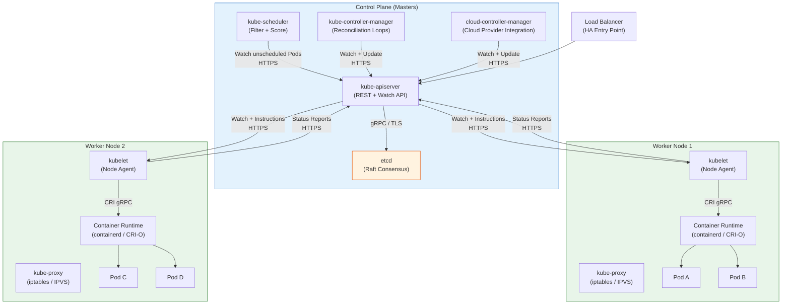

# Kubernetes Architecture

## 1. Overview

Kubernetes (K8s) is a container orchestration platform that automates the deployment, scaling, and operation of containerized workloads across a cluster of machines. At its core, Kubernetes implements a **declarative model**: you tell the system *what* you want (desired state), and the system continuously works to make reality match that declaration. This is fundamentally different from imperative systems where you tell the system *how* to do something step by step.

A Kubernetes cluster is divided into two planes: the **control plane** (the brain that makes decisions) and the **data plane** (the workers that run your applications). The control plane stores desired state, makes scheduling decisions, and runs reconciliation loops. The data plane provides compute, networking, and storage resources where your containers actually execute. This separation is the single most important architectural concept in Kubernetes -- every other design decision flows from it.

Understanding this architecture is the prerequisite for making informed production decisions about cluster sizing, failure domains, upgrade strategies, and cost optimization.

## 2. Why It Matters

- **Declarative model eliminates drift.** Instead of SSH-ing into servers and running commands (which inevitably diverge across machines), you declare what you want and Kubernetes reconciles continuously. If a container crashes at 3 AM, the system restarts it without human intervention.
- **Separation of concerns enables independent scaling.** The control plane and data plane scale independently. You can add 100 worker nodes without changing the control plane topology, or upgrade the control plane without touching running workloads.
- **Fault isolation is built into the topology.** Worker node failures do not affect the control plane (your cluster remains manageable), and a transient control plane outage does not kill running containers -- they continue to serve traffic.
- **Uniform abstraction across environments.** The same architecture runs on bare metal, VMs, and every major cloud provider. This portability lets teams avoid vendor lock-in for the orchestration layer itself.
- **The architecture dictates your failure modes.** Understanding which components live where tells you exactly what breaks when a node dies, a network partitions, or etcd runs out of disk. Without this mental model, production incidents become guesswork.

## 3. Core Concepts

- **Cluster:** A set of machines (nodes) running Kubernetes. Every cluster has at least one control plane node and one worker node (though in production, you run multiple of each). A cluster is the unit of management -- you upgrade, monitor, and secure at the cluster level.
- **Node:** A single machine -- physical or virtual -- in the cluster. Nodes are either control plane nodes or worker nodes based on the components they run. Each node runs a kubelet agent regardless of its role.
- **Control Plane:** The collection of components that manage cluster state: API server, etcd, scheduler, and controller manager. Think of it as the "management layer" that never runs your application workloads. In HA configurations, these components are replicated across 3 or 5 nodes.
- **Data Plane (Worker Nodes):** The nodes that actually run your containerized applications. Each worker runs a kubelet (node agent), a container runtime, and kube-proxy (networking). Worker nodes are the scaling dimension -- you add more to handle more workloads.
- **Desired State vs. Observed State:** You submit a desired state (e.g., "run 3 replicas of nginx"). The system continuously observes actual state and reconciles differences. This gap between desired and observed is the fundamental tension Kubernetes manages. The system never "finishes" -- it is always reconciling.
- **Reconciliation Loop:** The pattern where controllers watch for differences between desired and actual state, then take action to close the gap. Every controller in Kubernetes follows this pattern -- it is the heartbeat of the system. The pattern is level-triggered (react to current state) not edge-triggered (react to individual events), which provides self-healing after any disruption.
- **Declarative Configuration:** Resources are defined in YAML/JSON manifests and submitted to the API server. The system treats these as the source of truth and converges toward them. This is in contrast to imperative commands like "run this container" which are one-shot and do not survive failures.
- **Pod:** The smallest deployable unit in Kubernetes -- a group of one or more containers that share networking and storage. Pods are ephemeral by design; they are created, destroyed, and rescheduled as needed. A Pod gets a unique IP address and a shared localhost, enabling its containers to communicate over 127.0.0.1.
- **Namespace:** A logical partition within a cluster for organizing resources and applying access control. Not a security boundary on its own, but a scoping mechanism for resource names, quotas, and RBAC policies. Common namespaces include `default`, `kube-system` (control plane components), and `kube-public`.
- **Label and Selector:** Labels are key-value pairs attached to objects (Pods, Nodes, Services). Selectors are queries that match labels. This is the primary mechanism for loose coupling in Kubernetes -- a Service selects its backend Pods by label, not by name or IP.
- **Taint and Toleration:** Taints are applied to nodes to repel Pods unless those Pods have a matching toleration. This is how control plane nodes prevent application workloads from being scheduled on them, and how specialized nodes (GPU, high-memory) reserve capacity for appropriate workloads.
- **Resource Requests and Limits:** Requests declare the minimum resources a container needs (used by the scheduler for placement). Limits declare the maximum resources a container can use (enforced by cgroups at runtime). The gap between request and limit is the "burstable" range.
- **Controller:** A control loop that watches the state of a specific resource type and takes action to move the actual state toward the desired state. Examples: Deployment controller manages ReplicaSets, ReplicaSet controller manages Pods, Node controller manages node lifecycle. Controllers are the "doers" of Kubernetes.
- **Workload Resources:** Higher-level abstractions that manage Pods: **Deployment** (stateless, rolling updates), **StatefulSet** (stateful, ordered, stable identity), **DaemonSet** (one Pod per node), **Job/CronJob** (batch and scheduled work).

## 4. How It Works

### The Declarative Model in Practice

When you run `kubectl apply -f deployment.yaml`, the following chain of events unfolds:

1. **kubectl** serializes your YAML into a JSON payload and sends an HTTPS request to the API server.
2. **kube-apiserver** authenticates the request (who are you?), authorizes it (are you allowed?), runs admission controllers (is this request valid and policy-compliant?), and persists the object to **etcd**.
3. The **Deployment controller** (running inside kube-controller-manager) watches for new Deployment objects. It sees yours and creates a ReplicaSet.
4. The **ReplicaSet controller** watches for ReplicaSet objects with fewer Pods than desired. It creates Pod objects.
5. **kube-scheduler** watches for Pods with no assigned node. It evaluates resource requests, affinity rules, taints, and tolerations, then binds the Pod to a suitable node by writing the assignment back to the API server.
6. The **kubelet** on the chosen node watches for Pods assigned to it. It calls the container runtime (via CRI) to pull images and start containers.
7. **kube-proxy** on the node updates iptables/IPVS rules so that the Pod is reachable via Services.

This entire flow is **event-driven through watches**, not polling. Each component watches the API server for changes relevant to its responsibility and reacts. There is no central orchestrator telling each component what to do next -- they are loosely coupled through the shared state in etcd.

### Master/Worker Topology

**Control Plane Nodes (Masters):**
- Run: kube-apiserver, etcd, kube-scheduler, kube-controller-manager, cloud-controller-manager (on cloud providers).
- In production, you deploy 3 or 5 control plane nodes for high availability. The API server runs on all of them (behind a load balancer), but etcd elects a single leader for writes.
- Control plane nodes are typically **tainted** (`node-role.kubernetes.io/control-plane:NoSchedule`) to prevent application workloads from being scheduled on them.
- Sizing guidance: control plane nodes for a 100-node cluster typically need 4 vCPU / 16 GB RAM. For 500+ nodes, 8 vCPU / 32 GB RAM. The API server and etcd are the primary consumers.

**Worker Nodes:**
- Run: kubelet, container runtime (containerd or CRI-O), kube-proxy.
- These are the workhorses that execute your application containers.
- Worker nodes can be heterogeneous -- different instance types, CPU architectures (AMD64, ARM64), or GPU-equipped machines -- and the scheduler can target workloads to appropriate nodes using labels and selectors.
- In cloud environments, worker nodes are organized into **node groups** (EKS) or **node pools** (GKE). Each group can have different instance types, scaling policies, and labels. For example: a `general-purpose` pool of m5.xlarge instances for web services, and a `gpu` pool of p3.2xlarge instances for ML workloads.
- Worker node capacity = total node resources minus **system reserved** (for kubelet, container runtime, OS processes) minus **kube-reserved** (for Kubernetes daemons). A node with 16 GB RAM might have only 13.5 GB allocatable to Pods after reserves.

### The Kubelet: Node Agent in Detail

The kubelet is the most important component on a worker node. It is the bridge between the control plane and the containers running on the node:

1. **Pod lifecycle management:** The kubelet watches the API server for Pods assigned to its node. When it sees a new Pod, it calls the container runtime (via CRI) to create the containers. When a Pod is deleted, it terminates the containers.
2. **Health monitoring:** The kubelet executes **liveness probes** (is the container alive?), **readiness probes** (is the container ready to receive traffic?), and **startup probes** (has the container finished initializing?). Failed liveness probes trigger container restarts. Failed readiness probes remove the Pod from Service endpoints.
3. **Resource enforcement:** The kubelet configures cgroups to enforce CPU and memory limits. If a container exceeds its memory limit, the OOM killer terminates it. If it exceeds its CPU limit, it is throttled.
4. **Node status reporting:** The kubelet sends periodic heartbeats to the API server (via Lease objects) and reports node conditions (Ready, MemoryPressure, DiskPressure, PIDPressure). The node controller uses these to detect node failures.
5. **Volume mounting:** The kubelet attaches and mounts volumes (PersistentVolumes, ConfigMaps, Secrets) into Pod containers before starting them.
6. **Static Pods:** The kubelet can run Pods defined in local manifest files (`/etc/kubernetes/manifests/`) without an API server connection. This is how control plane components themselves are bootstrapped on kubeadm clusters -- the API server, etcd, scheduler, and controller manager are all static Pods managed by the kubelet.

### Node Lifecycle and Failure Detection

Understanding how Kubernetes detects and handles node failures is critical for production reliability:

1. **Healthy state:** The kubelet sends heartbeats (Lease renewals) every 10 seconds (default). The node controller on the control plane receives these and marks the node as Ready.
2. **Heartbeat timeout:** If the node controller does not receive a heartbeat for 40 seconds (default `node-monitor-grace-period`), it marks the node as Unknown.
3. **Pod eviction:** After 5 minutes of Unknown status (default `pod-eviction-timeout`), the node controller starts evicting Pods from the unreachable node. Evicted Pods are rescheduled by their controllers (Deployment, StatefulSet) onto healthy nodes.
4. **Graceful shutdown:** When a node is drained (`kubectl drain`), the kubelet sends SIGTERM to all containers, waits for a grace period (default 30 seconds), then sends SIGKILL. This allows applications to finish in-flight requests.

This timeline matters for your availability calculations: in the worst case, a node failure takes up to 5 minutes and 40 seconds before replacement Pods are scheduled. For latency-sensitive applications, use **Pod Disruption Budgets** and **topology spread constraints** to ensure your application survives node failures without depending on the eviction timeline.

### The Reconciliation Loop Pattern

Every controller in Kubernetes follows the same pattern:

```
loop:
    observed = get current state from API server
    desired  = get desired state from API server
    diff     = compare(observed, desired)
    if diff:
        take action to close the gap
    wait for next event (watch notification)
```

This pattern is **level-triggered, not edge-triggered**. A controller does not just react to a single event; it recomputes the full diff each time. This means if a controller restarts (or misses an event), it simply observes the current state and converges. This self-healing property is what makes Kubernetes resilient to transient failures.

### Communication Patterns

All cluster communication flows through the API server:

| Path | Protocol | Direction | Purpose |
|---|---|---|---|
| kubectl to API server | HTTPS (REST) | External to control plane | User commands, CI/CD pipeline operations |
| kubelet to API server | HTTPS + watch streams | Worker to control plane | Pod assignments, status updates, heartbeats |
| kube-scheduler to API server | HTTPS + watch | Control plane internal | Watch unscheduled Pods, write bindings |
| Controller manager to API server | HTTPS + watch | Control plane internal | Watch resources, create/update dependent objects |
| API server to etcd | gRPC over TLS | Control plane internal | Persist and retrieve all cluster state |
| API server to kubelet | HTTPS (for logs, exec, port-forward) | Control plane to worker | Debugging: kubectl exec, kubectl logs |
| kubelet to container runtime | gRPC (CRI) | Node-local | Container lifecycle: create, start, stop, remove |
| kube-proxy to API server | HTTPS + watch | Worker to control plane | Watch Service/EndpointSlice changes for routing rules |

The API server is the **only** component that talks to etcd. This is a deliberate design choice: it enforces a single point of validation and serialization for all state changes, preventing split-brain scenarios.

### Object Model and API Structure

Kubernetes exposes its functionality through a RESTful API organized into groups:

| API Group | Path | Key Resources |
|---|---|---|
| **Core (legacy)** | `/api/v1` | Pods, Services, ConfigMaps, Secrets, Namespaces, Nodes, PersistentVolumes |
| **apps** | `/apis/apps/v1` | Deployments, StatefulSets, DaemonSets, ReplicaSets |
| **batch** | `/apis/batch/v1` | Jobs, CronJobs |
| **networking** | `/apis/networking.k8s.io/v1` | Ingress, NetworkPolicy, IngressClass |
| **rbac** | `/apis/rbac.authorization.k8s.io/v1` | Roles, ClusterRoles, RoleBindings, ClusterRoleBindings |
| **storage** | `/apis/storage.k8s.io/v1` | StorageClasses, CSIDrivers, VolumeAttachments |
| **autoscaling** | `/apis/autoscaling/v2` | HorizontalPodAutoscaler |

Every Kubernetes object has four required fields:

```yaml
apiVersion: apps/v1        # API group + version
kind: Deployment            # Resource type
metadata:
  name: my-app             # Object name (unique within namespace)
  namespace: production    # Logical partition
  labels:                  # Key-value pairs for selection
    app: my-app
    tier: frontend
spec:                      # Desired state (what you want)
  replicas: 3
  selector:
    matchLabels:
      app: my-app
  template:
    spec:
      containers:
      - name: app
        image: my-app:v1.2.3
        resources:
          requests:
            cpu: 100m
            memory: 128Mi
          limits:
            cpu: 500m
            memory: 512Mi
status:                    # Observed state (what is true -- set by the system)
  replicas: 3
  readyReplicas: 3
  availableReplicas: 3
```

The separation of `spec` (desired) and `status` (observed) is the structural manifestation of the reconciliation model. You write the `spec`; the system writes the `status`. Controllers work to make `status` match `spec`.

### Kubernetes Resource Units

Understanding resource units is essential for capacity planning:

| Resource | Unit | Explanation | Example |
|---|---|---|---|
| **CPU** | millicores (m) | 1 CPU = 1000m. A container with `100m` gets 10% of one CPU core. | `requests: 250m` = 1/4 CPU core |
| **Memory** | bytes (Mi, Gi) | 1 Mi = 1,048,576 bytes (mebibyte). | `limits: 512Mi` = 512 MiB |
| **Ephemeral storage** | bytes (Mi, Gi) | Local disk space for logs, temp files, emptyDir volumes. | `limits: 1Gi` |
| **GPU** | integer | Whole GPUs (no fractional). `nvidia.com/gpu: 1` | `limits: nvidia.com/gpu: 1` |

**Requests vs. Limits in practice:**
- **Requests** are what the scheduler uses for placement. A node with 4 CPU and 3.5 CPU already requested has only 0.5 CPU available for new Pods.
- **Limits** are what cgroups enforce at runtime. A container can burst above its request up to its limit when resources are available.
- **QoS classes** are determined by how requests and limits are set:
  - **Guaranteed:** requests == limits for all containers. Highest priority; last to be evicted.
  - **Burstable:** requests < limits for at least one container. Medium priority.
  - **BestEffort:** no requests or limits set. Lowest priority; first to be evicted under memory pressure.

## 5. Architecture / Flow



## 6. Types / Variants

### Cluster Topologies

| Topology | Control Plane | etcd | Best For |
|---|---|---|---|
| **Single-node (minikube, kind)** | 1 node, all-in-one | Embedded, single member | Local development, CI/CD testing |
| **Stacked HA** | 3+ nodes, etcd co-located on control plane nodes | 3 or 5 members on same nodes | Most production clusters; simpler operations |
| **External etcd HA** | 3+ control plane nodes | Separate 3 or 5 node etcd cluster | Large-scale production; independent scaling of etcd |
| **Managed (EKS, GKE, AKS)** | Cloud-managed, invisible to you | Cloud-managed | Teams that want to offload control plane operations |

### Control Plane Deployment Models

| Model | Who Manages | Examples | Tradeoff |
|---|---|---|---|
| **Self-managed** | You manage everything | kubeadm, kubespray, k0s | Full control, full responsibility for upgrades and patching |
| **Managed control plane** | Cloud provider manages control plane; you manage workers | EKS, GKE, AKS | Reduced ops burden; less control over control plane configuration |
| **Fully managed** | Cloud provider manages everything | GKE Autopilot, EKS Fargate profiles | Minimal ops; reduced flexibility and higher per-pod cost |

### Edge and Lightweight Variants

| Distribution | Use Case | Architecture Difference |
|---|---|---|
| **k3s** | Edge, IoT, resource-constrained | Single binary; SQLite replaces etcd by default; ~70 MB memory |
| **MicroK8s** | Developer workstations, CI | Snap-packaged; single-node default with HA addon |
| **k0s** | Minimal, zero-dependency | Single binary; no host OS dependencies |

## 7. Use Cases

- **Multi-team platform:** A single Kubernetes cluster can serve dozens of teams using namespaces, RBAC, and resource quotas. This is the "internal platform" model used by organizations like Spotify and Airbnb, where a platform team operates the cluster and product teams deploy via GitOps. Each team gets a namespace with resource quotas (e.g., 100 CPU, 200 Gi memory) and LimitRanges that enforce defaults.
- **Hybrid cloud deployment:** The same workload manifests deploy to on-premises clusters and cloud-managed clusters (EKS/GKE/AKS), enabling disaster recovery across environments or gradual cloud migration. Tools like ArgoCD or Flux manage manifests across clusters from a single Git repository.
- **CI/CD pipeline execution:** Kubernetes runs ephemeral CI jobs as Pods. Each build gets a clean container, scales horizontally during peak commit hours, and costs nothing when idle (with cluster autoscaler). Jenkins X, Tekton, and GitHub Actions runners on Kubernetes use this pattern.
- **Stateful workloads with StatefulSets:** Databases (PostgreSQL, Cassandra), message queues (Kafka), and caches (Redis) run on Kubernetes using StatefulSets with persistent volumes, stable network identities, and ordered rolling updates. Each Pod in a StatefulSet gets a predictable name (e.g., `postgres-0`, `postgres-1`) and a dedicated PersistentVolume that survives Pod rescheduling.
- **Machine learning pipelines:** GPU-equipped worker nodes handle training jobs while CPU nodes serve inference. The scheduler places workloads on the right hardware using node selectors and tolerations. Kubeflow, Ray, and Volcano are Kubernetes-native ML frameworks that leverage this scheduling capability.
- **Event-driven autoscaling:** KEDA (Kubernetes Event-Driven Autoscaling) scales workloads to zero when idle and up based on event sources (Kafka topic lag, SQS queue depth, Prometheus metrics). This is particularly useful for batch processing and asynchronous workloads where the load is bursty.
- **Edge computing:** k3s clusters run at retail stores, cell towers, or IoT gateways. A central management plane (Rancher, AWS EKS Anywhere) pushes configurations to hundreds or thousands of edge clusters, each running on minimal hardware (2 vCPU, 4 GB RAM).

### The Five Pillars of Kubernetes

From the source material, Kubernetes functionality is organized around five pillars. Understanding these pillars provides a mental framework for categorizing any Kubernetes resource or operation:

| Pillar | Core Resources | Purpose |
|---|---|---|
| **1. Computation** | Pods, Deployments, StatefulSets, DaemonSets, Jobs, CronJobs, ReplicaSets | Running and managing containerized workloads |
| **2. Networking** | Services, Ingress, Endpoints, EndpointSlices, NetworkPolicies, IngressClasses | Connecting workloads and controlling traffic |
| **3. Storage** | PersistentVolumes (PVs), PersistentVolumeClaims (PVCs), StorageClasses, CSI Drivers | Providing durable storage to stateful workloads |
| **4. Security** | ServiceAccounts, Roles, ClusterRoles, RoleBindings, Secrets, PodSecurityAdmission | Identity, access control, and secret management |
| **5. Custom Resources** | CRDs, Operators, Aggregated APIs | Extending Kubernetes with domain-specific abstractions |

Each pillar represents a complete subsystem with its own API resources, controllers, and operational concerns. A production-ready Kubernetes deployment requires competency across all five.

**Computation pillar in detail:**
- **DaemonSets** ensure one Pod per node -- used for node-level agents like log collectors (Fluent Bit), monitoring agents (Prometheus node-exporter), and CNI plugins.
- **StatefulSets** provide stable, unique network identities and persistent storage for each Pod. Used for databases, message queues, and any workload requiring stable identity across restarts.
- **Jobs** run Pods to completion -- used for batch processing, data migrations, and one-off tasks.
- **CronJobs** schedule Jobs on a cron-like schedule -- used for periodic data processing, report generation, and cleanup tasks.

## 8. Tradeoffs

| Decision | Option A | Option B | Guidance |
|---|---|---|---|
| **Stacked vs. External etcd** | Stacked: simpler operations, fewer machines | External: independent failure domain for etcd | Stacked for clusters <500 nodes; external for large-scale or when etcd performance is critical |
| **Managed vs. Self-managed** | Managed: less ops burden, faster time-to-value | Self-managed: full control over versions, networking, etcd | Managed unless you need custom admission controllers, specific K8s versions, or air-gapped environments |
| **Single large cluster vs. many small clusters** | Single: simpler networking, shared resources | Many: blast radius isolation, team autonomy | Start with fewer clusters; split when RBAC complexity or blast radius concerns outweigh operational overhead |
| **Taint control plane nodes vs. allow workloads** | Taint: dedicated resources, predictable control plane performance | Allow: use control plane node capacity for workloads | Always taint in production; allowing workloads risks starving the API server under load |
| **3 vs. 5 control plane nodes** | 3: lower cost, sufficient for most clusters | 5: tolerates 2 simultaneous failures | 3 nodes for most production clusters; 5 for clusters requiring maximum availability |

## 9. Common Pitfalls

- **Treating control plane as indestructible.** A single control plane node is a single point of failure. If etcd loses its data and you have no backup, you lose the entire cluster state. Always run HA control planes in production and back up etcd regularly.
- **Ignoring etcd disk performance.** etcd is extremely sensitive to disk latency. Running etcd on shared, throttled storage (like default AWS EBS gp2) causes leader elections to timeout under load, destabilizing the entire cluster. Use SSD-backed storage with provisioned IOPS.
- **Confusing control plane down with cluster down.** When the control plane is unavailable, existing Pods continue running. You cannot make changes, but running workloads are unaffected. This is critical during maintenance -- plan for it rather than panicking.
- **Over-provisioning worker nodes instead of right-sizing.** Adding large nodes without understanding Pod resource requests leads to wasted capacity. Use resource requests and limits, then monitor actual utilization to right-size.
- **Skipping resource requests and limits.** Without resource requests, the scheduler cannot make informed placement decisions. Without limits, a single runaway container can OOM-kill neighbors on the same node.
- **Running too many control plane components on one node.** On stacked HA setups, the API server, etcd, scheduler, and controller manager all compete for CPU and memory. Size control plane nodes generously -- at least 4 vCPU / 16 GB RAM for clusters with 100+ nodes.
- **Upgrading all nodes at once.** Kubernetes supports a version skew of n-1 between the control plane and kubelets. Upgrade the control plane first, then roll workers in batches. This is not just a best practice -- it is a hard requirement, as newer kubelets may use APIs the older control plane does not support.
- **Neglecting Pod Disruption Budgets (PDBs).** Without PDBs, cluster operations like node drains during upgrades can evict all replicas of a service simultaneously. A PDB with `minAvailable: 50%` ensures at least half of your Pods remain running during voluntary disruptions.
- **Using the `default` namespace for production workloads.** The default namespace has no resource quotas, no LimitRanges, and no network policies. Creating dedicated namespaces per team or service with appropriate quotas and policies is the first step toward multi-tenant isolation.

## 10. Real-World Examples

- **Google (Borg to Kubernetes):** Kubernetes was born from Google's internal Borg system, which has managed billions of containers since 2003. The control plane / data plane separation, declarative model, and reconciliation loop pattern all trace directly to Borg's architecture. The key difference: Borg uses a monolithic scheduler (Borgmaster), while Kubernetes factored the scheduler into a separate, replaceable component. Google's 2015 paper "Large-scale cluster management at Google with Borg" documents running 10,000+ node clusters with a centralized scheduler handling >10,000 scheduling decisions per second.
- **Shopify:** Runs one of the largest Kubernetes deployments, with clusters spanning thousands of nodes. They use stacked HA topology with dedicated etcd SSDs and have published that their control plane handles ~15,000 pods per cluster with sub-second scheduling latency. Their platform team publishes internal SLOs: Pod scheduling latency p99 < 5 seconds, API server availability > 99.99%.
- **CERN:** Operates Kubernetes clusters for physics data processing, running 320,000+ cores across multiple clusters. They use a multi-cluster federation model because a single cluster's control plane cannot scale to their total node count. Each cluster runs up to ~5,000 nodes (the tested Kubernetes scalability limit), and a higher-level orchestration layer distributes workloads across clusters.
- **Airbnb:** Migrated from a monolithic architecture to Kubernetes-based microservices. Their platform team manages the cluster infrastructure, while ~1,000 engineers deploy services via a GitOps pipeline that submits manifests to the API server. They use a multi-cluster architecture with clusters specialized by workload type (web-serving vs. batch processing).
- **Pinterest:** Runs ~30,000 Pods across multiple Kubernetes clusters. Their migration from Mesos to Kubernetes took 2 years and required building custom controllers for their specific deployment patterns. Key insight from their migration: the declarative model significantly reduced deployment-related incidents because configuration drift was eliminated.
- **Cost benchmarks (from source material):** In production Kubernetes, compute accounts for 70-80% of costs, storage 10-15%, and network/miscellaneous the remaining 10%. AMD/ARM instances are 30-40% cheaper than Intel equivalents, and Spot instances provide 80-90% savings over on-demand. Affinity rules allow architects to prefer Spot instances (soft affinity) with on-demand fallback, balancing cost and availability.

### Kubernetes Scalability Limits

Understanding the tested limits helps with capacity planning:

| Dimension | Tested Limit | Notes |
|---|---|---|
| **Nodes per cluster** | 5,000 | Official SIG Scalability benchmark |
| **Pods per cluster** | 150,000 | Across all nodes |
| **Pods per node** | 110 (default) | Configurable via `--max-pods` on kubelet |
| **Services per cluster** | 10,000 | With IPVS kube-proxy mode |
| **Endpoints per Service** | 5,000 (EndpointSlice) | EndpointSlices split into 100-endpoint chunks |
| **Namespaces per cluster** | 10,000 | Practical limit; API performance degrades beyond this |
| **ConfigMaps per namespace** | No hard limit | Watch out for etcd size |
| **Total etcd size** | 8 GB (default quota) | Configurable but not recommended to increase significantly |

These are not hard walls -- they are the tested boundaries. Beyond them, you enter territory where latency increases, scheduling slows, and etcd becomes strained. Multi-cluster architectures (with tools like Loft, vCluster, or Kubernetes Federation) are the standard approach for scaling beyond these limits.

### Version Skew Policy

Kubernetes has strict rules about which versions of components can run together in a cluster:

| Component | Supported Skew from kube-apiserver | Example |
|---|---|---|
| **kube-controller-manager** | Same minor version | API server 1.29 requires CM 1.29 |
| **kube-scheduler** | Same minor version | API server 1.29 requires scheduler 1.29 |
| **kubelet** | n-1 to n | API server 1.29 supports kubelet 1.28-1.29 |
| **kube-proxy** | Same as kubelet | Must match kubelet version on the node |
| **kubectl** | n-1 to n+1 | kubectl 1.28, 1.29, or 1.30 works with API server 1.29 |

This policy dictates upgrade order: always upgrade the control plane first, then worker nodes. In managed Kubernetes, the provider handles control plane version compatibility; you manage worker node versions.

## 11. Related Concepts

- [Control Plane Internals](./02-control-plane-internals.md) -- deep dive into each control plane component
- [API Server and etcd](./03-api-server-and-etcd.md) -- request lifecycle, admission controllers, etcd consensus
- [Container Runtime](./04-container-runtime.md) -- the CRI interface and runtime hierarchy on worker nodes
- [Kubernetes Networking Model](./05-kubernetes-networking-model.md) -- how Pods communicate across the cluster
- [Availability and Reliability](../../traditional-system-design/01-fundamentals/04-availability-reliability.md) -- HA concepts that underpin control plane design
- [CAP Theorem](../../traditional-system-design/01-fundamentals/05-cap-theorem.md) -- consistency model underlying etcd's Raft consensus
- [Networking Fundamentals](../../traditional-system-design/01-fundamentals/06-networking-fundamentals.md) -- OSI layers, TCP/UDP, proxy patterns used throughout K8s

### Imperative vs. Declarative: A Concrete Comparison

Understanding why Kubernetes chose the declarative model is clearer with a side-by-side comparison:

**Imperative approach (shell scripts, Ansible tasks):**
```bash
# Scale to 5 replicas
ssh server1 "docker run -d my-app"
ssh server2 "docker run -d my-app"
ssh server3 "docker run -d my-app"
ssh server4 "docker run -d my-app"
ssh server5 "docker run -d my-app"
# What if server3 was already running my-app?
# What if server2 is unreachable?
# What if my-app crashes on server5?
```

**Declarative approach (Kubernetes):**
```yaml
spec:
  replicas: 5
# Kubernetes handles: which nodes, what happens on crash,
# what if a node is unreachable, what if a replica already exists.
```

The declarative model eliminates an entire class of operational errors: the "what if" questions that imperative scripts must anticipate and handle explicitly. Kubernetes handles them automatically through reconciliation.

## 12. Source Traceability

- source/youtube-video-reports/7.md -- Five pillars of Kubernetes (Computation, Networking, Storage, Security, Custom Resources), control plane vs data plane analysis, strategic framework for evaluating architectures
- source/youtube-video-reports/1.md -- Container runtime hierarchy, Docker shim deprecation, Kubernetes cluster management context
- source/extracted/acing-system-design/ch03-a-walkthrough-of-system-design-concepts.md -- Kubernetes cluster management for horizontal scalability, Docker/Kubernetes/Ansible toolchain, pod-based sidecar architecture
- Kubernetes official documentation (kubernetes.io) -- Cluster architecture, components reference, scheduling framework
