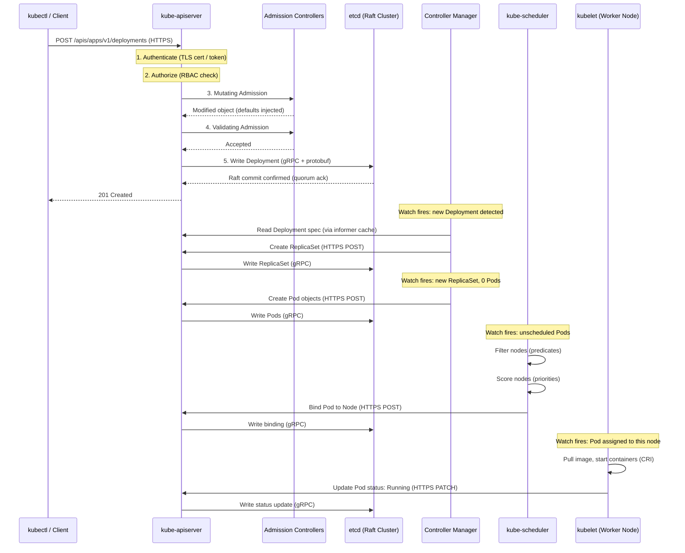

# Control Plane Internals

## 1. Overview

The Kubernetes control plane is the set of components responsible for maintaining the desired state of the entire cluster. It accepts your declarations ("run 3 replicas of my service"), stores them durably, makes scheduling decisions, and continuously reconciles actual state with desired state through a network of independent controllers.

The control plane consists of five components: **kube-apiserver** (the front door for all cluster operations), **etcd** (the durable state store), **kube-scheduler** (the placement engine), **kube-controller-manager** (the reconciliation engine), and **cloud-controller-manager** (the cloud provider integration layer). Each component is a separate process with a distinct responsibility, but they coordinate exclusively through the API server -- no component talks directly to another. This loose coupling is what makes the control plane resilient: any component can restart independently and catch up from the shared state in etcd.

Understanding these components at an operational depth -- what they do, how they fail, and how to tune them -- is the difference between running a toy cluster and running a production platform.

## 2. Why It Matters

- **The control plane is your cluster's single point of intelligence.** If it goes down, you cannot deploy, scale, or heal workloads. Running workloads survive, but the cluster becomes unmanageable. Understanding each component's failure mode lets you design appropriate HA strategies.
- **Performance bottlenecks hide in control plane components.** A slow API server or an overloaded etcd cluster causes cascading effects: scheduling delays, controller backlogs, and kubelet disconnections. Knowing the internals tells you where to look first during incidents.
- **Security posture starts at the API server.** Every request to the cluster passes through authentication, authorization, and admission control on the API server. Misconfiguring these layers is the most common path to cluster compromise.
- **Scheduler behavior directly affects cost and reliability.** Understanding how the scheduler filters and scores nodes lets you use affinity rules, topology spread constraints, and priority classes to optimize both placement and spend.
- **Controller semantics determine application behavior.** The difference between a Deployment rollout and a StatefulSet update is entirely in how their respective controllers reconcile. Understanding controllers means understanding your application's lifecycle.

## 3. Core Concepts

- **kube-apiserver:** The RESTful API gateway for the entire cluster. Every read and write -- from kubectl, kubelets, controllers, and external integrations -- goes through this component. It handles authentication, authorization, admission control, validation, and persistence to etcd.
- **etcd:** A distributed key-value store that uses the Raft consensus algorithm. It is the single source of truth for all cluster state. The API server is the only component that reads from or writes to etcd.
- **kube-scheduler:** Watches for newly created Pods that have no node assignment. It runs a two-phase algorithm (filter, then score) to select the best node, then writes the binding back to the API server.
- **kube-controller-manager:** A single binary that bundles dozens of controllers, each running a reconciliation loop for a specific resource type (Deployments, ReplicaSets, Nodes, Endpoints, ServiceAccounts, etc.).
- **cloud-controller-manager:** Runs controllers that interact with the underlying cloud provider's API -- managing load balancers, node lifecycle (detecting when a VM is terminated), and routes. This component exists to decouple cloud-specific logic from core Kubernetes.
- **Leader Election:** For high availability, multiple replicas of the scheduler and controller manager run across control plane nodes, but only one is active (the leader) at a time. Leader election uses lease objects in Kubernetes to coordinate.
- **Watch Mechanism:** Components do not poll the API server. Instead, they open long-lived HTTP/2 watch streams. The API server pushes events (ADDED, MODIFIED, DELETED) to watchers in real time, enabling event-driven reconciliation.
- **Informer / SharedInformer:** Client-go library constructs that maintain a local cache of watched resources and deliver events through a work queue. Nearly every controller uses informers to avoid hammering the API server with redundant reads.

## 4. How It Works

### kube-apiserver: The Gatekeeper

The API server processes every request through a pipeline:

1. **TLS Termination:** All connections are TLS-encrypted. Client certificates, bearer tokens, or webhook-based authentication verify identity.
2. **Authentication:** Identifies the caller. Supports multiple strategies simultaneously: X.509 client certificates, bearer tokens (service accounts), OIDC tokens (for human users via identity providers), and webhook token review.
3. **Authorization:** Determines if the authenticated identity can perform the requested action on the requested resource. RBAC (Role-Based Access Control) is the standard mode. The API server evaluates Role/ClusterRole bindings.
4. **Admission Control:** A chain of plugins that can **mutate** (modify the request) or **validate** (accept/reject). Examples: `LimitRanger` sets default resource limits, `PodSecurityAdmission` enforces security standards, `MutatingAdmissionWebhook` and `ValidatingAdmissionWebhook` call external services for custom policy enforcement (e.g., OPA Gatekeeper, Kyverno).
5. **Validation:** Schema validation ensures the object conforms to the API specification.
6. **Persistence:** The validated object is serialized (protobuf for efficiency) and written to etcd.
7. **Watch Notification:** After the write, the API server notifies all active watchers of the change.

The API server is **stateless** -- it holds no local state and can be horizontally scaled. In HA setups, 3 or more API server instances run behind a load balancer. Any instance can serve any request because all state lives in etcd.

**API Server HA Architecture:**
- All API server instances are active simultaneously (active-active, not active-passive).
- A TCP load balancer (not HTTP -- the LB does not need to understand the protocol) distributes connections across instances.
- Each instance maintains its own watch cache independently, fed by etcd watches.
- The load balancer should use health checks against the API server's `/healthz` or `/readyz` endpoints.
- In managed Kubernetes (EKS, GKE, AKS), the cloud provider runs the API servers and the load balancer -- you only see the endpoint URL.

**Key production metrics for the API server:**

| Metric | Healthy Target | What It Tells You |
|---|---|---|
| `apiserver_request_duration_seconds` p99 | < 1s (mutating), < 30s (LIST) | End-to-end request latency including etcd and admission |
| `apiserver_request_total` by code | Low 5xx rate (< 0.1%) | API server errors; spike indicates backend issues |
| `apiserver_current_inflight_requests` | Below `--max-requests-inflight` (default 400) | If near limit, API server is saturated |
| `apiserver_admission_webhook_admission_duration_seconds` | < 100ms p99 | Slow webhooks add latency to every matching request |
| `etcd_request_duration_seconds` | < 100ms p99 | API server's view of etcd latency |

### etcd: The Source of Truth

etcd stores all Kubernetes objects as key-value pairs under a prefix structure like `/registry/pods/default/my-pod`. It provides:

- **Strong consistency** via Raft consensus: every write is committed by a quorum (majority) before being acknowledged.
- **Watch support:** The API server watches etcd for changes, which in turn feeds the watch streams to all other components.
- **Revision-based history:** Every mutation increments a global revision number, enabling consistent reads and efficient watch resumption.

Production clusters run 3 or 5 etcd members. Writes require quorum: 2-of-3 or 3-of-5. More members increases fault tolerance but adds write latency because more nodes must acknowledge. See [API Server and etcd](./03-api-server-and-etcd.md) for deep dive.

**Key production metric:** etcd fsync duration (the `wal_fsync_duration_seconds` histogram). If the 99th percentile exceeds 10 ms, etcd is likely on slow storage. This single metric is the most common root cause of control plane instability.

### kube-scheduler: The Placement Engine

The scheduler runs a two-phase algorithm for every unscheduled Pod:

**Phase 1 -- Filtering (Predicates):**
Eliminates nodes that cannot run the Pod. Filters include:
- `PodFitsResources`: Does the node have enough CPU and memory?
- `PodFitsHostPorts`: Are the required host ports available?
- `NodeAffinity`: Does the node match the Pod's affinity rules?
- `TaintToleration`: Does the Pod tolerate the node's taints?
- `PodTopologySpread`: Would scheduling here violate topology spread constraints?

**Phase 2 -- Scoring (Priorities):**
Ranks surviving nodes on a 0-100 scale. Scoring plugins include:
- `LeastAllocated`: Prefers nodes with more available resources (spreads load).
- `MostAllocated`: Prefers nodes with fewer available resources (bin-packs for cost).
- `NodeAffinity`: Higher score for preferred (soft) affinity matches.
- `InterPodAffinity`: Higher score for nodes running related Pods.
- `ImageLocality`: Higher score if the node already has the container image cached.

The node with the highest weighted score wins. If multiple nodes tie, one is selected randomly. The scheduler then writes a **Binding** object to the API server, which assigns the Pod to the chosen node.

**Scheduler performance tuning:** For large clusters (5,000+ nodes), the scheduler uses `percentageOfNodesToScore` (default: adapts based on cluster size) to cap how many nodes are scored after filtering. This prevents the scoring phase from becoming a bottleneck.

**Scheduling Framework Extension Points:**

The scheduler is built as a framework with well-defined extension points, allowing custom plugins to be injected at each phase:

| Extension Point | Phase | Purpose | Example |
|---|---|---|---|
| `PreFilter` | Before filtering | Compute Pod-level data needed by filters | Check pod group size (gang scheduling) |
| `Filter` | Filtering | Eliminate ineligible nodes | NodeAffinity, TaintToleration, PodFitsResources |
| `PostFilter` | After filtering | Handle when no node passes filtering | Preemption -- evict lower-priority Pods to make room |
| `PreScore` | Before scoring | Compute data needed by scoring plugins | Gather topology information |
| `Score` | Scoring | Rank eligible nodes 0-100 | LeastAllocated, ImageLocality, NodeAffinity |
| `Reserve` | After scoring | Optimistically reserve resources | Volume binding reservation |
| `Permit` | Before binding | Delay or deny binding | Gang scheduling -- wait for all group members |
| `Bind` | Final | Write the Pod-to-Node binding | Default binding, volume binding |

**Priority and Preemption:**

When a high-priority Pod cannot be scheduled (all nodes filtered out), the scheduler's PostFilter phase runs preemption logic:

1. The scheduler identifies lower-priority Pods whose eviction would free enough resources.
2. It selects the node where preemption causes the least disruption (fewest evictions, lowest priority victims).
3. It evicts the victims (graceful termination with the configured grace period).
4. The pending high-priority Pod is scheduled to the now-freed node.

PriorityClasses assign numeric priorities to Pods. Common production setup:
- `system-critical` (2000000000): control plane components
- `production-high` (1000000): revenue-critical services
- `production-default` (500000): standard production workloads
- `batch` (100000): batch jobs, background processing
- `best-effort` (0): development, testing

### kube-controller-manager: The Reconciliation Engine

The controller manager runs ~30 controllers in a single process. Key controllers include:

| Controller | Watches | Reconciles |
|---|---|---|
| **Deployment** | Deployments | Creates/updates ReplicaSets; manages rollout strategy (rolling update, recreate) |
| **ReplicaSet** | ReplicaSets | Creates/deletes Pods to match desired replica count |
| **Node** | Node heartbeats | Marks nodes as NotReady after missed heartbeats; evicts Pods from unreachable nodes |
| **Endpoint / EndpointSlice** | Services + Pods | Populates endpoint lists so kube-proxy and DNS know where to route traffic |
| **ServiceAccount** | Namespaces | Creates default ServiceAccount in new namespaces |
| **Job** | Jobs | Creates Pods for batch work; tracks completions and failures |
| **PersistentVolume** | PVCs + PVs | Binds claims to available volumes |
| **Namespace** | Namespaces (terminating) | Cleans up all resources when a namespace is deleted |

Each controller runs independently and uses **informers** (local caches backed by API server watches) to avoid redundant reads. When an informer receives an event, it enqueues the object key into a **work queue**. Worker goroutines dequeue items and execute the reconciliation logic. This architecture naturally handles retries with exponential backoff.

**The Informer-WorkQueue Architecture in Detail:**

```
API Server Watch Stream
        |
        v
  SharedInformer
   (local cache)
        |
        v
  Event Handler
 (AddFunc, UpdateFunc, DeleteFunc)
        |
        v
    Work Queue
  (rate-limited, deduplicating)
        |
        v
   Worker Goroutines
  (reconcile one object at a time)
        |
        v
  API Server (read/write)
```

Key properties of this architecture:
- **Deduplication:** The work queue stores object keys (namespace/name), not events. If an object changes 10 times before a worker processes it, the worker reconciles once against the latest state.
- **Rate limiting:** The queue uses exponential backoff for failed items (default: 5ms base, 1000s max). This prevents a permanently failing resource from consuming all worker capacity.
- **Idempotency:** Reconciliation logic must be idempotent -- running it multiple times with the same input produces the same result. This is essential because the same object may be reconciled multiple times due to retries, watch reconnections, or informer resyncs.

**Key production consideration:** The `--concurrent-syncs` flag (per controller type) controls how many reconciliation workers run in parallel. For large clusters with thousands of Deployments, increasing `--concurrent-deployment-syncs` from the default (5) can reduce reconciliation lag.

**Controller Manager Defaults and Tuning:**

| Parameter | Default | When to Tune |
|---|---|---|
| `--concurrent-deployment-syncs` | 5 | Large clusters with >500 Deployments |
| `--concurrent-replicaset-syncs` | 5 | High Pod churn environments |
| `--concurrent-service-syncs` | 1 | Clusters with >1,000 Services |
| `--node-monitor-grace-period` | 40s | Adjust based on network reliability |
| `--pod-eviction-timeout` | 5m | Balance between fast recovery and avoiding premature eviction |
| `--terminated-pod-gc-threshold` | 12,500 | Increase if completed Pods accumulate |

### Horizontal Pod Autoscaler (HPA) Controller

The HPA controller deserves special mention because it directly affects application scaling behavior:

1. The HPA controller runs inside the controller manager on a 15-second loop (default `--horizontal-pod-autoscaler-sync-period`).
2. Each loop, it queries the metrics API (metrics-server for CPU/memory, custom metrics adapter for application metrics).
3. It computes the desired replica count using the formula: `desiredReplicas = ceil[currentReplicas * (currentMetricValue / desiredMetricValue)]`.
4. It applies stabilization windows: scale-up stabilization (default 0s -- scale up immediately) and scale-down stabilization (default 5 minutes -- wait to avoid flapping).
5. It updates the Deployment's replica count.

**Production HPA guidance from source material:** Trigger HPA at approximately 80% of the resource limit. This creates a "bandwidth buffer" -- the existing Pod can burst to its limit while the new Pod is starting up, preventing latency spikes during scale-out events.

### cloud-controller-manager: The Cloud Bridge

This component runs cloud-specific controllers that were originally embedded in the kube-controller-manager. Separating them allows:

- **Cloud providers to release independently** from the core Kubernetes release cycle.
- **Bare-metal clusters to skip it entirely** -- no cloud-controller-manager needed.

Cloud controllers include:

| Controller | Purpose | Example |
|---|---|---|
| **Node** | Detects when a cloud VM backing a Kubernetes node is terminated; cleans up the Node object | EC2 instance terminated by ASG scale-in; CCM removes the Node from K8s |
| **Route** | Configures cloud network routes so Pods on different nodes can communicate | Adds VPC route: 10.244.2.0/24 → Node 2's ENI |
| **Service (LoadBalancer)** | Provisions cloud load balancers when a Service of type LoadBalancer is created | Creates an AWS NLB with target group pointing to node ports |

**Cloud Controller Manager per provider:**

| Cloud Provider | CCM | Key Integration Points |
|---|---|---|
| **AWS** | aws-cloud-controller-manager | ELB/NLB provisioning, node lifecycle via EC2 API, VPC route management |
| **GCP** | gcp-cloud-provider | GCP LB, node lifecycle via Compute Engine API, VPC routes |
| **Azure** | cloud-provider-azure | Azure LB, VM lifecycle, VNet routes, availability sets/zones |
| **Bare Metal** | Not used | MetalLB or similar provides LoadBalancer functionality instead |

### Control Plane Component Resource Consumption

Understanding resource consumption helps with node sizing:

| Component | Typical CPU Usage | Typical Memory Usage | Scaling Factor |
|---|---|---|---|
| **kube-apiserver** | 200m-2000m | 500Mi-8Gi | Scales with request rate, watch count, and cluster size |
| **etcd** | 100m-1000m | 500Mi-4Gi | Scales with write rate and database size |
| **kube-scheduler** | 50m-500m | 100Mi-500Mi | Scales with scheduling throughput |
| **kube-controller-manager** | 100m-500m | 200Mi-1Gi | Scales with number of objects and reconciliation rate |
| **cloud-controller-manager** | 50m-200m | 100Mi-500Mi | Scales with cloud API call rate |

For a 200-node cluster, a control plane node with 4 vCPU and 16 GB RAM is typically sufficient. For 1,000+ node clusters, consider 8 vCPU and 32 GB RAM, with dedicated SSD storage for etcd.

## 5. Architecture / Flow



## 6. Types / Variants

### API Server Configurations

| Configuration | Description | When to Use |
|---|---|---|
| **Single API server** | One instance, no HA | Development only |
| **HA behind LB** | 3+ instances behind a TCP load balancer | All production clusters |
| **With aggregation layer** | API server proxies requests to extension API servers (e.g., metrics-server, custom APIs) | When extending the K8s API surface |
| **With admission webhooks** | External webhook servers handle mutation/validation | Policy enforcement (OPA, Kyverno) |

### Scheduler Profiles

| Profile | Scoring Strategy | Use Case |
|---|---|---|
| **Default (LeastAllocated)** | Spread Pods across nodes for resilience | General workloads |
| **MostAllocated (bin-packing)** | Pack Pods tightly to minimize node count | Cost optimization with cluster autoscaler |
| **Custom profiles** | Multiple profiles with different plugin weights | Multi-tenant clusters with different workload types |

### Controller Manager Deployment Patterns

| Pattern | Description | Tradeoff |
|---|---|---|
| **Default (all-in-one)** | All controllers in one process | Simpler operations; single process to monitor |
| **Selective disable** | Disable specific controllers with `--controllers=-<name>` | When a custom controller replaces a built-in one |
| **External controllers** | Third-party controllers run separately (cert-manager, external-dns) | Extends K8s without modifying core components |

## 7. Use Cases

- **Zero-downtime deployments:** The Deployment controller implements rolling updates by scaling up a new ReplicaSet while scaling down the old one, one Pod at a time. The `maxSurge` and `maxUnavailable` parameters let you control the tradeoff between deployment speed and resource consumption. For a 10-replica Deployment with `maxSurge: 25%` and `maxUnavailable: 25%`, the system runs 8-13 Pods during the rollout -- enough to handle traffic while gradually shifting to the new version.
- **Automatic node failure recovery:** The Node controller detects missing heartbeats (default: 40-second grace period) and marks the node as NotReady. After a configurable timeout (`pod-eviction-timeout`, default 5 minutes), it triggers Pod eviction, and the ReplicaSet controller creates replacement Pods on healthy nodes. End-to-end recovery time: ~6 minutes worst case.
- **Cloud load balancer provisioning:** When a Service of type LoadBalancer is created, the cloud-controller-manager provisions a cloud LB (AWS NLB, GCP LB) and configures it to point at the node ports. This entire flow is triggered by a single YAML manifest. The cloud controller watches for Service changes and reconciles the external LB state.
- **Bin-packing for cost optimization:** Using a scheduler profile with MostAllocated scoring packs Pods onto fewer nodes. Combined with cluster autoscaler, empty nodes are drained and terminated, directly reducing cloud compute spend. Organizations report 20-40% compute savings from switching to bin-packing with autoscaler.
- **Policy enforcement at admission:** Admission webhooks intercept every resource creation/modification. A tool like Kyverno or OPA Gatekeeper can enforce policies like "all Pods must have resource limits," "no containers running as root," or "images must come from approved registries." This is the runtime enforcement layer of your security posture.
- **Namespace-scoped resource governance:** The ResourceQuota admission controller (part of the controller manager) enforces per-namespace limits on total CPU, memory, storage, and object counts. Combined with LimitRange (which sets per-Pod defaults and maximums), this prevents any single team from consuming all cluster resources.
- **Certificate rotation:** The certificate signing controller automates TLS certificate issuance and rotation for kubelets. When a kubelet's certificate approaches expiration, it submits a CertificateSigningRequest (CSR), and the controller approves and signs it. This eliminates manual certificate management across large fleets.

## 8. Tradeoffs

| Decision | Option A | Option B | Guidance |
|---|---|---|---|
| **RBAC granularity** | Broad ClusterRoles (simpler) | Fine-grained namespaced Roles (secure) | Start restrictive; grant broader access only when justified |
| **Admission webhooks** | In-cluster (lower latency) | External service (independent scaling) | In-cluster for most cases; external only if the webhook needs its own lifecycle |
| **Scheduler profiles** | LeastAllocated (resilience) | MostAllocated (cost) | LeastAllocated for HA-sensitive workloads; MostAllocated for batch/dev with autoscaler |
| **etcd topology** | Stacked on control plane nodes | Dedicated etcd nodes | Stacked for simplicity; external for large clusters (>500 nodes) or when etcd needs independent tuning |
| **Leader election lease duration** | Short (15s) -- faster failover | Long (60s) -- fewer spurious failovers | Default (15s lease, 10s renew) works for most; increase if network is unreliable |
| **API server cache size** | Default (small) | Large `--watch-cache-size` | Increase for clusters with many watchers (>1000 nodes) to reduce etcd read pressure |

## 9. Common Pitfalls

- **Admission webhooks with unavailable backends.** If a `MutatingAdmissionWebhook` or `ValidatingAdmissionWebhook` points to a service that is down, it blocks ALL matching API requests. Always set `failurePolicy: Ignore` for non-critical webhooks, or ensure the webhook service has its own HA and is excluded from its own admission check (to prevent circular dependency).
- **Controller manager starvation during mass updates.** When you update many Deployments simultaneously (e.g., cluster-wide image bump), the Deployment controller's work queue can back up. Monitor `workqueue_depth` and increase `--concurrent-deployment-syncs` if needed.
- **Scheduler thrashing with pod topology spread.** Overly strict `topologySpreadConstraints` with `whenUnsatisfiable: DoNotSchedule` can leave Pods pending indefinitely if the cluster cannot satisfy the constraint. Prefer `ScheduleAnyway` with a penalty unless strict spread is a hard requirement.
- **etcd leader elections disrupting the cluster.** Frequent leader changes (visible in etcd logs and `etcd_server_leader_changes_seen_total` metric) indicate disk or network issues. Each leader election causes a brief write pause. Investigate disk IOPS and network latency between etcd members immediately.
- **Not monitoring API server request latency.** The API server can appear healthy (returning 200s) while serving requests slowly because etcd is overloaded. Monitor `apiserver_request_duration_seconds` and alert if p99 exceeds 1 second.
- **Running cloud-controller-manager on bare metal.** If there is no cloud provider, omit the cloud-controller-manager entirely. Running it with an incorrect or missing cloud configuration leads to confusing Node conditions and stuck Services.
- **Ignoring scheduler preemption side effects.** When a high-priority Pod preempts lower-priority Pods, those evicted Pods may trigger cascading effects -- alerting, PDB violations, and temporary service degradation. Design PriorityClasses carefully and test preemption behavior before relying on it in production.
- **Not sizing the API server for LIST operations.** A single `kubectl get pods --all-namespaces` on a cluster with 50,000 Pods can consume hundreds of MB of API server memory and take 10+ seconds. In large clusters, use label selectors, field selectors, and pagination to limit LIST scope. Monitor `apiserver_response_sizes` to detect expensive queries.
- **Assuming leader election is instantaneous.** When the active scheduler or controller manager crashes, the standby takes over after the lease expires (default: 15 seconds). During this window, no scheduling or reconciliation occurs. For the scheduler, this means unscheduled Pods wait 15 seconds before being placed. For controllers, reconciliation pauses. This is acceptable for most workloads but important to understand for SLA calculations.

## 10. Real-World Examples

- **Netflix:** Their Kubernetes platform (Titus) uses a custom scheduler that extends the default Kubernetes scheduler with bin-packing optimizations specific to their container mix. The custom scoring plugins account for network bandwidth requirements and GPU sharing -- capabilities the default scheduler does not handle.
- **Datadog's etcd monitoring guidance:** Datadog recommends monitoring `wal_fsync_duration_seconds_bucket` (disk write latency), `network_peer_round_trip_time_seconds` (inter-member latency), and `mvcc_db_total_size_in_bytes` (database size approaching quota). A healthy etcd cluster keeps fsync p99 under 10 ms and peer RTT under 50 ms.
- **Shopify's API server scaling:** Shopify runs multiple API server instances per cluster with aggressive watch cache tuning. They found that increasing the watch cache size reduced etcd read traffic by 60%, which in turn reduced etcd disk I/O and stabilized leader elections during peak traffic.
- **Google GKE control plane:** GKE fully manages the control plane. Users never see etcd, the scheduler, or the controller manager. Google's internal SLA targets 99.95% control plane availability (about 4.4 hours of downtime per year), and they achieve this through multi-zone API server replicas and automated etcd maintenance.
- **Kubernetes cost benchmarks:** From source material, 70-80% of Kubernetes cluster costs are compute. The control plane itself, while a fixed cost in managed services ($0.10/hr for EKS, free for GKE in standard mode), becomes a variable cost in self-managed clusters where control plane nodes must be sized and paid for independently.

### Control Plane Upgrade Procedure

Upgrading a multi-node control plane requires careful sequencing to maintain availability:

1. **Review release notes** for breaking changes, deprecated APIs, and required migrations.
2. **Back up etcd** before starting -- this is your rollback insurance.
3. **Upgrade the first control plane node** (run `kubeadm upgrade apply` on the primary). This upgrades the API server, controller manager, scheduler, and kube-proxy manifests.
4. **Upgrade remaining control plane nodes** (run `kubeadm upgrade node` on each). These pick up the new component versions.
5. **Upgrade kubelets** on control plane nodes (`apt-get upgrade kubelet kubectl` or equivalent).
6. **Upgrade worker node kubelets** in batches. Drain each node first (`kubectl drain`), upgrade the kubelet, then uncordon (`kubectl uncordon`).
7. **Verify** that all nodes report the new version and all Pods are healthy.

In managed Kubernetes (EKS, GKE, AKS), the control plane upgrade is a single API call. Worker node upgrades vary: EKS uses managed node group rolling updates, GKE uses surge upgrades, AKS uses node pool upgrades.

## 11. Related Concepts

- [Kubernetes Architecture](./01-kubernetes-architecture.md) -- high-level cluster topology that these components implement
- [API Server and etcd](./03-api-server-and-etcd.md) -- deep dive into the API request lifecycle, etcd Raft consensus, and performance tuning
- [Container Runtime](./04-container-runtime.md) -- what the kubelet calls after the scheduler places a Pod
- [Kubernetes Networking Model](./05-kubernetes-networking-model.md) -- how kube-proxy and CNI implement the networking rules the control plane configures
- [Availability and Reliability](../../traditional-system-design/01-fundamentals/04-availability-reliability.md) -- HA patterns that underpin multi-replica control plane design
- [CAP Theorem](../../traditional-system-design/01-fundamentals/05-cap-theorem.md) -- the CP tradeoff that etcd makes (consistency over availability during partitions)
- [Networking Fundamentals](../../traditional-system-design/01-fundamentals/06-networking-fundamentals.md) -- TCP, TLS, HTTP/2, and gRPC protocols used in control plane communication

### Control Plane Failure Scenarios

Understanding failure modes helps you prepare runbooks and set appropriate monitoring:

| Failure | Impact | Detection | Recovery |
|---|---|---|---|
| **Single API server crash** | No impact if HA (LB routes to other instances) | LB health check fails for that instance | Kubelet restarts static Pod; LB re-routes automatically |
| **All API servers down** | Cluster is unmanageable; running Pods continue serving | kubectl commands fail; monitoring alerts | Restart API server Pods or nodes; existing workloads unaffected |
| **etcd leader loss** | Writes pause for election timeout (~1s); reads may stale | `etcd_server_leader_changes_seen_total` increments | Automatic re-election; investigate root cause (disk, network) |
| **etcd quorum loss** | All writes rejected; cluster frozen | API server returns 5xx on mutations | Restore from backup or recover members; most severe scenario |
| **Scheduler crash** | New Pods remain Pending; running Pods unaffected | Pods stuck in Pending state; leader lease expires | Standby scheduler takes over after lease expiry (~15s) |
| **Controller manager crash** | No reconciliation; Deployments stop scaling, node failures not handled | Reconciliation lag increases; standby takes over | Standby takes over after lease expiry (~15s) |
| **etcd disk full** | etcd enters alarm mode; rejects all writes | `mvcc_db_total_size_in_bytes` hits quota | Run compaction + defrag; increase quota if needed |

### Control Plane Observability Stack

A production control plane requires comprehensive monitoring. The standard observability stack for control plane components:

- **Prometheus:** Scrapes `/metrics` endpoints from all control plane components. The API server, etcd, scheduler, and controller manager all expose Prometheus-format metrics.
- **Grafana dashboards:** Standard dashboards for API server request rates, etcd health, scheduler performance, and controller queue depths are available from the Kubernetes monitoring mixin project.
- **Alerting rules:** Critical alerts include: etcd leader changes, API server error rate > 1%, scheduler pending Pods > 0 for > 5 minutes, controller work queue depth increasing over time.

## 12. Source Traceability

- source/youtube-video-reports/7.md -- Five pillars of Kubernetes, control plane vs data plane strategic framework, HPA and resource baselining, cost management with affinity rules
- source/youtube-video-reports/1.md -- Container runtime hierarchy and Kubernetes ecosystem context
- source/extracted/acing-system-design/ch03-a-walkthrough-of-system-design-concepts.md -- Cluster management with Kubernetes, pod-based sidecar deployment, CD pipeline cluster division
- Kubernetes official documentation (kubernetes.io) -- kube-apiserver reference, scheduler framework, controller manager, admission controllers
