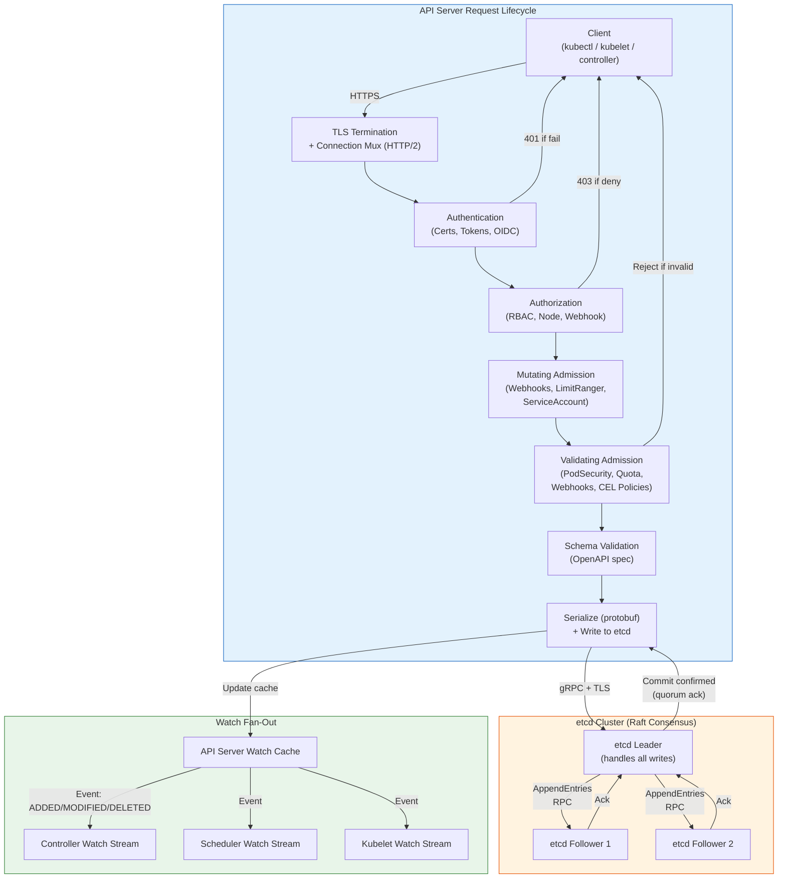

# API Server and etcd

## 1. Overview

The kube-apiserver and etcd form the critical path of every Kubernetes operation. The API server is the single entry point for all cluster interactions -- every kubectl command, every controller reconciliation, every kubelet status update flows through it. etcd is the durable, consistent store that holds every piece of cluster state. Together, they form a system where the API server acts as the gatekeeper and validator, and etcd acts as the source of truth.

This pairing is the most operationally sensitive part of a Kubernetes cluster. A slow API server makes the cluster feel sluggish; a slow etcd makes the API server slow. A data loss in etcd without backup means total cluster state loss -- not just configuration, but every running workload's desired state, every secret, every RBAC binding. Understanding the API server's request lifecycle and etcd's consensus mechanics is not academic -- it is the knowledge you need when you are debugging a production outage at 2 AM and the cluster is not responding to kubectl commands.

## 2. Why It Matters

- **Every operation flows through this path.** A Deployment creation, a Pod status update, a ConfigMap read, a Secret rotation -- all go through the API server to/from etcd. Understanding the request lifecycle tells you where latency is introduced.
- **Admission controllers are your policy enforcement layer.** This is where you prevent insecure images from being deployed, enforce resource limits, inject sidecars, and implement custom business logic. Misconfigured admission controllers can silently block critical operations or, worse, let dangerous configurations through.
- **etcd is a CP system (consistency over availability).** During a network partition, etcd refuses writes rather than risk inconsistency. This means your cluster becomes read-only until quorum is restored -- a behavior that surprises teams that have not planned for it.
- **Watch efficiency determines control plane performance at scale.** The API server's watch mechanism is what makes event-driven reconciliation possible. Poorly configured watches, too many unscoped watches, or a lack of watch bookmarks can overwhelm both the API server and etcd.
- **etcd performance is the floor for cluster performance.** No amount of API server horizontal scaling helps if etcd is slow. The `wal_fsync_duration` metric is the single most important number in your cluster's health.

## 3. Core Concepts

- **Request Lifecycle:** The end-to-end journey of an API request: TLS termination, authentication, authorization, mutation admission, validation admission, schema validation, etcd write, watch notification.
- **Admission Controller:** A plugin that intercepts API requests after authn/authz but before persistence. Comes in two phases: mutating (can modify the object) and validating (can only accept/reject). Runs in a defined order.
- **Watch Mechanism:** A long-lived HTTP/2 streaming connection between a client and the API server. The server pushes events (ADDED, MODIFIED, DELETED) to the client in real time. This is the backbone of Kubernetes' event-driven architecture.
- **Resource Version:** A monotonically increasing integer (backed by etcd's global revision) attached to every object. Used by watches to resume from where they left off and by optimistic concurrency control to detect conflicts.
- **Raft Consensus:** The distributed consensus algorithm etcd uses to replicate data across members. Ensures that all members agree on the same sequence of writes by electing a leader that serializes operations and replicates them to followers.
- **Quorum:** The minimum number of etcd members that must agree on a write for it to be committed: `(n/2) + 1`. In a 3-member cluster, quorum is 2; in a 5-member cluster, quorum is 3.
- **etcd Compaction:** The process of discarding old revisions to reclaim space. etcd keeps a full history of every key revision; without compaction, the database grows unbounded.
- **etcd Defragmentation:** After compaction removes old revisions, the freed space is not returned to the OS until defragmentation runs. This is an online but blocking operation on a per-member basis.
- **Lease:** A time-to-live mechanism in etcd used for leader election, heartbeats, and ephemeral keys. Kubernetes uses leases for control plane leader election and node heartbeats.

## 4. How It Works

### API Server Request Lifecycle

A complete API request (e.g., `kubectl create deployment nginx --image=nginx`) passes through these stages:

**Stage 1: TLS and Connection Handling**
- The client establishes a TLS connection. The API server presents its serving certificate; the client may present a client certificate for mutual TLS.
- HTTP/2 is negotiated for multiplexing multiple requests over a single TCP connection. This is critical for watch streams that remain open indefinitely.

**Stage 2: Authentication**
The API server tries each configured authenticator in order until one succeeds:

| Method | Mechanism | Common Use |
|---|---|---|
| X.509 Client Certificate | Subject CN = username, O = group | kubelets, cluster components |
| Bearer Token (ServiceAccount) | JWT signed by API server's SA key | Pods calling the API server |
| OIDC Token | ID token from identity provider | Human users via kubectl + OIDC plugin |
| Webhook Token Review | External service validates token | Custom authentication integrations |

If no authenticator succeeds, the request is rejected with 401 Unauthorized.

**Stage 3: Authorization**
The authenticated identity (user, groups, extra) is checked against authorization policies. The standard mode is **RBAC**:

- The API server checks all RoleBindings/ClusterRoleBindings that match the user or their groups.
- Each binding points to a Role/ClusterRole that lists allowed verbs (get, list, create, update, delete, watch) on specific resource types.
- Authorization is **allow-only** -- if no binding explicitly allows the action, it is denied (403 Forbidden).

Multiple authorizers can be chained: RBAC, Node (for kubelet-specific permissions), and Webhook (for external policy engines).

**Stage 4: Mutating Admission**
Mutating admission plugins run in a defined order and can modify the incoming object:

| Plugin | What It Does |
|---|---|
| `DefaultStorageClass` | Sets the default StorageClass on PVCs that do not specify one |
| `LimitRanger` | Applies default CPU/memory requests and limits from the namespace's LimitRange |
| `ServiceAccount` | Mounts the default service account token if none specified |
| `MutatingAdmissionWebhook` | Calls external webhook servers for custom mutations (sidecar injection, label injection) |

Mutating webhooks can be chained: one webhook's output is the next webhook's input. This is how Istio injects sidecar containers -- the webhook modifies the Pod spec to add the envoy container before the Pod is ever persisted.

**Stage 5: Validating Admission**
Validating admission plugins run after mutation and can only accept or reject -- they cannot modify:

| Plugin | What It Does |
|---|---|
| `PodSecurity` | Enforces Pod Security Standards (Restricted, Baseline, Privileged) at the namespace level |
| `ResourceQuota` | Rejects requests that would exceed the namespace's resource quota |
| `ValidatingAdmissionWebhook` | Calls external webhook servers for custom validation (OPA/Gatekeeper policies) |
| `ValidatingAdmissionPolicy` | In-process CEL-based validation (K8s 1.30+ GA); no external webhook needed |

**Stage 6: Schema Validation and Persistence**
- The API server validates the object against the OpenAPI schema for the resource type.
- The object is serialized to protobuf (more compact and faster than JSON) and written to etcd via gRPC.
- etcd's leader replicates the write to followers via Raft and acknowledges once quorum confirms.
- The API server returns the response to the client (201 Created for new objects).

**Stage 7: Watch Notification**
- After the etcd write, the API server's watch cache is updated.
- All active watch streams that match the resource (by type, namespace, label selector, field selector) receive an event with the new/modified object.
- This triggers controllers, the scheduler, and kubelets to take action.

### The Watch Mechanism in Depth

Watches are the nervous system of Kubernetes. Here is how they work at the protocol level:

1. **Client opens a watch:** `GET /api/v1/pods?watch=true&resourceVersion=12345`. The `resourceVersion` parameter tells the API server to send events starting from that revision.
2. **API server opens a streaming response:** HTTP/2 with chunked transfer encoding. Events are sent as JSON objects separated by newlines.
3. **Watch cache:** The API server maintains an in-memory cache of recent events (configurable via `--watch-cache-size`). If the requested `resourceVersion` is in the cache, events are served from memory without hitting etcd. If it is too old, the watch receives a 410 Gone, and the client must re-list and restart the watch.
4. **Watch bookmarks:** Periodic synthetic events (type: BOOKMARK) sent by the API server to advance the client's `resourceVersion` without requiring an actual object change. This prevents stale resource versions and reduces re-list frequency.
5. **Informer pattern:** In practice, controllers do not use raw watches. They use the client-go **informer** library, which: (a) performs an initial LIST to populate a local cache, (b) opens a watch to receive incremental updates, (c) delivers events to registered handlers through a work queue, and (d) transparently handles reconnection and re-listing on 410 Gone.

**Watch scalability considerations:**
- Each watch consumes a goroutine on the API server and memory for the event stream.
- A cluster with 5,000 nodes means 5,000 kubelets each watching their assigned Pods -- plus controllers, operators, and monitoring tools.
- In large clusters, watch fan-out becomes the primary CPU and memory consumer on the API server.

**Watch scalability numbers for planning:**

| Cluster Size | Approximate Active Watches | API Server Memory for Watch Cache |
|---|---|---|
| 100 nodes | ~500-1,000 | 1-2 GB |
| 500 nodes | ~3,000-5,000 | 4-8 GB |
| 5,000 nodes | ~25,000-50,000 | 20-40 GB |

These numbers include watches from kubelets, kube-proxy instances, controllers, and common operators (cert-manager, external-dns, monitoring). The `--watch-cache-size` flag controls how many events are buffered in memory for each resource type.

### Optimistic Concurrency Control

Kubernetes uses **optimistic concurrency** (not locks) to handle concurrent updates to the same object. Every object has a `resourceVersion` field that is incremented on each write. When a client updates an object, it includes the `resourceVersion` it read. If the version in etcd has changed since the read (another client modified it), etcd rejects the write with a 409 Conflict. The client must re-read the object and retry.

This is why `kubectl apply` sometimes fails with "the object has been modified" -- another controller or user modified the same object between your read and write. The solution is to re-read and re-apply, which `kubectl` handles automatically with server-side apply.

**Server-Side Apply (SSA):** Introduced in Kubernetes 1.22 (GA), SSA moves field ownership tracking to the API server. Each field in an object tracks which "manager" (kubectl, a controller, etc.) owns it. Conflicts are detected per-field rather than per-object, significantly reducing spurious conflicts in environments where multiple controllers manage different fields of the same object.

### API Priority and Fairness

Starting in Kubernetes 1.20 (GA), the API server implements **API Priority and Fairness (APF)** to prevent any single client from monopolizing API server capacity:

- Requests are classified into **FlowSchemas** based on user, namespace, and API verb.
- Each FlowSchema maps to a **PriorityLevel** with a guaranteed share of API server capacity.
- System-critical requests (from kubelets, controllers) get reserved capacity that cannot be consumed by lower-priority clients (user kubectl sessions, CI pipelines).
- This replaces the older `--max-requests-inflight` and `--max-mutating-requests-inflight` flags with a more granular system.

**Why this matters in practice:** Without APF, a misconfigured controller that makes thousands of LIST requests per second can starve the scheduler and controller manager, causing cluster-wide degradation. APF ensures that system-critical components always have guaranteed API server bandwidth.

### etcd as the Source of Truth

**Data Model:**
etcd stores Kubernetes objects as key-value pairs. The key structure follows the pattern:
```
/registry/<resource-type>/<namespace>/<name>
```
For example: `/registry/pods/production/api-server-7b8d9c`. Values are protobuf-encoded Kubernetes objects.

**Raft Consensus (Practitioner Level):**

etcd uses Raft to maintain consistent replication across cluster members. Here is what you need to know for production:

1. **Leader election:** One member is the leader; the rest are followers. The leader handles all write requests and replicates them to followers. If the leader fails to send heartbeats within the election timeout (default: 1000 ms), followers start a new election.
2. **Write path:** Client (API server) sends a write to the leader. The leader appends the entry to its Write-Ahead Log (WAL) and sends AppendEntries RPCs to followers. Once a quorum of followers acknowledges, the leader commits the entry and responds to the client.
3. **Read path:** By default, etcd serves linearizable reads -- the leader confirms it is still the leader (via a round of heartbeats) before responding. This guarantees the client sees the latest committed data but adds latency. For read-heavy workloads, serializable reads (served by any member without leader confirmation) trade consistency for speed.
4. **Log compaction:** The Raft log grows with every write. etcd periodically takes a snapshot of the current state and discards old log entries. This is separate from Kubernetes-level key compaction.

**Performance Characteristics:**

| Metric | Healthy Target | Problem Indicator |
|---|---|---|
| `wal_fsync_duration_seconds` p99 | < 10 ms | > 10 ms: slow disk; investigate IOPS |
| `network_peer_round_trip_time_seconds` p99 | < 50 ms | > 50 ms: network latency between members |
| `mvcc_db_total_size_in_bytes` | < 8 GB (default quota) | Approaching 8 GB: run compaction + defrag |
| `server_leader_changes_seen_total` | 0 (stable) | > 0 in last hour: leader instability |
| `disk_backend_commit_duration_seconds` p99 | < 25 ms | > 25 ms: backend (boltdb) performance issue |

**etcd Performance Tuning:**

1. **Storage:** Use SSD-backed volumes with provisioned IOPS. On AWS, use io2 or gp3 with at least 3,000 IOPS. Never use shared or network-attached HDD storage.
2. **Dedicated disks:** Separate the WAL directory from the data directory. The WAL is write-intensive and latency-sensitive; mixing it with the data directory causes contention.
3. **Compaction:** Enable automatic compaction (etcd flag `--auto-compaction-retention`). Kubernetes sets this to 5 minutes by default when running etcd as part of kube-apiserver startup. This keeps history manageable.
4. **Defragmentation:** Schedule regular defragmentation during low-traffic periods. Defrag one member at a time to maintain quorum.
5. **Quota management:** etcd has a default space quota of 8 GB. When exceeded, etcd goes into alarm mode and rejects all writes. Monitor `mvcc_db_total_size_in_bytes` and alert at 80%.
6. **Network:** Place all etcd members in the same datacenter or availability zone (AZ) to minimize peer RTT. Cross-AZ latency (1-3 ms per hop) directly adds to write commit time because every write requires a quorum round-trip.
7. **Snapshot backup:** Use `etcdctl snapshot save` on a schedule (every 30 minutes is common). Store snapshots off-cluster (S3, GCS). Test restoration regularly -- an untested backup is not a backup.

### Cluster Sizing: 3 vs. 5 Members

| Property | 3 Members | 5 Members |
|---|---|---|
| Quorum | 2 | 3 |
| Fault tolerance | 1 member | 2 members |
| Write latency | Lower (fewer replication targets) | Higher (more replication targets) |
| Read throughput | Lower | Higher (more members can serve reads) |
| Recommended for | Most production clusters | Large-scale clusters needing maximum fault tolerance |

The Kubernetes documentation recommends 5 members for production clusters at scale. However, many production clusters run successfully with 3 members. The key tradeoff: 5 members survive 2 simultaneous failures but add ~1-3 ms of write latency due to the additional replication hop.

**Never run an even number of members.** A 4-member cluster has the same fault tolerance as a 3-member cluster (both tolerate 1 failure) but requires more resources and has higher write latency.

### etcd Operational Procedures

**Backup and Restore:**
```
# Take a snapshot (run on any etcd member)
etcdctl snapshot save /backup/etcd-snapshot-$(date +%Y%m%d-%H%M%S).db \
  --endpoints=https://127.0.0.1:2379 \
  --cacert=/etc/etcd/ca.crt \
  --cert=/etc/etcd/server.crt \
  --key=/etc/etcd/server.key

# Verify the snapshot
etcdctl snapshot status /backup/etcd-snapshot.db --write-out=table
```

Production backup schedule: every 30 minutes, stored off-cluster (S3, GCS, Azure Blob). Retain at least 7 days of snapshots. Test restoration quarterly.

**Compaction and Defragmentation:**
- **Compaction** removes old revisions. Kubernetes configures `--auto-compaction-retention=5m` by default, which keeps 5 minutes of history. After compaction, the space is marked as free but not returned to the OS.
- **Defragmentation** reclaims the freed space. Run `etcdctl defrag` on one member at a time (it blocks that member during the operation). For a 3-member cluster, this means temporarily running at 2 members -- still quorum, but with reduced fault tolerance.
- Schedule defragmentation during low-traffic windows (e.g., weekends, maintenance windows).

**Monitoring Checklist:**

| Metric | Alert Threshold | Response |
|---|---|---|
| `etcd_server_leader_changes_seen_total` | > 0 in 1 hour | Investigate disk I/O and network latency |
| `etcd_disk_wal_fsync_duration_seconds` p99 | > 10ms | Disk is too slow; migrate to SSD/NVMe |
| `etcd_disk_backend_commit_duration_seconds` p99 | > 25ms | Backend (boltdb) struggling; check disk I/O |
| `etcd_network_peer_round_trip_time_seconds` p99 | > 50ms | Network latency between members too high |
| `etcd_mvcc_db_total_size_in_bytes` | > 80% of quota (6.4 GB default) | Run compaction + defrag; investigate large CRD usage |
| `etcd_server_proposals_failed_total` | > 0 | Quorum loss or leader contention |
| `etcd_server_slow_apply_total` | > 0 | Apply operations taking >100ms; storage bottleneck |

### etcd Encryption at Rest

By default, etcd stores Kubernetes objects in plaintext. For Secrets (which contain passwords, tokens, certificates), this is a security risk if the etcd disks are compromised. Kubernetes supports **encryption at rest** via an EncryptionConfiguration:

- **aescbc:** AES-CBC encryption with a key managed by the cluster admin. Requires careful key rotation procedures.
- **aesgcm:** AES-GCM (authenticated encryption). Faster than aescbc but requires unique nonces, which limits the number of encryptions before key rotation.
- **kms:** Delegates encryption to an external Key Management Service (AWS KMS, GCP KMS, Azure Key Vault, HashiCorp Vault). This is the recommended approach because the encryption key never leaves the KMS -- the API server sends plaintext to the KMS for encryption and ciphertext for decryption.
- **secretbox:** Uses the NaCl secretbox algorithm. Good security properties but less commonly used than KMS.

In managed Kubernetes (EKS, GKE, AKS), etcd encryption at rest is enabled by default using the cloud provider's KMS.

### etcd Learner Nodes

etcd 3.4+ supports **learner nodes** -- non-voting members that receive the replication stream but do not participate in quorum. Learners are useful for:

- **Safe cluster expansion:** Add a new member as a learner first. Once it catches up with the leader's log, promote it to a voting member. This prevents a slow new member from disrupting quorum during initial data sync.
- **Cross-region read replicas:** Place a learner in a remote region to serve local reads without adding write latency to the primary cluster.
- **Online backup:** A learner can serve as a continuous backup target without affecting cluster performance.

### API Server Aggregation Layer

The aggregation layer allows extending the Kubernetes API with custom API servers that run alongside the main kube-apiserver:

1. The custom API server registers with the main API server via an `APIService` object.
2. The main API server proxies matching requests (e.g., `/apis/metrics.k8s.io/v1beta1`) to the custom API server.
3. Authentication and authorization are handled by the main API server before proxying.

**Common aggregated APIs:**
- **metrics-server:** Provides CPU/memory metrics used by `kubectl top` and HPA.
- **custom-metrics-apiserver:** Exposes application-specific metrics (Prometheus metrics) for HPA scaling.
- **apiserver-builder:** Framework for building custom API servers with full Kubernetes-style CRUD and watch support.

## 5. Architecture / Flow



## 6. Types / Variants

### Admission Controller Categories

| Category | Runs When | Can Modify? | Examples |
|---|---|---|---|
| **Built-in Mutating** | Before validation | Yes | LimitRanger, DefaultStorageClass, ServiceAccount |
| **Webhook Mutating** | After built-in mutating | Yes | Istio sidecar injection, Linkerd proxy injection |
| **Built-in Validating** | After all mutation | No | ResourceQuota, PodSecurity |
| **Webhook Validating** | After built-in validating | No | OPA Gatekeeper, Kyverno |
| **CEL-based Validating (ValidatingAdmissionPolicy)** | After mutation | No | In-process policy evaluation without external webhook overhead |

### etcd Deployment Topologies

| Topology | Description | Availability | Operational Complexity |
|---|---|---|---|
| **Stacked** | etcd members co-located on control plane nodes | Tied to control plane node health | Low -- single set of nodes to manage |
| **External** | Dedicated etcd cluster on separate machines | Independent from control plane failures | Higher -- two sets of infrastructure |
| **Managed (cloud)** | Cloud provider operates etcd (EKS, GKE) | Provider SLA (typically 99.95%+) | Lowest -- no etcd operations |
| **Single-member** | One etcd instance (dev/test) | No fault tolerance | Trivial -- but never for production |

### API Server Extension Mechanisms

| Mechanism | Scope | Latency Impact | Use Case |
|---|---|---|---|
| **Admission Webhook** | Per-request interception | Adds network RTT per webhook call | Policy enforcement, sidecar injection |
| **ValidatingAdmissionPolicy (CEL)** | Per-request in-process | Minimal -- no network call | Simple validation rules without webhook infra |
| **Custom Resource Definition (CRD)** | New API types | Minimal -- served by API server | Extending K8s with custom objects |
| **Aggregated API Server** | Full custom API | Proxied through API server | Metrics server, custom API servers |

## 7. Use Cases

- **Sidecar injection with mutating webhooks:** Istio's sidecar injector is a mutating admission webhook. When a Pod is created in an Istio-enabled namespace, the webhook intercepts the creation request and adds the Envoy proxy container to the Pod spec. The user's Deployment manifest never mentions Istio -- the mutation is transparent. This pattern is also used by Linkerd (proxy injection), Vault (secret injection), and Dapr (sidecar injection).
- **Policy enforcement with OPA Gatekeeper:** A validating admission webhook backed by OPA evaluates every resource against a policy library. Policies like "all containers must have CPU/memory limits," "no hostPath volumes," or "images must come from gcr.io" are enforced at admission time, before any resource is persisted to etcd. Organizations typically start with audit mode (log violations without blocking) before switching to enforcement mode.
- **Disaster recovery from etcd backup:** When a cluster is irrecoverably damaged (e.g., all control plane nodes lost), an etcd snapshot can restore the entire cluster state. The new control plane starts with the snapshot, and kubelets re-register. This is the nuclear option -- and if you have no backup, the only option is to rebuild from scratch. Restoration procedure: stop etcd, restore snapshot with `etcdctl snapshot restore`, start etcd, verify cluster state.
- **Multi-region etcd considerations:** Some organizations run etcd members across availability zones for zone failure tolerance. This works when AZ latency is under 2 ms, but cross-region replication (50-100 ms RTT) makes etcd writes unacceptably slow. For cross-region HA, run separate clusters with application-level replication instead.
- **API server audit logging:** The API server can log every request (who did what, when, to which resource) to a file or webhook backend. This is essential for compliance (SOC 2, HIPAA, PCI-DSS) and forensic analysis after security incidents. Audit policy defines four levels: None (skip), Metadata (log request metadata only), Request (log request body), RequestResponse (log request and response bodies).
- **GitOps with server-side apply:** ArgoCD and Flux use server-side apply to manage cluster resources declaratively from Git. The API server tracks field ownership so that ArgoCD-managed fields are not accidentally overwritten by other controllers, and vice versa. This is the production-grade replacement for `kubectl apply`.
- **Custom API extension with CRDs:** Operators like cert-manager, external-dns, and Crossplane define custom resources (Certificates, DNSEndpoints, Managed Resources) stored in etcd alongside native resources. The API server handles authentication, authorization, and admission for CRDs identically to built-in resources, making extensions first-class citizens.

## 8. Tradeoffs

| Decision | Option A | Option B | Guidance |
|---|---|---|---|
| **Linearizable vs. serializable etcd reads** | Linearizable: consistent, higher latency | Serializable: stale possible, lower latency | Linearizable is default and correct for most K8s operations; serializable only for read-heavy custom controllers that tolerate stale data |
| **Admission webhooks vs. CEL policies** | Webhooks: flexible, any language, full request context | CEL: no external dependency, lower latency, simpler | CEL for simple validation rules; webhooks for complex logic requiring external data |
| **etcd on SSD vs. standard disk** | SSD: consistent low latency, higher cost | Standard: cheaper, higher latency | Always SSD in production. The cost difference is negligible compared to the downtime risk from etcd instability |
| **3 vs. 5 etcd members** | 3: lower write latency, fewer resources | 5: tolerates 2 failures, higher read capacity | 3 for most clusters; 5 when you need maximum fault tolerance or high read throughput |
| **etcd in-cluster vs. external backup** | In-cluster: faster restore, lower complexity | External (S3/GCS): survives total cluster loss | Always external. An in-cluster-only backup dies with the cluster |
| **Watch cache size** | Default: lower memory | Large: higher memory, fewer etcd reads | Increase for large clusters (>500 nodes) where watch reconnections cause etcd read spikes |

## 9. Common Pitfalls

- **Circular dependency with admission webhooks.** If a webhook's backend runs as a Pod in the cluster, and the webhook intercepts Pod creation, you have a bootstrap problem: the webhook Pod cannot be created because the webhook is not running. Solution: use `namespaceSelector` to exclude the webhook's own namespace, or set `failurePolicy: Ignore` during initial deployment.
- **etcd space quota exceeded.** etcd defaults to an 8 GB space quota. Without compaction and defragmentation, the database grows until it hits the quota and enters alarm mode -- rejecting all writes. The cluster becomes effectively frozen: no new Pods, no config changes, no scaling. Monitor `mvcc_db_total_size_in_bytes` and automate compaction.
- **Stale resourceVersion causing watch disconnects.** If a controller holds a watch with a `resourceVersion` that has been compacted away, etcd returns an error and the API server sends a 410 Gone. The controller must re-list the entire resource set, which can be expensive for large clusters. Enabling watch bookmarks (`WatchBookmarks` feature gate, GA since K8s 1.19) mitigates this.
- **Slow admission webhooks blocking the API.** A webhook with a 5-second timeout called on every Pod creation adds 5 seconds to every Pod scheduling cycle. Multiply by hundreds of Pods, and the cluster grinds to a halt. Set aggressive timeouts (1-3 seconds) and use `failurePolicy: Ignore` for non-critical webhooks.
- **Not backing up etcd.** This is the most catastrophic omission. Without an etcd backup, any data loss event (corruption, misconfiguration, accidental deletion) means rebuilding the cluster from scratch. Every manifest, every Secret, every RBAC binding -- gone.
- **Running etcd and application workloads on the same disk.** Application I/O competes with etcd's WAL fsync, causing write latency spikes that trigger leader elections. Dedicate storage to etcd.

## 10. Real-World Examples

- **Zalando's etcd incident:** Zalando publicly documented a production incident where etcd disk performance degraded due to a noisy neighbor on shared storage. The `wal_fsync_duration` spiked above 100 ms, causing repeated leader elections (one every few seconds). The API server became intermittently unresponsive, preventing deployments and scaling operations. Resolution: migrating etcd to dedicated NVMe storage dropped fsync latency to <1 ms. Lesson: etcd disk performance is a hard requirement, not a nice-to-have.
- **OpenShift's etcd guidance (Red Hat):** OpenShift documentation recommends that the 99th percentile of `wal_fsync_duration_seconds` remain below 10 ms for stable operation. They provide a benchmark tool (`fio`) to test disk performance before deploying etcd, with a specific test profile: `fio --rw=write --ioengine=sync --fdatasync=1 --bs=2300 --size=22m`. Running this benchmark before provisioning a cluster saves hours of debugging later.
- **Kubernetes SIG API Machinery improvements:** The watch bookmark feature (GA in 1.19) was introduced after large-scale clusters (>5,000 nodes) experienced "watch storm" incidents where simultaneous watch reconnections after a brief API server restart overwhelmed etcd with LIST requests. Bookmarks keep resource versions fresh, preventing the 410 Gone cascade. This is an example of how production experience at scale drives API server improvements.
- **Istio sidecar injection at scale:** Istio's mutating webhook adds ~10 ms per Pod creation (the time for the webhook call). At organizations deploying thousands of Pods per hour (e.g., during rolling updates across a fleet), this aggregated latency is measurable. Teams mitigate it by deploying the webhook service with multiple replicas and tight resource allocation. Some organizations pre-warm webhook connections to reduce first-request latency.
- **etcd database size in practice:** A Kubernetes cluster with 10,000 Pods, 5,000 Services, and 20,000 ConfigMaps/Secrets typically has an etcd database size of 1-3 GB. Clusters with heavy CRD usage (e.g., Istio, ArgoCD, Crossplane) can reach 6-8 GB and require careful quota monitoring. Crossplane is particularly aggressive -- each managed cloud resource creates multiple CRDs and status updates.
- **Admission webhook outage at scale:** A well-known incident involved a validating webhook that called an external SaaS service for image scanning. When the SaaS service experienced downtime, the webhook timed out on every Pod creation (30-second default timeout). The cluster could not create any new Pods for the duration of the outage. The fix: set `failurePolicy: Ignore` for the scanner webhook (accept the Pod now, scan asynchronously) and reduce timeout to 3 seconds.
- **API server audit logging at a financial institution:** A major bank implemented comprehensive API server audit logging at the `Request` level for all namespaces containing financial workloads. The audit logs are shipped to Splunk in real-time via a webhook backend. This enables compliance reporting (who accessed which Secret, when was a Deployment modified) and forensic investigation. The overhead: ~5% additional API server CPU and 50 GB/day of audit log storage for a 2,000-Pod cluster.

## 11. Related Concepts

- [Kubernetes Architecture](./01-kubernetes-architecture.md) -- the overall cluster topology where the API server and etcd reside
- [Control Plane Internals](./02-control-plane-internals.md) -- the scheduler and controller manager that interact with the API server
- [Container Runtime](./04-container-runtime.md) -- the CRI layer that kubelet invokes after the API server persists Pod specs
- [Kubernetes Networking Model](./05-kubernetes-networking-model.md) -- Service and endpoint objects managed through the API server
- [CAP Theorem](../../traditional-system-design/01-fundamentals/05-cap-theorem.md) -- etcd's CP design choice: it refuses writes during partition rather than risk inconsistency
- [Availability and Reliability](../../traditional-system-design/01-fundamentals/04-availability-reliability.md) -- HA patterns for etcd quorum and API server redundancy
- [Networking Fundamentals](../../traditional-system-design/01-fundamentals/06-networking-fundamentals.md) -- TLS, HTTP/2, gRPC protocols underlying API server communication

## 12. Source Traceability

- source/youtube-video-reports/7.md -- Strategic framework for analyzing control plane vs data plane, consistency models
- source/youtube-video-reports/1.md -- API architecture as a technical contract, ACID/consistency principles relevant to etcd's design
- source/extracted/acing-system-design/ch03-a-walkthrough-of-system-design-concepts.md -- Cluster management with Kubernetes, deployment pipeline architecture
- Kubernetes official documentation (kubernetes.io) -- Admission controllers reference, API server request handling, etcd operations guide
- etcd official documentation (etcd.io) -- Performance tuning guide, Raft consensus overview, FAQ on cluster sizing
- Red Hat OpenShift documentation -- etcd performance benchmarks and operational guidance
