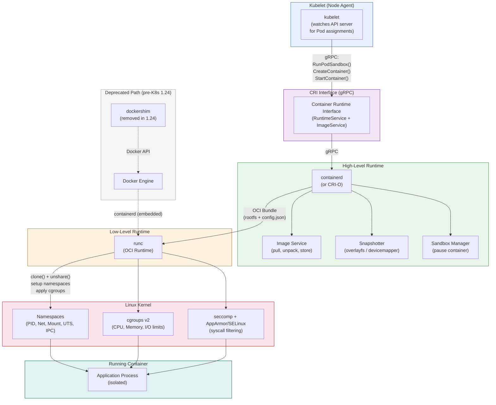

# Container Runtime

## 1. Overview

A container runtime is the software responsible for actually running containers on a Linux (or Windows) host. In the Kubernetes context, the container runtime sits at the bottom of the stack: the kubelet tells it "start this container with this image and these resource constraints," and the runtime handles everything from image unpacking to process isolation to lifecycle management.

The container runtime ecosystem is layered. At the top is the **CRI (Container Runtime Interface)**, a gRPC API that the kubelet uses to communicate with any compliant runtime. In the middle are **high-level runtimes** like containerd and CRI-O that manage image pulling, storage, and container lifecycle. At the bottom is the **low-level runtime** (typically runc) that creates the actual isolated process using Linux kernel primitives -- namespaces for isolation and cgroups for resource limits.

The landmark event in this space was **Kubernetes 1.24 (May 2022)**, which removed the Docker shim (dockershim) from the kubelet. This did not "kill Docker" -- Docker images still work everywhere -- but it eliminated the maintenance burden of an adapter layer and made CRI the only supported interface. Understanding this hierarchy is essential for production decisions about runtime selection, security posture, and troubleshooting container issues.

## 2. Why It Matters

- **Runtime choice affects security posture.** The low-level runtime determines the isolation boundary. Standard runc uses Linux namespaces (shared kernel); gVisor and Kata Containers provide stronger isolation (user-space kernel or micro-VMs). Choosing the wrong boundary for your threat model leaves you exposed.
- **The Docker shim removal caught teams off guard.** Organizations that had `docker ps` in their runbooks, Docker socket mounts in their CI jobs, or Docker-specific monitoring suddenly found those tools broken after upgrading to K8s 1.24. Understanding the CRI interface explains why this happened and what replaced it.
- **Runtime performance characteristics differ.** containerd and CRI-O have different startup latency, memory overhead, and image pull behavior. For latency-sensitive workloads or large-scale clusters with thousands of Pods, these differences are measurable.
- **Debugging container issues requires runtime literacy.** When a container fails to start, the kubelet logs point to CRI errors. Understanding the runtime layers (kubelet -> CRI -> containerd -> runc) tells you which layer to investigate.
- **OCI standardization enables portability.** Because all runtimes conform to the OCI spec, an image built with `docker build`, `buildah`, `kaniko`, or any OCI-compliant tool runs identically on containerd, CRI-O, or any other compliant runtime. The build tool and the run tool are completely decoupled.

## 3. Core Concepts

- **OCI (Open Container Initiative):** The industry standard that defines two specifications: the **image spec** (how container images are structured) and the **runtime spec** (how containers are created and executed). OCI is the reason Docker images work on non-Docker runtimes.
- **Low-Level Runtime (runc):** The reference implementation of the OCI runtime spec. runc is a CLI tool that takes an OCI bundle (root filesystem + config) and creates an isolated Linux process using namespaces, cgroups, seccomp, and AppArmor/SELinux. It is the "fork-and-exec" engine that every high-level runtime delegates to.
- **High-Level Runtime (containerd, CRI-O):** A daemon that manages the full container lifecycle: image pull and storage, container creation (by calling runc), log management, and metrics. It exposes a gRPC API for orchestrators.
- **CRI (Container Runtime Interface):** A Kubernetes-specific gRPC API that the kubelet uses to manage containers. The CRI defines two services: `RuntimeService` (for container and sandbox lifecycle) and `ImageService` (for image pulls and removal). Any runtime that implements CRI can be used with Kubernetes.
- **Container Sandbox (Pod Sandbox):** In Kubernetes, a Pod's containers share a network namespace and (optionally) an IPC namespace. The runtime creates a "sandbox" (a pause container or equivalent) that holds these shared namespaces, and application containers join them.
- **Docker Shim (dockershim):** A translation layer that was built into the kubelet to convert CRI calls into Docker Engine API calls. It existed because Docker predated CRI and never natively implemented it. Removed in Kubernetes 1.24.
- **Namespaces:** Linux kernel feature that provides isolation for processes. Containers use PID, network, mount, UTS, IPC, and user namespaces to appear as isolated systems.
- **Cgroups (Control Groups):** Linux kernel feature that limits and accounts for resource usage (CPU, memory, I/O, network). The runtime uses cgroups to enforce the resource limits specified in Kubernetes Pod specs.
- **Seccomp:** A Linux kernel feature that restricts the system calls a process can make. Kubernetes supports seccomp profiles to reduce the container's attack surface.

## 4. How It Works

### The Container Runtime Hierarchy

The runtime ecosystem forms a clear hierarchy, each layer building on the one below:

**Layer 1: Linux Kernel Primitives**
- **Namespaces** provide isolation: each container gets its own view of PIDs, network interfaces, mount points, and hostnames.
- **Cgroups** provide resource control: CPU shares, memory limits, I/O bandwidth, and PID limits.
- **Seccomp** and **AppArmor/SELinux** provide syscall filtering and mandatory access control.
- These are not "container" features -- they are kernel features that runtimes leverage to create the illusion of isolation.

**Layer 2: Low-Level Runtime (runc)**
- runc is a CLI binary, not a daemon. It is invoked once to create a container and exits.
- Input: an OCI bundle consisting of a root filesystem (directory) and a `config.json` file specifying namespaces, cgroups, mounts, environment variables, and the entry point command.
- Process: runc calls `clone()` or `unshare()` to create new namespaces, sets up cgroups, pivots the root filesystem, applies seccomp filters, and `exec`s the container's entry point.
- runc is the "father of all containers" -- containerd, CRI-O, Docker, and Podman all call runc (or a compatible alternative) under the hood.

**Layer 3: High-Level Runtime (containerd or CRI-O)**

These daemons manage the container lifecycle and serve as the bridge between the kubelet and runc:

| Responsibility | How It Works |
|---|---|
| **Image pull** | Downloads OCI images from registries (Docker Hub, GCR, ECR), verifies digests, and stores layers in a content-addressable store |
| **Image unpack** | Extracts image layers into a root filesystem (snapshot) suitable for runc |
| **Container creation** | Generates an OCI bundle (rootfs + config.json), invokes runc to create the container |
| **Container lifecycle** | Start, stop, pause, resume, and remove containers; manage container I/O (stdin, stdout, stderr) |
| **Sandbox management** | Creates Pod sandboxes (pause containers) that hold shared namespaces |
| **Metrics and events** | Exposes container metrics (CPU, memory, I/O) and lifecycle events |

**Layer 4: CRI (Container Runtime Interface)**

The kubelet communicates with the high-level runtime via CRI's two gRPC services:

| Service | Key RPCs | Purpose |
|---|---|---|
| **RuntimeService** | `RunPodSandbox`, `StopPodSandbox`, `RemovePodSandbox` | Pod sandbox lifecycle |
| **RuntimeService** | `CreateContainer`, `StartContainer`, `StopContainer`, `RemoveContainer` | Container lifecycle within a sandbox |
| **RuntimeService** | `ExecSync`, `Exec`, `Attach`, `PortForward` | Container debugging (kubectl exec, logs) |
| **ImageService** | `PullImage`, `RemoveImage`, `ListImages`, `ImageStatus` | Image management |

### The Docker Shim Deprecation Story

The timeline tells the story:

| Year | Event |
|---|---|
| 2013 | Docker is released; becomes the de facto container runtime |
| 2014 | Kubernetes is created; uses Docker Engine directly via internal package |
| 2016 | CRI is introduced in K8s 1.5 to decouple the kubelet from any specific runtime |
| 2017 | containerd is extracted from Docker and donated to CNCF; implements CRI (via cri plugin) |
| 2017 | CRI-O is created specifically as a lightweight CRI implementation for Kubernetes |
| 2020 | K8s 1.20: dockershim deprecation announced; deprecation warning added to kubelet logs |
| 2022 | K8s 1.24: dockershim removed from kubelet codebase |
| 2022 | Mirantis releases cri-dockerd as external adapter for teams that still need Docker Engine |

**Why was Docker shim removed?**
- Docker Engine never implemented CRI natively. The kubelet had to maintain a translation layer (dockershim) that converted CRI calls to Docker API calls.
- This translation was a maintenance burden for the Kubernetes project -- every CRI feature required corresponding dockershim changes.
- Docker Engine is a full-featured developer tool (build, push, networks, volumes, compose) -- most of which is irrelevant for running containers on a K8s node. containerd and CRI-O are purpose-built for this narrow use case.

**What did NOT break:**
- OCI images built with `docker build` continue to work everywhere because the image format is standardized by OCI.
- Docker remains the dominant tool for local development and image building. The change only affects what runs containers on Kubernetes nodes.

**What DID break:**
- Shell scripts using `docker ps`, `docker logs`, or `docker exec` on Kubernetes nodes stopped working because Docker is no longer the runtime.
- Monitoring tools that scraped the Docker socket (`/var/run/docker.sock`) needed migration to CRI-compatible interfaces.
- Build pipelines that mounted the Docker socket for Docker-in-Docker (DinD) builds inside Pods required alternatives like Kaniko, Buildah, or rootless BuildKit.

### containerd vs. CRI-O: Choosing a Runtime

| Characteristic | containerd | CRI-O |
|---|---|---|
| **Origin** | Extracted from Docker Engine; CNCF graduated | Built specifically for Kubernetes; CNCF incubating |
| **Scope** | General-purpose container runtime; used by Docker, K8s, and others | Kubernetes-only; minimal surface area |
| **CRI implementation** | Via built-in `cri` plugin | Native; CRI is the only interface |
| **Image store** | content-addressable store with snapshotters | Uses containers/image and containers/storage libraries |
| **CLI tools** | `ctr` (low-level), `nerdctl` (Docker-compatible) | `crictl` (CRI client) |
| **Default in** | GKE, EKS, AKS, Docker Desktop | OpenShift (Red Hat), some bare-metal setups |
| **Memory overhead** | ~30-50 MB resident | ~20-40 MB resident |
| **Image pull speed** | Supports lazy pulling (stargz) | Supports lazy pulling (zstd:chunked) |

**Production guidance:** containerd is the safe default choice -- it has the broadest ecosystem support and is the default in all three major cloud providers. CRI-O is a strong choice for teams that want the absolute minimum runtime footprint and are already in the Red Hat/OpenShift ecosystem.

### Container Startup Sequence in Detail

When the kubelet needs to start a Pod, the following sequence occurs through the CRI:

1. **RunPodSandbox:** The kubelet asks the runtime to create a Pod sandbox. The runtime creates a "pause" container -- a minimal container (typically `registry.k8s.io/pause:3.9`, ~700 KB) that holds the shared namespaces (network, IPC). This pause container runs indefinitely and does nothing except hold the namespaces open. If it dies, the entire Pod must be recreated.

2. **PullImage:** For each container in the Pod spec, the kubelet calls `PullImage` if the image is not already cached (based on `imagePullPolicy`). The high-level runtime downloads image layers from the registry, verifies the digest, and unpacks the layers into a root filesystem using a snapshotter (overlayfs is the default on Linux).

3. **CreateContainer:** The kubelet provides the container configuration (image, command, environment variables, mounts, resource limits). The runtime generates an OCI bundle (rootfs + config.json) with the appropriate namespace, cgroup, mount, and security settings.

4. **StartContainer:** The runtime calls runc (or the configured low-level runtime) to create and start the container process. runc sets up namespaces, cgroups, seccomp filters, and AppArmor/SELinux profiles, then execs the container's entrypoint.

5. **Container Running:** The container process runs in its isolated environment. The runtime monitors it and reports status back to the kubelet via CRI. The kubelet runs health probes (liveness, readiness, startup) against the container.

6. **StopContainer / RemoveContainer:** On Pod deletion, the kubelet sends SIGTERM to each container. After the grace period (default 30s), it sends SIGKILL. The runtime then cleans up the container's root filesystem and cgroup.

### Image Management and Garbage Collection

Container images accumulate on nodes over time as different versions are deployed. Without cleanup, they fill the node's disk:

- **Image garbage collection:** The kubelet runs image GC when disk usage exceeds `imageGCHighThresholdPercent` (default 85%). It removes unused images (not referenced by any running container) oldest-first until usage drops below `imageGCLowThresholdPercent` (default 80%).
- **Image pull policies:**
  - `Always`: Pull from registry on every Pod start (checks if digest changed). Use for `:latest` tags.
  - `IfNotPresent`: Pull only if the image is not on the node. Default for tagged images. Use for immutable version tags (e.g., `v1.2.3`).
  - `Never`: Never pull; image must be pre-loaded on the node. Use for air-gapped environments.
- **Image pull secrets:** For private registries, the kubelet uses `imagePullSecrets` attached to the Pod's ServiceAccount or specified in the Pod spec.
- **Parallel image pulls:** containerd supports parallel layer downloads by default. The kubelet can also pull images for multiple Pods concurrently (configurable via `--serialize-image-pulls=false`, which is the default since K8s 1.24).

### Container Logging Architecture

The container runtime captures stdout and stderr from each container and writes them to files on the node:

- **Default log path:** `/var/log/containers/<pod-name>_<namespace>_<container-name>-<container-id>.log`
- **Log format:** CRI logging format -- each line is a JSON object with `time`, `stream` (stdout/stderr), and `log` (the actual message).
- **Log rotation:** The kubelet configures log rotation via `--container-log-max-files` (default 5) and `--container-log-max-size` (default 10Mi). Without rotation, a verbose container can fill the node's disk.
- **kubectl logs:** When you run `kubectl logs <pod>`, the kubelet reads the log file on the node and streams it back. This is a direct kubelet-to-apiserver-to-client connection -- logs are not stored in etcd.
- **Log aggregation:** For production, deploy a logging agent (Fluent Bit, Fluentd, Vector) as a DaemonSet that tails the CRI log files and forwards them to a central store (Elasticsearch, Loki, CloudWatch Logs).

### cgroups v1 vs. v2

The container runtime uses Linux cgroups to enforce resource limits. The Kubernetes ecosystem is migrating from cgroups v1 to v2:

| Feature | cgroups v1 | cgroups v2 |
|---|---|---|
| **Hierarchy** | Multiple independent hierarchies (one per resource type: cpu, memory, io) | Single unified hierarchy |
| **Memory QoS** | Limited (no memory.min) | Full support for memory.min (guaranteed memory), memory.low (best-effort) |
| **I/O accounting** | Requires io controller per hierarchy | Unified; better I/O isolation |
| **eBPF integration** | Limited | Full support for eBPF-based resource monitoring |
| **Pressure Stall Information (PSI)** | Not available | Available -- the kubelet uses PSI to detect resource pressure |
| **Default in** | Older OS (Ubuntu 20.04, RHEL 7/8) | Modern OS (Ubuntu 22.04+, RHEL 9+, Amazon Linux 2023) |

Kubernetes officially supports cgroups v2 since version 1.25 (GA). containerd 1.7+ and CRI-O 1.25+ fully support cgroups v2. If your node OS supports cgroups v2, use it -- the improved memory QoS and I/O isolation are significant for multi-tenant workloads.

## 5. Architecture / Flow



## 6. Types / Variants

### Low-Level Runtimes

| Runtime | Isolation Model | Overhead | Security | Use Case |
|---|---|---|---|---|
| **runc** | Linux namespaces + cgroups (shared kernel) | Minimal (~1-5 MB per container) | Standard kernel isolation | Default for all production workloads |
| **gVisor (runsc)** | User-space kernel intercepts syscalls | ~50-100 MB per sandbox; 5-15% CPU overhead | Strong: application never touches host kernel | Multi-tenant clusters, untrusted workloads |
| **Kata Containers** | Lightweight micro-VM (QEMU/Firecracker) | ~30-50 MB per VM; ~100 ms startup overhead | Strongest: hardware-level isolation | Highly sensitive workloads, compliance requirements |
| **crun** | Same model as runc, written in C | Lower than runc (C vs. Go) | Same as runc | Performance-sensitive environments |
| **youki** | Same model as runc, written in Rust | Similar to runc | Same as runc with memory safety | Experimental / Rust ecosystem |

### High-Level Runtimes

| Runtime | CRI Support | Primary User | Strengths |
|---|---|---|---|
| **containerd** | Native (built-in cri plugin) | GKE, EKS, AKS, Docker Desktop | Broadest ecosystem, mature, well-documented |
| **CRI-O** | Native (CRI-only) | OpenShift, Podman ecosystem | Minimal footprint, K8s-specific, no extra features |
| **Docker Engine + cri-dockerd** | Via external adapter | Legacy environments | Familiar tooling; not recommended for new clusters |

### RuntimeClass: Mixing Runtimes in One Cluster

Kubernetes `RuntimeClass` lets you run different low-level runtimes for different workloads within the same cluster:

```yaml
apiVersion: node.k8s.io/v1
kind: RuntimeClass
metadata:
  name: gvisor
handler: runsc
---
apiVersion: v1
kind: Pod
metadata:
  name: untrusted-workload
spec:
  runtimeClassName: gvisor
  containers:
  - name: app
    image: untrusted-app:latest
```

This enables a practical security model: trusted internal services run on runc (low overhead), while untrusted or user-submitted code runs on gVisor or Kata (stronger isolation). The scheduler accounts for node support -- only nodes with the gVisor runtime installed can run gVisor Pods.

## 7. Use Cases

- **Standard production workloads:** containerd + runc is the default for the vast majority of Kubernetes deployments. It provides sub-second container startup, minimal memory overhead, and broad compatibility with all container images. This is the correct default -- do not overcomplicate your runtime choice without a specific reason.
- **Multi-tenant SaaS platforms:** Platforms like Google Cloud Run and AWS Fargate use micro-VM runtimes (Firecracker, based on Kata Containers principles) to isolate customer workloads. Each tenant's container runs in its own micro-VM, providing hardware-level isolation without the overhead of full VMs. Google Cloud Run uses gVisor by default for all customer workloads.
- **CI/CD build environments:** After the Docker shim removal, teams running container builds inside Kubernetes migrated to Kaniko (builds in userspace, no daemon needed), Buildah (daemonless builds, OCI-native), or BuildKit with rootless mode. These tools produce OCI images without requiring a Docker daemon or privileged access. Kaniko is particularly popular because it runs as a normal container with no special privileges.
- **Edge and IoT deployments:** k3s and MicroK8s use containerd as their runtime but with minimal configuration. The small memory footprint of containerd (~30 MB) makes it viable on ARM devices and resource-constrained edge nodes. Some edge deployments use CRI-O for its even smaller footprint (~20 MB).
- **Security-hardened environments:** Government and financial organizations use RuntimeClass to enforce gVisor or Kata Containers for workloads processing sensitive data, while running standard runc for infrastructure components (monitoring, logging) that run trusted code. The RuntimeClass mechanism allows per-workload runtime selection without cluster-wide changes.
- **Serverless containers (Knative):** Knative Serving uses the container runtime to scale workloads to zero and back. Fast container startup time (which depends on the runtime + image size) directly affects cold-start latency. Teams optimize for this by using small base images (distroless, Alpine) and pre-pulling images on likely nodes.
- **Windows container workloads:** containerd supports Windows containers (since containerd 1.5), enabling mixed Linux/Windows Kubernetes clusters. Windows nodes run containerd with the HCS (Host Compute Service) as the low-level runtime instead of runc. This is relevant for organizations migrating .NET Framework applications to Kubernetes.

### Container Security: Defense in Depth

The container runtime is the primary enforcement point for container security. Multiple layers work together:

| Layer | Mechanism | What It Prevents |
|---|---|---|
| **Namespaces** | PID, network, mount, UTS, IPC, user isolation | Container seeing host processes, network, filesystem |
| **Cgroups** | CPU, memory, I/O, PID limits | Resource exhaustion attacks (fork bombs, memory hogs) |
| **Seccomp** | Syscall filtering (default profile blocks ~44 syscalls) | Kernel exploitation via dangerous syscalls (e.g., `mount`, `reboot`, `ptrace`) |
| **AppArmor/SELinux** | Mandatory access control | Unauthorized file access, network operations |
| **Read-only root filesystem** | `readOnlyRootFilesystem: true` in security context | Malware writing to the container filesystem |
| **Non-root user** | `runAsNonRoot: true`, `runAsUser: 1000` | Privilege escalation from container to host |
| **Capabilities** | Drop all, add only required (`NET_BIND_SERVICE`) | Containers gaining unnecessary kernel capabilities |
| **RuntimeClass** | gVisor/Kata for untrusted workloads | Kernel-level container escape |

**Pod Security Standards (PSS):**

Kubernetes defines three security profiles enforced by the PodSecurity admission controller:

| Profile | What It Enforces | Use Case |
|---|---|---|
| **Privileged** | No restrictions | Infrastructure Pods (CNI, storage drivers) |
| **Baseline** | Blocks known privilege escalations (hostNetwork, hostPID, privileged containers) | General workloads |
| **Restricted** | Blocks everything in Baseline plus: must run as non-root, must drop ALL capabilities, must use read-only root filesystem | Sensitive workloads, multi-tenant environments |

Apply PSS at the namespace level:
```yaml
apiVersion: v1
kind: Namespace
metadata:
  name: production
  labels:
    pod-security.kubernetes.io/enforce: restricted
    pod-security.kubernetes.io/audit: restricted
    pod-security.kubernetes.io/warn: restricted
```

### OCI Image Format in Detail

Understanding the OCI image format helps with optimization and troubleshooting:

An OCI image consists of:
- **Manifest:** A JSON document listing the image's layers (as content-addressable digests) and the configuration object.
- **Configuration:** A JSON document specifying the container's default environment variables, entrypoint, working directory, and labels.
- **Layers:** Compressed tar archives (typically gzip or zstd), each representing a set of filesystem changes (added, modified, or deleted files).

Images are stored in registries and pulled by digest (content hash) or tag. Tags are mutable pointers -- `my-app:latest` can point to a different digest tomorrow. Digests are immutable -- `my-app@sha256:abc123` always refers to the exact same image bytes. For production deployments, always use digests or immutable tags to ensure reproducibility.

**Multi-architecture images:** OCI supports image indexes (manifests lists) that point to platform-specific images. A single tag like `nginx:1.25` resolves to the correct image for the node's architecture (amd64, arm64, etc.). The runtime selects the matching platform automatically.

## 8. Tradeoffs

| Decision | Option A | Option B | Guidance |
|---|---|---|---|
| **containerd vs. CRI-O** | containerd: broader ecosystem, Docker-compatible CLI | CRI-O: minimal footprint, K8s-only scope | containerd for most teams; CRI-O for Red Hat/OpenShift environments or teams wanting absolute minimalism |
| **runc vs. gVisor** | runc: minimal overhead, broad compatibility | gVisor: stronger isolation, higher overhead | runc by default; gVisor for untrusted workloads or multi-tenant environments |
| **runc vs. Kata** | runc: fast startup, shared kernel | Kata: micro-VM isolation, ~100 ms startup penalty | runc for all trusted workloads; Kata only when compliance mandates hardware isolation |
| **Docker-in-Docker vs. Kaniko** | DinD: familiar, full Docker CLI | Kaniko: no privileged access, OCI-native | Kaniko for security-conscious teams; DinD only for legacy pipelines that cannot be migrated |
| **cgroups v1 vs. v2** | v1: legacy, wider compatibility | v2: unified hierarchy, better resource control, eBPF support | cgroups v2 for all new clusters; v1 only for kernels that do not support v2 |

## 9. Common Pitfalls

- **Assuming `docker` commands work on Kubernetes nodes.** After the Docker shim removal, `docker ps` on a node shows nothing because Docker is not running. Use `crictl` (CRI client) instead: `crictl ps`, `crictl logs`, `crictl exec`. This catches many teams during their first incident on a post-1.24 cluster.
- **Mounting the Docker socket in Pods for builds.** Mounting `/var/run/docker.sock` into a Pod gave it root access to the host Docker daemon -- a massive security hole. With containerd, there is no Docker socket. Migrate to Kaniko, Buildah, or rootless BuildKit.
- **Ignoring container runtime resource usage.** containerd and CRI-O themselves consume CPU and memory. On nodes with 100+ Pods, the runtime's overhead is non-trivial. Reserve system resources using kubelet's `--system-reserved` flag (e.g., 100m CPU, 200Mi memory for the runtime).
- **Not setting seccomp profiles.** The default seccomp profile (`RuntimeDefault`) blocks ~44 dangerous syscalls. Running with `Unconfined` (no seccomp) allows a container to call any syscall, significantly expanding the attack surface. As of Kubernetes 1.27, the `SeccompDefault` feature gate (GA) enables the default profile cluster-wide.
- **Confusing image build tools with container runtimes.** Docker is a build tool AND a runtime. containerd is only a runtime. You still need a build tool (docker build, buildah, kaniko) to create images. The runtime only runs them.
- **Overlooking image pull latency.** Large images (1 GB+) take significant time to pull on cold nodes. This adds directly to Pod startup time. Use multi-stage builds to minimize image size, pre-pull images on nodes, or use lazy-pulling features (stargz for containerd, zstd:chunked for CRI-O).
- **Running containers as root by default.** Many container images default to running as root (UID 0). If a container escape occurs, the attacker has root on the host. Use `runAsNonRoot: true` and `runAsUser: 1000` in the Pod security context. The `Restricted` Pod Security Standard enforces this cluster-wide.
- **Not testing runtime upgrades.** containerd and CRI-O upgrades can change behavior (log formats, default cgroup drivers, seccomp profiles). Test upgrades in a staging cluster before rolling them out to production. Pay special attention to the cgroup driver setting -- a mismatch between kubelet and runtime causes all containers to fail on startup.

## 10. Real-World Examples

- **Google GKE's migration to containerd:** GKE defaulted to containerd starting with node image version 1.19. Google's internal benchmarks showed that removing the Docker shim layer reduced container startup latency by ~100 ms and eliminated an entire class of dockershim-related bugs. GKE uses a custom containerd configuration optimized for their infrastructure, including pre-configured image streaming for faster pulls.
- **AWS EKS containerd migration:** AWS migrated all EKS nodes from Docker to containerd, publishing guidance for customers. The key migration step: replacing `docker` CLI commands in operational runbooks with `crictl` equivalents. AWS provides an AMI with containerd pre-configured and tested, reducing migration risk.
- **Cloudflare Workers (isolate runtimes):** While not Kubernetes-specific, Cloudflare's V8 isolates demonstrate the extreme end of the runtime spectrum: each request runs in a lightweight V8 isolate rather than a container, with sub-millisecond startup. This illustrates the spectrum from full VMs to containers to isolates, each trading isolation strength for startup speed.
- **Spotify's Backstage on Kubernetes:** Spotify runs their internal developer platform on Kubernetes with containerd. They use Kaniko for in-cluster image builds after migrating away from Docker-in-Docker, citing both the security improvement (no privileged Pods) and compatibility with the containerd runtime.
- **Red Hat OpenShift and CRI-O:** OpenShift exclusively uses CRI-O as its container runtime. Red Hat maintains tight integration between CRI-O versions and OpenShift versions, ensuring that every CRI-O release is tested against the corresponding OpenShift release. This opinionated approach trades flexibility for reliability -- OpenShift users do not choose their runtime.
- **Google Cloud Run and gVisor:** Every container deployed on Google Cloud Run runs inside a gVisor sandbox by default. This provides defense-in-depth for the multi-tenant platform: even if a container escapes its Linux namespace, it is contained within gVisor's user-space kernel. The performance overhead (~5-15% CPU) is acceptable because Cloud Run charges per-request and users do not notice the overhead.
- **Image size benchmarks:** Container image size directly affects deployment speed. Common production image sizes: Distroless (Go static binary): 5-20 MB. Alpine-based: 50-100 MB. Debian-slim: 100-200 MB. Full Ubuntu: 200-500 MB. Node.js with dependencies: 300-800 MB. Java with JDK: 400-1000 MB. A 1 GB image takes ~10 seconds to pull on a 1 Gbps network connection; a 50 MB image takes <1 second. For workloads that scale rapidly (autoscaling, serverless), image size is a critical optimization target.
- **containerd lazy pulling (stargz/nydus):** Netflix and ByteDance have adopted lazy image pulling, where the runtime starts the container before the entire image is downloaded. Only the layers and files actually needed at startup are fetched immediately; the rest is pulled on demand. This reduces cold start time by 60-80% for large images, at the cost of runtime network dependency.

## 11. Related Concepts

- [Kubernetes Architecture](./01-kubernetes-architecture.md) -- where the container runtime fits in the overall cluster design
- [Control Plane Internals](./02-control-plane-internals.md) -- how the scheduler places Pods that the runtime then executes
- [API Server and etcd](./03-api-server-and-etcd.md) -- the Pod spec that the runtime receives originates from the API server pipeline
- [Kubernetes Networking Model](./05-kubernetes-networking-model.md) -- the network namespace that the runtime creates is configured by the CNI plugin
- [Availability and Reliability](../../traditional-system-design/01-fundamentals/04-availability-reliability.md) -- runtime failures affect Pod availability
- [Networking Fundamentals](../../traditional-system-design/01-fundamentals/06-networking-fundamentals.md) -- namespaces and network isolation underlying container networking

### crictl: The CRI Debugging Tool

After the Docker shim removal, `crictl` replaced `docker` as the primary debugging tool on Kubernetes nodes. Here is a command mapping for engineers transitioning from Docker:

| Docker Command | crictl Equivalent | Purpose |
|---|---|---|
| `docker ps` | `crictl ps` | List running containers |
| `docker ps -a` | `crictl ps -a` | List all containers (including stopped) |
| `docker images` | `crictl images` | List images on the node |
| `docker logs <id>` | `crictl logs <id>` | View container logs |
| `docker exec -it <id> sh` | `crictl exec -it <id> sh` | Execute a command in a running container |
| `docker inspect <id>` | `crictl inspect <id>` | View container metadata and state |
| `docker pull <image>` | `crictl pull <image>` | Pull an image |
| `docker stats` | `crictl stats` | View container resource usage |
| N/A | `crictl pods` | List Pod sandboxes (K8s-specific) |

`crictl` connects to the CRI socket (default: `/run/containerd/containerd.sock` for containerd, `/run/crio/crio.sock` for CRI-O). Configure via `/etc/crictl.yaml`:
```yaml
runtime-endpoint: unix:///run/containerd/containerd.sock
image-endpoint: unix:///run/containerd/containerd.sock
timeout: 10
```

## 12. Source Traceability

- source/youtube-video-reports/1.md -- Container runtime hierarchy (OCI, runc, containerd, CRI-O), Docker shim deprecation in K8s 1.24, strategic analysis of the "breakup" between Docker and Kubernetes, implications for engineers (images still work, CLI commands do not)
- source/youtube-video-reports/7.md -- Five pillars of Kubernetes (computation pillar covers Pods, Deployments, DaemonSets), cost management with container workloads
- source/extracted/acing-system-design/ch03-a-walkthrough-of-system-design-concepts.md -- Docker containerization for services, Kubernetes cluster management, pod-based sidecar architecture
- Kubernetes official documentation (kubernetes.io) -- Container runtimes setup guide, CRI reference, RuntimeClass API
- Tutorial Works (tutorialworks.com) -- Comprehensive comparison of Docker, containerd, CRI-O, and runc differences
