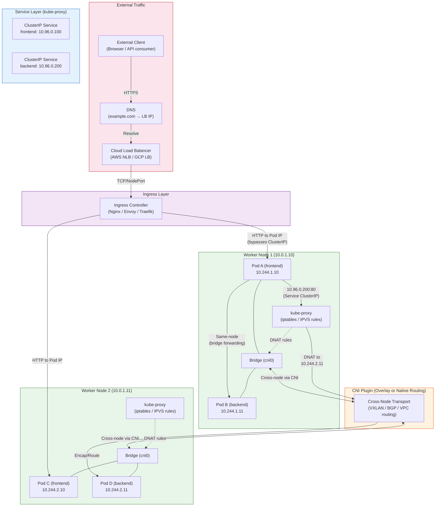

# Kubernetes Networking Model

## 1. Overview

The Kubernetes networking model is built on a single, non-negotiable contract: **every Pod gets its own unique IP address**, and any Pod can communicate with any other Pod using that IP without NAT (Network Address Translation). This is the "flat network" model -- from any Pod's perspective, the entire cluster appears as one large network where every other Pod is directly reachable.

This contract is deceptively simple, but implementing it across dozens or thousands of nodes requires sophisticated networking. Kubernetes itself does not implement the networking -- it defines the rules and delegates implementation entirely to **CNI (Container Network Interface) plugins**. The CNI plugin is responsible for assigning IPs, configuring routes, and ensuring cross-node connectivity. This pluggable design means you choose the networking implementation that matches your requirements: simple overlay networks for easy setup, BGP-based routing for performance, or encrypted tunnels for security.

The networking model handles three distinct communication patterns: **Pod-to-Pod** (direct IP communication), **Pod-to-Service** (stable virtual IPs that load-balance across Pod backends), and **External-to-Service** (how traffic from outside the cluster reaches internal workloads). Each pattern uses different mechanisms, but they all build on the flat network foundation.

## 2. Why It Matters

- **Applications work without port gymnastics.** Because every Pod gets its own IP, containers use standard ports (80, 443, 5432) without conflicts. You never need to map port 8080 to port 32789 to avoid collisions -- a problem that plagued Docker host networking and classic port-mapping approaches.
- **Service discovery is built on stable networking abstractions.** Services provide stable virtual IPs (ClusterIPs) that survive Pod restarts. DNS resolves Service names to ClusterIPs. This is how microservices find each other without hardcoding IPs.
- **CNI choice has direct performance and cost implications.** Overlay networks (Flannel VXLAN, Calico IPIP) add encapsulation overhead -- typically 50 bytes per packet and ~5-10% throughput reduction. Native routing (Calico BGP, AWS VPC CNI) eliminates this overhead but has different operational trade-offs.
- **Network policy is the only in-cluster firewall.** Kubernetes NetworkPolicy resources (enforced by the CNI plugin) are how you restrict which Pods can talk to which other Pods. Without network policies, every Pod can reach every other Pod -- a flat network is a flat attack surface.
- **External traffic routing determines your application's availability.** The path from a user's browser to your Pod involves Ingress controllers, Services, kube-proxy, and the CNI. Understanding each hop is essential for debugging "my app is deployed but nobody can reach it."

## 3. Core Concepts

- **Pod Network (Cluster Network):** The IP address space from which Pods receive their IPs. Defined by the cluster's Pod CIDR (e.g., `10.244.0.0/16`). Each node gets a subset (e.g., `10.244.1.0/24` = 254 Pod IPs per node).
- **Service Network:** A separate IP address space for Service ClusterIPs (e.g., `10.96.0.0/12`). These IPs are virtual -- no network interface has them. They exist only in iptables/IPVS rules.
- **CNI (Container Network Interface):** A specification and a set of libraries for configuring network interfaces in Linux containers. When a Pod is created, the kubelet calls the CNI plugin binary, which creates a veth pair, assigns an IP, and sets up routes.
- **ClusterIP:** The default Service type. A virtual IP reachable only within the cluster. kube-proxy programs iptables/IPVS rules to DNAT (destination NAT) traffic from the ClusterIP to one of the backing Pod IPs.
- **NodePort:** Exposes a Service on a static port (30000-32767) on every node's IP. External clients connect to `<any-node-ip>:<node-port>`, and kube-proxy routes to a backing Pod.
- **LoadBalancer:** Extends NodePort by provisioning a cloud load balancer (AWS NLB/ALB, GCP LB) that distributes external traffic to the NodePorts. The most common way to expose Services in cloud environments.
- **Ingress:** An API object that manages HTTP/HTTPS routing rules. An Ingress controller (Nginx, Traefik, Envoy) watches Ingress objects and configures its reverse proxy accordingly. Provides host-based and path-based routing, TLS termination, and more.
- **kube-proxy:** A network proxy that runs on every node. It watches the API server for Service and Endpoint changes and programs the node's packet-filtering rules (iptables, IPVS, or nftables) to implement Service routing.
- **Endpoint / EndpointSlice:** Objects that list the IP:port pairs of Pods backing a Service. The EndpointSlice controller updates these when Pods are created, destroyed, or become (un)ready. kube-proxy watches EndpointSlices to update its routing rules.
- **Network Policy:** A Kubernetes resource that specifies allowed ingress and egress traffic for Pods, selected by labels. Enforced by the CNI plugin (not kube-proxy). Without any NetworkPolicy, all traffic is allowed.
- **DNS (CoreDNS):** The cluster DNS service that resolves Service names to ClusterIPs. A Pod can reach a Service by name: `my-service.my-namespace.svc.cluster.local`.

## 4. How It Works

### The Three Communication Patterns

#### Pattern 1: Pod-to-Pod Communication

**Same Node:**
1. Pod A sends a packet to Pod B's IP address.
2. The packet exits Pod A's network namespace via a **veth pair** (virtual Ethernet device) -- one end is inside the Pod, the other is on the host.
3. The host end of the veth connects to a **bridge** (e.g., `cbr0` or `cni0`) that acts like a virtual switch.
4. The bridge forwards the packet to Pod B's veth based on MAC address learning.
5. The packet enters Pod B's network namespace. Total overhead: near zero -- the packet never leaves the node's kernel.

**Different Nodes:**
1. Pod A (on Node 1) sends a packet to Pod C (on Node 2).
2. The packet exits Pod A's namespace, hits the bridge, and the host's routing table determines that Pod C's IP is on Node 2.
3. How the packet reaches Node 2 depends on the CNI plugin:
   - **Overlay (VXLAN, Geneve):** The packet is encapsulated inside a UDP packet with Node 2's IP as the outer destination. Node 2 decapsulates and delivers to Pod C. Adds ~50 bytes of overhead per packet.
   - **Native routing (BGP):** The packet is routed natively through the underlying network. Each node advertises its Pod CIDR via BGP, so routers/switches know to forward Pod-destined traffic to the correct node. No encapsulation overhead.
   - **Cloud-native (AWS VPC CNI):** Pods receive IPs directly from the VPC subnet (not an overlay). The VPC's routing infrastructure natively routes packets to the correct node/ENI. No encapsulation, but consumes VPC IP space.

#### Pattern 2: Pod-to-Service Communication

1. Pod A sends a packet to a Service ClusterIP (e.g., `10.96.0.100:80`).
2. The packet hits kube-proxy's rules on the node:
   - **iptables mode:** A chain of rules uses statistic-based random selection to DNAT the packet to one of the backing Pod IPs. The kernel's conntrack module tracks the connection so return traffic is un-NAT-ed correctly.
   - **IPVS mode:** An IPVS virtual server is configured for the ClusterIP. IPVS uses a hash table for O(1) lookup (vs. iptables' O(n) linear chain), making it efficient for clusters with thousands of Services. Supports weighted round-robin, least connections, and other algorithms.
   - **nftables mode:** (K8s 1.31+) Replaces iptables with nftables rules. More efficient rule processing and faster rule updates than iptables. Functionally equivalent but with better performance characteristics.
3. The DNAT-ed packet is now addressed to a specific Pod IP and routed via the Pod network (same node or cross-node as above).
4. The backing Pod responds directly to Pod A. The conntrack entry on Pod A's node un-NATs the source address back to the Service ClusterIP, so Pod A sees a response from the Service, not from a specific Pod.

**DNS resolution flow:**
- Pod A calls `http://my-service:80`.
- The Pod's `/etc/resolv.conf` (injected by the kubelet) directs DNS queries to CoreDNS (typically at `10.96.0.10`).
- CoreDNS resolves `my-service.default.svc.cluster.local` to the Service's ClusterIP.
- Subsequent TCP/UDP traffic flows through the kube-proxy path above.

**DNS search domains and ndots:**
The kubelet injects a resolv.conf like:
```
nameserver 10.96.0.10
search default.svc.cluster.local svc.cluster.local cluster.local
options ndots:5
```

The `ndots:5` setting means that any DNS name with fewer than 5 dots is treated as a relative name and searched through all search domains. When Pod A calls `my-service`, the system tries:
1. `my-service.default.svc.cluster.local` (resolves -- done)

But when Pod A calls `api.example.com` (2 dots, < 5), the system tries:
1. `api.example.com.default.svc.cluster.local` (fails)
2. `api.example.com.svc.cluster.local` (fails)
3. `api.example.com.cluster.local` (fails)
4. `api.example.com` (resolves -- but after 3 unnecessary queries)

This is why external DNS lookups in Kubernetes can appear slow -- each one generates up to 4 extra queries. Mitigation: set `ndots:2` for Pods that primarily call external services, or use NodeLocal DNSCache to cache results on each node.

### CoreDNS Architecture

CoreDNS is the cluster DNS service, deployed as a Deployment (typically 2 replicas) with a ClusterIP Service at a well-known IP (usually `10.96.0.10`):

| Record Type | Pattern | Resolves To |
|---|---|---|
| Service A record | `<svc>.<ns>.svc.cluster.local` | ClusterIP of the Service |
| Service SRV record | `_<port>._<proto>.<svc>.<ns>.svc.cluster.local` | Port and ClusterIP |
| Pod A record | `<pod-ip-dashed>.<ns>.pod.cluster.local` | Pod IP (e.g., 10-244-1-10.default.pod.cluster.local) |
| Headless Service A record | `<svc>.<ns>.svc.cluster.local` | All Pod IPs (multiple A records) |
| StatefulSet Pod | `<pod-name>.<svc>.<ns>.svc.cluster.local` | Individual Pod IP (e.g., postgres-0.postgres.default.svc.cluster.local) |

CoreDNS performance at scale:
- 2 replicas handle ~10,000 queries/second (sufficient for clusters up to ~500 nodes).
- For larger clusters, scale CoreDNS horizontally or deploy NodeLocal DNSCache (a DaemonSet that caches DNS responses on each node, reducing cross-network DNS traffic and latency).

#### Pattern 3: External-to-Service Communication

**NodePort:**
1. External client sends a request to `<node-ip>:30080`.
2. kube-proxy's rules on the node DNAT the packet to a backing Pod IP.
3. If the selected Pod is on a different node, the packet is forwarded to that node (adding a network hop). This can be avoided with `externalTrafficPolicy: Local`, which restricts traffic to Pods on the receiving node -- eliminating the extra hop at the cost of potentially uneven load distribution.

**LoadBalancer:**
1. Cloud LB receives external traffic.
2. LB forwards to one of the cluster nodes' NodePorts.
3. kube-proxy DNAT routes to a backing Pod.
4. With `externalTrafficPolicy: Local`, the LB health-checks each node and only sends traffic to nodes with local backing Pods.

**Ingress:**
1. External DNS points to the Ingress controller's external IP (via a LoadBalancer Service).
2. The Ingress controller (Nginx, Traefik, Envoy) receives the HTTP request.
3. The controller inspects the Host header and URL path, matches them against Ingress rules.
4. The controller proxies the request directly to the backing Pod IPs (bypassing kube-proxy's ClusterIP DNAT). This is why Ingress controllers watch EndpointSlices -- they need the actual Pod IPs, not the Service VIP.
5. TLS can be terminated at the Ingress controller, so backend communication is unencrypted HTTP (within the cluster network).

### kube-proxy Modes Compared

| Mode | Data Structure | Rule Update Speed | Packet Processing | Best For |
|---|---|---|---|---|
| **iptables** | Linear rule chains | Slow for large rule sets | O(n) per packet | Small clusters (<1,000 Services) |
| **IPVS** | Hash tables | Fast | O(1) per packet | Large clusters (1,000+ Services), advanced LB algorithms |
| **nftables** | nftables sets/maps | Fastest | Efficient (native kernel support) | K8s 1.31+; replacement for both iptables and IPVS |

**Scale reference:** In a cluster with 10,000 Services, iptables mode generates ~100,000 rules that must be linearly traversed. IPVS handles this with hash-based O(1) lookups. This is why large clusters should use IPVS or nftables mode.

### Network Policy: The In-Cluster Firewall

Network Policies define allowed traffic flows between Pods using label selectors. Without any NetworkPolicy, all traffic is allowed (default-allow). Once any NetworkPolicy selects a Pod, that Pod enters "default-deny" mode for the selected direction (ingress/egress), and only explicitly allowed traffic is permitted.

**Example: Isolating a database tier**
```yaml
apiVersion: networking.k8s.io/v1
kind: NetworkPolicy
metadata:
  name: db-allow-backend-only
  namespace: production
spec:
  podSelector:
    matchLabels:
      tier: database
  policyTypes:
  - Ingress
  ingress:
  - from:
    - podSelector:
        matchLabels:
          tier: backend
    ports:
    - protocol: TCP
      port: 5432
```

This policy says: Pods labeled `tier: database` in the `production` namespace can only receive ingress traffic on port 5432 from Pods labeled `tier: backend` in the same namespace. All other ingress is denied.

**NetworkPolicy enforcement matrix:**

| CNI Plugin | Ingress Policy | Egress Policy | FQDN-based Policy | L7 Policy |
|---|---|---|---|---|
| **Calico** | Yes | Yes | Yes (via GlobalNetworkPolicy CRD) | No (requires Envoy integration) |
| **Cilium** | Yes | Yes | Yes (native) | Yes (HTTP, gRPC, Kafka via eBPF) |
| **Flannel** | No | No | No | No |
| **Antrea** | Yes | Yes | Yes (via CRD) | No |
| **AWS VPC CNI** | Via security groups for Pods | Via security groups | Via VPC features | No |

**Default-deny best practice:**
```yaml
# Apply this to every namespace to start with zero trust
apiVersion: networking.k8s.io/v1
kind: NetworkPolicy
metadata:
  name: default-deny-all
spec:
  podSelector: {}   # Selects all Pods in the namespace
  policyTypes:
  - Ingress
  - Egress
```

Then add specific allow policies for each legitimate communication path. This is the Kubernetes equivalent of a firewall default-deny rule.

### IP Address Management (IPAM)

Each CNI plugin handles IP allocation differently, and understanding this is critical for capacity planning:

**Subnet-based IPAM (most CNIs):**
- The cluster is configured with a Pod CIDR (e.g., `10.244.0.0/16`).
- Each node gets a smaller subnet (e.g., `10.244.1.0/24` = 254 usable IPs).
- The CNI plugin assigns IPs from the node's subnet to Pods on that node.
- **Capacity limit:** If a node runs more Pods than its subnet supports, new Pods fail to start. Default `/24` supports 254 Pods per node, which is sufficient for most workloads.

**ENI-based IPAM (AWS VPC CNI):**
- Pods get real VPC IP addresses, not overlay IPs.
- Each EC2 instance has a limited number of ENIs, and each ENI has a limited number of IPs (varies by instance type).
- **Capacity limit example:** `m5.xlarge` = 4 ENIs x 15 IPs = 58 Pod IPs (minus 2 for the node itself = 56 Pods max).
- This is the most common Pod density limit on EKS -- not CPU or memory, but IP address capacity.
- Mitigation: enable the VPC CNI "prefix delegation" feature, which assigns /28 prefixes instead of individual IPs, increasing per-node Pod capacity to ~110 Pods on `m5.xlarge`.

**Dual-stack (IPv4 + IPv6):**
- Kubernetes supports dual-stack since 1.23 (GA). Pods can receive both IPv4 and IPv6 addresses.
- Services can be configured for IPv4-only, IPv6-only, or dual-stack.
- Useful for: organizations transitioning to IPv6, environments where IPv4 address exhaustion is a concern, or applications that must serve IPv6 clients.

## 5. Architecture / Flow



## 6. Types / Variants

### CNI Plugins

| Plugin | Network Mode | Encryption | Network Policy | Best For |
|---|---|---|---|---|
| **Calico** | BGP (native routing) or IPIP/VXLAN overlay | WireGuard (optional) | Yes (rich policy engine) | Production clusters needing both performance and policy |
| **Cilium** | eBPF-based (native routing or VXLAN) | IPsec or WireGuard | Yes (L3/L4/L7 via eBPF) | Advanced observability, L7 policy, service mesh integration |
| **Flannel** | VXLAN overlay (default) | No (add-on needed) | No (pair with Calico for policy) | Simple clusters, quick setup, learning environments |
| **AWS VPC CNI** | VPC-native (Pods get VPC IPs) | VPC encryption | Via security groups for Pods | EKS clusters needing VPC integration |
| **Azure CNI** | VNet-native (Pods get VNet IPs) | VNet encryption | Via Azure Network Policy | AKS clusters |
| **Weave Net** | Mesh overlay (VXLAN) | Built-in encryption | Yes | Small clusters needing easy encryption |
| **Antrea** | VXLAN or Geneve overlay | IPsec | Yes (Kubernetes + custom CRDs) | VMware / vSphere environments |

### Service Types

| Type | Accessible From | IP Allocated | External LB | Use Case |
|---|---|---|---|---|
| **ClusterIP** | Within cluster only | Virtual IP from Service CIDR | No | Internal microservice communication |
| **NodePort** | External via `<node-ip>:<port>` | ClusterIP + node port (30000-32767) | No | Development, direct node access |
| **LoadBalancer** | External via cloud LB | ClusterIP + NodePort + external LB IP | Yes (cloud-provisioned) | Production external services |
| **ExternalName** | Within cluster (DNS alias) | None (CNAME record) | No | Aliasing external services (e.g., RDS endpoint) |
| **Headless (ClusterIP: None)** | Within cluster (direct Pod IPs via DNS) | None | No | StatefulSets, client-side load balancing |

### Ingress Controller Comparison

| Controller | Proxy Engine | L7 Features | Config Model |
|---|---|---|---|
| **Nginx Ingress** | Nginx | Path/host routing, TLS, rate limiting, basic auth | Annotations on Ingress objects |
| **Traefik** | Traefik (Go) | Auto TLS (Let's Encrypt), middleware chains, TCP/UDP | IngressRoute CRDs |
| **Envoy / Emissary** | Envoy | gRPC routing, circuit breaking, observability | Mapping CRDs |
| **AWS ALB Ingress** | AWS ALB | WAF integration, Cognito auth | Annotations mapped to ALB config |
| **Gateway API** | Varies (Envoy, Nginx, etc.) | Spec-defined routing, TLS, traffic splitting | GatewayClass, Gateway, HTTPRoute CRDs |

### Gateway API (the successor to Ingress)

The Gateway API is a newer Kubernetes API for routing external traffic. It addresses limitations of the Ingress API:

| Feature | Ingress | Gateway API |
|---|---|---|
| **Routing granularity** | Host + path only | Host, path, headers, query params, method |
| **Protocol support** | HTTP/HTTPS only | HTTP, HTTPS, TCP, UDP, gRPC |
| **Traffic splitting** | Not native (annotation hacks) | Native weighted traffic splitting |
| **Role separation** | Single Ingress object | GatewayClass (infra), Gateway (cluster ops), HTTPRoute (app dev) |
| **Maturity** | GA, widely supported | GA (core resources as of K8s 1.30+) |

## 7. Use Cases

- **Microservices communication:** Services use ClusterIP for stable internal endpoints. Pod-to-Service traffic is DNAT-ed by kube-proxy to healthy Pod backends. DNS resolution (CoreDNS) lets services reference each other by name, not IP. A typical microservices application with 20 services uses 20 ClusterIP Services plus 1 Ingress for external access.
- **Zero-trust networking with Network Policies:** A financial services company deploys default-deny NetworkPolicies in every namespace, then explicitly allows only required communication paths. For example, the payment service can only be reached by the checkout service on port 8443 -- all other ingress is blocked. This approach typically involves 3-5 NetworkPolicy objects per service.
- **Multi-cluster service mesh:** Cilium ClusterMesh or Istio multi-cluster extends the flat network model across clusters. Pods in Cluster A can reach Services in Cluster B using the same DNS names, enabling active-active deployments across regions. This is used by organizations requiring cross-region failover with sub-minute recovery.
- **Cost-optimized external traffic:** Using `externalTrafficPolicy: Local` on a LoadBalancer Service eliminates the extra network hop (and associated cross-AZ data transfer charges) by routing traffic only to nodes with local Pods. This can reduce cloud networking costs by 30-50% for high-traffic services.
- **Canary deployments with Gateway API:** HTTPRoute resources split traffic by weight: 95% to the stable version, 5% to the canary. The Gateway controller implements this at the proxy level, providing application-layer traffic management without modifying the application.
- **Service mesh for observability:** Istio or Linkerd deploy sidecar proxies alongside each Pod. These proxies intercept all network traffic, providing automatic mTLS encryption, distributed tracing, traffic metrics (latency, error rate, throughput), and circuit breaking -- all without application code changes. The trade-off is added latency (1-3 ms per hop) and resource consumption (50-100 MB per sidecar).
- **Headless Services for stateful workloads:** Databases on Kubernetes (PostgreSQL with Patroni, Cassandra) use headless Services to expose individual Pod IPs through DNS. A client can connect to `postgres-0.postgres.default.svc.cluster.local` to reach the primary, or `postgres-1` for a specific replica. This stable, per-Pod DNS is what makes StatefulSet networking work.

## 8. Tradeoffs

| Decision | Option A | Option B | Guidance |
|---|---|---|---|
| **Overlay vs. native routing** | Overlay (VXLAN): works on any infrastructure, no network changes | Native (BGP): no encapsulation overhead, line-rate performance | Overlay for simplicity and portability; native routing for performance-sensitive or bare-metal environments |
| **iptables vs. IPVS** | iptables: simpler, default, well-understood | IPVS: O(1) lookups, multiple LB algorithms | iptables for small clusters; IPVS for clusters with >1,000 Services |
| **Ingress vs. Gateway API** | Ingress: mature, wide controller support | Gateway API: richer routing, better role separation | Gateway API for new projects; Ingress for existing setups with no pressing need to migrate |
| **ClusterIP vs. Headless** | ClusterIP: kube-proxy handles LB | Headless: client resolves all Pod IPs directly | ClusterIP for most services; headless for StatefulSets or when clients need to target specific Pods |
| **Calico vs. Cilium** | Calico: mature, proven at scale, BGP expertise | Cilium: eBPF-based, L7 visibility, service mesh integration | Calico for teams comfortable with BGP and traditional networking; Cilium for teams wanting eBPF observability and L7 policy |
| **externalTrafficPolicy Local vs. Cluster** | Local: preserves client IP, no extra hop, potential uneven distribution | Cluster: even distribution, extra network hop, loses client IP | Local for latency-sensitive or cost-sensitive services; Cluster when even distribution matters more |

## 9. Common Pitfalls

- **No NetworkPolicy = open network.** By default, Kubernetes allows all Pod-to-Pod traffic. Many teams assume Pods are isolated by namespace -- they are not. Without explicit NetworkPolicies, any compromised Pod can reach any other Pod in the cluster. Deploy default-deny policies and explicitly allow required paths.
- **CNI plugin does not support NetworkPolicy.** Flannel (the most common "starter" CNI) does not enforce NetworkPolicies. You can create NetworkPolicy objects, and kubectl will accept them, but they have zero effect. You need a policy-capable CNI like Calico, Cilium, or Antrea.
- **Exhausting Pod CIDR on a node.** Each node gets a fixed-size Pod CIDR (default `/24` = 254 IPs). If you run more Pods than the CIDR allows, new Pods fail with IP allocation errors. This is common on large nodes running hundreds of Pods. Increase the node CIDR size or use a CNI that manages IP allocation differently (AWS VPC CNI uses ENI-attached IPs).
- **Cross-AZ data transfer costs.** In cloud environments, Pod-to-Pod traffic between availability zones incurs data transfer charges ($0.01-0.02/GB on AWS). A chatty microservices architecture spread across 3 AZs can generate significant unexpected costs. Use topology-aware routing (`topologySpreadConstraints` + Service topology hints) to prefer same-AZ communication.
- **kube-proxy iptables rule bloat.** In clusters with thousands of Services, iptables mode generates tens of thousands of rules. Each rule update (when a Pod is added or removed) requires rewriting the entire rule set, causing brief packet drops. Switch to IPVS or nftables mode for large clusters.
- **DNS resolution failures under load.** CoreDNS is a Deployment (typically 2 replicas) that can become a bottleneck in large clusters. If DNS queries start timing out, scale CoreDNS horizontally, enable DNS caching in Pods (`dnsPolicy: None` with local ndots optimization), or use NodeLocal DNSCache.
- **Forgetting that Services are L4.** A ClusterIP Service load-balances at the TCP connection level, not the HTTP request level. For long-lived connections (gRPC, WebSockets), all requests on a connection go to the same Pod. For HTTP-level load balancing, use a service mesh or L7 Ingress.

## 10. Real-World Examples

- **Shopify (Calico + BGP):** Shopify uses Calico with BGP peering to their top-of-rack switches, eliminating overlay overhead. Their internal benchmarks showed a 12% throughput improvement over VXLAN encapsulation for their high-volume checkout service, directly translating to lower p99 latency.
- **AWS EKS (VPC CNI):** EKS defaults to the AWS VPC CNI, which assigns Pods real VPC IP addresses from the node's ENI (Elastic Network Interface). This means Pods are first-class VPC citizens -- security groups, VPC flow logs, and VPC peering all work natively. The tradeoff: each instance type has a maximum ENI count and IPs-per-ENI, which limits Pod density (e.g., a `t3.medium` supports ~17 Pods).
- **Datadog (Cilium + eBPF):** Datadog adopted Cilium for its eBPF-based networking, citing three benefits: (1) L7 visibility without sidecar proxies, (2) efficient NetworkPolicy enforcement that scales to thousands of policies, and (3) replacement of kube-proxy with eBPF-based service routing.
- **Cloudflare (kube-proxy-less with Cilium):** Cloudflare replaced kube-proxy entirely with Cilium's eBPF-based kube-proxy replacement, eliminating iptables rule management overhead. Their clusters with 5,000+ Services saw a 20x improvement in Service endpoint update latency.
- **Real cost impact of cross-AZ traffic:** A production cluster running 500 Pods across 3 AZs with ~10 GB/hour of inter-Pod traffic generates ~$2,000/month in cross-AZ data transfer charges on AWS. Implementing topology-aware routing reduced this by ~60%, saving ~$1,200/month.
- **Pinterest's CNI migration:** Pinterest migrated from Flannel (overlay) to a custom VPC-native CNI on AWS. The overlay removal eliminated encapsulation overhead and simplified troubleshooting (packets are routable at the VPC level). Their monitoring showed a 8% improvement in inter-service p99 latency and significantly simplified network debugging because standard VPC tools (flow logs, security groups) work directly with Pod traffic.
- **Kubernetes Gateway API adoption:** As of 2025, the Gateway API is supported by 20+ implementations including Envoy Gateway, Nginx Gateway Fabric, Istio, Cilium, and Traefik. Organizations like Mercari and Grafana Labs have publicly shared their migration from Ingress to Gateway API, citing improved multi-team workflows (GatewayClass for platform teams, HTTPRoute for app teams) and native traffic splitting for canary deployments.

### Debugging Networking Issues: A Practitioner's Checklist

When a Pod cannot reach another Pod or Service, systematic debugging follows the networking layers:

1. **Verify Pod networking is functional:**
   - `kubectl exec <pod> -- ping <target-pod-ip>` -- tests Pod-to-Pod connectivity.
   - If this fails, check CNI plugin health on both nodes (`kubectl get pods -n kube-system | grep -i cni`).

2. **Verify DNS resolution:**
   - `kubectl exec <pod> -- nslookup <service-name>` -- tests CoreDNS.
   - If this fails, check CoreDNS Pods are running and the Service endpoint is correct.

3. **Verify Service endpoints:**
   - `kubectl get endpoints <service-name>` -- confirms the Service has backing Pod IPs.
   - Empty endpoints usually means the Pod selector does not match, or Pods are not Ready.

4. **Verify kube-proxy rules:**
   - On the node: `iptables -t nat -L KUBE-SERVICES | grep <cluster-ip>` (iptables mode).
   - Or: `ipvsadm -Ln | grep <cluster-ip>` (IPVS mode).
   - Missing rules indicate kube-proxy is not running or not watching the API server.

5. **Verify network policy:**
   - `kubectl get networkpolicy -n <namespace>` -- check if any policy blocks the traffic.
   - Temporarily remove network policies to test (in non-production).

## 11. Related Concepts

- [Kubernetes Architecture](./01-kubernetes-architecture.md) -- the cluster topology where these networking abstractions operate
- [Control Plane Internals](./02-control-plane-internals.md) -- the controller manager runs the EndpointSlice controller that populates Service backends
- [API Server and etcd](./03-api-server-and-etcd.md) -- Service and Endpoint objects are stored in etcd and watched by kube-proxy
- [Container Runtime](./04-container-runtime.md) -- the runtime creates the network namespace that the CNI plugin then configures
- [Networking Fundamentals](../../traditional-system-design/01-fundamentals/06-networking-fundamentals.md) -- OSI layers, TCP/UDP, NAT, and proxy concepts underlying K8s networking
- [Availability and Reliability](../../traditional-system-design/01-fundamentals/04-availability-reliability.md) -- Service redundancy and multi-AZ networking for high availability
- [CAP Theorem](../../traditional-system-design/01-fundamentals/05-cap-theorem.md) -- consistency considerations in distributed service routing

## 12. Source Traceability

- source/youtube-video-reports/7.md -- Five pillars of Kubernetes: Networking pillar (Services, Ingress, Endpoints), strategic framework for analyzing networking components
- source/youtube-video-reports/1.md -- Load balancing algorithms and proxy concepts applied to K8s Service routing
- source/extracted/acing-system-design/ch03-a-walkthrough-of-system-design-concepts.md -- Service mesh architecture with sidecar pods, Kubernetes pod networking model
- Kubernetes official documentation (kubernetes.io) -- Cluster networking, Service types, Virtual IPs and service proxies, Network Policies
- k8s.guide -- Kubernetes flat network model, CNI contract, and Ingress controller architecture
