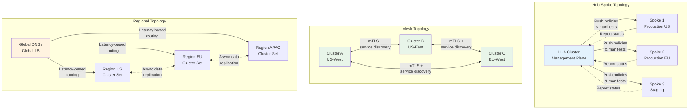
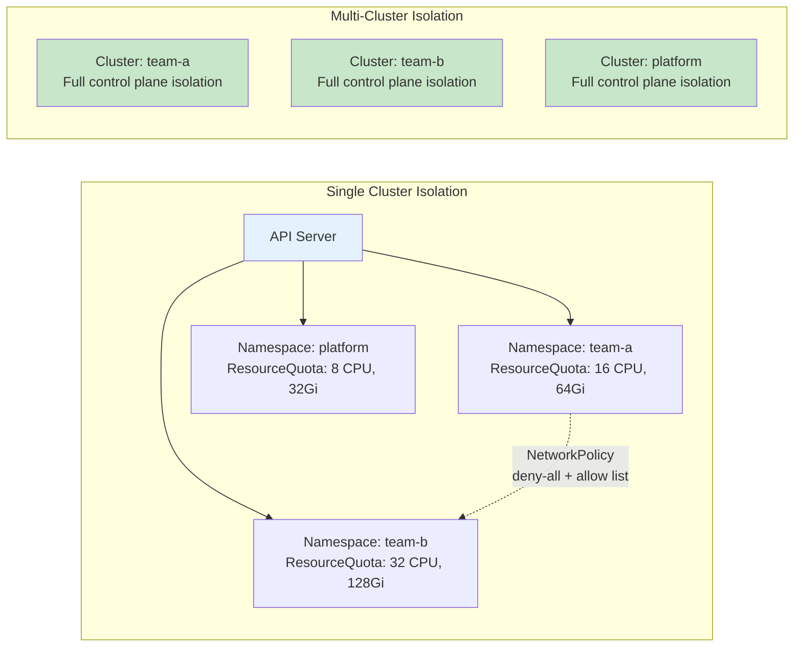

# Cluster Topology

## 1. Overview

Cluster topology is the foundational architectural decision that determines how many Kubernetes clusters you run, how they relate to each other, and how workloads, traffic, and governance flow between them. It is the Kubernetes equivalent of choosing between a monolith and microservices -- except the blast radius of getting it wrong is your entire infrastructure.

A single-cluster topology puts everything in one control plane. A hub-spoke topology designates one management cluster that governs satellite workload clusters. A mesh topology connects clusters as peers with no single point of authority. A regional topology distributes clusters geographically to minimize latency and satisfy data sovereignty requirements. Each pattern carries distinct tradeoffs in complexity, blast radius, operational overhead, and cost.

The topology you choose on day one constrains every subsequent decision: networking, security boundaries, CI/CD pipelines, observability, and disaster recovery. Changing topology after hundreds of workloads are running is one of the most expensive migrations in infrastructure engineering.

Understanding the four primary topologies -- their strengths, limitations, and operational implications -- is the prerequisite for every other Kubernetes design decision in this knowledge base. The cluster topology is to Kubernetes what the database schema is to application development: get it wrong and everything downstream becomes harder.

## 2. Why It Matters

- **Blast radius containment.** A single cluster means a bad admission webhook or etcd corruption takes down everything. Multiple clusters isolate failures to a bounded domain -- a misconfigured network policy in cluster A cannot affect cluster B. This isolation is the single most common reason enterprises move to multi-cluster.
- **Compliance and data sovereignty.** Regulations like GDPR, HIPAA, and data residency laws may require workloads to run in specific geographic regions. Topology determines whether you can satisfy these constraints.
- **Scalability ceiling.** A single Kubernetes cluster has practical limits: approximately 5,000 nodes, 150,000 pods, and 100,000 services. Beyond this, you must go multi-cluster regardless of preference.
- **Team autonomy.** Separate clusters for separate teams (platform, ML, data engineering) provide strong isolation boundaries without the overhead of complex RBAC hierarchies within a shared cluster.
- **Cost optimization.** Different topologies enable different cost strategies. Regional clusters can use cheaper spot instances in regions with lower demand. Dedicated clusters for batch workloads can scale to zero when idle. Cluster-level cost attribution is also far easier than namespace-level attribution in a shared cluster.
- **Disaster recovery posture.** Your topology directly determines your Recovery Time Objective (RTO). A single cluster in a single region gives you an RTO measured in hours. Active-active regional clusters can achieve sub-minute failover. The topology also determines your Recovery Point Objective (RPO) -- how much data you can afford to lose during a failure event.
- **GPU workload separation.** GenAI and ML workloads have fundamentally different resource profiles (GPU-intensive, long-running, bursty) than web services. A dedicated GPU cluster with its own autoscaling policies, spot strategies, and upgrade cadence prevents ML workloads from competing with latency-sensitive services for scheduling priority.

## 3. Core Concepts

- **Control Plane:** The set of components (API server, etcd, scheduler, controller manager) that manage cluster state. Each cluster has exactly one control plane, though it may be distributed across availability zones for HA. The control plane is the brain of the cluster -- every kubectl command, every pod scheduling decision, every health check flows through it.
- **Data Plane:** The worker nodes that run application pods. Data planes can span multiple availability zones within a region. Data plane capacity is elastic (via autoscaling), while control plane capacity is bounded by etcd performance.
- **Cluster Federation:** A pattern where multiple clusters are managed as a single logical entity. A federation control plane distributes workloads and policies across member clusters. Federation can be implemented at multiple levels: infrastructure (Cluster API), configuration (ArgoCD/Flux), workload (KubeFed/KubeAdmiral), and networking (Submariner/Cilium ClusterMesh).
- **Management Cluster (Hub):** A lightweight cluster dedicated to running multi-cluster control plane components (ArgoCD, Crossplane, policy engines) rather than application workloads. The hub should never run production application traffic -- its sole purpose is governance.
- **Workload Cluster (Spoke):** A cluster that runs application workloads, governed by policies pushed from the management cluster. Spokes should be self-sufficient for runtime operations -- if the hub goes offline, spokes must continue serving traffic.
- **Cluster API (CAPI):** A Kubernetes sub-project that provides declarative APIs to create, configure, and manage clusters. Enables treating clusters as cattle rather than pets. CAPI ClusterClasses define cluster templates; new clusters are instantiated from these templates with environment-specific overrides.
- **GitOps:** A deployment methodology where the desired state of all clusters is stored in Git, and agents (ArgoCD, Flux) reconcile actual state to match. Essential for managing multiple clusters consistently. Without GitOps, configuration drift across clusters is inevitable within weeks.
- **Blast Radius:** The scope of impact when something fails. A single cluster has a blast radius of "everything." Separate clusters bound the blast radius to workloads within that cluster. The blast radius calculation should account for both direct failures (cluster down) and indirect failures (shared dependency outage).
- **Cluster Set:** A group of clusters that mutually trust each other, share a common identity, and participate in cross-cluster service discovery. Defined by the Kubernetes multi-cluster services SIG (KEP-1645). Services within a cluster set are addressable via the `*.svc.clusterset.local` DNS domain.
- **Tenant:** An organizational unit (team, department, customer) that consumes cluster resources. In a single cluster, tenants are isolated via namespaces. In multi-cluster, each tenant may have a dedicated cluster. The choice between namespace-level and cluster-level tenancy is a key topology decision.
- **Availability Zone (AZ):** A physically separate data center within a cloud region, with independent power, cooling, and networking. A single cluster's control plane and data plane should span at least 3 AZs to survive the loss of any one AZ.

## 4. How It Works

### Single-Cluster Topology

The simplest topology: one control plane, one set of worker nodes, all workloads in one place. Namespaces provide logical isolation, RBAC provides access control, and NetworkPolicies provide network segmentation.

**When it works:** Small-to-medium organizations (fewer than 50 services), single-region deployments, teams that share an on-call rotation, environments where operational simplicity outweighs isolation needs. Most startups and small engineering teams should start here.

**Scaling limits:** The Kubernetes scalability SIG has validated clusters up to 5,000 nodes and 150,000 pods. In practice, etcd performance degrades before these limits due to watch event volume. API server latency increases noticeably above 2,000-3,000 nodes, especially with custom controllers generating high watch churn.

**Concrete scaling thresholds to monitor:**

| Metric | Warning Threshold | Action |
|---|---|---|
| API server P99 latency | > 500ms | Audit custom controllers, reduce CRD watch volume |
| etcd DB size | > 4 GB | Increase compaction frequency, reduce object count |
| etcd WAL fsync duration | > 10ms (P99) | Move etcd to faster SSDs (NVMe) |
| Nodes | > 2,000 | Plan multi-cluster migration |
| Custom CRD instances | > 50,000 | Consider sharding or moving to external storage |
| Active watches on API server | > 10,000 | Audit operators and controllers for excessive watch activity |

**Isolation mechanisms within a single cluster:**
- Namespaces with ResourceQuotas (CPU, memory, storage limits per namespace)
- LimitRanges (default requests/limits for pods in a namespace, preventing resource hogs)
- NetworkPolicies (L3/L4 isolation between namespaces; default deny-all with explicit allow-list is the production pattern)
- Pod Security Standards (restricted, baseline, privileged) enforced via Pod Security Admission or Kyverno/OPA Gatekeeper
- RBAC with fine-grained Role and ClusterRole bindings (one ClusterRole per team role, namespace-scoped RoleBindings)
- Priority classes for workload preemption ordering (system-critical > platform > application > batch)
- Resource quotas per namespace to prevent any single team from consuming more than their share

### Hub-Spoke Topology

A management cluster (hub) runs the multi-cluster control plane. Workload clusters (spokes) run applications. The hub pushes configuration, policies, and deployment manifests to spokes. Spokes report status back to the hub.

**How the hub works:** The hub cluster is intentionally lightweight -- typically 3-5 nodes, no application workloads. It runs:
- GitOps controllers (ArgoCD ApplicationSets, Flux Kustomizations) -- the single source of truth for all spoke configurations
- Policy engines (Kyverno, OPA Gatekeeper) that generate and distribute policies to spoke clusters
- Cluster lifecycle management (Cluster API controllers) -- creating, upgrading, and decommissioning spoke clusters
- Centralized secret management (External Secrets Operator) -- syncing secrets from Vault/AWS SM to spokes
- Observability aggregation (Thanos, Grafana Mimir receivers) -- collecting metrics from all spokes
- Cost management tools (Kubecost, OpenCost) -- aggregating resource usage and cost data across the fleet

**How spokes register:** Spokes can be registered via Cluster API (declarative), ArgoCD cluster secrets (kubeconfig-based), or Open Cluster Management agents (pull-based). The pull-based model is preferred for security because the spoke initiates the connection, avoiding the need for the hub to hold credentials to every spoke.

**Communication pattern:** In Open Cluster Management (OCM), the hub stores prescriptions (ManifestWorks) as CRDs in the hub API server. Agents on each spoke cluster pull these prescriptions and apply them locally. This avoids the hub needing direct network access to spoke API servers.

**Hub sizing guidelines:**

| Spoke Count | Hub Nodes | Hub Node Size | etcd Storage | ArgoCD Memory |
|---|---|---|---|---|
| 5-10 | 3 | 4 vCPU, 16 GiB | 20 GB SSD | 4 GiB |
| 10-50 | 3-5 | 8 vCPU, 32 GiB | 50 GB NVMe | 8-16 GiB |
| 50-200 | 5 | 16 vCPU, 64 GiB | 100 GB NVMe | 32+ GiB |
| 200+ | Consider hierarchical (regional hubs) | -- | -- | -- |

**Hub resilience:** The hub must span 3 availability zones with etcd on low-latency NVMe storage. Hub failure should not affect running workloads on spokes -- spokes must be architecturally independent for runtime operations. The hub is only needed for configuration changes (new deployments, policy updates, secret rotations). Design spoke clusters to serve traffic indefinitely without hub connectivity.

### Mesh Topology

Every cluster is a peer. No single cluster is the authority. Clusters discover each other and can communicate directly. Service mesh federation (Istio multi-cluster, Linkerd multicluster, Consul mesh gateway) enables cross-cluster service discovery and traffic routing.

**When it works:** Organizations with autonomous teams that each own their cluster lifecycle. Multi-cloud deployments where no single cloud is the "primary." Scenarios where the loss of any single cluster (including the "management" cluster) must not impact others.

**How cross-cluster discovery works:** Each cluster runs a service mesh control plane. Mesh federation synchronizes service endpoints across clusters. A service in cluster A is reachable from cluster B via the mesh, using a DNS name like `service.namespace.svc.clusterset.local`. The mesh handles mTLS, load balancing, and failover across cluster boundaries.

**Complexity cost:** Mesh topology requires O(n^2) trust relationships for n clusters. Each cluster pair needs mutual TLS certificates, network reachability, and synchronized configuration. At 10 clusters, you have 45 unique pairs to manage. Automation (Terraform, Crossplane) is non-negotiable.

**Practical limits:** Most mesh deployments work well at 3-10 clusters. Beyond 10-15 clusters, the O(n^2) configuration overhead becomes the dominant engineering cost. At that scale, consider a hierarchical model (regional mesh clusters connected via a global routing layer) rather than a full mesh.

**Mesh vs. hub-spoke decision matrix:**

| Factor | Hub-Spoke Wins | Mesh Wins |
|---|---|---|
| Central policy enforcement | Strong central authority needed | Teams can self-govern |
| Cluster ownership model | Platform team owns all clusters | Each team owns their cluster |
| Cloud strategy | Single cloud, unified control | Multi-cloud, no single cloud "primary" |
| Failure independence | Acceptable hub dependency for config | Zero dependency on any single cluster |
| Operational maturity | Medium (platform team manages complexity) | High (every team manages their mesh endpoint) |
| Cost | Lower (less infrastructure per cluster) | Higher (each cluster runs full control plane + mesh) |

### Regional Topology

Clusters are deployed in distinct geographic regions to minimize latency for users in those regions and satisfy data sovereignty requirements. Each region may run a hub-spoke or standalone cluster. Global DNS (Route 53, Cloud DNS) or a global load balancer routes users to the nearest healthy region.

**Architecture:** Typically, each region has:
- Its own cluster (or cluster set) with independent control plane
- Its own data store (with cross-region replication for stateful workloads)
- Its own ingress and egress paths (regional load balancers, CDN edge caches)
- Shared observability aggregated to a central location (Thanos/Mimir in a dedicated observability cluster)
- Independent CI/CD agents that pull from the same Git repositories

**Data replication patterns:**

| Pattern | Write Latency | Consistency | Complexity | Use Case |
|---|---|---|---|---|
| **Active-passive** | Low (single primary) | Strong | Low | Non-latency-sensitive, DR-focused |
| **Active-active** | Low (local writes) | Eventual (conflict resolution) | High | User-facing apps needing global low latency |
| **Read-local-write-global** | High for writes (forwarded to primary) | Strong for writes | Medium | Read-heavy workloads (80%+ reads) |

**Failover mechanisms and speed:**

| Method | Failover Time | Granularity | Example |
|---|---|---|---|
| DNS-based (Route 53 failover) | 60-300 seconds (TTL-bound) | Per DNS query | Standard multi-region DR |
| Anycast-based (BGP reconvergence) | 5-30 seconds | Per packet | Cloudflare, Google Global LB |
| Application-layer (Global Accelerator) | < 1 second | Per request | AWS Global Accelerator, Cloudflare Workers |
| Service mesh (Istio locality failover) | < 5 seconds | Per request | Cross-cluster mesh-based routing |

**Regional topology with GPU considerations for GenAI:** GPU availability varies dramatically across cloud regions. Some regions (US-East, US-West, EU-West) have chronic GPU shortages for A100/H100 instances. A regional topology for ML workloads should include:
- Training clusters in GPU-rich regions (sometimes different from where users are)
- Inference clusters co-located with users for low latency
- Model artifact replication from training regions to inference regions (push trained models via object storage replication)
- Fallback inference to non-preferred regions during GPU capacity shortages

### Topology Evolution Path

Most organizations follow a predictable evolution:

**Stage 1 (0-20 services, 1-3 teams):** Single cluster with namespace isolation. All workloads in one place. One platform engineer part-time.

**Stage 2 (20-100 services, 3-10 teams):** Separate environments (dev, staging, prod) into separate clusters. Introduce GitOps (ArgoCD). Light hub-spoke with prod cluster as primary concern.

**Stage 3 (100-500 services, 10-30 teams):** Full hub-spoke with dedicated management cluster. Per-team or per-domain workload clusters. Cluster API for lifecycle. Policy-as-code distributed from hub.

**Stage 4 (500+ services, 30+ teams, multi-region):** Regional topology with regional hubs. Service mesh federation for cross-region traffic. Hierarchical hub-spoke for fleet governance. Dedicated clusters for specialized workloads (GPU, compliance, batch).

**Key insight:** Do not skip stages. Each stage builds operational maturity (monitoring, incident response, upgrade processes, GitOps discipline) that the next stage requires. Jumping from Stage 1 to Stage 4 results in a complex topology that the team cannot operate reliably.

## 5. Architecture / Flow





## 6. Types / Variants

| Topology | Clusters | Governance Model | Complexity | Blast Radius | Best For |
|---|---|---|---|---|---|
| **Single Cluster** | 1 | Namespaces + RBAC | Low | Everything | Startups, small teams, single-region |
| **Hub-Spoke** | 3-50+ | Centralized hub pushes policy | Medium | Per-spoke cluster | Enterprises with central platform teams |
| **Mesh** | 3-20 | Decentralized, peer-to-peer | High | Per cluster | Multi-cloud, autonomous teams |
| **Regional** | 2-10 regions | Per-region autonomy with global coordination | High | Per region | Global user base, data sovereignty |
| **Hierarchical** | Nested hubs | Regional hubs report to global hub | Very High | Bounded by hierarchy level | Large enterprises (100+ clusters) |

### Topology Selection Decision Framework

| Factor | Single Cluster | Hub-Spoke | Mesh | Regional |
|---|---|---|---|---|
| Team count | 1-5 teams | 5-50 teams | 3-15 autonomous teams | Any (geography-driven) |
| Services | < 100 | 100-1000+ | 50-500 per cluster | Varies per region |
| Compliance needs | Low | Medium-High | Medium | High (data sovereignty) |
| Operational maturity | Any | Medium-High | High | High |
| Cloud strategy | Single cloud | Single or multi-cloud | Multi-cloud | Multi-region (any cloud) |
| Platform team size | 1-3 engineers | 3-10 engineers | 5+ per team | 5-15 engineers |

### Tooling Landscape by Topology

Different topologies require different tools. Here is the recommended tooling stack for each:

**Single Cluster Tooling:**
- Namespaces + RBAC for isolation
- Kyverno or OPA Gatekeeper for policy enforcement
- NetworkPolicies (Calico or Cilium) for network segmentation
- ResourceQuotas and LimitRanges for resource governance
- Hierarchical Namespace Controller (HNC) for namespace hierarchy (optional)

**Hub-Spoke Tooling:**
- ArgoCD ApplicationSets or Flux for GitOps across clusters
- Cluster API (CAPI) for cluster lifecycle management
- Open Cluster Management (OCM) for pull-based governance
- External Secrets Operator for cross-cluster secret synchronization
- Crossplane for infrastructure provisioning from the hub
- Thanos or Grafana Mimir for centralized metrics aggregation

**Mesh Tooling:**
- Istio multi-primary or Linkerd multicluster for service mesh federation
- Submariner or Cilium ClusterMesh for cross-cluster networking
- Each cluster runs its own ArgoCD/Flux instance (no centralized GitOps)
- Distributed tracing (Jaeger, Tempo) with cross-cluster trace correlation

**Regional Tooling:**
- Global DNS (Route 53, Cloud DNS) with health check-based failover
- Global load balancer (AWS Global Accelerator, Cloudflare) for per-request routing
- CockroachDB, Spanner, or Vitess for geo-distributed data
- Object storage replication for model artifacts and static assets
- Regional ArgoCD instances or centralized with region-specific ApplicationSets

### Cost Implications by Topology

| Topology | Infrastructure Cost | Operational Cost (People) | Total Cost Index |
|---|---|---|---|
| **Single Cluster** | 1x (baseline) | 1x (1-2 engineers) | Low |
| **Hub-Spoke (5 clusters)** | 3-4x | 2-3x (3-5 engineers) | Medium |
| **Mesh (5 clusters)** | 4-5x | 3-4x (5-8 engineers) | Medium-High |
| **Regional (3 regions)** | 3-4x (per region) | 3-5x (5-10 engineers) | High |
| **Hierarchical (50+ clusters)** | 10-20x | 5-8x (10-20 engineers) | Very High |

The infrastructure cost multiplier is not simply "number of clusters" because each cluster has fixed overhead: control plane resources (even if managed), monitoring agents, ingress controllers, and CNI components. A 5-cluster deployment costs 3-4x (not 5x) a single cluster because workload resources are distributed, but fixed overhead is replicated.

## 7. Use Cases

- **Startup scaling from single to hub-spoke:** A fintech startup begins with a single GKE cluster. At 30 microservices and 3 teams, RBAC conflicts and noisy-neighbor resource contention become painful. The payment processing team's load test saturates the cluster, causing latency spikes for the onboarding team's APIs. They split into a hub cluster (ArgoCD, Crossplane) and 3 spoke clusters (production, staging, ML workloads). Total migration: 6 weeks with Cluster API. Post-migration, noisy-neighbor incidents drop to zero.
- **Global SaaS with regional topology:** A collaboration platform serves users across NA, EU, and APAC. GDPR requires EU user data to stay in EU. They deploy regional clusters with CockroachDB for geo-partitioned data. Global DNS routes users to the nearest region. Cross-region replication handles disaster recovery with RPO < 30 seconds. User-perceived latency drops from 200ms (cross-Atlantic API calls) to 30ms (local region) after implementing regional clusters.
- **Multi-cloud mesh for resilience:** A financial services company runs workloads across AWS EKS and Azure AKS to avoid single-cloud dependency (regulatory requirement from their banking regulator). Istio multi-cluster mesh provides cross-cloud service discovery. Submariner tunnels handle cross-cloud pod networking. Each cluster is a peer in the mesh -- loss of either cloud's cluster shifts traffic to the survivor. During the 2024 us-east-1 outage, their Azure cluster absorbed all traffic with zero customer impact.
- **Platform engineering with hierarchical hub-spoke:** A large enterprise with 200+ clusters uses a two-level hub-spoke. A global hub manages 5 regional hubs. Each regional hub manages 30-50 workload clusters. ArgoCD ApplicationSets at the global hub generate region-specific configurations. Each regional hub further customizes for local compliance requirements. A security policy change propagates from global hub to all 200+ clusters within 15 minutes.
- **GenAI inference with regional GPU clusters:** An AI company serves LLM inference globally. Training runs in a single US-West cluster with 500 H100 GPUs. Inference runs in 4 regional clusters (US-East, US-West, EU-West, APAC-Southeast) with A10G/L4 GPUs sized for local demand. Model artifacts are replicated to regional clusters via object storage replication. Regional inference clusters autoscale independently based on local traffic patterns. GPU utilization averages 75% across regions (vs. 40% in a single global cluster) because each region's autoscaler responds to local demand signals.

## 8. Tradeoffs

| Decision | Option A | Option B | Guidance |
|---|---|---|---|
| **Single vs. multi-cluster** | Single: Simple, cheap, one control plane to secure | Multi: Isolation, independent scaling, bounded blast radius | Start single. Split when you hit isolation requirements, compliance mandates, or scale limits. The trigger is usually organizational (team conflicts), not technical. |
| **Hub-spoke vs. mesh** | Hub-spoke: Clear authority, simpler networking, easier audit | Mesh: No SPOF, team autonomy, multi-cloud native | Hub-spoke for central platform teams. Mesh when no single team should own the control plane or when multi-cloud is a hard requirement. |
| **Push vs. pull governance** | Push: Hub writes directly to spokes | Pull: Agents on spokes pull from hub | Pull is more secure (spokes initiate connections). Push is simpler but requires the hub to hold credentials to all spokes. OCM uses pull. ArgoCD supports both. |
| **Shared vs. dedicated clusters per team** | Shared: Higher utilization, fewer clusters | Dedicated: Strong isolation, independent upgrades | Shared for teams with similar workload profiles. Dedicated when teams need different K8s versions, have different compliance requirements, or cannot tolerate shared-tenancy noisy neighbors. |
| **Regional active-active vs. active-passive** | Active-active: Low latency everywhere, complex data sync | Active-passive: Simpler, but failover adds latency | Active-active for user-facing latency-sensitive workloads. Active-passive for batch, internal tools, and workloads where RPO/RTO of minutes is acceptable. |
| **Managed vs. self-managed multi-cluster** | Managed (GKE Fleet, EKS, AKS): Lower ops burden | Self-managed (CAPI + ArgoCD): Full control, cloud-agnostic | Managed if you are single-cloud and want operational simplicity. Self-managed if you need multi-cloud or fine-grained control over cluster configuration. |
| **Few large clusters vs. many small clusters** | Few large: Better resource utilization, simpler networking | Many small: Better isolation, faster upgrades, smaller blast radius | Few large clusters for workloads with similar characteristics. Many small clusters when teams have divergent requirements or when regulatory boundaries demand physical separation. |

### The Hidden Cost of Multi-Cluster

Beyond infrastructure costs, multi-cluster introduces operational complexity that is often underestimated:

- **Observability fragmentation:** Metrics, logs, and traces are distributed across clusters. Without centralized aggregation (Thanos, Grafana Mimir, centralized logging), debugging cross-cluster issues requires SSH-hopping between clusters. Budget 2-4 weeks for observability federation setup.
- **Secret synchronization:** Secrets (TLS certificates, API keys, database credentials) must be available in multiple clusters. External Secrets Operator or Vault with Kubernetes auth solves this, but each new cluster requires enrollment.
- **Upgrade coordination:** With 10 clusters, you perform 10 Kubernetes upgrades per release cycle (not one). Even with automation, each upgrade requires validation, and an upgrade failure in one cluster requires debugging while other clusters may be on different versions.
- **Developer experience:** Developers must understand which cluster their service runs in, how to access logs and metrics for that cluster, and how to debug cross-cluster service calls. Without a good platform abstraction (Backstage, internal developer portal), the cognitive overhead multiplies with cluster count.

## 9. Common Pitfalls

- **Starting multi-cluster too early.** Multi-cluster adds operational cost: separate upgrades, cross-cluster networking, distributed observability, secret synchronization. If you are a 10-person team with 20 services, a single cluster with good namespace isolation is almost certainly the right answer. The overhead of multi-cluster will consume your platform team's entire capacity. Rule of thumb: you need at least 2-3 dedicated platform engineers before going multi-cluster.
- **Hub cluster as a single point of failure.** If ArgoCD on the hub goes down, no deployments reach any spoke. Mitigate by running the hub control plane across 3 availability zones with etcd on SSDs, and by designing spokes to continue operating independently during hub outages (they should not need the hub for runtime operations). Test hub failure quarterly: kill the hub control plane and verify all spokes continue serving traffic.
- **Ignoring cluster lifecycle management.** Managing 10+ clusters manually (upgrades, certificate rotation, etcd backups) is unsustainable. Use Cluster API or a managed service (EKS, GKE) from day one. Treat clusters as disposable infrastructure created from code. A cluster that cannot be recreated from code within 30 minutes is a liability.
- **Underestimating cross-cluster networking complexity.** Flat networking across clusters sounds appealing but introduces IP address conflicts, complex firewall rules, and debugging nightmares. Prefer service mesh or API gateway for cross-cluster communication over direct pod-to-pod networking. If you must do cross-cluster pod networking, use Submariner or Cilium ClusterMesh -- do not roll your own VPN tunnels.
- **No cluster provisioning standards.** Without a cluster template (Cluster API ClusterClass, Crossplane Composition), each new cluster accumulates configuration drift. Six months later, "production-us" and "production-eu" have subtly different configurations that cause mysterious failures. Define a "cluster baseline" that includes CNI, CSI, monitoring agents, log forwarders, policy engine, and security baseline -- and enforce it via GitOps.
- **Forgetting about etcd performance.** Each additional custom controller, operator, and CRD increases etcd write and watch load. In a single large cluster, 50 operators generating 10,000+ CRD events per second can degrade API server latency for all workloads. This is an invisible scaling cliff. Monitor etcd metrics (db size, compaction time, WAL fsync latency) and split into multi-cluster before etcd becomes the bottleneck.
- **Choosing topology based on current scale, not projected scale.** A single cluster works fine at 20 services but not at 200. If your growth trajectory indicates hitting multi-cluster triggers within 12-18 months, start planning the migration now. Topology migrations under pressure (during an outage or rapid growth) are far more expensive and risky than planned migrations.
- **Not accounting for CI/CD pipeline changes.** Multi-cluster requires your CI/CD pipelines to target multiple clusters. A deployment that was a single `kubectl apply` becomes a multi-cluster rollout with canary stages, cross-cluster health checks, and rollback coordination. ArgoCD ApplicationSets or Flux Kustomizations solve this, but the migration takes weeks of pipeline engineering.

## 10. Real-World Examples

- **Spotify:** Runs hundreds of GKE clusters, one per team ("squad"). Each squad has full autonomy over their cluster lifecycle. A central platform team provides golden cluster templates via Backstage, ensuring consistency without central bottleneck. This is a mesh-like topology with centralized tooling but decentralized ownership. The pattern scales because each squad's blast radius is limited to their own cluster.
- **Airbnb:** Migrated from a single large cluster to a hub-spoke model using ArgoCD. The hub cluster manages deployment pipelines for 15+ workload clusters. They reported a 70% reduction in blast radius incidents after the migration. The key driver was that a single cluster upgrade required coordinating with every team simultaneously, while separate clusters can be upgraded independently.
- **Alibaba Cloud (ACK):** Manages 100,000+ Kubernetes clusters for customers using a hierarchical hub-spoke topology with Open Cluster Management (OCM). Regional hubs handle local operations while a global control plane manages cross-region policies. At this scale, the hierarchical model is the only viable approach -- a single hub cannot manage 100,000 spoke connections.
- **CERN:** Runs a multi-cluster Kubernetes setup across data centers with Magnum (OpenStack) for cluster provisioning. Workloads for different physics experiments (ATLAS, CMS, LHCb) run in separate clusters to provide resource isolation and independent upgrade cycles. Each experiment has different compute requirements and different release cadences, making shared clusters impractical.
- **Mercedes-Benz:** Uses a hub-spoke model with Rancher to manage 100+ clusters across factories, cloud environments, and edge locations. The hub provides centralized fleet management while factory-floor clusters operate with intermittent connectivity. The edge clusters at factory sites are self-sufficient -- they continue running production workloads even when disconnected from the management hub.
- **Pinterest:** Operates a regional topology with EKS clusters in multiple AWS regions. Each region handles user traffic for its geographic area. CockroachDB handles cross-region data replication. They implemented cluster-level isolation for their ML training infrastructure (separate GPU clusters) after training jobs caused resource contention with their serving infrastructure.

## 11. Related Concepts

- [Multi-Cluster Architecture](./03-multi-cluster-architecture.md) -- tools and patterns for implementing multi-cluster topologies
- [Node Pool Strategy](./02-node-pool-strategy.md) -- how to structure compute within a single cluster
- [Cloud vs Bare Metal](./04-cloud-vs-bare-metal.md) -- infrastructure choices that influence topology decisions
- [Availability and Reliability](../../traditional-system-design/01-fundamentals/04-availability-reliability.md) -- HA patterns that topology must support
- [Load Balancing](../../traditional-system-design/02-scalability/01-load-balancing.md) -- traffic distribution within and across clusters

### Topology and Observability

The cluster topology directly affects your observability architecture:

**Single cluster:** One Prometheus, one Grafana, one logging pipeline. Dashboards are straightforward. All traces are within one cluster. Alert routing is simple.

**Hub-spoke:** Each spoke runs local Prometheus and log collectors. The hub aggregates metrics via Thanos sidecar/receiver or Grafana Mimir. Dashboards must support cluster-level filtering. Alerts fire locally (per-cluster) and globally (fleet-level aggregation). The observability pipeline becomes a critical dependency -- if the hub's Thanos compactor falls behind, historical queries slow down.

**Mesh:** Each cluster runs its own observability stack independently. Cross-cluster correlation requires shared trace IDs propagated through mesh gateways. No single pane of glass by default -- you must build it. This is the hardest observability topology because there is no natural aggregation point.

**Regional:** Regional observability stacks with cross-region aggregation to a central analytics cluster. Dashboards support region-level drill-down. Alert on per-region health (regional SLO violations) and cross-region health (replication lag, failover status).

| Topology | Metrics Architecture | Logging Architecture | Trace Correlation |
|---|---|---|---|
| Single | Single Prometheus + Grafana | Single pipeline (Fluentbit -> Loki) | Automatic (single cluster) |
| Hub-spoke | Prometheus per spoke + Thanos on hub | Fluentbit per spoke -> centralized Loki/ES | Cross-cluster trace IDs via mesh |
| Mesh | Independent Prometheus per cluster | Independent log pipelines | Manual correlation (shared trace context) |
| Regional | Regional Prometheus + global Thanos/Mimir | Regional log stores + global aggregation | Cross-region trace propagation |

### Topology and CI/CD Pipelines

The topology determines how deployments flow:

**Single cluster:**
```
Git push -> CI build -> Container image -> kubectl apply / ArgoCD sync -> Done
```

**Hub-spoke:**
```
Git push -> CI build -> Container image -> ArgoCD ApplicationSet on hub
  -> Sync to staging spoke (validate)
  -> Sync to production spokes (progressive rollout)
  -> Health check per spoke
```

**Regional:**
```
Git push -> CI build -> Container image
  -> Deploy to canary region (5% traffic)
  -> Validate SLOs (latency, error rate) for 30 minutes
  -> Progressive rollout to all regions
  -> Per-region health gates (must pass before next region)
```

**Key pattern:** Use ArgoCD ApplicationSets with generators to target multiple clusters from a single Application definition. The `clusterDecisionResource` generator or `list` generator maps applications to clusters. Progressive rollout across clusters uses Argo Rollouts or custom health gates in the CI pipeline.

### Topology Checklist for Design Reviews

Before finalizing a topology, validate these items:

- [ ] Blast radius: Can a failure in one cluster affect workloads in another?
- [ ] Compliance: Does the topology satisfy all data residency and regulatory requirements?
- [ ] Upgrade independence: Can each cluster be upgraded without coordinating with all teams?
- [ ] Observability: Is there a plan for centralized metrics, logs, and traces across all clusters?
- [ ] Secret management: How are secrets distributed and rotated across clusters?
- [ ] Disaster recovery: What is the tested RTO and RPO for each cluster and for the fleet?
- [ ] Cost attribution: Can costs be attributed to teams/business units per cluster?
- [ ] Network security: Are cross-cluster network paths secured (mTLS, network policies)?
- [ ] CI/CD: Do deployment pipelines support the target topology natively?
- [ ] Developer experience: Can developers debug issues without deep topology knowledge?

## 12. Source Traceability

- Web research: KubeOps cluster topology guide -- single, hub-spoke, mesh, regional patterns and selection criteria
- Web research: Open Cluster Management architecture -- hub-spoke with pull-based agent model, ManifestWork CRDs
- Web research: Azure AKS baseline architecture -- hub-spoke networking with regional failover patterns
- Web research: Solo.io multicluster networking reference architecture -- mesh topology with Gloo Mesh
- Web research: AWS EKS Blueprints -- ArgoCD multi-cluster hub-spoke GitOps pattern
- Web research: IDACORE Kubernetes multi-cluster management -- enterprise best practices for cluster topology selection
- Web research: Microsoft AKS multi-region reference architecture -- regional topology with Azure Firewall Manager
