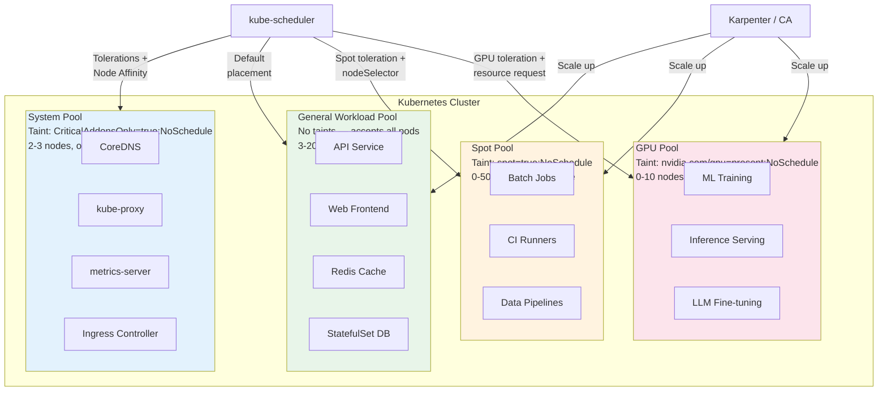
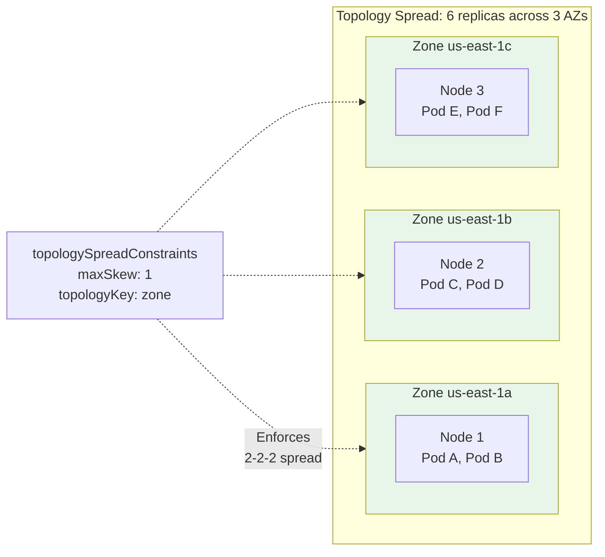

# Node Pool Strategy

## 1. Overview

A node pool is a group of nodes within a Kubernetes cluster that share the same configuration: machine type, OS image, labels, taints, and scaling policy. Node pools are how you translate heterogeneous workload requirements (CPU-intensive APIs, GPU-hungry ML training, memory-heavy caches, fault-tolerant batch jobs) into concrete infrastructure without forcing every workload onto the same hardware.

The node pool strategy determines how you segment your cluster's compute capacity. A well-designed strategy gives the scheduler enough information to place pods on the right hardware while keeping costs under control. A poorly designed strategy leads to either waste (expensive GPU nodes running nginx) or starvation (ML training jobs stuck pending because the only available nodes have 2 vCPUs).

Node pools are the bridge between Kubernetes scheduling primitives (taints, tolerations, node affinity, topology spread constraints) and cloud provider instance types. Mastering node pools means mastering this bridge -- using the right Kubernetes primitives to drive workloads to the right infrastructure.

## 2. Why It Matters

- **Cost efficiency.** A single homogeneous node pool forces you to size nodes for your most demanding workload. If one service needs 96 GiB RAM, every node gets 96 GiB -- even the ones running lightweight sidecars. Separate pools let you right-size each workload class.
- **GPU workload isolation.** GPU nodes (A100s, H100s, L4s) cost $1-$30+ per hour each. Running non-GPU workloads on GPU nodes is burning money. Taints on GPU pools ensure only workloads that request `nvidia.com/gpu` land there.
- **Spot/preemptible savings.** Spot instances cost 60-90% less than on-demand but can be reclaimed at any time. A dedicated spot pool with taints ensures only fault-tolerant workloads run on interruptible infrastructure, while critical services stay on on-demand nodes.
- **System component protection.** Kubernetes system components (CoreDNS, kube-proxy, metrics-server, CSI drivers) must run reliably. A dedicated system pool prevents application workloads from starving system components of resources.
- **Compliance isolation.** Some workloads require dedicated hosts (no VM sharing with other tenants) for compliance. A dedicated-host node pool satisfies this requirement without affecting other workloads.
- **Upgrade safety.** Separate pools can be upgraded independently. You can upgrade the system pool first, validate, then upgrade workload pools -- reducing the blast radius of a bad node image.

## 3. Core Concepts

- **Taint:** A property applied to a node that repels pods unless they explicitly tolerate it. Format: `key=value:effect`. Effects: `NoSchedule` (hard: never schedule without toleration), `PreferNoSchedule` (soft: avoid but allow), `NoExecute` (evict existing pods without toleration).
- **Toleration:** A property on a pod that allows it to be scheduled onto a tainted node. Tolerations do not guarantee placement -- they only remove the repulsion. You typically combine tolerations with node affinity to ensure placement.
- **Node Label:** A key-value pair on a node used for selection. Standard labels include `node.kubernetes.io/instance-type`, `topology.kubernetes.io/zone`, and `kubernetes.io/arch`. Custom labels like `workload-type=gpu` or `team=ml` enable fine-grained scheduling.
- **Node Selector:** The simplest form of node selection. A pod specifies `nodeSelector: {key: value}` and the scheduler only considers nodes with that label. No expressiveness beyond exact match.
- **Node Affinity:** A more expressive version of nodeSelector. Supports `requiredDuringSchedulingIgnoredDuringExecution` (hard requirement) and `preferredDuringSchedulingIgnoredDuringExecution` (soft preference). Supports `In`, `NotIn`, `Exists`, `DoesNotExist`, `Gt`, `Lt` operators.
- **Topology Spread Constraint:** A scheduling directive that distributes pods evenly across topology domains (zones, nodes, regions). Configured with `maxSkew` (maximum allowed imbalance), `topologyKey` (label defining the topology domain), and `whenUnsatisfiable` (hard or soft enforcement).
- **Karpenter NodePool:** A CRD that defines provisioning constraints for Karpenter, the event-driven node autoscaler. Unlike Cluster Autoscaler (which scales predefined node groups), Karpenter selects optimal instance types from the full cloud catalog per pending pod.
- **Pod Disruption Budget (PDB):** Limits voluntary disruptions (node drains, upgrades) to maintain availability. Essential when using spot pools -- the PDB prevents Kubernetes from evicting too many replicas simultaneously during spot reclamation.

## 4. How It Works

### Standard Pool Architecture

A production cluster typically needs 3-5 node pools:

**1. System Pool (always on-demand, always available)**
- Runs: CoreDNS, kube-proxy, metrics-server, CSI node drivers, ingress controllers, cert-manager, monitoring agents
- Taint: `CriticalAddonsOnly=true:NoSchedule` (GKE default) or custom `node-role=system:NoSchedule`
- Size: 2-3 nodes minimum (for HA across zones), small-to-medium instance types (e.g., `e2-standard-4`, `m5.large`)
- Scaling: fixed or minimally elastic (system components have predictable resource usage)

**2. General Workload Pool (on-demand)**
- Runs: stateless APIs, web servers, microservices, databases, caches
- No taints (accepts all pods without tolerations)
- Size: medium-to-large instances (`e2-standard-8`, `m5.2xlarge`, `c5.4xlarge`)
- Scaling: Cluster Autoscaler or Karpenter, min 3 nodes (one per AZ), max based on budget

**3. Spot / Preemptible Pool**
- Runs: batch jobs, CI/CD runners, data pipelines, dev/test workloads, non-critical background processing
- Taint: `cloud.google.com/gke-spot=true:NoSchedule` or `kubernetes.azure.com/scalesetpriority=spot:NoSchedule`
- Pods must tolerate the taint AND handle graceful termination (SIGTERM with 30-second window on GKE, 120 seconds on EKS with interruption handler)
- Size: diversified instance types to reduce simultaneous reclamation risk (at least 10+ instance types)
- Scaling: aggressive autoscaling, can scale to zero when no spot-tolerant workloads are pending

**4. GPU Pool**
- Runs: ML model training, inference serving, video transcoding, LLM fine-tuning
- Taint: `nvidia.com/gpu=present:NoSchedule` (automatically applied by GKE; manually configured on EKS/AKS)
- GKE automatically adds the matching toleration to pods that request `nvidia.com/gpu` resources
- Size: GPU-optimized instances (`a2-highgpu-1g` for A100, `g5.xlarge` for A10G, `p5.48xlarge` for H100)
- Scaling: Karpenter with GPU-aware provisioning, or Cluster Autoscaler with predefined GPU node groups
- Cost note: GPU nodes are 10-50x more expensive than CPU nodes. Over-provisioning GPU pools is the single largest source of K8s cost waste in ML-heavy organizations.

**5. High-Memory / Specialized Pool (optional)**
- Runs: in-memory databases (Redis clusters), large JVM applications, Spark executors
- Taint: `workload-type=highmem:NoSchedule`
- Size: memory-optimized instances (`r5.4xlarge`, `n2-highmem-16`)

### Taints and Tolerations in Practice

Taints and tolerations use a repulsion model. The taint on the node repels pods. The toleration on the pod neutralizes the repulsion. This is deliberately asymmetric: you taint the node once and only pods that explicitly opt in can land there.

```yaml
# Node taint (applied to the GPU pool)
# kubectl taint nodes gpu-node-1 nvidia.com/gpu=present:NoSchedule

# Pod toleration + resource request
apiVersion: v1
kind: Pod
metadata:
  name: ml-training
spec:
  tolerations:
  - key: "nvidia.com/gpu"
    operator: "Equal"
    value: "present"
    effect: "NoSchedule"
  containers:
  - name: trainer
    image: pytorch/pytorch:2.2.0-cuda12.1
    resources:
      limits:
        nvidia.com/gpu: 2  # Request 2 GPUs
      requests:
        cpu: "8"
        memory: "64Gi"
  affinity:
    nodeAffinity:
      requiredDuringSchedulingIgnoredDuringExecution:
        nodeSelectorTerms:
        - matchExpressions:
          - key: "gpu-type"
            operator: "In"
            values: ["a100", "h100"]
```

The toleration allows scheduling on the GPU node. The `nvidia.com/gpu: 2` resource limit tells the scheduler to find a node with at least 2 available GPUs. The nodeAffinity further constrains placement to A100 or H100 nodes specifically (not L4s, which may be in a separate GPU pool for inference).

### Node Affinity Patterns

**Hard affinity (required):** Pod will not schedule unless condition is met.
```yaml
affinity:
  nodeAffinity:
    requiredDuringSchedulingIgnoredDuringExecution:
      nodeSelectorTerms:
      - matchExpressions:
        - key: topology.kubernetes.io/zone
          operator: In
          values: ["us-east-1a", "us-east-1b"]
```

**Soft affinity (preferred):** Scheduler prefers matching nodes but will schedule elsewhere if necessary.
```yaml
affinity:
  nodeAffinity:
    preferredDuringSchedulingIgnoredDuringExecution:
    - weight: 80
      preference:
        matchExpressions:
        - key: node.kubernetes.io/instance-type
          operator: In
          values: ["m5.2xlarge", "m5.4xlarge"]
    - weight: 20
      preference:
        matchExpressions:
        - key: node.kubernetes.io/instance-type
          operator: In
          values: ["c5.2xlarge"]
```

Weights range from 1-100. Higher weights make the scheduler prefer those nodes more strongly. The scheduler sums weights from all matching preferred rules and picks the node with the highest score.

### Topology Spread Constraints

Topology spread constraints distribute pods evenly across failure domains. This is critical for HA -- if all 6 replicas of your API land in zone us-east-1a, and that zone has an outage, you lose 100% capacity.

```yaml
apiVersion: apps/v1
kind: Deployment
metadata:
  name: api-server
spec:
  replicas: 6
  template:
    spec:
      topologySpreadConstraints:
      - maxSkew: 1
        topologyKey: topology.kubernetes.io/zone
        whenUnsatisfiable: DoNotSchedule
        labelSelector:
          matchLabels:
            app: api-server
      - maxSkew: 2
        topologyKey: kubernetes.io/hostname
        whenUnsatisfiable: ScheduleAnyway
        labelSelector:
          matchLabels:
            app: api-server
```

**How this works:**
- Zone-level (hard): The difference in pod count between any two zones must not exceed 1. With 6 replicas across 3 zones, you get 2-2-2. If a zone has 3 and another has 1, the skew is 2, violating `maxSkew: 1`, so the scheduler blocks the scheduling.
- Node-level (soft): Prefer even distribution across nodes within a zone, but allow skew of 2. This is soft (`ScheduleAnyway`) because node-level imbalance is less catastrophic than zone-level imbalance.

**Key detail:** `whenUnsatisfiable: DoNotSchedule` means pods will stay Pending if the constraint cannot be satisfied. This is the right choice for zone spread (you want the protection) but dangerous for node spread (new pods may get stuck Pending if nodes are full). Use `ScheduleAnyway` for node-level constraints.

**Interaction with autoscaling:** Topology spread constraints can trigger Cluster Autoscaler or Karpenter to add nodes in underrepresented zones. If zone-c has 0 pods and `maxSkew: 1` demands a pod there, the scheduler creates a pending pod, and the autoscaler provisions a node in zone-c to satisfy it.

### Karpenter vs. Cluster Autoscaler for Pool Management

| Aspect | Cluster Autoscaler | Karpenter |
|---|---|---|
| **Scaling trigger** | Periodic scan (10-second loop) | Event-driven (immediate on pending pod) |
| **Instance selection** | Scales predefined node groups (ASGs) | Selects optimal instance type per pod from full catalog |
| **Provisioning speed** | 60-90 seconds (ASG scale-up) | 30-60 seconds (direct EC2 API) |
| **Right-sizing** | Fixed instance type per node group | Bin-packs pods onto best-fit instances |
| **Consolidation** | Does not actively consolidate | Actively replaces underutilized nodes with smaller ones |
| **Spot handling** | Basic (diversified ASG) | Native spot interruption handling with automatic failover |
| **Multi-architecture** | Separate node groups for ARM vs x86 | Single NodePool with architecture-aware scheduling |
| **Best for** | Predictable workloads, GPU node groups, regulatory environments | Dynamic workloads, cost optimization, diverse instance needs |

**Practical guidance:** Use Karpenter as the default for general workloads (it saves 20-40% on compute costs through better bin-packing and consolidation). Use Cluster Autoscaler for GPU node groups where you need predefined instance types and want to avoid Karpenter's aggressive consolidation evicting long-running training jobs.

**Karpenter NodePool configuration example:**

```yaml
apiVersion: karpenter.sh/v1beta1
kind: NodePool
metadata:
  name: general-workload
spec:
  template:
    spec:
      requirements:
      - key: kubernetes.io/arch
        operator: In
        values: ["amd64", "arm64"]
      - key: karpenter.sh/capacity-type
        operator: In
        values: ["on-demand", "spot"]
      - key: karpenter.k8s.aws/instance-family
        operator: In
        values: ["m5", "m5a", "m6i", "m6a", "c5", "c5a", "c6i", "r5", "r6i"]
      - key: karpenter.k8s.aws/instance-size
        operator: In
        values: ["xlarge", "2xlarge", "4xlarge", "8xlarge"]
  limits:
    cpu: "1000"      # Max 1000 vCPUs across all nodes from this pool
    memory: "4000Gi"  # Max 4 TiB memory
  disruption:
    consolidationPolicy: WhenUnderutilized
    consolidateAfter: 30s
```

This configuration lets Karpenter choose from 8 instance families, 4 sizes, 2 architectures, and 2 capacity types -- giving it 128 possible instance types to optimize across. The `consolidationPolicy: WhenUnderutilized` actively replaces oversized nodes with smaller ones as workload demand drops.

### DaemonSet Resource Accounting

Every node runs DaemonSets regardless of node pool type. These DaemonSets consume resources that are not available for application pods. Failure to account for DaemonSet overhead leads to node sizing mistakes.

**Typical DaemonSet overhead per node:**

| DaemonSet | CPU Request | Memory Request | Purpose |
|---|---|---|---|
| kube-proxy | 100m | 64Mi | Service networking |
| CNI agent (Cilium/Calico) | 100-250m | 128-256Mi | Pod networking |
| CSI node driver | 50m | 64Mi | Storage |
| Logging agent (Fluentbit) | 100-200m | 128-256Mi | Log collection |
| Monitoring agent (Prometheus node-exporter) | 100m | 64Mi | Metrics collection |
| GPU device plugin | 50m | 64Mi | GPU management (GPU nodes only) |
| Node Problem Detector | 50m | 64Mi | Node health monitoring |
| **Total** | **550m-900m** | **576Mi-832Mi** | |

On a 4-vCPU, 16-GiB node, DaemonSets consume approximately 15-25% of CPU capacity and 4-5% of memory. On a 2-vCPU node, they consume 30-45% of CPU, making the node too small for efficient workload scheduling. **Minimum recommended node size: 4 vCPU, 16 GiB** for production workloads.

Additionally, the kubelet reserves resources for system overhead. Default kubelet reservations on managed services:

| Provider | CPU Reserved | Memory Reserved |
|---|---|---|
| GKE (e2-standard-8) | 60m + 6% of remaining | 255Mi + variable |
| EKS (m5.2xlarge) | 70m base + step function | 255Mi + 11% of first 4Gi + step |
| AKS (Standard_D8s_v3) | 60m + variable | 255Mi + variable |

**Formula for allocatable capacity:** `Node capacity - kubelet reserved - DaemonSet requests = available for workload pods`

## 5. Architecture / Flow





## 6. Types / Variants

### Pool Types by Purpose

| Pool Type | Instance Examples | Taint | Typical Workloads | Scaling |
|---|---|---|---|---|
| **System** | `m5.large`, `e2-standard-4` | `CriticalAddonsOnly=true:NoSchedule` | CoreDNS, kube-proxy, ingress, cert-manager | Fixed 2-3 nodes |
| **General** | `m5.2xlarge`, `c5.4xlarge` | None | APIs, web services, databases | CA/Karpenter, 3-100 nodes |
| **Spot** | Diversified (10+ types) | `spot=true:NoSchedule` | Batch, CI/CD, dev/test, pipelines | CA/Karpenter, 0-200 nodes |
| **GPU Training** | `p4d.24xlarge` (A100), `p5.48xlarge` (H100) | `nvidia.com/gpu=present:NoSchedule` | Distributed training, fine-tuning | CA with predefined groups, 0-50 |
| **GPU Inference** | `g5.xlarge` (A10G), `g2-standard-4` (L4) | `nvidia.com/gpu=present:NoSchedule` | Model serving, real-time inference | Karpenter or CA, 0-20 |
| **High Memory** | `r5.4xlarge`, `n2-highmem-16` | `workload-type=highmem:NoSchedule` | Redis clusters, Spark, JVM apps | CA, 2-20 nodes |
| **ARM** | `m6g.2xlarge` (Graviton), `t2a-standard-4` | `kubernetes.io/arch=arm64:NoSchedule` (optional) | Cost-optimized stateless services | Karpenter (multi-arch aware) |
| **Dedicated Host** | Dedicated tenancy instances | `compliance=dedicated:NoSchedule` | PCI-DSS, HIPAA workloads | Fixed allocation |

### Spot Instance Strategies

| Strategy | Description | Risk | Savings |
|---|---|---|---|
| **Diversified** | Spread across 10+ instance types and 3+ AZs | Low (simultaneous reclamation unlikely) | 60-80% |
| **Capacity-optimized** | AWS selects from pools with most available capacity | Low-Medium | 50-70% |
| **Lowest-price** | Select cheapest available instance | High (popular = first reclaimed) | 70-90% |
| **Mixed on-demand + spot** | Base capacity on-demand, burst on spot | Very Low | 30-50% overall |

**Best practice:** Use diversified allocation with at least 10 instance types across 3 AZs. Combine with Karpenter's native spot interruption handling, which automatically provisions replacement nodes when spot instances are reclaimed. Set `terminationGracePeriodSeconds: 120` on spot workloads to allow clean shutdown.

## 7. Use Cases

- **ML platform with GPU pools:** A machine learning platform team manages separate GPU pools for training (A100/H100, long-running jobs, Cluster Autoscaler with scale-to-zero) and inference (L4/A10G, latency-sensitive, Karpenter for rapid scaling). Training pools use spot instances with checkpointing (save model state every 30 minutes); inference pools use on-demand for predictable latency. A single H100 node costs approximately $30/hour -- the GPU pool taint prevents any non-GPU workload from accidentally consuming this capacity.
- **Cost-optimized SaaS:** A B2B SaaS company runs 60% of workloads on spot instances using diversified allocation. Their general pool handles databases and user-facing APIs on on-demand. CI/CD pipelines, integration tests, and data aggregation jobs run exclusively on the spot pool. Karpenter consolidation reduces their monthly compute bill by 35% compared to fixed node groups.
- **Multi-architecture pools:** A company builds ARM-compatible containers for stateless services (30% cheaper on Graviton) while keeping x86 pools for vendor software that only supports amd64. Karpenter's multi-architecture support routes ARM-compatible pods to Graviton nodes automatically when configured with architecture flexibility.
- **Compliance-driven isolation:** A healthcare SaaS maintains a dedicated-host pool for workloads processing Protected Health Information (PHI). The `compliance=dedicated:NoSchedule` taint ensures no general workloads land on these expensive nodes, while HIPAA-scoped microservices have the matching toleration and node affinity.

## 8. Tradeoffs

| Decision | Option A | Option B | Guidance |
|---|---|---|---|
| **Few large pools vs. many small pools** | Few (2-3): Simpler, better bin-packing, fewer node groups to manage | Many (5-8): Fine-grained isolation, dedicated scaling per workload class | Start with 3 pools (system, general, spot). Add specialized pools only when a workload class has materially different requirements (GPU, compliance, high-memory). |
| **Karpenter vs. Cluster Autoscaler** | Karpenter: Better bin-packing, cost consolidation, instance flexibility | CA: Predictable, pre-defined groups, better for regulated environments | Karpenter for dynamic workloads and cost savings. CA for GPU pools and environments requiring pre-approved instance types. Many teams run both. |
| **Spot vs. on-demand for stateless** | Spot: 60-90% savings | On-demand: Reliable, no interruptions | Use spot for stateless workloads that handle graceful termination. Ensure at least 20% base capacity on on-demand for traffic spikes during spot reclamation events. |
| **Large nodes vs. small nodes** | Large (96 vCPU, 384 GiB): Better bin-packing, fewer nodes, less overhead | Small (4 vCPU, 16 GiB): Lower blast radius per node failure, faster replacement | Large nodes for dense workloads (databases, caches). Small-to-medium (8-32 vCPU) for general microservices. Very small nodes waste capacity on kubelet, kube-proxy, and DaemonSet overhead (~0.5-1 vCPU per node). |
| **Taints vs. no taints on general pool** | Tainted: Explicit opt-in, no accidental placement | Untainted: Any pod can schedule, simpler configuration | Leave general pool untainted (it is the default landing zone). Taint all specialized pools. If a pod has no tolerations or affinity, it lands in the general pool -- this is the correct default behavior. |

## 9. Common Pitfalls

- **Not creating a system pool.** Without a dedicated system pool, application workloads compete with CoreDNS and kube-proxy for resources. A resource-hungry application pod can evict CoreDNS, causing cluster-wide DNS resolution failures. Always taint system nodes and give system pods the matching toleration.
- **GPU nodes without taints.** If you add GPU nodes without the `nvidia.com/gpu=present:NoSchedule` taint, the scheduler will happily place nginx pods on your $30/hour H100 nodes. GKE applies this taint automatically; on EKS and AKS you must configure it explicitly.
- **Spot pool without graceful termination handling.** Spot instances receive a 2-minute warning (AWS) or 30-second warning (GCP) before termination. If your pods do not handle SIGTERM gracefully (drain connections, save state, checkpoint), spot reclamation causes data loss. Implement preStop hooks and use the AWS Node Termination Handler or equivalent.
- **Over-constraining with hard topology spread.** Setting `whenUnsatisfiable: DoNotSchedule` on both zone and node topology keys can cause pods to be permanently Pending if the cluster does not have nodes in enough zones. Use hard constraints for zone spread and soft constraints for node spread.
- **Ignoring DaemonSet overhead on node sizing.** Every node runs DaemonSets (logging agent, monitoring agent, CNI plugin, kube-proxy, CSI driver). On a small node, DaemonSets can consume 0.5-1.5 vCPU and 1-2 GiB RAM -- a significant percentage of a 4-vCPU node. Account for this when choosing instance sizes.
- **Karpenter consolidation evicting training jobs.** Karpenter's consolidation feature replaces underutilized nodes with smaller ones. This is excellent for cost savings but devastating for a 12-hour ML training job. Use `karpenter.sh/do-not-disrupt: "true"` annotations on long-running training pods or configure `consolidateAfter` with appropriate durations.
- **Not diversifying spot instance types.** Using a single spot instance type (e.g., only `m5.xlarge`) means when that pool is reclaimed, all your spot nodes disappear simultaneously. Specify at least 10 instance types across multiple families (`m5`, `m5a`, `m5n`, `m6i`, `c5`, `c5a`, `r5`, etc.) to reduce correlated reclamation risk.

## 10. Real-World Examples

- **Spotify:** Uses dedicated GPU node pools on GKE for ML model training. Training jobs use preemptible VMs with periodic checkpointing to GCS. The platform team reports 70% cost savings on training infrastructure compared to on-demand GPU nodes, with an average of 1.2 preemption events per 24-hour training run.
- **Mercari:** Runs a node pool strategy on GKE with system, general, spot, and GPU pools. They use topology spread constraints to distribute services across 3 zones with `maxSkew: 1`. Their platform team documented a 99.99% success rate for zone-level spread with `DoNotSchedule` constraints.
- **Datadog:** Operates clusters with 1,000+ nodes across multiple pools. They use Karpenter for general workloads (saving approximately 30% on compute) and Cluster Autoscaler for GPU pools running their ML-based anomaly detection. DaemonSet resource overhead is carefully accounted for in node sizing -- they reserve 15% of each node's capacity for system and DaemonSet workloads.
- **Pinterest:** Migrated from homogeneous node pools to a multi-pool strategy (system, general, spot, GPU) and reduced their monthly Kubernetes compute cost by 40%. The key insight was that 55% of their workloads were spot-eligible (batch processing, content indexing, recommendation model retraining).

### Node Pool Upgrade Strategies

Node pools can be upgraded independently, which is one of the key advantages of pool separation.

**Upgrade order:**
1. System pool first (validate CoreDNS, kube-proxy, ingress remain healthy)
2. General workload pool (with PDB enforcement for zero-downtime rolling updates)
3. Spot pool (drain and replace -- spot nodes are ephemeral by design)
4. GPU pool last (coordinate with ML teams, schedule around training jobs)

**Surge upgrade (GKE):** Create additional nodes during upgrade, then drain old nodes. Configurable surge size (e.g., `maxSurge: 1` adds 1 extra node at a time). Trades cost for faster, safer upgrades.

**Blue-green node pool upgrade:** Create a new node pool with the updated image, cordon the old pool, drain pods to the new pool, then delete the old pool. This provides instant rollback (uncordon old pool) if issues arise.

```bash
# Blue-green upgrade procedure
# 1. Create new pool with updated image
gcloud container node-pools create general-v2 --image-type=COS_CONTAINERD --machine-type=e2-standard-8

# 2. Cordon old pool (prevent new scheduling)
kubectl cordon -l cloud.google.com/gke-nodepool=general-v1

# 3. Drain old pool (migrate pods to new pool)
kubectl drain -l cloud.google.com/gke-nodepool=general-v1 --ignore-daemonsets --delete-emptydir-data

# 4. Validate workloads healthy on new pool

# 5. Delete old pool
gcloud container node-pools delete general-v1
```

### Practical Node Sizing Guide

| Workload Type | Recommended Instance | vCPU | Memory | Why |
|---|---|---|---|---|
| Stateless microservices | m5.2xlarge / e2-standard-8 | 8 | 32 GiB | Good balance; fits 6-10 pods after overhead |
| Memory-heavy (Redis, JVM) | r5.4xlarge / n2-highmem-16 | 16 | 128 GiB | Memory-optimized; ~100 GiB for app pods |
| CPU-intensive (encoding) | c5.4xlarge / c2-standard-16 | 16 | 32 GiB | CPU-optimized; minimal memory waste |
| ML Training (multi-GPU) | p4d.24xlarge / a2-megagpu-16g | 96 | 1.5 TiB | 8x A100 GPUs per node; NVLink interconnect |
| ML Inference | g5.xlarge / g2-standard-4 | 4 | 16 GiB | 1x A10G/L4 per pod; right-sized for serving |
| Batch / CI | Diversified spot | 4-16 | 16-64 GiB | Variety for availability; spot pricing |

## 11. Related Concepts

- [Cluster Topology](./01-cluster-topology.md) -- how clusters are structured affects node pool design within each cluster
- [Cloud vs Bare Metal](./04-cloud-vs-bare-metal.md) -- instance types and spot availability vary by cloud provider
- [Multi-Cluster Architecture](./03-multi-cluster-architecture.md) -- node pool strategies may differ across clusters in a fleet
- [Load Balancing](../../traditional-system-design/02-scalability/01-load-balancing.md) -- load balancers distribute traffic to pods scheduled across node pools
- [Availability and Reliability](../../traditional-system-design/01-fundamentals/04-availability-reliability.md) -- topology spread constraints directly support availability goals

## 12. Source Traceability

- Web research: Kubernetes official docs -- taints and tolerations specification, topology spread constraint parameters
- Web research: GKE documentation -- GPU node pool auto-tainting, spot VM taint behavior, system pool best practices
- Web research: AKS best practices for advanced scheduler -- node affinity, taints, topology spread constraints
- Web research: Karpenter documentation -- NodePool CRD, consolidation, spot interruption handling
- Web research: Cast AI blog -- topology spread constraints for cluster availability, maxSkew and whenUnsatisfiable behavior
- Web research: nops.io, DevZero, Spacelift -- Karpenter vs Cluster Autoscaler comparison (scaling speed, cost optimization, instance selection)
- Web research: OneUptime -- Kubernetes taints and tolerations workload isolation patterns
- Web research: Plural blog -- taint best practices for production clusters
