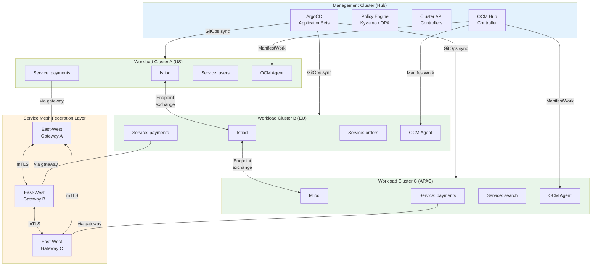
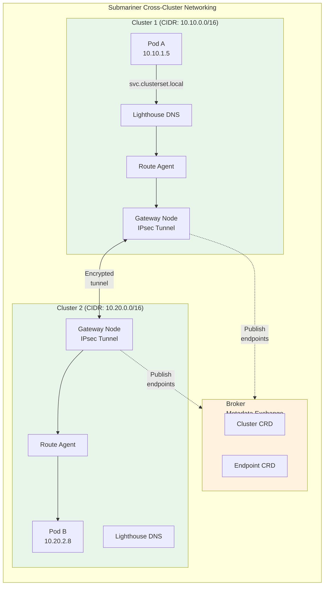

# Multi-Cluster Architecture

## 1. Overview

Multi-cluster architecture is the practice of running multiple Kubernetes clusters and managing them as a coordinated fleet. It is not a complexity you adopt for fun -- it is a response to concrete requirements that a single cluster cannot satisfy: blast radius isolation, regulatory compliance, geographic latency, organizational autonomy, or exceeding single-cluster scaling limits (~5,000 nodes, ~150,000 pods).

The multi-cluster ecosystem has matured significantly. Tooling spans five categories: cluster lifecycle management (Cluster API, Crossplane), workload distribution (Admiralty, Liqo, KubeFed/KubeAdmiral), network connectivity (Submariner, Skupper, Cilium ClusterMesh), service mesh federation (Istio multi-cluster, Linkerd multicluster), and fleet management platforms (Open Cluster Management, Rancher, Google Anthos). Each tool solves a different slice of the multi-cluster problem. Understanding what each does -- and does not do -- prevents you from assembling an incoherent stack.

The central engineering challenge of multi-cluster is maintaining the "single pane of glass" abstraction while preserving the isolation benefits that motivated going multi-cluster in the first place. Push too hard on unification and you recreate the problems of a single cluster. Push too hard on isolation and you drown in operational overhead.

## 2. Why It Matters

- **Blast radius containment.** A misconfigured admission webhook, an etcd corruption event, or a botched CRD upgrade in one cluster does not propagate to others. In a single cluster, these failures affect every workload.
- **Regulatory and data sovereignty.** GDPR, CCPA, data residency laws, and sector-specific regulations may require workloads to run in specific jurisdictions. Multi-cluster is often the only way to satisfy these requirements while maintaining a unified platform.
- **Independent upgrade cycles.** Different teams may need different Kubernetes versions. A platform team running Istio requires stability; an ML team needs the latest Dynamic Resource Allocation features. Separate clusters let each team upgrade independently.
- **Scaling beyond single-cluster limits.** At 3,000-5,000 nodes, etcd watch event volume and API server latency degrade. Custom controllers with high CRD churn hit this ceiling earlier. Multi-cluster is the horizontal scaling strategy for the control plane itself.
- **Multi-cloud and hybrid deployments.** Running on multiple clouds (AWS + Azure, cloud + on-prem) inherently requires multiple clusters. Multi-cluster tooling provides the connective tissue.
- **Team autonomy with guardrails.** Separate clusters give teams full control over their namespace design, RBAC, and admission policies while a central platform team enforces fleet-wide security baselines from a management cluster.

## 3. Core Concepts

- **Fleet:** A collection of Kubernetes clusters managed as a logical unit. Fleet-wide operations include policy distribution, secret synchronization, observability aggregation, and coordinated upgrades.
- **Cluster API (CAPI):** A Kubernetes-native framework for creating and managing cluster lifecycle declaratively. You define clusters as CRDs, and CAPI controllers provision and configure them on any infrastructure provider (AWS, Azure, GCP, vSphere, bare metal).
- **ServiceExport / ServiceImport:** Kubernetes multi-cluster services API (KEP-1645). `ServiceExport` marks a service for cross-cluster visibility. `ServiceImport` makes the exported service available in consuming clusters under the `*.svc.clusterset.local` DNS domain.
- **Broker:** A central API endpoint (often a lightweight cluster or an API server) where clusters exchange metadata -- endpoints, service definitions, policies. Used by Submariner, OCM, and other multi-cluster systems.
- **Virtual Kubelet:** A Kubernetes kubelet implementation that connects the cluster API to external compute providers. In multi-cluster contexts, Admiralty and Liqo use virtual kubelets to make remote cluster capacity appear as local nodes.
- **ManifestWork (OCM):** A CRD in Open Cluster Management that represents a set of Kubernetes manifests to be applied on a managed cluster. The hub stores ManifestWorks; agents on spoke clusters pull and apply them.
- **Cluster Set:** A group of clusters that trust each other and share a common identity. Defined by the multi-cluster services SIG. Services exported within a cluster set are discoverable by all member clusters.
- **Gateway API (multi-cluster):** An evolution of Ingress that supports cross-cluster traffic routing. Gateway API's GatewayClass and HTTPRoute can target services across cluster boundaries when combined with multi-cluster implementations.

## 4. How It Works

### When to Go Multi-Cluster

Multi-cluster is warranted when you hit one or more of these triggers:

| Trigger | Signal | Threshold |
|---|---|---|
| **Scale** | API server P99 latency > 1 second, etcd compaction taking minutes | > 2,000-3,000 nodes or > 50,000 pods with high CRD churn |
| **Isolation** | Team A's bad deployment or resource hog affecting Team B | Repeated noisy-neighbor incidents despite ResourceQuotas |
| **Compliance** | Auditor requires data to stay in specific regions / networks | Hard regulatory requirement (GDPR, PCI-DSS, FedRAMP) |
| **Multi-cloud** | Business requirement for cloud portability or redundancy | Running production on 2+ cloud providers |
| **Upgrade velocity** | Teams blocked on cluster upgrades by shared dependencies | Teams needing different K8s versions or different addon versions |
| **Organizational** | > 10 teams sharing one cluster with conflicting requirements | RBAC complexity exceeding what a single platform team can manage |

**If none of these triggers apply, stay on a single cluster.** The operational overhead of multi-cluster (networking, observability, secret sync, upgrade coordination) is substantial. A well-managed single cluster with namespace isolation, RBAC, NetworkPolicies, and ResourceQuotas satisfies most organizations under 100 services.

### Multi-Cluster Control Plane Patterns

**1. Push-Based (ArgoCD, Flux)**
The management cluster pushes manifests directly to workload clusters. ArgoCD holds kubeconfig credentials for each target cluster. A single ArgoCD instance can manage 50-100 clusters.

Pros: Simple mental model, mature tooling, GitOps-native.
Cons: Hub holds credentials to all clusters (security risk). Hub failure blocks all deployments. Scale limited by ArgoCD's in-memory cluster state.

**2. Pull-Based (Open Cluster Management, Rancher)**
Agents on each workload cluster pull their desired state from the management cluster. The spoke initiates the connection. The hub never needs network access to spoke API servers.

Pros: More secure (spoke-initiated connections). Spokes continue operating if hub is unreachable. Works across network boundaries (spoke behind NAT/firewall).
Cons: Eventual consistency (pull interval introduces delay). Debugging pull failures requires access to spoke agent logs.

**3. Virtual Kubelet-Based (Admiralty, Liqo)**
Remote clusters appear as virtual nodes in the local cluster. Pods scheduled to the virtual node are transparently rescheduled on the remote cluster. The developer experience is single-cluster -- `kubectl get pods` shows pods across clusters.

Pros: Seamless developer experience. No multi-cluster awareness needed in application manifests.
Cons: Abstraction leaks under failure (pod on remote cluster unreachable). Networking between virtual-node pods and local pods requires tunnel or mesh. Debugging requires understanding the abstraction.

### Workload Distribution Tools

**Admiralty**
Admiralty provides multi-cluster scheduling at the pod level. It intercepts pod creation in the source cluster, creates a "proxy pod" locally, and delegates the actual pod to a target cluster. Source and target clusters are linked via Admiralty CRDs (`Source`, `Target`, `ClusterSummary`). Scheduling decisions consider resource availability across all connected clusters.

Use when: You want to burst workloads to a remote cluster transparently (e.g., local cluster is full, overflow to cloud). Best for CI/CD burst, batch overflow, and hybrid cloud scenarios.

**Liqo**
Liqo extends the virtual kubelet approach with an integrated network fabric. When two clusters "peer" via Liqo, each sees the other as a virtual node. Liqo handles pod scheduling, cross-cluster networking (via VPN tunnels), and resource negotiation. A single `liqoctl peer` command establishes bidirectional peering.

Use when: You want to share resources between clusters bidirectionally. Strong in edge-to-cloud and academic/research environments where clusters have bursty, complementary workloads.

**KubeFed / KubeAdmiral**
KubeFed (Kubernetes Federation v2) distributes Kubernetes resources across clusters via federated CRDs. You create a `FederatedDeployment` in the federation control plane, and KubeFed creates the corresponding `Deployment` in each member cluster according to placement policies (cluster selectors, weights, overrides).

KubeAdmiral is the next-generation successor developed by ByteDance. It improves on KubeFed with better scheduling (resource-aware placement), support for arbitrary resource types (not just built-in kinds), and improved performance at scale.

Use when: You need to run the same workload across multiple clusters with per-cluster overrides (different replica counts, different image tags per region). Good for active-active multi-region deployments.

**Clusternet**
Clusternet provides multi-cluster management with a focus on application distribution. It supports "pull" and "push" modes for manifest delivery. Its architecture includes a `clusternet-hub` that manages cluster registration and a `clusternet-scheduler` that places workloads based on cluster capacity and labels.

Use when: You need a lightweight federation system with flexible scheduling policies and do not want the complexity of a full service mesh.

### Cross-Cluster Networking

**Submariner**
Submariner creates encrypted IPsec tunnels between clusters, flattening the network so pods in Cluster A can reach pods and services in Cluster B using their ClusterIP addresses. Key components:

- **Broker:** A central metadata exchange point. Clusters publish their `Cluster` and `Endpoint` CRDs to the broker. The broker does not route traffic; it only facilitates discovery.
- **Gateway:** Runs on designated gateway nodes in each cluster. Establishes IPsec (or WireGuard) tunnels to gateways in other clusters.
- **Route Agent:** Configures network routes on every node so that pod traffic destined for remote clusters is directed to the local gateway.
- **Lighthouse:** Provides cross-cluster DNS-based service discovery. Services exported via `ServiceExport` are resolvable as `<service>.<namespace>.svc.clusterset.local` in all connected clusters. Lighthouse prefers the local cluster's instance before round-robin across remote clusters.

Network requirements: Non-overlapping Pod CIDR and Service CIDR across clusters. This is a hard requirement and must be planned at cluster provisioning time.

**Cilium ClusterMesh**
Cilium's multi-cluster feature connects clusters at the eBPF layer without requiring tunnels. Clusters share a common Cilium identity and can enforce network policies across cluster boundaries. Service discovery is handled via shared etcd or KVStoreMesh.

Use when: All clusters use Cilium as the CNI. Provides the lowest-latency cross-cluster networking and unified network policy enforcement.

**Skupper**
Skupper creates a Virtual Application Network (VAN) using AMQP links between clusters. It is a Layer 7 multi-cluster connectivity solution that does not require VPN tunnels, special network configuration, or cluster admin privileges. A developer can install Skupper in their namespace.

Use when: You need cross-cluster service connectivity without modifying cluster-level networking. Good for connecting services across organizational boundaries or in environments where you do not control the cluster network.

### Service Mesh Federation

Service mesh federation connects separate mesh instances across clusters, enabling unified traffic management, mTLS, and observability.

**Istio Multi-Cluster**
Istio supports multiple multi-cluster topologies:
- **Shared control plane:** One Istiod manages multiple clusters. Simpler but creates a single point of failure.
- **Multi-primary:** Each cluster runs its own Istiod. Control planes exchange endpoint information to enable cross-cluster routing. More resilient but requires more resources.
- **Primary-remote:** One cluster runs Istiod, remote clusters connect to it. The remote clusters' data planes proxy to the primary's control plane.

Cross-cluster traffic uses east-west gateways (Envoy proxies at cluster boundaries) that proxy mTLS traffic between clusters. The mesh handles retry, timeout, circuit breaking, and traffic splitting across cluster boundaries.

**Linkerd Multicluster**
Linkerd uses a "service mirror" approach. A service mirror controller in each cluster watches for `ServiceExport` annotations on services in remote clusters and creates local "mirror services" that proxy to the remote cluster via a gateway. Traffic to the mirror service is transparently forwarded cross-cluster.

Linkerd's approach is simpler than Istio's -- it does not require shared control planes or complex identity federation. Each cluster maintains its own Linkerd installation.

### Traffic Management Across Clusters

**Global traffic splitting:** Route 80% of traffic to Cluster A (primary), 20% to Cluster B (canary region). Achieved via DNS weights, global load balancer rules, or service mesh traffic policies.

```yaml
# Istio VirtualService for cross-cluster traffic splitting
apiVersion: networking.istio.io/v1beta1
kind: VirtualService
metadata:
  name: payments-global
spec:
  hosts:
  - payments.payments-ns.svc.clusterset.local
  http:
  - route:
    - destination:
        host: payments.payments-ns.svc.cluster.local  # Local cluster
      weight: 80
    - destination:
        host: payments.payments-ns.svc.clusterset.local  # Remote cluster(s)
      weight: 20
```

**Cross-cluster failover:** If Cluster A's service is unhealthy, traffic automatically shifts to Cluster B. Istio `DestinationRule` with outlier detection, or Submariner Lighthouse's preference for local-then-remote routing.

**Locality-aware routing:** Prefer the local cluster's instance of a service. Only route cross-cluster if the local instance is unavailable or overloaded. Istio's locality load balancing and Linkerd's service mirror both support this pattern.

**Cross-cluster latency expectations:**

| Scenario | Expected Latency | Protocol |
|---|---|---|
| Same cluster, same zone | 0.5-1ms | Direct pod-to-pod |
| Same cluster, cross-zone | 1-3ms | Direct pod-to-pod |
| Cross-cluster, same region (Submariner) | 3-10ms | IPsec/WireGuard tunnel |
| Cross-cluster, same region (Cilium ClusterMesh) | 2-5ms | eBPF direct routing |
| Cross-cluster, cross-region | 20-150ms | Dependent on geographic distance |
| Cross-cluster, cross-cloud (mesh gateway) | 10-50ms + geographic distance | mTLS via east-west gateway |

**Design implication:** Any service that makes synchronous cross-cluster calls must budget for the additional latency. A service making 5 sequential cross-cluster calls adds 15-50ms to its response time. Use async patterns (event-driven, message queues) for cross-cluster communication where possible. Reserve synchronous cross-cluster calls for critical-path operations where data freshness justifies the latency cost.

### Multi-Cluster Observability

Observability across clusters requires centralized aggregation without creating a dependency on the central system for runtime operations.

**Metrics:** Each cluster runs its own Prometheus instance. Metrics are federated to a central Thanos or Grafana Mimir deployment. The central system provides fleet-wide dashboards and alerts. If the central system is down, each cluster's local Prometheus continues functioning for local debugging.

**Logs:** Each cluster runs log collectors (Fluentbit, Vector) that ship logs to a central system (Elasticsearch, Loki, Datadog). Cross-cluster log correlation requires a shared request ID or trace ID propagated through all service calls.

**Traces:** Distributed tracing (Jaeger, Tempo, Zipkin) must span cluster boundaries. The trace context (W3C trace-context header) must be propagated through service mesh gateways and cross-cluster proxies. Without this, a trace that crosses a cluster boundary appears as two disconnected traces.

**Fleet-wide alerting patterns:**
- Cluster-level alerts (etcd health, API server latency, node NotReady) fire to the platform team
- Application-level alerts fire to the owning team
- Cross-cluster alerts (replication lag, service mesh errors, certificate expiry) fire to the platform team
- Cost alerts (unexpected spend, GPU idle time) fire to both platform and owning teams

## 5. Architecture / Flow





## 6. Types / Variants

### Multi-Cluster Tool Comparison

| Tool | Approach | Primary Use Case | Complexity | Maturity |
|---|---|---|---|---|
| **Open Cluster Management** | Pull-based hub-spoke | Fleet management, policy distribution | Medium | CNCF Sandbox, production-ready |
| **Admiralty** | Virtual kubelet | Burst scheduling, workload overflow | Medium | Production at select enterprises |
| **Liqo** | Virtual kubelet + network fabric | Resource sharing, edge-to-cloud | Medium | CNCF Sandbox, active development |
| **KubeAdmiral** | Federated CRDs | Active-active multi-region | Medium-High | ByteDance production, open-source |
| **Clusternet** | Push/pull manifest delivery | Application distribution across clusters | Medium | CNCF Sandbox |
| **Submariner** | IPsec/WireGuard tunnels | Cross-cluster pod networking | Medium | CNCF Sandbox, production-ready |
| **Cilium ClusterMesh** | eBPF shared identity | Low-latency cross-cluster networking | Low-Medium | Production-ready (Cilium users) |
| **Skupper** | Layer 7 VAN (AMQP) | Cross-cluster service connectivity | Low | Red Hat-backed, production-ready |
| **Istio Multi-Cluster** | Envoy + shared mesh | Unified traffic management across clusters | High | Production-ready, complex operations |
| **Linkerd Multicluster** | Service mirror | Simple cross-cluster service access | Medium | Production-ready, simpler than Istio |

### Selecting the Right Combination

Most multi-cluster deployments use a layered approach:

| Layer | Responsibility | Recommended Tools |
|---|---|---|
| **Cluster lifecycle** | Create, upgrade, destroy clusters | Cluster API + cloud-specific providers |
| **Configuration distribution** | Push policies, manifests, secrets | ArgoCD ApplicationSets or Flux + OCM |
| **Network connectivity** | Pod-to-pod cross-cluster | Submariner (general) or Cilium ClusterMesh (Cilium users) |
| **Service discovery** | DNS-based cross-cluster | Submariner Lighthouse or CoreDNS with multi-cluster plugin |
| **Traffic management** | Routing, splitting, failover | Istio or Linkerd multicluster |
| **Observability** | Metrics, logs, traces across fleet | Thanos / Grafana Mimir + centralized logging |

**Avoid over-stacking.** You do not need Submariner AND Istio multi-cluster AND Cilium ClusterMesh. Pick one networking layer and one traffic management layer. Each additional tool adds operational surface area.

### Recommended Stacks by Use Case

**Minimal multi-cluster (2-5 clusters, same cloud):**
- ArgoCD ApplicationSets for configuration distribution
- Cilium ClusterMesh for networking (if using Cilium) or no cross-cluster networking if not needed
- Shared Prometheus with Thanos for metrics
- Total added components: 2-3

**Enterprise fleet management (10-50 clusters, single or multi-cloud):**
- Open Cluster Management for fleet governance
- ArgoCD + ApplicationSets for GitOps
- Submariner for cross-cluster networking
- Linkerd multicluster for service mesh (if needed)
- Thanos or Grafana Mimir for metrics federation
- External Secrets Operator for secret synchronization
- Total added components: 5-7

**Global multi-region with mesh (5-15 clusters, multi-region):**
- Cluster API for lifecycle management
- ArgoCD with region-specific ApplicationSets
- Istio multi-primary for full traffic management
- Submariner or Cilium ClusterMesh for pod networking
- Global DNS + Global load balancer for user routing
- Thanos with regional Prometheus instances
- Total added components: 7-10

### Multi-Cluster Security Considerations

**Identity federation:** Each cluster has its own service account identity. Cross-cluster calls require a shared identity framework. Options:
- SPIFFE/SPIRE for workload identity across clusters (cloud-agnostic)
- Istio mTLS for service-to-service identity within the mesh
- Cloud-specific identity (IRSA cross-account for AWS, Workload Identity for GCP)

**Network policies across clusters:** NetworkPolicies are cluster-scoped. They cannot restrict traffic from a remote cluster. Cross-cluster network security requires:
- Submariner GlobalNetworkPolicy for cross-cluster L3/L4 rules
- Cilium ClusterMesh with cross-cluster NetworkPolicy support
- Service mesh authorization policies (Istio AuthorizationPolicy)

**Certificate management:** Each cluster has its own CA for internal certificates. Cross-cluster mTLS requires either a shared root CA (Istio citadel with shared root) or mutual trust establishment. Plan certificate rotation procedures that work across cluster boundaries.

**CIDR planning:** Non-overlapping CIDRs across all clusters in the fleet. Maintain a CIDR registry. Example allocation scheme:

| Cluster | Pod CIDR | Service CIDR |
|---|---|---|
| cluster-us-prod | 10.10.0.0/16 | 10.110.0.0/20 |
| cluster-eu-prod | 10.20.0.0/16 | 10.120.0.0/20 |
| cluster-apac-prod | 10.30.0.0/16 | 10.130.0.0/20 |
| cluster-us-staging | 10.40.0.0/16 | 10.140.0.0/20 |
| cluster-ml-training | 10.50.0.0/16 | 10.150.0.0/20 |

## 7. Use Cases

- **Active-active multi-region SaaS:** A global SaaS platform runs the same services in US, EU, and APAC clusters. KubeAdmiral distributes `FederatedDeployments` with per-region replica counts (US: 10 replicas, EU: 6, APAC: 4). Istio multi-primary handles cross-region failover -- if the EU payments service degrades, Istio routes EU traffic to the US payments service via east-west gateways. Global DNS handles user-to-region assignment.
- **Hybrid cloud burst with Admiralty:** A retail company runs a primary on-prem cluster for POS processing. During Black Friday, Admiralty bursts batch workloads (inventory recalculation, recommendation model retraining) to an EKS cluster. The EKS cluster appears as a virtual node in the on-prem cluster. After the traffic spike, the EKS cluster scales to zero. Total burst duration: 72 hours. Cost: fraction of maintaining year-round cloud capacity.
- **Edge computing with Liqo:** A telecommunications company runs k3s clusters at 200 cell tower sites. Each edge cluster peers with a regional cloud cluster via Liqo. ML inference workloads run at the edge for low latency. Training workloads are offloaded to the cloud cluster. Liqo handles resource negotiation -- when an edge cluster is CPU-constrained, it automatically schedules overflow pods on the cloud peer.
- **Cross-cluster service discovery with Submariner:** A microservices platform runs separate clusters for the "payments" domain and the "orders" domain (organizational separation). The orders service needs to call the payments API. Submariner Lighthouse enables `payments.payments-ns.svc.clusterset.local` DNS resolution from the orders cluster. No application code changes needed -- just a DNS name change in the orders service config.
- **Regulated multi-cluster with OCM:** A bank runs 30+ clusters across 3 regions. OCM distributes security policies (PodSecurityStandards, NetworkPolicies, OPA constraints) from the hub. Each cluster's OCM agent pulls and applies policies. The compliance team audits policy compliance across all clusters from the hub. No manual per-cluster policy management.

## 8. Tradeoffs

| Decision | Option A | Option B | Guidance |
|---|---|---|---|
| **Single cluster vs. multi-cluster** | Single: Operationally simple, one upgrade path, unified RBAC | Multi: Isolation, independent scaling, bounded blast radius | Multi-cluster is a response to specific requirements, not a goal. If namespace isolation satisfies your needs, stay single-cluster. |
| **Push vs. pull distribution** | Push (ArgoCD): Immediate, easy to debug | Pull (OCM): Secure, spoke-initiated, works across NAT | Pull for clusters behind firewalls or in untrusted networks. Push for clusters within the same network perimeter. |
| **Submariner vs. Cilium ClusterMesh** | Submariner: CNI-agnostic, works everywhere | Cilium ClusterMesh: Lower latency, unified network policy, requires Cilium | Cilium ClusterMesh if you are already using Cilium everywhere. Submariner if your clusters use different CNIs. |
| **Istio vs. Linkerd for multi-cluster** | Istio: Feature-rich (traffic splitting, fault injection, multi-cluster routing) | Linkerd: Simpler, lower resource overhead, easier operations | Istio if you need advanced traffic management (canary, traffic splitting, fault injection). Linkerd if you want mTLS and basic cross-cluster routing with minimal operational burden. |
| **Federated vs. replicated workloads** | Federated: One definition, distributed to clusters with overrides | Replicated: Separate definitions per cluster, no federation layer | Federated for workloads that should be identical (or near-identical) across clusters. Replicated when per-cluster customization is extensive enough that federation overrides become more complex than separate manifests. |
| **Virtual kubelet vs. explicit multi-cluster** | Virtual kubelet (Admiralty, Liqo): Transparent, single-cluster UX | Explicit: Separate kubectl contexts, explicit cross-cluster references | Virtual kubelet for burst/overflow. Explicit for permanent multi-cluster with different configurations per cluster. Virtual kubelet abstractions can confuse debugging. |

## 9. Common Pitfalls

- **Going multi-cluster without a platform team.** Multi-cluster requires automation for cluster provisioning, configuration distribution, secret synchronization, certificate management, observability aggregation, and upgrade coordination. Without a dedicated platform team (minimum 3-5 engineers), multi-cluster operational overhead will consume all engineering bandwidth.
- **Overlapping CIDRs across clusters.** Submariner and most cross-cluster networking solutions require non-overlapping Pod CIDR and Service CIDR ranges. If all your clusters use the default `10.96.0.0/12` service CIDR, cross-cluster networking will not work. Plan CIDR allocation at cluster provisioning time. Maintain a CIDR registry.
- **Over-complicating the stack.** Running Submariner for networking, Istio for mesh, OCM for management, AND Admiralty for scheduling creates an operational nightmare. Each tool has its own failure modes, upgrade cadence, and debugging surface. Start with the minimum viable multi-cluster stack: ArgoCD + Submariner or ArgoCD + Cilium ClusterMesh covers 80% of use cases.
- **Hub cluster as SPOF for runtime operations.** If workload clusters depend on the hub for DNS resolution, secret retrieval, or admission decisions at runtime, a hub outage cascades to all clusters. The hub should only be needed for configuration changes (deployments, policy updates). Spoke clusters must operate independently for runtime workloads.
- **Ignoring cross-cluster latency in service design.** A service call within a cluster takes 1-2ms. A cross-cluster call via Submariner tunnel or mesh gateway takes 10-100ms+ depending on geographic distance. If your service design assumes all calls are sub-millisecond, multi-cluster will introduce latency spikes. Design services with cross-cluster call budgets.
- **Not testing cross-cluster failover.** Many teams set up multi-cluster for disaster recovery but never test failover. When the actual failure occurs, they discover that DNS TTLs are too long, data replication is lagging, or the failover procedure is not documented. Run quarterly failover drills.
- **Treating all clusters identically.** Production clusters need different security policies, monitoring alerting thresholds, and change management processes than development clusters. Use ArgoCD ApplicationSets with generators that customize configuration per cluster based on labels (environment, region, criticality).

## 10. Real-World Examples

- **ByteDance (TikTok):** Developed KubeAdmiral to manage federated deployments across clusters serving billions of users. KubeAdmiral distributes workloads with resource-aware scheduling and per-cluster overrides. It handles 10,000+ federated resources across hundreds of clusters.
- **Red Hat OpenShift (ACM):** Red Hat Advanced Cluster Management uses Open Cluster Management to manage OpenShift clusters across data centers and clouds. Submariner provides cross-cluster networking for hybrid cloud deployments. Customers like financial institutions run 50-100 clusters with centralized policy enforcement.
- **CERN:** Uses Kubernetes multi-cluster across data centers for physics experiment workloads (ATLAS, CMS). Each experiment runs in its own cluster for isolation. Cross-cluster data transfer is handled at the storage layer (object storage replication) rather than pod-to-pod networking.
- **Alibaba Cloud ACK One:** Manages 100,000+ customer clusters using a hierarchical multi-cluster control plane built on OCM. Fleet-wide operations (security patches, policy updates) propagate through regional hubs to cluster agents. The hub-spoke-agent model handles clusters behind customer firewalls.
- **Intuit:** Runs a multi-cluster setup with ArgoCD managing deployments across 20+ EKS clusters. Each cluster serves a different business unit (TurboTax, QuickBooks, Mint). ArgoCD ApplicationSets generate per-cluster configurations from a single Git repository. Cross-cluster service discovery uses AWS Cloud Map MCS Controller.

## 11. Related Concepts

- [Cluster Topology](./01-cluster-topology.md) -- topology patterns (hub-spoke, mesh, regional) that multi-cluster tools implement
- [Node Pool Strategy](./02-node-pool-strategy.md) -- per-cluster node pool design within a multi-cluster fleet
- [Cloud vs Bare Metal](./04-cloud-vs-bare-metal.md) -- multi-cluster often spans cloud and bare-metal environments
- [Availability and Reliability](../../traditional-system-design/01-fundamentals/04-availability-reliability.md) -- multi-cluster as a high availability strategy
- [Load Balancing](../../traditional-system-design/02-scalability/01-load-balancing.md) -- global load balancing distributes traffic across clusters

## 12. Source Traceability

- Web research: CNCF blog -- simplifying multi-clusters in Kubernetes, categorization of network-centric vs virtual-kubelet approaches
- Web research: Admiralty.io -- multi-cluster scheduling at the pod level, proxy pod pattern, source/target CRDs
- Web research: Submariner.io architecture docs -- broker, gateway, route agent, Lighthouse service discovery components
- Web research: Submariner Lighthouse -- ServiceExport/ServiceImport model, clusterset.local DNS, local-first routing
- Web research: Open Cluster Management architecture -- hub-spoke with pull-based agents, ManifestWork CRDs
- Web research: KubeAdmiral CNCF blog -- next-generation federation engine, resource-aware scheduling, ByteDance production usage
- Web research: Tigera (Calico) -- Kubernetes Federation guide, KubeFed architecture and CRD patterns
- Web research: Solo.io -- multicluster networking reference architecture with Gloo Mesh
- Web research: IDACORE -- Kubernetes multi-cluster management enterprise best practices
- Web research: Introl blog -- Kubernetes for GPU orchestration in multi-thousand cluster environments
