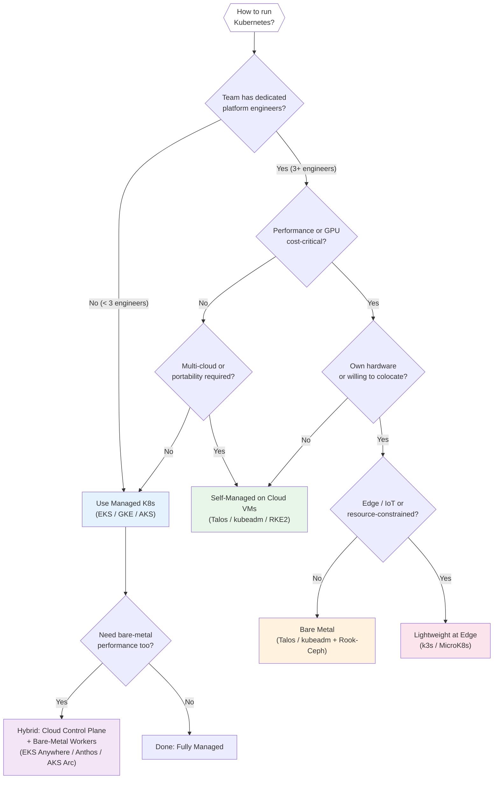
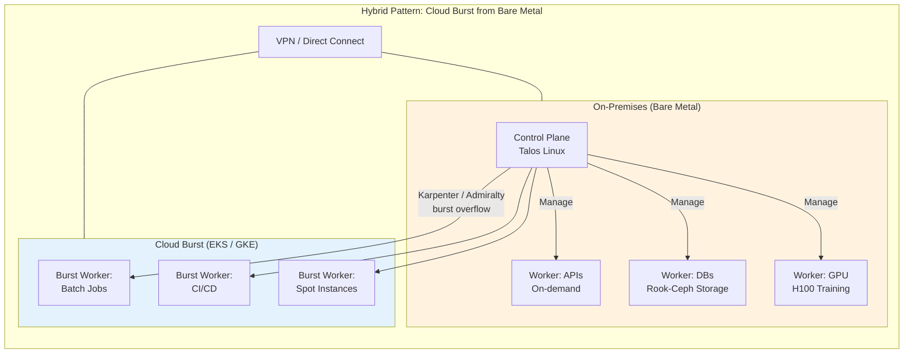

# Cloud vs Bare-Metal Kubernetes

## 1. Overview

The choice between managed cloud Kubernetes, self-managed Kubernetes on cloud VMs, and bare-metal Kubernetes is one of the highest-leverage infrastructure decisions an organization makes. It determines your operational burden, cost structure, performance ceiling, security posture, and ability to customize the platform.

Managed services (EKS, GKE, AKS) abstract away the control plane: upgrades, etcd backups, certificate rotation, and HA are handled by the cloud provider. You pay a premium in per-cluster fees and reduced control, but you gain operational velocity. Self-managed distributions (kubeadm, Talos Linux, RKE2) on cloud VMs or bare metal give you full control over every component, but every failure is your responsibility. Lightweight distributions (k3s, MicroK8s) optimize for edge, IoT, and resource-constrained environments where a full Kubernetes stack is too heavy.

There is no universally correct answer. The right choice depends on your team size, operational maturity, workload characteristics, compliance requirements, and cost sensitivity. This document provides the framework to make that decision with concrete data points.

## 2. Why It Matters

- **Operational cost vs. control.** Managed Kubernetes offloads 60-80% of cluster operations (control plane HA, etcd management, version upgrades, certificate rotation). Self-managed requires 2-5 dedicated platform engineers for the same work. The decision is fundamentally about where you want your engineers spending their time.
- **Cost structure.** Managed services charge per-cluster fees ($73/month for EKS and GKE) plus cloud compute markups. Bare metal eliminates these recurring costs but requires upfront CapEx for hardware and ongoing hardware maintenance. At scale (500+ nodes), bare metal can be 40-65% cheaper than cloud over a 3-year period.
- **Performance ceiling.** Bare metal eliminates the hypervisor layer, providing 30-60% better performance in high-concurrency, latency-sensitive, and GPU workloads. Direct NIC access (SR-IOV, DPDK) achieves sub-millisecond jitter vs. 0.5-1.5ms with virtual NICs.
- **GPU workload economics.** For sustained GPU workloads (ML training, inference at scale), bare-metal GPU servers cost 60-65% less than equivalent cloud GPU instances over 3 years. A single H100 node on bare metal costs approximately $14,500/month vs. $42,000/month on cloud.
- **Compliance and data sovereignty.** Some regulations require physical control over hardware, network isolation from other tenants, or data to remain in specific facilities. Bare metal satisfies these requirements definitively. Cloud dedicated hosts provide partial isolation at premium cost.
- **Portability.** Self-managed Kubernetes (kubeadm, Talos) produces identical clusters regardless of where they run -- cloud VM, bare metal, or edge device. Managed services are inherently cloud-specific, with proprietary integrations (IAM, load balancers, storage classes) that create vendor lock-in.

## 3. Core Concepts

- **Managed Kubernetes:** The cloud provider operates the control plane (API server, etcd, scheduler, controller manager). You manage worker nodes and workloads. Examples: EKS, GKE, AKS, OKE, DOKS.
- **Self-Managed Kubernetes:** You operate everything: control plane, worker nodes, networking, storage, upgrades. The trade-off is full control at the cost of full responsibility.
- **Control Plane Fee:** The per-cluster hourly charge for managed services. EKS: $0.10/hr (~$73/mo). GKE Standard: $0.10/hr (~$73/mo). AKS: free for standard tier (SLA-backed tier costs $0.10/hr).
- **kubeadm:** The official upstream Kubernetes bootstrapping tool. Produces a vanilla Kubernetes cluster with no opinions about CNI, CSI, or ingress. Maximum flexibility, maximum manual effort.
- **Talos Linux:** A minimal, immutable, API-managed operating system designed exclusively to run Kubernetes. No SSH, no shell, no package manager. The entire OS is managed declaratively via the Talos API. Boots in seconds. Attack surface is minimal.
- **k3s:** A lightweight Kubernetes distribution from Rancher (SUSE) that packages the entire control plane into a single binary (~70 MB). Replaces etcd with SQLite (or external database), bundles Flannel CNI and Traefik ingress. Optimized for edge, IoT, and resource-constrained environments.
- **RKE2:** Rancher Kubernetes Engine 2, focused on security and compliance. FIPS-140-2 compliant by default. Combines k3s simplicity with hardened defaults for government and enterprise workloads.
- **Hypervisor Tax:** The performance overhead of running VMs on a hypervisor. Typically 5-15% CPU overhead, 0.5-1.5ms additional network latency, and variable storage IOPS depending on the virtualization layer.
- **CapEx vs. OpEx:** Capital expenditure (buying hardware) vs. operational expenditure (renting cloud resources). Bare metal is CapEx-heavy; cloud is OpEx-heavy. Financial and tax implications differ significantly between the two models.

## 4. How It Works

### Managed Kubernetes: EKS vs. GKE vs. AKS

| Feature | EKS (AWS) | GKE (Google Cloud) | AKS (Azure) |
|---|---|---|---|
| **Control plane cost** | $0.10/hr (~$73/mo) | $0.10/hr (~$73/mo) Standard | Free (Standard), $0.10/hr (Uptime SLA tier) |
| **Control plane SLA** | 99.95% (multi-AZ) | 99.95% (regional) | 99.95% (with Uptime SLA) |
| **K8s version adoption** | 4-8 weeks after upstream | 2 weeks after upstream (fastest) | 3-6 weeks after upstream |
| **Autopilot / Serverless** | Fargate profiles (per-pod serverless) | GKE Autopilot (fully managed nodes) | AKS Automatic (managed node management) |
| **Default CNI** | Amazon VPC CNI (pod IPs from VPC) | GKE Dataplane v2 (Cilium-based) | Azure CNI (VNET-integrated) |
| **GPU support** | p4d/p5 (A100/H100), g5 (A10G), inf2 (Inferentia) | A2/A3 (A100/H100), G2 (L4) | NC/ND series (A100/H100, T4) |
| **Spot/Preemptible** | Spot Instances (2-min warning) | Spot VMs (30-sec warning) | Spot VMs (30-sec warning) |
| **Max nodes per cluster** | 5,000 (tested) | 15,000 (GKE, with planning) | 5,000 (tested) |
| **Node autoscaling** | Cluster Autoscaler or Karpenter | Cluster Autoscaler or GKE NAP | Cluster Autoscaler or Karpenter |
| **Identity integration** | IAM Roles for Service Accounts (IRSA), Pod Identity | Workload Identity Federation | Azure AD Workload Identity |
| **Storage** | EBS CSI, EFS CSI, FSx | Persistent Disk CSI, Filestore | Azure Disk CSI, Azure Files |
| **Egress cost** | $0.09/GB | $0.08/GB | $0.087/GB |
| **Persistent storage cost** | $0.10/GB/mo (gp3) | $0.04/GB/mo (pd-standard) | $0.05/GB/mo (Standard SSD) |

**EKS strengths:** Deepest AWS ecosystem integration (ALB Ingress Controller, IAM IRSA, CloudWatch Container Insights). Karpenter was built for EKS and is most mature here. Largest selection of instance types. Best for organizations deeply invested in AWS.

**GKE strengths:** Fastest Kubernetes version adoption. GKE Autopilot eliminates node management entirely. Dataplane v2 (Cilium) provides eBPF-powered networking out of the box. Best observability integration (Cloud Monitoring, Cloud Logging, Cloud Trace). Best for teams that want the most managed experience.

**AKS strengths:** Free control plane (Standard tier) makes it cheapest for many-cluster deployments. Deepest Azure AD integration. Azure Arc extends AKS management to on-prem and edge clusters. Best for Microsoft-centric organizations and hybrid cloud deployments.

### Self-Managed Distributions

| Distribution | Binary Size | Bootstrap Time | etcd | OS Requirement | Best For |
|---|---|---|---|---|---|
| **kubeadm** | ~200 MB (all components) | 5-10 minutes | External etcd (you manage) | Any Linux | Full control, learning, custom setups |
| **Talos Linux** | ~80 MB (full OS + K8s) | 30-90 seconds | Embedded etcd | Talos IS the OS | Production bare metal, security-focused, immutable infrastructure |
| **k3s** | ~70 MB (single binary) | 30-60 seconds | SQLite (default) or external | Any Linux, ARM supported | Edge, IoT, resource-constrained, home lab |
| **RKE2** | ~250 MB | 2-5 minutes | Embedded etcd | Any Linux | Government, compliance-heavy, FIPS requirements |
| **MicroK8s** | ~200 MB (snap) | 2-3 minutes | Dqlite (distributed SQLite) | Ubuntu (snap-based) | Developer workstations, CI environments |

**kubeadm in detail:**
kubeadm is the official upstream bootstrap tool. It performs the minimum viable work to get a conformant cluster running: generates certificates, starts the API server, configures etcd, joins worker nodes. Everything else (CNI, CSI, ingress, monitoring) is your responsibility.

When to use kubeadm: When you need full control over every component. When you want to learn Kubernetes internals. When you have specific requirements that opinionated distributions cannot satisfy. When compliance requires you to audit every component in the stack.

**Talos Linux in detail:**
Talos is not a Kubernetes distribution -- it is an operating system designed exclusively to run Kubernetes. There is no SSH, no shell, no package manager. The OS is managed entirely via a gRPC API (talosctl). Configuration is a single YAML file that describes the entire machine state.

Performance advantages: 7% less memory, 49% less disk I/O, and 47% less disk storage compared to kubeadm on a standard Linux OS. Boot time is 30-90 seconds. The immutable design means no configuration drift -- every node boots from the same image.

Security advantages: No shell access eliminates an entire class of attack vectors. No package manager means no supply chain attacks via OS packages. The OS is verified at boot via secure boot and dm-verity. The attack surface is a fraction of a general-purpose Linux distribution.

When to use Talos: Production bare-metal clusters. Security-sensitive environments. When you want immutable infrastructure guarantees. When you need fast node scaling (30-second boot times). When running across heterogeneous environments (cloud + bare metal + edge) with identical cluster behavior.

**k3s in detail:**
k3s packages the entire Kubernetes control plane and data plane into a single binary. It replaces etcd with SQLite for single-node setups (supports external PostgreSQL/MySQL/etcd for HA). It bundles Flannel CNI, CoreDNS, Traefik ingress, and metrics-server.

Resource footprint: A k3s server node runs comfortably on 1 vCPU and 512 MB RAM. A k3s agent (worker) needs as little as 256 MB RAM. This makes it viable on Raspberry Pi, edge gateways, and IoT devices.

When to use k3s: Edge computing (cell towers, retail stores, factory floors). IoT device clusters. Development and testing environments. Home labs. Any environment where resources are constrained or deployment must be simple.

### Bare-Metal Kubernetes

Running Kubernetes on bare metal means you own or lease physical servers and run Kubernetes directly on the hardware without a cloud provider's hypervisor layer.

**Performance benefits:**
- 30-60% better throughput in high-concurrency workloads (no hypervisor overhead)
- Sub-millisecond network jitter with direct NIC access vs. 0.5-1.5ms with virtual NICs
- Full NUMA topology awareness for latency-sensitive applications
- Direct GPU access without virtualization overhead (critical for ML training)
- 100% of hardware resources available to workloads (no hypervisor tax)

**Cost benefits (3-year TCO):**
For a 50-node cluster with 32 vCPU / 128 GB RAM per node:
- Cloud (on-demand): approximately $180,000-$250,000/year
- Cloud (reserved/committed): approximately $110,000-$160,000/year
- Bare metal (colocated): approximately $70,000-$100,000/year (after amortized CapEx)

For GPU workloads, the differential is even larger:
- Cloud GPU (10x H100 nodes): approximately $500,000+/year
- Bare metal GPU (10x H100 nodes, colocated): approximately $175,000-$200,000/year

**Operational costs:**
- Hardware procurement and lifecycle management
- Physical maintenance (disk replacements, NIC failures, power supply swaps)
- Firmware and BIOS updates
- Network infrastructure (switches, routers, cabling)
- Colocation or data center costs (power, cooling, rack space)
- 24/7 remote hands or on-site staff for physical issues

**Bare-metal networking:**
Without a cloud provider's virtual network, you manage L2/L3 networking directly. Options:
- MetalLB for LoadBalancer service type (announces VIPs via BGP or L2 ARP)
- Calico or Cilium for CNI with BGP peering to physical routers
- SR-IOV for direct NIC passthrough to pods (ultra-low latency)
- kube-vip for control plane VIP without external load balancer

**Bare-metal storage:**
Without cloud-managed storage (EBS, Persistent Disk), you manage storage yourself:
- Rook-Ceph for distributed block/file/object storage (most common for bare metal)
- OpenEBS for container-attached storage
- Longhorn for lightweight distributed storage
- Local PVs for maximum performance (no replication, node-local)

### Hybrid Patterns

Hybrid Kubernetes combines bare-metal and cloud resources in a single logical platform. Common patterns:

**Pattern 1: Bare-metal base + cloud burst**
Steady-state workloads run on bare metal (owned hardware, predictable cost). Burst workloads (traffic spikes, batch processing, training jobs) overflow to cloud clusters. Tools like Admiralty, Liqo, or Karpenter (with cloud node pools) enable transparent bursting.

**Pattern 2: Cloud control plane + bare-metal workers**
Use EKS Anywhere, GKE On-Prem (Anthos), or AKS Arc to run a managed control plane that manages bare-metal worker nodes. You get cloud-managed operations for the control plane with bare-metal performance for workloads.

**Pattern 3: Cloud for stateless + bare metal for stateful/GPU**
Run stateless microservices on cloud Kubernetes (auto-scaling, managed networking). Run databases, caches, and GPU workloads on bare-metal clusters (performance, cost). Service mesh or API gateway connects the two environments.

**Pattern 4: Development in cloud + production on bare metal**
Developers use managed Kubernetes (GKE Autopilot, EKS Fargate) for development and testing (fast provisioning, no infrastructure management). Production runs on bare metal (cost, performance, compliance). GitOps (ArgoCD, Flux) ensures identical configurations across both environments.

### GPU Infrastructure: Cloud vs. Bare Metal Cost Analysis

GPU workloads represent the largest cost differential between cloud and bare metal. For organizations running sustained ML training or inference, this is often the single most important factor in the decision.

**Cost comparison for 10 GPU nodes (8x H100 per node):**

| Cost Component | Cloud (AWS p5.48xlarge) | Bare Metal (Colo) |
|---|---|---|
| **Monthly compute** | ~$42,000/node = $420,000/mo | ~$14,500/node = $145,000/mo |
| **Annual compute** | ~$5,040,000 | ~$1,740,000 |
| **3-year compute** | ~$15,120,000 | ~$5,220,000 |
| **Hardware purchase** | $0 (included) | ~$3,500,000 (one-time, amortized over 3 years) |
| **Colo + power** | $0 (included) | ~$300,000/year |
| **3-year total** | ~$15,120,000 | ~$7,320,000 |
| **Savings** | Baseline | ~52% ($7.8M savings) |

These numbers assume sustained 24/7 usage. If GPU utilization is below 40%, cloud with pay-as-you-go pricing may be cheaper because you only pay for actual usage. The crossover point is approximately 50-60% sustained utilization -- above this, bare metal wins decisively.

**Hybrid GPU strategy for GenAI:** Many organizations adopt a tiered approach:
- **Base training capacity on bare metal:** Long-running training jobs (days to weeks) with predictable GPU demand
- **Burst training on cloud spot/preemptible:** Short experiments, hyperparameter sweeps, on-demand capacity during peaks
- **Inference on cloud (managed):** Inference traffic is bursty and benefits from cloud autoscaling. GPU inference nodes (A10G, L4) are cheaper and more available than training nodes (H100)
- **Model artifacts in cloud object storage:** Trained models stored in S3/GCS for fast deployment to any inference cluster

### Networking Differences

The networking stack differs fundamentally between cloud and bare metal:

**Cloud networking (managed):**
- VPC provides isolated network per cluster
- Cloud load balancers (ALB, NLB, GLB) for ingress
- Cloud NAT for egress
- VPC peering or Transit Gateway for cross-cluster connectivity
- Built-in DNS (Route 53, Cloud DNS)
- No BGP management needed

**Bare-metal networking (self-managed):**
- MetalLB or kube-vip for LoadBalancer service type (ARP/BGP mode)
- Calico or Cilium CNI with BGP peering to physical ToR switches
- SR-IOV and DPDK for ultra-low-latency networking
- Manual DNS infrastructure (CoreDNS external, BIND, or commercial DNS)
- Physical network topology: spine-leaf, ToR switches, LACP bonding
- VLAN segmentation for security boundaries

**Bare-metal networking decisions to make before cluster deployment:**

| Decision | Options | Recommendation |
|---|---|---|
| **CNI** | Calico (BGP), Cilium (eBPF), Flannel (VXLAN) | Cilium for performance + security; Calico for BGP simplicity |
| **LoadBalancer** | MetalLB (BGP/L2), kube-vip (ARP), PureLB | MetalLB in BGP mode for production; kube-vip for control plane VIP |
| **Ingress** | Nginx, Envoy, HAProxy, Traefik | Nginx or Envoy for production; Traefik for simpler setups |
| **Pod CIDR sizing** | /16 (65K pods), /14 (260K pods) | /16 per cluster; plan for non-overlap across clusters |
| **Service CIDR sizing** | /16 (65K services), /12 (1M services) | /20 (4K services) is sufficient for most clusters |

## 5. Architecture / Flow

## 6. Types / Variants

### Deployment Model Comparison

| Model | Control Plane | Worker Nodes | Operations | Cost Model | Best For |
|---|---|---|---|---|---|
| **Fully Managed** (GKE Autopilot, Fargate) | Provider-managed | Provider-managed | Minimal | Pay per pod/resource | Small teams, variable workloads |
| **Managed + Self-Managed Nodes** (EKS, GKE Standard, AKS) | Provider-managed | You manage (node pools) | Medium | Per-cluster + compute | Most production workloads |
| **Self-Managed on Cloud VMs** (kubeadm/Talos on EC2/GCE) | You manage | You manage | High | Compute only (no K8s fee) | Multi-cloud, custom requirements |
| **Bare Metal** (kubeadm/Talos on physical servers) | You manage | You manage | Very High | CapEx + colo/power | Performance, GPU, cost at scale |
| **Edge / Lightweight** (k3s, MicroK8s) | Lightweight | Lightweight | Medium | Minimal (small hardware) | IoT, edge, constrained environments |
| **Hybrid** (EKS Anywhere, Anthos, AKS Arc) | Provider-managed (remote) | Bare metal or on-prem VMs | Medium-High | License + compute | Regulated industries, hybrid cloud |

### Cost Breakdown (50-node cluster, 3-year TCO)

| Cost Component | Managed (GKE) | Self-Managed (Cloud VM) | Bare Metal (Colo) |
|---|---|---|---|
| **Control plane** | $2,600/yr | $0 (self-hosted) | $0 (self-hosted) |
| **Compute** | $180,000/yr (on-demand) | $150,000/yr (no markup) | $45,000/yr (amortized HW) |
| **Storage** | $12,000/yr (PD) | $10,000/yr (EBS) | $8,000/yr (Rook-Ceph on NVMe) |
| **Networking/egress** | $15,000/yr | $15,000/yr | $5,000/yr (colo bandwidth) |
| **Operations (people)** | 1 engineer (~partial) | 2-3 engineers | 3-5 engineers |
| **Colo/power/cooling** | $0 | $0 | $25,000/yr |
| **3-year total** | ~$630,000 | ~$525,000 | ~$350,000 |
| **Savings vs. managed** | Baseline | ~17% | ~44% |

These numbers are illustrative. Actual costs vary significantly based on instance types, committed use discounts (30-60% savings), spot usage, and regional pricing. The key insight: bare metal wins on cost at scale but requires significantly more operational expertise.

### Cloud Discount Programs

Understanding cloud discount programs is essential for fair cost comparisons:

| Program | Provider | Discount | Commitment | Flexibility |
|---|---|---|---|---|
| **Reserved Instances** | AWS | 30-60% | 1 or 3 year, specific instance type | Low (locked to type/region) |
| **Savings Plans** | AWS | 20-40% | 1 or 3 year, $/hour commitment | Medium (any instance in family) |
| **Committed Use** | GCP | 30-57% | 1 or 3 year, vCPU + memory commitment | Medium (any machine type) |
| **Spot / Preemptible** | All | 60-90% | None (can be reclaimed) | High (best for fault-tolerant) |
| **Reserved VM Instances** | Azure | 30-60% | 1 or 3 year | Low (locked to type/region) |
| **Azure Savings Plan** | Azure | 15-30% | 1 or 3 year, $/hour | Medium (flexible across types) |

**Practical guidance:** Combine committed use (for baseline capacity) with spot (for burst capacity) to achieve 40-60% effective discount off on-demand pricing. This closes much of the gap with bare metal for small-to-medium deployments.

### Storage Comparison

| Feature | Cloud (Managed) | Bare Metal (Self-Managed) |
|---|---|---|
| **Block storage** | EBS, Persistent Disk, Azure Disk | Rook-Ceph RBD, OpenEBS |
| **File storage** | EFS, Filestore, Azure Files | Rook-CephFS, NFS |
| **Object storage** | S3, GCS, Azure Blob | MinIO, Rook-Ceph RGW |
| **Provisioning** | Automatic via CSI | Self-managed, requires Ceph/OpenEBS admin |
| **Replication** | Built-in (3x default) | Configured (Ceph replication factor) |
| **Performance** | Varies by tier (gp3, io2, pd-ssd) | NVMe direct (highest possible IOPS) |
| **Cost (1 TB/month)** | $40-100 (varies by tier) | $5-15 (amortized NVMe cost) |
| **Operational overhead** | None (managed) | High (Ceph cluster management) |

## 7. Use Cases

- **AI/ML startup choosing GKE Autopilot:** A 15-person ML startup runs model training and inference on GKE Autopilot. They have no platform engineers. Autopilot manages node provisioning, GPU scheduling, and cluster upgrades. They pay more per GPU-hour than bare metal, but engineer time is spent on model development rather than infrastructure. When they reach 50+ GPUs of sustained demand, they plan to migrate training to bare-metal colocated H100 nodes while keeping inference on GKE.
- **Financial services on bare metal with Talos:** A trading firm runs latency-sensitive market data processing on bare-metal Kubernetes with Talos Linux. Talos's immutable OS eliminates configuration drift and provides a minimal attack surface for their security auditors. SR-IOV provides direct NIC access for sub-microsecond jitter. The 3-year cost is 55% less than equivalent cloud instances with dedicated tenancy.
- **Retail chain with hybrid k3s + EKS:** A retail company runs k3s clusters in 500 stores for point-of-sale and inventory management. Each store cluster runs on a small server (4 vCPU, 16 GB RAM). An EKS cluster in AWS aggregates store data, runs analytics, and hosts the centralized management plane. FluxCD synchronizes configurations from Git to all 500 store clusters. Store clusters continue operating during internet outages.
- **Government agency on RKE2:** A US federal agency requires FIPS 140-2 compliance and FedRAMP authorization. RKE2 provides FIPS-compliant Kubernetes out of the box with CIS benchmark hardened defaults. They run on dedicated bare-metal servers in a government-approved data center with no cloud dependency.
- **Multi-cloud SaaS with Talos on cloud VMs:** A SaaS company runs on both AWS and Azure for customer choice and disaster recovery. Talos Linux on EC2 and Azure VMs produces identical clusters on both clouds. No cloud-specific K8s features are used (no IRSA, no Workload Identity). Cilium provides CNI on both clouds. Crossplane provisions cloud resources (databases, object storage) declaratively. Switching between clouds requires only changing the Terraform provider.

## 8. Tradeoffs

| Decision | Option A | Option B | Guidance |
|---|---|---|---|
| **Managed vs. self-managed** | Managed: Less ops, faster time-to-value, cloud-integrated | Self-managed: Full control, portable, no per-cluster fees | Default to managed unless you have specific requirements (multi-cloud, compliance, bare-metal performance) that managed cannot satisfy. The ops savings of managed K8s are real. |
| **EKS vs. GKE vs. AKS** | EKS: AWS ecosystem, Karpenter, most instance types | GKE: Best managed experience, fastest upgrades, Autopilot | AKS: Free control plane, Azure AD, hybrid (Arc) | Choose the cloud you are already on. If greenfield: GKE for best K8s experience, EKS for broadest AWS integration, AKS for Microsoft shops. |
| **Cloud vs. bare metal** | Cloud: OpEx, elastic, managed services | Bare metal: CapEx, performance, cost at scale | Cloud for variable workloads and small-to-medium scale. Bare metal for steady-state workloads at scale, GPU-heavy ML, and latency-sensitive applications. Many organizations run both (hybrid). |
| **kubeadm vs. Talos vs. k3s** | kubeadm: Standard, flexible, educational | Talos: Secure, immutable, fast boot | k3s: Lightweight, simple, edge-optimized | Talos for production bare metal and security-focused deployments. k3s for edge and resource-constrained environments. kubeadm for learning and when you need maximum component-level control. |
| **CapEx vs. OpEx** | CapEx (buy hardware): Lower long-term cost, asset ownership | OpEx (rent cloud): Flexibility, no upfront investment, tax benefits | CapEx when workloads are predictable and sustained (> 60% utilization). OpEx when workloads are variable, when speed of provisioning matters, or when cash flow constraints favor monthly payments. |
| **Spot/preemptible vs. reserved/committed** | Spot: 60-90% savings, interruption risk | Reserved: 30-60% savings, guaranteed capacity | Spot for fault-tolerant workloads (batch, CI/CD). Reserved/committed for baseline capacity. Combine both: reserved for base, spot for burst. Never run critical stateful workloads on spot. |

## 9. Common Pitfalls

- **Choosing bare metal without operational maturity.** Bare metal requires expertise in hardware lifecycle management, network engineering (BGP, VLAN), storage administration (Ceph), firmware updates, and physical maintenance. If your team has never managed physical servers, the learning curve will consume 6-12 months before you are productive. Start with managed K8s and migrate to bare metal only when you have the team and processes in place.
- **Vendor lock-in through cloud-specific integrations.** Using IRSA (EKS), Workload Identity (GKE), and cloud-specific storage classes deeply couples your workloads to a single cloud. If multi-cloud portability is a future requirement, abstract these integrations behind platform APIs (External Secrets Operator instead of native secret managers, Crossplane for cloud resources).
- **Ignoring egress costs.** Cloud egress charges ($0.08-$0.09/GB) are invisible until the bill arrives. A cluster processing 100 TB/month in cross-region or internet-bound traffic pays $8,000-$9,000/month in egress alone. Bare metal with colocated bandwidth is dramatically cheaper for data-heavy workloads.
- **Underestimating managed K8s upgrade friction.** Managed services force upgrades when versions reach end-of-life (GKE auto-upgrades, EKS version deprecation). If your workloads are not compatible with the new version (deprecated API, broken addon), you face an urgent forced migration. Maintain CI pipelines that test against the next K8s version continuously.
- **Running k3s in production without understanding its limitations.** k3s uses SQLite by default, which does not support HA. For production k3s, you must configure an external database (PostgreSQL, MySQL) or embedded etcd (k3s HA mode with 3+ server nodes). Single-server k3s is a single point of failure.
- **Not planning bare-metal networking before deployment.** Without cloud VPCs and load balancers, you need MetalLB or kube-vip for service load balancing, Calico or Cilium with BGP for pod networking, and DNS infrastructure. Planning this after cluster creation leads to re-architecture.
- **Comparing cloud and bare-metal costs at list price.** Cloud costs with committed use discounts (1-3 year), spot instances, and right-sizing can be 50-70% below list price. Bare-metal costs must include power, cooling, colo fees, hardware refresh cycles (3-5 years), and spare parts inventory. Fair comparison requires total cost of ownership over 3 years with realistic utilization assumptions.

## 10. Real-World Examples

- **Cloudflare:** Runs bare-metal Kubernetes across 300+ data centers worldwide. The performance requirement (serving millions of requests per second per location with sub-millisecond latency) makes the hypervisor tax of cloud VMs unacceptable. They use a custom OS and lifecycle management tooling.
- **Shopify:** Migrated from cloud to bare-metal Kubernetes for their core commerce platform. At their scale, the cost savings of bare metal were substantial (millions per year). They use a combination of kubeadm and custom tooling for cluster lifecycle management, with Ceph for distributed storage.
- **Chick-fil-A:** Runs k3s clusters in every restaurant location on small compute nodes. Each restaurant cluster handles point-of-sale, kitchen display, and drive-through operations independently. A central cloud cluster aggregates data and pushes configurations. The restaurant clusters continue operating during internet outages.
- **CERN:** Runs Kubernetes on bare metal in their data centers for physics experiment data processing. The data volumes (petabytes) make cloud egress costs prohibitive. They use OpenStack Magnum for cluster provisioning and Ceph for storage across thousands of bare-metal nodes.
- **Apple (rumored):** Reportedly runs one of the largest bare-metal Kubernetes deployments for Siri and Apple Intelligence ML inference, choosing bare metal for cost optimization at their scale (tens of thousands of GPU nodes) and to maintain complete control over the hardware and software stack.
- **Deutsche Telekom:** Uses Talos Linux for production Kubernetes clusters across European data centers. The immutable OS satisfies their security requirements while the fast boot times enable rapid scaling of edge infrastructure at cell tower sites.

## 11. Related Concepts

- [Cluster Topology](./01-cluster-topology.md) -- topology decisions interact with cloud vs. bare-metal choices (regional clusters require multi-region presence)
- [Node Pool Strategy](./02-node-pool-strategy.md) -- node pool design differs between cloud (instance types, spot) and bare metal (hardware classes)
- [Multi-Cluster Architecture](./03-multi-cluster-architecture.md) -- hybrid patterns often involve multi-cluster across cloud and bare metal
- [Availability and Reliability](../../traditional-system-design/01-fundamentals/04-availability-reliability.md) -- HA design differs significantly between managed and self-managed K8s
- [Load Balancing](../../traditional-system-design/02-scalability/01-load-balancing.md) -- bare metal requires MetalLB/kube-vip; cloud provides managed load balancers

### Operational Maturity Assessment

Before choosing self-managed or bare-metal Kubernetes, assess your team's operational maturity:

| Capability | Required for Managed K8s | Required for Self-Managed | Required for Bare Metal |
|---|---|---|---|
| Kubernetes API knowledge | Yes | Yes | Yes |
| Helm / Kustomize | Yes | Yes | Yes |
| Container networking (CNI) | Basic | Deep | Expert |
| etcd administration | No (managed) | Yes | Yes |
| Certificate management | Basic (provider handles) | Full lifecycle | Full lifecycle |
| OS patching / hardening | No (managed nodes) | Yes | Yes |
| Hardware procurement | No | No | Yes |
| Physical networking (BGP, VLAN) | No | No | Yes |
| Storage administration (Ceph) | No | Optional | Likely |
| 24/7 on-call for infra | Optional | Yes | Yes |
| Capacity planning | Basic | Detailed | Detailed + hardware lead times |

**Scoring:** If your team covers fewer than 6 of these capabilities, start with managed Kubernetes. If you cover 6-8, self-managed on cloud VMs is viable. If you cover all 10+, bare metal is feasible.

### Migration Paths

Organizations frequently migrate between deployment models as they scale:

**Cloud managed -> Self-managed (cloud VMs):** Motivated by cost or control. Replace managed control plane with kubeadm/Talos on EC2/GCE. Worker nodes remain cloud VMs. Retain cloud IAM, storage, and networking. Migration complexity: Medium (4-8 weeks).

**Cloud managed -> Bare metal:** Motivated by cost at scale or performance. Requires hardware procurement (8-12 week lead time), data center / colo contract, and network infrastructure buildout. Migration complexity: High (3-6 months).

**Bare metal -> Cloud managed:** Motivated by reducing operational burden or enabling elasticity. Repackage workloads for cloud (replace MetalLB with ALB, Ceph with EBS). Migration complexity: Medium (4-8 weeks) if containers are already portable; High if workloads depend on bare-metal networking features.

**Single cloud -> Multi-cloud:** Motivated by resilience or regulatory requirements. Abstract cloud-specific integrations (use External Secrets instead of IRSA, Crossplane instead of cloud-native IaC). Migration complexity: High (3-6 months) depending on cloud coupling.

## 12. Source Traceability

- Web research: Atmosly EKS vs GKE vs AKS 2026 comparison -- pricing, features, version adoption speed
- Web research: Sedai Kubernetes pricing guide -- control plane costs, egress costs, persistent storage costs across providers
- Web research: Intercept Cloud true cost of managed Kubernetes -- AKS vs EKS vs GKE detailed cost analysis
- Web research: Glukhov.org Kubernetes distributions overview -- kubeadm, k3s, MicroK8s, Talos Linux, RKE2 comparison
- Web research: Siderolabs (Talos) smallest Kubernetes -- memory, CPU, disk I/O, storage comparison across distributions
- Web research: CloudRaft k3s vs Talos Linux -- feature comparison, security model, use case guidance
- Web research: WeHaveServers bare metal vs VPS -- 30-60% performance improvement, sub-millisecond jitter, cost analysis
- Web research: arXiv 2504.11007 Kubernetes cloud vs bare metal network costs -- comparative study
- Web research: ServerMania Kubernetes GPU bare metal -- architecture, deployment, cost comparison for GPU clusters
- Web research: i3d.net hybrid K8s deployment -- cloud flexibility with bare metal performance patterns
- Web research: Rommelporras why kubeadm in 2026 -- comparison with k3s, RKE2, Talos for self-managed deployments
