# Pod Design Patterns

## 1. Overview

A Pod is the atomic scheduling unit in Kubernetes -- it encapsulates one or more containers that share a network namespace, storage volumes, and lifecycle. While the simplest Pods run a single application container, production workloads routinely use multi-container Pod patterns to separate concerns, inject cross-cutting functionality, and compose complex behavior without modifying application code.

Pod design patterns are the Kubernetes equivalent of software design patterns: repeatable solutions to common infrastructure problems. The four foundational patterns -- init container, sidecar, ambassador, and adapter -- let you decompose operational concerns (logging, proxying, configuration, protocol translation) into independently deployable containers that co-locate with your application. Kubernetes 1.28+ introduced native sidecar containers (restartable init containers) that solve longstanding lifecycle ordering issues, making these patterns first-class citizens of the platform.

Understanding Pod patterns is essential because they determine how your application starts, communicates, consumes resources, and fails. A poorly designed Pod can waste 2-4x the resources it needs, block startup for minutes, or create cascading failures that take down an entire Deployment.

**Key numbers that frame Pod design decisions:**
- An Envoy sidecar typically consumes 100-500m CPU and 128-512 MiB memory per Pod. Across 1,000 Pods, that is 100-500 vCPUs and 128-512 GiB of memory dedicated to sidecars alone.
- Init container execution adds 5-60 seconds to Pod startup. A database migration init container may add 10-30 seconds; a model weight download init container may add 2-5 minutes.
- The default `terminationGracePeriodSeconds` is 30 seconds. For services with long-lived connections (WebSocket, gRPC streams), this is often insufficient -- connections are forcibly dropped after 30 seconds regardless of `preStop` hook completion.
- CPU throttling occurs in 100ms CFS periods. A container with 500m CPU limit gets 50ms per period. During a latency-sensitive request that needs 80ms of CPU, throttling adds 100ms of delay (must wait for the next period).

## 2. Why It Matters

- **Separation of concerns.** A sidecar proxy (Envoy, Istio) handles mTLS, retries, and observability without touching application code. Teams can iterate on infrastructure and application independently.
- **Startup reliability.** Init containers enforce ordering: database migrations complete before the app starts, configuration is fetched before secrets are needed, network policies are verified before traffic flows.
- **Resource efficiency.** Proper requests/limits and QoS class selection prevent noisy-neighbor problems. A Pod with no resource requests can starve critical workloads during contention. A Pod with excessive limits wastes capacity.
- **Composability.** The adapter pattern transforms legacy application output (e.g., custom log formats) into standard formats (JSON, OpenTelemetry) without modifying the application. This extends the life of legacy services by years.
- **Platform consistency.** When every Pod follows the same patterns for logging, metrics, and security, platform teams can enforce policy uniformly and operators can debug any service using the same tools.
- **Graceful lifecycle management.** Pod lifecycle hooks (`preStop`, `postStart`) and `terminationGracePeriodSeconds` give applications time to drain connections, flush buffers, and deregister from service discovery before shutdown. Without these, rolling updates cause dropped requests and broken connections.
- **GenAI workload support.** Init containers download model weights before inference containers start. Sidecars export GPU metrics (DCGM). Ambassador containers proxy model API requests. These patterns are foundational to running ML workloads on Kubernetes. See [GPU and Accelerator Workloads](./05-gpu-and-accelerator-workloads.md).

## 3. Core Concepts

- **Pod:** One or more containers sharing a network namespace (localhost communication), IPC namespace, and optionally PID namespace. All containers in a Pod see the same IP address and port space. Volumes are shared via `volumeMounts`.
- **Init Container:** A container that runs to completion before any app containers start. If an init container fails, the kubelet restarts it (subject to `restartPolicy`). Multiple init containers execute sequentially. Common uses: database schema migration, configuration download, certificate generation.
- **Sidecar Container (pre-1.28):** An app container that runs alongside the main container for the entire Pod lifecycle. Historically, sidecars were just regular containers listed in `spec.containers` with no lifecycle ordering guarantees relative to the main container.
- **Native Sidecar Container (K8s 1.28+):** Init containers with `restartPolicy: Always`. They start before regular containers (like init containers) but continue running for the Pod's lifetime (like app containers). They shut down after all regular containers terminate. This solves the sidecar startup/shutdown ordering problem that plagued service meshes for years.
- **Ambassador Pattern:** A sidecar that acts as an outbound proxy, simplifying how the main container connects to external services. The main container connects to `localhost:port`, and the ambassador handles service discovery, connection pooling, or protocol translation.
- **Adapter Pattern:** A sidecar that transforms the main container's output into a standardized format. Examples: converting application logs to JSON, translating Prometheus metrics from a custom format, normalizing health check endpoints.
- **Resource Requests:** The guaranteed minimum resources (CPU, memory) a container will receive. The scheduler uses requests to find a node with sufficient capacity. Setting `requests` too low causes OOM kills under load; setting them too high wastes cluster capacity.
- **Resource Limits:** The maximum resources a container can consume. CPU limits cause throttling; memory limits cause OOM kills. The gap between request and limit determines the overcommit ratio.
- **QoS Classes:** Kubernetes assigns one of three QoS classes based on resource configuration:
  - **Guaranteed:** Every container has `requests == limits` for both CPU and memory. Highest priority during eviction.
  - **Burstable:** At least one container has `requests` set but `requests != limits`. Medium priority.
  - **BestEffort:** No container has any `requests` or `limits` set. First to be evicted during node pressure.
- **Pod Lifecycle Hooks:** `postStart` runs immediately after a container starts (but not guaranteed to run before the container's ENTRYPOINT completes). `preStop` runs immediately before a container is terminated -- critical for graceful shutdown, connection draining, and deregistering from service discovery.
- **Ephemeral Containers:** Debug containers that can be injected into a running Pod using `kubectl debug`. They share the Pod's namespaces but are not part of the Pod spec. Useful for troubleshooting production issues without restarting the Pod or adding debug tools to production images.
- **Pod Overhead:** The resources consumed by the Pod's infrastructure (pause container, sandbox runtime). For standard containerd: negligible (~1 MiB). For kata containers or gVisor: 50-150 MiB memory overhead per Pod. Pod overhead is declared in the RuntimeClass and is added to the Pod's total resource accounting.

## 4. How It Works

### Pod Networking Model

All containers in a Pod share a single network namespace. This means:
- They share the same IP address (the Pod IP).
- They can communicate via `localhost` on different ports (sidecar on port 15001, app on port 8080).
- They share the same `iptables` rules and network policies.
- Port conflicts between containers in the same Pod will prevent startup.

The shared network namespace is created by the `pause` container (also called the infrastructure container), which is the first container started in every Pod. It holds the network namespace alive even if application containers restart. The `pause` container consumes negligible resources (~1 MiB memory, near-zero CPU).

### Volume Sharing Between Containers

Containers in a Pod share volumes via `volumeMounts`, but each container independently chooses its mount path. The most common shared volume type is `emptyDir`, which provides a temporary directory that exists for the Pod's lifetime:

```yaml
volumes:
  - name: shared-data
    emptyDir: {}          # On-disk, lifecycle tied to Pod
  - name: shared-memory
    emptyDir:
      medium: Memory      # tmpfs, faster but uses memory quota
      sizeLimit: 1Gi
```

Use cases for shared volumes:
- **Sidecar log collection:** App writes to `/var/log/app`, Fluent Bit sidecar reads from the same volume.
- **Init container output:** Init container writes configuration to `/config`, app container reads it.
- **NCCL shared memory:** GPU workloads need large `/dev/shm` (emptyDir with `medium: Memory`) for inter-GPU communication.

### Init Container Execution

Init containers run sequentially before any app containers start. Each must exit successfully (exit code 0) before the next begins. If any init container fails, the kubelet restarts the Pod according to `restartPolicy`.

```yaml
apiVersion: v1
kind: Pod
metadata:
  name: app-with-init
spec:
  initContainers:
    - name: wait-for-db
      image: busybox:1.36
      command: ['sh', '-c', 'until nc -z postgres-svc 5432; do sleep 2; done']
    - name: run-migrations
      image: myapp/migrations:v3.2
      command: ['python', 'manage.py', 'migrate']
      env:
        - name: DATABASE_URL
          valueFrom:
            secretKeyRef:
              name: db-credentials
              key: url
  containers:
    - name: app
      image: myapp/api:v3.2
      ports:
        - containerPort: 8080
```

Execution order: `wait-for-db` (polls until PostgreSQL is reachable) -> `run-migrations` (applies schema changes) -> `app` (starts only after migrations succeed).

### Native Sidecar Containers (K8s 1.28+)

Native sidecars are declared as init containers with `restartPolicy: Always`. They start before regular containers and stop after them, solving the ordering problem.

```yaml
apiVersion: v1
kind: Pod
metadata:
  name: app-with-native-sidecar
spec:
  initContainers:
    - name: istio-proxy
      image: istio/proxyv2:1.22
      restartPolicy: Always  # This makes it a native sidecar
      ports:
        - containerPort: 15001
      resources:
        requests:
          cpu: 100m
          memory: 128Mi
        limits:
          cpu: 500m
          memory: 256Mi
    - name: log-collector
      image: fluent/fluent-bit:3.0
      restartPolicy: Always
      volumeMounts:
        - name: app-logs
          mountPath: /var/log/app
      resources:
        requests:
          cpu: 50m
          memory: 64Mi
        limits:
          cpu: 200m
          memory: 128Mi
  containers:
    - name: app
      image: myapp/api:v3.2
      volumeMounts:
        - name: app-logs
          mountPath: /var/log/app
  volumes:
    - name: app-logs
      emptyDir: {}
```

Startup order: `istio-proxy` starts and becomes ready -> `log-collector` starts and becomes ready -> `app` starts. Shutdown order: `app` terminates -> `log-collector` terminates -> `istio-proxy` terminates. This ensures the proxy is available during the app's entire lifecycle.

### Resource Requests, Limits, and QoS

The scheduler places Pods based on the sum of all container requests. The kubelet enforces limits at runtime.

```yaml
containers:
  - name: api
    resources:
      requests:
        cpu: 250m      # 0.25 vCPU guaranteed
        memory: 512Mi  # 512 MiB guaranteed
      limits:
        cpu: "1"       # Can burst to 1 vCPU (then throttled)
        memory: 1Gi    # OOM killed if exceeds 1 GiB
```

**QoS assignment logic:**

| Condition | QoS Class | Eviction Priority |
|---|---|---|
| All containers: `requests == limits` for CPU and memory | Guaranteed | Last (highest priority) |
| At least one container has `requests` set; `requests != limits` | Burstable | Middle |
| No container has `requests` or `limits` | BestEffort | First (lowest priority) |

**CPU throttling mechanics:** When a container hits its CPU limit, the kernel's CFS (Completely Fair Scheduler) throttles it by limiting the container's CPU time within each 100ms period. A container with `limits.cpu: 500m` gets 50ms of CPU time per 100ms period. Throttling is silent -- no OOM kill, no log entry -- but causes latency spikes. This is why many production teams set CPU limits conservatively or remove them entirely, relying on requests for scheduling and allowing burst.

**Memory limit enforcement:** When a container exceeds its memory limit, the kernel's OOM killer terminates the process. This is immediate and unrecoverable within the container. The kubelet logs an OOMKilled reason. For Java/JVM workloads, set `-Xmx` to 75% of the memory limit to leave room for non-heap memory (stack, native, metaspace).

### Pod Lifecycle Hooks

```yaml
containers:
  - name: api
    lifecycle:
      postStart:
        exec:
          command: ["/bin/sh", "-c", "echo 'Container started' >> /var/log/lifecycle.log"]
      preStop:
        httpGet:
          path: /shutdown
          port: 8080
    # preStop runs before SIGTERM. Give time for:
    # 1. preStop hook execution
    # 2. SIGTERM handling (graceful shutdown)
    # 3. Connection draining
    terminationGracePeriodSeconds: 60
```

**Graceful shutdown sequence:**
1. Pod is marked for deletion.
2. Pod is removed from Service endpoints (kube-proxy updates iptables/IPVS rules).
3. `preStop` hook runs (if defined). Blocks until complete or `terminationGracePeriodSeconds` expires.
4. SIGTERM is sent to PID 1 in the container.
5. Application has remaining grace period to shut down.
6. If still running after grace period, SIGKILL is sent.

A critical race condition: step 2 and step 3 happen concurrently. The Service endpoint removal propagates asynchronously to all nodes. During this propagation window (typically 1-5 seconds), traffic may still arrive at the terminating Pod. This is why `preStop` hooks that add a small delay (`sleep 5`) are common -- they give the endpoint removal time to propagate before the application begins shutting down.

## 5. Architecture / Flow

```mermaid
flowchart TD
    subgraph "Init Container Pattern"
        IC1[Init Container 1<br/>Wait for dependency] -->|exit 0| IC2[Init Container 2<br/>Run migrations]
        IC2 -->|exit 0| APP1[App Container<br/>Main application]
    end

    subgraph "Sidecar Pattern (Native K8s 1.28+)"
        SC[Sidecar Container<br/>restartPolicy: Always<br/>Envoy / Istio proxy] --> APP2[App Container<br/>Main application]
        APP2 -->|localhost| SC
        SC -->|mTLS to upstream| EXT1[External Services]
    end

    subgraph "Ambassador Pattern"
        APP3[App Container<br/>Connects to localhost:6379] -->|localhost| AMB[Ambassador Container<br/>Redis connection pooler<br/>Twemproxy / Envoy]
        AMB -->|Service discovery<br/>Connection pooling| REDIS1[Redis Cluster<br/>Shard 1]
        AMB --> REDIS2[Redis Cluster<br/>Shard 2]
        AMB --> REDIS3[Redis Cluster<br/>Shard 3]
    end

    subgraph "Adapter Pattern"
        APP4[App Container<br/>Custom log format] -->|Shared volume<br/>/var/log/app| ADAPT[Adapter Container<br/>Fluentd / Fluent Bit<br/>Log transformer]
        ADAPT -->|Structured JSON<br/>OpenTelemetry| LOG[Log Aggregator<br/>Elasticsearch / Loki]
    end

    style IC1 fill:#fff3e0
    style IC2 fill:#fff3e0
    style SC fill:#e3f2fd
    style AMB fill:#e8f5e9
    style ADAPT fill:#fce4ec
```



## 6. Types / Variants

### Multi-Container Pod vs Single-Container Pod

Most production Pods contain 1 application container plus 0-3 sidecar/init containers. The single-container Pod is the simplest and most common. Multi-container Pods are used when:

1. **Infrastructure injection is required.** Service meshes (Istio) inject a proxy sidecar into every Pod. The application team does not manage the sidecar -- the mesh control plane handles injection, configuration, and upgrades.
2. **Cross-cutting concerns need isolation.** Log collection, metrics export, secrets rotation, and certificate management are better handled by dedicated containers than by library code in the application.
3. **Protocol bridging is needed.** The ambassador pattern bridges protocols (e.g., gRPC to REST, MySQL wire protocol to Cloud SQL authenticated channel) without application modification.
4. **Startup dependencies exist.** Init containers provide explicit dependency ordering that readiness/startup probes cannot (probes can delay traffic, but they cannot delay container startup).

**When NOT to use multi-container Pods:**
- Do not use a sidecar for functionality that should be a library (e.g., HTTP client retry logic).
- Do not use init containers for checks that can be handled by startup probes (e.g., waiting for the application itself to warm up).
- Do not use adapters for format conversion that the application can handle natively (adds container overhead and failure modes).

### Probes: Readiness, Liveness, and Startup

Probes are closely tied to Pod design because they determine when a Pod receives traffic, when it is restarted, and how long startup is allowed.

| Probe Type | Purpose | Failure Action | When to Use |
|---|---|---|---|
| **Readiness** | Is the container ready to receive traffic? | Remove from Service endpoints (no traffic) | Every production Pod that receives network requests |
| **Liveness** | Is the container healthy? | Kill and restart the container | Detect deadlocks, unresponsive processes, corrupted state |
| **Startup** | Has the container finished starting up? | Kill and restart if startup exceeds threshold | Slow-starting applications (JVM warm-up, model loading) |

```yaml
containers:
  - name: api
    readinessProbe:
      httpGet:
        path: /healthz
        port: 8080
      initialDelaySeconds: 5
      periodSeconds: 10
      failureThreshold: 3     # Remove from endpoints after 3 failures (30s)
    livenessProbe:
      httpGet:
        path: /livez
        port: 8080
      initialDelaySeconds: 30
      periodSeconds: 30
      failureThreshold: 5     # Restart after 5 failures (150s)
    startupProbe:
      httpGet:
        path: /healthz
        port: 8080
      periodSeconds: 10
      failureThreshold: 30    # Allow up to 300s for startup
```

**Common mistake:** Using the same endpoint for liveness and readiness. The readiness probe should check application-specific health (database connectivity, dependent service availability). The liveness probe should check only that the process is alive and not deadlocked. A liveness probe that checks database connectivity will restart the application when the database is down -- making the situation worse.

### Pattern Comparison

| Pattern | Purpose | Communication | Lifecycle | Example |
|---|---|---|---|---|
| **Init Container** | Pre-flight setup | Runs before app containers | Runs to completion, then exits | DB migration, config fetch, cert generation |
| **Sidecar** | Cross-cutting concern | localhost (shared network namespace) | Runs alongside app for entire lifecycle | Service mesh proxy, log collector, metrics exporter |
| **Ambassador** | Outbound proxy | App -> localhost -> external | Runs alongside app | Connection pooling, service discovery, protocol bridging |
| **Adapter** | Output transformation | Shared volume or localhost | Runs alongside app | Log format conversion, metrics normalization |

### Init Container Variants

| Variant | Use Case | Example |
|---|---|---|
| **Dependency wait** | Block until upstream is ready | `wait-for-it.sh` polling a database or service endpoint |
| **Configuration injection** | Fetch config before app starts | Pull from Vault, Consul, or ConfigMap and write to shared volume |
| **Schema migration** | Run DB migrations | Flyway, Liquibase, Django migrations |
| **Certificate generation** | Generate TLS certs | cert-manager CSR, SPIFFE SVID bootstrap |
| **Filesystem preparation** | Set permissions, download models | `chown` data directories, download ML model weights from S3 |

### Sidecar Variants

| Variant | Use Case | Resource Impact |
|---|---|---|
| **Service mesh proxy (Envoy/Istio)** | mTLS, traffic management, observability | 100-500m CPU, 128-512Mi memory per Pod |
| **Log collector (Fluent Bit)** | Ship logs to centralized store | 50-100m CPU, 64-128Mi memory |
| **Metrics exporter** | Expose app metrics in Prometheus format | 10-50m CPU, 32-64Mi memory |
| **Secrets sync (Vault Agent)** | Rotate secrets from HashiCorp Vault | 50-100m CPU, 64-128Mi memory |
| **Network proxy (cloud-sql-proxy)** | Authenticated connection to managed databases | 50-100m CPU, 64-128Mi memory |

### Resource Configuration Strategies

| Strategy | CPU Request | CPU Limit | Memory Request | Memory Limit | QoS Class | When to Use |
|---|---|---|---|---|---|---|
| **Guaranteed** | 500m | 500m | 1Gi | 1Gi | Guaranteed | Latency-sensitive production workloads |
| **Burstable (conservative)** | 250m | 500m | 512Mi | 1Gi | Burstable | General workloads with predictable traffic |
| **Burstable (no CPU limit)** | 250m | (none) | 512Mi | 1Gi | Burstable | When CPU throttling causes unacceptable tail latency |
| **BestEffort** | (none) | (none) | (none) | (none) | BestEffort | Development/test only; never production |

## 7. Use Cases

- **Service mesh injection (Istio/Linkerd).** The most common sidecar pattern in production. Istio injects an Envoy sidecar proxy into every Pod, handling mTLS, traffic routing, retries, circuit breaking, and distributed tracing. With native sidecars (K8s 1.28+), the proxy starts before the app and stops after it, eliminating the startup race condition that caused connection failures in earlier Istio versions.
- **Database migration on deploy.** An init container runs Flyway or Liquibase migrations before the application container starts. This ensures the database schema matches the application version. In a Deployment with `maxUnavailable: 0`, old Pods continue serving traffic until new Pods (with completed migrations) pass readiness checks. See [Deployment Strategies](./02-deployment-strategies.md).
- **Log and metrics collection.** A Fluent Bit sidecar reads application logs from a shared `emptyDir` volume and ships them to Elasticsearch, Loki, or CloudWatch. A Prometheus exporter sidecar scrapes the application's `/metrics` endpoint and exposes it in a format Prometheus can scrape. This pattern is universal at companies running hundreds of microservices -- the application team writes logs to a file, the platform team controls how they are collected and shipped.
- **Cloud SQL Proxy.** GCP's `cloud-sql-proxy` runs as a sidecar, providing authenticated, encrypted connections from application containers to Cloud SQL instances. The application connects to `localhost:5432`, and the proxy handles IAM authentication and TLS to the managed database. This eliminates the need for the application to manage database credentials or connection encryption.
- **ML model loading.** An init container downloads a large model file (e.g., 10-50 GB) from S3/GCS to a shared `emptyDir` volume before the inference container starts. This separates the slow download step from the fast model loading step, improving cache efficiency when Pods are rescheduled. See [GPU and Accelerator Workloads](./05-gpu-and-accelerator-workloads.md) for model loading patterns.
- **Multi-protocol gateway.** An ambassador sidecar translates between protocols -- the application speaks HTTP/1.1 to `localhost:8080`, and the ambassador container translates this to gRPC for upstream services. This is common in organizations migrating from REST to gRPC incrementally: old services keep their HTTP interface while the ambassador handles the gRPC translation.

## 8. Tradeoffs

| Decision | Option A | Option B | Guidance |
|---|---|---|---|
| **Native sidecar vs legacy sidecar** | Native (1.28+): Correct lifecycle ordering, cleaner shutdown | Legacy: Works on older clusters, no feature gate required | Use native sidecars if cluster is 1.28+; migrate legacy sidecars on upgrade |
| **Init container vs startup probe** | Init container: Blocks Pod startup, visible in Pod status | Startup probe: Delays readiness, simpler for single-container Pods | Init container when you need to run a separate binary; startup probe for slow-starting applications |
| **CPU limits vs no CPU limits** | Limits: Prevents runaway Pods, required for Guaranteed QoS | No limits: Avoids throttling, better tail latency | Remove CPU limits for latency-sensitive services; keep for batch jobs and shared clusters |
| **Guaranteed vs Burstable QoS** | Guaranteed: Predictable performance, eviction-resistant | Burstable: Higher cluster utilization, lower cost | Guaranteed for production databases and revenue-critical APIs; Burstable for most other workloads |
| **Sidecar per Pod vs DaemonSet** | Per-Pod: Isolated, per-tenant configuration | DaemonSet: Lower overhead, shared across Pods on the node | Sidecar for service mesh proxies (per-Pod isolation required); DaemonSet for log collection (shared concern) |

## 9. Common Pitfalls

- **Not setting resource requests on sidecars.** An Envoy sidecar without requests is BestEffort and can be evicted under memory pressure, taking down the entire Pod. Always set requests on every container, including sidecars. A missing 100m CPU request on a sidecar across 500 Pods silently wastes scheduling accuracy across the cluster.
- **Ignoring sidecar resources in capacity planning.** If every Pod has an Istio sidecar consuming 128Mi memory and 100m CPU, a cluster running 1,000 Pods needs 128 GiB of memory and 100 CPUs just for sidecars. This overhead is often overlooked until nodes run out of allocatable resources.
- **Init container images without version pinning.** Using `busybox:latest` or `python:3` in init containers creates non-reproducible builds. Pin exact versions (`busybox:1.36.1`) and use image digests for critical workloads.
- **preStop hook not accounting for endpoint propagation delay.** When a Pod is deleted, SIGTERM and endpoint removal happen concurrently. If the application shuts down before all kube-proxy instances remove the endpoint, in-flight requests get connection errors. Add a `preStop` hook with a 5-10 second sleep before the application begins its graceful shutdown.
- **Setting memory limits equal to requests for JVM applications without accounting for non-heap memory.** The JVM uses significant memory outside the heap (metaspace, thread stacks, JIT compiler, native memory). If `requests == limits == 1Gi` and `-Xmx=1Gi`, the container will be OOM killed. Set `-Xmx` to 75% of the memory limit.
- **Overusing the sidecar pattern.** Each sidecar adds startup latency, resource overhead, and operational complexity. If you have 5 sidecars per Pod (proxy, log collector, secrets agent, metrics exporter, config watcher), you have multiplied your container count by 6x and added hundreds of milliseconds to startup. Consolidate where possible -- Fluent Bit can handle both logs and metrics; Envoy can handle both proxying and metrics exposition.

## 10. Real-World Examples

- **Istio service mesh at scale (Salesforce).** Salesforce runs Istio with Envoy sidecars across tens of thousands of Pods. Each sidecar consumes approximately 100m CPU and 128Mi memory. The migration to native sidecar containers on K8s 1.28+ eliminated a class of startup failures where the application started before the Envoy proxy was ready, causing the first few requests to fail. Total sidecar overhead: ~1,500 vCPUs and ~2 TiB memory across the fleet.
- **Airbnb's init container for configuration.** Airbnb uses init containers to fetch configuration from their internal configuration service before application containers start. This pattern ensures that the application always starts with the correct configuration for its environment (staging, canary, production), eliminating configuration drift between Pod restarts.
- **Datadog Agent as a sidecar.** The Datadog Agent runs as a sidecar (or DaemonSet) to collect metrics, traces, and logs from application containers. The sidecar variant is used when per-Pod isolation is required (multi-tenant clusters). Resource overhead: 50-100m CPU, 256Mi memory per Pod. Datadog's admission controller automatically injects the sidecar into Pods with the `admission.datadoghq.com/enabled: "true"` label.
- **Google Cloud SQL Proxy.** Google's recommended pattern for connecting GKE workloads to Cloud SQL: a `cloud-sql-proxy` sidecar container handles IAM authentication and TLS encryption. The application connects to `localhost:5432`. In 2023, Google migrated this to the native sidecar pattern on GKE clusters running K8s 1.28+, ensuring the proxy starts before the application and stops after it.
- **Uber's sidecar at scale.** Uber runs thousands of microservices with Envoy sidecars for service mesh functionality. Their internal analysis showed that sidecar resource overhead (CPU and memory) across the fleet accounts for approximately 10-15% of total cluster cost. They mitigate this through careful resource tuning, sidecar profiling, and dynamic configuration that disables unused Envoy features per service. This underscores the importance of right-sizing sidecar resources -- small per-Pod overhead multiplied by thousands of Pods becomes a major cost line item.

### Resource Rightsizing in Practice

Getting resource requests and limits right is an iterative process. Common approaches:

1. **Start with observations.** Deploy with generous requests/limits. After 1 week of production traffic, use Prometheus metrics (`container_cpu_usage_seconds_total`, `container_memory_working_set_bytes`) to understand actual usage.
2. **Use VPA recommendations.** The Vertical Pod Autoscaler (VPA) in recommendation-only mode analyzes historical usage and suggests request/limit values. Do not enable auto-apply for production workloads without testing.
3. **Target utilization ratios.** Aim for CPU request at the 90th percentile of actual usage, memory request at the 99th percentile (memory spikes are more dangerous than CPU spikes).
4. **Audit regularly.** Teams change code, traffic patterns shift. Resource configurations set 6 months ago may be 3x oversized today. Run quarterly resource audits.

**Concrete example:** An API server was initially configured with `cpu: 1000m` request, `memory: 2Gi` request. After VPA analysis, actual usage was `cpu: 180m` at p95 and `memory: 450Mi` at p99. Rightsizing to `cpu: 250m`, `memory: 512Mi` freed 75% of the allocated resources, allowing the team to run 3x more Pods on the same node pool.

## 11. Related Concepts

- [Deployment Strategies](./02-deployment-strategies.md) -- how Pods are rolled out and updated in Deployments
- [StatefulSets and Stateful Workloads](./03-statefulsets-and-stateful-workloads.md) -- Pod design for stateful applications with stable identity
- [GPU and Accelerator Workloads](./05-gpu-and-accelerator-workloads.md) -- init containers for model loading, sidecar patterns for GPU metrics
- [Autoscaling](../../traditional-system-design/02-scalability/02-autoscaling.md) -- how resource requests and limits interact with HPA/VPA
- [Model Serving Infrastructure](../../genai-system-design/02-llm-architecture/01-model-serving.md) -- sidecar patterns in inference serving architectures

## 12. Source Traceability

- source/extracted/acing-system-design/ch09-part-2.md -- Sidecar pattern for rate limiting service, control plane distributing policies to sidecar hosts (section 8.10)
- Kubernetes documentation -- Pod lifecycle, init containers, sidecar containers (KEP-753), resource management, QoS classes
- Istio documentation -- Envoy sidecar injection, native sidecar support (Istio 1.22+)
- Production experience patterns -- Salesforce Istio deployment, Airbnb configuration patterns, Google Cloud SQL Proxy sidecar migration
