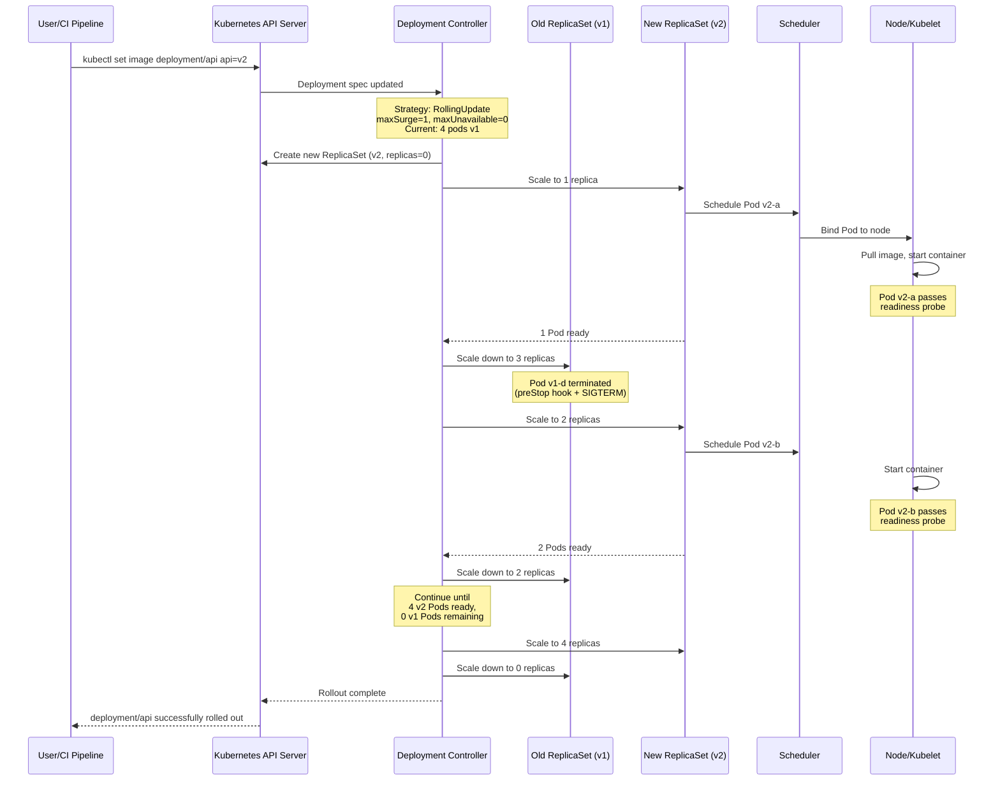

# Deployment Strategies

## 1. Overview

A Deployment is the standard Kubernetes controller for managing stateless application lifecycle -- creating, updating, and scaling Pods through ReplicaSets. The deployment strategy determines how a new version of your application replaces the old one: all at once (recreate), gradually (rolling update), or through more sophisticated patterns like blue-green and canary that give operators fine-grained control over blast radius and rollback.

Choosing the wrong deployment strategy is one of the most common causes of production incidents in Kubernetes. A rolling update with default `maxSurge=25%` and `maxUnavailable=25%` on a 4-Pod Deployment means Kubernetes can terminate 1 Pod and create 1 new Pod simultaneously -- if the new version has a bug, 50% of traffic hits the broken version before you can react. A canary strategy, by contrast, limits exposure to 1-5% of traffic, giving you minutes to hours to validate before full rollout.

Understanding Deployment mechanics -- revision history, ReplicaSet management, rollback commands, and strategy tuning -- is essential for any team running production workloads on Kubernetes.

## 2. Why It Matters

- **Zero-downtime releases.** Rolling updates ensure that old Pods continue serving traffic until new Pods pass readiness checks. When configured correctly, users experience no interruption during deployments.
- **Blast radius control.** Canary and blue-green strategies limit the percentage of users exposed to a new version. If the new version has a latency regression or error rate spike, only a fraction of traffic is affected.
- **Fast rollback.** Kubernetes Deployments maintain a revision history of ReplicaSets. Rolling back to the previous version is a single command (`kubectl rollout undo`) that takes seconds, not minutes.
- **Resource predictability.** The `maxSurge` and `maxUnavailable` parameters control how many extra Pods are created during a rollout. This directly impacts how much spare capacity your cluster needs -- critical for cost optimization.
- **Progressive delivery.** Modern deployment pipelines combine Kubernetes Deployments with tools like Argo Rollouts and Flagger to automate canary analysis, traffic shifting, and promotion/rollback based on metrics.

## 3. Core Concepts

- **Deployment:** A Kubernetes controller that manages a set of identical Pods through ReplicaSets. It declares a desired state (image version, replica count, resource configuration) and the Deployment controller drives the actual state toward it.
- **ReplicaSet:** The underlying controller that ensures a specified number of Pod replicas are running. A Deployment creates a new ReplicaSet for each revision and scales the old ReplicaSet down as the new one scales up.
- **Revision:** Each change to a Deployment's Pod template (image, env vars, resources) creates a new revision. Kubernetes maintains a history of revisions (controlled by `revisionHistoryLimit`, default: 10) for rollback.
- **Rolling Update:** The default strategy. Pods are replaced incrementally, controlled by `maxSurge` (how many extra Pods can exist above the desired count) and `maxUnavailable` (how many Pods can be unavailable during the update).
- **Recreate:** All existing Pods are terminated before new Pods are created. Causes downtime but guarantees that two versions never run simultaneously -- required for workloads that cannot tolerate version mixing (e.g., singleton workers, some database clients).
- **Blue-Green Deployment:** Two complete environments (blue = current, green = new) run simultaneously. Traffic is switched from blue to green at once by updating a Service selector. Not a native Kubernetes Deployment strategy -- implemented using two Deployments and a Service.
- **Canary Deployment:** A small percentage of traffic is routed to the new version while the majority continues to hit the old version. Implemented using multiple Deployments with weighted traffic splitting (Istio, Ingress annotations, Argo Rollouts).
- **maxSurge:** Maximum number of Pods above `replicas` that can be created during a rolling update. Can be an absolute number or percentage. `maxSurge=1` means at most `replicas + 1` Pods exist during the rollout.
- **maxUnavailable:** Maximum number of Pods that can be unavailable during a rolling update. `maxUnavailable=0` means all existing Pods must remain running until new Pods are ready -- safest but slowest.
- **progressDeadlineSeconds:** How long the Deployment controller waits for progress before reporting the Deployment as failed. Default: 600 seconds. A stuck rollout (e.g., new Pods failing readiness checks) is flagged after this deadline.

## 4. How It Works

### Rolling Update Mechanics

A rolling update replaces Pods incrementally. The Deployment controller manages two ReplicaSets: the old one (scaling down) and the new one (scaling up). The pace is controlled by `maxSurge` and `maxUnavailable`.

**Example: 10 replicas, maxSurge=3, maxUnavailable=2**

At any point during the rollout:
- Maximum total Pods: `10 + 3 = 13`
- Minimum available Pods: `10 - 2 = 8`

The Deployment controller creates up to 3 new Pods immediately, then as new Pods become ready and old Pods are terminated, it maintains these invariants.

```yaml
apiVersion: apps/v1
kind: Deployment
metadata:
  name: api-server
spec:
  replicas: 10
  revisionHistoryLimit: 5
  strategy:
    type: RollingUpdate
    rollingUpdate:
      maxSurge: 3          # Up to 13 Pods total
      maxUnavailable: 2    # At least 8 Pods available
  selector:
    matchLabels:
      app: api-server
  template:
    metadata:
      labels:
        app: api-server
        version: v2.1.0
    spec:
      containers:
        - name: api
          image: myapp/api:v2.1.0
          ports:
            - containerPort: 8080
          readinessProbe:
            httpGet:
              path: /healthz
              port: 8080
            initialDelaySeconds: 5
            periodSeconds: 10
            failureThreshold: 3
          resources:
            requests:
              cpu: 250m
              memory: 512Mi
            limits:
              memory: 1Gi
```

**Common maxSurge/maxUnavailable tuning patterns:**

| Pattern | maxSurge | maxUnavailable | Behavior | Use Case |
|---|---|---|---|---|
| **Zero-downtime (safe)** | 1 (or 25%) | 0 | New Pods must be ready before any old Pod is removed | Revenue-critical APIs, strict SLOs |
| **Fast rollout** | 50% | 50% | Aggressive replacement, ~50% capacity during transition | Non-critical services, dev/staging |
| **One-at-a-time** | 1 | 0 | Safest, slowest; one new Pod created, verified, then one old Pod removed | Database clients, stateful connections |
| **Surge-only** | 3 | 0 | Extra capacity created first, old Pods removed after new ones are ready | Workloads where dropping below replica count is unacceptable |
| **Default** | 25% | 25% | Balanced speed and safety | General workloads |

### Recreate Strategy

```yaml
spec:
  strategy:
    type: Recreate
```

All Pods of the old ReplicaSet are terminated, then all Pods of the new ReplicaSet are created. This causes a brief window with zero Pods running. Use only when:
- The application cannot have two versions running simultaneously (version-incompatible database schemas, singleton workers with locks).
- Downtime is acceptable (batch processing, internal tools).
- Resource constraints prevent running two versions simultaneously (large GPU workloads where `maxSurge=1` would require an additional GPU node).

### Blue-Green Deployment on Kubernetes

Blue-green is not a native Deployment strategy. It is implemented using two separate Deployments and a Service that switches between them.

```yaml
# Blue Deployment (current production)
apiVersion: apps/v1
kind: Deployment
metadata:
  name: api-blue
spec:
  replicas: 10
  selector:
    matchLabels:
      app: api
      version: blue
  template:
    metadata:
      labels:
        app: api
        version: blue
    spec:
      containers:
        - name: api
          image: myapp/api:v2.0.0
---
# Green Deployment (new version)
apiVersion: apps/v1
kind: Deployment
metadata:
  name: api-green
spec:
  replicas: 10
  selector:
    matchLabels:
      app: api
      version: green
  template:
    metadata:
      labels:
        app: api
        version: green
    spec:
      containers:
        - name: api
          image: myapp/api:v2.1.0
---
# Service selector points to current active version
apiVersion: v1
kind: Service
metadata:
  name: api
spec:
  selector:
    app: api
    version: blue  # Switch to "green" to cutover
  ports:
    - port: 80
      targetPort: 8080
```

**Cutover:** Update the Service selector from `version: blue` to `version: green`. All traffic switches instantly. Rollback: revert the selector.

**Cost:** Requires 2x the resources during the validation window (both blue and green Deployments are running at full replica count).

### Canary Deployment

Canary routes a small percentage of traffic to the new version. On Kubernetes, this can be implemented in several ways:

**1. Native Kubernetes (replica ratio):** Run 9 replicas of v1 and 1 replica of v2 with the same label selector. The Service load-balances across all 10 Pods, so approximately 10% of traffic hits v2. This is coarse-grained -- you can only achieve ratios based on replica counts.

**2. Istio VirtualService (traffic splitting):**

```yaml
apiVersion: networking.istio.io/v1beta1
kind: VirtualService
metadata:
  name: api
spec:
  hosts:
    - api
  http:
    - route:
        - destination:
            host: api
            subset: stable
          weight: 95
        - destination:
            host: api
            subset: canary
          weight: 5
```

**3. Argo Rollouts (progressive delivery):**

```yaml
apiVersion: argoproj.io/v1alpha1
kind: Rollout
metadata:
  name: api
spec:
  replicas: 10
  strategy:
    canary:
      steps:
        - setWeight: 5
        - pause: {duration: 5m}
        - analysis:
            templates:
              - templateName: success-rate
        - setWeight: 25
        - pause: {duration: 5m}
        - analysis:
            templates:
              - templateName: success-rate
        - setWeight: 75
        - pause: {duration: 5m}
        - setWeight: 100
```

This progressively increases traffic from 5% -> 25% -> 75% -> 100%, running automated metric analysis at each step. If the analysis fails (error rate above threshold), Argo Rollouts automatically rolls back.

### Revision History and Rollback

Kubernetes maintains a history of ReplicaSets for each Deployment. Each change to the Pod template creates a new revision.

```bash
# View rollout history
kubectl rollout history deployment/api-server
# REVISION  CHANGE-CAUSE
# 1         Initial deployment
# 2         Update to v2.0.0
# 3         Update to v2.1.0

# View details of a specific revision
kubectl rollout history deployment/api-server --revision=2

# Rollback to the previous revision
kubectl rollout undo deployment/api-server

# Rollback to a specific revision
kubectl rollout undo deployment/api-server --to-revision=2

# Check rollout status
kubectl rollout status deployment/api-server
```

**Important:** `revisionHistoryLimit` controls how many old ReplicaSets are retained. Setting it to 0 disables rollback. The default is 10. Old ReplicaSets with 0 replicas still consume etcd storage, so keep this value reasonable (3-10 for most workloads).

### Deployment vs ReplicaSet

| Feature | Deployment | ReplicaSet |
|---|---|---|
| **Rolling updates** | Built-in with strategy configuration | Not supported -- must manually create new RS |
| **Rollback** | `kubectl rollout undo` | Manual -- must scale old RS up, new RS down |
| **Revision history** | Automatic, configurable retention | Not tracked |
| **Declarative updates** | Change Pod template -> automatic rollout | Change Pod template -> Pods recreated, no rollout |
| **When to use** | Almost always for stateless workloads | Almost never directly; used internally by Deployments |

**Rule:** Never create ReplicaSets directly. Always use Deployments. The only exception is if you are building a custom controller that manages its own ReplicaSets.

## 5. Architecture / Flow



## 6. Types / Variants

### Strategy Comparison

| Strategy | Downtime | Resource Overhead | Blast Radius | Rollback Speed | Complexity | Native K8s |
|---|---|---|---|---|---|---|
| **Rolling Update** | None (if configured correctly) | maxSurge extra Pods | Up to maxSurge + current Pods | Seconds (undo) | Low | Yes |
| **Recreate** | Yes (all Pods terminated) | None | 100% (during switch) | Minutes (create new Pods) | Low | Yes |
| **Blue-Green** | None | 2x resources | 100% (instant switch) | Seconds (switch Service selector) | Medium | No (manual) |
| **Canary** | None | Small (canary Pods) | Configurable (1-100%) | Seconds (remove canary) | High | No (requires Istio/Argo) |
| **A/B Testing** | None | Small | Segmented by user attributes | Seconds | High | No (requires Istio/Argo) |

### Argo Rollouts vs Flagger

| Feature | Argo Rollouts | Flagger |
|---|---|---|
| **CRD** | `Rollout` (replaces Deployment) | Works with existing Deployments |
| **Traffic management** | Istio, ALB, Nginx, SMI, Ambassador | Istio, Linkerd, App Mesh, Nginx, Gloo |
| **Analysis** | Built-in AnalysisTemplate | Integrates with Prometheus, Datadog |
| **Blue-green** | Native support | Native support |
| **Canary** | Step-based with pause/analysis | Automated with configurable thresholds |
| **Adoption model** | Replace Deployment with Rollout | Annotate existing Deployment |

### Deployment Patterns for Specific Workloads

| Workload Type | Recommended Strategy | Key Configuration |
|---|---|---|
| **Stateless API** | Rolling update | `maxSurge=25%, maxUnavailable=0`, readiness probe on `/healthz` |
| **gRPC service** | Rolling update | `maxUnavailable=0`, preStop hook with sleep (drain long-lived connections) |
| **Worker/consumer** | Rolling update | `maxUnavailable=1`, ensure messages are re-queued on termination |
| **GPU inference** | Recreate or blue-green | Recreate if GPUs are scarce; blue-green if spare GPU capacity exists |
| **Frontend SPA** | Rolling update or blue-green | Blue-green avoids serving mixed JS bundles from different versions |
| **Database migration** | Canary | Deploy new app version to canary, run migration, validate, promote |

## 7. Use Cases

- **Zero-downtime API releases.** A team runs a REST API with 20 replicas behind a Service. They configure `maxSurge=5` and `maxUnavailable=0` to ensure at least 20 Pods serve traffic at all times. New Pods are created 5 at a time, and old Pods are removed only after new Pods pass readiness checks. Total rollout time: ~3 minutes for a 20-Pod Deployment.
- **Canary with automated analysis (Argo Rollouts).** A payment processing team uses Argo Rollouts to deploy changes. The rollout sends 5% of traffic to the canary, runs an AnalysisTemplate that checks error rate and p99 latency from Prometheus, and only promotes if both metrics are within thresholds. In 6 months of use, the automated analysis caught 3 regressions that would have otherwise reached 100% of users.
- **Blue-green for GPU inference.** An ML team runs vLLM inference with 4 GPU Pods. They cannot use rolling updates because `maxSurge=1` would require scheduling an additional GPU Pod, and GPU nodes are fully packed. Instead, they deploy a new green environment on pre-provisioned GPU nodes, validate inference quality, then switch the Service selector. See [GPU and Accelerator Workloads](./05-gpu-and-accelerator-workloads.md).
- **Recreate for singleton workers.** A batch processing worker holds a distributed lock. Running two versions simultaneously causes lock contention. The team uses `strategy: Recreate` to ensure the old worker is fully terminated before the new worker starts. Downtime during deployment: 15-30 seconds.
- **Progressive delivery with feature flags.** Deployment is decoupled from feature release. The new code is deployed via rolling update (changes are behind a feature flag). After deployment, the feature is gradually enabled using a feature flag service (LaunchDarkly, Flagsmith). This separates the deployment risk from the feature risk.

## 8. Tradeoffs

| Decision | Option A | Option B | Guidance |
|---|---|---|---|
| **Rolling update vs blue-green** | Rolling: Gradual, lower resource cost | Blue-green: Instant switch, easy rollback, 2x cost | Rolling for most stateless services; blue-green for critical services where instant rollback is worth the cost |
| **maxUnavailable=0 vs maxUnavailable=25%** | 0: No capacity reduction, slower rollout | 25%: Faster rollout, temporarily reduced capacity | `maxUnavailable=0` for production APIs with tight SLOs; `25%` for internal services |
| **Argo Rollouts vs native Deployments** | Native: Simpler, no CRD dependency | Argo: Canary, analysis, automated rollback | Start with native Deployments; adopt Argo Rollouts when you need canary or automated metric analysis |
| **Single large Deployment vs many small Deployments** | Single: Simpler to manage, one rollout | Many: Independent release cycles, smaller blast radius | Microservices architecture favors many small Deployments; monoliths use one large Deployment |
| **Long vs short revision history** | Long (10+): More rollback options, more etcd storage | Short (3-5): Less storage, sufficient for most rollbacks | Default of 10 is fine; reduce to 3-5 for large clusters with many Deployments to save etcd space |

## 9. Common Pitfalls

- **No readiness probe.** Without a readiness probe, Kubernetes considers a Pod ready as soon as its containers start. A rolling update will terminate old Pods before new Pods are actually serving traffic, causing dropped requests. Every Deployment should have a readiness probe that verifies the application can handle requests.
- **readiness probe too aggressive.** A readiness probe with `initialDelaySeconds: 0`, `periodSeconds: 1`, and `failureThreshold: 1` will mark a Pod as not-ready during a single slow response. This causes the Pod to be removed from the Service, reducing capacity. Use `failureThreshold: 3` and `periodSeconds: 10` for most workloads.
- **Using `kubectl apply -f` with force during a rollout.** If a rollout is in progress and you `apply` the same manifest again, Kubernetes may create a third ReplicaSet, leading to a confusing state. Check `kubectl rollout status` before applying updates.
- **Not setting `terminationGracePeriodSeconds` long enough.** If your application needs 30 seconds to drain connections but `terminationGracePeriodSeconds` is the default 30 (minus preStop hook time), the application gets SIGKILL before draining is complete. Set `terminationGracePeriodSeconds` to at least `preStop duration + application drain time + 10s buffer`.
- **Mixing label selector changes with rolling updates.** Changing the Deployment's `spec.selector.matchLabels` is an immutable operation. If you need to change selectors, you must delete and recreate the Deployment. Attempting to change selectors will result in a validation error.
- **Blue-green without pre-warming.** Switching 100% of traffic from blue to green instantly can overwhelm the green deployment if its connection pools, caches, or JIT compilers are cold. Pre-warm the green deployment with synthetic traffic or gradual traffic shift before full cutover.
- **Ignoring PodDisruptionBudget (PDB) interaction.** A PDB limits how many Pods can be voluntarily disrupted. If your PDB allows `maxUnavailable=1` but your Deployment's rolling update has `maxUnavailable=3`, the PDB takes precedence during voluntary disruptions (node drain), but not during Deployment rollouts. Align PDB and Deployment settings.

## 10. Real-World Examples

- **Shopify (rolling updates at scale).** Shopify runs thousands of Deployments across multiple clusters. They use rolling updates with `maxSurge=25%` and `maxUnavailable=0` for all customer-facing services. Their CI/CD pipeline (Shipit) verifies canary health for 5 minutes before allowing the rollout to proceed. Average deployment time for a 50-Pod Deployment: ~8 minutes.
- **Intuit (Argo Rollouts for tax season).** Intuit uses Argo Rollouts for TurboTax services during tax season. Canary deployments start at 1% traffic, with automated Prometheus analysis checking error rates and latency. During peak filing season (January-April), a bad deployment to 100% of traffic could affect millions of users. The canary strategy limits exposure to ~10,000 users during validation.
- **Lyft (blue-green with Envoy).** Lyft uses blue-green deployments for critical routing services. Envoy's traffic splitting capabilities enable instant cutover by changing route weights from 100/0 to 0/100. Rollback takes under 5 seconds. They maintain both blue and green environments for 30 minutes after cutover before scaling down the old version.
- **Netflix (canary with Spinnaker).** Netflix's Spinnaker deployment platform uses canary analysis to compare the canary version against a baseline (same version as production but fresh deployment). This isolates deployment effects from version effects. The canary runs for 30-60 minutes while Kayenta (their canary analysis tool) compares metrics.

## 11. Related Concepts

- [Pod Design Patterns](./01-pod-design-patterns.md) -- lifecycle hooks, readiness probes, and resource configuration that affect deployment behavior
- [StatefulSets and Stateful Workloads](./03-statefulsets-and-stateful-workloads.md) -- ordered rolling updates for stateful applications
- [GPU and Accelerator Workloads](./05-gpu-and-accelerator-workloads.md) -- deployment strategies for GPU-bound inference workloads
- [Autoscaling](../../traditional-system-design/02-scalability/02-autoscaling.md) -- interaction between HPA scaling and Deployment rollouts
- [Model Serving Infrastructure](../../genai-system-design/02-llm-architecture/01-model-serving.md) -- deployment patterns for LLM serving

## 12. Source Traceability

- source/extracted/system-design-guide/ch17-designing-a-service-like-google-docs.md -- Blue-green deployments, canary releases, rolling updates for CI/CD pipelines (deployment best practices section)
- source/extracted/acing-system-design/ch09-part-2.md -- Sidecar pattern context for deployment considerations
- Kubernetes documentation -- Deployment spec, rolling update strategy, revision history, rollback
- Argo Rollouts documentation -- Canary strategy, AnalysisTemplate, progressive delivery
- Production patterns -- Shopify Shipit, Intuit Argo Rollouts, Lyft Envoy blue-green, Netflix Spinnaker/Kayenta
