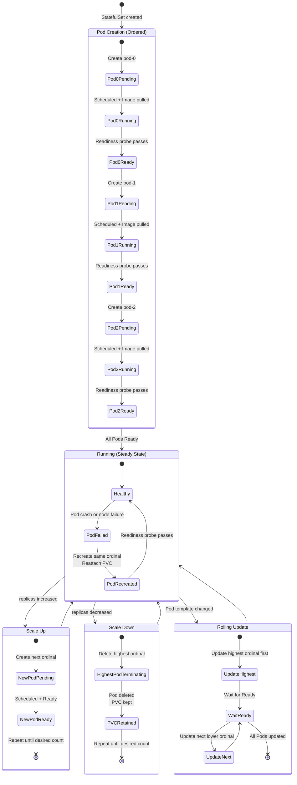

# StatefulSets and Stateful Workloads

## 1. Overview

A StatefulSet is the Kubernetes controller designed for applications that require stable, persistent identity -- databases, message brokers, distributed consensus systems, and any workload where a Pod's name, network address, or storage must survive restarts and rescheduling. Unlike a Deployment, which treats Pods as interchangeable cattle, a StatefulSet treats each Pod as a uniquely identifiable pet with a guaranteed ordinal index, a stable DNS name, and persistent storage that follows the Pod across rescheduling.

Running stateful workloads on Kubernetes was once considered inadvisable. Today, production PostgreSQL, MySQL, CockroachDB, Kafka, Elasticsearch, ZooKeeper, etcd, and Redis clusters routinely run on Kubernetes -- but they require careful design. StatefulSets provide the primitives (stable identity, ordered operations, persistent volumes), but the operator pattern provides the domain-specific automation (automated failover, backup, restore, scaling) that makes stateful workloads production-ready.

The distinction is critical: a StatefulSet manages Pod identity and ordering. An operator (CloudNativePG, Strimzi, Zalando Postgres Operator) manages the application's data plane -- replication, leader election, backup schedules, and schema management. Most production stateful workloads use both.

**Key numbers that frame StatefulSet design decisions:**
- A PostgreSQL failover with CloudNativePG takes 5-15 seconds (detect failure + promote replica + update Service endpoint). Compare to RDS failover at 60-120 seconds.
- Kafka broker restart with Strimzi takes 2-5 minutes (ISR sync, partition reassignment verification). A 12-broker rolling upgrade takes 30-60 minutes.
- EBS volume reattachment on AWS takes 10-30 seconds after a Pod is rescheduled within the same AZ. Cross-AZ reattachment is not possible -- the Pod must be scheduled in the volume's AZ.
- etcd requires disk fsync latency under 10ms for stable cluster operation. Network-attached storage (gp3) typically delivers 1-4ms; local NVMe delivers <0.1ms.

## 2. Why It Matters

- **Stable network identity.** Each Pod in a StatefulSet gets a predictable DNS name: `<pod-name>.<headless-service>.<namespace>.svc.cluster.local`. Kafka brokers need stable broker IDs; ZooKeeper nodes need stable ensemble member addresses; database replicas need stable replication endpoints. StatefulSets provide this.
- **Ordered operations.** StatefulSets create Pods sequentially (pod-0, then pod-1, then pod-2) and delete them in reverse order. This is essential for distributed systems that require leader-first initialization or graceful quorum reduction.
- **Persistent storage.** `volumeClaimTemplates` create a unique PersistentVolumeClaim for each Pod. When pod-2 is rescheduled to a different node, its PVC (and the underlying PersistentVolume) is reattached, preserving data. PVCs are not deleted when the StatefulSet is deleted or scaled down -- an explicit safety measure.
- **Data sovereignty.** Running databases on Kubernetes gives teams full control over data location, encryption, and compliance. Managed database services (RDS, Cloud SQL) may not meet data residency requirements or may introduce unacceptable vendor lock-in.
- **Operator ecosystem.** The Kubernetes operator pattern has matured. CloudNativePG handles PostgreSQL failover, backup to S3, point-in-time recovery. Strimzi manages Kafka clusters with automated rolling upgrades. These operators reduce the operational burden of running stateful workloads on Kubernetes to near-parity with managed services.
- **Cost optimization.** Running databases on Kubernetes leverages the same compute pool as application workloads. Instead of paying for dedicated RDS instances (often oversized for variable workloads), database Pods share the cluster's auto-scaled node pool. Organizations report 30-50% cost reduction compared to managed database services for workloads where the operational expertise exists.

## 3. Core Concepts

- **StatefulSet:** A workload controller that manages Pods with stable, unique identity. Each Pod gets an ordinal index (0, 1, 2, ...), a stable hostname (`web-0`, `web-1`, `web-2`), and a dedicated PersistentVolumeClaim.
- **Headless Service:** A Service with `clusterIP: None` that provides DNS records for individual Pods rather than load-balancing across them. Required for StatefulSets to enable stable network identity. DNS format: `<pod-name>.<service-name>.<namespace>.svc.cluster.local`.
- **Ordinal Index:** Each Pod in a StatefulSet is assigned an integer index starting from 0. The Pod name is `<statefulset-name>-<ordinal>`. This index is stable across restarts.
- **volumeClaimTemplates:** A template in the StatefulSet spec that creates one PersistentVolumeClaim per Pod. The PVC name follows the pattern `<template-name>-<statefulset-name>-<ordinal>`. PVCs persist even when Pods are deleted.
- **Pod Management Policy:**
  - `OrderedReady` (default): Pods are created in order (0, 1, 2, ...) and each must be Running and Ready before the next is created. Pods are deleted in reverse order.
  - `Parallel`: All Pods are created or deleted simultaneously. Use when ordering does not matter (e.g., a cache tier where all instances are independent).
- **Update Strategy:**
  - `RollingUpdate` (default): Pods are updated in reverse ordinal order (highest first). The `partition` parameter controls which Pods are updated -- only Pods with ordinal >= `partition` are updated. This enables canary updates for StatefulSets.
  - `OnDelete`: Pods are only updated when manually deleted. The operator retains full control over the update sequence.
- **PersistentVolumeClaim (PVC) Retention:** By default, PVCs created by `volumeClaimTemplates` are NOT deleted when the StatefulSet is deleted or scaled down. This is a safety mechanism to prevent data loss. Manual PVC cleanup is required after decommissioning.
- **Operator Pattern:** A custom controller that extends Kubernetes to manage a specific application's lifecycle (install, configure, upgrade, backup, failover). Operators encode domain expertise as code. They watch custom resources (e.g., `PostgresCluster`) and reconcile the actual state (Pods, Services, ConfigMaps) to match the desired state.

## 4. How It Works

### StatefulSet Creation Sequence

When you create a StatefulSet with `replicas: 3`:

1. The controller creates `pod-0` and waits for it to be Running and Ready.
2. Once `pod-0` is Ready, it creates `pod-1` and waits.
3. Once `pod-1` is Ready, it creates `pod-2`.

Each Pod gets:
- A stable hostname: `mydb-0`, `mydb-1`, `mydb-2`
- A DNS A record: `mydb-0.mydb-headless.default.svc.cluster.local`
- A unique PVC: `data-mydb-0`, `data-mydb-1`, `data-mydb-2`

```yaml
apiVersion: v1
kind: Service
metadata:
  name: postgres-headless
  labels:
    app: postgres
spec:
  ports:
    - port: 5432
      name: postgres
  clusterIP: None    # Headless -- no load balancing
  selector:
    app: postgres
---
apiVersion: apps/v1
kind: StatefulSet
metadata:
  name: postgres
spec:
  serviceName: postgres-headless  # Must match headless Service
  replicas: 3
  podManagementPolicy: OrderedReady
  updateStrategy:
    type: RollingUpdate
    rollingUpdate:
      partition: 0
  selector:
    matchLabels:
      app: postgres
  template:
    metadata:
      labels:
        app: postgres
    spec:
      containers:
        - name: postgres
          image: postgres:16.2
          ports:
            - containerPort: 5432
          env:
            - name: PGDATA
              value: /var/lib/postgresql/data/pgdata
          volumeMounts:
            - name: data
              mountPath: /var/lib/postgresql/data
          resources:
            requests:
              cpu: "1"
              memory: 2Gi
            limits:
              cpu: "2"
              memory: 4Gi
          readinessProbe:
            exec:
              command:
                - pg_isready
                - -U
                - postgres
            periodSeconds: 10
            failureThreshold: 3
  volumeClaimTemplates:
    - metadata:
        name: data
      spec:
        accessModes: ["ReadWriteOnce"]
        storageClassName: gp3-encrypted
        resources:
          requests:
            storage: 100Gi
```

### Scaling Behavior

**Scale up (3 -> 5):** Creates `pod-3`, waits for Ready, then creates `pod-4`. New PVCs are provisioned automatically.

**Scale down (5 -> 3):** Deletes `pod-4` first, waits for termination, then deletes `pod-3`. PVCs `data-postgres-3` and `data-postgres-4` are NOT deleted -- they must be cleaned up manually.

**Why PVCs are retained:** If you accidentally scale down from 5 to 3 and then back to 5, `pod-3` and `pod-4` will reattach to their existing PVCs, recovering all data. This safety mechanism prevents data loss from operational mistakes.

### Rolling Update with Partition (Canary)

The `partition` parameter enables canary updates for StatefulSets:

```yaml
updateStrategy:
  type: RollingUpdate
  rollingUpdate:
    partition: 2  # Only update Pods with ordinal >= 2
```

With `replicas: 3` and `partition: 2`, only `pod-2` gets the new image. Pods `pod-0` and `pod-1` keep the old image. After validating `pod-2`, lower `partition` to 1 to update `pod-1`, then to 0 to complete the rollout.

### Headless Service DNS Resolution

A headless Service creates individual DNS records for each Pod:

```
# SRV records for the headless Service
postgres-headless.default.svc.cluster.local -> postgres-0, postgres-1, postgres-2

# A records for each Pod
postgres-0.postgres-headless.default.svc.cluster.local -> 10.244.1.15
postgres-1.postgres-headless.default.svc.cluster.local -> 10.244.2.22
postgres-2.postgres-headless.default.svc.cluster.local -> 10.244.3.8
```

Applications can connect to a specific Pod by DNS name. A PostgreSQL replica can connect to the primary using `postgres-0.postgres-headless.default.svc.cluster.local:5432`. This stable DNS identity persists even when the Pod is rescheduled to a different node with a different IP.

### Production Database Pattern: CloudNativePG

Rather than manually managing a PostgreSQL StatefulSet, the CloudNativePG operator provides a declarative `Cluster` resource:

```yaml
apiVersion: postgresql.cnpg.io/v1
kind: Cluster
metadata:
  name: app-db
spec:
  instances: 3
  postgresql:
    parameters:
      shared_buffers: "1GB"
      effective_cache_size: "3GB"
      max_connections: "200"
  storage:
    size: 100Gi
    storageClass: gp3-encrypted
  resources:
    requests:
      cpu: "2"
      memory: 4Gi
    limits:
      cpu: "4"
      memory: 8Gi
  backup:
    barmanObjectStore:
      destinationPath: s3://backups/app-db
      s3Credentials:
        accessKeyId:
          name: s3-creds
          key: ACCESS_KEY_ID
        secretAccessKey:
          name: s3-creds
          key: SECRET_ACCESS_KEY
    retentionPolicy: "30d"
  monitoring:
    enablePodMonitor: true
```

The operator handles:
- Automatic primary election and failover (using Raft-based consensus).
- Streaming replication configuration between primary and replicas.
- Automated backups to S3 using Barman.
- Point-in-time recovery.
- Rolling updates that update replicas first, then failover and update the old primary last.
- Prometheus metrics export via PodMonitor.

## 5. Architecture / Flow



## 6. Types / Variants

### StatefulSet vs Deployment for Stateful Workloads

| Feature | StatefulSet | Deployment + PVC |
|---|---|---|
| **Pod identity** | Stable ordinal (pod-0, pod-1) | Random suffix (pod-abc123) |
| **DNS** | Predictable per-Pod DNS via headless Service | Only Service-level DNS |
| **Storage** | Per-Pod PVC via volumeClaimTemplates | Shared PVC or manual PVC per Pod |
| **Scaling order** | Sequential (ordered) or parallel | Always parallel |
| **Update order** | Reverse ordinal (highest first) | Random |
| **Use case** | Databases, Kafka, ZooKeeper, etcd | Stateless apps, caches without persistence |

### Production Stateful Workload Patterns

| Workload | Operator | Replication Model | Min Pods | Storage per Pod | Key Consideration |
|---|---|---|---|---|---|
| **PostgreSQL** | CloudNativePG, Zalando | Streaming replication (primary + replicas) | 3 | 50-500 GiB SSD | Failover time: 5-15s; WAL archiving to object storage |
| **CockroachDB** | CockroachDB Operator | Raft consensus (multi-active) | 3 | 100-1000 GiB SSD | No separate primary; any node handles reads/writes |
| **MySQL** | MySQL Operator for K8s | Group Replication or InnoDB Cluster | 3 | 50-500 GiB SSD | Semi-synchronous replication for durability |
| **Kafka** | Strimzi | Partition replication (ISR) | 3 brokers + 3 ZK (or KRaft) | 500 GiB - 5 TiB NVMe | Network throughput critical; use dedicated storage class |
| **ZooKeeper** | Strimzi (bundled) or Pravega | ZAB consensus | 3 or 5 (odd) | 10-50 GiB SSD | Latency-sensitive; dedicate nodes, avoid co-location |
| **Elasticsearch** | ECK (Elastic Cloud on K8s) | Shard replication | 3 master + 3 data | 100 GiB - 10 TiB SSD | Separate master and data node pools |
| **Redis** | Redis Operator (Spotahome) | Sentinel or Cluster mode | 3 (1 primary + 2 replicas) | 10-100 GiB SSD | Memory-bound; set resource limits carefully |
| **etcd** | etcd-operator or manual | Raft consensus | 3 or 5 (odd) | 10-50 GiB fast SSD | Latency-critical; <10ms disk fsync required |

### Operator Maturity Levels

Operators vary in capability. The Operator Framework defines 5 maturity levels:

| Level | Capability | Example |
|---|---|---|
| **1 - Basic Install** | Automated deployment | Helm chart wrapping a StatefulSet |
| **2 - Seamless Upgrades** | Automated rolling upgrades, minor/patch versions | Basic operator with upgrade logic |
| **3 - Full Lifecycle** | Backup, restore, failure recovery | CloudNativePG, Strimzi |
| **4 - Deep Insights** | Metrics, alerts, log processing, workload analysis | ECK with Stack Monitoring |
| **5 - Auto Pilot** | Auto-scaling, auto-tuning, anomaly detection | Advanced commercial operators |

### Storage Considerations for Stateful Workloads

| Storage Type | IOPS | Throughput | Latency | Reattach on Reschedule | Best For |
|---|---|---|---|---|---|
| **gp3 (AWS EBS)** | 3,000 baseline, up to 16,000 | 125 MB/s baseline, up to 1,000 MB/s | 1-4ms | Yes (same AZ only) | General-purpose databases |
| **io2 Block Express (AWS)** | Up to 256,000 | Up to 4,000 MB/s | <1ms | Yes (same AZ only) | Latency-sensitive databases (etcd) |
| **pd-ssd (GCP)** | Up to 100,000 | Up to 1,200 MB/s | <1ms | Yes (same zone only) | GKE workloads |
| **Local NVMe** | 500,000+ | 3,500+ MB/s | <0.1ms | No (node-local) | etcd, ZooKeeper, Kafka hot storage |
| **NFS / EFS** | Varies | Varies | 2-10ms | Yes (any node) | Shared read-only data, model weights |

**Key storage decisions:**
- **EBS/PD (network-attached):** Default choice. Survives node failure because the volume can be reattached to a new node in the same availability zone. Performance is adequate for most databases (3,000-16,000 IOPS on gp3).
- **Local NVMe:** Lowest latency but data does not survive node failure. Use only when the application handles replication (etcd, CockroachDB, Kafka). If the node dies, the Pod is rescheduled but starts with empty storage -- the application must rebuild from replicas.
- **Cross-AZ consideration:** EBS volumes are AZ-local. If a StatefulSet Pod is evicted and the scheduler places it in a different AZ, it cannot reattach its volume. Use `topologySpreadConstraints` or `nodeAffinity` to pin Pods to their volume's AZ.

### Anti-Affinity Patterns for High Availability

```yaml
spec:
  template:
    spec:
      affinity:
        podAntiAffinity:
          requiredDuringSchedulingIgnoredDuringExecution:
            - labelSelector:
                matchExpressions:
                  - key: app
                    operator: In
                    values:
                      - postgres
              topologyKey: kubernetes.io/hostname   # One Pod per node
          preferredDuringSchedulingIgnoredDuringExecution:
            - weight: 100
              podAffinityTerm:
                labelSelector:
                  matchExpressions:
                    - key: app
                      operator: In
                      values:
                        - postgres
                topologyKey: topology.kubernetes.io/zone  # Prefer different AZs
```

This configuration:
- **Hard rule:** No two PostgreSQL Pods on the same node. A node failure takes down at most 1 Pod.
- **Soft rule:** Prefer spreading Pods across availability zones. An AZ failure takes down at most 1 Pod (for a 3-Pod cluster across 3 AZs).

## 7. Use Cases

- **PostgreSQL on Kubernetes (CloudNativePG).** A fintech company runs PostgreSQL on GKE using CloudNativePG. 3-node cluster: 1 primary, 2 synchronous replicas. Storage: 500 GiB gp3 EBS with 3,000 IOPS provisioned. Automated backup to S3 every 6 hours with continuous WAL archiving. Failover time during Pod failure: ~10 seconds (automatic primary election). They chose K8s-native PostgreSQL over RDS for data residency compliance -- all data stays within their VPC and is encrypted with their own KMS keys.
- **Kafka on Kubernetes (Strimzi).** A streaming analytics company runs a 12-broker Kafka cluster on EKS using Strimzi. Each broker Pod: 4 vCPU, 16 GiB memory, 2 TiB gp3 volume with 6,000 IOPS. Strimzi manages rolling upgrades (one broker at a time, waiting for ISR to be in-sync before proceeding), topic management via `KafkaTopic` CRD, and user management via `KafkaUser` CRD. Throughput: 500 MB/s aggregate. They migrated from self-managed Kafka on EC2 to save 40% on operations cost (no more manual broker replacement, partition rebalancing).
- **CockroachDB for multi-region.** A global SaaS company runs CockroachDB across 3 regions (us-east, eu-west, ap-southeast) with 3 nodes per region. CockroachDB's Raft-based consensus handles cross-region replication automatically. StatefulSet in each region with `podAntiAffinity` to spread Pods across availability zones. Reads are served locally; writes route to the range leaseholder. Survival guarantee: any single region can fail without data loss or downtime.
- **ZooKeeper ensemble.** A 3-node ZooKeeper ensemble running as a StatefulSet with `podAntiAffinity` to ensure each node is on a separate host. `podManagementPolicy: OrderedReady` ensures the leader (typically node-0) is started first. Storage: 20 GiB fast SSD (ZooKeeper's write-ahead log is latency-sensitive). ZooKeeper is being phased out in favor of Kafka's KRaft mode, but existing deployments still use it.
- **Elasticsearch cluster (ECK).** A logging team runs Elasticsearch on K8s using ECK. Separate node pools: 3 master-eligible nodes (2 vCPU, 4 GiB), 6 data nodes (8 vCPU, 32 GiB, 1 TiB storage), 2 coordinating nodes (4 vCPU, 8 GiB). ECK manages rolling upgrades, shard allocation awareness (spread shards across zones), and automated snapshots to S3.

## 8. Tradeoffs

| Decision | Option A | Option B | Guidance |
|---|---|---|---|
| **StatefulSet vs managed service** | K8s StatefulSet: Full control, portability, data sovereignty | Managed (RDS, Cloud SQL): Less ops, higher cost, vendor lock-in | Use managed for simple workloads; K8s-native for compliance, multi-cloud, or operator expertise |
| **OrderedReady vs Parallel** | Ordered: Safe for consensus systems, slower scaling | Parallel: Fast scaling, no ordering guarantees | OrderedReady for databases, ZooKeeper, etcd; Parallel for caches, stateless-like stateful workloads |
| **Operator vs manual StatefulSet** | Operator: Automated lifecycle, backup, failover | Manual: Full control, no CRD dependency | Always use an operator for production databases; manual only for learning or custom workloads |
| **Local storage vs network storage** | Local (NVMe): Lowest latency, highest IOPS, no reattach on reschedule | Network (EBS, PD): Reattachable, snapshots, lower IOPS | Network storage for most workloads; local storage only for ultra-low-latency (etcd, ZooKeeper) with replication handling data durability |
| **Synchronous vs asynchronous replication** | Synchronous: Zero data loss, higher write latency | Asynchronous: Lower latency, potential data loss on failover | Synchronous for financial data, user-facing writes; asynchronous for analytics, logging, non-critical data |

## 9. Common Pitfalls

- **Not using a headless Service.** Without `clusterIP: None`, Pods do not get individual DNS records. The StatefulSet's stable network identity becomes unusable. Every StatefulSet needs a headless Service matching its `spec.serviceName`.
- **Forgetting that PVCs are retained on delete.** When you delete a StatefulSet or scale down, PVCs remain. In a cluster running hundreds of StatefulSets over months, orphaned PVCs accumulate storage costs. Implement a cleanup job or alert on orphaned PVCs.
- **Running a database without an operator.** A raw StatefulSet provides identity and storage but no automated failover, backup, or upgrade logic. If the primary PostgreSQL Pod crashes, a raw StatefulSet will restart it, but it will not promote a replica to primary. An operator handles this in seconds.
- **Using `podManagementPolicy: Parallel` for consensus systems.** ZooKeeper, etcd, and CockroachDB require quorum during startup. If all nodes start simultaneously and try to form a cluster, they may fail to elect a leader. Use `OrderedReady` to ensure the first node initializes the cluster before others join.
- **Undersized storage with no resize path.** PVCs can be expanded (if the StorageClass supports `allowVolumeExpansion: true`), but they cannot be shrunk. Start with adequate storage and ensure your StorageClass allows expansion. A PostgreSQL PVC hitting 100% capacity causes write failures and potential data corruption.
- **Ignoring anti-affinity for high availability.** Without `podAntiAffinity`, the scheduler may place all 3 database Pods on the same node. A single node failure takes down the entire cluster. Use `requiredDuringSchedulingIgnoredDuringExecution` with `topologyKey: kubernetes.io/hostname` for hard anti-affinity.
- **Not testing failover procedures.** An operator that handles automated failover must be tested. Kill the primary Pod, cordon a node, simulate disk failure. If you have not tested your failover procedure, it does not work. Schedule quarterly chaos engineering exercises for stateful workloads.

## 10. Real-World Examples

- **GitLab (PostgreSQL with Patroni on K8s).** GitLab.com runs PostgreSQL on Kubernetes using Patroni for high availability. The StatefulSet runs 3 PostgreSQL instances; Patroni manages leader election via etcd. During a node failure in 2022, Patroni promoted a replica to primary in 8 seconds with zero data loss (synchronous replication). WAL logs are continuously archived to GCS for point-in-time recovery.
- **LinkedIn (Kafka on K8s).** LinkedIn, the original creator of Kafka, has been migrating Kafka clusters to Kubernetes. Their largest clusters run 100+ broker Pods with StatefulSets. Key learnings: dedicated storage nodes with NVMe for Kafka data, separate node pools for brokers and ZooKeeper, and custom admission webhooks to prevent scheduling two brokers from the same partition on the same node.
- **Cockroach Labs (CockroachDB on K8s).** CockroachDB Cloud runs entirely on Kubernetes. Each tenant gets a StatefulSet with 3-9 nodes. Pod anti-affinity spreads nodes across availability zones. They use persistent volumes with IOPS provisioning (3,000-10,000 IOPS per volume depending on tier). CockroachDB's built-in replication means data survives node and even zone failures without operator intervention.
- **Elastic (ECK at scale).** Elastic Cloud on Kubernetes (ECK) manages thousands of Elasticsearch clusters. ECK uses StatefulSets with separate node pools for master, data, and coordinating nodes. A typical production cluster: 3 master nodes (no data), 6+ data nodes with 1-10 TiB each, 2 coordinating nodes for query routing. ECK handles rolling upgrades by waiting for shard reallocation before updating each node.
- **Pinterest (Redis on K8s).** Pinterest migrated their Redis infrastructure to Kubernetes using a custom operator built on top of StatefulSets. Each Redis cluster is a StatefulSet with 1 primary and 2 replicas, using Sentinel for automated failover. They run over 1,000 Redis clusters on K8s. Key insight: for memory-intensive workloads like Redis, setting `resources.requests.memory == resources.limits.memory` (Guaranteed QoS) prevents eviction during node memory pressure. They also use `podAntiAffinity` to ensure primary and replicas never co-locate on the same node.

## 11. Related Concepts

- [Pod Design Patterns](./01-pod-design-patterns.md) -- init containers for database initialization, sidecar patterns for metrics
- [Deployment Strategies](./02-deployment-strategies.md) -- contrast between Deployment (stateless) and StatefulSet (stateful) update behaviors
- [Jobs and Batch Processing](./04-jobs-and-batch-processing.md) -- batch operations on stateful data (backup jobs, maintenance tasks)
- [Autoscaling](../../traditional-system-design/02-scalability/02-autoscaling.md) -- scaling considerations for stateful workloads (KEDA for Kafka consumer lag)

## 12. Source Traceability

- source/extracted/acing-system-design/ch09-part-2.md -- ZooKeeper for configuration services (section 8.12 context), distributed consensus patterns
- source/extracted/system-design-guide/ch17-designing-a-service-like-google-docs.md -- Scalability and high availability requirements for stateful services
- Kubernetes documentation -- StatefulSet spec, headless Services, volumeClaimTemplates, Pod management policies
- Operator documentation -- CloudNativePG, Strimzi, ECK, CockroachDB Operator
- Production patterns -- GitLab Patroni, LinkedIn Kafka migration, Elastic ECK
