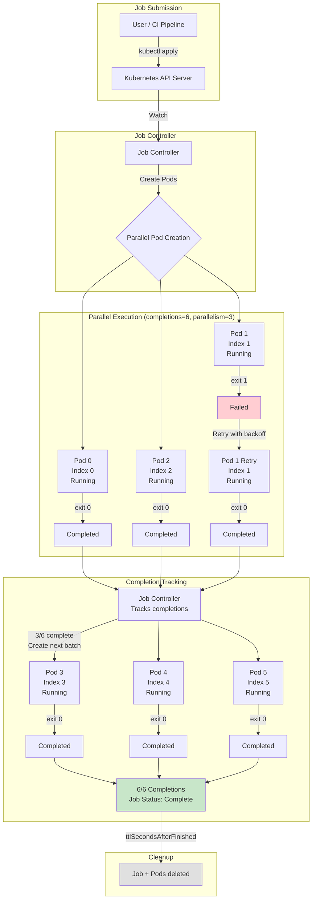

# Jobs and Batch Processing

## 1. Overview

A Job is the Kubernetes controller for run-to-completion workloads -- tasks that start, do work, and exit. Unlike Deployments (which maintain a desired number of long-running Pods) or StatefulSets (which manage persistent identity), Jobs ensure that a specified number of Pods successfully complete. CronJobs extend this model with time-based scheduling, providing cron-like functionality native to the Kubernetes control plane.

Jobs power a vast range of workloads: database migrations, ETL pipelines, report generation, image/video processing, scientific simulations, and ML training. At scale, vanilla Jobs hit limitations -- no gang scheduling, no fair-share queuing, no topology-aware placement. This is where batch scheduling frameworks (Volcano, Kueue) fill the gap, providing multi-tenant job queuing, priority-based preemption, and resource quotas that make Kubernetes viable for enterprise batch and HPC workloads.

The combination of Jobs, CronJobs, and batch schedulers transforms Kubernetes from a container orchestrator into a general-purpose compute platform capable of handling both request-driven services and computation-driven batch workloads on the same infrastructure.

## 2. Why It Matters

- **Resource efficiency.** Jobs consume resources only while running. Unlike a Deployment that holds resources indefinitely, a Job releases its Pods (and their resource allocations) upon completion. A cluster running 1,000 Deployments 24/7 and 500 Jobs that run for 10 minutes each uses dramatically different resource profiles.
- **Guaranteed completion.** The Job controller ensures that the specified number of completions are achieved. If a Pod fails, it is retried up to `backoffLimit` times. If a node crashes mid-job, the Pod is rescheduled on another node. This retry logic is built into the controller, not the application.
- **Parallelism control.** Jobs natively support parallel execution: run N Pods simultaneously, each processing a portion of the work. Indexed Jobs (K8s 1.24+) assign each Pod a unique index, enabling work partitioning without external coordination.
- **Scheduled execution.** CronJobs provide declarative, cron-based scheduling managed by the Kubernetes control plane. No external scheduler (cron daemon, Airflow) required for simple periodic tasks.
- **ML training at scale.** Training jobs -- from single-GPU fine-tuning to multi-node distributed training -- map naturally to the Job abstraction. Combined with gang scheduling (Volcano, Kueue), Kubernetes can orchestrate training runs that require all N Pods to start simultaneously and communicate via NCCL/MPI.

## 3. Core Concepts

- **Job:** A controller that creates one or more Pods and ensures a specified number of them successfully terminate (exit code 0). When the required number of completions is reached, the Job is marked as Complete.
- **CronJob:** A controller that creates Jobs on a time-based schedule (cron syntax). Each scheduled trigger creates a new Job, which creates its Pods.
- **completions:** The number of Pods that must successfully complete. Default: 1. For parallel work, set `completions` to the number of work items.
- **parallelism:** The maximum number of Pods running concurrently. Default: 1. Kubernetes creates up to `parallelism` Pods at a time. If `completions=100` and `parallelism=10`, up to 10 Pods run concurrently until all 100 complete.
- **backoffLimit:** The number of retries before marking the Job as Failed. Default: 6. Each retry uses exponential backoff (10s, 20s, 40s, ..., capped at 6 minutes). Setting `backoffLimit: 0` means no retries -- a single failure marks the Job as Failed.
- **activeDeadlineSeconds:** Maximum time the Job can run. After this duration, all running Pods are terminated and the Job is marked as Failed. Use as a safety net for runaway jobs.
- **ttlSecondsAfterFinished:** Automatically deletes the Job (and its Pods) after the specified duration post-completion. Without this, completed Jobs accumulate in the cluster, consuming etcd storage. Recommended: set to 3600 (1 hour) for observability, then auto-clean.
- **Indexed Jobs (K8s 1.24+):** Each Pod in an indexed Job receives a unique index (0, 1, 2, ...) via the `JOB_COMPLETION_INDEX` environment variable. This enables work partitioning: Pod 0 processes items 0-999, Pod 1 processes items 1000-1999, and so on. No external coordination required.
- **Pod Failure Policy (K8s 1.26+):** Fine-grained control over how specific exit codes or Pod conditions are handled. You can configure certain failures as non-retriable (e.g., exit code 42 means "invalid input, do not retry") while others are retriable (e.g., exit code 1 means "transient error, retry").
- **Suspend/Resume (K8s 1.24+):** Jobs can be suspended (`.spec.suspend: true`), which terminates all running Pods without counting them as failures. Resuming recreates the Pods. This is essential for preemption in batch scheduling systems.
- **Volcano:** An open-source batch scheduling framework for Kubernetes. Provides gang scheduling (all-or-nothing Pod placement), fair-share scheduling, job queues, and topology-aware scheduling. Originally developed at Huawei for AI/HPC workloads.
- **Kueue (K8s SIG):** A Kubernetes-native job queuing system. Manages resource quotas across multiple tenants and queues. Jobs wait in queues until sufficient resources are available, then are admitted and run. Designed as the official Kubernetes batch scheduling solution.

## 4. How It Works

### Basic Job Execution

```yaml
apiVersion: batch/v1
kind: Job
metadata:
  name: db-backup
spec:
  completions: 1
  parallelism: 1
  backoffLimit: 3
  activeDeadlineSeconds: 3600      # Timeout after 1 hour
  ttlSecondsAfterFinished: 7200    # Auto-delete after 2 hours
  template:
    spec:
      restartPolicy: Never         # Required for Jobs (Never or OnFailure)
      containers:
        - name: backup
          image: myapp/db-backup:v1.5
          command: ["pg_dump", "-h", "postgres-primary", "-U", "admin", "-F", "c", "-f", "/backup/db.dump"]
          volumeMounts:
            - name: backup-vol
              mountPath: /backup
          resources:
            requests:
              cpu: 500m
              memory: 1Gi
      volumes:
        - name: backup-vol
          persistentVolumeClaim:
            claimName: backup-storage
```

### Parallel Job with Completions

Process 50 video files, 10 at a time:

```yaml
apiVersion: batch/v1
kind: Job
metadata:
  name: video-transcode
spec:
  completions: 50       # 50 items to process
  parallelism: 10       # 10 workers at a time
  backoffLimit: 100     # Allow retries (2 per item on average)
  template:
    spec:
      restartPolicy: Never
      containers:
        - name: transcoder
          image: myapp/transcoder:v2.0
          command: ["python", "transcode.py"]
          env:
            - name: QUEUE_URL
              value: "sqs://video-transcode-queue"
          resources:
            requests:
              cpu: "2"
              memory: 4Gi
              nvidia.com/gpu: 1   # GPU for hardware-accelerated encoding
```

Each Pod pulls a work item from the queue (SQS, Redis, RabbitMQ), processes it, and exits. The Job controller creates new Pods (up to `parallelism`) until `completions` successful Pods have exited.

### Indexed Job for Work Partitioning

```yaml
apiVersion: batch/v1
kind: Job
metadata:
  name: data-processing
spec:
  completions: 20
  parallelism: 20
  completionMode: Indexed     # Each Pod gets JOB_COMPLETION_INDEX
  backoffLimit: 5
  template:
    spec:
      restartPolicy: Never
      containers:
        - name: processor
          image: myapp/processor:v3.1
          command: ["python", "process_shard.py"]
          # JOB_COMPLETION_INDEX is automatically set (0, 1, 2, ..., 19)
          # Each Pod processes shard $JOB_COMPLETION_INDEX of the data
          resources:
            requests:
              cpu: "1"
              memory: 2Gi
```

Pod 0 gets `JOB_COMPLETION_INDEX=0`, Pod 1 gets `JOB_COMPLETION_INDEX=1`, and so on. The application uses this index to determine which data shard to process. No external queue required.

### CronJob Configuration

```yaml
apiVersion: batch/v1
kind: CronJob
metadata:
  name: nightly-report
spec:
  schedule: "0 2 * * *"                # 2:00 AM daily
  timeZone: "America/New_York"         # K8s 1.27+ supports time zones
  concurrencyPolicy: Forbid            # Skip if previous run still active
  startingDeadlineSeconds: 600         # Must start within 10 minutes of scheduled time
  successfulJobsHistoryLimit: 3        # Keep last 3 successful Jobs
  failedJobsHistoryLimit: 5            # Keep last 5 failed Jobs
  jobTemplate:
    spec:
      backoffLimit: 2
      activeDeadlineSeconds: 7200      # Max 2 hours per run
      ttlSecondsAfterFinished: 86400   # Clean up after 24 hours
      template:
        spec:
          restartPolicy: Never
          containers:
            - name: reporter
              image: myapp/reporter:v4.0
              command: ["python", "generate_report.py"]
              resources:
                requests:
                  cpu: "1"
                  memory: 2Gi
```

**CronJob concurrency policies:**

| Policy | Behavior | Use Case |
|---|---|---|
| `Allow` (default) | Multiple Jobs can run concurrently | Independent tasks that do not conflict |
| `Forbid` | Skip the new Job if the previous is still running | Prevent duplicate processing of the same data |
| `Replace` | Terminate the running Job and start a new one | Always use the latest version; old run is stale |

### Kueue for Multi-Tenant Batch Scheduling

Kueue manages job admission through a queue and quota system:

```yaml
# Define cluster-level resources available for batch
apiVersion: kueue.x-k8s.io/v1beta1
kind: ClusterQueue
metadata:
  name: gpu-cluster-queue
spec:
  resourceGroups:
    - coveredResources: ["cpu", "memory", "nvidia.com/gpu"]
      flavors:
        - name: a100-80gb
          resources:
            - name: cpu
              nominalQuota: 64
            - name: memory
              nominalQuota: 512Gi
            - name: nvidia.com/gpu
              nominalQuota: 16
  preemption:
    withinClusterQueue: LowerPriority
---
# Team-level queue with borrowing limits
apiVersion: kueue.x-k8s.io/v1beta1
kind: LocalQueue
metadata:
  name: ml-team-queue
  namespace: ml-training
spec:
  clusterQueue: gpu-cluster-queue
---
# Job references the queue
apiVersion: batch/v1
kind: Job
metadata:
  name: llm-finetune
  namespace: ml-training
  labels:
    kueue.x-k8s.io/queue-name: ml-team-queue
spec:
  completions: 1
  parallelism: 1
  suspend: true      # Kueue will unsuspend when resources are available
  template:
    spec:
      restartPolicy: Never
      containers:
        - name: trainer
          image: myapp/trainer:v2.0
          resources:
            requests:
              cpu: "8"
              memory: 64Gi
              nvidia.com/gpu: 4
```

Kueue workflow:
1. User submits a Job with `suspend: true` and a queue label.
2. Kueue evaluates the Job's resource requirements against the ClusterQueue's available quota.
3. If resources are available, Kueue unsuspends the Job, which triggers Pod creation.
4. If resources are not available, the Job waits in the queue. Higher-priority Jobs can preempt lower-priority ones.
5. When the Job completes, Kueue reclaims the quota for the next queued Job.

### Volcano for Gang Scheduling

Gang scheduling ensures all Pods in a group start simultaneously -- critical for distributed ML training where all workers must be present for NCCL collective operations.

```yaml
apiVersion: batch.volcano.sh/v1alpha1
kind: Job
metadata:
  name: distributed-training
spec:
  minAvailable: 4          # All 4 Pods must be scheduled together
  schedulerName: volcano
  queue: ml-training
  tasks:
    - replicas: 4
      name: worker
      template:
        spec:
          containers:
            - name: trainer
              image: myapp/distributed-trainer:v1.0
              command: ["torchrun", "--nproc_per_node=1", "--nnodes=4", "train.py"]
              resources:
                requests:
                  cpu: "8"
                  memory: 64Gi
                  nvidia.com/gpu: 8
              env:
                - name: NCCL_SOCKET_IFNAME
                  value: "eth0"
```

Without gang scheduling, the default Kubernetes scheduler might schedule 3 of 4 workers, leaving one pending due to resource constraints. The 3 running workers would idle, wasting GPU resources, until the 4th Pod is scheduled. Volcano ensures all-or-nothing placement.

## 5. Architecture / Flow



## 6. Types / Variants

### Job Patterns

| Pattern | completions | parallelism | completionMode | Use Case |
|---|---|---|---|---|
| **Single completion** | 1 | 1 | NonIndexed | One-off task: backup, migration, report |
| **Fixed completions, serial** | N | 1 | NonIndexed | Sequential processing (order matters) |
| **Fixed completions, parallel** | N | M (M < N) | NonIndexed | Parallel queue workers (N items, M concurrent) |
| **Indexed parallel** | N | M | Indexed | Partitioned data processing (each Pod gets a shard) |
| **Work queue** | (unset) | M | NonIndexed | Pods pull from external queue until empty, then exit |

### CronJob vs External Schedulers

| Feature | CronJob | Airflow | Argo Workflows |
|---|---|---|---|
| **Scheduling** | Cron syntax only | Cron, event-driven, dependency-based | Cron, event-driven, DAG-based |
| **DAG support** | No | Yes (core feature) | Yes (core feature) |
| **UI** | None (kubectl only) | Full web UI | Full web UI |
| **Retry logic** | backoffLimit only | Per-task retry with branching | Per-step retry with expressions |
| **Dependencies** | None (single Job) | Complex inter-task dependencies | Step-level dependencies with artifacts |
| **State management** | Job status in etcd | Metadata DB (PostgreSQL) | Artifacts in S3, status in K8s |
| **Best for** | Simple periodic tasks | Complex data pipelines | Complex K8s-native workflows |

### Batch Scheduler Comparison

| Feature | Default K8s Scheduler | Kueue | Volcano |
|---|---|---|---|
| **Gang scheduling** | No | Partial (via JobSet) | Yes (core feature) |
| **Fair-share queuing** | No | Yes | Yes |
| **Multi-tenant quotas** | ResourceQuota (namespace-level) | ClusterQueue quotas | Queue-based quotas |
| **Preemption** | Priority-based Pod preemption | Queue-level preemption | Job-level preemption |
| **Topology-aware** | TopologySpreadConstraints | Via ResourceFlavor | Yes |
| **MPI/NCCL support** | No | Via JobSet | Yes (MPI plugin) |
| **Maturity** | GA | GA (K8s SIG project) | CNCF sandbox |
| **Best for** | General workloads | Multi-tenant batch/ML | HPC, distributed training |

## 7. Use Cases

- **Nightly ETL pipeline.** A data team uses CronJobs to run ETL jobs at 2 AM. Each CronJob triggers a Job that reads from an OLTP database, transforms data, and writes to a data warehouse. `concurrencyPolicy: Forbid` prevents overlapping runs. `activeDeadlineSeconds: 7200` kills stale jobs. The team monitors Job duration trends -- increasing duration signals data growth that may require parallelism.
- **Video transcoding pipeline.** A media company uses indexed Jobs to transcode uploaded videos. Each video is a work item. A Job with `completions: 1000` and `parallelism: 50` processes 1,000 videos with 50 concurrent transcoders. Each Pod runs on a node with a GPU for hardware-accelerated H.265 encoding. Job completion time for 1,000 videos: ~45 minutes (vs 15 hours serial).
- **Distributed ML training with Volcano.** An ML team trains a LLaMA 7B model on 8 nodes, each with 8 A100 GPUs. Volcano's gang scheduling ensures all 64 GPUs are allocated before any training Pod starts. Without gang scheduling, partial allocation would waste GPU hours (a training Pod cannot make progress without all peers). Training duration: 72 hours. GPU cost: ~$18,000 on cloud spot instances. See [GPU and Accelerator Workloads](./05-gpu-and-accelerator-workloads.md) for GPU-specific scheduling.
- **Multi-tenant ML platform with Kueue.** A platform team provides GPU resources to 5 ML teams. Kueue manages a ClusterQueue with 32 A100 GPUs. Each team has a LocalQueue with a guaranteed quota of 4 GPUs and can borrow up to 16 when capacity is available. Priority classes ensure production inference Jobs preempt development training Jobs. Resource utilization improved from 45% to 82% after Kueue adoption.
- **Database migration during deployment.** A Job runs Flyway migrations as part of a CI/CD pipeline. The Job is created before the Deployment is updated. The CI pipeline waits for Job completion (`kubectl wait --for=condition=complete job/migrate`), then updates the Deployment. `backoffLimit: 0` ensures migration failures immediately block the deployment rather than retrying potentially destructive operations. See [Deployment Strategies](./02-deployment-strategies.md) for integration patterns.

## 8. Tradeoffs

| Decision | Option A | Option B | Guidance |
|---|---|---|---|
| **CronJob vs Airflow** | CronJob: Simple, no external dependency | Airflow: DAG support, UI, complex scheduling | CronJob for simple periodic tasks; Airflow/Argo Workflows for multi-step pipelines |
| **Kueue vs Volcano** | Kueue: K8s-native, SIG-maintained, quota-focused | Volcano: Gang scheduling, MPI, mature HPC support | Kueue for multi-tenant job queuing; Volcano for distributed training with gang scheduling |
| **Indexed Job vs external queue** | Indexed: No external dependency, built-in partitioning | External queue (SQS, Redis): Dynamic work distribution, exactly-once with visibility timeout | Indexed for static work partitioning; external queue for dynamic, variable-size work |
| **backoffLimit high vs low** | High (10+): More resilient to transient failures | Low (1-3): Fail fast, avoid wasting resources on persistent failures | High for transient-failure-prone workloads (network calls); low for deterministic failures (bad input) |
| **ttlSecondsAfterFinished short vs long** | Short (300s): Clean cluster, less etcd storage | Long (86400s): More time for debugging failed Jobs | 3600s default; longer for critical/complex Jobs where post-mortem analysis is needed |

## 9. Common Pitfalls

- **No `ttlSecondsAfterFinished`.** Without TTL, completed and failed Jobs accumulate forever. A cluster running 100 CronJobs daily has 36,500 Job objects after a year, each with Pod references. This bloats etcd and slows `kubectl get jobs`. Always set TTL.
- **CronJob `startingDeadlineSeconds` not set.** If the CronJob controller misses a scheduled time (e.g., controller restart, cluster upgrade), the Job is not created. With `startingDeadlineSeconds: 600`, the controller creates the Job as long as it is within 10 minutes of the scheduled time. Without it, missed schedules are silently skipped.
- **Not handling graceful termination in Job Pods.** When `activeDeadlineSeconds` expires, Pods receive SIGTERM. If the Job's work is not idempotent and the Pod does not checkpoint progress, all work is lost. Design Jobs to checkpoint and resume, especially for long-running tasks.
- **Using `restartPolicy: Always` with Jobs.** Jobs require `restartPolicy: Never` or `OnFailure`. Using `Always` causes a validation error. `Never` creates a new Pod on failure (useful for debugging -- failed Pods are preserved for log inspection). `OnFailure` restarts the container in the same Pod (fewer Pods, less log history).
- **Parallelism without resource limits.** A Job with `parallelism: 100` and no resource requests will attempt to schedule 100 Pods simultaneously. If the cluster lacks capacity, hundreds of Pending Pods clog the scheduler. Always set resource requests and align parallelism with available cluster capacity.
- **Gang scheduling without Volcano or Kueue.** Distributed training Jobs that require all N workers to be present will partially schedule and waste resources. The default Kubernetes scheduler does not support all-or-nothing placement. Use Volcano or Kueue's JobSet for multi-Pod coordinated scheduling.
- **CronJob time zone assumptions.** Before K8s 1.27, CronJob schedules used the kube-controller-manager's time zone (usually UTC). On K8s 1.27+, use `spec.timeZone` explicitly. Mismatched time zones cause Jobs to run at unexpected times.

## 10. Real-World Examples

- **Spotify (batch processing on K8s).** Spotify runs thousands of batch Jobs daily for audio analysis, recommendation pipeline computation, and data transformation. They use Kueue to manage multi-team GPU quotas for ML training Jobs. Average Job duration: 15 minutes. Peak concurrent Jobs: ~2,000. They migrated from a custom Mesos-based batch system to Kubernetes, reducing operational overhead by 60%.
- **CERN (HPC on K8s with Volcano).** CERN uses Kubernetes with Volcano to schedule physics simulation jobs across thousands of cores. Gang scheduling ensures simulation ensembles start together for coordinated computation. A typical batch run: 500 Pods, 4 CPU cores each, 24-hour runtime. Volcano's fair-share scheduling balances resources across research groups.
- **Stripe (database migrations with Jobs).** Stripe runs database migrations as Kubernetes Jobs in their CI/CD pipeline. Each migration is a Job with `backoffLimit: 0` (no retry on failure -- migrations must be investigated manually). The CI pipeline creates the Job, waits for completion, and only proceeds with the Deployment update if the migration succeeds.
- **OpenAI (ML training with gang scheduling).** OpenAI's infrastructure uses gang scheduling to coordinate multi-node training runs. A typical training Job: 256 GPU Pods across 32 nodes, each with 8 H100 GPUs. All Pods must be scheduled simultaneously for NCCL ring-allreduce communication. Job queue prioritization ensures production training runs preempt experiment runs. See [GPU and Accelerator Workloads](./05-gpu-and-accelerator-workloads.md).

## 11. Related Concepts

- [Pod Design Patterns](./01-pod-design-patterns.md) -- init containers for Job setup, resource configuration for batch Pods
- [Deployment Strategies](./02-deployment-strategies.md) -- Jobs as pre-deployment steps (migrations)
- [GPU and Accelerator Workloads](./05-gpu-and-accelerator-workloads.md) -- GPU scheduling for training Jobs, MIG slicing for inference
- [StatefulSets and Stateful Workloads](./03-statefulsets-and-stateful-workloads.md) -- backup Jobs for stateful applications
- [Autoscaling](../../traditional-system-design/02-scalability/02-autoscaling.md) -- cluster autoscaler interaction with batch Job scheduling
- [GPU Compute](../../genai-system-design/02-llm-architecture/02-gpu-compute.md) -- GPU hardware specifications for ML training Jobs

## 12. Source Traceability

- source/extracted/acing-system-design/ch09-part-2.md -- Batch processing patterns, aggregation pipelines (chapter 17 analytics context)
- Kubernetes documentation -- Job spec, CronJob spec, indexed Jobs, Pod failure policy, suspend/resume
- Kueue documentation -- ClusterQueue, LocalQueue, ResourceFlavor, admission control
- Volcano documentation -- Gang scheduling, MPI plugin, queue management
- Production patterns -- Spotify batch migration, CERN HPC, Stripe migration Jobs, OpenAI training infrastructure
