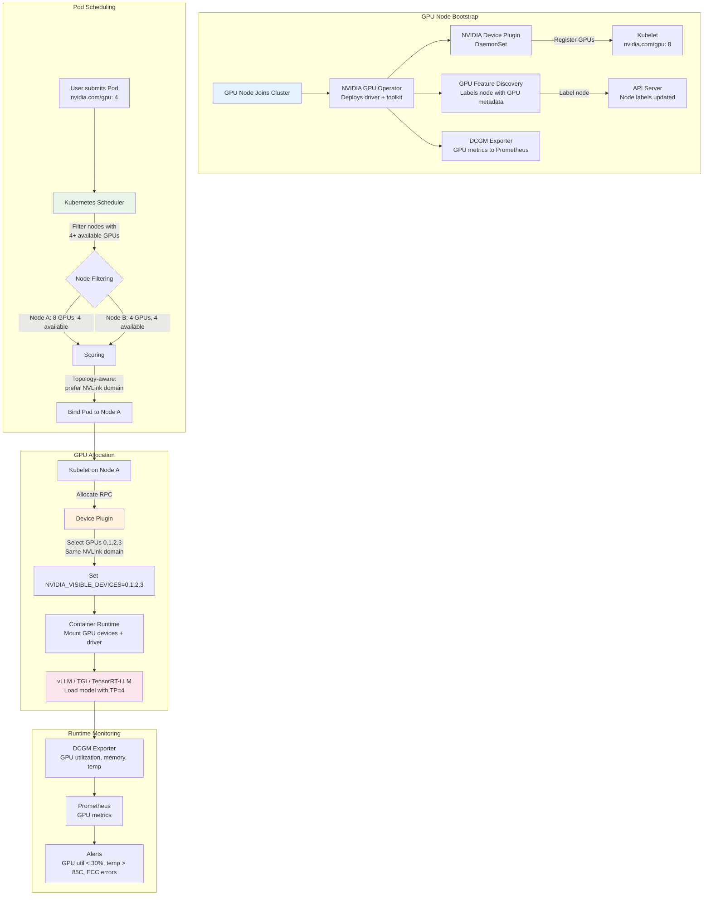

# GPU and Accelerator Workloads

## 1. Overview

GPU workloads on Kubernetes represent the intersection of two complex systems: the Kubernetes resource model (scheduling, placement, quotas) and GPU hardware topology (device plugins, MIG slicing, NVLink interconnects, multi-GPU communication). For GenAI/ML workloads, getting this intersection right is the difference between a vLLM inference server that saturates its H100s at 2,000 tokens/s and one that idles at 30% utilization because of scheduling mistakes, topology-ignorant placement, or slow model loading.

Kubernetes was not originally designed for accelerator workloads. GPUs were added through the device plugin framework (K8s 1.8+), which exposes GPUs as extended resources (`nvidia.com/gpu`). This framework has grown to support MIG (Multi-Instance GPU) slicing, GPU time-sharing, topology-aware scheduling, and multi-GPU Pod placement -- but each capability requires explicit configuration and understanding of the underlying hardware topology.

**Key numbers that frame GPU scheduling decisions:**
- An H100 SXM (80 GB HBM3) costs $2-3/hr on cloud; a 4x H100 node costs $8-12/hr. Idle GPU time is the most expensive waste in ML infrastructure.
- Loading a 70B parameter model (FP16, ~140 GB) from network storage to GPU memory takes 2-5 minutes with standard NFS, 30-60 seconds with NVMe SSD, or 10-15 seconds with pre-cached model weights in local storage.
- MIG slicing divides a single A100/H100 into up to 7 instances, each with isolated memory and compute. A MIG 1g.10gb slice is sufficient for serving a 7B model quantized to INT4 (~4 GB).
- NVLink bandwidth between GPUs in a node (900 GB/s on H100) is 7x faster than PCIe Gen5 (128 GB/s). Tensor parallelism across non-NVLink GPUs incurs a 3-5x latency penalty.
- GPU time-sharing allows multiple Pods to share a single GPU with context switching, but introduces latency variance of 10-50ms per context switch -- unsuitable for latency-sensitive inference.

This file focuses on the Kubernetes-side of GPU workloads: how GPUs are discovered, scheduled, allocated, shared, and managed. For GPU hardware specifications, memory systems, and compute characteristics, see [GPU Compute for LLM Inference](../../genai-system-design/02-llm-architecture/02-gpu-compute.md). For serving framework internals (vLLM, TGI, TensorRT-LLM), see [Model Serving Infrastructure](../../genai-system-design/02-llm-architecture/01-model-serving.md).

## 2. Why It Matters

- **Cost dominance.** GPU compute is typically 70-90% of total inference infrastructure cost. A 10% improvement in GPU utilization through better scheduling saves more money than optimizing all other infrastructure combined. A cluster with 64 H100s running at 50% utilization wastes ~$250K/year at cloud rates.
- **Scheduling complexity.** Unlike CPU and memory (which are fungible), GPUs have topology: NVLink connectivity, PCIe bus affinity, NUMA node alignment. A 4-GPU Pod placed on GPUs connected via NVLink achieves 2-5x better tensor parallelism performance than the same Pod on PCIe-connected GPUs.
- **Model-hardware fit.** A 70B model at FP16 requires ~140 GB -- it does not fit on a single H100 (80 GB). The scheduler must place the Pod on a node with at least 2 GPUs connected via NVLink. A 7B model at INT4 (~4 GB) fits on a MIG 1g.10gb slice -- scheduling it on a full H100 wastes 76 GB of HBM3. Matching model size to GPU allocation is the core scheduling optimization.
- **Startup latency.** LLM serving Pods have long startup times dominated by model loading (downloading weights from object storage and loading into GPU memory). A vLLM Pod serving a 70B model takes 2-5 minutes to start serving traffic. During rolling updates, this startup time determines how long the cluster is at reduced capacity.
- **Multi-tenancy.** Platform teams need to share expensive GPU nodes across teams and workloads. MIG slicing, GPU time-sharing, and Kueue quotas enable multi-tenant GPU sharing without requiring dedicated GPU nodes per team.

## 3. Core Concepts

- **NVIDIA Device Plugin:** A DaemonSet that runs on every GPU node, discovers NVIDIA GPUs, and registers them with the kubelet as extended resources (`nvidia.com/gpu`). The plugin also handles GPU health checks and device allocation. Without the device plugin, Kubernetes has no awareness of GPUs on the node.
- **Extended Resources:** Kubernetes represents GPUs as extended resources (e.g., `nvidia.com/gpu: 1`). These are integer-only, non-overcommittable (you cannot request 0.5 GPUs), and require explicit requests (no default allocation). A Pod requesting `nvidia.com/gpu: 4` is only scheduled on nodes with at least 4 available GPUs.
- **MIG (Multi-Instance GPU):** NVIDIA A100 and H100 GPUs support MIG, which physically partitions a single GPU into up to 7 isolated instances. Each instance has dedicated compute cores, memory, and memory bandwidth. MIG profiles: `1g.5gb`, `1g.10gb`, `2g.10gb`, `3g.20gb`, `4g.20gb`, `7g.40gb` (A100-40GB) or `7g.80gb` (A100-80GB/H100). MIG instances are exposed as separate resources: `nvidia.com/mig-1g.10gb: 1`.
- **GPU Time-Sharing:** Multiple Pods share a single GPU through context switching. Unlike MIG (hardware isolation), time-sharing provides no memory or compute isolation -- Pods compete for GPU resources. Useful for development, testing, and non-latency-sensitive inference workloads. Configured via the NVIDIA GPU Operator's `TimeSlicing` configuration.
- **Topology-Aware Scheduling:** Placing multi-GPU Pods on GPUs that are physically connected via NVLink rather than PCIe. The `TopologyAwareScheduling` feature (via Topology-Aware GPU Allocator or the NVIDIA GPU Operator) ensures that a 4-GPU Pod is placed on 4 GPUs within the same NVLink domain, not scattered across PCIe buses.
- **NVIDIA GPU Operator:** A Kubernetes Operator that automates the management of all NVIDIA software components: device plugin, driver, container toolkit, DCGM (Data Center GPU Manager), MIG manager, and GPU feature discovery. Deploying the GPU Operator is the standard way to enable GPU workloads on K8s.
- **GPU Feature Discovery (GFD):** A component that labels GPU nodes with hardware details: GPU model, driver version, CUDA version, MIG capability, NVLink topology. These labels enable affinity rules that place workloads on specific GPU types.
- **DCGM (Data Center GPU Manager):** NVIDIA's monitoring tool for GPU health and utilization. DCGM Exporter exposes GPU metrics (utilization, memory usage, temperature, power, ECC errors) as Prometheus metrics. Essential for GPU capacity planning and alerting.
- **Tensor Parallelism Placement:** For models too large to fit on a single GPU, tensor parallelism shards the model across multiple GPUs. Each forward pass requires all-reduce communication between GPUs. Placement must ensure GPUs are connected via NVLink (900 GB/s on H100) not PCIe (128 GB/s) to minimize communication latency.
- **Model Loading Patterns:** How model weights are transferred from persistent storage to GPU memory at Pod startup. Options range from downloading from S3 (slow, 2-5 min for 140 GB) to using PersistentVolumes with pre-cached weights (fast, 30-60s) to host-path mounts with node-local NVMe cache (fastest, 10-15s).

## 4. How It Works

### GPU Discovery and Allocation Pipeline

When a GPU-enabled node joins the cluster:

1. **NVIDIA GPU Operator** deploys the NVIDIA driver, container toolkit, and device plugin DaemonSet to the node.
2. **NVIDIA Device Plugin** discovers all GPUs on the node and registers them with the kubelet (e.g., `nvidia.com/gpu: 8` for an 8-GPU node).
3. **GPU Feature Discovery** labels the node with GPU metadata:
   ```
   nvidia.com/gpu.product=NVIDIA-H100-SXM5-80GB
   nvidia.com/gpu.count=8
   nvidia.com/gpu.memory=81920
   nvidia.com/mig.capable=true
   nvidia.com/cuda.driver.major=535
   ```
4. The kubelet reports extended resources to the API server. The node now advertises 8 allocatable GPUs.
5. When a Pod requests `nvidia.com/gpu: 4`, the scheduler finds a node with at least 4 available GPUs and binds the Pod.
6. The kubelet calls the device plugin's `Allocate` RPC, which returns the device IDs and environment variables (`NVIDIA_VISIBLE_DEVICES=0,1,2,3`).
7. The container runtime mounts the NVIDIA driver libraries and device files into the container. The application sees 4 GPUs.

### Basic GPU Pod

```yaml
apiVersion: v1
kind: Pod
metadata:
  name: llm-inference
spec:
  nodeSelector:
    nvidia.com/gpu.product: NVIDIA-H100-SXM5-80GB
  containers:
    - name: vllm
      image: vllm/vllm-openai:v0.5.0
      command:
        - python
        - -m
        - vllm.entrypoints.openai.api_server
        - --model=/models/meta-llama/Llama-3.1-70B-Instruct
        - --tensor-parallel-size=4
        - --dtype=float16
        - --max-model-len=8192
        - --gpu-memory-utilization=0.90
      ports:
        - containerPort: 8000
      resources:
        requests:
          cpu: "8"
          memory: 64Gi
          nvidia.com/gpu: 4
        limits:
          cpu: "16"
          memory: 128Gi
          nvidia.com/gpu: 4    # GPU requests MUST equal limits
      volumeMounts:
        - name: model-cache
          mountPath: /models
        - name: shm
          mountPath: /dev/shm   # Required for NCCL shared memory
      readinessProbe:
        httpGet:
          path: /health
          port: 8000
        initialDelaySeconds: 120   # Model loading takes 2+ minutes
        periodSeconds: 10
  volumes:
    - name: model-cache
      persistentVolumeClaim:
        claimName: model-cache-llama-70b
    - name: shm
      emptyDir:
        medium: Memory
        sizeLimit: 16Gi        # NCCL needs large shared memory
```

**Critical details:**
- `nvidia.com/gpu` requests MUST equal limits. GPUs are non-overcommittable extended resources.
- `/dev/shm` must be mounted with sufficient size for NCCL inter-GPU communication. Default `emptyDir` is 64 KiB, which causes NCCL failures. Use `medium: Memory` with a sizeLimit of at least 1 GiB per GPU.
- `readinessProbe.initialDelaySeconds` must account for model loading time. A 70B model at FP16 takes 2-5 minutes to load from network storage.
- `nodeSelector` ensures the Pod lands on a node with the correct GPU type. H100 and A100 have different memory capacities and compute profiles.

### MIG Configuration for Multi-Tenant GPU Sharing

MIG divides a single physical GPU into isolated instances. Configure via the NVIDIA GPU Operator:

```yaml
# MIG configuration via GPU Operator ConfigMap
apiVersion: v1
kind: ConfigMap
metadata:
  name: mig-config
  namespace: gpu-operator
data:
  config.yaml: |
    version: v1
    mig-configs:
      all-1g.10gb:
        - devices: all
          mig-enabled: true
          mig-devices:
            "1g.10gb": 7        # 7 instances per GPU
      mixed-inference:
        - devices: [0,1,2,3]
          mig-enabled: true
          mig-devices:
            "1g.10gb": 7        # 28 small instances for 7B models
        - devices: [4,5,6,7]
          mig-enabled: false    # 4 full GPUs for 70B model serving
```

**Pods requesting MIG slices:**

```yaml
# Small model inference on a MIG slice
apiVersion: v1
kind: Pod
metadata:
  name: small-model-inference
spec:
  containers:
    - name: tgi
      image: ghcr.io/huggingface/text-generation-inference:2.0
      args:
        - --model-id=meta-llama/Llama-3.1-8B-Instruct
        - --quantize=awq
        - --max-input-tokens=2048
        - --max-total-tokens=4096
      resources:
        requests:
          nvidia.com/mig-1g.10gb: 1    # Request a MIG slice, not a full GPU
        limits:
          nvidia.com/mig-1g.10gb: 1
```

**MIG profile mapping for common models:**

| Model | Quantization | Weight Size | Recommended MIG Profile | GPUs Served per A100-80GB |
|---|---|---|---|---|
| LLaMA 3.1 8B | INT4 (AWQ) | ~4 GB | `1g.10gb` | 7 instances |
| Mistral 7B | FP16 | ~14 GB | `2g.20gb` | 3 instances |
| LLaMA 3.1 8B | FP16 | ~16 GB | `3g.20gb` | 2 instances |
| LLaMA 3.1 70B | INT4 (GPTQ) | ~35 GB | `4g.40gb` (A100-80GB) | 1 instance (+ spare) |
| LLaMA 3.1 70B | FP16 | ~140 GB | Full GPU x2 (no MIG) | Requires 2 GPUs TP=2 |

### GPU Time-Sharing

For development and non-latency-sensitive workloads, time-sharing allows multiple Pods to share a GPU:

```yaml
# GPU Operator TimeSlicing configuration
apiVersion: v1
kind: ConfigMap
metadata:
  name: time-slicing-config
  namespace: gpu-operator
data:
  any: |-
    version: v1
    sharing:
      timeSlicing:
        resources:
          - name: nvidia.com/gpu
            replicas: 4          # Each physical GPU appears as 4 virtual GPUs
```

With `replicas: 4`, an 8-GPU node advertises 32 `nvidia.com/gpu` resources. Each Pod requesting 1 GPU gets a time-sliced share. **Limitations:**
- No memory isolation. All Pods share the GPU's 80 GB HBM. One Pod's large allocation can OOM another.
- Context switch overhead: 10-50ms per switch, adding latency variance.
- Not suitable for production inference or training -- use MIG for isolation.

### Topology-Aware Scheduling

For tensor parallelism, GPUs must be on the same NVLink domain. The Topology-Aware Scheduler assigns GPUs based on their physical connectivity.

```yaml
# Node with topology labels (set by GPU Feature Discovery)
metadata:
  labels:
    nvidia.com/gpu.product: NVIDIA-H100-SXM5-80GB
    nvidia.com/gpu.count: "8"
  annotations:
    # NVLink topology: GPUs 0-3 in one NVSwitch domain, 4-7 in another
    topology.nvidia.com/nvlink-domain-0: "0,1,2,3"
    topology.nvidia.com/nvlink-domain-1: "4,5,6,7"
```

A Pod requesting 4 GPUs for tensor parallelism should be allocated GPUs 0-3 or 4-7 (within one NVLink domain), not GPUs 2-5 (spanning two domains). The NVIDIA GPU Operator's Topology-Aware device plugin handles this allocation.

**Performance impact of topology:**

| Topology | All-Reduce Bandwidth (4 GPUs) | Decode Latency (70B, TP=4) | Use Case |
|---|---|---|---|
| NVLink (same domain) | ~450 GB/s effective | ~15ms/token | Production inference, training |
| PCIe Gen5 (cross-domain) | ~64 GB/s effective | ~45ms/token | Acceptable for batch inference only |
| Cross-node (InfiniBand) | ~50 GB/s (400 Gb/s) | ~60ms/token | Pipeline parallelism (not tensor parallelism) |

### Model Loading Patterns

Model loading dominates Pod startup time for LLM workloads. Several patterns optimize this:

**Pattern 1: PersistentVolumeClaim (PVC) with pre-cached weights**

```yaml
volumes:
  - name: model-cache
    persistentVolumeClaim:
      claimName: llama-70b-fp16    # Pre-populated with model weights
```

A Job downloads the model once to a ReadWriteMany PVC. All inference Pods mount the same PVC. Loading from NFS/EFS: ~60-120s for 140 GB. Loading from high-performance file storage (FSx for Lustre, Weka): ~20-40s.

**Pattern 2: Host-path with node-local NVMe cache**

```yaml
volumes:
  - name: model-cache
    hostPath:
      path: /mnt/nvme/models/llama-70b-fp16
```

A DaemonSet pre-downloads models to local NVMe on GPU nodes. Loading from NVMe: ~10-15s for 140 GB (sequential read at 3.5 GB/s). Fastest option but requires managing cache on each node.

**Pattern 3: Init container download from S3/GCS**

```yaml
initContainers:
  - name: model-download
    image: amazon/aws-cli:2.15
    command: ["aws", "s3", "cp", "s3://models/llama-70b/", "/models/", "--recursive"]
    volumeMounts:
      - name: model-cache
        mountPath: /models
```

Downloads model weights from object storage before the inference container starts. Slowest option: 2-5 minutes for 140 GB over a 10 Gbps network link. Use only when pre-caching is not possible.

**Pattern 4: Model streaming (vLLM tensorizer, TensorRT-LLM engine cache)**

vLLM supports tensorized model loading, which loads model shards directly into GPU memory via tensor-level serialization. This reduces deserialization overhead by 30-50% compared to standard `safetensors` loading.

```yaml
containers:
  - name: vllm
    command:
      - python
      - -m
      - vllm.entrypoints.openai.api_server
      - --model=/models/llama-70b
      - --load-format=tensorizer       # Fast serialized loading
      - --tensor-parallel-size=4
```

**Model loading time comparison:**

| Method | 70B Model (FP16, 140 GB) | 7B Model (INT4, 4 GB) |
|---|---|---|
| S3 download (10 Gbps) | 3-5 min | 5-10 sec |
| NFS / EFS mount | 60-120 sec | 3-5 sec |
| FSx Lustre / Weka | 20-40 sec | 2-3 sec |
| Local NVMe (3.5 GB/s) | 10-15 sec | 1-2 sec |
| Tensorizer (from NVMe) | 7-10 sec | <1 sec |

### vLLM / TGI / TensorRT-LLM on Kubernetes

Production LLM serving typically uses one of three frameworks, each with Kubernetes-specific considerations:

**vLLM (most popular open-source serving framework):**

```yaml
apiVersion: apps/v1
kind: Deployment
metadata:
  name: vllm-llama-70b
spec:
  replicas: 2
  strategy:
    type: Recreate     # Cannot rolling-update GPU workloads without spare GPUs
  selector:
    matchLabels:
      app: vllm-llama-70b
  template:
    metadata:
      labels:
        app: vllm-llama-70b
    spec:
      nodeSelector:
        nvidia.com/gpu.product: NVIDIA-H100-SXM5-80GB
      tolerations:
        - key: nvidia.com/gpu
          operator: Exists
          effect: NoSchedule
      containers:
        - name: vllm
          image: vllm/vllm-openai:v0.5.0
          args:
            - --model=/models/meta-llama/Llama-3.1-70B-Instruct
            - --tensor-parallel-size=4
            - --dtype=auto
            - --max-model-len=8192
            - --gpu-memory-utilization=0.90
            - --enable-prefix-caching
            - --max-num-seqs=256
          ports:
            - containerPort: 8000
              name: http
          resources:
            requests:
              cpu: "8"
              memory: 64Gi
              nvidia.com/gpu: 4
            limits:
              cpu: "16"
              memory: 128Gi
              nvidia.com/gpu: 4
          readinessProbe:
            httpGet:
              path: /health
              port: 8000
            initialDelaySeconds: 180
            periodSeconds: 15
            failureThreshold: 10
          livenessProbe:
            httpGet:
              path: /health
              port: 8000
            initialDelaySeconds: 300
            periodSeconds: 30
            failureThreshold: 5
          volumeMounts:
            - name: model-cache
              mountPath: /models
            - name: shm
              mountPath: /dev/shm
      volumes:
        - name: model-cache
          persistentVolumeClaim:
            claimName: model-cache-llama-70b
        - name: shm
          emptyDir:
            medium: Memory
            sizeLimit: 16Gi
```

**TGI (Hugging Face Text Generation Inference):**

```yaml
containers:
  - name: tgi
    image: ghcr.io/huggingface/text-generation-inference:2.0
    args:
      - --model-id=/models/meta-llama/Llama-3.1-70B-Instruct
      - --num-shard=4
      - --quantize=awq
      - --max-input-tokens=4096
      - --max-total-tokens=8192
      - --max-batch-size=128
    resources:
      requests:
        nvidia.com/gpu: 4
      limits:
        nvidia.com/gpu: 4
```

**TensorRT-LLM (highest throughput, NVIDIA-optimized):**

```yaml
containers:
  - name: trtllm
    image: nvcr.io/nvidia/tritonserver:24.05-trtllm-python-py3
    args:
      - tritonserver
      - --model-repository=/models/llama-70b-trtllm
      - --model-control-mode=explicit
    resources:
      requests:
        nvidia.com/gpu: 4
      limits:
        nvidia.com/gpu: 4
```

**Serving framework comparison on K8s:**

| Feature | vLLM | TGI | TensorRT-LLM |
|---|---|---|---|
| **Throughput (70B, TP=4, H100)** | ~2,000 tok/s | ~1,500 tok/s | ~2,500 tok/s |
| **Startup time** | 2-4 min | 2-4 min | 3-6 min (engine build) |
| **K8s readiness probe** | `/health` | `/health` | Triton health endpoint |
| **Quantization** | AWQ, GPTQ, FP8, INT8 | AWQ, GPTQ, EETQ | FP8, INT8, INT4 (custom) |
| **Prefix caching** | Yes (built-in) | No | Yes |
| **Multi-model** | No (single model per instance) | No | Yes (Triton multi-model) |
| **Community** | Largest, most active | Strong (Hugging Face) | NVIDIA-maintained |

## 5. Architecture / Flow



## 6. Types / Variants

### GPU Sharing Strategies

| Strategy | Isolation | Latency Impact | Max Tenants per GPU | Best For |
|---|---|---|---|---|
| **Exclusive (1 Pod = 1 GPU)** | Full | None | 1 | Production inference, training |
| **MIG (Multi-Instance GPU)** | Hardware (memory + compute) | None (isolated SM partitions) | Up to 7 (A100/H100) | Multi-model inference, small models |
| **Time-sharing** | None (shared memory) | 10-50ms context switch | 4-8 typical | Development, testing, non-latency-sensitive batch |
| **MPS (Multi-Process Service)** | Partial (shared memory, isolated compute) | Minimal (<5ms) | 2-4 typical | Multiple processes from same user |
| **vGPU (NVIDIA GRID)** | Hypervisor-level | Low | 2-16 (model dependent) | Virtualized environments, VDI |

### GPU Node Pool Configurations

| Configuration | Node Type | GPUs per Node | Use Case | Monthly Cost (cloud) |
|---|---|---|---|---|
| **Inference (small models)** | A10G node | 1x A10G (24 GB) | 7B models, single-GPU inference | ~$800/node |
| **Inference (medium models)** | A100-40GB node | 4x A100 (40 GB) | 13B-34B models, TP=2 or TP=4 | ~$6,000/node |
| **Inference (large models)** | H100 SXM node | 8x H100 (80 GB) | 70B+ models, TP=4 or TP=8 | ~$20,000/node |
| **Training (fine-tuning)** | A100-80GB node | 8x A100 (80 GB) | LoRA fine-tuning, small model training | ~$12,000/node |
| **Training (large-scale)** | H100 SXM node + InfiniBand | 8x H100 (80 GB) | Multi-node distributed training | ~$25,000/node |

### Multi-GPU Placement Strategies for LLM Serving

| Model Size | Quantization | GPU Memory Needed | Tensor Parallelism | GPU Requirement | Scheduling Constraint |
|---|---|---|---|---|---|
| 7B | FP16 | ~14 GB | 1 (single GPU) | 1x A10G or MIG 2g.20gb | None |
| 7B | INT4 | ~4 GB | 1 (single GPU) | 1x MIG 1g.10gb | MIG-enabled node |
| 13B | FP16 | ~26 GB | 1 (single GPU) | 1x A100-40GB | nodeSelector for A100+ |
| 34B | FP16 | ~68 GB | 2 | 2x A100-40GB (NVLink) | Topology-aware allocation |
| 70B | FP16 | ~140 GB | 4 | 4x A100-40GB or 2x H100 | NVLink domain placement |
| 70B | INT4 (GPTQ) | ~35 GB | 1 | 1x A100-80GB | nodeSelector for 80GB+ |
| 70B | FP8 | ~70 GB | 1 | 1x H100-80GB | nodeSelector for H100 |
| 405B | FP8 | ~200 GB | 8 | 8x H100 (full node) | Entire node allocation |

## 7. Use Cases

- **Multi-model inference platform with MIG.** A platform team serves 20 different models (7B-13B parameters) on a cluster of 8 A100-80GB nodes. Each A100 is partitioned into MIG slices: models under 10 GB get `1g.10gb` slices, models under 20 GB get `2g.20gb` slices. A single 8-GPU node serves 30+ model instances. GPU utilization improved from 25% (one model per GPU, mostly idle) to 78% after MIG adoption. Total inference cost reduced by 65%.
- **vLLM serving LLaMA 3.1 70B.** A startup serves LLaMA 3.1 70B-Instruct using vLLM with `tensor-parallel-size=4` on H100 SXM nodes. Each Pod requests 4 H100 GPUs. The Deployment uses `strategy: Recreate` because rolling updates require spare GPU capacity. Model loading time with PVC-cached weights: 45 seconds. The readiness probe's `initialDelaySeconds: 90` ensures traffic is not routed until the model is fully loaded. Throughput: ~2,000 output tokens/s per Pod.
- **GPU time-sharing for development.** An ML team of 15 engineers shares 4 A100-40GB GPUs for development. Time-sharing with `replicas: 4` makes each physical GPU appear as 4 logical GPUs, giving the team 16 virtual GPUs. Each engineer gets one virtual GPU for interactive development (Jupyter notebooks, small model experiments). Production inference uses dedicated MIG slices on separate nodes.
- **Distributed training with Volcano gang scheduling.** A research team trains a 13B model on 16 A100 GPUs (2 nodes, 8 GPUs each). Volcano ensures all 16 GPUs are allocated atomically -- if only 1 node is available, the job waits rather than partially starting. NCCL communication uses InfiniBand between nodes and NVLink within nodes. Training throughput: ~3,500 tokens/s per GPU. See [Jobs and Batch Processing](./04-jobs-and-batch-processing.md) for Volcano configuration.
- **Model loading optimization with local NVMe cache.** A team reduced vLLM Pod startup time from 4 minutes (S3 download) to 12 seconds (local NVMe) by deploying a DaemonSet that pre-caches model weights on each GPU node's NVMe SSD. The DaemonSet watches a ConfigMap listing active models and downloads new models in the background. During rolling updates, the new Pod starts in 12 seconds instead of 4 minutes, reducing the window of reduced capacity by 97%.

## 8. Tradeoffs

| Decision | Option A | Option B | Guidance |
|---|---|---|---|
| **MIG vs time-sharing** | MIG: Hardware isolation, no latency impact, limited profiles | Time-sharing: Flexible, no profile constraints, latency variance | MIG for production inference; time-sharing for dev/test |
| **Exclusive GPU vs MIG for small models** | Exclusive: Full GPU, simple, wasteful for small models | MIG: Efficient, shared GPU, limited profile sizes | MIG when model fits in a slice; exclusive when model needs >50% of GPU memory |
| **Pre-cached models vs download-on-start** | Pre-cache: Fast startup (10-60s), requires DaemonSet and storage | Download: Simple, slow startup (2-5 min), no pre-staging | Pre-cache for production (startup time matters); download for dev/test |
| **Recreate vs rolling update for GPU Deployments** | Recreate: Brief downtime, no spare GPU needed | Rolling: Zero downtime, requires maxSurge GPUs | Recreate when GPUs are scarce; rolling when spare GPU capacity exists |
| **vLLM vs TensorRT-LLM** | vLLM: Easy deployment, large community, good performance | TensorRT-LLM: Highest throughput, complex engine build step | vLLM for fast iteration and broad model support; TensorRT-LLM for maximum throughput on NVIDIA hardware |
| **Single large Pod vs multiple small Pods** | Large Pod (TP=4, 4 GPUs): Serves large models, fewer Pods | Small Pods (TP=1, 1 GPU each): More replicas, better fault isolation | Large Pods for 70B+ models; small Pods for 7B-13B models |

## 9. Common Pitfalls

- **Missing `/dev/shm` mount.** NCCL (used for tensor parallelism communication) requires shared memory. The default Pod `shm` size is 64 KiB, causing NCCL to fail silently or fall back to socket communication (100x slower). Always mount an `emptyDir` with `medium: Memory` at `/dev/shm` with at least 1 GiB per GPU.
- **Not setting `readinessProbe.initialDelaySeconds` for LLM Pods.** A 70B model takes 2-5 minutes to load. Without an adequate initial delay, the readiness probe fails, the kubelet restarts the Pod, and the model loading restarts -- creating an infinite restart loop. Set `initialDelaySeconds` to at least 1.5x the expected model loading time.
- **Scheduling multi-GPU Pods on PCIe-connected GPUs.** Without topology-aware scheduling, the device plugin may allocate GPUs across PCIe buses rather than within an NVLink domain. Tensor parallelism performance drops 3-5x. Deploy the NVIDIA GPU Operator with topology-aware allocation enabled.
- **Running out of GPU memory at runtime.** `nvidia.com/gpu: 4` allocates 4 GPUs but does not reserve GPU memory. If the model and KV cache exceed available HBM, the serving framework OOMs. Set `--gpu-memory-utilization=0.90` in vLLM (leaving 10% for CUDA context and fragmentation) and validate memory usage at maximum batch size.
- **Ignoring GPU health monitoring.** GPUs can develop ECC (Error-Correcting Code) memory errors that degrade performance or cause silent data corruption. Deploy DCGM Exporter and alert on `DCGM_FI_DEV_ECC_DBE_VOL_TOTAL > 0` (double-bit ECC errors). A GPU with uncorrectable ECC errors should be drained and replaced.
- **Not tainting GPU nodes.** Without taints, the scheduler places non-GPU workloads on expensive GPU nodes. Apply `nvidia.com/gpu=present:NoSchedule` to GPU nodes and add matching tolerations to GPU Pods. This ensures only GPU workloads run on GPU nodes.
- **Using Deployment rolling updates without spare GPU capacity.** A rolling update with `maxSurge=1` on a 4-GPU-per-Pod Deployment requires 4 spare GPUs during rollout. If the cluster has no spare GPUs, the new Pod stays Pending and the rollout stalls at `progressDeadlineSeconds`. Use `strategy: Recreate` or ensure spare GPU capacity exists.
- **Forgetting to set CPU and memory requests alongside GPU requests.** LLM serving frameworks need substantial CPU (for tokenization, scheduling) and memory (for KV cache overflow, CUDA context). A Pod with 4 GPUs but no CPU request may be scheduled on a CPU-starved node, bottlenecking tokenization throughput.

## 10. Real-World Examples

- **Anyscale (vLLM on K8s at scale).** Anyscale, the company behind Ray and original developers of vLLM, runs vLLM inference on Kubernetes with KubeRay. They serve models from 7B to 70B parameters across mixed GPU fleets (A100, H100). MIG slicing is used for small models (7B-8B); full H100 nodes are used for 70B models with TP=4. Model weights are cached on local NVMe SSDs, achieving 15-second startup times for 70B models. Their platform serves 10,000+ requests/second across multiple model endpoints.
- **CoreWeave (GPU cloud on K8s).** CoreWeave, a GPU-specialized cloud provider, runs their entire infrastructure on Kubernetes. Every GPU node (A100, H100, A40) is managed by the NVIDIA GPU Operator with MIG support. They use custom scheduling plugins for topology-aware GPU placement, ensuring multi-GPU Pods are allocated within NVLink domains. Their inference platform supports thousands of tenants sharing GPU resources via MIG and Kueue quotas.
- **Bloomberg (ML training on K8s with Volcano).** Bloomberg uses Kubernetes with Volcano for distributed ML training on their financial data. Training Jobs use gang scheduling to allocate multi-node GPU groups atomically. Kueue manages quotas across ML research teams. They achieved 92% GPU utilization on their training cluster by combining gang scheduling (eliminates partial allocation waste) with preemption (lower-priority experiments yield to production training).
- **Hugging Face (TGI on K8s).** Hugging Face runs their Inference Endpoints service on Kubernetes, deploying TGI instances as Deployments. Each endpoint is a separate Deployment with GPU-specific nodeSelectors. They use PVC-cached model weights for fast startup and autoscale GPU Deployments based on request queue depth (custom HPA metric from TGI's `/metrics` endpoint). Small models (7B) run on A10G nodes; large models (70B) run on A100-80GB nodes with TP=2.

## 11. Related Concepts

- [GPU Compute for LLM Inference](../../genai-system-design/02-llm-architecture/02-gpu-compute.md) -- GPU hardware specifications (H100, A100, B200), memory bandwidth, tensor cores, NVLink topology, cost models
- [Model Serving Infrastructure](../../genai-system-design/02-llm-architecture/01-model-serving.md) -- vLLM, TGI, TensorRT-LLM internals: continuous batching, PagedAttention, KV cache management, prefill/decode phases
- [Pod Design Patterns](./01-pod-design-patterns.md) -- init containers for model downloading, sidecar patterns for GPU metrics
- [Jobs and Batch Processing](./04-jobs-and-batch-processing.md) -- Volcano and Kueue for GPU job scheduling, gang scheduling for distributed training
- [Deployment Strategies](./02-deployment-strategies.md) -- Recreate vs rolling update for GPU Deployments
- [Autoscaling](../../traditional-system-design/02-scalability/02-autoscaling.md) -- GPU-aware autoscaling: custom metrics (queue depth, GPU utilization), cluster autoscaler for GPU node pools

## 12. Source Traceability

- docs/genai-system-design/02-llm-architecture/02-gpu-compute.md -- H100/A100 specifications, NVLink bandwidth (900 GB/s), tensor core FLOPS, GPU memory hierarchy, cost models
- docs/genai-system-design/02-llm-architecture/01-model-serving.md -- vLLM continuous batching, PagedAttention, serving framework comparison, prefill/decode phases
- NVIDIA GPU Operator documentation -- Device plugin, MIG manager, GPU Feature Discovery, DCGM Exporter, time-sharing configuration
- Kubernetes documentation -- Extended resources, device plugin framework, topology manager
- Volcano documentation -- Gang scheduling for multi-GPU training, queue management
- Kueue documentation -- ClusterQueue with GPU ResourceFlavors, multi-tenant GPU quota management
- Production patterns -- Anyscale vLLM, CoreWeave GPU cloud, Bloomberg ML training, Hugging Face Inference Endpoints
