# Service Networking

## 1. Overview

Kubernetes service networking is the abstraction layer that gives pods a stable identity for communication. Pods are ephemeral — they get new IP addresses every time they restart — so Kubernetes introduces the Service object as a persistent virtual endpoint backed by a set of pods selected via labels. The kube-proxy component on every node programs the kernel's networking stack (iptables, IPVS, or eBPF) to intercept traffic destined for a Service's ClusterIP and forward it to a healthy pod.

Service networking also extends beyond the cluster boundary. NodePort exposes services on every node's IP, LoadBalancer integrates with cloud provider APIs to provision external load balancers, and ExternalName maps a service to a DNS CNAME for off-cluster resources. Endpoint slices track which pods back a service, enabling efficient updates in clusters with thousands of endpoints.

For GenAI workloads, service networking takes on additional complexity: inference requests must be routed to the correct model version, GPU-backed pods have heterogeneous capacity, and request-level load balancing (not connection-level) is essential for long-lived gRPC streams used by model serving frameworks.

## 2. Why It Matters

- **Stable addressing in an unstable world.** Pods come and go; services provide a fixed ClusterIP that survives pod rescheduling, scaling events, and rolling updates.
- **Decouples producers and consumers.** Application code references a service name (e.g., `payment-service.default.svc.cluster.local`), never a pod IP. This is the foundation of microservices on Kubernetes.
- **Enables horizontal scaling.** Adding replicas to a deployment automatically adds endpoints to the backing service — no configuration change required.
- **Foundation for advanced routing.** Service mesh, ingress controllers, and Gateway API all build on top of the service abstraction.
- **Cloud-native load balancing.** kube-proxy provides free, built-in L4 load balancing across all pods in a service, with no additional infrastructure.
- **GenAI model serving.** Inference gateways route requests to different model versions/sizes, requiring service networking that understands request-level semantics, not just TCP connections.

## 3. Core Concepts

- **ClusterIP:** A virtual IP address allocated from the cluster's service CIDR range. Reachable only from within the cluster. This is the default service type and the building block for all other types.
- **NodePort:** Extends ClusterIP by opening a static port (30000-32767) on every node in the cluster. External traffic to `<NodeIP>:<NodePort>` is forwarded to the service.
- **LoadBalancer:** Extends NodePort by requesting a cloud provider load balancer (AWS NLB/ALB, GCP ILB, Azure LB) that routes external traffic to the NodePort.
- **ExternalName:** A special service type that returns a CNAME record instead of a ClusterIP. Used to reference external services (e.g., a managed database) via the Kubernetes service discovery mechanism.
- **Headless Service:** A service with `clusterIP: None`. Instead of a virtual IP, DNS returns the pod IPs directly. Essential for StatefulSets where clients need to address specific pods (e.g., database replicas).
- **Endpoint Slices:** The successor to the Endpoints API. Each EndpointSlice holds up to 100 endpoints, enabling efficient incremental updates. Critical for services with thousands of pods — a single Endpoints object could become too large (etcd 1.5 MB object size limit).
- **kube-proxy:** A DaemonSet (or node-level process) that watches Service and EndpointSlice objects, then programs the data plane (iptables rules, IPVS tables, or eBPF maps) on each node.
- **Service CIDR:** The IP range from which ClusterIPs are allocated. Configured at cluster creation (e.g., `10.96.0.0/12`). Must not overlap with pod CIDR or node network.
- **Session Affinity:** `service.spec.sessionAffinity: ClientIP` ensures requests from the same client IP reach the same pod. Timeout is configurable (default 10800 seconds / 3 hours).

## 4. How It Works

### Service Creation and Endpoint Discovery

1. A user creates a Service object with a label selector (e.g., `app: frontend`).
2. The control plane allocates a ClusterIP from the service CIDR.
3. The EndpointSlice controller watches for pods matching the selector and creates EndpointSlice objects containing the pod IPs and ports.
4. kube-proxy on every node watches Service and EndpointSlice objects and programs forwarding rules.

### kube-proxy Modes

**iptables mode (default):**
- Creates one iptables rule per service and one rule per endpoint.
- Uses the `statistic` module with `--probability` for random load balancing across endpoints.
- O(n) rule evaluation — performance degrades with thousands of services.
- Connection tracking (conntrack) enables session affinity and return traffic routing.
- Rule updates require rewriting the entire iptables chain for the affected service.

**IPVS mode:**
- Uses Linux IPVS (IP Virtual Server) kernel module, purpose-built for load balancing.
- O(1) connection processing regardless of number of services/endpoints.
- Supports multiple load balancing algorithms: round-robin, least connections, destination hashing, source hashing, shortest expected delay, never queue.
- Enables graceful connection draining during endpoint changes.
- Requires IPVS kernel modules (`ip_vs`, `ip_vs_rr`, `ip_vs_wrr`, `ip_vs_sh`).
- Benchmark: handles 10,000+ services with minimal latency overhead (sub-millisecond per connection decision), versus iptables which shows measurable latency increase above 5,000 services.

**eBPF mode (Cilium):**
- Replaces kube-proxy entirely — Cilium's eBPF programs are loaded directly into the kernel.
- Socket-level load balancing: connects the client socket directly to the server pod, bypassing iptables and conntrack entirely.
- O(1) lookup using eBPF hash maps.
- Supports Direct Server Return (DSR) — reply packets go directly from the server pod to the client, bypassing the node that received the original request. Reduces latency and node bandwidth.
- Benchmark: Cilium eBPF achieves up to 40% lower latency and 30% higher throughput compared to iptables mode for service routing at scale (Cilium 1.12+ benchmarks).

### Traffic Flow for Each Service Type

**ClusterIP flow:**
```
Pod A → kube-proxy rules on Node A → DNAT to Pod B IP → CNI routes packet to Pod B's node → Pod B
```

**NodePort flow:**
```
External Client → Node IP:30080 → kube-proxy DNAT → Pod IP:8080 → Pod
```
Note: By default, the source IP is SNATed (masqueraded), which means the pod sees the node's IP as the source. Setting `externalTrafficPolicy: Local` preserves the client IP but only routes to pods on the receiving node (potential imbalance).

**LoadBalancer flow:**
```
External Client → Cloud LB → Node IP:NodePort → kube-proxy DNAT → Pod IP:8080 → Pod
```
With `externalTrafficPolicy: Local`, the cloud LB health-checks each node and only sends traffic to nodes that have backing pods, preserving client IP and avoiding extra hops.

### Endpoint Slices at Scale

In a cluster with 10,000 pods backing a single service:
- **Old Endpoints API:** One 1.5+ MB Endpoints object, updated on every pod change, replicated to every node. A single pod restart triggers a full object sync to all nodes.
- **EndpointSlice API:** 100 EndpointSlice objects (100 endpoints each). A pod restart only triggers an update to one slice, reducing API server load by ~100x.

### Inference Gateway Routing for GenAI Model Serving

GenAI workloads require intelligent request routing that goes beyond traditional L4 load balancing:

**The Problem:**
- Model serving pods (e.g., vLLM, TGI, Triton) serve different model versions (GPT-4o-mini, GPT-4o, custom fine-tuned).
- Pods have heterogeneous GPU capacity (A100 40GB vs A100 80GB vs H100).
- gRPC/HTTP2 connections are long-lived — L4 load balancing pins all requests to a single pod.
- Batch inference needs queue-aware routing — send to the pod with the shortest queue, not fewest connections.

**Solution Patterns:**

1. **Gateway API + HTTPRoute with header-based routing:**
   ```yaml
   apiVersion: gateway.networking.k8s.io/v1
   kind: HTTPRoute
   metadata:
     name: model-router
   spec:
     parentRefs:
     - name: inference-gateway
     rules:
     - matches:
       - headers:
         - name: x-model-version
           value: "gpt-4o-mini"
       backendRefs:
       - name: model-gpt4o-mini
         port: 8080
     - matches:
       - headers:
         - name: x-model-version
           value: "gpt-4o"
       backendRefs:
       - name: model-gpt4o
         port: 8080
   ```

2. **Istio VirtualService with traffic splitting for canary model rollout:**
   ```yaml
   apiVersion: networking.istio.io/v1beta1
   kind: VirtualService
   metadata:
     name: llm-inference
   spec:
     hosts:
     - llm-service
     http:
     - route:
       - destination:
           host: llm-service
           subset: v1-llama-70b
         weight: 90
       - destination:
           host: llm-service
           subset: v2-llama-70b-tuned
         weight: 10
   ```

3. **Custom Inference Gateway (e.g., KServe InferenceService, KubeAI):**
   - Request-level load balancing for gRPC streams.
   - Queue depth-aware routing: the gateway queries each model server's pending request count and routes to the least-loaded server.
   - Prefix cache-aware routing: routes requests sharing common prompt prefixes to the same server to maximize KV cache hits.
   - Auto-scaling integration: the gateway signals the HPA to scale up when queue depth exceeds threshold.

4. **Kubernetes Gateway API Inference Extension (emerging standard):**
   - A new upstream project extending Gateway API specifically for AI inference workloads.
   - Defines `InferencePool` and `InferenceModel` CRDs for model-aware routing.
   - Supports request-level load balancing, model version selection, and LoRA adapter routing.
   - Integrates with endpoint pickers that can route based on GPU utilization and KV cache pressure.

### Service YAML Examples

**ClusterIP Service (default):**
```yaml
apiVersion: v1
kind: Service
metadata:
  name: payment-service
  namespace: production
spec:
  type: ClusterIP  # Default, can be omitted
  selector:
    app: payment
    version: v2
  ports:
  - name: http
    port: 80          # Port exposed on the ClusterIP
    targetPort: 8080   # Port on the pod
    protocol: TCP
  - name: grpc
    port: 9090
    targetPort: 9090
    protocol: TCP
```

**NodePort Service:**
```yaml
apiVersion: v1
kind: Service
metadata:
  name: web-frontend
  namespace: production
spec:
  type: NodePort
  selector:
    app: frontend
  ports:
  - port: 80
    targetPort: 3000
    nodePort: 30080  # Optional: auto-assigned if omitted (30000-32767)
  externalTrafficPolicy: Local  # Preserve client IP
```

**LoadBalancer Service (AWS NLB):**
```yaml
apiVersion: v1
kind: Service
metadata:
  name: api-gateway
  namespace: production
  annotations:
    service.beta.kubernetes.io/aws-load-balancer-type: "nlb"
    service.beta.kubernetes.io/aws-load-balancer-scheme: "internet-facing"
    service.beta.kubernetes.io/aws-load-balancer-cross-zone-load-balancing-enabled: "true"
spec:
  type: LoadBalancer
  selector:
    app: api-gateway
  ports:
  - port: 443
    targetPort: 8443
    protocol: TCP
  externalTrafficPolicy: Local
  loadBalancerSourceRanges:
  - 203.0.113.0/24  # Restrict source IPs
```

**Headless Service for StatefulSet:**
```yaml
apiVersion: v1
kind: Service
metadata:
  name: kafka-headless
  namespace: data
spec:
  clusterIP: None  # Headless
  selector:
    app: kafka
  ports:
  - name: tcp-client
    port: 9092
  - name: tcp-internal
    port: 9093
  publishNotReadyAddresses: true  # Required for peer discovery during bootstrap
```

**ExternalName Service:**
```yaml
apiVersion: v1
kind: Service
metadata:
  name: external-database
  namespace: production
spec:
  type: ExternalName
  externalName: mydb.abc123.us-east-1.rds.amazonaws.com
  # No selector, no ClusterIP
  # DNS query for external-database.production.svc.cluster.local
  # returns CNAME → mydb.abc123.us-east-1.rds.amazonaws.com
```

### Multi-Cluster Service Networking

For organizations running workloads across multiple Kubernetes clusters, several patterns extend service networking:

**Kubernetes Multi-Cluster Services (MCS) API:**
- A KEP (Kubernetes Enhancement Proposal) defining `ServiceExport` and `ServiceImport` resources.
- A service exported in cluster A becomes importable (discoverable) in cluster B.
- DNS name format: `<service>.<namespace>.svc.clusterset.local`.
- Implementations: GKE multi-cluster services, Submariner, Cilium ClusterMesh.

**Cilium ClusterMesh:**
- Connects multiple Cilium-managed clusters via an encrypted tunnel mesh.
- Global services: a service defined in multiple clusters is load-balanced across all clusters.
- Pod-to-pod connectivity: pods in cluster A can directly reach pods in cluster B by IP.
- Shared identity: network policies and service mesh features work across clusters.
- Requires non-overlapping pod CIDRs between clusters.

**Istio Multi-Cluster:**
- Multi-primary: each cluster has its own istiod control plane, connected via a shared root CA.
- Primary-remote: one cluster runs istiod, remote clusters connect to it.
- Cross-cluster service discovery and mTLS-secured communication.
- Locality-aware load balancing: prefer local cluster, failover to remote cluster.

## 5. Architecture / Flow

```mermaid
flowchart TD
    subgraph "Service Types - Traffic Flow"
        direction TB

        subgraph "ClusterIP (Internal Only)"
            PodA[Pod A<br/>10.244.1.5] -->|"dst: 10.96.0.10:80"| KP1[kube-proxy<br/>on Node A]
            KP1 -->|"DNAT → 10.244.2.8:8080"| PodB[Pod B<br/>10.244.2.8]
        end

        subgraph "NodePort (Cluster + External)"
            ExtClient1[External Client] -->|"dst: NodeIP:30080"| Node1[Node 1<br/>192.168.1.10]
            Node1 --> KP2[kube-proxy]
            KP2 -->|"DNAT → Pod IP:8080"| PodC[Pod C]
            KP2 -->|"DNAT → Pod IP:8080"| PodD[Pod D]
        end

        subgraph "LoadBalancer (Cloud-integrated)"
            ExtClient2[External Client] -->|"dst: LB Public IP"| CLB[Cloud Load Balancer<br/>AWS NLB / GCP ILB]
            CLB -->|"Health check"| Node2[Node 2]
            CLB -->|"Health check"| Node3[Node 3]
            Node2 --> KP3[kube-proxy]
            Node3 --> KP4[kube-proxy]
            KP3 --> PodE[Pod E]
            KP4 --> PodF[Pod F]
        end
    end

    subgraph "kube-proxy Modes"
        direction LR
        IPT[iptables Mode<br/>O-n rule eval<br/>Random probability LB<br/>Default mode]
        IPVS_M[IPVS Mode<br/>O-1 connection routing<br/>Multiple LB algorithms<br/>Graceful drain]
        EBPF[eBPF / Cilium<br/>O-1 hash map lookup<br/>Socket-level LB<br/>Direct Server Return]
    end

    style CLB fill:#e3f2fd
    style KP1 fill:#fff3e0
    style KP2 fill:#fff3e0
    style KP3 fill:#fff3e0
    style KP4 fill:#fff3e0
    style IPT fill:#ffebee
    style IPVS_M fill:#e8f5e9
    style EBPF fill:#e8eaf6
```



## 6. Types / Variants

### Service Types Comparison

| Service Type | Scope | Use Case | Client IP Preserved | Cloud Integration |
|---|---|---|---|---|
| **ClusterIP** | Internal only | Service-to-service communication | Yes (always) | None |
| **NodePort** | Internal + external | Dev/test, bare metal clusters | Only with `externalTrafficPolicy: Local` | None |
| **LoadBalancer** | Internal + external | Production external traffic | With `externalTrafficPolicy: Local` | Yes (cloud LB provisioned) |
| **ExternalName** | Internal only (DNS) | Referencing external services | N/A | None |
| **Headless** | Internal only (DNS) | StatefulSets, peer discovery | Yes (direct pod IP) | None |

### kube-proxy Mode Comparison

| Feature | iptables | IPVS | eBPF (Cilium) |
|---|---|---|---|
| **Performance at scale** | Degrades above 5K services | Stable at 10K+ services | Stable at 10K+ services |
| **LB algorithms** | Random only | Round-robin, least-conn, source hash, etc. | Round-robin, Maglev, random |
| **Connection draining** | No | Yes | Yes |
| **Direct Server Return** | No | No | Yes |
| **Kernel dependency** | iptables (netfilter) | IPVS kernel modules | eBPF (kernel 4.19+) |
| **Observability** | Limited (`iptables -L`) | `ipvsadm` stats | Rich Hubble flow logs |
| **Session affinity** | conntrack-based | IPVS persistence | eBPF socket-level |
| **Replaces kube-proxy** | No (is kube-proxy) | No (is kube-proxy) | Yes (kube-proxy removed) |

### ExternalTrafficPolicy

| Policy | Behavior | Client IP | Load Distribution |
|---|---|---|---|
| **Cluster** (default) | Traffic can hop between nodes to reach any pod | Lost (SNAT) | Even across all pods |
| **Local** | Traffic only goes to pods on the receiving node | Preserved | Uneven — depends on pod distribution per node |

### InternalTrafficPolicy (Kubernetes 1.26+)

| Policy | Behavior | Use Case |
|---|---|---|
| **Cluster** (default) | Route to any pod in the cluster | Normal service communication |
| **Local** | Only route to pods on the same node | Reduce cross-node traffic, DaemonSet services |

## 7. Use Cases

- **Microservice communication:** ClusterIP services provide stable endpoints for service-to-service calls. A payment service calls an order service via `order-service.production.svc.cluster.local:8080`.
- **External API exposure:** LoadBalancer service type provisions a cloud load balancer. At Shopify, each tenant-facing service gets its own LoadBalancer, with AWS NLB for TCP and ALB for HTTP.
- **Database discovery:** Headless services enable StatefulSet pods to be individually addressed. A PostgreSQL primary at `postgres-0.postgres-headless.db.svc.cluster.local` is distinct from replica `postgres-1.postgres-headless.db.svc.cluster.local`.
- **Bare-metal ingress:** On bare metal (no cloud LB), MetalLB implements the LoadBalancer type using ARP (Layer 2) or BGP (Layer 3) to advertise external IPs.
- **Multi-cluster service mesh:** Cilium ClusterMesh extends service networking across clusters, allowing a service in cluster A to discover and load-balance to pods in cluster B.
- **GenAI inference routing:** An inference gateway routes `/v1/completions` requests to different model deployments based on the `x-model-id` header, using Gateway API HTTPRoute or Istio VirtualService for traffic splitting during model A/B testing.

## 8. Tradeoffs

| Decision | Option A | Option B | Guidance |
|---|---|---|---|
| **iptables vs IPVS** | iptables: simpler, default, no extra modules | IPVS: faster at scale, more algorithms | Use IPVS for clusters with >1,000 services; iptables fine for smaller clusters |
| **iptables vs eBPF** | iptables: universal, stable, well-understood | eBPF: highest performance, best observability | eBPF if running Cilium CNI; otherwise iptables/IPVS |
| **externalTrafficPolicy: Cluster vs Local** | Cluster: even distribution, loses client IP | Local: preserves client IP, uneven distribution | Use Local when client IP matters (geo-routing, rate limiting, audit logs) |
| **LoadBalancer vs Ingress** | LB per service: simple, one LB per service | Ingress: single LB, path-based routing | Ingress for HTTP; LoadBalancer for non-HTTP protocols (TCP/UDP) |
| **Headless vs ClusterIP** | Headless: clients see all pod IPs, client-side LB | ClusterIP: stable VIP, kube-proxy LB | Headless for StatefulSets; ClusterIP for stateless services |
| **Endpoint Slices vs Endpoints** | Endpoints: legacy, single object | EndpointSlices: scalable, incremental updates | Always use EndpointSlices (default since Kubernetes 1.21) |

## 9. Common Pitfalls

- **SNAT surprises with NodePort/LoadBalancer.** By default, `externalTrafficPolicy: Cluster` masquerades the client IP. Application-level rate limiting, geolocation, and audit logging all break because every request appears to come from a node IP. The fix is `externalTrafficPolicy: Local`, but this requires understanding that traffic only reaches pods on the receiving node.
- **gRPC load balancing failure.** gRPC uses HTTP/2 with multiplexed streams over a single TCP connection. ClusterIP with iptables does L4 load balancing — once the connection is established, all requests go to one pod. Solutions: use a service mesh (Istio, Linkerd) or L7-aware load balancer (Envoy) for request-level balancing.
- **Stale endpoints during rolling updates.** A pod in `Terminating` state may still receive traffic if the EndpointSlice update hasn't propagated. Use `terminationGracePeriodSeconds` and preStop hooks to drain connections before the pod shuts down.
- **Service CIDR exhaustion.** A `/16` service CIDR gives ~65,000 ClusterIPs. In large multi-tenant clusters, this can be exhausted. Plan CIDR allocation at cluster creation time — it cannot be changed later without cluster recreation.
- **NodePort range conflicts.** The 30000-32767 range is limited. Each NodePort service consumes one port from this range. In clusters with hundreds of services, prefer Ingress/Gateway API over individual NodePort services.
- **DNS resolution latency.** The default `ndots: 5` in pod DNS configuration causes excessive DNS lookups for external domains. See [DNS and Service Discovery](./04-dns-and-service-discovery.md) for tuning.
- **Forgetting `publishNotReadyAddresses` for StatefulSets.** Peer discovery during bootstrap requires pods to find each other before they pass readiness probes. Set this on headless services for databases and distributed systems.

### Service Topology Awareness (Kubernetes 1.21+ / Topology Aware Hints)

Topology Aware Hints (replacing the deprecated TopologyKeys feature) allow kube-proxy to prefer routing traffic to endpoints in the same zone as the client pod. This reduces cross-zone data transfer costs (significant on cloud providers — AWS charges $0.01/GB for cross-AZ traffic) and latency.

**How it works:**
1. The EndpointSlice controller annotates endpoints with `topology.kubernetes.io/zone` hints.
2. kube-proxy on each node reads these hints and preferentially routes to same-zone endpoints.
3. If same-zone endpoints are insufficient (overloaded or unhealthy), traffic spills to other zones.

**Enabling:**
```yaml
apiVersion: v1
kind: Service
metadata:
  name: backend-service
  annotations:
    service.kubernetes.io/topology-mode: Auto
spec:
  selector:
    app: backend
  ports:
  - port: 8080
```

**Limitations:** Requires reasonably balanced pod distribution across zones. If all pods are in zone A and the service annotation is set, pods in zones B and C may have no local endpoints and fall back to cross-zone routing.

## 10. Real-World Examples

- **Spotify (10,000+ services, eBPF):** Migrated from iptables to Cilium eBPF mode. Measured 35% reduction in P99 service-to-service latency and eliminated kube-proxy-related CPU spikes during endpoint updates on large clusters (2,000+ nodes).
- **Alibaba Cloud (IPVS at scale):** Runs IPVS mode on clusters with 10,000+ services. IPVS's O(1) connection routing keeps tail latency stable even as service count grows, whereas their iptables clusters showed P99 latency increasing linearly beyond 5,000 services.
- **Datadog (MetalLB on bare metal):** Uses MetalLB with BGP mode to implement LoadBalancer services on bare-metal clusters. BGP advertisements allow ECMP (Equal-Cost Multi-Path) routing for high availability without cloud provider dependency.
- **Airbnb (Envoy for gRPC):** Replaced ClusterIP-based load balancing with Envoy sidecar proxies to achieve request-level gRPC load balancing. Without this, gRPC connections were pinned to single pods, causing hotspots during traffic spikes.
- **Anyscale (inference gateway routing):** Routes inference requests to Ray Serve model deployments using custom header-based routing. Requests with `x-model: llama-70b` go to A100 80GB pods; `x-model: llama-7b` goes to A10G pods. Queue depth-aware routing prevents any single model server from being overwhelmed.

## 11. Related Concepts

- [Load Balancing](../../traditional-system-design/02-scalability/01-load-balancing.md) — L4/L7 load balancing algorithms and patterns that underpin kube-proxy and service mesh
- [Microservices](../../traditional-system-design/06-architecture/02-microservices.md) — the architecture pattern that makes service networking essential
- [API Security](../../traditional-system-design/09-security/03-api-security.md) — authentication, authorization, and TLS at the service level
- [Kubernetes Networking Model](../01-foundations/05-kubernetes-networking-model.md) — pod networking, CNI, and the flat network requirement
- [Ingress and Gateway API](./02-ingress-and-gateway-api.md) — L7 routing built on top of service networking
- [Service Mesh](./03-service-mesh.md) — advanced traffic management, mTLS, and observability layered on services
- [DNS and Service Discovery](./04-dns-and-service-discovery.md) — how pods resolve service names to ClusterIPs

## 12. Source Traceability

- source/extracted/system-design-guide/ch07-distributed-systems-building-blocks-dns-load-balancers-and-a.md — Load balancer fundamentals, L4/L7 concepts, placement in architecture
- source/extracted/acing-system-design/ch09-part-2.md — Sidecar pattern for service communication, Istio reference, service mesh architecture
- Kubernetes official documentation — Service, EndpointSlice, kube-proxy modes (iptables, IPVS)
- Cilium documentation — eBPF-based kube-proxy replacement, Direct Server Return, Hubble observability
- Kubernetes Gateway API Inference Extension — InferencePool, InferenceModel CRDs for GenAI routing
