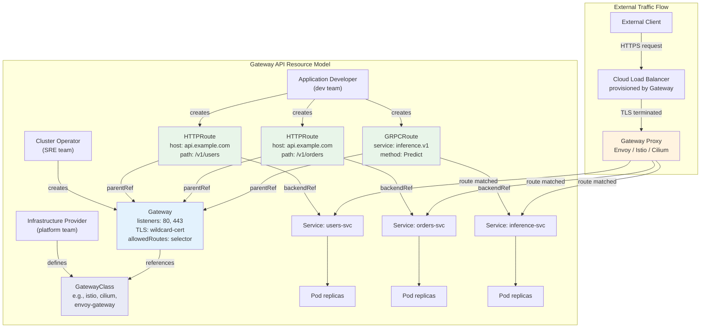

# Ingress and Gateway API

## 1. Overview

Ingress and Gateway API are the two Kubernetes mechanisms for routing external HTTP/HTTPS/gRPC traffic to services inside the cluster. Ingress was the original approach — a simple API object that defines host-based and path-based routing rules, implemented by a controller (Nginx, Traefik, HAProxy). Gateway API is its successor — a more expressive, role-oriented, and extensible API that decouples infrastructure provisioning (platform team) from routing configuration (application team).

The key insight behind Gateway API is that Ingress tried to solve too many problems with too few primitives. A single Ingress resource conflated infrastructure concerns (which load balancer to provision, what TLS certificate to use) with application concerns (which path goes to which service). Gateway API separates these into distinct resources: GatewayClass defines the infrastructure implementation, Gateway defines the listener configuration (ports, TLS), and route resources (HTTPRoute, GRPCRoute, TLSRoute, TCPRoute, UDPRoute) define application-level routing rules.

Gateway API reached GA (v1.0) in October 2023 and is the recommended approach for new deployments. Ingress remains supported but is effectively frozen — no new features will be added.

## 2. Why It Matters

- **Replaces the annotation mess.** Ingress implementations rely heavily on non-portable annotations for features like rate limiting, header rewriting, and authentication. Each controller (Nginx, Traefik, HAProxy) uses different annotations. Gateway API provides first-class fields for these features, making configurations portable across implementations.
- **Role-oriented design.** Gateway API explicitly defines three personas — infrastructure provider (GatewayClass), cluster operator (Gateway), and application developer (HTTPRoute). This maps cleanly to organizational structures where platform teams manage infrastructure and application teams manage routing.
- **Multi-tenancy.** HTTPRoutes can be scoped to specific namespaces and attached to shared Gateways via `parentRefs` with cross-namespace references, enabling multi-tenant clusters where each team manages their own routes.
- **Protocol diversity.** Ingress only supports HTTP and HTTPS. Gateway API natively supports HTTP, HTTPS, gRPC, TLS passthrough, TCP, and UDP through typed route resources.
- **Traffic management built in.** Gateway API includes request mirroring, header modification, URL rewrites, traffic splitting (canary deployments), and backend policy (timeouts, retries) as standard features.
- **Extensibility.** Policy attachment (BackendTLSPolicy, HealthCheckPolicy, RateLimitPolicy) allows implementations to extend Gateway API without diverging from the core spec.

## 3. Core Concepts

### Ingress (Legacy)

- **Ingress Resource:** Defines HTTP routing rules — host matching, path matching, TLS termination. A single resource maps incoming requests to backend services.
- **Ingress Controller:** The software that implements the Ingress spec. It watches Ingress resources and configures the underlying proxy (Nginx, Envoy, HAProxy). Without a controller, Ingress resources do nothing.
- **IngressClass:** Specifies which controller should handle an Ingress resource (added in Kubernetes 1.18 to support multiple controllers).
- **Annotations:** The escape hatch. Because the Ingress spec is minimal, controllers use annotations for advanced features (`nginx.ingress.kubernetes.io/rewrite-target`, `traefik.ingress.kubernetes.io/rate-limit`). These are entirely non-portable.
- **Default Backend:** Handles requests that match no rules. Typically returns a 404 page.

### Gateway API (Current)

- **GatewayClass:** Cluster-scoped. Defines the infrastructure implementation (e.g., `istio`, `cilium`, `envoy-gateway`). Managed by the infrastructure provider. Analogous to `StorageClass` for storage.
- **Gateway:** Namespace-scoped. Defines listeners (port, protocol, TLS config) and references a GatewayClass. Managed by the cluster operator. A Gateway may result in provisioning a cloud load balancer.
- **HTTPRoute:** Namespace-scoped. Defines HTTP routing rules — host matching, path matching, header matching, query parameter matching, method matching. Attaches to a Gateway via `parentRefs`. Managed by the application developer.
- **GRPCRoute:** Like HTTPRoute but for gRPC traffic. Matches on gRPC service and method names.
- **TLSRoute:** Routes TLS traffic based on SNI (Server Name Indication) without terminating TLS (passthrough).
- **TCPRoute / UDPRoute:** Routes raw TCP/UDP traffic to backend services.
- **ReferenceGrant:** Enables cross-namespace references (e.g., an HTTPRoute in namespace `team-a` can reference a service in namespace `shared-services`).
- **BackendTLSPolicy:** Configures TLS settings for connections from the gateway to backend services (backend mTLS).
- **Policy Attachment:** A pattern for extending Gateway API. Policies (rate limiting, authentication, health checking) attach to Gateway or Route resources without modifying the core API.

## 4. How It Works

### Ingress Flow

1. Developer creates an Ingress resource with host/path rules and a TLS secret reference.
2. Ingress controller watches for Ingress resources matching its IngressClass.
3. Controller generates proxy configuration (nginx.conf, Envoy xDS, HAProxy config) from the Ingress rules.
4. Controller provisions or configures the proxy (often a Deployment + Service of type LoadBalancer).
5. DNS is configured to point the hostname to the load balancer's external IP.
6. Incoming request hits the load balancer, terminates TLS, matches host + path, and routes to the backend service.

### Gateway API Flow

1. **Infrastructure provider** deploys a GatewayClass (e.g., `istio` GatewayClass via Istio installation).
2. **Cluster operator** creates a Gateway in a specific namespace, referencing the GatewayClass, defining listeners (ports 80/443), TLS certificates, and optionally restricting which namespaces can attach routes.
3. **Application developer** creates an HTTPRoute in their namespace, referencing the Gateway via `parentRefs`, defining routing rules (host/path/header matches) and backend references.
4. The Gateway API controller reconciles these resources:
   - Provisions infrastructure if needed (cloud LB, proxy deployment).
   - Configures routing rules on the proxy.
   - Reports status back on each resource (Gateway addresses, HTTPRoute acceptance).
5. Incoming request hits the proxy, matches the HTTPRoute rules, and is forwarded to the backend service.

### Route Attachment and Acceptance

A key Gateway API concept is that routes must be **accepted** by the Gateway:

```yaml
# Gateway allows routes from specific namespaces
apiVersion: gateway.networking.k8s.io/v1
kind: Gateway
metadata:
  name: shared-gateway
  namespace: infrastructure
spec:
  gatewayClassName: istio
  listeners:
  - name: https
    port: 443
    protocol: HTTPS
    tls:
      mode: Terminate
      certificateRefs:
      - name: wildcard-cert
    allowedRoutes:
      namespaces:
        from: Selector
        selector:
          matchLabels:
            gateway-access: "true"
```

```yaml
# HTTPRoute attaches to the gateway
apiVersion: gateway.networking.k8s.io/v1
kind: HTTPRoute
metadata:
  name: frontend-route
  namespace: team-frontend
spec:
  parentRefs:
  - name: shared-gateway
    namespace: infrastructure
  hostnames:
  - "app.example.com"
  rules:
  - matches:
    - path:
        type: PathPrefix
        value: /api/v1
    backendRefs:
    - name: api-service
      port: 8080
  - matches:
    - path:
        type: PathPrefix
        value: /
    backendRefs:
    - name: frontend-service
      port: 3000
```

### Traffic Splitting (Canary Deployment)

```yaml
apiVersion: gateway.networking.k8s.io/v1
kind: HTTPRoute
metadata:
  name: canary-route
spec:
  parentRefs:
  - name: production-gateway
  rules:
  - backendRefs:
    - name: app-v1
      port: 8080
      weight: 90
    - name: app-v2
      port: 8080
      weight: 10
```

### Header Modification and URL Rewrite

```yaml
apiVersion: gateway.networking.k8s.io/v1
kind: HTTPRoute
metadata:
  name: rewrite-route
spec:
  parentRefs:
  - name: production-gateway
  rules:
  - matches:
    - path:
        type: PathPrefix
        value: /legacy
    filters:
    - type: URLRewrite
      urlRewrite:
        path:
          type: ReplacePrefixMatch
          replacePrefixMatch: /v2
    - type: RequestHeaderModifier
      requestHeaderModifier:
        add:
        - name: X-Forwarded-Prefix
          value: /legacy
    backendRefs:
    - name: v2-service
      port: 8080
```

### Ingress Example (Legacy)

```yaml
apiVersion: networking.k8s.io/v1
kind: Ingress
metadata:
  name: app-ingress
  namespace: production
  annotations:
    nginx.ingress.kubernetes.io/rewrite-target: /
    nginx.ingress.kubernetes.io/ssl-redirect: "true"
    nginx.ingress.kubernetes.io/rate-limit-rps: "100"
    cert-manager.io/cluster-issuer: "letsencrypt-prod"
spec:
  ingressClassName: nginx
  tls:
  - hosts:
    - app.example.com
    secretName: app-tls-cert
  rules:
  - host: app.example.com
    http:
      paths:
      - path: /api
        pathType: Prefix
        backend:
          service:
            name: api-backend
            port:
              number: 8080
      - path: /
        pathType: Prefix
        backend:
          service:
            name: frontend
            port:
              number: 3000
```

Note how the annotations are entirely Nginx-specific. Migrating this to Traefik or HAProxy Ingress requires rewriting all annotations — there is no portability.

### Gateway API Advanced Patterns

**Request mirroring (shadow traffic):**
```yaml
apiVersion: gateway.networking.k8s.io/v1
kind: HTTPRoute
metadata:
  name: mirror-route
spec:
  parentRefs:
  - name: production-gateway
  rules:
  - matches:
    - path:
        type: PathPrefix
        value: /api/v1
    filters:
    - type: RequestMirror
      requestMirror:
        backendRef:
          name: shadow-service
          port: 8080
    backendRefs:
    - name: production-service
      port: 8080
```

This sends a copy of every request to `shadow-service` without affecting the primary response path. Useful for testing new versions with production traffic without risk.

**Header-based routing for A/B testing:**
```yaml
apiVersion: gateway.networking.k8s.io/v1
kind: HTTPRoute
metadata:
  name: ab-test-route
spec:
  parentRefs:
  - name: production-gateway
  rules:
  - matches:
    - headers:
      - name: x-experiment-group
        value: "treatment"
    backendRefs:
    - name: app-treatment
      port: 8080
  - matches:
    - path:
        type: PathPrefix
        value: /
    backendRefs:
    - name: app-control
      port: 8080
```

**GRPCRoute for model inference:**
```yaml
apiVersion: gateway.networking.k8s.io/v1
kind: GRPCRoute
metadata:
  name: inference-route
spec:
  parentRefs:
  - name: inference-gateway
  rules:
  - matches:
    - method:
        service: inference.v1.ModelService
        method: Predict
    backendRefs:
    - name: model-serving
      port: 9090
  - matches:
    - method:
        service: inference.v1.ModelService
        method: HealthCheck
    backendRefs:
    - name: model-health
      port: 9091
```

### Migration Strategy: Ingress to Gateway API

A recommended incremental migration approach:

1. **Phase 1 — Parallel operation.** Install a Gateway API implementation alongside the existing Ingress controller. Both can run simultaneously. New services use HTTPRoute; existing services keep Ingress resources.

2. **Phase 2 — Route migration.** Convert Ingress resources to HTTPRoute resources one at a time. Verify each conversion with traffic tests. Many tools (e.g., `ingress2gateway` CLI) can automate the conversion.

3. **Phase 3 — Annotation elimination.** Identify annotation-dependent features (rate limiting, auth, rewrites) and migrate them to Gateway API filters or Policy Attachment. This is often the hardest step because custom annotations may not have Gateway API equivalents — requiring implementation-specific policies.

4. **Phase 4 — Ingress controller removal.** Once all traffic flows through Gateway API, remove the Ingress controller and Ingress resources.

**Key risks during migration:**
- DNS cutover: ensure the Gateway and Ingress use the same external IP/hostname, or use weighted DNS to shift traffic gradually.
- TLS certificate management: cert-manager supports both Ingress and Gateway API, so certificates can be shared.
- Feature parity gaps: some Ingress controller features (e.g., custom Lua scripts in Nginx) may not have Gateway API equivalents.

## 5. Architecture / Flow



## 6. Types / Variants

### Ingress Controllers

| Controller | Proxy | Key Features | Use Case |
|---|---|---|---|
| **Nginx Ingress** | Nginx | Most mature, huge community, annotation-driven | General-purpose, legacy deployments |
| **Traefik** | Traefik | Auto-discovery, Let's Encrypt integration, IngressRoute CRD | Small-medium clusters, edge routing |
| **HAProxy Ingress** | HAProxy | High performance, TCP support, rate limiting | High-throughput TCP/HTTP workloads |
| **Kong Ingress** | Kong (OpenResty) | Plugin ecosystem, API management, rate limiting | API gateway + ingress combined |
| **Ambassador / Emissary** | Envoy | Developer-focused, gRPC native, Mapping CRD | Microservices with heavy gRPC use |
| **Contour** | Envoy | HTTPProxy CRD, multi-team delegation | Multi-tenant clusters |

### Gateway API Implementations

| Implementation | Proxy | Status | Distinguishing Feature |
|---|---|---|---|
| **Istio** | Envoy | GA (conformant) | Full service mesh integration, ambient mode support |
| **Cilium** | Envoy (via eBPF) | GA (conformant) | eBPF datapath, no sidecar proxy, L3/L4/L7 combined |
| **Envoy Gateway** | Envoy | GA (conformant) | Reference implementation, pure Gateway API focus |
| **Nginx Gateway Fabric** | Nginx | GA | Nginx backing with Gateway API frontend |
| **Traefik** | Traefik | Beta | Natural migration path from Traefik Ingress |
| **Kong Gateway Operator** | Kong | GA | API management + Gateway API combined |
| **GKE Gateway Controller** | Google Cloud LB | GA | Native GCP integration, global LB support |

### Ingress vs Gateway API Feature Comparison

| Feature | Ingress | Gateway API |
|---|---|---|
| **Host-based routing** | Yes | Yes |
| **Path-based routing** | Yes (Prefix, Exact) | Yes (Prefix, Exact, RegularExpression) |
| **Header-based routing** | Annotation-dependent | Native (`headers` match) |
| **Traffic splitting** | Annotation-dependent | Native (`weight` on backendRefs) |
| **Request mirroring** | Annotation-dependent | Native (`RequestMirror` filter) |
| **URL rewrite** | Annotation-dependent | Native (`URLRewrite` filter) |
| **gRPC routing** | Controller-specific | Native (GRPCRoute) |
| **TCP/UDP routing** | Not supported | Native (TCPRoute/UDPRoute) |
| **Multi-tenancy** | Weak (single namespace usually) | Strong (cross-namespace with ReferenceGrant) |
| **Role separation** | None | GatewayClass / Gateway / Route |
| **TLS passthrough** | Annotation-dependent | Native (TLSRoute) |
| **Extensibility** | Annotations (non-portable) | Policy attachment (portable pattern) |
| **Status reporting** | Minimal | Rich (per-route, per-parent acceptance status) |

## 7. Use Cases

- **Multi-team platform:** A platform team creates a shared Gateway with HTTPS listeners and a wildcard certificate. Each application team creates HTTPRoutes in their own namespace to claim hostnames and paths. Cross-namespace attachment with namespace selectors ensures isolation.
- **Canary deployments:** An HTTPRoute with weighted backendRefs splits traffic 95/5 between stable and canary versions. Combined with header-based matching, internal testers can use `x-canary: true` to always hit the canary.
- **gRPC inference API:** A GRPCRoute matches on `inference.v1.ModelService/Predict` and routes to a model serving backend. Header-based routing directs requests to different model versions based on `x-model-version`.
- **Migration from Ingress:** Envoy Gateway and Istio both support running Ingress and Gateway API simultaneously, allowing incremental migration of routes.
- **TCP database proxy:** A TCPRoute exposes a PostgreSQL service externally through the Gateway, providing TLS termination without HTTP overhead.
- **Blue/green deployment:** Two HTTPRoutes for the same hostname — one active (weight: 100) and one standby (weight: 0). Switching traffic is a single HTTPRoute weight update.

## 8. Tradeoffs

| Decision | Option A | Option B | Guidance |
|---|---|---|---|
| **Ingress vs Gateway API** | Ingress: mature, widely supported, simple | Gateway API: modern, extensible, role-oriented | Gateway API for new deployments; migrate Ingress over time |
| **Single Gateway vs Gateway-per-team** | Shared: efficient, fewer LBs, centralized TLS | Per-team: isolation, independent lifecycle | Shared Gateway with namespace-scoped routes for most organizations |
| **Envoy Gateway vs Istio Gateway** | EG: lightweight, Gateway API-only | Istio: full mesh, mTLS, observability | Envoy Gateway if you only need ingress; Istio if you need mesh features |
| **TLS termination at Gateway vs passthrough** | Terminate: inspect HTTP, apply L7 rules | Passthrough: end-to-end encryption, less control | Terminate at Gateway for HTTP routing; passthrough for strict compliance |
| **Annotations vs Policy Attachment** | Annotations: familiar, controller-specific | Policy: portable, structured, typed | Policy attachment is the future; annotations for legacy compatibility |
| **Cloud-native LB vs self-managed** | Cloud LB: managed, elastic, integrated | Self-managed: portable, no cloud dependency | Cloud-native (GKE Gateway, AWS LB Controller) when on cloud; self-managed for hybrid/bare-metal |

## 9. Common Pitfalls

- **Assuming Ingress and Gateway API are mutually exclusive.** They can coexist. Most controllers support both APIs simultaneously. Migrate routes incrementally.
- **Forgetting IngressClass / GatewayClass.** In clusters with multiple controllers, omitting the class causes unpredictable behavior — multiple controllers may fight over the same resource.
- **TLS certificate management overhead.** Manually managing certificates per Ingress or Gateway is error-prone. Use cert-manager with Let's Encrypt for automatic issuance and renewal. cert-manager natively integrates with Gateway API via the `certificateRefs` field.
- **Cross-namespace reference without ReferenceGrant.** In Gateway API, referencing a service in another namespace requires a ReferenceGrant in the target namespace. Without it, the route is rejected — a common source of confusion.
- **Path matching semantics differ.** Ingress path matching varies by controller (some treat paths as prefixes by default, others as exact). Gateway API explicitly defines `PathPrefix`, `Exact`, and `RegularExpression` types, removing ambiguity.
- **Overloading a single Gateway.** A Gateway with thousands of HTTPRoutes becomes a bottleneck for the controller reconciliation loop. Consider multiple Gateways for large-scale deployments (one per domain or per team).
- **Ignoring status conditions.** Gateway API provides rich status on every resource. An HTTPRoute may be `Accepted: False` if it conflicts with another route or violates Gateway constraints. Always check status after creating routes.
- **Not setting request timeouts.** Without explicit timeouts, slow backends can exhaust proxy connections. Use BackendRef-level or filter-level timeouts.

## 10. Real-World Examples

- **Google (GKE Gateway Controller):** Google Cloud's native Gateway API implementation provisions Global External Application Load Balancers. A single Gateway can serve traffic from 100+ countries with integrated CDN, Cloud Armor WAF, and IAP (Identity-Aware Proxy). GKE Gateway Controller supports multi-cluster gateways that route to services across multiple GKE clusters.
- **Shopify (Nginx Ingress → Gateway API migration):** Shopify ran one of the largest Nginx Ingress deployments. They encountered scaling limits with Nginx config reloads (worker process restarts) at 10,000+ routes. Migration to Envoy-based Gateway API (via Envoy Gateway) eliminated reload-based disruptions with hot-restart and xDS-based dynamic configuration.
- **Stripe (Envoy + custom controller):** Uses Envoy as the data plane with a custom Gateway API-compatible controller. Header-based routing sends requests with `Stripe-Version` headers to the appropriate API version backend, enabling seamless API versioning.
- **DoorDash (Istio Gateway):** Uses Istio's Gateway API implementation for both ingress routing and internal mesh traffic. HTTPRoutes handle canary deployments for their delivery optimization service, splitting traffic 1% to canary on every deploy.
- **Cloudflare (Gateway API for K8s tunnels):** Cloudflare Tunnel operator uses Gateway API to expose services through Cloudflare's network without public IPs, providing DDoS protection and global load balancing.

## 11. Related Concepts

- [Load Balancing](../../traditional-system-design/02-scalability/01-load-balancing.md) — L4/L7 concepts that underpin Ingress controllers and Gateway implementations
- [Microservices](../../traditional-system-design/06-architecture/02-microservices.md) — the architecture pattern driving the need for L7 routing
- [API Security](../../traditional-system-design/09-security/03-api-security.md) — authentication, authorization, and TLS patterns applied at the gateway layer
- [Kubernetes Networking Model](../01-foundations/05-kubernetes-networking-model.md) — pod networking that services and gateways build upon
- [Service Networking](./01-service-networking.md) — the ClusterIP/NodePort/LoadBalancer layer that Gateway API routes traffic to
- [Service Mesh](./03-service-mesh.md) — Istio/Linkerd mesh capabilities that complement Gateway API for east-west traffic
- [Network Policies](./05-network-policies.md) — L3/L4 access control that complements L7 routing at the gateway

## 12. Source Traceability

- source/extracted/system-design-guide/ch07-distributed-systems-building-blocks-dns-load-balancers-and-a.md — Kubernetes Ingress controllers: Istio, Kong, Traefik, Ambassador as API gateways for K8s clusters
- source/extracted/acing-system-design/ch09-part-2.md — Service mesh and sidecar patterns for request routing
- Kubernetes Gateway API specification — GatewayClass, Gateway, HTTPRoute, GRPCRoute, TLSRoute resource definitions (gateway-api.sigs.k8s.io)
- Kubernetes Ingress specification — Ingress resource, IngressClass, controller model
- Envoy Gateway documentation — Reference Gateway API implementation
- Istio documentation — Gateway API support and mesh integration
