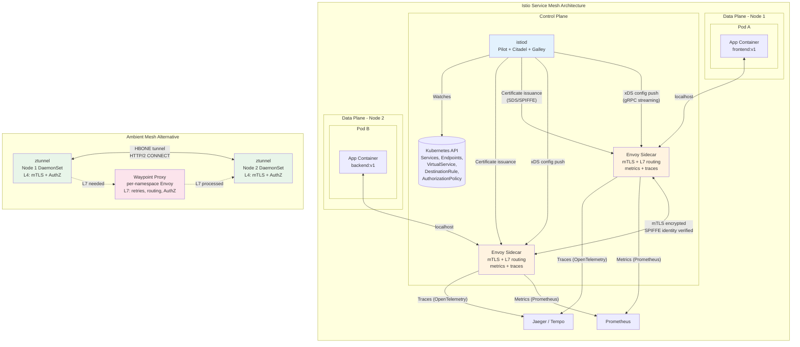

# Service Mesh

## 1. Overview

A service mesh is a dedicated infrastructure layer for managing service-to-service (east-west) communication in microservices architectures. It intercepts all network traffic between services — typically via sidecar proxies injected alongside application containers — and adds capabilities that would otherwise require application code changes: mutual TLS (mTLS), retries, timeouts, circuit breaking, traffic shifting, and distributed tracing.

In Kubernetes, the two dominant service mesh implementations are Istio and Linkerd. Istio uses Envoy as its data plane proxy and has recently introduced ambient mesh — a sidecar-less architecture that uses per-node ztunnel proxies for L4 and optional waypoint proxies for L7 processing. Linkerd uses its own purpose-built micro-proxy (linkerd2-proxy, written in Rust) and focuses on simplicity and low overhead.

The service mesh pattern decouples networking concerns from application code. Developers write business logic; the mesh handles encryption, observability, and traffic management. This separation is especially valuable in polyglot environments where services are written in different languages — the mesh provides uniform behavior regardless of the application runtime.

## 2. Why It Matters

- **Zero-trust security by default.** mTLS encrypts all service-to-service traffic and provides cryptographic identity verification. A compromised pod cannot impersonate another service because it lacks the correct certificate.
- **Observability without code changes.** The sidecar proxy automatically collects metrics (request rate, error rate, latency — RED metrics), distributed traces, and access logs for every service call. No application instrumentation needed for L7 visibility.
- **Resilience as infrastructure.** Retries, timeouts, and circuit breakers are configured declaratively in the mesh, not hard-coded in application libraries. Changing retry policy does not require a code change or redeploy.
- **Traffic management.** Canary deployments, A/B testing, traffic mirroring, and fault injection are mesh-native operations. A VirtualService in Istio can shift 1% of traffic to a new version without modifying the deployment.
- **Compliance and audit.** mTLS provides encryption in transit (a common compliance requirement — PCI-DSS, SOC 2, HIPAA). Access logs at the proxy level provide a complete audit trail of all service interactions.
- **Multi-cluster and multi-cloud networking.** Service meshes can span clusters, enabling services in different clusters or clouds to communicate securely with automatic service discovery and load balancing.

## 3. Core Concepts

- **Data Plane:** The set of proxies that intercept and forward all service traffic. In Istio, this is Envoy sidecar containers (or ztunnel + waypoint proxies in ambient mode). In Linkerd, this is linkerd2-proxy. The data plane enforces policies, collects telemetry, and manages connections.
- **Control Plane:** The management component that configures the data plane. Istio's control plane is **istiod** (a single binary combining Pilot, Citadel, and Galley). Linkerd's control plane consists of the destination controller, identity controller, and proxy injector.
- **Sidecar Proxy:** A proxy container injected into every pod alongside the application container. It intercepts all inbound and outbound traffic via iptables rules that redirect traffic through the proxy. This is the traditional service mesh deployment model.
- **Sidecar-less (Ambient Mesh):** Istio's newer architecture that removes sidecar proxies. Instead, a per-node **ztunnel** DaemonSet handles L4 traffic (mTLS, L4 authorization) and optional **waypoint proxies** (per-namespace or per-service deployments) handle L7 traffic (retries, header routing, L7 authorization).
- **mTLS (Mutual TLS):** Both client and server present certificates during the TLS handshake. The mesh control plane acts as the Certificate Authority, issuing short-lived certificates (typically 24-hour TTL) tied to the service's Kubernetes identity (SPIFFE ID).
- **SPIFFE Identity:** The Secure Production Identity Framework for Everyone. Each service gets an identity in the form `spiffe://cluster.local/ns/<namespace>/sa/<service-account>`. This identity is embedded in X.509 certificates issued by the mesh CA.
- **VirtualService (Istio):** Defines how requests are routed to a service. Supports traffic splitting, retries, timeouts, fault injection, header-based routing, and mirroring.
- **DestinationRule (Istio):** Defines policies applied after routing — load balancing algorithm, connection pool settings, outlier detection (circuit breaking), and TLS mode for upstream connections.
- **ServiceProfile (Linkerd):** Defines per-route metrics, retries, and timeouts for a service. More limited than Istio's VirtualService but simpler to configure.
- **Traffic Splitting:** Dividing traffic between multiple versions of a service by percentage. Used for canary deployments and gradual rollouts.
- **Circuit Breaking:** Automatically stopping requests to a service that is failing, preventing cascading failures. Implemented via outlier detection in the data plane.
- **Fault Injection:** Deliberately introducing delays or errors into service calls to test resilience. The mesh proxy can inject HTTP 500 errors or add latency without modifying application code.

## 4. How It Works

### Istio Architecture (Sidecar Mode)

1. **Installation:** `istioctl install` deploys the `istiod` control plane and configures admission webhooks.
2. **Sidecar injection:** Namespaces labeled `istio-injection: enabled` trigger automatic sidecar injection. When a pod is created, the mutating webhook injects an Envoy sidecar container and an init container that sets up iptables rules to redirect all pod traffic through Envoy.
3. **Certificate issuance:** istiod's built-in CA issues X.509 certificates with SPIFFE identities to each sidecar via the Secret Discovery Service (SDS). Certificates are rotated automatically (default 24-hour TTL).
4. **Configuration distribution:** istiod watches Kubernetes services, endpoints, and Istio CRDs (VirtualService, DestinationRule, AuthorizationPolicy). It compiles these into Envoy xDS configuration and pushes updates to all sidecars via gRPC streaming.
5. **Traffic interception:** When Pod A calls Pod B, the request flows through Pod A's sidecar (egress), which performs mTLS handshake, applies routing rules, collects metrics/traces, and forwards to Pod B's sidecar (ingress), which verifies the mTLS certificate, applies authorization policies, and forwards to Pod B's application container.

### Istio Ambient Mesh (Sidecar-less)

1. **ztunnel (L4 processing):** A DaemonSet that runs on every node. It transparently intercepts all pod traffic using eBPF or iptables redirection. ztunnel establishes HBONE tunnels (HTTP CONNECT over HTTP/2) between nodes, providing mTLS encryption and L4 authorization. Resources consumed per-node rather than per-pod — significant memory savings.
2. **Waypoint proxy (L7 processing):** A per-namespace or per-service Envoy deployment. When L7 features are needed (header-based routing, retries, L7 authorization, fault injection), traffic is forwarded from ztunnel to the waypoint proxy. Only deployed where L7 features are actually needed.
3. **Benefits over sidecar:** No sidecar resource overhead (Envoy sidecar consumes ~50-100 MB memory per pod), no sidecar injection complexity, no sidecar lifecycle management, compatible with non-HTTP protocols, reduced blast radius from proxy vulnerabilities.

### Linkerd Architecture

1. **Control plane:** Lightweight Go-based control plane (~200 MB memory total). The destination controller resolves service endpoints, the identity controller issues mTLS certificates, and the proxy injector handles sidecar injection.
2. **Data plane:** linkerd2-proxy is a purpose-built micro-proxy written in Rust. It is significantly smaller than Envoy (~10 MB memory, ~2 ms P99 latency overhead). It handles mTLS, load balancing, retries, timeouts, and metrics collection.
3. **Simplicity focus:** Linkerd intentionally omits features that Istio provides (VirtualService-level traffic management, fault injection, Lua/WASM extensibility) in favor of reliability and low operational overhead.

### Traffic Management Example (Istio)

**Canary deployment with traffic splitting:**
```yaml
apiVersion: networking.istio.io/v1beta1
kind: VirtualService
metadata:
  name: reviews
spec:
  hosts:
  - reviews
  http:
  - route:
    - destination:
        host: reviews
        subset: v1
      weight: 90
    - destination:
        host: reviews
        subset: v2
      weight: 10
    retries:
      attempts: 3
      perTryTimeout: 2s
      retryOn: 5xx,reset,connect-failure
    timeout: 10s
---
apiVersion: networking.istio.io/v1beta1
kind: DestinationRule
metadata:
  name: reviews
spec:
  host: reviews
  trafficPolicy:
    connectionPool:
      tcp:
        maxConnections: 100
      http:
        h2UpgradePolicy: UPGRADE
        maxRequestsPerConnection: 1000
    outlierDetection:
      consecutive5xxErrors: 5
      interval: 30s
      baseEjectionTime: 30s
      maxEjectionPercent: 50
  subsets:
  - name: v1
    labels:
      version: v1
  - name: v2
    labels:
      version: v2
```

**Circuit breaking (outlier detection):**

The `outlierDetection` configuration above ejects a pod from the load balancing pool if it returns 5 consecutive 5xx errors within 30 seconds. The ejected pod is removed for 30 seconds (base ejection time), then retested. Maximum 50% of pods can be ejected simultaneously to prevent total service blackout.

### mTLS Configuration

**Strict mTLS (recommended for production):**
```yaml
apiVersion: security.istio.io/v1beta1
kind: PeerAuthentication
metadata:
  name: default
  namespace: istio-system  # Mesh-wide
spec:
  mtls:
    mode: STRICT  # All traffic must be mTLS
```

**Permissive mTLS (for migration):**
```yaml
apiVersion: security.istio.io/v1beta1
kind: PeerAuthentication
metadata:
  name: default
  namespace: my-namespace
spec:
  mtls:
    mode: PERMISSIVE  # Accept both mTLS and plaintext
```

### Observability from the Mesh

One of the highest-value features of a service mesh is automatic observability without code changes.

**Metrics (RED — Rate, Error, Duration):**
The sidecar proxy automatically emits metrics for every request:
- `istio_requests_total` — total request count, labeled by source, destination, response code, and response flags.
- `istio_request_duration_milliseconds` — request latency histogram.
- `istio_tcp_sent_bytes_total` / `istio_tcp_received_bytes_total` — TCP byte counts.

These metrics power Grafana dashboards (Istio ships with pre-built dashboards) and Kiali service mesh visualization.

**Distributed tracing:**
Envoy sidecar generates trace spans for every request. The application must propagate trace headers (e.g., `x-request-id`, `traceparent`) for traces to be connected across services. The mesh does not magically create end-to-end traces without header propagation — this is a common misconception.

Supported trace backends: Jaeger, Zipkin, OpenTelemetry Collector, Tempo.

**Access logs:**
Envoy access logs capture every request with source/destination identity, response code, latency, bytes transferred, and TLS metadata. Useful for security auditing and debugging.

```json
{
  "authority": "payment-service.production.svc.cluster.local",
  "bytes_received": 245,
  "bytes_sent": 1024,
  "downstream_local_address": "10.244.1.5:8080",
  "duration": 12,
  "method": "POST",
  "path": "/v1/charge",
  "protocol": "HTTP/2",
  "response_code": 200,
  "upstream_cluster": "outbound|8080||payment-service.production.svc.cluster.local",
  "x_forwarded_for": "10.244.2.8"
}
```

### Authorization Policies (Istio)

Beyond mTLS authentication, Istio provides L7 authorization:

**Deny all by default, allow specific paths:**
```yaml
apiVersion: security.istio.io/v1beta1
kind: AuthorizationPolicy
metadata:
  name: payment-policy
  namespace: production
spec:
  selector:
    matchLabels:
      app: payment-service
  action: ALLOW
  rules:
  - from:
    - source:
        principals:
        - "cluster.local/ns/production/sa/order-service"
    to:
    - operation:
        methods: ["POST"]
        paths: ["/v1/charge", "/v1/refund"]
  - from:
    - source:
        principals:
        - "cluster.local/ns/monitoring/sa/prometheus"
    to:
    - operation:
        methods: ["GET"]
        paths: ["/metrics"]
```

This policy ensures that only the `order-service` (identified by its SPIFFE identity/service account) can call `/v1/charge` and `/v1/refund`, and only Prometheus can scrape `/metrics`. All other traffic to `payment-service` is denied.

### Fault Injection for Chaos Testing

```yaml
apiVersion: networking.istio.io/v1beta1
kind: VirtualService
metadata:
  name: payment-chaos
spec:
  hosts:
  - payment-service
  http:
  - fault:
      delay:
        percentage:
          value: 10  # 10% of requests
        fixedDelay: 5s
      abort:
        percentage:
          value: 5   # 5% of requests
        httpStatus: 503
    route:
    - destination:
        host: payment-service
```

This injects 5-second delays into 10% of requests and returns 503 errors for 5% of requests — testing how upstream services handle payment service degradation without touching the payment service code.

## 5. Architecture / Flow



## 6. Types / Variants

### Istio vs Linkerd Feature Comparison

| Feature | Istio | Linkerd |
|---|---|---|
| **Data plane proxy** | Envoy (C++, ~50-100 MB/sidecar) | linkerd2-proxy (Rust, ~10-20 MB/sidecar) |
| **Control plane** | istiod (Go, ~1-2 GB memory) | Lightweight Go components (~200 MB total) |
| **mTLS** | Yes (SPIFFE, auto-rotation) | Yes (SPIFFE, auto-rotation) |
| **Traffic splitting** | Yes (VirtualService, fine-grained) | Yes (TrafficSplit CRD, basic) |
| **Circuit breaking** | Yes (outlier detection, detailed config) | No (relies on retries + timeouts) |
| **Fault injection** | Yes (delay, abort) | No |
| **Traffic mirroring** | Yes | No |
| **Rate limiting** | Yes (local and global) | No |
| **Multi-cluster** | Yes (multi-primary, primary-remote) | Yes (multi-cluster link) |
| **Gateway API support** | Yes (GA, conformant) | Yes (experimental) |
| **Sidecar-less mode** | Yes (ambient mesh) | No |
| **WASM extensibility** | Yes (Envoy WASM filters) | No |
| **Resource overhead** | Higher (Envoy is feature-rich) | Lower (purpose-built proxy) |
| **Operational complexity** | Higher | Lower |
| **CNCF status** | Graduated | Graduated |
| **Best for** | Large organizations needing full control | Teams prioritizing simplicity and performance |

### Sidecar vs Sidecar-less (Ambient) Comparison

| Aspect | Sidecar Mode | Ambient Mode (Istio) |
|---|---|---|
| **Resource overhead** | ~50-100 MB memory per pod | ztunnel: ~40 MB per node; waypoint: shared per namespace |
| **Latency overhead** | ~1-3 ms P99 per hop | ~0.5 ms P99 for L4; similar to sidecar for L7 via waypoint |
| **mTLS** | Per-pod sidecar terminates TLS | ztunnel terminates TLS at node level |
| **L7 features** | Always available | Only where waypoint proxy is deployed |
| **Injection complexity** | Requires mutating webhook, init containers, iptables rules | No injection needed; ztunnel runs as DaemonSet |
| **Upgrade impact** | Requires pod restart to update sidecar | ztunnel upgrades via DaemonSet rolling update |
| **Non-HTTP protocols** | Limited (proxy must understand protocol) | ztunnel handles any L4 protocol transparently |
| **Blast radius** | Proxy vulnerability in one pod affects that pod | ztunnel vulnerability on one node affects all pods on that node |
| **Maturity** | Production-ready (years of production use) | GA as of Istio 1.22 (2024), rapidly maturing |

### Other Service Mesh Options

| Mesh | Notes |
|---|---|
| **Cilium Service Mesh** | Uses eBPF for L4 and Envoy for L7. No sidecar; per-node Envoy. Tightest integration with Cilium CNI and network policies. |
| **Consul Connect (HashiCorp)** | Service mesh with Envoy sidecars, integrated with Consul service discovery. Popular in HashiCorp-native environments. |
| **Kuma (Kong)** | Built on Envoy. Supports both Kubernetes and VM workloads. Multi-zone for multi-cluster. |
| **Open Service Mesh (OSM)** | CNCF archived. Microsoft-backed, Envoy-based. Not recommended for new deployments. |
| **AWS App Mesh** | AWS-managed Envoy mesh. Tightly integrated with ECS and EKS. Limited to AWS. |

## 7. Use Cases

- **Zero-trust migration:** A financial services company enables mTLS mesh-wide using Istio's permissive mode (accepts both plaintext and mTLS). Over 3 months, they instrument observability to verify all services support mTLS, then switch to strict mode. Every inter-service call is now encrypted and identity-verified.
- **Canary deployment pipeline:** A CI/CD pipeline deploys a new version as a separate deployment, creates a DestinationRule subset, and updates the VirtualService to send 1% of traffic to the canary. Automated analysis of error rates and latency determines whether to promote (increase to 100%) or rollback (set to 0%).
- **Multi-cluster failover:** Two Kubernetes clusters in different regions (us-east, eu-west) form an Istio multi-primary mesh. If the `payment-service` in us-east becomes unhealthy, Istio automatically routes traffic to the healthy instance in eu-west.
- **Observability bootstrapping:** A team with 50 microservices needs distributed tracing but cannot instrument all services. Deploying Linkerd gives them per-service golden metrics (request rate, error rate, latency) and basic trace propagation within days, without any code changes.
- **Compliance enforcement:** An AuthorizationPolicy ensures that only the `order-service` (identified by its SPIFFE identity) can call the `payment-service`. Any other service attempting to connect receives a 403. This provides least-privilege access control at the network layer.

## 8. Tradeoffs

| Decision | Option A | Option B | Guidance |
|---|---|---|---|
| **Istio vs Linkerd** | Istio: full-featured, complex | Linkerd: simple, lightweight, fast | Linkerd for teams wanting minimal overhead; Istio for orgs needing traffic management + extensibility |
| **Sidecar vs Ambient** | Sidecar: mature, proven, per-pod isolation | Ambient: lower overhead, simpler operations | Ambient for new Istio deployments; sidecar for existing stable deployments or strict per-pod isolation requirements |
| **Mesh vs no mesh** | Mesh: mTLS, observability, traffic mgmt | No mesh: simpler, less overhead, fewer failure modes | Consider mesh when you have >10 services, need mTLS, or need traffic management. Do not add a mesh to solve problems you do not have. |
| **Strict vs permissive mTLS** | Strict: all traffic encrypted, rejects plaintext | Permissive: accepts both, gradual migration | Start permissive, migrate to strict once all services support mTLS |
| **Service mesh vs application library** | Mesh: language-agnostic, no code change | Library (e.g., gRPC interceptors): lighter, no proxy overhead | Mesh for polyglot environments; library for homogeneous stacks with performance-critical paths |
| **Full L7 mesh vs L4-only** | Full L7: retries, header routing, per-route metrics | L4-only: mTLS + basic metrics, much lower overhead | Istio ambient with ztunnel-only gives L4 mTLS; add waypoint proxies only for namespaces needing L7 |

## 9. Common Pitfalls

- **Mesh as the first thing you deploy.** A service mesh adds operational complexity. If you have 3 services, you do not need a mesh. Start with Kubernetes services and add a mesh when you have a clear need (mTLS mandate, canary deployment requirement, cross-cutting observability).
- **Sidecar resource requests not configured.** Envoy sidecars without resource requests/limits can consume unbounded memory under load. Set sidecar resource limits via Istio's `proxy.resources` configuration. A common starting point: 100m CPU, 128Mi memory (request); 500m CPU, 512Mi memory (limit).
- **Init container race conditions.** The sidecar init container must complete iptables configuration before the application starts. If the application starts first, it may make network calls that bypass the proxy. Use `holdApplicationUntilProxyStarts: true` in Istio to prevent this.
- **Breaking non-HTTP protocols.** Sidecar proxies parse traffic as HTTP by default. Non-HTTP protocols (MySQL, Redis, custom TCP) may break. Configure service port naming (`tcp-mysql`, `redis`) or explicit protocol selection in DestinationRules.
- **mTLS migration causing outages.** Switching from PERMISSIVE to STRICT mode globally can break services that have not been enrolled in the mesh. Migrate namespace by namespace, verify with Kiali or Grafana dashboards.
- **Ignoring the data plane upgrade.** Upgrading the Istio control plane does not upgrade the sidecars. Sidecars are updated only when pods are restarted. A rollout restart (`kubectl rollout restart`) is needed, which can cause brief disruption. Ambient mode avoids this problem since ztunnel upgrades via DaemonSet rolling update.
- **Excessive retry amplification.** If service A retries 3 times to service B, and service B retries 3 times to service C, a single failure at C generates 9 requests. Configure retries carefully and use retry budgets.
- **Not accounting for sidecar latency in SLOs.** Each sidecar hop adds ~1-3 ms P99 latency. For a call chain of 5 services, that is 10-30 ms of mesh overhead. Factor this into latency budgets.

## 10. Real-World Examples

- **Airbnb (Istio, 1,000+ services):** Deploys Istio across all production services. mTLS enabled in strict mode. Uses VirtualServices for canary deployments of their search ranking service. Measured ~2 ms P99 additional latency per hop, which they accepted as a tradeoff for security and observability gains.
- **eBay (Istio ambient mesh, early adopter):** Evaluated ambient mesh for their high-pod-count clusters. Sidecar mode required 500+ GB of aggregate proxy memory across the cluster. Ambient mode with ztunnel reduced this to ~50 GB while maintaining L4 mTLS. Waypoint proxies deployed only for the 20% of namespaces needing L7 features.
- **Buoyant / Linkerd users (Nordstrom, Microsoft):** Nordstrom adopted Linkerd for its low resource overhead. linkerd2-proxy consumes ~10 MB memory per pod versus Envoy's ~50-100 MB. At scale across 5,000 pods, that is 200 GB memory savings. P99 latency overhead measured at <1 ms per hop.
- **Salesforce (Istio multi-cluster):** Runs Istio in multi-primary mode across 3 cloud regions. Services automatically failover between regions. mTLS identities are shared across clusters using a common root CA, enabling cross-cluster authentication.
- **Lyft (Envoy, pre-Istio):** Lyft created Envoy (which later became Istio's data plane). They run ~10,000 Envoy sidecars handling millions of requests per second. Circuit breaking via outlier detection prevents cascading failures during peak ride-request hours.

### CNI + Mesh Performance Benchmarks

| Configuration | P99 Latency (per hop) | Memory per Pod | Throughput (RPS per core) |
|---|---|---|---|
| **No mesh (direct pod-to-pod)** | ~0.1-0.5 ms | 0 MB (no proxy) | Baseline |
| **Linkerd (sidecar)** | ~0.5-1.5 ms | ~10-20 MB | ~95% of baseline |
| **Istio sidecar** | ~1-3 ms | ~50-100 MB | ~85-90% of baseline |
| **Istio ambient (ztunnel L4)** | ~0.3-0.8 ms | ~40 MB per node (shared) | ~97% of baseline |
| **Istio ambient (ztunnel + waypoint L7)** | ~1-2 ms | ~40 MB/node + ~100 MB/waypoint | ~90% of baseline |
| **Cilium mesh (eBPF L4 + Envoy L7)** | ~0.3-1 ms | Per-node Envoy ~100 MB | ~95% of baseline |

*Benchmarks are approximate and vary by workload, request size, and hardware. Source: Istio/Linkerd/Cilium project benchmarks and community testing.*

## 11. Related Concepts

- [Load Balancing](../../traditional-system-design/02-scalability/01-load-balancing.md) — L4/L7 load balancing algorithms implemented by mesh proxies
- [Microservices](../../traditional-system-design/06-architecture/02-microservices.md) — the architecture pattern that makes service mesh valuable
- [API Security](../../traditional-system-design/09-security/03-api-security.md) — authentication and authorization patterns enforced by mesh AuthorizationPolicy
- [Kubernetes Networking Model](../01-foundations/05-kubernetes-networking-model.md) — pod networking fundamentals that the mesh builds upon
- [Service Networking](./01-service-networking.md) — ClusterIP/kube-proxy layer that the mesh enhances
- [Ingress and Gateway API](./02-ingress-and-gateway-api.md) — north-south traffic management that complements east-west mesh
- [Network Policies](./05-network-policies.md) — L3/L4 network policies that complement L7 mesh authorization policies

## 12. Source Traceability

- source/extracted/system-design-guide/ch07-distributed-systems-building-blocks-dns-load-balancers-and-a.md — Istio, Kong, Traefik, Ambassador as K8s Ingress controllers and API gateways
- source/extracted/acing-system-design/ch09-part-2.md — Sidecar pattern for rate limiting (section 8.10), service mesh reference, Istio in Action reference
- Istio documentation — istiod architecture, VirtualService, DestinationRule, PeerAuthentication, ambient mesh
- Linkerd documentation — linkerd2-proxy, control plane architecture, ServiceProfile
- Envoy documentation — xDS protocol, outlier detection, circuit breaking
- CNCF service mesh landscape — comparative analysis of Istio, Linkerd, Cilium, Consul Connect
