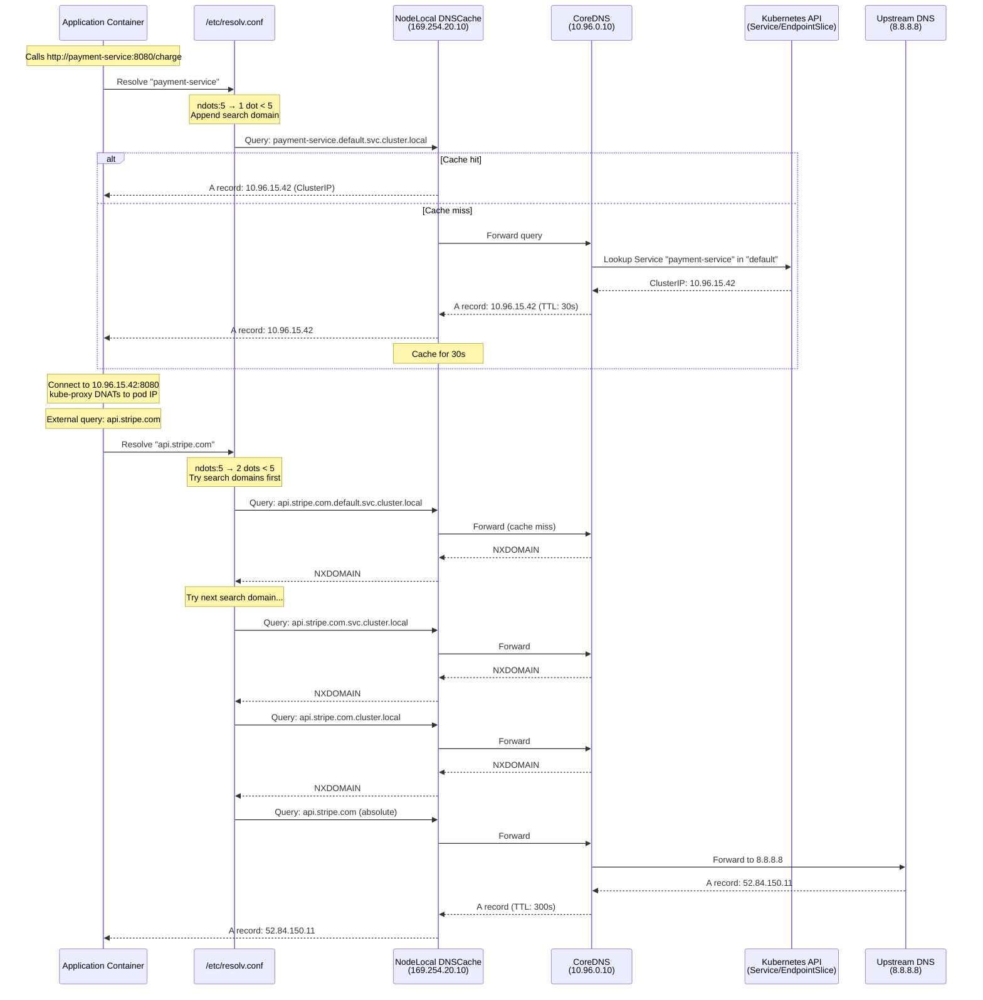

# DNS and Service Discovery

## 1. Overview

DNS is the backbone of service discovery in Kubernetes. When a pod calls `http://payment-service.production.svc.cluster.local:8080/charge`, it relies on CoreDNS — the cluster DNS server — to resolve that name to a ClusterIP (or directly to pod IPs for headless services). Every pod is automatically configured with CoreDNS as its nameserver via the kubelet, making service discovery transparent to application code.

CoreDNS replaced kube-dns as the default cluster DNS in Kubernetes 1.13. It is a pluggable, extensible DNS server written in Go, configured via a Corefile that chains plugins for caching, forwarding, health checking, and metrics. Beyond basic service resolution, CoreDNS handles headless service discovery (returning individual pod IPs for StatefulSet peer discovery), external name resolution (forwarding to upstream DNS), and custom DNS records via plugins.

For services outside the cluster, external-dns automates the creation of DNS records in public DNS providers (Route 53, Cloud DNS, Azure DNS) based on Kubernetes Service and Ingress annotations. This closes the loop: CoreDNS handles internal discovery, external-dns handles external discovery.

DNS tuning — particularly the `ndots` setting, search domains, and caching — has a measurable impact on application latency and DNS server load. In large clusters (5,000+ pods), poorly tuned DNS can become a bottleneck, adding 5-10 ms to every service call.

## 2. Why It Matters

- **Service discovery without client libraries.** Unlike Consul or Eureka, Kubernetes DNS works with any language and framework. If your code can resolve DNS, it can discover services. No SDK required.
- **Stable naming for ephemeral pods.** A pod's IP changes on every restart. DNS provides a stable name (`my-service.my-namespace.svc.cluster.local`) that resolves to the current ClusterIP, which in turn routes to healthy pods.
- **StatefulSet identity.** Headless services give each StatefulSet pod a unique DNS name (`postgres-0.postgres-headless.db.svc.cluster.local`). This is how database replicas discover each other, how Kafka brokers form clusters, and how ZooKeeper ensembles elect leaders.
- **Multi-namespace isolation.** Services in different namespaces have different DNS names. `api-service.team-a.svc.cluster.local` is distinct from `api-service.team-b.svc.cluster.local`, enabling multi-tenant clusters.
- **External service integration.** ExternalName services and custom Corefile entries allow pods to discover external databases, SaaS APIs, and legacy systems through the same DNS mechanism used for internal services.
- **Performance impact at scale.** DNS resolution is on the critical path of every service call. A misconfigured `ndots` setting or undersized CoreDNS deployment can add measurable latency to every request.

## 3. Core Concepts

- **CoreDNS:** The default cluster DNS server. Runs as a Deployment (typically 2 replicas) in the `kube-system` namespace, exposed via a Service with a well-known ClusterIP (often `10.96.0.10`).
- **Corefile:** CoreDNS configuration file stored in a ConfigMap (`coredns` in `kube-system`). Defines server blocks, plugins, and upstream forwarders.
- **Service DNS format:** `<service-name>.<namespace>.svc.<cluster-domain>`. The cluster domain is typically `cluster.local`. Example: `redis.cache.svc.cluster.local`.
- **Pod DNS format:** `<pod-ip-dashed>.<namespace>.pod.<cluster-domain>`. Example: `10-244-1-5.default.pod.cluster.local`. Rarely used directly.
- **SRV records:** For named ports, CoreDNS creates SRV records: `_<port-name>._<protocol>.<service>.<namespace>.svc.<cluster-domain>`. Example: `_http._tcp.web.default.svc.cluster.local` returns port 80 and the service's ClusterIP.
- **Headless service DNS:** When `clusterIP: None`, DNS returns A records for each pod IP instead of the ClusterIP. Enables client-side load balancing and peer discovery.
- **ndots:** A setting in `/etc/resolv.conf` that controls when a DNS query is treated as absolute vs relative. Kubernetes default is `ndots:5`, meaning any name with fewer than 5 dots is first searched with cluster suffixes appended before querying as-is.
- **Search domains:** Kubernetes pods get search domains: `<namespace>.svc.cluster.local svc.cluster.local cluster.local`. A query for `redis` first tries `redis.<namespace>.svc.cluster.local`, then `redis.svc.cluster.local`, then `redis.cluster.local`, then `redis` as a bare FQDN.
- **external-dns:** A Kubernetes controller that watches Service/Ingress/Gateway resources and creates corresponding DNS records in external DNS providers (Route 53, Cloud DNS, etc.).
- **NodeLocal DNSCache:** A DaemonSet-based DNS caching agent that runs on every node. Intercepts DNS queries locally, reducing latency and CoreDNS load. Uses a link-local IP address (169.254.20.10) to avoid conntrack issues with UDP.
- **DNS TTL:** Time to Live — how long DNS responses are cached. CoreDNS default cache TTL is 30 seconds. Shorter TTLs mean faster failover but more DNS queries.

## 4. How It Works

### Pod DNS Configuration

When kubelet creates a pod, it writes `/etc/resolv.conf` with:

```
nameserver 10.96.0.10        # CoreDNS ClusterIP
search default.svc.cluster.local svc.cluster.local cluster.local
options ndots:5
```

This means:
- All DNS queries go to CoreDNS at `10.96.0.10`.
- Names with fewer than 5 dots are searched with each suffix before trying as absolute.
- A query for `payment-service` triggers up to 5 DNS queries before resolving:
  1. `payment-service.default.svc.cluster.local` (match — stops here for cluster services)
  2. `payment-service.svc.cluster.local`
  3. `payment-service.cluster.local`
  4. `payment-service` (bare FQDN)
  5. For each query, both A and AAAA records are requested (doubling actual queries)

### CoreDNS Plugin Chain

A typical Corefile:

```
.:53 {
    errors
    health {
        lameduck 5s
    }
    ready
    kubernetes cluster.local in-addr.arpa ip6.arpa {
        pods insecure
        fallthrough in-addr.arpa ip6.arpa
        ttl 30
    }
    prometheus :9153
    forward . /etc/resolv.conf {
        max_concurrent 1000
    }
    cache 30
    loop
    reload
    loadbalance
}
```

Plugin processing order:
1. **errors:** Logs errors to stdout.
2. **health / ready:** Exposes health check and readiness endpoints.
3. **kubernetes:** Handles queries for `cluster.local` by watching the Kubernetes API for Services and EndpointSlices. Returns ClusterIP for normal services, pod IPs for headless services.
4. **prometheus:** Exposes DNS metrics at `:9153/metrics`.
5. **forward:** Forwards non-cluster queries to upstream DNS (node's resolv.conf, or custom upstreams like `8.8.8.8`).
6. **cache:** Caches DNS responses for the configured TTL (30 seconds by default).
7. **loadbalance:** Randomizes the order of A records in responses (round-robin DNS).

### Headless Service DNS Resolution

For a StatefulSet with headless service:

```yaml
apiVersion: v1
kind: Service
metadata:
  name: postgres-headless
  namespace: db
spec:
  clusterIP: None
  selector:
    app: postgres
  ports:
  - port: 5432
    name: tcp-postgresql
---
apiVersion: apps/v1
kind: StatefulSet
metadata:
  name: postgres
  namespace: db
spec:
  serviceName: postgres-headless  # Links to the headless service
  replicas: 3
  # ... template spec
```

DNS records created:
- `postgres-headless.db.svc.cluster.local` → A records for all 3 pod IPs (10.244.1.5, 10.244.2.8, 10.244.3.11)
- `postgres-0.postgres-headless.db.svc.cluster.local` → A record for pod 0's IP (10.244.1.5)
- `postgres-1.postgres-headless.db.svc.cluster.local` → A record for pod 1's IP (10.244.2.8)
- `postgres-2.postgres-headless.db.svc.cluster.local` → A record for pod 2's IP (10.244.3.11)

This enables:
- **Peer discovery:** Pod 0 can find pods 1 and 2 by querying the headless service name.
- **Direct addressing:** An application can connect to a specific replica (e.g., primary at postgres-0).
- **Bootstrap:** New pods can discover existing peers before passing readiness checks (requires `publishNotReadyAddresses: true` on the service).

### external-dns Workflow

1. external-dns controller watches Kubernetes Service, Ingress, and Gateway resources.
2. When a LoadBalancer service is created with the annotation `external-dns.alpha.kubernetes.io/hostname: api.example.com`, external-dns:
   a. Reads the external IP/hostname from the service status.
   b. Creates an A or CNAME record in the configured DNS provider (e.g., Route 53).
   c. Sets a TTL (configurable, default 300 seconds).
3. When the service is deleted, external-dns removes the DNS record.
4. external-dns uses a TXT ownership record to track which records it manages, preventing accidental deletion of manually-created records.

### DNS Tuning for Performance

**The ndots problem:**

With the default `ndots:5`, a query for `api.stripe.com` (2 dots, fewer than 5) triggers:
1. `api.stripe.com.default.svc.cluster.local` (NXDOMAIN)
2. `api.stripe.com.svc.cluster.local` (NXDOMAIN)
3. `api.stripe.com.cluster.local` (NXDOMAIN)
4. `api.stripe.com` (success)

That is 4 DNS queries (8 with AAAA) instead of 1. For applications making frequent external API calls, this multiplies DNS load significantly.

**Solutions:**
1. **Use FQDNs with trailing dot:** `api.stripe.com.` (trailing dot means absolute — no search domain expansion). Requires application code changes.
2. **Reduce ndots:** Set `ndots:2` or `ndots:1` in the pod's `dnsConfig`. Risk: short service names like `redis` would no longer resolve without the full FQDN.
3. **NodeLocal DNSCache:** Deploy NodeLocalDNS to cache negative responses locally, reducing the impact of search domain expansion.
4. **Autopath plugin:** A CoreDNS plugin that short-circuits the search domain chain by returning a CNAME to the resolved name on the first query. Reduces query amplification from 4-8x to 1-2x.

```yaml
# Pod-level DNS tuning
apiVersion: v1
kind: Pod
metadata:
  name: optimized-app
spec:
  dnsConfig:
    options:
    - name: ndots
      value: "2"
    - name: single-request-reopen
      value: ""
  # ...
```

### CoreDNS Scaling and High Availability

**Horizontal scaling:**
CoreDNS should be scaled based on cluster size and DNS QPS. A common formula:

| Cluster Size (pods) | Recommended CoreDNS Replicas | CPU (per replica) | Memory (per replica) |
|---|---|---|---|
| <500 | 2 | 100m | 70Mi |
| 500-2,000 | 3-5 | 200m | 128Mi |
| 2,000-5,000 | 5-8 | 500m | 256Mi |
| 5,000+ | 8+ (HPA-based) | 1000m | 512Mi |

**HPA for CoreDNS:**
```yaml
apiVersion: autoscaling/v2
kind: HorizontalPodAutoscaler
metadata:
  name: coredns
  namespace: kube-system
spec:
  scaleTargetRef:
    apiVersion: apps/v1
    kind: Deployment
    name: coredns
  minReplicas: 2
  maxReplicas: 20
  metrics:
  - type: Pods
    pods:
      metric:
        name: coredns_dns_requests_total_rate
      target:
        type: AverageValue
        averageValue: "10000"  # Scale when QPS per replica exceeds 10K
```

**Anti-affinity for high availability:**
Ensure CoreDNS pods run on different nodes and in different zones:
```yaml
affinity:
  podAntiAffinity:
    preferredDuringSchedulingIgnoredDuringExecution:
    - weight: 100
      podAffinityTerm:
        labelSelector:
          matchExpressions:
          - key: k8s-app
            operator: In
            values:
            - kube-dns
        topologyKey: kubernetes.io/hostname
    - weight: 50
      podAffinityTerm:
        labelSelector:
          matchExpressions:
          - key: k8s-app
            operator: In
            values:
            - kube-dns
        topologyKey: topology.kubernetes.io/zone
```

### NodeLocal DNSCache Architecture

NodeLocal DNSCache is a DaemonSet that runs a DNS caching agent on every node, dramatically reducing DNS latency and eliminating UDP conntrack issues.

**How it works:**
1. A DaemonSet runs `node-local-dns` on every node, listening on a link-local IP (`169.254.20.10`).
2. kubelet is configured to set pods' nameserver to `169.254.20.10` instead of the CoreDNS ClusterIP.
3. The node-local cache intercepts DNS queries:
   - **Cache hit:** Returns the cached response immediately (~0.1 ms latency).
   - **Cache miss for cluster domain:** Forwards to CoreDNS via TCP (avoiding UDP conntrack issues).
   - **Cache miss for external domain:** Forwards to upstream DNS (node's `/etc/resolv.conf` or configured upstreams).
4. Negative responses (NXDOMAIN) are also cached, reducing the impact of ndots search domain expansion.

**Deployment:**
```yaml
apiVersion: apps/v1
kind: DaemonSet
metadata:
  name: node-local-dns
  namespace: kube-system
spec:
  selector:
    matchLabels:
      k8s-app: node-local-dns
  template:
    spec:
      hostNetwork: true
      dnsPolicy: Default  # Uses node's DNS, not cluster DNS
      containers:
      - name: node-cache
        image: registry.k8s.io/dns/k8s-dns-node-cache:1.23.0
        args:
        - -localip
        - 169.254.20.10
        - -conf
        - /etc/Corefile
        - -upstreamesvr
        - /etc/resolv.conf  # Or explicit CoreDNS ClusterIP
        ports:
        - containerPort: 53
          name: dns
          protocol: UDP
        - containerPort: 53
          name: dns-tcp
          protocol: TCP
```

### Custom DNS Configuration Examples

**Split-horizon DNS (internal vs external resolution):**
```
.:53 {
    kubernetes cluster.local in-addr.arpa ip6.arpa {
        pods insecure
        fallthrough in-addr.arpa ip6.arpa
        ttl 30
    }
    # Internal zone: resolve *.internal.mycompany.com to cluster services
    file /etc/coredns/internal.db internal.mycompany.com
    # Forward public queries to company DNS
    forward . 10.0.0.53 10.0.0.54 {
        max_concurrent 1000
    }
    cache 30
    loadbalance
}
```

**Stub domains (forward specific domains to custom DNS):**
```
.:53 {
    kubernetes cluster.local in-addr.arpa ip6.arpa {
        pods insecure
        fallthrough in-addr.arpa ip6.arpa
        ttl 30
    }
    # Forward consul.local queries to Consul DNS
    forward consul.local 10.0.0.100:8600
    # Forward everything else to upstream
    forward . 8.8.8.8 8.8.4.4
    cache 30
}
```

## 5. Architecture / Flow



## 6. Types / Variants

### DNS Service Discovery Patterns

| Pattern | Mechanism | Use Case | Limitations |
|---|---|---|---|
| **ClusterIP service** | DNS returns ClusterIP; kube-proxy LBs to pods | Standard service-to-service communication | No direct pod addressing; L4 LB only |
| **Headless service** | DNS returns all pod IPs (A records) | StatefulSet peer discovery, client-side LB | Client must handle multiple IPs; no VIP |
| **ExternalName service** | DNS returns CNAME to external host | Abstracting external services (RDS, SaaS) | No proxying; client resolves the CNAME |
| **SRV records** | DNS returns port + host for named ports | Service discovery with port negotiation | Requires SRV-aware client |
| **external-dns** | Creates records in public DNS providers | Public access to LoadBalancer/Ingress services | Eventual consistency (TTL propagation) |

### CoreDNS vs kube-dns

| Feature | CoreDNS | kube-dns (deprecated) |
|---|---|---|
| **Architecture** | Single binary, plugin chain | 3 containers (kubedns, dnsmasq, sidecar) |
| **Configuration** | Corefile (text-based, flexible) | ConfigMap with limited options |
| **Extensibility** | 30+ plugins, custom plugins | Limited to dnsmasq features |
| **Performance** | ~50,000 QPS per instance (varies by CPU) | ~30,000 QPS per instance |
| **Resource usage** | ~70 MB memory (default) | ~170 MB memory (3 containers) |
| **Status** | Default since K8s 1.13, actively maintained | Deprecated, no new features |

### DNS Policy Types

| dnsPolicy | Behavior | Use Case |
|---|---|---|
| **ClusterFirst** (default) | Cluster DNS for cluster domains, upstream for others | Standard pods |
| **Default** | Inherits node's DNS config | Pods needing node-level DNS (e.g., host networking) |
| **None** | No auto-config; use `dnsConfig` for custom settings | Custom DNS servers, split-horizon DNS |
| **ClusterFirstWithHostNet** | ClusterFirst but for pods with `hostNetwork: true` | DaemonSets with host networking that still need cluster DNS |

### NodeLocal DNSCache vs Direct CoreDNS

| Aspect | Direct CoreDNS | NodeLocal DNSCache |
|---|---|---|
| **DNS latency** | ~1-5 ms (network hop to CoreDNS pod) | ~0.1-0.5 ms (node-local) |
| **Conntrack issues** | UDP DNS queries consume conntrack entries; can overflow on busy nodes | Uses TCP to CoreDNS (or local cache hit avoids conntrack) |
| **CoreDNS load** | All queries hit CoreDNS | Only cache misses reach CoreDNS |
| **Failure mode** | CoreDNS pod crash affects all pods | Node-local cache serves stale entries briefly; degrades gracefully |
| **Deployment** | Default (Deployment + Service) | Additional DaemonSet |
| **Recommended for** | Small-medium clusters (<1,000 nodes) | Large clusters, latency-sensitive workloads |

## 7. Use Cases

- **Microservice discovery:** A payment service resolves `order-service.production.svc.cluster.local` to discover the order service. The application uses a standard HTTP client — no service discovery library needed.
- **Database cluster bootstrapping:** A CockroachDB StatefulSet uses headless service DNS to discover peers during initialization. Pod 0 bootstraps the cluster; pods 1 and 2 join by resolving `cockroachdb-0.cockroachdb-headless.db.svc.cluster.local`.
- **External database abstraction:** An ExternalName service maps `database.production.svc.cluster.local` to `mydb.abc123.us-east-1.rds.amazonaws.com`. If the database is migrated to a different provider, only the ExternalName changes — application code and configuration are untouched.
- **Public DNS automation:** A LoadBalancer service with `external-dns.alpha.kubernetes.io/hostname: api.mycompany.com` automatically creates an A record in Route 53. When the service is deleted, the record is cleaned up.
- **Split-horizon DNS:** Using CoreDNS with custom forwarding rules, internal queries for `api.mycompany.com` resolve to the internal ClusterIP, while external queries resolve to the public load balancer IP. Avoids hairpin traffic through the public internet.
- **Multi-cluster service discovery:** Cilium ClusterMesh or Istio multi-cluster extends DNS resolution across clusters. A service `api-service.default.svc.cluster.local` in cluster A is discoverable from cluster B.

## 8. Tradeoffs

| Decision | Option A | Option B | Guidance |
|---|---|---|---|
| **ndots:5 vs ndots:2** | ndots:5: all short names resolve; more DNS queries | ndots:2: fewer queries; short names may not resolve | ndots:2 for apps with many external calls; ndots:5 for apps only calling cluster services |
| **NodeLocal DNSCache vs direct** | NodeLocal: lower latency, conntrack fix | Direct: simpler, fewer components | NodeLocal for clusters with >500 nodes or latency-sensitive workloads |
| **Headless vs ClusterIP** | Headless: direct pod IPs, client-side LB | ClusterIP: stable VIP, kube-proxy LB | Headless for StatefulSets and peer discovery; ClusterIP for stateless services |
| **ExternalName vs manual config** | ExternalName: native K8s abstraction | Manual: hardcoded in app config | ExternalName for database/SaaS endpoints that may change providers |
| **CoreDNS cache TTL: low vs high** | Low TTL (5s): fast failover, more queries | High TTL (60s): fewer queries, slower failover | 30s (default) is a good balance; lower for critical services with frequent endpoint changes |
| **Autopath plugin vs ndots tuning** | Autopath: transparent, no pod config change | ndots: explicit, per-pod control | Autopath for cluster-wide optimization without touching pod specs |

## 9. Common Pitfalls

- **ndots:5 query amplification.** The number one DNS performance issue in Kubernetes. An external domain like `api.stripe.com` generates 8 DNS queries (4 search domains x 2 for A+AAAA) before resolving. At 1,000 RPS of external calls, that is 8,000 DNS QPS of unnecessary load. Fix with ndots tuning, FQDNs with trailing dots, or the autopath plugin.
- **CoreDNS undersized for large clusters.** Default CoreDNS deployment (2 replicas, 170m CPU, 70Mi memory) is insufficient for clusters with 5,000+ pods. Monitor `coredns_dns_requests_total` and scale horizontally. Use the HPA with custom DNS QPS metrics.
- **UDP conntrack table exhaustion.** On busy nodes, UDP DNS queries fill the conntrack table (default 65,536 entries on many Linux distros). Symptoms: random DNS failures, `nf_conntrack: table full` in dmesg. Fix: deploy NodeLocal DNSCache (uses TCP to CoreDNS), increase `nf_conntrack_max`, or switch to TCP DNS.
- **DNS resolution during pod startup race.** A pod starting before CoreDNS is ready (e.g., during cluster bootstrap) has no DNS. CoreDNS pods themselves need DNS for image pulling. Ensure CoreDNS is prioritized (`priorityClassName: system-cluster-critical`).
- **Headless service without publishNotReadyAddresses.** During StatefulSet bootstrap, pods need to discover peers before becoming ready. Without `publishNotReadyAddresses: true`, DNS returns no records for pods that have not passed readiness probes — creating a deadlock where pods cannot become ready because they cannot find peers.
- **ExternalName with HTTP Host header mismatch.** ExternalName returns a CNAME but does not rewrite the HTTP Host header. If the external service requires a specific Host header (e.g., an AWS ALB), the request may fail. Use an Ingress or Gateway with header rewriting instead.
- **Stale DNS cache during service migration.** When migrating a service from one cluster to another, DNS cache on pods may point to the old ClusterIP for up to 30 seconds (CoreDNS default cache TTL). For zero-downtime migration, keep the old service running during the cache TTL window.

## 10. Real-World Examples

- **LinkedIn (CoreDNS at scale):** Operates CoreDNS serving 2+ million QPS across their Kubernetes fleet. Uses the autopath plugin to reduce query amplification from ndots:5, cutting DNS QPS by ~60%. Runs CoreDNS with 8 replicas and aggressive HPA scaling based on DNS request rate.
- **Datadog (NodeLocal DNSCache):** Deployed NodeLocal DNSCache across all clusters after experiencing intermittent DNS resolution failures caused by UDP conntrack table exhaustion on high-traffic nodes. P99 DNS latency dropped from 5 ms to 0.3 ms, and CoreDNS CPU usage decreased by 40%.
- **Spotify (external-dns with Route 53):** Automates DNS record creation for 500+ services across multiple Kubernetes clusters. external-dns with Route 53 and weighted routing enables multi-cluster failover — if a cluster becomes unhealthy, Route 53 health checks shift traffic to the healthy cluster.
- **GitLab (headless services for Gitaly):** Uses headless services for Gitaly storage shards (their Git storage backend). Each Gitaly pod has a stable DNS name, enabling consistent hashing of repository storage assignments across pods.
- **Zalando (DNS-based service discovery across clouds):** Uses CoreDNS with custom plugins to provide unified service discovery across Kubernetes clusters in AWS and on-premises data centers. A custom plugin resolves cross-environment service names by querying both cluster DNS and Consul.

## 11. Related Concepts

- [Load Balancing](../../traditional-system-design/02-scalability/01-load-balancing.md) — DNS-based load balancing (GSLB) and the relationship between DNS TTL and failover
- [Microservices](../../traditional-system-design/06-architecture/02-microservices.md) — service discovery as a foundational requirement for microservices communication
- [Kubernetes Networking Model](../01-foundations/05-kubernetes-networking-model.md) — pod IP allocation and flat network model that DNS builds upon
- [Service Networking](./01-service-networking.md) — ClusterIP and headless services that DNS resolves
- [Ingress and Gateway API](./02-ingress-and-gateway-api.md) — external-dns integrates with Ingress/Gateway for public DNS automation
- [Service Mesh](./03-service-mesh.md) — mesh service discovery complements DNS-based discovery
- [Network Policies](./05-network-policies.md) — DNS-based policies (Cilium) that use FQDN matching

## 12. Source Traceability

- source/extracted/system-design-guide/ch07-distributed-systems-building-blocks-dns-load-balancers-and-a.md — DNS fundamentals: hierarchy, name servers, resource records, caching, iterative vs recursive queries, scalability/reliability/consistency
- source/extracted/acing-system-design/ch09-part-2.md — Service discovery patterns in distributed system design
- Kubernetes official documentation — CoreDNS, DNS for Services and Pods, headless services, dnsPolicy, dnsConfig
- CoreDNS documentation — Corefile syntax, kubernetes plugin, autopath plugin, NodeLocal DNSCache
- external-dns documentation — DNS provider integrations, annotation-based record management
