# Network Policies

## 1. Overview

Network policies are the firewall rules of Kubernetes. By default, Kubernetes allows all pods to communicate with all other pods — a flat, open network with no access control. Network policies change this by defining which pods can talk to which other pods, and on which ports and protocols. They are the mechanism for implementing micro-segmentation and the principle of least privilege at the network layer.

A NetworkPolicy is a Kubernetes-native resource that selects pods via labels and specifies allowed ingress (incoming) and egress (outgoing) traffic rules. However, NetworkPolicy resources are only effective if the cluster's CNI plugin implements them. The Kubernetes API defines the spec; the CNI enforces it. The two most capable network policy engines are Calico and Cilium, which go far beyond the standard Kubernetes NetworkPolicy API with their own CRDs for L7 policies, DNS-based rules, and global cluster-wide policies.

The critical concept is **default deny**: once any NetworkPolicy selects a pod, all traffic not explicitly allowed by a policy is denied for that direction (ingress or egress). This makes network policies additive — you start with "deny everything" and explicitly allow what is needed.

## 2. Why It Matters

- **Defense in depth.** If an attacker compromises a pod (e.g., via an application vulnerability), network policies prevent lateral movement. The compromised pod can only reach the services its policy explicitly allows.
- **Compliance requirements.** PCI-DSS, SOC 2, HIPAA, and FedRAMP all require network segmentation. Network policies provide auditable, declarative evidence of segmentation.
- **Namespace isolation.** In multi-tenant clusters, network policies prevent pods in one tenant's namespace from accessing another tenant's services. Without policies, any pod can reach any other pod.
- **Blast radius reduction.** A misconfigured service that exposes sensitive data is only reachable by pods that the network policy allows. This limits the impact of misconfigurations.
- **Complements service mesh authorization.** Network policies operate at L3/L4 in the kernel (fast, cannot be bypassed by the application). Service mesh AuthorizationPolicies operate at L7 in the proxy (richer rules, but dependent on proxy integrity). Together, they provide layered security.
- **Shift-left security.** Network policies are declarative YAML, stored in Git, reviewed in PRs. Security becomes part of the development workflow, not an afterthought.

## 3. Core Concepts

- **Pod Selector:** Every NetworkPolicy targets pods using `spec.podSelector`. An empty selector (`{}`) selects all pods in the namespace.
- **Policy Types:** A NetworkPolicy declares whether it covers `Ingress`, `Egress`, or both. If a policy type is listed but no rules are defined for it, all traffic of that type is denied (default deny for that direction).
- **Ingress Rules:** Define which sources can send traffic to the selected pods. Sources can be identified by pod labels (`podSelector`), namespace labels (`namespaceSelector`), or IP ranges (`ipBlock`).
- **Egress Rules:** Define which destinations the selected pods can reach. Destinations use the same selectors plus port specifications.
- **Default Deny:** The foundational pattern. A policy that selects all pods but specifies no ingress/egress rules denies all traffic of that type. This is the starting point for secure clusters.
- **ipBlock:** Allows or restricts traffic to/from CIDR ranges (e.g., `10.0.0.0/8`). Used for controlling access to external networks, on-premises resources, or specific IP ranges.
- **Ports:** Rules can specify allowed ports and protocols (TCP, UDP, SCTP). If no ports are specified, all ports are allowed.
- **AND vs OR logic:** Within a single rule, selectors are ANDed (must match all). Multiple rules in the same policy are ORed (matching any rule allows traffic). Multiple policies selecting the same pod are ORed (union of all allowed traffic).
- **CiliumNetworkPolicy (Cilium CRD):** Extends the standard API with L7 policies (HTTP method/path matching, Kafka topic filtering, DNS-based FQDN policies), identity-based enforcement, and cluster-wide scope.
- **GlobalNetworkPolicy (Calico CRD):** Calico's cluster-scoped policy that applies across all namespaces. Supports L7 rules, DNS policies, and integration with non-Kubernetes workloads.

## 4. How It Works

### Policy Evaluation Logic

When a packet arrives at (or leaves from) a pod:

1. **No policies select the pod?** All traffic is allowed (Kubernetes default behavior — open network).
2. **At least one Ingress policy selects the pod?** All ingress traffic not matching any ingress rule across all selecting policies is denied.
3. **At least one Egress policy selects the pod?** All egress traffic not matching any egress rule across all selecting policies is denied.
4. **Multiple policies select the pod?** The union of all rules applies. If Policy A allows port 80 from namespace X and Policy B allows port 443 from namespace Y, both are allowed.

### Default Deny Patterns

**Deny all ingress in a namespace:**
```yaml
apiVersion: networking.k8s.io/v1
kind: NetworkPolicy
metadata:
  name: default-deny-ingress
  namespace: production
spec:
  podSelector: {}  # Selects ALL pods in the namespace
  policyTypes:
  - Ingress
  # No ingress rules = deny all ingress
```

**Deny all egress in a namespace:**
```yaml
apiVersion: networking.k8s.io/v1
kind: NetworkPolicy
metadata:
  name: default-deny-egress
  namespace: production
spec:
  podSelector: {}
  policyTypes:
  - Egress
  # No egress rules = deny all egress (including DNS!)
```

**Important:** Default deny egress also blocks DNS. You must explicitly allow DNS egress:

```yaml
apiVersion: networking.k8s.io/v1
kind: NetworkPolicy
metadata:
  name: allow-dns
  namespace: production
spec:
  podSelector: {}
  policyTypes:
  - Egress
  egress:
  - to:
    - namespaceSelector:
        matchLabels:
          kubernetes.io/metadata.name: kube-system
      podSelector:
        matchLabels:
          k8s-app: kube-dns
    ports:
    - protocol: UDP
      port: 53
    - protocol: TCP
      port: 53
```

### Application-Specific Policies

**Allow frontend to reach backend, backend to reach database:**
```yaml
# Backend: allow ingress from frontend only
apiVersion: networking.k8s.io/v1
kind: NetworkPolicy
metadata:
  name: backend-ingress
  namespace: production
spec:
  podSelector:
    matchLabels:
      app: backend
  policyTypes:
  - Ingress
  ingress:
  - from:
    - podSelector:
        matchLabels:
          app: frontend
    ports:
    - protocol: TCP
      port: 8080
---
# Database: allow ingress from backend only
apiVersion: networking.k8s.io/v1
kind: NetworkPolicy
metadata:
  name: database-ingress
  namespace: production
spec:
  podSelector:
    matchLabels:
      app: database
  policyTypes:
  - Ingress
  ingress:
  - from:
    - podSelector:
        matchLabels:
          app: backend
    ports:
    - protocol: TCP
      port: 5432
```

### Cross-Namespace Policy

**Allow monitoring namespace to scrape all pods:**
```yaml
apiVersion: networking.k8s.io/v1
kind: NetworkPolicy
metadata:
  name: allow-prometheus-scrape
  namespace: production
spec:
  podSelector: {}
  policyTypes:
  - Ingress
  ingress:
  - from:
    - namespaceSelector:
        matchLabels:
          kubernetes.io/metadata.name: monitoring
      podSelector:
        matchLabels:
          app: prometheus
    ports:
    - protocol: TCP
      port: 9090
    - protocol: TCP
      port: 8080  # Application metrics port
```

### CIDR-Based Policies

**Allow egress to on-premises network only:**
```yaml
apiVersion: networking.k8s.io/v1
kind: NetworkPolicy
metadata:
  name: allow-onprem-egress
  namespace: production
spec:
  podSelector:
    matchLabels:
      app: legacy-connector
  policyTypes:
  - Egress
  egress:
  - to:
    - ipBlock:
        cidr: 10.0.0.0/8
        except:
        - 10.244.0.0/16  # Exclude pod CIDR
    ports:
    - protocol: TCP
      port: 443
```

### Cilium L7 Policy

**Restrict HTTP methods and paths:**
```yaml
apiVersion: cilium.io/v2
kind: CiliumNetworkPolicy
metadata:
  name: api-l7-policy
  namespace: production
spec:
  endpointSelector:
    matchLabels:
      app: api-server
  ingress:
  - fromEndpoints:
    - matchLabels:
        app: frontend
    toPorts:
    - ports:
      - port: "8080"
        protocol: TCP
      rules:
        http:
        - method: GET
          path: "/api/v1/users.*"
        - method: POST
          path: "/api/v1/orders"
          headers:
          - 'Content-Type: application/json'
```

**DNS-based FQDN egress policy (Cilium):**
```yaml
apiVersion: cilium.io/v2
kind: CiliumNetworkPolicy
metadata:
  name: allow-external-apis
  namespace: production
spec:
  endpointSelector:
    matchLabels:
      app: payment-service
  egress:
  - toFQDNs:
    - matchName: api.stripe.com
    - matchName: api.paypal.com
    toPorts:
    - ports:
      - port: "443"
        protocol: TCP
  - toEndpoints:
    - matchLabels:
        k8s:io.kubernetes.pod.namespace: kube-system
        k8s:k8s-app: kube-dns
    toPorts:
    - ports:
      - port: "53"
        protocol: UDP
        rules:
          dns:
          - matchPattern: "*.stripe.com"
          - matchPattern: "*.paypal.com"
```

### Calico Global Network Policy

**Cluster-wide default deny with exceptions:**
```yaml
apiVersion: projectcalico.org/v3
kind: GlobalNetworkPolicy
metadata:
  name: default-deny-all
spec:
  selector: all()
  types:
  - Ingress
  - Egress
  # Allow DNS for all pods
  egress:
  - action: Allow
    protocol: UDP
    destination:
      ports:
      - 53
  - action: Allow
    protocol: TCP
    destination:
      ports:
      - 53
---
# Allow all traffic within the kube-system namespace
apiVersion: projectcalico.org/v3
kind: GlobalNetworkPolicy
metadata:
  name: allow-kube-system
spec:
  selector: projectcalico.org/namespace == 'kube-system'
  types:
  - Ingress
  - Egress
  ingress:
  - action: Allow
  egress:
  - action: Allow
  order: 100  # Lower number = higher priority
```

## 5. Architecture / Flow

```mermaid
flowchart TD
    subgraph "Network Policy Evaluation"
        PKT[Incoming Packet<br/>src: Pod A → dst: Pod B, port 8080]

        PKT --> Q1{Any NetworkPolicy<br/>selects Pod B<br/>for Ingress?}

        Q1 -->|No| ALLOW1[ALLOW<br/>Default K8s behavior:<br/>no policy = open network]

        Q1 -->|Yes| Q2{Does packet match<br/>ANY ingress rule<br/>across ALL policies?}

        Q2 -->|Yes - matches rule| Q3[Check rule details]

        Q3 --> Q4{Source matches<br/>podSelector OR<br/>namespaceSelector OR<br/>ipBlock?}

        Q4 -->|Yes| Q5{Port and protocol<br/>match?}
        Q4 -->|No| DENY1[DENY]

        Q5 -->|Yes| ALLOW2[ALLOW]
        Q5 -->|No| DENY2[DENY]

        Q2 -->|No rule matches| DENY3[DENY<br/>Policy exists but<br/>no rule allows this traffic]
    end

    subgraph "Egress Evaluation (Same Pod A)"
        EPKT[Outgoing Packet<br/>src: Pod A → dst: external API]

        EPKT --> EQ1{Any NetworkPolicy<br/>selects Pod A<br/>for Egress?}

        EQ1 -->|No| EALLOW1[ALLOW]
        EQ1 -->|Yes| EQ2{Does packet match<br/>ANY egress rule?}

        EQ2 -->|Yes| EQ3{Destination and port<br/>match?}
        EQ2 -->|No| EDENY1[DENY]

        EQ3 -->|Yes| EALLOW2[ALLOW]
        EQ3 -->|No| EDENY2[DENY]
    end

    subgraph "Policy Enforcement Stack"
        direction LR
        STD[Standard NetworkPolicy<br/>L3/L4: pod selector,<br/>namespace, CIDR, port]
        CIL[CiliumNetworkPolicy<br/>L7: HTTP method/path,<br/>DNS FQDN, Kafka topic]
        CAL[Calico GlobalNetworkPolicy<br/>Cluster-wide scope,<br/>order/priority, L7 rules]
    end

    style ALLOW1 fill:#c8e6c9
    style ALLOW2 fill:#c8e6c9
    style EALLOW1 fill:#c8e6c9
    style EALLOW2 fill:#c8e6c9
    style DENY1 fill:#ffcdd2
    style DENY2 fill:#ffcdd2
    style DENY3 fill:#ffcdd2
    style EDENY1 fill:#ffcdd2
    style EDENY2 fill:#ffcdd2
    style CIL fill:#e8eaf6
    style CAL fill:#fff3e0
```



## 6. Types / Variants

### CNI Network Policy Engine Comparison

| Feature | Calico | Cilium | Weave Net | Flannel |
|---|---|---|---|---|
| **Standard NetworkPolicy** | Full support | Full support | Full support | No support |
| **Cluster-wide policies** | GlobalNetworkPolicy | CiliumClusterwideNetworkPolicy | No | No |
| **L7 policies (HTTP)** | Yes (via Envoy integration) | Yes (native eBPF + Envoy) | No | No |
| **DNS/FQDN policies** | Yes | Yes (toFQDNs) | No | No |
| **Kafka topic policies** | No | Yes | No | No |
| **Policy ordering/priority** | Yes (order field) | No (additive only) | No | No |
| **Host endpoint policies** | Yes (HostEndpoint) | Yes (CiliumClusterwideNetworkPolicy) | No | No |
| **Performance** | iptables or eBPF dataplane | eBPF (kernel-level) | iptables | N/A |
| **Policy audit mode** | Yes (log-only before enforce) | Yes (policy-audit-mode) | No | No |
| **Network sets (IP groups)** | Yes (NetworkSet/GlobalNetworkSet) | No (use ipBlock or FQDN) | No | No |
| **Integration with VMs** | Yes (non-K8s workloads) | Yes (external workloads) | No | No |

### CNI Performance Benchmarks (Calico vs Cilium)

| Metric | Calico (iptables) | Calico (eBPF) | Cilium (eBPF) |
|---|---|---|---|
| **TCP throughput (iperf3)** | ~9.2 Gbps (10G NIC) | ~9.5 Gbps | ~9.6 Gbps |
| **TCP latency (P99, pod-to-pod)** | ~0.15 ms | ~0.10 ms | ~0.09 ms |
| **Policy evaluation overhead** | ~5-15 us per packet (1000 rules) | ~1-3 us per packet | ~1-3 us per packet |
| **Max policies before degradation** | ~5,000 (iptables) | ~50,000+ | ~50,000+ |
| **Memory per node (1000 policies)** | ~150 MB | ~100 MB | ~120 MB |
| **Policy update latency** | ~100 ms (iptables reload) | ~10 ms (eBPF map update) | ~10 ms (eBPF map update) |

*Benchmarks are approximate and depend on hardware, kernel version, and workload. eBPF dataplanes for both Calico and Cilium show similar performance characteristics. Source: Calico/Cilium project benchmarks, Isovalent performance reports.*

### Standard vs Extended Policy Features

| Capability | Standard NetworkPolicy | Cilium CRD | Calico CRD |
|---|---|---|---|
| **L3/L4 filtering** | Yes | Yes | Yes |
| **L7 HTTP filtering** | No | Yes (method, path, headers) | Yes (via Envoy) |
| **L7 Kafka filtering** | No | Yes (topic, clientID) | No |
| **L7 gRPC filtering** | No | Yes (service, method) | Yes (via Envoy) |
| **DNS FQDN egress** | No | Yes (toFQDNs) | Yes (DNS policy) |
| **Cluster-wide scope** | No (namespace-scoped only) | Yes (CiliumClusterwideNetworkPolicy) | Yes (GlobalNetworkPolicy) |
| **Policy priority/ordering** | No (all additive) | No | Yes (order field) |
| **Named port groups** | No | Yes (port ranges) | Yes (named ports) |
| **ICMP policies** | No | Yes (ICMPv4/v6) | Yes |
| **Log/audit mode** | No | Yes | Yes |

## 7. Use Cases

- **Multi-tenant namespace isolation:** Each tenant gets a namespace with default deny ingress/egress. Only the shared ingress controller and monitoring namespace can reach tenant pods. This is the foundational pattern for multi-tenant Kubernetes platforms.
- **PCI-DSS cardholder data environment (CDE):** The CDE namespace has strict ingress policies: only the payment gateway namespace can reach it. Egress is limited to the payment processor's IP range (`ipBlock`). All policies are stored in Git for audit evidence.
- **Zero-trust microservices:** Every service has an explicit policy listing exactly which other services can reach it and which services it can call. Combined with mesh mTLS, this provides identity-verified, encrypted, and firewalled communication.
- **Restricting external egress:** A CiliumNetworkPolicy allows egress only to specific FQDNs (`api.stripe.com`, `api.twilio.com`). Prevents compromised pods from exfiltrating data to arbitrary external hosts.
- **Protecting the control plane:** A GlobalNetworkPolicy (Calico) or CiliumClusterwideNetworkPolicy restricts access to the Kubernetes API server (`6443`) to only authorized namespaces (CI/CD controllers, monitoring).
- **L7 API protection:** A CiliumNetworkPolicy allows the frontend pod to make only `GET /api/v1/products` and `POST /api/v1/orders` — not `DELETE /api/v1/users`. Prevents unintended or malicious API calls even within the allowed network path.

## 8. Tradeoffs

| Decision | Option A | Option B | Guidance |
|---|---|---|---|
| **Default allow vs default deny** | Allow: simple, nothing breaks | Deny: secure, must whitelist everything | Default deny for production; allow for development/sandbox |
| **Standard NetworkPolicy vs Cilium/Calico CRD** | Standard: portable, any CNI | CRD: richer features, CNI-specific | Standard for basic L3/L4; CRDs for L7, FQDN, cluster-wide policies |
| **Calico vs Cilium** | Calico: mature, iptables or eBPF, policy ordering | Cilium: eBPF-native, L7 rich, Hubble observability | Cilium for eBPF-first clusters; Calico for mixed environments or when policy ordering is needed |
| **Per-service vs per-namespace policies** | Per-service: granular, more policies to manage | Per-namespace: simpler, broader rules | Per-service for production microservices; per-namespace for dev/staging |
| **Ingress-only vs ingress+egress** | Ingress-only: simpler, controls inbound | Both: defense in depth, prevents data exfiltration | Always include egress policies in production — ingress-only leaves egress wide open |
| **Enforce vs audit mode** | Enforce: blocks traffic immediately | Audit: logs violations without blocking | Audit first to understand traffic patterns, then switch to enforce |

## 9. Common Pitfalls

- **Not selecting a CNI that implements NetworkPolicy.** Flannel, the simplest CNI, does not implement NetworkPolicy. Creating NetworkPolicy resources in a Flannel cluster does nothing — a false sense of security. Always verify policy enforcement with a test (create deny-all, confirm pods cannot communicate).
- **Default deny egress blocking DNS.** The most common network policy mistake. Denying all egress also blocks DNS (port 53). Pods cannot resolve service names, causing cascading failures. Always pair default deny egress with an explicit DNS allow rule.
- **AND vs OR confusion in selectors.** Within a single `from` or `to` block, multiple selectors are ANDed. To OR selectors, create separate entries in the `from`/`to` array:
  ```yaml
  # This is AND: must match BOTH pod label AND namespace label
  ingress:
  - from:
    - podSelector:
        matchLabels:
          app: frontend
      namespaceSelector:
        matchLabels:
          env: production

  # This is OR: matches EITHER pod label OR namespace label
  ingress:
  - from:
    - podSelector:
        matchLabels:
          app: frontend
    - namespaceSelector:
        matchLabels:
          env: production
  ```
  The difference is a single dash (`-`) creating a new list element. This subtle YAML distinction causes many policy misconfiguration bugs.
- **Forgetting egress to the Kubernetes API server.** Pods that use the Kubernetes API (operators, controllers, admission webhooks) need egress to the API server. Without it, they fail silently or crash loop. Allow egress to the `kubernetes.default.svc` ClusterIP on port 443.
- **Not testing policies before production.** Use tools like `kubectl exec` with `curl`/`wget` to verify connectivity matches expectations. Cilium's `hubble observe` and Calico's `calicoctl` provide flow visibility to debug policy issues.
- **Policy order of operations with Calico.** Calico processes policies in order (lower `order` number = higher priority). An early deny rule can block traffic that a later allow rule intends to permit. Standard Kubernetes NetworkPolicies do not have ordering — they are purely additive.
- **Assuming NetworkPolicy applies to host-networked pods.** Pods with `hostNetwork: true` bypass pod networking and are not subject to standard NetworkPolicies. Use Calico HostEndpoint policies or Cilium host-level policies for these pods.
- **Ignoring ICMP.** Standard NetworkPolicy does not support ICMP rules. If you default deny all traffic, ICMP (ping, path MTU discovery) is also blocked. This can cause subtle MTU issues. Cilium and Calico CRDs support explicit ICMP rules.

## 10. Real-World Examples

- **Capital One (PCI-DSS compliance with Calico):** Implements GlobalNetworkPolicies to isolate their cardholder data environment (CDE) namespaces. Policies are version-controlled and applied via GitOps (Argo CD). During PCI audits, they export Calico policies as evidence of network segmentation. Uses Calico's audit mode to validate new policies before enforcement.
- **Shopify (default deny + Cilium L7):** All production namespaces have default deny ingress/egress. Services explicitly declare their allowed communication paths. Cilium L7 policies restrict API access to specific HTTP methods and paths, preventing privilege escalation through internal APIs. Hubble flow logs provide visibility into denied connections for debugging.
- **Datadog (namespace isolation for multi-tenancy):** Runs customer workloads in isolated namespaces. NetworkPolicies ensure no cross-tenant communication. Combined with RBAC, resource quotas, and pod security standards, this provides a complete multi-tenant isolation model.
- **Palantir (defense-in-depth with Calico):** Layers network policies with Istio AuthorizationPolicies. Network policies provide L3/L4 kernel-level enforcement (fast, reliable). Istio AuthZ provides L7 identity-based enforcement (rich, but dependent on sidecar). If either layer is misconfigured, the other provides a safety net.
- **Bloomberg (FQDN egress policies with Cilium):** Financial data feeds from external providers are accessed via specific FQDNs. CiliumNetworkPolicies restrict egress to only the approved data provider domains (`toFQDNs`). Any attempt to connect to an unapproved external host is blocked and logged.

## 11. Related Concepts

- [Load Balancing](../../traditional-system-design/02-scalability/01-load-balancing.md) — network policy impacts load balancer health checks (must allow ingress from LB IPs)
- [Microservices](../../traditional-system-design/06-architecture/02-microservices.md) — network policies define the allowed communication graph between microservices
- [API Security](../../traditional-system-design/09-security/03-api-security.md) — L7 network policies complement API-level authentication and authorization
- [Kubernetes Networking Model](../01-foundations/05-kubernetes-networking-model.md) — CNI plugins that implement network policies
- [Service Networking](./01-service-networking.md) — services that network policies control access to
- [Service Mesh](./03-service-mesh.md) — mesh AuthorizationPolicies complement L3/L4 network policies at L7
- [DNS and Service Discovery](./04-dns-and-service-discovery.md) — DNS egress must be allowed when using default deny; Cilium DNS policies filter by FQDN

## 12. Source Traceability

- source/extracted/system-design-guide/ch07-distributed-systems-building-blocks-dns-load-balancers-and-a.md — Application gateway security features (WAF, DDoS protection, access controls) as context for network-level security
- source/extracted/acing-system-design/ch09-part-2.md — Rate limiting and sidecar patterns as complementary enforcement mechanisms
- Kubernetes official documentation — NetworkPolicy API spec, pod selector semantics, policy types
- Calico documentation — GlobalNetworkPolicy, NetworkSet, HostEndpoint, policy ordering
- Cilium documentation — CiliumNetworkPolicy, L7 policies, toFQDNs, DNS-aware policies, Hubble flow visibility
- CIS Kubernetes Benchmark — Network policy recommendations for cluster hardening
