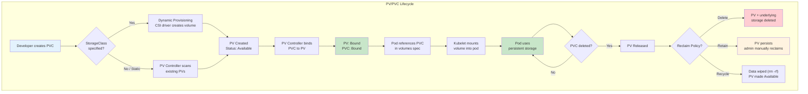
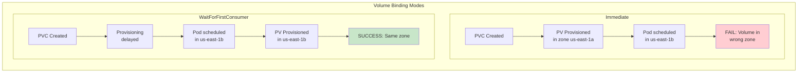

# Persistent Storage Architecture

## 1. Overview

Kubernetes Persistent Volumes (PV) and Persistent Volume Claims (PVC) form the storage abstraction layer that decouples pod workloads from underlying storage infrastructure. A PV is a cluster-level resource representing a piece of physical storage -- a disk on AWS EBS, a share on NFS, or a volume on a SAN. A PVC is a namespace-scoped request for storage that binds to a matching PV, much like a pod consumes compute resources from a node.

This separation of concerns is fundamental: cluster administrators provision storage (PVs), application developers request storage (PVCs), and the Kubernetes control plane handles the matchmaking. Dynamic provisioning via StorageClasses automates the entire lifecycle, eliminating manual PV creation and enabling self-service storage for development teams.

Without persistent storage, every pod restart means data loss. For databases, caches, message queues, and model weight caches, persistent storage is the bridge between Kubernetes' ephemeral compute model and stateful application requirements.

## 2. Why It Matters

- **State survives pod restarts.** When a pod crashes, is rescheduled, or is upgraded, its PVC-backed volume persists. The replacement pod mounts the same data, enabling databases like PostgreSQL to resume without data loss.
- **Decouples storage provisioning from consumption.** Cluster admins manage storage backends (NFS servers, cloud disk APIs, Ceph clusters) while developers simply request "give me 100Gi of fast storage" through PVCs.
- **Dynamic provisioning eliminates tickets.** With StorageClasses, PVCs trigger automatic volume creation. No more waiting days for an ops team to provision a disk -- storage is available in seconds.
- **Access mode control prevents data corruption.** ReadWriteOnce (RWO) ensures only one node writes to a volume, preventing the split-brain corruption that would occur if two database instances wrote to the same block device simultaneously.
- **Capacity planning and enforcement.** PVCs request specific sizes, and Kubernetes enforces these limits. Volume expansion allows growing storage without downtime, preventing the 2 AM "disk full" emergencies.
- **Data lifecycle management.** Reclaim policies (Retain, Delete, Recycle) govern what happens to data when a PVC is released, preventing both accidental data loss and orphaned volume sprawl.

## 3. Core Concepts

- **Persistent Volume (PV):** A cluster-scoped resource representing a provisioned piece of storage. PVs have a lifecycle independent of any pod. They describe the storage type, capacity, access modes, and reclaim policy.
- **Persistent Volume Claim (PVC):** A namespace-scoped request for storage by a user. PVCs specify desired capacity, access mode, and optionally a StorageClass. The control plane binds a PVC to a matching PV.
- **StorageClass:** A template for dynamic provisioning. Defines the provisioner (e.g., `ebs.csi.aws.com`), parameters (volume type, IOPS, encryption), and reclaim policy. When a PVC references a StorageClass, Kubernetes automatically creates a PV.
- **Access Modes:**
  - **ReadWriteOnce (RWO):** Volume can be mounted read-write by a single node. Standard for block storage (EBS, GCE PD). Multiple pods on the same node can share the mount.
  - **ReadOnlyMany (ROX):** Volume can be mounted read-only by many nodes. Useful for shared configuration or pre-loaded model weights.
  - **ReadWriteMany (RWX):** Volume can be mounted read-write by many nodes simultaneously. Requires shared filesystems (NFS, EFS, CephFS, GlusterFS). Essential for multi-replica workloads that write to shared storage.
  - **ReadWriteOncePod (RWOP):** Introduced in Kubernetes 1.27 as GA. Volume can be mounted read-write by a single pod only (stricter than RWO). Prevents even same-node pod contention.
- **Reclaim Policies:**
  - **Retain:** When the PVC is deleted, the PV and its data persist but become "Released" (not available for new claims). An admin must manually reclaim or delete. Use for production databases.
  - **Delete:** When the PVC is deleted, both the PV and underlying storage (e.g., EBS volume) are deleted. Default for dynamic provisioning. Appropriate for ephemeral workloads.
  - **Recycle (deprecated):** Performs a basic `rm -rf` on the volume and makes it available again. Replaced by dynamic provisioning.
- **Volume Binding Mode:**
  - **Immediate:** PV is provisioned and bound as soon as the PVC is created. May provision in a zone where no pod will schedule.
  - **WaitForFirstConsumer:** PV provisioning is delayed until a pod using the PVC is scheduled. Ensures the volume is created in the correct topology (zone/region). Critical for cloud environments.
- **Volume Expansion:** PVCs with `allowVolumeExpansion: true` in their StorageClass can be resized by editing the PVC's `.spec.resources.requests.storage`. The CSI driver handles the underlying resize. File system expansion may require a pod restart depending on the driver.
- **Volume Snapshots:** A point-in-time copy of a PV's data, represented by VolumeSnapshot and VolumeSnapshotContent CRDs. Enables backup, cloning, and disaster recovery without stopping the workload.

## 4. How It Works

### The PV/PVC Binding Lifecycle

The binding process follows a well-defined state machine:

1. **Provisioning:** Either an admin pre-creates a PV (static provisioning) or a StorageClass triggers automatic creation (dynamic provisioning) when a PVC appears.
2. **Binding:** The PV controller watches for unbound PVCs and matches them to available PVs based on capacity, access mode, StorageClass, and label selectors. Once matched, the PVC and PV are bound in a 1:1 relationship.
3. **Using:** A pod references the PVC in its `.spec.volumes` section. The kubelet mounts the volume into the pod's filesystem at the specified `mountPath`. The volume remains mounted for the pod's lifetime.
4. **Releasing:** When the PVC is deleted (not the pod -- the PVC itself), the PV transitions to "Released" state. It retains data but cannot be bound to a new PVC automatically.
5. **Reclaiming:** Based on the reclaim policy, the PV is either deleted (and storage freed), retained for manual recovery, or recycled.

### Static vs. Dynamic Provisioning

**Static provisioning:**
```yaml
# Admin creates the PV manually
apiVersion: v1
kind: PersistentVolume
metadata:
  name: postgres-data-pv
spec:
  capacity:
    storage: 100Gi
  accessModes:
    - ReadWriteOnce
  persistentVolumeReclaimPolicy: Retain
  awsElasticBlockStore:
    volumeID: vol-0a1b2c3d4e5f6g7h8
    fsType: ext4
```

**Dynamic provisioning:**
```yaml
# StorageClass defines HOW to provision
apiVersion: storage.k8s.io/v1
kind: StorageClass
metadata:
  name: fast-ssd
provisioner: ebs.csi.aws.com
parameters:
  type: gp3
  iops: "3000"
  throughput: "125"
  encrypted: "true"
reclaimPolicy: Delete
allowVolumeExpansion: true
volumeBindingMode: WaitForFirstConsumer

---
# Developer just requests storage
apiVersion: v1
kind: PersistentVolumeClaim
metadata:
  name: postgres-data
spec:
  accessModes:
    - ReadWriteOnce
  storageClassName: fast-ssd
  resources:
    requests:
      storage: 100Gi
```

### Volume Expansion

To expand a PVC from 100Gi to 200Gi:

```yaml
# Edit the PVC (StorageClass must have allowVolumeExpansion: true)
apiVersion: v1
kind: PersistentVolumeClaim
metadata:
  name: postgres-data
spec:
  resources:
    requests:
      storage: 200Gi  # Changed from 100Gi
```

The controller will:
1. Call the CSI driver to expand the underlying volume (EBS `ModifyVolume` API).
2. Wait for the volume expansion to complete (EBS resize takes seconds to minutes).
3. Trigger filesystem expansion on the next mount (ext4/xfs online resize).
4. Update PVC status to reflect the new capacity.

Note: Shrinking PVCs is not supported. This is a one-way operation.

### Volume Snapshots

```yaml
# Create a snapshot
apiVersion: snapshot.storage.k8s.io/v1
kind: VolumeSnapshot
metadata:
  name: postgres-data-snap-2024-01-15
spec:
  volumeSnapshotClassName: csi-aws-ebs-snapclass
  source:
    persistentVolumeClaimName: postgres-data

---
# Restore from snapshot into a new PVC
apiVersion: v1
kind: PersistentVolumeClaim
metadata:
  name: postgres-data-restored
spec:
  accessModes:
    - ReadWriteOnce
  storageClassName: fast-ssd
  resources:
    requests:
      storage: 100Gi
  dataSource:
    name: postgres-data-snap-2024-01-15
    kind: VolumeSnapshot
    apiGroup: snapshot.storage.k8s.io
```

### Storage Capacity Tracking

Kubernetes 1.24+ supports CSIStorageCapacity objects that track available capacity per node/topology. The scheduler uses this to avoid placing pods on nodes where the CSI driver cannot provision the requested volume size. This prevents the scenario where a pod is scheduled, the PVC binding fails due to insufficient capacity, and the pod is stuck in `Pending`.

### PV/PVC Status States

Understanding the PV and PVC status states is critical for debugging storage issues:

**PV Phases:**
| Phase | Meaning | Action Required |
|---|---|---|
| **Available** | PV is created and not yet bound to a PVC | None -- waiting for a matching PVC |
| **Bound** | PV is bound to a PVC | Normal operating state |
| **Released** | PVC was deleted, PV retains data but is not available for new claims | Admin must manually reclaim: delete the PV and create a new one, or remove `claimRef` to make it Available again |
| **Failed** | Automatic reclamation failed | Admin intervention required |

**PVC Phases:**
| Phase | Meaning | Common Cause |
|---|---|---|
| **Pending** | PVC is waiting for a PV to bind | No matching PV exists; StorageClass misconfigured; `WaitForFirstConsumer` waiting for pod |
| **Bound** | PVC is bound to a PV | Normal operating state |
| **Lost** | The underlying PV that the PVC was bound to has been deleted | Data loss scenario -- investigate immediately |

**Debugging a stuck PVC:**
```bash
# Check PVC events for binding errors
kubectl describe pvc my-pvc -n my-namespace

# Check if StorageClass exists and is valid
kubectl get storageclass

# Check CSI driver pods are running
kubectl get pods -n kube-system | grep csi

# Check if WaitForFirstConsumer is blocking (no pod using the PVC yet)
kubectl get pvc my-pvc -o jsonpath='{.metadata.annotations}'
```

## 5. Architecture / Flow





## 6. Types / Variants

### Volume Types by Backend

| Volume Type | Access Modes | Performance | Use Case |
|---|---|---|---|
| **AWS EBS (gp3)** | RWO | 3,000 IOPS baseline, up to 16,000 IOPS | General-purpose databases, application state |
| **AWS EBS (io2)** | RWO | Up to 64,000 IOPS, 99.999% durability | High-performance databases (Oracle, SAP HANA) |
| **AWS EFS** | RWX | Elastic throughput, higher latency (~1-5ms) | Shared content, CMS, model weight caching |
| **GCE Persistent Disk (pd-ssd)** | RWO | Up to 100,000 read IOPS, 30,000 write IOPS | GKE databases, analytics |
| **GCE Filestore** | RWX | Up to 480,000 read IOPS (enterprise tier) | Shared workloads on GKE |
| **Azure Disk (Premium SSD v2)** | RWO | Up to 80,000 IOPS | AKS databases |
| **Azure Files** | RWX | SMB/NFS protocol | Shared storage on AKS |
| **NFS** | RWX, ROX | Depends on NFS server (typically 1-10 Gbps) | On-prem shared storage, legacy workloads |
| **CephFS** | RWX | Scales with cluster size | On-prem distributed shared storage |
| **Ceph RBD** | RWO | High IOPS, low latency | On-prem block storage for databases |
| **Longhorn** | RWO, RWX | Moderate (replicated across nodes) | Cloud-native block storage for bare-metal K8s |
| **Local PV** | RWO | Highest (direct NVMe/SSD access) | Databases needing lowest latency (Cassandra, Kafka) |

### StorageClass Tiers (Common Pattern)

```yaml
# Tier 1: High-performance for databases
apiVersion: storage.k8s.io/v1
kind: StorageClass
metadata:
  name: database-premium
provisioner: ebs.csi.aws.com
parameters:
  type: io2
  iops: "10000"
  encrypted: "true"
reclaimPolicy: Retain
allowVolumeExpansion: true
volumeBindingMode: WaitForFirstConsumer

---
# Tier 2: General purpose
apiVersion: storage.k8s.io/v1
kind: StorageClass
metadata:
  name: general-purpose
  annotations:
    storageclass.kubernetes.io/is-default-class: "true"
provisioner: ebs.csi.aws.com
parameters:
  type: gp3
  encrypted: "true"
reclaimPolicy: Delete
allowVolumeExpansion: true
volumeBindingMode: WaitForFirstConsumer

---
# Tier 3: Shared filesystem for multi-reader workloads
apiVersion: storage.k8s.io/v1
kind: StorageClass
metadata:
  name: shared-efs
provisioner: efs.csi.aws.com
parameters:
  provisioningMode: efs-ap
  fileSystemId: fs-0a1b2c3d4e5f6g7h8
  directoryPerms: "700"
reclaimPolicy: Delete
volumeBindingMode: Immediate
```

## 7. Use Cases

- **PostgreSQL on StatefulSet.** Each PostgreSQL replica gets a dedicated PVC via `volumeClaimTemplates`. The PVC uses an SSD-backed StorageClass with `Retain` policy. If a pod is rescheduled, it remounts the same PVC and resumes without data loss. PVC names follow the pattern `data-postgres-0`, `data-postgres-1`, ensuring stable identity.
- **Kafka broker storage.** Kafka brokers require high-throughput sequential I/O. Each broker pod gets a local PV (NVMe) for maximum performance, with replication handled at the Kafka level rather than the storage level. Local PVs use `WaitForFirstConsumer` to bind to the correct node.
- **Shared model weight cache.** A ReadWriteMany EFS volume stores downloaded LLM weights (70GB for a Llama 2 70B model). Multiple inference pods mount the same PVC, avoiding redundant downloads. See [Model and Artifact Delivery](./04-model-and-artifact-delivery.md).
- **CI/CD pipeline caches.** Build pods share a PVC containing dependency caches (Maven `.m2`, npm `node_modules`). A 50Gi PVC reduces build times from 10 minutes to 2 minutes by avoiding full dependency downloads.
- **Backup and disaster recovery.** VolumeSnapshots are taken every 6 hours for production databases. In a disaster, a new PVC is created from the snapshot, and the database pod is pointed at the restored volume. Recovery time: 5-15 minutes depending on snapshot size.

## 8. Tradeoffs

| Decision | Option A | Option B | Guidance |
|---|---|---|---|
| **Static vs Dynamic provisioning** | Static: Full admin control, pre-created | Dynamic: Self-service, automated | Dynamic for all new workloads; static only for migrated legacy volumes |
| **RWO vs RWX** | RWO: Higher performance, simpler semantics | RWX: Multi-node access, shared state | RWO for databases (block storage); RWX only when multiple pods must write to the same filesystem |
| **Retain vs Delete reclaim** | Retain: Data survives PVC deletion | Delete: Clean up automatically | Retain for production databases; Delete for dev/test and ephemeral workloads |
| **Immediate vs WaitForFirstConsumer** | Immediate: Faster binding | WFFC: Topology-aware, avoids zone mismatch | Always use WFFC in multi-zone clusters to prevent scheduling failures |
| **Local PV vs Network PV** | Local: Lowest latency, highest IOPS | Network: Survives node failure, portable | Local for performance-critical workloads with application-level replication (Cassandra, Kafka); network for everything else |
| **Snapshots vs Application-level backup** | Snapshots: Fast, storage-level, crash-consistent | App backup: Application-consistent, portable | Snapshots for RPO < 1 hour; app-level backup (pg_dump, mysqldump) for cross-platform portability |

## 9. Common Pitfalls

- **Using `Immediate` binding in multi-zone clusters.** A PVC is provisioned in `us-east-1a`, but the scheduler places the pod in `us-east-1b`. The pod is stuck in `Pending` forever because EBS volumes cannot cross AZs. Always use `WaitForFirstConsumer` for zonal storage.
- **Forgetting `Retain` for production databases.** The default reclaim policy for dynamically provisioned PVs is `Delete`. If a developer accidentally deletes a PVC, the production database volume is destroyed. Patch StorageClasses or PVs to use `Retain` for critical data.
- **Requesting RWX when RWO suffices.** RWX volumes require network filesystems (EFS, NFS) which have higher latency (1-5ms vs 0.1-0.5ms for EBS). Databases should never use RWX -- they need the low latency and strong consistency of block storage.
- **Not enabling volume expansion.** Without `allowVolumeExpansion: true`, a full PVC requires creating a new larger PVC, copying data, and swapping. This can mean hours of downtime for a terabyte database.
- **Overprovisioning local PVs.** Local PVs consume node disk space. If you provision 8x100Gi local PVs on a node with 1TB of disk, you have zero space for container images, logs, and ephemeral storage. Reserve at least 20% for system overhead.
- **Ignoring storage capacity tracking.** Without CSIStorageCapacity, the scheduler does not know if a node's storage pool has enough free space. Pods may be scheduled, fail to bind their PVC, and sit in `Pending` with a misleading `ProvisioningFailed` event.
- **Snapshot sprawl.** Automated snapshot schedules without retention policies can accumulate thousands of snapshots, costing significant money. AWS EBS snapshots cost $0.05/GB-month. A 500GB volume snapshotted daily for a year generates 365 snapshots -- at ~$25/GB-month incremental cost.

## 10. Real-World Examples

- **Shopify on GKE.** Shopify runs MySQL on Kubernetes using PVCs backed by GCE Persistent Disk SSD. Each MySQL pod gets a 500Gi PVC with `Retain` policy. They use VolumeSnapshots for point-in-time recovery, with a 15-minute RPO during Black Friday/Cyber Monday peak traffic. During peak sale events, the cluster manages over 1,000 active PVCs across multiple GKE regions.
- **Uber's Kafka on local PVs.** Uber runs Kafka brokers on dedicated node pools with local NVMe drives. Each broker uses local PVs for maximum throughput (2+ GB/s sequential write). Kafka's built-in replication (RF=3) replaces storage-level redundancy. Node failure means Kafka rebalances partitions to surviving brokers. Uber manages tens of thousands of Kafka partitions across hundreds of broker pods.
- **Airbnb's ML model storage.** Airbnb uses EFS-backed RWX PVCs to share trained model artifacts across inference pods. A single 1TB EFS volume stores multiple model versions. New pods mount the volume and begin serving in seconds without downloading from S3. This pattern eliminates the 10-15 minute cold-start that would occur if each pod downloaded independently.
- **GitLab on EKS.** GitLab's Helm chart provisions multiple PVCs: a 100Gi gp3 volume for the PostgreSQL database, a 50Gi volume for Redis persistence, and an EFS volume for shared Git repository storage across multiple Gitaly pods. The EFS volume uses `Immediate` binding since it is zone-agnostic.
- **Datadog on multi-cloud K8s.** Datadog runs its observability pipeline on Kubernetes across AWS, GCP, and Azure. Each cloud uses the native CSI driver (EBS CSI, GCE PD CSI, Azure Disk CSI) behind a uniform set of StorageClasses. Application teams deploy the same Helm charts across clouds; only the StorageClass name changes. PVCs range from 10Gi for metadata stores to 2Ti for time-series databases.

### Storage Performance Benchmarking

When selecting storage backends, benchmark with `fio` (Flexible I/O Tester) to validate real-world performance:

```bash
# Sequential write throughput (database WAL pattern)
fio --name=seq-write --ioengine=libaio --iodepth=64 \
    --rw=write --bs=64k --direct=1 --size=10G \
    --filename=/mnt/data/fio-test --runtime=60

# Random read IOPS (database index lookup pattern)
fio --name=rand-read --ioengine=libaio --iodepth=32 \
    --rw=randread --bs=4k --direct=1 --size=10G \
    --filename=/mnt/data/fio-test --runtime=60

# Mixed read/write (general application pattern)
fio --name=mixed --ioengine=libaio --iodepth=32 \
    --rw=randrw --rwmixread=70 --bs=8k --direct=1 --size=10G \
    --filename=/mnt/data/fio-test --runtime=60
```

**Expected results by storage type:**

| Storage Type | Sequential Write | Random Read IOPS | Random Write IOPS | Latency (p99) |
|---|---|---|---|---|
| **AWS EBS gp3 (baseline)** | 125 MB/s | 3,000 | 3,000 | 1-3ms |
| **AWS EBS gp3 (provisioned)** | 1,000 MB/s | 16,000 | 16,000 | 0.5-2ms |
| **AWS EBS io2** | 4,000 MB/s | 64,000 | 64,000 | 0.2-1ms |
| **Local NVMe (i3en)** | 2,000+ MB/s | 400,000+ | 200,000+ | <0.1ms |
| **AWS EFS (elastic)** | 100 MB/s (burst) | ~8,000 | ~8,000 | 1-5ms |
| **GCE pd-ssd** | 1,200 MB/s | 100,000 | 30,000 | 0.3-1ms |

### Ephemeral Volumes vs. Persistent Volumes

Not all storage needs require persistence. Kubernetes offers ephemeral volume types for transient data:

- **emptyDir:** Created when a pod is assigned to a node, deleted when the pod is removed. Backed by node disk or RAM (`medium: Memory`). Use for scratch space, temporary caches, inter-container data sharing within a pod.
- **emptyDir with sizeLimit:** Setting `sizeLimit: 10Gi` prevents a runaway process from filling the node disk. Without this, a pod writing to emptyDir can cause node-level disk pressure, evicting other pods.
- **Generic ephemeral volumes:** Created dynamically per pod using a StorageClass, but deleted when the pod terminates. Useful when you need CSI features (encryption, specific disk types) for transient data.
- **CSI ephemeral volumes:** Inline volumes managed by CSI drivers (e.g., Secrets Store CSI for mounting secrets). No PVC required.

**Decision guide:** Use emptyDir for scratch space under 50Gi. Use generic ephemeral volumes for larger transient data or when CSI features are needed. Use PVCs for any data that must survive pod restarts.

## 11. Related Concepts

- [CSI Drivers and Storage Classes](./02-csi-drivers-and-storage-classes.md) -- the interface between Kubernetes and storage backends
- [Stateful Data Patterns](./03-stateful-data-patterns.md) -- running databases and stateful workloads on Kubernetes
- [Model and Artifact Delivery](./04-model-and-artifact-delivery.md) -- persistent storage patterns for GenAI model weights
- [SQL Databases](../../traditional-system-design/03-storage/01-sql-databases.md) -- database storage fundamentals
- [Object Storage](../../traditional-system-design/03-storage/03-object-storage.md) -- alternative to persistent volumes for large objects

## 12. Source Traceability

- source/youtube-video-reports/7.md -- Kubernetes storage pillar: PVs, PVCs, Storage Classes as the third of five K8s pillars
- Kubernetes official documentation -- PersistentVolume, PersistentVolumeClaim, StorageClass, VolumeSnapshot API references
- AWS EBS CSI Driver documentation -- gp3/io2 performance characteristics, volume expansion behavior
- Kubernetes Enhancement Proposals (KEPs) -- KEP-1472 (Storage Capacity Tracking), KEP-1682 (ReadWriteOncePod), KEP-1790 (Volume Expansion)
