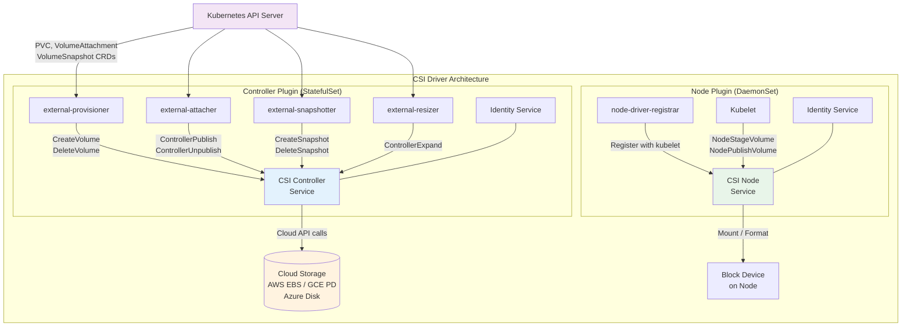
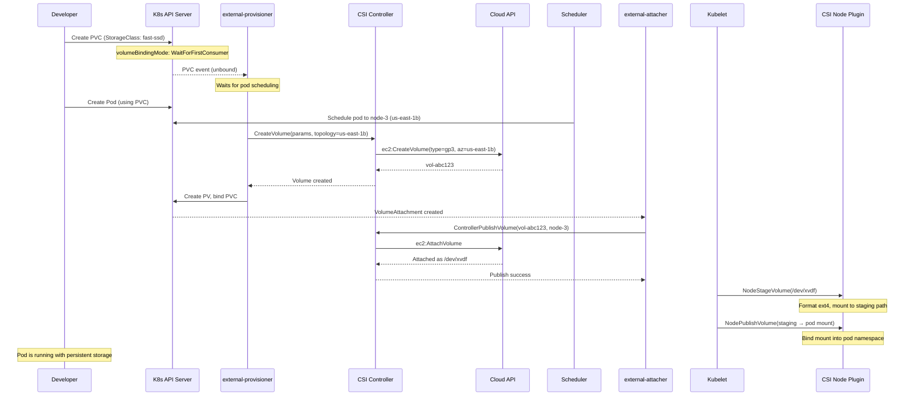

# CSI Drivers and Storage Classes

## 1. Overview

The Container Storage Interface (CSI) is a standard API that enables Kubernetes to interact with arbitrary storage systems without requiring changes to the Kubernetes core codebase. Before CSI, storage drivers were "in-tree" -- compiled directly into the Kubernetes binary. Adding support for a new storage backend required modifying Kubernetes itself, releasing a new version, and waiting for cluster upgrades. CSI decouples this: storage vendors ship their own driver as a set of containers deployed alongside the cluster, implementing a well-defined gRPC interface.

A CSI driver consists of three gRPC services: the Identity service (reports driver capabilities), the Controller service (manages volume lifecycle -- create, delete, snapshot, expand), and the Node service (handles mount/unmount operations on individual nodes). These services run as sidecar containers alongside the driver's core logic, deployed via StatefulSets (controller) and DaemonSets (node plugin).

StorageClasses are the user-facing abstraction built on top of CSI drivers. They define a provisioning template -- which CSI driver to use, what parameters to pass (disk type, IOPS, encryption), and what policies to apply (reclaim, expansion, binding mode). Developers reference a StorageClass in their PVCs; Kubernetes and the CSI driver handle everything else.

## 2. Why It Matters

- **Vendor independence.** CSI decouples storage from Kubernetes releases. Storage vendors can ship, patch, and upgrade their drivers independently. You can upgrade from Kubernetes 1.28 to 1.30 without worrying about storage driver compatibility -- they are separate deployments.
- **Ecosystem breadth.** Over 100 CSI drivers exist, covering every major storage platform: AWS EBS, AWS EFS, GCE PD, Azure Disk, Ceph, NetApp, Dell PowerStore, Pure Storage, Portworx, Longhorn, OpenEBS, and more. Any storage system with a CSI driver works with Kubernetes.
- **Consistent operations model.** All CSI drivers implement the same gRPC interface. Whether you use EBS or Ceph, the PVC/StorageClass workflow is identical. Operations teams learn one model and apply it across storage backends.
- **Advanced features.** CSI enables capabilities that in-tree drivers never supported: volume snapshots, volume cloning, topology-aware provisioning, volume health monitoring, and storage capacity tracking. These features are exposed through standard Kubernetes CRDs.
- **Security isolation.** CSI drivers run as unprivileged containers (where possible) with narrowly scoped RBAC permissions. The node plugin runs privileged only for mount operations. This is safer than in-tree drivers which ran with full kubelet privileges.
- **StorageClasses enable self-service.** Platform teams define tiered StorageClasses (fast-ssd, general-purpose, shared-efs). Application teams choose the appropriate tier without understanding the underlying storage infrastructure.

## 3. Core Concepts

- **CSI Specification:** A vendor-neutral gRPC API specification (currently v1.9.0) defining how container orchestrators interact with storage plugins. Maintained by the Kubernetes Storage SIG and the CSI community.
- **CSI Driver:** An implementation of the CSI specification for a specific storage backend. Consists of a controller component (cluster-wide operations) and a node component (per-node operations).
- **Identity Service:** A gRPC service that reports driver name, version, and capabilities (e.g., does this driver support snapshots? volume expansion? cloning?). Both controller and node components implement this.
- **Controller Service:** A gRPC service handling cluster-level operations: `CreateVolume`, `DeleteVolume`, `CreateSnapshot`, `DeleteSnapshot`, `ControllerExpandVolume`, `ValidateVolumeCapabilities`. Runs as a Deployment or StatefulSet -- only one active instance needed.
- **Node Service:** A gRPC service handling node-level operations: `NodeStageVolume` (attach and format), `NodePublishVolume` (mount into pod), `NodeUnpublishVolume`, `NodeUnstageVolume`. Runs as a DaemonSet -- one instance per node.
- **CSI Sidecars:** Kubernetes-maintained containers that bridge between Kubernetes API objects and CSI gRPC calls. Key sidecars:
  - **external-provisioner:** Watches for PVCs and calls `CreateVolume`/`DeleteVolume`.
  - **external-attacher:** Watches for VolumeAttachment objects and calls `ControllerPublishVolume`.
  - **external-snapshotter:** Watches for VolumeSnapshot CRs and calls `CreateSnapshot`.
  - **external-resizer:** Watches for PVC size changes and calls `ControllerExpandVolume`.
  - **node-driver-registrar:** Registers the node plugin with the kubelet.
  - **livenessprobe:** Monitors driver health via gRPC health checks.
- **StorageClass:** A Kubernetes API object that defines a provisioning profile. Specifies the provisioner (CSI driver name), parameters (passed to `CreateVolume`), reclaim policy, volume binding mode, and allowed topologies.
- **Volume Binding Mode:** Controls when PV provisioning occurs relative to pod scheduling. `Immediate` provisions on PVC creation; `WaitForFirstConsumer` delays until a pod is scheduled, enabling topology-aware placement.
- **Topology-Aware Provisioning:** The CSI driver reports available topologies (zones, regions, racks) via `TopologyRequirement`. The scheduler ensures the volume is created in the same topology as the pod. Critical for zonal block storage (EBS, GCE PD).

## 4. How It Works

### CSI Driver Deployment Architecture

A typical CSI driver deployment consists of two components:

**Controller Plugin (StatefulSet/Deployment, 1-3 replicas):**
```
Pod:
  - csi-driver-controller (main driver container)
  - external-provisioner (sidecar)
  - external-attacher (sidecar)
  - external-snapshotter (sidecar)
  - external-resizer (sidecar)
  - livenessprobe (sidecar)
```

**Node Plugin (DaemonSet, one per node):**
```
Pod:
  - csi-driver-node (main driver container)
  - node-driver-registrar (sidecar)
  - livenessprobe (sidecar)
```

### Volume Provisioning Flow (Dynamic)

1. Developer creates a PVC referencing StorageClass `fast-ssd`.
2. The **external-provisioner** sidecar detects the unbound PVC.
3. It calls the CSI driver's `CreateVolume` gRPC endpoint with parameters from the StorageClass (type=gp3, iops=3000, encrypted=true) and topology requirements.
4. The CSI driver calls the cloud API (e.g., AWS `ec2:CreateVolume`) and returns the volume ID.
5. The external-provisioner creates a PV object bound to the PVC.
6. When a pod using this PVC is scheduled to a node, the **external-attacher** calls `ControllerPublishVolume` to attach the volume to the node (e.g., AWS `ec2:AttachVolume`).
7. The kubelet calls the node plugin's `NodeStageVolume` (format the block device if needed) and `NodePublishVolume` (mount into the pod's filesystem namespace).
8. The pod can now read and write to the mounted path.

### Volume Deletion Flow

1. Pod is deleted. Kubelet calls `NodeUnpublishVolume` and `NodeUnstageVolume`.
2. External-attacher calls `ControllerUnpublishVolume` to detach from the node.
3. PVC is deleted. Based on reclaim policy:
   - **Delete:** External-provisioner calls `DeleteVolume`, which triggers the cloud API to destroy the disk.
   - **Retain:** PV moves to "Released" state. No deletion occurs.

### StorageClass Parameters (AWS EBS CSI Example)

```yaml
apiVersion: storage.k8s.io/v1
kind: StorageClass
metadata:
  name: high-perf-ebs
provisioner: ebs.csi.aws.com
parameters:
  type: io2                          # Volume type: gp2, gp3, io1, io2, st1, sc1
  iops: "10000"                      # Provisioned IOPS (io1/io2/gp3 only)
  throughput: "500"                   # MB/s throughput (gp3 only)
  encrypted: "true"                  # Encrypt at rest with KMS
  kmsKeyId: "arn:aws:kms:us-east-1:123456789:key/abc-123"  # Custom KMS key
  fsType: ext4                       # Filesystem type: ext4, xfs
  blockSize: "4096"                  # Block size for filesystem
reclaimPolicy: Retain
allowVolumeExpansion: true
volumeBindingMode: WaitForFirstConsumer
allowedTopologies:
  - matchLabelExpressions:
      - key: topology.ebs.csi.aws.com/zone
        values:
          - us-east-1a
          - us-east-1b
          - us-east-1c
mountOptions:
  - noatime                          # Disable access time updates for performance
  - nodiratime
```

### Topology-Aware Provisioning

Without topology awareness:
1. PVC created with `Immediate` binding.
2. CSI driver creates EBS volume in `us-east-1a` (random or first available).
3. Scheduler places pod on a node in `us-east-1b`.
4. Volume cannot attach cross-zone. Pod stuck in `Pending`.

With topology awareness (`WaitForFirstConsumer`):
1. PVC created. No volume provisioned yet.
2. Scheduler selects a node in `us-east-1b` for the pod.
3. CSI driver creates EBS volume in `us-east-1b` (matching pod's node topology).
4. Volume attaches successfully. Pod starts.

For multi-zone clusters, `WaitForFirstConsumer` is not optional -- it is required for correctness.

### Volume Cloning

CSI drivers that support cloning allow creating a new PVC pre-populated with data from an existing PVC. Cloning is faster than snapshot-restore for same-zone operations because it uses copy-on-write at the storage layer.

```yaml
apiVersion: v1
kind: PersistentVolumeClaim
metadata:
  name: postgres-data-clone
spec:
  accessModes:
    - ReadWriteOnce
  storageClassName: fast-ssd
  resources:
    requests:
      storage: 100Gi
  dataSource:
    kind: PersistentVolumeClaim
    name: postgres-data  # Source PVC
```

**Clone vs. Snapshot-Restore:**
- Cloning: Same-zone only, near-instant for copy-on-write backends, source PVC must be in same namespace.
- Snapshot-Restore: Cross-zone capable, snapshot must complete first (~1-5 seconds for EBS), can restore into a different namespace.

### CSI Volume Health Monitoring

Kubernetes 1.28+ supports volume health monitoring through the CSI `NodeGetVolumeStats` and `VolumeCondition` mechanisms. The CSI driver reports volume health anomalies (I/O errors, volume detachment) to the kubelet, which surfaces them as events on the PVC.

This is critical for databases: a silently degraded EBS volume (elevated I/O latency, pending I/O operations) can cause database performance degradation long before an outright failure. Health monitoring enables proactive alerting.

## 5. Architecture / Flow





## 6. Types / Variants

### Popular CSI Drivers

| Driver | Provider | Storage Type | Access Modes | Key Features |
|---|---|---|---|---|
| **AWS EBS CSI** | AWS | Block (EBS) | RWO, RWOP | gp3/io2/st1 types, encryption, snapshots, 64K IOPS max |
| **AWS EFS CSI** | AWS | Shared filesystem (NFS) | RWX, ROX, RWO | Elastic capacity, multi-AZ, access points |
| **AWS FSx for Lustre CSI** | AWS | High-perf parallel FS | RWX | Up to 1 TB/s throughput, ML training workloads |
| **GCE PD CSI** | GCP | Block (Persistent Disk) | RWO, ROX, RWOP | pd-ssd (100K read IOPS), pd-balanced, regional PDs |
| **GCP Filestore CSI** | GCP | Shared filesystem (NFS) | RWX | Basic (1TB min) to Enterprise (480K IOPS) tiers |
| **Azure Disk CSI** | Azure | Block (Managed Disk) | RWO | Premium SSD v2 (80K IOPS), Ultra Disk (160K IOPS) |
| **Azure File CSI** | Azure | Shared filesystem (SMB/NFS) | RWX | SMB 3.0 and NFS 4.1 support |
| **Ceph-CSI (RBD)** | Open source | Block (RADOS Block Device) | RWO | Distributed, self-healing, on-prem and hybrid |
| **Ceph-CSI (CephFS)** | Open source | Shared filesystem | RWX | POSIX-compliant, scales to petabytes |
| **Longhorn** | CNCF/SUSE | Block (replicated) | RWO, RWX | Built for K8s, UI dashboard, cross-node replication |
| **OpenEBS** | CNCF | Block (various engines) | RWO | Mayastor (NVMe-oF), cStor, Jiva engines |
| **Portworx** | Pure Storage | Block + shared | RWO, RWX | Enterprise features, encryption, DR, autopilot |
| **Rook-Ceph** | CNCF | Block + shared | RWO, RWX | Ceph operator for K8s, manages Ceph cluster lifecycle |
| **NFS Subdir External** | Community | NFS share | RWX | Simple NFS provisioner, creates subdirectories per PVC |
| **MinIO CSI** | MinIO | Object (S3-compatible) | RWX | S3-compatible storage exposed as filesystem |
| **SeaweedFS CSI** | Open source | Object + file | RWX | Distributed storage, S3 + POSIX interfaces |

### Cloud Provider Comparison

| Feature | AWS EBS CSI | GCE PD CSI | Azure Disk CSI |
|---|---|---|---|
| **Max IOPS** | 64,000 (io2) | 100,000 (pd-ssd) | 160,000 (Ultra) |
| **Max throughput** | 4,000 MB/s (io2) | 2,400 MB/s (Hyperdisk) | 4,000 MB/s (Ultra) |
| **Max volume size** | 64 TiB | 64 TiB | 64 TiB |
| **Multi-attach** | io1/io2 only (up to 16 nodes) | Multi-writer flag | Ultra Disk shared |
| **Snapshots** | Yes (incremental) | Yes (incremental) | Yes (incremental) |
| **Encryption** | AES-256 (KMS) | AES-256 (CMEK) | AES-256 (CMK) |
| **Cross-zone** | No (single-AZ) | Regional PD (2 zones) | ZRS (3 zones) |
| **Volume expansion** | Online | Online | Online |

### On-Premises CSI Driver Decision Tree

| Requirement | Recommended Driver | Why |
|---|---|---|
| Block storage, production databases | Ceph RBD (via Rook) | Battle-tested, self-healing, strong consistency |
| Shared filesystem, many readers | CephFS (via Rook) | POSIX, scalable, multi-writer |
| Simple block storage, no Ceph expertise | Longhorn | Easy to deploy, K8s-native UI, adequate for small clusters |
| Maximum NVMe performance | OpenEBS Mayastor | NVMe-oF protocol, minimal overhead |
| Existing NFS infrastructure | NFS Subdir External | Zero new infrastructure, simple setup |
| Enterprise support required | Portworx | Commercial support, advanced features (DR, autopilot) |

## 7. Use Cases

- **Multi-tier StorageClasses for a SaaS platform.** A platform team defines three StorageClasses: `database-io2` (io2, 10K IOPS, Retain), `app-gp3` (gp3, 3K IOPS, Delete), and `shared-efs` (EFS, RWX). Development teams select the appropriate class in their Helm values. The platform team controls cost and performance without micromanaging individual PVCs.
- **Migrating from in-tree to CSI.** A cluster running Kubernetes 1.26 uses the deprecated in-tree `kubernetes.io/aws-ebs` provisioner. The team deploys the EBS CSI driver, creates new StorageClasses pointing to `ebs.csi.aws.com`, and uses the CSI Migration feature to transparently redirect existing PVs to the CSI driver without data migration.
- **Topology-constrained GPU workloads.** GPU nodes are available only in `us-east-1a` and `us-east-1c`. The StorageClass uses `allowedTopologies` to restrict volume provisioning to those zones, preventing volumes from being created in `us-east-1b` where no GPU nodes exist.
- **Snapshot-based development environments.** A nightly CronJob creates VolumeSnapshots of the production database. Developers create PVCs from these snapshots to get production-like data in their dev namespaces. Each snapshot-based PVC provisions in seconds (copy-on-write) rather than the hours a `pg_dump`/`pg_restore` would take.
- **Ceph-CSI for air-gapped on-premises clusters.** A defense contractor runs Kubernetes in an air-gapped data center with no cloud APIs. Rook deploys and manages a Ceph cluster across dedicated storage nodes. Ceph-CSI provides both RBD (block) for databases and CephFS (shared) for distributed training data, all without internet connectivity.

## 8. Tradeoffs

| Decision | Option A | Option B | Guidance |
|---|---|---|---|
| **Cloud CSI vs. third-party CSI** | Cloud-native (EBS CSI): Tight integration, managed | Third-party (Portworx, Longhorn): Portable, extra features | Cloud CSI for single-cloud; third-party for multi-cloud or hybrid |
| **Block (RBD/EBS) vs. Filesystem (CephFS/EFS)** | Block: Low latency (~0.1-0.5ms), high IOPS | Filesystem: RWX support, higher latency (~1-5ms) | Block for databases; filesystem for shared read-heavy workloads |
| **Rook-Ceph vs. Longhorn** | Rook-Ceph: Production-grade, complex to operate | Longhorn: Simple, lighter, less battle-tested at scale | Rook-Ceph for 50+ node clusters; Longhorn for smaller deployments |
| **Immediate vs. WaitForFirstConsumer** | Immediate: Faster PVC binding | WFFC: Topology-correct, avoids zone mismatch | WFFC is always preferred for zonal storage; Immediate only for zone-agnostic backends (EFS, NFS) |
| **Single StorageClass vs. tiered** | Single: Simple, one-size-fits-all | Tiered: Right-sized cost/performance per workload | Tiered in production (2-4 classes); single in development |
| **Encryption at CSI level vs. application level** | CSI encryption: Transparent, covers all data on disk | App encryption: Selective, portable across storage backends | CSI encryption as baseline; app encryption for compliance requirements (HIPAA, PCI) that mandate application-layer control |

## 9. Common Pitfalls

- **Not installing the CSI driver.** Kubernetes 1.26+ removed in-tree cloud storage provisioners. If you upgrade without deploying the CSI driver, all new PVCs fail with `no provisioner found for StorageClass`. The EBS CSI driver is not installed by default on EKS -- you must deploy it as an EKS addon or Helm chart.
- **Running CSI controller on spot/preemptible nodes.** The controller plugin handles volume create/delete/attach. If its node is preempted during a volume operation, the operation may hang or fail. Pin CSI controllers to on-demand nodes using node affinity.
- **Ignoring CSI driver resource limits.** Under high PVC churn (100+ PVCs created simultaneously), the external-provisioner and CSI controller can become CPU/memory-bound. Set appropriate resource requests (100m CPU, 128Mi RAM minimum) and limits.
- **Mismatched CSI driver and Kubernetes versions.** CSI sidecars have minimum Kubernetes version requirements. Running a newer sidecar on an older cluster, or vice versa, can cause silent failures. Always check the compatibility matrix in the driver's release notes.
- **Forgetting `volumeBindingMode: WaitForFirstConsumer`.** This is the single most common storage misconfiguration in multi-zone clusters. It causes PVCs to provision in the wrong zone, leading to pods stuck in `Pending`. Make WFFC the default for all block storage classes.
- **StorageClass parameter typos.** Parameters like `type: gp3` are passed as opaque strings to the CSI driver. A typo like `type: gp33` is not validated by Kubernetes -- it is passed to the driver, which returns a cryptic error from the cloud API. Test StorageClasses by creating a test PVC before rolling out to production.
- **Not monitoring CSI driver health.** CSI drivers can crash, lose connection to the cloud API, or exhaust cloud API rate limits. Deploy monitoring for the CSI driver pods and set alerts on the `csi_operations_seconds` metric for latency spikes and errors.
- **Cloud API rate limits during mass provisioning.** Creating 100 PVCs simultaneously triggers 100 cloud API calls. AWS EC2 API has a default rate limit of ~100 requests/second. Batch operations or stagger PVC creation to avoid throttling errors.

## 10. Real-World Examples

- **Netflix on AWS.** Netflix uses the EBS CSI driver with custom StorageClasses tuned per workload: io2 for Cassandra (high random IOPS), gp3 for application state, and st1 for log aggregation (high throughput, low cost). They manage over 100,000 EBS volumes across their EKS clusters. Their StorageClass hierarchy includes 5 tiers, each with specific IOPS, throughput, and encryption settings, managed via Terraform.
- **CERN on Ceph-CSI.** CERN's physics computing infrastructure uses Rook-Ceph to manage a multi-petabyte Ceph cluster on Kubernetes. CephFS provides shared storage for physics analysis workloads, while RBD provides block storage for databases. The cluster handles thousands of simultaneous PVCs across hundreds of nodes. The Rook operator automates OSD management, pool creation, and health monitoring for a 500+ OSD cluster.
- **Rancher/SUSE with Longhorn.** Rancher's downstream clusters (edge, retail, manufacturing) use Longhorn as a lightweight CSI driver. Longhorn runs on the same nodes as application workloads (no dedicated storage nodes), replicates data across 3 nodes, and provides a web UI for volume management. It handles 1,000-2,000 IOPS per volume -- adequate for edge workloads. Longhorn's ReadWriteMany support (via NFS) enables shared storage for small-scale multi-reader workloads.
- **Platform9 on OpenEBS Mayastor.** Platform9's managed Kubernetes service uses OpenEBS Mayastor for customers requiring bare-metal NVMe performance on-premises. Mayastor uses NVMe-over-Fabrics (NVMe-oF) for sub-millisecond latency and delivers 100K+ IOPS per volume on commodity hardware. Mayastor's Rust-based data plane provides memory-safe, high-performance I/O without the JVM overhead of older storage solutions.
- **Spotify on GKE.** Spotify uses the GCE PD CSI driver for their data infrastructure on GKE. Bigtable and Cassandra workloads use pd-ssd StorageClasses for low-latency random reads. Their ML training pipelines use Filestore (RWX) StorageClasses for shared dataset access across hundreds of training pods. They maintain separate StorageClasses per team, with cost attribution via Kubernetes labels.

### CSI Migration: In-Tree to CSI

Kubernetes provides a transparent migration path from deprecated in-tree volume plugins to CSI drivers:

**How CSI migration works:**
1. Enable the `CSIMigration` and `CSIMigrationAWS` (or equivalent) feature gates on the kube-controller-manager and kubelet.
2. When a PVC references an in-tree provisioner (e.g., `kubernetes.io/aws-ebs`), Kubernetes transparently redirects all API calls to the corresponding CSI driver (`ebs.csi.aws.com`).
3. Existing PVs are not modified. The redirection happens at the API translation layer.
4. No data migration is required. Existing volumes continue to work.

**Migration timeline:**
- Kubernetes 1.23: CSI migration for AWS EBS, GCE PD, Azure Disk moved to GA.
- Kubernetes 1.25: In-tree drivers deprecated.
- Kubernetes 1.26: In-tree provisioners removed. CSI migration is mandatory.
- Kubernetes 1.27+: Only CSI drivers are supported for new PVCs.

**Migration checklist:**
1. Deploy the CSI driver (e.g., EBS CSI driver as an EKS addon).
2. Verify CSI driver is healthy: `kubectl get pods -n kube-system | grep ebs-csi`.
3. Create a test PVC using the CSI-based StorageClass and verify binding.
4. Update StorageClasses to reference the CSI provisioner.
5. Existing PVCs continue to work via the migration shim -- no action needed.
6. New PVCs should use the CSI-based StorageClass directly.

### Monitoring CSI Drivers

CSI drivers expose metrics via Prometheus that are critical for operational visibility:

| Metric | Description | Alert Threshold |
|---|---|---|
| `csi_operations_seconds_bucket` | Histogram of CSI gRPC operation durations | p99 > 30s for CreateVolume |
| `csi_sidecar_operations_seconds_count` | Count of operations per sidecar | Error rate > 5% |
| `kubelet_volume_stats_available_bytes` | Available bytes on mounted volumes | < 10% capacity remaining |
| `kubelet_volume_stats_used_bytes` | Used bytes on mounted volumes | > 90% capacity |
| `kubelet_volume_stats_inodes_free` | Free inodes on mounted volumes | < 5% inodes remaining |
| `pv_collector_bound_pv_count` | Count of bound PVs | Unexpected decrease (data loss indicator) |
| `pv_collector_unbound_pv_count` | Count of unbound PVs | Sustained increase (provisioning failure) |

**Grafana dashboard essentials:**
- Volume utilization per namespace (bytes used vs. capacity).
- PVC binding latency distribution (time from PVC creation to Bound status).
- CSI operation error rate by operation type (CreateVolume, DeleteVolume, ExpandVolume).
- Cloud API rate limit proximity (for cloud CSI drivers).

```yaml
# PrometheusRule for CSI alerting
apiVersion: monitoring.coreos.com/v1
kind: PrometheusRule
metadata:
  name: csi-alerts
spec:
  groups:
    - name: csi-storage
      rules:
        - alert: PVCAlmostFull
          expr: |
            kubelet_volume_stats_used_bytes / kubelet_volume_stats_capacity_bytes > 0.9
          for: 15m
          labels:
            severity: warning
          annotations:
            summary: "PVC {{ $labels.persistentvolumeclaim }} is >90% full"
        - alert: CSIProvisioningFailed
          expr: |
            increase(csi_sidecar_operations_seconds_count{method_name="CreateVolume",grpc_status_code!="OK"}[5m]) > 0
          for: 5m
          labels:
            severity: critical
          annotations:
            summary: "CSI volume provisioning failures detected"
```

## 11. Related Concepts

- [Persistent Storage Architecture](./01-persistent-storage-architecture.md) -- PV/PVC lifecycle that CSI drivers implement
- [Stateful Data Patterns](./03-stateful-data-patterns.md) -- database and stateful workload patterns built on CSI storage
- [Model and Artifact Delivery](./04-model-and-artifact-delivery.md) -- CSI-based storage for GenAI model weights
- [Object Storage](../../traditional-system-design/03-storage/03-object-storage.md) -- S3/GCS as an alternative to CSI-provisioned volumes
- [SQL Databases](../../traditional-system-design/03-storage/01-sql-databases.md) -- database workloads that depend on CSI storage performance

## 12. Source Traceability

- source/youtube-video-reports/7.md -- Kubernetes storage pillar: PVs, PVCs, Storage Classes as foundational concepts
- CSI Specification v1.9.0 -- gRPC service definitions (Identity, Controller, Node), capability reporting
- Kubernetes CSI Developer Documentation -- sidecar containers, deployment patterns, topology support
- AWS EBS CSI Driver GitHub repository -- StorageClass parameters, supported features, migration guide
- Rook-Ceph documentation -- Ceph operator architecture, CephCluster CRD, storage class configuration
- Longhorn documentation -- architecture, replica management, UI dashboard
