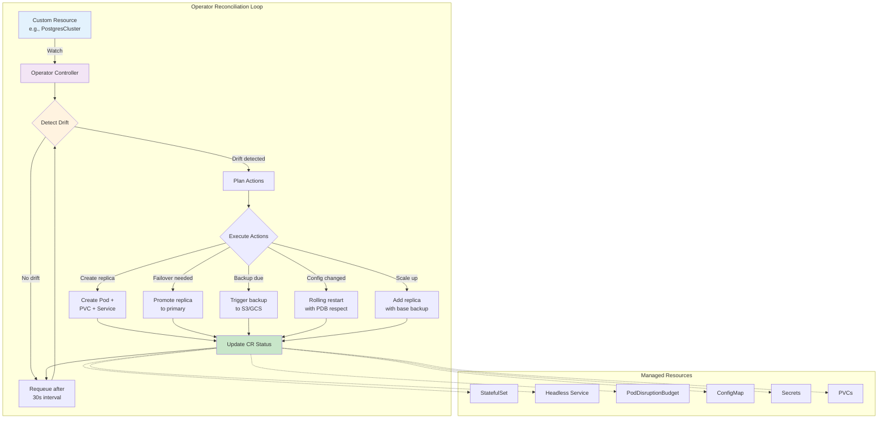
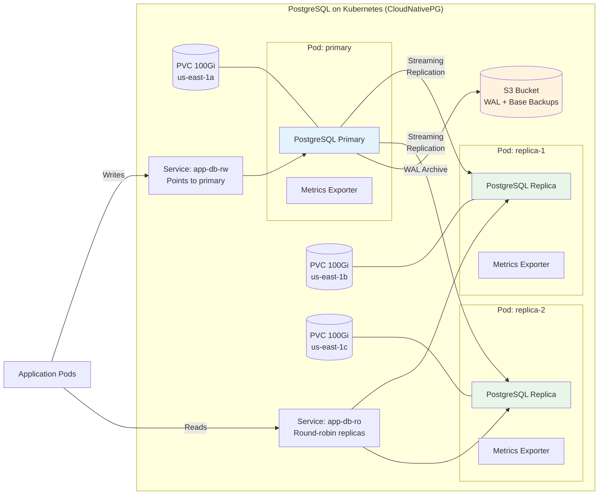

# Stateful Data Patterns

## 1. Overview

Running stateful workloads on Kubernetes -- databases, message brokers, caches, and search engines -- is one of the most consequential architectural decisions a platform team makes. Kubernetes was designed for stateless workloads, and its core primitives (pods are ephemeral, nodes are interchangeable, scaling means adding identical replicas) work against the requirements of stateful systems (data durability, stable network identity, ordered startup/shutdown, quorum maintenance).

The Kubernetes Operator pattern bridges this gap. An operator encodes domain-specific operational knowledge (how to bootstrap a PostgreSQL cluster, how to rebalance Kafka partitions, how to perform a zero-downtime failover) into a custom controller that watches custom resources and reconciles the desired state. Instead of an SRE manually running `pg_basebackup` to create a replica, the operator detects the desired replica count, provisions a PVC, runs the base backup, configures streaming replication, and updates the cluster status -- all automatically.

This file covers the major stateful workload patterns on Kubernetes: relational databases (PostgreSQL, CockroachDB, Vitess), message brokers (Kafka via Strimzi), caches (Redis), search engines (Elasticsearch/OpenSearch), backup/restore strategies with Velero, and the critical question of when NOT to run databases on Kubernetes.

## 2. Why It Matters

- **Unified infrastructure management.** Running databases alongside application workloads on Kubernetes means one control plane, one monitoring stack, one CI/CD pipeline, and one team. No separate "database team" managing a fleet of VMs with different tooling.
- **Automated Day 2 operations.** Operators automate the hardest parts of database management: failover, backup, scaling, minor version upgrades, certificate rotation, and connection pooling. These operations previously required runbooks and on-call humans.
- **Faster development cycles.** Developers can spin up a production-like PostgreSQL cluster in their namespace with a single YAML file. No tickets, no waiting for DBA provisioning. Development, staging, and production use the same operator and configuration.
- **Cost optimization.** Kubernetes bin-packing places database pods alongside application pods on shared nodes (for non-critical workloads) or on dedicated node pools (for production). This is more efficient than dedicated VMs where each database has its own oversized instance.
- **Disaster recovery.** Operators combined with Velero enable automated backup schedules, cross-region snapshot replication, and point-in-time recovery. Recovery from backup becomes a declarative operation rather than a manual procedure.
- **Edge and air-gapped deployments.** When managed database services (RDS, Cloud SQL) are unavailable -- edge locations, air-gapped networks, sovereign clouds -- Kubernetes operators are the only path to automated database management.

## 3. Core Concepts

- **StatefulSet:** The Kubernetes workload controller for stateful applications. Provides stable network identity (pod-0, pod-1), ordered deployment/scaling, and persistent storage via `volumeClaimTemplates`. Each pod gets a unique PVC that follows it across rescheduling.
- **Operator Pattern:** A custom controller that extends Kubernetes with domain-specific automation. An operator watches a Custom Resource (e.g., `PostgresCluster`) and reconciles the actual state to match the desired state. The reconciliation loop is the core of the pattern.
- **Custom Resource Definition (CRD):** Extends the Kubernetes API with new resource types (e.g., `KafkaCluster`, `RedisFailover`). CRDs define the schema; the operator implements the behavior.
- **Headless Service:** A Service with `clusterIP: None` that does not load-balance. Instead, DNS returns the individual pod IPs, enabling direct pod-to-pod communication required for database replication.
- **Pod Disruption Budget (PDB):** Limits the number of pods that can be simultaneously unavailable during voluntary disruptions (node drain, rolling update). For a 3-node PostgreSQL cluster, a PDB of `minAvailable: 2` prevents Kubernetes from draining two replicas at once, maintaining quorum.
- **Init Containers:** Containers that run before the main container starts. Used to prepare the data directory, restore from backup, or wait for dependencies. A PostgreSQL replica's init container might run `pg_basebackup` to clone data from the primary before starting the replica.
- **Sidecar Containers:** Containers running alongside the main container in the same pod. Common sidecars for databases include connection poolers (PgBouncer), metric exporters (postgres_exporter), and backup agents.
- **Anti-Affinity Rules:** Pod scheduling constraints that spread database replicas across different nodes (or zones) to survive node (or zone) failures. A `requiredDuringSchedulingIgnoredDuringExecution` anti-affinity ensures no two PostgreSQL pods land on the same node.

## 4. How It Works

### The Operator Reconciliation Loop

Every operator follows the same pattern:

1. **Watch:** The operator registers watches on its Custom Resources and related Kubernetes objects (Pods, PVCs, Services, ConfigMaps).
2. **Detect drift:** When a resource changes (or periodically), the reconciler compares desired state (the CR spec) with actual state (Kubernetes objects + application state).
3. **Plan:** The reconciler determines what actions are needed: create a replica, trigger a failover, run a backup, update a ConfigMap.
4. **Act:** The reconciler executes the plan by creating/updating/deleting Kubernetes objects and (for some operators) making direct API calls to the database.
5. **Update status:** The reconciler updates the CR's `.status` field with the current state, conditions, and any errors.
6. **Requeue:** If the reconciliation is incomplete (e.g., waiting for a PVC to bind), the reconciler requeues the item for re-processing after a delay.

### PostgreSQL on Kubernetes: CloudNativePG

CloudNativePG (CNPG) is the most widely adopted PostgreSQL operator for Kubernetes, donated to the CNCF as a sandbox project.

**Architecture:**
- A `Cluster` CRD defines the desired PostgreSQL cluster: instance count, storage size, PostgreSQL version, backup configuration.
- The operator creates a primary pod and N-1 replica pods, each with its own PVC.
- Replicas use PostgreSQL streaming replication (synchronous or asynchronous).
- Failover is automatic: if the primary pod fails health checks for 30 seconds (configurable), the operator promotes the most up-to-date replica.
- Backups are continuous: WAL archiving to S3/GCS/Azure Blob via Barman, with configurable base backup schedules.

**Example:**
```yaml
apiVersion: postgresql.cnpg.io/v1
kind: Cluster
metadata:
  name: app-db
spec:
  instances: 3
  postgresql:
    parameters:
      shared_buffers: "256MB"
      max_connections: "200"
      wal_level: "replica"
  storage:
    size: 100Gi
    storageClass: database-premium
  backup:
    barmanObjectStore:
      destinationPath: s3://backups/app-db/
      s3Credentials:
        accessKeyId:
          name: s3-creds
          key: ACCESS_KEY_ID
        secretAccessKey:
          name: s3-creds
          key: SECRET_ACCESS_KEY
      wal:
        compression: gzip
      data:
        compression: gzip
    retentionPolicy: "30d"
  affinity:
    enablePodAntiAffinity: true
    topologyKey: topology.kubernetes.io/zone
  resources:
    requests:
      cpu: "2"
      memory: 4Gi
    limits:
      cpu: "4"
      memory: 8Gi
```

This single YAML file creates a 3-instance PostgreSQL cluster spread across availability zones, with automated WAL archiving to S3, 30-day backup retention, and automatic failover.

### PostgreSQL: Zalando Postgres Operator

Zalando's operator takes a different approach:
- Uses a `postgresql` CRD with Patroni for consensus-based leader election (backed by Kubernetes endpoints or etcd).
- Integrates with Spilo (a Docker image containing PostgreSQL + Patroni + WAL-E/WAL-G).
- Supports logical replication, connection pooling via built-in PgBouncer sidecar, and team-based access control.
- More opinionated about infrastructure (assumes AWS, supports S3 for backups) but has years of Zalando production usage behind it.

### CockroachDB on Kubernetes

CockroachDB is a distributed SQL database designed for Kubernetes-like environments:
- Nodes are symmetric -- no primary/replica distinction. Any node can serve reads and writes.
- Uses Raft consensus for data replication (RF=3 by default).
- The CockroachDB operator manages a StatefulSet with anti-affinity to spread nodes across zones.
- Storage: Each node gets a PVC (SSD-backed, typically 100Gi-1Ti). CockroachDB handles data distribution and rebalancing.
- Scaling: Add nodes by increasing `spec.nodes`. CockroachDB automatically rebalances data to the new nodes.
- Production sizing: 3 nodes minimum. 4 vCPU, 16 GiB RAM per node for production workloads. 2:1 disk-to-memory ratio recommended.

### Vitess on Kubernetes

Vitess is a database clustering system for horizontal scaling of MySQL:
- Splits data across multiple MySQL instances (shards) with automatic routing.
- Components: VTGate (query router), VTTablet (MySQL sidecar), VTCtld (control plane), etcd/ZooKeeper (topology store).
- The PlanetScaleDB operator (or Vitess Operator) manages the entire topology.
- Used by YouTube, Slack, Square, and GitHub to scale MySQL beyond single-instance limits.
- Sharding is transparent to the application -- VTGate rewrites queries to target the correct shard.

### Kafka on Kubernetes: Strimzi

Strimzi is the CNCF operator for running Apache Kafka on Kubernetes:

**Components managed by Strimzi:**
- Kafka brokers (StatefulSet with PVCs)
- ZooKeeper ensemble (StatefulSet) or KRaft mode (no ZooKeeper, Kafka 3.5+)
- Kafka Connect (for connector plugins)
- MirrorMaker 2 (for cross-cluster replication)
- Schema Registry (Apicurio or Confluent)
- Kafka Bridge (HTTP interface)

**Key configuration:**
```yaml
apiVersion: kafka.strimzi.io/v1beta2
kind: Kafka
metadata:
  name: event-bus
spec:
  kafka:
    version: 3.7.0
    replicas: 3
    config:
      offsets.topic.replication.factor: 3
      transaction.state.log.replication.factor: 3
      transaction.state.log.min.isr: 2
      default.replication.factor: 3
      min.insync.replicas: 2
      log.retention.hours: 168
    storage:
      type: persistent-claim
      size: 500Gi
      class: high-throughput-ssd
      deleteClaim: false
    resources:
      requests:
        cpu: "2"
        memory: 8Gi
      limits:
        cpu: "4"
        memory: 12Gi
    rack:
      topologyKey: topology.kubernetes.io/zone
  zookeeper:
    replicas: 3
    storage:
      type: persistent-claim
      size: 50Gi
      class: general-purpose
```

**Performance considerations:**
- Kafka brokers need high sequential I/O throughput (500 MB/s+). Use gp3 with provisioned throughput or local NVMe.
- Each broker's log directory should be on its own PVC. A 500Gi PVC per broker supports ~7 days retention at 1 GB/min ingestion.
- Network throughput matters: a 3-broker cluster with RF=3 amplifies write traffic 3x. Size node network bandwidth accordingly (10 Gbps minimum).

### Redis on Kubernetes

Redis operators (Redis Operator by Spotahome, Redis Enterprise Operator by Redis Inc.):
- Redis Sentinel mode: 1 master + 2 replicas + 3 sentinels for automatic failover. PVCs optional (Redis is primarily in-memory, but AOF/RDB persistence requires storage).
- Redis Cluster mode: 6+ nodes with automatic sharding. Each shard has a primary and replica.
- Sizing: Redis is memory-bound. A 32Gi RAM node can handle a 25Gi dataset with overhead. Persistence PVCs should be 2x the dataset size.

### Elasticsearch/OpenSearch on Kubernetes

ECK (Elastic Cloud on Kubernetes) operator:
- Manages Elasticsearch, Kibana, APM Server, Enterprise Search, and Beats.
- Node roles: master (3 nodes, 2Gi RAM each), data (N nodes, 32Gi+ RAM, large PVCs), ingest, coordinating.
- Storage: Data nodes need high IOPS. 1TB PVC per data node is common. Use gp3 or io2.
- JVM heap: Set to 50% of available memory, max 31Gi (compressed oops limit).

## 5. Architecture / Flow





## 6. Types / Variants

### Database Operator Comparison

| Operator | Database | Maturity | HA Mechanism | Backup | License |
|---|---|---|---|---|---|
| **CloudNativePG** | PostgreSQL | CNCF Sandbox, GA | Streaming replication + auto-failover | Barman to S3/GCS/Azure | Apache 2.0 |
| **Zalando Postgres Operator** | PostgreSQL | Production (Zalando) | Patroni + Spilo | WAL-G to S3/GCS | MIT |
| **CrunchyData PGO** | PostgreSQL | Production | Patroni + pgBackRest | pgBackRest to S3/GCS | Apache 2.0 |
| **CockroachDB Operator** | CockroachDB | Production | Built-in Raft consensus | Built-in backup/restore | BSL / Apache 2.0 |
| **Vitess Operator** | MySQL (Vitess) | Production (YouTube) | Semi-sync replication | VTBackup to S3 | Apache 2.0 |
| **Strimzi** | Kafka | CNCF Incubating | Kafka replication + ZK/KRaft | MirrorMaker 2, Cruise Control | Apache 2.0 |
| **Redis Operator (Spotahome)** | Redis | Production | Sentinel auto-failover | RDB/AOF snapshots | Apache 2.0 |
| **Redis Enterprise Operator** | Redis | Commercial | Active-Active geo-replication | Built-in snapshot + backup | Commercial |
| **ECK** | Elasticsearch | Production (Elastic) | Built-in shard replication | Snapshot to S3/GCS | Elastic License |
| **OpenSearch Operator** | OpenSearch | Community | Built-in shard replication | Snapshot to S3 | Apache 2.0 |

### Backup Strategies

| Strategy | Tool | RPO | RTO | Use Case |
|---|---|---|---|---|
| **Continuous WAL archiving** | Barman, WAL-G, pgBackRest | Seconds | Minutes | PostgreSQL production |
| **Scheduled full + incremental** | pgBackRest, mysqldump | Hours | 10-60 min | Standard databases |
| **Volume snapshots** | CSI Snapshots, Velero | Minutes | 5-15 min | Any PVC-backed workload |
| **Application-level export** | pg_dump, mongodump | Hours | Hours | Cross-platform migration |
| **Cluster-wide backup** | Velero | Hours | 30+ min | Disaster recovery for entire namespaces |

## 7. Use Cases

- **PostgreSQL for a SaaS application.** CloudNativePG manages a 3-instance cluster (1 primary, 2 replicas) on EKS. The primary handles writes; a read-only Service distributes read queries across replicas. WAL archiving to S3 provides a 10-second RPO. Automatic failover completes in under 40 seconds. Total cost: 3x r6g.xlarge nodes (~$450/month) vs. RDS Multi-AZ (~$700/month for equivalent specs).
- **Kafka as an event backbone.** Strimzi manages a 5-broker Kafka cluster with KRaft (no ZooKeeper). Each broker has a 1Ti PVC on gp3 with provisioned throughput (500 MB/s). The cluster handles 500K messages/second at p99 latency of 5ms. Topic replication factor of 3 ensures no data loss during broker failures.
- **CockroachDB for multi-region.** A fintech company runs CockroachDB across 3 GKE regions (us-central1, us-east1, eu-west1). Each region has 3 nodes. CockroachDB's built-in geo-partitioning keeps EU user data in eu-west1 for GDPR compliance. Reads are local; cross-region writes add ~100ms latency.
- **Elasticsearch for log aggregation.** ECK manages an Elasticsearch cluster: 3 master nodes (4Gi RAM, 50Gi PVC), 6 data nodes (32Gi RAM, 1Ti PVC each), 2 coordinating nodes. Ingests 50Gi/day of application logs. ILM (Index Lifecycle Management) automatically moves indices from hot to warm to cold storage, reducing cost by 60% for data older than 7 days.
- **Redis as a session store.** Redis Operator deploys a 3-node Sentinel cluster with AOF persistence. Each node has 16Gi RAM and a 32Gi PVC. Session data for 500K concurrent users (~10Gi working set) with sub-millisecond read latency. Sentinel failover completes in 5-10 seconds.

## 8. Tradeoffs

| Decision | Option A | Option B | Guidance |
|---|---|---|---|
| **Managed DB service vs. Operator on K8s** | Managed (RDS, Cloud SQL): Zero ops, SLA-backed | Operator on K8s: Portable, cheaper, full control | Managed for primary production databases where ops overhead is a concern; operator for dev/staging, edge, multi-cloud, or cost-sensitive production |
| **CloudNativePG vs. Zalando vs. CrunchyData** | CNPG: CNCF, modern, Go-native | Zalando: Battle-tested, Patroni-based | CrunchyData: Enterprise features, pgBackRest | CNPG for new deployments; Zalando if already using Patroni; CrunchyData if pgBackRest is critical |
| **Kafka ZooKeeper vs. KRaft** | ZooKeeper: Proven, well-understood | KRaft: No external dependency, simpler | KRaft for Kafka 3.5+ new deployments; ZooKeeper only if existing infrastructure depends on it |
| **Local PV vs. Network PV for databases** | Local: 100K+ IOPS, sub-ms latency | Network: Survives node failure, expandable | Local for Kafka/Cassandra (app-level replication handles durability); network for PostgreSQL (single-instance durability matters) |
| **Velero vs. Application-native backup** | Velero: Cluster-wide, any workload | App-native: Application-consistent, portable | Both -- Velero for disaster recovery (entire namespace), app-native for granular point-in-time recovery |
| **Running DB on K8s vs. dedicated VMs** | K8s: Unified tooling, operator automation | VMs: Isolation, predictable performance | K8s for stateless-friendly DBs (CockroachDB, Vitess, Cassandra); VMs for performance-critical single-instance DBs (Oracle, SAP HANA) |

## 9. Common Pitfalls

- **Skipping Pod Disruption Budgets.** Without a PDB, a `kubectl drain` during a node upgrade can evict all database pods simultaneously, causing a full outage. Always set `minAvailable: N-1` (or `maxUnavailable: 1`) for database StatefulSets.
- **No anti-affinity rules.** If all 3 PostgreSQL pods land on the same node, a single node failure loses the entire cluster. Use `requiredDuringSchedulingIgnoredDuringExecution` with `topology.kubernetes.io/zone` for zone-level spread.
- **Undersized PVCs without expansion enabled.** A PostgreSQL database grows 10Gi/month. Starting with a 50Gi PVC means you hit full in 5 months. If `allowVolumeExpansion` is not set on the StorageClass, resizing requires manual data migration. Always start with headroom and enable expansion.
- **Ignoring resource requests/limits for databases.** Databases are particularly sensitive to resource contention. Without CPU requests, a database pod can be throttled by noisy neighbors. Without memory limits, an OOMKill can corrupt a database's write-ahead log.
- **Using `Delete` reclaim policy for production database PVCs.** If someone accidentally deletes the PVC (or the namespace), the production data is gone. Use `Retain` and implement a process for manually cleaning up Released PVs.
- **Not testing failover regularly.** An operator's failover logic may have bugs or edge cases. Regularly simulate failures (`kubectl delete pod primary-pod`) in staging to verify failover time and data integrity. Target: failover in under 60 seconds with zero data loss.
- **Assuming operators handle all edge cases.** Operators automate the happy path. Disk corruption, split-brain scenarios, replication lag during heavy write bursts, and cloud API failures may require manual intervention. Maintain runbooks for scenarios the operator cannot handle.
- **Running Kafka with `deleteClaim: true`.** If a Kafka broker pod is deleted and its PVC is also deleted, the broker loses all its partition data. With RF=3, the cluster can recover, but rebalancing 500Gi of data takes hours. Always set `deleteClaim: false` for Kafka.

### When NOT to Run Databases on Kubernetes

This is a critical assessment. Do not run databases on Kubernetes when:

1. **Your team lacks Kubernetes expertise.** A misconfigured operator can corrupt data faster than manual management. If your team cannot debug a `CrashLoopBackOff` or understand PVC binding failures, use a managed service.
2. **You need extreme performance guarantees.** Kubernetes adds overhead: network hops for PVCs, CPU throttling from cgroups, potential noisy neighbors. If you need guaranteed sub-millisecond p99 latency for every query, a dedicated bare-metal server is more predictable.
3. **You run Oracle, SQL Server, or SAP HANA.** These databases have complex licensing tied to physical cores, and their operators are immature or nonexistent. The ROI of Kubernetes does not justify the risk.
4. **Your managed service is cheaper.** RDS PostgreSQL costs $300-500/month for a db.r6g.xlarge instance with automated backups, patching, and Multi-AZ failover. If your team spends 10+ hours/month operating the K8s alternative, the managed service is cheaper.
5. **Compliance requires a specific deployment model.** Some compliance frameworks (PCI-DSS, SOC 2) require databases on dedicated infrastructure with specific isolation guarantees that shared Kubernetes nodes cannot easily provide.

## 10. Real-World Examples

- **Zalando.** Runs 10,000+ PostgreSQL instances on Kubernetes using their own operator across 200+ Kubernetes clusters. Each cluster manages 50-100 PostgreSQL instances. The operator handles provisioning, failover, and backup for all of them with a team of fewer than 10 engineers. Their investment in the operator saves an estimated 50+ DBA full-time equivalents across the organization.
- **Apple (FoundationDB).** Apple runs FoundationDB on Kubernetes using a custom operator. FoundationDB is the storage layer for CloudKit (iCloud). The operator manages thousands of FoundationDB processes across multiple clusters, handling rolling upgrades and failure recovery. The operator's reconciliation loop handles node additions, process class changes, and version upgrades without downtime.
- **Confluent Cloud (Kafka).** Confluent runs Kafka on Kubernetes at massive scale, managing thousands of Kafka clusters for customers. Each cluster runs via operators with automated broker rebalancing, rack awareness, and tiered storage to S3 for cold data. Their operator handles partition rebalancing during broker scale-out, reducing manual intervention from hours to minutes.
- **GitHub (MySQL via Vitess).** GitHub migrated from a single MySQL instance to Vitess on Kubernetes to handle the read/write load of 100M+ developers. Vitess shards the data across multiple MySQL instances, with VTGate providing a unified SQL interface. The migration enabled GitHub to scale MySQL horizontally while maintaining strong consistency for repository metadata.
- **Elastic Cloud.** Elastic runs the ECK operator internally to manage thousands of Elasticsearch clusters for their Elastic Cloud offering. Each customer gets an isolated Elasticsearch cluster managed by the operator, with automated scaling, upgrades, and snapshot management. ECK handles zero-downtime rolling upgrades for Elasticsearch clusters with hundreds of data nodes.

### Velero: Cluster-Wide Backup and Disaster Recovery

Velero is the de facto standard for backing up Kubernetes resources and persistent volumes. It operates at the cluster level, complementing application-specific backup tools.

**Velero architecture:**
- **Velero Server:** A Deployment running in the `velero` namespace. Watches for Backup and Restore CRs.
- **BackupStorageLocation:** Defines where backup data is stored (S3 bucket, GCS bucket, Azure Blob).
- **VolumeSnapshotLocation:** Defines where PV snapshots are stored (AWS EBS snapshots, GCE PD snapshots).
- **Restic/Kopia Integration:** For PVs that do not support CSI snapshots, Velero uses Restic or Kopia to perform file-level backups. This is slower but works with any storage backend.

**Backup workflow:**
1. Velero receives a Backup CR (manual or scheduled).
2. It queries the Kubernetes API for all resources in the specified namespaces.
3. For each PVC, it creates a VolumeSnapshot (CSI) or initiates a Restic/Kopia backup.
4. Resource manifests (YAML) and snapshot references are packaged into a tarball and uploaded to the BackupStorageLocation.
5. A Backup status is updated with completion time, item counts, and any warnings/errors.

**Restore workflow:**
1. Velero receives a Restore CR referencing a specific Backup.
2. It downloads the backup tarball from the BackupStorageLocation.
3. Kubernetes resources are recreated in the target namespace.
4. PVCs are created from VolumeSnapshot restores (or Restic/Kopia restores).
5. Pods start with their original persistent data.

**Example: Scheduled backup for a production namespace:**
```yaml
apiVersion: velero.io/v1
kind: Schedule
metadata:
  name: production-daily
  namespace: velero
spec:
  schedule: "0 2 * * *"  # Daily at 2 AM UTC
  template:
    includedNamespaces:
      - production
    storageLocation: aws-s3-backup
    volumeSnapshotLocations:
      - aws-ebs-snapshots
    ttl: 720h  # Retain for 30 days
    snapshotMoveData: false
    defaultVolumesToFsBackup: false  # Prefer CSI snapshots
```

**Velero performance characteristics:**

| Metric | CSI Snapshot | Restic/Kopia |
|---|---|---|
| **Backup speed (100Gi PVC)** | 1-5 seconds (snapshot is metadata) | 10-60 minutes (file-level copy) |
| **Restore speed (100Gi PVC)** | 1-5 minutes (create from snapshot) | 10-60 minutes (file-level restore) |
| **Storage cost** | Incremental (only changed blocks) | Full copy (deduplicated) |
| **Cross-region support** | Copy snapshot to another region | Upload to any S3 bucket |
| **Any PV type** | Only CSI snapshot-capable PVs | Any PV (including NFS, local) |

**Disaster recovery testing:**
- Run a monthly DR drill: restore the production namespace into a `dr-test` namespace.
- Validate application connectivity, data integrity, and service health.
- Measure RTO (Recovery Time Objective): target < 30 minutes for a full namespace restore.
- Measure RPO (Recovery Point Objective): with daily backups, RPO is 24 hours; with hourly snapshots, RPO is 1 hour.

### Connection Pooling for Databases on Kubernetes

Database connection management is a critical operational concern when running databases on Kubernetes:

**The problem:** A Kubernetes Deployment with 50 replicas, each opening 10 database connections, creates 500 connections to PostgreSQL. PostgreSQL's default `max_connections` is 100. Connection overhead is ~10MB per connection. 500 connections consume 5GB of RAM just for connection state.

**Solutions:**
1. **PgBouncer sidecar:** Deploy PgBouncer as a sidecar container in each application pod. Application connects to localhost:6432, PgBouncer multiplexes onto fewer real connections. Each PgBouncer sidecar maintains 2-5 real connections, reducing total connections to 100-250.
2. **PgBouncer as a separate Deployment:** A centralized PgBouncer pool. Application pods connect to the PgBouncer Service. PgBouncer maintains a pool of 50-100 real database connections. Simpler but adds a network hop.
3. **CloudNativePG built-in pooler:** CNPG can deploy PgBouncer instances as part of the Cluster CR:
```yaml
apiVersion: postgresql.cnpg.io/v1
kind: Pooler
metadata:
  name: app-db-pooler-rw
spec:
  cluster:
    name: app-db
  instances: 3
  type: rw
  pgbouncer:
    poolMode: transaction
    parameters:
      max_client_conn: "1000"
      default_pool_size: "25"
```

## 11. Related Concepts

- [Persistent Storage Architecture](./01-persistent-storage-architecture.md) -- PV/PVC lifecycle that backs all stateful workloads
- [CSI Drivers and Storage Classes](./02-csi-drivers-and-storage-classes.md) -- storage backends for database volumes
- [Model and Artifact Delivery](./04-model-and-artifact-delivery.md) -- storage patterns for ML model weights
- [SQL Databases](../../traditional-system-design/03-storage/01-sql-databases.md) -- relational database fundamentals
- [Object Storage](../../traditional-system-design/03-storage/03-object-storage.md) -- S3/GCS for database backups
- [Model Serving](../../genai-system-design/02-llm-architecture/01-model-serving.md) -- stateful inference workloads that depend on model storage

## 12. Source Traceability

- source/youtube-video-reports/7.md -- Kubernetes storage pillar: PVs, PVCs, Storage Classes; StatefulSets as the compute primitive for stateful workloads
- CloudNativePG documentation -- Cluster CRD, backup architecture, failover mechanics, Barman integration
- Zalando Postgres Operator GitHub repository -- Patroni-based HA, Spilo image, team-based access control
- Strimzi documentation -- Kafka CRD, KRaft mode, MirrorMaker 2, Cruise Control integration
- Elastic Cloud on Kubernetes (ECK) documentation -- Elasticsearch node roles, JVM heap sizing, snapshot configuration
- Velero documentation -- backup/restore workflow, PV snapshot integration, schedule configuration
- CockroachDB Kubernetes deployment guide -- node sizing, Raft replication, geo-partitioning
