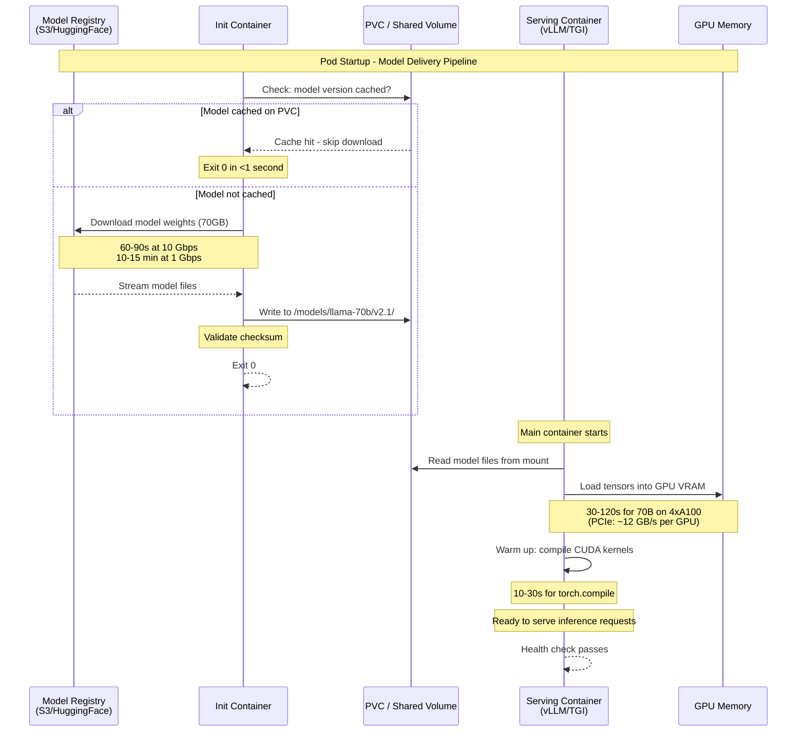
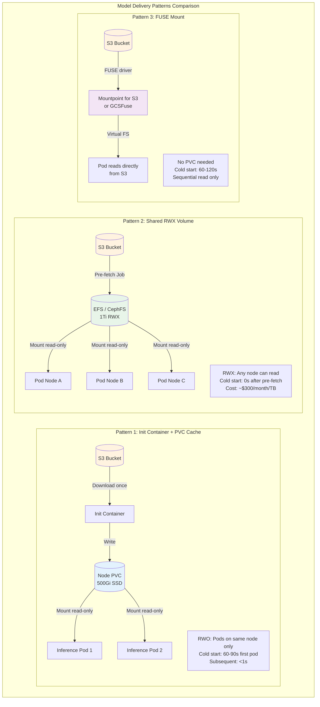

# Model and Artifact Delivery

## 1. Overview

Delivering machine learning model weights to inference pods is one of the most challenging storage problems in Kubernetes. A single LLM can range from 500MB (DistilBERT) to 400GB+ (Llama 3 405B in FP16), and every inference pod needs the full model loaded into GPU memory before it can serve a single request. The model delivery pipeline -- how weights get from a model registry to GPU memory -- directly determines cold-start time, scaling speed, and infrastructure cost.

The fundamental tension is between four competing concerns: **time** (how quickly can a new pod start serving?), **bandwidth** (downloading 70GB from S3 across 100 pods means 7TB of egress), **storage cost** (caching models on persistent volumes avoids re-downloads but costs money), and **freshness** (deploying a new model version must not require rebuilding container images or manually invalidating caches).

This file covers the major model delivery patterns: init container downloading, PVC caching, FUSE-based object storage mounts (Mountpoint for S3, GCSFuse), shared ReadWriteMany volumes, image-based delivery, and model registries. Each pattern has specific tradeoffs that depend on model size, replica count, scaling frequency, and infrastructure constraints. There is no single best approach -- production systems typically combine multiple patterns.

## 2. Why It Matters

- **Cold-start time directly impacts autoscaling.** A model serving pod that takes 15 minutes to download a 70GB model from S3 cannot respond to traffic spikes. If your autoscaler detects increased load and scales from 2 to 10 pods, those 8 new pods are useless for 15 minutes. During that window, the original 2 pods are overwhelmed, causing latency spikes and request timeouts.
- **Bandwidth costs scale with replica count.** Downloading a 70GB model to 50 pods means 3.5TB of S3 egress. At AWS's $0.09/GB egress pricing, that is $315 per model deployment. If you deploy daily across 3 environments, that is $28K/month in transfer costs alone. PVC caching reduces this to a single download per node.
- **GPU idle time is expensive.** An A100 GPU costs $3-4/hour on cloud instances. A pod spending 10 minutes downloading a model before it can serve requests wastes $0.50-0.67 in GPU time per pod startup. For a 100-pod deployment, that is $50-67 of idle GPU time per scaling event.
- **Model version management is a deployment problem.** ML teams iterate rapidly -- new model versions every few days. The delivery pipeline must support atomic version switches (all pods serve the same version), rollback (revert to the previous version in minutes), and canary deployments (route 10% of traffic to the new model).
- **Multi-model serving multiplies the problem.** A single inference pod may serve multiple models (e.g., an embedding model + a generation model + a reranker). Total model weight per pod can reach 200GB+. The delivery pipeline must efficiently manage multiple artifacts per pod.
- **Edge and air-gapped deployments.** On-premises or edge inference nodes may have limited or no internet connectivity. Model weights must be pre-positioned on local storage, making PVC caching and image-based delivery essential.

## 3. Core Concepts

- **Model Weights:** The learned parameters of a neural network, stored as tensors in a serialized format (SafeTensors, PyTorch `.bin`, GGUF, ONNX). A Llama 2 70B model is ~140GB in FP16 (70 billion parameters x 2 bytes), ~70GB in INT8, ~35GB in INT4 quantized.
- **Model Registry:** A versioned artifact store for model weights and metadata. Examples: HuggingFace Hub, MLflow Model Registry, AWS SageMaker Model Registry, Google Vertex AI Model Registry, custom S3 buckets with versioned prefixes. The registry is the "source of truth" for model artifacts.
- **Init Container:** A Kubernetes container that runs to completion before the main serving container starts. Used to download model weights from a registry to a shared volume (emptyDir or PVC). The main container mounts the same volume and loads the pre-downloaded weights.
- **PVC Cache:** A Persistent Volume Claim that stores downloaded model weights persistently across pod restarts. The first pod downloads the model; subsequent pods (or restarts) find the weights already cached. Eliminates redundant downloads.
- **FUSE Mount:** Filesystem in Userspace -- a mechanism to mount remote object storage (S3, GCS) as a local filesystem. The FUSE driver translates filesystem operations (open, read, seek) into object storage API calls. Examples: Mountpoint for Amazon S3, GCSFuse.
- **ReadWriteMany (RWX) Volume:** A volume that can be mounted by multiple pods across multiple nodes simultaneously for both reading and writing. Required for shared model caches where many inference pods read the same model files. Backed by network filesystems: EFS, CephFS, GCP Filestore.
- **Image-Based Delivery:** Baking model weights into the container image itself. The model is available immediately on pod start (no download step) but makes images very large (70-400GB), straining container registries and image pull times.
- **Lazy Loading / Streaming:** Loading model weights on-demand, layer by layer, rather than downloading the entire model before serving begins. Reduces time-to-first-token but increases per-request latency during the warm-up period.
- **Model Sharding:** Splitting a large model across multiple GPUs/pods using tensor parallelism or pipeline parallelism. Each shard is a portion of the full model weights (e.g., a 70B model split across 4 GPUs, ~17.5B parameters per shard). Delivery must ensure all shards are loaded before serving begins.

## 4. How It Works

### Pattern 1: Init Container Download

The simplest and most common pattern. An init container runs before the serving container, downloading model weights from an object store to a shared emptyDir or PVC volume.

```yaml
apiVersion: apps/v1
kind: Deployment
metadata:
  name: llama-70b-inference
spec:
  replicas: 4
  template:
    spec:
      initContainers:
        - name: download-model
          image: amazon/aws-cli:2.15.0
          command:
            - sh
            - -c
            - |
              if [ -f /models/llama-70b-chat/model.safetensors.index.json ]; then
                echo "Model already cached, skipping download"
                exit 0
              fi
              echo "Downloading model from S3..."
              aws s3 sync s3://models/llama-70b-chat-hf/ /models/llama-70b-chat/ \
                --exclude "*.md" --exclude "*.txt"
              echo "Download complete: $(du -sh /models/llama-70b-chat/)"
          volumeMounts:
            - name: model-cache
              mountPath: /models
          resources:
            requests:
              cpu: "2"
              memory: 4Gi
      containers:
        - name: vllm-server
          image: vllm/vllm-openai:v0.4.0
          args:
            - --model=/models/llama-70b-chat
            - --tensor-parallel-size=4
            - --max-model-len=4096
          volumeMounts:
            - name: model-cache
              mountPath: /models
          resources:
            requests:
              cpu: "8"
              memory: 64Gi
              nvidia.com/gpu: "4"
            limits:
              nvidia.com/gpu: "4"
      volumes:
        - name: model-cache
          persistentVolumeClaim:
            claimName: model-cache-pvc
```

**Performance characteristics:**
- 70GB model over S3 with 10 Gbps network: ~60-90 seconds download time.
- 70GB model over S3 with 1 Gbps network: ~10-15 minutes.
- S3 `sync` uses multi-part parallel download (8 concurrent connections by default). Tuning `max_concurrent_requests` to 20-50 can improve throughput on fast networks.
- Total cold-start: download time + model loading into GPU memory (30-120 seconds for 70B on 4xA100).

**When to use:** Small to medium deployments (1-10 replicas), infrequent scaling, models under 100GB.

### Pattern 2: PVC Caching Strategy

PVC caching avoids redundant downloads by persisting model weights across pod restarts and redeployments. The init container checks if the model is already present before downloading.

**Node-local PVC caching (one PVC per node):**
```yaml
apiVersion: v1
kind: PersistentVolumeClaim
metadata:
  name: model-cache-node-1
spec:
  accessModes:
    - ReadWriteOnce
  storageClassName: fast-ssd
  resources:
    requests:
      storage: 500Gi  # Space for multiple model versions
```

**Cache management strategies:**
1. **Version-based directories:** Store each model version in a separate directory (`/models/llama-70b-v1/`, `/models/llama-70b-v2/`). The init container downloads only if the target version directory does not exist.
2. **Checksum validation:** The init container computes a SHA256 checksum of the cached model and compares it against the registry. If mismatched, re-download.
3. **LRU eviction:** A sidecar or CronJob monitors cache utilization. When the PVC exceeds 80% capacity, the oldest unused model version is deleted.
4. **Pre-warming:** A DaemonSet runs on GPU nodes, pre-downloading popular models to node-local PVCs before inference pods need them. This eliminates cold-start entirely for known models.

**Cache sizing formula:**
```
PVC_SIZE = (NUM_MODELS x AVG_MODEL_SIZE x NUM_VERSIONS_TO_CACHE) + 20% headroom
Example: 3 models x 70GB x 2 versions x 1.2 = 504GB -> 500Gi PVC
```

**Cost analysis (AWS EBS gp3):**
- 500Gi PVC: $40/month.
- Without caching: 70GB x 10 pod restarts/week x 4 weeks x $0.09/GB egress = $252/month in S3 egress.
- PVC caching ROI: Pays for itself in a single week.

### Pattern 3: FUSE-Based Object Storage Mounts

FUSE mounts present S3/GCS as a local filesystem, allowing inference frameworks to read model files directly from object storage without an explicit download step.

**Mountpoint for Amazon S3:**
```yaml
apiVersion: v1
kind: PersistentVolume
metadata:
  name: s3-model-pv
spec:
  capacity:
    storage: 1Ti  # Logical capacity (S3 is unlimited)
  accessModes:
    - ReadOnlyMany
  csi:
    driver: s3.csi.aws.com
    volumeHandle: s3-model-bucket
    volumeAttributes:
      bucketName: ml-model-registry
      mountOptions: "--read-only --prefix models/"
---
apiVersion: v1
kind: PersistentVolumeClaim
metadata:
  name: s3-models
spec:
  accessModes:
    - ReadOnlyMany
  storageClassName: ""  # Static binding
  resources:
    requests:
      storage: 1Ti
  volumeName: s3-model-pv
```

**GCSFuse on GKE:**
```yaml
apiVersion: v1
kind: Pod
metadata:
  name: inference-pod
  annotations:
    gke-gcsfuse/volumes: "true"  # Enable GCSFuse sidecar injection
spec:
  containers:
    - name: vllm-server
      image: vllm/vllm-openai:v0.4.0
      args:
        - --model=/models/llama-70b-chat
      volumeMounts:
        - name: gcs-models
          mountPath: /models
          readOnly: true
      resources:
        requests:
          nvidia.com/gpu: "4"
  volumes:
    - name: gcs-models
      csi:
        driver: gcsfuse.csi.storage.gke.io
        readOnly: true
        volumeAttributes:
          bucketName: ml-model-registry
          fileCacheCapacity: "100Gi"  # Local SSD cache
          fileCacheForRangeRead: "true"
          metadataStatCacheCapacity: "32Mi"
```

**FUSE performance characteristics:**

| Metric | Mountpoint for S3 | GCSFuse | Direct S3 Download |
|---|---|---|---|
| **Sequential read throughput** | 10-25 Gbps (aggregate) | 5-15 Gbps | 10-25 Gbps |
| **Random read latency** | 10-50ms per request | 5-30ms per request | N/A (bulk download) |
| **File metadata operations** | 5-20ms (cached) | 2-10ms (cached) | N/A |
| **Local caching** | Experimental (as of 2024) | File cache to local SSD | N/A |
| **Model load time (70GB)** | 60-120s (first load) | 45-90s (with cache) | 60-90s |

**When to use FUSE:**
- Read-only model serving (no writes to model files).
- Models are accessed sequentially during loading (FUSE excels at sequential reads).
- You want to avoid managing PVC lifecycle (S3 is the single source of truth).
- GCSFuse with file cache on local SSD gives near-local performance for repeated reads.

**When NOT to use FUSE:**
- Training workloads with random read/write patterns (FUSE latency is too high).
- Models that require memory-mapped file access (`mmap`) -- some FUSE implementations do not support `mmap` efficiently.
- Air-gapped environments without object storage access.

### Pattern 4: Shared ReadWriteMany Volumes

Multiple inference pods share a single RWX volume containing model weights. One pod (or a pre-warming job) downloads the model; all other pods read from the shared volume.

```yaml
apiVersion: v1
kind: PersistentVolumeClaim
metadata:
  name: shared-model-cache
spec:
  accessModes:
    - ReadWriteMany
  storageClassName: shared-efs  # EFS, CephFS, or Filestore
  resources:
    requests:
      storage: 1Ti

---
# Pre-warming Job: downloads models to the shared volume
apiVersion: batch/v1
kind: Job
metadata:
  name: model-prefetch
spec:
  template:
    spec:
      containers:
        - name: prefetch
          image: amazon/aws-cli:2.15.0
          command:
            - sh
            - -c
            - |
              aws s3 sync s3://models/llama-70b-chat-hf/ \
                /models/llama-70b-chat/ --exclude "*.md"
              aws s3 sync s3://models/mistral-7b-instruct/ \
                /models/mistral-7b-instruct/ --exclude "*.md"
              echo "Pre-fetch complete"
          volumeMounts:
            - name: shared-cache
              mountPath: /models
      volumes:
        - name: shared-cache
          persistentVolumeClaim:
            claimName: shared-model-cache
      restartPolicy: Never

---
# Inference Deployment: all pods read from shared volume
apiVersion: apps/v1
kind: Deployment
metadata:
  name: llama-70b-inference
spec:
  replicas: 8
  template:
    spec:
      containers:
        - name: vllm-server
          image: vllm/vllm-openai:v0.4.0
          args:
            - --model=/models/llama-70b-chat
            - --tensor-parallel-size=4
          volumeMounts:
            - name: shared-cache
              mountPath: /models
              readOnly: true
          resources:
            requests:
              nvidia.com/gpu: "4"
      volumes:
        - name: shared-cache
          persistentVolumeClaim:
            claimName: shared-model-cache
```

**Performance considerations for shared volumes:**

| Backend | Read Throughput | Latency | Cost (1TB) | Best For |
|---|---|---|---|---|
| **AWS EFS** | Up to 10 Gbps (elastic) | 1-5ms | ~$300/month | Multi-AZ, serverless |
| **AWS EFS (provisioned)** | Up to 20 Gbps | 0.5-2ms | ~$600/month | High throughput needs |
| **GCP Filestore (Enterprise)** | Up to 16 Gbps | <1ms | ~$600/month | GKE, high IOPS |
| **CephFS** | Scales with cluster | 1-5ms | Hardware cost | On-premises |
| **NFS server** | Limited by server NIC | 1-10ms | Hardware cost | Simple, legacy |

**Thundering herd problem:** When a new model version is deployed, 50 pods simultaneously read 70GB from the shared volume. EFS may throttle reads if burst credits are exhausted. Mitigation: use provisioned throughput mode, or stagger pod rollouts with `maxSurge: 25%`.

### Pattern 5: Image-Based Model Delivery

Bake model weights directly into the container image. The model is available immediately on pod start with zero download time.

```dockerfile
FROM vllm/vllm-openai:v0.4.0

# Download model during image build
RUN pip install huggingface-hub && \
    huggingface-cli download meta-llama/Llama-2-7b-chat-hf \
      --local-dir /models/llama-7b-chat \
      --exclude "*.md" "*.txt"

ENV MODEL_PATH=/models/llama-7b-chat
```

**Advantages:**
- Zero cold-start for model download. Pod starts serving as soon as GPU memory loading completes.
- Immutable: The exact model version is pinned to the image tag. No drift.
- Works in air-gapped environments once the image is in a local registry.

**Disadvantages:**
- Image size: 7B model = ~14GB image. 70B model = ~140GB image. Container registries (ECR, GCR) charge for storage and transfer.
- Image pull time: Pulling a 140GB image takes 5-15 minutes even with high-bandwidth nodes, partially negating the cold-start advantage.
- Image build time: Building a 140GB image and pushing to a registry is slow (30-60 minutes).
- Not practical for models above 20-30GB. The operational overhead of managing 100GB+ images outweighs the benefits.

**Optimization: OCI artifacts and lazy pulling:**
- **Seekable OCI (SOCI):** AWS Fargate and containerd support SOCI, which enables lazy pulling of container image layers. Only the bytes the application actually reads are downloaded. A 70GB model image starts in seconds, loading model weights on-demand.
- **Stargz/eStargz:** An image format that supports lazy pulling. The container runtime downloads only referenced file ranges. Compatible with containerd and CRI-O.
- **Warm image cache:** Use DaemonSets to pre-pull model images to node-local container storage. When an inference pod starts, the image is already cached locally.

### Pattern 6: Model Registries and Version Management

A model registry provides versioned, tagged, and cataloged model artifacts with access control and audit logging.

**Registry options:**

| Registry | Storage Backend | Versioning | Integration | Cost |
|---|---|---|---|---|
| **HuggingFace Hub** | HF infrastructure | Git-based (LFS) | Direct `from_pretrained()` | Free (public) / $9+/month (private) |
| **MLflow Model Registry** | S3/GCS/ADLS/local | Sequential versions | MLflow SDK, REST API | Open source |
| **AWS SageMaker** | S3 | Model packages | SageMaker endpoints | Pay per use |
| **Google Vertex AI** | GCS | Model versions | Vertex prediction | Pay per use |
| **DVC** | S3/GCS/Azure | Git-tracked metadata | Git + DVC CLI | Open source |
| **Custom S3 prefix** | S3/GCS | Prefix-based (`v1/`, `v2/`) | AWS CLI / gsutil | Storage cost only |

**Version management in Kubernetes:**

```yaml
apiVersion: v1
kind: ConfigMap
metadata:
  name: model-config
data:
  model-name: "llama-70b-chat"
  model-version: "v2.1"
  model-path: "s3://models/llama-70b-chat/v2.1/"
  model-checksum: "sha256:a1b2c3d4..."

---
# Init container reads config and downloads the specified version
# ConfigMap changes trigger a rolling update via a hash annotation
apiVersion: apps/v1
kind: Deployment
metadata:
  name: inference
  annotations:
    model-config-hash: "abc123"  # Update to trigger rollout
spec:
  template:
    spec:
      initContainers:
        - name: download-model
          envFrom:
            - configMapRef:
                name: model-config
          command:
            - sh
            - -c
            - |
              TARGET="/models/${MODEL_NAME}/${MODEL_VERSION}"
              if [ -d "$TARGET" ] && echo "${MODEL_CHECKSUM}" | sha256sum -c; then
                echo "Cached version valid"
              else
                aws s3 sync "${MODEL_PATH}" "$TARGET"
              fi
```

## 5. Architecture / Flow





## 6. Types / Variants

### Pattern Decision Matrix

| Pattern | Model Size | Replicas | Cold Start | Bandwidth Cost | Operational Complexity | Best For |
|---|---|---|---|---|---|---|
| **Init Container + emptyDir** | <10GB | 1-5 | Minutes | High (re-download every restart) | Low | Development, small models |
| **Init Container + PVC Cache** | 10-200GB | 1-10 | Minutes (first), seconds (cached) | Low (single download per node) | Medium | Production single-node |
| **Shared RWX Volume** | 10-200GB | 10-100 | Seconds (after pre-fetch) | Minimal (single download) | Medium | Multi-replica production |
| **FUSE Mount (S3/GCS)** | Any | Any | Minutes (sequential load) | None (direct read) | Low | Read-heavy, cloud-native |
| **Image-Based** | <20GB | Any | Seconds (image cached) | Varies (image pull) | High | Small models, air-gapped |
| **SOCI/eStargz Lazy Pull** | 20-100GB | Any | Seconds | Low (on-demand) | High | Cutting-edge, Fargate |
| **DaemonSet Pre-warm** | Any | Any | Zero (pre-warmed) | Low (background download) | High | Predictable scaling |

### Model Size Reference

| Model | Parameters | FP16 Size | INT8 Size | INT4 (GPTQ/AWQ) | Loading Time (4xA100) |
|---|---|---|---|---|---|
| **DistilBERT** | 66M | 130MB | 66MB | N/A | <1s |
| **BERT-large** | 340M | 680MB | 340MB | N/A | <1s |
| **Mistral 7B** | 7.2B | 14.5GB | 7.2GB | 3.8GB | 5-10s |
| **Llama 3 8B** | 8B | 16GB | 8GB | 4.2GB | 5-10s |
| **Llama 2 13B** | 13B | 26GB | 13GB | 6.8GB | 10-20s |
| **Llama 3 70B** | 70B | 140GB | 70GB | 36GB | 60-120s |
| **Mixtral 8x7B** | 46.7B | 93GB | 47GB | 24GB | 40-80s |
| **Llama 3 405B** | 405B | 810GB | 405GB | 203GB | 5-15 min (8xH100) |
| **SDXL (Stable Diffusion)** | 6.6B | 13GB | 6.5GB | N/A | 5-10s |
| **Whisper-large-v3** | 1.5B | 3GB | 1.5GB | N/A | 2-3s |

### Quantization Impact on Delivery

Quantization reduces model size by 2-4x, directly impacting download time, storage cost, and memory requirements:

- **FP16 (default):** Full precision. 2 bytes per parameter. Llama 70B = 140GB.
- **INT8 (LLM.int8(), SmoothQuant):** 1 byte per parameter. Llama 70B = 70GB. Minimal quality loss for most tasks.
- **INT4 (GPTQ, AWQ, GGUF):** 0.5 bytes per parameter. Llama 70B = 36GB. Slight quality degradation, significant speedup.
- **Delivery impact:** A 70GB INT8 model downloads in half the time of the 140GB FP16 version. Cache PVCs can store 2x more models. FUSE sequential read is 2x faster.

See [Quantization](../../genai-system-design/02-llm-architecture/03-quantization.md) for detailed quality/performance tradeoffs.

## 7. Use Cases

- **vLLM serving Llama 3 70B on EKS.** 8 inference pods, each with 4xA100 GPUs, share an EFS volume containing the INT8 quantized model (70GB). A pre-warming CronJob runs nightly to sync the latest model version from S3 to EFS. Cold-start for new pods: 60s (GPU loading only, no download). Horizontal scaling from 4 to 8 pods completes in 90 seconds.
- **Triton Inference Server with multi-model serving.** A single Triton pod serves an embedding model (1.5GB), a reranker (3GB), and a generation model (14GB). All three models are cached on a node-local PVC (500Gi gp3). The init container uses `aws s3 sync` with `--size-only` flag to download only changed files during version updates. Total model weight per pod: 18.5GB. Cache hit rate: 95%+.
- **GCSFuse for Stable Diffusion on GKE Autopilot.** SDXL model (13GB) mounted via GCSFuse with 100Gi local SSD file cache. First inference request triggers model loading (~15 seconds). Subsequent requests are served from the local cache. GCSFuse handles concurrent reads from 20+ pods without contention. Monthly cost: $2 for GCS storage vs. $120 for a dedicated Filestore.
- **Air-gapped defense deployment.** A Mistral 7B model (14GB) is baked into a container image and pushed to an internal Harbor registry. GPU nodes pre-pull the image via a DaemonSet. Inference pods start in under 10 seconds with zero network dependency. Image size overhead is acceptable for 7B-class models.
- **Model A/B testing with canary deployments.** Two Deployments (model-v1 and model-v2) share the same EFS volume but point to different subdirectories (`/models/v1/`, `/models/v2/`). An Istio VirtualService routes 90% of traffic to v1 and 10% to v2. After validation, traffic is shifted to 100% v2 by updating the VirtualService. The old model version is retained on the EFS volume for instant rollback.

## 8. Tradeoffs

| Decision | Option A | Option B | Guidance |
|---|---|---|---|
| **Init container vs. FUSE mount** | Init: Download upfront, local reads | FUSE: On-demand reads from S3/GCS | Init for predictable latency; FUSE for simplicity and when local caching is not needed |
| **PVC cache (RWO) vs. Shared volume (RWX)** | RWO: High throughput, per-node | RWX: Multi-node sharing, one copy | RWX for 10+ replicas or multi-node; RWO for single-node or few replicas |
| **Pre-warm vs. On-demand download** | Pre-warm: Zero cold-start, DaemonSet cost | On-demand: Simpler, no wasted storage | Pre-warm for latency-critical production; on-demand for dev/staging |
| **Image-based vs. Volume-based** | Image: Immutable, no download step | Volume: Flexible, smaller images | Image for models <20GB or air-gapped; volume for larger models |
| **Full precision vs. Quantized delivery** | FP16: Maximum quality | INT4/INT8: 2-4x smaller, faster delivery | Quantized for inference; FP16 only if quality benchmarks demand it |
| **S3 egress vs. PVC storage cost** | S3 egress: Pay per download ($0.09/GB) | PVC: Pay for persistent storage ($0.08/GB-month) | PVC caching pays for itself after 1-2 downloads for models >50GB |
| **Single shared cache vs. Per-model PVCs** | Shared: One volume, simpler management | Per-model: Isolation, independent lifecycle | Shared for stable model sets; per-model when teams independently manage models |

## 9. Common Pitfalls

- **Downloading to emptyDir without caching.** If model weights are downloaded to an emptyDir (ephemeral volume), every pod restart re-downloads the entire model. For a 70GB model on a pod that restarts 3x/day, that is 210GB/day of S3 egress (~$570/month). Always use a PVC for caching.
- **Using RWO PVC for multi-node deployments.** An RWO PVC can only mount on a single node. If the autoscaler places a new pod on a different node, it cannot access the cached model and falls back to downloading from S3. Use RWX for multi-node deployments, or provision per-node PVCs via a DaemonSet.
- **Not validating downloaded model integrity.** A partial download (network interruption) produces a corrupt model file. The serving container loads it, gets garbage weights, and serves nonsensical results without any error. Always validate checksums after download:
  ```bash
  sha256sum -c /models/checksums.sha256 || (rm -rf /models/llama-70b/ && exit 1)
  ```
- **FUSE mounts for write-heavy workloads.** FUSE mounts are designed for read-mostly patterns. Writing model checkpoints to a FUSE-mounted S3 bucket is extremely slow (~10 MB/s for small files due to multipart upload overhead). Use local PVCs for write-heavy workloads (training, fine-tuning).
- **Image-based delivery for large models.** Baking a 140GB model into a container image creates a 150GB+ image. Pushing to ECR takes 30+ minutes. Pulling on a node takes 10-20 minutes. Node-level image caching helps, but image garbage collection can evict the cached image, forcing a re-pull. Do not use this pattern for models above 20-30GB.
- **Thundering herd on shared EFS.** When 50 pods simultaneously start and read a 70GB model from EFS, the aggregate read load is 3.5TB. EFS burst credits are 100 MiB/s per TiB of storage. A 1TB EFS volume has 100 MiB/s burst capacity -- loading 50 pods would take ~10 hours at burst rate. Use provisioned throughput (1+ Gbps) or stagger pod startups.
- **Not accounting for GPU memory loading time.** Download time is only part of cold-start. Loading 70GB of tensors into 4xA100 GPU memory over PCIe 4.0 (~12.5 GB/s per GPU) takes ~30 seconds. Over NVLink, tensor parallelism further adds synchronization overhead. Budget 30-120 seconds for GPU loading on top of download time.
- **Ignoring model version cleanup.** Caching multiple model versions without cleanup fills the PVC. A 500Gi PVC holding 5 versions of a 70GB model is full. Implement automated cleanup: retain only the current and previous version, delete older versions via CronJob.
- **Hardcoding S3 paths in Deployment manifests.** Changing the model version requires editing the Deployment YAML and triggering a rollout. Use a ConfigMap for model paths and versions. ConfigMap changes can trigger rollouts via hash annotations without modifying the Deployment spec.

## 10. Real-World Examples

- **Anyscale (Ray Serve).** Anyscale uses Ray Serve on Kubernetes for LLM inference. Models are stored in S3 and cached on node-local NVMe PVCs. Ray's object store handles sharing model weights across workers on the same node via shared memory, avoiding multiple copies. A 70B model is loaded once into shared memory and served by multiple Ray workers.
- **Hugging Face Inference Endpoints.** Hugging Face's managed inference product runs on Kubernetes. Models are pulled from the HuggingFace Hub to a PVC cache on first request. Subsequent pods on the same node use the cache. For popular models, pre-warming ensures zero cold-start. The platform handles 10,000+ model deployments.
- **OpenAI's model distribution.** OpenAI distributes model weights across thousands of GPUs using a custom high-bandwidth distribution system. While specifics are proprietary, the pattern is: model weights are stored in a distributed object store, pre-positioned on NVMe drives attached to GPU servers, and loaded into GPU memory via optimized tensor loading pipelines.
- **Spotify (ML Platform).** Spotify runs thousands of ML models on Kubernetes for music recommendations. Models (typically 1-10GB each) are stored in GCS and mounted via GCSFuse. The file cache feature keeps frequently accessed models on local SSD, providing near-local read performance. GCSFuse handles the concurrent access from hundreds of pods.
- **Bloomberg (BQuant).** Bloomberg uses Kubernetes for quantitative research workloads where analysts load large financial models. Models are cached on CephFS (RWX) and accessed by research pods across a 1000+ node on-premises cluster. CephFS handles the concurrent read load, and Rook-Ceph provides the storage lifecycle management.

## 11. Related Concepts

- [Persistent Storage Architecture](./01-persistent-storage-architecture.md) -- PV/PVC fundamentals for model caching volumes
- [CSI Drivers and Storage Classes](./02-csi-drivers-and-storage-classes.md) -- CSI drivers for EFS, S3, GCS FUSE mounts
- [Stateful Data Patterns](./03-stateful-data-patterns.md) -- operator patterns for stateful ML workloads
- [Model Serving](../../genai-system-design/02-llm-architecture/01-model-serving.md) -- inference frameworks (vLLM, TGI, Triton) that consume delivered models
- [Object Storage](../../traditional-system-design/03-storage/03-object-storage.md) -- S3/GCS as the source of truth for model artifacts
- [SQL Databases](../../traditional-system-design/03-storage/01-sql-databases.md) -- metadata storage for model registries

## 12. Source Traceability

- source/youtube-video-reports/7.md -- Kubernetes storage pillar: PVs, PVCs, Storage Classes as the storage abstraction layer for model delivery
- AWS Mountpoint for Amazon S3 documentation -- CSI driver configuration, performance characteristics, read-only mount semantics
- GCSFuse documentation -- GKE sidecar injection, file cache configuration, performance tuning
- vLLM documentation -- model loading patterns, tensor parallelism, GPU memory management
- Hugging Face Hub documentation -- model downloading, SafeTensors format, model versioning
- NVIDIA Triton Inference Server documentation -- model repository structure, multi-model serving, model loading modes
- AWS EFS CSI Driver documentation -- provisioned throughput, burst credit behavior, access point configuration
- Kubernetes documentation -- init containers, emptyDir volumes, PVC lifecycle
