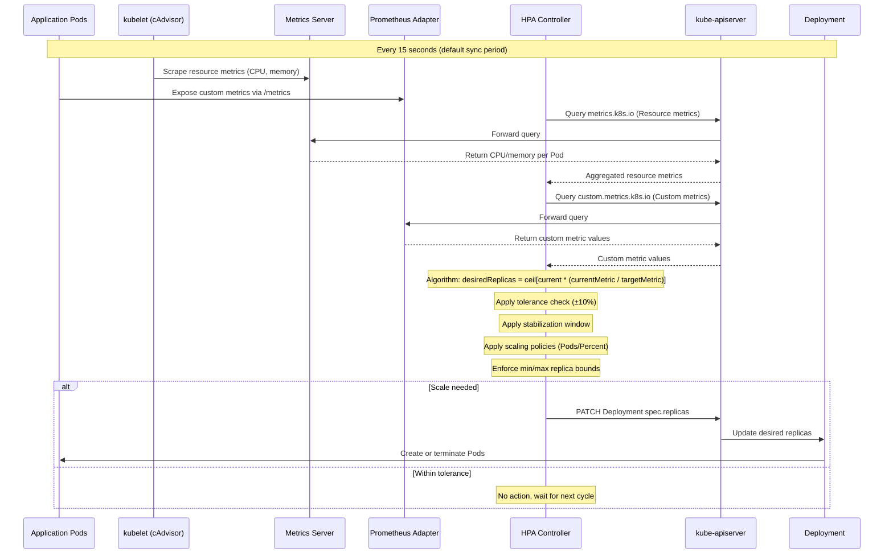

# Horizontal Pod Autoscaling

## 1. Overview

The Horizontal Pod Autoscaler (HPA) is Kubernetes' built-in mechanism for automatically adjusting the number of Pod replicas in a Deployment, StatefulSet, or ReplicaSet based on observed metrics. Unlike manual scaling (`kubectl scale`), HPA operates as a continuous control loop that reads metrics, computes a desired replica count, and patches the target workload's `spec.replicas` field -- all without human intervention.

HPA is the most widely used autoscaler in Kubernetes. It is native to the platform (no additional installation for basic CPU/memory scaling), stable since `autoscaling/v2` (GA in Kubernetes 1.23), and the foundation on which more advanced scaling systems like KEDA are built. At its core, HPA answers one question every 15 seconds (default): "Given the current metric values, how many replicas do I need to meet the target?"

Understanding HPA deeply -- its algorithm, metric types, behavior configuration, and limitations -- is the prerequisite for building production autoscaling strategies that balance performance, cost, and stability.

## 2. Why It Matters

- **Cost efficiency through right-sizing.** Without HPA, teams either over-provision (paying for idle replicas 24/7) or under-provision (risking latency spikes and dropped requests during traffic surges). HPA eliminates this binary by matching replica count to actual demand. A typical web service with 3x daily traffic variation can save 40-60% on compute costs with properly tuned HPA.
- **Latency protection under load.** When request volume increases, each Pod handles more concurrent connections, increasing response times. HPA adds replicas before latency degrades beyond acceptable thresholds -- if configured with the right metric and target.
- **Foundation for all Kubernetes scaling.** KEDA, custom metrics adapters, and even GPU-aware scaling all ultimately create HPA objects under the hood. Understanding HPA internals is required to debug any autoscaling behavior in a Kubernetes cluster.
- **Operational simplicity over manual scaling.** HPA removes humans from the scaling loop during traffic events, on-call rotations, and scheduled load. The alternative -- manually running `kubectl scale` at 2 AM when traffic spikes -- is neither scalable nor reliable.
- **The 80% trigger strategy.** As noted in production cost management patterns, triggering HPA at approximately 80% of resource limits creates a "bandwidth buffer" that allows existing Pods to absorb traffic while new replicas initialize. This prevents the latency cliff that occurs when Pods hit their resource limits before new replicas are ready.

## 3. Core Concepts

- **HPA Controller:** A control loop running inside `kube-controller-manager` that evaluates HPA objects every `--horizontal-pod-autoscaler-sync-period` (default: 15 seconds). It reads metrics, runs the scaling algorithm, and patches the target workload's replica count.
- **Metrics Server:** A cluster-wide aggregator of resource usage data (CPU, memory) collected from kubelets. Metrics Server is the default source for `type: Resource` metrics. It must be installed separately (not included in most distributions by default). Metrics are short-lived (kept in memory, no persistence) with a resolution of approximately 15 seconds.
- **Metric Types:** HPA v2 supports four metric types:
  - **Resource:** CPU and memory utilization from Metrics Server. Target expressed as percentage of Pod resource requests.
  - **Pods:** Custom metrics specific to each Pod (e.g., `requests_per_second`). Averaged across all Pods in the target.
  - **Object:** Metrics attached to a specific Kubernetes object (e.g., an Ingress reporting `requests_per_second`).
  - **External:** Metrics from outside the cluster (e.g., an SQS queue depth, a Prometheus query). Provided via the External Metrics API.
- **Container Resource Metrics:** Starting in Kubernetes v1.30 (stable), HPA can target metrics from a specific container within a Pod rather than the Pod aggregate. This is critical for sidecar-heavy Pods where the application container uses 200m CPU but the Envoy sidecar uses 800m -- scaling on Pod-level CPU would be misleading.
- **Target Types:** `Utilization` (percentage of resource request), `Value` (absolute metric value), or `AverageValue` (metric value divided by replica count).
- **Scaling Behavior:** Fine-grained control over scale-up and scale-down speed, introduced in `autoscaling/v2`. Includes stabilization windows, scaling policies, and policy selection.
- **Tolerance:** HPA skips scaling if the ratio of current to desired metric is within a 10% tolerance band (0.9 to 1.1). This prevents oscillation when metrics hover near the target. Configurable per-direction as an alpha feature starting in Kubernetes v1.33.

## 4. How It Works

### The HPA Algorithm

The core formula that drives every HPA scaling decision:

```
desiredReplicas = ceil[ currentReplicas * ( currentMetricValue / desiredMetricValue ) ]
```

**Worked examples:**

| Scenario | Current Replicas | Current Metric | Target Metric | Calculation | Result |
|---|---|---|---|---|---|
| Scale up (high CPU) | 3 | 90% | 50% | ceil(3 * 90/50) = ceil(5.4) | 6 replicas |
| Scale down (low CPU) | 10 | 20% | 50% | ceil(10 * 20/50) = ceil(4.0) | 4 replicas |
| No action (within tolerance) | 5 | 48% | 50% | 48/50 = 0.96 (within 0.9-1.1) | 5 replicas (no change) |
| Multi-metric (take max) | 4 | CPU: 80%, RPS: 120 | CPU: 50%, RPS: 100 | CPU: ceil(4 * 80/50)=7, RPS: ceil(4 * 120/100)=5 | 7 replicas (highest wins) |

**Key algorithmic details:**

1. **Multiple metrics take the maximum.** When HPA is configured with multiple metrics (e.g., CPU and custom RPS), it computes `desiredReplicas` for each metric independently and takes the highest value. This ensures the workload is scaled sufficiently for all metrics.
2. **Missing metrics are conservative.** If a metric cannot be fetched, scale-up proposals from other metrics still apply, but scale-down is blocked until all metrics are available. This prevents premature scale-down when monitoring is degraded.
3. **Unready Pods are handled carefully.** Pods that are not yet Ready are excluded from metric calculations during scale-up (they would artificially inflate the metric average). During scale-down, unready Pods are included (they count as consuming 0% resources).
4. **Pods being deleted are excluded.** Pods with a deletion timestamp are removed from the calculation entirely.

### The Control Loop in Detail

Every 15 seconds, the HPA controller executes:

1. **Fetch metrics:** Query Metrics Server (for Resource metrics), Custom Metrics API (for Pods/Object metrics), or External Metrics API (for External metrics).
2. **Compute desired replicas:** Apply the algorithm above for each configured metric.
3. **Apply tolerance check:** If the ratio is between 0.9 and 1.1, skip scaling.
4. **Apply behavior constraints:** Check stabilization window, scaling policies, and min/max replica bounds.
5. **Patch target:** If the desired replica count differs from current, update the target workload's `spec.replicas`.

### Scaling Behavior Configuration

The `behavior` field (GA in `autoscaling/v2`) provides fine-grained control over scaling speed:

```yaml
apiVersion: autoscaling/v2
kind: HorizontalPodAutoscaler
metadata:
  name: web-app-hpa
spec:
  scaleTargetRef:
    apiVersion: apps/v1
    kind: Deployment
    name: web-app
  minReplicas: 2
  maxReplicas: 50
  metrics:
  - type: Resource
    resource:
      name: cpu
      target:
        type: Utilization
        averageUtilization: 70
  - type: Pods
    pods:
      metric:
        name: http_requests_per_second
      target:
        type: AverageValue
        averageValue: "100"
  behavior:
    scaleUp:
      stabilizationWindowSeconds: 0          # Scale up immediately
      policies:
      - type: Percent
        value: 100                            # Double replicas per period
        periodSeconds: 60
      - type: Pods
        value: 4                              # Or add 4 pods per period
        periodSeconds: 60
      selectPolicy: Max                       # Use whichever adds MORE pods
    scaleDown:
      stabilizationWindowSeconds: 300         # Wait 5 min before scaling down
      policies:
      - type: Percent
        value: 10                             # Remove max 10% per period
        periodSeconds: 60
      selectPolicy: Min                       # Use whichever removes FEWER pods
```

**Behavior field breakdown:**

| Field | Purpose | Default (scale-up) | Default (scale-down) |
|---|---|---|---|
| `stabilizationWindowSeconds` | Lookback period to prevent flapping. HPA considers all desired replica counts within this window and picks the highest (scale-up) or lowest (scale-down). | 0 seconds | 300 seconds (5 min) |
| `policies[].type` | `Pods` (absolute count) or `Percent` (percentage of current replicas) | 4 Pods/15s or 100%/15s | N/A |
| `policies[].value` | The number of Pods or percentage allowed per period | See above | N/A |
| `policies[].periodSeconds` | The time window for the policy (1-1800 seconds) | 15 seconds | 15 seconds |
| `selectPolicy` | `Max` (most aggressive), `Min` (most conservative), or `Disabled` (no scaling in this direction) | Max | Max |

**Stabilization window mechanics:** The stabilization window is the single most important tuning knob for preventing oscillation. During the window, HPA collects all computed desired replica counts and selects the highest (for scale-down, meaning it picks the replica count that removes the fewest Pods). This prevents rapid scale-down after a brief traffic spike.

### Metrics Pipeline Architecture

HPA depends on a metrics pipeline to provide data:

| Metric Type | API | Provider | Typical Source |
|---|---|---|---|
| Resource (CPU, Memory) | `metrics.k8s.io/v1beta1` | Metrics Server | kubelet cAdvisor |
| Custom (Pod/Object) | `custom.metrics.k8s.io/v1beta1` | Prometheus Adapter or Datadog Cluster Agent | Application metrics in Prometheus |
| External | `external.metrics.k8s.io/v1beta1` | Prometheus Adapter, KEDA, or cloud-specific adapters | SQS queue depth, Pub/Sub backlog, etc. |

**Without Metrics Server installed, Resource-type HPA cannot function.** This is the most common reason HPA "does nothing" in new clusters.

## 5. Architecture / Flow



## 6. Types / Variants

### Prometheus Adapter Configuration

To use custom or external metrics with HPA, a Prometheus Adapter translates PromQL queries into the Kubernetes Custom/External Metrics API. This is the most common setup for production HPA beyond basic CPU/memory:

```yaml
# Prometheus Adapter ConfigMap (rules excerpt)
apiVersion: v1
kind: ConfigMap
metadata:
  name: prometheus-adapter
  namespace: monitoring
data:
  config.yaml: |
    rules:
    # Expose per-Pod RPS as a custom metric
    - seriesQuery: 'http_requests_total{namespace!="",pod!=""}'
      resources:
        overrides:
          namespace: {resource: "namespace"}
          pod: {resource: "pod"}
      name:
        matches: "^(.*)_total$"
        as: "${1}_per_second"
      metricsQuery: 'rate(<<.Series>>{<<.LabelMatchers>>}[2m])'

    # Expose queue depth as an external metric
    - seriesQuery: 'kafka_consumergroup_lag{consumergroup!=""}'
      resources:
        overrides:
          namespace: {resource: "namespace"}
      name:
        as: "kafka_consumer_lag"
      metricsQuery: 'sum(<<.Series>>{<<.LabelMatchers>>}) by (consumergroup)'
```

**Verifying custom metrics are available:**
```bash
# List all custom metrics registered
kubectl get --raw /apis/custom.metrics.k8s.io/v1beta1 | jq '.resources[].name'

# Query a specific custom metric for a Pod
kubectl get --raw "/apis/custom.metrics.k8s.io/v1beta1/namespaces/production/pods/*/http_requests_per_second"

# List all external metrics
kubectl get --raw /apis/external.metrics.k8s.io/v1beta1 | jq '.resources[].name'
```

### HPA Debugging and Observability

Understanding HPA behavior in production requires inspecting its status and events:

```bash
# View HPA current state and decisions
kubectl describe hpa web-app-hpa -n production

# Key fields in HPA status:
# - AbleToScale: whether HPA can read metrics and compute replicas
# - ScalingActive: whether HPA is actively scaling
# - ScalingLimited: whether scaling is limited by min/max bounds
# - Current metrics vs target: the raw numbers driving decisions

# Example output:
# Metrics:      ( current / target )
#   "cpu":       72% / 70%   (status matches target, within tolerance)
#   "http_rps":  450 / 500   (below target, no scale-down due to multi-metric max)
# Min replicas:  2
# Max replicas:  50
# Deployment pods: 12 current / 12 desired

# View scaling events
kubectl get events --field-selector involvedObject.name=web-app-hpa -n production
```

**HPA status conditions explained:**

| Condition | Meaning | Action |
|---|---|---|
| `AbleToScale=True` | HPA can read the target workload's scale subresource | Normal |
| `AbleToScale=False` | Target workload does not exist or lacks a scale subresource | Fix target reference |
| `ScalingActive=True` | Metrics are available and HPA is computing replicas | Normal |
| `ScalingActive=False` | Metrics unavailable (Metrics Server down, Prometheus Adapter unreachable) | Check metrics pipeline |
| `ScalingLimited=True` | Desired replicas exceed maxReplicas or are below minReplicas | Adjust bounds or investigate metric anomaly |

### Metric-Based Classification

| HPA Type | Metric Source | Best For | Example Target |
|---|---|---|---|
| **CPU-based** | Metrics Server | General web services with CPU-bound request handling | `averageUtilization: 70` |
| **Memory-based** | Metrics Server | JVM applications, caching services | `averageUtilization: 80` |
| **RPS-based (custom)** | Prometheus Adapter | API gateways, microservices with known per-Pod capacity | `averageValue: "1000"` |
| **Queue-based (external)** | KEDA or Prometheus Adapter | Async workers consuming from Kafka, SQS, RabbitMQ | `value: "100"` (target queue depth) |
| **Latency-based (custom)** | Prometheus Adapter | Latency-sensitive services where P99 matters more than CPU | `averageValue: "200"` (ms) |
| **Container-specific** | Metrics Server (v1.30+) | Pods with sidecars (Envoy, Istio, log collectors) | `container: app`, `averageUtilization: 70` |

### Container Resource Metrics (v1.30+)

```yaml
apiVersion: autoscaling/v2
kind: HorizontalPodAutoscaler
metadata:
  name: app-hpa
spec:
  scaleTargetRef:
    apiVersion: apps/v1
    kind: Deployment
    name: my-app
  minReplicas: 2
  maxReplicas: 20
  metrics:
  - type: ContainerResource
    containerResource:
      name: cpu
      container: app                    # Only scale on the app container
      target:
        type: Utilization
        averageUtilization: 70          # Ignore sidecar CPU consumption
```

This is essential when running service mesh sidecars (Envoy, Istio proxy) that consume significant CPU/memory independently of application load. Without container-level targeting, the sidecar's resource usage distorts scaling decisions.

### HPA v1 vs v2 Comparison

| Feature | `autoscaling/v1` | `autoscaling/v2` |
|---|---|---|
| CPU-based scaling | Yes | Yes |
| Memory-based scaling | No | Yes |
| Custom/External metrics | No | Yes |
| Multiple metrics | No | Yes (takes max) |
| Scaling behavior config | No | Yes (stabilization, policies) |
| Container resource metrics | No | Yes (v1.30+) |
| Status | Legacy, still functional | GA, recommended |

### Predictive and Scheduled Scaling Patterns

HPA is inherently reactive -- it responds to current metrics. For predictable traffic patterns, complementary strategies reduce the reaction gap:

| Pattern | Mechanism | When to Use |
|---|---|---|
| **Cron-based pre-scaling** | KEDA Cron trigger sets minimum replicas before expected traffic | Daily traffic spikes at known times (9 AM, lunch hour) |
| **Predictive HPA (custom controller)** | ML model predicts traffic and adjusts HPA min/max | Seasonal patterns (holidays, promotions) |
| **Manual pre-scaling** | `kubectl scale` or CI/CD pipeline adjusts replicas before events | Product launches, marketing campaigns, load tests |
| **Over-provisioned baseline** | Higher minReplicas absorbs initial spike, HPA handles overflow | Latency-critical services where any reaction delay is unacceptable |

**Cron + HPA combined example (via KEDA):**
```yaml
# Scale to 20 replicas at 8:50 AM on weekdays, back to 3 at 10 PM
triggers:
- type: cron
  metadata:
    timezone: America/New_York
    start: "50 8 * * 1-5"
    end: "0 22 * * 1-5"
    desiredReplicas: "20"
- type: prometheus
  metadata:
    query: sum(rate(http_requests_total{service="api"}[2m]))
    threshold: "500"
```

This ensures replicas are warm before traffic arrives at 9 AM, while the Prometheus trigger handles unexpected spikes throughout the day.

## 7. Use Cases

- **Web service with diurnal traffic.** An e-commerce API handling 500 RPS at midnight and 5,000 RPS at noon. HPA configured with CPU target of 70% scales from 5 to 50 replicas during peak hours, then gradually scales down over the 5-minute stabilization window. Annual compute savings: 40-55% vs. static provisioning for peak.
- **Event-driven worker scaling.** A background job processor consuming from a Kafka topic. HPA with an external metric (Kafka consumer lag) scaled via Prometheus Adapter. When lag exceeds 1,000 messages, HPA adds workers. When lag drops to 0, HPA scales to minReplicas. Combined with KEDA, this enables scale-to-zero for complete cost elimination during idle periods.
- **Multi-metric API gateway.** An API gateway where both CPU and request latency matter. HPA configured with two metrics: CPU at 60% target and custom `p99_latency_ms` at 200ms. If either metric triggers, HPA scales up. This prevents the scenario where CPU is at 40% but latency is 500ms due to I/O-bound operations.
- **Microservice with sidecar proxy.** A gRPC service running alongside Istio's Envoy proxy. The Envoy sidecar consumes 200m CPU at baseline. Using `ContainerResource` metrics targeting only the `app` container prevents the sidecar's overhead from inflating the scaling signal.
- **Batch inference endpoint.** An ML model serving endpoint where inference requests vary in computational cost. HPA based on custom `inference_queue_depth` metric (from the model server's Prometheus endpoint) rather than CPU, because GPU utilization does not correlate linearly with request count for batched inference.

## 8. Tradeoffs

| Decision | Option A | Option B | Guidance |
|---|---|---|---|
| **CPU vs. custom metrics** | CPU: simple, no additional components | Custom: precise, requires Prometheus Adapter | Start with CPU; add custom metrics when CPU does not correlate with load (I/O bound, GPU, queue-based) |
| **Low stabilization window vs. high** | Low (0-60s): fast scale-down, risk of flapping | High (300-600s): stable, risk of over-provisioning after spikes | 300s for most workloads; 0s only for extremely predictable traffic patterns |
| **Aggressive scale-up vs. conservative** | Aggressive (100% per 60s): fast response, risk of overshoot | Conservative (4 Pods per 60s): smooth, risk of under-provisioning | Aggressive for latency-sensitive services; conservative for cost-sensitive batch workloads |
| **Single metric vs. multi-metric** | Single: simpler to reason about and debug | Multi: more robust, higher min/max complexity | Multi-metric for production services where CPU alone is insufficient |
| **Utilization target vs. absolute value** | Utilization: scales relative to request; tolerant of heterogeneous Pod sizes | Absolute: deterministic; easier to capacity plan | Utilization for resource metrics; absolute for custom metrics (RPS, queue depth) |

## 9. Common Pitfalls

- **Missing Metrics Server.** HPA objects will show `<unknown>` for current metrics and never scale. Metrics Server must be installed and healthy. Check with `kubectl get apiservice v1beta1.metrics.k8s.io` -- it should show `Available: True`.
- **No resource requests set on Pods.** HPA with `type: Utilization` calculates usage as a percentage of the Pod's resource request. If no request is set, utilization is undefined and HPA cannot compute a ratio. Always set resource requests on containers that HPA targets.
- **Scaling on memory for non-memory-releasing workloads.** Many runtimes (JVM, Python) allocate memory and rarely release it back to the OS. HPA sees high memory utilization and adds replicas, but scaling down never triggers because memory stays high. Use memory-based HPA only for workloads with predictable memory/load correlation.
- **minReplicas: 1 for production services.** A single replica means zero redundancy during Pod restarts, node failures, or deployments. Use `minReplicas: 2` minimum for any service that requires availability.
- **Ignoring the 10% tolerance band.** If your target utilization is 90%, HPA will not scale up until utilization exceeds 99% (90% * 1.1). If your target is 50%, HPA triggers at 55%. Choose targets that account for this built-in dead zone.
- **Conflicting with VPA on the same metric.** Running HPA on CPU and VPA on CPU simultaneously creates a feedback loop: HPA adds replicas (reducing per-Pod CPU), VPA reduces requests (increasing per-Pod utilization percentage), HPA adds more replicas. Use VPA in `Off` mode for recommendations only when HPA is active on the same metric.
- **Not configuring scale-down behavior.** The default scale-down has a 5-minute stabilization window, but the default policies allow removing all excess replicas at once. A brief spike that triggers scale-up to 50 replicas will, 5 minutes later, scale down instantly to 5. Configure gradual scale-down (e.g., 10% per minute) for production stability.
- **External metric latency.** External metrics (SQS queue depth, Prometheus queries) can have 30-60 second propagation delays. The HPA acts on stale data, leading to overshoot or undershoot. Account for metric freshness when setting targets and stabilization windows.

## 10. Real-World Examples

- **Spotify:** Uses HPA with custom metrics (requests per second per Pod) for their microservice fleet. They found that CPU-based autoscaling was unreliable for I/O-bound services (API calls to storage backends) and switched to RPS-based scaling with Prometheus Adapter. Their HPA configurations standardize on `minReplicas: 3` (for availability across 3 AZs) with a scale-down stabilization of 600 seconds to prevent premature scale-down during intermittent traffic dips.
- **Zalando:** Runs HPA on 1,000+ microservices in their e-commerce platform. They built a custom HPA controller that supplements the standard algorithm with predictive scaling based on historical traffic patterns. During seasonal sales (Black Friday), they pre-scale based on previous year data and let HPA handle deviations. Their reported scale-up latency: new Pods serving traffic within 45 seconds of HPA decision (including image pull from their pre-warmed cache).
- **Production cost impact (from source material):** With 70-80% of Kubernetes cluster expenses tied to compute, HPA is the primary mechanism for matching compute spend to actual demand. The recommended strategy is to set HPA thresholds at approximately 80% of the resource limit, creating a buffer that allows vertical burst (within limits) while horizontal replicas initialize. Combined with Spot instances (80-90% savings) and ARM instances (30-40% cheaper), HPA-driven scaling can reduce compute costs by 50-70% vs. static provisioning.
- **Airbnb:** Configures HPA with multiple metrics (CPU, memory, and custom `connection_pool_utilization`) for their database proxy layer. The connection pool metric prevents the scenario where CPU is low but all database connections are saturated, which would cause request failures. Their scale-up policy allows 200% increase per minute for rapid response to traffic surges.
- **HPA scaling benchmarks:** In a typical cluster, HPA control loop latency is under 1 second (metric evaluation to replica patch). The dominant latency is Pod startup time -- image pull (2-30 seconds depending on cache), container initialization (1-10 seconds), and readiness probe passing (application-dependent, 5-60 seconds for Java services). Total time from traffic spike to new Pod serving traffic: 30-90 seconds for pre-cached images, 60-180 seconds for cold image pulls.

### HPA End-to-End Latency Breakdown

Understanding where time is spent during a scale-up event helps optimize the total reaction time:

| Phase | Duration | Optimization |
|---|---|---|
| **Metric propagation** | 15-30s | Reduce Metrics Server scrape interval; use Prometheus Adapter with shorter evaluation window |
| **HPA evaluation** | <1s | Not tunable (15s sync period is the primary knob) |
| **API server patch** | <1s | No optimization needed |
| **Scheduler placement** | <1s (if node capacity exists) | Ensure headroom via Cluster Autoscaler or Karpenter |
| **Image pull** | 2-30s (cached) / 30-120s (cold) | Pre-pull images on nodes via DaemonSet; use small, multi-stage images |
| **Container startup** | 1-10s | Optimize application initialization; avoid heavy startup I/O |
| **Readiness probe** | 5-60s (application-dependent) | Tune `initialDelaySeconds` and `periodSeconds`; fast health check endpoints |
| **Load balancer registration** | 1-5s | Use EndpointSlice (default in modern K8s) for faster endpoint propagation |
| **Total** | **30-90s (warm)** / **60-180s (cold)** | Focus on image size and application startup time for biggest gains |

### HPA Formula Edge Cases

Understanding how HPA handles edge cases prevents surprises:

- **All Pods at 0% utilization:** `desiredReplicas = ceil[10 * (0/50)] = 0`. HPA would scale to 0, but `minReplicas` prevents this. Without KEDA, minReplicas must be >= 1.
- **Single Pod at 500% of target:** `desiredReplicas = ceil[1 * (500/100)] = 5`. A single overloaded Pod triggers immediate scale to 5. This is correct behavior -- the Pod is 5x over target.
- **100 Pods with 1 Pod spike:** If 99 Pods report 50% CPU and 1 reports 200%, the average is approximately 51.5%. This is within the 10% tolerance of a 50% target, so HPA takes no action. The single overloaded Pod is invisible at scale. Solution: use per-Pod custom metrics or topology spread constraints to prevent hot spots.
- **Metric temporarily unavailable:** If CPU metrics are available but custom metrics fail, HPA uses only CPU for its calculation. It does not block scaling on the available metric. When the missing metric returns, both are used (max wins).

## 11. Related Concepts

- [Vertical and Cluster Autoscaling](./02-vertical-and-cluster-autoscaling.md) -- VPA for right-sizing resource requests, Cluster Autoscaler and Karpenter for provisioning nodes when HPA needs more capacity
- [KEDA and Event-Driven Scaling](./03-keda-and-event-driven-scaling.md) -- extends HPA with 70+ external event sources and scale-to-zero capability
- [GPU-Aware Autoscaling](./04-gpu-aware-autoscaling.md) -- specialized HPA configurations for GPU inference workloads
- [Autoscaling (Traditional System Design)](../../traditional-system-design/02-scalability/02-autoscaling.md) -- general autoscaling principles and patterns
- [GPU and Accelerator Workloads](../03-workload-design/05-gpu-and-accelerator-workloads.md) -- GPU scheduling and resource management that HPA depends on
- [Latency Optimization](../../genai-system-design/11-performance/01-latency-optimization.md) -- how autoscaling decisions impact inference latency
- [Cost Optimization](../../genai-system-design/11-performance/03-cost-optimization.md) -- balancing scaling aggressiveness with cost constraints

## 12. Source Traceability

- source/youtube-video-reports/7.md -- HPA and resource baselining strategy: trigger HPA at ~80% of resource limit to create bandwidth buffer during scale-up; five pillars of Kubernetes; monitoring with Prometheus/Grafana and Service Monitoring Objects
- source/youtube-video-reports/1.md -- Cost management context: compute is 70-80% of cluster costs; Spot instances provide 80-90% savings; affinity rules for Spot with on-demand fallback
- Kubernetes official documentation (kubernetes.io) -- HPA algorithm, autoscaling/v2 API specification, scaling behavior configuration, container resource metrics
- Prometheus Adapter documentation -- Custom and external metrics pipeline for HPA
