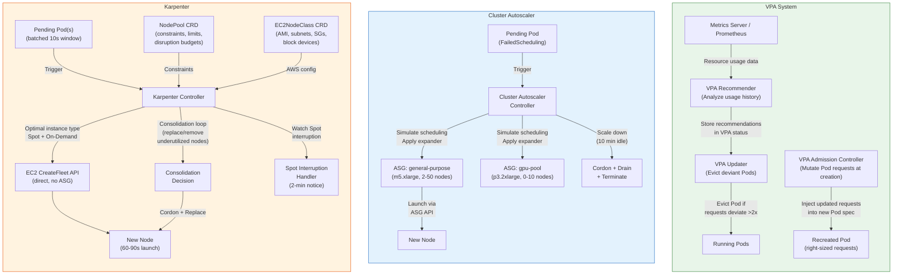

# Vertical and Cluster Autoscaling

## 1. Overview

Horizontal Pod Autoscaling adds or removes replicas, but two critical scaling dimensions remain: **vertical scaling** (adjusting CPU and memory requests/limits for existing Pods) and **infrastructure scaling** (adding or removing nodes to accommodate Pod demand). The Vertical Pod Autoscaler (VPA) handles the first; the Cluster Autoscaler and Karpenter handle the second.

VPA continuously monitors Pod resource utilization and recommends (or applies) optimal CPU and memory requests. It answers the question: "Are your resource requests right-sized, or are you wasting money on over-provisioned Pods?" In production Kubernetes clusters, resource request misconfigurations -- typically 2-5x over-provisioning -- account for 30-50% of wasted compute spend.

Cluster Autoscaler and Karpenter solve the infrastructure layer: when HPA or VPA decisions create Pods that cannot be scheduled (no node has sufficient resources), these tools provision new nodes. When nodes become underutilized, they consolidate workloads and remove excess capacity. The choice between Cluster Autoscaler and Karpenter represents one of the most consequential infrastructure decisions for Kubernetes operators today: battle-tested rigidity vs. modern flexibility.

Together, VPA + node autoscaling form the "vertical and infrastructure" complement to HPA's horizontal scaling, completing the three-axis autoscaling model that production Kubernetes clusters require.

## 2. Why It Matters

- **Resource requests are almost always wrong.** Developers set requests based on guesswork during initial deployment and rarely revisit them. VPA provides data-driven recommendations that right-size requests, eliminating both over-provisioning (wasted money) and under-provisioning (OOM kills, CPU throttling).
- **HPA cannot function without correct requests.** HPA calculates utilization as `currentUsage / request`. If requests are 10x too high, HPA sees 10% utilization and never scales up. If requests are too low, HPA sees 200% utilization and scales to maxReplicas unnecessarily. VPA fixes the denominator in HPA's equation.
- **Node provisioning is the bottleneck in the scaling chain.** HPA decides to add replicas, but if no node has capacity, Pods sit in `Pending` state until a new node is provisioned. Cluster Autoscaler takes 2-5 minutes to provision a node on AWS (instance launch + kubelet registration + CNI initialization). Karpenter reduces this to 60-90 seconds by bypassing Auto Scaling Groups and calling the EC2 Fleet API directly.
- **Consolidation saves 20-40% on infrastructure.** After traffic drops, nodes may be 15-30% utilized. Node autoscalers consolidate workloads onto fewer nodes and terminate the excess, directly reducing cloud spend.
- **Spot instance strategies require intelligent node management.** Spot instances provide 60-90% savings but can be reclaimed with 2 minutes' notice. Karpenter handles Spot interruptions natively, replacing reclaimed nodes before workloads are impacted. Without this automation, Spot usage at scale is operationally untenable.

## 3. Core Concepts

### Vertical Pod Autoscaler (VPA)

- **VPA:** A Kubernetes autoscaler (installed separately, not built into core) that monitors Pod resource usage over time and adjusts (or recommends) CPU and memory requests/limits. VPA consists of three components: Recommender, Updater, and Admission Controller.
- **Recommender:** Analyzes historical and real-time resource consumption, applies statistical models (percentile-based), and produces recommendations for CPU and memory requests. The recommender uses a decaying histogram: recent data points carry more weight than older observations.
- **Updater:** Watches for Pods whose current requests deviate significantly from VPA recommendations. When the deviation exceeds a configurable threshold, the Updater evicts the Pod so it can be recreated with updated requests.
- **Admission Controller (VPA Webhook):** Intercepts Pod creation requests and mutates the resource requests/limits in the Pod spec to match VPA recommendations. This is how new Pods (including those recreated after eviction) receive updated resource values.
- **UpdateMode:** Controls how VPA applies recommendations:
  - `Off`: VPA only computes and stores recommendations. No Pods are modified. Use this mode for monitoring and as input to HPA tuning.
  - `Initial`: VPA applies recommendations only at Pod creation time. Running Pods are never evicted or modified. Safe for production workloads sensitive to restarts.
  - `Recreate`: VPA evicts Pods that deviate significantly from recommendations and relies on the controller (Deployment, StatefulSet) to recreate them with updated requests.
  - `Auto`: Currently behaves like `Recreate` but may adopt in-place resource updates in the future (InPlacePodVerticalScaling, beta in Kubernetes 1.32).
- **VPA Resource Policy:** Allows you to set per-container minimum and maximum CPU/memory bounds that VPA recommendations cannot exceed. Essential for preventing VPA from setting requests so low that the container cannot start, or so high that it cannot be scheduled.

### Cluster Autoscaler

- **Cluster Autoscaler (CA):** A Kubernetes component that adjusts the number of nodes in the cluster by interfacing with cloud provider APIs (Auto Scaling Groups on AWS, Managed Instance Groups on GCP, VM Scale Sets on Azure). CA watches for unschedulable Pods (scale-up trigger) and underutilized nodes (scale-down trigger).
- **Node Group (AWS) / Node Pool (GKE/AKS):** A predefined collection of identically configured nodes. CA can only scale within the bounds and instance types defined in these groups. This is CA's fundamental constraint: you must predefine what types of nodes are available.
- **Scale-Up Trigger:** A Pod enters `Pending` state with a `FailedScheduling` event because no existing node has sufficient resources. CA simulates scheduling the Pod on each node group and provisions a node from the group that can accommodate it.
- **Scale-Down Logic:** CA identifies nodes where all Pods can be rescheduled on other existing nodes. It waits for a configurable duration (default: 10 minutes of underutilization) before cordoning, draining, and terminating the node.
- **Expander Strategy:** When multiple node groups can accommodate a pending Pod, CA uses an expander to choose: `random`, `most-pods` (fits the most pending Pods), `least-waste` (minimizes leftover resources), `priority` (user-defined ordering), or `price` (lowest cost -- GCE only).

### Karpenter

- **Karpenter:** A node provisioning system for Kubernetes that bypasses cloud provider Auto Scaling Groups entirely. Instead of scaling predefined node groups, Karpenter evaluates pending Pod requirements (CPU, memory, GPU, architecture, topology) and calls the cloud provider's instance fleet API directly to provision the optimal instance type.
- **NodePool:** A Karpenter CRD that defines constraints for provisioned nodes: instance families, architectures (amd64, arm64), capacity types (on-demand, spot), availability zones, taints, labels, and resource limits (total CPU/memory the NodePool can provision). Replaces the concept of predefined node groups.
- **EC2NodeClass (AWS):** A Karpenter CRD specific to AWS that defines the cloud provider configuration for nodes: AMI selector, subnet selector, security groups, instance profile, user data, block device mappings, and metadata options. Separates "what kind of node" (NodePool) from "how to launch it on AWS" (EC2NodeClass).
- **Consolidation:** Karpenter actively optimizes the node fleet by replacing underutilized nodes with smaller or fewer instances. Two consolidation policies:
  - `WhenEmptyOrUnderutilized` (default): Removes empty nodes immediately and replaces underutilized nodes with cheaper alternatives.
  - `WhenEmpty`: Only removes nodes that have zero non-DaemonSet Pods. More conservative, suitable for latency-sensitive workloads that should not be disrupted for cost optimization.
- **Disruption Budgets:** Configurable limits on how many nodes Karpenter can disrupt simultaneously. Expressed as a count or percentage (default: `nodes: 10%`). Supports time-based schedules for maintenance windows where tighter or looser budgets apply.
- **Drift Detection:** Karpenter detects when running nodes no longer match the desired configuration (AMI updated, NodePool spec changed) and replaces drifted nodes automatically, respecting disruption budgets.
- **Node Termination Handler:** Handles cloud provider interruption notices (Spot reclamation, scheduled maintenance) by cordoning and draining affected nodes before termination. On AWS, Karpenter natively watches for EC2 Spot interruption warnings (2-minute notice) and Rebalance Recommendations (proactive signal).

## 4. How It Works

### VPA Workflow

1. **Data collection:** The VPA Recommender queries the Metrics Server (or Prometheus, in advanced setups) for historical resource usage data. It aggregates data over a configurable window (default: 8 days of history with exponential decay).
2. **Recommendation computation:** The Recommender computes target, lower bound, upper bound, and uncapped target for each container. The target is typically the 90th percentile CPU and memory over the observation window, with a safety margin.
3. **Recommendation storage:** Recommendations are written to the VPA object's `status.recommendation` field, visible via `kubectl describe vpa`.
4. **Application (mode-dependent):**
   - `Off`: No action. Recommendations are available for manual review.
   - `Initial`: Admission Controller mutates Pod specs at creation to match recommendations.
   - `Recreate`/`Auto`: Updater compares running Pod requests to recommendations. If the deviation exceeds the threshold (default: requests are <50% or >200% of recommendation), the Updater evicts the Pod. The owning controller (Deployment) recreates it, and the Admission Controller injects updated requests.

### VPA Object Example

```yaml
apiVersion: autoscaling.k8s.io/v1
kind: VerticalPodAutoscaler
metadata:
  name: api-server-vpa
spec:
  targetRef:
    apiVersion: apps/v1
    kind: Deployment
    name: api-server
  updatePolicy:
    updateMode: "Initial"                     # Apply only at Pod creation
  resourcePolicy:
    containerPolicies:
    - containerName: api
      minAllowed:
        cpu: 100m
        memory: 128Mi
      maxAllowed:
        cpu: 4
        memory: 8Gi
      controlledResources: ["cpu", "memory"]
    - containerName: envoy-sidecar
      mode: "Off"                             # Do not touch the sidecar
```

### Cluster Autoscaler Workflow

1. **Trigger:** A Pod enters `Pending` state. The scheduler adds a `FailedScheduling` event indicating insufficient resources.
2. **Simulation:** CA iterates through all configured node groups and simulates whether a new node from each group would allow the Pod to be scheduled (considering taints, affinity, resource requests, topology constraints).
3. **Selection:** CA applies the expander strategy to choose among viable node groups.
4. **Provisioning:** CA calls the cloud provider API to increase the node group's desired count by 1 (or more, if multiple Pods are pending). On AWS, this modifies the ASG desired capacity.
5. **Node registration:** The new node boots, runs kubelet, registers with the API server, and becomes Ready. The scheduler assigns pending Pods.
6. **Scale-down:** CA continuously evaluates nodes for underutilization. If all Pods on a node can be rescheduled elsewhere and the node has been underutilized for `--scale-down-unneeded-time` (default: 10 minutes), CA cordons, drains, and terminates the node.

### Karpenter Workflow

1. **Trigger:** A Pod enters `Pending` state (same trigger as CA).
2. **Batching:** Karpenter waits briefly (default: 10 seconds) to batch multiple pending Pods into a single provisioning decision. This produces more efficient bin-packing.
3. **Instance type selection:** Karpenter evaluates the batched Pod requirements against all available instance types that satisfy the NodePool constraints. It selects the optimal instance type(s) using a cost-aware bin-packing algorithm. For example, instead of launching 4x m5.xlarge (4 vCPU each) for Pods needing 12 total vCPU, it may choose 1x m5.4xlarge (16 vCPU) if cheaper.
4. **Fleet API call:** On AWS, Karpenter calls the EC2 CreateFleet API directly (bypassing ASGs). This allows specifying multiple instance types in priority order with Spot fallback to on-demand.
5. **Node initialization:** Node boots, kubelet registers, Karpenter applies labels and taints from the NodePool spec.
6. **Consolidation:** Karpenter continuously evaluates the fleet:
   - Can two underutilized nodes be replaced by one smaller node?
   - Can a node's workloads fit on existing nodes with spare capacity?
   - Is a node empty (only DaemonSets)?

   If consolidation is beneficial, Karpenter cordons the target node, creates a replacement (if needed), waits for Pods to reschedule, then terminates the old node.

### Karpenter NodePool and EC2NodeClass Examples

```yaml
apiVersion: karpenter.sh/v1
kind: NodePool
metadata:
  name: general-purpose
spec:
  template:
    metadata:
      labels:
        team: platform
        tier: general
    spec:
      nodeClassRef:
        group: karpenter.k8s.aws
        kind: EC2NodeClass
        name: default
      requirements:
      - key: kubernetes.io/arch
        operator: In
        values: ["amd64", "arm64"]            # Allow both architectures
      - key: karpenter.sh/capacity-type
        operator: In
        values: ["spot", "on-demand"]          # Prefer Spot, fallback On-Demand
      - key: karpenter.k8s.aws/instance-family
        operator: In
        values: ["m7g", "m7i", "m6g", "m6i", "c7g", "c7i", "r7g"]
      - key: karpenter.k8s.aws/instance-size
        operator: In
        values: ["large", "xlarge", "2xlarge", "4xlarge"]
      taints:
      - key: workload-type
        value: general
        effect: NoSchedule
  disruption:
    consolidationPolicy: WhenEmptyOrUnderutilized
    consolidateAfter: 30s
    budgets:
    - nodes: "20%"                            # Max 20% of nodes disrupted at once
    - nodes: "0"                              # During business hours, no disruption
      schedule: "0 9 * * 1-5"                 # Mon-Fri 9 AM
      duration: 8h                            # Until 5 PM
  limits:
    cpu: "1000"                               # Max 1000 vCPU across all nodes
    memory: "2000Gi"                          # Max 2 TiB memory
  weight: 50                                  # Priority relative to other NodePools
---
apiVersion: karpenter.k8s.aws/v1
kind: EC2NodeClass
metadata:
  name: default
spec:
  role: KarpenterNodeRole-my-cluster
  amiSelectorTerms:
  - alias: "al2023@latest"                    # Amazon Linux 2023, latest AMI
  subnetSelectorTerms:
  - tags:
      karpenter.sh/discovery: my-cluster
  securityGroupSelectorTerms:
  - tags:
      karpenter.sh/discovery: my-cluster
  blockDeviceMappings:
  - deviceName: /dev/xvda
    ebs:
      volumeSize: 100Gi
      volumeType: gp3
      iops: 3000
      throughput: 125
      deleteOnTermination: true
  metadataOptions:
    httpEndpoint: enabled
    httpProtocolIPv6: disabled
    httpPutResponseHopLimit: 1
    httpTokens: required                      # Enforce IMDSv2
```

## 5. Architecture / Flow



## 6. Types / Variants

### VPA Update Modes Comparison

| Update Mode | Behavior | Pod Restarts | Production Safety | Best For |
|---|---|---|---|---|
| `Off` | Recommendations only, no action | None | Safest | Monitoring, feeding data to manual tuning, running alongside HPA |
| `Initial` | Apply recommendations at Pod creation only | Only on new Pods | Safe (no unexpected evictions) | Workloads sensitive to restarts, gradual right-sizing over deployment cycles |
| `Recreate` | Evict Pods that deviate significantly from recommendations | Yes, when deviation >2x | Moderate (unexpected restarts) | Stateless workloads that tolerate restarts, batch jobs |
| `Auto` | Currently same as Recreate; will adopt in-place resize when available | Yes (until in-place resize GA) | Moderate | Future-proofing for in-place vertical scaling |

### Cluster Autoscaler vs. Karpenter

| Dimension | Cluster Autoscaler | Karpenter |
|---|---|---|
| **Node group model** | Predefined ASGs/MIGs with fixed instance types | No node groups; selects optimal instance per Pod batch |
| **Instance selection** | Limited to instances configured in the ASG | Evaluates all instance types matching NodePool constraints |
| **Provisioning speed** | 2-5 min (ASG API + instance launch + registration) | 60-90 sec (Fleet API + instance launch + registration) |
| **Bin-packing** | One Pod at a time, sequential decisions | Batches pending Pods (10s window), joint optimization |
| **Consolidation** | Basic: remove underutilized nodes after timeout | Active: replace nodes with cheaper/smaller alternatives, continuous optimization |
| **Spot handling** | Requires separate Node Termination Handler DaemonSet | Native Spot interruption handling built into controller |
| **Multi-architecture** | One ASG per architecture (amd64, arm64) | Single NodePool supports multiple architectures |
| **Drift detection** | Not supported (manual node rotation required) | Automatic: detects AMI, config drift and replaces nodes |
| **Cloud support** | AWS, GCP, Azure, and 10+ other providers | AWS (GA), Azure (preview via AKS NAP); GCP via GKE equivalent |
| **Maturity** | Production-proven since 2016, CNCF project | GA since v1.0 (Nov 2024), rapidly maturing |
| **Disruption control** | PDB-aware drain, configurable timeouts | Disruption budgets with time schedules, PDB-aware |

### Karpenter Consolidation Strategies

| Strategy | Behavior | Disruption Level | Best For |
|---|---|---|---|
| `WhenEmptyOrUnderutilized` | Remove empty nodes and replace underutilized ones | Higher (more node churn) | Cost-optimized clusters, dev/staging environments |
| `WhenEmpty` | Only remove nodes with zero non-DaemonSet Pods | Lower (minimal disruption) | Production latency-sensitive workloads, stateful services |
| Consolidation disabled (`consolidateAfter: Never`) | No automatic consolidation | None | GPU nodes with long-running training jobs, nodes with local storage |

### Karpenter Spot Instance Strategies

```yaml
# Strategy 1: Spot-preferred with on-demand fallback
apiVersion: karpenter.sh/v1
kind: NodePool
metadata:
  name: spot-preferred
spec:
  template:
    spec:
      requirements:
      - key: karpenter.sh/capacity-type
        operator: In
        values: ["spot", "on-demand"]         # Karpenter tries Spot first
      - key: karpenter.k8s.aws/instance-family
        operator: In
        values: ["m7i", "m7g", "c7i", "c7g", "m6i", "m6g"]  # Wide selection reduces Spot interruption
---
# Strategy 2: Separate NodePools with weights
apiVersion: karpenter.sh/v1
kind: NodePool
metadata:
  name: spot-primary
spec:
  weight: 100                                 # Preferred
  template:
    spec:
      requirements:
      - key: karpenter.sh/capacity-type
        operator: In
        values: ["spot"]
---
apiVersion: karpenter.sh/v1
kind: NodePool
metadata:
  name: on-demand-fallback
spec:
  weight: 10                                  # Used when Spot unavailable
  template:
    spec:
      requirements:
      - key: karpenter.sh/capacity-type
        operator: In
        values: ["on-demand"]
```

**Spot interruption handling flow:**
1. AWS sends a Spot Interruption Warning (2-minute notice) or a Rebalance Recommendation (proactive signal).
2. Karpenter receives the event via SQS queue (configured during installation).
3. Karpenter cordons the node (prevents new Pod scheduling).
4. Karpenter provisions a replacement node (Spot or on-demand, based on NodePool constraints).
5. Karpenter drains the old node (respecting PDBs and graceful termination periods).
6. Pods are rescheduled onto the replacement or existing nodes.
7. Old node is terminated (or AWS reclaims it).

Total disruption for well-configured workloads (multiple replicas, PDBs, fast startup): typically under 60 seconds of reduced capacity, zero downtime.

## 7. Use Cases

- **VPA for JVM services.** Java applications with `-Xmx` heap settings and unpredictable native memory consumption. VPA in `Off` mode provides recommendations that the platform team reviews monthly to adjust deployment manifests. This addresses the common pattern where JVM services are provisioned with 4 Gi memory requests but consistently use only 1.5 Gi. Annual savings on a 200-service platform: 40-60% memory cost reduction.
- **VPA + HPA complementary setup.** HPA scales on custom metrics (requests per second) while VPA in `Off` mode continuously monitors CPU/memory utilization and provides recommendations. The platform team uses VPA recommendations to adjust resource requests quarterly, ensuring HPA's utilization calculations remain accurate. This avoids the HPA/VPA mutual exclusion problem by never running VPA in active mode on the same metric as HPA.
- **Cluster Autoscaler for regulated environments.** Financial services companies that require pre-approved instance types, specific AMIs with hardened security configurations, and audit trails for every node provisioned. CA's node group model (predefined ASGs with approved launch templates) fits this compliance requirement. The 2-5 minute provisioning delay is acceptable because workloads are capacity-planned with generous headroom.
- **Karpenter for heterogeneous workloads.** A platform running web services (CPU-optimized, arm64), ML inference (GPU, amd64), and data processing (memory-optimized, spot). Karpenter provisions the right instance type for each workload category from a single control plane, without maintaining 6+ separate ASGs. Consolidation continuously optimizes the fleet composition as workload mix changes throughout the day.
- **Karpenter Spot management for cost-sensitive environments.** A batch processing platform that tolerates interruptions. Karpenter NodePool configured with `spot` only, wide instance family selection (15+ families to maximize Spot availability), and aggressive consolidation. Spot interruption handler ensures graceful drain. Cost savings: 60-80% vs. on-demand, with automatic fallback when Spot capacity is limited.
- **Mixed Karpenter + Cluster Autoscaler.** Some organizations use both: CA manages a stable base of on-demand nodes (running system components, databases), while Karpenter manages elastic capacity (web services, batch jobs). This hybrid approach uses CA's maturity for critical infrastructure and Karpenter's flexibility for application workloads.

## 8. Tradeoffs

| Decision | Option A | Option B | Guidance |
|---|---|---|---|
| **VPA Auto vs. Off** | Auto: automated right-sizing, risk of untimely evictions | Off: manual process, zero disruption risk | Use Off for production stateful workloads; Auto for stateless services with >3 replicas |
| **VPA vs. manual tuning** | VPA: data-driven, continuous | Manual: human review, quarterly updates | VPA in Off mode for recommendations, manual application during change windows |
| **CA vs. Karpenter** | CA: multi-cloud, battle-tested, rigid | Karpenter: fast, flexible, AWS-centric | CA for multi-cloud or regulated environments; Karpenter for AWS-native cost-optimized clusters |
| **Aggressive consolidation vs. conservative** | Aggressive: maximum savings, higher churn | Conservative: stable, higher cloud spend | Aggressive for dev/staging; WhenEmpty for production latency-sensitive workloads |
| **Spot-only vs. Spot-preferred** | Spot-only: maximum savings, interruption risk | Spot-preferred with on-demand fallback: balanced | Spot-preferred for production; Spot-only for batch/fault-tolerant workloads |
| **Single large NodePool vs. multiple** | Single: simpler management, broader instance selection | Multiple: per-team isolation, different disruption policies | Start with 2-3 NodePools (general, GPU, spot-batch) and expand only as isolation needs arise |

## 9. Common Pitfalls

- **Running VPA and HPA on the same CPU/memory metric.** This creates a feedback loop: HPA adds replicas to reduce per-Pod utilization, VPA sees lower utilization and reduces requests, HPA recalculates and sees higher utilization percentage, adds more replicas. Solution: use VPA in `Off` mode when HPA targets the same resource metric, or use HPA on custom metrics (RPS) while VPA manages CPU/memory requests.
- **VPA without resource policies.** VPA may recommend 10m CPU for a container that needs at least 50m to pass health checks. Or it may recommend 32 Gi memory for a container on nodes with only 16 Gi available. Always set `minAllowed` and `maxAllowed` in VPA resource policies.
- **VPA evicting single-replica Deployments.** VPA in `Recreate` mode evicts the Pod to apply new requests. If `replicas: 1`, this causes downtime. Ensure workloads managed by VPA in active mode have at least 2 replicas, or use `Initial` mode.
- **Cluster Autoscaler not detecting pending Pods.** CA relies on `FailedScheduling` events. If resource requests are not set, the scheduler may place Pods on nodes with insufficient actual capacity (the Pod is scheduled but OOM-killed). CA never sees a pending Pod and never provisions new nodes. Always set accurate resource requests.
- **Cluster Autoscaler scale-down blocked by local storage.** CA skips nodes with Pods that use `emptyDir` volumes (interpreted as local storage). This is overly conservative for most use cases. Configure `--skip-nodes-with-local-storage=false` if your emptyDir usage is ephemeral.
- **Karpenter over-consolidation causing churn.** With `WhenEmptyOrUnderutilized` and `consolidateAfter: 0s`, Karpenter may continuously replace nodes as utilization fluctuates. Set `consolidateAfter: 30s` or higher to batch consolidation decisions and reduce API calls.
- **Karpenter NodePool limits too low.** If `limits.cpu` is set to 100 and the cluster needs 150 vCPU, Karpenter stops provisioning at 100 vCPU and Pods remain pending. Monitor NodePool utilization against limits and alert at 80%.
- **Spot interruption without multi-AZ distribution.** Spot capacity is AZ-specific. If all Spot nodes are in a single AZ, a capacity reclamation can evict all of them simultaneously. Configure NodePool requirements to spread across 3+ AZs.
- **Ignoring PodDisruptionBudgets during consolidation.** Both CA and Karpenter respect PDBs, but if no PDB is defined, they may drain all replicas of a service simultaneously during consolidation. Define PDBs for every production Deployment.

## 10. Real-World Examples

- **Shopify (VPA + CA):** Runs VPA in `Off` mode across their entire microservice fleet (~7,000 services). A monthly automation pipeline reads VPA recommendations and generates pull requests to update resource requests in Helm values. Engineers review and merge. This approach saved 35% on cluster compute costs in the first year by eliminating resource over-provisioning. They use Cluster Autoscaler with `least-waste` expander across 20+ node groups organized by instance family.
- **Airbnb (Karpenter migration):** Migrated from Cluster Autoscaler to Karpenter in 2024. Key driver: they had 15+ Auto Scaling Groups per cluster to cover different instance types, architectures, and Spot pools. Karpenter replaced all ASGs with 3 NodePools (general, gpu, system). Node provisioning time dropped from 3-4 minutes to ~75 seconds. Consolidation reduced average node utilization waste from 40% to 15%.
- **Cost management benchmarks (from source material):** With compute at 70-80% of cluster costs, the combination of VPA (right-sizing requests) and Karpenter (optimal instance selection + Spot) delivers the highest cost savings. AMD and ARM instances are 30-40% cheaper than Intel equivalents. Spot instances provide 80-90% savings over on-demand. Karpenter's ability to dynamically select from all available instance types and capacity types maximizes these savings automatically. Affinity rules (soft affinity for Spot, hard fallback to on-demand) ensure availability without manual intervention.
- **Pinterest (Cluster Autoscaler at scale):** Operates CA across clusters with 30,000+ Pods. They use the `priority` expander to prefer Spot instances in specific AZs with known capacity. Their CA is configured with `--scale-down-unneeded-time=15m` and `--scale-down-delay-after-add=10m` to prevent churn. Scale-up events during peak hours provision 50-100 nodes in a single burst.
- **Karpenter consolidation in practice:** A production cluster running 200 nodes (mixed m5.xlarge and m5.2xlarge). After enabling `WhenEmptyOrUnderutilized` consolidation, Karpenter replaced 200 nodes with 140 nodes (mix of m5.xlarge, m6g.xlarge, and c6g.2xlarge). The consolidation chose Graviton (ARM) instances where workloads supported it, saving an additional 20% beyond the instance count reduction. Total node count reduction: 30%. Total cost reduction: 45%.

### Node Provisioning Latency Breakdown

| Phase | Cluster Autoscaler | Karpenter |
|---|---|---|
| **Pending Pod detection** | 10-30s (relies on scheduler events) | 10s (batch window) |
| **Scaling decision** | 10-30s (simulates across node groups) | <5s (evaluates all instance types) |
| **Cloud API call** | 30-60s (ASG DesiredCapacity update) | 10-30s (EC2 CreateFleet direct) |
| **Instance launch** | 30-120s (EC2 instance start) | 30-120s (EC2 instance start) |
| **kubelet registration** | 15-30s (join cluster, report Ready) | 15-30s (join cluster, report Ready) |
| **CNI initialization** | 5-15s (VPC CNI, IP allocation) | 5-15s (VPC CNI, IP allocation) |
| **Pod scheduling + start** | 5-30s (image pull, container start) | 5-30s (image pull, container start) |
| **Total** | **2-5 minutes** | **60-90 seconds** |

### In-Place Pod Vertical Scaling (Future)

Kubernetes v1.32 introduced `InPlacePodVerticalScaling` as a beta feature. This allows changing a Pod's CPU and memory requests/limits without restarting the container:

```yaml
# Resize a running Pod (beta, requires feature gate)
spec:
  containers:
  - name: app
    resources:
      requests:
        cpu: 500m          # Can be changed without restart
        memory: 256Mi      # Can be changed without restart
    resizePolicy:
    - resourceName: cpu
      restartPolicy: NotRequired    # CPU changes take effect immediately
    - resourceName: memory
      restartPolicy: RestartContainer  # Memory changes require container restart
```

When this feature reaches GA, VPA's `Auto` mode will update Pod requests in-place rather than evicting and recreating Pods. This eliminates the primary operational concern with VPA in active mode (unexpected Pod restarts) and makes VPA viable for single-replica Deployments and latency-sensitive workloads.

## 11. Related Concepts

- [Horizontal Pod Autoscaling](./01-horizontal-pod-autoscaling.md) -- HPA is the primary horizontal scaling mechanism; VPA right-sizes the requests that HPA relies on
- [KEDA and Event-Driven Scaling](./03-keda-and-event-driven-scaling.md) -- KEDA creates HPA objects that may trigger node autoscaling when replicas increase
- [GPU-Aware Autoscaling](./04-gpu-aware-autoscaling.md) -- Karpenter GPU NodePools and scale-from-zero for GPU instances
- [GPU and Accelerator Workloads](../03-workload-design/05-gpu-and-accelerator-workloads.md) -- GPU scheduling that Karpenter must satisfy when provisioning GPU nodes
- [Autoscaling (Traditional System Design)](../../traditional-system-design/02-scalability/02-autoscaling.md) -- general autoscaling principles
- [Cost Optimization](../../genai-system-design/11-performance/03-cost-optimization.md) -- VPA and Karpenter as primary cost optimization levers

## 12. Source Traceability

- source/youtube-video-reports/7.md -- HPA and resource baselining: trigger HPA at ~80% of resource limit; balance Requests (guaranteed) and Limits (maximum); observability with Prometheus/Grafana and Open Cost for translating resource usage to currency
- source/youtube-video-reports/1.md -- Cost management: compute is 70-80% of Kubernetes costs; Spot instances provide 80-90% savings; AMD/ARM instances 30-40% cheaper; affinity rules for Spot with on-demand fallback
- Kubernetes VPA documentation (github.com/kubernetes/autoscaler/tree/master/vertical-pod-autoscaler) -- VPA architecture, update modes, resource policies
- Karpenter documentation (karpenter.sh) -- NodePool/EC2NodeClass CRDs, consolidation policies, disruption budgets, Spot handling
- Cluster Autoscaler documentation (github.com/kubernetes/autoscaler/tree/master/cluster-autoscaler) -- Architecture, expander strategies, scale-down logic
