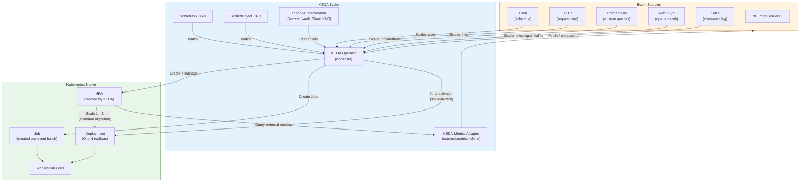

# KEDA and Event-Driven Scaling

## 1. Overview

KEDA (Kubernetes Event-Driven Autoscaling) is a lightweight, single-purpose component that extends Kubernetes' native HPA to scale workloads based on event sources and external metrics. Where native HPA is limited to CPU, memory, and metrics exposed via the Kubernetes Metrics APIs, KEDA provides a catalog of 70+ built-in **scalers** that connect to event sources like Kafka, AWS SQS, Prometheus, RabbitMQ, Azure Service Bus, PostgreSQL, Cron schedules, and HTTP request rates -- out of the box, with no custom adapter code required.

KEDA's most important capability is **scale-to-zero**: it can reduce a Deployment to 0 replicas when there are no events to process, and scale back to 1+ replicas when events arrive. Native HPA requires `minReplicas >= 1`, meaning idle workloads still consume resources. For event-driven architectures (queue consumers, webhook processors, batch jobs), scale-to-zero can eliminate 100% of idle compute cost.

KEDA is a CNCF graduated project (as of 2024), widely adopted in production by organizations including Microsoft, Red Hat, CERN, and Zapier. It runs as a Kubernetes Operator and a Metrics Adapter, creating and managing HPA objects on behalf of the user. Understanding KEDA is essential for any Kubernetes platform that runs event-driven or asynchronous workloads -- which, in practice, means most production platforms.

## 2. Why It Matters

- **Scale-to-zero eliminates idle cost.** A queue consumer that processes messages for 4 hours/day but runs 24/7 wastes 83% of its compute cost. KEDA scales it to 0 replicas during the 20 idle hours, saving 83% on that workload. For GPU inference endpoints serving sporadic traffic, scale-to-zero can save thousands of dollars per month per model.
- **Event-driven scaling is fundamentally different from resource-based scaling.** CPU utilization is a lagging indicator: by the time CPU rises, the queue has been backing up for minutes. KEDA scales on the leading indicator (queue depth, topic lag) so replicas are ready before the CPU impact materializes. This reduces end-to-end processing latency by 50-80% for bursty workloads.
- **70+ scalers cover most event sources without custom code.** Before KEDA, scaling on Kafka consumer lag or SQS queue depth required building a custom metrics adapter, deploying it, registering it as an API service, and maintaining it. KEDA replaces all of this with a 20-line YAML configuration.
- **KEDA is the bridge between Kubernetes and serverless patterns.** It brings the scale-to-zero economics of AWS Lambda or Cloud Run to Kubernetes, without requiring a serverless platform. Workloads keep their standard Deployment, container image, and debugging tools -- they just scale smarter.
- **Foundation for GPU-aware autoscaling.** KEDA's Prometheus scaler is the primary mechanism for scaling GPU inference workloads based on vLLM metrics (queue depth, KV cache utilization), as covered in the GPU-aware autoscaling document.

## 3. Core Concepts

- **KEDA Operator (Controller):** A Kubernetes controller that watches for ScaledObject and ScaledJob resources. When it detects a new ScaledObject, it creates a corresponding HPA object and manages its lifecycle. The operator also handles the scale-to-zero / scale-from-zero activation logic (since HPA cannot scale below `minReplicas: 1`).
- **KEDA Metrics Adapter:** A Kubernetes API server extension that implements the External Metrics API (`external.metrics.k8s.io`). It translates metrics from KEDA scalers into the format that native HPA expects. The HPA queries this adapter to get external metric values for its scaling algorithm.
- **ScaledObject:** The primary KEDA CRD for scaling Deployments, StatefulSets, or Custom Resources. It defines which workload to scale, which event sources (triggers) to use, and scaling parameters (min/max replicas, polling interval, cooldown period).
- **ScaledJob:** A KEDA CRD for scaling Kubernetes Jobs. Instead of adjusting replica count (like ScaledObject does for Deployments), ScaledJob creates new Job instances in response to events. Ideal for batch processing where each event should be processed by an independent, disposable Job.
- **Trigger:** A scaling rule within a ScaledObject or ScaledJob that connects to a specific event source. Each trigger specifies a scaler type (e.g., `kafka`, `prometheus`, `aws-sqs-queue`), connection parameters, and a threshold that maps to HPA's `targetValue`. Multiple triggers in a single ScaledObject are evaluated independently; the highest scaling recommendation wins (same as multi-metric HPA).
- **Scaler:** The plugin code within KEDA that knows how to connect to a specific event source and retrieve its metric. KEDA ships with 70+ built-in scalers. Community scalers can be added via the external scaler gRPC interface.
- **TriggerAuthentication:** A CRD for securely providing credentials to scalers without embedding them in ScaledObject specs. Supports Kubernetes Secrets, environment variables, HashiCorp Vault, Azure Key Vault, AWS Secrets Manager, and GCP Secret Manager. A `ClusterTriggerAuthentication` variant applies cluster-wide.
- **Activation and Deactivation:** KEDA's mechanism for scale-to-zero. When all triggers report a metric value of 0 (or below the `activationValue` threshold), KEDA scales the workload to 0 replicas. When any trigger reports a non-zero value, KEDA scales to `minReplicaCount` (default: 1), and then HPA takes over for further scaling.
- **Fallback:** Configurable behavior when KEDA cannot reach the event source. You can specify a fallback replica count to prevent workloads from being stuck at 0 replicas when the metrics source is down.
- **Paused Annotations:** KEDA supports pausing autoscaling via annotations on the ScaledObject. `autoscaling.keda.sh/paused-replicas: "5"` holds the workload at exactly 5 replicas regardless of metrics, useful during deployments or debugging.

## 4. How It Works

### KEDA Architecture

KEDA operates as two cooperating components:

1. **KEDA Operator (keda-operator):** Watches for ScaledObject/ScaledJob resources. For each ScaledObject:
   - Creates an HPA targeting the same workload, configured with external metrics.
   - Manages the 0 <-> 1 replica transition (activation/deactivation) because HPA cannot set replicas to 0.
   - Periodically polls triggers to check if the workload should be activated (scaled from 0 to minReplicas) or deactivated (scaled from minReplicas to 0).

2. **KEDA Metrics Adapter (keda-operator-metrics-apiserver):** Registers as an External Metrics API provider. When HPA queries for an external metric, the adapter:
   - Identifies the corresponding ScaledObject and trigger.
   - Calls the scaler to fetch the current metric value from the event source.
   - Returns the metric to HPA in the expected format.

### End-to-End Scaling Flow

1. **User creates ScaledObject.** The KEDA operator detects it and creates an HPA with external metric references.
2. **Idle state (0 replicas).** The operator polls triggers every `pollingInterval` seconds (default: 30). All triggers report 0 events. Deployment stays at 0 replicas.
3. **Event arrives.** A message lands in the Kafka topic / SQS queue / Prometheus metric exceeds threshold. On the next poll, the trigger reports a non-zero value.
4. **Activation.** The KEDA operator scales the Deployment from 0 to `minReplicaCount` (default: 1).
5. **HPA takes over.** With replicas >= 1, HPA queries the KEDA Metrics Adapter for the external metric value and applies its standard algorithm: `desiredReplicas = ceil[currentReplicas * (currentMetric / targetMetric)]`.
6. **Scale-up.** HPA increases replicas based on event volume. If Kafka lag is 10,000 and the target is 1,000 per replica, HPA scales to 10 replicas.
7. **Event processing.** Pods consume events, reducing the metric (queue drains, lag decreases).
8. **Scale-down.** HPA reduces replicas as the metric drops, subject to the stabilization window (default: 300 seconds for scale-down).
9. **Deactivation.** When all triggers report 0 for the `cooldownPeriod` (default: 300 seconds), the KEDA operator scales the Deployment to 0 replicas.

### ScaledObject Example: Kafka Consumer

```yaml
apiVersion: keda.sh/v1alpha1
kind: ScaledObject
metadata:
  name: order-processor
  namespace: production
spec:
  scaleTargetRef:
    apiVersion: apps/v1
    kind: Deployment
    name: order-processor
  pollingInterval: 15                         # Check triggers every 15 seconds
  cooldownPeriod: 300                         # Wait 5 min at 0 events before scaling to 0
  minReplicaCount: 0                          # Enable scale-to-zero
  maxReplicaCount: 50                         # Upper bound
  fallback:
    failureThreshold: 3                       # After 3 failed polls
    replicas: 5                               # Fall back to 5 replicas
  triggers:
  - type: kafka
    metadata:
      bootstrapServers: kafka.production.svc:9092
      consumerGroup: order-processor-group
      topic: orders
      lagThreshold: "100"                     # Target: 100 messages of lag per replica
      activationLagThreshold: "1"             # Activate when lag >= 1
      offsetResetPolicy: latest
    authenticationRef:
      name: kafka-credentials
---
apiVersion: keda.sh/v1alpha1
kind: TriggerAuthentication
metadata:
  name: kafka-credentials
  namespace: production
spec:
  secretTargetRef:
  - parameter: sasl
    name: kafka-sasl-secret
    key: sasl-mechanism
  - parameter: username
    name: kafka-sasl-secret
    key: username
  - parameter: password
    name: kafka-sasl-secret
    key: password
  - parameter: tls
    name: kafka-tls-secret
    key: enabled
```

### ScaledObject Example: Prometheus Custom Metric

```yaml
apiVersion: keda.sh/v1alpha1
kind: ScaledObject
metadata:
  name: api-gateway
  namespace: production
spec:
  scaleTargetRef:
    apiVersion: apps/v1
    kind: Deployment
    name: api-gateway
  pollingInterval: 10
  cooldownPeriod: 120
  minReplicaCount: 2                          # Never scale below 2 (availability)
  maxReplicaCount: 100
  triggers:
  - type: prometheus
    metadata:
      serverAddress: http://prometheus.monitoring.svc:9090
      query: |
        sum(rate(http_requests_total{service="api-gateway"}[2m]))
      threshold: "500"                        # Target: 500 RPS per replica
      activationThreshold: "10"               # Only activate above 10 RPS
```

### ScaledJob Example: SQS Queue Processor

```yaml
apiVersion: keda.sh/v1alpha1
kind: ScaledJob
metadata:
  name: image-processor
  namespace: production
spec:
  jobTargetRef:
    template:
      spec:
        containers:
        - name: processor
          image: my-registry/image-processor:v1.2
          resources:
            requests:
              cpu: 500m
              memory: 1Gi
        restartPolicy: Never
  pollingInterval: 30
  minReplicaCount: 0
  maxReplicaCount: 20
  successfulJobsHistoryLimit: 10
  failedJobsHistoryLimit: 5
  triggers:
  - type: aws-sqs-queue
    metadata:
      queueURL: https://sqs.us-east-1.amazonaws.com/123456789/image-processing
      queueLength: "5"                        # 1 Job per 5 messages
      awsRegion: us-east-1
    authenticationRef:
      name: aws-credentials
```

## 5. Architecture / Flow



## 6. Types / Variants

### Scaler Categories (70+ Built-In)

| Category | Scalers | Example Metric |
|---|---|---|
| **Message Queues** | Kafka, RabbitMQ, AWS SQS, Azure Service Bus, Google Pub/Sub, NATS JetStream, Redis Streams, ActiveMQ | Consumer lag, queue depth, unacked messages |
| **Databases** | PostgreSQL, MySQL, MongoDB, MSSQL, Cassandra, CockroachDB, Elasticsearch | Query result count, slow query count, row count |
| **Metrics Systems** | Prometheus, Datadog, New Relic, Dynatrace, InfluxDB, Graphite | Any PromQL/query result |
| **HTTP** | HTTP (KEDA HTTP Add-on), Nginx Ingress | Active connections, request rate, pending requests |
| **Cloud Services** | AWS CloudWatch, Azure Monitor, GCP Stackdriver, AWS Kinesis, Azure Event Hubs, GCP Pub/Sub | Any cloud metric |
| **CI/CD** | GitHub Runner, GitLab Runner | Pending workflow runs |
| **Scheduling** | Cron | Time-based replica targets |
| **Storage** | Azure Blob, AWS S3 (via CloudWatch), GCS | Blob/object count |
| **Custom** | External Scaler (gRPC), Metrics API | Any metric via gRPC interface |

### ScaledObject vs. ScaledJob

| Dimension | ScaledObject | ScaledJob |
|---|---|---|
| **Target** | Deployment, StatefulSet, Custom Resource | Job template |
| **Scaling mechanism** | Adjusts `spec.replicas` via HPA | Creates new Job instances |
| **Scale-to-zero** | Yes (0 replicas, Pod terminated) | Yes (no Jobs running) |
| **Processing model** | Long-running consumers (process multiple events per Pod) | One-shot processors (each Job handles a batch, then exits) |
| **State** | Pods maintain state between events (connections, caches) | Stateless; each Job starts fresh |
| **Best for** | Stream consumers (Kafka, RabbitMQ), API endpoints | Batch processing (image conversion, report generation, ETL) |
| **Completion** | Pods run indefinitely | Jobs complete and are cleaned up |

### KEDA vs. Native HPA Comparison

| Capability | Native HPA | KEDA |
|---|---|---|
| **CPU/memory scaling** | Yes (built-in) | Yes (via Metrics Server scaler) |
| **Custom metrics** | Yes (requires Prometheus Adapter) | Yes (built-in Prometheus scaler, no adapter needed) |
| **External metrics** | Yes (requires custom adapter per source) | Yes (70+ built-in scalers) |
| **Scale-to-zero** | No (minReplicas >= 1) | Yes |
| **Scale-from-zero** | No | Yes (activation mechanism) |
| **Job scaling** | No | Yes (ScaledJob) |
| **Authentication** | Manual (application-level) | TriggerAuthentication CRD (Secrets, Vault, Cloud KMS) |
| **Installation** | Built into Kubernetes | Helm chart / operator installation |
| **Fallback on metric failure** | Maintains current replicas | Configurable fallback replica count |
| **Pause scaling** | Delete or edit HPA | Annotation-based pause with target replica count |
| **Multiple event sources** | Multiple metrics in one HPA | Multiple triggers, takes maximum |

### Authentication Patterns

```yaml
# Pattern 1: Kubernetes Secret
apiVersion: keda.sh/v1alpha1
kind: TriggerAuthentication
metadata:
  name: kafka-auth
spec:
  secretTargetRef:
  - parameter: sasl
    name: kafka-credentials
    key: mechanism
  - parameter: password
    name: kafka-credentials
    key: password

---
# Pattern 2: Pod Identity (AWS IRSA)
apiVersion: keda.sh/v1alpha1
kind: TriggerAuthentication
metadata:
  name: aws-auth
spec:
  podIdentity:
    provider: aws
    identityId: arn:aws:iam::123456789:role/keda-sqs-role

---
# Pattern 3: HashiCorp Vault
apiVersion: keda.sh/v1alpha1
kind: TriggerAuthentication
metadata:
  name: vault-auth
spec:
  hashiCorpVault:
    address: https://vault.internal:8200
    authentication: kubernetes
    role: keda-role
    mount: kubernetes
    secrets:
    - parameter: password
      key: db-password
      path: secret/data/production/database
```

## 7. Use Cases

- **Kafka consumer auto-scaling.** An order processing pipeline consuming from a Kafka topic with 50 partitions. KEDA ScaledObject with Kafka trigger, `lagThreshold: 1000`. During Black Friday, consumer lag spikes to 500,000 messages. KEDA scales from 0 to 50 replicas (one per partition, the effective maximum). After the surge, lag drops to 0 and KEDA scales back to 0 replicas within the 5-minute cooldown. Cost: pay only for the 4-hour burst instead of 24/7 capacity.
- **Cron-based pre-scaling.** An API that receives predictable traffic spikes at 9 AM and 5 PM daily. KEDA Cron trigger scales to 20 replicas at 8:55 AM and 4:55 PM, then scales to 5 replicas at 10 AM and 6 PM. A second Prometheus trigger handles unexpected traffic between scheduled windows. This eliminates the 30-90 second cold-start delay that occurs when HPA reacts to CPU after traffic arrives.
- **SQS queue processor with scale-to-zero.** An image processing pipeline where users upload photos sporadically. KEDA ScaledJob creates a Kubernetes Job for every 5 SQS messages. Each Job processes its batch and terminates. During off-peak hours (midnight to 6 AM), zero Jobs run, zero compute consumed. Cost savings: 70-85% vs. a fixed-size worker pool.
- **HTTP-based autoscaling for APIs.** Using KEDA's HTTP add-on, scale a REST API based on concurrent HTTP connections rather than CPU. This is more responsive than CPU-based HPA for I/O-bound services (e.g., APIs that proxy to databases or external services where CPU stays low but latency increases with concurrency).
- **Multi-trigger scaling for ML inference.** A model serving endpoint scaled by two triggers: (1) Prometheus query for `vllm:num_requests_waiting > 0` (activate from zero), and (2) Prometheus query for average queue depth per replica (scale 1-N). The first trigger handles scale-to-zero/from-zero activation; the second handles proportional scaling under load. Combined with GPU-aware node provisioning via Karpenter, this provides full elastic GPU inference.
- **GitHub Actions self-hosted runner scaling.** KEDA's GitHub Runner scaler monitors pending workflow runs and creates runner Pods on demand. When no CI/CD jobs are queued, 0 runners exist. When a developer pushes code, KEDA spins up runners within 15-30 seconds. Compared to always-on runners, this saves 60-80% on CI/CD compute costs.

## 8. Tradeoffs

| Decision | Option A | Option B | Guidance |
|---|---|---|---|
| **KEDA vs. Prometheus Adapter + HPA** | KEDA: richer ecosystem, scale-to-zero, simpler config | Prometheus Adapter: lighter footprint, no CRDs, pure HPA | KEDA if you need scale-to-zero or multiple event sources; Prometheus Adapter for simple single-metric custom scaling |
| **ScaledObject vs. ScaledJob** | ScaledObject: persistent Pods, connection reuse, faster processing | ScaledJob: clean isolation, no state leaks, simpler debugging | ScaledObject for stream consumers (Kafka, RabbitMQ); ScaledJob for batch work (image processing, ETL) |
| **Scale-to-zero vs. minReplicas: 1** | Scale-to-zero: maximum savings, cold start on first event | minReplicas: 1: always warm, cost of one idle replica | Scale-to-zero for batch/async workloads; minReplicas: 1 for latency-sensitive services with sporadic traffic |
| **Short vs. long polling interval** | Short (5-10s): responsive, higher API load on event sources | Long (30-60s): lower overhead, slower reaction | Short for latency-sensitive queues; long for batch workloads where 30s delay is acceptable |
| **Single trigger vs. multi-trigger** | Single: simpler, one metric to reason about | Multi: handles edge cases (e.g., Cron + Prometheus) | Multi-trigger when traffic is both predictable (Cron) and bursty (metric-based) |

## 9. Common Pitfalls

- **Not setting `activationValue` / `activationLagThreshold`.** Without activation thresholds, KEDA activates (scales from 0 to 1) on any non-zero metric value. For noisy metrics (a Prometheus query that never quite reaches 0.0), this prevents the workload from ever scaling to zero. Set `activationLagThreshold` for queues and `activationThreshold` for Prometheus triggers to define a meaningful activation floor.
- **Kafka lagThreshold too low with high-throughput topics.** If `lagThreshold: 10` on a topic producing 10,000 messages/second, KEDA computes 1,000 replicas per second of lag. Set lagThreshold based on per-replica throughput capacity, not an arbitrary small number. Measure how many messages one Pod processes per second and set threshold accordingly.
- **Ignoring the cooldown period.** Default cooldown is 300 seconds. If events arrive in bursts every 4 minutes, the workload oscillates between 0 and N replicas every cycle. Either increase cooldown to exceed burst interval, or set `minReplicaCount: 1` to keep one warm replica.
- **TriggerAuthentication in wrong namespace.** `TriggerAuthentication` is namespace-scoped. A ScaledObject in namespace `production` cannot reference a TriggerAuthentication in namespace `keda-system`. Use `ClusterTriggerAuthentication` for cross-namespace credentials, or create TriggerAuthentication in each namespace.
- **ScaledJob creating unbounded Jobs.** Without `maxReplicaCount`, a sudden spike in queue depth can create hundreds of Jobs simultaneously, overwhelming the node fleet and API server. Always set reasonable `maxReplicaCount` on ScaledJobs.
- **KEDA Metrics Adapter conflicts with other adapters.** Only one External Metrics API provider can be registered at a time. If you already have a Prometheus Adapter serving external metrics, KEDA's Metrics Adapter will conflict. Solution: configure KEDA to use Prometheus Adapter as its external metrics source, or consolidate on KEDA for all external metrics.
- **Scale-from-zero latency surprises.** When KEDA scales from 0 to 1, the Pod must be scheduled, image pulled, container started, and readiness probe passed. For GPU workloads, this can take 5-10 minutes (node provisioning + image pull). For standard workloads, 30-90 seconds. Account for this latency in SLA calculations and consider `minReplicaCount: 1` for latency-sensitive endpoints.
- **Fallback not configured.** If the event source (Kafka, SQS) is unreachable, KEDA cannot evaluate metrics. Without fallback configuration, workloads at 0 replicas stay at 0 (events accumulate but nothing processes them). Always configure `fallback.replicas` for production ScaledObjects.

## 10. Real-World Examples

- **Microsoft Azure (KEDA origin):** KEDA was created at Microsoft as an open-source project to bring serverless scaling to Kubernetes. Azure Kubernetes Service (AKS) includes KEDA as a managed add-on. Microsoft uses KEDA internally for Azure Functions on Kubernetes, where each function app is a Deployment scaled by event triggers (Azure Storage Queues, Event Hubs, HTTP). Their production KEDA deployment manages 10,000+ ScaledObjects across clusters.
- **Zapier:** Processes 500+ million workflow automations per month. Uses KEDA to scale worker Pods based on internal queue depth. Before KEDA, they maintained a fixed pool of 200+ worker Pods 24/7. After KEDA: average of 50 Pods, scaling to 400+ during peak hours, and near-zero during low-traffic windows. Annual compute savings: ~60%.
- **CERN:** Uses KEDA to scale physics data processing jobs based on HTCondor queue depth (via a custom external scaler). When physicists submit batch analysis jobs, KEDA scales worker Pods from 0 to thousands, consuming the job queue. After processing completes, Pods scale back to 0. This replaced a static allocation model that reserved compute 24/7 for workloads that ran only during analysis campaigns.
- **Financial services (trading platform):** A bank uses KEDA's Kafka scaler to auto-scale trade settlement processors. Each Kafka partition handles settlements for one market region. KEDA scales consumers to match partition count during market hours (6 AM - 8 PM), then scales to 0 during market close. The Cron scaler provides a "warm-up" window, scaling to baseline at 5:45 AM before markets open.
- **KEDA performance benchmarks:** KEDA v2.19 (2025) supports managing 1,000+ ScaledObjects per cluster with sub-second metric fetch latency for most scalers. The operator and metrics adapter together consume approximately 128 Mi memory and 100m CPU at this scale. Kafka scaler lag detection latency: 1-3 seconds from message production to KEDA metric update. SQS scaler: 5-10 second metric propagation delay (limited by CloudWatch reporting interval).

### KEDA Operational Monitoring

Essential metrics and commands for monitoring KEDA in production:

```bash
# View KEDA operator logs for scaling decisions
kubectl logs -n keda-system deployment/keda-operator --tail=100

# Inspect a ScaledObject's status
kubectl describe scaledobject order-processor -n production
# Key fields:
# - Active: true/false (whether the workload is activated)
# - Conditions: Ready, Active, Fallback
# - External Metric Names: the metric names registered with the API server

# List all HPA objects created by KEDA
kubectl get hpa -n production -l scaledobject.keda.sh/name

# Check if KEDA metrics adapter is serving metrics
kubectl get --raw "/apis/external.metrics.k8s.io/v1beta1" | jq '.resources[].name'

# Verify a specific external metric value
kubectl get --raw "/apis/external.metrics.k8s.io/v1beta1/namespaces/production/kafka_consumer_lag?labelSelector=scaledobject.keda.sh/name=order-processor"
```

**KEDA Prometheus metrics (self-monitoring):**

| Metric | Description | Alert Threshold |
|---|---|---|
| `keda_scaler_errors_total` | Errors connecting to event sources | >0 sustained for 5 min |
| `keda_scaler_metrics_latency` | Time to fetch metrics from scalers | >5s P99 |
| `keda_scaled_object_errors` | Errors reconciling ScaledObjects | >0 sustained |
| `keda_trigger_totals` | Number of active triggers | Informational |
| `keda_internal_scale_loop_latency` | Internal scaling loop duration | >1s |

### KEDA Installation and Sizing

```bash
# Install KEDA via Helm
helm repo add kedacore https://kedacore.github.io/charts
helm install keda kedacore/keda \
  --namespace keda-system \
  --create-namespace \
  --set resources.operator.requests.cpu=100m \
  --set resources.operator.requests.memory=128Mi \
  --set resources.operator.limits.cpu=500m \
  --set resources.operator.limits.memory=512Mi \
  --set resources.metricServer.requests.cpu=100m \
  --set resources.metricServer.requests.memory=128Mi
```

**Sizing guidance:**

| ScaledObjects | Operator CPU | Operator Memory | Metrics Adapter CPU | Metrics Adapter Memory |
|---|---|---|---|---|
| 1-50 | 100m | 128Mi | 100m | 128Mi |
| 50-200 | 250m | 256Mi | 250m | 256Mi |
| 200-1000 | 500m | 512Mi | 500m | 512Mi |
| 1000+ | 1000m | 1Gi | 1000m | 1Gi |

## 11. Related Concepts

- [Horizontal Pod Autoscaling](./01-horizontal-pod-autoscaling.md) -- KEDA creates and manages HPA objects; understanding HPA internals is required to debug KEDA scaling behavior
- [Vertical and Cluster Autoscaling](./02-vertical-and-cluster-autoscaling.md) -- Karpenter provisions nodes when KEDA-driven scale-up creates unschedulable Pods
- [GPU-Aware Autoscaling](./04-gpu-aware-autoscaling.md) -- KEDA's Prometheus scaler is the primary mechanism for GPU inference autoscaling
- [GPU and Accelerator Workloads](../03-workload-design/05-gpu-and-accelerator-workloads.md) -- GPU scheduling context for KEDA-scaled inference workloads
- [Autoscaling (Traditional System Design)](../../traditional-system-design/02-scalability/02-autoscaling.md) -- general autoscaling patterns and event-driven architecture
- [Latency Optimization](../../genai-system-design/11-performance/01-latency-optimization.md) -- autoscaling's impact on inference latency, cold start considerations
- [Cost Optimization](../../genai-system-design/11-performance/03-cost-optimization.md) -- scale-to-zero as a primary cost optimization strategy for GPU workloads

## 12. Source Traceability

- source/youtube-video-reports/7.md -- Kubernetes five pillars including Custom Resources (CRDs/Operators) that KEDA extends; event-driven scaling mentioned as a key Kubernetes use case; Prometheus/Grafana monitoring integration used by KEDA's Prometheus scaler
- source/youtube-video-reports/1.md -- Cost management: compute is 70-80% of cluster costs; KEDA's scale-to-zero directly addresses idle compute waste; event-driven architecture as a communication pattern for microservices
- KEDA official documentation (keda.sh) -- ScaledObject/ScaledJob CRD specifications, scaler catalog, TriggerAuthentication, architecture
- KEDA GitHub repository (github.com/kedacore/keda) -- Source code, scaler implementations, external scaler gRPC interface
