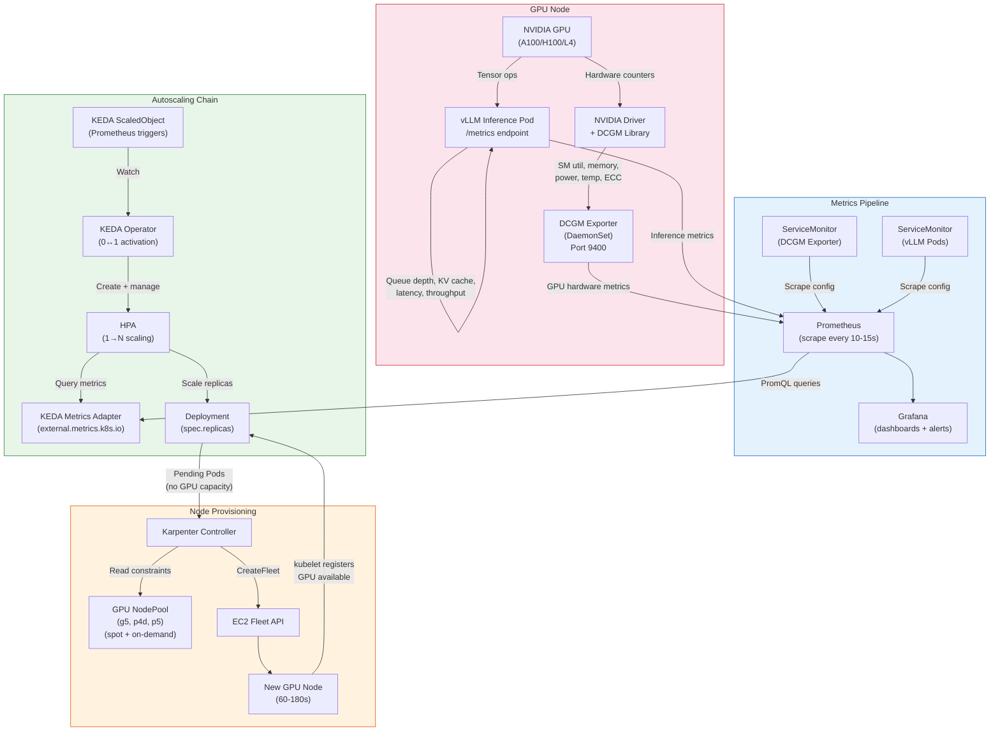

# GPU-Aware Autoscaling

## 1. Overview

GPU autoscaling for AI/ML inference workloads is fundamentally different from CPU-based autoscaling. Standard Kubernetes metrics -- CPU utilization, memory consumption -- are misleading for GPU workloads: vLLM pre-allocates the entire GPU memory for KV cache at startup, so memory usage is constant at 95%+ regardless of load. GPU utilization (`DCGM_FI_DEV_GPU_UTIL`) reports a duty cycle, not a throughput measure -- a GPU at "100% utilization" could be processing 10 requests or 1,000. Neither metric correlates with actual inference demand.

Production GPU autoscaling requires a custom metrics pipeline: **NVIDIA DCGM Exporter** exposes GPU-level hardware metrics, **vLLM/TGI** expose inference-specific metrics (request queue depth, KV cache utilization, batch size), **Prometheus** aggregates these metrics, and **KEDA** (or Prometheus Adapter) feeds them into Kubernetes HPA. The scaling signal is the **inference queue depth** -- the number of requests waiting to be processed -- because it directly reflects user-facing demand and is a leading indicator of latency degradation.

This is the most cost-impactful autoscaling domain in modern Kubernetes. A single A100 GPU costs $2-4/hour on-demand ($1,500-3,000/month). A cluster running 10 GPU pods at 30% average utilization wastes $10,000-20,000/month. Proper GPU autoscaling -- including scale-to-zero for low-traffic models -- can reduce GPU inference costs by 60-80% while maintaining latency SLAs. This document covers the complete pipeline from GPU metrics collection to production-grade autoscaling for LLM inference workloads.

## 2. Why It Matters

- **GPU cost dominance.** A single NVIDIA A100 80GB costs $2-4/hour on-demand across major cloud providers. H100 instances cost $4-8/hour. For a production LLM serving platform with 20-50 GPU pods, compute costs reach $50,000-150,000/month. Every 10% improvement in GPU utilization translates to $5,000-15,000/month in savings. Autoscaling is the primary mechanism for achieving this.
- **Standard metrics are lies for GPU inference.** CPU utilization measures the host CPU, which is barely involved in inference. Memory utilization shows 95%+ because vLLM pre-allocates GPU memory for the KV cache. GPU utilization (SM occupancy) shows high values even when the model is processing a single request because tensor operations occupy all streaming multiprocessors for the duration of each token generation. None of these metrics tell you whether users are waiting.
- **Queue depth is the correct signal.** The number of requests waiting in the inference server's internal queue directly measures user-visible demand. When queue depth grows, latency increases (requests wait longer before processing begins). Scaling on queue depth matches capacity to demand in real-time, unlike reactive CPU-based scaling that lags by minutes.
- **Scale-to-zero saves the most money.** Many production models serve sporadic traffic (internal tools, low-frequency APIs, staging environments, A/B test variants). A model serving 10 requests/hour does not need a dedicated GPU 24/7. Scale-to-zero eliminates 100% of idle GPU cost. The challenge is the 5-10 minute cold start (node provisioning + model loading), which requires careful architectural planning.
- **KV cache utilization predicts capacity exhaustion.** The KV cache stores attention key/value pairs for in-flight requests. When KV cache utilization approaches 100%, the inference server must either reject new requests or preempt (swap) existing ones, causing dramatic latency spikes. Scaling on KV cache utilization (in addition to queue depth) prevents this capacity cliff by adding replicas before the cache saturates.

## 3. Core Concepts

### GPU Metrics Pipeline

- **NVIDIA DCGM (Data Center GPU Manager):** A suite of tools for managing and monitoring NVIDIA GPUs in cluster environments. DCGM provides low-level GPU metrics: SM (Streaming Multiprocessor) utilization, memory utilization, power consumption, temperature, ECC errors, NVLink throughput, PCIe bandwidth, and clock speeds.
- **DCGM Exporter:** A Kubernetes DaemonSet that runs on every GPU node and exports DCGM metrics in Prometheus format on a `/metrics` endpoint. It is the bridge between NVIDIA's GPU driver and the Kubernetes metrics ecosystem. Key metrics:
  - `DCGM_FI_DEV_GPU_UTIL` -- GPU SM utilization percentage (duty cycle, not throughput)
  - `DCGM_FI_DEV_MEM_COPY_UTIL` -- Memory bandwidth utilization percentage
  - `DCGM_FI_DEV_FB_USED` -- Framebuffer memory used (bytes)
  - `DCGM_FI_DEV_FB_FREE` -- Framebuffer memory free (bytes)
  - `DCGM_FI_DEV_POWER_USAGE` -- Current power consumption (watts)
  - `DCGM_FI_DEV_GPU_TEMP` -- GPU temperature (Celsius)
  - `DCGM_FI_DEV_ECC_DBE_VOL_TOTAL` -- Double-bit ECC error count (indicates hardware degradation)
- **NVIDIA GPU Operator:** A Kubernetes Operator that automates the deployment of DCGM Exporter, GPU device plugin, GPU driver containers, and GPU Feature Discovery. It is the standard method for bootstrapping GPU support on Kubernetes nodes.

### Inference Server Metrics

- **vLLM Metrics Endpoint:** vLLM exposes Prometheus-compatible metrics at `/metrics` on its API server. Critical metrics for autoscaling:
  - `vllm:num_requests_waiting` -- Number of requests queued for processing (the primary scaling signal)
  - `vllm:num_requests_running` -- Number of requests currently being processed
  - `vllm:num_requests_swapped` -- Number of requests whose KV cache has been swapped to CPU memory (indicates memory pressure)
  - `vllm:gpu_cache_usage_perc` -- Fraction of GPU KV cache blocks in use (0.0 to 1.0)
  - `vllm:cpu_cache_usage_perc` -- Fraction of CPU KV cache blocks in use (for swapped requests)
  - `vllm:avg_prompt_throughput_toks_per_s` -- Average prompt (prefill) token throughput
  - `vllm:avg_generation_throughput_toks_per_s` -- Average generation (decode) token throughput
  - `vllm:e2e_request_latency_seconds` -- End-to-end request latency histogram
  - `vllm:time_to_first_token_seconds` -- Time to first token (TTFT) histogram
  - `vllm:num_preemptions_total` -- Total request preemptions (KV cache evictions)
- **TGI (Text Generation Inference) Metrics:** Hugging Face TGI exposes similar metrics:
  - `tgi_queue_size` -- Number of requests in the queue
  - `tgi_batch_current_size` -- Current continuous batching batch size
  - `tgi_request_duration_seconds` -- Request latency histogram
  - `tgi_request_generated_tokens_total` -- Total tokens generated
- **Triton Inference Server Metrics:** NVIDIA Triton exposes:
  - `nv_inference_queue_duration_us` -- Time spent in queue (latency signal)
  - `nv_inference_request_success` -- Successful inference count
  - `nv_gpu_utilization` -- Per-model GPU utilization

### Scaling Concepts

- **Inference Queue Depth:** The number of requests waiting to be processed by the inference server. This is the primary scaling metric because it directly measures unmet demand. A queue depth of 0 means the server has spare capacity; a queue depth of 50 means 50 users are actively waiting.
- **KV Cache Utilization:** The percentage of pre-allocated GPU memory used to store key/value attention states for in-flight and cached requests. When KV cache utilization exceeds 90%, new requests are either queued (increasing latency), rejected (increasing error rate), or trigger preemption of existing requests. Scaling on KV cache as a secondary metric prevents the capacity cliff.
- **Scale-to-Zero for GPU Pods:** Reducing GPU inference Deployments to 0 replicas when no requests are pending. This eliminates GPU cost entirely during idle periods. The challenge: cold start includes node provisioning (if no GPU node exists) + model loading (downloading weights from storage + loading into GPU memory), totaling 5-10 minutes for large models (7B-70B parameters).
- **Scale-from-Zero for GPU Pods:** The reverse: bringing a GPU inference Deployment from 0 to 1+ replicas when a request arrives. This requires the full cold start pipeline: Karpenter provisions a GPU node (1-3 minutes), kubelet starts the Pod (30 seconds), the inference server loads model weights from storage into GPU memory (2-7 minutes for 7B-70B models depending on storage throughput). Total: 3-10 minutes.
- **Warm Pool:** Pre-provisioned but idle GPU nodes or Pods that reduce scale-from-zero latency. Strategies include keeping 1 replica running with minimal resource allocation, using Karpenter's `consolidateAfter: Never` on GPU NodePools to prevent premature node removal, or maintaining a standby node with model weights pre-loaded on local NVMe.

## 4. How It Works

### The GPU Metrics Pipeline

The complete pipeline from GPU hardware to autoscaling decision:

1. **GPU hardware layer:** NVIDIA GPU drivers expose hardware counters via the DCGM library. These include SM utilization, memory bandwidth, temperature, power, and ECC error counts.

2. **DCGM Exporter (DaemonSet):** Runs on every GPU node. Scrapes DCGM metrics every 10 seconds (configurable) and exposes them as Prometheus metrics on port 9400. ServiceMonitor or PodMonitor objects tell Prometheus to scrape these endpoints.

3. **Inference server metrics:** vLLM, TGI, or Triton expose application-level metrics at `/metrics`. These are the inference-specific metrics (queue depth, KV cache, latency, throughput) that are most valuable for autoscaling.

4. **Prometheus:** Scrapes both DCGM Exporter (hardware metrics) and inference server Pods (application metrics). Stores time-series data for querying and alerting. Prometheus is the central metrics aggregation point.

5. **KEDA Prometheus Scaler:** KEDA queries Prometheus using PromQL expressions to fetch the scaling metrics. For example: `sum(vllm:num_requests_waiting{deployment="llama-70b"})` returns the total queue depth across all replicas.

6. **HPA (created by KEDA):** KEDA creates an HPA object with external metric references. HPA applies the standard algorithm: `desiredReplicas = ceil[currentReplicas * (currentMetric / targetMetric)]`.

7. **Scale decision execution:** If HPA determines more replicas are needed, it patches the Deployment's `spec.replicas`. The scheduler attempts to place new Pods. If no GPU node has capacity, Karpenter provisions a new GPU instance.

### KEDA ScaledObject for vLLM Inference

```yaml
apiVersion: keda.sh/v1alpha1
kind: ScaledObject
metadata:
  name: llama-70b-autoscaler
  namespace: inference
spec:
  scaleTargetRef:
    apiVersion: apps/v1
    kind: Deployment
    name: llama-70b-vllm
  pollingInterval: 10                         # Check every 10 seconds
  cooldownPeriod: 600                         # Wait 10 min before scaling to zero
  minReplicaCount: 0                          # Enable scale-to-zero
  maxReplicaCount: 8                          # Max 8 GPU pods
  fallback:
    failureThreshold: 5
    replicas: 2                               # If Prometheus is unreachable, run 2 replicas
  advanced:
    horizontalPodAutoscalerConfig:
      behavior:
        scaleUp:
          stabilizationWindowSeconds: 0       # Scale up immediately
          policies:
          - type: Pods
            value: 2                          # Add max 2 GPU pods per minute
            periodSeconds: 60
        scaleDown:
          stabilizationWindowSeconds: 300     # Wait 5 min before scale-down
          policies:
          - type: Pods
            value: 1                          # Remove max 1 GPU pod per 2 min
            periodSeconds: 120
  triggers:
  # Primary trigger: inference queue depth
  - type: prometheus
    metadata:
      serverAddress: http://prometheus.monitoring.svc:9090
      query: |
        sum(vllm:num_requests_waiting{namespace="inference", deployment="llama-70b-vllm"})
      threshold: "5"                          # Target: 5 queued requests per replica
      activationThreshold: "1"                # Activate from zero when any request is waiting
  # Secondary trigger: KV cache utilization
  - type: prometheus
    metadata:
      serverAddress: http://prometheus.monitoring.svc:9090
      query: |
        avg(vllm:gpu_cache_usage_perc{namespace="inference", deployment="llama-70b-vllm"})
      threshold: "0.8"                        # Scale when KV cache > 80%
      activationThreshold: "0.1"              # Activate when any cache usage
```

### Karpenter GPU NodePool Configuration

```yaml
apiVersion: karpenter.sh/v1
kind: NodePool
metadata:
  name: gpu-inference
spec:
  template:
    metadata:
      labels:
        workload-type: gpu-inference
        accelerator: nvidia
    spec:
      nodeClassRef:
        group: karpenter.k8s.aws
        kind: EC2NodeClass
        name: gpu-inference
      requirements:
      - key: karpenter.k8s.aws/instance-family
        operator: In
        values: ["g5", "g6", "p4d", "p5"]    # GPU instance families
      - key: karpenter.k8s.aws/instance-size
        operator: In
        values: ["xlarge", "2xlarge", "4xlarge", "12xlarge", "24xlarge"]
      - key: karpenter.sh/capacity-type
        operator: In
        values: ["spot", "on-demand"]          # Spot for inference, on-demand fallback
      - key: kubernetes.io/arch
        operator: In
        values: ["amd64"]                      # GPU instances are amd64
      - key: node.kubernetes.io/instance-type
        operator: In
        values:
        - g5.xlarge                            # 1x A10G, 24 GB -- small models (7B)
        - g5.2xlarge                           # 1x A10G, 24 GB -- small models with more CPU
        - g5.4xlarge                           # 1x A10G, 24 GB -- medium models
        - g5.12xlarge                          # 4x A10G, 96 GB -- large models or multi-GPU
        - g6.xlarge                            # 1x L4, 24 GB -- cost-efficient inference
        - g6.2xlarge                           # 1x L4, 24 GB
        - p4d.24xlarge                         # 8x A100 40GB -- 70B+ models
        - p5.48xlarge                          # 8x H100 80GB -- largest models
      taints:
      - key: nvidia.com/gpu
        value: "true"
        effect: NoSchedule                     # Only GPU workloads land here
  disruption:
    consolidationPolicy: WhenEmpty             # Only remove truly empty GPU nodes
    consolidateAfter: 600s                     # Wait 10 min before removing empty GPU nodes
    budgets:
    - nodes: "1"                               # Disrupt max 1 GPU node at a time
  limits:
    cpu: "384"                                 # Limit total CPU across GPU nodes
    memory: "1536Gi"
    nvidia.com/gpu: "32"                       # Max 32 GPUs in this NodePool
  weight: 80                                   # Higher priority than general-purpose pool
---
apiVersion: karpenter.k8s.aws/v1
kind: EC2NodeClass
metadata:
  name: gpu-inference
spec:
  role: KarpenterNodeRole-my-cluster
  amiSelectorTerms:
  - alias: "al2023@latest"                     # Must include NVIDIA drivers
  subnetSelectorTerms:
  - tags:
      karpenter.sh/discovery: my-cluster
  securityGroupSelectorTerms:
  - tags:
      karpenter.sh/discovery: my-cluster
  blockDeviceMappings:
  - deviceName: /dev/xvda
    ebs:
      volumeSize: 200Gi                        # Larger for model weights cache
      volumeType: gp3
      iops: 6000                               # Higher IOPS for model loading
      throughput: 250
      deleteOnTermination: true
  instanceStorePolicy: RAID0                   # Use NVMe instance store for model cache
  userData: |
    #!/bin/bash
    # Pre-pull common model images to reduce cold start
    ctr -n k8s.io images pull registry.internal/vllm:latest
```

### Scale-from-Zero Cold Start Breakdown

| Phase | Duration | What Happens | Optimization |
|---|---|---|---|
| **KEDA activation** | 10-30 seconds | KEDA detects non-zero queue, scales Deployment from 0 to 1 | Reduce `pollingInterval` to 5-10 seconds |
| **Karpenter node provisioning** | 60-180 seconds | Karpenter calls EC2 Fleet API, instance launches, kubelet registers | Pre-warm GPU node pool; use Spot for faster allocation |
| **GPU driver initialization** | 15-30 seconds | NVIDIA driver initializes, GPU device plugin registers | Pre-baked AMI with drivers installed |
| **Container image pull** | 30-120 seconds | Pull vLLM image (5-15 GB with model weights baked in) | Pre-pull images in EC2NodeClass userData; use local image cache |
| **Model weight loading** | 60-300 seconds | Load model weights from storage (S3/EFS) into GPU memory | Use NVMe instance store cache; pre-download weights; use smaller quantized models (GPTQ/AWQ) |
| **Readiness probe** | 10-30 seconds | vLLM health check passes, Pod marked Ready | Configure appropriate `initialDelaySeconds` |
| **Total cold start** | **3-10 minutes** | Full pipeline from 0 replicas to first request served | See optimization strategies below |

### Reducing Cold Start Latency

**Strategy 1: Warm standby (1 replica minimum)**
```yaml
# Keep 1 replica always running for latency-sensitive models
spec:
  minReplicaCount: 1                          # Never scale to zero
  # Trade $2-4/hour idle cost for instant response
```

**Strategy 2: Pre-warmed GPU nodes**
```yaml
# Karpenter NodePool with consolidation disabled
spec:
  disruption:
    consolidationPolicy: WhenEmpty
    consolidateAfter: Never                   # Never remove GPU nodes automatically
  # Combined with a "placeholder" DaemonSet that prevents node from being Empty
```

**Strategy 3: Model weight caching on NVMe**
```yaml
# Pod spec using instance store for model cache
spec:
  containers:
  - name: vllm
    env:
    - name: VLLM_MODEL_CACHE
      value: /nvme-cache/models
    volumeMounts:
    - name: nvme-cache
      mountPath: /nvme-cache
  volumes:
  - name: nvme-cache
    hostPath:
      path: /mnt/nvme0                        # NVMe instance store mounted by EC2NodeClass
      type: DirectoryOrCreate
  initContainers:
  - name: model-downloader
    image: registry.internal/model-downloader:v1
    command: ["python", "download.py", "--model", "meta-llama/Llama-3-70B", "--cache-dir", "/nvme-cache/models"]
    volumeMounts:
    - name: nvme-cache
      mountPath: /nvme-cache
```

**Strategy 4: Quantized models for faster loading**
| Model | Full Precision (FP16) | Quantized (AWQ 4-bit) | Loading Time (A100) | Loading Time Improvement |
|---|---|---|---|---|
| Llama 3 8B | 16 GB | 4.5 GB | 15s vs 45s | 3x faster |
| Llama 3 70B | 140 GB | 38 GB | 60s vs 210s | 3.5x faster |
| Mixtral 8x7B | 93 GB | 26 GB | 40s vs 150s | 3.75x faster |

### Complete Inference Autoscaling Architecture

```yaml
# DCGM Exporter (deployed by GPU Operator)
apiVersion: apps/v1
kind: DaemonSet
metadata:
  name: dcgm-exporter
  namespace: gpu-operator
spec:
  selector:
    matchLabels:
      app: dcgm-exporter
  template:
    spec:
      nodeSelector:
        nvidia.com/gpu.present: "true"
      tolerations:
      - key: nvidia.com/gpu
        operator: Exists
        effect: NoSchedule
      containers:
      - name: dcgm-exporter
        image: nvcr.io/nvidia/k8s/dcgm-exporter:3.3.8-3.6.0-ubuntu22.04
        ports:
        - name: metrics
          containerPort: 9400
        env:
        - name: DCGM_EXPORTER_COLLECTORS
          value: /etc/dcgm-exporter/dcp-metrics-included.csv
        securityContext:
          runAsNonRoot: false
          capabilities:
            add: ["SYS_ADMIN"]
        resources:
          requests:
            cpu: 100m
            memory: 128Mi
---
# ServiceMonitor for DCGM Exporter
apiVersion: monitoring.coreos.com/v1
kind: ServiceMonitor
metadata:
  name: dcgm-exporter
  namespace: monitoring
spec:
  selector:
    matchLabels:
      app: dcgm-exporter
  endpoints:
  - port: metrics
    interval: 15s
---
# ServiceMonitor for vLLM inference Pods
apiVersion: monitoring.coreos.com/v1
kind: ServiceMonitor
metadata:
  name: vllm-metrics
  namespace: monitoring
spec:
  namespaceSelector:
    matchNames: ["inference"]
  selector:
    matchLabels:
      app: vllm
  endpoints:
  - port: http
    path: /metrics
    interval: 10s
```

## 5. Architecture / Flow



## 6. Types / Variants

### Scaling Metrics Comparison for GPU Inference

| Metric | Source | What It Measures | Pros | Cons | Verdict |
|---|---|---|---|---|---|
| `vllm:num_requests_waiting` | vLLM /metrics | Requests queued for inference | Leading indicator, directly measures demand | Zero when at capacity with preemption | **Primary scaling metric** |
| `vllm:gpu_cache_usage_perc` | vLLM /metrics | KV cache memory pressure | Predicts capacity cliff before it hits | Model-dependent thresholds | **Secondary scaling metric** |
| `DCGM_FI_DEV_GPU_UTIL` | DCGM Exporter | GPU SM duty cycle | Available without inference server changes | Does not correlate with request count | Monitoring only, not for scaling |
| `DCGM_FI_DEV_FB_USED` | DCGM Exporter | GPU framebuffer memory used | Low-level hardware metric | vLLM pre-allocates all memory; always high | **Do not use for scaling** |
| CPU utilization | Metrics Server | Host CPU usage | Built-in, no additional setup | Irrelevant for GPU inference workloads | **Do not use for scaling** |
| `vllm:e2e_request_latency_seconds` | vLLM /metrics | End-to-end request latency | Directly measures user experience | Lagging indicator (latency rises after queue builds) | Alerting, not primary scaling |
| `vllm:num_preemptions_total` | vLLM /metrics | KV cache eviction events | Indicates severe memory pressure | Too late to act; damage already done | Alerting only |
| `tgi_queue_size` | TGI /metrics | TGI request queue depth | Equivalent to vLLM queue metric | TGI-specific | Primary for TGI deployments |

### Inference Server Comparison for Autoscaling

| Dimension | vLLM | TGI | Triton | Ollama |
|---|---|---|---|---|
| **Prometheus metrics** | Rich (20+ metrics) | Moderate (10+ metrics) | Rich (via C API) | Minimal |
| **Queue depth metric** | `vllm:num_requests_waiting` | `tgi_queue_size` | `nv_inference_queue_duration_us` | None |
| **KV cache metric** | `vllm:gpu_cache_usage_perc` | Not exposed directly | Model-dependent | None |
| **Continuous batching** | Yes (PagedAttention) | Yes | Yes (with dynamic batching) | No |
| **Scale-to-zero support** | Works with KEDA | Works with KEDA | Works with KEDA | Not designed for production scaling |
| **Model loading time (70B)** | 2-5 min (with tensor parallelism) | 3-7 min | 2-4 min (TensorRT-LLM backend) | Not applicable |
| **Best for** | LLM serving at scale | Quick deployment, HF ecosystem | Multi-framework, multi-model | Development, prototyping |

### GPU Instance Selection for Karpenter

| Instance Type | GPU | GPU Memory | Best For | On-Demand $/hr | Spot $/hr (typical) |
|---|---|---|---|---|---|
| g5.xlarge | 1x A10G | 24 GB | Small models (7B quantized) | $1.01 | $0.30-0.50 |
| g5.2xlarge | 1x A10G | 24 GB | Small models + more CPU/RAM | $1.21 | $0.36-0.60 |
| g5.12xlarge | 4x A10G | 96 GB | 70B quantized or multi-model | $5.67 | $1.70-2.80 |
| g6.xlarge | 1x L4 | 24 GB | Cost-efficient inference | $0.80 | $0.24-0.40 |
| g6.2xlarge | 1x L4 | 24 GB | Cost-efficient + more CPU | $0.98 | $0.29-0.49 |
| p4d.24xlarge | 8x A100 40GB | 320 GB | 70B FP16, high throughput | $32.77 | $9.83-16.00 |
| p5.48xlarge | 8x H100 80GB | 640 GB | 405B models, maximum throughput | $98.32 | $29.50-49.00 |

### Spot Instance Strategy for GPU Inference

GPU Spot instances have higher interruption rates than CPU Spot instances (GPUs are in higher demand). Production strategies:

1. **Spot-preferred with immediate on-demand fallback:**
```yaml
requirements:
- key: karpenter.sh/capacity-type
  operator: In
  values: ["spot", "on-demand"]       # Karpenter tries Spot first, falls back to OD
- key: karpenter.k8s.aws/instance-family
  operator: In
  values: ["g5", "g6", "g5g"]        # Wide family selection for Spot availability
```

2. **Dedicated on-demand for latency-critical, Spot for batch inference:**
```yaml
# NodePool 1: On-demand for real-time inference APIs
apiVersion: karpenter.sh/v1
kind: NodePool
metadata:
  name: gpu-realtime
spec:
  weight: 100
  template:
    spec:
      requirements:
      - key: karpenter.sh/capacity-type
        operator: In
        values: ["on-demand"]
# NodePool 2: Spot for batch inference and internal tools
apiVersion: karpenter.sh/v1
kind: NodePool
metadata:
  name: gpu-batch
spec:
  weight: 50
  template:
    spec:
      requirements:
      - key: karpenter.sh/capacity-type
        operator: In
        values: ["spot"]
```

## 7. Use Cases

- **Production LLM API with diurnal traffic.** A customer-facing chatbot API backed by Llama 3 70B on vLLM. Traffic peaks at 200 RPS during business hours, drops to 5 RPS overnight. KEDA scales from 2 GPU pods (night) to 16 GPU pods (peak) based on `vllm:num_requests_waiting`. KV cache utilization trigger prevents preemption during traffic bursts. Karpenter provisions g5.12xlarge (4x A10G) Spot instances with on-demand fallback. Cost savings: 65% vs. static 16-pod deployment.
- **Multi-model serving platform with scale-to-zero.** An internal AI platform hosting 20 fine-tuned models, each deployed as a separate vLLM Deployment. Only 3-4 models are actively used at any time. KEDA scales unused models to 0 replicas. When a user selects a dormant model, KEDA activates it (5-8 minute cold start). Model weights are cached on NVMe instance store to reduce loading time. Without scale-to-zero, 20 GPUs idle 24/7 ($30,000-60,000/month wasted).
- **Batch embedding generation.** A nightly job that generates embeddings for 10 million documents. KEDA ScaledJob creates GPU Jobs based on an SQS queue of document batches. Karpenter provisions Spot g6.xlarge instances (L4 GPUs, cheapest inference option). After processing, Jobs complete and Karpenter removes the GPU nodes. Total cost: $50-100 for a job that would cost $2,000+/month if using always-on GPU infrastructure.
- **A/B testing inference models.** A team testing 4 model variants (different fine-tuning, quantization levels). Each variant is a separate Deployment with KEDA. Traffic splitting (via Istio or Gateway API) sends 25% to each. KEDA scales each variant independently based on queue depth. After the experiment, losing variants scale to 0. Without this, maintaining 4 GPU-backed variants simultaneously would cost 4x.
- **RAG pipeline with variable GPU demand.** A retrieval-augmented generation pipeline where the LLM is called only after document retrieval. Inference demand is bursty (depends on retrieval results). KEDA scales the LLM serving layer based on `vllm:num_requests_waiting`, while the retriever layer scales on CPU-based HPA. The GPU layer independently scales from 1-8 pods based on actual inference demand, not the retriever's output rate.

## 8. Tradeoffs

| Decision | Option A | Option B | Guidance |
|---|---|---|---|
| **Scale-to-zero vs. min 1 replica** | Scale-to-zero: eliminates idle cost, 5-10 min cold start | Min 1 replica: $2-4/hr idle cost, instant response | Scale-to-zero for internal/low-traffic models; min 1 for customer-facing APIs with latency SLAs |
| **Queue depth vs. KV cache as primary metric** | Queue depth: leading indicator, intuitive threshold | KV cache: predicts capacity cliff before queue builds | Queue depth as primary, KV cache as secondary safety metric |
| **Spot vs. on-demand for GPU** | Spot: 60-70% savings, interruption risk | On-demand: predictable, 3-4x more expensive | Spot for batch inference and internal tools; on-demand for production APIs with strict SLAs |
| **Large models (FP16) vs. quantized (AWQ/GPTQ)** | FP16: best quality, more GPU memory, slower loading | Quantized: 3-4x less memory, faster loading, slight quality loss | Quantized for most inference; FP16 only when quality degradation is measurable and unacceptable |
| **Single GPU instance vs. multi-GPU** | Single GPU: simpler, cheaper per unit, more scaling granularity | Multi-GPU: required for models that do not fit in single GPU memory | Single GPU for models that fit (7B-13B quantized); multi-GPU for 70B+ or when tensor parallelism reduces latency |
| **Aggressive consolidation vs. node retention** | Aggressive: remove GPU nodes quickly, maximize savings | Retain nodes: faster scale-from-zero, higher idle cost | WhenEmpty with 10-min delay for inference nodes; Never for nodes with cached model weights |

## 9. Common Pitfalls

- **Scaling on GPU utilization (DCGM_FI_DEV_GPU_UTIL).** GPU utilization is a duty cycle that shows 90%+ even with a single request because inference fully occupies the SMs during each forward pass. It does not reflect queuing or demand. Teams that scale on GPU utilization see constant high values and either never scale up (believing the GPU is busy) or set unreasonable targets. Use `vllm:num_requests_waiting` instead.
- **Scaling on GPU memory (DCGM_FI_DEV_FB_USED).** vLLM pre-allocates 90-95% of GPU memory for the KV cache at startup via `gpu_memory_utilization` parameter (default: 0.9). Memory usage is constant regardless of load. Scaling on memory never triggers scale-down and never triggers meaningful scale-up. This is the single most common mistake in GPU autoscaling.
- **cooldownPeriod too short for GPU scale-to-zero.** If cooldown is 60 seconds, a brief traffic pause scales to zero. The next request triggers a 5-10 minute cold start. For GPU workloads, set `cooldownPeriod: 600` (10 minutes) or higher to prevent premature deactivation.
- **Not accounting for model loading time in readiness probes.** If `readinessProbe.initialDelaySeconds` is 30 seconds but the model takes 5 minutes to load, the Pod is marked unready, restarted by the kubelet, and enters a restart loop. Set `initialDelaySeconds` and `timeoutSeconds` generously for GPU inference Pods (300-600 seconds).
- **Karpenter consolidating GPU nodes with cached model weights.** If model weights are loaded from slow storage (S3) and cached on local NVMe, Karpenter consolidation can remove the node, losing the cache. The next scale-up requires a full model download. Use `consolidateAfter: Never` or `WhenEmpty` with a long delay for GPU NodePools with model caching.
- **maxReplicaCount without GPU resource limits on NodePool.** Setting `maxReplicaCount: 50` on a KEDA ScaledObject without corresponding `limits.nvidia.com/gpu` on the Karpenter NodePool can result in 50 GPU nodes being provisioned simultaneously, costing $50-200/hour and potentially hitting cloud provider GPU quotas. Always align KEDA max replicas with NodePool GPU limits and cloud provider quotas.
- **Ignoring Spot interruption impact on long-running inference.** GPU Spot instances can be reclaimed with 2 minutes' notice. A long-running batch inference job (processing a 100-page document) may be interrupted mid-request. Implement request checkpointing or use on-demand instances for long-running inference tasks.
- **Single instance family in GPU NodePool.** Specifying only `p4d.24xlarge` in Karpenter constraints means Spot capacity is limited to one instance type in each AZ. If that type is unavailable, provisioning fails. Include multiple GPU instance families (g5, g6, p4d, p5) for Spot availability diversification.

## 10. Real-World Examples

- **Google GKE Autopilot GPU autoscaling:** GKE's best-practices documentation recommends scaling LLM inference workloads on server-level metrics (queue depth and KV cache) rather than hardware metrics (GPU utilization). Their reference architecture uses a custom metrics adapter that exposes `vllm:num_requests_waiting` to HPA. Their benchmarks show: scaling on queue depth vs. GPU utilization reduces P99 latency by 40% and improves GPU cost-efficiency by 35% for Llama 2 70B on L4 GPUs.
- **Red Hat OpenShift AI with KEDA + vLLM:** Red Hat published a reference architecture for KServe autoscaling with vLLM and KEDA. Their setup uses KEDA's Prometheus scaler to query `vllm:num_requests_waiting` and `vllm:gpu_cache_usage_perc`. Their production results: scale-from-zero latency of 4.5 minutes (including Karpenter node provisioning), scale-to-zero saving 78% on GPU costs for models with <10% duty cycle.
- **Microsoft Azure AKS with DCGM + KEDA:** Azure's official documentation provides a complete walkthrough of GPU autoscaling using DCGM Exporter metrics fed through KEDA's Prometheus scaler. Their reference architecture deploys DCGM Exporter as a DaemonSet on GPU nodes, ServiceMonitors scrape metrics into Azure Monitor (Prometheus-compatible), and KEDA ScaledObjects target inference deployments. Published benchmarks: 300ms from metric change to KEDA evaluation, 2-3 minutes total scale-up time (existing GPU node), 6-8 minutes for scale-from-zero (new GPU node provisioning).
- **Production GPU utilization improvements:** A fintech company running 12 A100 GPUs for fraud detection inference migrated from static 12-pod deployment to KEDA-based autoscaling. Before: 12 pods 24/7, average GPU utilization 25% during business hours, 5% overnight. After: 2-12 pods based on `num_requests_waiting`, scale-to-zero overnight. Monthly GPU cost dropped from $45,000 to $14,000 (69% reduction). P99 latency improved from 2.1s to 1.4s because scaling on queue depth prevented batching delays.
- **Scale-from-zero optimization benchmark:** A team measured cold start times for Llama 3 70B (AWQ 4-bit, 38 GB) across different strategies:
  - Baseline (S3 download, no cache): 8.2 minutes total (Karpenter: 1.5min, image pull: 1.2min, S3 download: 4.5min, GPU load: 1.0min)
  - NVMe cache (pre-downloaded weights): 3.8 minutes total (Karpenter: 1.5min, image pull: 1.2min, NVMe load: 0.5min, GPU load: 0.6min)
  - Pre-warmed node + NVMe cache: 2.1 minutes total (no Karpenter wait, image pre-pulled, NVMe load: 0.5min, GPU load: 0.6min, readiness: 1.0min)
  - Warm standby (min 1 replica): 0 seconds (always running)

### GPU Autoscaling Monitoring Dashboard (Prometheus Queries)

Essential PromQL queries for a GPU inference autoscaling dashboard:

```promql
# Queue depth per model (primary scaling metric)
sum by (deployment) (vllm:num_requests_waiting)

# KV cache utilization per pod (secondary scaling metric)
avg by (pod) (vllm:gpu_cache_usage_perc)

# Request throughput (tokens/second)
sum by (deployment) (vllm:avg_generation_throughput_toks_per_s)

# Time to first token P99 (user experience metric)
histogram_quantile(0.99, sum by (le, deployment) (rate(vllm:time_to_first_token_seconds_bucket[5m])))

# GPU SM utilization (monitoring, not scaling)
avg by (node) (DCGM_FI_DEV_GPU_UTIL)

# GPU memory used vs total (monitoring, not scaling)
sum by (node) (DCGM_FI_DEV_FB_USED) / (sum by (node) (DCGM_FI_DEV_FB_USED) + sum by (node) (DCGM_FI_DEV_FB_FREE))

# GPU power consumption (cost/thermal monitoring)
avg by (node) (DCGM_FI_DEV_POWER_USAGE)

# Preemption rate (alert when > 0, indicates KV cache exhaustion)
rate(vllm:num_preemptions_total[5m])

# Pod replica count over time (verify scaling behavior)
kube_deployment_spec_replicas{namespace="inference"}
```

## 11. Related Concepts

- [Horizontal Pod Autoscaling](./01-horizontal-pod-autoscaling.md) -- HPA is the execution engine for GPU scaling decisions; KEDA creates HPA objects targeting GPU inference Deployments
- [Vertical and Cluster Autoscaling](./02-vertical-and-cluster-autoscaling.md) -- Karpenter GPU NodePools provision the infrastructure that GPU HPA depends on
- [KEDA and Event-Driven Scaling](./03-keda-and-event-driven-scaling.md) -- KEDA's Prometheus scaler is the primary mechanism feeding inference metrics to HPA
- [GPU and Accelerator Workloads](../03-workload-design/05-gpu-and-accelerator-workloads.md) -- GPU scheduling, device plugins, and resource management that GPU autoscaling depends on
- [Latency Optimization](../../genai-system-design/11-performance/01-latency-optimization.md) -- autoscaling directly impacts TTFT, ITL, and E2E latency for inference workloads
- [Cost Optimization](../../genai-system-design/11-performance/03-cost-optimization.md) -- GPU autoscaling is the primary cost optimization lever for inference infrastructure
- [Autoscaling (Traditional System Design)](../../traditional-system-design/02-scalability/02-autoscaling.md) -- foundational autoscaling concepts applied to GPU-specific context

## 12. Source Traceability

- source/youtube-video-reports/7.md -- Kubernetes observability: Prometheus/Grafana monitoring, Service Monitoring Objects for metric discovery, five pillars of Kubernetes
- source/youtube-video-reports/1.md -- Cost management: compute is 70-80% of Kubernetes costs; Spot instances provide 80-90% savings; AMD/ARM 30-40% cheaper; HPA trigger at ~80% of resource limit for bandwidth buffer
- NVIDIA DCGM Exporter documentation (github.com/NVIDIA/dcgm-exporter) -- GPU metrics, DaemonSet deployment, Prometheus integration
- vLLM documentation (docs.vllm.ai) -- Production metrics endpoint, KV cache metrics, PagedAttention architecture
- Google GKE documentation -- Best practices for autoscaling LLM inference workloads with GPUs
- Microsoft Azure AKS documentation -- Autoscale GPU workloads using KEDA and NVIDIA DCGM Exporter
- Red Hat Developer documentation -- KServe autoscaling for vLLM with KEDA
- Karpenter documentation (karpenter.sh) -- GPU NodePool configuration, Spot instance handling, consolidation policies
