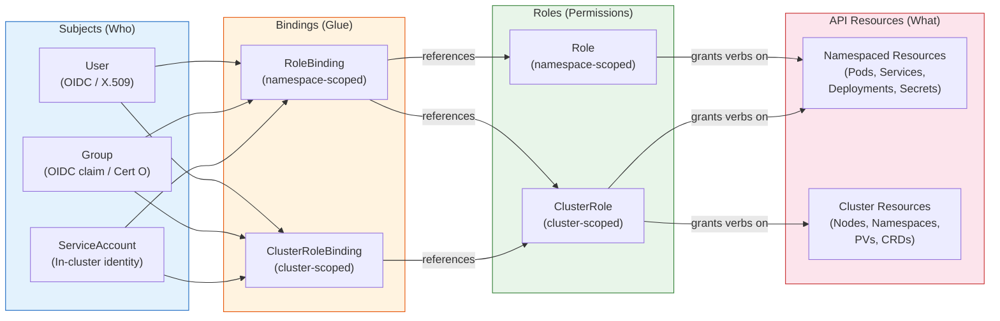
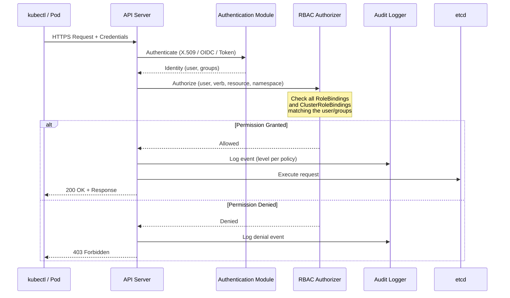

# RBAC and Access Control

## 1. Overview

Role-Based Access Control (RBAC) is the authorization mechanism in Kubernetes that governs what actions an authenticated identity can perform on which resources. Every request to the Kubernetes API server passes through three gates in sequence: **authentication** (who are you?), **authorization** (are you allowed?), and **admission control** (is this request valid per cluster policy?). RBAC handles the second gate.

The RBAC model in Kubernetes is built on four API objects: **Roles**, **ClusterRoles**, **RoleBindings**, and **ClusterRoleBindings**. Roles define a set of permissions (verbs on resources), and Bindings attach those permissions to identities -- users, groups, or ServiceAccounts. This is an additive-only model: there are no deny rules. If you have no binding, you have no permissions. If you have two bindings, your effective permissions are the union.

Understanding RBAC is non-negotiable for operating multi-tenant clusters, passing compliance audits, and preventing privilege escalation. A misconfigured RBAC policy is the difference between a developer deploying to their namespace and a developer accidentally deleting the production control plane.

## 2. Why It Matters

- **Least-privilege enforcement.** Without RBAC, every user and service has either no access or full access. RBAC enables fine-grained permission sets -- a CI/CD pipeline can deploy Pods but cannot read Secrets; a developer can view logs but cannot delete Deployments.
- **Multi-tenancy isolation.** RBAC is the primary mechanism for ensuring Team A cannot modify Team B's resources, even when they share a cluster. Combined with namespaces and network policies, it forms the authorization layer of a multi-tenant platform.
- **Compliance and audit requirements.** SOC 2, PCI-DSS, HIPAA, and FedRAMP all require evidence of access control. RBAC policies provide a declarative, auditable record of who can do what. Auditors can review Role and RoleBinding manifests directly.
- **Service-to-service security.** Pods authenticate to the API server using ServiceAccounts. RBAC determines what each ServiceAccount can access -- critical for operators, controllers, and any workload that interacts with the Kubernetes API.
- **Blast radius reduction.** If a compromised Pod has a ServiceAccount with `cluster-admin` privileges, the attacker owns the entire cluster. If that ServiceAccount has read-only access to ConfigMaps in a single namespace, the blast radius is contained.

## 3. Core Concepts

- **Subject:** The identity requesting access. Kubernetes supports three subject types: **Users** (external identities, not stored in Kubernetes), **Groups** (collections of users, often mapped from OIDC claims), and **ServiceAccounts** (Kubernetes-native identities for Pods).
- **Role:** A namespaced set of permissions. Each rule in a Role specifies an API group, a list of resources, and a list of verbs (get, list, watch, create, update, patch, delete). A Role named `pod-reader` in namespace `production` might grant `get`, `list`, `watch` on `pods`.
- **ClusterRole:** A cluster-scoped set of permissions. Identical to Role but applies across all namespaces or to cluster-scoped resources (nodes, namespaces, PersistentVolumes). ClusterRoles can also be bound at the namespace level via RoleBindings, making them reusable templates.
- **RoleBinding:** Binds a Role (or ClusterRole) to subjects within a specific namespace. A RoleBinding in namespace `staging` grants permissions only within `staging`, even if it references a ClusterRole.
- **ClusterRoleBinding:** Binds a ClusterRole to subjects across the entire cluster. This is the mechanism for granting cluster-wide permissions like `cluster-admin`.
- **ServiceAccount:** A Kubernetes-native identity object that lives in a namespace. Every Pod runs as a ServiceAccount (defaulting to `default` if unspecified). ServiceAccount tokens are automatically projected into Pods as mounted volumes at `/var/run/secrets/kubernetes.io/serviceaccount/token`.
- **Verb:** The action being performed on a resource. Standard verbs map to HTTP methods: `get` (GET one), `list` (GET collection), `create` (POST), `update` (PUT), `patch` (PATCH), `delete` (DELETE), `watch` (GET with streaming).
- **API Group:** Resources are organized into API groups. Core resources (Pods, Services, Secrets) are in the empty group (`""`). Deployments are in `apps`. RBAC rules specify which API groups they apply to.
- **Resource Name:** Optionally, a Role can restrict permissions to specific named resources (e.g., only the ConfigMap named `app-config`). Without this, the rule applies to all resources of that type in the scope.
- **Aggregated ClusterRole:** A ClusterRole that automatically includes rules from other ClusterRoles matching specific labels. The built-in `admin`, `edit`, and `view` ClusterRoles use aggregation so that CRD authors can add their resources to these roles by labeling their ClusterRoles appropriately.
- **Impersonation:** A mechanism where a privileged user can act as another user, group, or ServiceAccount for testing or delegation. Controlled by RBAC rules on the `impersonate` verb for users, groups, and serviceaccounts resources.

## 4. How It Works

### Authentication: Establishing Identity

Before RBAC evaluates permissions, the API server must know who is making the request. Kubernetes does not store user accounts -- it delegates authentication to external systems:

1. **X.509 Client Certificates:** The kubelet and cluster components authenticate with TLS client certificates. The Common Name (CN) becomes the username, and Organization (O) fields become groups. Example: a certificate with `CN=jane` and `O=developers` authenticates as user `jane` in group `developers`.

2. **Bearer Tokens (ServiceAccounts):** Each ServiceAccount gets a projected token (JWT) signed by the API server's service account signing key. The token contains the ServiceAccount name, namespace, and audience. Since Kubernetes 1.22, these are **bound tokens** with a configurable expiration (default 1 hour), replacing the older non-expiring Secret-based tokens.

3. **OIDC Tokens:** The API server can be configured to accept JWT tokens from an external OIDC provider (Okta, Azure AD, Google, Dex). The `--oidc-issuer-url`, `--oidc-client-id`, and `--oidc-username-claim` flags configure validation. The username is extracted from a claim (typically `email` or `sub`), and groups from a `groups` claim.

4. **Webhook Token Authentication:** The API server calls an external webhook with the bearer token, and the webhook returns the authenticated user information. Used for custom authentication systems.

### Authorization: The RBAC Decision

Once identity is established, the RBAC authorizer evaluates the request:

1. The API server extracts the request attributes: **user**, **groups**, **verb**, **resource**, **API group**, **namespace** (if applicable), and **resource name**.
2. The authorizer checks all RoleBindings and ClusterRoleBindings that reference the user or any of the user's groups.
3. For each binding, it looks up the referenced Role or ClusterRole and checks if any rule matches the request attributes.
4. If any rule matches, the request is **allowed**. If no rule matches across any binding, the request is **denied**.

This is a pure allow-list model. The evaluation is efficient because the API server caches RBAC rules in memory and re-evaluates on watch notifications when Roles or Bindings change.

### RBAC Object Definitions

**Role example (namespace-scoped):**

```yaml
apiVersion: rbac.authorization.k8s.io/v1
kind: Role
metadata:
  name: pod-reader
  namespace: production
rules:
- apiGroups: [""]              # Core API group
  resources: ["pods", "pods/log"]
  verbs: ["get", "list", "watch"]
- apiGroups: [""]
  resources: ["configmaps"]
  verbs: ["get", "list"]
```

**ClusterRole example (cluster-scoped):**

```yaml
apiVersion: rbac.authorization.k8s.io/v1
kind: ClusterRole
metadata:
  name: node-viewer
rules:
- apiGroups: [""]
  resources: ["nodes"]
  verbs: ["get", "list", "watch"]
- apiGroups: ["metrics.k8s.io"]
  resources: ["nodes"]
  verbs: ["get", "list"]
```

**RoleBinding example:**

```yaml
apiVersion: rbac.authorization.k8s.io/v1
kind: RoleBinding
metadata:
  name: read-pods-production
  namespace: production
subjects:
- kind: User
  name: jane
  apiGroup: rbac.authorization.k8s.io
- kind: Group
  name: developers
  apiGroup: rbac.authorization.k8s.io
- kind: ServiceAccount
  name: monitoring-agent
  namespace: monitoring
roleRef:
  kind: Role
  name: pod-reader
  apiGroup: rbac.authorization.k8s.io
```

**ClusterRoleBinding example:**

```yaml
apiVersion: rbac.authorization.k8s.io/v1
kind: ClusterRoleBinding
metadata:
  name: global-node-viewer
subjects:
- kind: Group
  name: platform-engineers
  apiGroup: rbac.authorization.k8s.io
roleRef:
  kind: ClusterRole
  name: node-viewer
  apiGroup: rbac.authorization.k8s.io
```

### ServiceAccount Token Projection

Since Kubernetes 1.22, ServiceAccount tokens are projected into Pods via the `projected` volume type with configurable audience and expiration:

```yaml
apiVersion: v1
kind: Pod
metadata:
  name: app
spec:
  serviceAccountName: my-app-sa
  automountServiceAccountToken: true  # default, set to false to disable
  containers:
  - name: app
    image: my-app:v1
    volumeMounts:
    - mountPath: /var/run/secrets/kubernetes.io/serviceaccount
      name: kube-api-access
      readOnly: true
  volumes:
  - name: kube-api-access
    projected:
      sources:
      - serviceAccountToken:
          path: token
          expirationSeconds: 3600    # 1 hour, auto-rotated by kubelet
          audience: https://kubernetes.default.svc
      - configMap:
          name: kube-root-ca.crt
          items:
          - key: ca.crt
            path: ca.crt
      - downwardAPI:
          items:
          - path: namespace
            fieldRef:
              fieldPath: metadata.namespace
```

The kubelet automatically rotates the token before expiration. Applications using the official Kubernetes client libraries pick up the new token transparently.

### Aggregated ClusterRoles

Aggregation allows ClusterRoles to dynamically include rules from other ClusterRoles based on label selectors. This is how CRD operators extend the built-in `admin`, `edit`, and `view` roles:

```yaml
apiVersion: rbac.authorization.k8s.io/v1
kind: ClusterRole
metadata:
  name: my-crd-viewer
  labels:
    rbac.authorization.k8s.io/aggregate-to-view: "true"
    rbac.authorization.k8s.io/aggregate-to-edit: "true"
    rbac.authorization.k8s.io/aggregate-to-admin: "true"
rules:
- apiGroups: ["mycompany.io"]
  resources: ["widgets"]
  verbs: ["get", "list", "watch"]
```

Any user with the `view` ClusterRole now automatically gets read access to `widgets` without modifying the `view` ClusterRole itself.

### OIDC Integration for User Authentication

For human users, OIDC is the recommended authentication strategy. It eliminates shared credentials and integrates with enterprise identity providers:

```
# API server flags for OIDC
--oidc-issuer-url=https://accounts.google.com
--oidc-client-id=my-cluster-client-id
--oidc-username-claim=email
--oidc-username-prefix=oidc:
--oidc-groups-claim=groups
--oidc-groups-prefix=oidc:
--oidc-required-claim=hd=mycompany.com
```

Users authenticate via `kubectl` with an OIDC plugin (e.g., `kubelogin`), which opens a browser for the OIDC flow and caches the token in kubeconfig. The API server validates the JWT signature against the OIDC provider's JWKS endpoint.

**Mapping OIDC groups to RBAC:**

```yaml
apiVersion: rbac.authorization.k8s.io/v1
kind: ClusterRoleBinding
metadata:
  name: oidc-platform-admins
subjects:
- kind: Group
  name: "oidc:platform-engineering"  # OIDC group with prefix
  apiGroup: rbac.authorization.k8s.io
roleRef:
  kind: ClusterRole
  name: admin
  apiGroup: rbac.authorization.k8s.io
```

### Impersonation

Impersonation allows a trusted identity to act as another identity. This is used by API aggregation layers, controllers that act on behalf of users, and for debugging RBAC configurations:

```bash
# Test what user "jane" can do
kubectl auth can-i list pods --namespace=production --as=jane

# Impersonate a ServiceAccount
kubectl get pods --as=system:serviceaccount:production:my-app-sa

# Impersonate a user in a specific group
kubectl get nodes --as=jane --as-group=developers
```

Impersonation is itself controlled by RBAC:

```yaml
apiVersion: rbac.authorization.k8s.io/v1
kind: ClusterRole
metadata:
  name: impersonator
rules:
- apiGroups: [""]
  resources: ["users", "groups", "serviceaccounts"]
  verbs: ["impersonate"]
- apiGroups: [""]
  resources: ["userextras/scopes"]
  verbs: ["impersonate"]
```

### Audit Logging for Access Events

Kubernetes audit logging captures all API server requests for compliance and incident investigation. An audit policy defines which events to record and at what detail level:

```yaml
apiVersion: audit.k8s.io/v1
kind: Policy
rules:
# Log all changes to Secrets at the Metadata level (no request/response body)
- level: Metadata
  resources:
  - group: ""
    resources: ["secrets"]
# Log all RBAC changes at RequestResponse level (full detail)
- level: RequestResponse
  resources:
  - group: "rbac.authorization.k8s.io"
    resources: ["roles", "clusterroles", "rolebindings", "clusterrolebindings"]
# Log authentication failures
- level: Metadata
  stages:
  - ResponseComplete
  omitStages:
  - RequestReceived
# Skip noisy watch events from system components
- level: None
  users: ["system:kube-proxy"]
  verbs: ["watch"]
# Catch-all: log everything else at Metadata level
- level: Metadata
```

Audit levels in order of detail: **None** (no logging), **Metadata** (request metadata only), **Request** (metadata + request body), **RequestResponse** (metadata + request + response bodies).

Audit logs are sent to backends: file (JSON log file), webhook (external SIEM/log aggregator), or both. In managed Kubernetes, audit logs are typically shipped to the cloud provider's logging service (CloudWatch for EKS, Cloud Logging for GKE).

## 5. Architecture / Flow



**Reading the diagram:** A Subject (User, Group, or ServiceAccount) is connected to permissions through a Binding. A RoleBinding connects subjects to a Role or ClusterRole within a single namespace. A ClusterRoleBinding connects subjects to a ClusterRole across the entire cluster. Roles grant verbs (get, list, create, delete) on API resources.

### Request Authorization Flow



## 6. Types / Variants

### Built-in ClusterRoles

| ClusterRole | Scope | Permissions | Use Case |
|---|---|---|---|
| **cluster-admin** | Cluster | Full access to all resources | Break-glass emergency access only |
| **admin** | Namespace (via RoleBinding) | Full access to namespace resources except ResourceQuotas and namespace itself | Team leads, namespace owners |
| **edit** | Namespace (via RoleBinding) | Create/update/delete most resources, no RBAC modification | Application developers |
| **view** | Namespace (via RoleBinding) | Read-only access to most resources (excludes Secrets) | Auditors, read-only dashboards |
| **system:node** | Cluster | Permissions for kubelet to manage Pods, report status | Automatically bound to kubelets via Node Authorization |
| **system:kube-scheduler** | Cluster | Watch Pods, bind Pods to nodes | The scheduler component |

### Least-Privilege Patterns

| Pattern | Description | Example |
|---|---|---|
| **Role per namespace** | Each team's namespace gets dedicated Roles | `team-a-developer` Role in `team-a` namespace |
| **Aggregate ClusterRoles for CRDs** | CRD operators label ClusterRoles to extend `view`/`edit`/`admin` | Prometheus Operator adds `monitoring.coreos.com` resources to `view` |
| **Deny ServiceAccount auto-mount** | Set `automountServiceAccountToken: false` on ServiceAccounts and Pods that do not need API access | Stateless web application Pods |
| **Dedicated ServiceAccount per workload** | Each Deployment gets its own ServiceAccount instead of using `default` | Separate SAs for `web-app`, `worker`, `cron-job` |
| **Read-only CI/CD for non-prod** | CI/CD ServiceAccount has `edit` in staging, `view` in production | Deploy to staging, monitor production |
| **Namespace-scoped admin** | Grant `admin` ClusterRole via RoleBinding in specific namespaces, never cluster-admin | Team leads manage their namespace without cluster access |

### Authentication Methods Comparison

| Method | Identity Source | Best For | Limitations |
|---|---|---|---|
| **X.509 Certificates** | Certificate CN/O fields | Cluster components, static admin access | No revocation without CA rotation; long-lived |
| **OIDC Tokens** | External IdP (Okta, Azure AD) | Human users, SSO integration | Requires IdP availability; API server restart for config changes |
| **ServiceAccount Tokens** | Kubernetes-native | Pod-to-API-server communication | Namespace-scoped; requires RBAC binding |
| **Webhook Token Auth** | External webhook | Custom auth systems, legacy integration | Adds latency; external dependency |
| **Bootstrap Tokens** | kubeadm-generated | Node bootstrapping (TLS bootstrap) | Short-lived; limited to node joining |

### Break-Glass Procedures

Break-glass access provides emergency cluster-admin privileges when the standard OIDC authentication path is unavailable:

**Pre-provisioned emergency credentials:**

```yaml
# Emergency ServiceAccount -- pre-created, binding kept in sealed envelope or vault
apiVersion: v1
kind: ServiceAccount
metadata:
  name: break-glass-admin
  namespace: kube-system
  annotations:
    description: "Emergency admin access. Usage triggers PagerDuty alert."
---
apiVersion: rbac.authorization.k8s.io/v1
kind: ClusterRoleBinding
metadata:
  name: break-glass-admin-binding
subjects:
- kind: ServiceAccount
  name: break-glass-admin
  namespace: kube-system
roleRef:
  kind: ClusterRole
  name: cluster-admin
  apiGroup: rbac.authorization.k8s.io
```

**Operational controls for break-glass:**

1. Store the break-glass kubeconfig in a hardware security module (HSM) or vault with dual-approval withdrawal.
2. Configure audit logging to alert on any use of the break-glass ServiceAccount -- pipe audit logs to your SIEM with a high-severity alert for `user.username == "system:serviceaccount:kube-system:break-glass-admin"`.
3. Require a post-incident review documenting why break-glass was used, what actions were taken, and what remediation is needed.
4. Rotate break-glass credentials after every use.
5. Test break-glass procedures quarterly to ensure they work when needed.

## 7. Use Cases

- **Multi-tenant platform isolation.** A platform team operates a shared cluster for 50 product teams. Each team gets a namespace with a RoleBinding granting the `edit` ClusterRole to their OIDC group. The platform team has `cluster-admin` via ClusterRoleBinding. Teams can deploy freely in their namespace but cannot see other teams' resources. Resource quotas prevent any team from consuming more than their allocated share.

- **CI/CD pipeline with scoped permissions.** A GitHub Actions runner authenticates as a ServiceAccount with `create`, `update`, `get`, `list` on Deployments, Services, and ConfigMaps in the `staging` namespace. It cannot read Secrets (which are injected by External Secrets Operator), cannot access production, and cannot modify RBAC. If the pipeline credentials leak, the blast radius is limited to staging Deployments.

- **Auditor read-only access.** An external auditor gets the `view` ClusterRole bound via ClusterRoleBinding (excludes Secrets). They can inspect all resources across all namespaces to verify compliance but cannot modify anything. Audit logs capture exactly which resources the auditor viewed and when.

- **Operator ServiceAccount for a CRD controller.** A database operator running in namespace `db-operator` needs to create StatefulSets, Services, PersistentVolumeClaims, and its own CRD instances across multiple namespaces. It gets a ClusterRole with precisely these verbs on these resources, bound via ClusterRoleBinding. It cannot access Nodes, modify RBAC, or create Namespaces.

- **Developer debugging with impersonation.** A platform engineer uses impersonation to test what a developer (member of the `frontend-team` group) can see: `kubectl get pods -n frontend --as=jane --as-group=frontend-team`. This validates RBAC policies without requiring Jane to be available or sending her credentials.

- **Emergency control plane access.** The OIDC provider is down during an incident. The on-call engineer retrieves the break-glass kubeconfig from the vault, uses it to diagnose and fix the issue, then rotates the credentials. The audit log captures every action taken during the break-glass session.

## 8. Tradeoffs

| Decision | Option A | Option B | Guidance |
|---|---|---|---|
| **Namespace-scoped Roles vs. ClusterRoles** | Roles: tighter scoping, no risk of cluster-wide grants | ClusterRoles with RoleBindings: reusable templates across namespaces | Use ClusterRoles as templates bound per-namespace in most cases; reserve namespace-specific Roles for unusual permission sets |
| **OIDC vs. X.509 for humans** | OIDC: SSO, short-lived tokens, group mapping, MFA | X.509: no external dependency, works offline | OIDC for production human access; X.509 only for break-glass or air-gapped environments |
| **Permissive first vs. restrictive first** | Permissive: faster initial setup, less friction | Restrictive: secure by default, harder to set up | Always start restrictive. Adding permissions is low-risk; removing permissions from production workloads causes outages |
| **One ServiceAccount per Pod vs. shared** | Dedicated: precise blast radius, clear audit trail | Shared: fewer objects, simpler management | Dedicated ServiceAccount per Deployment; shared only if workloads have identical access needs |
| **Manual RBAC vs. automated (GitOps)** | Manual: quick for small clusters | Automated: auditable, reviewable, repeatable | GitOps-managed RBAC as soon as you have >3 namespaces or >10 users |

## 9. Common Pitfalls

- **Using `cluster-admin` for everyday operations.** The most dangerous anti-pattern. Teams grant `cluster-admin` to CI/CD pipelines or developers "to get things working" and never scope it down. A leaked `cluster-admin` token gives the attacker full control over the cluster, including the ability to read all Secrets and delete all workloads.

- **Leaving the `default` ServiceAccount with permissions.** Every namespace has a `default` ServiceAccount. If a ClusterRoleBinding grants permissions to `system:serviceaccounts` (all ServiceAccounts), every Pod that does not explicitly set a ServiceAccount inherits those permissions. Always use `automountServiceAccountToken: false` on the `default` ServiceAccount.

- **Forgetting subresources.** RBAC rules for `pods` do not cover `pods/log`, `pods/exec`, `pods/portforward`, or `pods/status`. A developer with `get pods` cannot view logs unless `pods/log` is explicitly granted. Similarly, `deployments/scale` is a separate subresource from `deployments`.

- **Not auditing RBAC changes.** Without audit logging on RBAC resources, an attacker who gains initial access can silently escalate privileges by creating new RoleBindings. Always log RBAC changes at `RequestResponse` level and alert on unexpected modifications.

- **Over-reliance on `kubectl auth can-i`.** This command checks if a specific action is allowed but does not show the full effective permissions of a user. Use `kubectl auth can-i --list --namespace=production --as=jane` to see all permissions, and complement with tools like `kubectl-who-can` and `rakkess` for a complete picture.

- **Ignoring group-based RBAC in favor of individual bindings.** Creating individual RoleBindings per user does not scale and makes offboarding error-prone. Map OIDC groups to RBAC Bindings so that removing a user from the IdP group automatically revokes their Kubernetes access.

- **Not setting `expirationSeconds` on ServiceAccount tokens.** Legacy ServiceAccount tokens (stored in Secrets) never expire. Ensure you are on Kubernetes 1.22+ with bound service account tokens enabled, which default to 1-hour expiration with automatic rotation.

- **Wildcard rules in production.** Rules like `resources: ["*"]` or `verbs: ["*"]` are appropriate for `cluster-admin` only. In custom Roles, they grant access to resources that did not exist when the Role was created -- future CRDs, for instance -- violating least privilege.

## 10. Real-World Examples

- **Tesla Kubernetes breach (2018).** Attackers discovered an unauthenticated Kubernetes dashboard exposed to the internet. The dashboard's ServiceAccount had broad permissions, allowing the attackers to deploy cryptocurrency miners. The root cause: no RBAC restrictions on the dashboard ServiceAccount and no authentication on the dashboard endpoint. Post-incident, Tesla implemented RBAC scoping, disabled anonymous access, and moved the dashboard behind VPN.

- **Shopify multi-tenant RBAC.** Shopify runs a multi-tenant Kubernetes platform where each development team gets a namespace with OIDC-group-based RoleBindings. Their platform tooling automatically creates Roles, RoleBindings, ResourceQuotas, and LimitRanges when a new team namespace is provisioned. Changes to RBAC policies go through pull request review with automated policy checks.

- **Spotify Backstage platform.** Spotify's internal platform uses Kubernetes RBAC integrated with their OIDC provider. Developers authenticate via SSO, and their OIDC group memberships automatically map to Kubernetes namespace permissions. Break-glass access requires two-person approval in their PagerDuty integration and triggers an automatic audit trail.

- **AWS EKS RBAC integration.** EKS maps IAM identities to Kubernetes RBAC via the `aws-auth` ConfigMap (legacy) or EKS access entries (current). IAM roles and users are mapped to Kubernetes groups, and ClusterRoleBindings grant those groups the appropriate access. A common pattern: an IAM role for the CI/CD pipeline mapped to a Kubernetes group with `edit` access in specific namespaces.

- **Financial services audit compliance.** A major bank runs 200+ Kubernetes clusters with centralized RBAC management via GitOps (ArgoCD). All RBAC changes require approval from the security team via pull request. Audit logs are shipped to Splunk with real-time alerts for `cluster-admin` usage, RBAC modifications, and failed authorization attempts. SOC 2 auditors review the Git history of RBAC manifests as evidence of access control.

## 11. Related Concepts

- [Policy Engines](./02-policy-engines.md) -- OPA/Gatekeeper and Kyverno enforce policies beyond RBAC (e.g., require labels, block privileged containers)
- [Secrets Management](./04-secrets-management.md) -- RBAC controls who can read Secrets, but secrets management addresses how secrets are stored, rotated, and injected
- [API Server and etcd](../01-foundations/03-api-server-and-etcd.md) -- the admission controller chain that RBAC authorization feeds into
- [Authentication and Authorization](../../traditional-system-design/09-security/01-authentication-authorization.md) -- general AuthN/AuthZ concepts (OAuth, JWT, RBAC models) that Kubernetes RBAC implements
- [API Security](../../traditional-system-design/09-security/03-api-security.md) -- API security patterns including rate limiting, API keys, and gateway-level controls

## 12. Source Traceability

- source/youtube-video-reports/7.md -- Five pillars of Kubernetes: Security pillar (Service Accounts, RBAC, Secrets) as foundational security primitives
- Kubernetes official documentation (kubernetes.io) -- RBAC authorization reference, ServiceAccount token projection, audit logging, OIDC authentication
- Real-world breach reports and post-mortems -- Tesla Kubernetes dashboard incident (2018), industry RBAC best practices from CNCF security whitepapers
