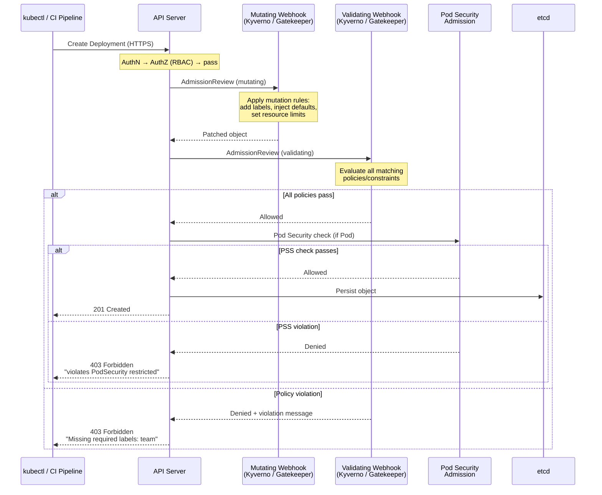

# Policy Engines

## 1. Overview

Policy engines extend Kubernetes authorization beyond RBAC by enforcing **what resources can look like**, not just who can create them. RBAC controls whether a user can create a Pod. A policy engine controls whether that Pod meets organizational standards -- does it have resource limits? Is it running as non-root? Does it pull from an approved registry? Does it have required labels?

Kubernetes enforces policies through **admission controllers** -- webhook-based interceptors that evaluate every API request after authentication and authorization but before the object is persisted to etcd. Two types exist: **validating admission webhooks** (approve or reject) and **mutating admission webhooks** (modify the request before validation). Policy engines are the user-facing abstractions built on top of these webhooks.

The two dominant policy engines in the ecosystem are **OPA/Gatekeeper** and **Kyverno**. Additionally, Kubernetes ships a built-in policy mechanism: **Pod Security Standards** enforced by the Pod Security Admission controller. Understanding when to use each -- and how to integrate policy validation into CI/CD pipelines as "policy-as-code" -- is essential for operating secure, compliant Kubernetes clusters at scale.

## 2. Why It Matters

- **RBAC gaps.** RBAC answers "can this user create a Deployment?" but cannot answer "does this Deployment set memory limits?" or "does this Pod use an approved base image?" Policy engines fill this gap by inspecting the content of API requests.
- **Compliance automation.** Manual security reviews do not scale. Policy engines enforce CIS Kubernetes Benchmarks, PCI-DSS requirements, and internal standards automatically. Every resource that enters the cluster is validated against the same rules, every time.
- **Shift-left security.** When policies are defined as code and validated in CI/CD pipelines, developers get feedback before deploying. A pull request that creates a privileged Pod is rejected by the CI check, not by a production admission webhook.
- **Operational consistency.** In multi-cluster environments, policy engines ensure that all clusters enforce the same standards. A misconfigured cluster cannot silently drift from organizational requirements.
- **Mutation for standardization.** Policy engines can automatically inject required fields -- adding default resource limits, injecting sidecar containers, or setting labels -- reducing the burden on developers and eliminating "I forgot to add the team label" tickets.

## 3. Core Concepts

- **Admission Webhook:** A Kubernetes-native extension point. When the API server receives a request, it calls configured webhooks to validate and/or mutate the request. Webhooks are external HTTP(S) services that receive AdmissionReview objects and return allow/deny decisions.
- **Validating Admission Webhook:** Inspects the request and returns allow or deny. Cannot modify the request. Multiple validating webhooks run in parallel.
- **Mutating Admission Webhook:** Can modify the request (add labels, inject sidecars, set defaults) before it reaches validating webhooks. Mutating webhooks run sequentially.
- **OPA (Open Policy Agent):** A general-purpose policy engine from the CNCF. Policies are written in Rego, a declarative query language. OPA is not Kubernetes-specific -- it can enforce policies on any structured data (Terraform plans, HTTP APIs, Kafka messages).
- **Gatekeeper:** The Kubernetes-native integration of OPA. It runs as a set of controllers and webhooks in the cluster, providing CRDs for managing policies: ConstraintTemplates (policy logic) and Constraints (policy instances).
- **Kyverno:** A Kubernetes-native policy engine where policies are written in YAML using Kubernetes-style resource definitions. No new language to learn -- policy authors use familiar Kubernetes patterns.
- **ConstraintTemplate (Gatekeeper):** Defines the policy logic in Rego and declares parameters. Think of it as a policy "class" that can be instantiated multiple times with different parameters.
- **Constraint (Gatekeeper):** An instance of a ConstraintTemplate with specific parameters and scope. Example: a ConstraintTemplate `K8sRequiredLabels` instantiated as a Constraint requiring the label `team` on all Deployments in namespace `production`.
- **ClusterPolicy (Kyverno):** A cluster-scoped policy resource that defines validation, mutation, or generation rules using Kubernetes-native patterns (match/exclude selectors, overlay patterns).
- **Policy Exception:** A mechanism to exempt specific resources from policy enforcement. Both Gatekeeper and Kyverno support exceptions for resources that legitimately need to violate a policy (e.g., a monitoring DaemonSet that requires host network access).
- **Pod Security Standards (PSS):** Three predefined security profiles built into Kubernetes: **Privileged** (no restrictions), **Baseline** (prevents known privilege escalation), and **Restricted** (hardened, minimal capabilities). Enforced by the Pod Security Admission controller.
- **Pod Security Admission (PSA):** The built-in admission controller (replacing the deprecated PodSecurityPolicy) that enforces Pod Security Standards. Configured per-namespace via labels.
- **Background Scanning:** The ability to evaluate existing resources against new policies (not just incoming requests). Kyverno natively supports this; Gatekeeper supports it via the audit controller.

## 4. How It Works

### OPA/Gatekeeper Architecture

Gatekeeper runs three components in the cluster:

1. **Gatekeeper Controller Manager:** Watches ConstraintTemplate and Constraint CRDs. Compiles Rego policies from ConstraintTemplates into OPA bundles. Manages the webhook configuration.
2. **Gatekeeper Audit Controller:** Periodically evaluates all existing resources against all active Constraints. Reports violations as `status.violations` on the Constraint object. This catches resources that were created before the policy existed.
3. **Validating Admission Webhook:** Intercepts API requests, evaluates them against all matching Constraints, and returns allow or deny.

**ConstraintTemplate example:**

```yaml
apiVersion: templates.gatekeeper.sh/v1
kind: ConstraintTemplate
metadata:
  name: k8srequiredlabels
spec:
  crd:
    spec:
      names:
        kind: K8sRequiredLabels
      validation:
        openAPIV3Schema:
          type: object
          properties:
            labels:
              type: array
              items:
                type: string
  targets:
    - target: admission.k8s.gatekeeper.sh
      rego: |
        package k8srequiredlabels

        violation[{"msg": msg}] {
          provided := {label | input.review.object.metadata.labels[label]}
          required := {label | label := input.parameters.labels[_]}
          missing := required - provided
          count(missing) > 0
          msg := sprintf("Missing required labels: %v", [missing])
        }
```

**Constraint instance:**

```yaml
apiVersion: constraints.gatekeeper.sh/v1beta1
kind: K8sRequiredLabels
metadata:
  name: require-team-label
spec:
  enforcementAction: deny  # or "dryrun" or "warn"
  match:
    kinds:
    - apiGroups: ["apps"]
      kinds: ["Deployment"]
    namespaces: ["production", "staging"]
    excludedNamespaces: ["kube-system"]
  parameters:
    labels: ["team", "cost-center"]
```

### Kyverno Architecture

Kyverno takes a different architectural approach:

1. **Admission Controller:** A webhook that intercepts API requests and evaluates them against ClusterPolicy and Policy resources. Returns allow/deny for validation rules, modifies requests for mutation rules.
2. **Background Controller:** Scans existing resources against policies on a configurable interval. Reports violations as PolicyReport and ClusterPolicyReport CRDs.
3. **Reports Controller:** Manages PolicyReport resources that provide a Kubernetes-native view of policy compliance.
4. **Cleanup Controller:** Handles resource cleanup based on policy-defined TTLs or conditions.

**Kyverno validation policy:**

```yaml
apiVersion: kyverno.io/v1
kind: ClusterPolicy
metadata:
  name: require-resource-limits
spec:
  validationFailureAction: Enforce  # or Audit
  background: true
  rules:
  - name: check-memory-limits
    match:
      any:
      - resources:
          kinds:
          - Pod
    exclude:
      any:
      - resources:
          namespaces:
          - kube-system
    validate:
      message: "All containers must have memory limits set."
      pattern:
        spec:
          containers:
          - resources:
              limits:
                memory: "?*"  # Must be non-empty
```

**Kyverno mutation policy:**

```yaml
apiVersion: kyverno.io/v1
kind: ClusterPolicy
metadata:
  name: add-default-labels
spec:
  rules:
  - name: add-environment-label
    match:
      any:
      - resources:
          kinds:
          - Deployment
          - StatefulSet
    mutate:
      patchStrategicMerge:
        metadata:
          labels:
            +(environment): "production"  # + means "add if not exists"
```

**Kyverno generation policy:**

```yaml
apiVersion: kyverno.io/v1
kind: ClusterPolicy
metadata:
  name: generate-networkpolicy
spec:
  rules:
  - name: default-deny-ingress
    match:
      any:
      - resources:
          kinds:
          - Namespace
    generate:
      synchronize: true  # Keep in sync if the policy changes
      apiVersion: networking.k8s.io/v1
      kind: NetworkPolicy
      name: default-deny-ingress
      namespace: "{{request.object.metadata.name}}"
      data:
        spec:
          podSelector: {}
          policyTypes:
          - Ingress
```

This automatically creates a deny-all-ingress NetworkPolicy in every new namespace -- a powerful security baseline.

### Pod Security Standards Enforcement

Pod Security Admission is configured per-namespace via labels:

```yaml
apiVersion: v1
kind: Namespace
metadata:
  name: production
  labels:
    pod-security.kubernetes.io/enforce: restricted
    pod-security.kubernetes.io/enforce-version: v1.29
    pod-security.kubernetes.io/audit: restricted
    pod-security.kubernetes.io/warn: restricted
```

Three modes per namespace:
- **enforce:** Reject Pods that violate the standard.
- **audit:** Allow but log violations in the audit log.
- **warn:** Allow but send a warning to the user.

**Pod Security Standards levels:**

| Standard | Restrictions | Use Case |
|---|---|---|
| **Privileged** | No restrictions | System-level workloads (CNI plugins, storage drivers) |
| **Baseline** | Prevents known privilege escalation (no hostNetwork, no hostPID, no privileged containers) | General workloads with minimal hardening |
| **Restricted** | Baseline + must run as non-root, drop all capabilities, read-only root filesystem encouraged, seccomp profile required | Security-sensitive production workloads |

### Policy-as-Code Workflow

Integrating policy validation into CI/CD ensures developers get feedback before deployment:

```yaml
# Example GitHub Actions workflow
name: Policy Check
on: [pull_request]
jobs:
  kyverno-check:
    runs-on: ubuntu-latest
    steps:
    - uses: actions/checkout@v4
    - name: Install Kyverno CLI
      run: |
        curl -LO https://github.com/kyverno/kyverno/releases/latest/download/kyverno-cli_linux_amd64.tar.gz
        tar -xzf kyverno-cli_linux_amd64.tar.gz
        sudo mv kyverno /usr/local/bin/
    - name: Validate manifests against policies
      run: |
        kyverno apply policies/ --resource manifests/ --detailed-results

  gatekeeper-check:
    runs-on: ubuntu-latest
    steps:
    - uses: actions/checkout@v4
    - name: Install Gatekeeper CLI (gator)
      run: |
        curl -LO https://github.com/open-policy-agent/gatekeeper/releases/latest/download/gator-linux-amd64
        chmod +x gator-linux-amd64
        sudo mv gator-linux-amd64 /usr/local/bin/gator
    - name: Test constraints
      run: |
        gator verify policies/
    - name: Validate manifests
      run: |
        gator test --filename manifests/ --filename policies/
```

**Policy testing with Kyverno CLI:**

```bash
# Test a specific resource against a policy
kyverno apply policy.yaml --resource deployment.yaml

# Test all resources in a directory against all policies
kyverno apply policies/ --resource manifests/

# Generate a policy report
kyverno apply policies/ --resource manifests/ -o json > report.json
```

### Policy Exceptions

Both engines support exempting specific resources:

**Gatekeeper exception (exemption config):**

```yaml
apiVersion: config.gatekeeper.sh/v1alpha1
kind: Config
metadata:
  name: config
  namespace: gatekeeper-system
spec:
  match:
  - excludedNamespaces: ["kube-system", "gatekeeper-system"]
    processes: ["*"]
```

**Kyverno policy exception:**

```yaml
apiVersion: kyverno.io/v2beta1
kind: PolicyException
metadata:
  name: allow-monitoring-hostnetwork
  namespace: monitoring
spec:
  exceptions:
  - policyName: disallow-host-namespaces
    ruleNames:
    - host-network
  match:
    any:
    - resources:
        kinds:
        - Pod
        namespaces:
        - monitoring
        names:
        - "node-exporter-*"
```

## 5. Architecture / Flow



## 6. Types / Variants

### OPA/Gatekeeper vs. Kyverno Comparison

| Dimension | OPA/Gatekeeper | Kyverno |
|---|---|---|
| **Policy language** | Rego (declarative query language) | YAML (Kubernetes-native) |
| **Learning curve** | Steep -- Rego is a new language with its own paradigm | Low -- uses familiar Kubernetes patterns |
| **Validation** | Yes (ConstraintTemplate + Constraint) | Yes (validate rules in ClusterPolicy) |
| **Mutation** | Yes (Gatekeeper v3.7+, assign/modify) | Yes (native, patchStrategicMerge, JSON patch) |
| **Generation** | No | Yes (create resources when triggers match) |
| **Background scanning** | Yes (audit controller) | Yes (background controller + PolicyReports) |
| **Policy exceptions** | Config-level namespace exclusions; v3.13+ ExemptiblePolicy | PolicyException CRD with fine-grained matching |
| **CI/CD testing** | gator CLI | kyverno CLI |
| **Community size** | Larger (CNCF graduated, used beyond K8s) | Growing rapidly (CNCF incubating) |
| **Multi-purpose** | Yes (Terraform, Envoy, Kafka, CI pipelines) | No (Kubernetes-only) |
| **External data** | Yes (OPA bundles, external data provider) | Yes (API calls, ConfigMap lookups, image verification) |
| **Performance (p99)** | 1-5ms per evaluation | 1-5ms per evaluation |
| **CRD model** | ConstraintTemplate (logic) + Constraint (instance) | ClusterPolicy / Policy (all-in-one) |

### Policy Types by Function

| Policy Type | Purpose | Gatekeeper | Kyverno |
|---|---|---|---|
| **Validate** | Reject non-compliant resources | ConstraintTemplate + Constraint | validate rule |
| **Mutate** | Modify resources to add/change fields | Assign / AssignMetadata | mutate rule (patchStrategicMerge, JSON patch) |
| **Generate** | Create companion resources | Not supported | generate rule |
| **Verify Images** | Check image signatures/attestations | Not native (use external) | verifyImages rule |
| **Cleanup** | Delete resources based on conditions | Not supported | Cleanup policies |

### Enforcement Modes

| Mode | Gatekeeper | Kyverno | Behavior |
|---|---|---|---|
| **Enforce/Deny** | `enforcementAction: deny` | `validationFailureAction: Enforce` | Reject non-compliant requests |
| **Audit/Warn** | `enforcementAction: dryrun` | `validationFailureAction: Audit` | Allow but report violations |
| **Warning** | `enforcementAction: warn` | Warning via audit annotations | Return HTTP warning header to client |

**Recommended rollout strategy:**

1. Deploy policies in audit/warn mode.
2. Run background scans to identify existing violations.
3. Remediate existing violations.
4. Switch to enforce mode.
5. Monitor for false positives via PolicyReports.

## 7. Use Cases

- **Enforce resource limits on all containers.** A ClusterPolicy requires every Pod to have CPU and memory requests and limits set. Without limits, a single runaway container can OOM-kill neighboring Pods. The mutation variant adds sensible defaults for teams that forget.

- **Block privileged containers.** A validating policy denies any Pod with `securityContext.privileged: true` except in the `kube-system` namespace. This prevents container escapes -- a privileged container has direct access to the host kernel.

- **Require approved image registries.** A policy restricts container images to `gcr.io/mycompany/*`, `docker.io/library/*`, and the internal registry. This prevents developers from pulling unvetted images from public registries that might contain malware or vulnerabilities.

- **Auto-generate NetworkPolicies for new namespaces.** A Kyverno generate policy creates a default-deny-ingress NetworkPolicy every time a namespace is created. This ensures that no namespace is accidentally left open to all cluster traffic.

- **Enforce Pod Security Standards cluster-wide.** PSA labels set `restricted` enforcement on all application namespaces, `baseline` on infrastructure namespaces, and `privileged` only on `kube-system`. Kyverno or Gatekeeper provides additional granularity beyond what PSA covers.

- **Policy-as-code in GitOps.** All policies are stored in Git and deployed via ArgoCD. Changes go through pull request review, CI validation (gator/kyverno CLI), and staged rollout (audit mode first, then enforce). The Git history provides an audit trail of every policy change.

- **Multi-cluster policy consistency.** A central policy repository is synced to 50 clusters via ArgoCD ApplicationSets. Every cluster enforces the same security baseline. Policy exceptions are tracked per-cluster in the same repository with explicit justification.

## 8. Tradeoffs

| Decision | Option A | Option B | Guidance |
|---|---|---|---|
| **Gatekeeper vs. Kyverno** | Gatekeeper: mature, multi-purpose, Rego flexibility | Kyverno: YAML-native, generation, image verification | Kyverno for Kubernetes-only teams wanting fast adoption; Gatekeeper for organizations already using OPA elsewhere or needing Rego's expressiveness |
| **PSA only vs. PSA + policy engine** | PSA only: no extra components, built into K8s | PSA + engine: fine-grained, custom policies, mutation | PSA for the security baseline; add a policy engine for custom organizational requirements |
| **Enforce immediately vs. audit first** | Enforce: maximum security from day one | Audit: discover violations without breaking workloads | Always audit first in existing clusters; enforce from day one only on new, empty clusters |
| **In-cluster enforcement vs. CI/CD only** | In-cluster: enforced at admission, no bypass | CI/CD only: faster feedback, no webhook latency | Both. CI/CD for fast feedback; in-cluster for enforcement. CI/CD alone can be bypassed |
| **Centralized vs. per-team policies** | Centralized: consistent baseline, single team manages | Per-team: teams own their policies, more autonomy | Centralized baseline + per-team overrides. Use ClusterPolicy for org standards, Policy (namespaced) for team-specific rules |

## 9. Common Pitfalls

- **Deploying policies in enforce mode without auditing.** Turning on a policy that blocks resources limits or required labels will break every existing CI/CD pipeline and Helm chart that does not comply. Always deploy in audit mode first, remediate, then enforce.

- **Webhook failure mode misconfiguration.** Admission webhooks have a `failurePolicy` field: `Fail` (deny request if webhook is unavailable) or `Ignore` (allow request if webhook is unavailable). Setting `Fail` on a webhook that is not highly available causes cluster-wide outages -- no one can create or update any resource. Setting `Ignore` means policies are silently bypassed during webhook downtime.

- **Not excluding system namespaces.** Policies that enforce resource limits or block host networking will break kube-system workloads (kube-proxy, CoreDNS, CNI plugins). Always exclude `kube-system`, `gatekeeper-system`/`kyverno`, and other infrastructure namespaces from restrictive policies.

- **Policy engine as a single point of failure.** If Gatekeeper or Kyverno becomes unavailable with `failurePolicy: Fail`, the entire cluster is frozen. Run policy engine Pods with anti-affinity across nodes, set appropriate resource requests, and configure PodDisruptionBudgets to ensure at least 2 replicas are always available.

- **Ignoring policy reports.** Background scans produce PolicyReports that show existing violations. If no one monitors these reports, non-compliant resources accumulate. Integrate PolicyReports with your monitoring stack -- expose them as Prometheus metrics and create Grafana dashboards.

- **Mutation order dependencies.** If two mutating policies modify the same field, the result depends on execution order. Document mutation policy interactions and test with realistic manifests to avoid surprises.

- **Rego complexity spiraling.** Gatekeeper's Rego policies can become complex and difficult for non-policy-experts to review. Establish style guides, mandatory testing (gator verify), and peer review processes for Rego code, treating it with the same rigor as application code.

## 10. Real-World Examples

- **Cruise (autonomous vehicles).** Uses Gatekeeper to enforce that all Pods in safety-critical namespaces run with specific seccomp profiles, non-root users, and read-only root filesystems. Policies are tested in CI with `gator verify` and deployed via ArgoCD. Violations trigger PagerDuty alerts.

- **Intuit (TurboTax, QuickBooks).** Adopted Kyverno for its Kubernetes-native YAML policies, reducing the barrier for development teams to contribute policy definitions. They use Kyverno's generate policies to automatically create NetworkPolicies and ResourceQuotas for every new namespace. Over 300 policies are managed as code in a central Git repository.

- **CERN.** Enforces Pod Security Standards at the `restricted` level across their physics data processing clusters. Exceptions for GPU workloads and storage drivers are tracked via PolicyException resources with mandatory comments explaining the exemption.

- **Palo Alto Networks.** Open-sourced a library of Gatekeeper ConstraintTemplates covering CIS Kubernetes Benchmark controls. Organizations adopt these templates as a starting point and customize parameters (allowed registries, required labels) for their environment.

- **GitOps policy rollout at a Fortune 100 bank.** All Gatekeeper policies are stored in a dedicated Git repository. A CI pipeline validates policies with `gator test` against a suite of test fixtures (compliant and non-compliant manifests). ArgoCD syncs policies to 200+ clusters. New policies are deployed in `dryrun` mode for 2 weeks while the security team monitors violation counts. After remediation, enforcement is enabled via a Git commit that changes `enforcementAction` to `deny`.

## 11. Related Concepts

- [RBAC and Access Control](./01-rbac-and-access-control.md) -- RBAC controls who can perform actions; policy engines control what those actions can create
- [Supply Chain Security](./03-supply-chain-security.md) -- Kyverno's verifyImages policies integrate supply chain verification at admission time
- [Runtime Security](./05-runtime-security.md) -- Pod Security Standards bridge policy engines and runtime enforcement (seccomp, AppArmor)
- [API Server and etcd](../01-foundations/03-api-server-and-etcd.md) -- admission controllers are the extension point that policy engines use
- [Authentication and Authorization](../../traditional-system-design/09-security/01-authentication-authorization.md) -- general authorization models that inform Kubernetes policy design

## 12. Source Traceability

- source/youtube-video-reports/7.md -- Five pillars of Kubernetes: Security pillar references the need for policy enforcement beyond RBAC
- Kubernetes official documentation (kubernetes.io) -- Pod Security Standards, Pod Security Admission controller, admission webhook configuration
- OPA/Gatekeeper project documentation (open-policy-agent.github.io/gatekeeper) -- ConstraintTemplate authoring, Gatekeeper architecture, audit controller
- Kyverno project documentation (kyverno.io) -- ClusterPolicy specification, mutation/generation/verification rules, PolicyReports
