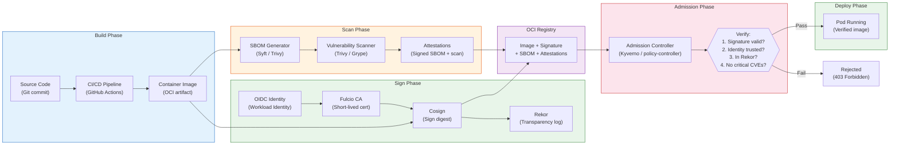

# Supply Chain Security

## 1. Overview

Supply chain security in Kubernetes addresses the integrity and provenance of every artifact that runs in your cluster -- from the base image layers through the build process to the deployed container. The core question is: **how do you prove that the code running in production is exactly what your team built, unmodified and free from known vulnerabilities?**

The software supply chain encompasses source code, dependencies, build systems, container registries, and deployment pipelines. An attacker who compromises any link in this chain can inject malicious code that runs with the full privileges of your application. The SolarWinds attack (2020) demonstrated that even sophisticated organizations are vulnerable when build pipelines lack integrity verification.

Modern supply chain security relies on three pillars: **signing** (cryptographically proving who built an artifact), **verification** (validating signatures before deployment), and **transparency** (recording all signing events in immutable logs). The SLSA framework (Supply chain Levels for Software Artifacts) provides a maturity model for hardening each stage. In Kubernetes, this translates to signing container images, generating Software Bills of Materials (SBOMs), scanning for vulnerabilities, and enforcing admission policies that reject unsigned or vulnerable images.

## 2. Why It Matters

- **Preventing malicious image deployment.** Without image verification, anyone with push access to your registry can deploy an image. A compromised CI/CD pipeline, a stolen registry credential, or a typosquatting attack on a public image can inject malicious code. Image signing and admission enforcement ensure only verified images run.
- **Regulatory compliance.** Executive Order 14028 (US, 2021) mandates SBOM generation for software sold to the federal government. PCI-DSS 4.0 requires vulnerability management for all system components. Supply chain controls provide the evidence trail auditors demand.
- **Incident response acceleration.** When a CVE is published, you need to answer "which of our running containers are affected?" within minutes, not days. SBOMs and vulnerability databases make this query answerable.
- **Dependency risk management.** A modern container image contains 200-500 OS packages and application dependencies. Any one of them can introduce a vulnerability. Automated scanning catches known issues before they reach production.
- **Build reproducibility.** SLSA framework levels enforce that builds are reproducible, hermetic, and non-forgeable. This eliminates "works on my machine" as a class of supply chain risk and provides cryptographic proof of what was built and by whom.

## 3. Core Concepts

- **Container Image Signing:** Attaching a cryptographic signature to a container image digest (SHA-256 hash). The signature proves who built the image and that it has not been tampered with since signing. Unlike tag-based references (which are mutable), digest-based signatures are immutable.
- **Cosign:** A tool from the Sigstore project for signing and verifying container images and other OCI artifacts. Supports key-pair signing, keyless signing (via OIDC + Fulcio), and hardware-backed keys (KMS, Yubikey).
- **Sigstore:** An open-source project providing free, transparent code signing infrastructure. Components include Cosign (signing tool), Fulcio (certificate authority for keyless signing), Rekor (transparency log), and policy-controller (Kubernetes admission).
- **Keyless Signing (Fulcio):** Instead of managing long-lived signing keys, the signer authenticates via OIDC (Google, GitHub, Microsoft), and Fulcio issues a short-lived signing certificate tied to the OIDC identity. The certificate expires in minutes, but the signature is permanently recorded in Rekor.
- **Rekor (Transparency Log):** An immutable, tamper-evident log that records all signing events. Anyone can verify that a signature was created at a specific time by a specific identity. Similar in concept to Certificate Transparency logs for TLS certificates.
- **SBOM (Software Bill of Materials):** A structured inventory of all components in a software artifact -- OS packages, application libraries, their versions, and licenses. Formats include SPDX and CycloneDX. SBOMs enable vulnerability correlation: when a new CVE is published, you can immediately identify affected images.
- **Vulnerability Scanning:** Automated analysis of container images against vulnerability databases (NVD, GitHub Advisory Database, OS vendor advisories). Scanners compare the SBOM or package manifests against known CVEs and report findings with severity ratings (Critical, High, Medium, Low).
- **SLSA (Supply chain Levels for Software Artifacts):** A framework defining four levels of supply chain security maturity. Each level adds requirements for build provenance, hermeticity, and non-forgeability. Pronounced "salsa."
- **Attestation:** A signed statement about a software artifact. Examples: "this image was built from this Git commit by this CI system" (provenance attestation), "this image was scanned and has no critical vulnerabilities" (vulnerability attestation). Attestations are stored alongside the image in the OCI registry.
- **Admission Controller for Image Verification:** A Kubernetes webhook that checks image signatures and attestations before allowing Pods to run. If the image is not signed by a trusted key or identity, the Pod is rejected.
- **OCI Artifact:** The Open Container Initiative defines standards for container images and associated artifacts (signatures, SBOMs, attestations). Modern registries (Docker Hub, GCR, ECR, Harbor) support storing these artifacts alongside images.

## 4. How It Works

### Image Signing with Cosign

**Key-pair signing (traditional):**

```bash
# Generate a key pair
cosign generate-key-pair

# Sign an image (pushes signature to the same registry)
cosign sign --key cosign.key myregistry.io/myapp@sha256:abc123...

# Verify an image
cosign verify --key cosign.pub myregistry.io/myapp@sha256:abc123...
```

**Keyless signing with Fulcio (recommended for CI/CD):**

```bash
# In a CI/CD pipeline with OIDC identity (e.g., GitHub Actions)
# No key management required -- identity comes from the OIDC token
cosign sign myregistry.io/myapp@sha256:abc123...

# Verify using the OIDC identity
cosign verify \
  --certificate-identity=https://github.com/myorg/myapp/.github/workflows/build.yaml@refs/heads/main \
  --certificate-oidc-issuer=https://token.actions.githubusercontent.com \
  myregistry.io/myapp@sha256:abc123...
```

With keyless signing, the flow is:

1. The CI pipeline authenticates to Fulcio with its OIDC token (e.g., GitHub Actions OIDC token).
2. Fulcio verifies the OIDC token and issues a short-lived X.509 signing certificate.
3. Cosign uses the certificate to sign the image digest.
4. The signature and certificate are uploaded to the OCI registry.
5. The signing event is recorded in Rekor (transparency log) with a timestamp.
6. At verification time, the verifier checks: (a) the signature is valid, (b) the certificate was issued by Fulcio, (c) the OIDC identity matches the expected signer, (d) the signing event exists in Rekor.

### SBOM Generation

**Using Syft (Anchore):**

```bash
# Generate SBOM for a container image
syft myregistry.io/myapp:v1.2.3 -o spdx-json > sbom.spdx.json

# Generate CycloneDX format
syft myregistry.io/myapp:v1.2.3 -o cyclonedx-json > sbom.cdx.json

# Attach SBOM to the image in the registry
cosign attach sbom --sbom sbom.spdx.json myregistry.io/myapp@sha256:abc123...

# Or use cosign attest for signed SBOMs
cosign attest --predicate sbom.spdx.json --type spdxjson \
  myregistry.io/myapp@sha256:abc123...
```

**Using Trivy (Aqua Security):**

```bash
# Generate SBOM
trivy image --format spdx-json --output sbom.spdx.json myregistry.io/myapp:v1.2.3

# Scan SBOM for vulnerabilities
trivy sbom sbom.spdx.json
```

### Vulnerability Scanning

**Trivy (most popular, broad coverage):**

```bash
# Scan an image for vulnerabilities
trivy image myregistry.io/myapp:v1.2.3

# Scan with severity filter (fail CI on Critical/High)
trivy image --severity CRITICAL,HIGH --exit-code 1 myregistry.io/myapp:v1.2.3

# Scan a running cluster
trivy k8s --report summary cluster

# Scan with ignore file for accepted risks
trivy image --ignorefile .trivyignore myregistry.io/myapp:v1.2.3
```

**Grype (Anchore):**

```bash
# Scan an image
grype myregistry.io/myapp:v1.2.3

# Scan an SBOM
grype sbom:sbom.spdx.json

# Fail on critical vulnerabilities
grype myregistry.io/myapp:v1.2.3 --fail-on critical
```

### Admission Controllers for Verified Images

**Kyverno verify-images policy:**

```yaml
apiVersion: kyverno.io/v1
kind: ClusterPolicy
metadata:
  name: verify-image-signatures
spec:
  validationFailureAction: Enforce
  webhookTimeoutSeconds: 30
  rules:
  - name: verify-cosign-signature
    match:
      any:
      - resources:
          kinds:
          - Pod
    verifyImages:
    - imageReferences:
      - "myregistry.io/myapp:*"
      - "myregistry.io/myservice:*"
      attestors:
      - entries:
        - keyless:
            subject: "https://github.com/myorg/myapp/.github/workflows/build.yaml@refs/heads/main"
            issuer: "https://token.actions.githubusercontent.com"
            rekor:
              url: https://rekor.sigstore.dev
  - name: verify-sbom-attestation
    match:
      any:
      - resources:
          kinds:
          - Pod
    verifyImages:
    - imageReferences:
      - "myregistry.io/*"
      attestations:
      - type: https://spdx.dev/Document
        attestors:
        - entries:
          - keyless:
              subject: "https://github.com/myorg/*"
              issuer: "https://token.actions.githubusercontent.com"
        conditions:
        - all:
          - key: "{{ creationInfo.created }}"
            operator: NotEquals
            value: ""
```

**Sigstore policy-controller:**

```yaml
apiVersion: policy.sigstore.dev/v1beta1
kind: ClusterImagePolicy
metadata:
  name: require-signed-images
spec:
  images:
  - glob: "myregistry.io/**"
  authorities:
  - keyless:
      url: https://fulcio.sigstore.dev
      identities:
      - issuer: https://token.actions.githubusercontent.com
        subject: "https://github.com/myorg/*"
    ctlog:
      url: https://rekor.sigstore.dev
```

**Connaisseur (lightweight alternative):**

Connaisseur is a Kubernetes admission controller specifically designed for image signature verification. It supports Cosign, Notary v1 (Docker Content Trust), and Notary v2. It is simpler than Kyverno for organizations that only need signature verification without broader policy engine capabilities.

### SLSA Framework Levels

| Level | Build Requirements | Provenance | Example |
|---|---|---|---|
| **SLSA 1** | Documented build process | Provenance exists (may be unsigned) | Basic CI/CD with build logs |
| **SLSA 2** | Version-controlled build service | Signed provenance from hosted build service | GitHub Actions with signed provenance |
| **SLSA 3** | Hardened build platform, non-forgeable provenance | Provenance is non-forgeable; build service is hardened | Isolated build runners, OIDC-bound provenance |
| **SLSA 4** | Hermetic, reproducible builds; two-person review | All Level 3 + reproducible, dependency-complete | Hermetic Bazel builds with fully pinned dependencies |

**Generating SLSA provenance with GitHub Actions:**

```yaml
# .github/workflows/build.yaml
name: Build and Sign
on:
  push:
    branches: [main]

permissions:
  contents: read
  packages: write
  id-token: write  # Required for keyless signing

jobs:
  build:
    runs-on: ubuntu-latest
    steps:
    - uses: actions/checkout@v4

    - name: Build image
      run: docker build -t myregistry.io/myapp:${{ github.sha }} .

    - name: Push image
      run: docker push myregistry.io/myapp:${{ github.sha }}

    - name: Install cosign
      uses: sigstore/cosign-installer@v3

    - name: Sign image (keyless)
      run: cosign sign myregistry.io/myapp@${{ steps.push.outputs.digest }}

    - name: Generate SBOM
      uses: anchore/sbom-action@v0
      with:
        image: myregistry.io/myapp:${{ github.sha }}
        format: spdx-json
        output-file: sbom.spdx.json

    - name: Attest SBOM
      run: |
        cosign attest --predicate sbom.spdx.json --type spdxjson \
          myregistry.io/myapp@${{ steps.push.outputs.digest }}

    - name: Scan for vulnerabilities
      uses: aquasecurity/trivy-action@master
      with:
        image-ref: myregistry.io/myapp:${{ github.sha }}
        severity: CRITICAL,HIGH
        exit-code: 1
```

## 5. Architecture / Flow



## 6. Types / Variants

### Image Signing Approaches

| Approach | Key Management | Identity | Best For |
|---|---|---|---|
| **Cosign with key pair** | Manual key management (HSM, KMS) | Key identity | Air-gapped environments, high-security requirements |
| **Cosign keyless (Fulcio)** | No key management | OIDC identity (email, CI identity) | CI/CD pipelines, GitHub Actions, GitLab CI |
| **Notation (Notary v2)** | Plugin-based key management | Certificate-based | Enterprise environments requiring CNCF standard |
| **Docker Content Trust (Notary v1)** | Notary server | Repository-scoped keys | Legacy Docker environments |

### Vulnerability Scanners Comparison

| Scanner | Vendor | Strengths | Limitations |
|---|---|---|---|
| **Trivy** | Aqua Security | Broad coverage (OS, languages, IaC, secrets), fast, Kubernetes-native | Some language-specific packages may lag |
| **Grype** | Anchore | Fast matching, good SBOM integration via Syft | Narrower scope than Trivy |
| **Snyk Container** | Snyk | Developer-friendly, IDE integration, fix recommendations | Commercial (free tier limited) |
| **Clair** | Quay/Red Hat | Registry-native scanning (integrated with Quay) | Slower update cycle, complex setup |
| **Docker Scout** | Docker | Docker Desktop integration, real-time monitoring | Docker ecosystem only |

### SBOM Formats

| Format | Standard Body | Strengths | Use Case |
|---|---|---|---|
| **SPDX** | Linux Foundation | ISO/IEC 5962 standard, broad adoption, license focus | Compliance, license audit, government requirements |
| **CycloneDX** | OWASP | Rich vulnerability correlation, VEX support, lightweight | Security-focused SBOM, vulnerability management |

### Admission Controllers for Image Verification

| Controller | Policy Scope | Signing Support | Integration |
|---|---|---|---|
| **Kyverno verifyImages** | Full policy engine (validate, mutate, generate) | Cosign, Notary | Integrated with broader Kyverno policies |
| **Sigstore policy-controller** | Image verification only | Cosign keyless, key-based | Lightweight, Sigstore-native |
| **Connaisseur** | Image verification only | Cosign, Notary v1, Notary v2 | Minimal footprint, simple configuration |
| **Ratify** | Image verification + plugin extensibility | Cosign, Notary v2, custom plugins | Microsoft-backed, enterprise-focused |

## 7. Use Cases

- **Zero-trust CI/CD pipeline.** Every image built by the CI pipeline is signed with keyless Cosign using the GitHub Actions OIDC token. The Kubernetes admission controller rejects any image not signed by the expected CI identity. Even if an attacker pushes a malicious image to the registry with stolen credentials, it will not have a valid signature from the CI pipeline and will be rejected at admission.

- **CVE response in minutes.** When Log4Shell (CVE-2021-44228) was disclosed, organizations with SBOM databases could query "which images contain log4j-core < 2.17.0?" and get an answer in seconds. Without SBOMs, teams spent days manually inspecting Dockerfiles and dependency trees. Organizations with automated scanning pipelines had patches deployed within hours.

- **Government compliance (SBOM mandate).** A defense contractor delivers software to the Department of Defense. Each release includes a signed SPDX SBOM attached to the container image as a Cosign attestation. The DoD's admission controller verifies the SBOM attestation before allowing deployment, and the SBOM is archived for audit.

- **Registry mirror security.** An organization mirrors public images to an internal registry. The mirroring pipeline scans each image for vulnerabilities, generates an SBOM, and signs the image with the organization's key. The admission controller only trusts images signed by the internal key, ensuring that direct pulls from public registries are blocked.

- **SLSA Level 3 compliance for a fintech.** A payment processing company implements hermetic builds in GitHub Actions with OIDC-based provenance. Every build generates a signed SLSA provenance attestation. The Kubernetes admission controller verifies both the image signature and the provenance attestation, ensuring that only images built from the main branch of the authorized repository are deployed.

- **Vulnerability gate in staging.** Images are scanned in the CI pipeline, and a vulnerability attestation is attached. The staging cluster's admission controller allows images with up to High-severity vulnerabilities. The production cluster's admission controller only allows images with no Critical or High vulnerabilities. This provides a progressive security gate.

## 8. Tradeoffs

| Decision | Option A | Option B | Guidance |
|---|---|---|---|
| **Key-based vs. keyless signing** | Key-based: offline verification, no external dependency | Keyless: no key management, identity-based, transparency log | Keyless for most CI/CD pipelines; key-based for air-gapped or high-security environments |
| **Scan in CI vs. scan at admission** | CI: fast feedback, blocks bad images early | Admission: catches images that bypassed CI, re-scans with updated CVE databases | Both. CI for developer feedback; admission for enforcement with up-to-date vulnerability data |
| **Block on High vs. block on Critical only** | Block High+Critical: more secure, more disruption | Block Critical only: less friction, risk of unpatched High vulnerabilities | Block Critical in production, audit High. Remediation SLAs: Critical=24h, High=7d, Medium=30d |
| **SPDX vs. CycloneDX** | SPDX: ISO standard, broader industry adoption | CycloneDX: better vulnerability correlation, OWASP backing | SPDX for government/compliance; CycloneDX for security-focused teams. Most tools support both |
| **Enforce signatures on all images vs. approved list** | All images: maximum security, high operational overhead | Approved registry prefix: practical balance | Enforce on all first-party images; use registry allowlist for third-party base images signed by their maintainers |

## 9. Common Pitfalls

- **Signing by tag instead of digest.** Tags are mutable -- `myapp:latest` or `myapp:v1.2.3` can point to different image digests at different times. Always sign and reference images by digest (`myapp@sha256:abc123...`). A signature on a tag is meaningless if the tag can be moved to a different image.

- **Not rotating signing keys.** Long-lived signing keys that are compromised allow an attacker to sign malicious images. Use keyless signing where possible, or store keys in HSM/KMS with automatic rotation. If a key is compromised, all images signed with that key must be re-signed.

- **Vulnerability scanning without remediation SLAs.** Scanning produces thousands of findings. Without prioritization and SLAs (Critical=24h, High=7d), the vulnerability backlog grows indefinitely and the scan results are ignored. Focus on Critical and High in base images first -- these affect every image built on top of them.

- **SBOM generation without storage.** Generating SBOMs during CI but not attaching them to the image or storing them in a searchable database defeats the purpose. When a CVE hits, you need to query "which images are affected?" Use `cosign attest` to attach SBOMs to images and tools like Dependency-Track or Guac for querying.

- **Blocking admission on stale vulnerability data.** If the vulnerability database in the admission controller is outdated, it may allow vulnerable images. Ensure the scanner's database is updated at least daily. Conversely, if the database update introduces a new CVE, previously admitted images may now be non-compliant -- background scanning catches this.

- **Ignoring base image vulnerabilities.** Application teams scan their images but do not track vulnerabilities in the base image (e.g., `ubuntu:22.04`, `node:18-alpine`). Establish a base image catalog with automated rebuilds when base image CVEs are published.

- **Not verifying in both CI and admission.** CI-only verification is bypassable (direct `kubectl apply` or emergency deployments). Admission-only verification lacks developer feedback. The defense-in-depth approach validates in both places.

## 10. Real-World Examples

- **SolarWinds attack (2020).** Attackers compromised the build system for SolarWinds Orion software, injecting malicious code into a legitimate build. The signed, trojanized update was distributed to ~18,000 customers. This incident catalyzed the industry focus on supply chain security and the development of SLSA. With SLSA Level 3 controls (hermetic, non-forgeable builds), the build system compromise would have been detectable because the provenance attestation would not match the expected build parameters.

- **Codecov bash uploader attack (2021).** Attackers modified Codecov's bash uploader script to exfiltrate CI environment variables (including secrets). Organizations using the script in their CI pipelines had credentials stolen. This demonstrated the risk of pulling unverified scripts in CI. Pinning dependencies by digest and verifying signatures would have prevented execution of the tampered script.

- **Google distroless images.** Google publishes distroless container images (minimal images with no OS package manager) that are signed with Cosign and include SLSA provenance attestations. Organizations using distroless as base images can verify provenance and significantly reduce their vulnerability surface -- a distroless image has 10-50x fewer CVEs than a full Ubuntu base image.

- **Chainguard Enforce.** Chainguard (founded by Sigstore creators) provides a commercial platform for supply chain policy enforcement. Their open-source Wolfi OS produces minimal container images with SBOMs and SLSA provenance baked in. Organizations using Wolfi-based images report 80-90% fewer CVEs compared to Alpine or Debian base images.

- **GitHub Actions OIDC for keyless signing.** GitHub Actions natively supports OIDC tokens that integrate with Sigstore Fulcio for keyless signing. The npm registry uses this to publish provenance for npm packages. In 2023, npm launched provenance for packages, allowing consumers to verify that a package was built from its claimed source repository.

## 11. Related Concepts

- [Policy Engines](./02-policy-engines.md) -- Kyverno verifyImages and OPA/Gatekeeper integrate supply chain verification at admission time
- [Secrets Management](./04-secrets-management.md) -- signing keys and registry credentials are secrets that need proper management
- [Runtime Security](./05-runtime-security.md) -- runtime protections complement supply chain controls by detecting anomalous behavior from compromised images
- [Encryption](../../traditional-system-design/09-security/02-encryption.md) -- cryptographic signing and verification fundamentals used in image signing
- [API Security](../../traditional-system-design/09-security/03-api-security.md) -- API security patterns for registry and build system access

## 12. Source Traceability

- source/youtube-video-reports/7.md -- Kubernetes security pillar, need for image and supply chain integrity in container orchestration
- Sigstore project documentation (sigstore.dev) -- Cosign, Fulcio, Rekor architecture and usage
- SLSA framework specification (slsa.dev) -- Supply chain security levels, provenance requirements
- NIST SP 800-218 (Secure Software Development Framework) -- Government supply chain security requirements
- Real-world incident reports -- SolarWinds (CISA analysis), Codecov (post-mortem), Log4Shell CVE-2021-44228 response
