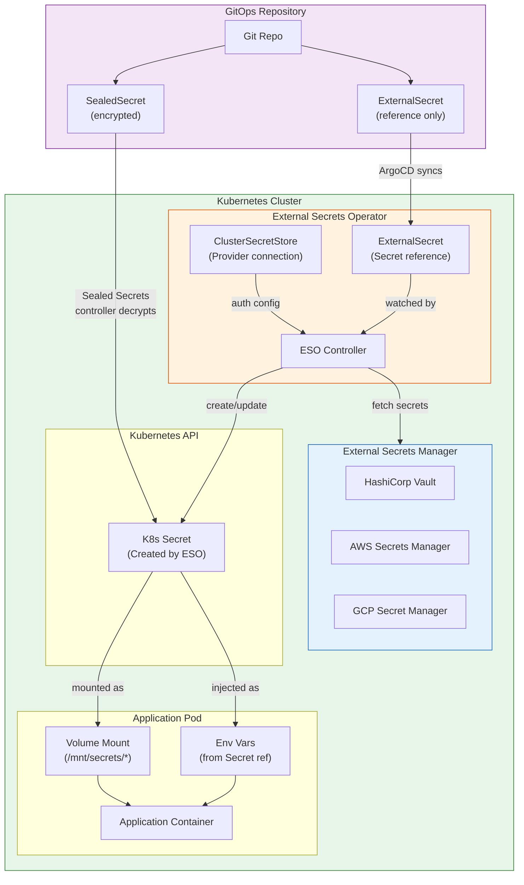

# Secrets Management

## 1. Overview

Secrets management in Kubernetes addresses how sensitive data -- API keys, database passwords, TLS certificates, OAuth tokens -- is stored, distributed to workloads, and rotated over time. Kubernetes has a native Secret resource, but its limitations (base64 encoding, etcd storage, broad RBAC access) make it insufficient for production security. The ecosystem has responded with external secrets managers, sealed secrets for GitOps, and CSI-based injection patterns.

The fundamental tension is between **convenience** (developers want secrets available in their Pods) and **security** (secrets should be encrypted at rest, access-controlled, auditable, and rotatable without application restarts). Native Kubernetes Secrets optimize for convenience. External solutions like HashiCorp Vault, AWS Secrets Manager, and External Secrets Operator optimize for security while maintaining a Kubernetes-native developer experience.

A production-grade secrets strategy involves: encrypting etcd at rest, never storing plaintext secrets in Git, syncing secrets from a central secrets manager into Kubernetes, projecting secrets into Pods via volumes (not environment variables when possible), and implementing automated rotation with zero-downtime rollouts.

## 2. Why It Matters

- **Leaked secrets are the most common attack vector.** GitGuardian's 2024 report found 12.8 million new secrets exposed in public Git repositories in a single year. A single leaked database password can compromise an entire production environment. Secrets management reduces exposure by keeping secrets out of Git and limiting their blast radius.
- **Kubernetes native Secrets are not encrypted by default.** Secrets are stored as base64-encoded values in etcd. Anyone with read access to etcd (or a backup) can decode every secret in the cluster. This is the single most misunderstood aspect of Kubernetes security.
- **Compliance mandates secrets rotation.** PCI-DSS requires cryptographic key rotation at least annually. SOC 2 and HIPAA require evidence of access controls on sensitive data. External secrets managers provide rotation, audit logging, and access policies that native Kubernetes Secrets lack.
- **Multi-cluster and multi-cloud complexity.** Organizations running workloads across EKS, GKE, and on-premises clusters need a consistent secrets management strategy. External secrets managers provide a single source of truth accessible from any environment.
- **GitOps compatibility.** In a GitOps workflow, all configuration lives in Git. But secrets cannot be stored in plaintext in Git. Sealed Secrets, SOPS, and External Secrets Operator bridge this gap by allowing encrypted or reference-based secret definitions in Git.

## 3. Core Concepts

- **Kubernetes Secret:** A native API object that stores sensitive data as key-value pairs. Data values are base64-encoded (not encrypted). Secrets can be mounted as files in a volume or exposed as environment variables. Types include `Opaque` (generic), `kubernetes.io/tls` (TLS cert+key), `kubernetes.io/dockerconfigjson` (registry credentials), and `kubernetes.io/service-account-token`.
- **etcd Encryption at Rest:** Kubernetes supports encrypting Secret data in etcd using an `EncryptionConfiguration` that specifies encryption providers (aesgcm, aescbc, secretbox, or KMS). Without this, Secrets are stored in etcd as plaintext base64 (readable by anyone with etcd access).
- **External Secrets Operator (ESO):** A Kubernetes operator that synchronizes secrets from external secrets managers (AWS Secrets Manager, HashiCorp Vault, GCP Secret Manager, Azure Key Vault) into native Kubernetes Secret objects. Developers define an ExternalSecret resource; ESO creates and refreshes the corresponding Secret.
- **HashiCorp Vault:** A full-featured secrets management platform providing dynamic secrets (generated on-demand with TTL), encryption as a service (transit engine), PKI certificate management, and identity-based access control. The industry standard for centralized secrets management.
- **Sealed Secrets:** A Bitnami project that encrypts Kubernetes Secrets using asymmetric encryption (public key in Git, private key in cluster). Only the cluster's Sealed Secrets controller can decrypt them. Enables storing encrypted secrets in Git for GitOps workflows.
- **CSI Secrets Store Driver:** A Container Storage Interface driver that mounts secrets from external stores directly into Pods as volumes, without creating Kubernetes Secret objects. This eliminates the intermediate Kubernetes Secret and reduces the etcd attack surface.
- **Secret Rotation:** The process of replacing a secret value with a new one. Rotation can be automatic (managed by the secrets manager) or manual. The challenge is ensuring all consumers pick up the new value without downtime.
- **Dynamic Secrets:** Secrets generated on-demand with a specific TTL (time-to-live). When a Pod needs database access, Vault generates a unique set of credentials that expire after a configurable period. If credentials are leaked, the blast radius is time-limited.
- **SOPS (Secrets OPerationS):** A Mozilla tool that encrypts the values in YAML/JSON files while leaving keys in plaintext. Integrates with KMS (AWS, GCP, Azure), PGP, and age for key management. Used in GitOps to store encrypted secrets alongside other manifests.

## 4. How It Works

### Kubernetes Native Secrets: Limitations

A native Secret resource:

```yaml
apiVersion: v1
kind: Secret
metadata:
  name: db-credentials
  namespace: production
type: Opaque
data:
  username: YWRtaW4=          # base64 of "admin"
  password: cGFzc3dvcmQxMjM=  # base64 of "password123"
```

**Why this is insufficient:**

1. **Base64 is encoding, not encryption.** `echo "cGFzc3dvcmQxMjM=" | base64 -d` yields `password123`. Anyone who can `kubectl get secret db-credentials -o yaml` can read the password.
2. **etcd stores Secrets in plaintext (by default).** An etcd backup, a compromised etcd node, or an etcd exploit exposes every Secret in the cluster.
3. **RBAC is the only access control.** If a user or ServiceAccount has `get secrets` in a namespace, they can read all Secrets in that namespace. There is no per-Secret access control.
4. **No audit trail for reads.** Kubernetes audit logging can capture Secret access, but most organizations do not configure it at the appropriate level.
5. **No native rotation.** Changing a Secret requires updating the Secret object and restarting or signaling the consuming Pods.
6. **No versioning.** Secrets have no history. If you overwrite a Secret with the wrong value, the previous value is lost.

**Enabling etcd encryption at rest:**

```yaml
apiVersion: apiserver.config.k8s.io/v1
kind: EncryptionConfiguration
resources:
- resources:
  - secrets
  providers:
  - aescbc:
      keys:
      - name: key1
        secret: <base64-encoded-32-byte-key>
  - identity: {}  # Fallback for reading unencrypted secrets during migration
```

Apply by setting `--encryption-provider-config` on the API server. After enabling, re-encrypt existing Secrets: `kubectl get secrets --all-namespaces -o json | kubectl replace -f -`.

### External Secrets Operator (ESO)

ESO bridges external secrets managers and Kubernetes:

**Architecture:**

1. A `SecretStore` (or `ClusterSecretStore`) defines the connection to the external provider (Vault, AWS, GCP, Azure).
2. An `ExternalSecret` references the SecretStore and specifies which secrets to fetch.
3. ESO's controller watches ExternalSecret resources, fetches data from the provider, and creates/updates a native Kubernetes Secret.
4. ESO periodically refreshes the Secret based on `refreshInterval`.

**ClusterSecretStore for AWS Secrets Manager:**

```yaml
apiVersion: external-secrets.io/v1beta1
kind: ClusterSecretStore
metadata:
  name: aws-secrets-manager
spec:
  provider:
    aws:
      service: SecretsManager
      region: us-east-1
      auth:
        jwt:
          serviceAccountRef:
            name: external-secrets-sa
            namespace: external-secrets
```

**ExternalSecret resource:**

```yaml
apiVersion: external-secrets.io/v1beta1
kind: ExternalSecret
metadata:
  name: db-credentials
  namespace: production
spec:
  refreshInterval: 1h
  secretStoreRef:
    name: aws-secrets-manager
    kind: ClusterSecretStore
  target:
    name: db-credentials        # Name of the K8s Secret to create
    creationPolicy: Owner       # ESO owns and manages the Secret
  data:
  - secretKey: username         # Key in the K8s Secret
    remoteRef:
      key: production/database  # Path in AWS Secrets Manager
      property: username        # JSON property in the secret value
  - secretKey: password
    remoteRef:
      key: production/database
      property: password
```

ESO creates a standard Kubernetes Secret named `db-credentials` in the `production` namespace. Pods consume it normally -- they do not know the secret originates from AWS.

**ClusterSecretStore for HashiCorp Vault:**

```yaml
apiVersion: external-secrets.io/v1beta1
kind: ClusterSecretStore
metadata:
  name: vault
spec:
  provider:
    vault:
      server: "https://vault.internal.company.com"
      path: "secret"
      version: "v2"
      auth:
        kubernetes:
          mountPath: "kubernetes"
          role: "external-secrets"
          serviceAccountRef:
            name: external-secrets-sa
            namespace: external-secrets
```

**ClusterSecretStore for GCP Secret Manager:**

```yaml
apiVersion: external-secrets.io/v1beta1
kind: ClusterSecretStore
metadata:
  name: gcp-secret-manager
spec:
  provider:
    gcpsm:
      projectID: my-gcp-project
      auth:
        workloadIdentity:
          clusterLocation: us-central1
          clusterName: production-cluster
          clusterProjectID: my-gcp-project
          serviceAccountRef:
            name: external-secrets-sa
            namespace: external-secrets
```

### HashiCorp Vault Integration

Vault offers three integration patterns with Kubernetes:

**1. Vault Agent Injector (most common):**

A mutating admission webhook injects a Vault Agent sidecar into Pods. The sidecar authenticates to Vault using the Pod's ServiceAccount token, retrieves secrets, and writes them to a shared volume.

```yaml
apiVersion: apps/v1
kind: Deployment
metadata:
  name: my-app
spec:
  template:
    metadata:
      annotations:
        vault.hashicorp.com/agent-inject: "true"
        vault.hashicorp.com/role: "my-app"
        vault.hashicorp.com/agent-inject-secret-db: "secret/data/production/db"
        vault.hashicorp.com/agent-inject-template-db: |
          {{- with secret "secret/data/production/db" -}}
          export DB_HOST={{ .Data.data.host }}
          export DB_USER={{ .Data.data.username }}
          export DB_PASS={{ .Data.data.password }}
          {{- end -}}
    spec:
      serviceAccountName: my-app-sa
      containers:
      - name: app
        image: my-app:v1
        # Secrets are written to /vault/secrets/db
```

**2. Vault CSI Provider:**

Uses the CSI Secrets Store Driver to mount Vault secrets directly as a volume:

```yaml
apiVersion: secrets-store.csi.x-k8s.io/v1
kind: SecretProviderClass
metadata:
  name: vault-db-creds
spec:
  provider: vault
  parameters:
    vaultAddress: "https://vault.internal.company.com"
    roleName: "my-app"
    objects: |
      - objectName: "db-username"
        secretPath: "secret/data/production/db"
        secretKey: "username"
      - objectName: "db-password"
        secretPath: "secret/data/production/db"
        secretKey: "password"
  secretObjects:  # Optional: also create a K8s Secret
  - secretName: db-credentials
    type: Opaque
    data:
    - objectName: db-username
      key: username
    - objectName: db-password
      key: password
---
apiVersion: v1
kind: Pod
metadata:
  name: my-app
spec:
  serviceAccountName: my-app-sa
  containers:
  - name: app
    image: my-app:v1
    volumeMounts:
    - name: secrets
      mountPath: /mnt/secrets
      readOnly: true
  volumes:
  - name: secrets
    csi:
      driver: secrets-store.csi.k8s.io
      readOnly: true
      volumeAttributes:
        secretProviderClass: vault-db-creds
```

**3. Vault Agent (standalone, no injector):**

Running Vault Agent as an init container or sidecar with explicit configuration. More control but more YAML:

```yaml
initContainers:
- name: vault-agent
  image: hashicorp/vault:1.15
  args:
  - agent
  - -config=/etc/vault/agent-config.hcl
  volumeMounts:
  - name: vault-config
    mountPath: /etc/vault
  - name: secrets
    mountPath: /vault/secrets
```

### Sealed Secrets for GitOps

Sealed Secrets solves the "secrets in Git" problem:

1. The Sealed Secrets controller generates an RSA key pair in the cluster.
2. Developers encrypt secrets using the public key via `kubeseal` CLI.
3. The encrypted `SealedSecret` resource is committed to Git.
4. When ArgoCD or Flux syncs the SealedSecret to the cluster, the controller decrypts it and creates a native Kubernetes Secret.

```bash
# Create a regular Secret YAML
kubectl create secret generic db-creds \
  --from-literal=password=supersecret \
  --dry-run=client -o yaml > secret.yaml

# Encrypt it with kubeseal
kubeseal --controller-name=sealed-secrets \
  --controller-namespace=kube-system \
  --format yaml < secret.yaml > sealed-secret.yaml

# The sealed-secret.yaml is safe to commit to Git
```

**SealedSecret resource (safe for Git):**

```yaml
apiVersion: bitnami.com/v1alpha1
kind: SealedSecret
metadata:
  name: db-creds
  namespace: production
spec:
  encryptedData:
    password: AgBy3i4OJSWK+PiTySYZZA9rO43cGDEq...  # Encrypted
  template:
    metadata:
      name: db-creds
      namespace: production
    type: Opaque
```

### Secret Rotation Patterns

**Pattern 1: Dual-secret rotation (zero-downtime):**

1. Create new secret version in the secrets manager.
2. Update the Kubernetes Secret (via ESO refresh or manual update).
3. Both old and new values are valid during the rotation window.
4. Applications pick up the new value on next volume refresh (kubelet syncs mounted Secrets every 1-2 minutes) or restart.
5. Revoke the old secret after confirming all consumers use the new value.

**Pattern 2: Vault dynamic secrets (automatic):**

Vault generates unique database credentials per Pod with a TTL. The Vault Agent sidecar renews the lease before expiration or requests new credentials. No manual rotation needed -- credentials are ephemeral by design.

```hcl
# Vault database secret engine configuration
resource "vault_database_secret_backend_role" "app" {
  backend = vault_mount.db.path
  name    = "my-app"
  db_name = vault_database_secret_backend_connection.postgres.name

  creation_statements = [
    "CREATE ROLE \"{{name}}\" WITH LOGIN PASSWORD '{{password}}' VALID UNTIL '{{expiration}}';",
    "GRANT SELECT, INSERT, UPDATE ON ALL TABLES IN SCHEMA public TO \"{{name}}\";"
  ]

  default_ttl = "1h"
  max_ttl     = "24h"
}
```

**Pattern 3: Kubernetes Secret with rolling restart:**

```bash
# Update the secret
kubectl create secret generic db-creds \
  --from-literal=password=newsecret \
  --dry-run=client -o yaml | kubectl apply -f -

# Trigger a rolling restart of the consuming Deployment
kubectl rollout restart deployment/my-app -n production
```

**Pattern 4: File-mounted secrets with inotify:**

Mount secrets as volumes. The application watches the mounted file for changes using inotify (Linux file system events). When the kubelet updates the mounted Secret (which happens periodically), the application reloads without a restart.

## 5. Architecture / Flow



## 6. Types / Variants

### Secrets Management Solutions Comparison

| Solution | Approach | Key Management | Rotation | GitOps Compatible | Best For |
|---|---|---|---|---|---|
| **Native K8s Secrets** | In-cluster storage | etcd encryption | Manual | No (plaintext in Git) | Development, simple workloads |
| **External Secrets Operator** | Sync from external store | Delegated to provider | Automatic (refresh interval) | Yes (ExternalSecret in Git) | Multi-cloud, any external provider |
| **Vault Agent Injector** | Sidecar injection | Vault-managed | Automatic (lease renewal) | N/A (runtime injection) | Vault-centric organizations |
| **Vault CSI Provider** | CSI volume mount | Vault-managed | Automatic (rotation) | N/A (runtime injection) | Vault + CSI driver already deployed |
| **Sealed Secrets** | Encrypted in Git | RSA key pair in cluster | Manual (re-seal) | Yes (SealedSecret in Git) | Small-to-medium GitOps deployments |
| **SOPS** | Encrypted values in YAML | KMS / PGP / age | Manual (re-encrypt) | Yes (encrypted files in Git) | Flux-based GitOps (native SOPS support) |
| **CSI Secrets Store** | CSI volume mount | Provider-dependent | Provider-dependent | N/A (runtime) | No K8s Secret object needed |

### Vault Integration Methods Comparison

| Method | Mechanism | K8s Secret Created | Rotation | Complexity | When to Use |
|---|---|---|---|---|---|
| **External Secrets Operator** | Controller syncs to K8s Secret | Yes | Via refreshInterval | Low | When ESO is already deployed for other providers |
| **Vault Agent Injector** | Sidecar writes to shared volume | No | Via lease renewal | Medium | Vault-first organizations, dynamic secrets |
| **Vault CSI Provider** | CSI volume mount | Optional | Via rotation config | Medium | When CSI driver is already deployed |
| **Direct Vault API** | Application calls Vault API | No | Application-managed | High | Applications with native Vault SDK integration |

### Kubernetes Secret Types

| Type | Purpose | Keys |
|---|---|---|
| **Opaque** | Generic key-value pairs | Any keys |
| **kubernetes.io/tls** | TLS certificate and private key | `tls.crt`, `tls.key` |
| **kubernetes.io/dockerconfigjson** | Container registry credentials | `.dockerconfigjson` |
| **kubernetes.io/basic-auth** | Basic authentication | `username`, `password` |
| **kubernetes.io/ssh-auth** | SSH private key | `ssh-privatekey` |
| **kubernetes.io/service-account-token** | ServiceAccount token (legacy) | `token`, `ca.crt`, `namespace` |

## 7. Use Cases

- **Multi-cloud secrets unification.** An organization runs workloads on AWS (EKS) and GCP (GKE). Each cloud stores secrets in its native manager (Secrets Manager and Secret Manager respectively). External Secrets Operator runs in both clusters with provider-specific ClusterSecretStores, presenting a unified ExternalSecret interface to developers regardless of cloud.

- **GitOps with Sealed Secrets.** A platform team uses ArgoCD for GitOps. All manifests, including SealedSecrets, are committed to Git. When a developer needs a new secret, they create a SealedSecret using `kubeseal` with the cluster's public key, commit it, and ArgoCD syncs it. The Sealed Secrets controller decrypts it in-cluster. No plaintext secrets ever appear in Git.

- **Dynamic database credentials with Vault.** A payment processing application uses Vault's database secrets engine. Each Pod gets unique PostgreSQL credentials with a 1-hour TTL. The Vault Agent sidecar manages credential lifecycle. If credentials are leaked, they expire automatically. If a Pod is compromised, only its unique credentials need revocation -- no shared password to rotate across all instances.

- **TLS certificate management with cert-manager.** cert-manager issues TLS certificates from Let's Encrypt or an internal CA and stores them as Kubernetes TLS Secrets. It automatically renews certificates before expiration. Ingress controllers and application Pods consume these Secrets directly. This eliminates manual certificate management for hundreds of services.

- **Secret rotation without downtime.** A database password rotation in AWS Secrets Manager is picked up by ESO's refresh interval (1 hour). ESO updates the Kubernetes Secret. Pods with the Secret mounted as a volume see the new value within 1-2 minutes (kubelet sync period). The application watches the mounted file and reloads the database connection. Both old and new passwords are valid during the transition window.

- **Emergency secret revocation.** A developer accidentally pushes a database password to a public GitHub repository. The incident response team: (1) rotates the password in AWS Secrets Manager, (2) ESO syncs the new password to Kubernetes, (3) restarts affected Deployments to pick up the new credentials, (4) verifies in audit logs that the old password was not used maliciously. Total response time: under 15 minutes.

## 8. Tradeoffs

| Decision | Option A | Option B | Guidance |
|---|---|---|---|
| **ESO vs. Vault Agent Injector** | ESO: creates K8s Secrets, works with any consumer | Vault Agent: no K8s Secret object, dynamic secrets | ESO for broad adoption; Vault Agent for dynamic secrets and Vault-native workflows |
| **Volume mount vs. environment variable** | Volume: rotatable without restart, not in process memory dump | Env var: simpler application code, visible in `kubectl describe` | Volume mount for production. Env vars are visible in process listings and Pod specs |
| **Sealed Secrets vs. SOPS** | Sealed Secrets: K8s-native CRD, kubeseal CLI | SOPS: works with any file format, Flux native integration | Sealed Secrets for ArgoCD; SOPS for Flux or non-K8s secrets |
| **Central Vault vs. cloud-native** | Vault: multi-cloud, dynamic secrets, transit encryption | Cloud-native (ASM/GSM): managed, low ops, cloud-integrated | Vault for multi-cloud or on-premises; cloud-native for single-cloud simplicity |
| **etcd encryption vs. external only** | Encrypt etcd: defense in depth | External only: no secrets in etcd at all (CSI) | Always encrypt etcd AND use external secrets. Defense in depth is non-negotiable |

## 9. Common Pitfalls

- **Storing secrets in plaintext in Git.** The most common and most damaging mistake. Once a secret is in Git history, it is compromised forever (Git never forgets). Use `git-secrets`, `truffleHog`, or GitHub's push protection to prevent this. If it happens, rotate the secret immediately -- do not just remove the commit.

- **Assuming base64 is encryption.** Kubernetes Secrets are base64-encoded, not encrypted. This is a transport encoding, not a security measure. Always enable etcd encryption at rest AND use an external secrets manager.

- **Using environment variables for secrets in production.** Environment variables are visible in `kubectl describe pod`, in `/proc/<pid>/environ` inside the container, and in core dumps. Mount secrets as files instead. If you must use env vars, ensure RBAC prevents unauthorized `kubectl describe pod` access.

- **Not configuring etcd encryption.** Managed Kubernetes services (EKS, GKE, AKS) encrypt etcd at rest by default using provider-managed keys. Self-managed clusters do not. If you run kubeadm or similar, you must explicitly configure EncryptionConfiguration.

- **Sharing the `default` ServiceAccount across workloads.** If multiple Pods use the same ServiceAccount and one needs Secret access, all of them get it. Create dedicated ServiceAccounts per Deployment and bind specific Secret access to each.

- **Not monitoring secret access.** Without audit logging for Secret reads, you cannot detect when secrets are being exfiltrated. Enable Kubernetes audit logging at `Metadata` level for secrets and alert on unusual access patterns (unexpected users, unexpected times, bulk reads).

- **Sealed Secrets key rotation neglect.** The Sealed Secrets controller generates new keys periodically, but old SealedSecrets are not automatically re-encrypted. If the old private key is compromised, old SealedSecrets can be decrypted. Periodically re-seal SealedSecrets with the current key.

- **Ignoring ESO refresh failures.** If ESO cannot reach the external secrets manager (network issue, credential expiry), the Kubernetes Secret becomes stale. Monitor ESO ExternalSecret status conditions and alert on `SecretSyncedError`.

## 10. Real-World Examples

- **Uber secrets management at scale.** Uber manages secrets for thousands of microservices across multiple clusters. They built an internal secrets management system that integrates with Vault and provides automatic secret injection, rotation, and revocation. A key design principle: secrets are never stored in application configuration -- they are injected at runtime from Vault.

- **Shopify sealed secrets in GitOps.** Shopify uses Sealed Secrets across their Kubernetes clusters for GitOps compatibility. All SealedSecrets are committed to Git repositories alongside application manifests. The platform team rotates the Sealed Secrets controller keys quarterly and re-seals all existing secrets.

- **Capital One Vault integration.** Capital One standardized on HashiCorp Vault for all secrets management across their Kubernetes fleet. Dynamic database credentials (generated per Pod with 1-hour TTL) reduced their blast radius from "all Pods share one password" to "each Pod has unique, time-limited credentials." This contributed to their PCI-DSS compliance evidence.

- **GitGuardian incident: 12.8 million secrets in public repos (2024).** GitGuardian's annual report found millions of secrets (API keys, database credentials, cloud provider keys) committed to public GitHub repositories. Organizations that had implemented push protection (GitHub, GitLab pre-receive hooks) and external secrets managers were protected; those relying on "developers will remember not to commit secrets" were exposed.

- **AWS EKS with Secrets Manager integration.** AWS provides a native integration path: IAM Roles for Service Accounts (IRSA) authenticates ESO to AWS Secrets Manager without static credentials. The ExternalSecret resources in Git contain only references (ARN paths), not secret values. When the secret is rotated in AWS Secrets Manager, ESO's refresh interval picks up the new value automatically.

## 11. Related Concepts

- [RBAC and Access Control](./01-rbac-and-access-control.md) -- RBAC controls who can read Secrets; fine-grained RBAC is the first defense for secret access
- [Supply Chain Security](./03-supply-chain-security.md) -- signing keys and registry credentials are secrets that must be managed
- [Runtime Security](./05-runtime-security.md) -- runtime protections prevent secrets from being exfiltrated by compromised containers
- [Encryption](../../traditional-system-design/09-security/02-encryption.md) -- encryption fundamentals (symmetric, asymmetric, envelope encryption) used in secrets management
- [API Server and etcd](../01-foundations/03-api-server-and-etcd.md) -- etcd is where Secrets are stored, and admission controllers can enforce secret policies

## 12. Source Traceability

- source/youtube-video-reports/7.md -- Five pillars of Kubernetes: Security pillar explicitly identifies Secrets as a foundational resource alongside ServiceAccounts and RBAC
- Kubernetes official documentation (kubernetes.io) -- Secret resource specification, etcd encryption at rest, projected volumes
- External Secrets Operator documentation (external-secrets.io) -- ExternalSecret CRD, provider configurations, refresh patterns
- HashiCorp Vault documentation (developer.hashicorp.com/vault) -- Kubernetes auth method, Agent injector, CSI provider, database secrets engine
- Sealed Secrets project (github.com/bitnami-labs/sealed-secrets) -- SealedSecret CRD, kubeseal CLI, key rotation
